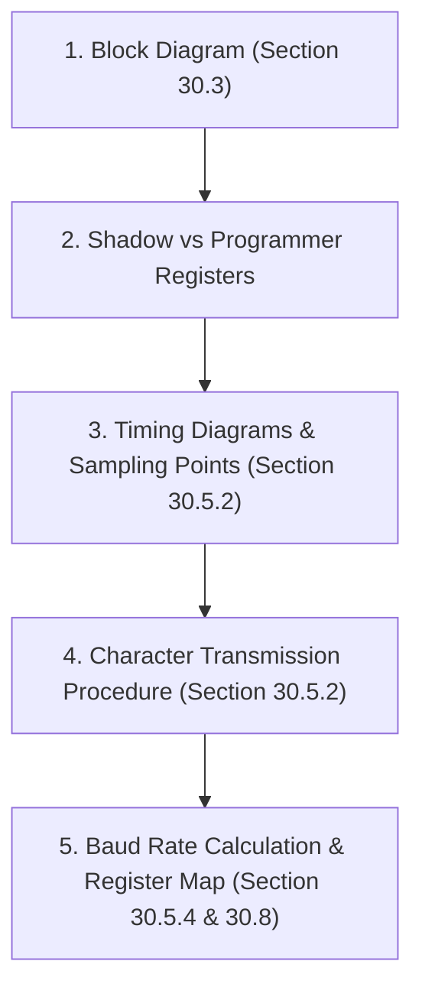

# 📘 [NGÀY 0] NỀN TẢNG CỐT LÕI BARE-METAL & CƠ CHẾ THANH GHI VI ĐIỀU KHIỂN

> **Mục tiêu tài liệu:** Cung cấp toàn bộ kiến thức nền tảng "từ số 0" về cách CPU ARM Cortex-M7 giao tiếp với phần cứng thông qua thanh ghi (Registers), giải mã cú pháp con trỏ struct C, từ khóa `volatile`, các phép toán bitwise an toàn, và phân tích cây xung nhịp (Clock Tree). 
>
> 🎯 **ĐẶC BIỆT:** Mỗi mục đều có **"Hướng dẫn Tra cứu Trực tiếp trong Reference Manual (RM0385) & Datasheet (DS10610)"** chỉ rõ: *Mở file nào $\rightarrow$ Bấm `Ctrl + F` từ khóa gì $\rightarrow$ Nhìn vào Hình vẽ (Figure) / Bảng biểu (Table) nào $\rightarrow$ Đọc ra bản chất phần cứng và chuyển thành code C.*

---

## 🛠️ RÀ SOÁT BỘ TỨ TÀI LIỆU BẮT BUỘC (MANDATORY DOCUMENTATION)

Để lập trình bare-metal chuẩn xác, bạn luôn mở song song 4 tài liệu sau của hãng ST:

| STT | Tài liệu | Mã hiệu STM32F746 | Nội dung chính | Khi nào tra cứu? |
| :---: | :--- | :---: | :--- | :--- |
| **1** | **Datasheet** | `DS10610` | Điện áp, dòng tiêu thụ, Pinout vật lý, Alternate Functions (AF), Tần số Bus tối đa (Max APB1=54MHz, APB2=108MHz, SYSCLK=216MHz). | Khi chọn chân GPIO, tra giới hạn tần số bus, xem bảng AF mapping. |
| **2** | **Reference Manual** | `RM0385` | Sơ đồ khối (Block Diagram), Nguyên lý hoạt động (Functional Description), Chuỗi khởi tạo (Sequence), Chi tiết bit thanh ghi (Register Map). | Khi viết driver, tra Base address, Offset, Bit mask, Reset value, Polling flag. |
| **3** | **Programming Manual** | `PM0253` | Lõi ARM Cortex-M7: Tập lệnh Assembly, NVIC (Ngắt), MPU, SysTick, Bộ nhớ đệm Cache (I-Cache / D-Cache). | Khi cấu hình ưu tiên ngắt NVIC, bật Cache, cấu hình vùng nhớ MPU. |
| **4** | **Errata Sheet** | `ES0290` | Lỗi phần cứng (Silicon Bug) từ nhà sản xuất & giải pháp né bug (Workaround). | Khi ngoại vi hoạt động sai khác tài liệu hoặc bị treo bất thường. |

---

## 🔍 CHI TIẾT TỪNG PHẦN: HƯỚNG DẪN TRA CỨU RM0385 & CƠ SỞ KỸ THUẬT

---

### 1. Memory-Mapped I/O: Tại Sao Ghi Địa Chỉ Lại Điều Khiển Được Phần Cứng?

#### 📖 Hướng dẫn Tra cứu Thực tế trong Reference Manual (RM0385)
1. **Mở file `RM0385.pdf`** $\rightarrow$ Nhấn **`Ctrl + F`** $\rightarrow$ Gõ từ khóa: **`Register boundary addresses`**
   - Bạn sẽ được đưa đến: **Chapter 2: Memory map and memory interface -> Section 2.2: Memory map** (Trang 86).
   - **Đọc `Table 1. STM32F75xxx and STM32F74xxx register boundary addresses`:**
     * Ngoại vi `GPIOA` có Base Address bắt đầu tại: **`0x4002 0000`** (nằm trên bus AHB1).
     * Ngoại vi `USART1` có Base Address bắt đầu tại: **`0x4001 1000`** (nằm trên bus APB2).
     * Ngoại vi `PWR` có Base Address bắt đầu tại: **`0x4000 7000`** (nằm trên bus APB1).
2. **Nhấn `Ctrl + F`** $\rightarrow$ Gõ từ khóa: **`Figure 23. Basic structure of a standard I/O port bit`**
   - Bạn sẽ được đưa đến: **Chapter 6: General-purpose I/Os (GPIO) -> Section 6.3: GPIO functional description** (Trang 187).
   - **Đọc Hình 23 (Figure 23) trong RM0385:** Bạn sẽ thấy rõ luồng kết nối dây điện phần cứng bên trong con chip:

```text
               BUS HỆ THỐNG AHB1 (CPU ghi ô nhớ 0x4002 0014)
                                     │
                                     ▼
        ┌─────────────────────────────────────────────────────────┐
        │ Thanh ghi Dữ liệu Xuất: GPIOx_ODR (Output Data Register)│
        └─────────────────────────────────────────────────────────┘
                                     │
                                     ▼
                      ┌─────────────────────────────┐
                      │ Output Driver Control Logic │
                      └─────────────────────────────┘
                                     │
                    ┌────────────────┴────────────────┐
                    │                                 │
                    ▼                                 ▼
             ┌──────────────┐                  ┌──────────────┐
             │ P-MOS Driver │ (Kéo lên 3.3V)   │ N-MOS Driver │ (Kéo xuống 0V)
             └──────────────┘                  └──────────────┘
                    │                                 │
                    └────────────────┬────────────────┘
                                     │
                                     ▼
                             Chân Vật Lý PA0 ──► Nối ra Đèn LED ngoài board!
```

3. **Nhấn `Ctrl + F`** $\rightarrow$ Gõ từ khóa: **`GPIO port output data register`**
   - Bạn sẽ được đưa đến: **Section 6.4.6: GPIOx_ODR** $\rightarrow$ Đọc dòng đầu tiên: **`Address offset: 0x14`**.
   - **Công thức tính địa chỉ tuyệt đối:**
     $$\text{Địa chỉ thanh ghi GPIOA\_ODR} = \text{Base GPIOA (0x4002 0000)} + \text{Offset (0x14)} = \mathbf{\text{0x4002 0014}}$$

#### 📐 Cơ sở Kỹ thuật & Bản chất Lập trình C
* Khi bạn viết lệnh C: `*(uint32_t *)0x40020014 = 0x0001;`:
  1. Lõi ARM Cortex-M7 phát tín hiệu ghi địa chỉ `0x4002 0014` lên Bus AHB1.
  2. Mạch giải mã địa chỉ (Bus Decoder) phát hiện địa chỉ này thuộc module GPIOA.
  3. Giá trị `1` được chốt (latch) vào Flip-Flop của bit 0 trong thanh ghi `ODR`.
  4. Mạch Output Driver mở transistor P-MOS $\rightarrow$ Chân PA0 xuất điện áp $3.3\text{V}$ $\rightarrow$ Đèn LED sáng!
* **Kết luận cốt lõi:** Thanh ghi phần cứng thực chất là **mạch chốt điện tử (Flip-Flops)** gắn liền với chân linh kiện. Đọc/ghi ô nhớ chính là đo/điều khiển mạch điện!

---

### 2. C Struct Mapping: Ép Kiểu Con Trỏ Ánh Xạ Chuẩn Xác Vào Thanh Ghi

#### 📖 Hướng dẫn Tra cứu Thực tế trong Reference Manual (RM0385)
1. **Mở file `RM0385.pdf`** $\rightarrow$ Nhấn **`Ctrl + F`** $\rightarrow$ Gõ từ khóa: **`RCC register map`**
   - Bạn sẽ nhảy đến: **Chapter 5: Reset and clock control (RCC) -> Section 5.3.23: RCC register map** (Trang 174).
   - **Đọc `Table 27. RCC register map and reset values`:**

| Tên Thanh ghi trong RM | Offset trong RM | Struct Field tương ứng trong C | Kích thước | Địa chỉ Thực tế (RCC_BASE = 0x4002 3800) |
| :--- | :---: | :--- | :---: | :---: |
| **`RCC_CR`** | `0x00` | `volatile uint32_t CR;` | 4 bytes | `0x4002 3800` |
| **`RCC_PLLCFGR`** | `0x04` | `volatile uint32_t PLLCFGR;` | 4 bytes | `0x4002 3804` |
| **`RCC_CFGR`** | `0x08` | `volatile uint32_t CFGR;` | 4 bytes | `0x4002 3808` |
| **`RCC_CIR`** | `0x0C` | `volatile uint32_t CIR;` | 4 bytes | `0x4002 380C` |
| **`RCC_AHB1RSTR`** | `0x10` | `volatile uint32_t AHB1RSTR;` | 4 bytes | `0x4002 3810` |
| **`RCC_AHB2RSTR`** | `0x14` | `volatile uint32_t AHB2RSTR;` | 4 bytes | `0x4002 3814` |
| **`RCC_AHB3RSTR`** | `0x18` | `volatile uint32_t AHB3RSTR;` | 4 bytes | `0x4002 3818` |
| *Ô nhớ trống phần cứng* | `0x1C` | `uint32_t RESERVED0;` | 4 bytes | `0x4002 381C` (**BẮT BUỘC ĐỆM ĐỂ KHÔNG LỆCH OFFSET**) |
| **`RCC_APB1RSTR`** | `0x20` | `volatile uint32_t APB1RSTR;` | 4 bytes | `0x4002 3820` |

#### 📐 Cơ sở Kỹ thuật & Cú pháp Ép Kiểu Struct C
1. **Tại sao struct C lại khớp chính xác từng byte phần cứng?**
   - Trong chuẩn C (C99), các trường kiểu `uint32_t` được cấp phát tuần tự trong RAM, mỗi trường chiếm đúng $4\text{ bytes} = 32\text{ bits}$.
   - Khoảng cách từ đầu struct tới trường thứ `N` chính là **Address Offset**!
2. **Hiểm họa quên đệm `RESERVED`:**
   - Nếu bạn nhìn vào bảng RM thấy tại offset `0x1C` không có thanh ghi nào mà bạn **quên khai báo** `uint32_t RESERVED0;` trong struct:
   - Trường `APB1RSTR` sẽ bị kéo lên offset `0x1C` $\rightarrow$ Khi code ghi `RCC->APB1RSTR = ...` sẽ bị **ghi đè vào ô nhớ rác**, và toàn bộ các thanh ghi phía sau đều bị lệch địa chỉ!
3. **Cú pháp định nghĩa Macro Bare-metal:**
   ```c
   typedef struct {
       volatile uint32_t CR;         // Offset 0x00
       volatile uint32_t PLLCFGR;    // Offset 0x04
       volatile uint32_t CFGR;       // Offset 0x08
       volatile uint32_t CIR;        // Offset 0x0C
       volatile uint32_t AHB1RSTR;   // Offset 0x10
       volatile uint32_t AHB2RSTR;   // Offset 0x14
       volatile uint32_t AHB3RSTR;   // Offset 0x18
       uint32_t RESERVED0;           // Offset 0x1C (Đệm phần cứng)
       volatile uint32_t APB1RSTR;   // Offset 0x20
   } RCC_TypeDef;

   #define RCC_BASE  (0x40023800UL)
   #define RCC       ((RCC_TypeDef *)RCC_BASE)

   // Khi gọi: RCC->CFGR = 0x1234;
   // Compiler tự động tính: 0x40023800 + 0x08 = 0x40023808 để phát lệnh STR ra bus!
   ```

---

### 3. Từ Khóa `volatile` & Cơ Chế Cờ Trạng Thái Phần Cứng

#### 📖 Hướng dẫn Tra cứu Thực tế trong Reference Manual (RM0385)
1. **Mở file `RM0385.pdf`** $\rightarrow$ Nhấn **`Ctrl + F`** $\rightarrow$ Gõ từ khóa: **`RCC clock control register`**
   - Bạn sẽ nhảy đến: **Section 5.3.1: RCC_CR** (Trang 151).
   - **Quan sát chi tiết 2 bit liền kề:**
     * **Bit 16 (`HSEON`):** Type: **`rw`** (Read/Write), Reset value: `0`. Ý nghĩa: Phần mềm ghi `1` để bật thạch anh ngoài HSE.
     * **Bit 17 (`HSERDY`):** Type: **`r`** (Read-only), Reset value: `0`. Ý nghĩa: **Phần cứng tự động bật `1`** sau vài mili-giây khi thạch anh ngoài đã dao động ổn định.

```text
 31 30 29 28 27 26 25     24     ...  17     16     ...  1  0
┌──┬──┬──┬──┬──┬──┬──────┬──────┬───┬──────┬──────┬───┬──┬──┐
│  Reserved       │PLLRDY│PLLON │   │HSERDY│HSEON │   │  │  │
└──┴──┴──┴──┴──┴──┴──────┴──────┴───┴──────┴──────┴───┴──┴──┘
                    r      rw         r      rw
```

#### 📐 Cơ sở Kỹ thuật & Bẫy Tối Ưu Hóa Trình Biên Dịch (Compiler Optimization)
1. **Nếu KHÔNG có `volatile`, chuyện gì sẽ xảy ra?**
   ```c
   // Giả sử thanh ghi không có volatile:
   uint32_t *cr_ptr = (uint32_t *)0x40023800;
   *cr_ptr |= (1 << 16); // Bật HSEON (Bit 16)
   
   // Chờ bit HSERDY (Bit 17) bật lên 1 bởi phần cứng:
   while (!(*cr_ptr & (1 << 17))) {
       // Thân vòng lặp rỗng
   }
   ```
   - **Tư duy của Trình biên dịch (GCC `-O2`/`-O3`):**
     * Compiler đọc `*cr_ptr` lần đầu: Bit 17 đang là `0` (vì thạch anh cần vài mili-giây mới ổn định).
     * Compiler nhìn vào bên trong thân `{ }`: Không có câu lệnh C nào sửa đổi `*cr_ptr`.
     * Compiler suy luận: *"Biến này ở trong RAM, trong vòng lặp không ai sửa nó, vậy giá trị của nó sẽ mãi mãi là 0!"*
     * Compiler tối ưu hóa mã máy thành: `while(1) {}` $\rightarrow$ **Chương trình bị treo vĩnh viễn (Infinite Loop Bug)!**
2. **Cách `volatile` cứu nguy:**
   - `volatile` ép Compiler **phải phát lệnh đọc trực tiếp (`LDR`) từ địa chỉ vật lý trên bus ở mọi chu kỳ lặp**, cấm tuyệt đối việc cache giá trị vào thanh ghi CPU core.
   - Do đó, mọi struct ánh xạ thanh ghi bắt buộc phải khai báo: `volatile uint32_t`.

---

### 4. Bậc Thầy Bitwise & Phân Biệt Quyền Truy Cập Thanh Ghi (Access Types)

#### 📖 Hướng dẫn Tra cứu Thực tế trong Reference Manual (RM0385)
1. **Mở file `RM0385.pdf`** $\rightarrow$ Nhấn **`Ctrl + F`** $\rightarrow$ Gõ từ khóa: **`List of abbreviations for registers`**
   - Bạn sẽ nhảy đến: **Section 1.1: List of abbreviations for registers** (Trang 48).
   - **Bảng quy ước quyền truy cập của ST:**

| Ký hiệu trong RM | Tên đầy đủ | Đặc tính phần cứng | Cú pháp C Chuẩn | Cấm Tuyệt Đối |
| :---: | :--- | :--- | :--- | :--- |
| **`rw` / `RW`** | Read / Write | Đọc và ghi tự do không giới hạn. | `REG \|= (1 << POS);`<br>`REG &= ~(1 << POS);` | Không có |
| **`r` / `ro` / `RO`**| Read Only | Chỉ đọc, phần cứng tự cập nhật trạng thái. | `if (REG & FLAG) {...}` | Không được ghi đè |
| **`rc_w1` / `w1c`** | Write 1 to Clear | Phần cứng bật 1 khi có sự kiện. Phần mềm ghi `1` để xóa cờ về `0`. | `REG = FLAG;` *(Ghi trực tiếp)* | **CẤM DÙNG `\|= `** |
| **`w` (ICR)** | Write-only Clear | Thanh ghi chuyên dụng xóa cờ ngắt. Ghi `1` để xóa cờ. | `USART1->ICR = MASK;` | **CẤM DÙNG `\|= `** |

2. **Tra cứu Thanh ghi Xóa Cờ Ngắt DMA / UART:**
   - `Ctrl + F` $\rightarrow$ Gõ `DMA low interrupt flag clear register` (Section 24.5.3 - `DMA_LIFCR`) hoặc `USART interrupt flag clear register` (Section 30.8.8 - `USART_ICR`).
   - Nhìn vào bảng thanh ghi: Tất cả các bit đều được chú thích là **`w` (Write-only to clear)**.

#### 📐 Cơ sở Kỹ thuật: 4 Thao Tác Bitwise Cốt Lõi
1. **Bật bit (Set Bit):** `REG |= (1U << POS);`
2. **Tắt bit (Clear Bit):** `REG &= ~(1U << POS);`
3. **Mẫu Clear-then-Set cho trường nhiều bit (Multi-bit RMW):**
   ```c
   // Cấu hình trường PLLM[5:0] chiếm 6 bits:
   #define PLLM_MASK   (0x3FU << 0)
   RCC->PLLCFGR &= ~PLLM_MASK;       // Bước 1: Xóa sạch 6 bits về 0
   RCC->PLLCFGR |=  (25U << 0);       // Bước 2: Gán giá trị mong muốn (25)
   ```
4. **QUY TẮC SỐNG CÒN: Tuyệt đối không dùng `|=` trên thanh ghi cờ ngắt W1C / ICR:**
   ```c
   // ❌ SAI LẦM TAI HẠI:
   DMA2->LIFCR |= DMA_LIFCR_CTCIF0; // Muốn xóa cờ truyền xong kênh 0
   ```
   - **Vì sao sai?** Khi viết `DMA2->LIFCR |= FLAG;`:
     * CPU đọc toàn bộ thanh ghi `DMA2->LIFCR`. Nếu lúc này kênh 1 đang có cờ báo lỗi truyền `TEIF1 = 1` hoặc `CTCIF1 = 1`...
     * Phép toán OR giữ nguyên các bit `1` đó và ghi ngược lại vào thanh ghi.
     * **Hậu quả:** Bạn đã vô tình **xóa sạch toàn bộ cờ ngắt và cờ báo lỗi của các kênh khác** trước khi hàm ngắt ISR kịp kiểm tra!
   - **Cách viết đúng (Gán trực tiếp bằng `=`):**
     ```c
     // ✅ ĐÚNG: Ghi trực tiếp giá trị bit cần xóa (Direct Assignment)
     DMA2->LIFCR = DMA_LIFCR_CTCIF0;         // Chỉ xóa đúng kênh 0
     USART1->ICR = USART_ICR_ORECF;          // Chỉ xóa đúng cờ Overrun Error UART
     ```

---

### 5. Phương Pháp Bóc Tách Cơ Chế Ngoại Vi Qua RM0385 (Hands-on USART)

#### 📖 Hướng dẫn Tra cứu Thực tế trong Reference Manual (RM0385)
Mở **RM0385 Chapter 30: Universal synchronous asynchronous receiver transmitter (USART)** (Trang 876) và thực hiện tuần tự 5 bước:



#### 🔍 1. Mở Sơ đồ khối: Nhấn `Ctrl + F` $\rightarrow$ `Figure 240. USART block diagram` (Section 30.3)
- Nhìn vào hình vẽ trong RM, bạn thấy rõ 2 tầng thanh ghi:
  * **`USART_TDR` (Programmer Register):** Nơi CPU ghi byte cần truyền.
  * **`Transmit Shift Register` (Shadow Register):** Mạch dịch từng bit đẩy ra chân TX.
  * **Cờ `TXE` (TDR Empty):** Bật lên `1` ngay khi byte từ `TDR` vừa chuyển sang `Shift Register`. CPU có thể nạp ngay byte tiếp theo vào `TDR` mà **không cần chờ** byte trước truyền xong ra ngoài dây TX (Truyền liên tục Zero-Gap).
  * **Cờ `TC` (Transmission Complete):** Chỉ bật lên `1` khi bit Stop cuối cùng đã hoàn toàn rời khỏi chân TX. Dùng khi muốn tắt UART hoặc đảo chiều chân DE/RE của chip RS-485.
  * **Khối nhận (Receiver):** Chân RX $\rightarrow$ `Receive Shift Register` $\rightarrow$ `USART_RDR` $\rightarrow$ Bật cờ `RXNE`. Nếu CPU không đọc `RDR` kịp mà byte tiếp theo tràn vào $\rightarrow$ Kích hoạt cờ lỗi **`ORE` (Overrun Error)**!

#### 🔍 2. Mở Sơ đồ thời gian: Nhấn `Ctrl + F` $\rightarrow$ `Figure 243. 8-bit data frame`
- RM mô tả dạng sóng chuẩn: Khung 8-N-1 gồm 1 Start bit (`0`), 8 Data bits (LSB $\rightarrow$ MSB), 1 Stop bit (`1`).
- **Lấy mẫu chống nhiễu ($16\times$ Oversampling):** Khối nhận lấy mẫu 3 lần tại chu kỳ xung thứ 8, 9, 10 ở tâm mỗi bit theo luật đa số thắng thiểu số (Majority Vote) để chống xung nhiễu điện từ.

#### 🔍 3. Mở Trình tự Khởi tạo: Nhấn `Ctrl + F` $\rightarrow$ `Character transmission procedure` (Section 30.5.2)
RM0385 quy định sẵn danh sách các bước bắt buộc phải tuân theo:
1. Cấp clock `RCC_APB2ENR` (bit `USART1EN`).
2. Cấu hình chân GPIO PA9 (TX), PA10 (RX) sang chế độ Alternate Function `AF7`.
3. Cấu hình `USART_CR1` (8 data bits, Parity disabled).
4. Cấu hình `USART_CR2` (1 Stop bit).
5. Tính toán và nạp giá trị baudrate vào `USART_BRR`.
6. Bật bit `TE` và `RE` trong `USART_CR1`.
7. Bật bit `UE = 1` để kích hoạt module.

#### 🔍 4. Mở Công thức Tính Baudrate: Nhấn `Ctrl + F` $\rightarrow$ `Section 30.5.4: USART baud rate generation`
- RM0385 cung cấp công thức:
  $$\text{USARTDIV} = \frac{f_{CK}}{\text{Baud Rate}}$$
- Ví dụ: USART1 chạy trên bus APB2 ($f_{CK} = 108\text{ MHz}$), cấu hình Baudrate $115200\text{ bps}$:
  $$\text{USARTDIV} = \frac{108,000,000}{115200} = 937.5$$
  $$\text{Phần nguyên} = 937 = \mathbf{\text{0x3A9}}, \quad \text{Phần thập phân} = 0.5 \times 16 = 8 = \mathbf{\text{0x8}} \implies \text{Ghi } \mathbf{\text{0x3A98}} \text{ vào } \texttt{USART1->BRR}!$$

---

### 6. Cây Xung Nhịp (Clock Tree) & Giới Hạn Tần Số Phần Cứng

#### 📖 Hướng dẫn Tra cứu Thực tế trong RM0385 & Datasheet DS10610
1. **Mở file `RM0385.pdf`** $\rightarrow$ Nhấn **`Ctrl + F`** $\rightarrow$ Gõ từ khóa: **`Figure 13. Clock tree`** (Section 5.2, Trang 118).
   - Bạn sẽ thấy sơ đồ phân phối clock tổng thể từ thạch anh ngoài HSE qua khối PLL chia nhánh vào các bus AHB, APB1, APB2.
2. **Mở file `DS10610.pdf` (Datasheet)** $\rightarrow$ Nhấn **`Ctrl + F`** $\rightarrow$ Gõ từ khóa: **`Table 17. General operating conditions`** (Trang 103).
   - **Bảng giới hạn tần số tối đa của từng Bus:**

| Tên Bus / Clock | Giới hạn Tối đa (DS10610) | Cấp nguồn cho các Khối / Ngoại vi | Prescaler cấu hình trong `RCC_CFGR` |
| :--- | :---: | :--- | :---: |
| **$f_{SYSCLK}$** | **$216\text{ MHz}$** | Lõi Cortex-M7 Core (khi bật Over-drive Mode) | `SW[1:0]` (Chọn nguồn PLL) |
| **$f_{HCLK}$ (AHB Bus)** | **$216\text{ MHz}$** | AXI Matrix, AHB1/2/3, Flash Interface, SRAM, DMA1/2 | `HPRE[3:0] = /1` |
| **$f_{PCLK1}$ (APB1 Bus)**| **$54\text{ MHz}$** | USART2/3, UART4/5/7/8, CAN1/2, I2C1..4, SPI2/3, PWR | `PPRE1[2:0] = /4` |
| **$f_{PCLK2}$ (APB2 Bus)**| **$108\text{ MHz}$**| USART1/6, SPI1/4/5/6, SDMMC1, TIM1/8/9/10/11 | `PPRE2[2:0] = /2` |
| **$f_{USB}$ (48MHz)** | **$48\text{ MHz}$** (Cố định)| USB OTG FS, SDMMC, True RNG | `PLLQ[3:0] = /9` |

```text
[Thạch anh ngoài HSE 25MHz] ──► [Bộ nhân Main PLL (/M -> *N -> /P)] ──► [SYSCLK 216MHz]
                                                                             │
                                              ┌──────────────────────────────┴──────────────────────────────┐
                                              ▼                                                             ▼
                                     [AHB Bus HCLK: 216MHz]                                       [USB / SDMMC: 48MHz]
                                              │                                                        (Qua PLLQ)
                                 ┌────────────┴────────────┐
                                 ▼                         ▼
                       [APB1 Bus: Max 54MHz]     [APB2 Bus: Max 108MHz]
                       (Bộ chia PPRE1 = /4)      (Bộ chia PPRE2 = /2)
```

---

### 7. Bài Tập Thực Hành: Tự Tay Tính Toán Bộ Số PLL 216MHz

#### 📖 Hướng dẫn Tra cứu Thực tế trong Reference Manual (RM0385)
1. **Mở file `RM0385.pdf`** $\rightarrow$ Nhấn **`Ctrl + F`** $\rightarrow$ Gõ từ khóa: **`RCC PLL configuration register`**
   - Bạn sẽ nhảy đến: **Section 5.3.2: RCC_PLLCFGR** (Trang 153).
   - **Đọc các khoảng giới hạn phần cứng quy định bởi nhà sản xuất:**
     * $1\text{ MHz} \le f_{VCO\_in} \le 2\text{ MHz}$ (Khuyến nghị chọn $1\text{ MHz}$ để ít nhiễu Jitter).
     * $100\text{ MHz} \le f_{VCO\_out} \le 432\text{ MHz}$.
     * $PLLP \in \{2, 4, 6, 8\}$ (Mã bit: `00`=/2, `01`=/4, `10`=/6, `11`=/8).

#### 📐 Các Bước Tính Toán Chi Tiết (Cho Board Discovery HSE = 25MHz)
1. **Bước 1: Tính `PLLM`:**
   $$f_{VCO\_in} = \frac{f_{HSE}}{PLLM} = \frac{25\text{ MHz}}{PLLM} = 1\text{ MHz} \implies \mathbf{PLLM = 25}$$
2. **Bước 2: Tính `PLLN` và `PLLP`:**
   $$f_{SYSCLK} = \frac{f_{VCO\_out}}{PLLP} = \frac{1\text{ MHz} \times PLLN}{PLLP} = 216\text{ MHz}$$
   Chọn $PLLP = 2$ (mã `00`b) để tần số cao nhất $\implies 1\text{ MHz} \times PLLN = 216 \times 2 = 432\text{ MHz} \implies \mathbf{PLLN = 432}$.
3. **Bước 3: Tính `PLLQ` (USB 48MHz):**
   $$f_{USB} = \frac{f_{VCO\_out}}{PLLQ} = \frac{432\text{ MHz}}{PLLQ} = 48\text{ MHz} \implies \mathbf{PLLQ = \frac{432}{48} = 9}$$

🎉 **Kết luận bộ số cấu hình:** `PLLM = 25, PLLN = 432, PLLP = 2, PLLQ = 9, HPRE = /1, PPRE1 = /4, PPRE2 = /2`.

---

## 8. TỔNG KẾT VÀ BƯỚC TIẾP THEO

Bạn đã nắm vững toàn bộ nền tảng cốt lõi và kỹ năng tra cứu:
1. **Memory-Mapped I/O:** Hiểu cách CPU điều khiển transistor phần cứng qua địa chỉ ô nhớ (Tra Table 1 & Figure 23 trong RM).
2. **Struct Mapping & Alignment:** Cách ánh xạ struct C vào bảng thanh ghi RM không bị lệch offset (Tra Table 27 trong RM).
3. **Từ khóa `volatile`:** Chống lỗi compiler optimize vòng lặp kiểm tra cờ phần cứng (`HSERDY`).
4. **Quy tắc Bitwise & Quyền truy cập:** Nắm chắc Clear-Set RMW và tránh bẫy `|=` trên cờ W1C/ICR (Tra Section 1.1 trong RM).
5. **Kỹ năng Đọc RM0385 & DS10610:** Bóc tách trọn vẹn 5 khối phần cứng từ sơ đồ khối đến timing và handshake (Thực hành Chapter 30 USART).
6. **Cây Xung Nhịp (Clock Tree):** Nắm vững giới hạn bus và công thức tính toán bộ số PLL 216MHz (Tra Figure 13 RM & Table 17 DS).

👉 **Bắt đầu thực hành driver đầu tiên:** Mở ngay tài liệu chuẩn hóa [**`day01_learning_guide.md`**](file:///d:/Project/STM32F7/docs/day01_learning_guide.md) để xem chi tiết mã nguồn driver cấu hình xung nhịp 216MHz Over-Drive, quản lý Flash Wait States và chẩn đoán cờ Reset `RCC_CSR`!
