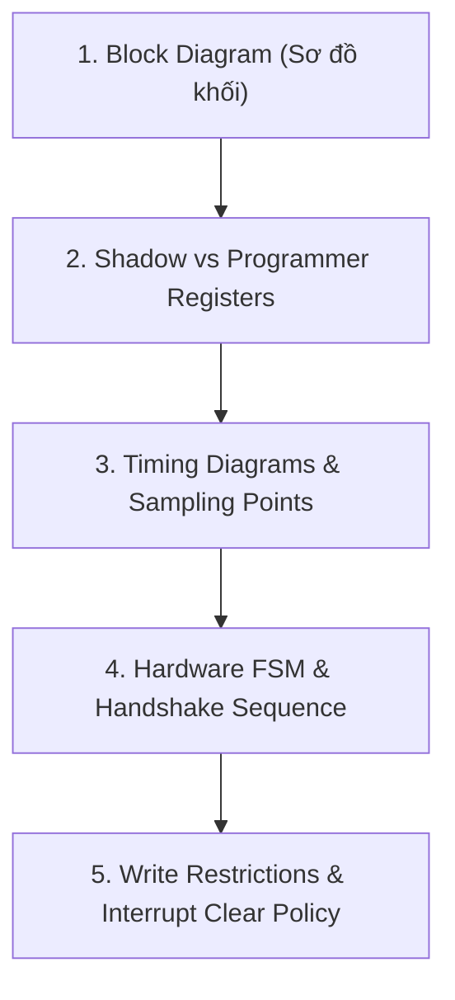

# 📘 [NGÀY 0] NỀN TẢNG CỐT LÕI BARE-METAL & CƠ CHẾ THANH GHI VI ĐIỀU KHIỂN.

> **Mục tiêu tài liệu:** Cung cấp toàn bộ kiến thức nền tảng "từ số 0" về cách CPU ARM Cortex-M7 giao tiếp với phần cứng thông qua thanh ghi (Registers), giải mã cú pháp con trỏ struct C, từ khóa `volatile`, các phép toán bitwise an toàn, phương pháp đọc Reference Manual (RM0385) và phân tích cây xung nhịp (Clock Tree). Bố cục tài liệu được tổ chức theo chuẩn **Song song Tra cứu - Bảng Thanh ghi - Cơ sở Kỹ thuật** giống Ngày 1 để bạn vừa đọc vừa tra cứu dễ dàng.

---

## 🛠️ RÀ SOÁT BỘ TỨ TÀI LIỆU BẮT BUỘC (MANDATORY DOCUMENTATION)

Để lập trình bare-metal chuẩn xác, bạn luôn làm việc với 4 tài liệu sau của hãng ST:

| STT | Tài liệu | Mã hiệu STM32F746 | Nội dung chính | Khi nào tra cứu? |
| :---: | :--- | :---: | :--- | :--- |
| **1** | **Datasheet** | `DS10610` | Điện áp, dòng tiêu thụ, Pinout vật lý, Alternate Functions (AF), Tần số Bus tối đa (Max APB1=54MHz, APB2=108MHz, SYSCLK=216MHz). | Khi chọn chân GPIO, tra giới hạn tần số bus, xem bảng AF mapping. |
| **2** | **Reference Manual** | `RM0385` | Sơ đồ khối (Block Diagram), Nguyên lý hoạt động (Functional Description), Chuỗi khởi tạo (Sequence), Chi tiết bit thanh ghi (Register Map). | Khi viết driver, tra Base address, Offset, Bit mask, Reset value, Polling flag. |
| **3** | **Programming Manual** | `PM0253` | Lõi ARM Cortex-M7: Tập lệnh Assembly, NVIC (Ngắt), MPU, SysTick, Bộ nhớ đệm Cache (I-Cache / D-Cache). | Khi cấu hình ưu tiên ngắt NVIC, bật Cache, cấu hình vùng nhớ MPU. |
| **4** | **Errata Sheet** | `ES0290` | Lỗi phần cứng (Silicon Bug) từ nhà sản xuất & giải pháp né bug (Workaround). | Khi ngoại vi hoạt động sai khác tài liệu hoặc bị treo bất thường. |

---

## 🔍 CHI TIẾT CÁC KHỐI KIẾN THỨC BARE-METAL & CƠ SỞ TRA CỨU RM/DS

---

### 1. Memory-Mapped I/O & Bản Đồ Không Gian Địa Chỉ
* **Tài liệu tra cứu:** Reference Manual **RM0385** -> *Chapter 2: Memory map and memory interface -> Section 2.2: Memory map and register boundary addresses* (Trang 86).
* **Từ khóa (`Ctrl + F`):** `Register boundary addresses` hoặc `Memory map`.
* **Công thức địa chỉ:** `Absolute Address = Peripheral Base Address + Register Offset`

#### 🗺️ Bảng Phân Vùng Không Gian Bộ Nhớ 4GB Cortex-M7
| Vùng Bộ Nhớ | Dải Địa Chỉ | Bus Giao Tiếp | Chức năng & Ngoại vi kết nối |
| :--- | :---: | :---: | :--- |
| **System Control / NVIC** | `0xE000 0000 - 0xFFFF FFFF` | PPB (Private Periph Bus) | NVIC (Ngắt), SysTick, MPU, Core Debug |
| **External Memory (FMC)**| `0x6000 0000 - 0xDFFF FFFF` | AHB3 Bus | SDRAM, NOR/NAND Flash ngoài |
| **AHB2 / AHB3 Peripherals**| `0x5000 0000 - 0x5FFF FFFF` | AHB2 / AHB3 | USB OTG FS/HS, Camera DCMI, Crypto |
| **AHB1 Peripherals** | `0x4002 0000 - 0x4007 FFFF` | AHB1 Bus | RCC, GPIOA..K, DMA1, DMA2, Flash Interface |
| **APB2 Peripherals** | `0x4001 0000 - 0x4001 7FFF` | APB2 Bus (Max 108MHz) | USART1/6, SPI1/4/5/6, SDMMC1, TIM1/8/9/10/11 |
| **APB1 Peripherals** | `0x4000 0000 - 0x4000 7FFF` | APB1 Bus (Max 54MHz) | USART2/3, UART4/5/7/8, CAN1/2, I2C1..4, SPI2/3, PWR |
| **Internal SRAM** | `0x2000 0000 - 0x2004 FFFF` | AXI / AHB Matrix | RAM bộ nhớ trong (SRAM1, SRAM2, DTCM/ITCM) |
| **Internal Flash** | `0x0800 0000 - 0x081F FFFF` | ITCM / AXI Matrix | Bộ nhớ Flash chứa mã code thực thi |

#### 📐 Cơ sở Kỹ thuật & Bản chất Phần cứng
1. **Khái niệm Unified Address Space:** Kiến trúc ARM Cortex-M không dùng tập lệnh `IN`/`OUT` riêng cho cổng I/O như x86. Mọi thanh ghi điều khiển của GPIO, UART, Timer đều được ánh xạ thành các ô nhớ 32-bit (4 bytes) thông thường trong không gian địa chỉ $2^{32} = 4\text{ GB}$.
2. **Cơ chế truyền động phần cứng (Transistor Output Driver):**
   ```text
   Lệnh C: *(uint32_t *)0x40020014 = 0x0001; (Ghi vào GPIOA->ODR)
      │
      ▼ CPU phát địa chỉ 0x40020014 lên AHB1 Bus Matrix
   [Bus Decoder nhận diện ngoại vi GPIOA]
      │
      ▼ Dữ liệu 0x0001 chốt vào Flip-Flop bit 0 của thanh ghi ODR
   [Mạch đệm Output Driver kích hoạt Transistor]
      │
      ▼
   Chân vật lý PA0 được kéo lên 3.3V ──► Đèn LED sáng!
   ```
   > **Kết luận:** Thanh ghi thực chất là mạch chốt điện tử (Flip-Flops) nằm trong ngoại vi. Ghi ô nhớ chính là điều khiển mạch điện!

---

### 2. C Struct Mapping & Cơ Chế Tính Offset Thanh Ghi
* **Tài liệu tra cứu:** Reference Manual **RM0385** -> *Chapter 5: Reset and clock control (RCC) -> Section 5.3: RCC register map* (Trang 174) & *Chapter 6: GPIO -> Section 6.4: GPIO register map*.
* **Từ khóa (`Ctrl + F`):** `<Tên_Ngoại_Vi> register map` (ví dụ: `RCC register map`).

#### Bảng Đối Chiếu 1-1 giữa Reference Manual và C Struct
| Tên Thanh ghi trong RM | Offset trong RM | Struct Field trong C | Kích thước | Địa chỉ Tuyệt đối (RCC_BASE = 0x4002 3800) |
| :--- | :---: | :--- | :---: | :---: |
| **`RCC_CR`** | `0x00` | `volatile uint32_t CR;` | 4 bytes | `0x4002 3800` |
| **`RCC_PLLCFGR`** | `0x04` | `volatile uint32_t PLLCFGR;` | 4 bytes | `0x4002 3804` |
| **`RCC_CFGR`** | `0x08` | `volatile uint32_t CFGR;` | 4 bytes | `0x4002 3808` |
| **`RCC_CIR`** | `0x0C` | `volatile uint32_t CIR;` | 4 bytes | `0x4002 380C` |
| **`RCC_AHB1RSTR`** | `0x10` | `volatile uint32_t AHB1RSTR;` | 4 bytes | `0x4002 3810` |
| *Vùng trống phần cứng* | `0x1C` | `uint32_t RESERVED0;` | 4 bytes | `0x4002 381C` (**BẮT BUỘC ĐỆM ĐỂ KHÔNG LỆCH OFFSET**) |
| **`RCC_APB1RSTR`** | `0x20` | `volatile uint32_t APB1RSTR;` | 4 bytes | `0x4002 3820` |

#### 📐 Cơ sở Kỹ thuật & Cú pháp Ép Kiểu Con Trỏ
1. **Quy tắc bộ nhớ trong Struct C:** Trong chuẩn C, các thành viên `uint32_t` trong struct luôn được cấp phát tuần tự và cách nhau đúng 4 bytes ($32\text{ bits}$).
2. **Công thức Compiler tính toán địa chỉ:**
   $$\text{Địa chỉ mục tiêu} = \text{Base Address} + \text{Offset của trường trong Struct}$$
3. **Định nghĩa Macro chuẩn Bare-metal:**
   ```c
   #define RCC_BASE        (0x40023800UL)
   #define RCC             ((RCC_TypeDef *)RCC_BASE)
   
   // Khi gọi: RCC->CFGR = 0x1234;
   // Compiler tự động tính: 0x40023800 + 0x08 = 0x40023808 để phát lệnh STR ra bus!
   ```

---

### 3. Từ Khóa `volatile` & Cơ Chế Cờ Trạng Thái Phần Cứng
* **Tài liệu tra cứu:** Reference Manual **RM0385** -> *Chapter 5: RCC -> Section 5.3.1: RCC clock control register (RCC_CR)*.
* **Từ khóa (`Ctrl + F`):** `RCC_CR` hoặc `HSERDY`.

#### Bảng Thanh ghi `RCC_CR` (Minh họa Bit Polling)
| Thanh ghi | Offset | Reset Value | Bit | Tên Bit | Access | Ý nghĩa Phần cứng |
| :--- | :---: | :---: | :---: | :--- | :---: | :--- |
| **`RCC_CR`** | `0x00` | `0x0000 0083` | 16 | `HSEON` | `RW` | Phần mềm ghi `1` để kích hoạt thạch anh ngoài. |
| | | | 17 | `HSERDY` | `RO` | **Phần cứng tự động bật `1`** sau vài mili-giây khi dao động ổn định. |

#### 📐 Cơ sở Kỹ thuật & Lỗi Tối Ưu Hóa Trình Biên Dịch (Compiler Bug)
1. **Hiểm họa khi KHÔNG dùng `volatile`:**
   ```c
   uint32_t *cr_ptr = (uint32_t *)0x40023800;
   *cr_ptr |= (1 << 16); // Bật HSEON
   
   while (!(*cr_ptr & (1 << 17))) {
       // Compiler thấy trong thân vòng lặp không có lệnh sửa *cr_ptr
       // Compiler tối ưu hóa: Copy *cr_ptr vào thanh ghi CPU R0 một lần duy nhất
       // Kết quả: Vòng lặp kiểm tra R0 liên tục -> TREO VĨNH VIỄN (Infinite Loop)!
   }
   ```
2. **Vai trò của `volatile`:** Ép Compiler phải phát lệnh đọc trực tiếp (`LDR`) từ địa chỉ bộ nhớ trên Bus thật ở **mọi lần lặp**, cấm tuyệt đối tối ưu hóa lưu biến vào thanh ghi CPU nội.
3. **Khai báo chuẩn:**
   ```c
   typedef struct {
       volatile uint32_t CR; // Bắt buộc volatile cho mọi thanh ghi ngoại vi!
       ...
   } RCC_TypeDef;
   ```

---

### 4. Bậc Thầy Bitwise & Phân Biệt Quyền Truy Cập Thanh Ghi (Access Types)
* **Tài liệu tra cứu:** Reference Manual **RM0385** -> *Section 1.1: List of abbreviations for registers* (Trang 48), *Chapter 30: USART -> Section 30.8.8: USART_ICR*, *Chapter 24: DMA -> Section 24.5.3: DMA_LIFCR*.
* **Từ khóa (`Ctrl + F`):** `List of abbreviations for registers`, `USART_ICR`, `DMA_LIFCR`.

#### Bảng Phân Biệt 4 Kiểu Truy Cập Thanh Ghi (Access Types)
| Ký hiệu trong RM | Tên đầy đủ | Đặc tính phần cứng | Cú pháp C Chuẩn | Cấm Tuyệt Đối |
| :---: | :--- | :--- | :--- | :--- |
| **`rw` / `RW`** | Read / Write | Đọc và ghi tự do không giới hạn. | `REG \|= (1 << POS);`<br>`REG &= ~(1 << POS);` | Không có |
| **`ro` / `RO`** | Read Only | Chỉ đọc, phần cứng cập nhật trạng thái. | `if (REG & FLAG) {...}` | Không được ghi đè |
| **`rc_w1` / `w1c`**| Write 1 to Clear | Phần cứng bật 1 khi có sự kiện. Phần mềm ghi `1` để xóa cờ về `0`. | `REG = FLAG;` *(Ghi trực tiếp)* | **CẤM DÙNG `\|= `** |
| **`w` (ICR)** | Write-only Clear | Thanh ghi chuyên dụng để xóa cờ ngắt. Ghi `1` để xóa. | `USART1->ICR = MASK;` | **CẤM DÙNG `\|= `** |

#### 📐 Cơ sở Kỹ thuật: 4 Thao Tác Bitwise Cốt Lõi
1. **Bật bit (Set Bit):** `REG |= (1U << POS);`
2. **Tắt bit (Clear Bit):** `REG &= ~(1U << POS);`
3. **Mẫu Clear-then-Set cho trường nhiều bit (Multi-bit RMW):**
   ```c
   // Cấu hình trường PLLM[5:0] chiếm 6 bits:
   #define PLLM_MASK   (0x3FU << 0)
   RCC->PLLCFGR &= ~PLLM_MASK;       // Bước 1: Xóa sạch 6 bits về 0
   RCC->PLLCFGR |=  (25U << 0);       // Bước 2: Gán giá trị mong muốn (25)
   ```
4. **QUY TẮC SỐNG CÒN: Không bao giờ dùng `|=` trên thanh ghi cờ W1C / ICR:**
   ```c
   // ❌ SAI: DMA2->LIFCR |= DMA_LIFCR_CTCIF0;
   // CPU đọc toàn bộ cờ đang có (kể cả cờ lỗi của kênh khác) rồi ghi ngược lại -> XÓA NHẦM CỜ LỖI!
   
   // ✅ ĐÚNG: Ghi trực tiếp giá trị cần xóa
   DMA2->LIFCR = DMA_LIFCR_CTCIF0;   // Chỉ xóa cờ kênh 0
   USART1->ICR = USART_ICR_ORECF;    // Chỉ xóa cờ Overrun UART
   ```

---

### 5. Phương Pháp Bóc Tách Cơ Chế Hoạt Động Ngoại Vi trong RM0385 (Functional Description Deep-Dive)
* **Tài liệu tra cứu:** Reference Manual **RM0385** -> *Chapter 30: Universal synchronous asynchronous receiver transmitter (USART)* (Trang 876).
* **Từ khóa (`Ctrl + F`):** `USART block diagram`, `Character transmission procedure`, `Baud rate generation`.

#### 5 Khối Phần Cứng Cốt Lõi Cần Bóc Tách trong Mọi Ngoại Vi:



#### 🏛️ 1. Khối Thanh ghi Bóng vs Thanh ghi Lập trình (Shadow vs Programmer Registers)
* **Khối truyền (Transmitter):**
  - `USART_TDR` (Programmer Register): Nơi CPU ghi byte cần truyền.
  - `Transmit Shift Register` (Shadow Register): Mạch dịch từng bit đẩy ra chân TX.
  - **Cờ `TXE` (TDR Empty):** Bật lên `1` ngay khi byte từ `TDR` chuyển sang `Shift Register`. CPU có thể nạp ngay byte tiếp theo vào `TDR` mà **không cần chờ** byte trước truyền xong ra dây TX (Zero Gap Transmission).
  - **Cờ `TC` (Transmission Complete):** Chỉ bật lên `1` khi bit Stop cuối cùng đã rời khỏi chân TX. Dùng khi muốn tắt UART hoặc đảo chiều chip RS-485.
* **Khối nhận (Receiver):**
  - Chân RX $\rightarrow$ `Receive Shift Register` $\rightarrow$ `USART_RDR` $\rightarrow$ Bật cờ `RXNE`.
  - Nếu CPU không đọc `RDR` kịp mà byte tiếp theo tràn vào $\rightarrow$ Kích hoạt cờ lỗi **`ORE` (Overrun Error)**!

#### ⏱️ 2. Sơ đồ Thời gian (Timing Diagrams)
* RM mô tả dạng sóng chuẩn: Khung 8-N-1 gồm 1 Start bit (`0`), 8 Data bits (LSB $\rightarrow$ MSB), 1 Stop bit (`1`).
* **Lấy mẫu chống nhiễu ($16\times$ Oversampling):** Khối nhận lấy mẫu 3 lần tại chu kỳ xung thứ 8, 9, 10 ở tâm mỗi bit theo luật đa số thắng thiểu số (Majority Vote).

#### 🔄 3. Máy Trạng thái Phần cứng & Chuỗi Khởi tạo Bắt buộc (Sequence)
* RM0385 quy định 7 bước khởi tạo USART tuần tự:
  1. Cấp clock `RCC_APB2ENR` (bit `USART1EN`).
  2. Cấu hình chân GPIO PA9 (TX), PA10 (RX) sang chế độ Alternate Function `AF7`.
  3. Cấu hình `USART_CR1` (8 data bits, Parity disabled).
  4. Cấu hình `USART_CR2` (1 Stop bit).
  5. Tính toán và nạp giá trị vào `USART_BRR`.
  6. Bật bit `TE` và `RE` trong `USART_CR1`.
  7. Bật bit `UE = 1` để kích hoạt module.

#### 🚫 4. Ràng buộc Ghi Phần cứng (Hardware Write Restrictions)
* **Lưu ý in nghiêng trong RM:** *"This bit can be written only when the peripheral is disabled (UE = 0 / PLLON = 0 / INRQ = 1)"*.
* Nếu cố tình ghi vào thanh ghi khi module đang bật, mạch logic phần cứng sẽ khóa và bỏ qua lệnh ghi!

#### 🔢 5. Công thức Tính Baudrate (USARTDIV)
* Tần số bus APB2 $f_{CK} = 108\text{ MHz}$, Baudrate $115200\text{ bps}$:
  $$\text{USARTDIV} = \frac{f_{CK}}{\text{Baud Rate}} = \frac{108,000,000}{115200} = 937.5$$
  $$\text{Phần nguyên} = 937 = \mathbf{\text{0x3A9}}, \quad \text{Phần thập phân} = 0.5 \times 16 = 8 = \mathbf{\text{0x8}} \implies \text{Ghi } \mathbf{\text{0x3A98}} \text{ vào } \texttt{USART1->BRR}!$$

---

### 6. Cây Xung Nhịp (Clock Tree) & Giới Hạn Tần Số Phần Cứng
* **Tài liệu tra cứu:**
  * Reference Manual **RM0385** -> *Chapter 5: Reset and clock control (RCC) -> Section 5.2: Clocks* (Trang 118).
  * Datasheet **DS10610** -> *Chapter 5: Electrical characteristics -> Table 17: General operating conditions* (Trang 103).
* **Từ khóa (`Ctrl + F`):** `Clock tree`, `General operating conditions`.

#### Bảng Giới Hạn Tần Số Tối Đa của Từng Bus (Datasheet DS10610)
| Tên Bus / Clock | Giới hạn Tối đa | Cấp nguồn cho các Khối / Ngoại vi | Prescaler cấu hình trong `RCC_CFGR` |
| :--- | :---: | :--- | :---: |
| **$f_{SYSCLK}$** | **$216\text{ MHz}$** | Lõi Cortex-M7 Core (khi bật Over-drive Mode) | `SW[1:0]` (Chọn nguồn PLL) |
| **$f_{HCLK}$ (AHB Bus)** | **$216\text{ MHz}$** | AXI Matrix, AHB1/2/3, Flash Interface, SRAM, DMA1/2 | `HPRE[3:0] = /1` |
| **$f_{PCLK1}$ (APB1 Bus)**| **$54\text{ MHz}$** | USART2/3, UART4/5/7/8, CAN1/2, I2C1..4, SPI2/3, PWR | `PPRE1[2:0] = /4` |
| **$f_{PCLK2}$ (APB2 Bus)**| **$108\text{ MHz}$**| USART1/6, SPI1/4/5/6, SDMMC1, TIM1/8/9/10/11 | `PPRE2[2:0] = /2` |
| **$f_{USB}$ (48MHz)** | **$48\text{ MHz}$** (Cố định)| USB OTG FS, SDMMC, True RNG | `PLLQ[3:0] = /9` |

```text
[Thạch anh ngoài HSE 25MHz] ──► [Bộ nhân Main PLL (/M -> *N -> /P)] ──► [SYSCLK 216MHz]
                                                                             │
                                              ┌──────────────────────────────┴──────────────────────────────┐
                                              ▼                                                             ▼
                                     [AHB Bus HCLK: 216MHz]                                       [USB / SDMMC: 48MHz]
                                              │                                                        (Qua PLLQ)
                                 ┌────────────┴────────────┐
                                 ▼                         ▼
                       [APB1 Bus: Max 54MHz]     [APB2 Bus: Max 108MHz]
                       (Bộ chia PPRE1 = /4)      (Bộ chia PPRE2 = /2)
```

---

### 7. Bài Tập Thực Hành: Tự Tay Tính Toán Bộ Số PLL 216MHz
* **Tài liệu tra cứu:** RM0385 -> *Section 5.3.2: RCC PLL configuration register (RCC_PLLCFGR)*.
* **Từ khóa (`Ctrl + F`):** `Main PLL configuration register` hoặc `PLLM`.

#### Bảng Tham Số Khối Main PLL
| Tham số | Giới hạn Phần cứng RM0385 | Công thức tính toán | Giá trị cấu hình cho STM32F746 (HSE 25MHz) |
| :--- | :---: | :---: | :---: |
| **`PLLM`** | $1\text{ MHz} \le f_{VCO\_in} \le 2\text{ MHz}$ | $f_{VCO\_in} = \frac{f_{HSE}}{PLLM} = \frac{25}{25}$ | $\mathbf{PLLM = 25}$ |
| **`PLLN`** | $100\text{ MHz} \le f_{VCO\_out} \le 432\text{ MHz}$ | $f_{VCO\_out} = f_{VCO\_in} \times PLLN = 1 \times 432$ | $\mathbf{PLLN = 432}$ |
| **`PLLP`** | $f_{SYSCLK} \le 216\text{ MHz}$ | $f_{SYSCLK} = \frac{f_{VCO\_out}}{PLLP} = \frac{432}{2}$ | $\mathbf{PLLP = 2\ (\text{bitfield } \texttt{00}b)}$ |
| **`PLLQ`** | $f_{USB} = 48\text{ MHz}$ (Chuẩn USB) | $f_{USB} = \frac{f_{VCO\_out}}{PLLQ} = \frac{432}{9}$ | $\mathbf{PLLQ = 9}$ |

---

## 8. TỔNG KẾT VÀ BƯỚC TIẾP THEO

Bạn đã nắm vững toàn bộ nền tảng cốt lõi:
1. **Memory-Mapped I/O:** Hiểu cách CPU điều khiển transistor phần cứng qua địa chỉ ô nhớ.
2. **Struct Mapping & Alignment:** Cách ánh xạ struct C vào bảng thanh ghi RM không bị lệch offset.
3. **Từ khóa `volatile`:** Chống lỗi compiler optimize vòng lặp kiểm tra cờ phần cứng.
4. **Quy tắc Bitwise & Quyền truy cập:** Nắm chắc Clear-Set RMW và tránh bẫy `|=` trên cờ W1C/ICR.
5. **Kỹ năng Đọc RM0385 & DS10610:** Bóc tách trọn vẹn 5 khối phần cứng từ sơ đồ khối đến timing và handshake.
6. **Cây Xung Nhịp (Clock Tree):** Nắm vững giới hạn bus và công thức tính toán bộ số PLL 216MHz.

👉 **Bắt đầu thực hành driver đầu tiên:** Mở ngay file [**`day01_system_clock_reset.md`**](file:///d:/Project/STM32F7/docs/day01_system_clock_reset.md) để xem chi tiết mã nguồn driver cấu hình xung nhịp 216MHz Over-Drive và chẩn đoán cờ Reset!
