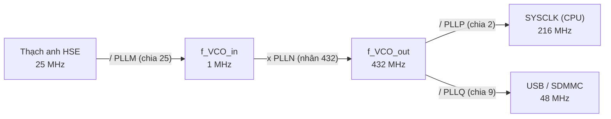
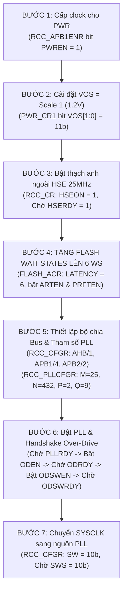

# 🏆 [NGÀY 1] CẨM NANG TOÀN DIỆN BARE-METAL: CLOCK, RESET & BỘ NHỚ
## Lộ trình 4 Bước: Khái Niệm ➔ Thực Chiến ➔ Gõ Code ➔ Phỏng Vấn

> **Mục tiêu:** Giúp bạn làm chủ từ gốc rễ vật lý, tra cứu datasheet, tự tay gõ từng dòng code thanh ghi đến tự tin trả lời mọi câu hỏi phỏng vấn cho **Ngày 1 (Xung nhịp 216MHz Over-drive, Reset Logging & Quản lý Bộ nhớ)**.  
> **Nguyên tắc sư phạm:** **Cung cấp cơ chế, gợi ý tư duy, bảng trade-off và khung sườn code — KHÔNG đưa code hoàn chỉnh ăn sẵn để bạn tự tay làm chủ.**

---

```text
┌─────────────────────────────────────────────────────────────────────────────────────────────────┐
│                           LỘ TRÌNH 4 BƯỚC CHINH PHỤC NGÀY 1                                     │
├───────────────────┬───────────────────┬────────────────────────────┬────────────────────────────┤
│ BƯỚC 1: KHÁI NIỆM │ BƯỚC 2: THỰC CHIẾN│ BƯỚC 3: GÕ CODE            │ BƯỚC 4: PHỎNG VẤN          │
│ • Nhịp tim CPU    │ • Tra cứu RM0385  │ • Thuật toán 7 bước        │ • Bộ 5 câu hỏi vặn bộ nhớ  │
│ • Hộp số PLL      │ • Bảng Trade-offs │ • Khung Pseudocode TODO    │ • Thách thức Flash Latency │
│ • Vận động viên   │ • 3 Câu thần chú  │ • Mổ xẻ 5 Bug phần cứng    │ • Kịch bản trả lời 60s     │
│ • Hộp đen Reset   │   Bare-metal      │ • Checklist nghiệm thu     │   (Elevator Pitch)         │
│ • Bản đồ RAM      │                   │                            │                            │
└───────────────────┴───────────────────┴────────────────────────────┴────────────────────────────┘
```

---

# 🌟 BƯỚC 1: KHÁI NIỆM (CONCEPTS & MENTAL MODELS)
*Hiểu bản chất vật lý bằng các hình ảnh trực quan đời thực trước khi đụng vào thanh ghi.*

### 1.1. Xung nhịp (Clock) là gì? Tại sao Vi điều khiển cần Clock?
* **Ẩn dụ:** Xung nhịp chính là **"Nhịp tim"** của vi điều khiển.
* **Bản chất:** Vi điều khiển là một mạng lưới gồm hàng triệu cổng logic (transistor). Các cổng này không tự biết lúc nào cần chuyển trạng thái. Cứ mỗi lần xung điện dao động từ mức thấp ($0V$) lên mức cao ($3.3V$) rồi hạ xuống (1 chu kỳ clock), CPU mới thực hiện được một bước công việc: **Nạp lệnh (Fetch) $\rightarrow$ Giải mã (Decode) $\rightarrow$ Thực thi (Execute)**.
* **Tần số:**
  * Tim đập $16\text{MHz}$ = 16 triệu nhịp/giây $\rightarrow$ CPU xử lý việc tà tà, tiết kiệm điện.
  * Tim đập $216\text{MHz}$ = 216 triệu nhịp/giây $\rightarrow$ CPU xử lý khối lượng tính toán khổng lồ trong chớp mắt.

---

### 1.2. HSI vs HSE: "Đồng hồ cót giá rẻ" vs "Đồng hồ thạch anh chính xác"
STM32F7 có 2 nguồn phát nhịp tim chính:

```text
┌──────────────────────────────────────────┬──────────────────────────────────────────┐
│        HSI (High-Speed Internal)         │        HSE (High-Speed External)         │
├──────────────────────────────────────────┼──────────────────────────────────────────┤
│ • Mạch dao động RC tích hợp sẵn trong ruột│ • Cục thạch anh kim loại vật lý hàn rời  │
│   silicon của chip.                      │   trên bo mạch (25MHz).                  │
│ • Ưu điểm: Bật nguồn là chạy ngay,       │ • Nhược điểm: Mất vài mili-giây để dao   │
│   không tốn linh kiện ngoài.             │   động cơ học ổn định (chờ cờ HSERDY).   │
│ • Nhược điểm: Sai số lớn (±1% đến ±2%)   │ • Ưu điểm: Cực kỳ chính xác, sai số chỉ  │
│   do nhiệt độ nóng/lạnh.                 │   phần triệu (20 ppm = 0.002%).          │
│ ❌ CẤM DÙNG CHO CAN BUS & USB            │ ✅ BẮT BUỘC CHO CAN BUS & AUTOMOTIVE     │
│   (Lệch xung gây lỗi Bit Stuffing/CRC).  │   (Đảm bảo truyền nhận dữ liệu chuẩn xác)│
└──────────────────────────────────────────┴──────────────────────────────────────────┘
```
> 💡 Khi vừa cắm nguồn, MCU luôn chạy bằng **HSI 16MHz** để đảm bảo luôn boot được. Việc đầu tiên của firmware là chuyển sang thạch anh ngoài **HSE 25MHz**.

---

### 1.3. Bộ nhân PLL: Ẩn dụ "Hộp số xe máy nhiều tầng"
Thạch anh trên mạch chỉ rung được **$25\text{MHz}$**. Làm sao biến thành **$216\text{MHz}$**? Không có cục thạch anh cơ học nào rung được $216\text{MHz}$ mà bền cả. Bộ **Main PLL** đóng vai trò như một **hộp số líp tầng**:



* **Bộ chia $PLLM = 25$ (Về số thấp an toàn):** Lấy $25\text{MHz} / 25 = \mathbf{1\text{MHz}}$. Bộ lọc so pha của PLL hoạt động êm nhất, ít rung giật pha (Jitter) nhất ở tần số 1MHz.
* **Bộ nhân $PLLN = 432$ (Ép ga cực đại):** Lấy $1\text{MHz} \times 432 = \mathbf{432\text{MHz}}$. Đây là giới hạn vật lý tối đa của bộ dao động nội VCO trong chip.
* **Bộ chia $PLLP = 2$ (Dẫn động bánh xe CPU):** Lấy $432\text{MHz} / 2 = \mathbf{216\text{MHz}}$ (cấp cho nhân CPU chạy kịch trần).
* **Bộ chia $PLLQ = 9$ (Trích công suất cho cổng phụ):** Lấy $432\text{MHz} / 9 = \mathbf{48\text{MHz}}$ (chuẩn bắt buộc của USB Full-Speed).

---

### 1.4. Flash Wait States: Ẩn dụ "Vận động viên & Bà thủ thư già"
* **CPU Cortex-M7** giống như một **Vận động viên chạy nước rút** ($216\text{MHz} \implies 1\text{ chu kỳ chỉ tốn } 4.63\text{ns}$).
* **Bộ nhớ Flash** (nơi lưu file hex code) giống như một **Bà thủ thư già phát sách** (tốc độ đọc tối đa khoảng $30\text{MHz}$, mất $30\text{ns}$ mới tìm xong 1 lệnh).
* **Tai nạn nếu không cấu hình:** Vận động viên chạy tới mà thủ thư chưa kịp đưa trang sách ra $\rightarrow$ Vận động viên vấp ngã đập đầu vào tường $\rightarrow$ CPU kích hoạt lỗi **`HardFault`** và chết đứng!
* **Giải pháp:** Bắt vận động viên phải **"Đứng đợi" (Wait States)**:
  $$\text{Số nhịp chờ} = \frac{30\text{ns} \text{ (thời gian Flash)}}{4.63\text{ns} \text{ (chu kỳ CPU)}} \approx 6.48 \implies \mathbf{6\text{ Wait States (7 CPU cycles)}}$$
* 👉 **Quy tắc vàng:** **Luôn tăng thời gian chờ Flash (LATENCY = 6 WS) TRƯỚC KHI tăng xung nhịp CPU!**

---

### 1.5. Chế độ Over-Drive: Ẩn dụ "Van phun xăng tăng áp"
* Ở tần số thông thường ($\le 180\text{MHz}$), mức điện áp lõi tiêu chuẩn $1.2\text{V}$ (Scale 1) là đủ.
* Nhưng khi ép lên **$216\text{MHz}$**, transistor phải đóng ngắt **216 triệu lần/giây**. Ở tốc độ này, lực đẩy của điện áp $1.2\text{V}$ không đủ sức làm các hạt electron di chuyển kịp thời gian lan truyền (propagation delay), gây trôi pha dữ liệu và sập nguồn nội bộ.
* **Over-drive Mode** là công tắc phần cứng: Bơm thêm điện áp cao hơn vào lõi Cortex-M7 để các cổng logic lật trạng thái dứt khoát ở tần số 216MHz.

---

### 1.6. Hệ thống Giao thông Bus (AHB, APB1, APB2)
* **Đường cao tốc Bắc - Nam (AHB Bus):** Nối CPU, RAM, DMA $\rightarrow$ Chịu được max **$216\text{MHz}$** (chọn bộ chia `/1`).
* **Đường vành đai tốc độ cao (APB2 Bus):** Nối ngoại vi nhanh như SPI1, USART1 $\rightarrow$ Chịu được max **$108\text{MHz}$** (bắt buộc chia tối thiểu `/2` $\implies 216/2 = 108\text{MHz}$).
* **Đường nội đô tốc độ thấp (APB1 Bus):** Nối ngoại vi như CAN1/2, UART4/5, Timer $\rightarrow$ Chịu được max **$54\text{MHz}$** (bắt buộc chia tối thiểu `/4` $\implies 216/4 = 54\text{MHz}$). Nếu chia nhầm thành `/2` ($108\text{MHz}$), mạng CAN và UART sẽ chạy sai hoàn toàn!

---

### 1.7. Hộp đen Reset Reason (`RCC_CSR`)
Mỗi khi vi điều khiển thức dậy, việc đầu tiên là mở **"Hộp đen" (`RCC_CSR`)** ra xem lần tắt máy trước là do đâu:
* `PORRSTF`: Cắm nguồn điện lần đầu (Power-on Reset).
* `PINRSTF`: Ai đó vừa bấm nút Reset cứng B1 trên mạch.
* `SFTRSTF`: Lệnh phần mềm tự khởi động lại (`NVIC_SystemReset()`).
* `IWDGRSTF`: Code bị treo nên Watchdog đã can thiệp cưỡng chế reset.
* ⚠️ **Bí kíp:** Các cờ này **không tự mất đi**. Bạn phải ghi `1` vào bit **`RMVF`** để xóa sạch hộp đen cho lần ghi nhận tiếp theo.

---

### 1.8. Bản đồ RAM, Stack & Heap chuẩn Fresher
Toàn bộ RAM 512KB trên STM32F7 được tổ chức như sau:

```text
Địa chỉ CAO   ▲ 0x2005 0000 ──┬───────────────────────────────────────────┐
              │               │  STACK (Ngăn xếp - LIFO)                  │
              │               │  Lưu biến cục bộ, gọi hàm, ngắt ISR      │
              │               │  ▼ Tụt lùi dần xuống địa chỉ thấp         │
              │               ├ - - - - - - - - - - - - - - - - - - - - - ┤
              │               │  [VÙNG NGUY HIỂM: Ranh giới va chạm]      │
              │               │  <- Nơi xảy ra STACK OVERFLOW!            │
              │               ├ - - - - - - - - - - - - - - - - - - - - - ┤
              │               │  ▲ Nở dần lên địa chỉ cao                 │
              │               │  HEAP (Bộ nhớ cấp phát động malloc/free)  │
              │               ├───────────────────────────────────────────┤
              │               │  .bss (Biến toàn cục/static CHƯA init = 0)│
              │               ├───────────────────────────────────────────┤
              │               │  .data (Biến toàn cục/static ĐÃ init != 0)│
Địa chỉ THẤP  ▼ 0x2000 0000 ──┴───────────────────────────────────────────┘
```
* **Stack Overflow:** Con trỏ `SP` tụt lùi quá sâu đè hỏng dữ liệu `.bss/.data` $\implies$ Phòng tránh: **Tuyệt đối không dùng đệ quy, không khai báo mảng lớn cục bộ trong hàm**.
* **Tại sao kiêng kỵ `malloc` trong vi điều khiển?** Vì gây **phân mảnh bộ nhớ (Heap Fragmentation)**, rò rỉ bộ nhớ (Memory Leak) và phá vỡ tính thời gian thực (Non-deterministic). Giải pháp: **Ưu tiên 100% Cấp phát Tĩnh (Static Allocation)**.

---

# 🛠️ BƯỚC 2: THỰC CHIẾN (HARDWARE SPECS & TRA CỨU RM0385)
*Cách tra cứu tài liệu của hãng ST và cơ sở ra quyết định kỹ thuật.*

### 2.1. Bản đồ Tra cứu Reference Manual (RM0385 & DS10610)
Mở file PDF `RM0385` và tra cứu 5 khu vực trọng yếu:

1. **Base Address Ngoại vi:** *Chapter 2: Memory map $\rightarrow$ Table 1*.
   * `PWR_BASE = 0x4000 7000UL` (Bus APB1).
   * `RCC_BASE = 0x4002 3800UL` (Bus AHB1).
   * `FLASH_R_BASE = 0x4002 3C00UL` (Bus AHB1).
2. **Clock Tree:** *Chapter 5: RCC $\rightarrow$ Section 5.2 $\rightarrow$ Figure 12: Clock tree*.
3. **Over-Drive Handshake:** *Chapter 6: PWR $\rightarrow$ Section 6.1.4*. Từ khóa: `Over-drive mode`.
   * Trình tự: Bật `ODEN` $\rightarrow$ Chờ `ODRDY=1` $\rightarrow$ Bật `ODSWEN` $\rightarrow$ Chờ `ODSWRDY=1`.
4. **Flash Wait States:** *Chapter 3: Embedded Flash $\rightarrow$ Table 5*. Từ khóa: `LATENCY`.
   * Cột $3.3\text{V}$, dòng $180 < HCLK \le 216\text{ MHz}$ $\implies$ **6 Wait States** (`LATENCY[3:0] = 0110b`).
5. **Reset Reason:** *Chapter 5: RCC $\rightarrow$ Section 5.3.23 (`RCC_CSR`)*. Từ khóa: `RMVF`.

---

### 2.2. Bảng Trade-offs: "Tại sao chọn cái này thay vì cái khác dù là mặc định?"

```text
┌────────────────────┬─────────────────────────────┬─────────────────────────────────────────────┐
│ Quyết định chọn    │ Cái bị từ chối              │ Lý do kỹ thuật & Hậu quả nếu chọn sai        │
├────────────────────┼─────────────────────────────┼─────────────────────────────────────────────┤
│ 1. HSE (25MHz)     │ HSI (16MHz RC)              │ HSI sai số ±1-2% làm hỏng Baudrate CAN/USB. │
│    Thạch anh ngoài │ Dao động nội có sẵn         │ HSE thạch anh sai số 20 ppm -> Chuẩn Auto.  │
├────────────────────┼─────────────────────────────┼─────────────────────────────────────────────┤
│ 2. PLLM = 25       │ PLLM = 13                   │ Đều ra 1-2MHz, nhưng ST khuyến nghị đúng    │
│    (f_vco_in=1MHz) │ (f_vco_in ≈ 1.92MHz)        │ 1MHz để giảm thiểu tối đa Phase Jitter.     │
├────────────────────┼─────────────────────────────┼─────────────────────────────────────────────┤
│ 3. PLLN = 432      │ PLLN = 864                  │ Giới hạn phần cứng VCO: max 432MHz.         │
│    PLLP = 2        │ PLLP = 4                    │ Chọn N=864 -> VCO=864MHz -> VƯỢT TRẦN SILICON│
│    (SYSCLK=216MHz) │ (SYSCLK=216MHz)             │ GẤP 2 LẦN, PLL MẤT KHÓA VÀ TREO CHIP!       │
├────────────────────┼─────────────────────────────┼─────────────────────────────────────────────┤
│ 4. VOS = Scale 1   │ VOS = Scale 2 / Scale 3     │ Scale 2 max 180MHz, Scale 3 max 144MHz.     │
│    + Over-Drive    │ hoặc Scale 1 thường         │ Chỉ có Scale 1 + Over-drive mới đủ điện áp  │
│                    │                             │ cho transistor chuyển mạch ở 216MHz.        │
├────────────────────┼─────────────────────────────┼─────────────────────────────────────────────┤
│ 5. APB1 div 4      │ APB1 div 2                  │ Giới hạn cứng APB1 là 54MHz.                │
│    (PCLK1=54MHz)   │ (PCLK1=108MHz)              │ Chọn div 2: 216/2=108MHz > 54MHz -> Cháy bus│
│                    │ hoặc APB1 div 8 (27MHz)     │ Chọn div 8: Bị chậm một nửa hiệu năng CAN.  │
├────────────────────┼─────────────────────────────┼─────────────────────────────────────────────┤
│ 6. Flash 6 WS      │ Flash 0 WS                  │ Flash ở 3.3V cần 30ns để đọc. Chu kỳ 216MHz │
│    + ART + Prefetch│ hoặc Flash 8 WS             │ là 4.6ns -> Cần đúng 6 WS (7 chu kỳ).       │
│                    │                             │ Bật ART để CPU đạt hiệu năng 0 WS tương đương│
├────────────────────┼─────────────────────────────┼─────────────────────────────────────────────┤
│ 7. Snapshot RCC_CSR│ Check trực tiếp thanh ghi   │ Cờ Reset là RO, xóa bằng bit RMVF.          │
│    rồi mới clear   │ if (RCC->CSR & FLAG)        │ Check trực tiếp rồi clear giữa chừng sẽ làm │
│                    │                             │ mất sạch cờ của các module khác!            │
└────────────────────┴─────────────────────────────┴─────────────────────────────────────────────┘
```

---

### 2.3. 3 Câu thần chú Bare-metal bắt buộc thuộc lòng
1. **"Muốn đụng ngoại vi nào, phải bật Clock ngoại vi đó trước":**  
   Muốn chỉnh thanh ghi `PWR`, phải bật bit `PWREN` trong `RCC->APB1ENR`.
2. **"Sửa trường nhiều bit luôn dùng Clear-then-Set":**  
   ```c
   REG &= ~(MASK);   // 1. Xóa sạch bit cũ về 0
   REG |=  (VALUE);  // 2. Gán giá trị mong muốn vào
   ```
3. **"Con trỏ thanh ghi phần cứng bắt buộc phải có `volatile`":**  
   Để trình biên dịch không tối ưu xóa bỏ các vòng lặp chờ cờ phần cứng.

---

# 💻 BƯỚC 3: GÕ CODE (IMPLEMENTATION & BUG SCENARIOS)
*Quy trình 7 bước, khung Pseudocode và chẩn đoán lỗi phần cứng.*

### 3.1. Sơ đồ Luồng Thuật toán 7 Bước chuẩn Phần cứng



---

### 3.2. Khung Pseudocode Skeleton (Tự tay điền vào `system_clock.c`)

Mở file [`system_clock.c`](file:///d:/Project/STM32F7/drivers/src/system_clock.c) và tự tay hoàn thiện các khối `TODO`:

```c
#include "stm32f746xx_registers.h"
#include "system_clock.h"

void SystemClock_Config_216MHz(void)
{
    /* BƯỚC 1: Cấp xung nhịp cho PWR (RCC->APB1ENR bit PWREN) */
    // TODO: RCC->APB1ENR |= RCC_APB1ENR_PWREN;

    /* BƯỚC 2: Chọn Scale 1 mode (PWR->CR1 trường VOS[1:0] = 11b) */
    // TODO: PWR->CR1 &= ~PWR_CR1_VOS_Msk;
    // TODO: PWR->CR1 |= PWR_CR1_VOS_SCALE1;

    /* BƯỚC 3: Bật thạch anh ngoài HSE 25MHz (RCC->CR bit HSEON, chờ HSERDY) */
    // TODO: RCC->CR |= RCC_CR_HSEON;
    // TODO: while (!(RCC->CR & RCC_CR_HSERDY));

    /* BƯỚC 4: TĂNG FLASH LATENCY LÊN 6 WS (FLASH->ACR: LATENCY=6, PRFTEN, ARTEN) */
    // TODO: FLASH->ACR &= ~FLASH_ACR_LATENCY_Msk;
    // TODO: FLASH->ACR |= (FLASH_ACR_LATENCY_6WS | FLASH_ACR_PRFTEN | FLASH_ACR_ARTEN);

    /* BƯỚC 5: Cấu hình bộ chia Bus (RCC->CFGR) & Tham số PLL (RCC->PLLCFGR)
     * AHB div 1, APB1 div 4, APB2 div 2. M=25, N=432, P=00b (/2), Q=9, PLLSRC=HSE */
    // TODO: RCC->CFGR &= ~(RCC_CFGR_HPRE_Msk | RCC_CFGR_PPRE1_Msk | RCC_CFGR_PPRE2_Msk);
    // TODO: RCC->CFGR |= (RCC_CFGR_HPRE_DIV1 | RCC_CFGR_PPRE1_DIV4 | RCC_CFGR_PPRE2_DIV2);
    // TODO: RCC->PLLCFGR = ... (Điền M, N, P, Q và PLLSRC)

    /* BƯỚC 6: Bật PLL & Handshake Over-Drive */
    // TODO: RCC->CR |= RCC_CR_PLLON;
    // TODO: while (!(RCC->CR & RCC_CR_PLLRDY));
    // TODO: PWR->CR1 |= PWR_CR1_ODEN;
    // TODO: while (!(PWR->CSR1 & PWR_CSR1_ODRDY));
    // TODO: PWR->CR1 |= PWR_CR1_ODSWEN;
    // TODO: while (!(PWR->CSR1 & PWR_CSR1_ODSWRDY));

    /* BƯỚC 7: Chuyển SYSCLK sang nguồn PLL (RCC->CFGR bit SW = 10b, chờ SWS) */
    // TODO: RCC->CFGR &= ~RCC_CFGR_SW_Msk;
    // TODO: RCC->CFGR |= RCC_CFGR_SW_PLL;
    // TODO: while ((RCC->CFGR & RCC_CFGR_SWS_Msk) != RCC_CFGR_SWS_PLL);
}
```

---

### 3.3. Khung Code Đọc & Xóa Lý do Reset (`RCC_CSR`)

```c
typedef enum {
    RESET_CAUSE_UNKNOWN = 0,
    RESET_CAUSE_LOW_POWER,
    RESET_CAUSE_WINDOW_WATCHDOG,
    RESET_CAUSE_INDEPENDENT_WATCHDOG,
    RESET_CAUSE_SOFTWARE,
    RESET_CAUSE_POWER_ON,
    RESET_CAUSE_EXTERNAL_PIN
} ResetReason_t;

ResetReason_t System_GetAndClearResetReason(void)
{
    ResetReason_t reason = RESET_CAUSE_UNKNOWN;

    /* 1. Chụp snapshot bất biến */
    uint32_t csr_snapshot = RCC->CSR;

    /* 2. Giải mã theo thứ tự ưu tiên */
    if (csr_snapshot & RCC_CSR_LPWRRSTF)       reason = RESET_CAUSE_LOW_POWER;
    else if (csr_snapshot & RCC_CSR_WWDGRSTF)  reason = RESET_CAUSE_WINDOW_WATCHDOG;
    else if (csr_snapshot & RCC_CSR_IWDGRSTF)  reason = RESET_CAUSE_INDEPENDENT_WATCHDOG;
    else if (csr_snapshot & RCC_CSR_SFTRSTF)   reason = RESET_CAUSE_SOFTWARE;
    else if (csr_snapshot & RCC_CSR_PORRSTF)   reason = RESET_CAUSE_POWER_ON;
    else if (csr_snapshot & RCC_CSR_PINRSTF)   reason = RESET_CAUSE_EXTERNAL_PIN;

    /* 3. Xóa cờ ngay lập tức bằng bit RMVF */
    RCC->CSR |= RCC_CSR_RMVF;

    return reason;
}
```

---

### 3.4. Mổ xẻ 5 Tình huống Bug Phần Cứng Kinh Điển

1. 💥 **Bug 1: HardFault ngay tại lệnh chuyển xung `SW = PLL`**
   * *Nguyên nhân:* Tăng xung nhịp CPU lên 216MHz trước khi tăng Flash Wait States lên 6 WS. Flash chưa kịp trả dữ liệu $\rightarrow$ CPU đọc phải lệnh rác $\rightarrow$ Kích hoạt `HardFault`.
2. 💥 **Bug 2: Treo cứng ở vòng lặp chờ Over-Drive (`ODRDY`)**
   * *Nguyên nhân:* Quên cấp clock cho khối `PWR` (`RCC->APB1ENR |= RCC_APB1ENR_PWREN;`). Khối PWR chưa có điện thì bit `ODEN` không bao giờ được ghi.
3. 💥 **Bug 3: Tự động Reset khi chạy tác vụ nặng**
   * *Nguyên nhân:* Chạy 216MHz nhưng quên bật Over-drive. Mức áp 1.2V không đủ duy trì biên độ tín hiệu ở tốc độ cao $\rightarrow$ Sụt áp nội bộ gây reset.
4. 💥 **Bug 4: Lý do Reset luôn luôn báo sai ở các lần sau**
   * *Nguyên nhân:* Không set bit `RMVF` sau khi đọc. Cờ `PORRSTF` cũ vẫn còn nguyên, làm lần reset sau bị dính cả cờ mới lẫn cờ cũ.
5. 💥 **Bug 5: Treo chip khi thạch anh ngoài hỏng (Thiếu Timeout)**
   * *Nguyên nhân:* Dùng `while (!(RCC->CR & RCC_CR_HSERDY));` trần trụi. Cần bọc trong bộ đếm `timeout` để nếu thạch anh đứt chân thì tự động chạy HSI dự phòng.

---

### 3.5. Bảng Checklist Nghiệm thu Code (Tự kiểm tra)
- [ ] Các trường nhiều bit đã dùng `&= ~MASK` trước khi `|= VALUE` chưa?
- [ ] Dòng cấu hình `FLASH->ACR` có nằm **TRƯỚC** dòng chuyển `SW = PLL` không?
- [ ] Dòng `RCC->APB1ENR |= RCC_APB1ENR_PWREN` có nằm ở đầu hàm không?
- [ ] Đã có đủ 2 vòng lặp chờ `ODRDY` và `ODSWRDY` chưa?
- [ ] Bus APB1 có được chia $/4$ ($\le 54\text{MHz}$) và APB2 chia $/2$ ($\le 108\text{MHz}$) không?
- [ ] Đã snapshot `RCC->CSR` rồi mới gọi lệnh xóa cờ `RMVF` chưa?

---

# 🎤 BƯỚC 4: PHỎNG VẤN (INTERVIEW DEEP-DIVE & ELEVATOR PITCH)
*Luyện tập trả lời miệng tự tin, gãy gọn trước nhà tuyển dụng.*

### 4.1. Bộ 5 Câu hỏi "Hỏi xoáy đáp xoay" về Bộ nhớ

#### ❓ Q1: *"Nếu trong hàm em khai báo `int a[1000];` thì có sao không?"*
* **Trả lời:** Mảng `a` nằm trên **Stack** và ngốn ngay lập tức **4000 bytes (~4KB)**. Nếu Linker Script chỉ cấp 1-2KB cho Stack, dòng này gây ra **Stack Overflow ngay lập tức** làm sập CPU. Em sẽ thêm từ khóa `static` để chuyển nó sang vùng `.bss`, hoặc khai báo ra biến toàn cục.

#### ❓ Q2: *"Biến `const int x = 10;` và `static int y = 20;` nằm ở đâu?"*
* **Trả lời:** 
  * `const int x = 10;` $\rightarrow$ Nằm ở vùng **`.rodata` (Flash)**, không tốn một byte RAM nào.
  * `static int y = 20;` $\rightarrow$ Nằm ở vùng **`.data` (RAM)** (được nạp từ Flash sang RAM khi boot).

#### ❓ Q3: *"Biến toàn cục chưa khởi tạo (`int g_a;`) và khởi tạo bằng 0 (`int g_b = 0;`) nằm ở đâu?"*
* **Trả lời:** Cả hai đều nằm ở vùng **`.bss` (RAM)**. Mã khởi động `Reset_Handler` sẽ chạy một vòng lặp xóa toàn bộ vùng này về `0` trước khi gọi hàm `main()`.

#### ❓ Q4: *"Làm sao em biết sau khi build, code tốn bao nhiêu Flash và bao nhiêu RAM?"*
* **Trả lời:** Em đọc kích thước bộ nhớ do trình biên dịch tính toán:
  $$\text{Flash} = \text{.text (code)} + \text{.rodata (hằng số)} + \text{.data}$$
  $$\text{RAM} = \text{.data} + \text{.bss} + \text{Stack} + \text{Heap}$$
  Hoặc mở file **`.map`** để xem chi tiết từng hàm và từng biến chiếm bao nhiêu byte.

#### ❓ Q5: *"Stack Overflow và Buffer Overflow khác nhau như thế nào?"*
* **Trả lời:**
  * **Stack Overflow:** Con trỏ `SP` tụt lùi vượt quá ranh giới vùng nhớ Stack (do gọi hàm lồng sâu hoặc biến cục bộ quá to).
  * **Buffer Overflow:** Ghi dữ liệu vượt quá kích thước của một mảng cụ thể (ví dụ mảng 10 phần tử nhưng dùng `strcpy` ghi 20 byte, làm đè hỏng biến nằm kế bên).

---

### 4.2. Kịch bản Trả lời Phỏng vấn 60 Giây (Elevator Pitch cho Ngày 1)

Khi nhà tuyển dụng hỏi: *"Em hãy tóm tắt cách em cấu hình Clock và quản lý bộ nhớ ở Ngày 1?"*, hãy trả lời dõng dạc:

> *"Dạ, ở Ngày 1, mục tiêu của em là nâng hiệu năng hệ thống lên kịch trần 216MHz và thiết lập an toàn bộ nhớ:
> 
> 1. **Về Xung nhịp:** Em chuyển từ dao động nội HSI sang thạch anh ngoài HSE 25MHz để đảm bảo độ chính xác cho CAN bus. Qua bộ nhân Main PLL ($M=25, N=432, P=2$), em đưa xung hệ thống lên 216MHz.
> 2. **Về An toàn phần cứng:** Em bắt buộc tăng độ trễ **Flash lên 6 Wait States trước khi tăng xung** để tránh lỗi HardFault, đồng thời kích hoạt **Over-Drive Mode** để điện áp lõi đủ sức đáp ứng tần số 216MHz. Bus APB1 được em chia 4 để không vượt quá trần 54MHz.
> 3. **Về Hộp đen:** Em chụp snapshot thanh ghi `RCC->CSR` để xác định nguyên nhân reset cứng (do nguồn, nút bấm hay watchdog) và clear cờ ngay sau đó bằng bit `RMVF`.
> 4. **Về Bộ nhớ:** Em áp dụng nguyên tắc **Zero-Heap**, ưu tiên cấp phát tĩnh toàn bộ buffer để tránh phân mảnh RAM, đồng thời kiểm soát Stack không dùng đệ quy để chống tràn Stack Overflow."*
