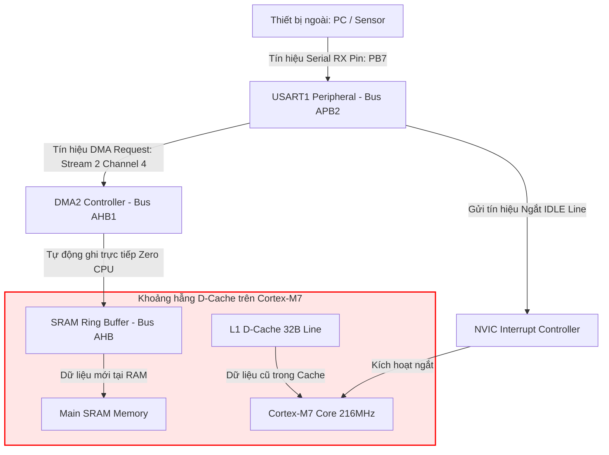

# 🏆 [NGÀY 2] CẨM NANG TOÀN DIỆN BARE-METAL: UART RX DMA RING BUFFER, IDLE LINE INTERRUPT & D-CACHE COHERENCY
## Lộ trình 4 Bước: Khái Niệm ➔ Thực Chiến ➔ Gõ Code ➔ Phỏng Vấn

> **Mục tiêu:** Giúp bạn làm chủ từ gốc rễ vật lý, tra cứu datasheet, tính toán Baudrate, cấu hình DMA2 Circular Stream 2 / Channel 4, xử lý ngắt IDLE Line, đồng bộ D-Cache trên Cortex-M7 đến tự tin trả lời mọi câu hỏi phỏng vấn cho **Ngày 2 (UART RX DMA Ring Buffer & IDLE Interrupt)**.  
> **Nguyên tắc sư phạm:** **Cung cấp cơ chế, gợi ý tư duy, sơ đồ trực quan, bảng trade-off và khung sườn code — KHÔNG đưa code hoàn chỉnh ăn sẵn để bạn tự tay làm chủ.**

---

```text
┌─────────────────────────────────────────────────────────────────────────────────────────────────┐
│                           LỘ TRÌNH 4 BƯỚC CHINH PHỤC NGÀY 2                                     │
├───────────────────┬───────────────────┬────────────────────────────┬────────────────────────────┤
│ BƯỚC 1: KHÁI NIỆM │ BƯỚC 2: THỰC CHIẾN│ BƯỚC 3: GÕ CODE            │ BƯỚC 4: PHỎNG VẤN          │
│ • Thùng thư & Bưu │ • Tra cứu RM0385  │ • Cấu hình GPIO AF7        │ • Bộ 5 câu hỏi vặn D-Cache │
│   tá (Analogy)    │ • Công thức       │ • Cấu hình USART1 & BRR    │ • Hiểm họa Overrun (ORE)   │
│ • Bộ ba hoàn hảo  │   Baudrate        │ • Cấu hình DMA2 Circular   │ • Chứng minh 0% CPU Load   │
│   (DMA+IDLE+Ring) │ • Bảng W1C        │ • Khung Pseudocode TODO    │ • Kịch bản trả lời 60s     │
│ • L1 D-Cache Gap  │   (Write1ToClear) │ • Mổ xẻ 5 Bug phần cứng    │   (Elevator Pitch)         │
└───────────────────┴───────────────────┴────────────────────────────┴────────────────────────────┘
```

> 💡 **Tài liệu tiên quyết:** 
> - Read [**`📘 [NGÀY 0] Nền tảng Cốt lõi Bare-metal & Cơ chế Thanh ghi`**](file:///d:/Project/STM32F7/docs/day00_baremetal_foundations.md) để nắm vững Bitwise RMW, struct pointer mapping, từ khóa `volatile`, và phương pháp tra cứu Reference Manual.
> - Read [**`📗 [NGÀY 1] Cấu hình 216MHz Over-drive Clock & Reset Logging`**](file:///d:/Project/STM32F7/docs/day01_system_clock_reset.md) để hiểu nguồn xung nhịp $f_{PCLK2} = 108\text{ MHz}$ cấp cho USART1.

---

## 🛠️ RÀ SOÁT 7 QUY TẮC BARE-METAL CỐT LÕI (CHUYÊN CHO NGÀY 2)

| STT | Quy tắc Bare-metal | Thể hiện cụ thể trong Ngày 2 (UART DMA) |
| :---: | :--- | :--- |
| **1** | **Reset Value** | Tra cứu giá trị mặc định của `USART_CR1`, `USART_CR3`, `USART_BRR`, `DMA_SxCR`, `DMA_SxNDTR` trước khi ghi để đảm bảo trạng thái sạch. |
| **2** | **Access Type** | **CỰC KỲ QUAN TRỌNG:** Thanh ghi xóa cờ ngắt `USART1->ICR` và `DMA2->LIFCR`/`HIFCR` là dạng `W1C` (Write 1 to Clear) hoặc Write-only. **TUYỆT ĐỐI KHÔNG DÙNG `&#124;=`**, phải ghi gán trực tiếp `=` để tránh xóa nhầm cờ ngắt của các kênh khác! |
| **3** | **Multi-Bit Clear-Set** | Áp dụng quy tắc xóa trước - gán sau (`REG &= ~MASK; REG &#124;= VALUE;`) cho các trường `CHSEL[2:0]`, `PL[1:0]`, `MSIZE[1:0]`, `PSIZE[1:0]`, `DIR[1:0]`, `AFR[3:0]`, `MODER[1:0]`. |
| **4** | **`volatile` Qualification** | Khai báo `volatile` cho con trỏ ring buffer và các biến chia sẻ giữa ISR và Main (`rx_head`, `rx_tail`, `uart_rx_flag`). |
| **5** | **Interrupt Workflow** | Quy trình 5 bước: Cờ phần cứng `USART_ISR_IDLE` $\rightarrow$ Bật `USART_CR1_IDLEIE` $\rightarrow$ Bật `NVIC_EnableIRQ(USART1_IRQn)` $\rightarrow$ Trình phục vụ `USART1_IRQHandler()` $\rightarrow$ Xóa cờ bằng `USART1->ICR = USART_ICR_IDLECF`. |
| **6** | **RM / DS Lookup** | Cung cấp chính xác Chapter, Section, từ khóa `Ctrl + F`, công thức `Base Address + Offset` cho `USART1`, `DMA2`, `GPIOA`, `GPIOB`. |
| **7** | **Hardware Rationale & Specs** | Bố trí cơ sở kỹ thuật, giới hạn phần cứng ($f_{PCLK2} \le 108\text{MHz}$, D-Cache Line 32 bytes, Overrun Error ORE freeze) liền kề từng bảng thanh ghi. |

---

# 🧠 BƯỚC 1: KHÁI NIỆM & CƠ CHẾ VẬT LÝ (CONCEPT & ANALOGY)

## 1.1. Khái niệm trực quan: Ẩn dụ "Thùng thư tự động"

Hãy tưởng tượng bạn (CPU Cortex-M7) đang cần nhận thư (dữ liệu UART) từ một bưu tá (Thiết bị bên ngoài như PC/GPRS Module):

```text
┌────────────────────────────────────────────────────────────────────────────────────────┐
│                        SO SÁNH 3 KIẾN TRÚC NHẬN DỮ LIỆU UART                           │
├───────────────────┬──────────────────────────────────┬─────────────────────────────────┤
│ 1. Polling        │ Bạn liên tục chạy ra cổng mở     │ Treo CPU 100%, lãng phí năng    │
│    (while loop)   │ hòm thư kiểm tra từng giây       │ lượng, nghẽn mọi task khác      │
├───────────────────┼──────────────────────────────────┼─────────────────────────────────┤
│ 2. RXNE Interrupt │ Mỗi khi có 1 lá thư nhỏ drop     │ Gây "Interrupt Thrashing" ở tốc │
│    (Ngắt từng byte)│ bưu tá nhấn chuông cửa 1 lần.    │ độ cao (921600 bps), làm trễ    │
│                   │ Bạn phải bỏ công việc ra mở cửa  │ các ngắt ưu tiên cao (CAN, PWM) │
├───────────────────┼──────────────────────────────────┼─────────────────────────────────┤
│ 3. DMA + IDLE     │ Bưu tá tự bỏ thư vào Thùng thư   │ ZERO CPU OVERHEAD khi nhận!     │
│    (Tối ưu nhất)  │ tự động (DMA). Khi giao xong     │ CPU chỉ bị ngắt DUY NHẤT 1 LẦN  │
│                   │ toàn bộ gói (IDLE Line), bưu tá  │ khi cả gói tin đã nằm gọn       │
│                   │ mới nhấn chuông báo 1 lần duy nhất│ trong SRAM.                    │
└───────────────────┴──────────────────────────────────┴─────────────────────────────────┘
```

---

## 1.2. Sơ đồ Bus Matrix & Luồng dữ liệu phần cứng (Dataflow Architecture)



---

## 1.3. Cơ chế toán học Ring Buffer Index Math

DMA2 Stream 2 hoạt động ở chế độ **Circular Mode**. Thanh ghi `DMA2_Stream2->NDTR` bắt đầu từ `BUFFER_SIZE` và **đếm lùi về 0** mỗi khi có 1 byte được ghi vào RAM.

Công thức tính vị trí con trỏ `head` trong Ring Buffer:
$$\text{head} = \text{BUFFER\_SIZE} - \text{DMA2\_Stream2->NDTR}$$

```text
Vùng nhớ Ring Buffer (Ví dụ BUFFER_SIZE = 8):
Index:    [0]   [1]   [2]   [3]   [4]   [5]   [6]   [7]
NDTR:      8     7     6     5     4     3     2     1

Trạng thái 1: DMA vừa nhận 3 bytes ('A', 'B', 'C')
NDTR còn lại = 5  ==>  head = 8 - 5 = 3
Dữ liệu nằm ở dải: [tail ... head - 1]  ==> Index [0, 1, 2]
```

---

## 1.4. Vấn đề D-Cache Coherency (Mất đồng bộ Cache trên Cortex-M7)

Cortex-M7 có bộ nhớ đệm **L1 Data Cache (32 bytes per Line)**:
1. DMA2 ghi dữ liệu mới trực tiếp vào **Main SRAM**.
2. Tuy nhiên, CPU Cortex-M7 khi đọc biến có thể đọc lại từ **D-Cache** (nơi vẫn đang lưu giá trị cũ trước khi DMA ghi).
3. **Giải pháp bắt buộc**: Trước khi CPU đọc Ring Buffer, bắt buộc phải gọi hàm xóa hợp lệ Cache:
   ```c
   SCB_InvalidateDCache_by_Addr((uint32_t *)dma_rx_buffer, BUFFER_SIZE);
   ```
4. **Căn lề 32 bytes**: Buffer phải được khai báo với `__attribute__((aligned(32)))` để tránh hiện tượng **False Sharing Corruption**.

---

# 📑 BƯỚC 2: THỰC CHIẾN & TRA CỨU RM0385 / DATASHEET (SETUP & LOOKUP)

## 2.1. Bản đồ địa chỉ Base Address & Vector ngắt

Tra cứu RM0385 *Chapter 2: Memory map* & *Chapter 12: NVIC*:

| Tên ngoại vi | Bus | Base Address | Offset | Địa chỉ tuyệt đối | IRQ Number |
| :--- | :---: | :---: | :---: | :---: | :---: |
| **`GPIOA`** | AHB1 | `0x4002 0000` | `0x0000` | `0x4002 0000` | - |
| **`GPIOB`** | AHB1 | `0x4002 0000` | `0x0400` | `0x4002 0400` | - |
| **`DMA2`** | AHB1 | `0x4002 0000` | `0x6400` | `0x4002 6400` | - |
| **`USART1`** | APB2 | `0x4001 0000` | `0x1000` | `0x4001 1000` | `USART1_IRQn = 37` |

---

## 2.2. Ghép kênh chân GPIO (Pin Multiplexing trên STM32F746G-Discovery)

Trên board STM32F746-Discovery, cổng Virtual COM Port (ST-LINK) kết nối với chip qua:
- **TX (Transmit):** `PA9` (Alternate Function AF7)
- **RX (Receive):** `PB7` (Alternate Function AF7)

Tra cứu Datasheet DS10610 *Table 11: Alternate function mapping*:

```text
PA9  --> AFRH9[3:0]  = 0111b (AF7) -> USART1_TX
PB7  --> AFRL7[3:0]  = 0111b (AF7) -> USART1_RX
```

---

## 2.3. Công thức tính Baudrate chuẩn cho STM32F7 (`USART_BRR`)

Nguồn xung cấp cho `USART1` thuộc Bus APB2 có tần số $f_{PCLK2} = 108\text{ MHz}$.  
Với Baudrate mục tiêu = $115200 \text{ bps}$, chế độ Oversampling by 16 (`OVER16 = 0`):

$$\text{USARTDIV} = \frac{f_{PCLK2}}{\text{Baudrate}} = \frac{108,000,000}{115,200} = 937.5$$

Trong kiến trúc STM32F7 USART:
$$\text{Ghi vào thanh ghi } USART1->BRR = 937.5 \approx 938 = \mathbf{0x03AA}$$

---

## 2.4. Bảng tra cứu thanh ghi DMA2 Stream 2 Channel 4 (USART1_RX)

Tra cứu RM0385 *Chapter 13: Direct memory access controller (DMA)* -> *Section 13.3.27 DMA register map*:

| Thanh ghi | Bit / Trường | Giá trị gán | Ý nghĩa kỹ thuật phần cứng |
| :--- | :--- | :---: | :--- |
| **`DMA2_Stream2->CR`** | `CHSEL[2:0]` | `100`b (4) | Chọn Channel 4 (USART1_RX DMA Request). |
| | `PL[1:0]` | `10`b (High) | Mức ưu tiên cao cho DMA Stream. |
| | `MSIZE[1:0]` | `00`b (8-bit) | Kích thước dữ liệu bộ nhớ RAM: Byte. |
| | `PSIZE[1:0]` | `00`b (8-bit) | Kích thước dữ liệu ngoại vi Peripheral: Byte. |
| | `MINC` | `1`b | Tự động tăng địa chỉ bộ nhớ RAM sau mỗi byte. |
| | `CIRC` | `1`b | Bật chế độ Vòng tròn Circular Ring Buffer. |
| | `DIR[1:0]` | `00`b | Hướng truyền: Ngoại vi đến Bộ nhớ (Peripheral-to-Memory). |
| **`DMA2_Stream2->PAR`** | `PAR[31:0]` | `(uint32_t)&USART1->RDR` | Địa chỉ thanh ghi dữ liệu nhận `USART1->RDR`. |
| **`DMA2_Stream2->M0AR`**| `M0AR[31:0]` | `(uint32_t)dma_rx_buffer` | Địa chỉ mảng RAM Ring Buffer. |
| **`DMA2_Stream2->NDTR`**| `NDTR[15:0]` | `UART_RX_BUFFER_SIZE` | Số lượng byte của mảng Buffer. |

---

# 💻 BƯỚC 3: GÕ CODE & MỔ XẺ BUG PHẦN CỨNG (CODING & DEBUGS)

## 3.1. Khung Pseudocode & TODOs triển khai Driver Bare-metal

### TODO 1: Cấu hình GPIO AF7 cho PA9 (TX) và PB7 (RX)
```c
// 1. Cấp clock cho GPIOA và GPIOB
RCC->AHB1ENR |= (RCC_AHB1ENR_GPIOAEN | RCC_AHB1ENR_GPIOBEN);

// 2. Clear-then-Set MODER PA9 và PB7 sang Alternate Function (10b)
GPIOA->MODER &= ~(0x3U << (9 * 2));
GPIOA->MODER |=  (0x2U << (9 * 2));

GPIOB->MODER &= ~(0x3U << (7 * 2));
GPIOB->MODER |=  (0x2U << (7 * 2));

// 3. Gán AF7 (0111b) vào AFRH9 và AFRL7
GPIOA->AFR[1] &= ~(0xFU << ((9 - 8) * 4));
GPIOA->AFR[1] |=  (0x7U << ((9 - 8) * 4));

GPIOB->AFR[0] &= ~(0xFU << (7 * 4));
GPIOB->AFR[0] |=  (0x7U << (7 * 4));
```

### TODO 2: Cấu hình USART1 & Baudrate 115200
```c
// 1. Cấp clock cho USART1 (Bus APB2)
RCC->APB2ENR |= RCC_APB2ENR_USART1EN;

// 2. Ghi BRR = 938 (0x03AA) cho Baudrate 115200 at 108MHz
USART1->BRR = 938U;

// 3. Cho phép RX, TX, Ngắt IDLE Line và Yêu cầu DMA RX (DMAR)
USART1->CR1 |= (USART_CR1_TE | USART_CR1_RE | USART_CR1_IDLEIE);
USART1->CR3 |= USART_CR3_DMAR;

// 4. Bật USART1
USART1->CR1 |= USART_CR1_UE;

// 5. Cho phép ngắt trong NVIC
NVIC_EnableIRQ(USART1_IRQn);
NVIC_SetPriority(USART1_IRQn, 5);
```

### TODO 3: Cấu hình DMA2 Stream 2 Channel 4 Circular Mode
```c
// 1. Cấp clock cho DMA2 (Bus AHB1)
RCC->AHB1ENR |= RCC_AHB1ENR_DMA2EN;

// 2. Tắt Stream trước khi cấu hình (Handshake)
DMA2_Stream2->CR &= ~DMA_SxCR_EN;
while (DMA2_Stream2->CR & DMA_SxCR_EN);

// 3. Nạp địa chỉ PAR, M0AR, NDTR
DMA2_Stream2->PAR  = (uint32_t)&(USART1->RDR);
DMA2_Stream2->M0AR = (uint32_t)dma_rx_ring_buffer;
DMA2_Stream2->NDTR = UART_RX_BUFFER_SIZE;

// 4. Cấu hình CR: Channel 4, MINC, CIRC, Priority High
DMA2_Stream2->CR &= ~(DMA_SxCR_CHSEL_Msk | DMA_SxCR_PL_Msk | DMA_SxCR_DIR_Msk);
DMA2_Stream2->CR |=  (4U << DMA_SxCR_CHSEL_Pos) | (2U << DMA_SxCR_PL_Pos) |
                     DMA_SxCR_MINC | DMA_SxCR_CIRC;

// 5. Bật DMA2 Stream 2
DMA2_Stream2->CR |= DMA_SxCR_EN;
```

---

## 3.2. Mổ xẻ 5 Bug phần cứng "Kinh điển" trong Ngày 2

```text
┌──────────────────────────────────────────────────────────────────────────────────────────────────┐
│                                 5 LỖI KINH ĐIỂN VÀ CÁCH KHẮC PHỤC                                │
├───────────────────────────┬──────────────────────────────────────┬───────────────────────────────┤
│ 1. Dùng |= trên ICR       │ Dùng USART1->ICR |= IDLECF làm đọc   │ BẮT BUỘC dùng phép gán gán    │
│    (W1C Register)         │ ghi nhầm các cờ W1C khác.            │ trực tiếp: USART1->ICR = ...  │
├───────────────────────────┼──────────────────────────────────────┼───────────────────────────────┤
│ 2. Bỏ qua cờ lỗi Overrun  │ Khi bị tràn RDR, cờ ORE = 1 sẽ ĐÓNG  │ Luôn xóa cờ ORE/FE trong ISR: │
│    (ORE Freeze)           │ BĂNG DMA làm không nhận thêm dữ liệu.│ USART1->ICR = USART_ICR_ORECF │
├───────────────────────────┼──────────────────────────────────────┼───────────────────────────────┤
│ 3. Thiếu D-Cache          │ CPU đọc lại dữ liệu cũ từ Cache      │ Gọi SCB_InvalidateDCache và  │
│    Invalidation           │ thay vì SRAM do DMA vừa ghi.         │ dùng __attribute__((aligned)) │
├───────────────────────────┼──────────────────────────────────────┼───────────────────────────────┤
│ 4. Quên cấp Clock DMA2    │ Cố truy cập thanh ghi DMA2 khi       │ Ghi RCC->AHB1ENR |= DMA2EN    │
│    trước khi Config       │ clock chưa bật làm treo chip (Fault).│ TRƯỚC KHI đụng vào DMA2.      │
├───────────────────────────┼──────────────────────────────────────┼───────────────────────────────┤
│ 5. Chọn sai Channel       │ USART1_RX trên DMA2 Stream 2 đòi hỏi │ Tra cứu đúng Table 27 RM0385  │
│    DMA Mapping            │ đúng Channel 4 (CHSEL = 100b).       │ chọn đúng Channel.            │
└───────────────────────────┴──────────────────────────────────────┴───────────────────────────────┘
```

---

# 🎙️ BƯỚC 4: PHỎNG VẤN & THIẾT KẾ NÂNG CAO (INTERVIEW PREP)

## 4.1. Bộ 5 câu hỏi phỏng vấn vặn sườn (Top 5 Technical Questions)

### ❓ Câu 1: Lỗi Overrun Error (ORE) là gì? Tại sao nếu không xóa cờ ORE thì DMA sẽ bị "đóng băng" vĩnh viễn?
* **Trả lời:** Lỗi ORE xảy ra khi một byte mới dịch xong vào `USART_RDR` nhưng byte trước chưa kịp lấy đi. Khi `ORE = 1`, phần cứng UART STM32 **ngừng phát tín hiệu DMA Request** để bảo vệ dữ liệu. Nếu không xóa cờ `ORECF` trong thanh ghi `ICR`, DMA sẽ bị đóng băng vĩnh viễn không bao giờ nhận thêm dữ liệu!

---

### ❓ Câu 2: Tại sao bắt buộc dùng `__attribute__((aligned(32)))` cho mảng DMA Buffer trên Cortex-M7?
* **Trả lời:** L1 Data Cache của ARM Cortex-M7 thao tác theo từng Cache Line cố định $32\text{ bytes}$. Nếu mảng không căn lề 32 bytes, phần đầu/đuôi mảng sẽ nằm chung Cache Line với các biến khác. Khi gọi `SCB_InvalidateDCache()`, dữ liệu của các biến nằm chung dòng cache sẽ bị xóa mất giá trị mới do CPU ghi (hiện tượng **False Sharing Corruption**).

---

### ❓ Câu 3: Làm thế nào để chứng minh hệ thống đạt "0% CPU Load" khi nhận UART tốc độ cao?
* **Trả lời:** Dùng **Logic Analyzer** kẹp vào 1 chân GPIO Toggle inside `USART1_IRQHandler()`. Ngắt từng byte (RXNE) khiến GPIO giật liên tục chiếm 20-30% CPU time. Với DMA + IDLE, GPIO chỉ xuất hiện duy nhất 1 xung hẹp ($\sim 0.5\mu s$) khi cả frame dữ liệu dài đã nhận xong trọn vẹn vào RAM!

---

### ❓ Câu 4: Khi dữ liệu đến liên tục không có khoảng lặng (No IDLE Line) thì làm sao để không bị tràn Ring Buffer?
* **Trả lời:** Bật thêm 2 ngắt của DMA: **Half-Transfer Complete (HTIE)** (nhận đủ 50% buffer) và **Transfer Complete (TCIE)** (nhận đủ 100% buffer). Nhờ vậy ngay cả khi dữ liệu bắn liên tục dạng luồng, CPU vẫn được đánh thức định kỳ để vét dữ liệu xử lý kịp thời.

---

### ❓ Câu 5: Sự khác biệt giữa ghi gán trực tiếp `=` và đọc-ghi `|=` trên thanh ghi `W1C` (như `USART_ICR` hoặc `DMA_LIFCR`)?
* **Trả lời:** Thanh ghi `W1C` (Write 1 to Clear) xóa cờ ngắt khi ta ghi bit `1` vào nó. Nếu dùng `|=`, C-compiler sẽ đọc giá trị hiện tại của thanh ghi trước, sau đó OR với bit mới. Nếu trong thanh ghi đang có các cờ khác bằng `1`, phép `|=` sẽ vô tình ghi `1` lên các cờ đó và **xóa sạch toàn bộ các ngắt chưa kịp xử lý**! Bắt buộc dùng phép gán trực tiếp `=`.

---

## 4.2. Kịch bản trả lời 60 giây (Elevator Pitch)

> *"Trong các ứng dụng nhúng tốc độ cao, em không bao giờ sử dụng Polling hay ngắt từng byte RXNE vì chúng gây Interrupt Thrashing làm đơ CPU. Em thiết kế giải pháp **UART RX DMA Ring Buffer kết hợp ngắt IDLE Line** trên STM32F746. DMA2 Stream 2 Channel 4 tự động ghi dữ liệu từ thanh ghi RDR trực tiếp vào SRAM Ring Buffer ở chế độ Circular với 0% CPU Load. Khi gói tin kết thúc, ngắt IDLE Line sẽ đánh thức Cortex-M7 duy nhất 1 lần. Em xử lý triệt để bài toán đồng bộ **L1 D-Cache Coherency** bằng cách căn lề mảng 32-byte và gọi `SCB_InvalidateDCache`, đồng thời chống đóng băng DMA bằng cách xóa cờ **Overrun Error (ORE)** trực tiếp trên thanh ghi `USART_ICR` dạng W1C."*

---

# 🚀 NGHỆM THU NGÀY 2

- [ ] Hiểu rõ sơ đồ Dataflow & Bus Matrix từ UART $\rightarrow$ DMA2 $\rightarrow$ SRAM.
- [ ] Tính toán đúng `BRR = 938` cho Baudrate 115200 at $f_{PCLK2} = 108\text{MHz}$.
- [ ] Tự tay gõ cấu hình GPIO AF7 (`PA9`, `PB7`), `USART1` và `DMA2 Stream 2 Channel 4`.
- [ ] Nắm vững cách xử lý D-Cache Coherency (`SCB_InvalidateDCache_by_Addr`).
- [ ] Tự tin trả lời bộ 5 câu hỏi phỏng vấn về ORE error, W1C register, và False Sharing.

👉 **Bước tiếp theo:** Chuyển sang [**`📗 [NGÀY 3] Hướng dẫn Bare-metal: bxCAN Controller & Filter Bank Configuration`**](file:///d:/Project/STM32F7/docs/day03_bxcan_driver.md)!
