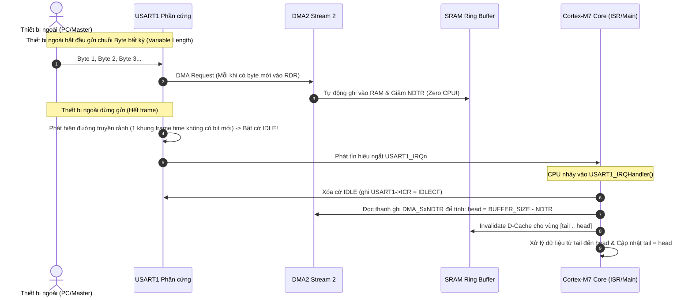

# 📗 [NGÀY 2] HƯỚNG DẪN BARE-METAL: UART RX DMA RING BUFFER, IDLE LINE INTERRUPT & D-CACHE COHERENCY

Tài liệu này hướng dẫn toàn diện từ kiến trúc phần cứng, bảng thanh ghi, công thức tính toán, quy trình xử lý D-Cache cho đến các lỗi kinh điển khi lập trình **UART RX với DMA Circular Ring Buffer và ngắt IDLE Line** trên vi điều khiển **STM32F746NG (ARM Cortex-M7)**.

> 💡 **Tài liệu tiên quyết:** 
> - Đọc [**`📘 [NGÀY 0] Nền tảng Cốt lõi Bare-metal & Cơ chế Thanh ghi`**](file:///d:/Project/STM32F7/docs/day00_baremetal_foundations.md) để nắm vững Bitwise RMW, struct pointer mapping, từ khóa `volatile`, và phương pháp tra cứu Reference Manual.
> - Đọc [**`📗 [NGÀY 1] Cấu hình 216MHz Over-drive Clock & Reset Logging`**](file:///d:/Project/STM32F7/docs/day01_system_clock_reset.md) để hiểu về nguồn xung nhịp $f_{PCLK2} = 108\text{ MHz}$ cấp cho USART1.

---

## 🛠️ RÀ SOÁT 7 QUY TẮC BARE-METAL CỐT LÕI

| STT | Quy tắc | Áp dụng trong Ngày 2 |
| :---: | :--- | :--- |
| **1** | **Reset Value** | Tra cứu giá trị reset của `USART_CR1`, `USART_CR3`, `USART_BRR`, `DMA_SxCR`, `DMA_SxNDTR` trước khi ghi để đảm bảo trạng thái sạch. |
| **2** | **Access Type** | **CỰC KỲ QUAN TRỌNG:** Thanh ghi xóa cờ ngắt `USART1->ICR` và `DMA2->LIFCR`/`HIFCR` là dạng `W1C` (Write 1 to Clear) hoặc Write-only. **TUYỆT ĐỐI KHÔNG DÙNG `|=`**, phải ghi gán trực tiếp `=` để tránh xóa nhầm cờ ngắt của các kênh khác! |
| **3** | **Multi-Bit Clear-Set** | Áp dụng quy tắc xóa trước - gán sau (`REG &= ~MASK; REG |= VALUE;`) cho các trường `CHSEL[2:0]`, `PL[1:0]`, `MSIZE[1:0]`, `PSIZE[1:0]`, `DIR[1:0]`, `AFR[3:0]`, `MODER[1:0]`. |
| **4** | **`volatile` Qualification** | Khai báo `volatile` cho con trỏ ring buffer và các biến chia sẻ giữa ISR và Main (`rx_head`, `rx_tail`, `uart_rx_flag`). |
| **5** | **Interrupt Workflow** | Quy trình 5 bước: Cờ phần cứng `USART_ISR_IDLE` $\rightarrow$ Bật `USART_CR1_IDLEIE` $\rightarrow$ Bật `NVIC_EnableIRQ(USART1_IRQn)` $\rightarrow$ Trình phục vụ `USART1_IRQHandler()` $\rightarrow$ Xóa cờ bằng `USART1->ICR = USART_ICR_IDLECF`. |
| **6** | **RM / DS Lookup** | Cung cấp chính xác Chapter, Section, từ khóa `Ctrl + F`, công thức `Base Address + Offset` cho `USART1`, `DMA2`, `GPIOA`, `GPIOB`. |
| **7** | **Hardware Rationale & Specs** | Bố trí cơ sở kỹ thuật, giới hạn phần cứng ($f_{PCLK2} \le 108\text{MHz}$, D-Cache Line 32 bytes, Overrun Error ORE freeze) liền kề từng bảng thanh ghi. |

---

## 1. BỨC TRANH TOÀN CẢNH & TẠI SAO CẦN DMA + IDLE LINE?

### 1.1. Vấn đề của các phương pháp nhận UART truyền thống

```text
┌────────────────────────────────────────────────────────────────────────────────────────┐
│                        SO SÁNH 3 KIẾN TRÚC NHẬN DỮ LIỆU UART                           │
├───────────────────┬──────────────────────────────────┬─────────────────────────────────┤
│ 1. Polling        │ CPU liên tục đọc cờ RXNE trong   │ Treo CPU 100%, lãng phí năng    │
│    (while loop)   │ vòng lặp chờ từng byte           │ lượng, nghẽn mọi task khác      │
├───────────────────┼──────────────────────────────────┼─────────────────────────────────┤
│ 2. RXNE Interrupt │ Mỗi byte nhận được sinh 1 ngắt   │ Gây "Interrupt Thrashing" ở tốc │
│    (Ngắt từng byte)│ CPU phải nhảy vào ISR liên tục  │ độ cao (921600 bps), làm trễ    │
│                   │ để đọc `USART_RDR` vào buffer    │ các ngắt ưu tiên cao (CAN, PWM) │
├───────────────────┼──────────────────────────────────┼─────────────────────────────────┤
│ 3. DMA + IDLE     │ DMA tự động chuyển byte từ RDR   │ ZERO CPU OVERHEAD khi nhận!     │
│    (Tối ưu nhất)  │ vào RAM mà không làm phiền CPU.  │ CPU chỉ bị ngắt DUY NHẤT 1 LẦN  │
│                   │ Khi đường truyền rảnh (IDLE),    │ khi cả gói tin đã nhận xong     │
│                   │ phần cứng báo ngắt kết thúc frame│ vào trong RAM.                  │
└───────────────────┴──────────────────────────────────┴─────────────────────────────────┘
```

### 1.2. Sơ đồ Bus Matrix & Luồng Dữ liệu Phần cứng (Dataflow Architecture)

```text
       [ Tín hiệu UART từ bên ngoài (RX Pin: PB7) ]
                           │
                           ▼
          ┌──────────────────────────────────┐
          │  USART1 Peripheral (Bus APB2)    │
          │  - Shift Register -> Data (RDR)  │
          └──────────────────────────────────┘
                           │ (DMA Request: Channel 4)
                           ▼
          ┌──────────────────────────────────┐
          │  DMA2 Controller (Bus AHB1)      │ ───► Tự động ghi trực tiếp vào SRAM
          │  - Stream 2: Circular Mode       │      (Không qua lõi CPU Cortex-M7!)
          └──────────────────────────────────┘
                           │
                           ▼
          ┌──────────────────────────────────┐
          │  SRAM1 (Vùng nhớ Ring Buffer)   │ <─── Căn lề 32-byte (__attribute__((aligned(32))))
          └──────────────────────────────────┘
                           │ (Incoherency Gap!)
                    ┌──────┴──────┐
                    │             │
                    ▼             ▼
             ┌────────────┐ ┌────────────┐
             │  D-Cache   │ │ Main SRAM  │  <─── Nguy cơ CPU đọc dữ liệu cũ từ D-Cache!
             │ (32B Line) │ │ (Data mới) │       ==> Bắt buộc gọi Invalidate D-Cache!
             └────────────┘ └────────────┘
                    │
                    ▼
          ┌──────────────────────────────────┐
          │  ARM Cortex-M7 Core (216 MHz)    │ <─── Chỉ bị ngắt khi có sự kiện IDLE LINE!
          └──────────────────────────────────┘
```

### 1.3. Cơ chế hoạt động của "Bộ ba hoàn hảo": DMA Circular + IDLE Flag + Ring Buffer



---

## 2. CHI TIẾT CẤU HÌNH THANH GHI & CƠ SỞ KỸ THUẬT

### 2.1. Tra cứu Bản đồ Bộ nhớ & Địa chỉ Base Address
* **Tài liệu tra cứu:** RM0385 -> *Chapter 2: Memory map -> Section 2.2 Table 1* (Trang 86).
* **Từ khóa (`Ctrl + F`):** `USART1 boundary address` hoặc `DMA2 boundary address`.

```text
PERIPH_BASE       = 0x4000 0000UL
AHB1PERIPH_BASE   = PERIPH_BASE + 0x0002 0000UL = 0x4002 0000UL
APB2PERIPH_BASE   = PERIPH_BASE + 0x0001 0000UL = 0x4001 0000UL

GPIOA_BASE        = AHB1PERIPH_BASE + 0x0000UL  = 0x4002 0000UL
GPIOB_BASE        = AHB1PERIPH_BASE + 0x0400UL  = 0x4002 0400UL
DMA2_BASE         = AHB1PERIPH_BASE + 0x6400UL  = 0x4002 6400UL
USART1_BASE       = APB2PERIPH_BASE + 0x1000UL  = 0x4001 1000UL
```

---

### 2.2. Ghép kênh Chân GPIO (Pin Multiplexing & Alternate Function)

Trên bo mạch **STM32F746G-Discovery**, cổng USB ST-LINK (Virtual COM Port) được nối trực tiếp vào vi điều khiển qua 2 chân:
- **TX (Transmit):** Chân `PA9` (AF7)
- **RX (Receive):** Chân `PB7` (AF7) *(Lưu ý: Mặc dù PA10 cũng là USART1_RX nhưng trên bo Discovery chân ST-LINK VCP được nối vào PB7)*.

* **Tài liệu tra cứu:**
  - Datasheet **DS10610** -> *Chapter 4: Pinouts and pin description -> Table 11: Alternate function mapping* (Trang 80).
  - Reference Manual **RM0385** -> *Chapter 8: General-purpose I/Os (GPIO)*.
* **Từ khóa (`Ctrl + F`):** `Table 11. Alternate function` $\rightarrow$ Tra cột `AF7` tìm `USART1_TX` và `USART1_RX`.

#### Bảng Cấu hình Thanh ghi GPIO (`GPIOA` & `GPIOB`)
| Thanh ghi | Offset | Reset Value | Bit | Tên Trường | Giá trị cấu hình | Ý nghĩa kỹ thuật |
| :--- | :---: | :---: | :---: | :--- | :---: | :--- |
| **`RCC_AHB1ENR`**| `0x30` | `0x0010 0000` | 0, 1 | `GPIOAEN`, `GPIOBEN` | `1`, `1` | Cấp clock cho GPIO Port A và Port B. |
| **`GPIOA_MODER`**| `0x00` | `0x0000 0000` | 19:18 | `MODER9[1:0]` | `10`b | Cấu hình PA9 sang Alternate Function mode. |
| **`GPIOA_AFRH`** | `0x24` | `0x0000 0000` | 7:4 | `AFRH9[3:0]` | `0111`b (`AF7`)| Gán PA9 làm `USART1_TX`. |
| **`GPIOA_OSPEEDR`**| `0x08`| `0x0000 0000`| 19:18 | `OSPEEDR9[1:0]` | `10`b | Very High Speed để đảm bảo cạnh sườn xung vuông. |
| **`GPIOB_MODER`**| `0x00` | `0x0000 0000` | 15:14 | `MODER7[1:0]` | `10`b | Cấu hình PB7 sang Alternate Function mode. |
| **`GPIOB_AFRL`** | `0x20` | `0x0000 0000` | 31:28 | `AFRL7[3:0]` | `0111`b (`AF7`)| Gán PB7 làm `USART1_RX`. |
| **`GPIOB_PUPDR`**| `0x0C` | `0x0000 0000` | 15:14 | `PUPDR7[1:0]` | `01`b | Pull-up nội cho chân RX (tránh nhiễu khi thả nổi). |

---

### 2.3. Cấu hình Khối USART1 (`USART_CR1`, `CR3`, `BRR`, `ISR`, `ICR`)

* **Tài liệu tra cứu:** RM0385 -> *Chapter 30: Universal synchronous asynchronous receiver transmitter (USART)*.
* **Từ khóa (`Ctrl + F`):** `USART_CR1` hoặc `USART baud rate register`.

#### 📐 Công thức Toán học Tính Baudrate cho USART1 (*RM0385 Section 30.5.4*)
USART1 nằm trên bus **APB2**. Ở Ngày 1, ta đã thiết lập $SYSCLK = 216\text{ MHz}$, $PPRE2 = /2 \implies f_{PCLK2} = 108\text{ MHz}$.

Mặc định thanh ghi `USART_CR1` bit `OVER8 = 0` (Oversampling by 16). Công thức chia tần:
$$USARTDIV = \frac{f_{PCLK2}}{\text{Baudrate}}$$
$$\text{Giá trị ghi vào thanh ghi } \mathbf{USART1\text{->}BRR} = USARTDIV = \frac{108,000,000}{\text{Baudrate}}$$

* **Với Baudrate 115200 bps:**
  $$USARTDIV = \frac{108,000,000}{115200} = 937.5 \approx 938 = \mathbf{\text{0x03AA}}$$
  $$\text{Sai số thực tế (Error)} = \frac{|115200 - \frac{108,000,000}{938}|}{115200} = \frac{|115200 - 115138.59|}{115200} = \mathbf{0.053\%} \quad (\text{Cực kỳ chính xác!})$$

* **Với Baudrate 921600 bps (Tốc độ siêu cao cho Gateway):**
  $$USARTDIV = \frac{108,000,000}{921600} = 117.1875 \approx 117 = \mathbf{\text{0x0075}}$$
  $$\text{Sai số thực tế} = \mathbf{0.16\%} \quad (\text{Nằm sâu dưới ngưỡng an toàn } \le 2\%)$$

#### Bảng Thanh ghi `USART1`
| Thanh ghi | Offset | Reset Value | Bit | Tên Bit | Access | Cấu hình & Ý nghĩa kỹ thuật |
| :--- | :---: | :---: | :---: | :--- | :---: | :--- |
| **`RCC_APB2ENR`**| `0x44` | `0x0000 0000` | 4 | `USART1EN` | `RW` | Ghi `1` để cấp clock APB2 cho USART1. |
| **`USART_BRR`** | `0x0C` | `0x0000 0000` | 15:0 | `BRR[15:0]` | `RW` | Ghi `0x03AA` (cho 115200 bps) hoặc `0x0075` (cho 921600 bps). |
| **`USART_CR3`** | `0x08` | `0x0000 0000` | 6 | `DMAR` | `RW` | Ghi `1` (DMA Enable Receiver) để kích hoạt tín hiệu DMA Request khi có byte vào RDR. |
| **`USART_CR1`** | `0x00` | `0x0000 0000` | 0 | `UE` | `RW` | Ghi `1` (USART Enable) bật module hoạt động. |
| | | | 2 | `RE` | `RW` | Ghi `1` (Receiver Enable) bật bộ thu. |
| | | | 3 | `TE` | `RW` | Ghi `1` (Transmitter Enable) bật bộ phát. |
| | | | 4 | `IDLEIE` | `RW` | Ghi `1` (IDLE Line Interrupt Enable) cho phép sinh ngắt khi đường truyền rảnh. |
| **`USART_ISR`** | `0x1C` | `0x0000 00C0` | 4 | `IDLE` | `RO` | Cờ báo phát hiện đường truyền rảnh (IDLE Line Detected). |
| | | | 3 | `ORE` | `RO` | Cờ báo lỗi tràn dữ liệu (Overrun Error) $\rightarrow$ Cần xóa ngay nếu xuất hiện! |
| | | | 1 | `FE` | `RO` | Cờ báo lỗi khung (Framing Error). |
| **`USART_ICR`** | `0x20` | `0x0000 0000` | 4 | `IDLECF` | `W1C` | Ghi `1` trực tiếp (`USART1->ICR = USART_ICR_IDLECF`) để xóa cờ IDLE. |
| | | | 3 | `ORECF` | `W1C` | Ghi `1` trực tiếp (`USART1->ICR = USART_ICR_ORECF`) để xóa cờ lỗi Overrun. |
| | | | 1 | `FECF` | `W1C` | Ghi `1` trực tiếp (`USART1->ICR = USART_ICR_FECF`) để xóa cờ lỗi Framing. |

---

### 2.4. Cấu hình Bộ Điều khiển DMA2 (`DMA2_Stream2`)

Trong kiến trúc STM32F7, **DMA2** phụ trách các ngoại vi kết nối trên bus APB2 (như USART1, SPI1, ADC), còn **DMA1** phụ trách APB1.

* **Tài liệu tra cứu:** RM0385 -> *Chapter 8: Direct memory access controller (DMA) -> Section 8.3.4: DMA2 request mapping -> Table 28* (Trang 251) & *Section 8.5: DMA registers*.
* **Từ khóa (`Ctrl + F`):** `Table 28. DMA2 request mapping` $\rightarrow$ Tìm dòng `USART1_RX`.

```text
Từ Table 28 của RM0385:
┌──────────────┬──────────────┬──────────────┬──────────────┐
│  Peripheral  │   Stream     │   Channel    │  Direction   │
├──────────────┼──────────────┼──────────────┼──────────────┤
│  USART1_RX   │   Stream 2   │  Channel 4   │ Periph to Mem│
│  USART1_TX   │   Stream 7   │  Channel 4   │ Mem to Periph│
└──────────────┴──────────────┴──────────────┴──────────────┘

📐 Công thức tính Offset cho DMA Streams (Mỗi Stream = 6 thanh ghi x 4 bytes = 0x18 bytes):
Stream 0 Offset = 0x10
Stream x Offset = 0x10 + x * 0x18
==> Stream 2 Offset = 0x10 + 2 * 0x18 = 0x40
```

#### Bảng Thanh ghi `DMA2_Stream2`
| Thanh ghi | Offset | Reset Value | Bit | Tên Bit/Trường | Access | Cấu hình & Ý nghĩa kỹ thuật |
| :--- | :---: | :---: | :---: | :--- | :---: | :--- |
| **`RCC_AHB1ENR`**| `0x30` | `0x0010 0000` | 22 | `DMA2EN` | `RW` | Ghi `1` cấp clock cho DMA2. |
| **`DMA2_S2CR`**  | `0x40` | `0x0000 0000` | 27:25 | `CHSEL[2:0]`| `RW` | Ghi `100`b (Channel 4) theo Table 28 RM0385. |
| | | | 17:16 | `PL[1:0]` | `RW` | Ghi `10`b (High Priority) để tránh mất gói tin. |
| | | | 14:13 | `MSIZE[1:0]`| `RW` | Ghi `00`b (Memory data size: 8-bit byte). |
| | | | 12:11 | `PSIZE[1:0]`| `RW` | Ghi `00`b (Peripheral data size: 8-bit byte). |
| | | | 10 | `MINC` | `RW` | Ghi `1` (Memory Increment): Tự tăng con trỏ RAM sau mỗi byte. |
| | | | 9 | `PINC` | `RW` | Ghi `0` (Peripheral Fixed): Giữ nguyên địa chỉ `USART1->RDR`. |
| | | | 8 | `CIRC` | `RW` | Ghi `1` (Circular Mode): Khi NDTR về 0, DMA tự động nạp lại 512 và vòng lại đầu buffer! |
| | | | 7:6 | `DIR[1:0]` | `RW` | Ghi `00`b (Peripheral-to-Memory). |
| | | | 0 | `EN` | `RW` | Ghi `1` để kích hoạt Stream chạy (BẬT SAU CÙNG). |
| **`DMA2_S2NDTR`**| `0x44` | `0x0000 0000` | 15:0 | `NDTR[15:0]`| `RW` | Số byte cần chuyển: Ghi `BUFFER_SIZE` (ví dụ: `512`). Tự động đếm lùi về 0. |
| **`DMA2_S2PAR`** | `0x48` | `0x0000 0000` | 31:0 | `PAR[31:0]` | `RW` | Địa chỉ nguồn ngoại vi: `(uint32_t)&(USART1->RDR)`. |
| **`DMA2_S2M0AR`**| `0x4C` | `0x0000 0000` | 31:0 | `M0AR[31:0]`| `RW` | Địa chỉ đích trong RAM: `(uint32_t)dma_rx_ring_buffer`. |
| **`DMA2_LIFCR`** | `0x08` | `0x0000 0000` | 21, 19 | `CTCIF2`, `CTEIF2`| `W1C`| Ghi `1` trực tiếp để xóa cờ ngắt cũ của Stream 2 trước khi Enable. |

#### ⚙️ Trình tự 6 Bước Khởi tạo DMA Stream chuẩn Phần cứng (*RM0385 Section 8.3.18*)
Phần cứng DMA quy định: **Hầu hết các trường cấu hình trong `DMA_SxCR`, `PAR`, `M0AR`, `NDTR` chỉ được phép ghi khi Stream đang TẮT (`EN == 0`)**. Nếu ghi khi `EN == 1`, phần cứng sẽ bỏ qua lệnh ghi mà không hề báo lỗi!

```text
┌────────────────────────────────────────────────────────────────────────────────────────┐
│               QUY TRÌNH 6 BƯỚC KHỞI TẠO DMA STREAM CHUẨN (RM0385 Section 8.3.18)       │
├────────────────────────────────────────────────────────────────────────────────────────┤
│ Bước 1: Cấp clock cho DMA Controller: RCC->AHB1ENR |= RCC_AHB1ENR_DMA2EN;              │
│                                                                                        │
│ Bước 2: Tắt Stream nếu đang chạy và chờ EN về 0 (Handshake):                           │
│         DMA2_Stream2->CR &= ~DMA_SxCR_EN;                                              │
│         while (DMA2_Stream2->CR & DMA_SxCR_EN);                                        │
│                                                                                        │
│ Bước 3: Xóa sạch cờ ngắt cũ của Stream trên thanh ghi LIFCR/HIFCR:                     │
│         DMA2->LIFCR = DMA_LIFCR_CTCIF2 | DMA_LIFCR_CTEIF2 | DMA_LIFCR_CDMEIF2;         │
│                                                                                        │
│ Bước 4: Thiết lập địa chỉ ngoại vi (PAR), địa chỉ RAM (M0AR) và số byte (NDTR):       │
│         DMA2_Stream2->PAR  = (uint32_t)&(USART1->RDR);                                 │
│         DMA2_Stream2->M0AR = (uint32_t)dma_rx_ring_buffer;                             │
│         DMA2_Stream2->NDTR = UART_RX_BUFFER_SIZE;                                      │
│                                                                                        │
│ Bước 5: Cấu hình thanh ghi điều khiển DMA_SxCR (CHSEL, PL, MSIZE, PSIZE, MINC, CIRC)   │
│         (Lưu ý: CHƯA ĐƯỢC BẬT BIT EN Ở BƯỚC NÀY!)                                     │
│                                                                                        │
│ Bước 6: Kích hoạt Stream chạy (Bật EN = 1):                                            │
│         DMA2_Stream2->CR |= DMA_SxCR_EN;                                               │
│         Sau đó bật USART_CR3 (DMAR = 1) và USART_CR1 (UE = 1, RE = 1, IDLEIE = 1).    │
└────────────────────────────────────────────────────────────────────────────────────────┘
```

---

## 3. CACHE COHERENCY & ARM CORTEX-M7 D-CACHE (RẤT QUAN TRỌNG)

Một trong những nguyên nhân phổ biến nhất khiến driver DMA chạy đúng trên STM32F4 (Cortex-M4) nhưng **chết bí ẩn trên STM32F7 (Cortex-M7)** chính là **D-Cache (Data Cache)**.

### 3.1. Hiện tượng Cache Incoherency xảy ra như thế nào?

```text
       LÕI CPU (Cortex-M7)                 DMA CONTROLLER
              │                                   │
              ▼ (Đọc biến)                        ▼ (Ghi dữ liệu UART)
     ┌──────────────────┐                ┌──────────────────┐
     │  D-Cache SRAM    │                │    Main SRAM     │
     │ [Dữ liệu cũ = 0] │ ◄── BẤT ĐỒNG ──┤ [Dữ liệu mới: 'A']│
     └──────────────────┘     BỘ NHỚ!    └──────────────────┘
```
1. Lõi Cortex-M7 có bộ nhớ đệm dữ liệu **D-Cache (16KB, 4-way set associative)**.
2. Khi CPU đọc một vùng nhớ trong SRAM lần đầu, giá trị đó được copy lên D-Cache để những lần sau CPU đọc siêu nhanh.
3. Khi có dữ liệu UART tới, **DMA ghi thẳng vào Main SRAM** thông qua Bus Matrix mà không đi qua CPU.
4. Lõi CPU không hề hay biết Main SRAM đã thay đổi! Khi CPU đọc mảng buffer, nó vẫn đọc giá trị cũ từ D-Cache $\rightarrow$ **Dữ liệu nhận được bị sai hoặc rỗng!**

### 3.2. Hiểm họa "False Sharing" & Căn lề 32-Byte (`aligned(32)`)

Bộ nhớ D-Cache của ARM Cortex-M7 quản lý theo từng khối gọi là **Cache Line (mỗi Cache Line rộng đúng 32 Bytes)**.

```text
  [ Cache Line 32-Byte trong D-Cache ]
  ┌───────────────────────────────────────────────┬───────────────────────────────┐
  │         dma_rx_buffer (byte 0 .. 15)          │  biến unrelated_var (int32_t) │
  └───────────────────────────────────────────────┴───────────────────────────────┘
```
- Nếu `dma_rx_buffer` **không được căn lề 32 bytes**, nó sẽ nằm chung Cache Line với một biến quan trọng khác (`unrelated_var`).
- Khi bạn gọi lệnh xóa Cache `SCB_InvalidateDCache_by_Addr()` để cập nhật dữ liệu UART:
  * CPU buộc phải vứt bỏ toàn bộ Cache Line 32-byte đó.
  * **HẬU QUẢ CHẾT NGƯỜI:** Giá trị mới của biến `unrelated_var` vừa được CPU ghi vào D-Cache sẽ bị xóa sạch trước khi kịp ghi xuống SRAM $\rightarrow$ **Làm hỏng dữ liệu (Memory Corruption) của toàn bộ hệ thống!**

### 3.3. Quy tắc 2 bước sống còn để xử lý Cache Coherency:

#### Bước 1: Khai báo Buffer căn lề 32-byte và kích thước là bội số của 32
```c
#define UART_RX_BUFFER_SIZE  512 // Bội số của 32 bytes (512 = 32 * 16)

// Bắt buộc dùng thuộc tính căn lề của GCC:
__attribute__((aligned(32))) static uint8_t dma_rx_ring_buffer[UART_RX_BUFFER_SIZE];
```

#### Bước 2: Invalidate D-Cache trước khi CPU đọc từ Buffer
Hàm CMSIS chuẩn của ARM Cortex-M7:
```c
#include "core_cm7.h"

// Xóa D-cache cho vùng nhớ vừa được DMA cập nhật:
SCB_InvalidateDCache_by_Addr((uint32_t *)dma_rx_ring_buffer, UART_RX_BUFFER_SIZE);
```

---

## 4. GIẢI THUẬT RING BUFFER VÀ XỬ LÝ NGẮT IDLE LINE

### 4.1. Công thức Toán học tính con trỏ `head` và `tail`

Thanh ghi `DMA2_Stream2->NDTR` (Number of Data to Transfer) hoạt động theo cơ chế **Đếm lùi (Countdown Counter)**:
- Ban đầu: $NDTR = \text{BUFFER\_SIZE}$.
- Khi nhận 1 byte: $NDTR = \text{BUFFER\_SIZE} - 1$.
- Khi nhận $K$ bytes: $NDTR = \text{BUFFER\_SIZE} - K$.

Do đó, vị trí con trỏ ghi hiện tại của DMA (`head`) trong mảng được tính theo công thức:
$$\mathbf{head = \text{UART\_RX\_BUFFER\_SIZE} - \text{DMA2\_Stream2->NDTR}}$$

```text
Trường hợp 1: Dữ liệu chưa bị vòng (head >= tail)
┌─────────────────────────────────────────────────────────────┐
│ [Đã đọc] [Đã đọc] │ Data mới cần xử lý: byte 2..5 │ [Trống] │
└───────────────────┴───────────────────────────────┴─────────┘
                    ▲                               ▲
                   tail                            head
Số bytes mới cần đọc = head - tail

Trường hợp 2: Dữ liệu đã bị vòng Wrap-around (head < tail)
┌───────────────────────┬───────────────────┬─────────────────┐
│ Data mới (Phần 2)     │    [Đã đọc]       │ Data mới (Phần 1│
└───────────────────────┴───────────────────┴─────────────────┘
                        ▲                   ▲
                       head                tail
Số bytes mới = (BUFFER_SIZE - tail) + head
```

---

### 4.2. Quy trình 5 bước trong Trình xử lý Ngắt `USART1_IRQHandler()`

```c
void USART1_IRQHandler(void) {
    // Bước 1: Kiểm tra cờ ngắt IDLE Line
    if (USART1->ISR & USART_ISR_IDLE) {
        
        // Bước 2: Xóa cờ IDLE (W1C: Ghi 1 vào thanh ghi ICR)
        USART1->ICR = USART_ICR_IDLECF;
        
        // Bước 3: Đọc vị trí hiện tại của DMA (NDTR)
        uint16_t current_ndtr = DMA2_Stream2->NDTR;
        uint16_t head = UART_RX_BUFFER_SIZE - current_ndtr;
        
        // Bước 4: Invalidate D-Cache để CPU thấy dữ liệu mới nhất từ SRAM
        SCB_InvalidateDCache_by_Addr((uint32_t *)dma_rx_ring_buffer, UART_RX_BUFFER_SIZE);
        
        // Bước 5: Thông báo cho Application layer hoặc Ring Buffer Parser
        Uart_Process_Rx_Data(head);
    }
    
    // Bước 6: BẮT BUỘC KIỂM TRA VÀ XÓA LỖI OVERRUN (ORE) / FRAMING (FE)
    if (USART1->ISR & (USART_ISR_ORE | USART_ISR_FE)) {
        USART1->ICR = USART_ICR_ORECF | USART_ICR_FECF; // Xóa cờ lỗi để DMA không bị đóng băng!
    }
}
```

---

## 5. 💡 CÂU HỎI PHỎNG VẤN & THIẾT KẾ NÂNG CAO (DEEP-DIVE & KNOWN ISSUES)

### ❓ Câu hỏi 1: Lỗi Overrun Error (ORE) là gì? Tại sao nếu không xóa cờ ORE thì DMA sẽ bị "đóng băng" vĩnh viễn?
* **Bản chất phần cứng:** Lỗi ORE xảy ra khi một byte mới được dịch xong vào `USART_RDR` nhưng byte trước đó chưa kịp được lấy đi (do DMA bị nghẽn bus hoặc CPU can thiệp).
* **Hiểm họa:** Khi cờ `USART_ISR_ORE = 1`, phần cứng UART của STM32 sẽ **ngừng phát tín hiệu DMA Request** để bảo vệ dữ liệu. Nếu firmware của bạn chỉ lắng nghe ngắt IDLE mà không kiểm tra/xóa cờ `ORECF`, DMA sẽ bị **treo vĩnh viễn (stalled)**, không nhận thêm được bất kỳ byte nào dù phần cứng không báo lỗi ra màn hình!
* **Cách khắc phục chuẩn phỏng vấn:** Luôn có đoạn kiểm tra `if (USART1->ISR & USART_ISR_ORE) USART1->ICR = USART_ICR_ORECF;` trong ISR hoặc định kỳ.

---

### ❓ Câu hỏi 2: Tại sao phải dùng `__attribute__((aligned(32)))` cho DMA Buffer trên Cortex-M7?
* **Giải thích chuyên sâu:** Kiến trúc ARM Cortex-M7 có L1 D-Cache với Cache Line dài $32\text{ bytes}$.
* Mọi thao tác Invalidate/Clean cache đều thực hiện trên toàn bộ 1 block 32 bytes.
* Nếu buffer không căn lề 32 bytes, phần đầu hoặc phần đuôi của buffer sẽ chia sẻ chung Cache Line với các biến khác của chương trình. Khi hàm `SCB_InvalidateDCache` được gọi, dữ liệu của các biến nằm chung dòng cache sẽ bị xóa mất giá trị mới ghi bởi CPU (hiện tượng **False Sharing Corruption**). Căn lề 32 bytes đảm bảo buffer nằm trọn vẹn trong các cache lines độc lập.

---

### ❓ Câu hỏi 3: Làm thế nào để chứng minh hệ thống đạt "0% CPU Overhead" khi nhận UART tốc độ cao?
* **Phương pháp 1 (Đo bằng DWT Cycle Counter):**
  - Kích hoạt thanh ghi `DWT->CYCCNT` (Data Watchpoint and Trace).
  - Đếm số chu kỳ CPU tiêu tốn giữa phương pháp Polling / RXNE Interrupt vs DMA. Với DMA, số chu kỳ CPU bằng 0 trong suốt quá trình nhận chuỗi 10.000 bytes.
* **Phương pháp 2 (Đo bằng Oscilloscope / Logic Analyzer):**
  - Kéo 1 chân GPIO lên mức cao khi vào `USART1_IRQHandler()` và hạ xuống mức thấp khi thoát.
  - Quan sát dạng sóng trên Logic Analyzer: Với phương pháp ngắt từng byte (RXNE), chân GPIO giật liên tục hàng nghìn lần (chiếm ~20-30% thời gian CPU). Với DMA + IDLE, chân GPIO chỉ nhảy duy nhất 1 xung cực hẹp (~0.5 µs) khi toàn bộ frame đã vào xong RAM!

---

### ❓ Câu hỏi 4: Khi dữ liệu đến liên tục không có khoảng lặng (No IDLE Line) thì làm sao để không bị tràn Ring Buffer?
* **Giải pháp kết hợp:** Ngoài ngắt `IDLEIE`, ta bật thêm 2 ngắt của DMA:
  1. **Half-Transfer Complete (`HTIE`):** Sinh ngắt khi DMA điền đầy 50% buffer.
  2. **Transfer Complete (`TCIE`):** Sinh ngắt khi DMA điền đầy 100% buffer.
* Nhờ vậy, ngay cả khi dữ liệu bắn liên tục dạng luồng (streaming) không hề có IDLE time, CPU vẫn được đánh thức định kỳ để vét dữ liệu xử lý kịp thời, ngăn chặn tràn buffer!

---

## 6. TỔNG KẾT VÀ BƯỚC TIẾP THEO

Bạn đã nắm trọn vẹn kiến trúc đỉnh cao của **UART RX DMA Ring Buffer**:
1. **Zero-Copy Architecture:** DMA2 Stream 2 Channel 4 ghi trực tiếp từ `USART1->RDR` vào SRAM.
2. **IDLE Line Detection:** Đánh thức CPU đúng 1 lần khi kết thúc frame.
3. **Cortex-M7 Cache Coherency:** Căn lề 32-byte và gọi `SCB_InvalidateDCache_by_Addr()`.
4. **Resilience & Bug Prevention:** Xóa cờ lỗi ORE/FE trực tiếp trên `USART_ICR` bằng W1C.

👉 **Kế hoạch tiếp theo:** Sau khi hoàn thiện code driver Ngày 2, ta sẽ tiến tới [**`📗 [NGÀY 3] Hướng dẫn Bare-metal: bxCAN Controller & Filter Bank Configuration`**](file:///d:/Project/STM32F7/docs/day03_bxcan_driver.md)!
