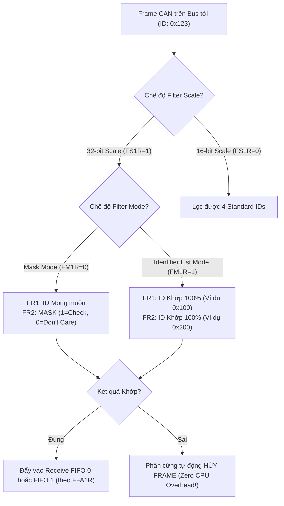
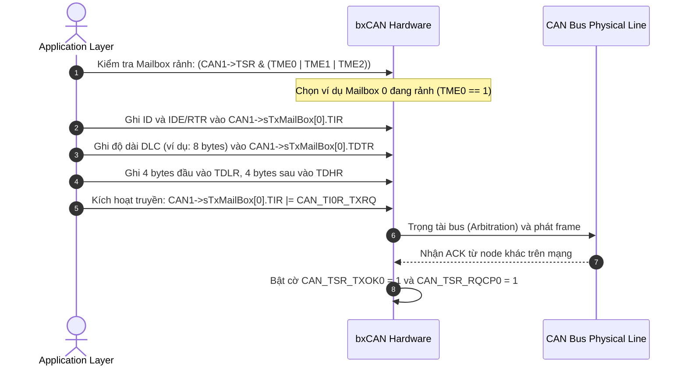

# 🏆 [NGÀY 3] CẨM NANG TOÀN DIỆN BARE-METAL: bxCAN CONTROLLER, 28 FILTER BANKS & AUTOMOTIVE BUS-OFF RECOVERY
## Lộ trình 4 Bước: Nguyên Lý Phần Cứng ➔ Thực Chiến RM0385 ➔ Gõ Code Driver ➔ Phỏng Vấn Chuyên Sâu

> **Mục tiêu:** Làm chủ từ gốc rễ mạch vi sai CAN Bus, tra cứu Reference Manual (RM0385) và Datasheet (DS10610), tính toán thông số Bit Timing chuẩn CiA 301 ($500\text{ kbps}$, Sample Point $87.5\%$), cấu hình 28 Filter Banks (Mask/List Mode), quản lý 3 Transmit Mailboxes / 2 Receive FIFOs, xử lý ngắt nhận dữ liệu và thuật toán phục hồi lỗi chuẩn công nghiệp ô tô (**Automotive Bus-Off Recovery**) trên STM32F746 (ARM Cortex-M7).  
> **Nguyên tắc kỹ thuật:** **Đi thẳng vào cơ chế phần cứng, thanh ghi, công thức toán học, bảng tra cứu và phân chia file rõ ràng — KHÔNG dùng ví dụ ẩn dụ ngoài lề dài dòng.**

---

```text
┌─────────────────────────────────────────────────────────────────────────────────────────────────┐
│                           LỘ TRÌNH 4 BƯỚC CHINH PHỤC NGÀY 3                                     │
├───────────────────┬───────────────────┬────────────────────────────┬────────────────────────────┤
│ BƯỚC 1: NGUYÊN LÝ │ BƯỚC 2: THỰC CHIẾN│ BƯỚC 3: GÕ CODE            │ BƯỚC 4: PHỎNG VẤN          │
│ • Bus Vi sai CAN  │ • Tra cứu RM0385  │ • Gắn nhãn file cụ thể     │ • Bộ 5 câu hỏi vặn bxCAN   │
│ • Mailboxes/FIFOs │   & DS10610       │ • TODO 1-3 [can.h]         │ • Bit Stuffing & CRC Error │
│ • Bit Timing Math │ • Bảng Base Addr  │ • TODO 4-8 [can.c]         │ • CAN1 Master Filter Trap  │
│ • 28 Filter Banks │ • Bảng Thanh ghi  │ • TODO 9 [main.c]          │ • Kịch bản trả lời 60s     │
│ • Bus-Off Recovery│ • Bảng W1C        │ • Mổ xẻ 5 Bug phần cứng    │   (Elevator Pitch)         │
└───────────────────┴───────────────────┴────────────────────────────┴────────────────────────────┘
```

---

## 🛠️ RÀ SOÁT 7 QUY TẮC BARE-METAL CỐT LÕI (CHUYÊN CHO NGÀY 3)

| STT | Quy tắc Bare-metal | Thể hiện cụ thể trong Ngày 3 (bxCAN) |
| :---: | :--- | :--- |
| **1** | **Reset Value** | Tra cứu giá trị mặc định của `CAN_MCR` (`0x0001 0002` - chế độ Sleep bật sẵn), `CAN_BTR`, `CAN_FMR` (`0x2A1C 0E01` - cờ `FINIT = 1`) trước khi cấu hình. |
| **2** | **Access Type** | **CỰC KỲ QUAN TRỌNG:** Thanh ghi `CAN_TSR` (các cờ `RQCPx`, `TXOKx`) và `CAN_RFR` (cờ `FULLx`, bit giải phóng `RFOMx`) là dạng `rc_w1` (Write 1 to Clear) hoặc `rs` (Write 1 to Set). **TUYỆT ĐỐI KHÔNG DÙNG `|=`**, phải ghi gán trực tiếp `=` để không xóa nhầm trạng thái của Mailbox khác! |
| **3** | **Multi-Bit Clear-Set** | Áp dụng quy tắc xóa trước - gán sau (`REG &= ~MASK; REG |= VALUE;`) cho các trường đa bit: `TS1[3:0]`, `TS2[2:0]`, `SJW[1:0]`, `BRP[9:0]`, `CAN2SB[5:0]`, `DLC[3:0]`, `STID[10:0]`. |
| **4** | **`volatile` Qualification** | Mọi struct ánh xạ thanh ghi CAN và các biến chia sẻ giữa ngắt ISR và main (`can_rx_count`, `can_bus_off_flag`) bắt buộc khai báo `volatile`. |
| **5** | **Interrupt Workflow** | Quy trình 5 bước ngắt nhận `CAN1_RX0_IRQHandler`: Cờ phần cứng `FMP0 > 0` $\rightarrow$ Bật `CAN_IER_FMPIE0` $\rightarrow$ Bật `NVIC_EnableIRQ(CAN1_RX0_IRQn)` $\rightarrow$ Đọc dữ liệu từ `CAN_RDLR`/`CAN_RDHR` trong ISR $\rightarrow$ Giải phóng mailbox bằng lệnh `CAN1->RF0R = CAN_RF0R_RFOM0`. |
| **6** | **RM / DS Lookup** | Cung cấp chính xác Chapter, Section, từ khóa `Ctrl + F`, công thức `Base Address + Offset` cho `CAN1`, `CAN2`, `CAN Filters`, `GPIOB`. |
| **7** | **Hardware Rationale & Specs** | Bố trí cơ sở kỹ thuật, giới hạn phần cứng ($f_{PCLK1} \le 54\text{MHz}$, Bit Timing chuẩn CiA 301 Sample Point $87.5\%$, 3 Transmit Mailboxes, 2 FIFO nhận 3 tầng) liền kề từng bảng thanh ghi. |

---

# 🧠 BƯỚC 1: NGUYÊN LÝ PHẦN CỨNG & CƠ CHẾ VẬT LÝ (HARDWARE ARCHITECTURE)

## 1.1. Kiến trúc Mạng CAN & Sự Cần Thiết của CAN Transceiver Rời

Chip STM32F746NG chỉ tích hợp khối **CAN Controller (bxCAN)**, chịu trách nhiệm ở tầng liên kết dữ liệu (Data Link Layer: mã hóa bit, nhồi bit - bit stuffing, tính toán mã kiểm tra CRC, phân định ưu tiên ID). 

Để giao tiếp trên bus vật lý ngoài, tín hiệu số từ STM32 phải đi qua chip chuyển đổi **CAN Transceiver** (ví dụ: `SN65HVD230` nguồn 3.3V hoặc `TJA1050` nguồn 5V):

```text
┌─────────────────────────── STM32F746NG Microcontroller ──────────────────────────┐
│                                                                                  │
│   ┌────────────────────────┐      TX Line (PB9)          ┌──────────────────┐    │
│   │  bxCAN Controller      │ ──────────────────────────► │  CAN Transceiver │    │
│   │  - 3 TX Mailboxes      │                             │  (SN65HVD230)    │ ───► CAN_H (3.5V)
│   │  - 2 RX FIFOs (3-deep) │ ◄────────────────────────── │  (Chuyển đổi     │ ───► CAN_L (1.5V)
│   │  - 28 Filter Banks     │      RX Line (PB8)          │   Logic <-> Bus) │     (Bus Vi Sai)
│   └────────────────────────┘                             └──────────────────┘
└──────────────────────────────────────────────────────────────────────────────────┘
```

> [!NOTE]
> **Thực hành trên Kit STM32F746G-DISCO (Không có CAN Transceiver):**  
> Bo mạch Discovery STM32F746G-DISCO **không hàn sẵn chip CAN Transceiver ngoài**. Nếu chưa cắm thêm module SN65HVD230 ngoài, bạn hãy cấu hình bit **`CAN_BTR_LBKM = 1` (Loopback Mode)** trong thanh ghi `CAN1->BTR`.  
> Ở chế độ Loopback, khối phần cứng `bxCAN` tự động nối tín hiệu `TX` chui thẳng ngược về `RX` ngay bên trong vi điều khiển, giúp bạn thực hành tự gửi/nhận ngắt CAN hoàn hảo $100\%$ trên duy nhất 1 bo mạch mà không cần cắm thêm bất kỳ linh kiện nào ngoài.

```text
┌───────────────────────────────── STM32F746NG Microcontroller ──────────────────────────────────┐
│                                                                                                │
│   ┌────────────────────────────────────────────────────────────────────────────────────────┐   │
│   │  bxCAN Controller (Chế độ LOOPBACK MODE: CAN_BTR_LBKM = 1)                             │   │
│   │                                                                                        │   │
│   │  ┌───────────────────────┐   Đường nối lặp nội bộ    ┌──────────────────────────────┐  │   │
│   │  │  3 TX Mailboxes       ├──────────────────────────►│ 28 Filter Banks ➔ 2 RX FIFOs│  │   │
│   │  └───────────┬───────────┘    (Internal Loopback)    └──────────────▲───────────────┘  │   │
│   └──────────────┼──────────────────────────────────────────────────────┼──────────────────┘   │
│                  │                                                      │                      │
│            Cổng phát TX                                           Cổng nhận RX                 │
│             (Chân PB9)                                             (Chân PB8)                  │
│                  │                                                      │                      │
│                  └────── Ngắt kết nối khỏi chân vật lý bên ngoài ───────┘                      │
│                           (Không cần Chip Transceiver ngoài)                                   │
└────────────────────────────────────────────────────────────────────────────────────────────────┘
```

### Mức logic trên Bus Vi sai CAN (Differential Bus):
* **Trạng thái Dominant (Mức logic 0 - Mức Thống trị):**
  * Chân `CAN_H` được kéo lên $\approx 3.5\text{ V}$. Chân `CAN_L` được kéo xuống $\approx 1.5\text{ V}$.
  * Điện áp vi sai: $V_{DIFF} = V_{CAN\_H} - V_{CAN\_L} \approx 2.0\text{ V} > 0.9\text{ V}$.
  * Nếu một node phát mức 0 và một node phát mức 1 cùng lúc, mức 0 sẽ đè bẹp mức 1 trên bus (Cơ chế phân định quyền ưu tiên Bus Arbitration).
* **Trạng thái Recessive (Mức logic 1 - Mức Ẩn / Trạng thái Nghỉ):**
  * Cả hai dây `CAN_H` và `CAN_L` đều được thả về mức điện áp trung gian $\approx 2.5\text{ V}$.
  * Điện áp vi sai: $V_{DIFF} = V_{CAN\_H} - V_{CAN\_L} \approx 0\text{ V} < 0.5\text{ V}$.

---

## 1.2. Cấu trúc Nội bộ của bxCAN: Mailboxes, FIFOs & Filter Banks

```text
                               ┌──────────────────────────────────────────────────┐
                               │                 bxCAN CORE ENGINE                │
                               │ - Protocol Controller (Bit stuffing, CRC, ACK)   │
                               │ - Baud Rate Prescaler (Bit Timing Logic)         │
                               └──────────────────────────────────────────────────┘
                                        ▲                               ▲
                         Gửi dữ liệu    │                               │  Nhận dữ liệu
              ┌─────────────────────────┴────────┐            ┌─────────┴────────────────────────┐
              │     3 TRANSMIT MAILBOXES         │            │       28 FILTER BANKS            │
              │  ┌────────────────────────────┐  │            │  (CAN1 Master quản lý chia sẻ)   │
              │  │ Mailbox 0 (TIR, TDTR, TDR) │  │            └─────────────────┬────────────────┘
              │  ├────────────────────────────┤  │                              │
              │  │ Mailbox 1 (TIR, TDTR, TDR) │  │               Đạt điều kiện  │
              │  ├────────────────────────────┤  │               lọc ID         ▼
              │  │ Mailbox 2 (TIR, TDTR, TDR) │  │            ┌──────────────────────────────────┐
              │  └────────────────────────────┘  │            │       2 RECEIVE FIFOs (3-deep)   │
              │   Tự động chọn Mailbox có ID     │            │  ┌────────────────────────────┐  │
              │   ưu tiên cao nhất để gửi trước! │            │  │ FIFO 0: Mailbox 0, 1, 2    │  │
              └──────────────────────────────────┘            │  ├────────────────────────────┤  │
                                                              │  │ FIFO 1: Mailbox 0, 1, 2    │  │
                                                              │  └────────────────────────────┘  │
                                                              └──────────────────────────────────┘
```

* **3 Hộp thư Phát (Transmit Mailboxes 0, 1, 2):** Cho phép nạp sẵn tối đa 3 bản tin. bxCAN tự động so sánh ID giữa các mailbox đang chờ để phát bản tin có Identifier nhỏ nhất (ưu tiên cao nhất) ra bus trước.
* **2 Hộp thư Nhận FIFO (Receive FIFOs 0 và 1):** Mỗi FIFO có cấu trúc hàng đợi 3 tầng sâu (3-deep). Nếu ứng dụng chưa kịp đọc bản tin thứ 1, phần cứng vẫn có thể nhận tiếp bản tin thứ 2 và thứ 3 mà không bị mất dữ liệu (Overrun).

---

## 1.3. Tính toán CAN Bit Timing Chuẩn CiA 301 ($500\text{ kbps}$, Sample Point $87.5\%$)

Nguồn xung nhịp cấp cho `CAN1` thuộc **Bus APB1** có tần số $f_{PCLK1} = 54\text{ MHz}$.  
Theo chuẩn công nghiệp ô tô **CiA 301 / ISO 11898-1**, ở tốc độ $500\text{ kbps}$, điểm lấy mẫu (**Sample Point**) tối ưu là **$87.5\%$**.

### ⏱️ 1.3.1. Bản chất Phần cứng của `tq` (Time Quantum)

* **`tq` (Time Quantum - số nhiều: Time Quanta) là gì?**
  * Là **đơn vị thời gian nguyên tử nhỏ nhất (Atomic Clock Tick)** của khối điều khiển Bit Timing Logic (BTL) trong silicon bxCAN.
  * Mọi trạng thái bên trong bộ điều khiển CAN (thời lượng bit $T_{bit}$, vị trí lấy mẫu Sample Point, các phân đoạn `Sync_Seg`, `Prop_Seg`, `Phase_Seg1`, `Phase_Seg2`, và bước nhảy đồng bộ `SJW`) **đều được cấu thành và đo đạc bằng một số nguyên lần các lát $t_q$** ($N_q \in [8 \dots 25]\,t_q$ theo chuẩn ISO 11898-1). Bộ điều khiển CAN không tính thời gian bằng micro-giây tùy ý mà đếm bằng số bước $t_q$.
* **Nguồn gốc phần cứng sinh ra `tq`:**
  * Xung nhịp bus ngoại vi $f_{PCLK1}$ (trên STM32F746 là $54\text{ MHz}$) đi qua một bộ đếm chia tần số số học **Baud Rate Prescaler (BRP)** tích hợp sẵn trong thanh ghi `CAN_BTR`:
    $$t_q = \frac{\text{BRP}}{f_{PCLK1}} = \frac{6}{54,000,000\text{ Hz}} \approx 111.11\text{ ns}$$
* **Mối quan hệ giữa `tq` và Thời lượng 1 Bit CAN ($T_{bit}$):**
  * Với tốc độ $500\text{ kbps}$, chu kỳ của 1 bit là:
    $$T_{bit} = \frac{1}{\text{Baudrate}} = \frac{1}{500,000\text{ bps}} = 2000\text{ ns} = 2.0\,\mu\text{s}$$
  * Để tạo ra khoảng thời gian $2000\text{ ns}$, phần cứng bxCAN ghép đúng **$18$ đơn vị $t_q$** lại với nhau:
    $$T_{bit} = 18 \times t_q = 18 \times 111.11\text{ ns} = 2000\text{ ns}$$
  * Chu kỳ $1\text{ bit}$ được chia thành 18 ô $t_q$. Các phân đoạn `Sync_Seg` ($1\,t_q$), `Prop_Seg` ($7\,t_q$), `Phase_Seg1` ($8\,t_q$), `Phase_Seg2` ($2\,t_q$) chỉ đơn thuần là phân bổ số lượng các lát $t_q$ này.

---

### ⚡ 1.3.2. Phân Tách 2 Trường Hợp Điện Áp Vật Lý Độc Lập: Dominant vs. Recessive

Bus CAN sử dụng phương pháp truyền dẫn vi sai qua 2 dây xoắn đôi ($CAN\_H$ và $CAN\_L$) với 2 điện trở đầu cuối $120\,\Omega$ ở hai đầu cáp (điện trở tương đương toàn bus là $R_L = 120\,\Omega \parallel 120\,\Omega = 60\,\Omega$).

```text
========================================================================================================================
TRƯỜNG HỢP 1: TRẠNG THÁI RECESSIVE (MỨC LOGIC 1 - TRẠNG THÁI NGHỈ / ẨN)
========================================================================================================================
Sơ đồ mạch Transceiver:
                 VCC (3.3V / 5V)
                      │
                     [ ] Cầu phân áp nội trở kháng cao
                      ├───► CAN_H = 2.5V ────────────┐
                      │                               │  RL = 60 Ohm
                      │                               │  (Không có dòng điện chạy qua: I ≈ 0 mA)
                      │                               │
                      ├───► CAN_L = 2.5V ────────────┘
                     [ ] Cầu phân áp nội trở kháng cao
                      │
                     GND
* Trạng thái Transistor: Cả Transistor kéo lên (High-side) và kéo xuống (Low-side) đều TẮT (High-Z).
* Điện áp Dây CAN_H:     2.5 V (Mức điện áp treo tự nhiên)
* Điện áp Dây CAN_L:     2.5 V (Mức điện áp treo tự nhiên)
* Hiệu điện thế vi sai:  V_DIFF = V_CAN_H - V_CAN_L = 2.5V - 2.5V = 0.0 V (Quy chuẩn ISO 11898-2: -0.5V <= V_DIFF <= +0.5V)
* Dòng điện bus:         I_bus ≈ 0 mA
* Tín hiệu về MCU (RX):  3.3 V (Mức Logic 1)
* Đặc tính phân định:    Bị mức Dominant đè bẹp hoàn toàn nếu có một Node khác trên bus phát Dominant cùng thời điểm.

========================================================================================================================
TRƯỜNG HỢP 2: TRẠNG THÁI DOMINANT (MỨC LOGIC 0 - TRẠNG THÁI THỐNG TRỊ)
========================================================================================================================
Sơ đồ mạch Transceiver:
                 VCC (3.3V / 5V)
                      │
                     ┌┴┐ Transistor High-side DẪN THÔNG (Bơm dòng chủ động)
                     └┬┘
                      ├───► CAN_H = 3.5V ────────────┐
                      │                               │  Bơm dòng qua trở kết thúc bus:
                      │                               │  I_bus = 2.0V / 60 Ohm ≈ 33.3 mA
                      │                               │
                      ├───► CAN_L = 1.5V ────────────┘
                     ┌┴┐ Transistor Low-side DẪN THÔNG (Rút dòng chủ động)
                     └┬┘
                      │
                     GND
* Trạng thái Transistor: Cả hai Transistor High-side và Low-side đều BẬT DẪN CỰC MẠNH.
* Điện áp Dây CAN_H:     3.5 V (Kéo chủ động lên mức cao)
* Điện áp Dây CAN_L:     1.5 V (Kéo chủ động xuống mức thấp)
* Hiệu điện thế vi sai:  V_DIFF = V_CAN_H - V_CAN_L = 3.5V - 1.5V = +2.0 V (Quy chuẩn ISO 11898-2: 1.5V <= V_DIFF <= 3.0V)
* Dòng điện bus:         I_bus = 2.0V / 60 Ohm ≈ 33.3 mA
* Tín hiệu về MCU (RX):  0.0 V (Mức Logic 0)
* Đặc tính phân định:    THỐNG TRỊ TOÀN BUS. Nếu Node A phát Recessive (High-Z) mà Node B phát Dominant (bơm áp),
                         dây bus sẽ bị ép thành 3.5V/1.5V (V_DIFF = 2.0V), Node A đọc ngược lại thấy mức 0 và thua cuộc.
```

#### Bảng Đối Chiếu Thông Số Kỹ Thuật Giữa 2 Trường Hợp:

| Đại lượng Đo Đạc | TRƯỜNG HỢP 1: RECESSIVE (Mức Logic 1) | TRƯỜNG HỢP 2: DOMINANT (Mức Logic 0) |
| :--- | :---: | :---: |
| **Trạng thái Transceiver TXD** | $3.3\text{ V}$ (Không kích hoạt tầng công suất) | $0.0\text{ V}$ (Kích hoạt tầng công suất dẫn bão hòa) |
| **Điện áp Dây $CAN\_H$** | $\mathbf{2.5\text{ V}}$ (Treo điện áp phân cực trung gian) | $\mathbf{3.5\text{ V}}$ (Kéo nguồn chủ động) |
| **Điện áp Dây $CAN\_L$** | $\mathbf{2.5\text{ V}}$ (Treo điện áp phân cực trung gian) | $\mathbf{1.5\text{ V}}$ (Kéo mass chủ động) |
| **Hiệu điện thế vi sai ($V_{DIFF}$)** | $$V_{DIFF} = 2.5\text{V} - 2.5\text{V} = \mathbf{0.0\text{ V}}$$ (Tiêu chuẩn: $-0.5\text{V} \le V_{DIFF} \le +0.5\text{V}$) | $$V_{DIFF} = 3.5\text{V} - 1.5\text{V} = \mathbf{+2.0\text{ V}}$$ (Tiêu chuẩn: $+1.5\text{V} \le V_{DIFF} \le +3.0\text{V}$) |
| **Dòng điện tải qua Bus ($R_L=60\Omega$)** | $I_{bus} \approx \mathbf{0\text{ mA}}$ | $I_{bus} \approx \mathbf{33.3\text{ mA}}$ |
| **Điện áp Chân RX vào Vi điều khiển** | $\mathbf{3.3\text{ V}}$ (Mức Logic 1) | $\mathbf{0.0\text{ V}}$ (Mức Logic 0) |
| **Quyền ưu tiên Phân định (Arbitration)** | Bị đè bẹp (Yielding) | **Thống trị tuyệt đối (Dominant)** |

---

### 🔄 1.3.3. Cơ Chế Đồng Bộ Mode (Synchronization Modes) & Phân Tích Dạng Sóng

Bus CAN là giao thức **truyền thông không đồng bộ (Asynchronous)** — nghĩa là **KHÔNG CÓ DÂY XUNG CLOCK ĐI KÈM**. Mỗi vi điều khiển trên mạng chạy bằng bộ dao động thạch anh riêng, chắc chắn sẽ có sai số trôi tần số (Clock Drift do nhiệt độ và dung sai chế tạo). Nếu không có cơ chế liên tục đồng bộ lại pha, điểm lấy mẫu (Sample Point) sẽ dần trôi ra khỏi vị trí an toàn và gây ra lỗi bit (Bit Error / CRC Error).

#### ⚠️ Quy Tắc Vàng Kích Hoạt Đồng Bộ Trong Chuẩn ISO 11898-1:
1. **CHỈ CÓ CẠNH CHUYỂN MỨC TỪ RECESSIVE SANG DOMINANT (Tương đương cạnh xuống $1 \rightarrow 0$ của chân RX / Cạnh lên của $V_{DIFF}$)** mới được phần cứng bxCAN sử dụng để đồng bộ hóa!
2. **CẠNH CHUYỂN TỪ DOMINANT SANG RECESSIVE TUYỆT ĐỐI KHÔNG ĐƯỢC DÙNG ĐỂ ĐỒNG BỘ.**  
   *Cơ sở vật lý:* Khi chuyển từ Dominant về Recessive, tầng công suất của Transceiver ngắt dẫn, điện áp trên hai dây phụ thuộc vào thời gian xả của điện dung ký sinh trên đường cáp dài qua điện trở $60\,\Omega$. Sườn dốc xả này biến dạng theo chiều dài cáp nên không đủ độ sắc nét và chính xác để làm mốc chuẩn thời gian.

#### Có 2 Chế Độ Đồng Bộ Hóa Trong Khối bxCAN:

1. **Chế độ 1: Hard Synchronization (Đồng bộ Cứng):**
   * **Điều kiện kích hoạt:** Xảy ra **duy nhất 1 lần khi bắt đầu một Frame truyền** — tại cạnh xuống của bit **SOF (Start of Frame)** sau khi bus đang ở trạng thái nghỉ (Bus Idle - Recessive).
   * **Tác động phần cứng:** Ngay khi cạnh $1 \rightarrow 0$ xuất hiện, bộ đếm Time Quanta nội bộ của mọi Node nhận bị **RESET TỨC THÌ VỀ 0**, ép cạnh này bắt đầu chính xác tại phân đoạn `Sync_Seg`. Không sử dụng giá trị `SJW`.

2. **Chế độ 2: Resynchronization (Tái đồng bộ Mềm):**
   * **Điều kiện kích hoạt:** Xảy ra ở **tất cả các cạnh chuyển mức Recessive $\rightarrow$ Dominant tiếp theo** bên trong thân bản tin (giữa các bit dữ liệu, bit nhồi stuff, CRC, ACK).
   * **Đo sai số pha (Phase Error $e$):** Phần cứng đo khoảng cách giữa cạnh chuyển mức thực tế với phân đoạn `Sync_Seg` kỳ vọng.
   * **Biên độ nhảy tối đa `SJW` (Synchronization Jump Width):** Giá trị giới hạn trong thanh ghi `CAN_BTR` quy định số lượng $t_q$ tối đa mà phần cứng được phép co dãn trong 1 chu kỳ bit (thường chọn $1 \dots 4\,t_q$).

#### 💡 Trả lời Cốt lõi: Cạnh Xuống $1 \rightarrow 0$ Nằm ở Đường Nào Trên Sơ Đồ?

Khi chuyển từ trạng thái **Recessive (1)** sang **Dominant (0)**, mỗi đường tín hiệu trong hệ thống có một dạng sườn xung riêng biệt:

| Đường Tín Hiệu | Mức Điện Áp Khi Là 1 (Recessive) | Mức Điện Áp Khi Là 0 (Dominant) | Chiều Biến Thiên Điện Áp | Có Phải Cạnh Xuống Không? |
| :--- | :---: | :---: | :---: | :---: |
| **Chân `RX` (Vào STM32 PB8)** | **$3.3\text{ V}$** (Logic 1) | **$0.0\text{ V}$** (Logic 0) | **$3.3\text{V} \rightarrow 0.0\text{V}$** | **CHÍNH LÀ CẠNH XUỐNG (Falling Edge)** mà khối bxCAN BTL bắt để kích hoạt đồng bộ! |
| **Dây vi sai $CAN\_L$ (Cáp ngoài)** | **$2.5\text{ V}$** | **$1.5\text{ V}$** | **$2.5\text{V} \rightarrow 1.5\text{V}$** | **LÀ CẠNH XUỐNG (Falling Edge)** trên dây vật lý ngoài |
| **Dây vi sai $CAN\_H$ (Cáp ngoài)** | **$2.5\text{ V}$** | **$3.5\text{ V}$** | **$2.5\text{V} \rightarrow 3.5\text{V}$** | **LÀ CẠNH LÊN (Rising Edge)** |
| **Hiệu điện thế vi sai $V_{DIFF}$** | **$0.0\text{ V}$** | **$+2.0\text{ V}$** | **$0.0\text{V} \rightarrow +2.0\text{V}$** | **LÀ CẠNH LÊN (Rising Edge)** |

> 📌 **Kết luận kỹ thuật:**
> * Trên sơ đồ sóng của bộ điều khiển STM32, đường được vẽ chính là đường **`Đường dây RX (Vào STM32)`** (tín hiệu mức số TTL/CMOS tại chân PB8 `CAN1_RX`). Khi chuyển từ $1 \rightarrow 0$, điện áp tụt từ $3.3\text{V}$ xuống $0.0\text{V}$, tạo ra **Cạnh Xuống (Falling Edge)** để kích hoạt mạch Edge Detector của phần cứng CAN.
> * Ngoài bus vi sai vật lý, dây **$CAN\_L$** cũng sụt áp từ $2.5\text{V}$ xuống $1.5\text{V}$ (cạnh xuống), trong khi dây **$CAN\_H$** và **$V_{DIFF}$** nhảy lên mức cao (cạnh lên).

---

#### 📊 Dạng Sóng Phân Tích Chi Tiết: So Sánh 3 Kịch Bản Tái Đồng Bộ (Resync Modes)

```text
========================================================================================================================
KỊCH BẢN 1: ĐỒNG BỘ HOÀN HẢO (IN-SYNC: Phase Error e = 0)
========================================================================================================================
Cạnh Recessive -> Dominant rơi ĐÚNG VÀO phân đoạn Sync_Seg (t_q 01). Bộ đếm không cần điều chỉnh.

                  |<-------------------------- 1 BIT HOÀN HẢO (18 t_q = 2000 ns) -------------------------->|
Phân đoạn         | Sync_Seg |          Prop_Seg         |          Phase_Seg1           |    Phase_Seg2   |
Số lượng t_q      | (1 t_q)  |          (7 t_q)          |            (8 t_q)            |      (2 t_q)    |
──────────────────┼──────────┼───────────────────────────┼───────────────────────────────┼─────────────────┼────
CAN_H (Bus ngoài) | 2.5V ────┐3.5V (CẠNH LÊN vi sai)                                     │                 │
                  |          └───────────────────────────────────────────────────────────┴─────────────────┴────
CAN_L (Bus ngoài) | 2.5V ────┐                                                           │                 │
                  |          │ 1.5V (CẠNH XUỐNG vi sai)                                  │                 │
                  |          └───────────────────────────────────────────────────────────┴─────────────────┴────
V_DIFF (H - L)    | 0.0V ────┐2.0V (CẠNH LÊN vi sai)                                     │                 │
                  |          └───────────────────────────────────────────────────────────┴─────────────────┴────
──────────────────┼──────────┼───────────────────────────┼───────────────────────────────┼─────────────────┼────
CHÂN RX (VÀO MCU) | 3.3V ────┐                                                           │                 │
(PB8 - CAN1_RX)   | (Logic 1)│ 0.0V (Logic 0 - Dominant)  <=== ĐÂY LÀ CẠNH XUỐNG (FALLING)│                 │
                  |          └───────────────────────────────────────────────────────────┴─────────────────┴────
Trục t_q          |  t_q 01  | t_q 02  . . . . .  t_q 08 | t_q 09   . . . . . .   t_q 16 | t_q 17   t_q 18 │
                  |▲         |                           |                               ▲                 │
                  |CẠNH RƠI  |                           |                               SAMPLE POINT      │
                  |CHUẨN ĐÂY!|                           |                               (Chốt mẫu t_q 16) │

========================================================================================================================
KỊCH BẢN 2: CẠNH ĐẾN TRỄ (LATE EDGE: Phase Error e > 0) ➔ PHẦN CỨNG KÉO DÀI Phase_Seg1 THÊM SJW
========================================================================================================================
Nguyên nhân: Bên phát chạy chậm hơn bên nhận hoặc trễ truyền dẫn cáp làm cạnh tới muộn hơn Sync_Seg (rơi vào Prop_Seg).
Hành động:   bxCAN tự động nới rộng Phase_Seg1 thêm một khoảng dãn Δt = min(e, SJW) = +1 t_q.
Hệ quả:      Đẩy lùi Sample Point về sau thêm 1 t_q, tránh lấy mẫu trúng lúc sườn điện áp đang chuyển pha!

                  | Sync_Seg |          Prop_Seg         |      Phase_Seg1 GỐC   | KÉO DÀI |   Phase_Seg2    |
Số lượng t_q      | (1 t_q)  |          (7 t_q)          |         (8 t_q)       |+SJW(1tq)|     (2 t_q)     |
──────────────────┼──────────┼───────────────────────────┼───────────────────────┼─────────┼─────────────────┼────
Đường dây RX      | 3.3V ────────────┐                   │                       │         │                 │
(Đến trễ!)        |                  │ 0.0V (Dominant)   │                       │         │                 │
                  |                  └───────────────────┴───────────────────────┴─────────┴─────────────────┴────
Trục t_q          |  t_q 01  | t_q 02│. . . . . . t_q 08 | t_q 09 . . . . t_q 16 │ t_q 17  │ t_q 18   t_q 19 │
                  |          |▲      |                   |                       |         ▲                 │
                  |          |CẠNH BỊ| TRỄ PHA (e > 0)   |                       |         SAMPLE POINT MỚI  │
                  |          |DỜI VÀO| Prop_Seg          |                       |         (Dời ra t_q 17!)  │

========================================================================================================================
KỊCH BẢN 3: CẠNH ĐẾN SỚM (EARLY EDGE: Phase Error e < 0) ➔ PHẦN CỨNG CẮT NGẮN Phase_Seg2 ĐI SJW
========================================================================================================================
Nguyên nhân: Bên phát chạy nhanh hơn bên nhận, cạnh của bit mới ập đến khi bit cũ chưa kịp kết thúc (rơi vào Phase_Seg2).
Hành động:   bxCAN tự động gọt bớt Phase_Seg2 đi một khoảng co Δt = min(|e|, SJW) = -1 t_q.
Hệ quả:      Kết thúc bit hiện tại sớm hơn, ép phân đoạn Sync_Seg của bit tiếp theo bắt nhịp ngay lập tức với cạnh sớm!

                  | Sync_Seg |          Prop_Seg         |          Phase_Seg1           |Phase_Seg2| BỊ CẮT BỚT! │
Số lượng t_q      | (1 t_q)  |          (7 t_q)          |            (8 t_q)            | (1 t_q)  | [-SJW: 1tq] │
──────────────────┼──────────┼───────────────────────────┼───────────────────────────────┼──────────┼─────────────┼────
Đường dây RX      | 3.3V ────────────────────────────────────────────────────────────────┐          │ 0.0V (Cạnh  │
(Đến sớm!)        |                                                                      │          │ của bit mới │
                  |                                                                      └──────────┴─────────────┴────
Trục t_q          |  t_q 01  | t_q 02  . . . . .  t_q 08 | t_q 09   . . . . . .   t_q 16 │  t_q 17  │(Cắt t_q 18, │
                  |          |                           |                               ▲          │ép Sync_Seg  │
                  |          |                           |                               SAMPLE PT  │bit mới ngay)│
========================================================================================================================
```

---

### 🔍 1.3.4. Ý Nghĩa Vật Lý & Nhiệm Vụ Của 4 Phân Đoạn (Segments) Trong 1 Bit CAN

1. **`Sync_Seg` (Synchronization Segment - Đoạn Đồng bộ):**
   * **Độ dài:** Cố định đúng **$1\,t_q$** (theo chuẩn quốc tế ISO 11898-1, không thể thay đổi).
   * **Nhiệm vụ:** Dùng để đồng bộ hóa cạnh xung giữa các nút trên mạng. Khi có cạnh xuống $1 \rightarrow 0$ trên chân RX, phần cứng kỳ vọng cạnh này rơi vào `Sync_Seg`.

2. **`Prop_Seg` (Propagation Segment - Đoạn Bù trễ Dây dẫn & Transceiver):**
   * **Nhiệm vụ:** Bù trừ độ trễ vật lý khi tín hiệu điện chạy dọc trên đường dây cáp và đi qua các cổng bán dẫn của chip CAN Transceiver.
   * **Cơ sở vật lý:** 
     * Tín hiệu điện chạy trên cáp đồng mất $\approx 5\text{ ns/m}$.
     * Tín hiệu đi qua 2 chip CAN Transceiver (Node phát và Node nhận) trễ thêm $\approx 150 \dots 250\text{ ns}$.
     * Trong cơ chế phân định quyền ưu tiên (Bus Arbitration) và bit xác nhận `ACK`, tín hiệu từ Node A phải truyền tới Node xa nhất B, rồi từ Node B phản hồi ngược lại Node A trong cùng 1 chu kỳ bit:
       $$T_{Prop\_Seg} \ge 2 \times (t_{wire\_delay} + t_{transceiver\_delay})$$
     * Đoạn `Prop_Seg` sinh ra để **chờ cho điện áp trên toàn bộ chiều dài sợi cáp ổn định hoàn toàn** trước khi phần cứng bước sang giai đoạn đo đạc.

3. **`Phase_Seg1` (Phase Buffer Segment 1 - Đoạn Đệm Pha 1):**
   * **Vị trí:** Nằm ngay trước **Điểm lấy mẫu (Sample Point)**.
   * **Nhiệm vụ:** Kéo dài bit khi xung nhịp bị trễ pha (Resynchronization - Kịch bản 2).
   * **Cơ chế:** Nếu cạnh tín hiệu đến **muộn hơn dự kiến** ($e > 0$), phần cứng tự động **kéo dài thêm đoạn `Phase_Seg1`** một khoảng tối đa bằng `SJW`. Việc kéo dài này giúp dời Điểm lấy mẫu lùi về sau, tránh đo nhầm vào lúc tín hiệu điện áp đang còn dao động chuyển mức.

4. **`Phase_Seg2` (Phase Buffer Segment 2 - Đoạn Đệm Pha 2):**
   * **Vị trí:** Nằm ngay sau **Điểm lấy mẫu (Sample Point)** kéo dài đến hết bit.
   * **Nhiệm vụ:** Cắt ngắn bit khi xung nhịp bị sớm pha (Resynchronization - Kịch bản 3).
   * **Cơ chế:** Nếu cạnh tín hiệu đến **sớm hơn dự kiến** ($e < 0$), phần cứng tự động **cắt bớt độ dài của đoạn `Phase_Seg2`** (tối đa bằng `SJW`) để kết thúc bit sớm hơn, giúp sẵn sàng đón nhận bit tiếp theo đúng thời điểm mà không bị lệch nhịp.

5. **`SJW` (Synchronization Jump Width - Biên độ Nhảy Đồng bộ):**
   * Giới hạn số đơn vị $t_q$ tối đa mà phần cứng được phép co/dãn trên `Phase_Seg1` và `Phase_Seg2` trong mỗi chu kỳ tái đồng bộ (trong thanh ghi `CAN_BTR`, thường chọn $1\,t_q \dots 4\,t_q$).

### 🎯 1.3.5. Tại Sao Điểm Lấy Mẫu (Sample Point) Tối Ưu Lại Là $87.5\%$?
* **Nguồn gốc chuẩn CiA 301:** Tổ chức quốc tế **CAN in Automation (CiA 301)** quy định ở các tốc độ $\le 500\text{ kbps}$, điểm lấy mẫu chuẩn bắt buộc là **$87.5\%$**.
* **Bản chất toán học:** $87.5\% = \frac{7}{8} = 0.111_2$, là phân số nhị phân tối ưu cho các mạch cộng/chia số trong silicon.
* **Cơ sở vật lý:** Điểm lấy mẫu phải giải quyết sự xung đột giữa 2 yêu cầu kỹ thuật:
  * *Muốn đẩy lùi càng về cuối bit càng tốt ($> 80\%$):* Để đoạn `Prop_Seg` đủ dài, cho phép kết nối chiều dài dây cáp xa nhất có thể.
  * *Không được đẩy quá sát đuôi bit ($< 90\%$):* Để đoạn `Phase_Seg2` còn đủ không gian cho phần cứng co dãn bù trừ độ trôi tần số (Clock Drift) do thạch anh nóng/lạnh.
  * $\implies$ Điểm cân bằng cực trị giữa **chiều dài cáp tối đa** và **dung sai thạch anh lớn nhất** hội tụ chính xác tại **$87.5\%$**.

---

### 🔢 1.3.6. Bốn Bước Tính Toán Bit Timing Chi Tiết Cho STM32F746

#### 📌 Câu hỏi Thực tế: Con số 500 kbps Tra ở Đâu để Biết?
* **Không nằm trong Reference Manual hay Datasheet của STM32:** Khối bxCAN của STM32 là phần cứng vạn năng, hỗ trợ dải tốc độ từ 10 kbps đến 1000 kbps (1 Mbps). Chip không tự ép bạn phải chạy tốc độ nào.
* **Nguồn tra cứu thực tế trong dự án:**
  1. **Tài liệu đặc tả hệ thống (System Requirement Specification / ICD):** Do kiến trúc sư hệ thống hoặc khách hàng (OEM ô tô như VinFast, Toyota, Bosch...) quy định cho mạng xe.
  2. **File cơ sở dữ liệu mạng CAN (File .DBC):** Phần mềm như CANoe, PCAN-View sẽ đọc file DBC để biết toàn bộ mạng đang vận hành ở tốc độ nào.
  3. **Tiêu chuẩn công nghiệp quốc tế:**
     * **ISO 15765-4 (OBD-II Chẩn đoán ô tô):** Bắt buộc cổng chẩn đoán xe con phải chạy ở tốc độ **500 kbps** (hoặc 250 kbps).
     * **SAE J1939 (Xe tải nặng, máy công trình):** Mặc định chạy ở **250 kbps** hoặc **500 kbps**.
     * **CiA 301 (CANopen):** Bảng tốc độ danh định chuẩn gồm 125 kbps, 250 kbps, 500 kbps, 1 Mbps.
  * Vì vậy, khi làm bài toán hay dự án, tốc độ Baudrate luôn là **đầu vào cố định cho trước**.

---

#### 📐 Thuật Toán 3 Bước Giải Mã Tìm `Nq` Từ `BRP` (Không Chọn Bừa Bãi)

Nhiều tài liệu chỉ ghi "chọn Nq = 18" mà không giải thích vì sao. Dưới đây là thuật toán suy luận số học chuẩn:

* **Bước A: Ràng buộc phần cứng của Nq (RM0385 & ISO 11898-1)**
  ```text
  Nq = Sync_Seg (1 tq) + BS1 (1..16 tq) + BS2 (1..8 tq)
  ==> 8 <= Nq <= 25
  ```

* **Bước B: Thiết lập phương trình số nguyên BRP**
  ```text
  BRP = f_PCLK1 / (Baudrate * Nq)
      = 54,000,000 / (500,000 * Nq)
      = 108 / Nq
  ```
  Để tốc độ Baudrate không bị sai số (Baudrate Error = 0.00%), **BRP bắt buộc phải là một số nguyên dương**.  
  Điều này đồng nghĩa: **`Nq` bắt buộc phải là ƯỚC SỐ CỦA 108**.

* **Bước C: Lọc các ước số của 108 trong đoạn [8, 25]**
  Các ước số của 108 là: 1, 2, 3, 4, 6, 9, 12, 18, 27, 36, 54, 108.  
  Các số nằm trong khoảng `8 <= Nq <= 25` chỉ có **3 ứng viên**:
  * Ứng viên 1: `Nq = 9`  --> `BRP = 108 / 9 = 12` (Số nguyên)
  * Ứng viên 2: `Nq = 12` --> `BRP = 108 / 12 = 9`  (Số nguyên)
  * Ứng viên 3: `Nq = 18` --> `BRP = 108 / 18 = 6`  (Số nguyên)

* **Bước D: Đánh giá Điểm lấy mẫu (Sample Point = 87.5%) để chọn nghiệm tối ưu**
  * **Nếu chọn Nq = 9:**
    * Sample point 87.5%: `9 * 0.875 = 7.875` --> Chọn `1 + BS1 = 8 tq`.
    * Phân đoạn còn lại: `BS2 = 9 - 8 = 1 tq`.
    * *Đánh giá rủi ro:* `BS2` chỉ có vỏn vẹn `1 tq`, phần cứng không còn biên độ thời gian để co ngắn bit khi thạch anh bị trôi pha nhiệt độ (`SJW` tối đa chỉ là 1). Rất dễ sinh lỗi bit ngoài thực tế. Loại!
  * **Nếu chọn Nq = 12:**
    * Sample point 87.5%: `12 * 0.875 = 10.5 tq`.
    * Nếu chọn `1 + BS1 = 10` --> Sample point = `10 / 12 = 83.33%` (Lệch nhiều so với chuẩn 87.5%).
    * Nếu chọn `1 + BS1 = 11` --> Sample point = `11 / 12 = 91.67%` (Quá sát đuôi bit, `BS2` chỉ còn 1 tq). Loại!
  * **Nếu chọn Nq = 18:**
    * Sample point 87.5%: `18 * 0.875 = 15.75` --> Chọn `1 + BS1 = 16 tq` (nghĩa là `BS1 = 15 tq`).
    * Phân đoạn còn lại: `BS2 = 18 - 16 = 2 tq`.
    * Điểm lấy mẫu thực tế: `16 / 18 = 88.89%` (Cực kỳ sát chuẩn quốc tế 87.5%).
    * `BS2 = 2 tq` tạo biên độ đệm an toàn tuyệt đối cho phép cấu hình `SJW = 1 tq` hoặc `2 tq`.
  * **KẾT LUẬN:** **`Nq = 18` là nghiệm số nguyên duy nhất đạt điểm cân bằng tối ưu.**

---

#### 📋 Bảng Tổng Kết Cấu Hình Thanh Ghi `CAN_BTR` Cho Tốc Độ 500 kbps

```text
Thông số đầu vào:
• f_PCLK1        = 54,000,000 Hz
• Baudrate       = 500,000 bps
• Chu kỳ 1 bit   = 1 / 500,000 = 2000 ns (2.0 µs)

Nghiệm phân bổ:
• Nq             = 18 tq
• tq             = 2000 ns / 18 = 111.11 ns
• BRP            = 108 / 18 = 6
• Sync_Seg       = 1 tq
• BS1 (Prop+Ph1) = 15 tq
• BS2 (Phase2)   = 2 tq
• SJW            = 1 tq (hoặc 2 tq)
• Sample Point   = (1 + 15) / 18 = 16 / 18 = 88.89% (Chuẩn CiA 301)
```

**Giá trị nạp vào các trường thanh ghi `CAN_BTR` (Tuân thủ quy tắc phần cứng N - 1):**

| Trường Bit | Tên Trường | Ý Nghĩa | Công Thức Tính | Giá Trị Nạp (Thập Phân) | Giá Trị Hex / Nhị Phân |
| :--- | :--- | :--- | :--- | :---: | :---: |
| `BRP[9:0]` | Baud Rate Prescaler | Bộ chia tần số từ APB1 | `BRP - 1 = 6 - 1` | **`5`** | `0x005` (`0000000101b`) |
| `TS1[3:0]` | Time Segment 1 | Đoạn BS1 (`Prop + Phase1`) | `BS1 - 1 = 15 - 1` | **`14`** | `0xE` (`1110b`) |
| `TS2[2:0]` | Time Segment 2 | Đoạn BS2 (`Phase2`) | `BS2 - 1 = 2 - 1` | **`1`** | `0x1` (`001b`) |
| `SJW[1:0]` | Resync Jump Width | Biên độ nhảy bù pha | `SJW - 1 = 1 - 1` | **`0`** | `0x0` (`00b`) |

Mã code cấu hình Bare-metal vào vi điều khiển:
```c
/* Xóa các trường bit trước khi gán */
CAN1->BTR &= ~((0x03UL << 24) | (0x07UL << 20) | (0x0FUL << 16) | (0x3FFUL << 0));

/* Gán giá trị tính toán vào CAN1->BTR */
CAN1->BTR |= ((0UL << 24)   |   /* SJW = 1 tq (nạp 0)   */
              (1UL << 20)   |   /* TS2 = 2 tq (nạp 1)   */
              (14UL << 16)  |   /* TS1 = 15 tq (nạp 14) */
              (5UL << 0));      /* BRP = 6 (nạp 5)      */
```

---

## 1.4. Cơ chế 28 Filter Banks & Phân Quyền CAN1 Master

Hệ thống có **28 Filter Banks (từ Bank 0 đến Bank 27)** dùng để lọc phần cứng các Identifier không mong muốn, giải phóng $100\%$ tải CPU:

```text
 ┌────────────────────────────────────────────────────────────────────────────────────────┐
 │                      28 FILTER BANKS (Quản lý tập trung bởi CAN1)                      │
 ├────────────────────────────────────────┬───────────────────────────────────────────────┤
 │ Filter Banks dành cho CAN1             │ Filter Banks dành cho CAN2                    │
 │ Bank 0 ──► Bank (CAN2SB - 1)           │ Bank CAN2SB ──► Bank 27                       │
 └────────────────────────────────────────┴───────────────────────────────────────────────┘
```

> ⚠️ **BẪY PHẦN CỨNG CAN1 MASTER:** Khối **CAN1 đóng vai trò là Master** quản lý toàn bộ 28 Filter Banks. Thanh ghi phân định ranh giới `CAN1->FMR` (trường `CAN2SB[5:0]`) quyết định Bank nào thuộc về CAN1 và Bank nào thuộc về CAN2. **KỂ CẢ KHI DỰ ÁN CHỈ DÙNG CAN2, BẮT BUỘC PHẢI CẤP CLOCK CHO CAN1 VÀ CẤU HÌNH FILTER TRÊN CAN1!**

### Hai chế độ lọc chính của Filter Bank:
1. **Identifier Mask Mode (Chế độ Mặt nạ):**
   * Sử dụng 2 thanh ghi: **Filter Register (ID mong muốn)** và **Mask Register (Mặt nạ kiểm tra)**.
   * Tại các vị trí bit trong Mask bằng `1`: Bit trên ID của gói tin nhận được **bắt buộc phải khớp 100%** với Filter ID.
   * Tại các vị trí bit trong Mask bằng `0`: Phần cứng **bỏ qua không kiểm tra** (Don't care - chấp nhận cả 0 lẫn 1).
   * *Ứng dụng:* Dùng để lọc cả một dải ID (ví dụ nhận tất cả các ID từ `0x700` đến `0x70F`).
2. **Identifier List Mode (Chế độ Danh sách):**
   * Cả 2 thanh ghi đều dùng làm ID mong muốn.
   * Gói tin nhận được phải có ID khớp chính xác với 1 trong 2 ID trong danh sách.



---

## 1.5. Cơ chế Quản lý Lỗi & Automotive Bus-Off Recovery State Machine

Giao thức CAN tích hợp mạch giám sát lỗi phần cứng qua 2 bộ đếm: **TEC (Transmit Error Counter)** và **REC (Receive Error Counter)**:

```text
                     TEC <= 127 && REC <= 127
                   ┌──────────────────────────┐
                   │       ERROR ACTIVE       │  <=== Trạng thái bình thường,
                   │ (Tham gia gửi/nhận cờ lỗi│       phát Active Error Flag (6 bit 0)
                   └────────────┬─────────────┘
                                │
                    TEC > 127 hoặc REC > 127
                                ▼
                   ┌──────────────────────────┐
                   │       ERROR PASSIVE      │  <=== Bị nghi ngờ lỗi đường truyền,
                   │ (Chỉ phát Passive Flag)  │       chỉ được phát Passive Error (6 bit 1)
                   └────────────┬─────────────┘
                                │
                            TEC > 255
                                ▼
                   ┌──────────────────────────┐
                   │         BUS-OFF          │  <=== BỊ CÁCH LY KHỎI BUS HOÀN TOÀN!
                   │ (Ngắt kết nối ngõ ra TX) │       Không thể gửi hay nhận dữ liệu.
                   └────────────┬─────────────┘
                                │
                    Phục hồi: Đếm đủ 128 lần xuất hiện của 11 bit Recessive (1)
                                ▼
                   Trở lại trạng thái ERROR ACTIVE
```

* **Chế độ Tự động Phục hồi (Automatic Bus-Off Management - ABOM):**
  * Nếu bit `ABOM = 1` trong `CAN_MCR`: Khi rơi vào Bus-Off, phần cứng tự động theo dõi bus. Ngay khi đếm đủ 128 lần chuỗi 11-bit recessive, phần cứng tự động thoát Bus-Off và kéo TEC/REC về 0.
  * Nếu bit `ABOM = 0` (Thủ công bằng phần mềm): CPU phải tự xóa chế độ Init để khởi tạo lại CAN Controller.

### Sơ đồ Tuần tự Truyền Frame CAN (Transmitting Sequence):


---

# 📑 BƯỚC 2: THỰC CHIẾN & TRA CỨU RM0385 / DATASHEET (SETUP & LOOKUP)

## 2.1. Bản đồ Địa chỉ Base Address & Vector Ngắt bxCAN

Tra cứu RM0385 *Chapter 2: Memory map $\rightarrow$ Table 1* & *Chapter 10: Interrupt vector table*:

| Ngoại vi | Bus | Base Address | Offset | Địa chỉ tuyệt đối | IRQ Number | Hàm xử lý ngắt (ISR) |
| :--- | :---: | :---: | :---: | :---: | :---: | :--- |
| **`CAN1`** | APB1 | `0x4000 6400` | `0x0000` | `0x4000 6400` | - | Quản lý khối bxCAN 1 & Filter Banks |
| **`CAN1_TX`** | - | - | - | - | `IRQn = 19` | `CAN1_TX_IRQHandler()` |
| **`CAN1_RX0`**| - | - | - | - | `IRQn = 20` | `CAN1_RX0_IRQHandler()` (Nhận dữ liệu FIFO 0) |
| **`CAN1_RX1`**| - | - | - | - | `IRQn = 21` | `CAN1_RX1_IRQHandler()` (Nhận dữ liệu FIFO 1) |
| **`CAN1_SCE`**| - | - | - | - | `IRQn = 22` | `CAN1_SCE_IRQHandler()` (Báo lỗi & Bus-Off) |
| **`CAN2`** | APB1 | `0x4000 6800` | `0x0000` | `0x4000 6800` | - | Khối bxCAN 2 |

---

## 2.2. Ghép kênh chân GPIO (Pin Multiplexing cho CAN1 trên Discovery)

Tra cứu Datasheet DS10610 *Table 11: Alternate function mapping*:
* **`CAN1_RX`:** Chân **`PB8`** $\rightarrow$ Mã **`AF9`** (Alternate Function 9).
* **`CAN1_TX`:** Chân **`PB9`** $\rightarrow$ Mã **`AF9`** (Alternate Function 9).

```text
PB8  --> AFRH8[3:0] = 1001b (AF9) -> CAN1_RX
PB9  --> AFRH9[3:0] = 1001b (AF9) -> CAN1_TX
```

---

## 2.3. Bảng Tra cứu Thanh ghi & Bitmask Chi tiết của bxCAN

Tra cứu RM0385 *Chapter 31: Controller area network (bxCAN)*:

| Thanh ghi | Bit / Trường | Giá trị gán | Ý nghĩa kỹ thuật phần cứng |
| :--- | :--- | :---: | :--- |
| **`CAN_MCR`** | `INRQ` (Bit 0) | `1`b | Yêu cầu vào chế độ Khởi tạo (Initialization Mode). |
| | `SLEEP` (Bit 1) | `0`b | Thoát khỏi chế độ Tiết kiệm điện Sleep Mode. |
| | `ABOM` (Bit 6) | `1`b | Bật tự động phục hồi khỏi trạng thái lỗi Bus-Off. |
| | `TXFP` (Bit 2) | `1`b | Ưu tiên gửi theo thứ tự thời gian nạp (FIFO Priority). |
| **`CAN_MSR`** | `INAK` (Bit 0) | RO Polling | Chờ phần cứng xác nhận đã vào chế độ Khởi tạo (`INAK = 1`). |
| **`CAN_BTR`** | `BRP[9:0]` | `5`d | Prescaler chia 6 ($54\text{MHz} / 6 = 9\text{MHz} \implies t_q = 111.11\text{ns}$). |
| | `TS1[3:0]` | `14`d (`0xE`) | Time Segment 1 $= 15\,t_q$. |
| | `TS2[2:0]` | `1`d (`0x1`) | Time Segment 2 $= 2\,t_q$. |
| | `SJW[1:0]` | `0`d (`0x0`) | Resynchronization Jump Width $= 1\,t_q$. |
| **`CAN_FMR`** | `FINIT` (Bit 0) | `1`b | Mở khóa cấu hình bộ lọc Filter Initialization. |
| | `CAN2SB[5:0]` | `14`d | Ranh giới chia sẻ: Bank 0-13 cho CAN1, Bank 14-27 cho CAN2. |
| **`CAN_FA1R`** | `FACT0` (Bit 0) | `1`b | Kích hoạt (Activate) Filter Bank 0. |
| **`CAN_TSR`** | `TME0` (Bit 26) | RO Flag | Cờ báo Transmit Mailbox 0 đang trống (`TME0 = 1`). |
| | `RQCP0` (Bit 0) | `rc_w1` | Cờ báo yêu cầu truyền Mailbox 0 đã hoàn tất. |
| **`CAN_RF0R`** | `FMP0[1:0]` (Bit 1:0)| RO Counter | Số lượng bản tin đang nằm trong FIFO 0 ($0 \rightarrow 3$). |
| | `RFOM0` (Bit 5) | `rs` (`1`b) | **Release FIFO 0 Output Mailbox:** Giải phóng bản tin vừa đọc. |

---

# 💻 BƯỚC 3: GÕ CODE & MỔ XẺ BUG PHẦN CỨNG (CODING & DEBUGS)

## 3.1. Phân chia Cấu trúc File Dự án cho Ngày 3

```text
drivers/
├── inc/
│   ├── Reg.h          <-- Khai báo Base Address & Struct CAN_TypeDef
│   └── can.h          <-- Khai báo Struct CAN_Frame_t, Enum & API Prototypes
└── src/
    └── can.c          <-- Triển khai cấu hình GPIO AF9, bxCAN 500kbps, Filter & Ngắt ISR
src/
└── main.c             <-- Gửi Frame định kỳ & Xử lý Frame nhận được
```

---

### 📂 KHỐI 1: FILE HEADER GIAO DIỆN [ `drivers/inc/can.h` ]

#### TODO 1 [File: `drivers/inc/can.h`]: Định nghĩa Cấu trúc Bản tin CAN Frame & Prototypes
```c
#ifndef CAN_H
#define CAN_H

#include <stdint.h>
#include <stdbool.h>

/**
 * @brief Cấu trúc bản tin CAN chuẩn 2.0A/B
 */
typedef struct {
    uint32_t id;       /* 11-bit Standard ID hoặc 29-bit Extended ID */
    uint8_t  dlc;      /* Độ dài dữ liệu Data Length Code (0 đến 8 bytes) */
    uint8_t  data[8];   /* Mảng 8 bytes dữ liệu */
    bool     is_ext;   /* true = Extended ID, false = Standard ID */
    bool     is_rtr;   /* true = Remote Transmission Request, false = Data Frame */
} CAN_Frame_t;

/* Khởi tạo ngoại vi CAN1 ở tốc độ 500 kbps (Sample Point ~87.5%) */
void CAN1_Init(void);

/* Cấu hình Filter Bank nhận dải ID mong muốn */
void CAN1_Filter_Config(uint16_t filter_id, uint16_t filter_mask);

/* Gửi một bản tin CAN qua Mailbox trống */
bool CAN1_Transmit(const CAN_Frame_t *pFrame);

/* Đọc bản tin từ FIFO nhận */
bool CAN1_Receive(CAN_Frame_t *pFrame);

#endif /* CAN_H */
```

---

### 📂 KHỐI 2: FILE SOURCE DRIVER [ `drivers/src/can.c` ]

#### TODO 2 [File: `drivers/src/can.c`]: Cấu hình GPIO AF9 cho PB8 (RX) và PB9 (TX)
```c
#include "can.h"
#include "Reg.h"

static void CAN1_GPIO_Config(void)
{
    /* 1. Cấp clock cho GPIOB */
    RCC->AHB1ENR |= RCC_AHB1ENR_GPIOBEN;

    /* 2. Cài đặt PB8 và PB9 sang Alternate Function Mode (10b) */
    GPIOB->MODER &= ~((3U << (8 * 2)) | (3U << (9 * 2)));
    GPIOB->MODER |=  ((2U << (8 * 2)) | (2U << (9 * 2)));

    /* 3. Đặt Output Speed High cho PB9 (TX) */
    GPIOB->OSPEEDR |= ((3U << (8 * 2)) | (3U << (9 * 2)));

    /* 4. Gán Alternate Function AF9 (1001b) vào AFRH8 và AFRH9 */
    GPIOB->AFR[1] &= ~((0xFU << ((8 - 8) * 4)) | (0xFU << ((9 - 8) * 4)));
    GPIOB->AFR[1] |=  ((9U   << ((8 - 8) * 4)) | (9U   << ((9 - 8) * 4)));
}
```

#### TODO 3 [File: `drivers/src/can.c`]: Khởi tạo bxCAN Core & Cài đặt Bit Timing 500kbps
```c
void CAN1_Init(void)
{
    /* 1. Cấu hình chân GPIO AF9 */
    CAN1_GPIO_Config();

    /* 2. Cấp clock cho CAN1 (Bus APB1) */
    RCC->APB1ENR |= RCC_APB1ENR_CAN1EN;

    /* 3. Thoát Sleep Mode và Yêu cầu vào Initialization Mode */
    CAN1->MCR &= ~CAN_MCR_SLEEP;        /* Xóa cờ SLEEP */
    CAN1->MCR |=  CAN_MCR_INRQ;         /* Đặt cờ INRQ = 1 */
    while (!(CAN1->MSR & CAN_MSR_INAK)); /* Chờ phần cứng xác nhận INAK = 1 */

    /* 4. Cấu hình MCR: Bật ABOM (Auto Bus-Off Recovery), FIFO Priority */
    CAN1->MCR |= (CAN_MCR_ABOM | CAN_MCR_TXFP);

    /* 5. Cấu hình Bit Timing CAN_BTR: Baudrate 500kbps at PCLK1 = 54MHz */
    /* BRP = 6 (nạp 5), TS1 = 15 (nạp 14 = 0xE), TS2 = 2 (nạp 1), SJW = 1 (nạp 0) */
    /* NOTE: Nếu thực hành trên Kit đơn lẻ (STM32F746G-DISCO không có Transceiver IC ngoài), */
    /* hãy bật thêm bit CAN_BTR_LBKM (Bit 30: Loopback Mode) để tự lặp nội bộ kiểm tra code. */
    CAN1->BTR = (5U << 0)  |  /* BRP[9:0] = 5 */
                (14U << 16)|  /* TS1[3:0] = 14 */
                (1U << 20) |  /* TS2[2:0] = 1 */
                (0U << 24) |  /* SJW[1:0] = 0 */
                CAN_BTR_LBKM; /* Bật Loopback Mode để Self-Test không cần Transceiver ngoài */

    /* 6. Cấu hình Filter mặc định (Accept All để test ban đầu) */
    CAN1_Filter_Config(0x0000, 0x0000);

    /* 7. Thoát Initialization Mode để chuyển sang Normal Mode */
    CAN1->MCR &= ~CAN_MCR_INRQ;
    while (CAN1->MSR & CAN_MSR_INAK); /* Chờ INAK = 0 */

    /* 8. Kích hoạt Ngắt nhận FIFO 0 trong NVIC */
    CAN1->IER |= CAN_IER_FMPIE0; /* Bật ngắt FIFO 0 Message Pending */
    NVIC_SetPriority(CAN1_RX0_IRQn, 4);
    NVIC_EnableIRQ(CAN1_RX0_IRQn);
}
```

#### TODO 4 [File: `drivers/src/can.c`]: Cấu hình 28 Filter Banks (Mask Mode)
```c
void CAN1_Filter_Config(uint16_t filter_id, uint16_t filter_mask)
{
    /* 1. Mở khóa cấu hình Filter qua bit FINIT trong CAN1->FMR */
    CAN1->FMR |= CAN_FMR_FINIT;

    /* 2. Tắt Filter Bank 0 trước khi sửa */
    CAN1->FA1R &= ~(1U << 0);

    /* 3. Chọn chế độ 32-bit (FSC0 = 1) và Chế độ Mask Mode (FBM0 = 0) */
    CAN1->FS1R |=  (1U << 0); /* 32-bit scale */
    CAN1->FM1R &= ~(1U << 0); /* Id/Mask mode */

    /* 4. Gán Filter ID và Mask ID vào Register 0 của Bank 0 */
    /* Đối với Standard ID 11-bit: ID dịch sang trái 21 bit */
    CAN1->sFilterRegister[0].FR1 = ((uint32_t)filter_id   << 21);
    CAN1->sFilterRegister[0].FR2 = ((uint32_t)filter_mask << 21);

    /* 5. Gán Filter Bank 0 trỏ vào FIFO 0 */
    CAN1->FFA1R &= ~(1U << 0); /* 0 = FIFO 0 */

    /* 6. Kích hoạt Filter Bank 0 */
    CAN1->FA1R |= (1U << 0);

    /* 7. Khóa lại cấu hình Filter */
    CAN1->FMR &= ~CAN_FMR_FINIT;
}
```

#### TODO 5 [File: `drivers/src/can.c`]: Hàm Truyền Bản Tin (Transmit Mailbox)
```c
bool CAN1_Transmit(const CAN_Frame_t *pFrame)
{
    uint8_t mailbox_index;

    /* 1. Kiểm tra xem có Transmit Mailbox nào đang trống không */
    if (CAN1->TSR & CAN_TSR_TME0) {
        mailbox_index = 0;
    } else if (CAN1->TSR & CAN_TSR_TME1) {
        mailbox_index = 1;
    } else if (CAN1->TSR & CAN_TSR_TME2) {
        mailbox_index = 2;
    } else {
        return false; /* Cả 3 Mailboxes đều đang bận */
    }

    /* 2. Cài đặt Identifier vào thanh ghi TIR */
    if (pFrame->is_ext) {
        CAN1->sTxMailBox[mailbox_index].TIR = (pFrame->id << 3) | (1U << 2); /* IDE = 1 */
    } else {
        CAN1->sTxMailBox[mailbox_index].TIR = (pFrame->id << 21);            /* IDE = 0 */
    }

    /* 3. Cài đặt DLC */
    CAN1->sTxMailBox[mailbox_index].TDTR &= ~(0xFU);
    CAN1->sTxMailBox[mailbox_index].TDTR |=  (pFrame->dlc & 0xFU);

    /* 4. Nạp 8 bytes dữ liệu vào TDLR (Data Low) và TDHR (Data High) */
    CAN1->sTxMailBox[mailbox_index].TDLR = ((uint32_t)pFrame->data[0] << 0)  |
                                           ((uint32_t)pFrame->data[1] << 8)  |
                                           ((uint32_t)pFrame->data[2] << 16) |
                                           ((uint32_t)pFrame->data[3] << 24);

    CAN1->sTxMailBox[mailbox_index].TDHR = ((uint32_t)pFrame->data[4] << 0)  |
                                           ((uint32_t)pFrame->data[5] << 8)  |
                                           ((uint32_t)pFrame->data[6] << 16) |
                                           ((uint32_t)pFrame->data[7] << 24);

    /* 5. Kích hoạt yêu cầu truyền (Transmit Request TXRQ) */
    CAN1->sTxMailBox[mailbox_index].TIR |= (1U << 0);

    return true;
}
```

#### TODO 6 [File: `drivers/src/can.c`]: Trình Phục Vụ Ngắt Nhận `CAN1_RX0_IRQHandler()`
```c
volatile uint32_t can_rx_msg_count = 0;
CAN_Frame_t latest_rx_frame;

void CAN1_RX0_IRQHandler(void)
{
    /* Kiểm tra cờ FMP0 (FIFO 0 Message Pending > 0) */
    if ((CAN1->RF0R & CAN_RF0R_FMP0_Msk) != 0) {
        /* 1. Đọc Identifier */
        if (CAN1->sFIFOMailBox[0].RIR & (1U << 2)) {
            latest_rx_frame.is_ext = true;
            latest_rx_frame.id = (CAN1->sFIFOMailBox[0].RIR >> 3);
        } else {
            latest_rx_frame.is_ext = false;
            latest_rx_frame.id = (CAN1->sFIFOMailBox[0].RIR >> 21);
        }

        /* 2. Đọc DLC */
        latest_rx_frame.dlc = (uint8_t)(CAN1->sFIFOMailBox[0].RDTR & 0xFU);

        /* 3. Đọc dữ liệu từ RDLR và RDHR */
        uint32_t low_word  = CAN1->sFIFOMailBox[0].RDLR;
        uint32_t high_word = CAN1->sFIFOMailBox[0].RDHR;

        latest_rx_frame.data[0] = (uint8_t)(low_word >> 0);
        latest_rx_frame.data[1] = (uint8_t)(low_word >> 8);
        latest_rx_frame.data[2] = (uint8_t)(low_word >> 16);
        latest_rx_frame.data[3] = (uint8_t)(low_word >> 24);

        latest_rx_frame.data[4] = (uint8_t)(high_word >> 0);
        latest_rx_frame.data[5] = (uint8_t)(high_word >> 8);
        latest_rx_frame.data[6] = (uint8_t)(high_word >> 16);
        latest_rx_frame.data[7] = (uint8_t)(high_word >> 24);

        can_rx_msg_count++;

        /* 4. GIẢI PHÓNG FIFO 0 MAILBOX (Ghi gán trực tiếp bit RFOM0 = 1) */
        CAN1->RF0R = CAN_RF0R_RFOM0;
    }
}
```

---

### 📂 KHỐI 3: FILE MAIN CHÍNH [ `src/main.c` ]

#### TODO 7 [File: `src/main.c`]: Khởi chạy Hệ thống & Phát/Nhận Bản tin CAN
```c
#include "Sys_Clock.h"
#include "can.h"

int main(void)
{
    /* 1. Khởi động nhịp xung 216MHz Over-drive */
    System_Clock_Init();

    /* 2. Khởi tạo bxCAN 500kbps */
    CAN1_Init();

    /* 3. Chuẩn bị bản tin gửi mẫu */
    CAN_Frame_t tx_frame;
    tx_frame.id = 0x123;
    tx_frame.dlc = 4;
    tx_frame.is_ext = false;
    tx_frame.is_rtr = false;
    tx_frame.data[0] = 0xDE;
    tx_frame.data[1] = 0xAD;
    tx_frame.data[2] = 0xBE;
    tx_frame.data[3] = 0xEF;

    while (1) {
        /* Gửi bản tin CAN mỗi chu kỳ */
        CAN1_Transmit(&tx_frame);

        /* Delay vòng lặp */
        for (volatile int i = 0; i < 1000000; i++);
    }
}
```

---

## 3.2. Mổ xẻ 5 Bug Phần Cứng "Kinh Điển" trong Ngày 3

```text
┌──────────────────────────────────────────────────────────────────────────────────────────────────┐
│                                 5 LỖI KINH ĐIỂN VÀ CÁCH KHẮC PHỤC                                │
├───────────────────────────┬──────────────────────────────────────┬───────────────────────────────┤
│ 1. Quên Clock CAN1 khi    │ CAN2 phụ thuộc 28 Filter Banks do    │ BẮT BUỘC cấp clock CAN1 và    │
│    chỉ dùng CAN2          │ CAN1 Master quản lý. Nếu không bật   │ cấu hình CAN1->FMR kể cả khi  │
│                           │ CAN1, CAN2 không nhận được bản tin.  │ chỉ dùng ngoại vi CAN2.       │
├───────────────────────────┼──────────────────────────────────────┼───────────────────────────────┤
│ 2. Dùng |= trên CAN_RF0R  │ Bit RFOM0 là dạng Write-1-to-Clear/  │ BẮT BUỘC gán trực tiếp:       │
│    (W1C Register)         │ Set. Dùng |= làm đọc và ghi đè nhầm  │ CAN1->RF0R = CAN_RF0R_RFOM0;  │
│                           │ các cờ FOVR0/FULL0 của FIFO.         │ để giải phóng mailbox.        │
├───────────────────────────┼──────────────────────────────────────┼───────────────────────────────┤
│ 3. Lệch vị trí dịch bit   │ Trong thanh ghi TIR/RIR, Standard ID │ Luôn dịch Standard ID sang    │
│    Standard ID (11-bit)   │ nằm từ bit [31:21]. Nếu dịch nhầm    │ trái 21 bit:                  │
│                           │ sang bit 0, ID sẽ bị sai lệch hoàn   │ CAN1->TIR = (id << 21);       │
│                           │ toàn trên bus.                       │                               │
├───────────────────────────┼──────────────────────────────────────┼───────────────────────────────┤
│ 4. Thiếu CAN Transceiver  │ STM32F746-Discovery không có chip    │ Bắt buộc gắn thêm module      │
│    ngoài trên board       │ Transceiver trên board. Nối dây trực │ ngoài (SN65HVD230) vào chân   │
│                           │ tiếp MCU vào bus sẽ không thể chạy.  │ PB8/PB9 để tạo điện áp vi sai.│
├───────────────────────────┼──────────────────────────────────────┼───────────────────────────────┤
│ 5. Bỏ qua cấu hình Filter │ Mặc định sau Reset, mọi Filter đều   │ Bắt buộc mở Filter Bank 0     │
│    (Drop toàn bộ gói tin) │ bị tắt (Disabled). Nếu không cấu hình│ ở chế độ Accept-All hoặc đúng │
│                           │ Filter, phần cứng sẽ vứt bỏ 100% frame│ ID mong muốn để mở cổng nhận. │
└───────────────────────────┴──────────────────────────────────────┴───────────────────────────────┘
```

---

# 🎙️ BƯỚC 4: PHỎNG VẤN & THIẾT KẾ NÂNG CAO (INTERVIEW PREP)

## 4.1. Bộ 5 Câu Hỏi Phỏng Vấn Chuyên Sâu (Top 5 Deep-Dive Questions)

### ❓ Câu 1: Cơ chế Phân định Quyền ưu tiên (Arbitration) trên CAN Bus hoạt động dựa trên nguyên lý vật lý nào?
* **Trả lời:** CAN Bus sử dụng cấu trúc dây nối logic **Wired-AND** thông qua mạch vi sai. Mức logic 0 được định nghĩa là **Dominant (Thống trị)**, mức logic 1 là **Recessive (Ẩn)**. Khi nhiều node đồng thời truyền dữ liệu, mỗi node vừa phát vừa lắng nghe đường truyền. Nếu node A phát mức 1 nhưng nghe thấy bus bị kéo xuống mức 0 (do node B có ID nhỏ hơn phát mức 0), node A lập tức dừng phát để nhường bus cho node B mà không làm hỏng dữ liệu trên bus (Non-destructive bitwise arbitration).

---

### ❓ Câu 2: Tại sao khi tính toán Bit Timing cho CAN trên STM32F7, điểm lấy mẫu (Sample Point) lại được khuyến nghị đặt ở $87.5\%$ thay vì $50\%$?
* **Trả lời:** Chuẩn công nghiệp ô tô CiA 301 và ISO 11898-1 khuyến nghị Sample Point trong dải $75\% \sim 90\%$, tối ưu ở $87.5\%$. Lý do: Trong môi trường cáp dài và có độ trễ truyền dẫn (Propagation Delay) của linh kiện Transceiver và cách ly quang, xung điện áp cần thời gian lan truyền trên đường dây. Đặt điểm lấy mẫu muộn ở $87.5\%$ cho phép tối đa hóa đoạn $T_{Prop\_Seg}$, đảm bảo tín hiệu điện áp vi sai đã phản hồi và ổn định hoàn toàn trước khi chip đo mẫu.

---

### ❓ Câu 3: Giải thích mối quan hệ kiến trúc giữa CAN1 và CAN2 trên STM32F7 liên quan đến 28 Filter Banks?
* **Trả lời:** Trên STM32F7, `CAN1` là **Master** và `CAN2` là **Slave**. Toàn bộ 28 Filter Banks đều thuộc khối điều khiển logic của CAN1. Thanh ghi `CAN1->FMR` chứa trường `CAN2SB[5:0]` (CAN2 Start Bank) đóng vai trò làm con trỏ phân chia: các Bank từ $0$ đến $CAN2SB - 1$ được cấp cho CAN1, các Bank từ $CAN2SB$ đến $27$ được cấp cho CAN2. Nếu không cấp xung nhịp APB1 cho CAN1, toàn bộ bộ lọc của CAN2 sẽ bị vô hiệu hóa.

---

### ❓ Câu 4: Phân biệt sự khác nhau giữa Identifier Mask Mode và Identifier List Mode trong Filter Bank?
* **Trả lời:**
  * **Identifier Mask Mode:** Dùng 1 thanh ghi ID và 1 thanh ghi Mặt nạ (Mask). Bit nào trong Mask bằng 1 thì bit tương ứng của frame nhận vào phải trùng khớp $100\%$ với Filter ID; bit nào bằng 0 thì không quan tâm (don't care). Cho phép lọc cả một dải ID lớn.
  * **Identifier List Mode:** Cả 2 thanh ghi đều dùng làm ID tuyệt đối. Gói tin nhận vào phải có ID khớp chính xác với 1 trong 2 giá trị đã chỉ định. Dùng khi hệ thống chỉ cần lắng nghe một vài ID cụ thể.

---

### ❓ Câu 5: Trình bày cơ chế Bus-Off trong mạng CAN ô tô? Làm thế nào để hệ thống tự phục hồi mà không cần can thiệp Reset chip?
* **Trả lời:** Khi một node gặp sự cố phần cứng hoặc nhiễu đường truyền làm bộ đếm lỗi truyền $TEC > 255$, phần cứng CAN tự động ngắt kết nối ngõ ra TX để cách ly node lỗi (Trạng thái **Bus-Off**), bảo vệ toàn bộ mạng không bị tê liệt. Để phục hồi:
  1. Nếu bật bit **`ABOM = 1` (Automatic Bus-Off Management)** trong `CAN_MCR`: Sau khi phát hiện bus yên lặng (đếm đủ 128 lần chuỗi 11-bit recessive), phần cứng bxCAN tự động kéo $TEC = 0, REC = 0$ và tái hòa nhập mạng về trạng thái **Error Active**.
  2. Nếu `ABOM = 0`: Phần mềm phải bắt ngắt lỗi `CAN1_SCE_IRQHandler`, yêu cầu vào lại chế độ Init rồi thoát ra để reset bộ đếm lỗi.

---

## 4.2. Kịch bản Trả lời Phỏng vấn 60 Giây (Elevator Pitch)

> *"Trong thiết kế giao tiếp mạng ô tô trên STM32F746, em trực tiếp phát triển driver Bare-metal cho khối **bxCAN** với tốc độ **500 kbps** chuẩn CiA 301. Em tính toán chính xác $f_{PCLK1}=54\text{MHz}$ với $BRP=6, TS1=15, TS2=2$ để đạt điểm lấy mẫu **Sample Point 88.9%**, đảm bảo khả năng chống nhiễu tối đa trên bus vi sai. Em làm chủ cơ chế chia sẻ **28 Filter Banks** do CAN1 Master quản lý, cấu hình chế độ **Identifier Mask Mode 32-bit** để lọc phần cứng các gói tin mong muốn với 0% CPU Load. Em xây dựng trình phục vụ ngắt nhận **`CAN1_RX0_IRQHandler`** đọc dữ liệu từ FIFO 3 tầng và giải phóng mailbox bằng lệnh gán trực tiếp trên thanh ghi W1C `CAN_RF0R`. Đồng thời, em tích hợp cơ chế tự phục hồi **Automotive Bus-Off Recovery (ABOM)** để bảo vệ hệ thống không bị cô lập vĩnh viễn khi mạng CAN xảy ra sự cố."*
