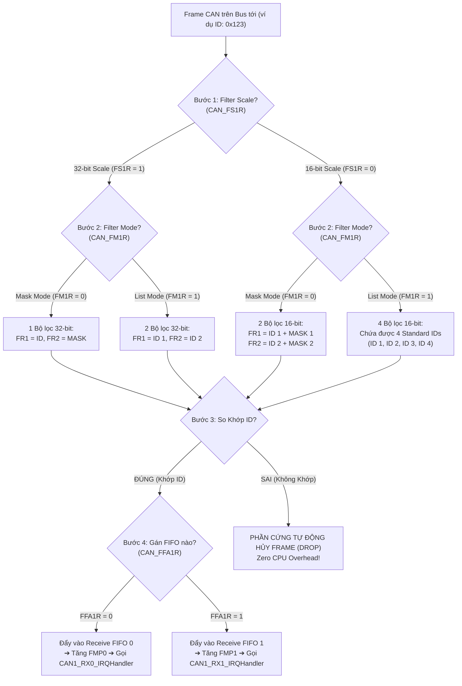
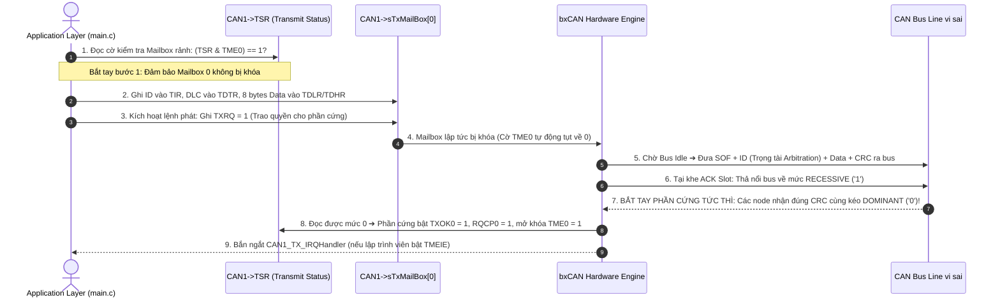
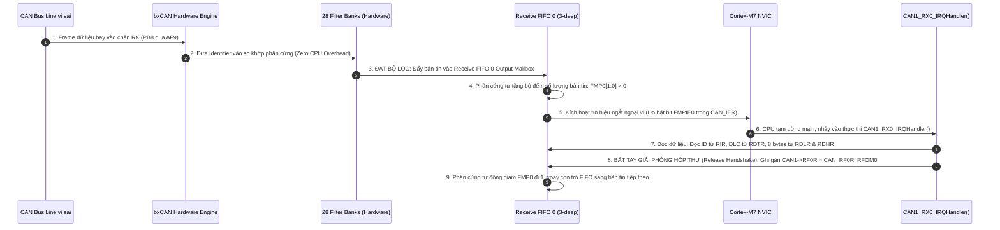
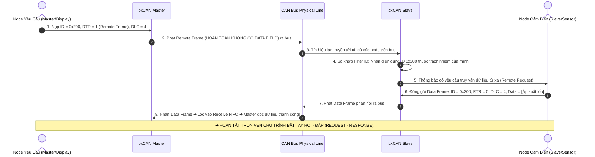
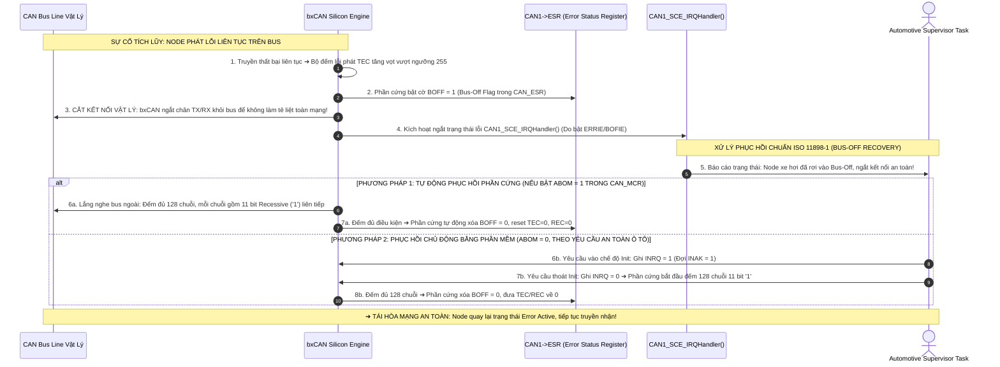

# 🏆 [NGÀY 3] CẨM NANG TOÀN DIỆN BARE-METAL: bxCAN CONTROLLER, 28 FILTER BANKS & AUTOMOTIVE BUS-OFF RECOVERY
## Lộ trình 4 Bước: Nguyên Lý Phần Cứng ➔ Thực Chiến RM0385 ➔ Gõ Code Driver ➔ Phỏng Vấn Chuyên Sâu

> **Mục tiêu:** Làm chủ từ gốc rễ mạch vi sai CAN Bus, tra cứu Reference Manual (RM0385) và Datasheet (DS10610), tính toán thông số Bit Timing chuẩn CiA 301 ($500\text{ kbps}$, Sample Point $87.5\%$), cấu hình 28 Filter Banks (Mask/List Mode), quản lý 3 Transmit Mailboxes / 2 Receive FIFOs, xử lý ngắt nhận dữ liệu và thuật toán phục hồi lỗi chuẩn công nghiệp ô tô (**Automotive Bus-Off Recovery**) trên STM32F746 (ARM Cortex-M7).  
> **Nguyên tắc kỹ thuật:** **Đi thẳng vào cơ chế phần cứng, thanh ghi, công thức toán học, bảng tra cứu và phân chia file rõ ràng — KHÔNG dùng ví dụ ẩn dụ ngoài lề dài dòng.**

---

```text
┌─────────────────────────────────────────────────────────────────────────────────────────────────┐
│                           LỘ TRÌNH 4 BƯỚC CHINH PHỤC NGÀY 3                                     │
├───────────────────┬───────────────────┬────────────────────────────┬────────────────────────────┤
│ BƯỚC 1: NGUYÊN LÝ │ BƯỚC 2: THỰC CHIẾN│ BƯỚC 3: GÕ CODE            │ BƯỚC 4: PHỎNG VẤN          │
│ • Bus Vi sai CAN  │ • Tra cứu RM0385  │ • Gắn nhãn file cụ thể     │ • Bộ 7 câu hỏi vặn bxCAN   │
│ • Mailboxes/FIFOs │   & DS10610       │ • TODO 1-3 [can.h]         │ • Bit Stuffing & CRC Error │
│ • Bit Timing Math │ • Bảng Base Addr  │ • TODO 4-8 [can.c]         │ • CAN1 Master Filter Trap  │
│ • 28 Filter Banks │ • Bảng Thanh ghi  │ • TODO 9 [main.c]          │ • Kịch bản trả lời 60s     │
│ • 4 Handshake Diag│ • Bảng W1C        │ • Mổ xẻ 5 Bug phần cứng    │   (Elevator Pitch)         │
└───────────────────┴───────────────────┴────────────────────────────┴────────────────────────────┘
```

---

## 🛠️ RÀ SOÁT 7 QUY TẮC BARE-METAL CỐT LÕI (CHUYÊN CHO NGÀY 3)

| STT | Quy tắc Bare-metal | Thể hiện cụ thể trong Ngày 3 (bxCAN) |
| :---: | :--- | :--- |
| **1** | **Reset Value** | Tra cứu giá trị mặc định của `CAN_MCR` (`0x0001 0002` - chế độ Sleep bật sẵn), `CAN_BTR`, `CAN_FMR` (`0x2A1C 0E01` - cờ `FINIT = 1`) trước khi cấu hình. |
| **2** | **Access Type** | **CỰC KỲ QUAN TRỌNG:** Thanh ghi `CAN_TSR` (các cờ `RQCPx`, `TXOKx`) và `CAN_RFR` (cờ `FULLx`, bit giải phóng `RFOMx`) là dạng `rc_w1` (Write 1 to Clear) hoặc `rs` (Write 1 to Set). **TUYỆT ĐỐI KHÔNG DÙNG `|=`**, phải ghi gán trực tiếp `=` để không xóa nhầm trạng thái của Mailbox khác! |
| **3** | **Multi-Bit Clear-Set** | Áp dụng quy tắc xóa trước - gán sau (`REG &= ~MASK; REG |= VALUE;`) cho các trường đa bit: `TS1[3:0]`, `TS2[2:0]`, `SJW[1:0]`, `BRP[9:0]`, `CAN2SB[5:0]`, `DLC[3:0]`, `STID[10:0]`. |
| **4** | **`volatile` Qualification** | Mọi struct ánh xạ thanh ghi CAN và các biến chia sẻ giữa ngắt ISR và main (`can_rx_count`, `can_bus_off_flag`) bắt buộc khai báo `volatile`. |
| **5** | **Interrupt Workflow** | Quy trình 5 bước ngắt nhận `CAN1_RX0_IRQHandler`: Cờ phần cứng `FMP0 > 0` $\rightarrow$ Bật `CAN_IER_FMPIE0` $\rightarrow$ Bật `NVIC_EnableIRQ(CAN1_RX0_IRQn)` $\rightarrow$ Đọc dữ liệu từ `CAN_RDLR`/`CAN_RDHR` trong ISR $\rightarrow$ Giải phóng mailbox bằng lệnh `CAN1->RF0R = CAN_RF0R_RFOM0`. |
| **6** | **RM / DS Lookup** | Cung cấp chính xác Chapter, Section, từ khóa `Ctrl + F`, công thức `Base Address + Offset` cho `CAN1`, `CAN2`, `CAN Filters`, `GPIOB`. |
| **7** | **Hardware Rationale & Specs** | Bố trí cơ sở kỹ thuật, giới hạn phần cứng ($f_{PCLK1} \le 54\text{MHz}$, Bit Timing chuẩn CiA 301 Sample Point $87.5\%$, 3 Transmit Mailboxes, 2 FIFO nhận 3 tầng) liền kề từng bảng thanh ghi. |

---

# 🧠 BƯỚC 1: NGUYÊN LÝ PHẦN CỨNG & CƠ CHẾ VẬT LÝ (HARDWARE ARCHITECTURE)

## 1.1. Kiến trúc Mạng CAN & Sự Cần Thiết của CAN Transceiver Rời

Chip STM32F746NG chỉ tích hợp khối **CAN Controller (bxCAN)**, chịu trách nhiệm ở tầng liên kết dữ liệu (Data Link Layer: mã hóa bit, nhồi bit - bit stuffing, tính toán mã kiểm tra CRC, phân định ưu tiên ID). 

Để giao tiếp trên bus vật lý ngoài, tín hiệu số từ STM32 phải đi qua chip chuyển đổi **CAN Transceiver** (ví dụ: `SN65HVD230` nguồn 3.3V hoặc `TJA1050` nguồn 5V):

```text
┌─────────────────────────── STM32F746NG Microcontroller ──────────────────────────┐
│                                                                                  │
│   ┌────────────────────────┐      TX Line (PB9)          ┌──────────────────┐    │
│   │  bxCAN Controller      │ ──────────────────────────► │  CAN Transceiver │    │
│   │  - 3 TX Mailboxes      │                             │  (SN65HVD230)    │ ───► CAN_H (3.5V)
│   │  - 2 RX FIFOs (3-deep) │ ◄────────────────────────── │  (Chuyển đổi     │ ───► CAN_L (1.5V)
│   │  - 28 Filter Banks     │      RX Line (PB8)          │   Logic <-> Bus) │     (Bus Vi Sai)
│   └────────────────────────┘                             └──────────────────┘
└──────────────────────────────────────────────────────────────────────────────────┘
```

> [!NOTE]
> **Thực hành trên Kit STM32F746G-DISCO (Không có CAN Transceiver):**  
> Bo mạch Discovery STM32F746G-DISCO **không hàn sẵn chip CAN Transceiver ngoài**. Nếu chưa cắm thêm module SN65HVD230 ngoài, bạn hãy cấu hình bit **`CAN_BTR_LBKM = 1` (Loopback Mode)** trong thanh ghi `CAN1->BTR`.  
> Ở chế độ Loopback, khối phần cứng `bxCAN` tự động nối tín hiệu `TX` chui thẳng ngược về `RX` ngay bên trong vi điều khiển, giúp bạn thực hành tự gửi/nhận ngắt CAN hoàn hảo $100\%$ trên duy nhất 1 bo mạch mà không cần cắm thêm bất kỳ linh kiện nào ngoài.

```text
┌───────────────────────────────── STM32F746NG Microcontroller ──────────────────────────────────┐
│                                                                                                │
│   ┌────────────────────────────────────────────────────────────────────────────────────────┐   │
│   │  bxCAN Controller (Chế độ LOOPBACK MODE: CAN_BTR_LBKM = 1)                             │   │
│   │                                                                                        │   │
│   │  ┌───────────────────────┐   Đường nối lặp nội bộ    ┌──────────────────────────────┐  │   │
│   │  │  3 TX Mailboxes       ├──────────────────────────►│ 28 Filter Banks ➔ 2 RX FIFOs│  │   │
│   │  └───────────┬───────────┘    (Internal Loopback)    └──────────────▲───────────────┘  │   │
│   └──────────────┼──────────────────────────────────────────────────────┼──────────────────┘   │
│                  │                                                      │                      │
│            Cổng phát TX                                           Cổng nhận RX                 │
│             (Chân PB9)                                             (Chân PB8)                  │
│                  │                                                      │                      │
│                  └────── Ngắt kết nối khỏi chân vật lý bên ngoài ───────┘                      │
│                           (Không cần Chip Transceiver ngoài)                                   │
└────────────────────────────────────────────────────────────────────────────────────────────────┘
```

### Mức logic trên Bus Vi sai CAN (Differential Bus):
* **Trạng thái Dominant (Mức logic 0 - Mức Thống trị):**
  * Chân `CAN_H` được kéo lên $\approx 3.5\text{ V}$. Chân `CAN_L` được kéo xuống $\approx 1.5\text{ V}$.
  * Điện áp vi sai: $V_{DIFF} = V_{CAN\_H} - V_{CAN\_L} \approx 2.0\text{ V} > 0.9\text{ V}$.
  * Nếu một node phát mức 0 và một node phát mức 1 cùng lúc, mức 0 sẽ đè bẹp mức 1 trên bus (Cơ chế phân định quyền ưu tiên Bus Arbitration).
* **Trạng thái Recessive (Mức logic 1 - Mức Ẩn / Trạng thái Nghỉ):**
  * Cả hai dây `CAN_H` và `CAN_L` đều được thả về mức điện áp trung gian $\approx 2.5\text{ V}$.
  * Điện áp vi sai: $V_{DIFF} = V_{CAN\_H} - V_{CAN\_L} \approx 0\text{ V} < 0.5\text{ V}$.

---

## 1.1b. Cấu Trúc Khung Truyền CAN 2.0A/B: Giải Phẫu Data Frame, Vùng Bit Stuffing & Khung Báo Lỗi (Error Frame)

Mặc dù khối phần cứng `bxCAN` trên STM32F7 tự động hóa $100\%$ việc đóng gói và giải mã khung truyền, việc hiểu rõ từng bit trong **CAN Frame** là điều kiện tiên quyết để phân tích gói tin trên máy hiện sóng (Oscilloscope/Logic Analyzer) và chẩn đoán các mã lỗi trong thanh ghi `CAN_ESR`.

### 1. Giải Phẫu Khung Dữ Liệu Chuẩn (Standard CAN 2.0A Data Frame)

Một gói tin CAN dữ liệu chuẩn 11-bit ID gồm **7 trường liên tiếp** được sắp xếp chặt chẽ:

```text
┌──────┬──────────────────┬──────────────┬───────────────┬──────────────────┬──────────┬──────────────┬──────────────────┐
│ SOF  │ Arbitration Field│ Control Field│  Data Field   │    CRC Field     │ACK Field │ End of Frame │   Intermission   │
│1 bit │     12 bits      │    6 bits    │ 0 .. 8 Bytes  │     16 bits      │  2 bits  │ (EOF) 7 bits │     (3 bits)     │
│ '0'  │ 11-bit ID + RTR  │ IDE + r0+DLC │ (0..64 bits)  │ 15-bit CRC+Delim │Slot+Delim│  Toàn bit 1  │   Toàn bit 1     │
└──────┴──────────────────┴──────────────┴───────────────┴──────────────────┴──────────┴──────────────┴──────────────────┘
▲                                                                          ▲          ▲              ▲
│◄────────────────────── VÙNG ÁP DỤNG BIT STUFFING ───────────────────────►│          │              │
│  (Cứ 5 bit 0 liên tiếp ➔ chèn 1 bit 1; 5 bit 1 liên tiếp ➔ chèn 1 bit 0) │          │              │
                                                                           │◄─── VÙNG CỐ ĐỊNH (KHÔNG STUFFING) ──────►│
                                                                           │  (EOF: 7 bit '1', Intermission: 3 bit '1')│
```

#### Chi tiết các trường thành phần:
1. **`SOF` (Start of Frame - 1 bit Dominant '0'):**
   * Đánh dấu sự bắt đầu của gói tin sau khi bus ở trạng thái rảnh (Idle).
   * Cạnh xuống của bit này kích hoạt **Hard Synchronization** trên tất cả các node để đồng bộ pha ban đầu.
2. **`Arbitration Field` (Trường Phân định Ưu tiên - 12 bits):**
   * `Identifier [10:0]` (11 bits): Địa chỉ nhận dạng của bản tin (ID càng nhỏ, quyền ưu tiên càng cao).
   * `RTR` (Remote Transmission Request - 1 bit): Phân biệt loại khung:
     * `0` (Dominant) = **Data Frame** (Gói tin chứa dữ liệu thực tế).
     * `1` (Recessive) = **Remote Frame** (Khung yêu cầu node khác gửi dữ liệu).
3. **`Control Field` (Trường Điều khiển - 6 bits):**
   * `IDE` (Identifier Extension - 1 bit): `0` = Khung chuẩn Standard 11-bit (CAN 2.0A); `1` = Khung mở rộng Extended 29-bit (CAN 2.0B).
   * `r0` (Reserved bit - 1 bit): Bit dự phòng, bắt buộc phát mức Dominant (`0`).
   * `DLC[3:0]` (Data Length Code - 4 bits): Báo số byte dữ liệu trong Data Field (từ `0` đến `8`).
4. **`Data Field` (Trường Dữ liệu - $0 \sim 8\text{ Bytes}$):** Chứa payload truyền thực tế (tối đa 64 bits), truyền bit trọng số lớn (MSB) trước.
5. **`CRC Field` (Trường Kiểm tra Mã Thừa Tuần Hoàn - 16 bits):**
   * `CRC Sequence` (15 bits): Mã băm đa thức $x^{15} + x^{14} + x^{10} + x^8 + x^7 + x^4 + x^3 + 1$ để bảo vệ tính toàn vẹn của SOF, Arbitration, Control và Data.
   * `CRC Delimiter` (1 bit Recessive '1'): Bit ranh giới cố định ngăn cách giữa CRC và ACK.
6. **`ACK Field` (Trường Xác nhận - 2 bits):**
   * `ACK Slot` (1 bit): Node phát truyền ra mức Recessive (`1`). Mọi node nhận đúng dữ liệu và khớp CRC trên bus sẽ **chủ động kéo bus xuống Dominant (`0`)** tại chu kỳ bit này để báo xác nhận nhận thành công!
   * `ACK Delimiter` (1 bit Recessive '1'): Bit ranh giới cố định kết thúc trường ACK.
7. **`End of Frame (EOF)` (Trường Kết thúc Khung - 7 bits Recessive '1' CỐ ĐỊNH):**
   * Chuỗi 7 bit mức 1 liên tiếp báo hiệu gói tin đã được truyền tải hoàn tất và thành công.
8. **`Intermission (ITM)` (Khoảng phân cách - 3 bits Recessive '1'):**
   * Thuộc vùng `Interframe Space (IFS)`. Sau 3 bit này, đường bus mới chính thức quay về trạng thái **Bus Idle**, cho phép các node bắt đầu phát `SOF` cho gói tin kế tiếp.

---

### 2. Quy Luật Bit Stuffing & Vùng Miễn Trừ

* **Quy tắc Chuẩn ISO 11898-1:** Trong vùng dữ liệu, nếu xuất hiện **5 bit liên tiếp có cùng mức logic**, phần cứng bộ điều khiển CAN tự động chèn thêm **1 bit có mức logic đảo ngược**:
  * Chuỗi `00000` $\implies$ Tự động chèn `1` thành `00000`**`1`**.
  * Chuỗi `11111` $\implies$ Tự động chèn `0` thành `11111`**`0`**.
* **Phía nhận (Destuffing):** Bộ thu tự động kiểm tra bit thứ 6. Nếu là bit đảo, nó xóa bỏ bit đó để khôi phục luồng dữ liệu gốc. Nếu bit thứ 6 trùng mức logic với 5 bit trước $\implies$ Báo lỗi **Stuff Error**.
* **Vùng Áp Dụng:** Bắt đầu từ **`SOF`** đến hết trường **`CRC Sequence`**.
* **Vùng Miễn Trừ (Tuyệt đối KHÔNG áp dụng Bit Stuffing):**
  * `CRC Delimiter` (1 bit '1')
  * `ACK Field` (`ACK Slot` + `ACK Delimiter` = 2 bits)
  * `End of Frame (EOF)` (7 bit '1')
  * `Intermission` (3 bit '1')
  * 👉 *Lý do kỹ thuật:* Nếu áp dụng Bit Stuffing vào EOF, chuỗi 7 bit '1' sẽ bị chèn 1 bit '0' vào giữa, làm phá vỡ cấu trúc ranh giới cố định và khiến các node không thể nhận biết được thời điểm kết thúc gói tin!

---

### 3. Cơ Chế Khung Báo Lỗi (Error Frame) & Phản Ứng Dây Chuyền Bẻ Gãy Bit Stuffing

Khi một node trên mạng phát hiện ra sự cố (ví dụ: tính sai mã CRC, không nhận được ACK, hoặc phát hiện vi phạm định dạng Form Error), nó không im lặng mà **chủ động phá hủy gói tin đang truyền** để cảnh báo toàn bộ mạng thông qua **Error Frame**:

```text
Khung Báo Lỗi Chủ Động (Active Error Frame):
┌──────────────────────────────────────────────┬──────────────────────────────────┐
│         Active Error Flag (6 ~ 12 bits)      │     Error Delimiter (8 bits)     │
│   6 bit Dominant '0' (Node phát hiện lỗi)    │       8 bit Recessive '1'        │
│ + 0 ~ 6 bit Dominant '0' từ các Node khác    │   (Tất cả các Node đồng loạt nhả)│
└──────────────────────────────────────────────┴──────────────────────────────────┘
```

#### Phản ứng dây chuyền bẻ gãy Bit Stuffing (Error Cascade):
1. Node phát hiện lỗi lập tức cưỡng bức phát ra **`Active Error Flag = 6 bit Dominant ('0')` liên tiếp**.
2. **Kích hoạt phản ứng dây chuyền:** Vì trong vùng dữ liệu tối đa chỉ có 5 bit 0 liên tiếp (do luật Bit Stuffing), khi chuỗi 6 bit 0 này xuất hiện, **TẤT CẢ các node khác trên bus lập tức phát hiện vi phạm luật Bit Stuffing (Stuff Error)**!
3. Toàn bộ các node nhận cũng đồng loạt phóng ra 6 bit Dominant của riêng chúng $\implies$ Kết quả là trên bus xuất hiện một chuỗi từ **6 đến tối đa 12 bit Dominant ('0')**.
4. Gói tin bị hủy bỏ hoàn toàn trên toàn mạng. Sau đó các node cùng phát **`Error Delimiter = 8 bit Recessive ('1')`** để trả bus về trạng thái cân bằng.
5. Node phát ban đầu sẽ tự động phát lại gói tin (Automatic Retransmission) sau khoảng thời gian Intermission.

---

### 4. Bảng Ánh Xạ Mã Lỗi Thanh Ghi Phần Cứng RM0385 (`CAN_ESR -> LEC[2:0]`)

Khi phần cứng `bxCAN` trên STM32F7 gặp sự cố, trường **`LEC[2:0]` (Last Error Code)** trong thanh ghi `CAN_ESR` (Offset `0x18`) ghi lại chính xác loại lỗi vừa xảy ra:

| Giá trị `LEC[2:0]` | Tên Mã Lỗi | Mô tả Chi tiết Cơ chế Phần cứng |
| :---: | :--- | :--- |
| **`000`** | **No Error** | Không có lỗi nào xảy ra kể từ lần đọc trước. |
| **`001`** | **Stuff Error** | Phát hiện **6 bit liên tiếp cùng mức** trong vùng dữ liệu (vi phạm luật Bit Stuffing). |
| **`010`** | **Form Error** | Phát hiện mức logic sai quy định tại các trường cố định: `CRC Delimiter`, `ACK Delimiter`, hoặc `EOF` (ví dụ: bị kéo xuống Dominant '0' thay vì Recessive '1'). |
| **`011`** | **Acknowledgment Error** | Node phát gửi gói tin nhưng trong chu kỳ `ACK Slot` không có bất kỳ node nào trên bus kéo xuống Dominant '0' để xác nhận. |
| **`100`** | **Bit Recessive Error** | Node phát muốn phát mức Recessive ('1') nhưng khi đo lại trên bus thì thấy mức Dominant ('0') (xảy ra ngoài vùng phân định Arbitration). |
| **`101`** | **Bit Dominant Error** | Node phát muốn phát mức Dominant ('0') nhưng khi đo lại trên bus lại thấy mức Recessive ('1'). |
| **`110`** | **CRC Error** | Mã CRC do bên nhận tính toán lại dựa trên dữ liệu không khớp với 15-bit `CRC Sequence` nhận được trong gói tin. |

---

### 5. Khung Yêu Cầu Dữ Liệu Từ Xa (Remote Frame) & Cơ Chế Bắt Tay Hỏi - Đáp (Request - Response)

Trong mạng CAN, ngoài cơ chế gửi chủ động (Data Frame), chuẩn ISO 11898-1 cung cấp cơ chế **"Bắt tay hỏi - đáp" (Polling / Request-Response Handshake)** thông qua **Remote Frame**:

```text
Khung Yêu Cầu Dữ Liệu (Remote Frame - RTR = 1):
┌──────┬──────────────────┬──────────────┬──────────────────┬──────────┬──────────────┬──────────────────┐
│ SOF  │ Arbitration Field│ Control Field│    CRC Field     │ACK Field │ End of Frame │   Intermission   │
│1 bit │     12 bits      │    6 bits    │     16 bits      │  2 bits  │ (EOF) 7 bits │     (3 bits)     │
│ '0'  │ 11-bit ID + RTR=1│ IDE + r0+DLC │ 15-bit CRC+Delim │Slot+Delim│  Toàn bit 1  │   Toàn bit 1     │
└──────┴──────────────────┴──────────────┴──────────────────┴──────────┴──────────────┴──────────────────┘
       ▲                  ▲              ▲
       │                  │              │  TUYỆT ĐỐI KHÔNG CÓ TRƯỜNG DỮ LIỆU (DATA FIELD = 0 BITS)!
       │                  │              └─ (Dù DLC vẫn khai báo số byte mong muốn nhận!)
       └──────────────────┴──────────────── RTR = 1 (Recessive - Mức yếu)
```

#### Đặc điểm kỹ thuật của Remote Frame:
1. **Bit RTR = 1 (Recessive - Mức 1):** Báo hiệu đây là khung yêu cầu dữ liệu từ xa, không mang payload.
2. **HOÀN TOÀN KHÔNG CÓ Data Field:** Dù trường `DLC[3:0]` vẫn chứa giá trị từ $0 \sim 8$ (để báo cho node sở hữu ID biết số byte dữ liệu mà node yêu cầu đang mong muốn nhận về), phần cứng CAN Controller **nhảy thẳng từ Control Field sang CRC Field** mà không truyền bất kỳ byte dữ liệu nào trên bus!
3. **Quy trình bắt tay:** Node Master (ví dụ: Màn hình hiển thị) phát một Remote Frame với `ID = 0x200, RTR = 1, DLC = 4`. Node Slave (Cảm biến áp suất dầu) nhận diện đúng ID `0x200` của mình $\implies$ Node Slave lập tức kích hoạt phát một **Data Frame (`ID = 0x200, RTR = 0, DLC = 4, Data = [..]`)** để trả lời.
4. **Luật Trọng tài Phân định khi Đụng độ (Arbitration Clashing):**
   * *Tình huống:* Node A phát Remote Frame (`ID = 0x200, RTR = 1`), cùng thời điểm đó Node B cũng chuẩn bị sẵn dữ liệu và phát Data Frame (`ID = 0x200, RTR = 0`).
   * *Kết quả:* Hai bên cùng phát 11 bit ID giống hệt nhau $\to$ Đến bit thứ 12 (`RTR`):
     * Node B phát mức `0` (Dominant).
     * Node A phát mức `1` (Recessive).
     * Mức `0` đè bẹp mức `1` $\implies$ **Data Frame của Node B CHIẾN THẮNG PHÂN ĐỊNH tuyệt đối!**
     * Node A thua cuộc, lập tức rút lui chuyển sang chế độ nhận, và vừa vặn đọc được ngay gói Data Frame mà nó đang cần!

---

### 6. Khung Báo Quá Tải (Overload Frame) & Cơ Chế Bắt Tay Trì Hoãn (Flow Control Delay)

Khi một vi điều khiển trên mạng xử lý quá chậm hoặc hàng đợi FIFO bên trong bị đầy tạm thời, nó sử dụng **Overload Frame** như một cơ chế **bắt tay xin hoãn (Flow Control Handshake)**:

```text
Khung Báo Quá Tải (Overload Frame):
┌──────────────────────────────────────────────┬──────────────────────────────────┐
│        Overload Flag (6 ~ 12 bits)           │    Overload Delimiter (8 bits)   │
│   6 bit Dominant '0' (Node yêu cầu hoãn)     │       8 bit Recessive '1'        │
│ + 0 ~ 6 bit Dominant '0' từ các Node khác    │   (Tất cả các Node đồng loạt nhả)│
└──────────────────────────────────────────────┴──────────────────────────────────┘
▲
│ NẰM NGAY TRONG VÙNG INTERMISSION (Sau EOF của frame trước đó)
```

#### Cơ chế hoạt động:
* **Vị trí xuất hiện:** Không nằm ở vùng dữ liệu, mà **phát ngay tại bit thứ 1 hoặc thứ 2 của vùng Intermission (ITM)** — nơi mà chuẩn quy định bus bắt buộc phải là Recessive '1'.
* **Tác dụng:** Cưỡng bức kéo bus xuống Dominant '0' trong 6 bit liên tiếp. Tất cả các node khác nhận thấy sườn xuống này sẽ nhận biết đây là Overload Frame, tự động hủy bỏ bộ đếm Intermission hiện tại và chờ thêm một chu kỳ Intermission mới.
* **Hệ quả:** Trì hoãn việc phát frame tiếp theo thêm tối đa **20 chu kỳ bit** (6 bit Flag + 8 bit Delimiter + 3 bit Intermission mới) để node nhận kịp giải phóng bộ nhớ đệm.

---

### 7. Cơ Chế Bắt Tay Phần Cứng Tức Thời (In-Frame ACK Slot Handshake)

Đây là cơ chế bắt tay nhanh và độc đáo nhất trong các chuẩn truyền thông công nghiệp, diễn ra **ngay bên trong chu kỳ của một bit duy nhất** (`ACK Slot`):

```text
           Bên Phát (Transmitter)               Bên Nhận (Receivers - 1 hoặc nhiều node)
                     │                                             │
      Phát đến hết trường CRC Sequence                             │ Lắng nghe và tự tính toán CRC nội bộ
                     │                                             │
                     ▼                                             ▼
          1. Nhả bus về RECESSIVE ('1')                  2. So khớp CRC tính được == CRC nhận được?
             tại khe ACK Slot!                                     │
                     │                                             ├─── KHỚP CRC:
                     │                                             │    ÉP BUS XUỐNG DOMINANT ('0')!
                     │                                             │
                     │ ◄──────── BẮT TAY PHẦN CỨNG TỨC THÌ ────────┘
                     ▼
          3. Đo ngược lại mức điện áp trên bus:
             • Đọc thấy mức DOMINANT ('0') ➔ Gói tin đã có ít nhất 1 node nhận thành công!
             • Đọc thấy mức RECESSIVE ('1') ➔ Không có ai nhận (ACK Error ➔ TEC += 8 ➔ Phát lại).
```

* **Zero Protocol Overhead:** Việc xác nhận (ACK) không cần phải gửi thêm một bản tin phản hồi riêng biệt tốn băng thông như TCP hay các giao thức UART/SPI, mà hoàn tất ngay trong chu kỳ $2\,\mu	ext{s}$ của bit ACK!

---

### 8. Bảng Tổng Hợp Đối Chiếu 4 Loại Khung Trong Chuẩn CAN (ISO 11898-1)

| Loại Khung (Frame Type) | Mục Đích Sử Dụng | Vị Trí / Đặc Điểm Nhận Dạng | Bit RTR | Có Data Field? |
| :--- | :--- | :--- | :---: | :---: |
| **Data Frame** | Truyền tải dữ liệu thực tế từ bên phát tới toàn bộ mạng. | Bắt đầu bằng SOF '0', kết thúc bằng 7 bit EOF '1'. | **`0`** (Dominant) | **CÓ** ($0 \sim 8$ Bytes) |
| **Remote Frame** | Bắt tay yêu cầu (hỏi) dữ liệu từ node khác mà không cần phát định kỳ. | Bắt đầu bằng SOF '0', cấu trúc giống Data Frame nhưng không có Data. | **`1`** (Recessive) | **KHÔNG** ($0$ Bytes) |
| **Error Frame** | Báo động và phá hủy gói tin tức thì khi phát hiện vi phạm quy chuẩn. | Phát bất kỳ lúc nào khi gặp lỗi: 6 bit Dominant '0' (Active) hoặc 6 bit '1' (Passive). | Không áp dụng | **KHÔNG** |
| **Overload Frame** | Bắt tay xin hoãn truyền frame kế tiếp khi bộ đệm chưa kịp xử lý. | Phát tại vùng Intermission (sau EOF): 6 bit Dominant '0' + 8 bit Recessive '1'. | Không áp dụng | **KHÔNG** |

---

## 1.2. Cấu trúc Nội bộ của bxCAN: Mailboxes, FIFOs & Filter Banks

```text
                               ┌──────────────────────────────────────────────────┐
                               │                 bxCAN CORE ENGINE                │
                               │ - Protocol Controller (Bit stuffing, CRC, ACK)   │
                               │ - Baud Rate Prescaler (Bit Timing Logic)         │
                               └──────────────────────────────────────────────────┘
                                        ▲                               ▲
                         Gửi dữ liệu    │                               │  Nhận dữ liệu
              ┌─────────────────────────┴────────┐            ┌─────────┴────────────────────────┐
              │     3 TRANSMIT MAILBOXES         │            │       28 FILTER BANKS            │
              │  ┌────────────────────────────┐  │            │  (CAN1 Master quản lý chia sẻ)   │
              │  │ Mailbox 0 (TIR, TDTR, TDR) │  │            └─────────────────┬────────────────┘
              │  ├────────────────────────────┤  │                              │
              │  │ Mailbox 1 (TIR, TDTR, TDR) │  │               Đạt điều kiện  │
              │  ├────────────────────────────┤  │               lọc ID         ▼
              │  │ Mailbox 2 (TIR, TDTR, TDR) │  │            ┌──────────────────────────────────┐
              │  └────────────────────────────┘  │            │       2 RECEIVE FIFOs (3-deep)   │
              │   Tự động chọn Mailbox có ID     │            │  ┌────────────────────────────┐  │
              │   ưu tiên cao nhất để gửi trước! │            │  │ FIFO 0: Mailbox 0, 1, 2    │  │
              └──────────────────────────────────┘            │  ├────────────────────────────┤  │
                                                              │  │ FIFO 1: Mailbox 0, 1, 2    │  │
                                                              │  └────────────────────────────┘  │
                                                              └──────────────────────────────────┘
```

* **3 Hộp thư Phát (Transmit Mailboxes 0, 1, 2):** Cho phép nạp sẵn tối đa 3 bản tin. bxCAN tự động so sánh ID giữa các mailbox đang chờ để phát bản tin có Identifier nhỏ nhất (ưu tiên cao nhất) ra bus trước.
* **2 Hộp thư Nhận FIFO (Receive FIFOs 0 và 1):** Mỗi FIFO có cấu trúc hàng đợi 3 tầng sâu (3-deep). Nếu ứng dụng chưa kịp đọc bản tin thứ 1, phần cứng vẫn có thể nhận tiếp bản tin thứ 2 và thứ 3 mà không bị mất dữ liệu (Overrun).

---

## 1.3. Tính Toán CAN Bit Timing Chuẩn CiA 301 & Cơ Chế Đồng Bộ Hóa Toàn Cảnh

---

### ⏱️ 1.3.1. Các Khái Niệm & Định Nghĩa Nền Tảng Của CAN Bit Timing

Trước khi đi vào các bước tính toán số học, các khái niệm thời gian trong mạng CAN được chuẩn hóa quốc tế theo ISO 11898-1 và Reference Manual RM0385 như sau:

#### 1. Chu kỳ 1 Bit CAN (T_bit) và Tốc độ Baudrate
* Thời lượng của 1 bit là khoảng thời gian để truyền trọn vẹn 1 bit dữ liệu trên bus:
  ```text
  T_bit = 1 / Baudrate
  ```
  *Ví dụ:* Ở tốc độ 500 kbps (500,000 bps), chu kỳ 1 bit là:
  ```text
  T_bit = 1 / 500,000 = 0.000002 s = 2000 ns (2.0 µs)
  ```

#### 2. Bản chất của tq (Time Quantum) & Bộ chia BRP (Baud Rate Prescaler)
* **tq (Time Quantum - số nhiều: Time Quanta):** Là **đơn vị thời gian nguyên tử nhỏ nhất (Atomic Clock Tick)** của khối điều khiển Bit Timing Logic (BTL) trong silicon CAN controller.
* **Cách tạo ra từ phần cứng:** Bộ điều khiển CAN không đếm bit bằng micro-giây tùy ý, mà dùng một bộ chia tần số số học **Baud Rate Prescaler (BRP)** từ xung nhịp bus f_PCLK1 (trên STM32F746 là 54 MHz):
  ```text
  tq = BRP / f_PCLK1
  ```
* **Lượng tử hóa chu kỳ bit:** Chu kỳ T_bit luôn được cấu thành từ một **số nguyên lần các đơn vị tq** (N_q nằm trong khoảng từ 8 đến 25 tq theo chuẩn ISO 11898-1):
  ```text
  T_bit = N_q * tq
  ```

#### 3. Bốn Phân Đoạn (Segments) Cấu Thành 1 Bit CAN (ISO 11898-1)
Chu kỳ 1 bit CAN được chia làm 4 phân đoạn liên tiếp với nhiệm vụ vật lý riêng biệt:

1. **`Sync_Seg` (Synchronization Segment - Đoạn Đồng bộ):**
   * **Độ dài:** Cố định đúng **1 tq** (phần cứng quy định, không thể thay đổi).
   * **Nhiệm vụ:** Dùng để đồng bộ hóa cạnh xung giữa các nút trên mạng. Cạnh xuống từ Recessive sang Dominant của bit kỳ vọng phải rơi vào đoạn này.
2. **`Prop_Seg` (Propagation Segment - Đoạn Bù trễ Dây dẫn & Transceiver):**
   * **Nhiệm vụ:** Bù trừ độ trễ vật lý khi tín hiệu điện chạy dọc trên đường dây cáp và đi qua các cổng bán dẫn của chip CAN Transceiver.
   * **Cơ sở vật lý:** Tín hiệu từ Node A phải truyền tới Node xa nhất B, rồi từ Node B phản hồi ngược lại Node A trong cùng 1 chu kỳ bit:
     ```text
     T_Prop_Seg >= 2 * (t_wire_delay + t_transceiver_delay)
     ```
   * Đoạn này giúp điện áp trên toàn bộ chiều dài sợi cáp đạt trạng thái ổn định phẳng lặng trước khi đo đạc.
3. **`Phase_Seg1` (Phase Buffer Segment 1 - Đoạn Đệm Pha 1):**
   * **Vị trí:** Nằm ngay trước **Điểm lấy mẫu (Sample Point)**.
   * **Nhiệm vụ:** Kéo dài bit khi xung nhịp bị trễ pha (Late Edge) trong quá trình tái đồng bộ (Resynchronization).
4. **`Phase_Seg2` (Phase Buffer Segment 2 - Đoạn Đệm Pha 2):**
   * **Vị trí:** Nằm ngay sau **Điểm lấy mẫu (Sample Point)** kéo dài đến hết bit.
   * **Nhiệm vụ:** Cắt ngắn bit khi xung nhịp bị sớm pha (Early Edge) trong quá trình tái đồng bộ.

#### 4. Quy ước Gộp Của STM32 bxCAN: Khối BS1 và BS2
Để tinh gọn các trường thanh ghi điều khiển `CAN_BTR`, hãng STMicroelectronics gộp 4 phân đoạn trên thành 2 khối:
* **Khối `BS1` (Bit Segment 1):** Gộp chung `Prop_Seg` và `Phase_Seg1`:
  ```text
  BS1 = Prop_Seg + Phase_Seg1   (Cấu hình qua trường TS1[3:0], nhận giá trị từ 1 đến 16 tq)
  ```
* **Khối `BS2` (Bit Segment 2):** Chính là `Phase_Seg2`:
  ```text
  BS2 = Phase_Seg2              (Cấu hình qua trường TS2[2:0], nhận giá trị từ 1 đến 8 tq)
  ```
* Như vậy, tổng số Time Quanta trong 1 bit trên STM32 là:
  ```text
  N_q = Sync_Seg (1 tq) + BS1 + BS2
  ```

#### 5. Khái Niệm Điểm Lấy Mẫu (Sample Point) & Rationale Tại Sao Chọn 87.5%?
* **Điểm lấy mẫu (Sample Point):** Là thời điểm chính xác mà bộ điều khiển CAN đọc điện áp trên bus để chốt giá trị bit đó là mức 0 hay mức 1:
  ```text
  Sample Point (%) = ((Sync_Seg + BS1) / N_q) * 100% = ((1 + BS1) / N_q) * 100%
  ```
* **Tại sao chuẩn CiA 301 / ISO 11898-1 quy định tối ưu là 87.5%?**
  * **Bản chất toán học:** `87.5% = 7/8 = 0.111 (nhị phân)`, là phân số nhị phân tối ưu cho mạch đếm trong vi mạch số.
  * **Cơ sở vật lý:** Điểm lấy mẫu giải quyết mâu thuẫn giữa 2 yêu cầu kỹ thuật:
    * *Muốn đẩy lùi càng về cuối bit càng tốt (> 80%):* Để đoạn `Prop_Seg` đủ dài, cho phép kết nối chiều dài dây cáp đạt tối đa (100 mét ở tốc độ 500 kbps).
    * *Không được đẩy quá sát đuôi bit (< 90%):* Để đoạn `Phase_Seg2` còn đủ không gian cho phần cứng co ngắn bit bù trừ độ trôi tần số (Clock Drift) do thạch anh biến thiên theo nhiệt độ.
    * $\implies$ Điểm cân bằng cực trị hội tụ chính xác tại **87.5%**.

#### 6. Biên Độ Nhảy Bù Pha SJW (Synchronization Jump Width)
* Là số lượng `tq` tối đa mà phần cứng được phép co hoặc dãn trên `Phase_Seg1` và `Phase_Seg2` trong mỗi chu kỳ tái đồng bộ (cấu hình qua trường `SJW[1:0]`, thường chọn `1 tq` đến `4 tq`).

---

### 📐 1.3.2. Quy Trình & Thuật Toán Tính Toán Bit Timing Cho STM32F746

#### 📌 Bước 1: Xác Định Các Thông Số Đầu Vào (Nguồn Gốc Từ Đâu?)
* **Tần số ngoại vi (f_PCLK1):** `54 MHz` (`54,000,000 Hz`). Tra trong Datasheet (DS10610 - Bus APB1 tối đa 54 MHz) và code cấu hình Clock hệ thống Ngày 1.
* **Tốc độ Baudrate mục tiêu (500 kbps):**
  * *Tra ở đâu để biết?* Không nằm trong Reference Manual hay Datasheet. Đây là **yêu cầu hệ thống (System Specification)** được quy định trong **file cơ sở dữ liệu CAN (.DBC)** hoặc các tiêu chuẩn quốc tế như **ISO 15765-4 (OBD-II chẩn đoán ô tô)** và **CiA 301**.
  * Chu kỳ 1 bit: `T_bit = 1 / 500,000 = 2000 ns`.
* **Điểm lấy mẫu mục tiêu:** `87.5%` (Chuẩn CiA 301 cho tốc độ <= 500 kbps).

#### 🔍 Bước 2: Thuật Toán Giải Mã Tìm Nghiệm Số Nguyên N_q và BRP
Để tốc độ truyền đạt độ chính xác tuyệt đối (Baudrate Error = 0.00%), bộ chia BRP bắt buộc phải là một **SỐ NGUYÊN DƯƠNG**.

1. **Thiết lập phương trình:**
   ```text
   BRP = f_PCLK1 / (Baudrate * N_q) = 54,000,000 / (500,000 * N_q) = 108 / N_q
   ```
2. **Ràng buộc:**
   * Phần cứng quy định: `8 <= N_q <= 25`.
   * BRP nguyên $\implies$ **N_q bắt buộc phải là ƯỚC SỐ của 108**.
3. **Tìm các ước số của 108 trong đoạn [8, 25]:**
   Các ước số của 108 gồm: `1, 2, 3, 4, 6, 9, 12, 18, 27, 36, 54, 108`.  
   Trong khoảng `[8, 25]`, ta có đúng **3 ứng viên**:
   * Ứng viên 1: `N_q = 9`   $\implies BRP = 108 / 9 = 12`
   * Ứng viên 2: `N_q = 12`  $\implies BRP = 108 / 12 = 9`
   * Ứng viên 3: `N_q = 18`  $\implies BRP = 108 / 18 = 6`
4. **So khớp Sample Point 87.5% để chọn ứng viên tối ưu:**
   * **Nếu chọn N_q = 9:**
     * `Sample Point 87.5% = 9 * 0.875 = 7.875` --> Chọn `1 + BS1 = 8 tq`.
     * Phân đoạn còn lại: `BS2 = 9 - 8 = 1 tq`.
     * *Rủi ro:* `BS2` chỉ có `1 tq`, biên độ co dãn bù pha quá hẹp (`SJW` tối đa chỉ là 1), rất dễ mất đồng bộ khi nhiệt độ môi trường làm trôi tần số thạch anh. *(Loại)*
   * **Nếu chọn N_q = 12:**
     * `Sample Point 87.5% = 12 * 0.875 = 10.5 tq`.
     * Nếu chọn `1 + BS1 = 10` --> `Sample Point = 10 / 12 = 83.33%` (Lệch nhiều so với chuẩn 87.5%).
     * Nếu chọn `1 + BS1 = 11` --> `Sample Point = 11 / 12 = 91.67%` (Quá sát đuôi bit, `BS2` chỉ còn 1 tq). *(Loại)*
   * **Nếu chọn N_q = 18:**
     * `Sample Point 87.5% = 18 * 0.875 = 15.75` --> Chọn `1 + BS1 = 16 tq` (tức `BS1 = 15 tq`).
     * Phân đoạn còn lại: `BS2 = 18 - 16 = 2 tq`.
     * `Điểm lấy mẫu thực tế = (1 + 15) / 18 = 16 / 18 = 88.89%` (Cực kỳ sát chuẩn quốc tế 87.5%).
     * Đồng thời `BS2 = 2 tq` tạo khoảng đệm an toàn tuyệt đối cho phép cấu hình `SJW = 1 tq` hoặc `2 tq`.
   * 👉 **KẾT LUẬN:** **`N_q = 18` là nghiệm số nguyên duy nhất thỏa mãn trọn vẹn cả 2 điều kiện!**

#### ⏱️ Bước 3: Phân Bổ Chi Tiết Các Phân Đoạn
* `tq = T_bit / 18 = 2000 ns / 18 = 111.11 ns`.
* `BRP = 6`.
* `Sync_Seg = 1 tq`.
* `BS1 = 15 tq` (Bao gồm `Prop_Seg = 7 tq` và `Phase_Seg1 = 8 tq`).
* `BS2 = Phase_Seg2 = 2 tq`.
* `SJW = 1 tq` (hoặc `2 tq`).
* Điểm lấy mẫu: `(1 + 15) / 18 = 16 / 18 = 88.89%`.

---

### 📋 1.3.3. Bảng Tổng Kết Cấu Hình Thanh Ghi CAN_BTR (Tuân Thủ Quy Tắc Phần Cứng N - 1)

Trong Reference Manual RM0385 (Mục 30.9.2 - thanh ghi `CAN_BTR`), phần cứng vi điều khiển **tự động cộng thêm 1** vào giá trị nạp:

```text
Giá trị ghi vào thanh ghi = Giá trị thực tế mong muốn - 1
```

| Tên Trường Bit | Vị Trí Bit | Ý Nghĩa Kỹ Thuật | Giá Trị Thực Tế | Công Thức Tính | Giá Trị Nạp (Dec) | Giá Trị Hex / Nhị Phân |
| :--- | :---: | :--- | :---: | :--- | :---: | :---: |
| **`BRP[9:0]`** | `[9:0]` | Baud Rate Prescaler | `6` | `6 - 1` | **`5`** | `0x005` (`0000000101b`) |
| **`TS1[3:0]`** | `[19:16]` | Time Segment 1 (`BS1`) | `15 tq` | `15 - 1` | **`14`** | `0xE` (`1110b`) |
| **`TS2[2:0]`** | `[22:20]` | Time Segment 2 (`BS2`) | `2 tq` | `2 - 1` | **`1`** | `0x1` (`001b`) |
| **`SJW[1:0]`** | `[25:24]` | Resync Jump Width | `1 tq` | `1 - 1` | **`0`** | `0x0` (`00b`) |

Mã code cấu hình Bare-metal theo chuẩn Clear-then-Set:
```c
/* Bước 1: Xóa trắng 4 trường bit trong CAN_BTR */
CAN1->BTR &= ~((0x03UL << 24) |   /* SJW[1:0] */
               (0x07UL << 20) |   /* TS2[2:0] */
               (0x0FUL << 16) |   /* TS1[3:0] */
               (0x3FFUL << 0));   /* BRP[9:0] */

/* Bước 2: Nạp các giá trị đã tính toán */
CAN1->BTR |= ((0UL << 24)  |      /* SJW = 1 tq (nạp 0)   */
              (1UL << 20)  |      /* TS2 = 2 tq (nạp 1)   */
              (14UL << 16) |      /* TS1 = 15 tq (nạp 14) */
              (5UL << 0));        /* BRP = 6 (nạp 5)      */
```

---

### ⚡ 1.3.4. Bản Chất Vật Lý Của Bit CAN: Phân Tách 2 Trạng Thái Dominant vs. Recessive

Bus CAN truyền tín hiệu vi sai qua 2 dây xoắn đôi (`CAN_H`, `CAN_L`) với 2 điện trở đầu cuối 120 Ohm (`R_bus = 120 || 120 = 60 Ohm`).

```text
========================================================================================================================
TRƯỜNG HỢP 1: TRẠNG THÁI RECESSIVE (MỨC LOGIC 1 - TRẠNG THÁI NGHỈ / ẨN)
========================================================================================================================
Sơ đồ Transceiver:
                 VCC (3.3V / 5V)
                      │
                     [ ] Cầu phân áp nội trở kháng cao
                      ├───► CAN_H = 2.5V ────────────┐
                      │                               │  RL = 60 Ohm
                      │                               │  (Không có dòng điện chạy qua: I_bus ≈ 0 mA)
                      │                               │
                      ├───► CAN_L = 2.5V ────────────┘
                     [ ] Cầu phân áp nội trở kháng cao
                      │
                     GND
• Trạng thái Transistor: Tầng công suất TẮT HOÀN TOÀN (Trở kháng cao High-Z).
• Điện áp Dây CAN_H:     2.5 V (Treo điện áp tự nhiên qua cầu phân áp nội)
• Điện áp Dây CAN_L:     2.5 V (Treo điện áp tự nhiên qua cầu phân áp nội)
• Hiệu điện thế vi sai:  V_DIFF = CAN_H - CAN_L = 2.5V - 2.5V = 0.0 V (Chuẩn ISO: -0.5V <= V_DIFF <= +0.5V)
• Dòng điện Bus:         I_bus ≈ 0 mA
• Chân RX (Vào MCU):     3.3 V (Mức Logic 1)
• Đặc tính phân định:    Bị mức Dominant đè bẹp hoàn toàn nếu có một Node khác phát Dominant cùng lúc.

========================================================================================================================
TRƯỜNG HỢP 2: TRẠNG THÁI DOMINANT (MỨC LOGIC 0 - TRẠNG THÁI THỐNG TRỊ)
========================================================================================================================
Sơ đồ Transceiver:
                 VCC (3.3V / 5V)
                      │
                     ┌┴┐ Transistor High-side DẪN BÃO HÒA (Kéo nguồn chủ động)
                     └┬┘
                      ├───► CAN_H = 3.5V ────────────┐
                      │                               │  Bơm dòng qua trở kết thúc bus:
                      │                               │  I_bus = 2.0V / 60 Ohm ≈ 33.3 mA
                      │                               │
                      ├───► CAN_L = 1.5V ────────────┘
                     ┌┴┐ Transistor Low-side DẪN BÃO HÒA (Kéo mass chủ động)
                     └┬┘
                      │
                     GND
• Trạng thái Transistor: Tầng công suất KÍCH HOẠT DẪN CỰC MẠNH.
• Điện áp Dây CAN_H:     3.5 V (Kéo chủ động lên mức cao)
• Điện áp Dây CAN_L:     1.5 V (Kéo chủ động xuống mức thấp)
• Hiệu điện thế vi sai:  V_DIFF = CAN_H - CAN_L = 3.5V - 1.5V = +2.0 V (Chuẩn ISO: +1.5V <= V_DIFF <= +3.0V)
• Dòng điện Bus:         I_bus = 2.0V / 60 Ohm ≈ 33.3 mA
• Chân RX (Vào MCU):     0.0 V (Mức Logic 0)
• Đặc tính phân định:    THỐNG TRỊ TOÀN BUS. Nếu Node A phát Recessive mà Node B phát Dominant, 
                         dây bus bị ép thành 3.5V/1.5V (V_DIFF = 2.0V). Cả hai đều đọc về mức 0.
```

| Đại lượng Đo Đạc | TRƯỜNG HỢP 1: RECESSIVE (Mức Logic 1) | TRƯỜNG HỢP 2: DOMINANT (Mức Logic 0) |
| :--- | :---: | :---: |
| **Trạng thái Transceiver TXD** | `3.3 V` (Không kích hoạt tầng công suất) | `0.0 V` (Kích hoạt tầng công suất dẫn bão hòa) |
| **Điện áp Dây CAN_H** | **`2.5 V`** (Treo điện áp phân cực trung gian) | **`3.5 V`** (Kéo nguồn chủ động) |
| **Điện áp Dây CAN_L** | **`2.5 V`** (Treo điện áp phân cực trung gian) | **`1.5 V`** (Kéo mass chủ động) |
| **Hiệu điện thế vi sai (V_DIFF)** | `V_DIFF = 2.5V - 2.5V =` **`0.0 V`** (`-0.5V <= V_DIFF <= +0.5V`) | `V_DIFF = 3.5V - 1.5V =` **`+2.0 V`** (`+1.5V <= V_DIFF <= +3.0V`) |
| **Dòng điện tải qua Bus (R_L = 60 Ohm)** | `I_bus ≈` **`0 mA`** | `I_bus ≈` **`33.3 mA`** |
| **Điện áp Chân RX vào Vi điều khiển** | **`3.3 V`** (Mức Logic 1) | **`0.0 V`** (Mức Logic 0) |
| **Quyền ưu tiên Phân định (Arbitration)** | Bị đè bẹp (Yielding) | **Thống trị tuyệt đối (Dominant)** |

---

### 🔄 1.3.5. Cơ Chế Đồng Bộ Hóa (Synchronization) & Phân Tích Dạng Sóng Toàn Cảnh

Bus CAN là giao thức **truyền thông không đồng bộ (Asynchronous)** — không có dây xung Clock đi kèm dữ liệu. Mỗi nút mạng chạy thạch anh riêng, chắc chắn sẽ có sai số trôi tần số (Clock Drift do nhiệt độ và dung sai chế tạo). Nếu không liên tục đồng bộ lại pha, điểm lấy mẫu sẽ trôi lệch và gây ra lỗi dữ liệu.

#### ⚠️ Quy Tắc Vàng Kích Hoạt Đồng Bộ (ISO 11898-1):
1. **CHỈ CÓ CẠNH CHUYỂN MỨC TỪ RECESSIVE SANG DOMINANT (Tương đương cạnh xuống 3.3V -> 0.0V trên chân RX của MCU / Cạnh lên của V_DIFF)** mới được phần cứng bxCAN sử dụng để đồng bộ!
2. **CẠNH CHUYỂN TỪ DOMINANT VỀ RECESSIVE TUYỆT ĐỐI KHÔNG ĐỒNG BỘ.**  
   *Cơ sở vật lý:* Khi chuyển về Recessive, transistor ngắt dẫn, điện áp hai dây xả về 2.5V phụ thuộc vào hằng số thời gian RC của điện dung ký sinh trên đường cáp dài qua điện trở 60 Ohm. Sườn dốc xả này bị méo theo độ dài cáp nên không đủ độ sắc nét và ổn định để làm mốc chuẩn thời gian.

#### 💡 Bảng Đối Chiếu: Cạnh Xuống 1 -> 0 Nằm ở Đường Nào?

| Đường Tín Hiệu | Mức 1 (Recessive) | Mức 0 (Dominant) | Chiều Biến Thiên Điện Áp | Trạng Thái Sườn Xung |
| :--- | :---: | :---: | :---: | :---: |
| **Chân RX vi điều khiển (PB8)** | **`3.3 V`** | **`0.0 V`** | **`3.3V -> 0.0V`** | **CẠNH XUỐNG (Falling Edge)** *(bxCAN bắt cạnh này)* |
| **Dây vi sai CAN_L ngoài cáp** | **`2.5 V`** | **`1.5 V`** | **`2.5V -> 1.5V`** | **CẠNH XUỐNG (Falling Edge)** |
| **Dây vi sai CAN_H ngoài cáp** | **`2.5 V`** | **`3.5 V`** | **`2.5V -> 3.5V`** | **CẠNH LÊN (Rising Edge)** |
| **Hiệu điện thế vi sai V_DIFF** | **`0.0 V`** | **`+2.0 V`** | **`0.0V -> +2.0V`** | **CẠNH LÊN (Rising Edge)** |

#### Hai Chế Độ Đồng Bộ Hóa Trong Khối bxCAN:
1. **Hard Synchronization (Đồng bộ Cứng):**
   * Xảy ra **duy nhất 1 lần khi bắt đầu Frame** — tại cạnh xuống của bit **SOF (Start of Frame)** sau trạng thái Bus Idle.
   * Bộ đếm Time Quanta nội bộ của Node nhận bị **RESET TỨC THÌ VỀ 0**, ép cạnh này bắt đầu chính xác tại phân đoạn `Sync_Seg`.
2. **Resynchronization (Tái đồng bộ Mềm):**
   * Xảy ra ở tất cả các cạnh Recessive $\rightarrow$ Dominant tiếp theo bên trong bản tin.
   * Đo sai số pha: `e = vị trí cạnh thực tế - vị trí Sync_Seg kỳ vọng`. Phần cứng tự động co hoặc dãn bằng giá trị `SJW`.

---

#### 📊 Dạng Sóng Phân Tích: So Sánh 3 Kịch Bản Tái Đồng Bộ (Minh Họa 2 Bit Liên Tiếp)

Để quan sát chính xác cơ chế đồng bộ, ta phải đặt **2 chu kỳ bit nằm cạnh nhau**:
* **BIT N:** Bit trước đó đang ở trạng thái **RECESSIVE (Mức Logic 1 - 3.3V)**.
* **BIT N+1:** Bit tiếp theo chuyển sang trạng thái **DOMINANT (Mức Logic 0 - 0.0V)**.

```text
=========================================================================================================================================
KỊCH BẢN 1: ĐỒNG BỘ HOÀN HẢO (IN-SYNC: Phase Error e = 0)
=========================================================================================================================================
Cạnh chuyển mức 1 -> 0 rơi ĐÚNG VÀO phân đoạn Sync_Seg (t_q 01) của Bit N+1. Bộ đếm chuẩn xác, cả 2 bit đều dài đúng 18 t_q.

                      |<-------- BIT N: RECESSIVE (18 t_q) -------->|<-------- BIT N+1: DOMINANT (18 t_q) ------->|
Phân đoạn             |   . . . Phase_Seg1   |      Phase_Seg2      | Sync |      Prop_Seg      |   Phase_Seg1   | Phase2 |
Số lượng t_q          |       . . . (8 t_q)  |        (2 t_q)       |(1 tq)|       (7 t_q)      |     (8 t_q)    | (2 t_q)|
──────────────────────┼──────────────────────┼──────────────────────┼──────┼────────────────────┼────────────────┼────────┼────
CAN_H (Bus ngoài)     | 2.5V ───────────────────────────────────────┐ 3.5V (CẠNH LÊN)                            │        │
                      |                                             └────────────────────────────────────────────┴────────┴────
CAN_L (Bus ngoài)     | 2.5V ───────────────────────────────────────┐                                            │        │
                      |                                             │ 1.5V (CẠNH XUỐNG)                          │        │
                      |                                             └────────────────────────────────────────────┴────────┴────
V_DIFF (H - L)        | 0.0V ───────────────────────────────────────┐ 2.0V (CẠNH LÊN vi sai)                     │        │
                      |                                             └────────────────────────────────────────────┴────────┴────
──────────────────────┼─────────────────────────────────────────────┼────────────────────────────────────────────┼────────┼────
CHÂN RX (VÀO MCU)     | 3.3V (Mức Logic 1) ─────────────────────────┐                                            │        │
(PB8 - CAN1_RX)       |                                             │ 0.0V (Mức Logic 0 - Dominant)              │        │
                      |                                             └────────────────────────────────────────────┴────────┴────
Trục t_q của từng Bit |  . . .       t_q 16  │  t_q 17      t_q 18  │t_q 01│t_q 02 . . . t_q 08  │ t_q 09 . t_q 16│t_q17-18│
                      |              ▲       |                      |▲     |                    |                ▲|        │
                      |          SAMPLE PT N |                      |CẠNH  |                    |      SAMPLE PT |        │
                      |          (Chốt bit 1)|                      |RƠI   |                    |          N+1   |        │
                      |                      |                      |CHUẨN!|                    |        (Chốt 0)|        │

=========================================================================================================================================
KỊCH BẢN 2: CẠNH ĐẾN TRỄ (LATE EDGE: e = +1 t_q) ➔ BTL TỰ ĐỘNG KÉO DÀI Phase_Seg1 CỦA BIT N+1 THÊM SJW
=========================================================================================================================================
Nguyên nhân: Bên phát chạy chậm hơn hoặc cáp dài gây trễ truyền dẫn. Bit N kết thúc, bước sang Bit N+1 nhưng cạnh chưa tới ở t_q 01,
             mãi đến t_q 02 (trong Prop_Seg) cạnh xuống mới xuất hiện (e = +1 t_q).
Hành động:   bxCAN nới rộng Phase_Seg1 của Bit N+1 thêm SJW = +1 t_q (từ 8 t_q thành 9 t_q). Bit N+1 bị dãn dài thành 19 t_q.
Hệ quả:      Đẩy lùi Sample Point N+1 từ t_q 16 ra t_q 17, đảm bảo lấy mẫu khi điện áp vi sai đã phẳng lặng hoàn toàn!

                      |<-------- BIT N: RECESSIVE (18 t_q) -------->|<------------ BIT N+1: DOMINANT (KÉO DÀI THÀNH 19 t_q) ----------->|
Phân đoạn             |   . . . Phase_Seg1   |      Phase_Seg2      | Sync |      Prop_Seg      |Phase_Seg1 GỐC| +SJW |   Phase_Seg2   |
Số lượng t_q          |       . . . (8 t_q)  |        (2 t_q)       |(1 tq)|       (7 t_q)      |    (8 t_q)   |(1 tq)|     (2 t_q)    |
──────────────────────┼──────────────────────┼──────────────────────┼──────┼────────────────────┼──────────────┼──────┼────────────────┼────
CHÂN RX (VÀO MCU)     | 3.3V ──────────────────────────────────────────────┐                    │              │      │                │
(Đến trễ tại t_q 02!) |                                                    │ 0.0V (Dominant)    │              │      │                │
                      |                                                    └────────────────────┴──────────────┴──────┴────────────────┴────
Trục t_q của từng Bit |  . . .       t_q 16  │  t_q 17      t_q 18  │t_q 01│t_q 02 . . . t_q 08 │t_q 09..t_q 16│t_q 17│ t_q 18  t_q 19 │
                      |              ▲       |                      |      |▲                   |              |      ▲                │
                      |          SAMPLE PT N |                      |      |CẠNH ĐẾN TRỄ!       |              |      SAMPLE POINT MỚI │
                      |          (Chốt bit 1)|                      |      |(Rơi vào Prop_Seg)  |              |      (Dời ra t_q 17!) │

=========================================================================================================================================
KỊCH BẢN 3: CẠNH ĐẾN SỚM (EARLY EDGE: e = -1 t_q) ➔ BTL TỰ ĐỘNG CẮT NGẮN Phase_Seg2 CỦA BIT N ĐI SJW
=========================================================================================================================================
Nguyên nhân: Bên phát chạy nhanh hơn bên nhận. Bit N đã lấy mẫu xong ở t_q 16 và đang đếm Phase_Seg2. Nhưng mới tới t_q 17 của Bit N,
             cạnh xuống của Bit N+1 đã ập đến sớm hơn dự kiến (e = -1 t_q)!
Hành động:   bxCAN ngay lập tức gọt bỏ t_q 18 của Bit N (cắt ngắn Phase_Seg2 đi 1 t_q). Bit N kết thúc sớm ở 17 t_q.
Hệ quả:      Cạnh đến sớm đó được ép thành ngay lập tức Sync_Seg (t_q 01) của Bit N+1, đưa 2 node đồng bộ pha tức thì!

                      |<--- BIT N: BỊ CẮT BỚT (17 t_q) ---->|<------------------- BIT N+1: DOMINANT (18 t_q) -------------------->|
Phân đoạn             |   . . . Phase_Seg1   |Phase2| CẮT BỎ│ Sync |          Prop_Seg          |          Phase_Seg1           | Phase2 |
Độ dài t_q            |       . . . (8 t_q)  |(1 tq)|[-1 tq]│(1 tq)|          (7 t_q)           |            (8 t_q)            | (2 t_q)|
──────────────────────┼──────────────────────┼──────┼───────┼──────┼────────────────────────────┼───────────────────────────────┼────────┼────
CHÂN RX (VÀO MCU)     | 3.3V ───────────────────────┐       │      │                            │                               │        │
(Ập đến sớm ở t_q 17!)|                             │       │      │ 0.0V (Dominant Bit N+1)    │                               │        │
                      |                             └───────┴──────┴────────────────────────────┴───────────────────────────────┴────────┴────
Trục t_q của từng Bit |  . . .       t_q 16  │t_q 17│(BỎ    │t_q 01│t_q 02   . . . . .   t_q 08 │t_q 09    . . . . . .   t_q 16 │t_q17-18│
                      |              ▲       |      │t_q 18)│▲     |                            |                               ▲        │
                      |          SAMPLE PT N |      │       │CẠNH SỚM ÉP THÀNH SYNC_SEG         |                               SAMPLE PT│
                      |          (Chốt bit 1)|      │       │CỦA BIT N+1 NGAY TỨC THÌ!          |                               (Chốt 0) │
=========================================================================================================================================
```

#### 📌 Phân Tích 2 Trường Hợp Đặc Biệt Ngoài Sườn Xuống 1 -> 0

Bên cạnh 3 kịch bản tái đồng bộ tại sườn xuống `1 -> 0` (In-Sync, Late Edge, Early Edge), hệ thống còn gặp 2 trạng thái bus đặc thù:

1. **Trường hợp chuyển mức 0 -> 1 (Dominant sang Recessive - Cạnh lên 0.0V -> 3.3V trên chân RX):**
   * **Bản chất phần cứng:** Các khóa MOSFET trong chip Transceiver ngắt hoàn toàn (High-Z). Hai dây `CAN_H` và `CAN_L` không còn nguồn ép, toàn bộ điện tích tích tụ trên điện dung ký sinh của dây cáp phải tự xả qua điện trở đầu cuối $60\ \Omega$ theo hằng số thời gian $\tau = R \cdot C$.
   * **Hệ quả kỹ thuật:** Sườn chuyển mức này có độ dốc thoai thoải, phụ thuộc vào chiều dài đường dây và số node trong mạng (dao động từ $100\text{ ns}$ đến hơn $300\text{ ns}$). Do sai số thời gian quá lớn, chuẩn **ISO 11898-1 nghiêm cấm sử dụng sườn này để tái đồng bộ**.

2. **Trường hợp các bit đồng mức logic liên tiếp (0 -> 0 hoặc 1 -> 1):**
   * **Bản chất phần cứng:** Điện áp trên bus duy trì phẳng lặng hoàn toàn (giữ nguyên $V_{DIFF} \approx 2.0\text{V}$ hoặc $0.0\text{V}$). Không có bất kỳ sườn chuyển mức nào xuất hiện.
   * **Hệ quả kỹ thuật:** Bộ đếm Time Quanta của các node phải chạy tự do (free-running). Sự sai lệch tần số thạch anh giữa các node sẽ tích lũy dần theo từng bit trôi qua.
   * **Cơ chế khắc phục bằng Bit Stuffing:** Để ngăn sai số thạch anh tích lũy quá lớn làm trượt điểm lấy mẫu, chuẩn CAN áp dụng quy tắc **Bit Stuffing**: Sau **5 bit liên tiếp có cùng mức logic**, bên phát bắt buộc phải tự động chèn thêm **1 bit có mức logic đảo ngược (Stuff Bit)**. Điều này đảm bảo cứ tối đa 5 bit chắc chắn sẽ xuất hiện một sườn chuyển mức `1 -> 0` để khóa pha đồng hồ trở lại.

---

#### 🎯 ĐÚC KẾT CỐT LÕI: BẢN CHẤT VẬT LÝ MOSFET / XẢ TỤ & KIỂM SOÁT SAI SỐ ĐỒNG BỘ

> [!IMPORTANT]
> **TỔNG KẾT BẢN CHẤT VẬT LÝ VÀ QUY TRÌNH ĐỒNG BỘ BIT TRÊN BUS CAN:**
>
> 1. **Chuyển mức `1 -> 0`:** Do các khóa **MOSFET của Transceiver chủ động kích hoạt (Active Drive)** để bơm nguồn ép bus về đúng điện áp chuẩn ($3.5\text{V} / 1.5\text{V}$), dập tắt điện dung ký sinh cực nhanh trong $10 - 20\text{ ns}$ $\rightarrow$ Sườn dốc đứng, thời gian chuyển mức chuẩn xác nên **sai số được hạn chế tối đa**.
> 2. **Chuyển mức `0 -> 1`:** Do **MOSFET tắt hoàn toàn (High-Z)**, năng lượng tích tụ trên tụ ký sinh của dây cáp **tự xả tự do** qua điện trở đầu cuối $60\ \Omega$ $\rightarrow$ Thời gian xả biến động theo độ dài cáp và số lượng node nên **sai số rất cao** (bị cấm dùng để đồng bộ).
> 3. **Mục đích chia 3 kịch bản ở sườn `1 -> 0`:** Nhằm đo đạc và điều chỉnh `Phase_Seg` (co/dãn bằng `SJW`) để **khắc phục sai số tần số thạch anh** giữa các Node tích lũy qua cả chuỗi chuyển mức `1 -> 0` lẫn `0 -> 1`.
> 4. **Kiểm soát sai số tụ điện và sóng phản xạ:** Toàn bộ sai số do quá trình nạp/xả tụ ký sinh và sóng dao động phản xạ ở cả 2 trường hợp (`0 -> 1` hoặc `1 -> 0`) được **kiểm soát triệt để bằng Điểm lấy mẫu (Sample Point)** đặt muộn ở mức **$87.5\% - 88.89\%$** (tại mốc $1777\text{ ns}$ trên bit $2000\text{ ns}$), đảm bảo dữ liệu chỉ được chốt khi điện áp vi sai trên bus đã ổn định thành đường thẳng DC phẳng lặng tuyệt đối.

---

## 1.4. Cơ chế 28 Filter Banks & Phân Quyền CAN1 Master

Hệ thống có **28 Filter Banks (từ Bank 0 đến Bank 27)** dùng để lọc phần cứng các Identifier không mong muốn, giải phóng $100\%$ tải CPU:

```text
 ┌────────────────────────────────────────────────────────────────────────────────────────┐
 │                      28 FILTER BANKS (Quản lý tập trung bởi CAN1)                      │
 ├────────────────────────────────────────┬───────────────────────────────────────────────┤
 │ Filter Banks dành cho CAN1             │ Filter Banks dành cho CAN2                    │
 │ Bank 0 ──► Bank (CAN2SB - 1)           │ Bank CAN2SB ──► Bank 27                       │
 └────────────────────────────────────────┴───────────────────────────────────────────────┘
```

> ⚠️ **BẪY PHẦN CỨNG CAN1 MASTER:** Khối **CAN1 đóng vai trò là Master** quản lý toàn bộ 28 Filter Banks. Thanh ghi phân định ranh giới `CAN1->FMR` (trường `CAN2SB[5:0]`) quyết định Bank nào thuộc về CAN1 và Bank nào thuộc về CAN2. **KỂ CẢ KHI DỰ ÁN CHỈ DÙNG CAN2, BẮT BUỘC PHẢI CẤP CLOCK CHO CAN1 VÀ CẤU HÌNH FILTER TRÊN CAN1!**

### 3 Cấu Hình Quyết Định Hoạt Động Của Một Filter Bank

Mỗi Filter Bank vật lý luôn gồm **2 thanh ghi 32-bit: `CAN_FiR1` (FR1) và `CAN_FiR2` (FR2)**, tương đương **tổng cộng 64 bit nhớ**.

Cách phần cứng chia cắt và sử dụng 64 bit này được định đoạt bởi 2 thanh ghi cấu hình: **`CAN_FS1R` (Scale - Kích thước)** và **`CAN_FM1R` (Mode - Chế độ)**, tạo thành **4 tổ hợp bộ lọc phần cứng**:

```text
┌─────────────────────────────────────────────────────────────────────────────────────────────────┐
│                      MA TRẬN 4 TỔ HỢP BỘ LỌC CỦA 1 FILTER BANK (64 BITS)                        │
├──────────────────────────┬──────────────────────────────────────┬───────────────────────────────┤
│ Kích Thước (CAN_FS1R)    │ Chế Độ Mặt Nạ (FM1R = 0: Mask Mode) │ Chế Độ Danh Sách (FM1R = 1)   │
├──────────────────────────┼──────────────────────────────────────┼───────────────────────────────┤
│ 32-bit Scale (FS1R = 1)  │ 1 BỘ LỌC 32-bit:                     │ 2 BỘ LỌC 32-bit:              │
│ (Lọc Extended ID 29-bit) │ • FR1 = Target ID (32-bit)           │ • FR1 = Target ID 1 (32-bit)  │
│                          │ • FR2 = Mask (32-bit)                │ • FR2 = Target ID 2 (32-bit)  │
├──────────────────────────┼──────────────────────────────────────┼───────────────────────────────┤
│ 16-bit Scale (FS1R = 0)  │ 2 BỘ LỌC 16-bit:                     │ 4 BỘ LỌC 16-bit:              │
│ (Lọc Standard ID 11-bit) │ • Cặp 1: FR1_Low (ID) & High (Mask)  │ • Ngăn 1: FR1_Low  = ID 1     │
│                          │ • Cặp 2: FR2_Low (ID) & High (Mask)  │ • Ngăn 2: FR1_High = ID 2     │
│                          │                                      │ • Ngăn 3: FR2_Low  = ID 3     │
│                          │                                      │ • Ngăn 4: FR2_High = ID 4     │
└──────────────────────────┴──────────────────────────────────────┴───────────────────────────────┘
```

#### 💡 Cơ chế nhét vừa Standard ID (11-bit) vào 1 ngăn 16-bit (RM0385):
Trong 1 ngăn 16-bit, vi điều khiển phân bổ các bit như sau:
* **Bit `[15:5]` (11 bits):** Chứa trọn vẹn 11 bit Standard Identifier (`STID[10:0]`).
* **Bit `[4]` (1 bit):** Cờ `RTR` (`0` = Data Frame mang dữ liệu, `1` = Remote Frame xin dữ liệu).
* **Bit `[3]` (1 bit):** Cờ `IDE` (`0` = Bắt buộc Standard ID 11-bit, `1` = Extended ID).
* **Bit `[2:0]` (3 bits):** Dành riêng hoặc chứa 3 bit cao của Extended ID.
$\rightarrow$ Nhờ chỉ tốn 16 bit cho mỗi bộ lọc Standard ID, khi chuyển sang **16-bit List Mode**, 1 Bank duy nhất (64 bit) chẻ thành 4 ngăn 16-bit độc lập, **chứa trọn vẹn 4 Standard IDs khác nhau!**

---

#### 🧪 4 Ví Dụ Kỹ Thuật Thực Tế Minh Họa Cho 4 Tổ Hợp Bộ Lọc:

##### 1. Tổ hợp 4: `16-bit Scale + List Mode (FS1R = 0, FM1R = 1)` — Lọc đích danh 4 Standard IDs:
* **Yêu cầu bài toán:** Hộp điều khiển phanh ABS chỉ cần nghe ngóng đúng 4 cảm biến tốc độ bánh xe trên mạng:
  * Ngăn 1 (`FR1_Low`):  `0x101` (Tốc độ bánh trước trái - FL Wheel Speed)
  * Ngăn 2 (`FR1_High`): `0x102` (Tốc độ bánh trước phải - FR Wheel Speed)
  * Ngăn 3 (`FR2_Low`):  `0x103` (Tốc độ bánh sau trái - RL Wheel Speed)
  * Ngăn 4 (`FR2_High`): `0x104` (Tốc độ bánh sau phải - RR Wheel Speed)
* **Kết quả thực thi của mạch phần cứng:**
  * Gói tin bay tới có ID là `0x101`, `0x102`, `0x103` hoặc `0x104`: **KHỚP 100% $\rightarrow$ Đẩy vào FIFO**.
  * Gói tin mang ID `0x200` (Hộp số) hoặc bất kỳ ID nào khác: **SAI $\rightarrow$ DROP ngay lập tức (Zero CPU Load)**.

##### 2. Tổ hợp 3: `16-bit Scale + Mask Mode (FS1R = 0, FM1R = 0)` — Lọc 2 dải Standard IDs:
* **Yêu cầu bài toán:** Muốn nhận toàn bộ một nhóm gồm 4 ID liên tiếp từ `0x200` đến `0x203`:
  * Ta phân tích dạng nhị phân 11-bit của 4 ID này:
    * `0x200 = 0b 010 0000 0000`
    * `0x201 = 0b 010 0000 0001`
    * `0x202 = 0b 010 0000 0010`
    * `0x203 = 0b 010 0000 0011`
  * Nhận xét: **9 bit đầu (`0b 010 0000 00..`) hoàn toàn giống hệt nhau**, chỉ có **2 bit cuối là biến thiên (`00`, `01`, `10`, `11`)**.
* **Cài đặt cặp lọc thứ nhất (`FR1`):**
  * Ngăn ID (`FR1_Low`): `0x200` (ID mẫu kỳ vọng).
  * Ngăn Mask (`FR1_High`): `0x7FC` (`0b 111 1111 1100` $\rightarrow$ 9 bit đầu bằng `1` bắt buộc trùng khớp 100%, 2 bit cuối bằng `0` là Don't Care!).
* **Kết quả:**
  * Bất kỳ gói nào mang ID từ `0x200` đến `0x203`: **KHỚP $\rightarrow$ Đẩy vào FIFO**.
  * Gói mang ID `0x204` (`0b 010 0000 0100` — bit thứ 3 bằng `1`, sai lệch với bit thứ 3 của `0x200` bằng `0`): **DROP ngay lập tức!**
  * *(Cặp lọc thứ 2 trong `FR2` cấu hình độc lập để lọc thêm 1 dải khác, ví dụ dải `0x300` - `0x307`)*.

##### 3. Tổ hợp 1: `32-bit Scale + Mask Mode (FS1R = 1, FM1R = 0)` — Chế độ "Accept All" (Nhận tất cả):
* **Yêu cầu bài toán:** Khi mới bắt đầu phát triển driver hoặc làm bộ phân tích CAN Sniffer (như Wireshark), ta muốn MCU nhận **TẤT CẢ** các gói tin trên bus mà không bỏ sót bất kỳ gói nào.
* **Cài đặt:**
  * Thanh ghi ID (`FR1`): `0x0000 0000`
  * Thanh ghi Mask (`FR2`): `0x0000 0000` *(Toàn bộ 32 bit đều bằng 0 $\rightarrow$ Don't care toàn bộ!)*
* **Kết quả:** Mọi gói tin (Standard hay Extended, bất kể ID bằng bao nhiêu) đều lọt qua bộ lọc 100%.

##### 4. Tổ hợp 2: `32-bit Scale + List Mode (FS1R = 1, FM1R = 1)` — Lọc đích danh 2 Extended IDs (29-bit):
* **Yêu cầu bài toán:** Hệ thống xe thương mại chuẩn SAE J1939 chỉ cần bắt đích danh 2 thông điệp mở rộng:
  * `FR1` = `0x18FEF100` (Thông điệp Tốc độ hành trình xe - Cruise Speed)
  * `FR2` = `0x18FEEE00` (Thông điệp Nhiệt độ nước làm mát động cơ - Coolant Temperature)
* **Kết quả:** Đúng 2 thông điệp 29-bit này được phép đi vào FIFO, mọi frame 29-bit khác trên bus xe tải đều bị chặn lại.

---

### 📊 Lưu Đồ Ra Quyết Định Của Phần Cứng (Hardware Acceptance Decision Tree)



#### 🔍 Diễn Giải Từng Bước Của Lưu Đồ Quyết Định Bộ Lọc 1.4:

* **Tại sao cần lưu đồ này?** Trên mạng CAN ô tô, hàng ngàn frame bay qua bus liên tục mỗi giây. Nếu gói tin nào MCU cũng phải nhảy vào ngắt để đọc rồi dùng lệnh `if (id == ...)` kiểm tra, CPU sẽ bị nghẽn hoàn toàn (**Interrupt Starvation**). Mạch lọc phần cứng bxCAN giải quyết vấn đề này bằng cách tự động kiểm tra ID ngay trong silicon:
  1. **Bước 1 — Kiểm tra thanh ghi `CAN_FS1R` (Scale):** 
     * Nếu là `32-bit`: Dành cho các ID mở rộng 29-bit (Extended ID) hoặc Standard ID kèm kiểm tra chặt chẽ cờ `IDE` / `RTR`.
     * Nếu là `16-bit`: Phần cứng tự động chẻ đôi 2 thanh ghi 32-bit (`FR1`, `FR2`) thành 4 ngăn 16-bit nhỏ hơn để tối ưu hóa việc lọc các Standard ID 11-bit.
  2. **Bước 2 — Kiểm tra thanh ghi `CAN_FM1R` (Mode):**
     * **Nếu ở 32-bit Scale:**
       * *Mask Mode (`FM1R = 0`):* Dùng `FR1` làm Target ID và `FR2` làm Mask để lọc 1 dải ID mở rộng hoặc Accept All.
       * *List Mode (`FM1R = 1`):* Dùng `FR1` và `FR2` làm 2 ID cụ thể khớp 100%.
     * **Nếu ở 16-bit Scale:**
       * *Mask Mode (`FM1R = 0`):* Ghép 4 ngăn thành 2 cặp (mỗi cặp gồm 1 ID 16-bit + 1 Mask 16-bit), lọc được **2 dải Standard ID**.
       * *List Mode (`FM1R = 1`):* Cả 4 ngăn đều dùng làm ID cố định, lọc được **4 Standard IDs độc lập**.
  3. **Bước 3 — Ra quyết định So khớp (Match Logic):**
     * **Nếu KHÔNG KHỚP:** Mạch logic phần cứng lập tức vứt bỏ frame (DROP). Bộ nhớ FIFO không bị ghi đè, CPU hoàn toàn không bị ngắt, tải CPU bằng đúng 0%.
     * **Nếu KHỚP:** Chuyển tiếp frame sang Bước 4.
  4. **Bước 4 — Phân luồng FIFO qua thanh ghi `CAN_FFA1R`:**
     * Phần cứng nhìn vào bit tương ứng của Bank trong `CAN_FFA1R`:
       * Nếu bit bằng `0`: Ghi frame vào **Receive FIFO 0** $\rightarrow$ Tăng số đếm `FMP0` $\rightarrow$ Kích hoạt ngắt `CAN1_RX0_IRQHandler`.
       * Nếu bit bằng `1`: Ghi frame vào **Receive FIFO 1** $\rightarrow$ Tăng số đếm `FMP1` $\rightarrow$ Kích hoạt ngắt `CAN1_RX1_IRQHandler`.
     * *Ý nghĩa kỹ thuật:* Giúp phân tách luồng dữ liệu theo độ ưu tiên: Các bản tin khẩn cấp (thắng, túi khí) đẩy vào FIFO 0 gắn ngắt ưu tiên cao; các bản tin giải trí, cảm biến nhiệt độ đẩy vào FIFO 1 gắn ngắt ưu tiên thấp.

---

## 1.5. Cơ chế Quản lý Lỗi Toàn Diện & Automotive Bus-Off Recovery State Machine

Giao thức CAN tích hợp mạch giám sát lỗi phần cứng cực kỳ thông minh ở tầng silicon thông qua 2 bộ đếm: **TEC (Transmit Error Counter)** và **REC (Receive Error Counter)** theo chuẩn quốc tế **ISO 11898-1 (Điều 12: Fault Confinement)**.

### 1. Sơ Đồ Máy Trạng Thái Quản Lý Lỗi 4 Tầng & Ánh Xạ Thanh Ghi `CAN_ESR`

```text
                     TEC < 96 && REC < 96
        ┌──────────────────────────────────────────────┐
        │            1. ERROR ACTIVE (Bình thường)     │ ◄─── Tham gia truyền/nhận đầy đủ.
        │  - Cờ CAN_ESR: EWGF = 0, EPVF = 0, BOFF = 0  │      Được phép phát Active Error Flag
        │  - Trọng tài bus: Hoàn toàn bình đẳng        │      (6 bit Dominant '0' phá mạng).
        └──────────────────────┬───────────────────────┘
                               │
                    TEC >= 96 HOẶC REC >= 96
                               ▼
        ┌──────────────────────────────────────────────┐
        │            2. ERROR WARNING (Cảnh báo sớm)   │ ◄─── Bus bắt đầu có dấu hiệu nhiễu!
        │  - Cờ CAN_ESR: EWGF = 1 (Bật ngắt EWGIE)     │      Vẫn ở Error Active nhưng cảnh báo
        │  - Tác dụng: Báo sớm cho CPU lưu mã lỗi DTC  │      sớm cho ECU chuyển chế độ an toàn.
        └──────────────────────┬───────────────────────┘
                               │
                    TEC > 127 HOẶC REC > 127
                               ▼
        ┌──────────────────────────────────────────────┐
        │            3. ERROR PASSIVE (Cảnh báo nguy cơ)│ ◄─── BỊ NGHI NGỜ LÀ THỦ PHẠM LỖI!
        │  - Cờ CAN_ESR: EPVF = 1 (Bật ngắt EPVIE)     │      • TƯỚC QUYỀN PHÁ MẠNG: Chỉ được phát
        │  - REC có thể vượt trước TEC (Node thuần nhận)│        Passive Error Flag (6 bit Recessive '1').
        │  - Phạt xếp hàng: Suspend Transmission +8 bit│      • Cơ chế khoan hồng: Nhận đúng 1 frame
        └──────────────────────┬───────────────────────┘        ➔ REC tự lùi về dải [119 ~ 127]!
                               │
                     TEC > 255 │ (CHỈ DUY NHẤT TEC!)
               [REC KHÔNG BAO GIỜ │  GÂY RA BUS-OFF]
                               ▼
        ┌──────────────────────────────────────────────┐
        │            4. BUS-OFF (Tử hình / Cách ly)    │ ◄─── BỊ CÔ LẬP KHỎI BUS HOÀN TOÀN!
        │  - Cờ CAN_ESR: BOFF = 1 (Bật ngắt BOFIE)     │      • Ngắt kết nối chân phát TX (High-Z).
        │  - Node bị "tắt tiếng", không thể gửi/nhận   │      • Bảo vệ toàn bộ mạng không bị chết chùm.
        └──────────────────────┬───────────────────────┘
                               │
                Phục hồi: Đếm đủ 128 lần xuất hiện của chuỗi 11 bit Recessive ('1')
                (Tự động nếu ABOM = 1 trong CAN_MCR, hoặc Thủ công nếu ABOM = 0)
                               ▼
                  TEC = 0, REC = 0 ➔ Quay lại ERROR ACTIVE
```

---

### 2. Bảng Quy Tắc Tăng / Giảm Điểm Lỗi Chi Tiết (Chuẩn ISO 11898-1)

Hai bộ đếm `TEC` và `REC` được phần cứng bxCAN tự động cộng/trừ theo các nguyên tắc nghiêm ngặt sau:

| Tình Huống Kỹ Thuật Trên Bus | Bộ Đếm Thay Đổi | Giá Trị Thay Đổi | Cơ Sở Rationale & Bản Chất Kỹ Thuật |
| :--- | :---: | :---: | :--- |
| **Bên nhận phát hiện lỗi thông thường** (CRC sai, Stuff Error, Form Error trong frame dữ liệu) | **`REC`** | **`+1`** | Lỗi thụ động: Bên nhận chỉ là nạn nhân của nhiễu đường truyền, chỉ phạt nhẹ +1 điểm. |
| **Bên phát gây ra lỗi** (Bit Error ngoài vùng phân định, phát hiện vi phạm khi đang truyền) | **`TEC`** | **`+8`** | Lỗi chủ động: Bên phát là nguồn gây ô nhiễm mạng, phải phạt nặng gấp 8 lần để cách ly nhanh. |
| **Không có node nào gửi ACK** (Acknowledgment Error) | **`TEC`** | **`+8`** | Node phát gửi gói tin mà không có ai xác nhận $\to$ tăng TEC +8. |
| **Bên nhận gặp lỗi nghiêm trọng trong Error Flag** (Phát hiện Bit Error khi đang phát Active Error Flag / Overload Flag) | **`REC`** | **`+8`** | **NGOẠI LỆ REC TĂNG +8:** Khi node nhận đang cố báo lỗi mà đường truyền của nó lại bị lỗi bit tiếp $\to$ chứng tỏ khối thu của nó bị hỏng nặng, phạt ngay +8 điểm! |
| **Bên nhận thấy bit Dominant ngay sau Error Flag** (Bit đầu tiên của Error Delimiter bị kéo xuống '0') | **`REC`** | **`+8`** | **NGOẠI LỆ REC TĂNG +8:** Vi phạm ranh giới phân định Error Delimiter, phạt ngay +8 điểm. |
| **Bên phát truyền thành công 1 frame** | **`TEC`** | **`-1`** | Thưởng khi phát tốt (giảm dần về 0). |
| **Bên nhận nhận thành công 1 frame khi `REC <= 127`** | **`REC`** | **`-1`** | Thưởng khi nhận tốt (giảm dần về 0). |
| **Bên nhận nhận thành công 1 frame khi `REC > 127`** *(Đang ở trạng thái Error Passive)* | **`REC`** | **KÉO LÙI VỀ DẢI `[119 ~ 127]`** | **CƠ CHẾ KHOAN HỒNG ĐẶC BIỆT:** Không trừ -1 lắt nhắt, mà lập tức đưa REC về ngưỡng mép $119 \sim 127$, giúp node chỉ cần nhận tốt thêm một vài frame nữa là lập tức thoát khỏi Error Passive về lại Error Active! |

---

### 3. Ba Triết Lý Thiết Kế Cốt Lõi (Phỏng Vấn Chuyên Sâu)

#### ❓ Triết lý 1: Tại sao có ngưỡng Error Warning (`96`)?
* Khi `TEC >= 96` hoặc `REC >= 96`, cờ **`EWGF` (Error Warning Flag)** trong thanh ghi `CAN_ESR` sẽ bật lên, đồng thời kích hoạt ngắt **`EWGIE`** (nếu được bật trong `CAN_IER`).
* **Mục đích:** Đây là vùng đệm cảnh báo sớm. Node vẫn đang ở trạng thái `Error Active` và hoạt động bình thường, nhưng hệ điều hành ô tô (AUTOSAR) sẽ tranh thủ thời gian này để:
  * Ghi mã lỗi chẩn đoán (**DTC - Diagnostic Trouble Code**) vào bộ nhớ EEPROM/Flash.
  * Chuyển các cơ cấu chấp hành sang chế độ dự phòng an toàn (**Fail-Safe Mode**) trước khi node bị tước quyền phát hay bị ngắt kết nối.

#### ❓ Triết lý 2: Tại sao REC có thể vượt ngưỡng 127 trước TEC?
* Ở các node **thuần nhận (Receive-Only)** như hộp đồng hồ táp-lô, màn hình giải trí, hoặc bộ ghi dữ liệu (CAN Logger): Node này hầu như không bao giờ phát (`TEC = 0`).
* Nếu đường dây nhận `RX` bị nhiễu điện từ (EMI) hoặc lệch tần số thạch anh: Mỗi frame bay qua bus, node này nhận sai $\implies$ `REC` liên tục tăng `+1` (hoặc `+8`), nhanh chóng vượt mốc `127` để rơi vào **`Error Passive`**, trong khi `TEC` vẫn bằng đúng `0`!

#### ❓ Triết lý 3: Tại sao chuẩn ISO 11898-1 KHÔNG CHO PHÉP REC gây ra Bus-Off?
* **Node phát (Transmitter) là kẻ phá hoại tiềm tàng:** Nếu hỏng, nó liên tục bơm các bit Dominant ('0') ra bus, có thể đè bẹp và làm sập toàn bộ hệ thống mạng trên xe hơi $\implies$ Bắt buộc phải có án "tử hình": Khi `TEC > 255`, ngắt kết nối chân TX hoàn toàn (**Bus-Off**).
* **Node nhận (Receiver) là kẻ vô hại:** Khi `REC > 127`, node đã bị giáng cấp xuống `Error Passive`. Ở trạng thái này, khi phát hiện lỗi nó **chỉ được phép phát Passive Error Flag bằng 6 bit Recessive ('1')**. Vì mức Recessive là mức điện áp thả nổi (yếu), nó **hoàn toàn không thể đè bẹp hay can thiệp vào dữ liệu của các node khác**!
* Do đó, một node nhận bị lỗi chỉ tự làm nó "điếc", chứ không làm hại ai. Chuẩn CAN không bao giờ cách ly (Bus-Off) một node chỉ vì lỗi nhận, và luôn mở rộng cửa cho nó tự phục hồi thông qua **cơ chế kéo lùi REC về dải 119 ~ 127** ngay khi nhận được một frame sạch!

---

### 4. Cơ chế Tự Phục Hồi từ Bus-Off (Bus-Off Recovery)

* Node ở trạng thái Bus-Off chỉ được phép quay lại trạng thái `ERROR ACTIVE` khi nó lắng nghe và đếm đủ **128 lần xuất hiện của chuỗi 11 bit Recessive ('1') liên tiếp**.
* *Cơ sở kỹ thuật:* Chuỗi 11 bit Recessive ('1') chính là khoảng trống tối thiểu khi bus hoàn toàn rảnh rỗi giữa các frame (**Bus Idle: 7 bit EOF + 3 bit Intermission + 1 bit Bus Idle**). Đếm đủ 128 lần trạng thái Bus Idle chứng minh mạng xe hơi đã thông suốt và node có thể xin gia nhập lại an toàn.
* Cấu hình bit `ABOM` (Automatic Bus-Off Management) trong `CAN_MCR`:
  * `ABOM = 1`: Phần cứng bxCAN tự động đếm 128 lần chuỗi 11-bit 1 và tự động xóa `BOFF = 0`, reset `TEC = 0, REC = 0` để tái hòa nhập mạng mà không cần CPU can thiệp.
  * `ABOM = 0`: Phần mềm CPU phải tự bắt ngắt lỗi `BOFIE` trong `CAN_ESR`, sau đó chủ động reset lại controller bằng cờ `INRQ` để xin hòa mạng lại.

---

## 1.6. Hệ Thống Sơ Đồ Tuần Tự: Quy Trình Cấu Hình & Vận Hành Ngoại Vi bxCAN (Configuration & Execution Pipelines)

Mô hình hóa tuần tự toàn bộ các bước tương tác giữa Mã Ứng Dụng $\leftrightarrow$ Thanh ghi điều khiển $\leftrightarrow$ Khối Silicon Engine & Bus Vật lý để đưa bộ điều khiển `bxCAN` từ trạng thái Reset vào vận hành thực tế:

---

### 📋 Sơ Đồ 1: Quy Trình Cấu Hình Tuần Tự Khởi Tạo bxCAN & Hòa Mạng (Peripheral Configuration Pipeline)

```mermaid
sequenceDiagram
    autonumber
    actor App as Application Code (can.c)
    participant RCC as RCC (Clock Controller)
    participant GPIO as GPIOB (Chân PB8/PB9 AF9)
    participant MCR as CAN1->MCR (Control Reg)
    participant Silicon as bxCAN Silicon Core
    participant BTR_FILT as CAN_BTR & Filters (FMR)
    participant NVIC as Cortex-M7 NVIC

    Note over App,GPIO: BƯỚC 1: CẤP CLOCK & CẤU HÌNH GHÉP KÊNH CHÂN CAN BUS
    App->>RCC: 1. Cấp xung CAN1 & GPIOB: RCC->APB1ENR |= CAN1EN; RCC->AHB1ENR |= GPIOBEN;
    App->>GPIO: 2. Cấu hình PB8 (RX) & PB9 (TX): MODER=10b (AF), AFRH=1001b (AF9 CAN1), OSPEEDR=11b

    Note over App,MCR: BƯỚC 2: BẮT TAY XIN VÀO CHẾ ĐỘ INIT (ENTERING INIT MODE)
    App->>MCR: 3. Ghi INRQ = 1 (Yêu cầu vào Init) & SLEEP = 0 (Thoát Sleep)
    Silicon->>Silicon: 4. Đồng bộ hóa với xung bus APB1 & đợi frame dở dang trên bus kết thúc
    Silicon-->>App: 5. Phần cứng xác nhận: Bật cờ INAK = 1 (Initialization Acknowledge)
    App->>MCR: 6. Polling lặp: while ((CAN1->MSR & CAN_MSR_INAK) == 0);
    Note over App: ➔ An toàn tuyệt đối để ghi cài đặt Baudrate & Filter!

    Note over App,BTR_FILT: BƯỚC 3: CẤU HÌNH BIT TIMING (500kbps) & 28 BỘ LỌC PHẦN CỨNG
    App->>BTR_FILT: 7. Nạp Baudrate vào CAN_BTR: BRP=6, TS1=15, TS2=2, SJW=1 (Sample Point 87.5%)
    App->>BTR_FILT: 8. Cấu hình Filter: Mở khóa FINIT=1, nạp Filter Bank 0 (Accept All hoặc Match ID), gán FIFO 0, kích hoạt FACT0=1

    Note over App,MCR: BƯỚC 4: THOÁT INIT ĐỂ TÁI HÒA MẠNG (LEAVING INIT MODE)
    App->>MCR: 9. Ghi INRQ = 0 (Yêu cầu chuyển sang Normal Mode)
    Silicon->>Silicon: 10. Lắng nghe bus ngoài: Đếm đủ 11 bit Recessive ('1') liên tiếp để đồng bộ Bus Idle
    Silicon-->>App: 11. Phần cứng xóa cờ INAK = 0 (Đã hòa mạng thành công)
    App->>MCR: 12. Polling lặp: while ((CAN1->MSR & CAN_MSR_INAK) != 0);

    Note over App,NVIC: BƯỚC 5: KÍCH HOẠT NGẮT NHẬN FIFO 0 TẠI NVIC
    App->>MCR: 13. Bật cờ ngắt nhận: CAN1->IER |= CAN_IER_FMPIE0
    App->>NVIC: 14. Gán Priority 1 (Rất cao) & Mở cổng: NVIC_SetPriority(CAN1_RX0_IRQn, 1); NVIC_EnableIRQ(CAN1_RX0_IRQn)

    Note over App,NVIC: ➔ NGOẠI VI ĐÃ CHẠY: bxCAN sẵn sàng 100% truyền nhận dữ liệu ô tô!
```

---

### 📋 Sơ Đồ 2: Quy Trình Truyền Khung Dữ Liệu & Xác Nhận Khe ACK (CAN Transmit & ACK Pipeline)



---

### 📋 Sơ Đồ 3: Quy Trình Nhận Khung Dữ Liệu, So Khớp Lọc & Giải Phóng FIFO (CAN Receive & Filter Pipeline)



---

### 📋 Sơ Đồ 4: Quy Trình Truy Vấn Dữ Liệu Từ Xa Qua Khung Remote Frame (Remote Frame Request-Response Pipeline)



---

### 📋 Sơ Đồ 5: Quy Trình Phục Hồi Mạng Sau Sự Cố Bus-Off (Automotive Bus-Off Recovery Pipeline)

Mô hình hóa quy trình bảo vệ mạng ô tô khi lỗi phần cứng tích lũy khiến bộ đếm TEC vượt ngưỡng 255 và cơ chế tái hòa mạng an toàn theo chuẩn ISO 11898-1:



---

# 📑 BƯỚC 2: THỰC CHIẾN & TRA CỨU RM0385 / DATASHEET (SETUP & LOOKUP)

## 2.1. Bản đồ Địa chỉ Base Address & Vector Ngắt bxCAN

Tra cứu RM0385 *Chapter 2: Memory map $\rightarrow$ Table 1* & *Chapter 10: Interrupt vector table*:

| Ngoại vi | Bus | Base Address | Offset | Địa chỉ tuyệt đối | IRQ Number | Hàm xử lý ngắt (ISR) |
| :--- | :---: | :---: | :---: | :---: | :---: | :--- |
| **`CAN1`** | APB1 | `0x4000 6400` | `0x0000` | `0x4000 6400` | - | Quản lý khối bxCAN 1 & Filter Banks |
| **`CAN1_TX`** | - | - | - | - | `IRQn = 19` | `CAN1_TX_IRQHandler()` |
| **`CAN1_RX0`**| - | - | - | - | `IRQn = 20` | `CAN1_RX0_IRQHandler()` (Nhận dữ liệu FIFO 0) |
| **`CAN1_RX1`**| - | - | - | - | `IRQn = 21` | `CAN1_RX1_IRQHandler()` (Nhận dữ liệu FIFO 1) |
| **`CAN1_SCE`**| - | - | - | - | `IRQn = 22` | `CAN1_SCE_IRQHandler()` (Báo lỗi & Bus-Off) |
| **`CAN2`** | APB1 | `0x4000 6800` | `0x0000` | `0x4000 6800` | - | Khối bxCAN 2 |

---

## 2.2. Ghép kênh chân GPIO (Pin Multiplexing cho CAN1 trên Discovery)

Tra cứu Datasheet DS10610 *Table 11: Alternate function mapping*:
* **`CAN1_RX`:** Chân **`PB8`** $\rightarrow$ Mã **`AF9`** (Alternate Function 9).
* **`CAN1_TX`:** Chân **`PB9`** $\rightarrow$ Mã **`AF9`** (Alternate Function 9).

```text
PB8  --> AFRH8[3:0] = 1001b (AF9) -> CAN1_RX
PB9  --> AFRH9[3:0] = 1001b (AF9) -> CAN1_TX
```

---

## 2.3. Bảng Tra cứu Thanh ghi & Bitmask Chi tiết của bxCAN

Tra cứu RM0385 *Chapter 31: Controller area network (bxCAN)*:

| Thanh ghi | Bit / Trường | Giá trị gán | Ý nghĩa kỹ thuật phần cứng |
| :--- | :--- | :---: | :--- |
| **`CAN_MCR`** | `INRQ` (Bit 0) | `1`b | Yêu cầu vào chế độ Khởi tạo (Initialization Mode). |
| | `SLEEP` (Bit 1) | `0`b | Thoát khỏi chế độ Tiết kiệm điện Sleep Mode. |
| | `ABOM` (Bit 6) | `1`b | Bật tự động phục hồi khỏi trạng thái lỗi Bus-Off. |
| | `TXFP` (Bit 2) | `1`b | Ưu tiên gửi theo thứ tự thời gian nạp (FIFO Priority). |
| **`CAN_MSR`** | `INAK` (Bit 0) | RO Polling | Chờ phần cứng xác nhận đã vào chế độ Khởi tạo (`INAK = 1`). |
| **`CAN_BTR`** | `BRP[9:0]` | `5`d | Prescaler chia 6 ($54\text{MHz} / 6 = 9\text{MHz} \implies t_q = 111.11\text{ns}$). |
| | `TS1[3:0]` | `14`d (`0xE`) | Time Segment 1 $= 15\,t_q$. |
| | `TS2[2:0]` | `1`d (`0x1`) | Time Segment 2 $= 2\,t_q$. |
| | `SJW[1:0]` | `0`d (`0x0`) | Resynchronization Jump Width $= 1\,t_q$. |
| **`CAN_FMR`** | `FINIT` (Bit 0) | `1`b | Mở khóa cấu hình bộ lọc Filter Initialization. |
| | `CAN2SB[5:0]` | `14`d | Ranh giới chia sẻ: Bank 0-13 cho CAN1, Bank 14-27 cho CAN2. |
| **`CAN_FA1R`** | `FACT0` (Bit 0) | `1`b | Kích hoạt (Activate) Filter Bank 0. |
| **`CAN_TSR`** | `TME0` (Bit 26) | RO Flag | Cờ báo Transmit Mailbox 0 đang trống (`TME0 = 1`). |
| | `RQCP0` (Bit 0) | `rc_w1` | Cờ báo yêu cầu truyền Mailbox 0 đã hoàn tất. |
| **`CAN_RF0R`** | `FMP0[1:0]` (Bit 1:0)| RO Counter | Số lượng bản tin đang nằm trong FIFO 0 ($0 \rightarrow 3$). |
| | `RFOM0` (Bit 5) | `rs` (`1`b) | **Release FIFO 0 Output Mailbox:** Giải phóng bản tin vừa đọc. |

---

# 💻 BƯỚC 3: GÕ CODE & MỔ XẺ BUG PHẦN CỨNG (CODING & DEBUGS)

## 3.1. Phân chia Cấu trúc File Dự án cho Ngày 3

```text
drivers/
├── inc/
│   ├── Reg.h          <-- Khai báo Base Address & Struct CAN_TypeDef
│   └── can.h          <-- Khai báo Struct CAN_Frame_t, Enum & API Prototypes
└── src/
    └── can.c          <-- Triển khai cấu hình GPIO AF9, bxCAN 500kbps, Filter & Ngắt ISR
src/
└── main.c             <-- Gửi Frame định kỳ & Xử lý Frame nhận được
```

---

### 📂 KHỐI 1: FILE HEADER GIAO DIỆN [ `drivers/inc/can.h` ]

#### TODO 1 [File: `drivers/inc/can.h`]: Định nghĩa Cấu trúc Bản tin CAN Frame & Prototypes
```c
#ifndef CAN_H
#define CAN_H

#include <stdint.h>
#include <stdbool.h>

/**
 * @brief Cấu trúc bản tin CAN chuẩn 2.0A/B
 */
typedef struct {
    uint32_t id;       /* 11-bit Standard ID hoặc 29-bit Extended ID */
    uint8_t  dlc;      /* Độ dài dữ liệu Data Length Code (0 đến 8 bytes) */
    uint8_t  data[8];   /* Mảng 8 bytes dữ liệu */
    bool     is_ext;   /* true = Extended ID, false = Standard ID */
    bool     is_rtr;   /* true = Remote Transmission Request, false = Data Frame */
} CAN_Frame_t;

/* Khởi tạo ngoại vi CAN1 ở tốc độ 500 kbps (Sample Point ~87.5%) */
void CAN1_Init(void);

/* Cấu hình Filter Bank nhận dải ID mong muốn */
void CAN1_Filter_Config(uint16_t filter_id, uint16_t filter_mask);

/* Gửi một bản tin CAN qua Mailbox trống */
bool CAN1_Transmit(const CAN_Frame_t *pFrame);

/* Đọc bản tin từ FIFO nhận */
bool CAN1_Receive(CAN_Frame_t *pFrame);

#endif /* CAN_H */
```

---

### 📂 KHỐI 2: FILE SOURCE DRIVER [ `drivers/src/can.c` ]

#### TODO 2 [File: `drivers/src/can.c`]: Cấu hình GPIO AF9 cho PB8 (RX) và PB9 (TX)
```c
#include "can.h"
#include "Reg.h"

static void CAN1_GPIO_Config(void)
{
    /* 1. Cấp clock cho GPIOB */
    RCC->AHB1ENR |= RCC_AHB1ENR_GPIOBEN;

    /* 2. Cài đặt PB8 và PB9 sang Alternate Function Mode (10b) */
    GPIOB->MODER &= ~((3U << (8 * 2)) | (3U << (9 * 2)));
    GPIOB->MODER |=  ((2U << (8 * 2)) | (2U << (9 * 2)));

    /* 3. Đặt Output Speed High cho PB9 (TX) */
    GPIOB->OSPEEDR |= ((3U << (8 * 2)) | (3U << (9 * 2)));

    /* 4. Gán Alternate Function AF9 (1001b) vào AFRH8 và AFRH9 */
    GPIOB->AFR[1] &= ~((0xFU << ((8 - 8) * 4)) | (0xFU << ((9 - 8) * 4)));
    GPIOB->AFR[1] |=  ((9U   << ((8 - 8) * 4)) | (9U   << ((9 - 8) * 4)));
}
```

#### TODO 3 [File: `drivers/src/can.c`]: Khởi tạo bxCAN Core & Cài đặt Bit Timing 500kbps
```c
void CAN1_Init(void)
{
    /* 1. Cấu hình chân GPIO AF9 */
    CAN1_GPIO_Config();

    /* 2. Cấp clock cho CAN1 (Bus APB1) */
    RCC->APB1ENR |= RCC_APB1ENR_CAN1EN;

    /* 3. Thoát Sleep Mode và Yêu cầu vào Initialization Mode */
    CAN1->MCR &= ~CAN_MCR_SLEEP;        /* Xóa cờ SLEEP */
    CAN1->MCR |=  CAN_MCR_INRQ;         /* Đặt cờ INRQ = 1 */
    while (!(CAN1->MSR & CAN_MSR_INAK)); /* Chờ phần cứng xác nhận INAK = 1 */

    /* 4. Cấu hình MCR: Bật ABOM (Auto Bus-Off Recovery), FIFO Priority */
    CAN1->MCR |= (CAN_MCR_ABOM | CAN_MCR_TXFP);

    /* 5. Cấu hình Bit Timing CAN_BTR: Baudrate 500kbps at PCLK1 = 54MHz */
    /* BRP = 6 (nạp 5), TS1 = 15 (nạp 14 = 0xE), TS2 = 2 (nạp 1), SJW = 1 (nạp 0) */
    /* NOTE: Nếu thực hành trên Kit đơn lẻ (STM32F746G-DISCO không có Transceiver IC ngoài), */
    /* hãy bật thêm bit CAN_BTR_LBKM (Bit 30: Loopback Mode) để tự lặp nội bộ kiểm tra code. */
    CAN1->BTR = (5U << 0)  |  /* BRP[9:0] = 5 */
                (14U << 16)|  /* TS1[3:0] = 14 */
                (1U << 20) |  /* TS2[2:0] = 1 */
                (0U << 24) |  /* SJW[1:0] = 0 */
                CAN_BTR_LBKM; /* Bật Loopback Mode để Self-Test không cần Transceiver ngoài */

    /* 6. Cấu hình Filter mặc định (Accept All để test ban đầu) */
    CAN1_Filter_Config(0x0000, 0x0000);

    /* 7. Thoát Initialization Mode để chuyển sang Normal Mode */
    CAN1->MCR &= ~CAN_MCR_INRQ;
    while (CAN1->MSR & CAN_MSR_INAK); /* Chờ INAK = 0 */

    /* 8. Kích hoạt Ngắt nhận FIFO 0 trong NVIC */
    CAN1->IER |= CAN_IER_FMPIE0; /* Bật ngắt FIFO 0 Message Pending */
    NVIC_SetPriority(CAN1_RX0_IRQn, 4);
    NVIC_EnableIRQ(CAN1_RX0_IRQn);
}
```

#### TODO 4 [File: `drivers/src/can.c`]: Cấu hình 28 Filter Banks (Mask Mode)
```c
void CAN1_Filter_Config(uint16_t filter_id, uint16_t filter_mask)
{
    /* 1. Mở khóa cấu hình Filter qua bit FINIT trong CAN1->FMR */
    CAN1->FMR |= CAN_FMR_FINIT;

    /* 2. Tắt Filter Bank 0 trước khi sửa */
    CAN1->FA1R &= ~(1U << 0);

    /* 3. Chọn chế độ 32-bit (FSC0 = 1) và Chế độ Mask Mode (FBM0 = 0) */
    CAN1->FS1R |=  (1U << 0); /* 32-bit scale */
    CAN1->FM1R &= ~(1U << 0); /* Id/Mask mode */

    /* 4. Gán Filter ID và Mask ID vào Register 0 của Bank 0 */
    /* Đối với Standard ID 11-bit: ID dịch sang trái 21 bit */
    CAN1->sFilterRegister[0].FR1 = ((uint32_t)filter_id   << 21);
    CAN1->sFilterRegister[0].FR2 = ((uint32_t)filter_mask << 21);

    /* 5. Gán Filter Bank 0 trỏ vào FIFO 0 */
    CAN1->FFA1R &= ~(1U << 0); /* 0 = FIFO 0 */

    /* 6. Kích hoạt Filter Bank 0 */
    CAN1->FA1R |= (1U << 0);

    /* 7. Khóa lại cấu hình Filter */
    CAN1->FMR &= ~CAN_FMR_FINIT;
}
```

#### TODO 5 [File: `drivers/src/can.c`]: Hàm Truyền Bản Tin (Transmit Mailbox)
```c
bool CAN1_Transmit(const CAN_Frame_t *pFrame)
{
    uint8_t mailbox_index;

    /* 1. Kiểm tra xem có Transmit Mailbox nào đang trống không */
    if (CAN1->TSR & CAN_TSR_TME0) {
        mailbox_index = 0;
    } else if (CAN1->TSR & CAN_TSR_TME1) {
        mailbox_index = 1;
    } else if (CAN1->TSR & CAN_TSR_TME2) {
        mailbox_index = 2;
    } else {
        return false; /* Cả 3 Mailboxes đều đang bận */
    }

    /* 2. Cài đặt Identifier vào thanh ghi TIR */
    if (pFrame->is_ext) {
        CAN1->sTxMailBox[mailbox_index].TIR = (pFrame->id << 3) | (1U << 2); /* IDE = 1 */
    } else {
        CAN1->sTxMailBox[mailbox_index].TIR = (pFrame->id << 21);            /* IDE = 0 */
    }

    /* 3. Cài đặt DLC */
    CAN1->sTxMailBox[mailbox_index].TDTR &= ~(0xFU);
    CAN1->sTxMailBox[mailbox_index].TDTR |=  (pFrame->dlc & 0xFU);

    /* 4. Nạp 8 bytes dữ liệu vào TDLR (Data Low) và TDHR (Data High) */
    CAN1->sTxMailBox[mailbox_index].TDLR = ((uint32_t)pFrame->data[0] << 0)  |
                                           ((uint32_t)pFrame->data[1] << 8)  |
                                           ((uint32_t)pFrame->data[2] << 16) |
                                           ((uint32_t)pFrame->data[3] << 24);

    CAN1->sTxMailBox[mailbox_index].TDHR = ((uint32_t)pFrame->data[4] << 0)  |
                                           ((uint32_t)pFrame->data[5] << 8)  |
                                           ((uint32_t)pFrame->data[6] << 16) |
                                           ((uint32_t)pFrame->data[7] << 24);

    /* 5. Kích hoạt yêu cầu truyền (Transmit Request TXRQ) */
    CAN1->sTxMailBox[mailbox_index].TIR |= (1U << 0);

    return true;
}
```

#### TODO 6 [File: `drivers/src/can.c`]: Trình Phục Vụ Ngắt Nhận `CAN1_RX0_IRQHandler()`
```c
volatile uint32_t can_rx_msg_count = 0;
CAN_Frame_t latest_rx_frame;

void CAN1_RX0_IRQHandler(void)
{
    /* Kiểm tra cờ FMP0 (FIFO 0 Message Pending > 0) */
    if ((CAN1->RF0R & CAN_RF0R_FMP0_Msk) != 0) {
        /* 1. Đọc Identifier */
        if (CAN1->sFIFOMailBox[0].RIR & (1U << 2)) {
            latest_rx_frame.is_ext = true;
            latest_rx_frame.id = (CAN1->sFIFOMailBox[0].RIR >> 3);
        } else {
            latest_rx_frame.is_ext = false;
            latest_rx_frame.id = (CAN1->sFIFOMailBox[0].RIR >> 21);
        }

        /* 2. Đọc DLC */
        latest_rx_frame.dlc = (uint8_t)(CAN1->sFIFOMailBox[0].RDTR & 0xFU);

        /* 3. Đọc dữ liệu từ RDLR và RDHR */
        uint32_t low_word  = CAN1->sFIFOMailBox[0].RDLR;
        uint32_t high_word = CAN1->sFIFOMailBox[0].RDHR;

        latest_rx_frame.data[0] = (uint8_t)(low_word >> 0);
        latest_rx_frame.data[1] = (uint8_t)(low_word >> 8);
        latest_rx_frame.data[2] = (uint8_t)(low_word >> 16);
        latest_rx_frame.data[3] = (uint8_t)(low_word >> 24);

        latest_rx_frame.data[4] = (uint8_t)(high_word >> 0);
        latest_rx_frame.data[5] = (uint8_t)(high_word >> 8);
        latest_rx_frame.data[6] = (uint8_t)(high_word >> 16);
        latest_rx_frame.data[7] = (uint8_t)(high_word >> 24);

        can_rx_msg_count++;

        /* 4. GIẢI PHÓNG FIFO 0 MAILBOX (Ghi gán trực tiếp bit RFOM0 = 1) */
        CAN1->RF0R = CAN_RF0R_RFOM0;
    }
}
```

---

### 📂 KHỐI 3: FILE MAIN CHÍNH [ `src/main.c` ]

#### TODO 7 [File: `src/main.c`]: Khởi chạy Hệ thống & Phát/Nhận Bản tin CAN
```c
#include "Sys_Clock.h"
#include "can.h"

int main(void)
{
    /* 1. Khởi động nhịp xung 216MHz Over-drive */
    System_Clock_Init();

    /* 2. Khởi tạo bxCAN 500kbps */
    CAN1_Init();

    /* 3. Chuẩn bị bản tin gửi mẫu */
    CAN_Frame_t tx_frame;
    tx_frame.id = 0x123;
    tx_frame.dlc = 4;
    tx_frame.is_ext = false;
    tx_frame.is_rtr = false;
    tx_frame.data[0] = 0xDE;
    tx_frame.data[1] = 0xAD;
    tx_frame.data[2] = 0xBE;
    tx_frame.data[3] = 0xEF;

    while (1) {
        /* Gửi bản tin CAN mỗi chu kỳ */
        CAN1_Transmit(&tx_frame);

        /* Delay vòng lặp */
        for (volatile int i = 0; i < 1000000; i++);
    }
}
```

---

## 3.2. Mổ xẻ 5 Bug Phần Cứng "Kinh Điển" trong Ngày 3

```text
┌──────────────────────────────────────────────────────────────────────────────────────────────────┐
│                                 5 LỖI KINH ĐIỂN VÀ CÁCH KHẮC PHỤC                                │
├───────────────────────────┬──────────────────────────────────────┬───────────────────────────────┤
│ 1. Quên Clock CAN1 khi    │ CAN2 phụ thuộc 28 Filter Banks do    │ BẮT BUỘC cấp clock CAN1 và    │
│    chỉ dùng CAN2          │ CAN1 Master quản lý. Nếu không bật   │ cấu hình CAN1->FMR kể cả khi  │
│                           │ CAN1, CAN2 không nhận được bản tin.  │ chỉ dùng ngoại vi CAN2.       │
├───────────────────────────┼──────────────────────────────────────┼───────────────────────────────┤
│ 2. Dùng |= trên CAN_RF0R  │ Bit RFOM0 là dạng Write-1-to-Clear/  │ BẮT BUỘC gán trực tiếp:       │
│    (W1C Register)         │ Set. Dùng |= làm đọc và ghi đè nhầm  │ CAN1->RF0R = CAN_RF0R_RFOM0;  │
│                           │ các cờ FOVR0/FULL0 của FIFO.         │ để giải phóng mailbox.        │
├───────────────────────────┼──────────────────────────────────────┼───────────────────────────────┤
│ 3. Lệch vị trí dịch bit   │ Trong thanh ghi TIR/RIR, Standard ID │ Luôn dịch Standard ID sang    │
│    Standard ID (11-bit)   │ nằm từ bit [31:21]. Nếu dịch nhầm    │ trái 21 bit:                  │
│                           │ sang bit 0, ID sẽ bị sai lệch hoàn   │ CAN1->TIR = (id << 21);       │
│                           │ toàn trên bus.                       │                               │
├───────────────────────────┼──────────────────────────────────────┼───────────────────────────────┤
│ 4. Thiếu CAN Transceiver  │ STM32F746-Discovery không có chip    │ Bắt buộc gắn thêm module      │
│    ngoài trên board       │ Transceiver trên board. Nối dây trực │ ngoài (SN65HVD230) vào chân   │
│                           │ tiếp MCU vào bus sẽ không thể chạy.  │ PB8/PB9 để tạo điện áp vi sai.│
├───────────────────────────┼──────────────────────────────────────┼───────────────────────────────┤
│ 5. Bỏ qua cấu hình Filter │ Mặc định sau Reset, mọi Filter đều   │ Bắt buộc mở Filter Bank 0     │
│    (Drop toàn bộ gói tin) │ bị tắt (Disabled). Nếu không cấu hình│ ở chế độ Accept-All hoặc đúng │
│                           │ Filter, phần cứng sẽ vứt bỏ 100% frame│ ID mong muốn để mở cổng nhận. │
└───────────────────────────┴──────────────────────────────────────┴───────────────────────────────┘
```

---

# 🎙️ BƯỚC 4: PHỎNG VẤN & THIẾT KẾ NÂNG CAO (INTERVIEW PREP)

## 4.1. Bộ 7 Câu Hỏi Phỏng Vấn Chuyên Sâu (Top 7 Deep-Dive Questions)

### ❓ Câu 1: Cơ chế Phân định Quyền ưu tiên (Arbitration) trên CAN Bus hoạt động dựa trên nguyên lý vật lý nào?
* **Trả lời:** CAN Bus sử dụng cấu trúc dây nối logic **Wired-AND** thông qua mạch vi sai. Mức logic 0 được định nghĩa là **Dominant (Thống trị)**, mức logic 1 là **Recessive (Ẩn)**. Khi nhiều node đồng thời truyền dữ liệu, mỗi node vừa phát vừa lắng nghe đường truyền. Nếu node A phát mức 1 nhưng nghe thấy bus bị kéo xuống mức 0 (do node B có ID nhỏ hơn phát mức 0), node A lập tức dừng phát để nhường bus cho node B mà không làm hỏng dữ liệu trên bus (Non-destructive bitwise arbitration).

---

### ❓ Câu 2: Tại sao khi tính toán Bit Timing cho CAN trên STM32F7, điểm lấy mẫu (Sample Point) lại được khuyến nghị đặt ở $87.5\%$ thay vì $50\%$?
* **Trả lời:** Chuẩn công nghiệp ô tô CiA 301 và ISO 11898-1 khuyến nghị Sample Point trong dải $75\% \sim 90\%$, tối ưu ở $87.5\%$. Lý do: Trong môi trường cáp dài và có độ trễ truyền dẫn (Propagation Delay) của linh kiện Transceiver và cách ly quang, xung điện áp cần thời gian lan truyền trên đường dây. Đặt điểm lấy mẫu muộn ở $87.5\%$ cho phép tối đa hóa đoạn $T_{Prop\_Seg}$, đảm bảo tín hiệu điện áp vi sai đã phản hồi và ổn định hoàn toàn trước khi chip đo mẫu.

---

### ❓ Câu 3: Giải thích mối quan hệ kiến trúc giữa CAN1 và CAN2 trên STM32F7 liên quan đến 28 Filter Banks?
* **Trả lời:** Trên STM32F7, `CAN1` là **Master** và `CAN2` là **Slave**. Toàn bộ 28 Filter Banks đều thuộc khối điều khiển logic của CAN1. Thanh ghi `CAN1->FMR` chứa trường `CAN2SB[5:0]` (CAN2 Start Bank) đóng vai trò làm con trỏ phân chia: các Bank từ $0$ đến $CAN2SB - 1$ được cấp cho CAN1, các Bank từ $CAN2SB$ đến $27$ được cấp cho CAN2. Nếu không cấp xung nhịp APB1 cho CAN1, toàn bộ bộ lọc của CAN2 sẽ bị vô hiệu hóa.

---

### ❓ Câu 4: Phân biệt sự khác nhau giữa Identifier Mask Mode và Identifier List Mode trong Filter Bank?
* **Trả lời:**
  * **Identifier Mask Mode:** Dùng 1 thanh ghi ID và 1 thanh ghi Mặt nạ (Mask). Bit nào trong Mask bằng 1 thì bit tương ứng của frame nhận vào phải trùng khớp $100\%$ với Filter ID; bit nào bằng 0 thì không quan tâm (don't care). Cho phép lọc cả một dải ID lớn.
  * **Identifier List Mode:** Cả 2 thanh ghi đều dùng làm ID tuyệt đối. Gói tin nhận vào phải có ID khớp chính xác với 1 trong 2 giá trị đã chỉ định. Dùng khi hệ thống chỉ cần lắng nghe một vài ID cụ thể.

---

### ❓ Câu 5: Trình bày cơ chế Bus-Off trong mạng CAN ô tô? Làm thế nào để hệ thống tự phục hồi mà không cần can thiệp Reset chip?
* **Trả lời:** Khi một node gặp sự cố phần cứng hoặc nhiễu đường truyền làm bộ đếm lỗi truyền $TEC > 255$, phần cứng CAN tự động ngắt kết nối ngõ ra TX để cách ly node lỗi (Trạng thái **Bus-Off**), bảo vệ toàn bộ mạng không bị tê liệt. Để phục hồi:
  1. Nếu bật bit **`ABOM = 1` (Automatic Bus-Off Management)** trong `CAN_MCR`: Sau khi phát hiện bus yên lặng (đếm đủ 128 lần chuỗi 11-bit recessive), phần cứng bxCAN tự động kéo $TEC = 0, REC = 0$ và tái hòa nhập mạng về trạng thái **Error Active**.
  2. Nếu `ABOM = 0`: Phần mềm phải bắt ngắt lỗi `CAN1_SCE_IRQHandler`, yêu cầu vào lại chế độ Init rồi thoát ra để reset bộ đếm lỗi.

---

### ❓ Câu 6: Tại sao trường End of Frame (EOF) phải là 7 bit Recessive ('1') và Active Error Flag là 6 bit Dominant ('0')? Chúng tương tác với luật Bit Stuffing như thế nào?
* **Trả lời:**
  * **Tương tác với Bit Stuffing:** Luật Bit Stuffing quy định trong vùng dữ liệu (từ SOF đến CRC) tối đa chỉ có 5 bit liên tiếp cùng mức. Bất kỳ khi nào xuất hiện bit thứ 6 cùng mức sẽ bị coi là vi phạm định dạng (**Stuff Error**).
  * **Active Error Flag (6 bit Dominant '0'):** Khi một node phát hiện lỗi (CRC sai, không có ACK, bit bị đè...), nó **cố tình vi phạm luật Bit Stuffing** bằng cách phát chuỗi 6 bit '0' liên tiếp. Điều này kích hoạt phản ứng dây chuyền: mọi node khác trên bus đều phát hiện Stuff Error và đồng loạt phát tiếp 6 bit '0', giúp toàn bộ mạng đồng thuận hủy bỏ gói tin lỗi ngay lập tức.
  * **End of Frame (7 bit Recessive '1'):** Vùng EOF là vùng miễn trừ Bit Stuffing. Sau khi ACK kết thúc, chuỗi 7 bit '1' liên tiếp đóng vai trò như một "khoảng lặng chuẩn hóa" để toàn bộ mạng xác nhận gói tin đã hoàn tất mỹ mãn và an toàn. Nếu trong lúc này bus bị kéo xuống mức '0', phần cứng bxCAN sẽ ghi nhận ngay lỗi **Form Error** vào trường `LEC[2:0]` của thanh ghi `CAN_ESR`.

---

### ❓ Câu 7: Phân biệt sự khác nhau giữa Data Frame và Remote Frame? Khi cả hai cùng phát đồng thời với cùng một Identifier (ID), khung nào sẽ chiến thắng phân định bus (Arbitration) và tại sao?
* **Trả lời:**
  * **Sự khác nhau cơ bản:**
    * **Data Frame (`RTR = 0` Dominant):** Mang dữ liệu thực tế ($0 \sim 8\text{ Bytes}$) truyền từ bên phát tới toàn mạng.
    * **Remote Frame (`RTR = 1` Recessive):** Đóng vai trò như một gói tin "bắt tay xin dữ liệu" (Polling Request). Nó có cùng ID với dữ liệu cần xin nhưng **HOÀN TOÀN KHÔNG CÓ Data Field** (dù trường DLC vẫn ghi số byte mong muốn nhận).
  * **Cơ chế phân định khi đụng độ ID (Arbitration):**
    * Nếu Node A phát Remote Frame (`ID = X, RTR = 1`) và Node B phát Data Frame (`ID = X, RTR = 0`) cùng lúc:
    * Cả 2 node cùng phát chuỗi 11-bit ID giống hệt nhau $\to$ Không có node nào thua cuộc trong trường ID.
    * Khi bước sang bit thứ 12 (bit `RTR`): Node B phát mức Dominant (`0`), trong khi Node A phát mức Recessive (`1`).
    * Vì mức `0` đè bẹp mức `1`, **Data Frame của Node B CHIẾN THẮNG PHÂN ĐỊNH tuyệt đối** và tiếp tục truyền dữ liệu bình thường.
    * Node A phát hiện bus bị đè xuống 0, nhận biết mình đã thua phân định nên lập tức rút lui chuyển sang chế độ nhận, và ngay lập tức đọc được chính xác gói tin Data Frame mà nó đang muốn xin!

---

## 4.2. Kịch bản Trả lời Phỏng vấn 60 Giây (Elevator Pitch)

> *"Trong thiết kế giao tiếp mạng ô tô trên STM32F746, em trực tiếp phát triển driver Bare-metal cho khối **bxCAN** với tốc độ **500 kbps** chuẩn CiA 301. Em tính toán chính xác $f_{PCLK1}=54\text{MHz}$ với $BRP=6, TS1=15, TS2=2$ để đạt điểm lấy mẫu **Sample Point 88.9%**, đảm bảo khả năng chống nhiễu tối đa trên bus vi sai. Em làm chủ cơ chế chia sẻ **28 Filter Banks** do CAN1 Master quản lý, cấu hình chế độ **Identifier Mask Mode 32-bit** để lọc phần cứng các gói tin mong muốn với 0% CPU Load. Em xây dựng trình phục vụ ngắt nhận **`CAN1_RX0_IRQHandler`** đọc dữ liệu từ FIFO 3 tầng và giải phóng mailbox bằng lệnh gán trực tiếp trên thanh ghi W1C `CAN_RF0R`. Đồng thời, em tích hợp cơ chế tự phục hồi **Automotive Bus-Off Recovery (ABOM)** để bảo vệ hệ thống không bị cô lập vĩnh viễn khi mạng CAN xảy ra sự cố."*
