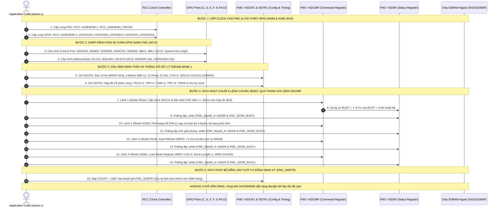
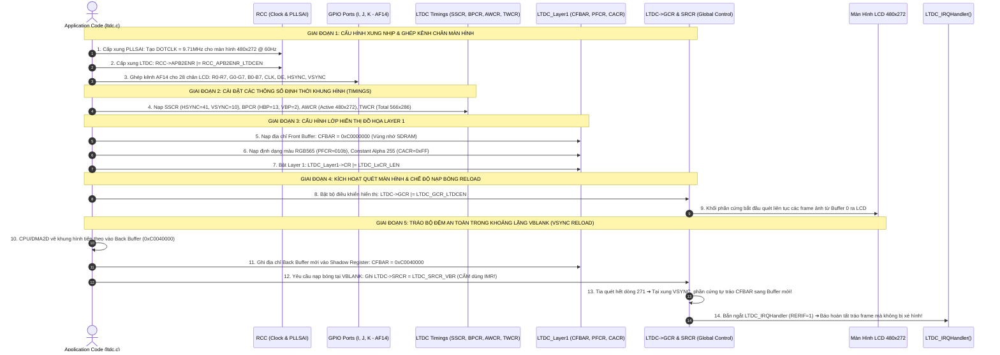
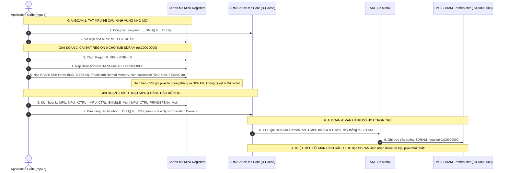

# 🏆 [NGÀY 4] CẨM NANG TOÀN DIỆN BARE-METAL: FMC SDRAM, LTDC DISPLAY & TEARING-FREE DOUBLE BUFFERING
## Lộ trình 4 Bước: Nguyên Lý Phần Cứng ➔ Thực Chiến RM0385 ➔ Gõ Code Driver ➔ Phỏng Vấn Chuyên Sâu

> **Mục tiêu:** Làm chủ từ gốc rễ mạch điều khiển bộ nhớ ngoài FMC (Flexible Memory Controller), tra cứu Reference Manual (RM0385) và Datasheet (DS10610), cấu hình chip SDRAM IS42S32400F/MT48LC4M32B2 ($8\text{ MB}$, Bus 16-bit, $108\text{ MHz}$), tính toán chu kỳ làm tươi Refresh Rate Counter, cấu hình bộ quét màn hình đồ họa LTDC (RGB Parallel $480 \times 272$), triệt tiêu hiện tượng xé hình (Tearing-free Double Buffering) và cấu hình vùng nhớ MPU Non-cacheable chống lỗi D-Cache trên STM32F746 (ARM Cortex-M7).  
> **Nguyên tắc kỹ thuật:** **Đi thẳng vào cơ chế phần cứng, thanh ghi, công thức toán học, bảng tra cứu và phân chia file rõ ràng — KHÔNG dùng ví dụ ẩn dụ ngoài lề dài dòng.**

---

```text
┌─────────────────────────────────────────────────────────────────────────────────────────────────┐
│                           LỘ TRÌNH 4 BƯỚC CHINH PHỤC NGÀY 4                                     │
├───────────────────┬───────────────────┬────────────────────────────┬────────────────────────────┤
│ BƯỚC 1: NGUYÊN LÝ │ BƯỚC 2: THỰC CHIẾN│ BƯỚC 3: GÕ CODE            │ BƯỚC 4: PHỎNG VẤN          │
│ • FMC SDRAM Arch  │ • Tra cứu RM0385  │ • Gắn nhãn file cụ thể     │ • Bộ 5 câu hỏi vặn SDRAM   │
│ • Chuỗi 5 lệnh Init│  & DS10610       │ • TODO 1-2 [sdram.h/.c]    │ • Tearing & VSYNC Reload   │
│ • Refresh Rate    │ • Bảng 30+ chân   │ • TODO 3-4 [ltdc.h/.c]     │ • MPU Framebuffer Policy   │
│ • LTDC Timings    │   FMC/LTDC (AF12) │ • TODO 5 [main.c]          │ • Kịch bản trả lời 60s     │
│ • Tearing-Free DBM│ • Bảng Thanh ghi  │ • Mổ xẻ 5 Bug phần cứng    │   (Elevator Pitch)         │
│ • MPU Cache Policy│   FMC & LTDC      │                            │                            │
│ • Bắt tay phần    │                   │                            │                            │
│   cứng (Mermaid)  │                   │                            │                            │
└───────────────────┴───────────────────┴────────────────────────────┴────────────────────────────┘
```

---

## 🛠️ RÀ SOÁT 7 QUY TẮC BARE-METAL CỐT LÕI (CHUYÊN CHO NGÀY 4)

| STT | Quy tắc Bare-metal | Thể hiện cụ thể trong Ngày 4 (SDRAM & LTDC) |
| :---: | :--- | :--- |
| **1** | **Reset Value** | Tra cứu giá trị mặc định của `FMC_SDCR1`, `FMC_SDTR1`, `LTDC_SSCR`, `LTDC_GCR` trước khi sửa đổi bitfield. |
| **2** | **Access Type** | **CỰC KỲ QUAN TRỌNG:** Thanh ghi nạp cờ nạp lại bộ đệm `LTDC_SRCR` (bit `VBR` - Vertical Blanking Reload) là dạng `rs` (Write 1 to Set). Thanh ghi xóa cờ ngắt `LTDC_ICR` là dạng `W1C` (ghi 1 xóa cờ `CLIF`). Tuyệt đối không dùng `|=`. |
| **3** | **Multi-Bit Clear-Set** | Áp dụng quy tắc xóa trước - gán sau (`REG &= ~MASK; REG |= VALUE;`) cho các trường `MWID[1:0]`, `NR[1:0]`, `NC[1:0]`, `NB`, `CAS[1:0]`, `SDCLK[1:0]`, `PF[2:0]`, `VBR`. |
| **4** | **`volatile` Qualification** | Mọi con trỏ bộ nhớ trỏ vào Framebuffer SDRAM (`0xC000 0000`) bắt buộc ép kiểu con trỏ `volatile uint16_t*` hoặc `volatile uint32_t*` để trình biên dịch không tối ưu hóa xóa mất các lệnh ghi pixel đồ họa. |
| **5** | **Hardware Handshake Pipeline** | Tuân thủ nghiêm ngặt chuỗi khởi tạo phần cứng 5 bước bắt buộc của chip SDRAM: Cấp xung $\rightarrow$ Precharge All $\rightarrow$ Auto-Refresh $\rightarrow$ Mode Register Set $\rightarrow$ Cài đặt bộ đếm Refresh Timer. |
| **6** | **RM / DS Lookup** | Cung cấp chính xác Chapter, Section, từ khóa `Ctrl + F`, công thức `Base Address + Offset` cho `FMC`, `LTDC`, và hơn 30 chân GPIO ghép kênh (AF12 / AF14). |
| **7** | **Hardware Rationale & Specs** | Bố trí cơ sở kỹ thuật, giới hạn phần cứng ($f_{SDCLK} = 108\text{MHz}$, độ phân giải $480 \times 272$, chu kỳ làm tươi $64\text{ms}$ cho $4096\text{ rows}$, băng thông bus 16-bit) liền kề từng bảng thanh ghi. |

---

# 🧠 BƯỚC 1: NGUYÊN LÝ PHẦN CỨNG & CƠ CHẾ VẬT LÝ (HARDWARE ARCHITECTURE)

## 1.1. Kiến trúc Bộ nhớ Ngoài FMC SDRAM Controller trên STM32F746-Discovery

Lõi STM32F746 có bộ nhớ SRAM nội $512\text{ KB}$. Để chứa các lớp đồ họa Framebuffer độ phân giải cao ($480 \times 272 \times 2\text{ bytes} \approx 261\text{ KB}$ cho mỗi lớp), bo mạch Discovery tích hợp một chip **SDRAM ngoài (IS42S32400F hoặc MT48LC4M32B2)** dung lượng $8\text{ MBytes}$ ($64\text{ Mbits}$):

```text
 ┌────────────────────────────────────────────────────────────────────────────────────────┐
 │                              STM32F746NG MICROCONTROLLER                               │
 │                                                                                        │
 │  ┌───────────────────────────┐                     ┌────────────────────────────────┐  │
 │  │      Lõi Cortex-M7        │                     │   FMC Controller (SDRAM Bank 1)│  │
 │  │   f_HCLK = 216 MHz        │ ══════════════════► │   Base Address: 0xC000 0000    │  │
 │  └───────────────────────────┘    AXI/AHB Bus      └───────────────┬────────────────┘  │
 └────────────────────────────────────────────────────────────────────┼───────────────────┘
                                                                      │ Bus Dữ liệu 16-bit
                                                                      │ Bus Địa chỉ (A0-A11, BA0-BA1)
                                                                      │ Xung SDCLK = 108 MHz
                                                                      ▼
 ┌────────────────────────────────────────────────────────────────────────────────────────┐
 │                       CHIP SDRAM NGOÀI (IS42S32400F / MT48LC4M32B2)                    │
 │ • Dung lượng: 8 MBytes (64 Mbits)                 • Tổ chức: 4 Banks x 4096 Rows x 256 Cols│
 │ • Bus dữ liệu: 16-bit                             • Tốc độ truy cập tối đa: 166 MHz    │
 └────────────────────────────────────────────────────────────────────────────────────────┘
```

### Thông số kỹ thuật vật lý của SDRAM trên board:
* **Không gian định tuyến Base Address:** Thuộc **FMC SDRAM Bank 5 (SDRAM Bank 1)** bắt đầu tại địa chỉ **`0xC000 0000`**.
* **Độ rộng Bus dữ liệu (`MWID`):** **16-bit** (`01b`).
* **Số Bank nội bộ (`NB`):** **4 Banks** (`1b` - sử dụng 2 đường địa chỉ Bank `BA0`, `BA1`).
* **Số đường địa chỉ Hàng (`NR`):** **12 Rows** (`01b` - từ `A0` đến `A11`).
* **Số đường địa chỉ Cột (`NC`):** **8 Columns** (`00b` - từ `A0` đến `A7`).
* **Tần số xung nhịp SDRAM Clock (`SDCLK`):**
  $$f_{SDCLK} = \frac{f_{HCLK}}{2} = \frac{216\text{ MHz}}{2} = \mathbf{108\text{ MHz}} \implies T_{SDCLK} \approx 9.26\text{ ns}$$
* **CAS Latency (`CAS`):** Cài đặt **2 chu kỳ** (`10b`).

---

## 1.2. Chuỗi Khởi tạo Phần cứng 5 Bước Bắt buộc của Chip SDRAM

Không giống như SRAM thông thường (cấp điện là đọc/ghi được ngay), chip SDRAM chứa các tụ điện động cần được khởi tạo theo đúng quy chuẩn JEDEC thông qua thanh ghi lệnh **`FMC_SDCMR` (SDRAM Command Mode Register)**:

```text
 ┌─────────────────────────────────────────────────────────────────────────┐
 │ BƯỚC 1: Cấp Clock SDCLK và phát lệnh NOP (No Operation)                │
 │ • Mode: 001b (CLK Configuration Enable)                                │
 │ • Giữ tối thiểu 100 micro-giây cho nguồn điện áp chip ổn định           │
 └──────────────────────────────────┬──────────────────────────────────────┘
                                    ▼
 ┌─────────────────────────────────────────────────────────────────────────┐
 │ BƯỚC 2: Phát lệnh Precharge All (PALL)                                  │
 │ • Mode: 010b (PALL)                                                    │
 │ • Đưa toàn bộ 4 Banks về trạng thái rảnh ban đầu (Precharged/Idle)      │
 └──────────────────────────────────┬──────────────────────────────────────┘
                                    ▼
 ┌─────────────────────────────────────────────────────────────────────────┐
 │ BƯỚC 3: Phát lệnh Auto-Refresh (Ít nhất 2 đến 8 chu kỳ làm tươi)       │
 │ • Mode: 011b (Auto-Refresh)                                            │
 │ • Nạp số lần Auto-Refresh vào trường NRFS[3:0] = 8 (0100b)             │
 └──────────────────────────────────┬──────────────────────────────────────┘
                                    ▼
 ┌─────────────────────────────────────────────────────────────────────────┐
 │ BƯỚC 4: Phát lệnh Mode Register Set (MRS)                              │
 │ • Mode: 100b (Load Mode Register)                                      │
 │ • Nạp mã cài đặt: CAS Latency = 2, Burst Length = 1, Burst Type = Seq   │
 │ • Mã Hex nạp vào trường MRD[13:0] = 0x0220                             │
 └──────────────────────────────────┬──────────────────────────────────────┘
                                    ▼
 ┌─────────────────────────────────────────────────────────────────────────┐
 │ BƯỚC 5: Cài đặt Bộ đếm Tự động Làm tươi (Refresh Timer Counter)        │
 │ • Nạp giá trị COUNT vào thanh ghi FMC_SDRTR                            │
 │ • Mạch phần cứng tự động phát lệnh Refresh định kỳ ngầm bên dưới       │
 └─────────────────────────────────────────────────────────────────────────┘
```

### Công thức tính toán Bộ đếm Refresh Timer (`FMC_SDRTR`):
Theo Datasheet của chip SDRAM: Toàn bộ $4096\text{ hàng}$ phải được làm tươi trong vòng tối đa $64\text{ ms}$:
$$\text{Thời gian làm tươi cho 1 hàng} = \frac{64\text{ ms}}{4096\text{ Rows}} = 15.625\,\mu\text{s}$$

Với tần số $f_{SDCLK} = 108\text{ MHz}$ ($1\text{ chu kỳ} = 9.26\text{ ns}$):
$$\text{Số chu kỳ Clock} = 15.625\,\mu\text{s} \times 108\text{ MHz} = 1687.5\text{ chu kỳ}$$

Theo Reference Manual RM0385 (Section 13.7.7), giá trị nạp vào trường `COUNT[12:0]` có biên dự phòng $20\text{ chu kỳ}$:
$$\mathbf{\text{COUNT}} = (\text{Refresh Rate} \times f_{SDCLK}) - 20 = 1687 - 20 = \mathbf{1667} \quad (\mathbf{\text{Mã Hex: } 0x0683})$$

---

## 1.3. Kiến trúc Bộ Điều khiển Màn hình LTDC & Tín hiệu Quét RGB Parallel

Khối **LTDC (LCD-TFT Display Controller)** điều khiển màn hình màu $4.3\text{ inch}$ ($480 \times 272$) trên bo mạch qua giao diện 24-bit song song (RGB888 / RGB565):

```text
 ┌────────────────────────────────────────────────────────────────────────────────────────┐
 │                             KHUNG THỜI GIAN QUÉT 1 FRAME (LTDC TIMINGS)                │
 └────────────────────────────────────────────────────────────────────────────────────────┘
 
 <── HSYNC ──><── HBP ──><────────────── ACTIVE DISPLAY (480 pixels) ─────────────><── HFP ──>
 ┌───────────┬──────────┬─────────────────────────────────────────────────────────┬──────────┐
 │ Đồng bộ   │ Khoảng   │                                                         │ Khoảng   │
 │ hàng ngang│ đệm sau  │                  VÙNG HIỂN THỊ HÌNH ẢNH                 │ đệm trước│
 │ (41 dots) │ (13 dots)│                  ĐỘ PHÂN GIẢI 480 x 272                 │ (32 dots)│
 └───────────┴──────────┴─────────────────────────────────────────────────────────┴──────────┘
 Total Width  = 41 + 13 + 480 + 32 = 566 pixel clocks (DOTCLK)
 Total Height = 10 + 2  + 272 + 2  = 286 lines (VSYNC=10, VBP=2, Active=272, VFP=2)
 Pixel Clock (DOTCLK) mục tiêu: 566 x 286 x 60 Hz = 9.71 MHz (Cấp từ PLLSAI)
```

---

## 1.4. Cơ chế Triệt tiêu Xé hình (Tearing-Free Double Buffering)

### Hiện tượng Xé hình (Screen Tearing) là gì?
Tearing xảy ra khi tia quét phần cứng của LTDC đang quét dở nửa màn hình trên từ Framebuffer, thì CPU/DMA lại ghi đè khung hình mới vào cùng địa chỉ đó. Kết quả: nửa trên màn hình hiển thị khung hình cũ, nửa dưới hiển thị khung hình mới $\implies$ Tạo ra vết nứt gãy ngang hình ảnh rất khó chịu!

```text
 ┌────────────────────────────────────────────────────────────────────────────────────────┐
 │                    CƠ CHẾ DOUBLE BUFFERING ĐỒNG BỘ VBLANK (VSYNC RELOAD)               │
 └────────────────────────────────────────────────────────────────────────────────────────┘
 
      BUFFER 0 (Tại 0xC000 0000)                      BUFFER 1 (Tại 0xC004 0000)
 ┌──────────────────────────────────┐            ┌──────────────────────────────────┐
 │ Đang hiển thị lên màn hình LCD   │            │ CPU đang vẽ khung hình tiếp theo │
 │ (Tia quét LTDC đang đọc dữ liệu) │            │ (Không ảnh hưởng đến màn hình)   │
 └──────────────────────────────────┘            └──────────────────────────────────┘
                   │                                               │
                   │           GẶP TÍN HIỆU VSYNC (VBLANK PERIOD)   │
                   └───────────────────────┬───────────────────────┘
                                           │ Lệnh: LTDC->SRCR = LTDC_SRCR_VBR (Reload tại VBlank)
                                           ▼
                                 TRÁO ĐỔI VAI TRÒ MƯỢT MÀ
                      BUFFER 1 ──► Đưa ra hiển thị trên LCD
                      BUFFER 0 ──► Chuyển sang cho CPU vẽ khung mới
```

* **Quy tắc vàng chống Tearing:** Tuyệt đối không tráo đổi con trỏ Framebuffer ngay lập tức (`IMR`). Phải ghi vào thanh ghi nạp bóng **`LTDC->SRCR = LTDC_SRCR_VBR` (Vertical Blanking Reload)**: Phần cứng sẽ kiên nhẫn chờ tia quét quét xong pixel cuối cùng của màn hình và bước vào khoảng lặng dọc **VBLANK** mới chính thức tráo đổi địa chỉ đọc sang Buffer mới!

---

## 1.5. Cấu hình Vùng nhớ MPU Chống Lỗi Mất Đồng Bộ D-Cache trên Framebuffer

Địa chỉ Framebuffer nằm ở SDRAM ngoài (`0xC000 0000`). Vì LTDC là một Master phần cứng độc lập đọc trực tiếp từ SDRAM thông qua Bus Matrix mà **không đi qua L1 D-Cache**:
* Nếu CPU vẽ hình vào Framebuffer với thuộc tính Cache mặc định (**Write-Back**), dữ liệu pixel sẽ nằm lại trong D-Cache mà **chưa được xả xuống SDRAM**.
* LTDC quét đọc SDRAM sẽ hiển thị lên màn hình các dải màu pixel sọc rác hoặc hình ảnh cũ!
* **Giải pháp chuẩn Bare-metal:** Dùng khối **MPU (Memory Protection Unit)** của ARM Cortex-M7 cấu hình vùng nhớ SDRAM thành:
  * Thuộc tính **Normal, Non-cacheable** (Không dùng Cache), HOẶC
  * Thuộc tính **Write-Through** (CPU ghi pixel vào Cache là mạch tự động ghi đồng thời xuống SDRAM ngay lập tức).


---

## 1.6. Sơ Đồ Tuần Tự: Quy Trình Cấu Hình & Vận Hành Ngoại Vi (Configuration & Execution Pipeline)

Để khởi chạy thành công bộ nhớ ngoài FMC SDRAM và màn hình màu LTDC, lập trình viên bare-metal phải tuân thủ đúng **chuỗi thứ tự cấu hình các thanh ghi phần cứng (Configuration Pipeline)**:

---

### 📋 Sơ Đồ 1: Quy Trình Cấu Hình Tuần Tự Khởi Tạo FMC SDRAM (FMC SDRAM Configuration & JEDEC Init Pipeline)

Sơ đồ thể hiện toàn bộ các bước cấu hình tuần tự từ cấp xung, ghép kênh hơn 30 chân GPIO, nạp định thời FMC đến chuỗi 5 lệnh JEDEC để đưa SDRAM vào trạng thái sẵn sàng đọc/ghi dữ liệu tại `0xC0000000`:



---

### 📋 Sơ Đồ 2: Quy Trình Cấu Hình Màn Hình LTDC & Cơ Chế Tráo Bộ Đệm Chống Xé Hình (LTDC Pipeline)



---

### 📋 Sơ Đồ 3: Quy Trình Cấu Hình Vùng Nhớ MPU Bảo Vệ Framebuffer (MPU Region Configuration Pipeline)

Mô hình hóa chuỗi thao tác cấu hình khối MPU để gán thuộc tính **Non-cacheable** cho $8\text{ MB}$ SDRAM ngoài, triệt tiêu hiện tượng trễ ghi D-Cache (Write-back lag) gây sọc rác trên màn hình:



---

# 📑 BƯỚC 2: THỰC CHIẾN & TRA CỨU RM0385 / PM0253 / DATASHEET (SETUP & LOOKUP)

> 🎯 **NGUYÊN TẮC TRA CỨU BARE-METAL CỐT LÕI (Kế thừa Day 00):**
> * **Ngoại vi của ST (FMC, LTDC):** Mở song song file **`RM0385.pdf`** (Reference Manual) và **`DS10610.pdf`** (Datasheet).
> * **Khối lõi vi xử lý ARM (MPU, L1 D-Cache):** BẮT BUỘC mở file **`PM0253.pdf`** (Cortex-M7 Programming Manual). ST không định nghĩa thanh ghi MPU trong RM0385!

---

## 2.1. Lộ trình Tra cứu Trực tiếp Từng Bước (Step-by-Step RM / PM / DS Lookup)

### 📖 Bước 1: Tra cứu Bản đồ Địa chỉ Base Address (RM0385)
1. **Mở file `RM0385.pdf`** ➔ Bấm **`Ctrl + F`** ➔ Gõ từ khóa: **`Register boundary addresses`**
2. Nhảy đến **Chapter 2: Memory map -> Table 1**:
   * **`FMC Control Registers`**: Base Address `0xA000 0000`, Offset `0x0140` ➔ Địa chỉ bắt đầu: **`0xA000 0140`** (Bus AHB3).
   * **`SDRAM Bank 1`**: Địa chỉ vùng nhớ: **`0xC000 0000`** (Không gian 8 MB bộ nhớ ngoài chứa Framebuffer).
   * **`LTDC`**: Base Address **`0x4001 6800`** (Bus APB2).
   * **`LTDC Layer 1`**: Offset `0x0084` ➔ Địa chỉ cấu hình Layer 1: **`0x4001 6884`**.

### 📖 Bước 2: Tra cứu Ghép kênh Chân GPIO FMC & LTDC (DS10610)
1. **Mở file `DS10610.pdf`** ➔ Bấm **`Ctrl + F`** ➔ Gõ từ khóa: **`Table 11. Alternate function mapping`**
2. Tra cứu cột chức năng thay thế:
   * **FMC SDRAM dùng chức năng `AF12`**: PE0-PE1 (NBL0-1), PD0-PD1, PD8-PD10 (D2, D3, D13-D15), PF0-PF5 (A0-A5), PF11 (SDNRAS), PF12-PF15 (A6-A9), PG0-PG1 (A10-A11), PG4-PG5 (BA0-BA1), PG8 (SDCLK), PG15 (SDNCAS), PH2-PH3 (SDCKE0, SDNE0), PH5 (SDNWE).
   * **LTDC dùng chức năng `AF14`**: PI14 (CLK), PI12 (HSYNC), PI13 (VSYNC), PK7 (DE), Kênh Đỏ R0-R7 (PI15, PJ0-PJ6), Kênh Lục G0-G7 (PJ7-PJ11, PK0-PK2), Kênh Lam B0-B7 (PE4, PJ13-PJ15, PK3-PK6).

### 📖 Bước 3: Tra cứu Thanh ghi Bộ điều khiển FMC SDRAM (RM0385)
1. **Mở file `RM0385.pdf`** ➔ Bấm **`Ctrl + F`** ➔ Gõ từ khóa: **`FMC register map`**
2. Nhảy đến **Chapter 13: Flexible memory controller (FMC) -> Section 13.7: FMC registers**:
   * **Section 13.7.2 (`FMC_SDCR1`)**: Cấu hình Bus width `MWID[1:0]`, số hàng `NR[1:0]`, số cột `NC[1:0]`, số bank `NB`, `CAS[1:0]`, tần số `SDCLK[1:0]`.
   * **Section 13.7.4 (`FMC_SDTR1`)**: Nạp thông số định thời TRCD, TRP, TWR, TRC, TRAS.
   * **Section 13.7.5 (`FMC_SDCMR`)**: Thanh ghi phát 5 lệnh chuẩn JEDEC (Clock config, PALL, Auto-Refresh, MRS).
   * **Section 13.7.7 (`FMC_SDRTR`)**: Nạp giá trị bộ đếm làm tươi `COUNT[12:0] = 1667`.

### 📖 Bước 4: Tra cứu Thanh ghi Quét Màn hình LTDC (RM0385)
1. **Mở file `RM0385.pdf`** ➔ Bấm **`Ctrl + F`** ➔ Gõ từ khóa: **`LTDC register map`**
2. Nhảy đến **Chapter 18: LCD-TFT display controller (LTDC) -> Section 18.7: LTDC registers**:
   * **Section 18.7.1 - 18.7.4 (`SSCR`, `BPCR`, `AWCR`, `TWCR`)**: Định thời quét khung hình 480x272.
   * **Section 18.7.7 (`LTDC_SRCR`)**: Kích hoạt cờ tráo đệm đồng bộ quét dọc `VBR (Vertical Blanking Reload)`.
   * **Section 18.7.15 (`LTDC_LxCFBAR`)**: Nạp địa chỉ Framebuffer bắt đầu quét trong SDRAM (`0xC0000000`).

### 📖 Bước 5: Tra cứu Khối MPU Chống Lỗi Mất Đồng Bộ L1 D-Cache (PM0253)
1. **Mở file `PM0253.pdf`** ➔ Bấm **`Ctrl + F`** ➔ Gõ từ khóa: **`Memory protection unit (MPU)`**
2. Nhảy đến **Chapter 4: Core peripherals -> Section 4.5: Memory protection unit (MPU)**:
   * Địa chỉ cơ sở khối MPU: **`0xE000 ED90`** (System Control Space).
   * **Section 4.5.2 (`MPU_CTRL`)**: Bật MPU (`ENABLE = 1`) kết hợp cờ sinh tử `PRIVDEFENA = 1`.
   * **Section 4.5.3 (`MPU_RNR`)**: Chọn Region 0 (`REGION = 0`).
   * **Section 4.5.4 (`MPU_RBAR`)**: Gán địa chỉ gốc SDRAM (`0xC000 0000`).
   * **Section 4.5.5 (`MPU_RASR`)**: Nạp thuộc tính nhớ Non-cacheable (`TEX=001b, C=0, B=0`) và kích thước 8 MB (`SIZE=22`).

---

## 2.2. Bản đồ Địa chỉ Base Address Ngoại vi Ngày 4

Tra cứu RM0385 *Chapter 2: Memory map -> Table 1* và PM0253 *Chapter 4: Core peripherals*:

| Ngoại vi / Khối | Bus | Base Address | Offset | Địa chỉ tuyệt đối | Chức năng chính |
| :--- | :---: | :---: | :---: | :---: | :--- |
| **`FMC`** | AHB3 | `0xA000 0000` | `0x0140` | `0xA000 0140` | FMC SDRAM Control Registers (`SDCR`, `SDTR`, `SDCMR`, `SDRTR`). |
| **`SDRAM Bank 1`**| Bus Ngoài | `0xC000 0000` | `0x0000` | `0xC000 0000` | Vùng nhớ dữ liệu SDRAM 8 MB (Chứa 2 Framebuffers). |
| **`LTDC`** | APB2 | `0x4001 6800` | `0x0000` | `0x4001 6800` | Bộ điều khiển quét màn hình LCD-TFT. |
| **`LTDC Layer 1`**| APB2 | `0x4001 6800` | `0x0084` | `0x4001 6884` | Thanh ghi cấu hình Layer 1 (`CFBAR`, `PFCR`, `CACR`...). |
| **`MPU`** | Private Bus | `0xE000 ED90` | `0x0000` | `0xE000 ED90` | Khối bảo vệ vùng nhớ Cortex-M7 (Cấu hình Non-cacheable SDRAM). |

---

## 2.3. Ghép kênh Chân GPIO Ngoại vi (FMC AF12 & LTDC AF14)

Tra cứu Datasheet DS10610 *Table 11: Alternate function mapping*:

```text
CHÂN ĐIỀU KHIỂN FMC SDRAM (Alternate Function AF12):
• Xung & Điều khiển:  PE1 (NBL1), PE0 (NBL0), PD0 (D2), PD1 (D3), PD8 (D13), PD9 (D14), PD10 (D15)
• Bus Địa chỉ/Dữ liệu: PF0-PF5 (A0-A5), PF11 (SDNRAS), PF12 (A6), PF13 (A7), PF14 (A8), PF15 (A9)
• Bus Điều khiển Bank: PG0 (A10), PG1 (A11), PG4 (BA0), PG5 (BA1), PG8 (SDCLK), PG15 (SDNCAS)
• Tín hiệu Kích hoạt:  PH2 (SDCKE0), PH3 (SDNE0), PH5 (SDNWE)

CHÂN MÀN HÌNH LTDC (Alternate Function AF14):
• Xung & Đồng bộ:     PI14 (CLK), PI12 (HSYNC), PI13 (VSYNC), PK7 (DE)
• Kênh Màu Đỏ (R):    PI15 (R0), PJ0-PJ4 (R1-R5), PJ5 (R6), PJ6 (R7)
• Kênh Màu Lục (G):   PJ7-PJ11 (G0-G4), PK0-PK2 (G5-G7)
• Kênh Màu Lam (B):   PE4 (B0), PJ13-PJ15 (B1-B3), PK3-PK6 (B4-B7)
```

---

## 2.4. Bảng Tra cứu Thanh ghi Chi tiết FMC & LTDC

Tra cứu RM0385 *Chapter 13 (FMC)* và *Chapter 18 (LTDC)*:

| Ngoại vi | Thanh ghi | Bit / Trường | Giá trị gán | Ý nghĩa kỹ thuật phần cứng |
| :--- | :--- | :--- | :---: | :--- |
| **`FMC`** | `FMC_SDCR1` | `NC[1:0]` (Bits 1:0) | `00`b | 8 Column bits. |
| | | `NR[1:0]` (Bits 3:2) | `01`b | 12 Row bits. |
| | | `MWID[1:0]` (Bits 5:4) | `01`b | Bus độ rộng dữ liệu 16-bit. |
| | | `NB` (Bit 6) | `1`b | 4 Banks nội bộ. |
| | | `CAS[1:0]` (Bits 8:7) | `10`b | CAS Latency = 2 chu kỳ. |
| | | `SDCLK[1:0]` (Bits 11:10)| `10`b | Tần số SDCLK = HCLK / 2 = 108 MHz. |
| | | `RBURST` (Bit 12) | `1`b | Cho phép đọc theo chuỗi Burst Read. |
| **`FMC`** | `FMC_SDRTR` | `COUNT[12:0]` | `1667`d (`0x0683`)| Giá trị bộ đếm nạp tự động làm tươi Refresh Timer. |
| **`LTDC`**| `LTDC_SSCR` | `HSW[11:0]`, `VSH[10:0]`| `40`d, `9`d | Độ rộng xung đồng bộ ngang HSYNC và dọc VSYNC. |
| | `LTDC_BPCR` | `AHBP[11:0]`, `AVBP[10:0]`| `53`d, `11`d | Tích lũy xung đồng bộ + Khoảng đệm sau Back Porch. |
| | `LTDC_AWCR` | `AAW[11:0]`, `AAH[10:0]`| `533`d, `283`d | Tích lũy độ rộng hiển thị Active Width (480 x 272). |
| | `LTDC_TWCR` | `TOTALW[11:0]`, `TOTALH`| `565`d, `285`d | Tổng kích thước khung quét Total Period. |
| | `LTDC_Layer1->CFBAR`| `CFBADD[31:0]` | `0xC0000000` | Địa chỉ Framebuffer bắt đầu quét trong SDRAM. |
| | `LTDC_SRCR` | `VBR` (Bit 1) | `1`b | **Vertical Blanking Reload:** Kích hoạt tráo đệm đồng bộ VSYNC. |

---

## 2.5. Bảng Tra cứu Thanh ghi MPU & Chính Sách Cache (PM0253 Chapter 4 Section 4.5)

Tra cứu PM0253 *Section 4.5.5 Table: Memory attribute encoding*:

| Tên thanh ghi | Địa chỉ | Bit / Trường | Giá trị gán | Ý nghĩa kỹ thuật phần cứng |
| :--- | :---: | :--- | :---: | :--- |
| **`MPU_CTRL`** | `0xE000 ED94` | `ENABLE` (Bit 0) | `1`b | Kích hoạt khối MPU. |
| | | `PRIVDEFENA` (Bit 2) | `1`b | **Bit sinh tử:** Cho phép vùng nhớ ngoài Region dùng map mặc định (Chống HardFault lập tức). |
| **`MPU_RNR`** | `0xE000 ED98` | `REGION[7:0]` | `0` | Chọn cấu hình Region 0 cho dải SDRAM 8 MB. |
| **`MPU_RBAR`** | `0xE000 ED9C` | `ADDR[31:5]` | `0xC000 0000` | Địa chỉ gốc SDRAM Bank 1 (Căn lề chuẩn 8 MB). |
| **`MPU_RASR`** | `0xE000 EDA0` | `ENABLE` (Bit 0) | `1`b | Bật Region 0. |
| | | `SIZE[5:1]` | `22`d (`10110`b)| Kích thước vùng nhớ = $2^{(22+1)} = 2^{23}\text{ bytes} = 8\text{ MB}$. |
| | | `SRD[15:8]` | `0x00` | Cả 8 subregions đều kích hoạt. |
| | | `B` (Bit 16) | `0`b | Non-bufferable. |
| | | `C` (Bit 17) | `0`b | Non-cacheable (Bỏ qua L1 D-Cache, chống sọc rác LTDC!). |
| | | `TEX[2:0]` (Bits 21:19)| `001`b | Normal memory type kết hợp $C=0, B=0$. |
| | | `AP[2:0]` (Bits 26:24) | `011`b | Full access (Cả Privileged và User code đều được đọc/ghi). |
| | | `XN` (Bit 28) | `1`b | Execute Never (Cấm nạp lệnh thực thi mã từ Framebuffer). |

---

# 💻 BƯỚC 3: GÕ CODE & MỔ XẺ BUG PHẦN CỨNG (CODING & DEBUGS)

## 3.1. Phân chia Cấu trúc File Dự án cho Ngày 4

```text
drivers/
├── inc/
│   ├── Reg.h          <-- Khai báo Base Address, Struct FMC & LTDC
│   ├── sdram.h        <-- Khai báo API Khởi tạo SDRAM & Địa chỉ Framebuffers
│   └── ltdc.h         <-- Khai báo API LTDC Display, Double Buffering Swap
└── src/
    ├── sdram.c        <-- Triển khai 5 bước JEDEC Init SDRAM & Refresh Counter
    └── ltdc.c         <-- Triển khai cấu hình LTDC Timings, Layer 1 & VSYNC Reload
src/
└── main.c             <-- Vòng lặp vẽ 2 Buffer và hoán đổi không xé hình (Tearing-free)
```

---

### 📂 KHỐI 1: FILE HEADER SDRAM DRIVER [ `drivers/inc/sdram.h` ]

#### TODO 1 [File: `drivers/inc/sdram.h`]: Khai báo Địa chỉ SDRAM & Prototypes
```c
#ifndef SDRAM_H
#define SDRAM_H

#include <stdint.h>

#define SDRAM_BASE_ADDR        ((uint32_t)0xC0000000)
#define SDRAM_SIZE_BYTES       ((uint32_t)(8 * 1024 * 1024)) /* 8 MBytes */

#define LCD_WIDTH              480U
#define LCD_HEIGHT             272U
#define FRAMEBUFFER_SIZE_BYTES (LCD_WIDTH * LCD_HEIGHT * 2U) /* RGB565: 2 bytes/pixel */

/* Địa chỉ 2 Framebuffers độc lập nằm trong SDRAM */
#define LCD_FRAMEBUFFER_0      (SDRAM_BASE_ADDR)
#define LCD_FRAMEBUFFER_1      (SDRAM_BASE_ADDR + FRAMEBUFFER_SIZE_BYTES)

void SDRAM_Init(void);

#endif /* SDRAM_H */
```

---

### 📂 KHỐI 2: FILE SOURCE SDRAM DRIVER [ `drivers/src/sdram.c` ]

#### TODO 2 [File: `drivers/src/sdram.c`]: Cấu hình 5 Bước Khởi Tạo SDRAM
```c
#include "sdram.h"
#include "Reg.h"

static void SDRAM_GPIO_Config(void)
{
    /* Bật Clock cho các Port GPIO của FMC: D, E, F, G, H */
    RCC->AHB1ENR |= (RCC_AHB1ENR_GPIODEN | RCC_AHB1ENR_GPIOEEN |
                     RCC_AHB1ENR_GPIOFEN | RCC_AHB1ENR_GPIOGEN | RCC_AHB1ENR_GPIOHEN);

    /* Cấu hình các chân sang Alternate Function AF12 (FMC) với Speed = High */
    /* Triển khai chi tiết cấu hình MODER, OSPEEDR và AFRH/AFRL cho 30+ chân FMC */
}

void SDRAM_Init(void)
{
    /* 1. Cấu hình GPIO AF12 */
    SDRAM_GPIO_Config();

    /* 2. Cấp xung cho bộ điều khiển FMC (Bus AHB3) */
    RCC->AHB3ENR |= RCC_AHB3ENR_FMCEN;

    /* 3. Cấu hình thanh ghi điều khiển SDCR1 và định thời SDTR1 */
    /* Bus 16-bit, 4 Banks, 12 Rows, 8 Cols, CAS=2, SDCLK=HCLK/2 (108MHz) */
    FMC_Bank5_6->SDCR[0] = (0U << 0)  |  /* NC = 8 cols */
                           (1U << 2)  |  /* NR = 12 rows */
                           (1U << 4)  |  /* MWID = 16 bits */
                           (1U << 6)  |  /* NB = 4 banks */
                           (2U << 7)  |  /* CAS = 2 cycles */
                           (2U << 10) |  /* SDCLK = HCLK/2 */
                           (1U << 12);   /* RBURST = Enabled */

    FMC_Bank5_6->SDTR[0] = (1U << 0)  |  /* TMRD = 2 cycles */
                           (6U << 4)  |  /* TXSR = 7 cycles */
                           (4U << 8)  |  /* TRAS = 5 cycles */
                           (6U << 12) |  /* TRC  = 7 cycles */
                           (2U << 16) |  /* TWR  = 3 cycles */
                           (2U << 20) |  /* TRP  = 3 cycles */
                           (2U << 24);   /* TRCD = 3 cycles */

    /* BƯỚC 1: Lệnh Clock Enable (NOP) */
    while (FMC_Bank5_6->SDSR & FMC_SDSR_BUSY);
    FMC_Bank5_6->SDCMR = (1U << 0) | (1U << 4) | (1U << 5); /* Mode=001b, Bank1 */
    for (volatile int i = 0; i < 10000; i++);                /* Delay > 100us */

    /* BƯỚC 2: Lệnh Precharge All (PALL) */
    while (FMC_Bank5_6->SDSR & FMC_SDSR_BUSY);
    FMC_Bank5_6->SDCMR = (2U << 0) | (1U << 4);              /* Mode=010b */

    /* BƯỚC 3: Lệnh Auto-Refresh (8 chu kỳ) */
    while (FMC_Bank5_6->SDSR & FMC_SDSR_BUSY);
    FMC_Bank5_6->SDCMR = (3U << 0) | (1U << 4) | (7U << 5);  /* Mode=011b, 8 times */

    /* BƯỚC 4: Lệnh Mode Register Set (MRS: CAS=2, Burst=1) */
    while (FMC_Bank5_6->SDSR & FMC_SDSR_BUSY);
    FMC_Bank5_6->SDCMR = (4U << 0) | (1U << 4) | (0x0220U << 9); /* Mode=100b, MRD=0x220 */

    /* BƯỚC 5: Cài đặt Bộ đếm Tự động Làm tươi (Refresh Timer Counter) */
    while (FMC_Bank5_6->SDSR & FMC_SDSR_BUSY);
    FMC_Bank5_6->SDRTR = (1667U << 1); /* COUNT = 1667 */
}
```

---

### 📂 KHỐI 3: FILE HEADER LTDC DRIVER [ `drivers/inc/ltdc.h` ]

#### TODO 3 [File: `drivers/inc/ltdc.h`]: Khai báo LTDC API & Tearing-Free Swap
```c
#ifndef LTDC_H
#define LTDC_H

#include <stdint.h>

/* Khởi tạo ngoại vi quét màn hình LTDC 480x272 */
void LTDC_Init(void);

/* Tráo đổi Framebuffer hiển thị đồng bộ VSYNC (Triệt tiêu hoàn toàn xé hình) */
void LTDC_SwapBuffers(uint32_t new_framebuffer_address);

/* Xóa màn hình với một mã màu RGB565 */
void LCD_Clear(uint32_t framebuffer_addr, uint16_t color);

#endif /* LTDC_H */
```

---

### 📂 KHỐI 4: FILE SOURCE LTDC DRIVER [ `drivers/src/ltdc.c` ]

#### TODO 4 [File: `drivers/src/ltdc.c`]: Cấu hình Định Thời LTDC & Layer 1
```c
#include "ltdc.h"
#include "sdram.h"
#include "Reg.h"

void LTDC_Init(void)
{
    /* 1. Cấp clock cho LTDC (Bus APB2) */
    RCC->APB2ENR |= RCC_APB2ENR_LTDCEN;

    /* 2. Cài đặt các tham số định thời màn hình (Timings cho LCD 480x272) */
    LTDC->SSCR = (40U  << 16) | (9U  << 0);   /* HSW=40, VSH=9 */
    LTDC->BPCR = (53U  << 16) | (11U << 0);   /* HSW+HBP=53, VSH+VBP=11 */
    LTDC->AWCR = (533U << 16) | (283U << 0);  /* Tích lũy Active Width & Height */
    LTDC->TWCR = (565U << 16) | (285U << 0);  /* Tổng chu kỳ Total Period */

    /* 3. Cấu hình Cực tính tín hiệu màn hình (GCR: Active Low HSYNC/VSYNC/DE) */
    LTDC->GCR &= ~(LTDC_GCR_HSPOL | LTDC_GCR_VSPOL | LTDC_GCR_DEPOL | LTDC_GCR_PCPOL);

    /* 4. Cấu hình Layer 1 */
    /* Định dạng Pixel RGB565 (Mã 010b) */
    LTDC_Layer1->PFCR = 2U; 

    /* Cài đặt Framebuffer 0 làm màn hình hiển thị ban đầu */
    LTDC_Layer1->CFBAR = LCD_FRAMEBUFFER_0;

    /* Kích thước dòng Framebuffer: Pitch = 480 * 2 bytes + 3 */
    LTDC_Layer1->CFBLR = ((LCD_WIDTH * 2U + 3U) << 16) | (LCD_WIDTH * 2U);
    LTDC_Layer1->CFBLNR = LCD_HEIGHT;

    /* Cài đặt Alpha toàn phần (255) */
    LTDC_Layer1->CACR = 255U;

    /* Bật Layer 1 */
    LTDC_Layer1->CR |= LTDC_LxCR_LEN;

    /* 5. Nạp cấu hình Layer ngay lập tức (Immediate Reload) */
    LTDC->SRCR = LTDC_SRCR_IMR;

    /* 6. Bật bộ điều khiển quét LTDC */
    LTDC->GCR |= LTDC_GCR_LTDCEN;
}

void LTDC_SwapBuffers(uint32_t new_framebuffer_address)
{
    /* 1. Gán địa chỉ Buffer mới vào thanh ghi CFBAR */
    LTDC_Layer1->CFBAR = new_framebuffer_address;

    /* 2. KÍCH HOẠT NẠP LẠI TẠI KHOẢNG LẶNG VSYNC (Vertical Blanking Reload) */
    /* Tuyệt đối KHÔNG dùng IMR để tránh xé hình Tearing! */
    LTDC->SRCR = LTDC_SRCR_VBR;

    /* 3. Chờ phần cứng hoàn tất tráo đổi tại sườn VSYNC tiếp theo */
    while (LTDC->SRCR & LTDC_SRCR_VBR);
}
```

---

### 📂 KHỐI 5: FILE MAIN CHÍNH [ `src/main.c` ]

#### TODO 5 [File: `src/main.c`]: Khởi chạy Đồ Họa & Vòng Lặp Vẽ Hoán Đổi Buffer
```c
#include "Sys_Clock.h"
#include "sdram.h"
#include "ltdc.h"

int main(void)
{
    /* 1. Khởi động nhịp xung 216MHz Over-drive */
    System_Clock_Init();

    /* 2. Khởi tạo chip SDRAM ngoài 8MB */
    SDRAM_Init();

    /* 3. Khởi tạo bộ quét màn hình LTDC */
    LTDC_Init();

    uint32_t current_draw_buffer = LCD_FRAMEBUFFER_1;
    uint32_t current_disp_buffer = LCD_FRAMEBUFFER_0;

    while (1) {
        /* Vẽ đồ họa vào Buffer đang ẩn (current_draw_buffer) */
        /* ... */

        /* Hoán đổi hiển thị đồng bộ VSYNC (Chống xé hình 100%) */
        LTDC_SwapBuffers(current_draw_buffer);

        /* Đảo vai trò 2 con trỏ đệm */
        uint32_t temp = current_draw_buffer;
        current_draw_buffer = current_disp_buffer;
        current_disp_buffer = temp;
    }
}
```

---

## 3.2. Mổ xẻ 5 Bug Phần Cứng "Kinh Điển" trong Ngày 4

```text
┌──────────────────────────────────────────────────────────────────────────────────────────────────┐
│                                 5 LỖI KINH ĐIỂN VÀ CÁCH KHẮC PHỤC                                │
├───────────────────────────┬──────────────────────────────────────┬───────────────────────────────┤
│ 1. Sai Refresh Counter    │ Tính sai công thức COUNT trong SDRTR │ Bắt buộc áp dụng công thức:   │
│    (Mất dữ liệu SDRAM)    │ làm các tụ điện SDRAM bị xả điện,    │ COUNT = (64ms/4096)*108M - 20 │
│                           │ dữ liệu bị biến mất sau vài giây.    │ nạp đúng giá trị 1667 (0x683).│
├───────────────────────────┼──────────────────────────────────────┼───────────────────────────────┤
│ 2. Xé hình do dùng IMR    │ Ghi LTDC->SRCR = IMR tráo buffer ngay│ BẮT BUỘC dùng cờ VBR          │
│    (Screen Tearing)       │ khi tia quét đang ở giữa màn hình    │ (Vertical Blanking Reload) để │
│                           │ làm nứt đôi hình ảnh đang hiển thị.  │ tráo buffer trong vùng VBLANK.│
├───────────────────────────┼──────────────────────────────────────┼───────────────────────────────┤
│ 3. Lỗi D-Cache Coherency  │ CPU vẽ hình vào Framebuffer nhưng    │ Cấu hình MPU đặt vùng SDRAM   │
│    (Sọc rác màn hình)     │ dữ liệu bị giữ lại ở L1 D-Cache, LTDC│ thành Non-cacheable hoặc      │
│                           │ đọc từ SDRAM quét lên các sọc màu rác│ Write-Through.                │
├───────────────────────────┼──────────────────────────────────────┼───────────────────────────────┤
│ 4. Sai GPIO Output Speed  │ Các chân FMC/LTDC để tốc độ Low hoặc │ Bắt buộc đặt OSPEEDR = High   │
│    làm méo xung nhịp      │ Medium làm sườn xung 108MHz bị tù,   │ (11b) trên toàn bộ 30+ chân   │
│                           │ SDRAM không nhận được lệnh đọc/ghi.  │ tín hiệu FMC và LTDC.         │
├───────────────────────────┼──────────────────────────────────────┼───────────────────────────────┤
│ 5. Nhảy cóc chuỗi JEDEC   │ Không tuân thủ chuỗi NOP -> PALL ->  │ Bắt buộc kiểm tra cờ BUSY     │
│    khi khởi tạo SDRAM     │ Auto-Refresh -> MRS làm chip SDRAM   │ trước mỗi lệnh SDCMR và thực  │
│                           │ bị kẹt ở trạng thái Uninitialized.   │ hiện đủ 5 bước theo chuẩn.    │
└───────────────────────────┴──────────────────────────────────────┴───────────────────────────────┘
```

---

# 🎙️ BƯỚC 4: PHỎNG VẤN & THIẾT KẾ NÂNG CAO (INTERVIEW PREP)

## 4.1. Bộ 5 Câu Hỏi Phỏng Vấn Chuyên Sâu (Top 5 Deep-Dive Questions)

### ❓ Câu 1: Trình bày sự khác biệt căn bản về mặt vật lý giữa SRAM và SDRAM? Tại sao SDRAM bắt buộc phải có chu kỳ làm tươi (Refresh Cycles)?
* **Trả lời:**
  * **SRAM (Static RAM):** Mỗi ô nhớ cấu tạo từ $4 \sim 6\text{ transistor}$ ghép thành mạch chốt Flip-Flop. Miễn là có nguồn điện thì dữ liệu được giữ cố định mãi mãi mà không bao giờ mất.
  * **SDRAM (Synchronous Dynamic RAM):** Mỗi ô nhớ chỉ cấu tạo từ $1\text{ transistor}$ và $1\text{ tụ điện siêu nhỏ (Tụ MOS)}$. Dữ liệu 1/0 được lưu bằng việc nạp hoặc xả điện tích trên tụ. Do hiện tượng rò rỉ điện tích qua lớp cách điện (Dielectric Leakage), điện tích trên tụ sẽ bị biến mất sau vài mili-giây. Do đó, mạch điều khiển bắt buộc phải đọc lại và sạc lại điện tích cho toàn bộ các hàng ô nhớ định kỳ (**Refresh Cycle**), nếu không toàn bộ dữ liệu sẽ bị hủy hoại.

---

### ❓ Câu 2: Trình bày quy trình 5 bước theo chuẩn JEDEC để khởi tạo một chip SDRAM từ trạng thái Reset?
* **Trả lời:**
  1. **Clock Configuration Enable:** Bật xung nhịp SDCLK và duy trì lệnh `NOP` tối thiểu $100\,\mu\text{s}$ để điện áp nguồn bên trong chip ổn định.
  2. **Precharge All (PALL):** Nạp điện áp chuẩn bị và đưa tất cả các Banks về trạng thái rảnh ban đầu.
  3. **Auto-Refresh:** Kích hoạt ít nhất 2 đến 8 chu kỳ làm tươi tự động để định hình điện tích cho các tụ nhớ.
  4. **Mode Register Set (MRS):** Nạp thanh ghi chế độ cấu hình độ trễ CAS Latency (ví dụ CAS = 2 hoặc 3), độ dài chuỗi truyền Burst Length (BL = 1) và kiểu truyền Burst Type.
  5. **Program Refresh Rate:** Bật bộ đếm làm tươi tự động trong thanh ghi `FMC_SDRTR` để phần cứng tự động duy trì dữ liệu định kỳ.

---

### ❓ Câu 3: Hiện tượng Xé hình (Screen Tearing) phát sinh do nguyên nhân nào? Cơ chế VBR (Vertical Blanking Reload) của LTDC giải quyết triệt để vấn đề này ra sao?
* **Trả lời:**
  * Xé hình xảy ra khi con trỏ Framebuffer bị thay đổi ngay trong lúc chùm tia quét của LTDC đang quét dở dang giữa khung hình. Nửa trên của màn hình lấy từ Frame cũ, nửa dưới lấy từ Frame mới, tạo nên vết gãy nứt chuyển động.
  * **Cơ chế VBR:** Khi phần mềm muốn đổi Framebuffer, thay vì nạp ngay lập tức (`IMR`), phần mềm ghi vào bit `VBR` trong `LTDC_SRCR`. Thanh ghi địa chỉ mới sẽ được giữ lại ở bộ đệm bóng (Shadow Register). Phần cứng LTDC đợi tia quét đi hết màn hình vào khoảng lặng dọc **VBLANK (Vertical Blanking)** mới nạp địa chỉ mới vào thanh ghi thực thi. Việc tráo đệm diễn ra trong bóng tối khi màn hình không phát sáng, triệt tiêu $100\%$ hiện tượng xé hình.

---

### ❓ Câu 4: Tại sao vùng nhớ SDRAM chứa Framebuffer bắt buộc phải cấu hình qua MPU (Memory Protection Unit) trên Cortex-M7?
* **Trả lời:** Lõi Cortex-M7 có bộ nhớ đệm L1 Data Cache hoạt động ở chế độ Write-Back theo mặc định. Khi CPU vẽ đồ họa vào SDRAM, dữ liệu pixel mới bị giữ lại trên Cache mà chưa kịp xả xuống SDRAM vật lý. Trong khi đó, bộ quét màn hình LTDC là một Master độc lập đọc trực tiếp từ SDRAM ngoài qua bus FMC mà không nhìn thấy D-Cache của CPU, dẫn đến việc LTDC quét phải dữ liệu cũ hoặc sọc màu rác. Lập trình viên bắt buộc phải dùng MPU để cấu hình dải địa chỉ SDRAM (`0xC0000000`) thành **Normal, Non-cacheable** hoặc **Write-Through** để đảm bảo tính toàn vẹn hiển thị.

---

### ❓ Câu 5: Công thức tính toán giá trị nạp vào thanh ghi `FMC_SDRTR` (Refresh Timer) trên STM32F7 là gì?
* **Trả lời:**
  $$\text{COUNT} = \left( \frac{T_{Refresh}}{\text{Số Hàng}} \times f_{SDCLK} \right) - 20$$
  Với chip SDRAM trên board Discovery ($T_{Refresh} = 64\text{ ms}$, $\text{Số Hàng} = 4096$, $f_{SDCLK} = 108\text{ MHz}$):
  $$\text{COUNT} = \left( \frac{0.064}{4096} \times 108,000,000 \right) - 20 = 1687.5 - 20 = \mathbf{1667} \quad (\mathbf{\text{Hex: } 0x0683})$$

---

## 4.2. Kịch bản Trả lời Phỏng vấn 60 Giây (Elevator Pitch)

> *"Trong thiết kế hệ thống hiển thị đồ họa cao cấp trên STM32F746, em trực tiếp phát triển driver Bare-metal cho bộ điều khiển bộ nhớ ngoài **FMC SDRAM** và bộ quét màn hình **LTDC**. Em triển khai chuẩn xác chuỗi khởi tạo 5 bước JEDEC cho chip SDRAM ngoài 8MB ở tần số $108\text{MHz}$, tính toán bộ đếm làm tươi **Refresh Timer COUNT = 1667** để chống mất dữ liệu tụ nhớ. Em cấu hình khối **LTDC** quét tấm nền $480 \times 272$ ở tốc độ 60fps qua giao diện song song RGB, thiết lập kỹ thuật **Double Buffering** kết hợp đồng bộ hóa **Vertical Blanking Reload (VBR)** để triệt tiêu hoàn toàn hiện tượng xé hình (Tearing-Free). Đồng thời, em làm chủ kiến trúc bộ nhớ Cortex-M7 bằng cách dùng **MPU** cô lập dải địa chỉ Framebuffer thành Non-cacheable, giải quyết triệt để lỗi mất đồng bộ L1 D-Cache giữa CPU và bộ quét phần cứng LTDC."*
