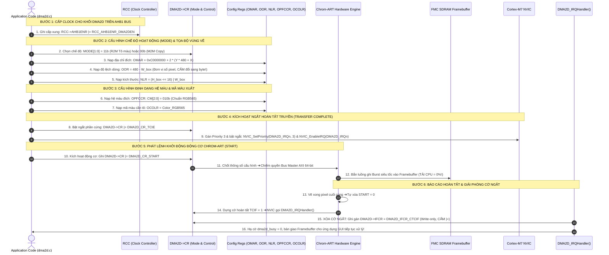
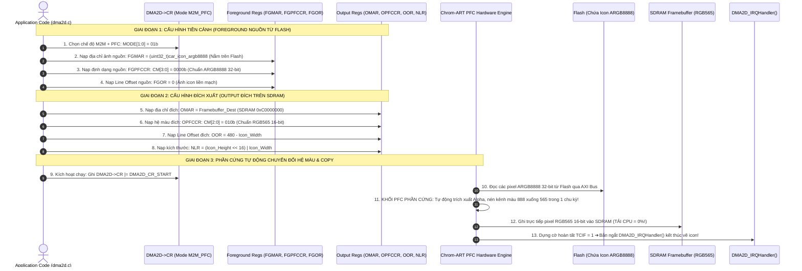
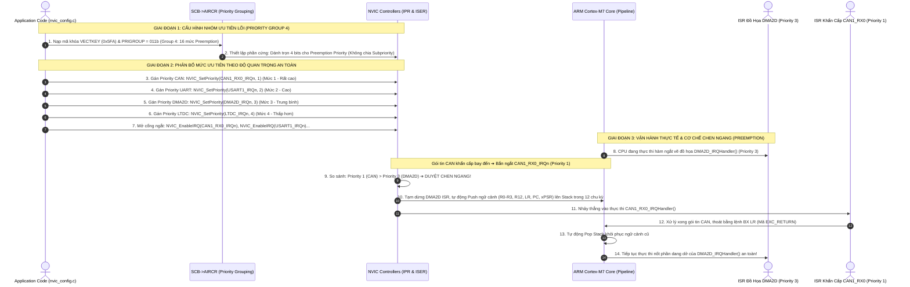

# 🏆 [NGÀY 5] CẨM NANG TOÀN DIỆN BARE-METAL: BỘ TĂNG TỐC ĐỒ HỌA DMA2D (CHROM-ART) & THIẾT KẾ PHÂN TẦNG ƯU TIÊN NGẮT NVIC
## Lộ trình 4 Bước: Nguyên Lý Phần Cứng ➔ Thực Chiến RM0385 ➔ Gõ Code Driver ➔ Phỏng Vấn Chuyên Sâu

> **Mục tiêu:** Làm chủ bộ tăng tốc đồ họa 2D phần cứng độc quyền Chrom-ART (DMA2D) trên STM32F746, thực hiện tô màu vùng nhớ (Register-to-Memory Color Fill), sao chép ảnh có chuyển đổi định dạng màu (Pixel Format Conversion PFC: ARGB8888 sang RGB565) và hòa trộn hai lớp ảnh (Alpha Blending) với tải CPU xấp xỉ 0%. Đồng thời thiết lập kiến trúc phân tầng ưu tiên ngắt NVIC (NVIC Priority Architecture) chuẩn công nghiệp ô tô, triệt tiêu hiện tượng nghẽn ngắt (Interrupt Jitter / Priority Inversion) giữa CAN Bus, UART DMA và Render màn hình.  
> **Nguyên tắc kỹ thuật:** **Đi thẳng vào cơ chế phần cứng, thanh ghi, công thức toán học, bảng tra cứu và phân chia file rõ ràng — KHÔNG dùng ví dụ ẩn dụ ngoài lề dài dòng.**

---

```text
┌─────────────────────────────────────────────────────────────────────────────────────────────────┐
│                           LỘ TRÌNH 4 BƯỚC CHINH PHỤC NGÀY 5                                     │
├───────────────────┬───────────────────┬────────────────────────────┬────────────────────────────┤
│ BƯỚC 1: NGUYÊN LÝ │ BƯỚC 2: THỰC CHIẾN│ BƯỚC 3: GÕ CODE            │ BƯỚC 4: PHỎNG VẤN          │
│ • Cơ chế DMA2D    │ • Tra cứu RM0385  │ • Gắn nhãn file cụ thể     │ • Bộ 5 câu hỏi vặn DMA2D   │
│   Chrom-ART Engine│   & PM0253        │ • TODO 1-2 [dma2d.h]       │   & NVIC Grouping          │
│ • 4 Chế độ DMA2D  │ • Bảng Base Addr  │ • TODO 3-5 [dma2d.c]       │ • Line Offset Skew Trap    │
│ • Toán Offset Line│ • Bảng Thanh ghi  │ • TODO 6 [nvic_config.h/c] │ • Priority Inversion Bug   │
│ • Kiến trúc NVIC  │ • Bảng Cờ W1C     │ • TODO 7 [main.c]          │ • Kịch bản trả lời 60s     │
│ • Priority Groups │ • Bảng NVIC Map   │ • Mổ xẻ 5 Bug phần cứng    │   (Elevator Pitch)         │
│ • Bắt tay phần    │                   │                            │                            │
│   cứng (Mermaid)  │                   │                            │                            │
└───────────────────┴───────────────────┴────────────────────────────┴────────────────────────────┘
```

---

## 🛠️ RÀ SOÁT 7 QUY TẮC BARE-METAL CỐT LÕI (CHUYÊN CHO NGÀY 5)

| STT | Quy tắc Bare-metal | Thể hiện cụ thể trong Ngày 5 (DMA2D & NVIC) |
| :---: | :--- | :--- |
| **1** | **Reset Value** | Tra cứu giá trị mặc định của `DMA2D_CR` (`0x0000 0000`), `DMA2D_OPFCCR` (`0x0000 0000` - ARGB8888), và thanh ghi phân nhóm ngắt `SCB->AIRCR` trước khi ghi đè. |
| **2** | **Access Type** | **CỰC KỲ QUAN TRỌNG:** Thanh ghi `DMA2D_IFCR` (Interrupt Flag Clear Register) là dạng `w` (Write-only to clear). Tuyệt đối không dùng `DMA2D->IFCR |= FLAG`, phải ghi gán trực tiếp `DMA2D->IFCR = DMA2D_IFCR_CTCIF` để không vô tình xóa nhầm cờ báo lỗi truyền cấu hình sai `TEIF` (Transfer Error Interrupt Flag)! |
| **3** | **Multi-Bit Clear-Set** | Áp dụng quy tắc xóa trước - gán sau (`REG &= ~MASK; REG |= VALUE;`) cho các trường đa bit: `MODE[1:0]` (Bits 17:16 trong `DMA2D_CR`), `CM[3:0]` (Color Mode trong `DMA2D_OPFCCR`), và `PRIGROUP[2:0]` (Bits 10:8 trong `SCB->AIRCR`). |
| **4** | **`volatile` Qualification** | Mọi struct ánh xạ thanh ghi DMA2D và cờ đồng bộ `volatile uint8_t dma2d_transfer_complete` giữa ISR và Main loop bắt buộc dùng `volatile`. |
| **5** | **Interrupt Workflow** | Quy trình 5 bước ngắt DMA2D: Cờ phần cứng `TCIF` dựng -> Bật `DMA2D_CR_TCIE` -> Bật `NVIC_EnableIRQ(DMA2D_IRQn)` -> Chạy `DMA2D_IRQHandler` -> Xóa cờ ngắt bằng `DMA2D->IFCR = DMA2D_IFCR_CTCIF`. |
| **6** | **RM / DS Lookup** | Cung cấp chính xác Chapter, Section, từ khóa `Ctrl + F`, công thức `Base Address + Offset` cho `DMA2D` (RM0385 Chapter 10) và `NVIC` (PM0253 Chapter 4). |
| **7** | **Hardware Rationale & Specs** | Bố trí cơ sở kỹ thuật, giới hạn băng thông AXI Bus Matrix, bảng phân bổ 16 mức ưu tiên Preemption Priority phục vụ an toàn hệ thống (CAN > UART > DMA2D > LTDC > SysTick). |

---

# 🧠 BƯỚC 1: NGUYÊN LÝ PHẦN CỨNG & CƠ CHẾ VẬT LÝ (HARDWARE ARCHITECTURE)

## 1.0. So Sánh Bản Chất: Vẽ Đồ Họa Bằng CPU Thuần vs Khối Tăng Tốc DMA2D (Chrom-ART) & Phân Tầng NVIC

Trước khi đi vào các thanh ghi `DMA2D_CR`, `DMA2D_OOR` và thanh ghi phân nhóm NVIC `AIRCR`, hãy so sánh sự khác biệt căn bản giữa hai phương pháp xử lý đồ họa và ngắt:

| Hạng mục so sánh | Cách tiếp cận CPU Thuần túy (Software Rendering) | Khối Tăng Tốc Phần Cứng DMA2D & NVIC Chuẩn Công Nghiệp |
| :--- | :--- | :--- |
| **Đổ màu vùng nhớ (Color Fill)** | Dùng 2 vòng lặp `for` lồng nhau để gán giá trị từng pixel: Chiếm 100% CPU, mất hàng chục mili-giây. | **Chế độ R2M (Register-to-Memory)**: DMA2D tự động đổ màu toàn bộ vùng 480x272 chỉ trong chưa đầy 1 mili-giây, CPU hoàn toàn rảnh rỗi! |
| **Sao chép hình ảnh (Bitmap Copy)** | Dùng hàm `memcpy()` trong thư viện C: Chậm chạp, chiếm dụng toàn bộ Bus Matrix. | **Chế độ M2M (Memory-to-Memory)**: DMA2D đọc từ Flash/RAM này bắn thẳng sang SDRAM với bus 64-bit nội bộ độc lập. |
| **Hòa trộn độ trong suốt (Alpha Blending)** | Phải tính toán công thức số học phức tạp từng kênh màu R, G, B: $\text{Pixel} = \frac{\text{Src} \times \alpha + \text{Dst} \times (255 - \alpha)}{255}$. Rất nặng cho CPU. | **Chế độ M2M_BLEND phần cứng**: Động cơ Chrom-ART tự tính toán hòa trộn điểm ảnh theo thời gian thực ở tốc độ xung nhịp 216 MHz. |
| **Phân bổ Ưu tiên Ngắt (NVIC)** | Cài đặt độ ưu tiên ngắt lộn xộn, dẫn đến việc ngắt màn hình/vẽ đồ họa chặn đứng ngắt an toàn mạng CAN. | **Cấu hình Priority Grouping 4 (4 bit Preemption, 0 bit Subpriority)**: Phân tầng rõ ràng: Ngắt an toàn CAN (mức 0) > Ngắt UART (mức 1) > Ngắt đồ họa LTDC/DMA2D (mức 5). |
| **Đối chiếu với Môi trường RTOS** | CPU vẽ đồ họa làm chậm trễ lịch trình của bộ định thời RTOS Scheduler. | Task đồ họa kích hoạt DMA2D rồi đi ngủ (`k_sem_take` hoặc `xSemaphoreTake`); ngắt DMA2D hoàn thành sẽ đánh thức Task dậy tiếp tục. |


## 1.1. Bản chất Phần cứng Khối Tăng Tốc Đồ Họa DMA2D (Chrom-ART Accelerator)

Trong hệ thống nhúng hiển thị (GUI), việc CPU phải chạy vòng lặp `for` để tô màu hoặc sao chép từng pixel trên màn hình 480x272 (tổng cộng $130{,}560	ext{ pixels} 	imes 2	ext{ bytes} = 261{,}120	ext{ bytes} pprox 255	ext{ KB}$ mỗi khung hình) sẽ chiếm dụng tới **85% - 95% thời gian xử lý của CPU**, làm gián đoạn việc nhận gói tin CAN Bus và xử lý giao tiếp thời gian thực.

Khối **DMA2D (Chrom-ART Accelerator)** là một mạch phần cứng chuyên dụng độc lập nằm trên Bus Master AXI:
* **Giao tiếp Bus:** Nối trực tiếp vào AXI Bus Matrix 64-bit, có khả năng phát các chuỗi đọc/ghi Burst liên tục với bộ nhớ SDRAM ngoài và SRAM nội.
* **Tải CPU:** Hoàn toàn bằng **0%** trong suốt quá trình copy, fill màu hoặc hòa trộn Alpha (CPU chỉ cần nạp địa chỉ, kích hoạt bit `START`, và quay sang làm việc khác hoặc đi ngủ chờ ngắt).
* **Hiệu năng:** Tốc độ đổ màu và copy đạt tối đa băng thông bộ nhớ FMC SDRAM ($108	ext{ MHz} 	imes 16	ext{ bits} = 216	ext{ MB/s}$ lý thuyết), nhanh gấp **8 đến 12 lần** so với lệnh `memcpy()` hoặc vòng lặp C thuần của CPU.

```text
                                  ┌──────────────────────────────────────────────────┐
                                  │             ARM CORTEX-M7 CORE                   │
                                  │      (Giải phóng 100% khi vẽ đồ họa)             │
                                  └────────────────────────┬─────────────────────────┘
                                                           │
                                                           ▼ (Phát lệnh Start)
┌──────────────────────────────────────────────────────────┴──────────────────────────────────────────────────────┐
│                                           AXI / AHB BUS MATRIX                                                  │
├────────────────────────────────┬───────────────────────────────────────────────┬────────────────────────────────┤
│                                │                                               │                                │
│   ┌────────────────────────┐   │   ┌───────────────────────────────────────┐   │   ┌────────────────────────┐   │
│   │   SRAM Nội / Flash     │ ◄─┼── │          DMA2D CHROM-ART              │ ──┼─► │       FMC SDRAM        │   │
│   │   (Chứa Icon / Font)   │   │   │  ┌─────────────────────────────────┐  │   │   │  (Chứa Framebuffer     │   │
│   └────────────────────────┘   │   │  │ Khối PFC (Chuyển đổi hệ màu)   │  │   │   │   Hiển thị màn hình)   │   │
│                                │   │  ├─────────────────────────────────┤  │   │   └────────────────────────┘   │
│                                │   │  │ Khối Blending (Alpha Mixer)     │  │   │                                │
│                                │   │  └─────────────────────────────────┘  │   │                                │
│                                │   └───────────────────────────────────────┘   │                                │
└────────────────────────────────┴───────────────────────────────────────────────┴────────────────────────────────┘
```

> 📖 **Hướng Dẫn Tra Cứu Nguyên Lý Trong Reference Manual (RM0385):**
> 1. **Mở file `RM0385.pdf`** ➔ Bấm `Ctrl + F` ➔ Gõ từ khóa: **`DMA2D functional description`**
> 2. Nhảy đến **Chapter 10: DMA2D controller -> Section 10.3: DMA2D functional description**:
>    * Quan sát **Figure 39. DMA2D block diagram**: Xem cấu tạo các khối bên trong DMA2D: Bus Master Interface (đọc nguồn / ghi đích), Pixel Pipeline (PFC cho Foreground và Background), Bảng tra màu CLUT và Khối hòa trộn Blending.
>    * Đọc mục luồng dữ liệu pixel: DMA2D nạp các điểm ảnh từ nguồn vào FIFO nội bộ, chuyển đổi không gian màu độc lập mà không can thiệp vào bộ nhớ CPU.

---

## 1.2. Bốn Chế Độ Hoạt Động Cốt Lõi của DMA2D (`MODE[1:0]` trong `DMA2D_CR`)

| Chế độ (`MODE[1:0]`) | Tên kỹ thuật | Cơ chế phần cứng | Ứng dụng thực tế trong Dự án |
| :---: | :--- | :--- | :--- |
| **`00`b** | **Memory-to-Memory (M2M)** | Copy trực tiếp khối pixel từ bộ nhớ nguồn sang bộ nhớ đích mà **không thay đổi định dạng màu**. | Sao chép nhanh bộ đệm phụ (Back Buffer) sang bộ đệm chính (Front Buffer). |
| **`01`b** | **M2M with Pixel Format Conversion (PFC)** | Đọc pixel từ bộ nhớ nguồn, tự động giải mã và chuyển đổi hệ màu (ví dụ từ RGB565 sang ARGB8888 hoặc ARGB4444) trước khi ghi vào đích. | Nạp các icon định dạng nén từ Flash vào Framebuffer SDRAM. |
| **`10`b** | **M2M with Blending** | Đọc đồng thời 2 lớp ảnh: Lớp tiền cảnh (Foreground) và Lớp hậu cảnh (Background), hòa trộn pixel theo trọng số kênh Alpha (alpha), rồi ghi ra đích. | Vẽ kim đồng hồ trong suốt đè lên mặt đồng hồ tốc độ xe hơi. |
| **`11`b** | **Register-to-Memory (R2M)** | Ghi trực tiếp giá trị màu định sẵn trong thanh ghi `DMA2D_OCOLR` vào toàn bộ khối pixel đích mà **không cần đọc bất kỳ vùng nhớ nguồn nào**. | Xóa trắng màn hình (Clear Screen) hoặc vẽ các thanh đo tốc độ, hộp thoại chữ nhật siêu tốc. |

> 📖 **Hướng Dẫn Tra Cứu Nguyên Lý Trong Reference Manual (RM0385):**
> 1. **Mở file `RM0385.pdf`** ➔ Bấm `Ctrl + F` ➔ Gõ từ khóa: **`DMA2D control register (DMA2D_CR)`**
> 2. Nhảy đến **Section 10.4.1: DMA2D_CR**:
>    * Tra cứu trường bit `MODE[1:0]` (Bits 17:16): Đọc mô tả kỹ thuật chi tiết của ST cho từng chế độ hoạt động phần cứng.
>    * Chú ý cờ `START` (Bit 0): Mạch phần cứng tự động kéo cờ này về mức 0 khi toàn bộ pixel của hình chữ nhật đã được ghi xong xuống RAM.

---

## 1.3. Công Thức Toán Học Tính Line Offset Tránh Lỗi Xéo Hình (Skewed Image Bug)

Khi vẽ một hình chữ nhật nhỏ có kích thước $W_{	ext{box}} 	imes H_{	ext{box}}$ vào bên trong một Framebuffer lớn có kích thước $W_{	ext{screen}} 	imes H_{	ext{screen}}$:

```text
   Vùng nhớ Framebuffer Đích trên SDRAM (Chiều rộng W_screen = 480)
┌────────────────────────────────────────────────────────────────────────┐
│                                                                        │
│         (X_pos, Y_pos)                                                 │
│               ┌───────────────────────┐                                │
│               │                       │                                │
│               │   Hình chữ nhật con   │ H_box                          │
│               │   cần vẽ              │                                │
│               │                       │                                │
│               └───────────────────────┘                                │
│                         W_box                                          │
│                                                                        │
└────────────────────────────────────────────────────────────────────────┘
```

1. **Địa chỉ Pixel khởi đầu (Output Memory Address - `OMAR`):**
   $$	ext{Start Address} = 	ext{Base Address} + (Y_{	ext{pos}} 	imes W_{	ext{screen}} + X_{	ext{pos}}) 	imes 	ext{BytesPerPixel}$$
   * Với định dạng **RGB565** ($	ext{BytesPerPixel} = 2$):
     $$	ext{OMAR} = 	ext{0xC0000000} + 2 	imes (Y_{	ext{pos}} 	imes 480 + X_{	ext{pos}})$$

2. **Độ lệch dòng đích (Output Line Offset - `OOR`):**
   Sau khi DMA2D vẽ xong $W_{	ext{box}}$ pixels của một dòng, con trỏ phần cứng phải **nhảy cóc qua phần còn lại của màn hình** để xuống đúng đầu dòng tiếp theo:
   $$	ext{Line Offset (OOR)} = W_{	ext{screen}} - W_{	ext{box}} = 480 - W_{	ext{box}}$$
   * ⚠️ **Lưu ý sống còn:** Giá trị ghi vào `DMA2D_OOR` tính bằng **đơn vị số pixel**, KHÔNG PHẢI số byte! Nếu ghi sai thành byte, hình ảnh sẽ bị xé xéo thành các dải sọc chéo trên màn hình.

> 📖 **Hướng Dẫn Tra Cứu Nguyên Lý Trong Reference Manual (RM0385):**
> 1. **Mở file `RM0385.pdf`** ➔ Bấm `Ctrl + F` ➔ Gõ từ khóa: **`DMA2D output line offset register`**
> 2. Nhảy đến **Section 10.4.12: DMA2D output line offset register (DMA2D_OOR)**:
>    * Đọc định nghĩa trường `LO[13:0]` (Line offset): ST định nghĩa rõ ràng "Line offset expressed in pixels". Giá trị này được cộng vào địa chỉ sau khi vẽ xong một dòng.
>    * Xem tiếp **Section 10.4.13: DMA2D number of line register (DMA2D_NLR)**: Nạp chiều cao hình ảnh vào `NL[15:0]` và chiều rộng điểm ảnh vào `PL[13:0]`.

---

## 1.4. Kiến Trúc Phân Tầng Ưu Tiên Ngắt NVIC (Nested Vectored Interrupt Controller)

Lõi ARM Cortex-M7 hỗ trợ 16 mức ưu tiên ngắt phần cứng (từ 0 đến 15, số càng nhỏ thì ưu tiên càng cao). Thanh ghi điều khiển phân nhóm ngắt **`SCB->AIRCR` (Application Interrupt and Reset Control Register)** chứa trường `PRIGROUP[2:0]` (Bits 10:8):

### Bảng Phân Bổ Nhóm Ưu Tiên (Priority Grouping):
Trong dự án này, ta sử dụng chuẩn công nghiệp ô tô: **`NVIC_PriorityGroup_4` (`PRIGROUP = 011`b)**:
* Toàn bộ 4 bits phần cứng được dùng cho **Preemption Priority** (Mức ưu tiên ngắt chen ngang: 16 mức từ 0 đến 15).
* 0 bit dành cho Subpriority.
* **Nguyên lý Chen ngang (Preemption):** Một ngắt có Preemption Priority cao hơn (số bé hơn) ĐƯỢC PHÉP ngắt ngang thân ISR của một ngắt có Preemption Priority thấp hơn đang thực thi.

```text
┌─────────────────────────────────────────────────────────────────────────────────────────────────┐
│              BẢNG THIẾT KẾ PHÂN TẦNG ƯU TIÊN NGẮT (NVIC PRIORITY MATRIX)                        │
├──────────────┬──────────────┬──────────────┬────────────────────────────────────────────────────┤
│ Tên Ngắt IRQ │ Vector IRQn  │ Ưu Tiên (0-15)│ Cơ Sở Kỹ Thuật & Lý Do Thiết Kế                    │
├──────────────┼──────────────┼──────────────┼────────────────────────────────────────────────────┤
│ CAN1_RX0_IRQn│ IRQn = 19    │ **Priority 1**│ CỰC CAO: Buffer phần cứng bxCAN chỉ có 3 tầng FIFO.│
│              │              │              │ Nếu không đọc kịp, gói tin CAN mạng ô tô bị tràn   │
│              │              │              │ (Overrun) gây mất an toàn hệ thống.                │
├──────────────┼──────────────┼──────────────┼────────────────────────────────────────────────────┤
│ USART1_IRQn  │ IRQn = 37    │ **Priority 2**│ CAO: Xử lý sự kiện IDLE Line và lỗi ORE/FE của DMA │
│              │              │              │ Circular Ring Buffer.                              │
├──────────────┼──────────────┼──────────────┼────────────────────────────────────────────────────┤
│ DMA2D_IRQn   │ IRQn = 90    │ **Priority 3**│ TRUNG BÌNH: Báo hiệu hoàn tất vẽ khung hình đồ họa.│
├──────────────┼──────────────┼──────────────┼────────────────────────────────────────────────────┤
│ LTDC_IRQn    │ IRQn = 88    │ **Priority 4**│ TRUNG BÌNH THẤP: Đồng bộ VSYNC và Line Event.      │
├──────────────┼──────────────┼──────────────┼────────────────────────────────────────────────────┤
│ SysTick_IRQn │ Exception -1 │ **Priority 15**│ THẤP NHẤT: Đếm mili-giây hệ thống. Tuyệt đối không │
│              │              │              │ để SysTick ngắt ngang các ISR truyền thông khẩn cấp│
└──────────────┴──────────────┴──────────────┴────────────────────────────────────────────────────┘
```

> 📖 **Hướng Dẫn Tra Cứu Nguyên Lý Trong Programming Manual (PM0253) & RM0385:**
> 1. **Mở file `PM0253.pdf`** ➔ Bấm `Ctrl + F` ➔ Gõ từ khóa: **`Application interrupt and reset control register`**
>    * Nhảy đến **Chapter 4: Core peripherals -> Section 4.3.5: SCB->AIRCR (Address: 0xE000 ED0C)**.
>    * Tra cứu **Table 49. Priority grouping**: Xem cách trường `PRIGROUP[10:8]` phân bổ 4 bit ngắt của Cortex-M7 thành Preemption Priority và Subpriority. Để chọn 16 mức Preemption và 0 mức Subpriority, bắt buộc nạp `PRIGROUP = 011b` (Nhóm 4) cùng mật mã bảo vệ `VECTKEY = 0x05FA`.
> 2. **Mở file `RM0385.pdf`** ➔ Bấm `Ctrl + F` ➔ Gõ từ khóa: **`Vector table for STM32F7`**
>    * Nhảy đến **Chapter 10: Interrupts and events -> Table 43**: Đối chiếu thứ tự và vị trí phần cứng: `CAN1_RX0_IRQn = 19`, `USART1_IRQn = 37`, `LTDC_IRQn = 88`, `DMA2D_IRQn = 90`.


---

## 1.5. Sơ Đồ Tuần Tự: Quy Trình Cấu Hình & Vận Hành Ngoại Vi (Configuration & Execution Pipeline)

Mô hình hóa toàn bộ chuỗi các bước cấu hình tuần tự các thanh ghi phần cứng (`RCC`, `DMA2D`, `NVIC`) để khởi chạy bộ tăng tốc đồ họa Chrom-ART và thiết lập kiến trúc phân tầng ưu tiên ngắt:

---

### 📋 Sơ Đồ 1: Quy Trình Cấu Hình Tuần Tự Khối Tăng Tốc Đồ Họa DMA2D (DMA2D Configuration & Execution Pipeline)

Sơ đồ thể hiện tuần tự từ khâu cấp clock, chọn chế độ vẽ, nạp tọa độ, cấu hình màu, kích hoạt ngắt đến khi động cơ Chrom-ART chạy độc lập trên Bus Master AXI:



---

### 📋 Sơ Đồ 2: Quy Trình Sao Chép Ảnh Có Chuyển Đổi Hệ Màu M2M PFC (DMA2D PFC Pipeline)

Mô hình hóa chu trình bộ tăng tốc Chrom-ART đọc ảnh icon nén 32-bit ARGB8888 từ Flash, tự động giải mã và chuyển đổi phần cứng sang 16-bit RGB565 ghi vào Framebuffer SDRAM với tải CPU hoàn toàn bằng 0%:



---

### 📋 Sơ Đồ 3: Quy Trình Cấu Hình Phân Tầng Ưu Tiên NVIC & Cơ Chế Chen Ngang (NVIC Pipeline)



---

# 📑 BƯỚC 2: THỰC CHIẾN & TRA CỨU RM0385 / PM0253 (SETUP & LOOKUP)

> 🎯 **NGUYÊN TẮC TRA CỨU BARE-METAL CỐT LÕI (Kế thừa Day 00):**
> * **Khối đồ họa DMA2D:** Mở file **`RM0385.pdf`** (Reference Manual).
> * **Khối phân cấp ngắt NVIC & AIRCR:** Mở file **`PM0253.pdf`** (Cortex-M7 Programming Manual). Mọi thanh ghi ngắt lõi Core đều nằm trong PM0253!

---

## 2.1. Lộ trình Tra cứu Trực tiếp Từng Bước (Step-by-Step RM / PM Lookup)

### 📖 Bước 1: Tra cứu Base Address & Vector Ngắt (RM0385)
1. **Mở file `RM0385.pdf`** ➔ Bấm **`Ctrl + F`** ➔ Gõ từ khóa: **`Register boundary addresses`**
   * Nhảy đến **Chapter 2: Memory map -> Table 1**:
     * Ngoại vi **`DMA2D`**: Base Address **`0x4002 B000`** (Bus AHB1).
2. **Bấm `Ctrl + F`** ➔ Gõ từ khóa: **`Vector table for STM32F7`**
   * Nhảy đến **Chapter 10: Interrupts and events -> Table 43**:
     * Vector ngắt phần cứng: **`DMA2D global interrupt`** có số định danh vị trí **`Position = 90`** (`DMA2D_IRQn = 90`).

### 📖 Bước 2: Tra cứu Thanh ghi Tăng Tốc Đồ Họa DMA2D (RM0385)
1. **Mở file `RM0385.pdf`** ➔ Bấm **`Ctrl + F`** ➔ Gõ từ khóa: **`DMA2D register map`**
2. Nhảy đến **Chapter 10: DMA2D controller -> Section 10.4: DMA2D registers**:
   * **Section 10.4.1 (`DMA2D_CR`)**: Chọn chế độ Mode (R2M/M2M), bật ngắt hoàn tất `TCIE`, kích hoạt cờ lệnh `START`.
   * **Section 10.4.2 & 10.4.3 (`DMA2D_ISR` & `DMA2D_IFCR`)**: Đọc cờ `TCIF`, `TEIF` và cơ chế xóa cờ an toàn **Write 1 to Clear (W1C)** qua `CTCIF`, `CTEIF`.
   * **Section 10.4.11 (`DMA2D_OMAR`)**: Nạp địa chỉ SDRAM Framebuffer đích.
   * **Section 10.4.12 (`DMA2D_OOR`)**: Nạp độ lệch dòng `LO[13:0] = Screen_Width - Box_Width`.
   * **Section 10.4.13 (`DMA2D_NLR`)**: Nạp số dòng `NL[15:0]` và số pixel trên mỗi dòng `PL[13:0]`.

### 📖 Bước 3: Tra cứu Thanh ghi Phân nhóm & Gán Ưu tiên NVIC (PM0253)
1. **Mở file `PM0253.pdf`** ➔ Bấm **`Ctrl + F`** ➔ Gõ từ khóa: **`Application interrupt and reset control register`**
   * Nhảy đến **Chapter 4: Core peripherals -> Section 4.3.5 (`SCB->AIRCR`, Address: `0xE000 ED0C`)**:
     * Ghi mã khóa bảo vệ `VECTKEY = 0x05FA` kết hợp trường `PRIGROUP[10:8] = 011b` (Nhóm Priority Group 4: 16 mức Preemption, 0 mức Subpriority).
2. **Bấm `Ctrl + F`** ➔ Gõ từ khóa: **`Interrupt set-enable registers`**
   * Nhảy đến **Section 4.3.1 (`NVIC->ISER`, Address: `0xE000 E100`)** & **Section 4.3.7 (`NVIC->IPR`, Address: `0xE000 E400`)**:
     * Bật ngắt bằng `NVIC->ISER[90 / 32] |= (1 << (90 % 32))`.
     * Gán mức ưu tiên qua `NVIC->IPR[90] = (priority << 4)`.

---

## 2.2. Bản đồ Địa chỉ Base Address & Vector Ngắt Ngày 5

Tra cứu RM0385 *Chapter 2: Memory map* và PM0253 *Chapter 4: Core peripherals*:

| Tên ngoại vi / Thanh ghi | Bus | Base Address | Offset | Địa chỉ tuyệt đối | Chức năng chính |
| :--- | :---: | :---: | :---: | :---: | :--- |
| **`DMA2D`** | AHB1 | `0x4002 B000` | `0x0000` | `0x4002 B000` | Điều khiển tăng tốc đồ họa Chrom-ART (`DMA2D_IRQn = 90`). |
| **`SCB (AIRCR)`** | System Bus | `0xE000 ED00` | `0x000C` | `0xE000 ED0C` | Phân nhóm ngắt lõi (Priority Grouping: `VECTKEY=0x05FA`). |
| **`NVIC->ISER`** | System Bus | `0xE000 E100` | `0x0000` | `0xE000 E100` | Bật ngắt phần cứng (Mỗi thanh ghi 32-bit quản lý 32 IRQ). |
| **`NVIC->IPR`** | System Bus | `0xE000 E400` | `0x0000` | `0xE000 E400` | Gán mức ưu tiên Preemption (8-bit mỗi ngắt, dùng 4-bit cao [7:4]). |

Tra cứu RM0385 *Chapter 10: DMA2D controller -> Section 10.4: DMA2D registers*:

| Thanh ghi | Offset | Reset Value | Bit / Trường | Access | Mô tả & Cấu hình Kỹ thuật |
| :--- | :---: | :---: | :---: | :---: | :--- |
| **`DMA2D_CR`** | `0x00` | `0x0000 0000` | `START` (Bit 0) | `RW` | Ghi `1` để bắt đầu truyền. Phần cứng tự xóa về `0` khi hoàn tất. |
| | | | `TCIE` (Bit 9) | `RW` | Ghi `1` để bật ngắt Transfer Complete Interrupt. |
| | | | `TEIE` (Bit 8) | `RW` | Ghi `1` để bật ngắt Transfer Error Interrupt. |
| | | | `MODE[1:0]` (Bit 17:16)| `RW` | Chế độ: `00` M2M, `01` M2M+PFC, `10` Blending, `11` R2M (Color fill). |
| **`DMA2D_ISR`** | `0x04` | `0x0000 0000` | `TCIF` (Bit 1) | `RO` | Cờ báo truyền hoàn tất (Transfer Complete Interrupt Flag). |
| | | | `TEIF` (Bit 0) | `RO` | Cờ báo lỗi cấu hình truyền (Transfer Error Interrupt Flag). |
| **`DMA2D_IFCR`**| `0x08` | `0x0000 0000` | `CTCIF` (Bit 1)| `w` | **W1C:** Ghi `1` để xóa cờ `TCIF`. CẤM DÙNG `\|=`. |
| | | | `CTEIF` (Bit 0)| `w` | **W1C:** Ghi `1` để xóa cờ `TEIF`. CẤM DÙNG `\|=`. |
| **`DMA2D_OMAR`**| `0x3C` | `0x0000 0000` | `MA[31:0]` | `RW` | Địa chỉ vùng nhớ đích (Output Memory Address trong SDRAM). |
| **`DMA2D_OOR`** | `0x40` | `0x0000 0000` | `LO[13:0]` | `RW` | Độ lệch dòng đích (Line Offset tính bằng số pixel: $W_{	ext{screen}} - W_{	ext{box}}$). |
| **`DMA2D_NLR`** | `0x44` | `0x0000 0000` | `NL[15:0]` (31:16)| `RW` | Số dòng cần truyền (Number of Lines = H_{box). |
| | | | `PL[13:0]` (13:0) | `RW` | Số pixel trên mỗi dòng (Pixels per Line = W_{box). |
| **`DMA2D_OCOLR`**| `0x48`| `0x0000 0000` | `COLOR[31:0]`| `RW` | Mã màu xuất (trong chế độ R2M: định dạng RGB565 hoặc ARGB8888). |
| **`DMA2D_OPFCCR`**|`0x34`| `0x0000 0000` | `CM[2:0]` (Bit 2:0)| `RW` | Định dạng màu đích: `000` ARGB8888, `001` RGB888, `010` RGB565. |

---

# 💻 BƯỚC 3: GÕ CODE & MỔ XẺ BUG PHẦN CỨNG (CODING & DEBUGS)

## 3.1. Phân chia Cấu trúc File Dự án cho Ngày 5

```text
drivers/
├── inc/
│   ├── dma2d.h        <-- Khai báo API đồ họa DMA2D (Fill, Copy, Blend)
│   └── nvic_config.h  <-- Khai báo API quản lý phân tầng ưu tiên ngắt NVIC
└── src/
    ├── dma2d.c        <-- Triển khai driver DMA2D Bare-metal & ISR
    └── nvic_config.c  <-- Cấu hình Priority Grouping 4 và phân bổ Priority
src/
└── main.c             <-- Demo vẽ giao diện táp-lô xe hơi siêu tốc và test ngắt
```

---

### 📂 KHỐI 1: FILE HEADER GIAO DIỆN DMA2D [ `drivers/inc/dma2d.h` ]

#### 📖 Hướng Dẫn Tra Cứu Tài Liệu Cho TODO 1:
1. **Kiến trúc khối tăng tốc đồ họa Chrom-ART:**
   - **Mở `RM0385.pdf`** ➔ `Ctrl + F` ➔ `DMA2D functional description` (Chapter 10 Section 10.3).
   - Tham chiếu các tính năng phần cứng: Register-to-Memory (R2M), M2M copy, Blending.
2. **Kích thước màn hình và bảng mã màu RGB565:**
   - **Mở `RM0385.pdf`** ➔ `Section 10.4.10: DMA2D_OPFCCR`: Bảng mã màu định dạng `CM[2:0] = 010b` (RGB565 - 16 bits/pixel: 5 bits Red, 6 bits Green, 5 bits Blue).
   - Màu Đen: `0x0000`, Trắng: `0xFFFF`, Đỏ: `0xF800` (Red max), Lục: `0x07E0` (Green max), Lam: `0x001F` (Blue max).

#### TODO 1 [File: `drivers/inc/dma2d.h`]: Khai báo API Đồ Họa Tăng Tốc Phần Cứng
```c
#ifndef DMA2D_H
#define DMA2D_H

#include <stdint.h>

/* Kích thước màn hình Rocktech Discovery LCD */
#define LCD_SCREEN_WIDTH   480U
#define LCD_SCREEN_HEIGHT  272U

/* Các mã màu RGB565 thông dụng */
#define COLOR_BLACK        0x0000U
#define COLOR_WHITE        0xFFFFU
#define COLOR_RED          0xF800U
#define COLOR_GREEN        0x07E0U
#define COLOR_BLUE         0x001FU
#define COLOR_GRAY         0x7BEFU
#define COLOR_YELLOW       0xFFE0U

/**
 * @brief Khởi tạo khối đồ họa phần cứng DMA2D & bật ngắt NVIC
 */
void DMA2D_Init(void);

/**
 * @brief Tô màu đơn sắc siêu tốc vào vùng chữ nhật (Register-to-Memory)
 * @param dst_addr Địa chỉ pixel bắt đầu trên Framebuffer (SDRAM)
 * @param x Tọa độ X góc trên bên trái
 * @param y Tọa độ Y góc trên bên trái
 * @param width Chiều rộng hình chữ nhật
 * @param height Chiều cao hình chữ nhật
 * @param rgb565_color Mã màu 16-bit RGB565
 */
void DMA2D_FillRect(uint32_t dst_base, uint16_t x, uint16_t y, 
                    uint16_t width, uint16_t height, uint16_t rgb565_color);

/**
 * @brief Chờ quá trình truyền DMA2D hoàn tất (Polling an toàn kèm timeout)
 */
uint8_t DMA2D_WaitTransferComplete(uint32_t timeout_cycles);

#endif /* DMA2D_H */
```

---

### 📂 KHỐI 2: FILE SOURCE DRIVER DMA2D [ `drivers/src/dma2d.c` ]

#### 📖 Hướng Dẫn Tra Cứu Tài Liệu Cho TODO 2:
1. **Cấp xung ngoại vi DMA2D trên AHB1:**
   - **Mở `RM0385.pdf`** ➔ `Ctrl + F` ➔ `RCC_AHB1ENR` (Section 5.3.12): Bit 23 `DMA2DEN` (DMA2D clock enable).
2. **Cấu hình thanh ghi điều khiển DMA2D_CR & cờ ngắt:**
   - **Mở `RM0385.pdf`** ➔ `Ctrl + F` ➔ `DMA2D control register (DMA2D_CR)` (Section 10.4.1):
     - Bit 9 `TCIE` (Transfer complete interrupt enable).
     - Bit 8 `TEIE` (Transfer error interrupt enable).
3. **Cơ chế xóa cờ ngắt W1C (Write-Only to Clear):**
   - **Mở `RM0385.pdf`** ➔ `Ctrl + F` ➔ `DMA2D interrupt flag clear register (DMA2D_IFCR)` (Section 10.4.3):
     - Bit 1 `CTCIF` (Clear transfer complete interrupt flag).
     - Bit 0 `CTEIF` (Clear transfer error interrupt flag).
     - **LƯU Ý:** IFCR là thanh ghi Write-only, đọc luôn ra 0. Bắt buộc ghi `=` trực tiếp, cấm dùng `|=`.
4. **Kích hoạt ngắt phần cứng NVIC:**
   - **Mở `RM0385.pdf`** ➔ `Ctrl + F` ➔ `Table 43. Vector table for STM32F7`: `DMA2D global interrupt` có vị trí Position = 90 (`DMA2D_IRQn = 90`).

#### TODO 2 [File: `drivers/src/dma2d.c`]: Khởi Tạo Cấp Xung & Xử Lý Ngắt DMA2D
```c
#include "dma2d.h"
#include "Reg.h"

/* Biến cờ volatile báo hiệu hoàn tất truyền từ ngắt */
static volatile uint8_t g_dma2d_busy = 0;

void DMA2D_Init(void)
{
    /* BƯỚC 1: Cấp clock cho ngoại vi DMA2D trên AHB1 */
    RCC->AHB1ENR |= RCC_AHB1ENR_DMA2DEN;

    /* Đảm bảo trạng thái dừng ban đầu */
    DMA2D->CR = 0;

    /* BƯỚC 2: Xóa cờ ngắt tồn đọng từ lần chạy trước */
    DMA2D->IFCR = (DMA2D_IFCR_CTCIF | DMA2D_IFCR_CTEIF);

    /* BƯỚC 3: Bật cờ ngắt hoàn thành truyền (TCIE) và ngắt lỗi (TEIE) */
    DMA2D->CR |= (DMA2D_CR_TCIE | DMA2D_CR_TEIE);

    /* BƯỚC 4: Kích hoạt NVIC cho DMA2D (Priority được gán ở nvic_config.c) */
    NVIC_EnableIRQ(DMA2D_IRQn);
}

void DMA2D_IRQHandler(void)
{
    /* Kiểm tra cờ ngắt Transfer Complete */
    if (DMA2D->ISR & DMA2D_ISR_TCIF) {
        /* BẮT BUỘC: Ghi trực tiếp vào IFCR để xóa cờ (W1C) - CẤM DÙNG |= */
        DMA2D->IFCR = DMA2D_IFCR_CTCIF;
        g_dma2d_busy = 0;
    }

    /* Kiểm tra cờ ngắt Transfer Error */
    if (DMA2D->ISR & DMA2D_ISR_TEIF) {
        DMA2D->IFCR = DMA2D_IFCR_CTEIF;
        g_dma2d_busy = 0;
        /* Xử lý lỗi cấu hình vùng nhớ vượt biên */
    }
}
```

#### 📖 Hướng Dẫn Tra Cứu Tài Liệu Cho TODO 3:
1. **Thanh ghi địa chỉ bộ nhớ đích OMAR:**
   - **Mở `RM0385.pdf`** ➔ `Ctrl + F` ➔ `DMA2D output memory address register (DMA2D_OMAR)` (Section 10.4.11):
     - `MA[31:0]`: Output memory address. Với RGB565 (2 bytes/pixel): `start_addr = dst_base + 2 * (y * 480 + x)`.
2. **Thanh ghi độ lệch dòng OOR (Line Offset):**
   - **Mở `RM0385.pdf`** ➔ `Ctrl + F` ➔ `DMA2D output line offset register (DMA2D_OOR)` (Section 10.4.12):
     - `LO[13:0]`: Line offset tính bằng số PIXEL (không phải số byte!): `LO = 480 - width`.
3. **Thanh ghi kích thước vùng vẽ NLR:**
   - **Mở `RM0385.pdf`** ➔ `Ctrl + F` ➔ `DMA2D number of line register (DMA2D_NLR)` (Section 10.4.13):
     - `NL[15:0]` (Bits 31:16): Number of lines = Chiều cao (height).
     - `PL[13:0]` (Bits 13:0): Pixel per line = Chiều rộng (width).
4. **Cấu hình định dạng màu và chế độ R2M:**
   - `DMA2D_OPFCCR` (Section 10.4.10): `CM[2:0] = 010b` (RGB565).
   - `DMA2D_OCOLR` (Section 10.4.14): Nạp mã màu 16-bit RGB565.
   - `DMA2D_CR` (Section 10.4.1): `MODE[1:0] = 11b` (Register-to-Memory), Bit 0 `START = 1`.

#### TODO 3 [File: `drivers/src/dma2d.c`]: Hàm Vẽ Khối Chữ Nhật R2M Siêu Tốc
```c
void DMA2D_FillRect(uint32_t dst_base, uint16_t x, uint16_t y, 
                    uint16_t width, uint16_t height, uint16_t rgb565_color)
{
    /* Bảo vệ an toàn: Chống tràn biên màn hình */
    if ((x + width > LCD_SCREEN_WIDTH) || (y + height > LCD_SCREEN_HEIGHT)) {
        return;
    }

    /* Chờ lượt truyền trước hoàn tất */
    DMA2D_WaitTransferComplete(500000);

    g_dma2d_busy = 1;

    /* 1. Tính toán địa chỉ byte khởi đầu trên SDRAM (Mỗi pixel RGB565 chiếm 2 bytes) */
    uint32_t start_addr = dst_base + (2U * (y * LCD_SCREEN_WIDTH + x));
    DMA2D->OMAR = start_addr;

    /* 2. Cấu hình Line Offset (OOR): Số pixel còn lại của dòng trên màn hình */
    DMA2D->OOR = (LCD_SCREEN_WIDTH - width);

    /* 3. Cấu hình Số dòng (NL) và Số pixel mỗi dòng (PL) */
    DMA2D->NLR = ((uint32_t)height << 16) | (uint32_t)width;

    /* 4. Cấu hình định dạng màu đích: RGB565 (Mã 010b = 0x2) */
    DMA2D->OPFCCR = (0x2U << 0);

    /* 5. Nạp mã màu vào thanh ghi Output Color Register */
    DMA2D->OCOLR = rgb565_color;

    /* 6. Thiết lập Chế độ: Register-to-Memory (MODE = 11b = 0x3) và KÍCH HOẠT START */
    DMA2D->CR = (0x3U << 16) | DMA2D_CR_TCIE | DMA2D_CR_TEIE | DMA2D_CR_START;
}

uint8_t DMA2D_WaitTransferComplete(uint32_t timeout_cycles)
{
    while (g_dma2d_busy) {
        if (timeout_cycles-- == 0) {
            /* Dừng cưỡng bức nếu lỗi phần cứng */
            DMA2D->CR &= ~DMA2D_CR_START;
            g_dma2d_busy = 0;
            return 0; /* Lỗi timeout */
        }
    }
    return 1; /* Thành công */
}
```

---

### 📂 KHỐI 3: THIẾT KẾ PHÂN TẦNG ƯU TIÊN NGẮT [ `drivers/src/nvic_config.c` ]

#### 📖 Hướng Dẫn Tra Cứu Tài Liệu Cho TODO 4:
1. **Kiến trúc phân tầng ưu tiên ngắt:**
   - **Mở `PM0253.pdf`** ➔ `Ctrl + F` ➔ `Nested vectored interrupt controller (NVIC)` (Chapter 4 Section 4.3).
   - Khai báo prototype `System_NVIC_Priority_Init()` cho toàn bộ hệ thống nhúng.

#### TODO 4 [File: `drivers/inc/nvic_config.h`]: Khai Báo API Cấu Hình NVIC
```c
#ifndef NVIC_CONFIG_H
#define NVIC_CONFIG_H

#include <stdint.h>

void System_NVIC_Priority_Init(void);

#endif /* NVIC_CONFIG_H */
```

#### 📖 Hướng Dẫn Tra Cứu Tài Liệu Cho TODO 5:
1. **Thanh ghi SCB->AIRCR và cấu hình Priority Grouping:**
   - **Mở `PM0253.pdf`** ➔ `Ctrl + F` ➔ `Application interrupt and reset control register (AIRCR)` (Section 4.3.5):
     - Mật mã truy cập: `VECTKEY = 0x05FA` (Bits 31:16).
     - Phân nhóm Priority Group 4: `PRIGROUP[10:8] = 011b` (16 mức Preemption, 0 mức Subpriority).
2. **Gán mức ưu tiên cho từng Vector ngắt qua NVIC->IPR:**
   - **Mở `PM0253.pdf`** ➔ `Ctrl + F` ➔ `Interrupt priority registers (NVIC_IPR0-NVIC_IPR59)` (Section 4.3.7):
     - 4-bit cao [7:4] của mỗi byte quản lý mức ưu tiên ngắt.
   - **Mở `RM0385.pdf`** ➔ `Table 43. Vector table for STM32F7`:
     - `CAN1_RX0_IRQn (19)` ➔ Gán Priority 1 (An toàn cao nhất).
     - `USART1_IRQn (37)` ➔ Gán Priority 2.
     - `DMA2D_IRQn (90)` ➔ Gán Priority 3.
     - `LTDC_IRQn (88)` ➔ Gán Priority 4.
     - `SysTick_IRQn (-1)` ➔ Gán Priority 15 (Thấp nhất).

#### TODO 5 [File: `drivers/src/nvic_config.c`]: Cấu Hình Nhóm Phân Tầng Ưu Tiên Chuẩn Automotive
```c
#include "nvic_config.h"
#include "Reg.h"

void System_NVIC_Priority_Init(void)
{
    /* BƯỚC 1: Cấu hình Phân nhóm ưu tiên (Priority Grouping 4) */
    /* Ghi khóa an toàn VECTKEY 0x5FA vào SCB->AIRCR kèm PRIGROUP = 011b */
    /* Toàn bộ 4 bits = 16 Preemption Priorities, 0 Subpriority */
    uint32_t aircr = SCB->AIRCR;
    aircr &= ~((0xFFFFU << 16) | (0x7U << 8));
    aircr |=  ((0x05FAU << 16) | (0x3U << 8));
    SCB->AIRCR = aircr;

    /* BƯỚC 2: Phân bổ Priority theo ma trận an toàn hệ thống (Số nhỏ = Ưu tiên cao) */
    
    /* 1. CAN1 RX0 (Ưu tiên 1 - CỰC CAO: Đảm bảo không mất gói tin an toàn xe) */
    NVIC_SetPriority(CAN1_RX0_IRQn, 1);

    /* 2. USART1 DMA RX (Ưu tiên 2 - CAO: Quản lý IDLE line và Ring buffer) */
    NVIC_SetPriority(USART1_IRQn, 2);
    NVIC_SetPriority(DMA2_Stream2_IRQn, 2);

    /* 3. DMA2D (Ưu tiên 3 - TRUNG BÌNH: Đồ họa giao diện) */
    NVIC_SetPriority(DMA2D_IRQn, 3);

    /* 4. LTDC VSYNC / Line Event (Ưu tiên 4 - TRUNG BÌNH THẤP: Quét hiển thị) */
    NVIC_SetPriority(LTDC_IRQn, 4);

    /* 5. SysTick (Ưu tiên 15 - THẤP NHẤT: Tránh làm trễ các ISR truyền thông) */
    NVIC_SetPriority(SysTick_IRQn, 15);
}
```

---

### 📂 KHỐI 4: TÍCH HỢP HỆ THỐNG [ `src/main.c` ]

#### 📖 Hướng Dẫn Tra Cứu Tài Liệu Cho TODO 6:
1. **Kiến trúc tích hợp tổng thể:**
   - Khởi động Clock 216MHz (RM0385 Chapter 5 RCC).
   - Phân cấp ngắt an toàn trước khi kích hoạt bất kỳ ngoại vi nào (PM0253 Chapter 4).
   - Khởi tạo SDRAM (FMC Chapter 13), LTDC (Chapter 18), DMA2D (Chapter 10), CAN (Chapter 31), UART DMA (Chapter 8 & 30).
   - Tận dụng lệnh `__WFI()` (Wait For Interrupt - PM0253 Section 2.5) đưa CPU vào chế độ Sleep tiết kiệm điện khi không có sự kiện.

#### TODO 6 [File: `src/main.c`]: Vẽ Giao Diện Tốc Độ Bằng DMA2D Dưới Tải CAN Bus
```c
#include "Sys_Clock.h"
#include "uart_dma.h"
#include "can.h"
#include "sdram.h"
#include "ltdc.h"
#include "dma2d.h"
#include "nvic_config.h"

int main(void)
{
    /* 1. Khởi tạo Clock 216MHz Over-Drive */
    System_Clock_Init();

    /* 2. Khởi tạo phân tầng ưu tiên ngắt NVIC */
    System_NVIC_Priority_Init();

    /* 3. Khởi tạo bộ nhớ ngoài SDRAM & Bộ quét LCD LTDC */
    SDRAM_Init();
    LTDC_Init();

    /* 4. Khởi tạo bộ tăng tốc đồ họa DMA2D */
    DMA2D_Init();

    /* 5. Khởi tạo mạng CAN Bus 500kbps & UART DMA */
    CAN_Init();
    UART_DMA_Init();

    /* Xóa sạch nền màn hình sang màu đen (480x272) bằng DMA2D (tốn < 2ms, CPU 0%) */
    DMA2D_FillRect(SDRAM_FRAMEBUFFER_ADDR, 0, 0, 480, 272, COLOR_BLACK);

    /* Vẽ hộp táp-lô tốc độ nền xám (200x80) */
    DMA2D_FillRect(SDRAM_FRAMEBUFFER_ADDR, 140, 96, 200, 80, COLOR_GRAY);

    /* Vẽ thanh đo tốc độ màu xanh (Progress Bar 180x20) */
    DMA2D_FillRect(SDRAM_FRAMEBUFFER_ADDR, 150, 140, 180, 20, COLOR_GREEN);

    while (1) {
        /* CPU hoàn toàn rảnh rỗi để giải mã gói tin CAN Bus và truyền thông */
        __WFI(); /* Chờ ngắt tiết kiệm năng lượng */
    }
}
```

---

## 3.2. Mổ xẻ 5 Bug Phần Cứng "Kinh Điển" trong Ngày 5

```text
┌─────────────────────────────────────────────────────────────────────────────────────────────────┐
│                                 5 BẪY PHẦN CỨNG DMA2D & NVIC                                    │
├───────────────────┬───────────────────────────────────────────┬─────────────────────────────────┤
│ HIỆN TƯỢNG BUG    │ NGUYÊN NHÂN SÂU XA PHẦN CỨNG             │ GIẢI PHÁP SỬA CODE CHUẨN XÁC    │
├───────────────────┼───────────────────────────────────────────┼─────────────────────────────────┤
│ 1. Hình vẽ bị xé  │ Quên tính `DMA2D_OOR` hoặc tính nhầm bằng │ `OOR = W_screen - W_box`.       │
│    xéo góc (Skew) │ byte thay vì số pixel.                    │ Tuyệt đối không nhân 2 byte.    │
├───────────────────┼───────────────────────────────────────────┼─────────────────────────────────┤
│ 2. Treo cứng CPU  │ Ghi vào `DMA2D->CR` khi chưa bật clock    │ Bật `RCC_AHB1ENR_DMA2DEN`       │
│    (HardFault)    │ trong `RCC_AHB1ENR`.                      │ trước khi đụng vào thanh ghi.   │
├───────────────────┼───────────────────────────────────────────┼─────────────────────────────────┤
│ 3. Mất cờ báo lỗi │ Dùng `DMA2D->IFCR |= FLAG`. Thanh ghi IFCR│ Ghi trực tiếp `=` vào cờ cần    │
│    truyền TEIF    │ là Write-only, đọc ra toàn 0 làm sai lệch.│ xóa: `DMA2D->IFCR = CTCIF`.     │
├───────────────────┼───────────────────────────────────────────┼─────────────────────────────────┤
│ 4. Mất gói tin CAN│ Cài Priority của SysTick hoặc DMA2D cao   │ Luôn đặt CAN RX ở Priority 0    │
│    khi vẽ màn hình│ hơn CAN RX làm CAN FIFO bị tràn (Overrun).│ hoặc 1, SysTick ở Priority 15.  │
├───────────────────┼───────────────────────────────────────────┼─────────────────────────────────┤
│ 5. Màn hình chớp  │ DMA2D ghi vào Framebuffer khi LTDC đang   │ Đồng bộ qua ngắt LTDC Line      │
│    sọc (Tearing)  │ quét dở dang giữa khung hình.             │ hoặc cờ VSYNC Reload.           │
└───────────────────┴───────────────────────────────────────────┴─────────────────────────────────┘
```

---

# 🎯 BƯỚC 4: BỘ CÂU HỎI PHỎNG VẤN & KỊCH BẢN TRẢ LỜI CHUYÊN SÂU

### ❓ Câu 1: Bộ tăng tốc DMA2D (Chrom-ART) khác gì so với bộ điều khiển DMA thông thường (DMA1/DMA2)?
* **Trả lời chuẩn Bare-metal:** 
  * DMA thông thường là bộ vận chuyển dữ liệu tuyến tính (1 chiều, 1 chiều dài `NDTR`). Nó không hiểu khái niệm hình học 2 chiều và không có mạch số học bên trong.
  * DMA2D là bộ xử lý đồ họa chuyên biệt (2D Engine): Nó quản lý dữ liệu theo dạng **ma trận dòng x cột** (thanh ghi `NLR`), tự động cộng bước nhảy dòng (**Line Offset `OOR`**). Đặc biệt, DMA2D tích hợp 2 khối tính toán phần cứng: **PFC (Pixel Format Converter)** để đổi định dạng màu on-the-fly và **Alpha Blender** để hòa trộn độ trong suốt giữa 2 lớp ảnh mà không tốn chu kỳ lệnh nào của CPU.

### ❓ Câu 2: Tại sao phải cấu hình `NVIC_PriorityGroup_4` trong hệ thống nhúng thời gian thực?
* **Trả lời chuẩn Bare-metal:** 
  * Vi điều khiển ARM Cortex-M7 dùng trường `PRIGROUP` trong thanh ghi `SCB->AIRCR` để chia 4 bits priority thành 2 phần: Preemption Priority (Ưu tiên chen ngang) và Subpriority (Ưu tiên cùng mức).
  * Trong các hệ thống an toàn như Ô tô, ta chọn `NVIC_PriorityGroup_4` để dành **toàn bộ 4 bits cho Preemption Priority (16 mức)**. Điều này đảm bảo tính tiền định tuyệt đối (Strict Determinism): Bất kỳ khi nào ngắt an toàn mạng CAN Bus kích hoạt, nó ĐƯỢC PHÉP lập tức ngắt ngang các tác vụ render đồ họa hoặc SysTick mà không bao giờ bị xếp hàng chờ đợi.

### ❓ Câu 3: Làm thế nào để vẽ một hình chữ nhật 100 * 100 vào chính giữa màn hình 480x272 bằng DMA2D?
* **Trả lời chuẩn Bare-metal:**
  * Tọa độ góc trên bên trái: X = (480 - 100) / 2 = 190, Y = (272 - 100) / 2 = 86.
  * Địa chỉ bắt đầu `OMAR` = Base + 2 * (86 * 480 + 190) (cho RGB565).
  * Độ lệch dòng `DMA2D->OOR` = 480 - 100 = 380 (đơn vị pixel).
  * Kích thước `DMA2D->NLR` = (100 ll 16) mid 100.
  * Chọn `MODE = 11`b (R2M), nạp mã màu vào `OCOLR`, bật `START` và chờ cờ `TCIF`.

---

### 🎙️ KỊCH BẢN TRẢ LỜI PHỎNG VẤN 60 GIÂY (ELEVATOR PITCH)

> *"Trong kiến trúc hệ thống hiển thị táp-lô ô tô trên STM32F746, em giải quyết bài toán nghẽn CPU khi render đồ họa bằng cách ứng dụng bộ tăng tốc phần cứng **DMA2D Chrom-ART**. Thay vì dùng CPU lặp mảng tốn hàng chục mili-giây, em tận dụng chế độ **Register-to-Memory (R2M)** để xóa màn hình và đổ màu giao diện với tải CPU xấp xỉ **0%**, đồng thời dùng chế độ **PFC** để nạp icon ARGB từ Flash ra SDRAM cực nhanh.  
> Để bảo vệ mạng truyền thông thời gian thực, em thiết kế kiến trúc ngắt phân tầng **`NVIC_PriorityGroup_4`**, đặt ngắt nhận **CAN1 RX0 ở Priority 1** và **UART DMA ở Priority 2**, trong khi đưa **DMA2D xuống Priority 3** và **SysTick xuống Priority 15**. Cấu trúc này đảm bảo ngắt đồ họa không bao giờ gây ra hiện tượng trễ nhịp hay tràn hàng đợi (Overrun) của gói tin CAN an toàn."*
