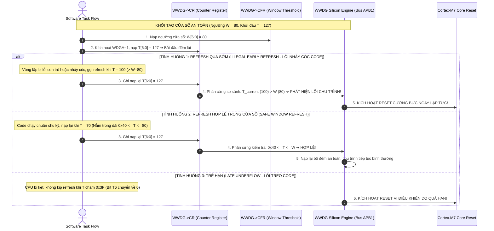
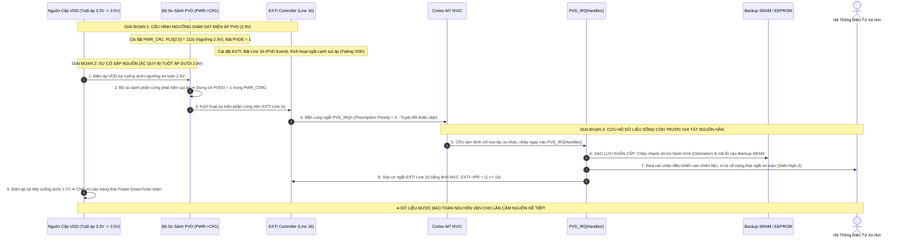

# 🏆 [NGÀY 6] CẨM NANG TOÀN DIỆN BARE-METAL: BẢO VỆ ĐỘ TIN CẬY HỆ THỐNG (IWDG, WWDG, CSS FAILOVER & PVD)
## Lộ trình 4 Bước: Nguyên Lý Phần Cứng ➔ Thực Chiến RM0385 ➔ Gõ Code Driver ➔ Phỏng Vấn Chuyên Sâu

> **Mục tiêu:** Làm chủ các khối phần cứng bảo vệ an toàn sống còn chuẩn công nghiệp ô tô trên STM32F746: Chó canh độc lập **IWDG (Independent Watchdog)** chạy xung nội LSI 32kHz chống treo vi điều khiển, chó canh cửa sổ **WWDG (Window Watchdog)** phát hiện lỗi sai lệch tiến trình thực thi phần mềm (Software Flow Violation), mạch bảo vệ mất xung nhịp **CSS (Clock Security System)** tự động chuyển mạch dự phòng sang HSI và phát ngắt bất khả kháng NMI, cùng bộ giám sát điện áp khả trình **PVD (Programmable Voltage Detector)** lưu trữ dữ liệu an toàn trước khi sập nguồn.  
> **Nguyên tắc kỹ thuật:** **Đi thẳng vào cơ chế phần cứng, thanh ghi, công thức toán học, bảng tra cứu và phân chia file rõ ràng — KHÔNG dùng ví dụ ẩn dụ ngoài lề dài dòng.**

---

```text
┌─────────────────────────────────────────────────────────────────────────────────────────────────┐
│                           LỘ TRÌNH 4 BƯỚC CHINH PHỤC NGÀY 6                                     │
├───────────────────┬───────────────────┬────────────────────────────┬────────────────────────────┤
│ BƯỚC 1: NGUYÊN LÝ │ BƯỚC 2: THỰC CHIẾN│ BƯỚC 3: GÕ CODE            │ BƯỚC 4: PHỎNG VẤN          │
│ • Cơ chế IWDG LSI │ • Tra cứu RM0385  │ • Gắn nhãn file cụ thể     │ • Bộ 5 câu hỏi vặn Watchdog│
│ • Công thức T_out │ • Bảng Base Addr  │ • TODO 1-2 [watchdog.h]    │   & CSS Failover           │
│ • Cửa sổ WWDG     │ • Bảng Thanh ghi  │ • TODO 3-5 [watchdog.c]    │ • Debugger Breakpoint Trap │
│ • CSS NMI Failover│ • Bảng Khóa Key   │ • TODO 6 [main.c]          │ • Early Refresh Violation  │
│ • Giám sát PVD    │ • Thanh ghi DBGMCU│ • Mổ xẻ 5 Bug phần cứng    │ • Kịch bản trả lời 60s     │
│ • Bắt tay phần    │                   │                            │                            │
│   cứng (Mermaid)  │                   │                            │                            │
└───────────────────┴───────────────────┴────────────────────────────┴────────────────────────────┘
```

---

## 🛠️ RÀ SOÁT 7 QUY TẮC BARE-METAL CỐT LÕI (CHUYÊN CHO NGÀY 6)

| STT | Quy tắc Bare-metal | Thể hiện cụ thể trong Ngày 6 (Reliability & Watchdog) |
| :---: | :--- | :--- |
| **1** | **Reset Value** | Tra cứu giá trị mặc định của `IWDG_SR` (`0x0000 0000`), `WWDG_CR` (`0x0000 007F`), `RCC_CR` (bit `CSSON = 0`), và `PWR_CR1` trước khi cấu hình. |
| **2** | **Access Type** | **CỰC KỲ QUAN TRỌNG:** Thanh ghi `IWDG_KR` chỉ ghi (`Write-only`), không thể đọc. Cờ `EWIF` (Early Wakeup Interrupt Flag trong `WWDG_SR`) là dạng `rc_w0` (Ghi `0` để xóa cờ). |
| **3** | **Multi-Bit Clear-Set** | Áp dụng quy tắc xóa trước - gán sau (`REG &= ~MASK; REG |= VALUE;`) cho các trường đa bit: `PR[2:0]` trong `IWDG_PR`, `W[6:0]` trong `WWDG_CFR`, và `PLS[2:0]` trong `PWR_CR1`. |
| **4** | **`volatile` Qualification** | Mọi struct ánh xạ thanh ghi IWDG, WWDG, DBGMCU và các cờ trạng thái chia sẻ trong ngắt NMI/PVD bắt buộc dùng `volatile`. |
| **5** | **Interrupt Workflow** | Quy trình ngắt bất khả kháng CSS NMI: Mất dao động HSE $\rightarrow$ Phần cứng dựng cờ `CSSF` trong `RCC_CIR` $\rightarrow$ Tự động nhảy vào `NMI_Handler` (Exception số 2, không thể bị vô hiệu hóa bởi `__disable_irq`) $\rightarrow$ Xóa cờ bằng `RCC->CIR |= RCC_CIR_CSSC`. |
| **6** | **RM / DS Lookup** | Cung cấp chính xác Chapter, Section, từ khóa `Ctrl + F`, công thức `Base Address + Offset` cho `IWDG` (RM0385 Chapter 25), `WWDG` (Chapter 26), `DBGMCU` (Chapter 38) và `PWR/PVD` (Chapter 6). |
| **7** | **Hardware Rationale & Specs** | Bố trí cơ sở kỹ thuật: tần số $f_{LSI} \approx 32\text{ kHz}$ (dao động $17\text{kHz} - 47\text{kHz}$ theo nhiệt độ), bảng công thức tính thời gian timeout IWDG và ngưỡng cửa sổ WWDG. |

---

# 🧠 BƯỚC 1: NGUYÊN LÝ PHẦN CỨNG & CƠ CHẾ VẬT LÝ (HARDWARE ARCHITECTURE)

## 1.1. Bản chất Phần cứng của IWDG (Independent Watchdog)

Khối **IWDG** là một mạch đếm lùi phần cứng 12-bit hoàn toàn độc lập với phần còn lại của chip:
* **Nguồn xung độc lập:** Được cấp xung riêng biệt bởi bộ dao động nội **LSI (Low-Speed Internal RC) $\approx 32\text{ kHz}$**. Xung LSI tiếp tục dao động kể cả khi thạch anh ngoài HSE bị hỏng, bộ nhân PLL mất khóa pha, hoặc CPU rơi vào các chế độ tiết kiệm điện sâu (Stop/Standby).
* **Cơ chế hoạt động:** Bộ đếm 12-bit đếm lùi từ giá trị nạp sẵn $\text{RLR}$ về $0$. Nếu trước khi chạm mức $0$, phần mềm không ghi mã **`0xAAAA`** vào thanh ghi khóa `IWDG_KR` (hành động "Feed Dog / Kick Watchdog"), mạch phần cứng sẽ **kéo chân Reset nội bộ xuống mức thấp $\implies$ Vi điều khiển bị Reset cưỡng bức ngay lập tức**!

```text
┌────────────────────────────────────────────────────────────────────────────────────────┐
│                                 MẠCH ĐỘC LẬP IWDG                                      │
│                                                                                        │
│   ┌────────────────────────┐      f_LSI (32 kHz)     ┌─────────────────────────────┐   │
│   │ Dao động nội RC LSI    │ ──────────────────────► │ Bộ chia Prescaler (/4../256)│   │
│   └────────────────────────┘                         └──────────────┬──────────────┘   │
│                                                                     │                  │
│                                           Xung đếm lùi              ▼                  │
│   ┌────────────────────────┐      Nạp lại RLR        ┌─────────────────────────────┐   │
│   │ CPU ghi Key: 0xAAAA    │ ──────────────────────► │ Bộ đếm lùi 12-bit Counter   │   │
│   └────────────────────────┘      (Đá chó định kỳ)   └──────────────┬──────────────┘   │
│                                                                     │                  │
│                                                                     ▼ (Chạm mốc 0)     │
│                                                      ┌─────────────────────────────┐   │
│                                                      │ PHÁT LỆNH RESET CỨNG HỆ THỐNG│   │
│                                                      │ (Dựng cờ IWDGRSTF ở RCC_CSR)│   │
│                                                      └─────────────────────────────┘   │
└────────────────────────────────────────────────────────────────────────────────────────┘
```

> 📖 **Hướng Dẫn Tra Cứu Nguyên Lý Trong Reference Manual (RM0385):**
> 1. **Mở file `RM0385.pdf`** ➔ Bấm `Ctrl + F` ➔ Gõ từ khóa: **`IWDG functional description`**
> 2. Nhảy đến **Chapter 25: Independent watchdog (IWDG) -> Section 25.3: IWDG functional description**:
>    * Quan sát **Figure 234. Independent watchdog block diagram**: Xem cách bộ chia tần số Prescaler nhận nguồn xung LSI độc lập (không qua bus APB) và cấp xung cho bộ đếm 12-bit đếm lùi.
>    * Đọc bảng **Table 123. Min/max IWDG timeout periods (at 32 kHz LSI)**: Xem các dải thời gian timeout tối thiểu và tối đa tùy theo hệ số chia Prescaler từ `/4` đến `/256`.

### Công thức Toán học Tính Thời Gian Timeout của IWDG:
Thời gian đếm lùi tối đa trước khi Reset hệ thống được tính theo công thức:
$$T_{timeout} = \frac{4 \times 2^{\text{PR[2:0]}} \times (\text{RLR} + 1)}{f_{LSI}}$$

Với tần số chuẩn $f_{LSI} = 32,000\text{ Hz}$, ta chọn bộ chia **$\text{Prescaler} = /64$** (mã `PR[2:0] = 010`b $\implies 4 \times 2^2 = 64$):
* Một chu kỳ đếm: $t_{tick} = \frac{64}{32,000} = 0.002\text{ s} = \mathbf{2\text{ ms}}$.
* Muốn thời gian Timeout an toàn là **$2.0\text{ giây}$**:
  $$\text{RLR} = \frac{T_{timeout}}{t_{tick}} - 1 = \frac{2000\text{ ms}}{2\text{ ms}} - 1 = \mathbf{999} \quad (\text{Mã Hex: } \texttt{0x3E7})$$

---

## 1.2. Bản chất Phần cứng của WWDG (Window Watchdog) & Lỗi "Refresh Quá Sớm"

Khác với IWDG chỉ quan tâm xem phần mềm có bị "chết đứng" hay không, **WWDG** được sinh ra để phát hiện lỗi **"chạy loạn chu trình" (Program Flow Error)**:
* **Nguồn xung:** Chạy bằng xung bus **APB1 ($f_{PCLK1} = 54\text{ MHz}$)** thông qua bộ chia nội.
* **Bộ đếm 7-bit (`T[6:0]`):** Đếm lùi từ một giá trị (ví dụ `0x7F` = 127) xuống `0x3F` (63).
* **Quy tắc Cửa Sổ 2 Đầu (Window Operation):**
  1. **Quá muộn (Underflow):** Nếu để bộ đếm tụt xuống dưới `0x40` (tức là bit `T6` chuyển từ $1 \rightarrow 0$) $\implies$ Reset CPU!
  2. **Quá sớm (Window Violation):** Nếu phần mềm nạp lại bộ đếm khi giá trị đếm **vẫn còn lớn hơn ngưỡng cửa sổ `W[6:0]`** $\implies$ Reset CPU ngay lập tức!

```text
 Giá trị Counter
      ▲
 0x7F │ ─── Khởi đầu
      │      ❌ VÙNG NGUY HIỂM 1: CẤM REFRESH! (Nếu refresh tại đây -> Reset CPU ngay!)
  W   │ ─── Ngưỡng Cửa Sổ (Window Value)
      │      ✅ VÙNG CHO PHÉP REFRESH AN TOÀN (Window Open)
 0x40 │ ─── Ngưỡng Cảnh Báo Cuối (Early Wakeup Interrupt - EWI)
      │      ❌ VÙNG NGUY HIỂM 2: TRỄ HẠN! (Counter tụt xuống 0x3F -> Reset CPU!)
 0x3F ┴────────────────────────────────────────────────────────────────────────► Thời gian
```

> 🎯 **Giá trị kỹ thuật ô tô:** Nếu code bị con trỏ hoang đâm loạn xạ hoặc vòng lặp bị nhảy cóc bước khiến lệnh refresh chó bị gọi liên tục không đúng chu kỳ $\implies$ WWDG sẽ phát hiện và khởi động lại vi điều khiển ngay.

> 📖 **Hướng Dẫn Tra Cứu Nguyên Lý Trong Reference Manual (RM0385):**
> 1. **Mở file `RM0385.pdf`** ➔ Bấm `Ctrl + F` ➔ Gõ từ khóa: **`WWDG functional description`**
> 2. Nhảy đến **Chapter 26: Window watchdog (WWDG) -> Section 26.3: WWDG functional description**:
>    * Quan sát **Figure 236. Watchdog block diagram**: Xem mạch so sánh giữa thanh ghi ngưỡng cửa sổ `W[6:0]` và bộ đếm tự do `T[6:0]`.
>    * Quan sát **Figure 237. Window watchdog timing diagram**: Phân biệt rõ vùng cấm nạp (Forbidden window / Too early) và vùng nạp hợp lệ (Valid window) để hiểu lý do tại sao nạp chó quá sớm lại gây Reset.

---

## 1.3. Cơ Chế Bảo Vệ Mất Xung Nhịp CSS (Clock Security System) & Ngắt NMI

Nếu xe đang chạy ở tốc độ 100 km/h mà thạch anh ngoài HSE 25MHz bị đứt chân do rung lắc cơ học:
1. Bộ nhân PLL sẽ mất nguồn xung đầu vào $\rightarrow$ Tần số dao động rơi tự do.
2. Nếu không có mạch bảo vệ, CPU sẽ chết đứng trong vòng vài micro-giây.
3. **Mạch phần cứng CSS (bật bằng bit `CSSON` trong `RCC_CR`):**
   * Liên tục so sánh chu kỳ của thạch anh ngoài HSE với dao động nội HSI 16MHz.
   * Ngay khi phát hiện HSE ngừng rung:
     * **Bước 1:** Phần cứng **tự động cắt kết nối HSE**, chuyển tức thì nguồn cấp SYSCLK sang dao động nội **HSI 16MHz**.
     * **Bước 2:** Phần cứng tự động tắt bit `PLLON` và phát tín hiệu ngắt **NMI (Non-Maskable Interrupt - Ngắt Bất Khả Kháng)**.
     * **Bước 3:** CPU nhảy ngay vào `NMI_Handler`, ghi nhận lỗi hỏng phần cứng vào Flash, chuyển trạng thái xe sang chế độ an toàn (Limp-Home Mode) và cảnh báo người lái!

> 📖 **Hướng Dẫn Tra Cứu Nguyên Lý Trong Reference Manual (RM0385) & Programming Manual (PM0253):**
> 1. **Mở file `RM0385.pdf`** ➔ Bấm `Ctrl + F` ➔ Gõ từ khóa: **`Clock security system (CSS)`**
>    * Nhảy đến **Chapter 5: Reset and clock control (RCC) -> Section 5.2.7: Clock security system (CSS)**:
>    * Đọc quy trình phản ứng phần cứng: Khi HSE lỗi, CSS tự ngắt kết nối HSE, đổi nguồn cấp sang HSI, và kích hoạt ngắt NMI lõi Cortex-M7.
> 2. **Mở file `PM0253.pdf`** ➔ Bấm `Ctrl + F` ➔ Gõ từ khóa: **`Configurable fault status register`**
>    * Nhảy đến **Chapter 4: Core peripherals -> Section 4.3.9 (`SCB->CFSR`)**: Tra cứu cách phân tích lỗi vi xử lý qua 3 thanh ghi con: `MMFSR` (Memory Management Fault), `BFSR` (BusFault), và `UFSR` (UsageFault).


---

## 1.4. Sơ Đồ Tuần Tự: Quy Trình Cấu Hình & Vận Hành Khối An Toàn (Configuration & Execution Pipeline)

Mô hình hóa toàn bộ chuỗi các bước cấu hình tuần tự các thanh ghi phần cứng (`IWDG`, `WWDG`, `CSS`) để kích hoạt các khối bảo vệ an toàn sống còn và cơ chế ứng phó sự cố:

---

### 📋 Sơ Đồ 1: Quy Trình Cấu Hình & Chu Kỳ "Đá Chó" IWDG (IWDG Configuration & Feed Dog Pipeline)

Khối IWDG chạy trên miền xung nhịp độc lập LSI 32kHz. Mọi thao tác cấu hình đều phải tuân thủ quy trình bắt tay giải mã và chờ đồng bộ miền xung:

```mermaid
sequenceDiagram
    autonumber
    actor App as Application Layer (watchdog.c / main.c)
    participant KR as IWDG->KR (Key Register)
    participant Config as IWDG->PR & RLR (Prescaler / Reload)
    participant SR as IWDG->SR (Update Status Reg)
    participant Silicon as IWDG Silicon Core (Miền LSI 32kHz)
    participant ResetLine as Microcontroller System Reset Line

    Note over App,SR: GIAI ĐOẠN 1: BẮT TAY MỞ KHÓA AN TOÀN (KEY UNLOCK HANDSHAKE)
    App->>KR: 1. Ghi mã khóa: IWDG->KR = 0x5555; (Cho phép ghi PR & RLR)
    App->>Config: 2. Nạp bộ chia Prescaler /64 vào PR và RLR = 999 (Timeout 2.0 giây)
    Config->>Silicon: 3. Đưa tín hiệu đồng bộ hóa từ APB1 bus sang miền xung LSI 32kHz
    Silicon->>SR: 4. Phần cứng bật cờ PVU = 1 và RVU = 1 (Đang cập nhật giá trị)
    App->>SR: 5. Polling lặp chờ đồng bộ hoàn tất: while (IWDG->SR & (IWDG_SR_PVU | IWDG_SR_RVU));
    Silicon->>SR: 6. Chốt giá trị vào miền LSI thành công ➔ Tự động xóa PVU = 0, RVU = 0

    Note over App,Silicon: GIAI ĐOẠN 2: BẮT TAY KÍCH HOẠT CHẠY TỰ ĐỘNG (START IWDG)
    App->>KR: 7. Ghi mã kích hoạt: IWDG->KR = 0xCCCC; (Bật IWDG - Không thể tắt bằng phần mềm!)
    Silicon->>Silicon: 8. Bộ đếm 12-bit bắt đầu đếm lùi liên tục từ 999 về 0 trên xung LSI

    Note over App,Silicon: GIAI ĐOẠN 3: BẮT TAY "ĐÁ CHÓ" ĐỊNH KỲ (NORMAL REFRESH HANDSHAKE)
    loop Chu kỳ giám sát định kỳ (Mỗi 500ms trong Main Loop)
        App->>KR: 9. Đá chó: Ghi IWDG->KR = 0xAAAA; (Reload Handshake)
        KR->>Silicon: 10. Phần cứng tức thì nạp lại giá trị 999 vào bộ đếm lùi (Reset Counter)
    end

    Note over App,ResetLine: GIAI ĐOẠN 4: XỬ LÝ LỖI TREO HỆ THỐNG (FAULT DETECTED & HARD RESET)
    Note over App: CPU bị kẹt cứng trong Deadlock hoặc HardFault > 2.0 giây!
    Silicon->>Silicon: 11. Bộ đếm không nhận được mã 0xAAAA ➔ Đếm lùi chạm mốc 0 (Underflow)
    Silicon->>ResetLine: 12. MẠCH PHẦN CỨNG KÉO CHÂN RESET NỘI BỘ XUỐNG LOW!
    ResetLine->>App: 13. Vi điều khiển bị Reset cưỡng bức, dựng cờ IWDGRSTF trong RCC_CSR!
```

---

### 📋 Sơ Đồ 2: Quy Trình Cấu Hình & Kiểm Soát Chu Trình Cửa Sổ WWDG (WWDG Configuration & Flow Control Pipeline)

Khác với IWDG, WWDG giám sát **chu trình thực thi phần mềm (Program Flow)**. Nếu phần mềm chạy sai hoặc bị nhảy cóc bước và làm tươi quá sớm (khi $T > W$), chip sẽ bị Reset ngay lập tức:



---

### 📋 Sơ Đồ 3: Quy Trình Kích Hoạt & Cơ Chế Ứng Cứu Mất Xung CSS (CSS Clock Failover & Emergency NMI Pipeline)

```mermaid
sequenceDiagram
    autonumber
    participant HSE as Thạch Anh Ngoài HSE (25MHz)
    participant Detector as Mạch Cảm Biến Xung CSS (Hardware Analog)
    participant MUX as Mạch Ghép Xung SYSCLK Multiplexer
    participant Core as Cortex-M7 Core (NMI Handler)
    participant Flash as Flash Memory (Emergency Log)
    actor App as Automotive Limp-Home Engine

    Note over HSE,Core: HỆ THỐNG ĐANG VẬN HÀNH BÌNH THƯỜNG Ở 216MHz (MAIN PLL TỪ HSE)
    HSE->>Detector: 1. Thạch anh ngoài liên tục phát xung dao động 25MHz

    Note over HSE,Detector: SỰ CỐ VẬT LÝ KHẨN CẤP: THẠCH ANH NGOÀI BỊ ĐỨT HOẶC HỎNG DAO ĐỘNG!
    HSE--xDetector: 2. Xung HSE đột ngột tắt ngấm (Mất tín hiệu xung nhịp)
    Detector->>Detector: 3. Mạch cảm biến CSS so pha phát hiện mất xung trong vài chu kỳ

    Note over Detector,MUX: BẮT TAY CHUYỂN MẠCH PHẦN CỨNG TỰ ĐỘNG (AUTONOMOUS FAILOVER)
    Detector->>MUX: 4. ÉP BUỘC CHUYỂN MẠCH TỨC THÌ: Cắt HSE, chọn ngay HSI (16MHz) làm SYSCLK!
    Detector->>Detector: 5. Tự động tắt bit PLLON (Ngắt bộ nhân PLL để bảo vệ mạch)
    Detector->>Detector: 6. Chốt cờ cảnh báo sự cố CSSF = 1 trong thanh ghi RCC_CIR

    Note over Detector,Core: BẮT TAY BẮN NGẮT BẤT KHẢ KHÁNG (NMI EXCEPTION HANDSHAKE)
    Detector->>Core: 7. Phát xung ngắt NMI (Exception Vector số 2 - KHÔNG THỂ BỊ MASK BỞI CODE)
    Core->>Core: 8. CPU lập tức dừng mọi task, nhảy thẳng vào NMI_Handler()

    Note over Core,App: CHIẾN LƯỢC SỐNG CÒN Ô TÔ (AUTOMOTIVE SAFE STATE)
    Core->>Flash: 9. Ghi mã sự cố hỏng phần cứng vào Flash/EEPROM để lưu vết hộp đen
    Core->>App: 10. Chuyển vi điều khiển sang chế độ bò an toàn (Limp-Home Mode)
    Core->>Detector: 11. BẮT TAY XÓA CỜ LỖI: Ghi RCC->CIR |= RCC_CIR_CSSC; (W1C Handshake)
    Note over HSE,App: ➔ BẮT TAY HOÀN TẤT: Xe không bị chết máy giữa cao tốc, bảo đảm an toàn tính mạng!
```

---

### 📋 Sơ Đồ 4: Quy Trình Giám Sát Sụt Áp Nguồn PVD & Sao Lưu Khẩn Cấp (PVD Emergency Power-Loss Pipeline)

Mô hình hóa chu trình bộ giám sát điện áp khả trình PVD phát hiện sớm hiện tượng sập nguồn ắc-quy (khi $V_{DD} < 2.9\text{V}$), kích hoạt ngắt ưu tiên tuyệt đối để sao lưu các tham số sống còn vào Backup SRAM trước khi toàn bộ vi điều khiển mất điện:



---

# 📑 BƯỚC 2: THỰC CHIẾN & TRA CỨU RM0385 / PM0253 (SETUP & LOOKUP)

> 🎯 **NGUYÊN TẮC TRA CỨU BARE-METAL CỐT LÕI (Kế thừa Day 00):**
> * **Ngoại vi giám sát (IWDG, WWDG, DBGMCU):** Mở file **`RM0385.pdf`** (Reference Manual).
> * **Bộ bẫy lỗi phần cứng (HardFault, CFSR, HFSR):** Mở file **`PM0253.pdf`** (Cortex-M7 Programming Manual). Mọi thanh ghi phân tích sự cố vi xử lý đều nằm ở PM0253!

---

## 2.1. Lộ trình Tra cứu Trực tiếp Từng Bước (Step-by-Step RM / PM Lookup)

### 📖 Bước 1: Tra cứu Bản đồ Địa chỉ Base Address (RM0385)
1. **Mở file `RM0385.pdf`** ➔ Bấm **`Ctrl + F`** ➔ Gõ từ khóa: **`Register boundary addresses`**
   * Nhảy đến **Chapter 2: Memory map -> Table 1**:
     * **`IWDG`**: Base Address **`0x4000 3000`** (Bus APB1, cấp xung từ nguồn LSI 32kHz độc lập).
     * **`WWDG`**: Base Address **`0x4000 2C00`** (Bus APB1, cấp xung từ PCLK1).
     * **`DBGMCU`**: Base Address **`0xE004 2000`** (Khối điều khiển gỡ lỗi lõi Core).

### 📖 Bước 2: Tra cứu Thanh ghi Independent Watchdog (RM0385)
1. **Mở file `RM0385.pdf`** ➔ Bấm **`Ctrl + F`** ➔ Gõ từ khóa: **`IWDG register map`**
   * Nhảy đến **Chapter 25: Independent watchdog (IWDG) -> Section 25.4: IWDG registers**:
     * **Section 25.4.1 (`IWDG_KR`)**: Nạp các mã khóa an toàn `0x5555` (mở khóa sửa PR/RLR), `0xAAAA` (Feed Dog), `0xCCCC` (kích hoạt chạy).
     * **Section 25.4.2 (`IWDG_PR`)**: Bộ chia tần số nguồn LSI từ /4 đến /256.
     * **Section 25.4.3 (`IWDG_RLR`)**: Giá trị nạp đếm lùi 12-bit (tối đa 4095).
     * **Section 25.4.4 (`IWDG_SR`)**: Polling cờ `PVU`, `RVU` về 0 trước khi cập nhật giá trị mới.

### 📖 Bước 3: Tra cứu Thanh ghi Window Watchdog (RM0385)
1. **Mở file `RM0385.pdf`** ➔ Bấm **`Ctrl + F`** ➔ Gõ từ khóa: **`WWDG register map`**
   * Nhảy đến **Chapter 26: Window watchdog (WWDG) -> Section 26.5: WWDG registers**:
     * **Section 26.5.1 (`WWDG_CR`)**: Bật cờ `WDGA` và nạp giá trị đếm 7-bit `T[6:0]`.
     * **Section 26.5.2 (`WWDG_CFR`)**: Giới hạn cửa sổ an toàn `W[6:0]` và bật ngắt cảnh báo sớm `EWI`.

### 📖 Bước 4: Tra cứu Đóng Băng Watchdog Khi Debug (RM0385)
1. **Mở file `RM0385.pdf`** ➔ Bấm **`Ctrl + F`** ➔ Gõ từ khóa: **`DBGMCU_APB1_FZ`**
   * Nhảy đến **Chapter 38: Debug support (DBGMCU) -> Section 38.16.2**:
     * Bit 12 (`DBG_IWDG_STOP`): Đóng băng IWDG khi dừng tại Breakpoint.
     * Bit 11 (`DBG_WWDG_STOP`): Đóng băng WWDG khi dừng tại Breakpoint.

### 📖 Bước 5: Tra cứu Thanh ghi Phân Tích Lỗi HardFault (PM0253)
1. **Mở file `PM0253.pdf`** ➔ Bấm **`Ctrl + F`** ➔ Gõ từ khóa: **`Configurable fault status register`**
   * Nhảy đến **Chapter 4: Core peripherals -> Section 4.3.9 (`SCB->CFSR`, Address: `0xE000 ED28`)**:
     * Tra cứu các bit cờ nguyên nhân: `DIVBYZERO` (Bit 25), `UNALIGNED` (Bit 24), `NOCP` (Bit 19), `UNDEFINSTR` (Bit 16), `BFARVALID` (Bit 15), `MMARVALID` (Bit 7).

---

## 2.2. Bản đồ Địa chỉ Base Address Ngoại vi Ngày 6

Tra cứu RM0385 *Chapter 2: Memory map -> Table 1*:

| Tên ngoại vi | Bus | Base Address | Offset | Địa chỉ tuyệt đối | Chức năng chính |
| :--- | :---: | :---: | :---: | :---: | :--- |
| **`IWDG`** | APB1 (LSI) | `0x4000 3000` | `0x0000` | `0x4000 3000` | Independent Watchdog (Độc lập nguồn LSI). |
| **`WWDG`** | APB1 (PCLK1) | `0x4000 2C00` | `0x0000` | `0x4000 2C00` | Window Watchdog (Giám sát cửa sổ APB1). |
| **`DBGMCU`** | System | `0xE004 2000` | `0x0008` | `0xE004 2008` | Đóng băng Watchdog khi Debug Breakpoint (`DBGMCU_APB1_FZ`). |
| **`SCB (CFSR)`** | System Bus | `0xE000 ED00` | `0x0028` | `0xE000 ED28` | Bẫy lỗi phần cứng (Configurable Fault Status Register). |

---

## 2.2. Bảng Tra cứu Thanh ghi `IWDG` & Mã Khóa An Toàn (`IWDG_KR`)

Tra cứu RM0385 *Chapter 25: Independent watchdog $\rightarrow$ Section 25.4: IWDG registers*:

| Thanh ghi | Offset | Reset Value | Bit / Trường | Access | Ý nghĩa Kỹ thuật Phần cứng |
| :--- | :---: | :---: | :---: | :---: | :--- |
| **`IWDG_KR`** | `0x00` | `0x0000 0000` | `KEY[15:0]` | `w` | **Thanh ghi Khóa An toàn:**<br>• Ghi `0x5555`: Cho phép sửa `PR` và `RLR`.<br>• Ghi `0xAAAA`: Nạp lại giá trị `RLR` vào bộ đếm (Kick Dog).<br>• Ghi `0xCCCC`: Kích hoạt khởi động IWDG (Không thể tắt). |
| **`IWDG_PR`** | `0x04` | `0x0000 0000` | `PR[2:0]` | `RW` | Bộ chia Prescaler: `000`b=/4, `001`b=/8, `010`b=/16, `011`b=/32, `100`b=/64, `101`b=/128, `110`b=/256. |
| **`IWDG_RLR`**| `0x08` | `0x0000 0FFF` | `RL[11:0]` | `RW` | Giá trị nạp lại ban đầu (12-bit, tối đa 4095). |
| **`IWDG_SR`** | `0x0C` | `0x0000 0000` | `PVU` (Bit 0) | `RO` | Prescaler Value Update: Đợi bit $= 0$ trước khi đổi PR. |
| | | | `RVU` (Bit 1) | `RO` | Reload Value Update: Đợi bit $= 0$ trước khi đổi RLR. |

---

## 2.3. Bảng Tra cứu Thanh ghi Đóng Băng Debugger (`DBGMCU_APB1_FZ`)

Khi dùng ST-Link đặt Breakpoint dừng CPU, xung nhịp LSI vẫn tiếp tục chạy khiến IWDG đếm lùi và dập Reset chip. Để gỡ lỗi bình thường, bắt buộc phải cấu hình thanh ghi **`DBGMCU_APB1_FZ`**:

| Thanh ghi | Địa chỉ | Bit | Tên Bit | Access | Mô tả cấu hình |
| :--- | :---: | :---: | :--- | :---: | :--- |
| **`DBGMCU_APB1_FZ`** | `0xE004 2008` | 12 | `DBG_IWDG_STOP` | `RW` | Ghi `1`: Đóng băng bộ đếm IWDG khi lõi CPU bị dừng bởi Debugger! |
| | | 11 | `DBG_WWDG_STOP` | `RW` | Ghi `1`: Đóng băng bộ đếm WWDG khi lõi CPU bị dừng bởi Debugger! |

---

# 💻 BƯỚC 3: GÕ CODE & MỔ XẺ BUG PHẦN CỨNG (CODING & DEBUGS)

## 3.1. Phân chia Cấu trúc File Dự án cho Ngày 6

```text
drivers/
├── inc/
│   └── watchdog.h     <-- Khai báo API IWDG, WWDG và CSS Failover
└── src/
    └── watchdog.c     <-- Triển khai driver an toàn, mở khóa Key & NMI Handler
src/
└── main.c             <-- Vòng lặp giám sát, Feed Dog định kỳ và Test Failover
```

---

### 📂 KHỐI 1: FILE HEADER AN TOÀN HỆ THỐNG [ `drivers/inc/watchdog.h` ]

#### 📖 Hướng Dẫn Tra Cứu Tài Liệu Cho TODO 1:
1. **Kiến trúc khối an toàn và giám sát:**
   - **Mở `RM0385.pdf`** ➔ `Ctrl + F` ➔ `Independent watchdog (IWDG)` (Chapter 25) & `Clock security system (CSS)` (Chapter 5 Section 5.2.7).
   - Tra cứu và thiết kế các nguyên mẫu API chuẩn công nghiệp: Cấu hình IWDG theo mili-giây (`IWDG_Config`), làm tươi bộ đếm (`IWDG_Refresh`), và kích hoạt mạch bảo vệ thạch anh ngoài (`System_CSS_Enable`).

#### TODO 1 [File: `drivers/inc/watchdog.h`]: Khai báo API Watchdog & Giám Sát Xung Nhịp
```c
#ifndef WATCHDOG_H
#define WATCHDOG_H

#include <stdint.h>

/**
 * @brief Khởi tạo Independent Watchdog (IWDG) với thời gian Timeout chỉ định
 * @param timeout_ms Thời gian hết hạn tính bằng mili-giây (Ví dụ: 2000 cho 2s)
 */
void IWDG_Config(uint32_t timeout_ms);

/**
 * @brief Nạp lại bộ đếm IWDG (Đá chó định kỳ - Feed Watchdog)
 */
void IWDG_Refresh(void);

/**
 * @brief Kích hoạt mạch giám sát an toàn xung nhịp Clock Security System (CSS)
 */
void System_CSS_Enable(void);

#endif /* WATCHDOG_H */
```

---

### 📂 KHỐI 2: FILE SOURCE DRIVER AN TOÀN [ `drivers/src/watchdog.c` ]

#### 📖 Hướng Dẫn Tra Cứu Tài Liệu Cho TODO 2:
1. **Đóng băng Watchdog khi Debugger Breakpoint:**
   - **Mở `RM0385.pdf`** ➔ `Ctrl + F` ➔ `DBGMCU_APB1_FZ` (Section 38.16.2):
     - Bit 12 `DBG_IWDG_STOP`: Đóng băng bộ đếm IWDG khi dừng tại Breakpoint.
     - Bit 11 `DBG_WWDG_STOP`: Đóng băng bộ đếm WWDG khi dừng tại Breakpoint.
2. **Khóa an toàn Key Register và mở quyền ghi:**
   - **Mở `RM0385.pdf`** ➔ `Ctrl + F` ➔ `IWDG key register (IWDG_KR)` (Section 25.4.1):
     - Ghi `0xCCCC`: Kích hoạt bộ đếm IWDG (Start).
     - Ghi `0x5555`: Mở khóa ghi thanh ghi Prescaler `IWDG_PR` và Reload `IWDG_RLR`.
     - Ghi `0xAAAA`: Nạp lại giá trị RLR vào bộ đếm lùi (Feed Dog).
3. **Đồng bộ miền xung LSI qua Status Register:**
   - **Mở `RM0385.pdf`** ➔ `Ctrl + F` ➔ `IWDG status register (IWDG_SR)` (Section 25.4.4):
     - Bit 0 `PVU` (Prescaler Value Update) & Bit 1 `RVU` (Reload Value Update).
     - Bắt buộc polling `while (IWDG->SR & (IWDG_SR_PVU | IWDG_SR_RVU));` trước khi nạp giá trị mới!
4. **Cài đặt bộ chia Prescaler và giá trị Reload:**
   - **Mở `RM0385.pdf`** ➔ `Ctrl + F` ➔ `IWDG_PR` (Section 25.4.2): `PR[2:0] = 100b` (Prescaler /64).
   - `Ctrl + F` ➔ `IWDG_RLR` (Section 25.4.3): `RL[11:0]` (12-bit reload value, max 4095).

#### TODO 2 [File: `drivers/src/watchdog.c`]: Khởi Tạo IWDG Chuẩn Xác Từng Bước
```c
#include "watchdog.h"
#include "Reg.h"

#define IWDG_KEY_RELOAD     0xAAAAU
#define IWDG_KEY_ENABLE     0xCCCCU
#define IWDG_KEY_WRITE_ACCESS 0x5555U

void IWDG_Config(uint32_t timeout_ms)
{
    /* BƯỚC 1: ĐÓNG BĂNG WATCHDOG KHI DEBUGGER BREAKPOINT (RẤT QUAN TRỌNG) */
    /* Tránh việc MCU bị reset liên tục khi lập trình viên đang dừng debug code */
    DBGMCU->APB1FZ |= (DBGMCU_APB1_FZ_DBG_IWDG_STOP | DBGMCU_APB1_FZ_DBG_WWDG_STOP);

    /* BƯỚC 2: Kích hoạt bộ đếm IWDG bằng Key 0xCCCC */
    IWDG->KR = IWDG_KEY_ENABLE;

    /* BƯỚC 3: Mở khóa quyền ghi vào thanh ghi PR và RLR bằng Key 0x5555 */
    IWDG->KR = IWDG_KEY_WRITE_ACCESS;

    /* BƯỚC 4: Chờ cờ PVU và RVU về 0 (Xác nhận mạch sẵn sàng nhận giá trị mới) */
    while (IWDG->SR & (IWDG_SR_PVU | IWDG_SR_RVU));

    /* BƯỚC 5: Thiết lập bộ chia Prescaler = /64 (Mã 010b = 0x4) */
    /* Với LSI ~ 32kHz: f_tick = 32000 / 64 = 500Hz -> Mỗi tick = 2ms */
    IWDG->PR = (0x4U << 0);

    /* BƯỚC 6: Tính toán và nạp giá trị RLR (Tối đa 4095) */
    uint32_t reload_val = (timeout_ms / 2U);
    if (reload_val > 4095U) {
        reload_val = 4095U;
    }
    IWDG->RLR = reload_val;

    /* BƯỚC 7: Nạp lại bộ đếm lần đầu và khóa quyền ghi */
    while (IWDG->SR & IWDG_SR_RVU);
    IWDG->KR = IWDG_KEY_RELOAD;
}

void IWDG_Refresh(void)
{
    /* Ghi trực tiếp mã 0xAAAA vào thanh ghi KR để nạp lại RLR */
    IWDG->KR = IWDG_KEY_RELOAD;
}
```

#### 📖 Hướng Dẫn Tra Cứu Tài Liệu Cho TODO 3:
1. **Kích hoạt mạch giám sát thạch anh ngoài CSS:**
   - **Mở `RM0385.pdf`** ➔ `Ctrl + F` ➔ `RCC clock control register (RCC_CR)` (Section 5.3.1): Bit 19 `CSSON` (Clock security system enable).
2. **Cờ ngắt CSS và xóa cờ ngắt trong thanh ghi CIR:**
   - **Mở `RM0385.pdf`** ➔ `Ctrl + F` ➔ `RCC clock interrupt register (RCC_CIR)` (Section 5.3.3):
     - Bit 7 `CSSF` (Clock security system interrupt flag - Read Only).
     - Bit 23 `CSSC` (Clock security system interrupt clear - W1C: Ghi 1 để xóa cờ).
3. **Ngắt bất khả kháng NMI (Non-Maskable Interrupt):**
   - **Mở `RM0385.pdf`** ➔ `Table 43. Vector table for STM32F7`: Exception số 2 (`NMI_Handler`).
   - Đây là ngắt phần cứng không thể bị vô hiệu hóa bởi bất kỳ lệnh phần mềm nào (kể cả `__disable_irq()`).

#### TODO 3 [File: `drivers/src/watchdog.c`]: Kích Hoạt CSS & Xử Lý Ngắt Bất Khả Kháng NMI
```c
void System_CSS_Enable(void)
{
    /* Bật tính năng Clock Security System trên thạch anh ngoài HSE */
    RCC->CR |= RCC_CR_CSSON;
}

/**
 * @brief Trình phục vụ ngắt bất khả kháng NMI (Non-Maskable Interrupt)
 *        Tự động nhảy vào đây khi mất thạch anh ngoài HSE!
 */
void NMI_Handler(void)
{
    /* Kiểm tra xem ngắt NMI có phải do Clock Security System kích hoạt không */
    if (RCC->CIR & RCC_CIR_CSSF) {
        /* 1. Xóa cờ ngắt CSS bằng cách ghi 1 vào bit CSSC (W1C) */
        RCC->CIR |= RCC_CIR_CSSC;

        /* 2. Lúc này phần cứng ĐÃ TỰ ĐỘNG CHUYỂN SYSCLK sang HSI 16MHz */
        
        /* 3. Thực hiện hành vi an toàn: Cắt tải, cảnh báo lỗi nguồn xung */
        /* Đèn LED nhấp nháy báo động sự cố hỏng thạch anh ngoài */
        while (1) {
            /* Hệ thống chạy ở chế độ dự phòng an toàn (Fail-Safe Mode) */
        }
    }
}
```

---

### 📂 KHỐI 3: TÍCH HỢP VÒNG LẶP HỆ THỐNG [ `src/main.c` ]

#### 📖 Hướng Dẫn Tra Cứu Tài Liệu Cho TODO 4:
1. **Kiểm tra cờ nguyên nhân Reset trước đó:**
   - **Mở `RM0385.pdf`** ➔ `Ctrl + F` ➔ `RCC clock control & status register (RCC_CSR)` (Section 5.3.23):
     - Bit 29 `IWDGRSTF`: Independent watchdog reset flag.
     - Bit 30 `WWDGRSTF`: Window watchdog reset flag.
     - Bit 24 `RMVF`: Remove reset flag (W1C).
2. **Quy tắc an toàn kích hoạt Watchdog:**
   - Watchdog chỉ được kích hoạt SAU KHI toàn bộ các ngoại vi khởi động xong (`CAN_Init`, `UART_DMA_Init`...) để tránh bị Watchdog reset sớm trong lúc nạp firmware hoặc cấu hình phần cứng nặng.

#### TODO 4 [File: `src/main.c`]: Vòng Lặp Chính Kick Dog Định Kỳ & Kiểm Tra Khởi Động
```c
#include "Sys_Clock.h"
#include "watchdog.h"
#include "can.h"
#include "uart_dma.h"

int main(void)
{
    /* 1. Khởi tạo xung nhịp hệ thống 216MHz */
    System_Clock_Init();

    /* 2. Bật mạch giám sát thạch anh ngoài CSS */
    System_CSS_Enable();

    /* 3. Kiểm tra Hộp đen Reset Reason (Từ Ngày 1) xem có phải do Watchdog cắn không */
    SystemResetReason_t reset_reason = System_GetResetReason();
    if (reset_reason == RESET_REASON_IWDG) {
        /* Lần boot trước bị treo code khiến Watchdog reset -> Ghi log cảnh báo! */
    }

    /* 4. Khởi tạo mạng CAN, UART và các ngoại vi */
    CAN_Init();
    UART_DMA_Init();

    /* 5. KÍCH HOẠT IWDG VỚI TIMEOUT 2.0 GIÂY (Sau khi các ngoại vi đã init xong) */
    IWDG_Config(2000);

    while (1) {
        /* Xử lý các tác vụ truyền thông thời gian thực */
        
        /* ĐÁ CHÓ ĐỊNH KỲ: Phải đảm bảo chu kỳ lặp < 2000ms */
        IWDG_Refresh();
    }
}
```

---

## 3.2. Mổ xẻ 5 Bug Phần Cứng "Kinh Điển" trong Ngày 6

```text
┌─────────────────────────────────────────────────────────────────────────────────────────────────┐
│                                 5 BẪY PHẦN CỨNG WATCHDOG & RELIABILITY                          │
├───────────────────┬───────────────────────────────────────────┬─────────────────────────────────┤
│ HIỆN TƯỢNG BUG    │ NGUYÊN NHÂN SÂU XA PHẦN CỨNG             │ GIẢI PHÁP SỬA CODE CHUẨN XÁC    │
├───────────────────┼───────────────────────────────────────────┼─────────────────────────────────┤
│ 1. Không đổi được │ Quên ghi Key `0x5555` vào `IWDG_KR` trước │ Phải nạp Key `0x5555` và chờ    │
│    Prescaler/RLR  │ hoặc không chờ cờ `PVU`/`RVU` về 0.       │ cờ `PVU=0`, `RVU=0` trong SR.   │
├───────────────────┼───────────────────────────────────────────┼─────────────────────────────────┤
│ 2. Cứ dừng debug  │ Khi Debugger đặt breakpoint, CPU dừng     │ Ghi `1` vào các bit tương ứng   │
│    là MCU bị reset│ nhưng LSI/IWDG vẫn đếm lùi đến hết giờ.   │ trong `DBGMCU->APB1FZ`.         │
├───────────────────┼───────────────────────────────────────────┼─────────────────────────────────┤
│ 3. WWDG reset ngay│ Lập trình viên gọi hàm refresh WWDG quá   │ Chỉ refresh khi Counter tụt     │
│    lập tức lúc nạp│ sớm, khi counter vẫn cao hơn ngưỡng cửa sổ│ xuống DƯỚI giá trị Window `W`.  │
├───────────────────┼───────────────────────────────────────────┼─────────────────────────────────┤
│ 4. MCU treo cứng  │ Bật IWDG TRƯỚC các hàm init ngoại vi nặng │ Chỉ bật IWDG ở CUỐI hàm main()  │
│    ngay khi boot  │ (như SDRAM init, xóa Flash) tốn > 2 giây. │ sau khi mọi thứ đã sẵn sàng.    │
├───────────────────┼───────────────────────────────────────────┼─────────────────────────────────┤
│ 5. Không bắt được │ Lầm tưởng CSS phát ngắt thông thường qua  │ CSS nối thẳng vào `NMI_Handler`.│
│    sự cố mất HSE  │ NVIC. Không thể chặn NMI bằng lệnh tắt ngắt│ Phải viết code cứu hộ trong NMI.│
└───────────────────┴───────────────────────────────────────────┴─────────────────────────────────┘
```

---

# 🎯 BƯỚC 4: BỘ CÂU HỎI PHỎNG VẤN & KỊCH BẢN TRẢ LỜI CHUYÊN SÂU

### ❓ Câu 1: Tại sao vi điều khiển STM32 lại có tới 2 bộ Watchdog (IWDG và WWDG)? Khi nào dùng cái nào?
* **Trả lời chuẩn Bare-metal:** 
  * **IWDG (Independent Watchdog):** Chạy bằng xung RC nội LSI 32kHz độc lập hoàn toàn. Dùng để làm **lá chắn an toàn cuối cùng** bắt lỗi CPU bị treo cứng (Deadlock, HardFault lặp vô tận, mất nguồn clock chính). Ưu tiên tính độc lập tuyệt đối, không cần độ chính xác micro-giây.
  * **WWDG (Window Watchdog):** Chạy bằng xung APB1 chính xác. Nó bắt buộc phần mềm phải refresh trong một **khoảng thời gian cửa sổ nghiêm ngặt** (không được quá muộn và KHÔNG ĐƯỢC QUÁ SỚM). Dùng để bắt lỗi **loạn luồng thực thi phần mềm** (Software Runaway / Memory Corruption nhảy cóc lệnh).

### ❓ Câu 2: Chuyện gì xảy ra nếu thạch anh ngoài HSE bị hỏng khi đang bật tính năng CSS (Clock Security System)?
* **Trả lời chuẩn Bare-metal:** 
  * Ngay khi mạch phần cứng phát hiện mất xung HSE, CSS sẽ thực hiện 3 hành động song song:
    1. Tự động chuyển đổi nguồn xung nhịp của hệ thống (SYSCLK) sang nguồn dao động nội **HSI 16MHz** để CPU không bị ngắt quãng lệnh.
    2. Vô hiệu hóa bộ nhân Main PLL (vì nguồn cấp cho PLL là HSE đã mất).
    3. Kích hoạt ngắt bất khả kháng **NMI (Non-Maskable Interrupt)**. Lõi CPU lập tức nhảy vào `NMI_Handler` để thực hiện quy trình hạ cánh an toàn (chuyển xe sang chế độ khẩn cấp, lưu trạng thái lỗi).

### ❓ Câu 3: Làm thế nào để phân biệt lần khởi động hiện tại là do Cắm nguồn (Power-on) hay do Watchdog dập Reset?
* **Trả lời chuẩn Bare-metal:**
  * Đọc thanh ghi kiểm soát trạng thái reset **`RCC->CSR`** ngay khi vừa boot:
    * Bit 27 `PORRSTF = 1`: Reset do cắm nguồn (Power-on Reset).
    * Bit 29 `IWDGRSTF = 1`: Reset do Independent Watchdog hết hạn.
    * Bit 30 `WWDGRSTF = 1`: Reset do Window Watchdog phát hiện vi phạm cửa sổ.
  * Sau khi đọc xong, bắt buộc phải ghi `1` vào bit **`RMVF` (Remove Reset Flag)** để xóa sạch cờ, sẵn sàng cho chu kỳ giám sát tiếp theo.

---

### 🎙️ KỊCH BẢN TRẢ LỜI PHỎNG VẤN 60 GIÂY (ELEVATOR PITCH)

> *"Trong các thiết bị Gateway ô tô đòi hỏi chuẩn tin cậy cao, em thiết lập cơ chế phòng thủ 3 tầng phần cứng trên STM32F746:  
> Tầng 1 là **Clock Security System (CSS)** giám sát thạch anh ngoài HSE 25MHz; nếu mất dao động cơ học, phần cứng tự động ép xung sang HSI 16MHz dự phòng và phát ngắt bất khả kháng NMI để cứu dữ liệu.  
> Tầng 2 là **IWDG chạy xung nội LSI 32kHz** với chu kỳ timeout 2.0 giây, đóng vai trò chốt chặn cuối cùng nếu firmware bị kẹt vòng lặp hoặc sập lõi. Em cấu hình thanh ghi `DBGMCU_APB1_FZ` để đóng băng bộ đếm IWDG khi debugger đặt breakpoint, tránh lỗi tự reset khi gỡ lỗi.  
> Tầng 3 là việc đọc và giải mã thanh ghi **`RCC->CSR`** lúc bootup để lưu vết nguyên nhân Reset vào bộ nhớ lỗi, giúp đội ngũ kỹ thuật phân biệt chính xác giữa sự cố sụt áp nguồn hay lỗi treo Watchdog."*
