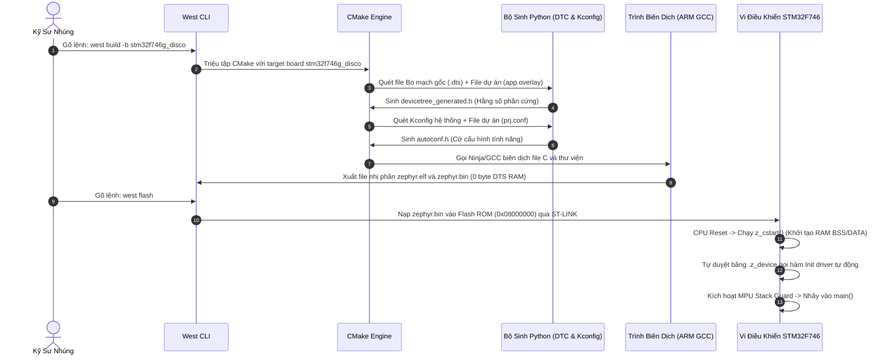
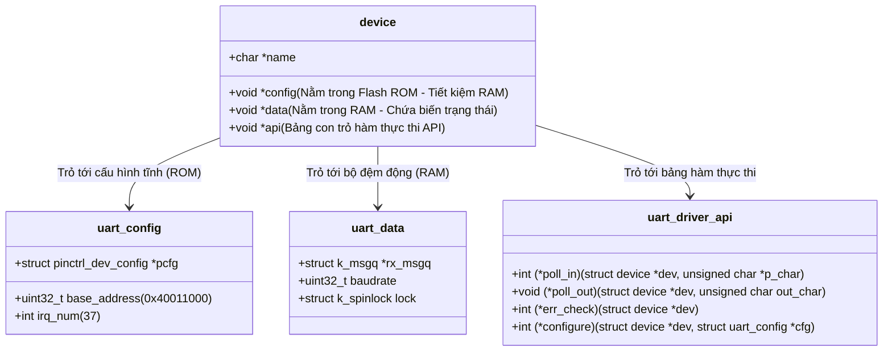
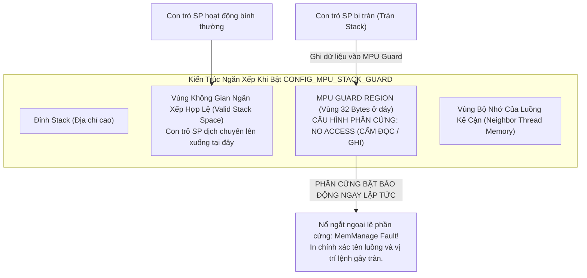

# 🏆 [NGÀY 7] LÀM CHỦ HỆ ĐIỀU HÀNH ZEPHYR RTOS: BỘ TỨ KIẾN TRÚC (WEST, CMAKE, KCONFIG, DEVICETREE) & CƠ CHẾ NỘI TẠI KERNEL

## Chuyên khảo Kỹ thuật: Toàn Bộ Lý Thuyết Build System, Driver Model Đa Hình, Scheduler & MPU Stack Guard (Gom Trọn 1 Nơi)

> [!IMPORTANT]
> **MỤC TIÊU CỐT LÕI NGÀY 7 DÀNH CHO KỸ SƯ EMBEDDED / AUTOMOTIVE:**
> 1. **Toàn Bộ Lý Thuyết Tập Trung (Single Source of Truth):** Không phân mảnh lý thuyết ở nhiều nơi. Nắm trọn vẹn bản chất 4 trụ cột công cụ Zephyr: **West (Meta-tool) ➔ CMake (Orchestrator) ➔ Kconfig (Software config) ➔ DeviceTree (Hardware layout)** và cách chúng bắt tay nhau lúc build.
> 2. **Cơ Chế Nội Tại Của Kernel (Under the Hood):** Hiểu rõ Driver Model đa hình trong C (`DEVICE_DT_DEFINE`), Bộ điều phối Scheduler (Preemptive vs Cooperative, Tickless Idle), và khiên bảo vệ phần cứng MPU Stack Guard.
> 3. **Bộ File Mẫu Hoàn Chỉnh (Có Đầu Có Đuôi):** Cung cấp trọn vẹn `CMakeLists.txt`, `prj.conf`, `app.overlay`, `src/main.c` và cẩm nang lệnh West CLI — không cắt vụn code.
> 4. **Tư Duy Trả Lời Phỏng Vấn Tuyển Dụng:** Tự tin giải thích sự khác biệt giữa Zephyr vs FreeRTOS vs Bare-metal, cơ chế Constant Folding của Devicetree và lý do Zephyr trở thành tiêu chuẩn mới của Automotive Embedded.

---

```text
┌─────────────────────────────────────────────────────────────────────────────────────────────────┐
│                    BẢN ĐỒ KIẾN TRÚC VẬN HÀNH TOÀN DIỆN CỦA ZEPHYR RTOS                          │
├─────────────────────────────────────────────────────────────────────────────────────────────────┤
│                                 TẦNG ỨNG DỤNG (APPLICATION LOGIC)                               │
│           • Thread CAN Worker            • Thread GUI/LVGL           • Thread Monitor           │
├─────────────────────────────────────────────────────────────────────────────────────────────────┤
│                              HỆ THỐNG GIAO TIẾP LIÊN LUỒNG (IPC)                                │
│       • k_msgq (Copy Buffer)      • k_sem (Đồng bộ)      • k_mutex (Priority Inheritance)       │
├─────────────────────────────────────────────────────────────────────────────────────────────────┤
│                               ZEPHYR KERNEL SCHEDULER ENGINE                                    │
│   • Cooperative (-Prio: Chạy độc quyền)  │  • Preemptive (+Prio: Chiếm quyền theo mức ưu tiên)  │
│   • MPU Stack Guard (32B No-Access Zone) │  • Tickless Idle (Ngủ sâu tiết kiệm điện tối đa)    │
├─────────────────────────────────────────────────────────────────────────────────────────────────┤
│                             ZEPHYR DRIVER MODEL (ĐA HÌNH TRONG C)                               │
│     DEVICE_DT_DEFINE: [ struct device -> .config (ROM) | .data (RAM) | .api (Function Ptrs) ]    │
├─────────────────────────────────────────────────────────────────────────────────────────────────┤
│                                 PHẦN CỨNG VI ĐIỀU KHIỂN (STM32F746)                             │
│       ARM Cortex-M7 Core  │  RCC Clock Tree  │  NVIC Ngắt  │  MPU Bảo Vệ Bộ Nhớ  │  Ngoại Vi    │
└─────────────────────────────────────────────────────────────────────────────────────────────────┘
```

---

# PHẦN 1: TƯ DUY KIẾN TRÚC — TẠI SAO PHẢI LÀ ZEPHYR RTOS?

Để làm chủ Zephyr, bạn phải hiểu rõ sự tiến hóa tư duy giữa 3 thời kỳ của lập trình vi điều khiển:

### 1.1. Bảng So Sánh Bản Chất Kỹ Thuật: Bare-Metal vs FreeRTOS vs Zephyr RTOS

| Tiêu Chí Kỹ Thuật | 1. Bare-Metal (Ngày 0-6) | 2. FreeRTOS (ST HAL/CubeMX) | 3. Zephyr RTOS (Ngày 7-10) |
| :--- | :--- | :--- | :--- |
| **Mô hình kiến trúc** | Super-loop `while(1)` + ISR | Microkernel điều phối Task | Comprehensive RTOS Ecosystem (như Linux thu nhỏ) |
| **Mô tả phần cứng** | Gõ trực tiếp thanh ghi: `GPIOx->MODER` | ST CubeMX sinh code C cứng (`MX_GPIO_Init`) | **Devicetree (`.dts`/`.overlay`)** chuẩn Open Firmware |
| **Cấu hình phần mềm** | Tự viết cờ `#define` phân tán | Sửa file `#define` trong `FreeRTOSConfig.h` | **Kconfig (`prj.conf`)** chuẩn Linux Kernel |
| **Khởi tạo Driver** | Tự viết hàm `MyDriver_Init()` rồi gọi tay | Gọi hàm `HAL_PPP_Init()` của CubeMX | **Tự động đăng ký boot** qua `DEVICE_DT_DEFINE` |
| **Tạo luồng tác vụ** | Không có (1 luồng duy nhất) | Động qua `xTaskCreate()` (cấp phát Heap) | Tĩnh qua **`K_THREAD_DEFINE`** (0% phân mảnh RAM) |
| **Bảo vệ Stack** | Không có (Tràn stack gây sập chip ngầm) | Kiểm tra phần mềm Canary `0xA5` (thụ động) | **Phần cứng MPU Guard** (bắt lỗi ngay tức thì) |
| **Tính đa nền tảng** | 0% (Đổi chip phải viết lại từ đầu) | 30% (Chỉ đa nền tảng phần RTOS, driver vẫn theo hãng) | **100% (Giữ nguyên code C, chỉ thay file Overlay)** |

---

### 1.2. Tư Duy "Separation of Concerns" (Tách Biệt Phần Cứng Khỏi Phần Mềm)

* **Tư duy cũ (Bare-metal / FreeRTOS HAL):** Mã nguồn C bị "dính chặt" vào mã định danh của chip. Nếu bạn viết `HAL_GPIO_WritePin(GPIOI, GPIO_PIN_1, GPIO_PIN_SET);`, code C của bạn đã bị trói chặt vào chân `PI1` của STM32F7. Nếu ngày mai sếp yêu cầu chuyển sản phẩm sang chip NXP i.MX RT1060 hoặc Nordic nRF5340, bạn phải đi rà soát và sửa lại toàn bộ hàng nghìn dòng code C.
* **Tư duy Zephyr RTOS:** Mã nguồn C **hoàn toàn không biết phần cứng bên dưới là gì**. 
  * File C chỉ gọi: `gpio_pin_toggle_dt(&led_spec);` (Một hàm API trừu tượng).
  * Chân đó là chân nào, thuộc port nào, tích cực mức cao hay thấp được giao trọn gói cho file **`app.overlay`**.
  * Muốn đổi sang chip khác? Giữ nguyên 100% file `.c`, chỉ cần viết lại file `.overlay` tương ứng với bo mạch mới!

---

# PHẦN 2: TOÀN BỘ CƠ SỞ LÝ THUYẾT & KIẾN TRÚC BUILD SYSTEM (GOM TRỌN 1 NƠI DUY NHẤT)

> [!NOTE]
> Mọi lý thuyết về quy trình Build, công cụ điều phối, cấu hình tính năng, mô tả phần cứng và cơ chế Kernel của Zephyr được tập trung toàn bộ tại đây để người học nắm bắt mạch lạc một chuỗi khép kín.

---

### 2.1. Trụ Cột 1: West — Meta-Tool & Quản Lý Dự Án Đa Kho (Multi-Repo)

#### West là gì và tại sao không dùng Git đơn thuần?
Zephyr không phải là một thư viện C đơn lẻ. Hệ sinh thái Zephyr bao gồm:
* Kernel Zephyr chính (`zephyrproject/zephyr`).
* Thư viện HAL của các hãng bán dẫn: `hal_stm32`, `hal_nxp`, `hal_nordic`.
* Ngăn xếp giao thức bên thứ ba: MbedTLS, LittleFS, LVGL, TinyUSB, CMSIS.

Nếu dùng `git clone` truyền thống, bạn sẽ phải clone hàng chục submodule cực kỳ nặng nề và dễ xung đột phiên bản. **West được sinh ra như một công cụ mẹ (Meta-Tool viết bằng Python)** với 2 chức năng sống còn:
1. **Quản trị đa kho (Repository Management):** Đọc file cấu hình `west.yml` để tự động kéo hàng chục repo vệ tinh đúng phiên bản cam kết (`west init`, `west update`).
2. **Bộ điều khiển lệnh mở rộng (Command Runner):** Đóng vai trò là CLI giao tiếp duy nhất cho kỹ sư. Khi bạn gõ `west build` hoặc `west flash`, West sẽ tự động tìm kiếm đường dẫn toolchain GCC, xác định target board, gọi CMake, gọi Ninja và gọi trình nạp (ST-Link / J-Link / OpenOCD) mà bạn không cần phải gõ các lệnh terminal dài dòng phức tạp.

---

### 2.2. Trụ Cột 2: CMake — Trình Điều Phối Biên Dịch (Build Orchestrator)

#### Vai trò của CMake trong Zephyr:
CMake không phải là trình biên dịch, nó là **nhạc trưởng điều phối (Build System Generator)**. Trong một dự án Zephyr:
1. File `CMakeLists.txt` tối thiểu của ứng dụng chỉ có 4 dòng, trong đó dòng quan trọng nhất là:
   ```cmake
   find_package(Zephyr REQUIRED HINTS $ENV{ZEPHYR_BASE})
   ```
2. Lệnh này kích hoạt toàn bộ hệ thống CMake khổng lồ của Zephyr:
   * Nhận diện bo mạch mục tiêu (ví dụ: `-b stm32f746g_disco`).
   * Quét và triệu tập các script Python để xử lý Kconfig và Devicetree.
   * Tạo ra file mô tả build siêu tốc **`build.ninja`**.
   * Điều khiển trình biên dịch `arm-none-eabi-gcc` biên dịch mã nguồn C và thư viện thành file thực thi ELF/BIN.

---

### 2.3. Trụ Cột 3: Kconfig (`prj.conf`) — Cấu Hình Tính Năng & Ngăn Xếp Phần Mềm

#### Cơ chế hoạt động của Kconfig:
Kconfig kế thừa tiêu chuẩn cấu hình từ Linux Kernel, giải quyết bài toán: **Bật/Tắt tính năng ở mức compile-time để tối ưu dung lượng Flash/RAM**.
1. Kỹ sư khai báo các cờ cấu hình trong file **`prj.conf`**:
   * `CONFIG_CAN=y`: Bật ngăn xếp driver CAN.
   * `CONFIG_LV_Z_MEM_POOL_SIZE=16384`: Cấp 16 KB RAM cho bộ nhớ đồ họa LVGL.
   * `CONFIG_MPU_STACK_GUARD=y`: Kích hoạt khiên phần cứng chống tràn stack.
2. Lúc biên dịch, hệ thống Kconfig đọc file `prj.conf`, kiểm tra tính phụ thuộc (nếu bật CAN mà chưa bật GPIO thì báo lỗi), sau đó sinh ra file header:
   `build/zephyr/include/generated/zephyr/autoconf.h`.
3. Trong toàn bộ mã nguồn Zephyr, các đoạn code không dùng sẽ bị loại bỏ hoàn toàn bằng `#ifdef CONFIG_...`, đảm bảo **Flash vi điều khiển không chứa 1 byte mã rác nào**.

---

### 2.4. Trụ Cột 4: Devicetree (`.dts` & `app.overlay`) — Bản Đồ Mô Tả Phần Cứng Tĩnh

Khác với Linux nhúng (phải biên dịch DTS ra file nhị phân `.dtb`, nạp vào RAM rồi Kernel chạy vòng lặp duyệt cây lúc boot làm tốn hàng chục KB RAM), **Zephyr RTOS hoạt động trên vi điều khiển có RAM cực kỳ hạn chế (vài chục đến vài trăm KB)**. Do đó:

#### Bản chất kỹ thuật (0 Byte RAM Overhead via Constant Folding):
1. Khi bạn mô tả chân cẳng hoặc địa chỉ ngoại vi trong file DTS/Overlay:
   ```dts
   &usart1 {
       status = "okay";
       current-speed = <115200>;
   };
   ```
2. Bộ phân tích Python (`gen_defines.py`) đọc cây phần cứng, đối chiếu với file Schema Validation (`.yaml`), rồi chuyển đổi thành các macro C tĩnh trong file sinh tự động `build/zephyr/include/generated/zephyr/devicetree_generated.h`:
   ```c
   /* Mã macro được Zephyr sinh tự động lúc build */
   #define DT_N_S_soc_S_serial_40011000_REG_BASE  0x40011000
   #define DT_N_S_soc_S_serial_40011000_CURRENT_SPEED 115200
   ```
3. Trong mã nguồn C, khi gọi `DEVICE_DT_GET(...)` hoặc `DT_PROP(...)`, trình biên dịch GCC nhìn thấy các macro này là **hằng số tức thời (immediate constant)**. Trình biên dịch thực hiện kỹ thuật **Constant Folding** nhúng thẳng số `0x40011000` vào lệnh Assembly của ARM Cortex-M7.
4. **Kết quả:** Không tốn bất kỳ một byte RAM nào để lưu cấu trúc cây lúc runtime!

---

### 2.5. Sơ Đồ Tuần Tự Toàn Cảnh: Chuỗi Biên Dịch & Khởi Động (Build & Boot Pipeline)

Sơ đồ tuần tự dưới đây mô tả chính xác cách **West, CMake, Kconfig, Devicetree** phối hợp để tạo ra file chạy và đưa chip STM32F7 thức dậy:



---

### 2.6. Cơ Chế Kernel 1: Mô Hình Driver Đa Hình trong C (Zephyr Driver Model)

Làm thế nào Zephyr có thể cung cấp hàm `gpio_pin_toggle_dt()` hoặc `uart_poll_out()` dùng chung cho mọi hãng chip mà không làm giảm tốc độ thực thi? Nó sử dụng kỹ thuật **Đa hình hướng đối tượng trong C (Polymorphism via Struct Function Pointers)**.

Mỗi driver ngoại vi trong Zephyr được cấu thành từ 3 cấu trúc dữ liệu kinh điển:



#### Quy trình đăng ký & khởi tạo driver tự động lúc boot:
1. Driver ngoại vi sử dụng macro `DEVICE_DT_DEFINE` để khai báo:
   ```c
   DEVICE_DT_DEFINE(node_id, init_fn, pm_action_cb, data_ptr, cfg_ptr, level, prio, api_ptr);
   ```
2. Macro này đặt một cấu trúc `struct device` vào một phân vùng linker đặc biệt (Linker Section `.z_device`).
3. Khi chip vừa boot (trước khi hàm `main()` chạy), hàm `z_cstart()` của nhân Zephyr duyệt qua mảng `.z_device` này và tự động gọi hàm khởi tạo `init_fn()` của từng driver theo đúng thứ tự ưu tiên:
   * `EARLY`: Cấp nguồn, cấu hình xung nhịp gốc.
   * `PRE_KERNEL_1` / `PRE_KERNEL_2`: Khởi tạo thanh ghi ngoại vi cơ bản, chưa dùng RTOS IPC.
   * `POST_KERNEL`: Khởi tạo các driver cần dịch vụ OS (như Mutex, Semaphore, DMA Buffer).
   * `APPLICATION`: Khởi tạo tầng logic người dùng.
4. **Kết quả:** Lập trình viên ứng dụng **không bao giờ phải gọi hàm init ngoại vi bằng tay trong `main()`**!

---

### 2.7. Cơ Chế Kernel 2: Bộ Điều Phối Đa Luồng (Scheduler Mechanics)

Zephyr hỗ trợ một cơ chế lập lịch đa tầng cực kỳ độc đáo và an toàn:

```text
┌─────────────────────────────────────────────────────────────────────────────────────────────────┐
│                           MÔ HÌNH PHÂN CẤP ƯU TIÊN SCHEDULER ZEPHYR                             │
├─────────────────────────────────────────────────────────────────────────────────────────────────┤
│ [Mức cao nhất] NGẮT PHẦN CỨNG (Hardware Interrupts - ISR) : Ưu tiên cao hơn mọi Thread         │
├─────────────────────────────────────────────────────────────────────────────────────────────────┤
│ [Mức nhì]      META-IRQ THREADS : Luồng đặc biệt chen ngang được cả Cooperative Threads          │
├─────────────────────────────────────────────────────────────────────────────────────────────────┤
│ [Mức ba]       COOPERATIVE THREADS (Priority âm: -CONFIG_NUM_COOP_PRIO đến -1)                  │
│                • Chạy ĐỘC QUYỀN, KHÔNG BAO GIỜ bị Preemptive Threads chiếm quyền.               │
│                • Chỉ nhường CPU khi chính nó tự gọi: k_yield(), k_sleep(), hoặc chờ IPC.        │
├─────────────────────────────────────────────────────────────────────────────────────────────────┤
│ [Mức bốn]      PREEMPTIVE THREADS (Priority dương: 0 đến CONFIG_NUM_PREEMPT_PRIO - 1)           │
│                • Lập lịch theo độ ưu tiên (Priority-based Preemption: Số nhỏ ưu tiên cao).      │
│                • Hỗ trợ chia sẻ thời gian (Round-Robin Time Slicing) giữa các luồng cùng Prio.   │
├─────────────────────────────────────────────────────────────────────────────────────────────────┤
│ [Mức đáy]      IDLE THREAD (Mức ưu tiên thấp nhất) : Chạy Tickless Idle đưa CPU vào chế độ ngủ  │
└─────────────────────────────────────────────────────────────────────────────────────────────────┘
```

#### Bản chất của Cơ chế Tickless Idle:
* Các RTOS truyền thống (như FreeRTOS cơ bản) yêu cầu một bộ đếm SysTick ngắt liên tục mỗi 1ms (1000 Hz). Dù không có việc gì làm, CPU vẫn bị đánh thức dậy 1000 lần/giây, gây lãng phí năng lượng khủng khiếp.
* **Zephyr Tickless Kernel:** Khi tất cả các luồng đều đang ngủ (chờ sự kiện hoặc chờ delay), Kernel tính toán chính xác luồng kế tiếp cần thức dậy sau bao nhiêu micro-giây. Nó lập trình một bộ đếm phần cứng (Hardware Timer) thức dậy đúng thời điểm đó, rồi đưa CPU vào giấc ngủ sâu (Deep Sleep). **Tiết kiệm điện năng tối đa cho thiết bị IoT / Smartwatch / Automotive ECU.**

---

### 2.8. Cơ Chế Kernel 3: Bảo Vệ Ngăn Xếp Bằng Phần Cứng (`CONFIG_MPU_STACK_GUARD`)

Tràn ngăn xếp (Stack Overflow) là "kẻ giết người thầm lặng" số 1 trong hệ thống nhúng: Khi một hàm gọi đệ quy hoặc khai báo mảng cục bộ quá lớn, con trỏ ngăn xếp `SP` sẽ đè bẹp lên vùng nhớ của biến toàn cục hoặc làm hỏng ngăn xếp của luồng kế bên, gây ra lỗi sập chip bí ẩn vài ngày mới xuất hiện một lần.



#### So sánh với cơ chế Stack Canary của FreeRTOS:
* **FreeRTOS (Software Canary):** Ghi giá trị mẫu `0xA5A5A5A5` ở đáy stack. Khi chuyển đổi ngữ cảnh (Context Switch), phần mềm kiểm tra xem giá trị này còn nguyên không.
  * *Nhược điểm:* **Phát hiện quá trễ!** Tại thời điểm kiểm tra, dữ liệu của luồng bên cạnh đã bị phá hỏng từ lâu.
* **Zephyr (`CONFIG_MPU_STACK_GUARD`):** Lập trình khối MPU phần cứng của ARM Cortex-M7.
  * *Ưu điểm tuyệt đối:* **Bắt quả tang tại trận!** Ngay tại chu kỳ xung nhịp mà lệnh ghi đè chạm vào ranh giới 32 bytes của Guard Region, khối MPU phần cứng phát hiện vi phạm bus và đóng băng hệ thống ngay tức khắc.

---

# PHẦN 3: BỘ MÃ NGUỒN MẪU HOÀN CHỈNH NGUYÊN KHỐI (PRACTICAL COMPLETE MODULE)

> [!TIP]
> Dưới đây là bộ mã nguồn chuẩn mực gồm **4 file dự án hoàn chỉnh** và **cẩm nang lệnh West** để biên dịch một ứng dụng Zephyr chuẩn trên STM32F746G-Discovery.

---

### 📂 KHỐI 1: FILE ĐIỀU PHỐI BIÊN DỊCH CMAKE [ `CMakeLists.txt` ]

```cmake
# ==============================================================================
# File: CMakeLists.txt
# Mục đích: File điều phối biên dịch cho dự án Zephyr RTOS
# ==============================================================================

# 1. Khai báo phiên bản CMake tối thiểu được hỗ trợ
cmake_minimum_required(VERSION 3.20.0)

# 2. Tìm kiếm và nạp gói Zephyr RTOS từ biến môi trường ZEPHYR_BASE
#    (Lệnh này kích hoạt toàn bộ công cụ sinh macro Kconfig và Devicetree)
find_package(Zephyr REQUIRED HINTS $ENV{ZEPHYR_BASE})

# 3. Đặt tên định danh cho dự án ứng dụng của bạn
project(zephyr_f746_bringup)

# 4. Đăng ký các file mã nguồn C của ứng dụng vào danh sách biên dịch target
target_sources(app PRIVATE src/main.c)
```

---

### 📂 KHỐI 2: FILE CẤU HÌNH TÍNH NĂNG KCONFIG [ `prj.conf` ]

```ini
# ==============================================================================
# File: prj.conf
# Mục đích: Cấu hình tĩnh các tính năng và ngăn xếp RTOS lúc compile-time
# ==============================================================================

# 1. Bật hệ thống GPIO và UART Console
CONFIG_GPIO=y
CONFIG_SERIAL=y
CONFIG_CONSOLE=y
CONFIG_UART_CONSOLE=y

# 2. Bật hệ thống ghi log bất đồng bộ (Deferred Logging)
#    (Log được đẩy vào Ring Buffer ở ISR/Thread, in ra UART ở luồng nhàn rỗi)
CONFIG_LOG=y
CONFIG_LOG_MODE_DEFERRED=y
CONFIG_LOG_DEFAULT_LEVEL=3

# 3. Kích hoạt khiên bảo vệ tràn ngăn xếp bằng phần cứng MPU Cortex-M7
CONFIG_ARM_MPU=y
CONFIG_HW_STACK_PROTECTION=y
CONFIG_MPU_STACK_GUARD=y

# 4. Bật công cụ chẩn đoán bộ nhớ và hiệu năng luồng lúc runtime
CONFIG_THREAD_ANALYZER=y
CONFIG_THREAD_ANALYZER_USE_LOG=y
CONFIG_THREAD_ANALYZER_AUTO=y
CONFIG_THREAD_ANALYZER_AUTO_INTERVAL=10
CONFIG_THREAD_NAME=y
```

---

### 📂 KHỐI 3: FILE MÔ TẢ PHẦN CỨNG DEVICETREE [ `app.overlay` ]

```dts
/* ==============================================================================
 * File: app.overlay
 * Mục đích: Ghi đè cấu hình phần cứng cho bo mạch STM32F746G-Discovery
 *           Định nghĩa đèn LED người dùng (User LED1 - Chân PI1)
 * ============================================================================== */

/ {
    aliases {
        /* Tạo bí danh định danh chuẩn cho ứng dụng C truy cập */
        led0 = &user_led_1;
    };

    leds {
        compatible = "gpio-leds";
        user_led_1: led_1 {
            /* Chân PI1, Tích cực mức CAO (GPIO_ACTIVE_HIGH) */
            gpios = <&gpioi 1 GPIO_ACTIVE_HIGH>;
            label = "User Green LED";
        };
    };
};

/* Đảm bảo Port I được cấp xung nhịp và kích hoạt */
&gpioi {
    status = "okay";
};
```

---

### 📂 KHỐI 4: MÃ NGUỒN C ỨNG DỤNG [ `src/main.c` ]

```c
/**
 * ==============================================================================
 * File: src/main.c
 * Mục đích: Ứng dụng Zephyr RTOS đa luồng hoàn chỉnh trên STM32F746
 *           Minh họa Devicetree Spec, Multi-threading tĩnh và Logging
 * ==============================================================================
 */

#include <zephyr/kernel.h>
#include <zephyr/drivers/gpio.h>
#include <zephyr/logging/log.h>

/* Đăng ký Module Log cho file main.c */
LOG_MODULE_REGISTER(main, LOG_LEVEL_INF);

/* 1. Lấy thông số phần cứng từ Devicetree qua alias 'led0' */
static const struct gpio_dt_spec led = GPIO_DT_SPEC_GET(DT_ALIAS(led0), gpios);

/* 2. Cấu hình Stack và Mức ưu tiên cho Worker Thread */
#define WORKER_STACK_SIZE 1024
#define WORKER_PRIORITY   7

/* 3. Hàm thực thi của Worker Thread */
void worker_thread_entry(void *p1, void *p2, void *p3)
{
    ARG_UNUSED(p1);
    ARG_UNUSED(p2);
    ARG_UNUSED(p3);

    LOG_INF("Worker Thread da khoi dong thanh cong! Priority = %d", k_thread_priority_get(k_current_get()));

    while (1) {
        LOG_DBG("Worker Thread dang thuc hien kiem tra chu ky...");
        k_sleep(K_MSEC(2000));
    }
}

/* 4. Khởi tạo luồng TĨNH lúc compile-time (0% phân mảnh RAM, không dùng Heap) */
K_THREAD_DEFINE(worker_tid, WORKER_STACK_SIZE,
                worker_thread_entry, NULL, NULL, NULL,
                WORKER_PRIORITY, 0, 0);

/* 5. Luồng Main chính của ứng dụng */
int main(void)
{
    LOG_INF("==================================================");
    LOG_INF("   STM32F746 ZEPHYR RTOS SYSTEM BRING-UP OK!     ");
    LOG_INF("   Build Time: %s %s", __DATE__, __TIME__);
    LOG_INF("==================================================");

    /* Kiểm tra tính sẵn sàng của thiết bị GPIO được cấu hình trong Devicetree */
    if (!gpio_is_ready_dt(&led)) {
        LOG_ERR("Loi: Ngoai vi GPIO cho den LED chua san sang!");
        return -1;
    }

    /* Cấu hình chân GPIO làm Output ở mức không tích cực ban đầu */
    int ret = gpio_pin_configure_dt(&led, GPIO_OUTPUT_INACTIVE);
    if (ret < 0) {
        LOG_ERR("Loi: Khong the cau hinh chan GPIO LED! (Ma loi: %d)", ret);
        return -1;
    }

    LOG_INF("Khoi tao phan cung thanh cong. Bat dau chu ky nhap nhay LED...");

    while (1) {
        /* Đảo trạng thái đèn LED một cách an toàn qua API chuẩn */
        gpio_pin_toggle_dt(&led);
        LOG_INF("LED Toggled qua gpio_pin_toggle_dt()");

        /* Nhường CPU cho luồng khác và đưa CPU vào Tickless Idle trong 500ms */
        k_msleep(500);
    }

    return 0;
}
```

---

### 📂 KHỐI 5: QUY TRÌNH THAO TÁC DÒNG LỆNH WEST (WEST WORKFLOW CHEAT SHEET)

```bash
# 1. Biên dịch ứng dụng cho bo mạch STM32F746G-Discovery:
#    (West tự động đọc CMakeLists.txt -> nạp prj.conf -> nạp app.overlay -> gọi Ninja/GCC)
west build -b stm32f746g_disco

# 2. Biên dịch sạch sẽ từ đầu (Clean Build - dùng khi sửa file .overlay hoặc đổi chân cẳng):
west build -p always -b stm32f746g_disco

# 3. Nạp file nhị phân zephyr.bin vào vi điều khiển STM32F7 qua ST-LINK:
#    (West tự động kết nối OpenOCD / pyOCD nạp vào Flash tại địa chỉ 0x08000000)
west flash

# 4. Mở giao diện đồ họa Kconfig trực quan trên Terminal để tìm kiếm và bật tắt tính năng:
west build -t menuconfig

# 5. Đồng bộ và cập nhật toàn bộ các kho mã nguồn vệ tinh của Zephyr:
west update
```

---

# PHẦN 4: BỘ CÂU HỎI SÁT HẠCH CHUYÊN SÂU (INTERVIEW DEEP-DIVE)

> [!IMPORTANT]
> Đây là các câu hỏi trọng tâm thường xuất hiện trong các buổi phỏng vấn kỹ sư Embedded / Automotive khi ứng tuyển vào các tập đoàn sử dụng Zephyr RTOS.

---

### ❓ Câu 1: "Devicetree trong Zephyr khác gì Devicetree trong Linux nhúng? Tại sao Zephyr không dùng file nhị phân `.dtb`?"
* **Trả lời chuẩn:** Linux nhúng chạy trên bộ vi xử lý (MPU) có hàng trăm MB đến hàng GB RAM. Linux biên dịch DTS thành file nhị phân `.dtb`, nạp vào RAM và Kernel duyệt cây lúc boot. 
* Trái lại, vi điều khiển (MCU) chạy Zephyr chỉ có vài trăm KB RAM. Zephyr sử dụng bộ công cụ script Python biên dịch Devicetree ngay lúc build thành các **macro C tĩnh** trong file `devicetree_generated.h`. Nhờ cơ chế **Constant Folding** của GCC, các địa chỉ thanh ghi và thông số ngoại vi được nhúng trực tiếp vào lệnh Assembly của CPU. Do đó, Devicetree trong Zephyr tiêu thụ đúng **0 byte RAM** lúc runtime.

---

### ❓ Câu 2: "Tại sao Zephyr cần cả West và CMake? Tại sao không dùng mỗi CMake?"
* **Trả lời chuẩn:** CMake là trình điều phối biên dịch (Build Orchestrator) cho một dự án cụ thể, chịu trách nhiệm gọi compiler và linker. Tuy nhiên, Zephyr là một hệ sinh thái đa kho (Multi-repo) gồm Kernel chính, hàng chục repo HAL bán dẫn rời (STM32, NXP, Nordic) và các ngăn xếp bên thứ ba (LVGL, mbedTLS). CMake không có tính năng clone hay quản lý phiên bản Git phân tán.
* **West** đóng vai trò là công cụ mẹ (Meta-tool) viết bằng Python. West đọc `west.yml` để clone/update toàn bộ các kho vệ tinh đúng commit, sau đó cung cấp giao diện dòng lệnh thuận tiện (`west build`, `west flash`) để tự động truyền đúng tham số bo mạch vào CMake và OpenOCD/ST-Link.

---

### ❓ Câu 3: "Khi gọi hàm API của một ngoại vi trong Zephyr, cơ chế gọi hàm thực sự diễn ra như thế nào?"
* **Trả lời chuẩn:** Zephyr áp dụng mô hình Đa hình trong C thông qua bảng con trỏ hàm (`api vtable`). Khi gọi hàm như `gpio_pin_toggle_dt(&spec)`, hàm này nhận vào một con trỏ `struct device`. Trong cấu trúc này có con trỏ `api` trỏ tới bảng hàm cụ thể của chip (ví dụ: `gpio_stm32_api`). Zephyr chỉ đơn giản là gọi hàm qua con trỏ: `api->port_toggle(...)`. Điều này giúp tách biệt hoàn toàn mã nguồn người dùng khỏi mã phần cứng cụ thể của từng hãng bán dẫn.

---

### ❓ Câu 4: "Sự khác biệt cốt tử giữa Luồng Cooperative và Luồng Preemptive trong Zephyr là gì? Khi nào nên dùng loại nào?"
* **Trả lời chuẩn:** 
  * **Cooperative Thread (Priority âm: `-CONFIG_NUM_COOP_PRIO` đến `-1`):** Luồng có quyền thực thi độc quyền. Nó **không bao giờ bị chiếm quyền** bởi bất kỳ luồng Preemptive nào, bất kể mức ưu tiên của luồng đó là gì. Nó chỉ nhường CPU khi chính nó tự nguyện gọi `k_yield()`, `k_sleep()` hoặc chờ một biến IPC. Dùng cho các tác vụ thời gian thực cực kỳ nhạy cảm (như quét mã lỗi phần cứng hoặc xử lý gói tin CAN tốc độ cao).
  * **Preemptive Thread (Priority dương: `0` đến `N`):** Luồng có thể bị chiếm quyền bất cứ lúc nào nếu có một luồng khác có mức ưu tiên cao hơn (số nhỏ hơn) sẵn sàng thực thi. Dùng cho các tác vụ tính toán thông thường, cập nhật màn hình đồ họa LVGL hoặc in log UART.

---

### ❓ Câu 5: "Tại sao Zephyr lại ưu tiên dùng `K_THREAD_DEFINE` tĩnh thay vì tạo luồng động bằng `k_thread_create()`?"
* **Trả lời chuẩn:** Tạo luồng động đòi hỏi cấp phát bộ nhớ từ Heap lúc runtime, dẫn đến 2 nguy cơ chí tử trong hệ thống nhúng an toàn cao: **Phân mảnh bộ nhớ (Memory Fragmentation)** và rủi ro **hết RAM đột ngột (Allocation Failure)** làm crash hệ thống. Macro `K_THREAD_DEFINE` cấp phát tĩnh toàn bộ Stack và cấu trúc `k_thread` vào phân vùng BSS/DATA của RAM ngay từ lúc biên dịch. Nếu không đủ RAM, trình biên dịch sẽ báo lỗi Linker ngay lập tức trên máy tính, đảm bảo khi nạp vào chip hệ thống sẽ vận hành 100% tất định (Deterministic).

---

### 🎙️ KỊCH BẢN TRẢ LỜI PHỎNG VẤN 60 GIÂY VỀ NĂNG LỰC ZEPHYR (ELEVATOR PITCH)

> *"Em đã làm chủ kiến trúc hệ điều hành Zephyr RTOS trên vi điều khiển STM32F746 Cortex-M7. Em hiểu sâu sắc quy trình vận hành của bộ tứ công cụ: từ việc dùng **West** để quản lý hệ sinh thái multi-repo, **CMake** để điều phối quy trình sinh mã, **Kconfig** để tối ưu hóa tính năng compile-time loại bỏ mã rác, cho đến **Devicetree** để mô tả phần cứng với chi phí 0 byte RAM nhờ cơ chế Constant Folding.*
> 
> *Về mặt Kernel, em nắm rõ mô hình driver hướng đối tượng `DEVICE_DT_DEFINE`, cơ chế lập lịch Tickless Idle tiết kiệm năng lượng, và cách cấu hình khiên bảo vệ phần cứng `CONFIG_MPU_STACK_GUARD` để lập tức bẫy lỗi tràn ngăn xếp qua ngoại lệ MemManage Fault. Trong dự án, em đã kết hợp trọn vẹn kiến trúc này để xây dựng hệ thống CAN Gateway và màn hình cụm đồng hồ ô tô đa luồng an toàn, tối ưu và sẵn sàng đáp ứng các tiêu chuẩn khắt khe của ngành Automotive."*
