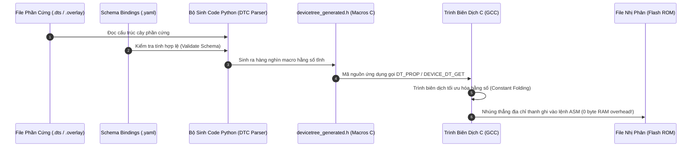
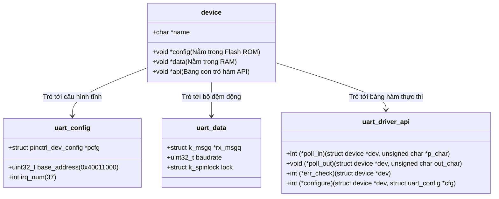
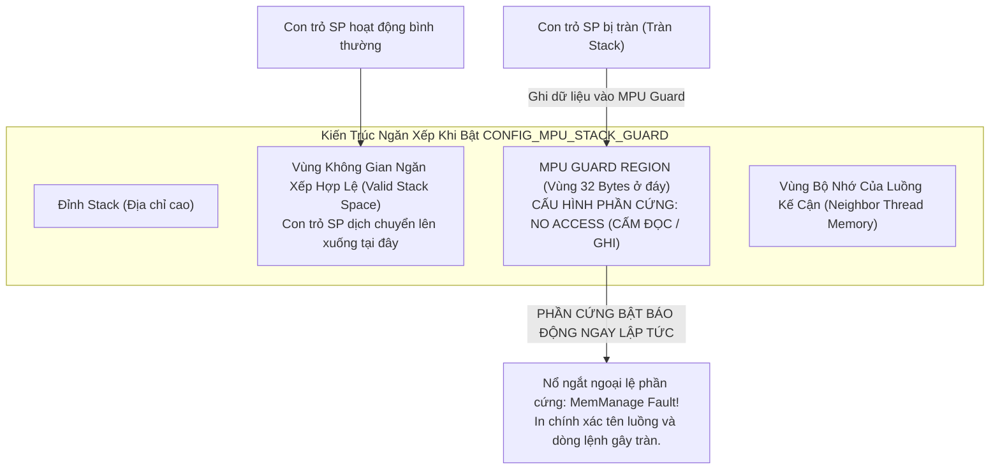

# 🏆 [NGÀY 7] LÀM CHỦ ZEPHYR RTOS: CƠ CHẾ NỘI TẠI, TƯ DUY KIẾN TRÚC & CÁCH VẬN HÀNH HỆ ĐIỀU HÀNH
## Chuyên khảo Kỹ thuật: Compile-Time Devicetree Engine, Driver Model, Scheduler Mechanics & Hardware Protection

> **Mục tiêu chuyên sâu:** Thay vì học vẹt cách gõ code, ngày này tập trung 100% vào việc làm chủ **TƯ DUY THIẾT KẾ HỆ THỐNG** và **CƠ CHẾ NỘI TẠI DƯỚI NỀN TẢNG (UNDER THE HOOD)** của Zephyr RTOS trên ARM Cortex-M7 (STM32F746):
> 1. **Cơ chế Biên Dịch Tĩnh (Compile-Time Evaluation):** Tại sao Zephyr không đọc Devicetree lúc runtime như Linux? Cơ chế sinh macro C tĩnh từ file `.dts`/`.overlay` hoạt động ra sao để đạt 0 byte RAM và 0 ns overhead?
> 2. **Mô Hình Driver Model Đa Hình trong C:** Cách Zephyr tách biệt 3 lớp `config` (ROM) - `data` (RAM) - `api` (Bảng con trỏ hàm), và quy trình khởi tạo tự động lúc boot qua `DEVICE_DT_DEFINE`.
> 3. **Bộ Điều Phối Đa Luồng (Scheduler Mechanics):** Phân tích luồng thực thi Cooperative (Priority âm) vs Preemptive (Priority dương), cơ chế Tickless Idle và MetaIRQ.
> 4. **Bảo Vệ Ngăn Xếp Bằng Phần Cứng (Hardware MPU Stack Guard):** Cơ chế MPU bẫy lỗi tràn ngăn xếp ngay tại chu kỳ lệnh đầu tiên, triệt tiêu lỗi hỏng bộ nhớ ngầm.
> 5. **Cách Sử Dụng Thực Chiến & Mẫu Cấu Hình Chuẩn (Design Patterns & Cheat Sheet):** Mẫu cấu hình Kconfig, Devicetree Overlay và quy chuẩn gỡ lỗi bằng Zephyr Shell & Thread Analyzer.

---

```text
┌─────────────────────────────────────────────────────────────────────────────────────────────────┐
│                    BẢN ĐỒ KIẾN TRÚC VẬN HÀNH CỦA ZEPHYR RTOS TRÊN CORTEX-M7                     │
├─────────────────────────────────────────────────────────────────────────────────────────────────┤
│                                 TẦNG ỨNG DỤNG (APPLICATION LOGIC)                               │
│           • Thread CAN Worker            • Thread GUI/LVGL           • Thread Monitor           │
├─────────────────────────────────────────────────────────────────────────────────────────────────┤
│                              HỆ THỐNG GIAO TIẾP LIÊN LUỒNG (IPC)                                │
│       • k_msgq (Copy Buffer)      • k_sem (Đồng bộ)      • k_mutex (Priority Inheritance)       │
├─────────────────────────────────────────────────────────────────────────────────────────────────┤
│                               ZEPHYR KERNEL SCHEDULER ENGINE                                    │
│   • Cooperative (-Prio: Chạy độc quyền)  │  • Preemptive (+Prio: Chiếm quyền theo mức ưu tiên)  │
│   • MPU Stack Guard (32B No-Access Zone) │  • Tickless Idle (Ngủ sâu tiết kiệm điện tối đa)    │
├─────────────────────────────────────────────────────────────────────────────────────────────────┤
│                             ZEPHYR DRIVER MODEL (ĐA HÌNH TRONG C)                               │
│     DEVICE_DT_DEFINE: [ struct device -> .config (ROM) | .data (RAM) | .api (Function Ptrs) ]    │
├─────────────────────────────────────────────────────────────────────────────────────────────────┤
│                                 PHẦN CỨNG VI ĐIỀU KHIỂN (STM32F746)                             │
│       ARM Cortex-M7 Core  │  RCC Clock Tree  │  NVIC Ngắt  │  MPU Bảo Vệ Bộ Nhớ  │  Ngoại Vi    │
└─────────────────────────────────────────────────────────────────────────────────────────────────┘
```

---

# PHẦN 1: TƯ DUY KIẾN TRÚC — TẠI SAO PHẢI LÀ ZEPHYR RTOS?

Để làm chủ Zephyr, bạn phải hiểu rõ sự tiến hóa tư duy giữa 3 thời kỳ của lập trình vi điều khiển:

### 1.1. Bảng So Sánh Bản Chất Kỹ Thuật: Bare-Metal vs FreeRTOS vs Zephyr RTOS

| Tiêu Chí Kỹ Thuật | 1. Bare-Metal (Ngày 0-6) | 2. FreeRTOS (ST HAL/CubeMX) | 3. Zephyr RTOS (Ngày 7-14) |
| :--- | :--- | :--- | :--- |
| **Mô hình kiến trúc** | Super-loop `while(1)` + ISR | Microkernel điều phối Task | Comprehensive RTOS Ecosystem (như Linux thu nhỏ) |
| **Mô tả phần cứng** | Gõ trực tiếp thanh ghi: `GPIOx->MODER` | ST CubeMX sinh code C cứng (`MX_GPIO_Init`) | **Devicetree (`.dts`/`.overlay`)** chuẩn Open Firmware |
| **Cấu hình phần mềm** | Tự viết cờ `#define` phân tán | Sửa file `#define` trong `FreeRTOSConfig.h` | **Kconfig (`prj.conf`)** chuẩn Linux Kernel |
| **Khởi tạo Driver** | Tự viết hàm `MyDriver_Init()` rồi gọi tay | Gọi hàm `HAL_PPP_Init()` của CubeMX | **Tự động đăng ký boot** qua `DEVICE_DT_DEFINE` |
| **Tạo luồng tác vụ** | Không có (1 luồng duy nhất) | Động qua `xTaskCreate()` (cấp phát Heap) | Tĩnh qua **`K_THREAD_DEFINE`** (0% phân mảnh RAM) |
| **Bảo vệ Stack** | Không có (Tràn stack gây sập chip ngầm) | Kiểm tra phần mềm Canary `0xA5` (thụ động) | **Phần cứng MPU Guard** (bắt lỗi ngay tức thì) |
| **Tính đa nền tảng** | 0% (Đổi chip phải viết lại từ đầu) | 30% (Chỉ đa nền tảng phần RTOS, driver vẫn theo hãng) | **100% (Giữ nguyên code C, chỉ thay file Overlay)** |

---

### 1.2. Tư Duy "Separation of Concerns" (Tách Biệt Phần Cứng Khỏi Phần Mềm)

* **Tư duy cũ (Bare-metal / FreeRTOS HAL):** Mã nguồn C bị "dính chặt" vào mã định danh của chip. Nếu bạn viết `HAL_GPIO_WritePin(GPIOI, GPIO_PIN_1, GPIO_PIN_SET);`, code C của bạn đã bị trói chặt vào chân `PI1` của STM32F7. Nếu ngày mai sếp yêu cầu chuyển sản phẩm sang chip NXP i.MX RT1060 hoặc Nordic nRF5340, bạn phải đi rà soát và sửa lại toàn bộ hàng nghìn dòng code C.
* **Tư duy Zephyr RTOS:** Mã nguồn C **hoàn toàn không biết phần cứng bên dưới là gì**. 
  * File C chỉ gọi: `gpio_pin_toggle_dt(&led_spec);` (Một hàm API trừu tượng).
  * Chân đó là chân nào, thuộc port nào, tích cực mức cao hay thấp được giao trọn gói cho file **`app.overlay`**.
  * Muốn đổi sang chip khác? Giữ nguyên 100% file `.c`, chỉ cần viết lại file `.overlay` tương ứng với bo mạch mới!

---

# PHẦN 2: CƠ CHẾ NỘI TẠI (UNDER THE HOOD) CỦA ZEPHYR RTOS

---

### 2.1. Cơ Chế 1: Devicetree Compile-Time Evaluation Engine

Khác với Linux nhúng (phải biên dịch DTS ra file nhị phân `.dtb`, nạp vào RAM rồi Kernel chạy vòng lặp duyệt cây lúc boot), **Zephyr RTOS hoạt động trên vi điều khiển có RAM cực kỳ hạn chế (vài chục đến vài trăm KB)**. Do đó:



#### Bản chất kỹ thuật:
1. Khi bạn gõ `reg = <0x40011000 0x400>;` trong file DTS, bộ phân tích Python của Zephyr sẽ chuyển đổi nó thành một macro C tĩnh trong file sinh tự động `build/zephyr/include/generated/zephyr/devicetree_generated.h`:
   ```c
   /* Mã macro được Zephyr sinh tự động lúc build */
   #define DT_N_S_soc_S_serial_40011000_REG_NUM_0 0
   #define DT_N_S_soc_S_serial_40011000_REG_BASE  0x40011000
   #define DT_N_S_soc_S_serial_40011000_REG_SIZE  0x400
   ```
2. Trong mã nguồn C, khi bạn gọi:
   ```c
   #define UART_BASE DT_REG_ADDR(DT_NODELABEL(usart1))
   ```
   Trình biên dịch GCC nhìn thấy `UART_BASE` là một **hằng số tức thời `0x40011000`**. Nó không tốn một chu kỳ đọc RAM nào, không có con trỏ động, và tiêu thụ đúng **0 byte RAM**.

---

### 2.2. Cơ Chế 2: Mô Hình Driver Đa Hình trong C (Zephyr Driver Model)

Làm thế nào Zephyr có thể cung cấp hàm `uart_tx()` dùng chung cho cả STM32, NXP, TI, ESP32 mà không bị chậm hiệu năng? Nó sử dụng kỹ thuật **Đa hình hướng đối tượng trong C (Polymorphism via Struct Function Pointers)**.

Mỗi driver ngoại vi trong Zephyr được cấu thành từ 3 cấu trúc dữ liệu kinh điển:



#### Quy trình khởi tạo tự động lúc boot:
1. Driver sử dụng macro `DEVICE_DT_DEFINE` để khai báo:
   ```c
   DEVICE_DT_DEFINE(node_id, init_fn, pm_action_cb, data_ptr, cfg_ptr, level, prio, api_ptr);
   ```
2. Macro này đặt một cấu trúc `struct device` vào một phân vùng linker đặc biệt (Linker Section `.z_device`).
3. Khi vi điều khiển vừa boot (trước khi hàm `main()` chạy), nhân Zephyr thực hiện một vòng lặp duyệt qua phân vùng `.z_device` này và tự động gọi hàm khởi tạo `init_fn()` của từng driver theo đúng mức ưu tiên:
   * `EARLY`: Khởi tạo xung nhịp, cấp nguồn.
   * `PRE_KERNEL_1` / `PRE_KERNEL_2`: Khởi tạo bộ nhớ, thanh ghi ngoại vi cơ bản.
   * `POST_KERNEL`: Khởi tạo các driver cần dùng dịch vụ của OS (như mutex, semaphore).
   * `APPLICATION`: Khởi tạo tầng ứng dụng.
4. **Kết quả:** Lập trình viên ứng dụng **không bao giờ phải tự tay gọi hàm khởi tạo ngoại vi** trong `main()`!

---

### 2.3. Cơ Chế 3: Bộ Điều Phối Đa Luồng (Scheduler Mechanics)

Zephyr hỗ trợ một cơ chế lập lịch đa tầng cực kỳ độc đáo và an toàn:

```text
┌─────────────────────────────────────────────────────────────────────────────────────────────────┐
│                           MÔ HÌNH PHÂN CẤP ƯU TIÊN SCHEDULER ZEPHYR                             │
├─────────────────────────────────────────────────────────────────────────────────────────────────┤
│ [Mức cao nhất] NGẮT PHẦN CỨNG (Hardware Interrupts - ISR) : Ưu tiên cao hơn mọi Thread         │
├─────────────────────────────────────────────────────────────────────────────────────────────────┤
│ [Mức nhì]      META-IRQ THREADS : Luồng đặc biệt chen ngang được cả Cooperative Threads          │
├─────────────────────────────────────────────────────────────────────────────────────────────────┤
│ [Mức ba]       COOPERATIVE THREADS (Priority âm: -CONFIG_NUM_COOP_PRIO đến -1)                  │
│                • Chạy ĐỘC QUYỀN, KHÔNG BAO GIỜ bị Preemptive Threads chiếm quyền.               │
│                • Chỉ nhường CPU khi chính nó tự gọi: k_yield(), k_sleep(), hoặc chờ IPC.        │
├─────────────────────────────────────────────────────────────────────────────────────────────────┤
│ [Mức bốn]      PREEMPTIVE THREADS (Priority dương: 0 đến CONFIG_NUM_PREEMPT_PRIO - 1)           │
│                • Lập lịch theo độ ưu tiên (Priority-based Preemption: Số nhỏ ưu tiên cao).      │
│                • Hỗ trợ chia sẻ thời gian (Round-Robin Time Slicing) giữa các luồng cùng Prio.   │
├─────────────────────────────────────────────────────────────────────────────────────────────────┤
│ [Mức đáy]      IDLE THREAD (Mức ưu tiên thấp nhất) : Chạy Tickless Idle đưa CPU vào chế độ ngủ  │
└─────────────────────────────────────────────────────────────────────────────────────────────────┘
```

#### Bản chất của Cơ chế Tickless Idle:
* Các RTOS truyền thống (như FreeRTOS cấu hình cơ bản) yêu cầu một bộ đếm thời gian SysTick ngắt liên tục mỗi 1ms (1000 Hz). Dù không có việc gì làm, CPU vẫn bị đánh thức dậy 1000 lần mỗi giây, gây lãng phí năng lượng khủng khiếp.
* **Zephyr Tickless Kernel:** Khi tất cả các luồng đều đang ngủ (chờ sự kiện hoặc chờ delay), Kernel tính toán chính xác luồng kế tiếp cần thức dậy sau bao nhiêu micro-giây. Nó lập trình một bộ đếm phần cứng (Hardware Timer) thức dậy đúng thời điểm đó, rồi đưa CPU vào giấc ngủ sâu (Deep Sleep). **Tiết kiệm điện năng tối đa cho thiết bị IoT / Smartwatch.**

---

### 2.4. Cơ Chế 4: Bảo Vệ Ngăn Xếp Bằng Phần Cứng (`CONFIG_MPU_STACK_GUARD`)

Tràn ngăn xếp (Stack Overflow) là "kẻ giết người thầm lặng" số 1 trong hệ thống nhúng: Khi một hàm gọi đệ quy hoặc khai báo mảng cục bộ quá lớn, con trỏ ngăn xếp `SP` sẽ đè bẹp lên vùng nhớ của biến toàn cục hoặc làm hỏng ngăn xếp của luồng kế bên, gây ra lỗi reset bí ẩn vài ngày mới xuất hiện một lần.



#### So sánh với cơ chế Stack Canary của FreeRTOS:
* **FreeRTOS (Software Canary):** Ghi giá trị mẫu `0xA5A5A5A5` ở đáy stack. Khi chuyển đổi ngữ cảnh (Context Switch), phần mềm kiểm tra xem giá trị này còn nguyên không.
  * *Nhược điểm:* **Phát hiện quá trễ!** Tại thời điểm kiểm tra, dữ liệu của luồng bên cạnh đã bị phá hỏng từ lâu.
* **Zephyr (`CONFIG_MPU_STACK_GUARD`):** Lập trình khối MPU phần cứng của ARM Cortex-M7.
  * *Ưu điểm tuyệt đối:* **Bắt quả tang tại trận!** Ngay tại chu kỳ xung nhịp mà lệnh ghi đè chạm vào ranh giới 32 bytes của Guard Region, khối MPU phần cứng phát hiện vi phạm bus và đóng băng hệ thống ngay tức khắc.

---

# PHẦN 3: CÁCH SỬ DỤNG THỰC CHIẾN (PRACTICAL HOW-TO & DESIGN PATTERNS)

---

### 3.1. Quy Chuẩn 5 Thành Phần Hoàn Chỉnh Của Một Dự Án Zephyr

Khi xây dựng một ứng dụng Zephyr RTOS, bạn bắt buộc phải có **bộ 4 file mã nguồn** và **1 công cụ điều phối dòng lệnh (West)**:

```text
my_zephyr_project/
├── CMakeLists.txt      <=== [KHỐI 1 - CMAKE]: Khai báo gói Zephyr & file mã nguồn C
├── prj.conf            <=== [KHỐI 2 - KCONFIG]: Bật/tắt các module tính năng phần mềm
├── app.overlay         <=== [KHỐI 3 - DEVICETREE]: Gán chân, kích hoạt ngoại vi phần cứng
└── src/
    └── main.c          <=== [KHỐI 4 - SOURCE C]: Mã nguồn logic ứng dụng điều khiển
(Và công cụ [WEST] gõ trong Terminal để build & flash vào vi điều khiển)
```

---

#### 📂 KHỐI 1: FILE ĐIỀU PHỐI BIÊN DỊCH CMAKE [ `CMakeLists.txt` ]

File này là "trái tim" của hệ thống build. Nếu thiếu file này, CMake sẽ báo lỗi ngay lập tức vì không biết lấy Kernel Zephyr từ đâu:

```cmake
# Yêu cầu phiên bản CMake tối thiểu
cmake_minimum_required(VERSION 3.20.0)

# Tìm và liên kết toàn bộ hệ điều hành Zephyr RTOS vào dự án
find_package(Zephyr REQUIRED HINTS $ENV{ZEPHYR_BASE})

# Đặt tên cho dự án của bạn
project(zephyr_f746_app)

# Khai báo các file mã nguồn C cần biên dịch thành file nhị phân
target_sources(app PRIVATE src/main.c)
```

---

#### 📂 KHỐI 2: FILE CẤU HÌNH TÍNH NĂNG KCONFIG [ `prj.conf` ]

Nơi bạn bật các Subsystem mà không cần sửa một dòng code C nào:

```properties
# 1. Bật hệ thống GPIO và UART Console
CONFIG_GPIO=y
CONFIG_SERIAL=y
CONFIG_CONSOLE=y
CONFIG_UART_CONSOLE=y

# 2. Bật hệ thống ghi log bất đồng bộ (Deferred Logging - Không làm trễ luồng thời gian thực)
CONFIG_LOG=y
CONFIG_LOG_MODE_DEFERRED=y
CONFIG_LOG_DEFAULT_LEVEL=3

# 3. Kích hoạt khiên bảo vệ tràn ngăn xếp bằng phần cứng MPU Cortex-M7
CONFIG_MPU_STACK_GUARD=y
CONFIG_THREAD_NAME=y
CONFIG_THREAD_STACK_INFO=y

# 4. Bật công cụ chẩn đoán bộ nhớ và hiệu năng luồng lúc runtime
CONFIG_THREAD_ANALYZER=y
CONFIG_THREAD_ANALYZER_AUTO=y
CONFIG_THREAD_ANALYZER_AUTO_INTERVAL=5
```

---

#### 📂 KHỐI 3: FILE MÔ TẢ PHẦN CỨNG DEVICETREE [ `app.overlay` ]

Nơi bạn tùy biến chân cẳng phần cứng cho ứng dụng:

```dts
/ {
    /* Đặt bí danh (alias) để mã nguồn C không bị phụ thuộc vào tên node */
    aliases {
        led-status = &green_led;
    };

    leds {
        compatible = "gpio-leds";
        green_led: led_pi1 {
            /* Mượn chân PI1 của STM32F746-Discovery, tích cực mức cao */
            gpios = <&gpioi 1 GPIO_ACTIVE_HIGH>;
            label = "User Status LED";
        };
    };
};

/* Bắt buộc kích hoạt controller quản lý cổng GPIOI */
&gpioi {
    status = "okay";
};
```

---

#### 📂 KHỐI 4: MÃ NGUỒN C ỨNG DỤNG [ `src/main.c` ]
```c
#include <zephyr/kernel.h>
#include <zephyr/drivers/gpio.h>
#include <zephyr/logging/log.h>

LOG_MODULE_REGISTER(main_app, LOG_LEVEL_INF);

/* 1. Lấy thông số kỹ thuật phần cứng tại COMPILE-TIME thông qua alias */
static const struct gpio_dt_spec s_led = GPIO_DT_SPEC_GET(DT_ALIAS(led_status), gpios);

/* 2. Khai báo ngăn xếp và luồng tĩnh lúc COMPILE-TIME (0 byte RAM phân mảnh) */
#define WORKER_STACK_SIZE 1024
#define WORKER_PRIORITY   7

void worker_thread_entry(void *p1, void *p2, void *p3)
{
    ARG_UNUSED(p1); ARG_UNUSED(p2); ARG_UNUSED(p3);

    /* QUY TẮC SỐNG CÒN: Luôn kiểm tra tính sẵn sàng của thiết bị trước khi gọi API */
    if (!gpio_is_ready_dt(&s_led)) {
        LOG_ERR("Phần cứng GPIO điều khiển LED chưa sẵn sàng!");
        return;
    }

    /* Cấu hình chân sang chế độ ngõ ra mức tích cực ban đầu */
    gpio_pin_configure_dt(&s_led, GPIO_OUTPUT_ACTIVE);

    while (1) {
        gpio_pin_toggle_dt(&s_led);
        
        /* Đưa luồng vào trạng thái ngủ, nhường CPU cho luồng khác */
        k_msleep(500);
    }
}

/* Định nghĩa luồng tĩnh bằng K_THREAD_DEFINE: Không cần gọi xTaskCreate */
K_THREAD_DEFINE(worker_tid, WORKER_STACK_SIZE,
                worker_thread_entry, NULL, NULL, NULL,
                WORKER_PRIORITY, 0, 0);

int main(void)
{
    LOG_INF("Zephyr RTOS Bring-Up thành công trên STM32F746!");
    /* Hàm main kết thúc nhiệm vụ, Kernel tự động quản lý các luồng Worker */
    return 0;
}
```

---

#### 📂 KHỐI 5: QUY TRÌNH THAO TÁC DÒNG LỆNH VỚI WEST (WEST WORKFLOW CHEAT SHEET)

West là công cụ meta-tool điều phối toàn bộ vòng đời phát triển dự án. Bạn mở Terminal tại thư mục dự án và thực hiện 4 lệnh chuẩn mực:

```bash
# 1. Biên dịch ứng dụng cho bo mạch STM32F746G-Discovery:
#    (West tự động đọc CMakeLists.txt -> nạp prj.conf -> nạp app.overlay -> gọi Ninja/GCC)
west build -b stm32f746g_disco

# 2. Biên dịch sạch sẽ từ đầu (Clean Build - nếu vừa sửa file .overlay hoặc đổi chân cẳng):
west build -p always -b stm32f746g_disco

# 3. Nạp file nhị phân zephyr.bin vào vi điều khiển STM32F7 qua ST-LINK:
#    (West tự động kết nối OpenOCD / pyOCD nạp vào Flash tại địa chỉ 0x08000000)
west flash

# 4. Mở giao diện đồ họa Kconfig trực quan trên Terminal để tra cứu tính năng:
west build -t menuconfig
```

---

# PHẦN 4: BỘ CÂU HỎI SÁT HẠCH CHUYÊN SÂU (INTERVIEW DEEP-DIVE)

Đây là các câu hỏi kinh điển mà các Trưởng nhóm Kỹ thuật (Technical Lead) tại Ban Vien, Renesas, NXP sẽ dùng để khảo sát tư duy Zephyr của bạn:

### ❓ Câu 1: "Devicetree trong Zephyr khác gì Devicetree trong Linux nhúng?"
* **Trả lời chuẩn:**
  * Trong Linux nhúng: Devicetree được biên dịch thành file nhị phân `.dtb`. Khi khởi động, Bootloader (U-Boot) nạp file `.dtb` này vào RAM. Linux Kernel duyệt cây nhị phân lúc runtime để tìm driver tương ứng. Quá trình này tiêu tốn hàng chục KB RAM và hàng triệu chu kỳ CPU lúc boot.
  * Trong Zephyr RTOS: Devicetree được xử lý **hoàn toàn ở giai đoạn biên dịch (Compile-time)**. Công cụ Python đọc file `.dts`/`.overlay`, đối chiếu với schema `.yaml` và sinh ra trực tiếp các macro C tĩnh trong file `devicetree_generated.h`. Các thông số địa chỉ thanh ghi, số chân ngắt trở thành các hằng số tức thời nhúng thẳng vào mã máy ASM. Kết quả: **Tiêu thụ 0 byte RAM runtime và 0 ns thời gian duyệt cây lúc khởi động**.

### ❓ Câu 2: "Khi gọi hàm API của một ngoại vi trong Zephyr, cơ chế gọi hàm thực sự diễn ra như thế nào?"
* **Trả lời chuẩn:**
  * Lập trình viên gọi hàm API chung (ví dụ `uart_poll_out(dev, c)`).
  * Hàm này thực chất là một hàm inline: Nó lấy con trỏ `dev->api` (chứa bảng con trỏ hàm `struct uart_driver_api`), rồi nhảy gián tiếp tới hàm tương ứng của driver phần cứng cụ thể: `api->poll_out(dev, c)`.
  * Đây là cơ chế đa hình (Polymorphism) bằng ngôn ngữ C, giúp code tầng ứng dụng hoàn toàn độc lập với phần cứng của từng hãng vi điều khiển.

### ❓ Câu 3: "Sự khác biệt cốt tử giữa Luồng Cooperative và Luồng Preemptive trong Zephyr là gì? Khi nào nên dùng loại nào?"
* **Trả lời chuẩn:**
  * **Cooperative Thread (Priority âm từ `-CONFIG_NUM_COOP_PRIO` đến `-1`):** Luồng này nắm quyền thực thi độc quyền. Một khi đã chiếm CPU, **không có luồng nào khác (kể cả luồng có priority cao hơn) có thể cướp quyền**, trừ khi chính nó chủ động gọi `k_yield()`, `k_sleep()` hoặc chờ một tài nguyên IPC. Thích hợp cho: Các tác vụ quan trọng tuyệt đối không được gián đoạn (như nạp dữ liệu Flash, tính toán mã hóa).
  * **Preemptive Thread (Priority không âm từ `0` đến `N`):** Bộ lập lịch có quyền tước quyền thực thi của nó bất kỳ lúc nào nếu có một luồng có priority cao hơn sẵn sàng chạy. Thích hợp cho: Các tác vụ thông thường (đọc cảm biến, vẽ màn hình GUI, nhận gói tin mạng).

### ❓ Câu 4: "Tại sao Zephyr lại ưu tiên dùng `K_THREAD_DEFINE` tĩnh thay vì tạo luồng động bằng `k_thread_create()`?"
* **Trả lời chuẩn:**
  * Trong các hệ thống nhúng quan trọng (Automotive / Y tế / Hàng không vũ trụ theo chuẩn MISRA-C và ISO 26262), việc cấp phát bộ nhớ động (Dynamic Allocation / Heap) bị nghiêm cấm hoặc hạn chế tối đa vì nguy cơ gây phân mảnh RAM và rò rỉ bộ nhớ (Memory Leak).
  * Macro `K_THREAD_DEFINE` cấp phát toàn bộ cấu trúc dữ liệu của luồng (`struct k_thread`) và bộ nhớ ngăn xếp (`k_thread_stack_t`) vào phân vùng tĩnh BSS/DATA lúc biên dịch. Trình biên dịch và Linker biết chính xác 100% dung lượng RAM của hệ thống ngay từ lúc build, loại trừ hoàn toàn nguy cơ sập hệ thống do hết RAM lúc đang vận hành.

---

### 🎙️ KỊCH BẢN TRẢ LỜI PHỎNG VẤN 60 GIÂY VỀ NĂNG LỰC ZEPHYR (ELEVATOR PITCH)

> *"Bên cạnh nền tảng vững chắc về lập trình thanh ghi Bare-metal, em làm chủ hệ sinh thái **Zephyr RTOS** để phát triển các hệ thống nhúng quy mô công nghiệp.  
> Em nắm rõ cơ chế **Compile-Time Evaluation** của Devicetree và Kconfig, hiểu cách Zephyr chuyển đổi mô tả phần cứng thành macro C tĩnh để đạt 0 byte RAM overhead. Em áp dụng mô hình **Driver Model đa hình** để tách biệt hoàn toàn mã nguồn logic C khỏi cấu hình chân cẳng trong file `.overlay`, giúp phần mềm có khả năng chuyển đổi tức thì sang các dòng vi điều khiển khác.  
> Về mặt an toàn hệ thống, em thành thạo việc cấu hình **MPU Stack Guard** tận dụng phần cứng Cortex-M7 bắt lỗi tràn ngăn xếp ngay tức khắc, kết hợp với chế độ **Deferred Logging** để triệt tiêu hiện tượng jitter thời gian thực của các luồng điều khiển ô tô."*
