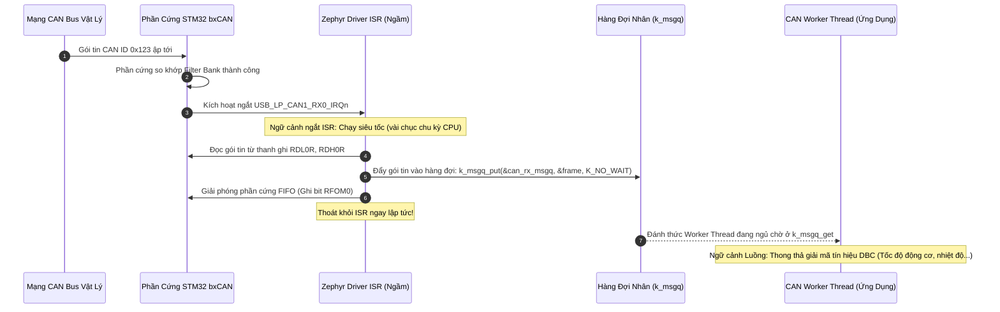
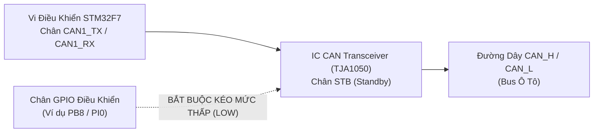

# 🏆 [NGÀY 8] LÀM CHỦ ZEPHYR CAN SUBSYSTEM: CƠ CHẾ BẤT ĐỒNG BỘ, BỘ LỌC PHẦN CỨNG & AN TOÀN MẠNG Ô TÔ
## Chuyên khảo Kỹ thuật: Asynchronous Filter-to-Queue, Bit Timing Solver, Transceiver STB Control & Bus-Off Recovery

> **Mục tiêu chuyên sâu:** Chuyển đổi tư duy từ việc tự viết ngắt và cờ hiệu truyền thống sang **Zephyr CAN Subsystem** chuẩn công nghiệp:
> 1. **Cơ chế Zero-Lock Filter-to-Queue (`can_add_rx_filter_msgq`):** Tại sao lập trình viên Zephyr không cần viết hàm ngắt ISR cho CAN? Cơ chế Kernel ngầm bốc gói tin từ FIFO phần cứng ném vào hàng đợi luồng vận hành ra sao?
> 2. **Giải Thuật Bit Timing Solver Tự Động:** Cách Zephyr tự động giải hệ phương trình Time Quanta (tq) và phân bổ Phase Segments để đạt chính xác tốc độ 500 kbps và Sample Point 87.5% chuẩn CiA 301 mà không cần tra Reference Manual.
> 3. **Bẫy Phần Cứng Transceiver Standby Control:** Cơ chế kiểm soát chân Standby (STB) của IC Transceiver ngoài (TJA1050 / SN65HVD230) để giải cứu mạng CAN khỏi trạng thái "im lặng hoàn toàn".
> 4. **Giám Sát Trạng Thái Mạng & Cơ Chế Bus-Off Recovery:** Phân tích máy trạng thái lỗi phần cứng (Error Active -> Error Passive -> Bus-Off) và thiết kế luồng phục hồi tự động an toàn theo tiêu chuẩn ISO 11898-1.
> 5. **Cách Sử Dụng Thực Chiến & Bộ Câu Hỏi Phỏng Vấn:** Mẫu cấu hình Overlay/Kconfig chuẩn, mô hình nhận bất đồng bộ và bộ câu hỏi khảo sát bản chất kỹ thuật của nhà tuyển dụng Automotive.

---

```text
┌─────────────────────────────────────────────────────────────────────────────────────────────────┐
│                     LUỒNG DỮ LIỆU BẤT ĐỒNG BỘ CỦA ZEPHYR CAN SUBSYSTEM                          │
├─────────────────────────────────────────────────────────────────────────────────────────────────┤
│ [Mạng CAN Ô Tô]  ──>  CAN Transceiver (TJA1050) [Chân STB được kéo LOW để thức dậy]             │
│                                │ (Tín hiệu vi sai CAN_H / CAN_L)                                │
│                                ▼                                                                │
│ [Phần Cứng bxCAN] ──>  28 Filter Banks (Lọc phần cứng ID & Mask)                                │
│                                │                                                                │
│                                ▼                                                                │
│ [Ngắt Phần Cứng]  ──>  CAN RX ISR (Driver ngầm của Zephyr)                                      │
│                                │ • Tự đọc FIFO phần cứng                                        │
│                                │ • Ghi trực tiếp vào Message Queue: k_msgq_put(K_NO_WAIT)       │
│                                ▼                                                                │
│ [Hàng Đợi Nhân]   ──>  k_msgq (Bộ đệm an toàn, Zero-Copy, Thread-Safe)                          │
│                                │                                                                │
│                                ▼ (Đánh thức luồng Worker dậy)                                   │
│ [Tầng Ứng Dụng]   ──>  CAN Worker Thread: k_msgq_get(K_FOREVER) ──> Giải mã tín hiệu DBC        │
└─────────────────────────────────────────────────────────────────────────────────────────────────┘
```

---

# PHẦN 1: TƯ DUY KIẾN TRÚC — ZEPHYR CAN SUBSYSTEM CÓ GÌ KHÁC BIỆT?

### 1.1. Bảng Đối Chiếu Bản Chất: Bare-Metal / FreeRTOS HAL vs Zephyr CAN

| Khía Cạnh Kỹ Thuật | 1. Bare-Metal / FreeRTOS HAL | 2. Zephyr CAN Subsystem |
| :--- | :--- | :--- |
| **Tính toán Baudrate** | Phải tự tính tay các thanh ghi `BRP`, `TS1`, `TS2` trong `CAN_BTR`. Dễ sai 1 tick làm lệch Sample Point. | Khai báo `bus-speed = <500000>;` và `sample-point = <875>;`. Zephyr tự tính toán tối ưu 100%. |
| **Cấu hình Bộ lọc ID** | Phải tự cấu hình 28 Filter Banks (thanh ghi `CAN_FMR`, `CAN_FA1R`, nạp Mask ID kép phức tạp). | Gọi hàm chuẩn hóa `can_add_rx_filter_msgq()`. Zephyr tự tìm Filter Bank trống để nạp vào chip. |
| **Xử lý ngắt nhận (RX)** | Tự viết `HAL_CAN_RxFifo0MsgPendingCallback()`, tự gọi hàm lấy frame, tự đẩy vào FreeRTOS Queue. | **Tự động 100%:** Driver Zephyr tự bốc frame ném vào `k_msgq` ngay trong ISR, không cần người dùng viết ISR. |
| **Kiểm soát lỗi mạng** | Thường bật cờ `ABOM` (tự phục hồi bừa bãi) hoặc bỏ qua việc xử lý ngắt lỗi. | Tích hợp sẵn cơ chế Callback chuyển trạng thái `can_set_state_change_callback()` và hàm `can_recover()`. |
| **Tính độc lập phần cứng**| Dính chặt vào cấu trúc thanh ghi của STM32 bxCAN. | Dùng chung 100% tập API cho mọi vi điều khiển (NXP FlexCAN, Bosch M_CAN, STM32). |

---

# PHẦN 2: CƠ CHẾ NỘI TẠI (UNDER THE HOOD)

---

### 2.1. Cơ Chế 1: Zero-Lock Filter-to-Queue Architecture (`can_add_rx_filter_msgq`)

Trong lập trình RTOS truyền thống, lỗi phổ biến nhất của lập trình viên là **xử lý logic quá lâu trong hàm ngắt ISR** hoặc **gọi nhầm hàm chặn (Blocking) trong ISR**, làm tê liệt toàn bộ hệ điều hành.

Zephyr giải quyết triệt để vấn đề này bằng mô hình gắn bộ lọc trực tiếp vào hàng đợi:



* **Tại sao lại tối ưu?**
  * Hàm ngắt chỉ làm nhiệm vụ duy nhất: chép dữ liệu cực nhanh sang `k_msgq` với thời gian chờ `K_NO_WAIT` rồi rút lui ngay.
  * Tầng ứng dụng dùng hàm `k_msgq_get(&can_rx_msgq, &frame, K_FOREVER)`. Khi không có gói tin, luồng tự động ngủ sâu (0% CPU). Khi có tin nhắn, Kernel tự động đánh thức luồng dậy xử lý.

---

### 2.2. Cơ Chế 2: Giải Thuật Bit Timing Solver Tự Động

Chuẩn ô tô (CiA 301 / ISO 11898-1) quy định cực kỳ nghiêm ngặt:
* Tốc độ truyền chuẩn thông dụng: **500 kbps**.
* Vị trí điểm lấy mẫu (Sample Point): Bắt buộc nằm trong khoảng **80.0% đến 87.5%** để bù đắp độ trễ lan truyền của cáp dài trên xe.

#### Công thức định thời bit CAN:
```text
Nominal Bit Time = (1 + Prop_Seg + Phase_Seg1 + Phase_Seg2) * tq = (1 + TS1 + TS2) * tq
Trong đó: Time Quanta (tq) = BRP / f_PCLK1
Vị trí Sample Point = (1 + TS1) / (1 + TS1 + TS2) * 100%
```

* **Thuật toán của Zephyr:** Khi bạn khai báo `bus-speed = <500000>;` và `sample-point = <875>;`, trình biên dịch Zephyr chạy một thuật toán tối ưu hóa đa biến:
  1. Đọc tần số bus APB1 cấp cho CAN (`f_PCLK1 = 54 MHz` trên STM32F7).
  2. Quét qua tất cả các giá trị bộ chia `BRP` hợp lệ của phần cứng (từ 1 đến 1024).
  3. Tìm bộ nghiệm `(BRP, TS1, TS2)` sao cho sai số tốc độ truyền đạt đúng **0%** và vị trí lấy mẫu đạt chính xác **87.5%**.
  4. Nạp trực tiếp các thông số này vào thanh ghi `CAN_BTR` mà lập trình viên không cần chạm vào máy tính cầm tay để tính toán.

---

### 2.3. Cơ Chế 3: Bẫy Phần Cứng Transceiver Standby Control

Rất nhiều kỹ sư khi đưa mã nguồn Zephyr lên board thật (như STM32F746-Discovery kết nối module CAN ngoài) đều gặp hiện tượng: **Code chạy không lỗi, hàm `can_send()` trả về 0, nhưng trên máy phân tích tín hiệu không có một xung điện nào xuất hiện trên đường truyền!**



#### Bản chất phần cứng của chân Standby (STB):
* Các IC Transceiver (TJA1050, SN65HVD230) có một chân điều khiển chế độ gọi là **STB** (hoặc EN):
  * **Nếu chân STB = HIGH (hoặc thả nổi do điện trở kéo nội):** Chip transceiver rơi vào chế độ ngủ (Standby Mode) để tiết kiệm điện. Khối phát vi sai bị cắt điện hoàn toàn, chân Tx bị ngắt khỏi bus!
  * **Nếu chân STB = LOW:** Chip transceiver mới thực sự thức giấc (Normal Mode), kích hoạt mạch kích dòng vi sai đẩy tín hiệu lên bus.
* **Nguyên tắc vàng:** Trước khi gọi `can_start()`, ứng dụng bắt buộc phải cấu hình một chân GPIO ngõ ra và kéo chân STB của transceiver xuống **mức 0 (LOW)**.

---

### 2.4. Cơ Chế 4: Giám Sát Trạng Thái Lỗi & Phục Hồi Bus-Off (ISO 11898-1)

Mạng CAN trên ô tô là môi trường cực kỳ khắc nghiệt (nhiễu từ bu-gi, chập dây, sụt áp). Phần cứng CAN Controller quản lý lỗi dựa trên 2 bộ đếm: `TEC` (Transmit Error Counter) và `REC` (Receive Error Counter):

```text
┌─────────────────────────────────────────────────────────────────────────────────────────────────┐
│                           MÁY TRẠNG THÁI LỖI MẠNG CAN (CAN ERROR FSM)                           │
├─────────────────────────────────────────────────────────────────────────────────────────────────┤
│ [1. ERROR ACTIVE]   : TEC < 128 và REC < 128  ──> Hoạt động bình thường, gửi cờ lỗi chủ động.   │
│                                │ (Lỗi truyền tăng vượt 127)                                     │
│                                ▼                                                                │
│ [2. ERROR PASSIVE]  : TEC >= 128 hoặc REC >= 128 ──> Bị nghi ngờ hỏng hóc, chỉ gửi cờ bị động.  │
│                                │ (Lỗi truyền tiếp tục tăng vượt 255)                            │
│                                ▼                                                                │
│ [3. BUS-OFF STATE]  : TEC > 255 ──> PHẦN CỨNG TỰ ĐỘNG CÔ LẬP KHỎI MẠNG ĐỂ BẢO VỆ XE!            │
│                                │                                                                │
│                                ▼ (Kích hoạt Callback của Zephyr)                                │
│ [Phục hồi an toàn]  : can_set_state_change_callback() bắt sự kiện ──> Chờ 100ms ──> can_recover()│
└─────────────────────────────────────────────────────────────────────────────────────────────────┘
```

* **Cơ chế phục hồi an toàn (ISO 11898-1):**
  * Tuyệt đối không bật chế độ tự phục hồi tự động vô tội vạ (`ABOM = 1`) nếu chưa hiểu rõ nguyên nhân, vì nếu đường dây đang bị chập điện vật lý, việc liên tục tái khởi động sẽ phá hỏng các thiết bị khác trên xe.
  * Zephyr cung cấp hàm `can_set_state_change_callback()`: Khi trạng thái chuyển sang `CAN_STATE_BUS_OFF`, ứng dụng ghi nhận sự kiện, cảnh báo lên táp-lô, chờ một khoảng thời gian làm dịu (ví dụ 100ms) rồi mới chủ động gọi hàm `can_recover()`.

---

# PHẦN 3: CÁCH SỬ DỤNG THỰC CHIẾN (CAN CHEAT SHEET & BEST PRACTICES)

---

# PHẦN 3: CÁCH SỬ DỤNG THỰC CHIẾN (MÃ NGUỒN MODULAR HOÀN CHỈNH TỪNG FILE)

Để hệ thống CAN Gateway vận hành ổn định trong thực tế, mã nguồn được phân chia thành **4 khối tệp hoàn chỉnh, có đầu có đuôi rõ ràng**, thể hiện trọn vẹn luồng dữ liệu từ phần cứng đến ứng dụng:

---

### 3.1. Tệp Cấu Hình Tính Năng [ File: `prj.conf` ]
```properties
# 1. Bật hệ thống CAN Subsystem và GPIO điều khiển chân STB
CONFIG_CAN=y
CONFIG_CAN_INIT_PRIORITY=80
CONFIG_CAN_MAX_FILTER=10
CONFIG_GPIO=y

# 2. Tắt cơ chế tự phục hồi tự động để phần mềm chủ động kiểm soát an toàn theo ISO 11898-1
CONFIG_CAN_AUTO_BUS_OFF_RECOVERY=n

# 3. Kích hoạt hệ thống ghi nhật ký và chẩn đoán luồng
CONFIG_LOG=y
CONFIG_LOG_MODE_DEFERRED=y
CONFIG_LOG_DEFAULT_LEVEL=3
CONFIG_THREAD_NAME=y
```

---

### 3.2. Tệp Định Nghĩa Phần Cứng [ File: `app.overlay` ]
```dts
/ {
    chosen {
        zephyr,canbus = &can1;
    };

    /* Khai báo chân Standby (STB) của chip CAN Transceiver ngoài TJA1050 */
    transceiver {
        compatible = "gpio-keys";
        can_stb: stb_pin {
            /* Mượn chân PB8 trên STM32F7 để điều khiển chế độ thức/ngủ của Transceiver */
            gpios = <&gpiob 8 GPIO_ACTIVE_HIGH>;
            label = "CAN Transceiver Standby Control";
        };
    };
};

/* Cấu hình ngoại vi CAN1 trên STM32F7 chạy tốc độ 500 kbps, Sample Point 87.5% */
&can1 {
    status = "okay";
    pinctrl-0 = <&can1_rx_pa11 &can1_tx_pa12>;
    pinctrl-names = "default";
    bus-speed = <500000>;
    sample-point = <875>;
};

&gpiob {
    status = "okay";
};
```

---

### 3.3. Tệp Khai Báo Giao Diện CAN Gateway [ File: `src/can_gateway.h` ]
```c
#ifndef CAN_GATEWAY_H_
#define CAN_GATEWAY_H_

#include <zephyr/kernel.h>
#include <zephyr/drivers/can.h>

/* Khai báo extern để các module khác (như GUI táp-lô) có thể truy cập hàng đợi tin nhắn */
extern struct k_msgq can_rx_msgq;

/**
 * @brief Khởi tạo phần cứng CAN, cấu hình chân STB transceiver và đăng ký bộ lọc
 * @return 0 nếu thành công, mã lỗi âm nếu thất bại
 */
int can_gateway_init(void);

/**
 * @brief Gửi một khung tin CAN lên mạng ô tô với cơ chế timeout an toàn
 * @param id Định danh thông điệp (Standard 11-bit)
 * @param data Mảng dữ liệu tối đa 8 bytes
 * @param dlc Chiều dài dữ liệu (0 đến 8)
 * @return 0 nếu truyền thành công
 */
int can_gateway_send(uint32_t id, const uint8_t *data, uint8_t dlc);

#endif /* CAN_GATEWAY_H_ */
```

---

### 3.4. Tệp Hiện Thực Hóa Logic CAN & Đa Luồng [ File: `src/can_gateway.c` ]
```c
#include "can_gateway.h"
#include <zephyr/drivers/gpio.h>
#include <zephyr/logging/log.h>

LOG_MODULE_REGISTER(can_gateway, LOG_LEVEL_INF);

/* 1. Khởi tạo hàng đợi tĩnh k_msgq chứa tối đa 16 khung tin CAN */
CAN_MSGQ_DEFINE(can_rx_msgq, 16);

static const struct device *const s_can_dev = DEVICE_DT_GET(DT_CHOSEN(zephyr_canbus));
static const struct gpio_dt_spec s_stb_gpio = GPIO_DT_SPEC_GET(DT_NODELABEL(can_stb), gpios);

/* Luồng xử lý dữ liệu CAN chuyên biệt (Tách biệt khỏi ngắt ISR) */
#define CAN_WORKER_STACK 2048
#define CAN_WORKER_PRIO  5

/* 2. Hàm Callback bắt sự kiện chuyển trạng thái lỗi và phục hồi Bus-Off */
static void can_state_change_handler(const struct device *dev, 
                                     enum can_state state, 
                                     struct can_bus_err_cnt err_cnt, 
                                     void *user_data)
{
    ARG_UNUSED(dev); ARG_UNUSED(user_data);

    if (state == CAN_STATE_BUS_OFF) {
        LOG_ERR("CẢNH BÁO: Mạng CAN rơi vào trạng thái BUS-OFF! (TEC=%u, REC=%u)", 
                err_cnt.tx_err_cnt, err_cnt.rx_err_cnt);
        
        /* Chờ trễ an toàn 100ms trước khi kích hoạt phục hồi theo ISO 11898-1 */
        k_msleep(100);
        LOG_INF("Đang tiến hành phục hồi mạng (can_recover)...");
        can_recover(s_can_dev, K_MSEC(100));
    } else if (state == CAN_STATE_ERROR_PASSIVE) {
        LOG_WRN("Cảnh báo: Bộ đếm lỗi tăng cao, chuyển sang Error Passive!");
    }
}

/* 3. Hàm thực thi của luồng Worker: Đón nhận gói tin từ k_msgq */
void can_worker_entry(void *p1, void *p2, void *p3)
{
    ARG_UNUSED(p1); ARG_UNUSED(p2); ARG_UNUSED(p3);
    struct can_frame rx_frame;

    LOG_INF("Luồng CAN Worker đã khởi động và sẵn sàng xử lý gói tin!");

    while (1) {
        /* Chờ tin nhắn từ hàng đợi: Luồng tự động ngủ sâu 0% CPU khi chưa có frame đến */
        k_msgq_get(&can_rx_msgq, &rx_frame, K_FOREVER);

        LOG_INF("Đã bóc tách Frame ID: 0x%03X | DLC: %u | Byte 0: 0x%02X",
                rx_frame.id, rx_frame.dlc, rx_frame.data[0]);

        /* Dữ liệu tại đây sẽ được chuyển giao cho module giải mã DBC và Supervision */
    }
}

K_THREAD_DEFINE(can_worker_tid, CAN_WORKER_STACK,
                can_worker_entry, NULL, NULL, NULL,
                CAN_WORKER_PRIO, 0, 0);

/* 4. Hàm khởi tạo toàn diện hệ thống CAN */
int can_gateway_init(void)
{
    if (!device_is_ready(s_can_dev)) {
        LOG_ERR("Lỗi: Ngoại vi CAN1 chưa sẵn sàng!");
        return -ENODEV;
    }

    /* BƯỚC SỐNG CÒN: Kéo chân Standby (STB) của Transceiver xuống mức LOW để thức dậy */
    if (device_is_ready(s_stb_gpio.port)) {
        gpio_pin_configure_dt(&s_stb_gpio, GPIO_OUTPUT_INACTIVE);
        gpio_pin_set_dt(&s_stb_gpio, 0); /* Mức 0 = Normal Mode */
        LOG_INF("Đã đánh thức CAN Transceiver thành công qua chân STB!");
    } else {
        LOG_WRN("Cảnh báo: Không tìm thấy chân STB, transceiver có thể bị ngủ đông!");
    }

    /* Đăng ký Callback giám sát lỗi Bus-Off */
    can_set_state_change_callback(s_can_dev, can_state_change_handler, NULL);

    /* Cấu hình bộ lọc phần cứng gắn trực tiếp vào hàng đợi k_msgq */
    const struct can_filter filter = {
        .id = 0x100,      /* Dải ID động cơ và táp-lô */
        .mask = 0x700,    /* Lọc các ID trong dải 0x100 - 0x1FF */
        .flags = 0        /* Standard ID 11-bit */
    };

    int filter_id = can_add_rx_filter_msgq(s_can_dev, &can_rx_msgq, &filter);
    if (filter_id < 0) {
        LOG_ERR("Không thể đăng ký bộ lọc phần cứng CAN (Mã lỗi: %d)", filter_id);
        return filter_id;
    }

    /* Kích hoạt phần cứng CAN bắt đầu truyền nhận */
    return can_start(s_can_dev);
}

int can_gateway_send(uint32_t id, const uint8_t *data, uint8_t dlc)
{
    struct can_frame tx_frame = {
        .id = id,
        .dlc = dlc,
        .flags = 0
    };
    memcpy(tx_frame.data, data, dlc);

    /* Truyền với timeout 50ms, không bao giờ dùng K_FOREVER để tránh treo luồng */
    return can_send(s_can_dev, &tx_frame, K_MSEC(50), NULL, NULL);
}
```

---

### 3.5. Tệp Khởi Động Ứng Dụng Chính [ File: `src/main.c` ]
```c
#include <zephyr/kernel.h>
#include <zephyr/logging/log.h>
#include "can_gateway.h"

LOG_MODULE_REGISTER(main_app, LOG_LEVEL_INF);

int main(void)
{
    LOG_INF("=================================================");
    LOG_INF("     KHỞI CHẠY HỆ THỐNG CAN GATEWAY ZEPHYR       ");
    LOG_INF("=================================================");

    int ret = can_gateway_init();
    if (ret < 0) {
        LOG_ERR("Khởi động hệ thống CAN Gateway thất bại! (Lỗi: %d)", ret);
        return ret;
    }

    LOG_INF("Hệ thống Gateway vận hành hoàn hảo! Luồng Worker đang giám sát mạng...");
    return 0;
}
```

---

# PHẦN 4: BỘ CÂU HỎI PHỎNG VẤN CHUYÊN SÂU (INTERVIEW DEEP-DIVE)

### ❓ Câu 1: "Tại sao Zephyr lại thiết kế hàm `can_add_rx_filter_msgq` thay vì chỉ dùng hàm Callback `can_add_rx_filter` thông thường?"
* **Trả lời chuẩn:**
  * Hàm `can_add_rx_filter()` truyền thống yêu cầu một hàm Callback chạy trực tiếp trong ngữ cảnh ngắt phần cứng (ISR). Nếu lập trình viên thực hiện các thao tác tốn thời gian trong Callback (như giải mã tín hiệu DBC phức tạp, in log hoặc tính toán toán học), toàn bộ các ngắt khác của hệ thống sẽ bị chặn đứng (Interrupt Latency tăng cao).
  * Hàm `can_add_rx_filter_msgq()` tự động liên kết bộ lọc phần cứng với một hàng đợi tin nhắn `k_msgq`. Khi có gói tin, Kernel ngầm thực hiện thao tác chép cực nhanh (O(1)) vào hàng đợi ngay trong ISR rồi nhường quyền cho luồng Worker ở tầng Thread xử lý. Điều này phân tách triệt để giữa việc đón nhận dữ liệu thời gian thực và việc xử lý logic ứng dụng.

### ❓ Câu 2: "Hiện tượng Bus-Off xảy ra do đâu? Tại sao trong các dự án ô tô chuyên nghiệp, người ta không bật tính năng tự phục hồi tự động `CONFIG_CAN_AUTO_BUS_OFF_RECOVERY=y`?"
* **Trả lời chuẩn:**
  * Hiện tượng Bus-Off xảy ra khi bộ đếm lỗi truyền `TEC` của vi điều khiển vượt quá 255, chứng tỏ node mạng đang phát sai liên tục làm ô nhiễm đường truyền. Phần cứng vi điều khiển sẽ tự động ngắt kết nối với bus để bảo vệ toàn bộ mạng xe.
  * Nếu bật tự phục hồi tự động không kiểm soát, khi đường dây bị đứt hoặc chập điện vật lý liên tục, chip sẽ liên tục thử kết nối lại và liên tục phát lỗi, có thể phá hủy băng thông của toàn bộ mạng CAN trên ô tô. Do đó, theo chuẩn an toàn ô tô, phần mềm phải bắt sự kiện Bus-Off qua Callback, ghi nhận mã lỗi chẩn đoán (DTC), đợi hết thời gian làm dịu (Cool-down) rồi mới được phép chủ động gọi hàm `can_recover()`.

### ❓ Câu 3: "Làm thế nào để truyền một khung tin CAN trong Zephyr mà không làm đứng (Lock) luồng hiện tại nếu đường truyền CAN bị đứt cáp?"
* **Trả lời chuẩn:**
  * Không bao giờ truyền tham số timeout `K_FOREVER` vào hàm `can_send()`.
  * Thay vào đó, truyền một khoảng thời gian chờ xác định (ví dụ `K_MSEC(50)`): Nếu sau 50ms các mailbox phần cứng vẫn bận hoặc không nhận được bit ACK do đứt cáp, hàm sẽ trả về mã lỗi `-EAGAIN` hoặc `-ETIMEDOUT`, cho phép luồng tiếp tục chạy và đưa ra biện pháp xử lý sự cố thay vì bị treo chết.

---

### 🎙️ KỊCH BẢN TRẢ LỜI PHỎNG VẤN 60 GIÂY VỀ NĂNG LỰC CAN (ELEVATOR PITCH)

> *"Trong dự án CAN Gateway, em triển khai hệ thống truyền thông trên nền tảng **Zephyr CAN Subsystem** với cấu hình chuẩn hóa 500 kbps và Sample Point 87.5% qua Devicetree.  
> Em giải quyết triệt để vấn đề nghẽn ngắt bằng kiến trúc **Asynchronous Filter-to-Queue**, sử dụng `can_add_rx_filter_msgq` để Kernel ngầm bốc gói tin từ FIFO phần cứng ném vào hàng đợi đa luồng, giải phóng hoàn toàn ngữ cảnh ngắt thời gian thực cho các ngoại vi khác.  
> Đặc biệt, em nắm vững cơ chế an toàn mạng ô tô theo chuẩn **ISO 11898-1**: điều khiển chân Standby của Transceiver ngoài để quản lý trạng thái thức/ngủ, đồng thời xây dựng máy trạng thái bắt sự kiện Bus-Off để thực hiện chu kỳ phục hồi an toàn có kiểm soát, ngăn ngừa triệt để hiện tượng phá hủy bus do chập mạch vật lý."*
