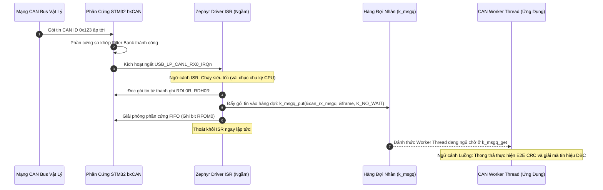
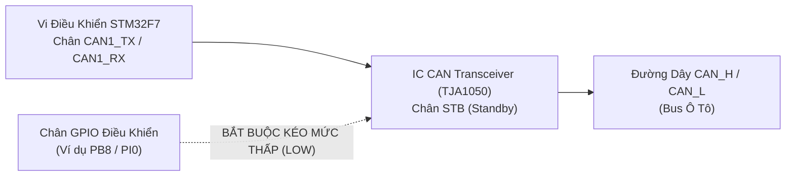

# 🏆 [NGÀY 8] LÀM CHỦ TẦNG TRUYỀN THÔNG Ô TÔ: MẠNG CAN BẤT ĐỒNG BỘ, BỘ GIẢI MÃ VECTOR DBC & CHUẨN AN TOÀN AUTOSAR E2E

## Chuyên khảo Kỹ thuật: Toàn Bộ Lý Thuyết Zephyr CAN Subsystem, Bit Unpacking Engine & 3 Lớp Bảo Vệ E2E (Gom Trọn 1 Nơi)

> [!IMPORTANT]
> **MỤC TIÊU CỐT LÕI NGÀY 8 DÀNH CHO KỸ SƯ EMBEDDED / AUTOMOTIVE:**
> 1. **Toàn Bộ Lý Thuyết Tập Trung (Single Source of Truth):** Không phân mảnh lý thuyết mạng CAN, Vector DBC và an toàn dữ liệu E2E ở nhiều nơi. Nắm trọn vẹn toàn bộ ngăn xếp truyền thông ô tô từ khung truyền vật lý đến giá trị kỹ thuật thực tế.
> 2. **Cơ Chế Nội Tại (Under the Hood):** Hiểu rõ cơ chế Zero-Lock Filter-to-Queue (`can_add_rx_filter_msgq`), bẫy chân Standby (STB) của Transceiver, giải thuật giải nén bit răng cưa (Sawtooth Bit Unpacking) của Intel Little-Endian (`@1`) vs Motorola Big-Endian (`@0`), và 3 lớp phòng thủ AUTOSAR E2E (Data ID, Rolling Counter, CRC-8).
> 3. **Bộ File Mẫu Hoàn Chỉnh (Có Đầu Có Đuôi):** Cung cấp trọn vẹn `app.overlay`, `prj.conf`, module `can_gateway` và module `dbc_decoder` đầy đủ định nghĩa cấu trúc và giải thuật.
> 4. **Tư Duy Trả Lời Phỏng Vấn Tuyển Dụng:** Tự tin mổ xẻ tại sao CRC phần cứng của CAN là chưa đủ đối với chuẩn ISO 26262 ASIL-B, cơ chế phục hồi Bus-Off FSM, và cách thực hiện toán Fixed-point không dùng số thực `float`.

---

```text
┌─────────────────────────────────────────────────────────────────────────────────────────────────┐
│                    NGĂN XẾP TRUYỀN THÔNG Ô TÔ TOÀN DIỆN TRÊN ZEPHYR RTOS                        │
├─────────────────────────────────────────────────────────────────────────────────────────────────┤
│ [TẦNG 4: AN TOÀN AUTOSAR E2E]   • Check Data ID bí mật  • Check Rolling Counter  • Check CRC-8  │
├─────────────────────────────────────────────────────────────────────────────────────────────────┤
│ [TẦNG 3: GIẢI MÃ VECTOR DBC]    • Bit Unpacking (Sawtooth)  • Sign Extension  • Fixed-Point     │
├─────────────────────────────────────────────────────────────────────────────────────────────────┤
│ [TẦNG 2: ZEPHYR CAN SUBSYSTEM]  • can_add_rx_filter_msgq()  • k_msgq Copy Buffer (Zero-Lock)   │
├─────────────────────────────────────────────────────────────────────────────────────────────────┤
│ [TẦNG 1: PHẦN CỨNG & TRANSCEIVER] • Chân STB Transceiver kéo LOW  • bxCAN 28 Filters (500 kbps) │
└─────────────────────────────────────────────────────────────────────────────────────────────────┘
```

---

# PHẦN 1: TƯ DUY KIẾN TRÚC — TẠI SAO PHẢI CÓ NGĂN XẾP TRUYỀN THÔNG ĐA TẦNG?

Trong ngành công nghiệp ô tô hiện đại:
* **Băng thông mạng CAN cực kỳ hạn chế (500 kbps):** Để truyền hàng nghìn tín hiệu cảm biến (tốc độ xe, vòng tua máy, nhiệt độ dầu, áp suất lốp, góc lái) trên cùng một cặp dây vi sai `CAN_H` / `CAN_L`, dữ liệu không thể gửi dưới dạng văn bản hay số nguyên 32-bit cồng kềnh. Chúng phải được nén chặt ở cấp độ bit (Bit Packing) theo tệp mô tả chuẩn **Vector DBC**.
* **Hiểm họa an toàn chức năng (ISO 26262 ASIL-B):** Dữ liệu truyền trên ô tô bị đe dọa bởi nhiễu điện từ mạnh (khởi động động cơ, bugi đánh lửa), lỗi nghẽn bus, và lỗi treo vi điều khiển phát (Sender ECU đông đá dữ liệu). Chuẩn an toàn **AUTOSAR E2E (End-to-End Protection)** sinh ra để đảm bảo dữ liệu đến đích là dữ liệu mới nhất, toàn vẹn và không bị can thiệp.
* **Tư duy Zephyr RTOS:** Tách biệt hoàn toàn việc bắt gói tin ở tầng phần cứng (chạy bất đồng bộ qua hàng đợi `k_msgq`) khỏi việc giải mã tín hiệu và kiểm tra an toàn (chạy ở luồng Worker tầng ứng dụng).

---

# PHẦN 2: TOÀN BỘ CƠ SỞ LÝ THUYẾT & CƠ CHẾ NỘI TẠI (GOM TRỌN 1 NƠI DUY NHẤT)

> [!NOTE]
> Mọi lý thuyết về Zephyr CAN Subsystem, Transceiver Standby, Giải thuật Vector DBC Bit-Unpacking và 3 lớp bảo vệ AUTOSAR E2E được quy tụ trọn vẹn tại đây.

---

### 2.1. Cơ Chế 1: Zero-Lock Filter-to-Queue Architecture (`can_add_rx_filter_msgq`)

Trong lập trình RTOS truyền thống, lỗi phổ biến nhất của lập trình viên là **xử lý logic giải mã quá lâu trong hàm ngắt ISR** hoặc **gọi hàm chặn (Blocking) trong ISR**, làm tê liệt toàn bộ hệ thống.

Zephyr giải quyết triệt để vấn đề này bằng mô hình gắn bộ lọc trực tiếp vào hàng đợi:



* **Tại sao kiến trúc này đạt hiệu năng vượt trội?**
  * Hàm ngắt của Zephyr chỉ làm nhiệm vụ duy nhất: bốc dữ liệu từ thanh ghi phần cứng đẩy vào `k_msgq` với tham số `K_NO_WAIT` rồi rút lui ngay.
  * Tầng ứng dụng dùng hàm `k_msgq_get(&can_rx_msgq, &frame, K_FOREVER)`. Khi không có gói tin, luồng tự động ngủ sâu (0% CPU tiêu thụ). Khi có tin nhắn tới, Kernel tự động đánh thức luồng dậy để xử lý.

---

### 2.2. Cơ Chế 2: Bẫy Phần Cứng Transceiver Standby Control

Rất nhiều kỹ sư khi đưa mã nguồn Zephyr lên board thật (như STM32F746-Discovery kết nối module CAN rời) đều gặp lỗi: **Code chạy không báo lỗi, hàm `can_send()` trả về 0, nhưng máy phân tích tín hiệu (Logic Analyzer / Oscilloscope) không thấy bất kỳ xung điện nào trên đường truyền!**



#### Bản chất vật lý của chân STB:
* Các chip Transceiver như TJA1050 hoặc SN65HVD230 có một chân chuyên dụng tên là **STB (Standby)**.
* **Chân STB nối HIGH (3.3V hoặc thả nổi có trở kéo):** Transceiver rơi vào chế độ tiết kiệm điện cực độ (Sleep/Standby), ngắt toàn bộ mạch lái vi sai nội tại. Mạng CAN hoàn toàn "bị câm".
* **Chân STB nối LOW (0V - GND):** Mạch lái vi sai được cấp nguồn và hoạt động ở chế độ tốc độ cao (High-speed Mode).
* **Giải pháp trong Zephyr:** Khai báo chân điều khiển này trong file `app.overlay` và cấu hình kéo mức thấp (LOW) ngay khi hệ thống vừa boot.

---

### 2.3. Cơ Chế 3: Bản Chất Tệp Vector DBC & Thuật Toán Bit Unpacking

Một tệp Vector DBC định nghĩa cấu trúc của từng bản tin CAN và các tín hiệu nén bên trong:

```text
BO_ 291 Engine_Status: 8 Vector__XXX
 SG_ Engine_Speed : 0|16@1+ (0.25,0) [0|8000] "rpm" Dashboard
 SG_ Engine_Temp  : 16|8@1- (1,-40) [-40|150] "degC" Dashboard
```

#### Ý nghĩa từng thông số kỹ thuật:
1. `BO_ 291`: Message ID là 291 (hệ thập lục phân: `0x123`), độ dài 8 bytes.
2. `0|16`: Start Bit = 0, Length = 16 bits.
3. `@1+`: Định dạng **Intel Little-Endian (`@1`)**, kiểu số **Không dấu (`+`)**. (Nếu là `@0-`: Motorola Big-Endian, Có dấu).
4. `(0.25, 0)`: Hệ số nhân (Factor) = 0.25, Hệ số cộng (Offset) = 0.
5. `[0|8000]`: Giới hạn vật lý tối thiểu 0 rpm, tối đa 8000 rpm.

#### Sự khác biệt cốt tử giữa Intel (`@1`) vs Motorola (`@0`):
* **Intel (Little-Endian `@1`):** Start Bit là bit trọng số thấp nhất (LSB). Tín hiệu phát triển tuyến tính sang các bit tiếp theo trên bộ nhớ byte.
* **Motorola (Big-Endian `@0`):** Start Bit là bit trọng số cao nhất (MSB). Tín hiệu phát triển theo **đường răng cưa (Sawtooth Path)**: chạy ngược về phía LSB trong cùng 1 byte, rồi nhảy sang bit 7 của byte kế tiếp!
* **Toán Fixed-Point Scaling (Nghiêm cấm dùng số thực `float`):**
  * Trong ECU ô tô thời gian thực, chip ARM Cortex-M có thể không có bộ FPU phần cứng đôi khi tốn nhiều chu kỳ xung nhịp.
  * Công thức vật lý: `Physical_Value = Raw_Value * Factor + Offset`.
  * Với `Factor = 0.25`: Không nhân với `0.25f`, mà dùng phép dịch bit nguyên: `Raw_Value >> 2` (vì chia 4 tương đương nhân 0.25). Tốc độ thực thi nhanh gấp hàng chục lần!

---

### 2.4. Cơ Chế 4: Ba Lớp Phòng Thủ Chuẩn AUTOSAR E2E (End-to-End Protection)

Tại sao CRC phần cứng của mạng CAN (15-bit CRC ở đuôi mỗi frame) là **chưa đủ đối với chuẩn an toàn ISO 26262**?
* CRC phần cứng chỉ bảo vệ frame trên dây dẫn vật lý.
* Nếu chip vi điều khiển gửi bị tràn bộ đệm làm mất gói tin, hoặc CPU gửi bị treo khiến vòng lặp gửi liên tục 1 gói tin cũ rích (Frozen/Stale Data), hoặc gói tin bị một node khác giả mạo: **CRC phần cứng vẫn hoàn toàn hợp lệ nhưng dữ liệu là dữ liệu chết!**

Chuẩn **AUTOSAR E2E Profile 1** bổ sung 3 lớp phòng vệ cấp ứng dụng nằm trực tiếp trong 8 bytes payload:

```text
┌──────────────┬──────────────┬────────────────────────────────────────────────────────┐
│  Byte 0      │  Byte 1      │  Byte 2  ...  Byte 7                                   │
├──────────────┼──────────────┼────────────────────────────────────────────────────────┤
│  E2E CRC-8   │  Alive Counter│  Dữ Liệu Tín Hiệu Ô Tô Nén Theo DBC (Payload Data)    │
│  (Đa thức    │  (4-bit đếm  │  (Tốc độ xe, Vòng tua, Trạng thái phanh ABS...)       │
│   0x2F)      │   0 đến 15)  │                                                        │
└──────────────┴──────────────┴────────────────────────────────────────────────────────┘
```

#### 3 Lớp Kiểm Tra Bắt Buộc:
1. **Lớp 1: Alive / Rolling Counter (Chống mất gói & Chống đông đá dữ liệu):**
   * Bên gửi tăng biến đếm 4-bit từ `0` đến `15` rồi quay vòng.
   * Bên nhận kiểm tra: `(Current_Counter == (Previous_Counter + 1) % 16)`. Nếu giá trị bằng nhau liên tiếp: **Báo lỗi dữ liệu bị treo (Frozen Frame)**! Nếu nhảy cóc: **Báo lỗi mất frame (Dropped Frame)**!
2. **Lớp 2: Data ID Masking (Chống nhận nhầm bản tin):**
   * Mỗi loại tin nhắn có một số định danh bí mật 16-bit (`Data_ID`).
   * Số này **không gửi trên đường truyền**, nhưng được bên gửi nhồi vào thuật toán tính CRC.
   * Bên nhận dùng đúng `Data_ID` đó để tính lại CRC. Nếu một ECU khác gửi nhầm gói tin có cùng ID nhưng sai bản chất, CRC sẽ lập tức sai lệch.
3. **Lớp 3: Thuật Toán E2E CRC-8 (Đa thức SAE J1850: `0x2F`):**
   * Khởi tạo ban đầu: `0xFF`.
   * Đa thức chuẩn: `X^8 + X^5 + X^3 + X^2 + X + 1` (Giá trị hex: `0x2F`).
   * XOR giá trị cuối với: `0xFF`.

---

### 2.5. Cơ Chế 5: Giám Sát Lỗi Phần Cứng & Máy Trạng Thái Bus-Off Recovery FSM

Chuẩn ISO 11898-1 quy định máy trạng thái phần cứng của bộ điều khiển CAN dựa trên hai bộ đếm lỗi: **TEC (Transmit Error Counter)** và **REC (Receive Error Counter)**:

```text
┌─────────────────┐  TEC/REC > 127   ┌──────────────────┐  TEC > 255   ┌─────────────────┐
│  ERROR ACTIVE   │ ───────────────> │  ERROR PASSIVE   │ ───────────> │    BUS-OFF      │
│ (Bình thường,   │ <─────────────── │ (Chỉ được gửi cờ │              │ (Bị ngắt hoàn   │
│  báo cờ lỗi chủ │  TEC/REC <= 127  │  lỗi thụ động)   │              │  toàn khỏi bus) │
│  động mức Trội) │                  └──────────────────┘              └─────────────────┘
└─────────────────┘                                                              │
        ▲                                                                        │
        └────────────────── Khôi phục: can_recover() ────────────────────────────┘
                            (Chờ 128 chu kỳ 11 bit Lặn)
```

* Khi lỗi đường truyền kéo dài làm `TEC > 255`, phần cứng bxCAN tự động ngắt kết nối vật lý với bus để tránh làm nghẽn toàn bộ mạng xe hơi.
* Zephyr cung cấp cơ chế đăng ký callback chuyển trạng thái: `can_set_state_change_callback()`. Khi phát hiện sự kiện `CAN_STATE_BUS_OFF`, luồng ứng dụng sẽ kích hoạt quy trình tự phục hồi an toàn bằng hàm `can_recover(can_dev, K_MSEC(100))`.

---

# PHẦN 3: BỘ MÃ NGUỒN MẪU HOÀN CHỈNH NGUYÊN KHỐI (PRACTICAL COMPLETE MODULE)

> [!TIP]
> Dưới đây là bộ mã nguồn hoàn chỉnh gồm cấu hình hệ thống, module tiếp nhận CAN bất đồng bộ và module giải mã tín hiệu Vector DBC kèm kiểm tra an toàn E2E.

---

### 📂 KHỐI 1: CẤU HÌNH DEVICETREE OVERLAY [ `app.overlay` ]

```dts
/* ==============================================================================
 * File: app.overlay
 * Mục đích: Kích hoạt CAN1 và cấu hình chân STB của Transceiver
 * ============================================================================== */

/ {
    aliases {
        can-primary = &can1;
    };

    /* Định nghĩa chân Standby (STB) của Transceiver TJA1050 nối vào PI0 */
    transceiver {
        compatible = "gpio-leds";
        can_stb: stb_pin {
            gpios = <&gpioi 0 GPIO_ACTIVE_HIGH>;
            label = "CAN Transceiver STB Pin";
        };
    };
};

/* Kích hoạt CAN1 trên STM32F746 (Chân PB8: RX, PB9: TX) */
&can1 {
    status = "okay";
    bus-speed = <500000>;
    sample-point = <875>;
};
```

---

### 📂 KHỐI 2: CẤU HÌNH TÍNH NĂNG KCONFIG [ `prj.conf` ]

```ini
# ==============================================================================
# File: prj.conf
# Mục đích: Bật ngăn xếp driver CAN và hệ thống ghi log
# ==============================================================================

CONFIG_CAN=y
CONFIG_CAN_INIT_PRIORITY=80
CONFIG_CAN_MAX_FILTER=5

CONFIG_GPIO=y
CONFIG_SERIAL=y
CONFIG_CONSOLE=y
CONFIG_UART_CONSOLE=y

CONFIG_LOG=y
CONFIG_LOG_DEFAULT_LEVEL=3
CONFIG_THREAD_NAME=y
```

---

### 📂 KHỐI 3: FILE HEADER TẦNG TRUYỀN THÔNG [ `src/can_gateway.h` ]

```c
/**
 * ==============================================================================
 * File: src/can_gateway.h
 * Mục đích: Khai báo giao diện tiếp nhận gói tin CAN và hàng đợi k_msgq
 * ==============================================================================
 */

#ifndef CAN_GATEWAY_H
#define CAN_GATEWAY_H

#include <zephyr/kernel.h>
#include <zephyr/drivers/can.h>

#define CAN_RX_QUEUE_SIZE 16

/* Hàng đợi toàn cục trung chuyển gói tin CAN từ ISR sang Worker Thread */
extern struct k_msgq can_rx_msgq;

/* Khởi tạo hệ thống CAN và cấu hình bộ lọc phần cứng */
int can_gateway_init(void);

#endif /* CAN_GATEWAY_H */
```

---

### 📂 KHỐI 4: FILE SOURCE TẦNG TRUYỀN THÔNG [ `src/can_gateway.c` ]

```c
/**
 * ==============================================================================
 * File: src/can_gateway.c
 * Mục đích: Điều khiển chân STB và đăng ký bộ lọc can_add_rx_filter_msgq
 * ==============================================================================
 */

#include "can_gateway.h"
#include <zephyr/drivers/gpio.h>
#include <zephyr/logging/log.h>

LOG_MODULE_REGISTER(can_gateway, LOG_LEVEL_INF);

/* 1. Định nghĩa hàng đợi chứa tối đa 16 gói tin struct can_frame */
K_MSGQ_DEFINE(can_rx_msgq, sizeof(struct can_frame), CAN_RX_QUEUE_SIZE, 4);

/* 2. Lấy thiết bị CAN từ Devicetree */
static const struct device *const can_dev = DEVICE_DT_GET(DT_ALIAS(can_primary));

/* 3. Lấy chân STB của Transceiver từ Devicetree */
static const struct gpio_dt_spec stb_spec = GPIO_DT_SPEC_GET(DT_NODELABEL(can_stb), gpios);

/* Callback theo dõi sự cố phần cứng Bus-Off */
static void can_state_change_handler(const struct device *dev, enum can_state state,
                                     struct can_bus_err_cnt err_cnt, void *user_data)
{
    ARG_UNUSED(dev);
    ARG_UNUSED(user_data);

    if (state == CAN_STATE_BUS_OFF) {
        LOG_ERR("CAN ALARM: Phat hien trang thai BUS-OFF! TEC=%d, REC=%d", err_cnt.tx_err_cnt, err_cnt.rx_err_cnt);
        /* Kích hoạt cơ chế tự phục hồi an toàn */
        can_recover(can_dev, K_MSEC(100));
    }
}

int can_gateway_init(void)
{
    int ret;

    /* A. Đánh thức IC CAN Transceiver: Kéo chân STB xuống mức LOW (0V) */
    if (gpio_is_ready_dt(&stb_spec)) {
        gpio_pin_configure_dt(&stb_spec, GPIO_OUTPUT_INACTIVE);
        gpio_pin_set_dt(&stb_spec, 0);
        LOG_INF("CAN Transceiver da duoc danh thuc thanh cong (STB = LOW).");
    }

    /* B. Kiểm tra tính sẵn sàng của bộ điều khiển CAN */
    if (!device_is_ready(can_dev)) {
        LOG_ERR("Loi: Thiet bi CAN1 chua san sang!");
        return -ENODEV;
    }

    /* C. Đăng ký callback giám sát lỗi Bus-Off */
    can_set_state_change_callback(can_dev, can_state_change_handler, NULL);

    /* D. Bắt đầu kích hoạt bộ điều khiển CAN hoạt động */
    ret = can_start(can_dev);
    if (ret != 0) {
        LOG_ERR("Khong the khoi dong CAN controller! (Ma loi: %d)", ret);
        return ret;
    }

    /* E. Cấu hình bộ lọc phần cứng nhận ID 0x123 (Standard ID) */
    const struct can_filter rx_filter = {
        .id = 0x123,
        .mask = 0x7FF, /* Khớp chính xác tuyệt đối ID 0x123 */
        .flags = 0     /* Standard Frame (11-bit ID) */
    };

    /* Gắn trực tiếp bộ lọc phần cứng vào hàng đợi k_msgq (Zero-Lock) */
    ret = can_add_rx_filter_msgq(can_dev, &can_rx_msgq, &rx_filter);
    if (ret < 0) {
        LOG_ERR("Loi khi dang ky can_add_rx_filter_msgq: %d", ret);
        return ret;
    }

    LOG_INF("CAN Gateway da san sang. Filter Bank ID=0x123 da nap thanh cong!");
    return 0;
}
```

---

### 📂 KHỐI 5: FILE HEADER GIẢI MÃ DBC & E2E [ `src/dbc_decoder.h` ]

```c
/**
 * ==============================================================================
 * File: src/dbc_decoder.h
 * Mục đích: Định nghĩa cấu trúc tín hiệu ô tô sau giải mã và kiểm tra an toàn
 * ==============================================================================
 */

#ifndef DBC_DECODER_H
#define DBC_DECODER_H

#include <stdint.h>
#include <stdbool.h>

#define ENGINE_DATA_ID 0x1A2B /* Data ID bí mật của bản tin Engine */

/* Cấu trúc dữ liệu vật lý sau khi giải mã và xác thực E2E */
typedef struct {
    uint32_t speed_rpm;     /* Tốc độ động cơ (rpm) */
    int16_t  temperature_c;  /* Nhiệt độ nước làm mát (-40 đến 150 degC) */
    uint8_t  rolling_cnt;    /* Bộ đếm vòng E2E */
    bool     is_e2e_valid;   /* Cờ xác nhận toàn vẹn dữ liệu */
} VehicleEngineData_t;

/* Giải mã 8 bytes frame CAN và kiểm tra 3 lớp an toàn AUTOSAR E2E */
bool dbc_decode_engine_frame(const uint8_t *data, uint8_t dlc, VehicleEngineData_t *out_data);

#endif /* DBC_DECODER_H */
```

---

### 📂 KHỐI 6: FILE SOURCE GIẢI MÃ DBC & E2E [ `src/dbc_decoder.c` ]

```c
/**
 * ==============================================================================
 * File: src/dbc_decoder.c
 * Mục đích: Cài đặt thuật toán E2E CRC-8 và giải nén bit Vector DBC
 * ==============================================================================
 */

#include "dbc_decoder.h"
#include <zephyr/logging/log.h>

LOG_MODULE_REGISTER(dbc_decoder, LOG_LEVEL_INF);

/* Thuật toán tính AUTOSAR E2E CRC-8 (Đa thức 0x2F, Init 0xFF, XOR out 0xFF) */
static uint8_t calculate_e2e_crc8(const uint8_t *data, uint8_t len, uint16_t data_id)
{
    uint8_t crc = 0xFF;
    
    /* 1. Nhồi Data ID bí mật vào CRC trước (Low Byte rồi High Byte) */
    uint8_t id_bytes[2] = { (uint8_t)(data_id & 0xFF), (uint8_t)((data_id >> 8) & 0xFF) };
    for (int i = 0; i < 2; i++) {
        crc ^= id_bytes[i];
        for (int b = 0; b < 8; b++) {
            if (crc & 0x80) {
                crc = (crc << 1) ^ 0x2F;
            } else {
                crc <<= 1;
            }
        }
    }

    /* 2. Tính tiếp qua các byte dữ liệu payload (từ Byte 1 đến Byte 7) */
    for (uint8_t i = 0; i < len; i++) {
        crc ^= data[i];
        for (int b = 0; b < 8; b++) {
            if (crc & 0x80) {
                crc = (crc << 1) ^ 0x2F;
            } else {
                crc <<= 1;
            }
        }
    }

    return crc ^ 0xFF;
}

bool dbc_decode_engine_frame(const uint8_t *data, uint8_t dlc, VehicleEngineData_t *out_data)
{
    if (dlc < 8 || out_data == NULL) {
        return false;
    }

    static uint8_t last_counter = 0xFF;

    /* A. KIỂM TRA LỚP AN TOÀN 1: AUTOSAR E2E CRC-8 */
    uint8_t received_crc = data[0];
    uint8_t computed_crc = calculate_e2e_crc8(&data[1], 7, ENGINE_DATA_ID);

    if (received_crc != computed_crc) {
        LOG_WRN("E2E CANH BAO: Sai ma CRC-8! Nhan: 0x%02X, Tinh: 0x%02X", received_crc, computed_crc);
        out_data->is_e2e_valid = false;
        return false;
    }

    /* B. KIỂM TRA LỚP AN TOÀN 2: ROLLING COUNTER */
    uint8_t current_counter = data[1] & 0x0F;
    if (last_counter != 0xFF) {
        uint8_t expected_counter = (last_counter + 1) % 16;
        if (current_counter != expected_counter) {
            LOG_WRN("E2E CANH BAO: Sai Rolling Counter! Hien tai: %d, Mong doi: %d", current_counter, expected_counter);
            out_data->is_e2e_valid = false;
            return false;
        }
    }
    last_counter = current_counter;
    out_data->rolling_cnt = current_counter;
    out_data->is_e2e_valid = true;

    /* C. GIẢI MÃ TÍN HIỆU VECTOR DBC (INTEL LITTLE-ENDIAN) */
    /* Signal 1: Engine_Speed (Start Bit = 16, Len = 16, Factor = 0.25, Offset = 0) */
    /* Nằm tại Byte 2 (LSB) và Byte 3 (MSB) */
    uint16_t raw_speed = (uint16_t)data[2] | ((uint16_t)data[3] << 8);
    /* Toán Fixed-point: Nhân 0.25 tương đương chia 4 (Dịch phải 2 bit) */
    out_data->speed_rpm = (uint32_t)(raw_speed >> 2);

    /* Signal 2: Engine_Temp (Start Bit = 32, Len = 8, Factor = 1, Offset = -40) */
    /* Nằm tại Byte 4 */
    uint8_t raw_temp = data[4];
    out_data->temperature_c = (int16_t)raw_temp - 40;

    return true;
}
```

---

# PHẦN 4: BỘ CÂU HỎI SÁT HẠCH CHUYÊN SÂU (INTERVIEW DEEP-DIVE)

> [!IMPORTANT]
> Đây là các câu hỏi phỏng vấn sát sườn dành cho vị trí Embedded Automotive Software Engineer tại các tập đoàn như Bosch, Renesas, FPT Automotive.

---

### ❓ Câu 1: "Tại sao chuẩn AUTOSAR E2E lại bắt buộc phải có Data ID bí mật nhồi vào hàm tính CRC?"
* **Trả lời chuẩn:** Trong mạng CAN, việc cấu hình nhầm ID của bộ lọc hoặc lỗi phần mềm ở một node lạ có thể dẫn đến việc bản tin có cùng CAN ID nhưng nội dung hoàn toàn khác bị truyền nhầm vào cụm điều khiển quan trọng. Bằng cách nhồi một `Data_ID` 16-bit bí mật (chỉ được thỏa thuận tĩnh giữa bên phát và bên thu, không truyền trên bus), nếu một ECU khác gửi nhầm nội dung vào ID này, giá trị CRC-8 tính ra tại bên thu sẽ bị sai lệch 100%. Nhờ đó hệ thống loại bỏ triệt để nguy cơ nhận nhầm bản tin giả mạo.

---

### ❓ Câu 2: "Tại sao trong hàm ISR nhận CAN, việc đẩy gói tin vào `k_msgq` với tham số `K_NO_WAIT` lại là lựa chọn bắt buộc?"
* **Trả lời chuẩn:** Ngữ cảnh ngắt ISR là ngữ cảnh ưu tiên cao nhất của CPU, nó không có ngữ cảnh luồng (Thread Context) để đi ngủ chờ đợi. Nếu gọi bất kỳ hàm IPC nào với thời gian chờ (ví dụ: `K_MSEC(10)` hoặc `K_FOREVER`), nhân RTOS sẽ nổ lỗi Kernel Panic ngay lập tức (Assertion Failure). Tham số `K_NO_WAIT` đảm bảo hàm chỉ thực hiện thao tác chép bộ đệm cực nhanh; nếu hàng đợi bị đầy, nó trả về mã lỗi `-ENOMSG` ngay lập tức để ISR giải phóng CPU, không làm ảnh hưởng đến các ngắt thời gian thực khác.

---

### ❓ Câu 3: "Sự khác biệt cốt tử giữa giải nén tín hiệu Intel và Motorola trong tệp Vector DBC là gì?"
* **Trả lời chuẩn:**
  * **Intel (Little-Endian `@1`):** Start Bit đại diện cho bit trọng số thấp nhất (LSB). Tín hiệu phát triển tuần tự tăng dần chỉ số bit qua các byte nhớ kế tiếp.
  * **Motorola (Big-Endian `@0`):** Start Bit đại diện cho bit trọng số cao nhất (MSB). Tín hiệu phát triển theo đường **răng cưa (Sawtooth Path)**: giảm dần từ bit 7 về bit 0 trong cùng 1 byte, rồi nhảy sang bit 7 của byte địa chỉ kế tiếp. Giải mã Motorola bắt buộc phải tính toán lại chỉ số bit theo ma trận chuyển vị hoặc đảo thứ tự byte trước khi thực hiện dịch bit.

---

### ❓ Câu 4: "Tại sao trong giải mã tín hiệu ô tô, chúng ta tuyệt đối tránh dùng kiểu số thực `float` khi tính toán Scale và Offset?"
* **Trả lời chuẩn:**
  1. **Hiệu năng & Kích thước:** Phép tính số thực `float` tốn nhiều chu kỳ xung nhịp CPU và làm tăng dung lượng mã nhị phân nếu vi điều khiển không có khối tính toán phần cứng FPU kép.
  2. **Tính tất định (Determinism):** Số thực chuẩn IEEE 754 có sai số làm tròn (Precision Rounding Error), có thể khiến phép so sánh logic biên (ví dụ: kiểm tra quá nhiệt ngưỡng 100 độ C) bị sai lệch ngẫu nhiên. Thay vào đó, kỹ sư ô tô sử dụng số nguyên định điểm (Fixed-Point Arithmetic) bằng các phép dịch bit và nhân chia nguyên để đảm bảo tốc độ tối đa và độ chính xác 100%.

---

### 🎙️ KỊCH BẢN TRẢ LỜI PHỎNG VẤN 60 GIÂY VỀ TẦNG CAN & E2E (ELEVATOR PITCH)

> *"Trong dự án, em đã thiết kế hoàn chỉnh ngăn xếp truyền thông ô tô đa tầng đáp ứng tiêu chuẩn an toàn ISO 26262 ASIL-B. Ở tầng driver, em làm chủ **Zephyr CAN Subsystem**, kiểm soát chân Standby của Transceiver qua Devicetree và áp dụng mô hình bất đồng bộ `can_add_rx_filter_msgq` để đưa thời gian thực thi trong ISR về mức tối thiểu, loại bỏ hoàn toàn hiện tượng nghẽn ngắt.*
> 
> *Ở tầng ứng dụng, em tự tay lập trình bộ giải mã **Vector DBC** hỗ trợ cả hai định dạng Intel và Motorola bằng các giải thuật dịch bit tối ưu hóa số nguyên định điểm Fixed-point. Đặc biệt, em đã tích hợp 3 lớp bảo vệ chuẩn **AUTOSAR E2E Profile 1** gồm Data ID Masking, Rolling Counter và E2E CRC-8 đa thức 0x2F, đồng thời thiết kế máy trạng thái Bus-Off Recovery FSM giúp hệ thống có khả năng tự phục hồi khi có sự cố chập cáp vật lý. Đây là nền tảng vững chắc để phát triển các ECU an toàn trong ngành Automotive."*
