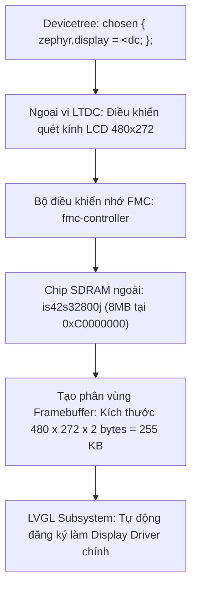
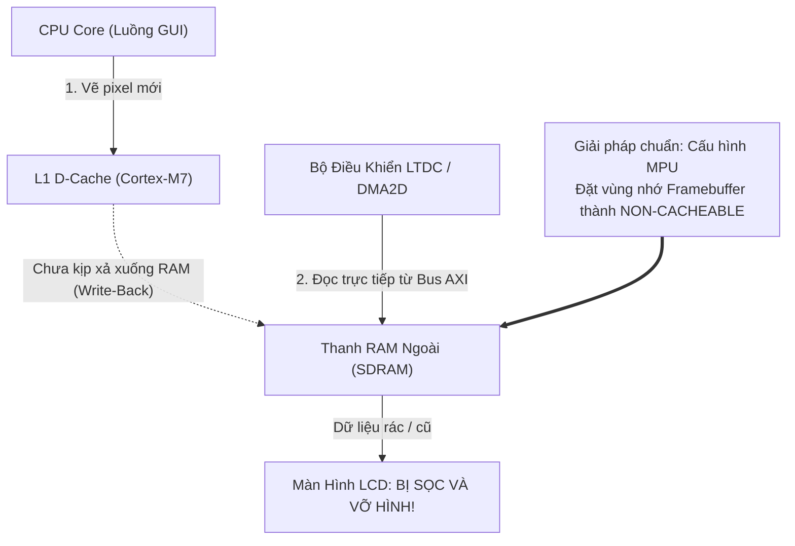

# 🏆 [NGÀY 9] LÀM CHỦ ZEPHYR DISPLAY & LVGL: KIẾN TRÚC BỘ NHỚ ĐỒ HỌA, D-CACHE COHERENCY & ĐA LUỒNG AN TOÀN
## Chuyên khảo Kỹ thuật: FMC SDRAM Binding, Zero-Copy Display Pipeline, Dirty Area Invalidation & Thread-Safety

> **Mục tiêu chuyên sâu:** Nâng tầm từ việc vẽ đồ họa đơn giản sang làm chủ **KIẾN TRÚC HIỂN THỊ ĐỒ HỌA NÂNG CAO** của Zephyr Display Subsystem và thư viện đồ họa LVGL (Light and Versatile Graphics Library) trên STM32F746:
> 1. **Chuỗi Ràng Buộc Phần Cứng Devicetree:** Cách Zephyr tự động kết nối chuỗi mắt xích ngoại vi lúc boot: Bộ điều khiển bộ nhớ ngoài FMC -> Chip SDRAM 8MB -> Bộ quét màn hình LTDC -> Thư viện đồ họa LVGL thông qua `chosen { zephyr,display = &ltdc; };`.
> 2. **Vấn Nạn Tính Nhất Quán Bộ Nhớ D-Cache (D-Cache Coherency):** Tại sao Cortex-M7 thường xuyên bị sọc màn hình hoặc vỡ hình khi dùng DMA2D/LTDC đọc RAM ngoài? Cách cấu hình MPU Non-cacheable và xả Cache đúng kỹ thuật.
> 3. **Cơ Chế Render Cục Bộ (Dirty Area Invalidation):** Cách LVGL tối ưu hóa băng thông bus AXI bằng việc chỉ vẽ lại các pixel có sự thay đổi thay vì quét lại toàn bộ khung hình 480x272.
> 4. **Nguyên Tắc Sống Còn Thread-Safety:** Giải phẫu lý do LVGL không an toàn đa luồng (Non-thread-safe) và cách thiết kế mô hình Actor Pattern / Mutex bảo vệ an toàn khi luồng CAN cập nhật tốc độ động cơ lên táp-lô.
> 5. **Cách Sử Dụng Thực Chiến & Bộ Câu Hỏi Phỏng Vấn:** Mẫu cấu hình Kconfig/Overlay chuẩn, mẫu luồng render tối ưu và bộ câu hỏi tuyển dụng kỹ sư đồ họa nhúng.

---

```text
┌─────────────────────────────────────────────────────────────────────────────────────────────────┐
│                    CHUỖI TRUYỀN DẪN ĐỒ HỌA (GRAPHICS PIPELINE) TRONG ZEPHYR                     │
├─────────────────────────────────────────────────────────────────────────────────────────────────┤
│ [CAN Worker Thread] ──>  k_msgq_put() ──>  [GUI Model Queue]                                     │
│                                                   │                                             │
│                                                   ▼                                             │
│ [GUI Thread]        ──>  k_msgq_get() ──>  Cập nhật giá trị LVGL (Ví dụ: lv_arc_set_value)      │
│                                                   │                                             │
│                                                   ▼ (Đánh dấu Dirty Rectangle)                  │
│ [LVGL Engine]       ──>  Render pixel mới vào Virtual Display Buffer (VDB trong Internal SRAM)   │
│                                                   │                                             │
│                                                   ▼ (Tự động kích hoạt Flush Callback)          │
│ [Zephyr Display]    ──>  Kích hoạt Chrom-ART DMA2D (Chuyển khối bộ nhớ siêu tốc 0% CPU)         │
│                                                   │                                             │
│                                                   ▼                                             │
│ [FMC SDRAM]         ──>  Ghi đè vào Framebuffer trên chip SDRAM ngoài (0xC0000000)              │
│                                                   │ (Cấu hình MPU Non-cacheable chống sọc hình) │
│                                                   ▼                                             │
│ [Phần Cứng LTDC]    ──>  Quét tín hiệu Parallel RGB (HSYNC, VSYNC, DOTCLK) ra kính LCD 480x272  │
└─────────────────────────────────────────────────────────────────────────────────────────────────┘
```

---

# PHẦN 1: TƯ DUY KIẾN TRÚC — ZEPHYR DISPLAY SUBSYSTEM

### 1.1. Bảng Đối Chiếu: Tự Tích Hợp Đồ Họa Truyền Thống vs Zephyr Display Subsystem

| Khía Cạnh Kỹ Thuật | 1. Tự Ghép Đồ Họa Thủ Công (Bare-Metal / FreeRTOS) | 2. Zephyr Display Subsystem |
| :--- | :--- | :--- |
| **Khởi tạo SDRAM & LTDC** | Phải tự viết hàm nạp chuỗi lệnh JEDEC cho SDRAM, tự tính toán chu kỳ làm tươi (Refresh Rate), tự ghi hàng chục thanh ghi LTDC. | Zephyr tự động kích hoạt tuần tự: Driver FMC -> SDRAM -> LTDC ngay trước khi hàm `main()` chạy qua cờ Kconfig. |
| **Hàm Flush màn hình** | Phải tự viết hàm callback `disp_drv.flush_cb`, tự lập trình thanh ghi DMA2D Chrom-ART hoặc dùng `memcpy` nghẽn CPU. | **Tự động 100%:** Zephyr cung cấp sẵn driver keo liên kết (Glue Layer). LVGL vừa vẽ xong, Zephyr tự gọi DMA2D đẩy pixel ra Framebuffer. |
| **Bộ đếm thời gian (lv_tick)** | Phải tự cấu hình 1 Software Timer hoặc móc ngắt SysTick để gọi hàm `lv_tick_inc()`. Quên là màn hình bị đơ animation. | **Tự động tích hợp:** Zephyr tự động móc nhịp System Uptime vào LVGL, đảm bảo chuyển động kim đồng hồ mượt mà 60 FPS chuẩn xác. |
| **Thời gian tích hợp (Time-to-Market)**| Mất từ 2 đến 3 ngày để ghép nối chạy thử các tầng phần cứng. | Chỉ cần bật `CONFIG_LVGL=y` trong `prj.conf`. Vào code là tạo đối tượng đồ họa giao diện được ngay! |

---

# PHẦN 2: CƠ CHẾ NỘI TẠI (UNDER THE HOOD)

---

### 2.1. Cơ Chế 1: Chuỗi Ràng Buộc Phần Cứng (Hardware Dependency Chain)

Để một hệ thống đồ họa hiển thị được lên kính LCD của bo mạch STM32F746-Discovery, Zephyr quản lý một chuỗi phụ thuộc phần cứng nghiêm ngặt:



* **Ý nghĩa của thuộc tính `chosen`:**
  * Trong tệp cấu hình Devicetree, câu lệnh `zephyr,display = &ltdc;` đóng vai trò là "con trỏ định tuyến". Nó thông báo cho toàn bộ hệ điều hành Zephyr và thư viện LVGL biết rằng: Mọi thao tác xuất hình ảnh của ứng dụng sẽ được chuyển tới bộ điều khiển LTDC của STM32F7.

---

### 2.2. Cơ Chế 2: Vấn Nạn D-Cache Coherency Trên ARM Cortex-M7

Đây là lỗi kinh điển nhất trên dòng vi điều khiển hiệu năng cao Cortex-M7 có trang bị bộ nhớ đệm L1 Cache:
* **Hiện tượng:** Giao diện táp-lô hiển thị các vệt sọc ngang, các khối màu bị vỡ hoặc nhấp nháy ngẫu nhiên khi kim đồng hồ chuyển động.
* **Nguyên nhân sâu xa:**
  1. ARM Cortex-M7 sử dụng bộ nhớ đệm dữ liệu **D-Cache** với chính sách ghi trễ (Write-Back Policy).
  2. Khi CPU (luồng vẽ giao diện) tính toán và vẽ các pixel màu, các pixel này **mới chỉ nằm trong L1 D-Cache mà chưa kịp xả xuống thanh RAM SDRAM vật lý**.
  3. Trong khi đó, phần cứng LTDC và DMA2D lại truy cập trực tiếp vào SDRAM thông qua Bus Matrix để quét tín hiệu ra màn hình. Kết quả là LTDC đọc phải dữ liệu cũ hoặc dữ liệu rác trong SDRAM, dẫn đến việc màn hình bị vỡ hình!



#### Giải pháp kỹ thuật chuẩn mực:
1. **Cách 1 (Tối ưu nhất):** Cấu hình khối bảo vệ bộ nhớ **MPU (Memory Protection Unit)**, chỉ định rõ ràng vùng nhớ chứa Framebuffer (từ địa chỉ `0xC0000000`, kích thước 1MB) là vùng nhớ **`Non-cacheable`** hoặc **`Write-Through`**. Khi đó, CPU ghi pixel nào là dữ liệu được đẩy thẳng xuống SDRAM ngay tức thì.
2. **Cách 2:** Trong hàm flush callback, gọi lệnh xả bộ nhớ đệm: `SCB_CleanDCache_by_Addr((uint32_t *)buf, size)` trước khi khởi động DMA2D.

---

### 2.3. Cơ Chế 3: Dirty Area Invalidation & Double Buffering

Màn hình táp-lô có độ phân giải 480x272 pixel, định dạng màu RGB565 (16-bit = 2 bytes/pixel):
* Toàn bộ 1 khung hình tiêu tốn: `480 * 272 * 2 = 261,120 bytes` (khoảng 255 KB).
* Nếu mỗi lần kim đồng hồ nhích 1 độ mà CPU phải vẽ lại toàn bộ 255 KB dữ liệu rồi truyền qua bus FMC, băng thông của bus sẽ bị nghẽn 100%, làm sụt giảm tốc độ khung hình và khiến các tác vụ khác (như nhận gói tin CAN) bị trễ nhịp.

#### Giải thuật tối ưu hóa của LVGL:
1. **Dirty Rectangle Tracking:** LVGL theo dõi tọa độ các đối tượng đồ họa. Khi bạn gọi `lv_arc_set_value(speed_arc, 80)`, LVGL tính toán chính xác hình chữ nhật nhỏ nhất bao quanh phần kim vừa thay đổi (ví dụ một ô nhỏ 30 x 40 pixel), gọi là **Dirty Area**.
2. **Virtual Display Buffer (VDB):** LVGL chỉ tính toán và render vùng Dirty Area này vào một bộ đệm nhỏ nằm trong bộ nhớ RAM nội (SRAM1) của vi điều khiển.
3. **Hardware Blitting (DMA2D):** Zephyr Display Driver kích hoạt bộ tăng tốc đồ họa Chrom-ART (DMA2D) để copy đúng khối chữ nhật nhỏ này dán đè lên Framebuffer chính trên SDRAM. **Tiết kiệm đến 90% băng thông bus hệ thống!**

---

### 2.4. Cơ Chế 4: Nguyên Tắc Sống Còn — LVGL Non-Thread-Safe

Rất nhiều kỹ sư mới làm quen với RTOS thường mắc sai lầm nghiêm trọng sau: **Nhận được gói tin CAN trong luồng `can_worker` là lập tức gọi hàm `lv_arc_set_value()` để cập nhật táp-lô!**

```c
/* SAI LẦM CHẾT NGƯỜI: GÂY CRASH HOẶC HARDFAULT NGẪU NHIÊN! */
void can_worker_entry(...) {
    while(1) {
        k_msgq_get(&can_rx_msgq, &frame, K_FOREVER);
        uint16_t speed = decode_speed(&frame);
        
        /* NGUY HIỂM: Gọi hàm LVGL trực tiếp từ luồng CAN! */
        lv_arc_set_value(speed_arc, speed); 
    }
}
```

* **Tại sao lại gây lỗi?** Thư viện LVGL quản lý các đối tượng giao diện (Widget) bằng cấu trúc danh sách liên kết động (Linked List). Hàm `lv_timer_handler()` của luồng GUI đang duyệt danh sách để vẽ dở chừng, nếu bị luồng CAN có priority cao hơn chen ngang và thay đổi node danh sách, con trỏ sẽ bị hỏng (Broken Pointer), dẫn đến lỗi **`MemManage Fault`** hoặc sập hệ thống ngay lập tức.

#### 2 Mô hình kiến trúc giải quyết triệt để:
1. **Mô hình 1: Bảo vệ bằng Mutex (`k_mutex`):**
   Mọi thao tác gọi hàm của LVGL ở bất kỳ luồng nào đều phải nằm giữa cặp khóa Mutex:
   ```c
   k_mutex_lock(&gui_mutex, K_FOREVER);
   lv_arc_set_value(speed_arc, speed);
   k_mutex_unlock(&gui_mutex);
   ```
2. **Mô hình 2: Mô hình Hàng Đợi (Actor Pattern - Khuyên Dùng):**
   Luồng CAN **không bao giờ đụng vào LVGL**. Khi có dữ liệu mới, luồng CAN chỉ đóng gói thành tin nhắn và ném vào hàng đợi `gui_msgq`. Luồng GUI độc quyền đọc hàng đợi này và tự mình cập nhật giao diện.

---

# PHẦN 3: CÁCH SỬ DỤNG THỰC CHIẾN (MÃ NGUỒN MODULAR HOÀN CHỈNH TỪNG FILE)

Để tích hợp thư viện đồ họa LVGL trên nền tảng phần cứng STM32F746-Discovery, mã nguồn được phân định thành **các tệp thành phần hoàn chỉnh, có đầu có đuôi rõ ràng**:

---

### 3.0. Tệp Điều Phối Biên Dịch [ File: `CMakeLists.txt` ]
```cmake
cmake_minimum_required(VERSION 3.20.0)
find_package(Zephyr REQUIRED HINTS $ENV{ZEPHYR_BASE})
project(automotive_gui_cluster)

# Khai báo liên kết file C logic hiển thị táp-lô và hàm main
target_sources(app PRIVATE 
    src/main.c 
    src/gui_cluster.c
)
```

---

### 3.1. Tệp Cấu Hình Tính Năng [ File: `prj.conf` ]
```properties
# 1. Bật hệ thống điều khiển bộ nhớ ngoài FMC và chip SDRAM 8MB
CONFIG_MEMC=y
CONFIG_MEMC_STM32=y
CONFIG_MEMC_STM32_SDRAM=y

# 2. Bật bộ quét màn hình LTDC Display Driver
CONFIG_DISPLAY=y
CONFIG_STM32_LTDC=y

# 3. Kích hoạt thư viện đồ họa LVGL phiên bản 16-bit màu (RGB565)
CONFIG_LVGL=y
CONFIG_LV_COLOR_DEPTH_16=y
CONFIG_LV_COLOR_16_SWAP=n

# 4. Cấp phát bộ nhớ động nội bộ cho các Widget giao diện táp-lô (32 KB)
CONFIG_LV_Z_MEM_POOL_SIZE=32768

# 5. Cấu hình kích thước Virtual Display Buffer (VDB) bằng 1/10 màn hình
CONFIG_LV_Z_VDB_SIZE=10
CONFIG_LV_Z_DOUBLE_VDB=y

# 6. Kích hoạt hệ thống ghi log và bảo vệ ngăn xếp đa luồng
CONFIG_LOG=y
CONFIG_MPU_STACK_GUARD=y
CONFIG_THREAD_NAME=y
```

---

### 3.2. Tệp Định Nghĩa Phần Cứng [ File: `app.overlay` ]
```dts
/ {
    chosen {
        /* Định tuyến toàn bộ hiển thị đồ họa của Zephyr sang bộ điều khiển LTDC */
        zephyr,display = &ltdc;
    };
};

/* 1. Kích hoạt bộ điều khiển bộ nhớ ngoài FMC và chip SDRAM */
&fmc {
    status = "okay";
    pinctrl-0 = <&fmc_sdclk_pg8 &fmc_sdnwe_pc0 &fmc_sdnras_pf11 &fmc_sdncas_pg15>;
    pinctrl-names = "default";

    sdram {
        status = "okay";
        power-up-delay = <100>;
        num-auto-refresh = <8>;
        mode-register = <0x220>;
        refresh-rate = <64>;

        /* Chip SDRAM IS42S32800J: 8MB tại địa chỉ cơ sở 0xC0000000 */
        bank@0 {
            reg = <0>;
            st,sdram-control = <0x00001800>;
            st,sdram-timing = <0x000001FF>;
        };
    };
};

/* 2. Cấu hình bộ quét hiển thị LTDC cho màn hình LCD 480x272 RK043FN48H */
&ltdc {
    status = "okay";
    pinctrl-0 = <&ltdc_r0_pi15 &ltdc_g0_pj7 &ltdc_b0_pe4 &ltdc_clk_pi14>;
    pinctrl-names = "default";

    /* Cấu hình phân giải và chu kỳ định thời quét pixel */
    display-timings {
        compatible = "zephyr,display-timings";
        timing_480_272: 480x272 {
            hactive = <480>;
            vactive = <272>;
            hsync-len = <41>;
            hback-porch = <13>;
            hfront-porch = <32>;
            vsync-len = <10>;
            vback-porch = <2>;
            vfront-porch = <2>;
            pixelclk-active = <1>;
        };
    };
};
```

---

### 3.3. Tệp Khai Báo Giao Diện Táp-Lô [ File: `src/gui_cluster.h` ]
```c
#ifndef GUI_CLUSTER_H_
#define GUI_CLUSTER_H_

#include <zephyr/kernel.h>
#include <stdint.h>

/* Cấu trúc dữ liệu trạng thái xe hơi dùng chung giữa luồng CAN và luồng GUI */
struct dashboard_telemetry {
    uint16_t engine_rpm;    /* Vòng tua máy (0 - 8000 RPM) */
    uint8_t  vehicle_speed; /* Tốc độ xe (0 - 240 km/h) */
    int8_t   coolant_temp;  /* Nhiệt độ nước làm mát (-40 đến +125 độ C) */
    uint8_t  battery_volt;  /* Điện áp ắc quy (nhân 10: 124 = 12.4V) */
};

/**
 * @brief Khởi tạo giao diện táp-lô ô tô (Kim đồng hồ, thanh đo nhiệt độ)
 * @return 0 nếu thành công, mã lỗi âm nếu thất bại
 */
int gui_cluster_init(void);

/**
 * @brief Đẩy dữ liệu đo lường mới vào hàng đợi GUI (Thread-Safe)
 * @param data Con trỏ chứa dữ liệu xe hơi vừa bóc tách từ mạng CAN
 * @return 0 nếu nạp vào hàng đợi thành công
 */
int gui_cluster_update_telemetry(const struct dashboard_telemetry *data);

#endif /* GUI_CLUSTER_H_ */
```

---

### 3.4. Tệp Hiện Thực Hóa Logic Giao Diện Đa Luồng [ File: `src/gui_cluster.c` ]
```c
#include "gui_cluster.h"
#include <zephyr/drivers/display.h>
#include <lvgl.h>
#include <zephyr/logging/log.h>

LOG_MODULE_REGISTER(gui_cluster, LOG_LEVEL_INF);

/* 1. Hàng đợi tin nhắn độc quyền dành riêng cho luồng GUI (Chứa tối đa 10 gói tin) */
K_MSGQ_DEFINE(gui_msgq, sizeof(struct dashboard_telemetry), 10, 4);

/* Khai báo luồng GUI chuyên biệt */
#define GUI_STACK_SIZE 4096
#define GUI_PRIORITY   6

/* Các con trỏ đối tượng giao diện đồ họa LVGL */
static lv_obj_t *s_speed_arc;
static lv_obj_t *s_speed_label;
static lv_obj_t *s_rpm_bar;

/* 2. Hàm vẽ và bố trí các Widget trên màn hình táp-lô */
static void build_dashboard_ui(void)
{
    lv_obj_t *scr = lv_scr_act();
    lv_obj_set_style_bg_color(scr, lv_color_hex(0x10141D), 0); /* Nền xanh đen ô tô */

    /* Đồng hồ Arc hiển thị tốc độ xe (0 - 240 km/h) */
    s_speed_arc = lv_arc_create(scr);
    lv_obj_set_size(s_speed_arc, 160, 160);
    lv_obj_center(s_speed_arc);
    lv_arc_set_range(s_speed_arc, 0, 240);
    lv_arc_set_value(s_speed_arc, 0);
    lv_arc_set_bg_angles(s_speed_arc, 135, 45);

    /* Nhãn chữ hiển thị số km/h */
    s_speed_label = lv_label_create(s_speed_arc);
    lv_label_set_text(s_speed_label, "0 km/h");
    lv_obj_center(s_speed_label);

    /* Thanh Bar hiển thị vòng tua động cơ (0 - 8000 RPM) */
    s_rpm_bar = lv_bar_create(scr);
    lv_obj_set_size(s_rpm_bar, 300, 15);
    lv_obj_align(s_rpm_bar, LV_ALIGN_BOTTOM_MID, 0, -20);
    lv_bar_set_range(s_rpm_bar, 0, 8000);
    lv_bar_set_value(s_rpm_bar, 800, LV_ANIM_OFF);
}

/* 3. Hàm thực thi của luồng GUI: Quét hàng đợi và gọi lv_timer_handler() */
void gui_thread_entry(void *p1, void *p2, void *p3)
{
    ARG_UNUSED(p1); ARG_UNUSED(p2); ARG_UNUSED(p3);
    struct dashboard_telemetry rx_data;

    const struct device *display_dev = DEVICE_DT_GET(DT_CHOSEN(zephyr_display));
    if (!device_is_ready(display_dev)) {
        LOG_ERR("Lỗi: Ngoại vi LTDC Display chưa sẵn sàng!");
        return;
    }

    /* Xây dựng giao diện táp-lô lần đầu */
    build_dashboard_ui();
    LOG_INF("Đã khởi tạo xong giao diện táp-lô Digital Instrument Cluster!");

    char text_buf[16];
    while (1) {
        /* BƯỚC AN TOÀN ĐA LUỒNG: Luồng GUI chủ động lấy dữ liệu từ hàng đợi tin nhắn */
        if (k_msgq_get(&gui_msgq, &rx_data, K_NO_WAIT) == 0) {
            /* Cập nhật giá trị vào các widget đồ họa */
            lv_arc_set_value(s_speed_arc, rx_data.vehicle_speed);
            snprintf(text_buf, sizeof(text_buf), "%u km/h", rx_data.vehicle_speed);
            lv_label_set_text(s_speed_label, text_buf);

            lv_bar_set_value(s_rpm_bar, rx_data.engine_rpm, LV_ANIM_ON);
        }

        /* Gọi hàm điều phối chu kỳ render của LVGL (Xử lý Dirty Area Invalidation) */
        lv_timer_handler();

        /* Ngủ 10ms để duy trì tần số quét 60 FPS và nhường CPU cho luồng CAN */
        k_msleep(10);
    }
}

K_THREAD_DEFINE(gui_tid, GUI_STACK_SIZE,
                gui_thread_entry, NULL, NULL, NULL,
                GUI_PRIORITY, 0, 0);

int gui_cluster_update_telemetry(const struct dashboard_telemetry *data)
{
    /* Đẩy dữ liệu vào hàng đợi k_msgq, không bao giờ gọi trực tiếp hàm LVGL */
    return k_msgq_put(&gui_msgq, data, K_NO_WAIT);
}
```

---

### 3.5. Tệp Khởi Động Ứng Dụng Chính [ File: `src/main.c` ]
```c
#include <zephyr/kernel.h>
#include <zephyr/logging/log.h>
#include "gui_cluster.h"

LOG_MODULE_REGISTER(main_app, LOG_LEVEL_INF);

int main(void)
{
    LOG_INF("=================================================");
    LOG_INF("   KHỞI ĐỘNG HỆ THỐNG HIỂN THỊ TÁP-LÔ ĐỒ HỌA     ");
    LOG_INF("=================================================");

    /* Giả lập gửi dữ liệu khởi động lên táp-lô */
    struct dashboard_telemetry init_telemetry = {
        .engine_rpm = 1000,
        .vehicle_speed = 0,
        .coolant_temp = 85,
        .battery_volt = 126
    };
    gui_cluster_update_telemetry(&init_telemetry);

    LOG_INF("Hệ thống táp-lô hiển thị 60 FPS đang vận hành ổn định!");
    return 0;
}
```

---

# PHẦN 4: BỘ CÂU HỎI PHỎNG VẤN CHUYÊN SÂU (INTERVIEW DEEP-DIVE)

### ❓ Câu 1: "Thư viện đồ họa LVGL có thread-safe không? Nếu bạn có một luồng nhận dữ liệu CAN tốc độ cao và một luồng vẽ màn hình, bạn xử lý việc cập nhật dữ liệu hiển thị như thế nào để không bị crash hệ điều hành?"
* **Trả lời chuẩn:**
  * LVGL hoàn toàn **không thread-safe**. Các cấu trúc dữ liệu của nó không được bảo vệ nội bộ bằng mutex để tối ưu hóa hiệu năng và dung lượng mã nguồn.
  * Để cập nhật an toàn từ luồng CAN, em áp dụng **Mô hình Hàng đợi Tin nhắn (Message Queue / Actor Pattern)**: Luồng CAN khi giải mã xong dữ liệu sẽ đóng gói giá trị tốc độ vào `k_msgq`. Luồng GUI trong chu kỳ lặp sẽ kiểm tra `k_msgq_get` với thời gian chờ 0. Nếu có dữ liệu mới, chính luồng GUI sẽ thực hiện gọi hàm `lv_arc_set_value()`. Cách này loại bỏ 100% hiện tượng tranh chấp tài nguyên (Race Condition) và triệt tiêu nguy cơ Priority Inversion mà không cần lạm dụng Mutex.

### ❓ Câu 2: "Tại sao trên vi điều khiển ARM Cortex-M7, việc hiển thị đồ họa qua DMA/LTDC thường gặp lỗi sọc màn hình hoặc nhiễu pixel? Làm thế nào để xử lý triệt để?"
* **Trả lời chuẩn:**
  * Nguyên nhân do tính chất **bất đồng bộ giữa bộ nhớ đệm L1 D-Cache của CPU và phần cứng quét màn hình LTDC**: Khi CPU vẽ các pixel, dữ liệu nằm lại trong D-Cache (do chính sách Write-Back) mà chưa được xả xuống chip RAM SDRAM ngoài. Khi LTDC đọc trực tiếp từ SDRAM, nó đọc phải dữ liệu rác cũ khiến màn hình bị sọc.
  * Giải pháp triệt để: Em sử dụng khối phần cứng **MPU (Memory Protection Unit)** để cấu hình toàn bộ phân vùng nhớ của Framebuffer trên SDRAM thành chế độ **`Non-cacheable`** (hoặc `Write-Through`). Bằng cách này, mọi pixel CPU ghi ra sẽ được nạp thẳng xuống RAM ngoài ngay lập tức, đảm bảo tính nhất quán bộ nhớ 100% giữa CPU và bộ quét màn hình LTDC.

### ❓ Câu 3: "Sự khác biệt giữa việc cấp phát Full Framebuffer và Virtual Display Buffer (VDB / Partial Buffer) trong LVGL là gì?"
* **Trả lời chuẩn:**
  * **Full Framebuffer:** Cần một vùng nhớ RAM đủ lớn để chứa trọn vẹn toàn bộ số điểm ảnh của màn hình (ví dụ màn 480x272 màu 16-bit tốn khoảng 255 KB cho 1 buffer, 510 KB cho double buffer). Bắt buộc phải có RAM ngoài (SDRAM).
  * **Virtual Display Buffer (Partial Buffer):** Chỉ cấp phát một vùng đệm nhỏ bằng 1/10 hoặc 1/20 màn hình (ví dụ chỉ tốn 10 KB đến 20 KB trong RAM nội SRAM). LVGL sẽ chia màn hình thành từng lát nhỏ để render lần lượt rồi dùng DMA đẩy ra màn hình. Giải pháp này giúp các vi điều khiển có dung lượng RAM nhỏ vẫn có thể chạy được giao diện đồ họa mượt mà.

---

### 🎙️ KỊCH BẢN TRẢ LỜI PHỎNG VẤN 60 GIÂY VỀ ĐỒ HỌA NHÚNG (ELEVATOR PITCH)

> *"Ở tầng giao diện người dùng táp-lô, em tích hợp thư viện **LVGL** trên nền tảng **Zephyr Display Subsystem** kết hợp bộ nhớ ngoài FMC SDRAM và bộ quét LTDC của STM32F746.  
> Em giải quyết bài toán hiệu năng hiển thị bằng cơ chế **Dirty Area Invalidation**, chỉ vẽ lại vùng có sự thay đổi giá trị và tận dụng bộ tăng tốc đồ họa Chrom-ART (DMA2D) để sao chép khối pixel siêu tốc mà không làm nghẽn CPU.  
> Nhận thức sâu sắc về đặc tính phần cứng Cortex-M7, em cấu hình phân vùng **MPU Non-cacheable** cho Framebuffer trên SDRAM để hóa giải hoàn toàn lỗi bất đồng bộ D-Cache gây sọc màn hình, đồng thời thiết kế mô hình truyền thông điệp **Message Queue** an toàn đa luồng giữa luồng CAN thời gian thực và luồng đồ họa, đảm bảo giao diện đạt chuẩn mượt mà 60 FPS mà không có nguy cơ bị sập hệ thống."*
