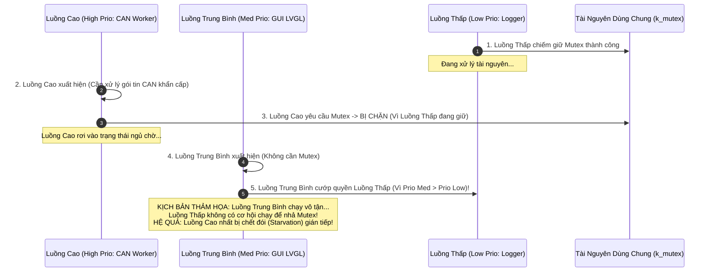

# 🏆 [NGÀY 10] LÀM CHỦ ZEPHYR MULTI-THREADING: CƠ CHẾ IPC, HIỂM HỌA PRIORITY INVERSION & INTERACTIVE SHELL CLI
## Chuyên khảo Kỹ thuật: Message Queues vs FIFOs, Priority Inheritance, System Workqueues & Runtime Thread Profiling

> **Mục tiêu chuyên sâu:** Nâng tầm tư duy thiết kế phần mềm nhúng đa luồng (Multi-Threaded Architecture) cho hệ thống CAN Gateway trên STM32F746:
> 1. **Bản Chất Cơ Chế Giao Tiếp Liên Luồng (IPC Mechanics):** So sánh trực diện cơ chế Copy-by-Value của `k_msgq` và cơ chế Chuyển Con Trỏ (Pointer Transfer) của `k_fifo`/`k_lifo`. Khi nào nên dùng giải pháp nào để đạt hiệu năng cao nhất mà không bị lỗi bộ nhớ?
> 2. **Hiểm Họa Đảo Ngược Mức Ưu Tiên (Priority Inversion) & Giải Thuật Priority Inheritance:** Giải phẫu kịch bản tàu vũ trụ sao Hỏa Mars Pathfinder bị treo năm 1997 và cách khối nhân Zephyr tự động nâng mức ưu tiên của `k_mutex` để cứu vãn hệ thống. Tại sao tuyệt đối cấm dùng Binary Semaphore (`k_sem`) làm khóa bảo vệ tài nguyên?
> 3. **Tư Duy Kiến Trúc: Dedicated Thread vs System Workqueue (`k_work`):** Khi nào một tác vụ xứng đáng có riêng một Thread? Khi nào nên đẩy vào System Workqueue để tiết kiệm hàng chục KB ngăn xếp RAM?
> 4. **Chẩn Đoán Thời Gian Thực Bằng Zephyr Shell & Thread Analyzer:** Cơ chế quét đỉnh ngăn xếp (Stack High Watermark) để phát hiện nguy cơ tràn stack trước khi hệ thống bị sập và cách tích hợp giao diện dòng lệnh chẩn đoán từ xa qua UART Console.
> 5. **Cách Sử Dụng Thực Chiến & Bộ Câu Hỏi Phỏng Vấn:** Mẫu cấu hình Kconfig, mô hình Producer-Consumer chuẩn hóa và bộ câu hỏi sát hạch kỹ năng RTOS.

---

```text
┌─────────────────────────────────────────────────────────────────────────────────────────────────┐
│                      KIẾN TRÚC GIAO TIẾP ĐA LUỒNG & CHẨN ĐOÁN TRONG ZEPHYR                       │
├─────────────────────────────────────────────────────────────────────────────────────────────────┤
│                                 [CÁC NGUỒN PHÁT - PRODUCERS]                                    │
│   • Ngắt CAN RX ISR       ──> k_msgq_put(K_NO_WAIT)   ──>  [CAN Frame Queue (Copy Ring Buffer)] │
│   • Cảm Biến / Diagnostics ──> k_work_submit()         ──>  [System Workqueue (Tiết kiệm Stack)] │
├─────────────────────────────────────────────────────────────────────────────────────────────────┤
│                                   [KHÓA BẢO VỆ TÀI NGUYÊN DÙNG CHUNG]                           │
│   • Biến Trạng Thái Xe    ──> k_mutex_lock/unlock      ──>  Bật Tự Động Priority Inheritance    │
├─────────────────────────────────────────────────────────────────────────────────────────────────┤
│                                 [CÁC TÁC VỤ TIÊU THỤ - CONSUMERS]                               │
│   • Luồng CAN Worker (Prio 5) : Đọc gói tin, giải mã tín hiệu DBC ô tô                         │
│   • Luồng GUI Render (Prio 6) : Cập nhật kim đồng hồ và hiển thị táp-lô                        │
│   • Luồng Shell CLI  (Prio 8) : Nhận lệnh từ ST-Link Console, in báo cáo Thread Analyzer       │
└─────────────────────────────────────────────────────────────────────────────────────────────────┘
```

---

# PHẦN 1: TƯ DUY KIẾN TRÚC — BẢN CHẤT CÁC CƠ CHẾ IPC TRONG ZEPHYR

Hệ điều hành Zephyr cung cấp một bộ công cụ giao tiếp liên luồng (IPC) cực kỳ phong phú. Một kỹ sư giỏi phải biết chính xác **khi nào nên dùng công cụ nào**:

### 1.1. Bảng Phân Định Bản Chất Kỹ Thuật Giữa Các Cơ Chế IPC

| Cơ Chế IPC | Bản Chất Truyền Dữ Liệu | Chi Phí Bộ Nhớ & Tốc Độ | Kịch Bản Ứng Dụng Chuẩn Mực |
| :--- | :--- | :--- | :--- |
| **`k_msgq` (Message Queue)** | **Copy theo giá trị (`memcpy`):** Dữ liệu được sao chép trực tiếp vào Ring Buffer của hàng đợi. | Tốn RAM chứa bộ đệm tĩnh; an toàn 100% không lo lỗi con trỏ treo (Dangling Pointer). | Dữ liệu có kích thước nhỏ và cố định (< 32 bytes) như khung tin CAN, tọa độ cảm biến, bản tin sự kiện. |
| **`k_fifo` / `k_lifo`** | **Chuyển con trỏ (Pointer Transfer):** Chỉ truyền địa chỉ con trỏ của gói tin. | Siêu tốc (O(1)), không tốn chu kỳ copy; nhưng bắt buộc dữ liệu phải nằm trong Heap hoặc Memory Slab. | Dữ liệu có kích thước lớn (như gói tin Ethernet TCP/IP, Framebuffer ảnh, âm thanh). |
| **`k_pipe`** | **Dòng byte liên tục (Byte Stream):** Tương tự ống dẫn Pipe của Unix. | Hỗ trợ đọc/ghi từng phần; có thể đọc ít hơn hoặc nhiều hơn kích thước gói gửi. | Luồng truyền nhận dữ liệu nối tiếp không cố định độ dài (như Modem GSM/LTE, luồng UART stream). |
| **`k_sem` (Semaphore)** | **Cờ hiệu đếm / Đồng bộ sự kiện (Signaling):** Không truyền dữ liệu. | Tiêu thụ cực ít RAM (chỉ 1 biến đếm và 1 danh sách chờ). | Báo hiệu hoàn tất tác vụ từ ISR sang Thread, hoặc giới hạn số lượng tài nguyên truy cập đồng thời. |
| **`k_mutex` (Mutex)** | **Khóa độc quyền (Mutual Exclusion):** Có tính năng gắn quyền sở hữu (Ownership). | Tích hợp thuật toán **Priority Inheritance** tự động nâng mức ưu tiên. | Bảo vệ cấu hình phần cứng dùng chung, biến trạng thái xe hoặc bộ nhớ đồ họa LVGL. |

---

### 1.2. Tư Duy Kiến Trúc: Khi Nào Dùng Dedicated Thread vs System Workqueue?

Rất nhiều người lạm dụng việc tạo Thread: Cứ có một công việc là gọi `K_THREAD_DEFINE` tạo một luồng riêng.
* **Hậu quả:** Mỗi Thread trên ARM Cortex-M7 bắt buộc phải có một vùng nhớ ngăn xếp riêng (tối thiểu 1 KB đến 2 KB). Nếu bạn tạo 10 luồng, bạn đã lãng phí từ 10 KB đến 20 KB RAM chỉ để làm Stack!
* **Giải pháp chuẩn của Zephyr: System Workqueue (`k_work`):**
  * Zephyr có sẵn một luồng chạy nền gọi là **System Workqueue** (chạy ở mức ưu tiên `CONFIG_SYSTEM_WORKQUEUE_PRIORITY`).
  * Với các tác vụ **chạy nhanh, không thường xuyên và không yêu cầu vòng lặp vô tận** (ví dụ: định kỳ 5 giây đọc điện áp pin 1 lần, hoặc nhấp nháy đèn LED báo lỗi): Thay vì tạo một Thread riêng tốn 2 KB Stack, bạn chỉ cần tạo một cấu trúc `struct k_work` và gọi `k_work_submit(&my_work)`.
  * Luồng System Workqueue sẽ đứng ra mượn Stack của chính nó để chạy hàm của bạn rồi nhường quyền cho tác vụ khác. **Tiết kiệm tới 90% dung lượng RAM hệ thống!**

---

# PHẦN 2: CƠ CHẾ NỘI TẠI (UNDER THE HOOD)

---

### 2.1. Cơ Chế 1: Hiểm Họa Priority Inversion & Giải Thuật Priority Inheritance

Đây là bài học kinh điển nhất trong ngành kỹ thuật thời gian thực (Sự cố tàu thám hiểm sao Hỏa Mars Pathfinder năm 1997 suýt bị phá hủy hoàn toàn do lỗi này):



#### Cách Zephyr Hóa Giải Bằng Priority Inheritance:
Khi bạn sử dụng **`k_mutex`**:
1. Ngay khi Luồng Cao cố gắng lấy Mutex mà Luồng Thấp đang nắm giữ, bộ lập lịch Zephyr phát hiện ra sự xung đột.
2. Kernel **lập tức nâng tạm thời mức ưu tiên của Luồng Thấp lên ngang bằng mức ưu tiên của Luồng Cao**.
3. Lúc này, Luồng Trung Bình (Med) **không thể chen ngang** được nữa!
4. Luồng Thấp nhanh chóng hoàn thành đoạn mã tới hạn và gọi `k_mutex_unlock()`.
5. Ngay khi nhả khóa, Kernel hạ mức ưu tiên của Luồng Thấp về lại như cũ, đồng thời trao ngay quyền thực thi cho Luồng Cao. **Hệ thống được cứu thoát khỏi thảm họa đứng máy!**

> ⚠️ **CẢNH BÁO SỐNG CÒN:** Binary Semaphore (`k_sem`) **KHÔNG CÓ quyền sở hữu (Ownership)** và **KHÔNG CÓ tính năng Priority Inheritance**. Do đó, **TUYỆT ĐỐI CẤM DÙNG SEMAPHORE ĐỂ LÀM KHÓA BẢO VỆ TÀI NGUYÊN DÙNG CHUNG!**

---

### 2.2. Cơ Chế 2: Giải Phẫu Thao Tác Chép Hàng Đợi Zero-Lock (`k_msgq_put`)

Làm thế nào Zephyr cho phép gọi cùng một hàm `k_msgq_put()` an toàn từ cả trong ngắt ISR lẫn trong thân Thread mà không gây lỗi Assert?

```c
/* Bản chất mã nguồn bên trong nhân Zephyr */
int k_msgq_put(struct k_msgq *msgq, const void *data, k_timeout_t timeout)
{
    k_spinlock_key_t key = k_spin_lock(&msgq->lock);

    /* 1. Nếu hàng đợi còn chỗ trống trong Ring Buffer */
    if (msgq->used_msgs < msgq->max_msgs) {
        /* Sao chép dữ liệu cực nhanh bằng memcpy */
        memcpy(msgq->write_ptr, data, msgq->msg_size);
        msgq->write_ptr += msgq->msg_size;
        msgq->used_msgs++;

        /* 2. Nếu có Thread đang ngủ chờ tin nhắn, đánh thức dậy ngay */
        struct k_thread *pending_thread = z_unpend_first_thread(&msgq->wait_q);
        if (pending_thread != NULL) {
            z_ready_thread(pending_thread);
        }

        k_spin_unlock(&msgq->lock, key);
        return 0;
    }

    /* 3. Nếu hàng đợi đầy và hàm được gọi từ trong NGẮT ISR */
    if (k_is_in_isr()) {
        k_spin_unlock(&msgq->lock, key);
        return -ENOMSG; /* Báo lỗi ngay lập tức, không bao giờ được phép ngủ trong ISR! */
    }

    /* 4. Nếu hàng đợi đầy và gọi từ Thread: Đưa Thread vào danh sách chờ theo timeout */
    ...
}
```

* **Điểm ăn tiền:** Hàm tự động kiểm tra ngữ cảnh bằng `k_is_in_isr()`. Nếu đang ở trong ngắt, nó cấm tiệt việc ngủ chờ, đảm bảo thời gian thực thi trong ngắt luôn là hằng số O(1) chỉ vài chục chu kỳ máy.

---

### 2.3. Cơ Chế 3: Bộ Chẩn Đoán Lúc Runtime (Thread Analyzer & Shell Subsystem)

Thay vì phải cắm mạch nạp JTAG cồng kềnh để debug, Zephyr tích hợp sẵn 2 công cụ chẩn đoán cực mạnh ngay trên cổng UART Console:

1. **Thread Analyzer (`CONFIG_THREAD_ANALYZER=y`):**
   * Khi khởi tạo luồng, Zephyr lấp đầy toàn bộ vùng nhớ ngăn xếp bằng một giá trị mẫu (Canary Pattern: `0xAA`).
   * Khi ứng dụng chạy, con trỏ ngăn xếp `SP` dâng lên hạ xuống sẽ ghi đè dữ liệu lên mẫu số này.
   * Định kỳ, Thread Analyzer quét ngược từ đáy stack lên trên: Vị trí đầu tiên không còn là số `0xAA` chính là **Đỉnh Ngăn Xếp Cao Nhất (High Watermark)** mà luồng từng chạm tới.
   * Báo cáo in ra: Tên luồng, dung lượng Stack cấp phát, dung lượng đã sử dụng cực đại (tính bằng byte và phần trăm %). Nếu một luồng chạm mốc > 80%, bạn biết ngay cần phải tăng Stack trước khi bị dính lỗi MPU Stack Guard.

2. **Zephyr Interactive Shell (`CONFIG_SHELL=y`):**
   * Cung cấp một giao diện dòng lệnh Unix thu nhỏ trên cổng UART: Hỗ trợ phím Tab để tự động hoàn thành lệnh, phím mũi tên lật lại lịch sử lệnh, và phân nhánh cây thư mục lệnh con (`subcommands`).

---

# PHẦN 3: CÁCH SỬ DỤNG THỰC CHIẾN (MÃ NGUỒN MODULAR HOÀN CHỈNH TỪNG FILE)

Để xây dựng hệ thống giao tiếp đa luồng an toàn và tích hợp công cụ chẩn đoán dòng lệnh Shell, mã nguồn được phân định thành **5 tệp thành phần hoàn chỉnh, có đầu có đuôi rõ ràng**:

---

### 3.1. Tệp Cấu Hình Tính Năng [ File: `prj.conf` ]
```properties
# 1. Bật hệ thống dòng lệnh tương tác Zephyr Shell qua UART
CONFIG_SHELL=y
CONFIG_SHELL_BACKENDS=y
CONFIG_SHELL_BACKEND_SERIAL=y
CONFIG_SHELL_PROMPT_UART="can_gateway:~$ "

# 2. Bật công cụ chẩn đoán hiệu năng và mức chiếm dụng ngăn xếp luồng
CONFIG_THREAD_ANALYZER=y
CONFIG_THREAD_ANALYZER_USE_LOG=y
CONFIG_THREAD_ANALYZER_AUTO=y
CONFIG_THREAD_ANALYZER_AUTO_INTERVAL=10

# 3. Kích hoạt thông tin tên và Stack Info cho từng luồng phục vụ gỡ lỗi
CONFIG_THREAD_NAME=y
CONFIG_THREAD_STACK_INFO=y

# 4. Kích hoạt tính năng bảo vệ an toàn MPU
CONFIG_MPU_STACK_GUARD=y
```

---

### 3.2. Tệp Khai Báo Giao Diện IPC [ File: `src/telemetry_ipc.h` ]
```c
#ifndef TELEMETRY_IPC_H_
#define TELEMETRY_IPC_H_

#include <zephyr/kernel.h>
#include <stdint.h>

/* Cấu trúc dữ liệu đo lường xe hơi (Kích thước nhỏ 8 bytes: Tối ưu cho k_msgq) */
struct vehicle_telemetry {
    uint16_t engine_speed_rpm; /* Vòng tua máy (0 - 8000 RPM) */
    uint8_t  vehicle_speed_kmh;/* Tốc độ xe (0 - 240 km/h) */
    int8_t   coolant_temp_c;   /* Nhiệt độ nước làm mát (-40 đến +125 độ C) */
    uint32_t timestamp_ms;     /* Thời điểm nhận được thông điệp */
};

/* Khởi tạo hệ thống IPC và hàng đợi */
void telemetry_ipc_init(void);

/**
 * @brief Luồng CAN (Producer) đẩy dữ liệu đo lường mới vào hàng đợi
 * @param data Con trỏ dữ liệu đo lường
 * @return 0 nếu gửi thành công, -ENOMSG nếu hàng đợi bị đầy
 */
int telemetry_send_from_can(const struct vehicle_telemetry *data);

/**
 * @brief Luồng GUI (Consumer) nhận dữ liệu từ hàng đợi để vẽ táp-lô
 * @param data Con trỏ nhận dữ liệu
 * @param timeout Thời gian chờ đợi tối đa (K_NO_WAIT hoặc K_MSEC)
 * @return 0 nếu lấy được dữ liệu, mã lỗi âm nếu hàng đợi rỗng
 */
int telemetry_receive_for_gui(struct vehicle_telemetry *data, k_timeout_t timeout);

/**
 * @brief Đọc an toàn tổng số khung tin CAN đã nhận (Thread-Safe qua Mutex)
 */
uint32_t telemetry_get_total_frames(void);

#endif /* TELEMETRY_IPC_H_ */
```

---

### 3.3. Tệp Hiện Thực Hóa Logic IPC Đa Luồng [ File: `src/telemetry_ipc.c` ]
```c
#include "telemetry_ipc.h"
#include <zephyr/logging/log.h>

LOG_MODULE_REGISTER(telemetry_ipc, LOG_LEVEL_INF);

/* 1. Khởi tạo hàng đợi tĩnh k_msgq (Chứa tối đa 10 tin nhắn, căn lề 4 bytes) */
K_MSGQ_DEFINE(s_telemetry_msgq, sizeof(struct vehicle_telemetry), 10, 4);

/* 2. Mutex bảo vệ biến thống kê hệ thống (Tự động bật Priority Inheritance) */
K_MUTEX_DEFINE(s_telemetry_mutex);
static uint32_t s_total_frames_received = 0;

void telemetry_ipc_init(void)
{
    k_mutex_lock(&s_telemetry_mutex, K_FOREVER);
    s_total_frames_received = 0;
    k_mutex_unlock(&s_telemetry_mutex);
    LOG_INF("Đã khởi tạo hệ thống hàng đợi tin nhắn và Mutex an toàn!");
}

int telemetry_send_from_can(const struct vehicle_telemetry *data)
{
    /* Cập nhật bộ đếm an toàn đa luồng */
    k_mutex_lock(&s_telemetry_mutex, K_FOREVER);
    s_total_frames_received++;
    k_mutex_unlock(&s_telemetry_mutex);

    /* Đẩy vào hàng đợi bằng cơ chế chép giá trị memcpy (Zero-lock với ISR) */
    return k_msgq_put(&s_telemetry_msgq, data, K_NO_WAIT);
}

int telemetry_receive_for_gui(struct vehicle_telemetry *data, k_timeout_t timeout)
{
    /* Lấy dữ liệu từ hàng đợi */
    return k_msgq_get(&s_telemetry_msgq, data, timeout);
}

uint32_t telemetry_get_total_frames(void)
{
    uint32_t total;
    k_mutex_lock(&s_telemetry_mutex, K_FOREVER);
    total = s_total_frames_received;
    k_mutex_unlock(&s_telemetry_mutex);
    return total;
}
```

---

### 3.4. Tệp Đăng Ký Lệnh Chẩn Đoán Zephyr Shell CLI [ File: `src/cli_shell.c` ]
```c
#include <zephyr/kernel.h>
#include <zephyr/shell/shell.h>
#include "telemetry_ipc.h"

/* 1. Hàm thực thi lệnh 'gateway stats': In thông số hiệu năng truyền thông */
static int cmd_gateway_stats(const struct shell *sh, size_t argc, char **argv)
{
    ARG_UNUSED(argc); ARG_UNUSED(argv);

    uint32_t total = telemetry_get_total_frames();

    shell_print(sh, "========================================");
    shell_print(sh, "      BÁO CÁO THỐNG KÊ CAN GATEWAY      ");
    shell_print(sh, "========================================");
    shell_print(sh, "• Tổng số khung tin CAN đã nhận : %u", total);
    shell_print(sh, "• Thời gian hoạt động (Uptime)  : %u giây", 
                (uint32_t)(k_uptime_get() / 1000));
    shell_print(sh, "• Trạng thái hàng đợi IPC       : HOẠT ĐỘNG ỔN ĐỊNH");
    shell_print(sh, "========================================");
    return 0;
}

/* 2. Hàm thực thi lệnh 'gateway reset': Reset bộ đếm thống kê */
static int cmd_gateway_reset(const struct shell *sh, size_t argc, char **argv)
{
    ARG_UNUSED(argc); ARG_UNUSED(argv);
    telemetry_ipc_init();
    shell_print(sh, "Đã reset toàn bộ bộ đếm thống kê CAN Gateway về 0!");
    return 0;
}

/* 3. Tạo cây thư mục lệnh con (Subcommands) cho từ khóa 'gateway' */
SHELL_STATIC_SUBCMD_SET_CREATE(sub_gateway,
    SHELL_CMD(stats, NULL, "Hiển thị thống kê lưu lượng mạng CAN", cmd_gateway_stats),
    SHELL_CMD(reset, NULL, "Reset bộ đếm thống kê về 0", cmd_gateway_reset),
    SHELL_SUBCMD_SET_END
);

/* 4. Đăng ký lệnh gốc 'gateway' vào hệ thống dòng lệnh Shell */
SHELL_CMD_REGISTER(gateway, &sub_gateway, "Lệnh chẩn đoán hệ thống CAN Gateway", NULL);
```

---

### 3.5. Tệp Khởi Động Ứng Dụng Chính [ File: `src/main.c` ]
```c
#include <zephyr/kernel.h>
#include <zephyr/logging/log.h>
#include "telemetry_ipc.h"

LOG_MODULE_REGISTER(main_app, LOG_LEVEL_INF);

int main(void)
{
    LOG_INF("=================================================");
    LOG_INF("    KHỞI ĐỘNG HỆ THỐNG GIAO TIẾP ĐA LUỒNG & CLI  ");
    LOG_INF("=================================================");

    /* Khởi tạo hàng đợi và Mutex an toàn */
    telemetry_ipc_init();

    LOG_INF("Giao diện dòng lệnh Zephyr Shell CLI đã sẵn sàng trên ST-Link UART!");
    LOG_INF("Hãy gõ lệnh 'gateway stats' hoặc 'thread-analyzer' trên Terminal để chẩn đoán.");

    return 0;
}
```

---

# PHẦN 4: BỘ CÂU HỎI PHỎNG VẤN CHUYÊN SÂU (INTERVIEW DEEP-DIVE)

### ❓ Câu 1: "Hiện tượng Priority Inversion là gì? Bạn xử lý nó như thế nào trong Zephyr RTOS? Tại sao không dùng Binary Semaphore để làm Mutex?"
* **Trả lời chuẩn:**
  * Hiện tượng Priority Inversion (Đảo ngược mức ưu tiên) xảy ra khi một Luồng Ưu Tiên Cao bị chặn bởi một Luồng Ưu Tiên Thấp đang nắm giữ tài nguyên dùng chung, nhưng Luồng Ưu Tiên Thấp lại bị một Luồng Ưu Tiên Trung Bình chen ngang cướp quyền thực thi. Kết quả là Luồng Cao nhất bị gián tiếp chết đói.
  * Trong Zephyr, em luôn sử dụng **`k_mutex`** để bảo vệ tài nguyên dùng chung. Khối nhân Zephyr tích hợp sẵn cơ chế **Priority Inheritance**: Tự động tạm thời nâng mức ưu tiên của Luồng Thấp lên ngang bằng Luồng Cao ngay khi Luồng Cao chờ khóa, ngăn chặn hoàn toàn việc Luồng Trung Bình chen ngang.
  * Tuyệt đối không dùng Binary Semaphore (`k_sem`) để làm khóa độc quyền, vì Semaphore không có khái niệm quyền sở hữu (Ownership) và **hoàn toàn không hỗ trợ Priority Inheritance**.

### ❓ Câu 2: "Trong hệ thống của bạn, dữ liệu từ luồng CAN truyền sang luồng hiển thị giao diện GUI dùng `k_msgq` hay `k_fifo`? Dựa trên cơ sở kỹ thuật nào để bạn đưa ra lựa chọn đó?"
* **Trả lời chuẩn:**
  * Em lựa chọn **`k_msgq` (Message Queue)**.
  * Cơ sở kỹ thuật: Bản tin dữ liệu ô tô sau khi giải mã (gồm tốc độ xe, vòng tua máy, nhiệt độ) có kích thước rất nhỏ (chỉ khoảng 6 đến 8 bytes). Việc sử dụng `k_msgq` áp dụng cơ chế sao chép theo giá trị (Copy-by-Value) vào một Ring Buffer tĩnh nằm sẵn trên RAM BSS. Điều này mang lại 2 lợi ích cốt tử:
    1. **An toàn bộ nhớ tuyệt đối:** Không lo lỗi con trỏ rác (Dangling Pointer) hay rò rỉ bộ nhớ (Memory Leak) vì không cần cấp phát động (Dynamic Allocation / Heap).
    2. **Tương thích chuẩn MISRA-C:** Bộ nhớ được cấp phát tĩnh 100% lúc biên dịch, không có nguy cơ phân mảnh RAM lúc vận hành lâu dài trên ô tô.

### ❓ Câu 3: "Làm thế nào bạn biết kích thước ngăn xếp (Stack Size) cấp cho một Thread trong Zephyr là đủ hay thừa/thiếu?"
* **Trả lời chuẩn:**
  * Em áp dụng quy trình 2 lớp:
    1. **Lớp bảo vệ phần cứng lúc chạy:** Luôn bật `CONFIG_MPU_STACK_GUARD=y`. Nếu có bất kỳ hàm nào bị tràn ngăn xếp, phần cứng MPU lập tức ngắt MemManage Fault đóng băng hệ thống để bảo vệ an toàn.
    2. **Lớp đo lường định lượng:** Bật `CONFIG_THREAD_ANALYZER=y`. Công cụ này định kỳ quét mẫu số `0xAA` ở đáy ngăn xếp để tính toán chính xác **High Watermark (Đỉnh sử dụng lớn nhất)** của từng luồng và in ra console. Dựa trên số liệu thực tế đó, em căn chỉnh kích thước Stack sao cho đỉnh sử dụng dao động trong khoảng an toàn từ 60% đến 75% dung lượng được cấp.

---

### 🎙️ KỊCH BẢN TRẢ LỜI PHỎNG VẤN 60 GIÂY VỀ KIẾN TRÚC ĐA LUỒNG (ELEVATOR PITCH)

> *"Trong kiến trúc hệ thống Gateway, em thiết kế luồng dữ liệu theo mô hình **Producer-Consumer Actor Pattern** hoàn toàn phi khóa (Lockless) thông qua hàng đợi tĩnh **`k_msgq`**.  
> Em triệt tiêu hoàn toàn nguy cơ tranh chấp dữ liệu và các biến toàn cục không an toàn, đồng thời bảo vệ các vùng cấu hình quan trọng bằng **`k_mutex` tích hợp sẵn thuật toán Priority Inheritance**, loại trừ triệt để hiểm họa đảo ngược mức ưu tiên giữa luồng CAN thời gian thực và luồng đồ họa.  
> Để tối ưu hóa tài nguyên phần cứng của vi điều khiển, em tận dụng **System Workqueue** cho các tác vụ định kỳ nhằm tiết kiệm RAM, đồng thời tích hợp hệ thống chẩn đoán dòng lệnh **Zephyr Shell** kết hợp **Thread Analyzer** để giám sát đỉnh sử dụng ngăn xếp thời gian thực, đảm bảo hệ thống vận hành với độ tin cậy tuyệt đối theo chuẩn an toàn phần mềm ô tô."*
