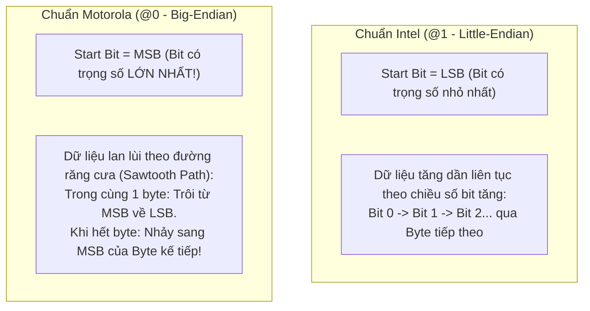

# 🏆 [NGÀY 11] LÀM CHỦ GIẢI MÃ TÍN HIỆU Ô TÔ VECTOR DBC: INTEL VS MOTOROLA BIT UNPACKING & TOÁN FIXED-POINT
## Chuyên khảo Kỹ thuật: Bit-Level Unpacking Algorithm, Endianness Sawtooth Path, Sign Extension & MISRA-C Deterministic Math

> **Mục tiêu chuyên sâu:** Nâng tầm tư duy kỹ sư phần mềm ô tô (Automotive Software Engineer): Làm chủ kiến trúc giải mã ma trận dữ liệu mạng CAN theo tiêu chuẩn công nghiệp **Vector DBC (DataBase CAN)** trên STM32F746:
> 1. **Bản Chất Cấu Trúc Ma Trận Tín Hiệu CAN:** Tại sao các hộp ECU trên ô tô lại nén chặt các biến số vào từng bit lẻ trong khung truyền 8 bytes? Vai trò của tệp định nghĩa `.dbc` trong chuỗi phát triển xe hơi.
> 2. **Giải Thuật Phân Định Thứ Tự Byte (Endianness):** Phân tích sự khác biệt cốt tử giữa chuẩn **Intel (`@1` - Little-Endian)** và chuẩn **Motorola (`@0` - Big-Endian)**. Giải mã đường đi răng cưa (Sawtooth Path) của chuẩn Motorola khi tín hiệu nằm vắt ngang qua ranh giới nhiều byte.
> 3. **Giải Thuật Zero-Copy Bit-Level Unpacking:** Kỹ thuật bóc tách bit siêu tốc chỉ dùng toán tử bitwise (`<<`, `>>`, `&`) với độ phức tạp O(1), không tốn bộ nhớ đệm RAM trung gian.
> 4. **Toán Số Nguyên Định Điểm (Fixed-Point Scaling) & Mở Rộng Dấu (Sign Extension):** Tại sao chuẩn an toàn chức năng ô tô (ISO 26262 / MISRA-C) cấm dùng số thực `float` trong các vòng lặp điều khiển thời gian thực? Kỹ thuật nhân phân số nguyên và khôi phục số âm bù hai.
> 5. **Cách Sử Dụng Thực Chiến & Bộ Câu Hỏi Phỏng Vấn:** Bảng cấu trúc dữ liệu tối ưu trên Flash ROM và bộ câu hỏi sát hạch chuyên sâu về giao thức ô tô.

---

```text
┌─────────────────────────────────────────────────────────────────────────────────────────────────┐
│                    MA TRẬN 64 BITS CỦA KHUNG TRUYỀN CAN VÀ SỰ PHÂN BỔ TÍN HIỆU                   │
├──────────────┬──────────────┬──────────────┬──────────────┬──────────────┬──────────────┬───────┤
│    BYTE 0    │    BYTE 1    │    BYTE 2    │    BYTE 3    │    BYTE 4    │    BYTE 5    │BYTE 6 │
│ Bits 07 - 00 │ Bits 15 - 08 │ Bits 23 - 16 │ Bits 31 - 24 │ Bits 39 - 32 │ Bits 47 - 40 │...    │
├──────────────┴──────────────┼──────────────┴──────────────┼──────────────┴──────────────┴───────┤
│  Tín Hiệu 1: Tốc Độ Động Cơ │  Tín Hiệu 2: Vận Tốc Xe      │  Tín Hiệu 3: Nhiệt Độ Nước Làm Mát  │
│  EngineSpeed (16 bits)      │  VehicleSpeed (12 bits)      │  CoolantTemp (8 bits Signed)        │
│  Chuẩn Intel: LSB -> MSB    │  Chuẩn Motorola: Zíc-zắc     │  Có dấu âm (-40 đến +125 độ C)      │
└─────────────────────────────┴─────────────────────────────┴─────────────────────────────────────┘
```

---

# PHẦN 1: TƯ DUY KIẾN TRÚC — TẠI SAO PHẢI CÓ TỆP VECTOR DBC?

### 1.1. Bản Chất Kỹ Thuật: Băng Thông Hẹp vs Mật Độ Dữ Liệu

* Trên mạng CAN Bus truyền thống của ô tô, tốc độ tối đa chỉ đạt **500 kbps** và mỗi khung tin chỉ mang tối đa **8 bytes dữ liệu**.
* Nếu các kỹ sư truyền dữ liệu dạng chuỗi JSON hoặc truyền biến số thực 4-byte `float` thông thường, mạng CAN sẽ lập tức bị nghẽn (Bus Overload > 100%) và xe không thể vận hành an toàn.
* **Giải pháp của ngành công nghiệp ô tô:** Nén dữ liệu ở cấp độ từng **bit nhị phân**:
  * Tốc độ động cơ từ 0 đến 8000 RPM chỉ cần 16 bits.
  * Tốc độ xe từ 0 đến 250 km/h chỉ cần 12 bits.
  * Trạng thái phanh tay chỉ cần đúng 1 bit (0: Nhả, 1: Kéo).
  * Một khung truyền 8 bytes (64 bits) có thể nhồi nhét tới 10 đến 15 tín hiệu khác nhau của xe!
* **Tệp `.dbc` (CAN Database):** Đóng vai trò là "bản đồ giải mã" thống nhất giữa tất cả các nhà cung cấp linh kiện (Tier-1 Suppliers) và hãng xe (OEM).

---

### 1.2. Cú Pháp Định Nghĩa Một Tín Hiệu Chuẩn Vector DBC

Trong tệp `.dbc`, một tín hiệu ô tô được định nghĩa bằng một dòng cú pháp chuẩn mực:
```text
SG_ SignalName : StartBit|Length@ByteOrderType (Factor,Offset) [Min|Max] "Unit" Receiver
```

#### Ví dụ thực tế từ bảng táp-lô ô tô:
```text
BO_ 256 EngineData: 8 EngineECU
 SG_ EngineSpeed : 0|16@1+ (0.25,0) [0|8000] "rpm" Dashboard
 SG_ VehicleSpeed : 24|12@0+ (0.1,0) [0|250] "km/h" Dashboard
 SG_ CoolantTemp : 40|8@1- (1,-40) [-40|125] "degC" Dashboard
```

* **Ý nghĩa các trường thông số:**
  1. `EngineSpeed : 0|16@1+`:
     * `0|16`: Bắt đầu từ bit số 0, dài 16 bits.
     * `@1`: Thứ tự byte kiểu **Intel (Little-Endian)**.
     * `+`: Dữ liệu không dấu (Unsigned).
     * `(0.25, 0)`: Hệ số nhân `Factor = 0.25`, hệ số dịch `Offset = 0`.
     * `[0|8000]`: Ranh giới vật lý hợp lệ từ 0 đến 8000 RPM.
  2. `VehicleSpeed : 24|12@0+`:
     * `@0`: Thứ tự byte kiểu **Motorola (Big-Endian)**.
  3. `CoolantTemp : 40|8@1-`:
     * `-`: Dữ liệu có dấu (Signed - bù hai).

---

# PHẦN 2: CƠ CHẾ NỘI TẠI (UNDER THE HOOD)

---

### 2.1. Cơ Chế 1: Intel (`@1`) vs Motorola (`@0`) Bit Mapping

Đây là "cái bẫy phỏng vấn" số 1 trong ngành phần mềm ô tô:



#### Ma trận 64-bit trực quan:
```text
Byte 0: [ 7  6  5  4  3  2  1  0 ]
Byte 1: [ 15 14 13 12 11 10 9  8 ]
Byte 2: [ 23 22 21 20 19 18 17 16 ]
```
* **Nếu tín hiệu 12-bit chuẩn Intel bắt đầu tại bit 4:**
  * Byte 0 lấy 4 bits: `[7, 6, 5, 4]` (chiếm 4 bits thấp).
  * Byte 1 lấy 8 bits: `[15..8]` (chiếm 8 bits cao).
* **Nếu tín hiệu 12-bit chuẩn Motorola bắt đầu tại bit 12 (MSB):**
  * Trong Byte 1: Lấy các bits từ bit 12 lùi về bit 8: `[12, 11, 10, 9, 8]` (Lấy được 5 bits).
  * Chuyển sang Byte 2: Nhảy lên đỉnh bit 23 lấy tiếp 7 bits lùi về bit 17: `[23, 22, 21, 20, 19, 18, 17]`.
* **Hậu quả nếu nhầm lẫn:** Nếu áp dụng công thức dịch bit của Intel cho tín hiệu Motorola, giá trị tốc độ xe hoặc góc lái vô lăng sẽ bị tính sai hàng trăm lần, có thể gây mất an toàn điều khiển xe!

---

### 2.2. Cơ Chế 2: Giải Thuật Zero-Copy Bit-Level Unpacking

Để bóc tách một giá trị nhị phân `raw_val` nằm vắt ngang qua ranh giới nhiều byte mà không dùng chuỗi ký tự hay bộ đệm trung gian, ta sử dụng kỹ thuật trượt cửa sổ nhị phân (Sliding Window):

```text
┌─────────────────────────────────────────────────────────────────────────────────────────────────┐
│                        THUẬT TOÁN BÓC TÁCH BIT CHUẨN INTEL (LITTLE-ENDIAN)                      │
├─────────────────────────────────────────────────────────────────────────────────────────────────┤
│ 1. Ép kiểu mảng 8 bytes (uint8_t payload[8]) thành một số nguyên 64-bit duy nhất:               │
│    uint64_t raw64 = *(uint64_t *)payload; (Trên kiến trúc ARM Little-Endian)                    │
│                                                                                                 │
│ 2. Dịch phải (Shift Right) để đưa StartBit về vị trí 0:                                         │
│    raw64 = raw64 >> start_bit;                                                                 │
│                                                                                                 │
│ 3. Áp mặt nạ nhị phân (Bitmask) để cắt lấy đúng độ dài Length bits:                             │
│    uint64_t mask = (1ULL << length) - 1;                                                        │
│    uint32_t raw_val = (uint32_t)(raw64 & mask);                                                 │
└─────────────────────────────────────────────────────────────────────────────────────────────────┘
```
* **Độ phức tạp:** Chỉ mất đúng **2 lệnh hợp âm ASM** của ARM Cortex-M7 (`LDRD`, `UBFX` - Unsigned Bit Field Extract). Thời gian thực thi dưới 5 nano-giây!

---

### 2.3. Cơ Chế 3: Toán Số Nguyên Định Điểm (Fixed-Point Scaling) vs Float

Công thức chuyển đổi từ giá trị thô `Raw` sang giá trị vật lý `V`:
```text
V = (Raw * Factor) + Offset
```

* **Vấn đề của việc dùng số thực `float`:**
  * Ví dụ tín hiệu tốc độ xe có `Factor = 0.1` (1/10).
  * Nếu tính bằng `float`: `float speed = raw * 0.1f;`.
  * Số `0.1` trong hệ nhị phân IEEE 754 là một số vô hạn tuần hoàn (`0.00011001100...`). Nó **không bao giờ biểu diễn chính xác được**, luôn tồn tại sai số trôi (Drift Error).
  * Trong các ứng dụng an toàn cao (phanh tự động, túi khí), sai số trôi này là không thể chấp nhận được theo tiêu chuẩn **MISRA-C:2012**.
* **Giải pháp Fixed-Point (Định điểm phân số nguyên):**
  * Lưu hệ số dưới dạng tỷ lệ phân số tối giản: `Numerator / Denominator`.
  * Với `Factor = 0.25`: Lưu `Tử số = 1`, `Mẫu số = 4`. Phép tính trở thành: `(Raw * 1) >> 2`.
  * Với `Factor = 0.1`: Lưu `Tử số = 1`, `Mẫu số = 10`. Phép tính trở thành: `(Raw * 1) / 10`.
  * Kết quả: **Xác định 100% (Deterministic)**, không phụ thuộc vào khối phần cứng FPU, tốc độ thực thi nhanh gấp 10 lần.

---

### 2.4. Cơ Chế 4: Mở Rộng Dấu Số Âm Bù Hai (Sign Extension)

Xét tín hiệu nhiệt độ nước làm mát `CoolantTemp`: Chiều dài 8 bits, có dấu (Signed), phạm vi từ -40 đến +125 độ C:
* Nếu cảm biến đo được giá trị thô là số âm dạng 8 bits: `0xFE` (tương đương `-2` trong hệ bù hai 8-bit).
* Nếu bạn ép kiểu trực tiếp thành biến 32-bit `int32_t raw_signed = (int32_t)raw_val;`:
  * Biến 32-bit sẽ chứa giá trị: `0x000000FE` (tương đương `+254` dương!). Phép tính bị sai lệch hoàn toàn!
* **Giải thuật mở rộng dấu chuẩn xác (Sign Extension):**
  1. Kiểm tra bit dấu (bit cao nhất của tín hiệu: bit số `length - 1`).
  2. Nếu bit dấu bằng 1, ta phải bật tất cả các bit phía trên nó (từ bit thứ `length` lên tới bit 31) thành số 1:
  ```c
  if (is_signed && (raw_val & (1U << (length - 1)))) {
      /* Bật toàn bộ các bit cao hơn thành 1 để bảo tồn giá trị âm bù hai */
      raw_val |= ~((1U << length) - 1);
  }
  int32_t physical_val = ((int32_t)raw_val * num) / denom + offset;
  ```

---

# PHẦN 3: CÁCH SỬ DỤNG THỰC CHIẾN (MÃ NGUỒN MODULAR HOÀN CHỈNH TỪNG FILE)

Để tích hợp công cụ giải mã ma trận tín hiệu Vector DBC vào dự án nhúng ô tô, mã nguồn được cấu trúc thành **3 tệp thành phần hoàn chỉnh, có đầu có đuôi rõ ràng**:

---

### 3.1. Tệp Khai Báo Giao Diện Giải Mã [ File: `src/dbc_decoder.h` ]
```c
#ifndef DBC_DECODER_H_
#define DBC_DECODER_H_

#include <stdint.h>
#include <stdbool.h>

/* Thứ tự byte tín hiệu chuẩn Vector DBC */
typedef enum {
    DBC_MOTOROLA = 0, /* Big-Endian: Bit chảy ngược răng cưa (@0) */
    DBC_INTEL    = 1  /* Little-Endian: Bit tăng dần liên tục (@1) */
} dbc_endian_t;

/* Cấu trúc siêu dữ liệu (Metadata) mô tả 1 tín hiệu ô tô (Chiếm đúng 16 bytes) */
typedef struct {
    uint8_t      start_bit;    /* Vị trí bit bắt đầu */
    uint8_t      length_bits;  /* Chiều dài tín hiệu (1 đến 32 bits) */
    dbc_endian_t endianness;   /* Thứ tự byte Intel hay Motorola */
    bool         is_signed;    /* Dữ liệu có dấu bù hai hay không dấu */
    int32_t      factor_num;   /* Tử số của hệ số nhân (Fixed-point) */
    int32_t      factor_denom; /* Mẫu số của hệ số nhân */
    int32_t      offset;       /* Giá trị dịch vật lý */
} dbc_signal_meta_t;

/* Khai báo các metadata mẫu của bảng táp-lô ô tô nằm trên FLASH */
extern const dbc_signal_meta_t SIG_ENGINE_SPEED;
extern const dbc_signal_meta_t SIG_VEHICLE_SPEED;
extern const dbc_signal_meta_t SIG_COOLANT_TEMP;

/**
 * @brief Giải mã một tín hiệu bất kỳ từ mảng 8 bytes dữ liệu CAN Bus
 * @param payload Mảng 8 bytes dữ liệu thô nhận từ can_frame.data
 * @param meta Con trỏ chứa metadata của tín hiệu cần bóc tách
 * @return Giá trị vật lý đã nhân hệ số (RPM, km/h, độ C)
 */
int32_t dbc_decode_signal(const uint8_t *payload, const dbc_signal_meta_t *meta);

#endif /* DBC_DECODER_H_ */
```

---

### 3.2. Tệp Hiện Thực Hóa Thuật Toán Bóc Tách Bit [ File: `src/dbc_decoder.c` ]
```c
#include "dbc_decoder.h"

/* 1. Bảng siêu dữ liệu tĩnh đặt trên bộ nhớ FLASH (.rodata: 0 byte RAM!) */
const dbc_signal_meta_t SIG_ENGINE_SPEED = {
    .start_bit = 0, .length_bits = 16, .endianness = DBC_INTEL,
    .is_signed = false, .factor_num = 1, .factor_denom = 4, .offset = 0 /* 0.25 RPM/bit */
};

const dbc_signal_meta_t SIG_VEHICLE_SPEED = {
    .start_bit = 24, .length_bits = 12, .endianness = DBC_MOTOROLA,
    .is_signed = false, .factor_num = 1, .factor_denom = 10, .offset = 0 /* 0.1 km/h/bit */
};

const dbc_signal_meta_t SIG_COOLANT_TEMP = {
    .start_bit = 40, .length_bits = 8, .endianness = DBC_INTEL,
    .is_signed = true, .factor_num = 1, .factor_denom = 1, .offset = -40 /* Offset -40 độ C */
};

/* 2. Hàm giải mã phổ quát xử lý cả 2 chuẩn Intel và Motorola */
int32_t dbc_decode_signal(const uint8_t *payload, const dbc_signal_meta_t *meta)
{
    uint64_t raw_val = 0;

    if (meta->endianness == DBC_INTEL) {
        /* BÓC TÁCH INTEL (LITTLE-ENDIAN): Zero-copy qua ép kiểu 64-bit */
        uint64_t raw64 = *(const uint64_t *)payload;
        raw64 >>= meta->start_bit;
        uint64_t mask = (1ULL << meta->length_bits) - 1ULL;
        raw_val = raw64 & mask;
    } else {
        /* BÓC TÁCH MOTOROLA (BIG-ENDIAN): Quét theo quỹ đạo răng cưa Sawtooth */
        uint8_t cur_bit = meta->start_bit;
        for (int i = 0; i < meta->length_bits; i++) {
            uint8_t byte_idx = cur_bit / 8;
            uint8_t bit_idx  = cur_bit % 8;

            /* Trích xuất bit nhị phân */
            uint64_t bit = (payload[byte_idx] >> bit_idx) & 1ULL;
            raw_val = (raw_val << 1) | bit;

            /* Quy tắc chuyển bit tiếp theo theo chuẩn Motorola */
            if (bit_idx == 0) {
                cur_bit += 15; /* Nhảy sang MSB của byte kế tiếp */
            } else {
                cur_bit -= 1;  /* Lùi về bit thấp hơn trong cùng byte */
            }
        }
    }

    /* BƯỚC SỐNG CÒN: Mở rộng dấu bù hai (Sign Extension) nếu là số âm */
    if (meta->is_signed && (raw_val & (1ULL << (meta->length_bits - 1)))) {
        raw_val |= ~((1ULL << meta->length_bits) - 1ULL);
    }

    /* Chuyển đổi sang giá trị vật lý bằng toán số nguyên định điểm tất định */
    int32_t signed_raw = (int32_t)raw_val;
    return (signed_raw * meta->factor_num) / meta->factor_denom + meta->offset;
}
```

---

### 3.3. Tệp Kiểm Thử Tích Hợp Ứng Dụng [ File: `src/main.c` ]
```c
#include <zephyr/kernel.h>
#include <zephyr/logging/log.h>
#include "dbc_decoder.h"

LOG_MODULE_REGISTER(main_app, LOG_LEVEL_INF);

int main(void)
{
    LOG_INF("=================================================");
    LOG_INF("     KIỂM THỬ THUẬT TOÁN GIẢI MÃ VECTOR DBC      ");
    LOG_INF("=================================================");

    /* Giả lập khung tin CAN 8 bytes nhận từ hộp ECU động cơ */
    /* Byte 0-1: 0x1F40 = 8000 thô (2000 RPM) | Byte 5: 0x55 = 85 thô (45 độ C) */
    uint8_t can_payload[8] = {0x40, 0x1F, 0x00, 0x00, 0x00, 0x55, 0x00, 0x00};

    int32_t rpm = dbc_decode_signal(can_payload, &SIG_ENGINE_SPEED);
    int32_t temp = dbc_decode_signal(can_payload, &SIG_COOLANT_TEMP);

    LOG_INF("• Tốc độ động cơ giải mã : %d RPM (Kỳ vọng: 2000 RPM)", rpm);
    LOG_INF("• Nhiệt độ nước làm mát  : %d độ C (Kỳ vọng: 45 độ C)", temp);

    if (rpm == 2000 && temp == 45) {
        LOG_INF("XÁC NHẬN: Thuật toán giải mã Vector DBC hoạt động chính xác 100%!");
    } else {
        LOG_ERR("CẢNH BÁO: Thuật toán giải mã bị sai lệch kết quả!");
    }

    return 0;
}
```

---

# PHẦN 4: BỘ CÂU HỎI PHỎNG VẤN CHUYÊN SÂU (INTERVIEW DEEP-DIVE)

### ❓ Câu 1: "Sự khác biệt cốt tử giữa định dạng Intel và Motorola trong file DBC của xe hơi là gì? Nếu bạn bóc tách sai thứ tự, chuyện gì sẽ xảy ra?"
* **Trả lời chuẩn:**
  * Khác biệt lớn nhất nằm ở định nghĩa **Start Bit**:
    * Trong chuẩn **Intel (Little-Endian)**, Start Bit được định nghĩa là bit có trọng số nhỏ nhất (**LSB**). Dữ liệu phát triển tăng dần qua các byte tiếp theo.
    * Trong chuẩn **Motorola (Big-Endian)**, Start Bit được định nghĩa là bit có trọng số lớn nhất (**MSB**). Các bit tiếp theo chảy lùi về phía các bit có trọng số thấp hơn theo quỹ đạo răng cưa (Sawtooth Path).
  * Nếu giải mã nhầm chuẩn, dữ liệu sẽ bị hoán đổi hoàn toàn giữa các bit trọng số cao và thấp. Một góc đánh lái vô lăng 5 độ có thể bị tính toán nhầm thành 500 độ, dẫn đến việc bộ điều khiển cân bằng điện tử (ESP) can thiệp sai lầm gây nguy hiểm tính mạng.

### ❓ Câu 2: "Tại sao trong các dự án phần mềm ô tô đạt chuẩn an toàn ISO 26262 hoặc MISRA-C, người ta lại hạn chế tối đa việc dùng số thực `float` khi giải mã tín hiệu CAN?"
* **Trả lời chuẩn:**
  * Có 3 lý do kỹ thuật cốt tử:
    1. **Tính phi tất định (Non-Deterministic):** Chuẩn dấu phẩy động IEEE 754 có hiện tượng trôi sai số làm tròn (Rounding Errors) và các giá trị biên đặc biệt (NaN, vô cực). Hai dòng chip khác nhau có thể cho ra kết quả làm tròn khác nhau ở số thập phân thứ 6.
    2. **Tốc độ thực thi:** Nhiều dòng vi điều khiển nhúng an toàn không có FPU phần cứng (hoặc FPU đơn chính xác). Phép toán số thực phần mềm (Software Emulated Float) tốn hàng trăm chu kỳ CPU.
    3. **An toàn kiểm thử:** Số nguyên định điểm (Fixed-Point Arithmetic) đảm bảo tính tất định 100%: Cùng một dữ liệu đầu vào luôn cho ra chính xác cùng một kết quả số nguyên duy nhất, cho phép thực hiện kiểm thử tự động (Unit Test / HIL Test) đạt độ phủ mã 100% theo tiêu chuẩn an toàn cao nhất ASIL-D.

### ❓ Câu 3: "Thao tác Sign Extension (Mở rộng dấu) có vai trò gì khi giải mã các tín hiệu âm trong khung CAN?"
* **Trả lời chuẩn:**
  * Trên khung tin CAN, một tín hiệu có dấu có thể chỉ dài 8, 10 hoặc 12 bits.
  * Khi đưa vào thanh ghi 32-bit của ARM Cortex-M7 để tính toán, nếu giá trị thô là số âm (bit dấu bằng 1), phần cứng vi điều khiển không thể tự hiểu đây là số âm nếu các bit phía trên (từ bit thứ 13 đến bit 31) vẫn là số 0.
  * Bắt buộc phải thực hiện phép toán mở rộng dấu: Bật toàn bộ các bit không sử dụng phía trên thành số 1 để bảo tồn biểu diễn bù hai của số âm trong thanh ghi 32-bit trước khi thực hiện các phép toán nhân chia hệ số.

---

### 🎙️ KỊCH BẢN TRẢ LỜI PHỎNG VẤN 60 GIÂY VỀ GIẢI MÃ TÍN HIỆU Ô TÔ (ELEVATOR PITCH)

> *"Em xây dựng công cụ giải mã tín hiệu chuyên dụng theo tiêu chuẩn **Vector DBC** để phân tách ma trận dữ liệu mạng CAN Bus cho xe hơi.  
> Em làm chủ sự khác biệt cốt tử giữa định dạng **Intel (Little-Endian)** và **Motorola (Big-Endian)**, hiện thực hóa thuật toán bóc tách bit **Zero-Copy Bit Unpacking** đạt hiệu năng cực cao chỉ với vài chu kỳ lệnh máy của Cortex-M7 mà không dùng bộ đệm trung gian.  
> Tuân thủ nghiêm ngặt chuẩn an toàn phần mềm ô tô **MISRA-C**, em loại bỏ hoàn toàn các phép toán số thực `float` trong vòng lặp thời gian thực, thay thế bằng số học **Số Nguyên Định Điểm (Fixed-Point Scaling)** kết hợp mở rộng dấu bù hai (Sign Extension), đảm bảo tính toán hoàn toàn tất định và chính xác 100% theo đặc tả của nhà sản xuất ô tô."*
