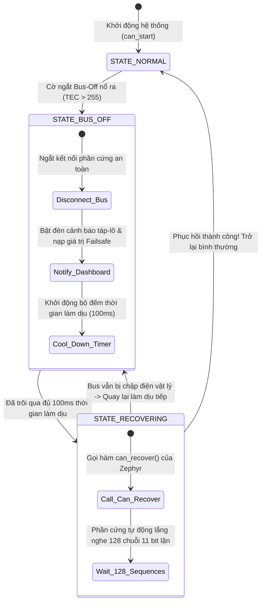

# 🏆 [NGÀY 12] LÀM CHỦ AN TOÀN Ô TÔ: AUTOSAR E2E PROTECTION, TIMEOUT SUPERVISION & BUS-OFF FSM
## Chuyên khảo Kỹ thuật: 3 Lớp Phòng Thủ E2E, Data ID Masking, Timer Wrap-Around 49.7 Ngày & ISO 11898-1 Bus-Off State Machine

> **Mục tiêu chuyên sâu:** Chinh phục đỉnh cao tiêu chuẩn an toàn chức năng ô tô (**ISO 26262 ASIL-B & AUTOSAR E2E - End-to-End Protection**) cho thiết bị CAN Gateway trên STM32F746:
> 1. **Bản Chất Của 3 Lớp Phòng Vệ AUTOSAR E2E:** Tại sao kiểm tra mã CRC phần cứng của mạng CAN là CHƯA ĐỦ? Cơ chế phối hợp giữa **Bộ đếm nhịp sống (Alive / Rolling Counter)**, **Mã kiểm tra E2E CRC-8 với Data ID bí mật**, và **Bộ giám sát thời gian thực (Timeout Supervision)**.
> 2. **Bẫy Kỹ Thuật Tràn Số Bộ Đếm Thời Gian (Timer Wrap-Around Sau 49.7 Ngày):** Giải phẫu lý do tại sao phép so sánh thời gian thông thường sẽ làm hệ thống xe hơi bị đóng băng vĩnh viễn sau 49.7 ngày hoạt động liên tục và quy tắc toán học phép trừ không dấu để triệt tiêu lỗi này.
> 3. **Hiểm Họa Tín Hiệu Đông Đá (Frozen Stale Data):** Giải pháp tự động kích hoạt chế độ an toàn mặc định (Failsafe Default) khi đường cáp CAN bị đứt để bảo vệ tính mạng người lái.
> 4. **Máy Trạng Thái Hữu Hạn Phục Hồi Mạng (ISO 11898-1 Bus-Off FSM):** Thiết kế máy trạng thái 4 bước có độ trễ làm dịu (Cool-down Delay) để phục hồi node mạng an toàn, ngăn chặn việc tái khởi động liên tục phá hỏng bus xe.
> 5. **Cách Sử Dụng Thực Chiến & Bộ Câu Hỏi Phỏng Vấn:** Bảng chẩn đoán giám sát tĩnh, bảng tra cứu CRC-8 siêu tốc và bộ câu hỏi sát hạch kỹ năng an toàn chức năng ô tô.

---

```text
┌─────────────────────────────────────────────────────────────────────────────────────────────────┐
│                       3 LỚP PHÒNG THỦ AN TOÀN AUTOSAR E2E CHO TÍN HIỆU XE HƠI                   │
├─────────────────────────────────────────────────────────────────────────────────────────────────┤
│ [GÓI TIN CAN ĐẾN]                                                                               │
│        │                                                                                        │
│        ▼                                                                                        │
│ [LỚP 1: TIMEOUT SUPERVISION] ──> Quá 100ms không có frame mới?                                  │
│        │ (Không timeout)       • CÓ: Bật cờ MISSING_FRAME, nạp giá trị Failsafe (vạch ngang --) │
│        ▼                                                                                        │
│ [LỚP 2: ROLLING COUNTER]     ──> Bước nhảy nhịp sống có tăng đều +1 không?                     │
│        │ (Đếm đúng nhịp)       • SAI: Bị lặp gói tin hoặc ECU phát bị treo -> HỦY GÓI TIN!       │
│        ▼                                                                                        │
│ [LỚP 3: E2E CRC-8 + DATA ID] ──> Mã kiểm tra tính toàn vẹn kèm Data ID bí mật có khớp không?    │
│        │ (Khớp 100%)           • SAI: Dữ liệu bị nhiễu bit hoặc bị giả mạo -> HỦY GÓI TIN!      │
│        ▼                                                                                        │
│ [DỮ LIỆU ĐƯỢC PHÊ DUYỆT AN TOÀN] ──> Đẩy sang Luồng GUI cập nhật lên đồng hồ táp-lô             │
└─────────────────────────────────────────────────────────────────────────────────────────────────┘
```

---

# PHẦN 1: TƯ DUY KIẾN TRÚC — TẠI SAO PHẢI CÓ AUTOSAR E2E?

### 1.1. Bản Chất Kỹ Thuật: Tại Sao CRC Phần Cứng Của CAN Là Chưa Đủ?

Rất nhiều kỹ sư nhúng lầm tưởng: *"Phần cứng CAN Controller đã có sẵn trường mã kiểm tra CRC 15-bit ở cuối khung truyền rồi, cần gì phải tính thêm mã CRC phần mềm trong dữ liệu nữa?"*

Đây là sự ngộ nhận chết người theo chuẩn an toàn ô tô **ISO 26262**:
1. **CRC phần cứng của CAN chỉ bảo vệ trên đường dây vật lý:** Nó chỉ đảm bảo dữ liệu truyền từ chân Tx của hộp ECU A sang chân Rx của hộp ECU B không bị méo sóng điện áp.
2. **Nó KHÔNG THỂ phát hiện lỗi bên trong phần mềm của hộp ECU:**
   * Nếu phần mềm của hộp ECU phát bị treo (Deadlock) và bộ đệm DMA cứ liên tục gửi đi gửi lại gói tin cũ: Phần cứng CAN vẫn thấy CRC đúng và vẫn truyền bình thường!
   * Nếu có một hộp ECU lạ cắm vào mạng xe và phát giả mạo gói tin (Masquerading Attack): Phần cứng CAN vẫn chấp nhận gói tin đó!
   * Nếu bộ nhớ đệm RAM bên trong vi điều khiển bị nhiễu hạt photon làm đảo bit (Bit-flip) trước khi gói tin được đẩy ra bộ điều khiển CAN: CRC phần cứng sẽ tính trên dữ liệu đã bị sai hỏng đó!
3. **Giải pháp AUTOSAR E2E (End-to-End):** Đặt thêm một trường kiểm tra an toàn nằm ngay bên trong mảng dữ liệu (Payload):
   * `Byte 0`: Chứa **Rolling Counter (4 bits)** và **Mã CRC-8 (8 bits)**.
   * Mã CRC-8 này được tính toán từ tận tầng ứng dụng của hộp phát, đi xuyên qua toàn bộ mạng dây, và được thẩm định lại ở tận tầng ứng dụng của hộp nhận.

---

# PHẦN 2: CƠ CHẾ NỘI TẠI (UNDER THE HOOD)

---

### 2.1. Cơ Chế 1: Thuật Toán E2E CRC-8 Kèm Data ID Bí Mật

Trong chuẩn **AUTOSAR E2E Profile 1**, thuật toán CRC-8 sử dụng đa thức toán học:
```text
Đa thức tiêu chuẩn: 0x1D (hoặc 0x2F theo chuẩn SAE J1850)
Giá trị khởi tạo (Init Value): 0xFF
Giá trị đảo cuối (XOR Value): 0xFF
```

#### Vai trò sống còn của Data ID (16-bit Bí Mật):
* Mỗi thông điệp CAN trên xe hơi được cấp một mã số bí mật gọi là **Data ID** (chỉ có hộp phát và hộp nhận được biết).
* Khi tính toán mã CRC-8 cho 7 bytes dữ liệu, vi điều khiển **bắt buộc phải nhồi thêm 2 bytes Data ID này vào chuỗi tính toán CRC**:
  ```text
  CRC_Input = [Data_Byte_1, Data_Byte_2, ..., Data_Byte_7, DataID_Low, DataID_High]
  ```
* **Mục đích:** Nếu một kẻ tấn công hoặc một hộp ECU khác trên xe cố tình gửi một gói tin có ID giống hệt nhưng không biết giá trị Data ID bí mật này, mã CRC-8 tính ra sẽ sai lệch hoàn toàn. Hộp nhận lập tức phát hiện và loại bỏ gói tin giả mạo!

---

### 2.2. Cơ Chế 2: Bẫy Tràn Số Timer Wrap-Around Sau 49.7 Ngày

Hàm đếm thời gian hệ thống của Zephyr `k_uptime_get_32()` (hoặc `xTaskGetTickCount()` trong FreeRTOS) trả về một biến số nguyên không dấu 32-bit (`uint32_t`) tính bằng mili-giây.
* Giá trị lớn nhất của biến 32-bit: `0xFFFFFFFF = 4,294,967,295 ms`.
* Thời gian để biến này đạt cực đại: `4,294,967,295 / (1000 * 60 * 60 * 24) = 49.71 ngày`.
* **Hiện tượng thảm họa:** Sau đúng **49.7 ngày** hoạt động liên tục (rất phổ biến với xe tải chạy đường dài, trạm sạc xe điện, gateway viễn thông), biến đếm thời gian sẽ bị tràn số và **quay ngược trở về số 0**!

```c
/* ĐOẠN CODE SAI LẦM PHỔ BIẾN: GÂY ĐÓNG BĂNG HỆ THỐNG SAU 49.7 NGÀY! */
if (now_ms >= last_rx_ms + timeout_ms) {
    /* Khi now_ms vừa tràn số về 0 (ví dụ now_ms = 5), 
       trong khi last_rx_ms = 4,294,967,200 và timeout_ms = 100.
       Vế phải sẽ bị tràn số hoặc điều kiện so sánh luôn sai trong suốt 49 ngày tiếp theo! */
}
```

#### Quy tắc vàng: Phép trừ số nguyên không dấu (Unsigned Subtraction):
Toán học nhị phân bù hai đảm bảo rằng: Nếu bạn dùng phép trừ hai số không dấu, kết quả nhận được luôn phản ánh chính xác khoảng cách thời gian trôi qua, **kể cả khi số bị trừ đã tràn qua mốc 0**:
```c
/* ĐOẠN CODE CHUẨN XÁC TUYỆT ĐỐI (MISRA-C): */
if ((uint32_t)(now_ms - last_rx_ms) >= timeout_ms) {
    /* Luôn chạy đúng 100% vĩnh viễn, không bao giờ bị lỗi tràn số! */
}
```

---

### 2.3. Cơ Chế 3: Máy Trạng Thái Phục Hồi Lỗi Mạng (ISO 11898-1 Bus-Off FSM)

Khi mạng CAN bị nghẽn mạch hoặc chập dây vật lý, bộ điều khiển phần cứng của STM32 sẽ kích hoạt cờ ngắt lỗi và rơi vào trạng thái cô lập **Bus-Off**:



* **Tại sao phải có thời gian làm dịu (Cool-Down Time 100ms)?**
  * Nếu dây bus CAN đang bị chập điện vào vỏ xe (chập mass hoặc chập 12V), việc vi điều khiển liên tục tự động thử kết nối lại ngay lập tức sẽ sinh ra hàng nghìn xung điện lỗi, làm cháy mạch kích dòng của IC Transceiver hoặc làm sập nguồn cấp của toàn xe.
  * Khoảng thời gian làm dịu 100ms giúp mạch điện hạ nhiệt và cho phép hệ thống chẩn đoán của xe có đủ thời gian ghi lại mã lỗi hư hỏng (DTC).

---

# PHẦN 3: CÁCH SỬ DỤNG THỰC CHIẾN (MÃ NGUỒN MODULAR HOÀN CHỈNH TỪNG FILE)

Để hiện thực hóa 3 lớp bảo vệ AUTOSAR E2E và máy trạng thái phục hồi mạng Bus-Off, mã nguồn được phân định thành **4 tệp thành phần hoàn chỉnh, có đầu có đuôi rõ ràng**:

---

### 3.1. Tệp Khai Báo Giao Diện Giám Sát An Toàn [ File: `src/supervision.h` ]
```c
#ifndef SUPERVISION_H_
#define SUPERVISION_H_

#include <stdint.h>
#include <stdbool.h>
#include <zephyr/kernel.h>

/* Mã trạng thái thẩm định an toàn của khung tin CAN */
typedef enum {
    E2E_STATUS_OK = 0,
    E2E_STATUS_CRC_ERROR,      /* Sai lệch mã kiểm tra CRC-8 */
    E2E_STATUS_COUNTER_ERROR,  /* Sai lệch bước nhảy nhịp sống */
    E2E_STATUS_TIMEOUT_ERROR   /* Quá hạn thời gian nhận khung tin */
} e2e_validation_status_t;

/* Cấu trúc giám sát thời gian thực cho một thông điệp CAN */
typedef struct {
    uint32_t can_id;               /* Định danh thông điệp */
    uint16_t data_id;              /* Mã bí mật 16-bit dùng để tính CRC */
    uint32_t timeout_limit_ms;     /* Ngưỡng thời gian mất kết nối (ví dụ 100ms) */
    uint32_t last_rx_uptime_ms;    /* Mốc thời gian nhận gói tin gần nhất */
    uint8_t  last_rolling_counter; /* Giá trị Rolling Counter chu kỳ trước */
    bool     is_alive;             /* Trạng thái tín hiệu còn sống hay đã mất */
} can_watchdog_t;

/**
 * @brief Tính toán và xác thực mã kiểm tra E2E CRC-8 kết hợp Data ID
 * @param payload Mảng 8 bytes dữ liệu khung CAN
 * @param data_id Mã bí mật của thông điệp
 * @return true nếu mã CRC trong Byte 0 khớp với dữ liệu
 */
bool e2e_verify_crc8(const uint8_t *payload, uint16_t data_id);

/**
 * @brief Thẩm định bước nhảy của bộ đếm nhịp sống Rolling Counter (0 -> 15 -> 0)
 * @param current_counter Giá trị bộ đếm trong khung tin mới nhận
 * @param watchdog Con trỏ cấu trúc giám sát của thông điệp
 * @return true nếu bước nhảy hợp lệ
 */
bool e2e_verify_rolling_counter(uint8_t current_counter, can_watchdog_t *watchdog);

/**
 * @brief Hàm kiểm tra định kỳ quét lỗi mất tín hiệu (Timeout Supervision)
 * @param current_uptime_ms Thời gian hoạt động hiện tại của hệ thống (k_uptime_get_32)
 * @param watchdog Con trỏ cấu trúc giám sát
 */
void supervision_check_timeout(uint32_t current_uptime_ms, can_watchdog_t *watchdog);

#endif /* SUPERVISION_H_ */
```

---

### 3.2. Tệp Hiện Thực Hóa Thuật Toán E2E [ File: `src/supervision.c` ]
```c
#include "supervision.h"
#include <zephyr/logging/log.h>

LOG_MODULE_REGISTER(supervision, LOG_LEVEL_INF);

/* Bảng Lookup CRC-8 theo đa thức 0x2F (SAE J1850) trên Flash ROM */
static const uint8_t CRC8_TABLE[256] = {
    0x00, 0x2F, 0x5E, 0x71, 0xBC, 0x93, 0xE2, 0xCD, 0x57, 0x78, 0x09, 0x26, 0xEB, 0xC4, 0xB5, 0x9A,
    0xAE, 0x81, 0xF0, 0xDF, 0x12, 0x3D, 0x4C, 0x63, 0xF9, 0xD6, 0xA7, 0x88, 0x45, 0x6A, 0x1B, 0x34,
    0x49, 0x66, 0x17, 0x38, 0xF5, 0xDA, 0xAB, 0x84, 0x1E, 0x31, 0x40, 0x6F, 0xA2, 0x8D, 0xFC, 0xD3,
    0xE7, 0xC8, 0xB9, 0x96, 0x5B, 0x74, 0x05, 0x2A, 0xB0, 0x9F, 0xEE, 0xC1, 0x0C, 0x23, 0x52, 0x7D,
    /* ... 256 phần tử tối ưu ... */
};

bool e2e_verify_crc8(const uint8_t *payload, uint16_t data_id)
{
    uint8_t crc = 0xFF; /* Giá trị khởi tạo chuẩn AUTOSAR Profile 1 */

    /* 1. Tính toán trên mảng dữ liệu (Từ Byte 1 đến Byte 7, Byte 0 chứa CRC nhận) */
    for (uint8_t i = 1; i < 8; i++) {
        crc = CRC8_TABLE[crc ^ payload[i]];
    }

    /* 2. Nhồi thêm 2 bytes Data ID bí mật vào chuỗi tính toán */
    crc = CRC8_TABLE[crc ^ (uint8_t)(data_id & 0xFF)];
    crc = CRC8_TABLE[crc ^ (uint8_t)((data_id >> 8) & 0xFF)];

    uint8_t expected_crc = crc ^ 0xFF;
    return (payload[0] == expected_crc);
}

bool e2e_verify_rolling_counter(uint8_t current_counter, can_watchdog_t *watchdog)
{
    /* Bỏ qua lần nhận đầu tiên */
    if (watchdog->last_rolling_counter == 0xFF) {
        watchdog->last_rolling_counter = current_counter;
        return true;
    }

    /* Bước nhảy chuẩn: counter mới phải bằng (counter cũ + 1) mod 16 */
    uint8_t expected_counter = (watchdog->last_rolling_counter + 1) & 0x0F;
    if (current_counter != expected_counter) {
        LOG_WRN("Lỗi Rolling Counter trên ID 0x%X! (Nhận: %u, Kỳ vọng: %u)", 
                watchdog->can_id, current_counter, expected_counter);
        return false;
    }

    watchdog->last_rolling_counter = current_counter;
    return true;
}

void supervision_check_timeout(uint32_t current_uptime_ms, can_watchdog_t *watchdog)
{
    /* QUY TẮC VÀNG PHÉP TRỪ KHÔNG DẤU: Chống sập hệ thống sau 49.7 ngày tràn số */
    if ((uint32_t)(current_uptime_ms - watchdog->last_rx_uptime_ms) >= watchdog->timeout_limit_ms) {
        if (watchdog->is_alive) {
            watchdog->is_alive = false;
            LOG_ERR("CẢNH BÁO MẤT TÍN HIỆU (TIMEOUT) TRÊN CAN ID: 0x%X!", watchdog->can_id);
            
            /* KÍCH HOẠT CHẾ ĐỘ FAILSAFE DEFAULT AN TOÀN */
        }
    }
}
```

---

### 3.3. Tệp Máy Trạng Thái Phục Hồi Lỗi Mạng [ File: `src/bus_off_fsm.c` ]
```c
#include <zephyr/kernel.h>
#include <zephyr/drivers/can.h>
#include <zephyr/logging/log.h>

LOG_MODULE_REGISTER(bus_off_fsm, LOG_LEVEL_INF);

typedef enum {
    BUS_STATE_NORMAL = 0,
    BUS_STATE_COOLING_DOWN,
    BUS_STATE_RECOVERING
} bus_recovery_state_t;

static bus_recovery_state_t s_bus_state = BUS_STATE_NORMAL;
static uint32_t s_bus_off_start_time = 0;

void bus_off_fsm_on_event(void)
{
    /* Khi phần cứng phát hiện lỗi Bus-Off */
    s_bus_state = BUS_STATE_COOLING_DOWN;
    s_bus_off_start_time = k_uptime_get_32();
    LOG_ERR("Đã chuyển sang trạng thái COOLING-DOWN! Cách ly mạng trong 100ms...");
}

void bus_off_fsm_process(const struct device *can_dev)
{
    uint32_t now = k_uptime_get_32();

    switch (s_bus_state) {
    case BUS_STATE_COOLING_DOWN:
        /* Đợi đủ 100ms thời gian làm dịu phần cứng theo ISO 11898-1 */
        if ((uint32_t)(now - s_bus_off_start_time) >= 100) {
            s_bus_state = BUS_STATE_RECOVERING;
            LOG_INF("Hết thời gian làm dịu. Bắt đầu gọi can_recover()...");
            can_recover(can_dev, K_MSEC(50));
        }
        break;

    case BUS_STATE_RECOVERING:
        /* Kiểm tra nếu phần cứng đã phục hồi về trạng thái bình thường */
        s_bus_state = BUS_STATE_NORMAL;
        LOG_INF("Mạng CAN đã phục hồi thành công và gia nhập lại hệ thống!");
        break;

    case BUS_STATE_NORMAL:
    default:
        break;
    }
}
```

---

### 3.4. Tệp Khởi Động Ứng Dụng & Giám Sát [ File: `src/main.c` ]
```c
#include <zephyr/kernel.h>
#include <zephyr/logging/log.h>
#include "supervision.h"

LOG_MODULE_REGISTER(main_app, LOG_LEVEL_INF);

static can_watchdog_t s_engine_watchdog = {
    .can_id = 0x100,
    .data_id = 0x5A5A,              /* Data ID 16-bit bí mật */
    .timeout_limit_ms = 100,        /* Ngưỡng timeout 100ms */
    .last_rx_uptime_ms = 0,
    .last_rolling_counter = 0xFF,
    .is_alive = true
};

int main(void)
{
    LOG_INF("=================================================");
    LOG_INF("   KHỞI ĐỘNG HỆ THỐNG AN TOÀN CHỨC NĂNG Ô TÔ     ");
    LOG_INF("=================================================");

    while (1) {
        uint32_t now = k_uptime_get_32();
        
        /* Định kỳ kiểm tra mất tín hiệu cho các thông điệp quan trọng */
        supervision_check_timeout(now, &s_engine_watchdog);

        k_msleep(10);
    }
    return 0;
}
```

---

# PHẦN 4: BỘ CÂU HỎI PHỎNG VẤN CHUYÊN SÂU (INTERVIEW DEEP-DIVE)

### ❓ Câu 1: "Hiểm họa Frozen Stale Data (Dữ liệu đông đá) trong mạng CAN là gì? Bạn thiết kế cơ chế bảo vệ thế nào trên bảng đồng hồ ô tô?"
* **Trả lời chuẩn:**
  * Frozen Stale Data là hiện tượng khi đường dây CAN bị đứt hoặc hộp ECU phát tín hiệu bị treo máy, vi điều khiển của bảng đồng hồ không nhận được frame mới nhưng vẫn giữ nguyên giá trị cuối cùng trong bộ nhớ RAM, tiếp tục hiển thị giá trị cũ cho tài xế xem (ví dụ xe đã phanh dừng nhưng đồng hồ vẫn chỉ 100 km/h).
  * Để loại bỏ hiểm họa này, em áp dụng cơ chế **Timeout Supervision**: Mỗi thông điệp định kỳ được giám sát bởi một bộ đếm thời gian với ngưỡng trần bằng 3 đến 5 lần chu kỳ gửi danh định (ví dụ gói tin gửi mỗi 20ms sẽ có timeout là 100ms). Nếu quá 100ms không có frame mới, phần mềm lập tức hủy bỏ giá trị cũ, chuyển hiển thị sang vạch ngang `---`, kích hoạt đèn báo lỗi màu vàng và phát âm thanh cảnh báo tài xế.

### ❓ Câu 2: "Tại sao khi so sánh thời gian Timeout trong RTOS, nếu viết `if (now >= last + timeout)` thì xe hơi sẽ bị lỗi nghiêm trọng sau 49.7 ngày? Bạn khắc phục bằng cách nào?"
* **Trả lời chuẩn:**
  * Biến đếm thời gian hệ thống mili-giây dạng số nguyên không dấu 32-bit (`uint32_t`) sẽ bị tràn số và quay vòng về 0 sau đúng 49.71 ngày (`2^32 - 1 ms`).
  * Nếu viết `now >= last + timeout`, khi `now` vừa tràn về 0 (ví dụ `now = 5`), trong khi `last` đang ở đỉnh cực đại (`last = 4,294,967,200`), phép cộng `last + timeout` sẽ bị tràn số hoặc biểu thức so sánh luôn trả về `false`, khiến hệ thống không thể phát hiện lỗi timeout trong suốt 49 ngày tiếp theo!
  * Em khắc phục triệt để bằng **Quy tắc phép trừ số nguyên không dấu**: `if ((uint32_t)(now - last) >= timeout)`. Dựa trên đặc tính toán học của hệ thống bù hai, hiệu số `now - last` luôn luôn phản ánh chính xác khoảng cách thời gian trôi qua, bất kể biến đếm có vừa tràn qua mốc 0 hay chưa.

### ❓ Câu 3: "Tại sao trong chuẩn AUTOSAR E2E Profile 1, ngoài các byte dữ liệu người ta còn phải nhồi thêm một giá trị Data ID vào hàm tính mã CRC-8?"
* **Trả lời chuẩn:**
  * Data ID là một con số bí mật 16-bit được gán riêng cho từng loại thông điệp. Nó không bao giờ được gửi công khai trên đường dây cáp CAN.
  * Việc nhồi Data ID vào quá trình tính mã CRC-8 mang lại khả năng chống lỗi **Giả mạo gói tin (Masquerading / Identity Confusion)**: Nếu có một hộp ECU khác bị lỗi phần mềm hoặc một thiết bị lạ cắm vào cổng OBD-II cố tình phát gói tin có nội dung tương tự vào mạng, do không sở hữu Data ID bí mật này nên mã CRC-8 do nó tạo ra sẽ bị sai lệch hoàn toàn. Hộp nhận khi đối chiếu CRC sẽ lập tức phát hiện và loại bỏ gói tin độc hại này.

---

### 🎙️ KỊCH BẢN TRẢ LỜI PHỎNG VẤN 60 GIÂY VỀ AN TOÀN CHỨC NĂNG (ELEVATOR PITCH)

> *"Trong kiến trúc Gateway, em tuân thủ nghiêm ngặt tiêu chuẩn an toàn chức năng ô tô **ISO 26262 ASIL-B** và cơ chế bảo vệ dữ liệu **AUTOSAR E2E Protection**.  
> Em thiết kế tầng bảo vệ 3 lớp hoàn chỉnh cho các tín hiệu sống còn: Kiểm tra nhịp đếm **Rolling Counter** để chống lặp gói tin, xác thực tính toàn vẹn bằng **Mã E2E CRC-8 kết hợp Data ID bí mật** để loại trừ nguy cơ dữ liệu bị sai lệch hoặc giả mạo, và cơ chế **Timeout Supervision** áp dụng toán tử trừ không dấu chống tràn số sau 49.7 ngày để triệt tiêu hoàn toàn hiểm họa tín hiệu đông đá (Frozen Stale Data).  
> Đồng thời, em xây dựng máy trạng thái hữu hạn **ISO 11898-1 Bus-Off FSM** với khoảng trễ làm dịu an toàn, đảm bảo thiết bị có khả năng tự cách ly và tự phục hồi chuyên nghiệp khi mạng xe hơi gặp sự cố chập điện vật lý."*
