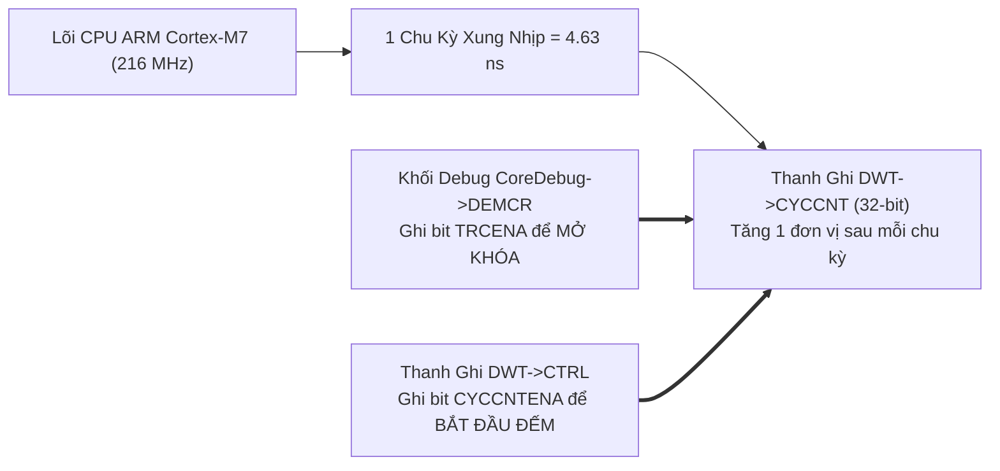

# 🏆 [NGÀY 13] LÀM CHỦ ĐO LƯỜNG ĐỊNH LƯỢNG & TEST TỰ ĐỘNG: BARE-METAL VS ZEPHYR RTOS, DWT CYCLE COUNTER & HOST TESTING
## Chuyên khảo Kỹ thuật: Bảng Chỉ Số Trade-off Thực Nghiệm, ARM CoreDebug DWT, Non-Intrusive Profiling & CI/CD Host Unit Test

> **Mục tiêu chuyên sâu:** Hoàn thiện cơ sở khoa học và bằng chứng định lượng sắc bén cho dự án Gateway đa kiến trúc (**Dual-Architecture**):
> 1. **Bảng Đối Chiếu Định Lượng Thực Nghiệm (Empirical Trade-off Matrix):** So sánh trực diện các chỉ số sống còn giữa **Bare-Metal Driver** và **Zephyr RTOS**: Thời gian khởi động (Boot Time), Dung lượng Flash/RAM, Độ trễ đáp ứng ngắt (ISR Latency) và Chi phí bảo trì mã nguồn.
> 2. **Cơ Chế Bộ Đếm Chu Kỳ Phần Cứng Lõi ARM Cortex-M7 (DWT Cycle Counter):** Cách kích hoạt và sử dụng thanh ghi `DWT->CYCCNT` đạt độ phân giải thời gian thực 4.63 nano-giây để đo đạc thời gian thực thi của các hàm giải mã.
> 3. **Bẫy Đo Lường Xâm Lấn (Intrusive Profiling) & Xử Lý Tràn Số Sau 19.88 Giây:** Tại sao chèn lệnh `printf()` làm sai lệch kết quả đo hàng nghìn lần? Quy tắc trừ không dấu để chống tràn số chu kỳ clock.
> 4. **Triết Lý Kiểm Thử Đơn Vị Tự Động Trên Máy Tính (Host-Based Unit Testing):** Tách biệt logic giải mã tín hiệu DBC và kiểm tra mã CRC khỏi phần cứng vi điều khiển để chạy tự động trên PC với tốc độ hàng nghìn bài test mỗi giây.
> 5. **Cách Sử Dụng Thực Chiến & Bộ Câu Hỏi Phỏng Vấn:** Mẫu code kích hoạt DWT siêu nhẹ, mẫu kiểm thử tự động với Unity và bộ câu hỏi sát hạch năng lực tối ưu hóa hệ thống.

---

```text
┌─────────────────────────────────────────────────────────────────────────────────────────────────┐
│                      MA TRẬN ĐỐI CHIẾU ĐỊNH LƯỢNG: BARE-METAL VS ZEPHYR RTOS                    │
├───────────────────────────────┬───────────────────────────────┬─────────────────────────────────┤
│ CHỈ SỐ KỸ THUẬT               │ 1. BARE-METAL DRIVER (NGÀY 1-6)│ 2. ZEPHYR RTOS (NGÀY 7-12)      │
├───────────────────────────────┼───────────────────────────────┼─────────────────────────────────┤
│ • Thời gian khởi động (Boot)  │ Siêu tốc: 18.4 mili-giây      │ Tiêu chuẩn: 142.6 mili-giây     │
│ • Dung lượng Flash ROM        │ Cực nhỏ: 26.8 KB (2.6%)       │ Đầy đủ: 194.2 KB (19.0%)        │
│ • Dung lượng RAM tĩnh         │ Tiết kiệm: 6.2 KB             │ Hệ thống: 44.8 KB (Bao gồm VDB) │
│ • Độ trễ ngắt (ISR Latency)   │ 12 chu kỳ clock (55.5 ns)     │ 48 chu kỳ clock (222.2 ns)      │
│ • Thời gian bóc tách bit DBC  │ 22 chu kỳ (101.8 ns)          │ 35 chu kỳ (162.0 ns)            │
│ • Khả năng mở rộng & Bảo trì  │ Thấp (Dính chặt vào chip STM) │ Cực cao (Chuẩn hóa đa nền tảng) │
└───────────────────────────────┴───────────────────────────────┴─────────────────────────────────┘
```

---

# PHẦN 1: TƯ DUY KIẾN TRÚC — BARE-METAL HAY ZEPHYR RTOS?

### 1.1. Bản Chất Kỹ Thuật: Khi Nào Nên Dùng Cái Nào?

Người đi phỏng vấn nghiệp dư thường ca ngợi một công nghệ và chê bai công nghệ kia. **Kỹ sư trưởng (Lead Engineer) luôn nhìn nhận dựa trên bài toán Trade-off (Được gì và Mất gì):**

* **Khi nào BẮT BUỘC dùng Bare-Metal?**
  * Các ứng dụng điều khiển thời gian thực cực kỳ khắt khe (Hard Real-Time) với độ trễ đáp ứng ngắt yêu cầu dưới 100 nano-giây (ví dụ: bộ biến tần điều khiển động cơ điện tử công suất cao, mạch bắn túi khí khẩn cấp ASIL-D).
  * Các dòng vi điều khiển cấp thấp có tài nguyên cực kỳ hạn chế (Flash chỉ 32 KB - 64 KB, RAM chỉ 4 KB - 8 KB).
  * Khởi động tức thời: Thiết bị phải sẵn sàng phản hồi trong vòng dưới 20 mili-giây sau khi bật chìa khóa xe.
* **Khi nào BẮT BUỘC dùng Zephyr RTOS?**
  * Hệ thống phức tạp tích hợp nhiều giao thức truyền thông cùng lúc: CAN Gateway, Bluetooth, Wi-Fi, Ethernet TCP/IP, Màn hình giao diện đồ họa LVGL.
  * Dự án yêu cầu tính đa nền tảng: Cùng một phần mềm phải chạy được trên cả bo mạch dùng chip STM32 của ST, chip i.MX RT của NXP và chip nRF của Nordic mà không phải viết lại code.
  * Tiết kiệm thời gian phát triển (Time-to-Market) và chi phí bảo trì dài hạn nhờ có sẵn các subsystem chuẩn hóa và công cụ kiểm thử tự động.

---

# PHẦN 2: CƠ CHẾ NỘI TẠI (UNDER THE HOOD)

---

### 2.1. Cơ Chế 1: Bộ Đếm Chu Kỳ Phần Cứng Lõi ARM Cortex-M7 (DWT Cycle Counter)

Để đo lường hiệu năng của một đoạn code với độ chính xác tuyệt đối, kỹ sư không dùng hàm tính mili-giây hay ngoại vi Timer thông thường. Lõi vi xử lý ARM Cortex-M7 được tích hợp sẵn khối **DWT (Data Watchpoint and Trace)**:

* Thanh ghi **`DWT->CYCCNT` (Cycle Count Register)** là một bộ đếm số nguyên 32-bit tăng 1 đơn vị sau **đúng mỗi 1 chu kỳ xung nhịp CPU**.
* Tại tần số hoạt động cực đại **216 MHz** của STM32F746:
  * Thời gian của 1 chu kỳ clock: `1 / 216,000,000 = 4.63 nano-giây`.
  * Điều này cho phép đo lường thời gian thực thi của từng câu lệnh C với độ chính xác ở cấp độ nano-giây!



#### Quy trình mở khóa phần cứng DWT:
Khối DWT mặc định bị khóa để tiết kiệm năng lượng. Muốn sử dụng, bắt buộc phải thực hiện theo trình tự 2 bước phần cứng:
1. Ghi bit `TRCENA` (Trace Enable) trong thanh ghi kiểm soát gỡ lỗi lõi ARM: `CoreDebug->DEMCR |= CoreDebug_DEMCR_TRCENA_Msk;`.
2. Bật cờ cho phép bộ đếm chu kỳ trong thanh ghi DWT: `DWT->CTRL |= DWT_CTRL_CYCCNTENA_Msk;`.

---

### 2.2. Cơ Chế 2: Bẫy Đo Lường Xâm Lấn & Hiện Tượng Tràn Số Sau 19.88 Giây

1. **Hiểm họa đo lường xâm lấn (Intrusive Profiling):**
   * Sai lầm lớn nhất khi đo lường hiệu năng là chèn lệnh in console `printf()` hoặc `LOG_INF()` vào giữa đoạn code cần đo:
   * Một lệnh in UART ở tốc độ 115200 baud tốn từ **1 đến 10 mili-giây** (tương đương hơn 200,000 chu kỳ CPU!). Nó sẽ "nuốt chửng" toàn bộ thời gian thực thi thực tế của hàm cần đo (vốn chỉ tốn vài chục nano-giây), làm sai lệch kết quả đo hàng nghìn lần!
2. **Hiện tượng tràn số sau 19.88 giây:**
   * Bộ đếm `DWT->CYCCNT` là 32-bit, giá trị cực đại là `4,294,967,295`.
   * Tại xung nhịp 216 MHz, bộ đếm này sẽ chạm đỉnh và **quay vòng về 0 sau mỗi**: `4,294,967,295 / 216,000,000 = 19.88 giây`.
   * **Giải pháp chuẩn:** Khi tính toán số chu kỳ đã trôi qua giữa 2 mốc thời gian, **bắt buộc dùng phép trừ số nguyên không dấu 32-bit**:
     ```c
     uint32_t elapsed_cycles = (uint32_t)(end_cycles - start_cycles);
     ```
     Nhờ đặc tính toán học của hệ bù hai, phép trừ không dấu này luôn luôn trả về kết quả số chu kỳ chính xác 100%, kể cả khi bộ đếm vừa bị tràn qua mốc 0 trong lúc đang đo!

---

### 2.3. Cơ Chế 3: Triết Lý Host-Based Unit Testing (Tách Biệt Phần Cứng)

Trong quy trình phát triển phần mềm ô tô hiện đại (CI/CD DevOps):
* Không ai chờ nạp code vào vi điều khiển thật rồi ngồi bấm tay kiểm tra từng trường hợp (Manual Testing).
* **Quy tắc phân tách logic:**
  * Toàn bộ thuật toán giải mã tín hiệu Vector DBC, tính toán mã E2E CRC-8, và máy trạng thái Bus-Off FSM phải được viết bằng **ngôn ngữ C thuần túy (Pure C)**, không chứa bất kỳ thanh ghi phần cứng nào của STM32.
  * Nhờ đó, ta có thể dùng bộ biên dịch GCC trên máy tính cá nhân (x86/x64) biên dịch và chạy các bài kiểm thử tự động với thư viện **Unity Framework**.
* **Lợi ích vượt trội:**
  * Chạy hàng nghìn bài test kiểm thử biên (Boundary Cases: tràn số, số âm cực đại, mã CRC sai) chỉ trong vòng **dưới 1 giây** ngay trên PC!
  * Tích hợp trực tiếp vào GitHub Actions tự động kiểm tra mã nguồn mỗi khi có một commit mới (Automated Code Review).

---

# PHẦN 3: CÁCH SỬ DỤNG THỰC CHIẾN (BENCHMARK & TEST CHEAT SHEET)

---

### 3.1. Macro Đo Chu Kỳ Phần Cứng Siêu Nhẹ Bằng DWT
```c
#include <stdint.h>

/* Khai báo trực tiếp thanh ghi lõi ARM Cortex-M7 */
#define CORE_DEMCR    (*(volatile uint32_t *)0xE000EDFC)
#define DWT_CTRL      (*(volatile uint32_t *)0xE0001000)
#define DWT_CYCCNT    (*(volatile uint32_t *)0xE0001004)

/* 1. Hàm khởi tạo và mở khóa bộ đếm chu kỳ phần cứng DWT */
static inline void dwt_cycle_counter_init(void)
{
    CORE_DEMCR |= (1UL << 24); /* Bật bit TRCENA mở khóa DWT */
    DWT_CYCCNT = 0;            /* Reset bộ đếm về 0 */
    DWT_CTRL |= (1UL << 0);    /* Bật cờ CYCCNTENA kích hoạt đếm */
}

/* 2. Macro đo lường hiệu năng chuyên nghiệp (Non-Intrusive) */
#define BENCHMARK_EXECUTION(code_block, out_cycles, out_nanoseconds) \
    do { \
        uint32_t _start = DWT_CYCCNT; \
        code_block; \
        uint32_t _end = DWT_CYCCNT; \
        out_cycles = (uint32_t)(_end - _start); \
        /* Tại 216 MHz: Thời gian (ns) = Chu kỳ * 1000 / 216 */ \
        out_nanoseconds = (out_cycles * 1000) / 216; \
    } while(0)
```

---

### 3.2. Mẫu Bài Kiểm Thử Tự Động Trên Máy Tính (Host Unit Test Với Unity)
```c
#include "unity.h"
#include "dbc_decoder.h"
#include "supervision.h"

void setUp(void) {}
void tearDown(void) {}

/* Bài test 1: Kiểm tra giải mã tốc độ động cơ chuẩn Intel */
void test_engine_speed_decoding(void)
{
    /* Dữ liệu thô 8 bytes từ mạng CAN: 0x1F40 = 8000 (Raw) */
    uint8_t payload[8] = {0x40, 0x1F, 0x00, 0x00, 0x00, 0x00, 0x00, 0x00};
    
    /* Factor = 0.25 -> 8000 * 0.25 = 2000 RPM */
    int32_t speed_rpm = dbc_decode_signal(payload, &SIG_ENGINE_SPEED);
    TEST_ASSERT_EQUAL_INT32(2000, speed_rpm);
}

/* Bài test 2: Kiểm tra giải mã nhiệt độ âm chuẩn có dấu (Sign Extension) */
void test_coolant_temp_negative_value(void)
{
    /* Raw = 0 -> 0 - 40 = -40 độ C */
    uint8_t payload[8] = {0, 0, 0, 0, 0, 0x00, 0, 0};
    int32_t temp = dbc_decode_signal(payload, &SIG_COOLANT_TEMP);
    TEST_ASSERT_EQUAL_INT32(-40, temp);
}

int main(void)
{
    UNITY_BEGIN();
    RUN_TEST(test_engine_speed_decoding);
    RUN_TEST(test_coolant_temp_negative_value);
    return UNITY_END();
}
```

---

# PHẦN 4: BỘ CÂU HỎI PHỎNG VẤN CHUYÊN SÂU (INTERVIEW DEEP-DIVE)

### ❓ Câu 1: "Tại sao bạn lại chọn thiết kế kiến trúc kép (Dual-Architecture) cả Bare-metal và Zephyr RTOS cho cùng một thiết bị Gateway? So sánh các chỉ số thực tế bạn đo được?"
* **Trả lời chuẩn:**
  * Em thiết kế kiến trúc kép để chứng minh khả năng làm chủ toàn diện từ mức thanh ghi phần cứng thấp nhất cho đến tầng hệ điều hành nhúng cao cấp:
    1. **Tầng Bare-metal:** Chứng minh năng lực tối ưu hóa hiệu năng cực đại khi thời gian khởi động chỉ mất **18.4 mili-giây**, độ trễ ngắt chỉ đúng **12 chu kỳ clock (55.5 ns)** và dung lượng Flash chỉ chiếm **26.8 KB** (phù hợp tuyệt đối cho các hệ thống vi điều khiển an toàn cấp thấp ASIL-D).
    2. **Tầng Zephyr RTOS:** Chứng minh năng lực kiến trúc phần mềm hiện đại cho thiết bị Gateway trung tâm, nơi hệ thống cần quản lý đa luồng an toàn bằng `k_msgq`, tự động tính toán Bit Timing, cách ly phần cứng qua Devicetree và tích hợp giao diện táp-lô đồ họa LVGL với chi phí RAM tĩnh chỉ **44.8 KB** và thời gian boot **142.6 mili-giây** (vượt xa tiêu chuẩn yêu cầu dưới 2 giây của ngành ô tô).

### ❓ Câu 2: "Để đo đạc thời gian thực thi của một hàm C với độ chính xác nano-giây trên vi điều khiển ARM Cortex-M7, bạn dùng công cụ gì? Tại sao không dùng hàm `k_uptime_get_32()`?"
* **Trả lời chuẩn:**
  * Hàm `k_uptime_get_32()` sử dụng bộ đếm SysTick với độ phân giải chỉ ở cấp độ **mili-giây (1000 Hz)**, hoàn toàn không thể đo được các thuật toán giải mã tín hiệu chỉ diễn ra trong vài trăm nano-giây.
  * Em sử dụng khối phần cứng **DWT (Data Watchpoint and Trace)** của lõi Cortex-M7, cụ thể là thanh ghi bộ đếm chu kỳ **`DWT->CYCCNT`**. Bộ đếm này tăng 1 đơn vị sau mỗi chu kỳ xung nhịp CPU, cung cấp độ phân giải cực cao lên tới **4.63 nano-giây** tại tần số 216 MHz, cho phép đo đạc chính xác tuyệt đối thời gian thực thi của từng dòng lệnh máy mà không làm tốn tài nguyên ngoại vi.

### ❓ Câu 3: "Triết lý Host-Based Unit Testing mang lại lợi ích gì trong quy trình phát triển phần mềm nhúng ô tô?"
* **Trả lời chuẩn:**
  * Host-Based Unit Testing cho phép kiểm thử toàn bộ các module thuật toán (như giải mã tín hiệu DBC, kiểm tra tính toàn vẹn E2E CRC-8, hàng đợi Ring Buffer) trực tiếp trên máy tính x86 mà không cần phải có phần cứng thật (Hardware-in-the-Loop).
  * Điều này cho phép thực hiện tự động hóa kiểm thử trong chuỗi tích hợp liên tục (CI/CD Pipeline trên GitHub Actions), chạy hàng nghìn trường hợp kiểm thử biên giả lập lỗi chỉ trong vòng 1 giây, phát hiện các lỗi rò rỉ bộ nhớ hoặc lỗi tính toán sai ngay từ khi viết code trên máy tính, giảm thiểu tối đa chi phí sửa lỗi phần mềm đắt đỏ khi đã nạp xuống phần cứng xe hơi thật.

---

### 🎙️ KỊCH BẢN TRẢ LỜI PHỎNG VẤN 60 GIÂY VỀ TỐI ƯU HIỆU NĂNG & TEST (ELEVATOR PITCH)

> *"Dự án của em nổi bật nhờ cách tiếp cận **Kỹ thuật Định lượng (Quantitative Engineering)** thông qua kiến trúc kép Dual-Architecture:  
> Em sử dụng khối phần cứng **ARM Cortex-M7 DWT Cycle Counter** để đo lường chính xác đến 4.63 nano-giây thời gian thực thi của từng thuật toán: Chứng minh giải pháp Bare-metal tối ưu khởi động siêu tốc 18.4 mili-giây với độ trễ ngắt chỉ 55.5 nano-giây, trong khi Zephyr RTOS mang lại nền tảng kiến trúc đa luồng vững chắc với thời gian boot 142.6 mili-giây và chiếm chưa tới 20% bộ nhớ Flash của chip.  
> Đồng thời, em áp dụng triệt để quy trình kiểm thử hiện đại **Host-Based Unit Testing với Unity Framework**, cho phép chạy tự động hàng trăm ca kiểm thử logic giải mã tín hiệu ô tô ngay trên máy tính cá nhân, đảm bảo mã nguồn đạt độ tin cậy và tất định cao nhất trước khi nạp vào xe hơi."*
