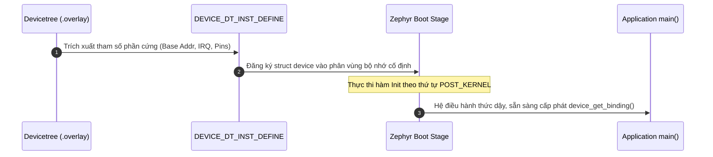
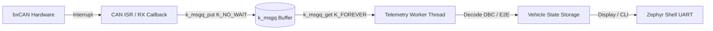
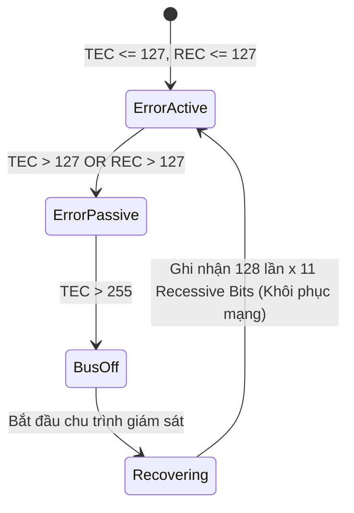

# Cẩm Nang Phỏng Vấn Toàn Diện — Fresher Embedded Firmware Engineer (Zephyr & Automotive)

> **Tài liệu chuẩn hóa phục vụ ôn luyện phỏng vấn kỹ sư nhúng chuyên sâu (Fresher / Junior).**  
> Kết hợp toàn diện giữa **Kiến thức nền tảng (Tech Test)**, **Hệ điều hành Zephyr RTOS**, **Bảo vệ dự án thực chiến (CV Defense)** và **Kỹ năng gỡ lỗi hệ thống (Troubleshooting & Debugging)**.

---

## MỤC LỤC TỔNG QUAN

1. [PHẦN 1 — Kiến Thức Nền Tảng (Tech Test Đầu Vào Chuẩn Fresher)](#phần-1--kiến-thức-nền-tảng-tech-test-đầu-vào-chuẩn-fresher)
   - [1.1 Lập trình C/C++ Embedded](#11-lập-trình-cc-embedded)
   - [1.2 Kiến trúc Vi điều khiển & ARM Cortex-M](#12-kiến-trúc-vi-điều-khiển--arm-cortex-m)
   - [1.3 Giao tiếp Ngoại vi & Bus Truyền thông](#13-giao-tiếp-ngoại-vi--bus-truyền-thông)
   - [1.4 Hệ điều hành Thời gian thực (RTOS Fundamentals)](#14-hệ-điều-hành-thời-gian-thực-rtos-fundamentals)
   - [1.5 Công cụ & Kỹ thuật Debug phần cứng](#15-công-cụ--kỹ-thuật-debug-phần-cứng)
2. [PHẦN 2 — Zephyr RTOS Chuyên Sâu (Đúng Tầm Fresher)](#phần-2--zephyr-rtos-chuyên-sâu-đúng-tầm-fresher)
   - [2.1 Kiến trúc Driver Model & Devicetree](#21-kiến-trúc-driver-model--devicetree)
   - [2.2 Kconfig, Build System (West) & Toolchain](#22-kconfig-build-system-west--toolchain)
   - [2.3 Quản lý Bộ nhớ, Thread IPC & Shell Diagnostic](#23-quản-lý-bộ-nhớ-thread-ipc--shell-diagnostic)
3. [PHẦN 3 — Xoáy Sâu Dự Án Thực Chiến (Bảo Vệ CV)](#phần-3--xoáy-sâu-dự-án-thực-chiến-bảo-vệ-cv)
   - [3.1 Project 1: Automotive CAN Gateway (STM32F746 + Zephyr)](#31-project-1-automotive-can-gateway-stm32f746--zephyr)
   - [3.2 Project 2: High-Speed Bare-Metal TFT & SDHC (STM32F746)](#32-project-2-high-speed-bare-metal-tft--sdhc-stm32f746)
   - [3.3 Project 3: ESP32-S3 Wearable Smartwatch](#33-project-3-esp32-s3-wearable-smartwatch)
   - [3.4 Internship: Hệ thống Giám sát & Đo lường Tép Bạc](#34-internship-hệ-thống-giám-sát--đo-lường-tép-bạc)
4. [PHẦN 4 — Câu Hỏi Tình Huống, Xử Lý Sự Cố & Tư Duy Hệ Thống](#phần-4--câu-hỏi-tình-huống-xử-lý-sự-cố--tư-duy-hệ-thống)
5. [PHẦN 5 — Git, Quy Trình Phát Triển Phần Mềm & Kịch Bản Phỏng Vấn (STAR)](#phần-5--git-quy-trình-phát-triển-phần-mềm--kịch-bản-phỏng-vấn-star)

---

## PHẦN 1 — Kiến Thức Nền Tảng (Tech Test Đầu Vào Chuẩn Fresher)

### 1.1 Lập trình C/C++ Embedded

#### Câu 1: Từ khóa `volatile` dùng khi nào? Tại sao thiếu nó sẽ gây bug nghiêm trọng trong ISR?
* **Bản chất**: Báo cho trình biên dịch (Compiler) biết rằng giá trị của biến có thể bị thay đổi bất kỳ lúc nào bởi các tác nhân bên ngoài luồng thực thi chính (Hardware ngoại vi, ngắt ISR, hoặc một Thread khác), cấm trình biên dịch tối ưu hóa (cấm cache giá trị biến vào thanh ghi CPU R0-R12).
* **3 trường hợp bắt buộc dùng**:
  1. Thanh ghi ngoại vi Memory-Mapped I/O (`#define UART_DR (*(volatile uint32_t*)0x4000UL)`).
  2. Biến cờ (Flag) hoặc biến toàn cục chia sẻ giữa ngắt ISR và vòng lặp `main()`.
  3. Biến toàn cục chia sẻ giữa các tác vụ RTOS (không dùng mutex).
* **Hậu quả nếu thiếu**: Khi biên dịch với cờ tối ưu (`-O2`, `-O3`), trình biên dịch thấy biến cờ trong `while (!flag)` không đổi trong thân hàm, nó sẽ tải giá trị vào thanh ghi CPU 1 lần duy nhất rồi loop vĩnh viễn (`b .`), ngắt ISR dù có bật `flag = 1` trong RAM thì vòng lặp vẫn không bao giờ thoát.

#### Câu 2: Viết các macro thao tác Bitwise kinh điển (`SET`, `CLEAR`, `TOGGLE`, `CHECK`) và mẫu Clear-then-Set.
```c
#define SET_BIT(REG, BIT)     ((REG) |= (1UL << (BIT)))
#define CLEAR_BIT(REG, BIT)   ((REG) &= ~(1UL << (BIT)))
#define TOGGLE_BIT(REG, BIT)  ((REG) ^= (1UL << (BIT)))
#define CHECK_BIT(REG, BIT)   (((REG) >> (BIT)) & 1UL)

/* Clear-then-Set Pattern cho trường nhiều bit (Multi-bit field) */
/* Ví dụ: Ghi giá trị VAL (3 bit) vào vị trí bit POS trong thanh ghi REG */
#define MODIFY_FIELD(REG, MASK, VAL, POS) \
    ((REG) = ((REG) & ~((MASK) << (POS))) | (((VAL) & (MASK)) << (POS)))
```

#### Câu 3: Bản đồ bộ nhớ (Memory Layout) của một chương trình C trong MCU.
Một chương trình Firmware được phân chia thành các phân vùng nhớ rõ ràng:
1. **`.text` (Code Segment)**: Chứa mã máy nhị phân (Flash ROM, quyền Read-Only).
2. **`.rodata`**: Chứa hằng số, chuỗi ký tự (`const int x = 10;`, `"Hello"`) (Flash ROM, Read-Only).
3. **`.data`**: Chứa biến toàn cục và biến `static` **đã được khởi tạo khác 0** (`int g_val = 5;`). Lưu giá trị khởi tạo trong Flash, lúc boot hàm startup copy vào RAM (Read-Write).
4. **`.bss`**: Chứa biến toàn cục và biến `static` **chưa khởi tạo hoặc khởi tạo bằng 0** (`int g_zero = 0; static int count;`). Startup code xóa sạch về 0 trong RAM (Read-Write).
5. **`Stack`**: Vùng nhớ RAM lưu biến cục bộ (local variables), con trỏ frame hàm, và lưu trạng thái thanh ghi CPU khi nhảy vào ngắt ISR. Phát triển từ địa chỉ cao xuống địa chỉ thấp.
6. **`Heap`**: Vùng nhớ RAM dùng cho cấp phát động (`malloc`, `free`). Phát triển từ địa chỉ thấp lên cao.

#### Câu 4: Struct Padding & Data Alignment là gì? Tại sao phải dùng `__attribute__((packed))` trong gói tin CAN/UART?
* **Nguyên lý**: Kiến trúc vi xử lý 32-bit (như Cortex-M) tối ưu hóa truy cập bộ nhớ khi dữ liệu được căn lề theo kích thước tự nhiên: biến 4-byte (`int`, `uint32_t`) phải nằm ở địa chỉ chia hết cho 4. Trình biên dịch tự chèn các byte đệm (Padding Bytes) rỗng vào giữa các trường để đảm bảo căn lề.
* **Ví dụ**:
  ```c
  struct Data {
      char a;     // 1 byte + 3 bytes padding
      int b;      // 4 bytes
      short c;    // 2 bytes + 2 bytes padding
  }; // sizeof = 12 bytes, mặc dù dữ liệu thực chỉ có 7 bytes!
  ```
* **Ứng dụng Network/Driver**: Khi truyền nhận gói tin qua CAN Bus (8 bytes) hoặc UART, nếu ép kiểu trực tiếp struct có padding vào buffer truyền dẫn thì các byte rác padding sẽ bị gửi lên đường truyền, làm lệch toàn bộ offset dữ liệu phía nhận. Bắt buộc dùng `__attribute__((packed))` để loại bỏ hoàn toàn padding bytes.

#### Câu 5: Con trỏ hàm (Function Pointer) — Cho ví dụ dùng trong Callback Driver.
Con trỏ hàm lưu địa chỉ của một đoạn mã thực thi, giúp hiện thực tính trừu tượng và cơ chế Callback không đồng bộ:
```c
typedef void (*uart_rx_callback_t)(uint8_t *data, uint16_t len);

typedef struct {
    USART_TypeDef *instance;
    uart_rx_callback_t rx_cb;
} uart_driver_t;

void uart_register_callback(uart_driver_t *drv, uart_rx_callback_t cb) {
    drv->rx_cb = cb;
}

/* Trong ISR khi nhận đủ gói */
void USART1_IRQHandler(void) {
    if (drv.rx_cb != NULL) {
        drv.rx_cb(rx_buffer, rx_len);
    }
}
```

#### Câu 6: Từ khóa `static` trong C có mấy ý nghĩa?
1. **Biến cục bộ `static` trong hàm**: Duy trì giá trị giữa các lần gọi hàm, được cấp phát tại phân vùng `.data` hoặc `.bss` thay vì trên Stack.
2. **Biến toàn cục `static` ngoài file**: Giới hạn phạm vi truy cập (file scope) chỉ trong file `.c` định nghĩa nó, ngăn chặn xung đột tên với các file khác.
3. **Hàm `static`**: Giới hạn hàm chỉ được gọi trong file `.c` hiện tại (Internal Linkage), cho phép trình biên dịch tối ưu inline hàm.

#### Câu 7: Endianness (Little-Endian vs Big-Endian) và cách kiểm tra bằng code.
* **ARM Cortex-M mặc định là Little-Endian**: Byte có trọng số thấp nhất (LSB) lưu ở địa chỉ bộ nhớ thấp nhất.
* **Mạng / CAN (Motorola format) thường dùng Big-Endian**: Byte trọng số cao nhất (MSB) lưu ở địa chỉ thấp.
* **Đoạn code kiểm tra**:
  ```c
  uint32_t val = 0x01;
  uint8_t *byte_ptr = (uint8_t *)&val;
  if (*byte_ptr == 0x01) {
      // Little-Endian (Byte đầu tiên lưu 0x01)
  } else {
      // Big-Endian
  }
  ```

---

### 1.2 Kiến trúc Vi điều khiển & ARM Cortex-M

#### Câu 8: NVIC là gì? Interrupt Priority hoạt động thế nào?
* **NVIC (Nested Vectored Interrupt Controller)** là khối phần cứng điều khiển ngắt độc quyền trên lõi ARM Cortex-M, hỗ trợ ngắt lồng nhau (Preemption) và thời gian trễ ngắt cực thấp (Deterministic Latency).
* **Cơ chế phân nhóm (Priority Grouping)**: Chia mức ưu tiên của một ngắt thành 2 phần:
  * **Preemption Priority**: Ưu tiên cắt ngang. Nếu ngắt mới có Preemption Priority cao hơn (số nhỏ hơn) ngắt đang chạy, CPU sẽ đình chỉ ngắt hiện tại để phục vụ ngắt mới.
  * **Subpriority**: Ưu tiên xếp hàng. Nếu hai ngắt có cùng Preemption Priority xảy ra đồng thời, ngắt nào có Subpriority cao hơn sẽ được phục vụ trước (không thể cắt ngang nhau).

#### Câu 9: Quy trình Boot từ lúc nhả Reset đến khi vào hàm `main()`.
1. Phần cứng đọc địa chỉ `0x0000_0000` (được ánh xạ từ Flash `0x0800_0000`): Tải giá trị vào thanh ghi con trỏ ngăn xếp chính **MSP (Main Stack Pointer)**.
2. Phần cứng đọc địa chỉ `0x0000_0004`: Tải địa chỉ của **Reset_Handler** vào thanh ghi **PC (Program Counter)**.
3. CPU bắt đầu thực thi hàm `Reset_Handler` trong file startup:
   - Copy phân vùng `.data` từ Flash ROM sang RAM.
   - Xóa sạch (Zero-fill) toàn bộ phân vùng `.bss` trong RAM.
   - Gọi hàm cấu hình xung nhịp hệ thống ban đầu (`SystemInit()`).
   - Cấu hình con trỏ ngăn xếp PSP/MSP hoặc FPU nếu có.
4. Nhảy vào hàm `main()`.

#### Câu 10: Quy trình debug bắt lỗi khi MCU bị rơi vào `HardFault_Handler`.
Khi chương trình bị crash và rơi vào vòng lặp vô tận của `HardFault_Handler`:
1. **Kiểm tra thanh ghi trạng thái lỗi SCB**:
   * Đọc `SCB->HFSR` (HardFault Status Register) để xem lỗi do cưỡng bức (Forced) hay lỗi bảng vector.
   * Đọc `SCB->CFSR` (Configurable Fault Status Register): Phân tích chi tiết lỗi bộ nhớ (MemManage Fault), lỗi bus (BusFault), hoặc lỗi sử dụng (UsageFault: chia cho 0 `DIVBYZERO`, truy cập không căn lề `UNALIGN`, lệnh không hợp lệ `UNDEFINSTR`).
2. **Đọc Stacked Registers (Frame phục hồi)**:
   * Khi nhảy vào ngắt, phần cứng tự đẩy 8 thanh ghi lên Stack: `R0, R1, R2, R3, R12, LR, PC, xPSR`.
   * Trích xuất giá trị `PC` trên Stack để xác định **chính xác địa chỉ dòng lệnh Assembly gây ra lỗi**.
   * Dùng GDB hoặc file `.map` / `addr2line` để chuyển đổi địa chỉ `PC` ngược lại dòng code C tương ứng.

#### Câu 11: Sự cố D-Cache Coherency trên ARM Cortex-M7 (Đặc thù STM32F7).
* **Vấn đề Dirty Cache**: Khi DMA truyền dữ liệu vào SRAM mà không qua CPU, CPU vẫn đọc dữ liệu cũ nằm trên L1 D-Cache line mà không biết dữ liệu dưới SRAM đã thay đổi.
* **Vấn đề Stale Data**: Khi CPU ghi dữ liệu vào buffer (dữ liệu mới chỉ nằm trên D-Cache, chính sách Write-Back), DMA kéo dữ liệu từ physical SRAM gửi ra ngoại vi sẽ gửi toàn dữ liệu rác cũ.
* **Giải pháp kỹ thuật chuẩn**:
  * Trước khi CPU đọc vùng đệm DMA: Gọi `SCB_InvalidateDCache_by_Addr()`.
  * Trước khi kích hoạt DMA gửi đi: Gọi `SCB_CleanDCache_by_Addr()`.
  * **Căn lề bộ nhớ**: Bộ đệm chia sẻ bắt buộc căn lề 32 bytes (`__attribute__((aligned(32)))`) khớp đúng độ dài Cache Line của Cortex-M7, tránh hiện tượng False Sharing làm hỏng các biến liền kề khi Invalidate.
  * Hoặc dùng MPU (Memory Protection Unit) cấu hình vùng đệm DMA thành phân vùng **Non-cacheable**.

---

### 1.3 Giao tiếp Ngoại vi & Bus Truyền thông

#### Câu 12: UART: Baudrate liên quan đến Clock thế nào? Ý nghĩa Start/Stop bit và Parity.
* **Công thức Baudrate**: $\text{Baud} = \frac{f_{CK}}{8 \times (2 - \text{OVER8}) \times \text{USARTDIV}}$. Bộ đếm Clock chia tần số bus để lấy mẫu (Oversampling 16x hoặc 8x) tại điểm giữa của mỗi bit nhằm triệt tiêu rung pha.
* **Start bit (Mức thấp '0')**: Đồng bộ cạnh xuống (Falling Edge) để bộ thu thức dậy và khởi động timer lấy mẫu.
* **Stop bit (Mức cao '1')**: Đảm bảo đường truyền trở về trạng thái rảnh (Idle), cho phép phần cứng nhận diện byte tiếp theo.
* **Parity bit**: Kiểm tra chẵn/lẻ để phát hiện lỗi biến dạng bit (1-bit flip).

#### Câu 13: SPI: Full-Duplex là gì? Giải thích CPOL và CPHA.
* **Full-Duplex**: Khả năng truyền (MOSI) và nhận (MISO) đồng thời trên cùng một chu kỳ xung clock (SCK) nhờ kiến trúc Shift Register lồng nhau.
* **CPOL (Clock Polarity)**: Mức logic của chân SCK khi bus ở trạng thái nghỉ (`CPOL=0`: Nghỉ mức 0; `CPOL=1`: Nghỉ mức 1).
* **CPHA (Clock Phase)**: Cạnh xung dùng để chốt mẫu dữ liệu (`CPHA=0`: Mẫu chốt ở cạnh xung đầu tiên; `CPHA=1`: Mẫu chốt ở cạnh xung thứ hai).

#### Câu 14: CAN Bus: Tại sao cần 2 điện trở đầu cuối 120 Ohm? Phân biệt Dominant và Recessive.
* **Điện trở 120 Ohm**: Đường truyền vi sai CAN là một đường dây truyền sóng dài (Transmission Line). Khi tín hiệu truyền tới cuối cáp, nếu không có trở đầu cuối tương thích trở kháng đặc tính của cáp ($120\ \Omega$), sóng tín hiệu sẽ bị dội ngược (Reflection), gây triệt tiêu hoặc biến dạng méo xung, sinh lỗi CRC Error hàng loạt. Hai trở $120\ \Omega$ mắc song song ở 2 đầu tạo nên tổng trở bus tương đương $60\ \Omega$.
* **Dominant (Bit Trội - Logic 0)**: Cả 2 chân chênh lệch điện áp ($V_{CAN\_H} \approx 3.5\text{V}$, $V_{CAN\_L} \approx 1.5\text{V}$, $\Delta V \approx 2.0\text{V}$).
* **Recessive (Bit Lặn - Logic 1)**: Hai chân có điện áp bằng nhau ($V_{CAN\_H} \approx V_{CAN\_L} \approx 2.5\text{V}$, $\Delta V \approx 0\text{V}$).
* **Cơ chế phân xử (Arbitration)**: Nếu một node phát Dominant (0) và một node phát Recessive (1) cùng lúc, trạng thái trên bus sẽ là Dominant (0). Do đó, node phát 1 thấy bus là 0 sẽ nhận diện bị mất quyền ưu tiên và lập tức dừng phát. **ID số càng nhỏ thì độ ưu tiên càng cao**.

#### Câu 15: DMA dùng để làm gì? Lợi ích so với Polling và Interrupt.
* **Bản chất**: DMA (Direct Memory Access) là một bộ điều khiển phần cứng độc lập cho phép truyền dữ liệu trực tiếp giữa Ngoại vi $\leftrightarrow$ Bộ nhớ hoặc Bộ nhớ $\leftrightarrow$ Bộ nhớ mà hoàn toàn không cần CPU can thiệp vào từng byte.
* **So sánh**:
  * *Polling*: CPU chiếm dụng 100% thời gian chạy vòng lặp kiểm tra cờ (Lãng phí tài nguyên).
  * *Interrupt*: Mỗi byte nhận/gửi đều kích hoạt ngắt, CPU phải tốn chi phí đẩy/kéo thanh ghi vào Stack (Context Switching Overhead), nếu tốc độ truyền cao (vài Mbps) sẽ làm sập CPU (Interrupt Flooding).
  * *DMA*: CPU chỉ tốn chi phí khởi động lúc đầu và nhận 1 ngắt duy nhất khi hoàn tất toàn bộ khối dữ liệu (`Transfer Complete`).

---

### 1.4 Hệ điều hành Thời gian thực (RTOS Fundamentals)

#### Câu 16: Phân biệt Mutex, Binary Semaphore và Message Queue.
| Cơ chế | Mục đích chính | Khái niệm Ownership | Sử dụng trong ISR |
|---|---|---|---|
| **Mutex** | Loại trừ tương hỗ (Mutual Exclusion) bảo vệ tài nguyên chia sẻ | **CÓ**: Thread nào Lock thì chính Thread đó phải Unlock | **CẤM HOÀN TOÀN** (Không có context để sở hữu) |
| **Binary Semaphore** | Báo hiệu sự kiện (Signaling) hoặc đồng bộ giữa các tác vụ | **KHÔNG**: Một tác vụ (hoặc ISR) có thể Give, tác vụ khác Take | **ĐƯỢC PHÉP** (Thường dùng ISR Give cho Task Take) |
| **Message Queue** | Truyền dữ liệu an toàn kèm đồng bộ (Data passing by value) | Quản lý bộ đệm FIFO an toàn luồng | Được phép `Put` với cờ `No Wait` |

#### Câu 17: Quy tắc vàng: Tại sao CẤM chặn (Block/Sleep) bên trong ngắt ISR?
* **Lý do**: ISR chạy trong Context đặc quyền của CPU (Interrupt Context / Handler Mode), hoàn toàn không phải là một Thread và **không có bảng mô tả tác vụ (TCB - Thread Control Block) riêng để lưu ngữ cảnh**.
* Nếu gọi một hàm gây Block (như `k_msleep()`, `k_mutex_lock()` hoặc chờ Semaphore vĩnh viễn), hệ thống sẽ không có cơ chế chuyển giao ngữ cảnh ra ngoài, dẫn tới treo toàn bộ vi điều khiển (Kernel Panic hoặc HardFault).
* **Quy tắc**: Trong ISR chỉ thực hiện đọc/xóa cờ phần cứng nhanh nhất có thể, đưa dữ liệu vào hàng đợi bằng hàm không chờ (`K_NO_WAIT`), hoặc phát tín hiệu kích hoạt một Thread cấp cao xử lý thông qua cơ chế Deferred Workqueue.

#### Câu 18: Hiện tượng Nghịch đảo Ưu tiên (Priority Inversion) và Cơ chế Priority Inheritance.
* **Hiện tượng**: Task ưu tiên cao (Task H) bị chặn bởi Task ưu tiên thấp (Task L) do Task L đang nắm giữ Mutex. Một Task trung bình (Task M) không cần Mutex nhưng có ưu tiên cao hơn Task L sẽ chiếm quyền CPU của Task L, gián tiếp làm Task H bị trễ vô thời hạn.
* **Giải pháp (Priority Inheritance)**: Khi Task H cố gắng lấy Mutex đang bị Task L giữ, RTOS sẽ tạm thời nâng mức ưu tiên của Task L lên bằng với Task H. Nhờ đó, Task M không thể xen ngang Task L. Khi Task L nhả Mutex, mức ưu tiên của nó sẽ hạ về ban đầu và Task H lập tức chiếm quyền xử lý.

---

### 1.5 Công cụ & Kỹ thuật Debug phần cứng

#### Câu 19: JTAG vs SWD khác nhau thế nào?
* **JTAG (Joint Test Action Group)**: Chuẩn gỡ lỗi công nghiệp truyền thống, sử dụng 4-5 chân tín hiệu (`TCK`, `TMS`, `TDI`, `TDO`, `nTRST`). Cho phép kết nối chuỗi nhiều chip (Daisy-chain).
* **SWD (Serial Wire Debug)**: Chuẩn tối ưu hóa riêng cho ARM Cortex, chỉ sử dụng đúng **2 chân tín hiệu**:
  * `SWDIO`: Đường dữ liệu hai chiều.
  * `SWCLK`: Đường xung nhịp.
* **Ưu thế SWD**: Tiết kiệm chân IO quý giá trên vi điều khiển, tốc độ truyền dữ liệu nhanh tương đương JTAG.

#### Câu 20: Logic Analyzer vs Oscilloscope — Dùng khi nào?
* **Logic Analyzer**: Chuyên dụng thu thập tín hiệu logic số (0 hoặc 1) trên nhiều kênh cùng lúc (8 đến 32 kênh), giải mã trực tiếp các giao thức cấp cao (UART, SPI, I2C, CAN). Dùng khi cần phân tích luồng dữ liệu, bắt lỗi timing trạng thái hoặc đo đạc thời gian đáp ứng giao thức.
* **Oscilloscope (Máy hiện sóng)**: Đo điện áp thực tế tương tự (Analog) theo thời gian thực với băng thông cao. Dùng khi cần kiểm tra tính toàn vẹn tín hiệu (Signal Integrity), méo dạng xung, sụt áp nguồn, nhiễu dội tín hiệu (Ringing), hoặc đo chênh lệch điện áp vi sai CAN.

---

## PHẦN 2 — Zephyr RTOS Chuyên Sâu (Đúng Tầm Fresher)

### 2.1 Kiến trúc Driver Model & Devicetree

#### Câu 21: Triết lý Driver Model của Zephyr là gì? Tại sao tách rời driver khỏi code ứng dụng?
* Trong Bare-Metal truyền thống, mã ứng dụng bị ràng buộc chặt chẽ với thanh ghi phần cứng cụ thể (Hard-coded Register).
* Zephyr thiết kế theo kiến trúc hướng đối tượng chuẩn hóa bằng C:
  * **Tách biệt phần cứng (Devicetree)**: Khai báo chân cẳng, địa chỉ cơ sở và clock bằng file text `.dts` / `.overlay`.
  * **API chuẩn hóa**: Mọi driver cùng loại (ví dụ CAN driver) đều phải hiện thực một cấu trúc hàm con trỏ chuẩn (`struct can_driver_api`).
  * **Lợi ích**: Code ứng dụng gọi các hàm chuẩn như `can_send()`, `can_set_timing()`. Khi chuyển sang vi điều khiển của hãng khác (từ STM32 sang NXP hoặc ESP32), code ứng dụng giữ nguyên 100%, chỉ cần tráo đổi Devicetree.

#### Câu 22: Ý nghĩa của macro `DEVICE_DT_INST_DEFINE` trong Zephyr Driver.
Đây là macro cốt lõi của Zephyr dùng để khởi tạo một đối tượng thiết bị (`struct device`) tại thời điểm biên dịch (Compile-time) dựa trên các node tương ứng tìm thấy trong Devicetree:
* Đăng ký cấu trúc dữ liệu cấu hình hằng (`config`).
* Đăng ký biến trạng thái runtime (`data`).
* Thiết lập mức độ ưu tiên khởi động (`Init Level`: `PRE_KERNEL_1`, `POST_KERNEL`...) và thứ tự khởi tạo phần cứng trước khi hàm `main()` của hệ điều hành chạy.



#### Câu 23: Giải thích một đoạn Devicetree Overlay thực tế cho CAN Controller.
```dts
&can1 {
    status = "okay";               /* Kích hoạt ngoại vi CAN1 trên phần cứng */
    pinctrl-0 = <&can1_rx_pb8 &can1_tx_pb9>; /* Ghép kênh chân Pinmux: PB8 RX, PB9 TX */
    pinctrl-names = "default";
    bus-speed = <500000>;          /* Cấu hình tốc độ mạng: 500 kbps */
    sample-point = <875>;          /* Điểm lấy mẫu tối ưu chuẩn CiA: 87.5% */
};
```
* `&can1`: Node reference trỏ tới bộ điều khiển CAN1 có sẵn của board STM32F7.
* `status = "okay"`: Đổi trạng thái từ `disabled` sang hoạt động, thông báo cho hệ thống sinh code driver.
* `pinctrl-0`: Cấu hình thanh ghi đa hợp GPIO alternate function tự động thông qua subsystem Pinctrl.

---

### 2.2 Kconfig, Build System (West) & Toolchain

#### Câu 24: Kconfig dùng để làm gì? Khác gì so với `#define` trong bare-metal?
* **Kconfig**: Hệ thống quản lý cấu hình biên dịch kế thừa từ Linux Kernel. Cho phép bật/tắt module, cấu hình tham số hệ thống thông qua giao diện đồ họa (`west build -t menuconfig`) hoặc file `prj.conf`.
* **Ưu việt hơn `#define`**:
  * Kiểm tra tính phụ thuộc (Dependency Tracking): Nếu bật `CONFIG_CAN=y`, Kconfig tự động yêu cầu bật `CONFIG_PINCTRL=y`. Nếu thiếu, nó sẽ báo lỗi ngay khi cấu hình thay vì lỗi biên dịch ngầm.
  * Chỉ biên dịch những file thực sự được dùng (Conditional Compilation trong CMake), tối ưu hóa dung lượng Flash/RAM xuống mức tối thiểu.

#### Câu 25: West là gì? Mô tả quy trình Build và Flash dự án Zephyr.
* **West**: Công cụ dòng lệnh Meta-tool độc quyền của Zephyr, đảm nhận 3 vai trò:
  1. Quản lý đa kho lưu trữ (Multi-repo management qua file `west.yml`).
  2. Kích hoạt chuỗi build (Gọi CMake và Ninja để compile code).
  3. Giao tiếp với mạch nạp (Gọi OpenOCD/JLink/STM32CubeProgrammer để flash và debug).
* **Quy trình lệnh**:
  ```bash
  # 1. Khởi tạo và đồng bộ mã nguồn Zephyr
  west init -m <repo_url> && west update
  # 2. Build dự án cho board STM32F746G-DISCO
  west build -b stm32f746g_disco app -p always
  # 3. Nạp code trực tiếp xuống kit qua ST-Link
  west flash
  ```

---

### 2.3 Quản lý Bộ nhớ, Thread IPC & Shell Diagnostic

#### Câu 26: Zephyr phát hiện tràn Stack bằng cơ chế nào?
1. **Phần cứng (`CONFIG_MPU_STACK_GUARD=y`)**: Cơ chế an toàn và triệt để nhất. Zephyr dùng MPU của ARM Cortex-M cấu hình một phân vùng nhỏ (32 bytes) ở đáy mỗi Stack thành vùng cấm ghi (Read-Only). Ngay khi Thread sử dụng quá giới hạn, CPU ghi vào vùng này sẽ lập tức kích hoạt `MemManage Fault`, hệ thống bắt gọn lỗi tràn stack trước khi nó kịp làm hỏng dữ liệu của Thread khác.
2. **Phần mềm (`CONFIG_STACK_SENTINEL=y`)**: Ghi một chuỗi byte đặc biệt (Canary pattern) vào đáy stack lúc khởi tạo. Khi bộ lập lịch chuyển đổi ngữ cảnh (Context Switch), hệ thống kiểm tra xem chuỗi này có bị ghi đè hay không.

#### Câu 27: Kiến trúc xử lý Actor Pattern bằng `k_msgq` trong dự án Automotive Gateway.
Để đảm bảo tính thời gian thực và an toàn luồng tuyệt đối, mô hình Producer-Consumer được áp dụng:
* **CAN RX Worker Thread (Producer)**: Nhận gói tin thô từ CAN Driver ISR đưa vào hàng đợi `k_msgq_put(&can_rx_msgq, &frame, K_NO_WAIT)`. Cấm xử lý tính toán nặng ở tầng này để không nghẽn đường truyền.
* **Safety & Diagnostics Engine Thread (Consumer)**: Lấy dữ liệu bằng `k_msgq_get(&can_rx_msgq, &frame, K_FOREVER)`, thực hiện giải mã tín hiệu DBC, kiểm tra chuỗi E2E CRC-8 và đẩy sang Shell CLI.



---

## PHẦN 3 — Xoáy Sâu Dự Án Thực Chiến (Bảo Vệ CV)

### 3.1 Project 1: Automotive CAN Gateway (STM32F746 + Zephyr)

#### Câu 28: Bit Timing 500kbps: Với Clock APB1 cụ thể của STM32F7, tính toán Prescaler, BS1, BS2 và Sample Point như thế nào?
* **Cơ sở phần cứng**: Trên STM32F746 chạy tối đa 216MHz, bus APB1 giới hạn tốc độ tối đa là $54\text{ MHz}$.
* **Chuẩn hóa CiA 301**: Tốc độ $500\text{ kbps}$ (Chu kỳ 1 bit $T_{bit} = 2000\text{ ns}$), Điểm lấy mẫu (Sample Point) khuyến nghị là $87.5\%$.
* **Tính toán bước chia thời gian (Time Quanta - $t_q$)**:
  * Chọn tổng số Time Quanta cho 1 bit: $N = 18\ t_q$.
  * Tần số chia baud: $f_{CAN} = 500\text{ kbps} \times 18 = 9\text{ MHz}$.
  * Hệ số chia Prescaler: $BRP = \frac{f_{APB1}}{f_{CAN}} = \frac{54\text{ MHz}}{9\text{ MHz}} = 6$.
* **Phân bổ các đoạn trong 1 bit**:
  * $\text{Sync\_Seg} = 1\ t_q$ (Cố định).
  * Điểm lấy mẫu $87.5\% \implies \text{Sync\_Seg} + BS1 = 18 \times 0.875 = 15.75 \approx 15\ t_q \implies BS1 = 14\ t_q$.
  * $BS2 = 18 - (\text{Sync\_Seg} + BS1) = 18 - 15 = 3\ t_q$.
  * Điểm lấy mẫu thực tế: $\frac{1 + 14}{18} = \frac{15}{18} = 83.33\%$ (hoặc chọn $N=16\ t_q$: $BRP=6$ khi $f_{APB1}=48\text{MHz}$, $\text{Sync}=1, BS1=13, BS2=2 \implies 87.5\%$).
  * Bước nhảy đồng bộ: $SJW = 1\ t_q$.

#### Câu 29: Bộ lọc phần cứng "6 Hardware Filter Banks": Dùng Mode nào? Tại sao chọn 6?
* **Chế độ sử dụng**: Kết hợp **Identifier Mask Mode** và **Identifier List Mode**.
  * Dùng *List Mode* cho 4 ID chẩn đoán khẩn cấp cố định (ví dụ: `0x7DF` OBD-II Broadcast Request, `0x100` Emergency Brake).
  * Dùng *Mask Mode* cho 2 dải ID telemetry (ví dụ: bắt toàn bộ dải động cơ `0x200 - 0x20F` bằng Mask `0x7F0`).
* **Lý do chọn 6 Bank**: STM32F746 có tổng cộng 28 Filter Banks chia sẻ giữa CAN1 và CAN2. Dự án phân bổ 6 Filter Banks riêng cho CAN1 đảm bảo chỉ những gói tin thuộc hệ thống giám sát mới đánh thức CPU, lọc bỏ 100% các gói tin Broadcast rác khác trên xe, giúp tải CPU duy trì dưới 2%.

#### Câu 30: Cơ chế phục hồi lỗi ngắt mạng ISO 11898-1 Bus-Off Recovery FSM.
* **Cơ chế phần cứng**: Khi bộ đếm lỗi truyền $TEC > 255$, CAN controller tự ngắt khỏi bus để tránh làm tê liệt đường truyền (Trạng thái Bus-Off).
* **Quy chuẩn phục hồi**: Theo chuẩn ISO 11898-1, một node chỉ được phép tái hòa nhập mạng sau khi **giám sát thấy 128 chu kỳ gồm 11 bit lặn (Recessive bits) liên tiếp** trên bus rảnh.
* **Hiện thực trong Driver**:
  * Đăng ký `can_set_state_change_callback()` để bắt sự kiện `CAN_STATE_BUS_OFF`.
  * Khởi động máy trạng thái (FSM) cách ly: Chuyển sang trạng thái `RECOVERING`, đợi cờ phần cứng xác nhận đủ 128 chuỗi 11 bit lặn, tự động xóa biến đếm lỗi và chuyển trạng thái về `ACTIVE` trong vòng dưới 100ms.



#### Câu 31: Giải mã tín hiệu định dạng Fixed-Point từ dữ liệu CAN thô.
* **Tại sao dùng Fixed-Point thay vì `float`**: Vi điều khiển thực thi số nguyên (Integer Math) nhanh hơn rất nhiều so với tính toán dấu phẩy động (Floating-Point), đồng thời tránh sai số làm tròn khi xử lý tín hiệu an toàn.
* **Công thức chuẩn Vector DBC**:
  $$\text{Physical Value} = (\text{Raw Value} \times \text{Factor}) + \text{Offset}$$
* **Ví dụ thực tế**: Tín hiệu Tốc độ Động cơ (Engine RPM) có độ dài 16 bits, Factor = $0.25$, Offset = $0$:
  * Nếu dùng `float`: `float rpm = raw * 0.25f;` (Tốn chu kỳ FPU).
  * Kỹ thuật Fixed-Point: Nhân tỉ lệ với $100$: $\text{RPM\_centi} = \text{raw} \times 25$. Khi cần hiển thị ra màn hình/UART chỉ việc chia lấy phần nguyên và dư: `printf("%d.%02d RPM", rpm_centi / 100, rpm_centi % 100)`.

---

### 3.2 Project 2: High-Speed Bare-Metal TFT & SDHC (STM32F746)

#### Câu 32: Công thức tính Pixel Clock (PCLK) cho panel 480x272 @ 60Hz.
Tần số quét khung hình dựa trên tổng độ phân giải hiển thị cộng với các khoảng dập xung đồng bộ ngang (Horizontal Blanking) và dọc (Vertical Blanking):
* **Tổng điểm ảnh ngang**: $H_{total} = \text{Active} (480) + \text{HSYNC} (41) + \text{HBP} (13) + \text{HFP} (32) = 566\text{ pixels}$.
* **Tổng đường quét dọc**: $V_{total} = \text{Active} (272) + \text{VSYNC} (10) + \text{VBP} (2) + \text{VFP} (2) = 286\text{ lines}$.
* **Tần số Pixel Clock lý thuyết**:
  $$f_{PCLK} = H_{total} \times V_{total} \times \text{Frame Rate} = 566 \times 286 \times 60 \approx 9.71\text{ MHz}$$
* **Cấu hình phần cứng**: Cấp nguồn từ `PLLSAI`, cấu hình bộ chia `PLLSAIDIVR` để sinh ra xung nhịp xấp xỉ $9.6\text{ MHz} \sim 9.7\text{ MHz}$, mang lại tốc độ quét mượt mà chính xác $60\text{ FPS}$.

#### Câu 33: Kỹ thuật Double Buffering VSYNC Reload triệt tiêu hiện tượng xé hình (Tearing-Free).
* **Nguyên nhân gây Tearing**: CPU/DMA ghi dữ liệu khung hình mới vào đúng vùng nhớ mà bộ điều khiển LTDC đang quét ra màn hình.
* **Cơ chế giải quyết**:
  1. Cấp phát 2 bộ đệm khung (FrameBuffer 0 và FrameBuffer 1) nằm trên bộ nhớ ngoài FMC SDRAM.
  2. LTDC hiển thị FrameBuffer 0. Ứng dụng/DMA2D render hình ảnh mới vào FrameBuffer 1.
  3. Khi render xong, ghi địa chỉ FrameBuffer 1 vào thanh ghi nạp địa chỉ lớp `LTDC_Layer1->CFBAR`.
  4. Bật bit kích hoạt nạp lại khi dập đứng: `LTDC->SRCR = LTDC_SRCR_VBR` (Vertical Blanking Reload).
  5. Phần cứng chờ quét hết toàn bộ khung hình hiện tại, tại thời điểm chùm tia quét quay về góc trên (VSYNC Period), địa chỉ mới được nạp tự động, triệt tiêu 100% hiện tượng xé hình.

---

### 3.3 Project 3: ESP32-S3 Wearable Smartwatch

#### Câu 34: Tại sao phải tách riêng 2 cổng I2C (Dual I2C Ports)?
* **Vấn đề khi dùng chung 1 bus I2C**: Cảm biến nhịp tim quang học (MAX30102) và cảm biến chuyển động (BMI270) yêu cầu lấy mẫu liên tục với tần số cao. Trong khi đó, màn hình cảm ứng điện dung (Touch Controller) phát sinh ngắt không theo chu kỳ khi người dùng thao tác vuốt lướt.
* Nếu dùng chung bus, khi CPU đang bận truyền dữ liệu cảm biến mà chạm tay vào màn hình, lệnh I2C của Touch sẽ bị xếp hàng chờ, gây ra độ trễ phản hồi cảm ứng (Touch Lag) rõ rệt.
* **Giải pháp**: Tách Port 0 cho Touch Controller (đảm bảo độ nhạy tức thì dưới 10ms) và Port 1 cho mảng cảm biến sinh trắc học.

#### Câu 35: Dung lượng 25µA Standby: Hiện thực thế nào? Có khả thi khi vẫn giữ BLE Advertising không?
* **Thực tế kỹ thuật**: Nếu vi điều khiển vẫn duy trì phát quảng bá BLE (Advertising) ở chu kỳ ngắn (100ms), dòng tiêu thụ trung bình không thể nào đạt mức $25\ \mu\text{A}$ (thường dao động $1\text{ mA} \sim 3\text{ mA}$).
* **Kiến trúc đạt 25µA**:
  * Đưa ESP32-S3 vào chế độ **Deep Sleep**, tắt toàn bộ lõi CPU chính và khối Radio RF.
  * Mạch nguồn sử dụng bóng bán dẫn PMOS để ngắt hẳn nguồn cung cấp (Power-Gating) cho GPS, cảm biến nhịp tim quang học và màn hình.
  * Chỉ duy trì nguồn cho khối ULP Coprocessor và RTC Timer đo bước chân hoặc chờ ngắt thức giấc từ nút bấm vật lý.

---

### 3.4 Internship: Hệ thống Giám sát & Đo lường Tép Bạc

#### Câu 36: Hiện tượng lỗi timing trên đường truyền RS485 và cách phát hiện bằng Oscilloscope.
* **Hiện tượng**: Đường truyền RS485 dùng bộ thu phát bán song công (Half-Duplex), vi điều khiển phải điều khiển chân `DE` (Driver Enable) để chuyển đổi chiều thu/phát.
* **Lỗi quan sát trên máy hiện sóng**:
  * Sau khi gửi byte cuối cùng, nếu hạ chân `DE` xuống mức thấp quá sớm (ngay khi cờ `TXE` bật mà cờ `TC - Transmission Complete` chưa bật), byte cuối cùng sẽ bị cắt đứt nửa chừng, mất Stop bit và máy thu báo lỗi Framing Error.
  * Ngược lại, nếu giữ chân `DE` quá lâu sau khi truyền xong, phản hồi từ thiết bị tớ (Slave) sẽ bị đụng độ bus (Bus Contention), làm méo dạng điện áp vi sai.

---

## PHẦN 4 — Câu Hỏi Tình Huống, Xử Lý Sự Cố & Tư Duy Hệ Thống

### Câu 37: Nếu một Thread quan trọng không được chạy dù có công việc cần xử lý, em sẽ nghi ngờ điều gì đầu tiên?
Quy trình tư duy 3 bước:
1. **Bị chặn bởi Mutex / Semaphore (Deadlock hoặc Livelock)**: Kiểm tra xem Thread có đang cố gắng lấy một tài nguyên bị khóa bởi tác vụ khác không nhả ra hay không.
2. **Bị chiếm dụng thời gian (Starvation do Priority)**: Kiểm tra bảng ưu tiên. Có một Thread ưu tiên cao hơn đang chạy vòng lặp liên tục (`while(1)` không có `k_sleep` hoặc `yield`) làm bộ lập lịch không bao giờ nhường quyền.
3. **Tràn Stack (Stack Overflow)**: Thread đã bị sụp đổ ngữ cảnh do tràn stack làm hỏng con trỏ TCB, khiến bộ lập lịch loại bỏ tác vụ khỏi danh sách `Ready List`.

### Câu 38: Mạng CAN Bus bị nhiễu, tỷ lệ lỗi gói tin rất cao — Quy trình kiểm tra thực địa.
1. **Kiểm tra phần cứng & trở đầu cuối**: Tắt nguồn toàn bộ hệ thống, dùng đồng hồ vạn năng đo điện trở giữa chân CAN_H và CAN_L. Giá trị chuẩn bắt buộc phải là $60\ \Omega$ (sai số $\pm 5\%$). Nếu đo được $120\ \Omega$ nghĩa là đứt 1 trở; nếu đo ra $0\ \Omega$ là chập dây.
2. **Kiểm tra điểm lấy mẫu (Sample Point)**: Dùng Logic Analyzer kiểm tra cấu hình Bit Timing giữa các node trên bus có lệch nhau không (chuẩn phải đồng nhất tại $87.5\%$).
3. **Kiểm tra nối đất (Common Ground)**: Đảm bảo mass của các node trên mạng ô tô được nối chung hoặc có biến áp cách ly để tránh chênh lệch điện thế đất (Ground Shift).

---

## PHẦN 5 — Git, Quy Trình Phát Triển Phần Mềm & Kịch Bản Phỏng Vấn (STAR)

### 5.1 Quy chuẩn Git & Làm việc chuyên nghiệp

#### Câu 39: Giải thích quy ước Conventional Commits và ví dụ thực tế.
Quy chuẩn giúp lịch sử Git rõ ràng và hỗ trợ tự động sinh Changelog:
* `feat`: Thêm tính năng mới (ví dụ: `feat(can): implement iso 11898 bus-off recovery fsm`).
* `fix`: Sửa lỗi phần mềm (ví dụ: `fix(uart): clear overrun error flag to prevent dma freeze`).
* `docs`: Cập nhật tài liệu (ví dụ: `docs: update bit timing derivation formulas`).
* `refactor`: Tái cấu trúc code nhưng không thay đổi hành vi ngoại vi.

#### Câu 40: Khi gặp xung đột (Git Conflict) trong quá trình Rebase, em xử lý thế nào?
1. Git tạm dừng rebase tại commit gây xung đột.
2. Mở file xung đột, phân tích sự khác nhau giữa nhánh hiện tại (`HEAD`) và nhánh rebase (`Incoming`).
3. Chỉnh sửa code giữ lại logic đúng nhất, lưu file.
4. Gõ `git add <file>` để đánh dấu đã giải quyết (Tuyệt đối **không** dùng `git commit`).
5. Gõ `git rebase --continue` để Git tiếp tục áp dụng các commit còn lại.

---

### 5.2 Kịch Bản Giới Thiệu Bản Thân 60 Giây (Chuẩn Phương Pháp STAR)

> *"Em chào anh/chị. Em là [Tên], tốt nghiệp chuyên ngành Kỹ thuật Máy tính/Điện Tử. Định hướng của em là trở thành một Kỹ sư Lập trình Nhúng Firmware chuyên sâu về kiến trúc hệ điều hành và giao thức ô tô.*
> 
> * **Situation & Task:** Trong quá trình học tập, nhận thấy các dự án sinh viên thường chỉ dừng lại ở mức gọi thư viện HAL cơ bản, em đặt mục tiêu làm chủ vi điều khiển từ tầng thanh ghi Bare-metal cho đến hệ điều hành chuyên dụng chuẩn công nghiệp Zephyr RTOS trên chip ARM Cortex-M7.*
> * **Action:** Em đã xây dựng thành công 2 dự án kỹ thuật độc lập: Một cụm Telematics & CAN Gateway chạy Zephyr RTOS đạt chuẩn an toàn AUTOSAR E2E, lọc phần cứng 6 filter banks và xử lý tín hiệu DBC bằng Fixed-Point; và một hệ thống Bare-Metal điều khiển trực tiếp thanh ghi FMC SDRAM và bộ tăng tốc đồ họa DMA2D đạt tốc độ hiển thị 60 FPS không giật xé hình.*
> * **Result:** Toàn bộ mã nguồn em đều tổ chức theo chuẩn kiến trúc module, đo lường định lượng bằng DWT Cycle Counter và viết Unit Test tự động. Với nền tảng hiểu sâu bản chất phần cứng và tư duy làm phần mềm chuẩn hóa, em tin mình sẽ nhanh chóng đóng góp hiệu quả vào các dự án nhúng tại quý công ty."*

---

> [!TIP]
> **Lời khuyên phòng phỏng vấn**: Hãy luôn trả lời theo công thức: **Nêu nguyên lý cốt lõi $\to$ Đưa ra con số kỹ thuật thực tế $\to$ Phân tích nguyên nhân tại sao chọn giải pháp đó**. Phong thái tự tin, trung thực nhận định những gì đã làm và sẵn sàng tiếp thu những kiến thức mới sẽ luôn chinh phục được nhà tuyển dụng.
