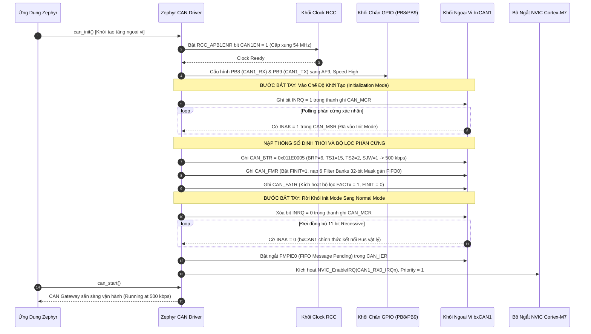
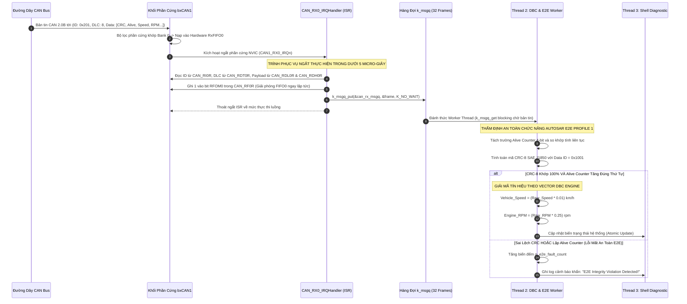
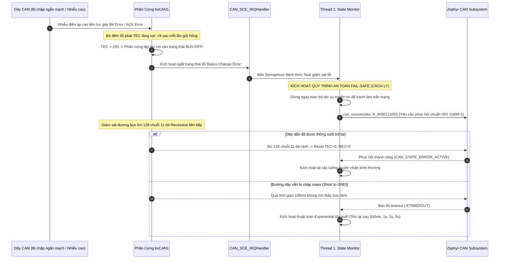

# Cẩm Nang Phỏng Vấn Dự Án 1: Automotive CAN Telematics Gateway

> **Hệ Thống:** Automotive CAN Telematics Gateway & Diagnostic Node  
> **Nền Tảng Phần Cứng:** STM32F746NG (ARM Cortex-M7 @ 216 MHz, MPU, L1 Cache 16KB)  
> **Hệ Điều Hành & Framework:** Zephyr RTOS (v3.x), Kconfig, DeviceTree, West CLI  
> **Chuẩn Công Nghiệp Ô Tô:** CAN 2.0B (ISO 11898-1), AUTOSAR E2E Profile 1 (CRC-8 SAE J1850), Vector DBC Engine, Zephyr Shell CLI  
> **Tài liệu nền tảng tham chiếu:** [`day00_baremetal_foundations.md`](file:///d:/Project/STM32F7/day00_baremetal_foundations.md), STM32F746 Reference Manual (RM0385 Chapter 30: bxCAN).

---

## MỤC LỤC TỔNG QUAN

- [1. TỔNG QUAN HỆ THỐNG & KIẾN TRÚC PHẦN MỀM](#1-tổng-quan-hệ-thống--kiến-trúc-phần-mềm)
  - [1.1. Mục Tiêu Dự Án & Thông Số Kỹ Thuật Định Lượng](#11-mục-tiêu-dự-án--thông-số-kỹ-thuật-định-lượng)
  - [1.2. Sơ Đồ Khối Kiến Trúc Phân Tầng & Luồng Dữ Liệu Đa Nhiệm (Zephyr Multi-threading)](#12-sơ-đồ-khối-kiến-trúc-phân-tầng--luồng-dữ-liệu-đa-nhiệm-zephyr-multi-threading)
  - [1.3. Cấu Trúc Khung CAN 2.0B & Cấu Hình DeviceTree Chuẩn Ô Tô](#13-cấu-trúc-khung-can-20b--cấu-hình-devicetree-chuẩn-ô-tô)
- [2. LÝ THUYẾT CỐT LÕI & CÔNG THỨC BẮT BUỘC PHẢI NHỚ](#2-lý-thuyết-cốt-lõi--công-thức-bắt-buộc-phải-nhớ)
  - [2.1. Chi Tiết CAN Bit Timing & Bảng Thanh Ghi CAN_BTR (500 kbps @ APB1 54 MHz)](#21-chi-tiết-can-bit-timing--bảng-thanh-ghi-can_btr-500-kbps--apb1-54-mhz)
  - [2.2. Cơ Chế Bộ Lọc bxCAN Filter Bank: Bố Cục Bit 32-bit Mask & Quy Trình Nạp RMW](#22-cơ-chế-bộ-lọc-bxcan-filter-bank-bố-cục-bit-32-bit-mask--quy-trình-nạp-rmw)
  - [2.3. AUTOSAR E2E Profile 1: Đa Thức CRC-8 SAE J1850, Alive Counter & Data ID](#23-autosar-e2e-profile-1-đa-thức-crc-8-sae-j1850-alive-counter--data-id)
  - [2.4. Máy Trạng Thái Quản Lý Lỗi CAN (Fault Confinement - ISO 11898-1)](#24-máy-trạng-thái-quản-lý-lỗi-can-fault-confinement---iso-11898-1)
- [3. SƠ ĐỒ TUẦN TỰ HOẠT ĐỘNG (MERMAID SEQUENCE DIAGRAMS)](#3-sơ-đồ-tuần-tự-hoạt-động-mermaid-sequence-diagrams)
  - [3.1. Quy Trình Cấu Hình Khởi Động Phần Cứng (Peripheral Configuration Pipeline)](#31-quy-trình-cấu-hình-khởi-động-phần-cứng-peripheral-configuration-pipeline)
  - [3.2. Quy Trình Vận Hành & Bắt Tay Dữ Liệu Thời Gian Thực (Runtime Dataflow)](#32-quy-trình-vận-hành--bắt-tay-dữ-liệu-thời-gian-thực-runtime-dataflow)
  - [3.3. Quy Trình Xử Lý Sự Cố & Phục Hồi An Toàn (Fault & Recovery Pipeline)](#33-quy-trình-xử-lý-sự-cố--phục-hồi-an-toàn-fault--recovery-pipeline)
- [4. PHÂN LOẠI BUG THỰC TẾ & BẪY PHẦN CỨNG KINH ĐIỂN](#4-phân-loại-bug-thực-tế--bẫy-phần-cứng-kinh-điển)
  - [4.1. Nhóm Bug Phổ Biến (Common Bugs)](#41-nhóm-bug-phổ-biến-common-bugs)
  - [4.2. Nhóm Bug Phức Tạp (Complex Architectural Bugs)](#42-nhóm-bug-phức-tạp-complex-architectural-bugs)
  - [4.3. Nhóm Bug Hiếm Gặp & Góc Khuất Phần Cứng (Rare / Edge-Case Bugs)](#43-nhóm-bug-hiếm-gặp--góc-khuất-phần-cứng-rare--edge-case-bugs)
- [5. BỘ CÂU HỎI PHỎNG VẤN & KỊCH BẢN TRẢ LỜI MẪU (FRESHER LEVEL)](#5-bộ-câu-hỏi-phỏng-vấn--kịch-bản-trả-lời-mẫu-fresher-level)

---

# 1. TỔNG QUAN HỆ THỐNG & KIẾN TRÚC PHẦN MỀM

### 1.1. Mục Tiêu Dự Án & Thông Số Kỹ Thuật Định Lượng

Dự án hiện thực một **Trạm Cổng Giao Tiếp (Gateway) và Giám Sát Chẩn Đoán Ô Tô** thu thập dữ liệu từ mạng truyền thông động cơ và khung gầm xe hơi (Powertrain & Chassis CAN Bus), giải mã dữ liệu theo định dạng Vector DBC, kiểm tra toàn vẹn an toàn chức năng theo chuẩn AUTOSAR E2E, và đẩy dữ liệu chẩn đoán ra bảng điều khiển Zephyr Shell CLI.

| Thông Số Kỹ Thuật | Giá Trị Thực Tế Dự Án | Ý Nghĩa Kỹ Thuật / Cơ Sở Thiết Kế |
| :--- | :--- | :--- |
| **Vi điều khiển** | STM32F746NG (ARM Cortex-M7) | Xung nhịp hệ thống `f_SYSCLK = 216 MHz`, `f_APB1 = 54 MHz`. |
| **Ngoại vi CAN** | bxCAN1 (CAN1) | Kết nối chip CAN Transceiver ngoài (TJA1050/MCP2551 qua chân PB8/PB9). |
| **Tốc độ truyền (Baudrate)** | `500 kbps` (High-Speed CAN) | Tốc độ tiêu chuẩn của mạng điều khiển động cơ / phanh ô tô. |
| **Điểm lấy mẫu (Sample Point)** | `87.5%` | Chuẩn khuyến nghị CiA (CAN in Automation) chống méo xung đường truyền dài. |
| **Tải truyền nhận (Throughput)** | `> 1,000 frames/s` | Đảm bảo tải nặng không làm rớt bản tin, CPU load đo được `< 2%`. |
| **Độ trễ giải mã tín hiệu** | `< 15 us / frame` | Thuật toán DBC tối ưu bằng số nguyên cố định (Fixed-point integer arithmetic). |
| **An toàn dữ liệu** | AUTOSAR E2E Profile 1 | CRC-8 SAE J1850 đa thức `0x1D` kèm bộ đếm Alive Counter 4-bit và Data ID. |
| **Khả năng tự phục hồi** | ISO 11898-1 Bus-Off Recovery | Nhận diện trạng thái tê liệt bus và kích hoạt chuỗi phục hồi an toàn trong `< 100 ms`. |

---

### 1.2. Sơ Đồ Khối Kiến Trúc Phân Tầng & Luồng Dữ Liệu Đa Nhiệm (Zephyr Multi-threading)

Hệ thống được thiết kế theo mô hình 3 luồng thực thi (Threads) có mức độ ưu tiên giảm dần, giao tiếp với nhau qua hàng đợi thông điệp phi khóa `k_msgq` và bộ đệm Ring Buffer:

```text
┌──────────────────────────────────────────────────────────────────────────────────────────────────┐
│                                 APPLICATION LAYER (ZEPHYR RTOS)                                  │
│                                                                                                  │
│   ┌──────────────────────────────────────────────┐  ┌─────────────────────────────────────────┐  │
│   │     Thread 3: Diagnostic Shell CLI Task      │  │    Thread 2: DBC & E2E Processing Task  │  │
│   │     - Priority: 7 (Preemptive, Low)          │  │    - Priority: 3 (Preemptive, High)     │  │
│   │     - Stack: 2048 bytes                      │  │    - Stack: 4096 bytes                  │  │
│   │     - Hiển thị bảng Telemetry thời gian thực │  │    - Thẩm định E2E CRC-8 + Alive Counter│  │
│   │     - Bắt lệnh chẩn đoán: "can stat", "e2e"  │  │    - Unpack tín hiệu DBC (Tốc độ, RPM)  │  │
│   └──────────────────────▲───────────────────────┘  └────────────────────▲────────────────────┘  │
│                          │                                               │                       │
│                          │ Shared State / Ring Buffer                    │ k_msgq (32 Frames)    │
│                          └───────────────────────────────────────────────┼───────────────────────┘
│                                                                          │                       │
│   ┌──────────────────────────────────────────────────────────────────────┴────────────────────┐  │
│   │                     Thread 1: CAN RX Dispatcher & State Monitor Task                      │  │
│   │                     - Priority: 2 (Preemptive, Realtime)                                  │  │
│   │                     - Stack: 2048 bytes                                                   │  │
│   │                     - Lắng nghe Event từ ISR: Đọc khung tin từ FIFO0 / FIFO1              │  │
│   │                     - Theo dõi máy trạng thái lỗi: Error Warning, Passive, Bus-Off        │  │
│   └──────────────────────────────────────────────▲────────────────────────────────────────────┘  │
└──────────────────────────────────────────────────┼───────────────────────────────────────────────┘
                                                   │
┌──────────────────────────────────────────────────┼───────────────────────────────────────────────┐
│                      ZEPHYR DRIVER MODEL & HARDWARE INTERRUPTS                                   │
│                                                  │                                               │
│   ┌──────────────────────────────────────────────┴────────────────────────────────────────────┐  │
│   │                  CAN_RX0_IRQHandler / CAN_SCE_IRQHandler (Cortex-M7 NVIC)                 │  │
│   │                  - Đọc các thanh ghi dữ liệu: CAN_RI0R, CAN_RDT0R, CAN_RDL0R, CAN_RDH0R   │  │
│   │                  - Ghi bit W1C: RFOM0 = 1 trong CAN_RF0R để giải phóng Hardware Mailbox   │  │
│   │                  - Đẩy vào Queue không chờ: k_msgq_put(&can_rx_msgq, &frame, K_NO_WAIT)   │  │
│   └──────────────────────────────────────────────▲────────────────────────────────────────────┘  │
└──────────────────────────────────────────────────┼───────────────────────────────────────────────┘
                                                   │
┌──────────────────────────────────────────────────┼───────────────────────────────────────────────┐
│                       BARE-METAL HARDWARE REGISTERS (STM32F746)                                  │
│                                                  │                                               │
│   ┌──────────────────────────────────────────────┴────────────────────────────────────────────┐  │
│   │  Khối bxCAN1 (Base: 0x40006400 trên APB1 @ 54 MHz)                                        │  │
│   │  - Chân PB8 (CAN1_RX) & PB9 (CAN1_TX) ghép kênh Alternate Function AF9                    │  │
│   │  - 28 Filter Banks (Chế độ 32-bit Mask Mode phân luồng gói về FIFO0 / FIFO1)              │  │
│   │  - CAN Transceiver ngoài (TJA1050 / MCP2551) kết nối Bus CAN vi sai vật lý                │  │
│   └───────────────────────────────────────────────────────────────────────────────────────────┘  │
└──────────────────────────────────────────────────────────────────────────────────────────────────┘
```

---

### 1.3. Cấu Trúc Khung CAN 2.0B & Cấu Hình DeviceTree Chuẩn Ô Tô

Mọi bản tin trao đổi trong dự án đều tuân thủ cấu trúc khung chuẩn **CAN 2.0B Standard Frame** (11-bit ID) và **Extended Frame** (29-bit ID):

```text
┌──────┬───────────────┬───────┬──────┬─────┬────────┬──────────────┬─────────┬─────────┬──────┬─────────────┐
│ SOF  │ Identifier    │  RTR  │ IDE  │ r0  │  DLC   │ Data Field   │ CRC     │ CRC Del │ ACK  │ EOF (7 bits)│
│1 bit │ 11/29 bits    │ 1 bit │1 bit │1 bit│ 4 bits │ 0 - 8 Bytes  │ 15 bits │ 1 bit   │2 bits│ Recessive   │
└──────┴───────────────┴───────┴──────┴─────┴────────┴──────────────┴─────────┴─────────┴──────┴─────────────┘
  0       ID bản tin      0=Data  0=Std  0     Độ dài   Payload ô tô    Mã băm   1=Recess  Slot   Kết thúc
(Dom)                     1=Rmt   1=Ext        (0..8)   (Tốc độ, RPM)   phần cứng          + Del  khung tin
```

#### File cấu hình DeviceTree Overlay (`app.overlay`) trong Zephyr:
```dts
/ {
    chosen {
        zephyr,can-primary = &can1;
    };
};

&can1 {
    status = "okay";
    pinctrl-0 = <&can1_rx_pb8 &can1_tx_pb9>;
    pinctrl-names = "default";
    bus-speed = <500000>;
    sample-point = <875>; /* 87.5% theo chuẩn CiA */

    can-transceiver {
        max-bitrate = <1000000>;
    };
};
```

---

# 2. LÝ THUYẾT CỐT LÕI & CÔNG THỨC BẮT BUỘC PHẢI NHỚ

### 2.1. Chi Tiết CAN Bit Timing & Bảng Thanh Ghi CAN_BTR (500 kbps @ APB1 54 MHz)

Trong giao thức CAN, 1 bit dữ liệu được cấu thành từ 4 đoạn định thời (Time Segments):
1. **Sync_Seg (Synchronization Segment):** Luôn cố định bằng `1 tq`. Dùng để đồng bộ xung nhịp cạnh sườn khi có chuyển tiếp mức logic từ Recessive sang Dominant.
2. **Prop_Seg (Propagation Segment):** Bù trễ truyền sóng vật lý trên dây cáp và độ trễ chuyển mạch nội của chip CAN Transceiver.
3. **Phase_Seg1 (Phase Buffer Segment 1):** Đoạn trễ bù pha 1. Cho phép kéo dài thêm một khoảng tối đa bằng `SJW` khi cạnh sườn xuất hiện muộn hơn dự kiến.
4. **Phase_Seg2 (Phase Buffer Segment 2):** Đoạn trễ bù pha 2. Cho phép rút ngắn đi một khoảng tối đa bằng `SJW` khi cạnh sườn xuất hiện sớm hơn dự kiến.

#### Cơ chế đồng bộ hóa: Hard Sync vs Resynchronization:
* **Hard Synchronization:** Xảy ra duy nhất tại cạnh xuống của bit **SOF (Start of Frame)**. Bộ đếm thời gian bit bị ép reset về 0 ngay lập tức bên trong đoạn `Sync_Seg`.
* **Resynchronization (Đồng bộ lại):** Xảy ra khi có sự chuyển tiếp mức logic trong quá trình nhận các bit tiếp theo. Đoạn `Phase_Seg1` sẽ được kéo dài hoặc đoạn `Phase_Seg2` sẽ bị rút ngắn một lượng tối đa bằng tham số **SJW (Synchronization Jump Width)** để đưa điểm lấy mẫu về đúng vị trí danh định.

#### Bảng thanh ghi định thời CAN_BTR (RM0385 Section 30.9.2):
* **Địa chỉ:** `CAN1_BASE + 0x01C` (`0x4000641C`).
* **Reset Value:** `0x01230000`.

```text
Bit 31: SILM (Silent mode: 0 = Bình thường, 1 = Chỉ lắng nghe)
Bit 30: LBKM (Loopback mode: 0 = Kết nối bus thật, 1 = Tự kiểm tra nội bộ)
Bit 25..24: SJW[1:0]  (Resynchronization Jump Width: nạp SJW - 1)
Bit 22..20: TS2[2:0]  (Time Segment 2: nạp Phase_Seg2 - 1)
Bit 19..16: TS1[3:0]  (Time Segment 1: nạp Prop_Seg + Phase_Seg1 - 1)
Bit 9..0:   BRP[9:0]  (Baud Rate Prescaler: nạp Prescaler - 1)
```

#### Các bước tính toán cụ thể trên STM32F746:
```text
Tần số xung nhịp ngoại vi: f_APB1 = 54 MHz
Tốc độ baudrate yêu cầu:   Baudrate = 500 kbps
Thời gian 1 bit:           T_bit = 1 / 500,000 = 2,000 ns
Chọn tổng số time quanta:  Tổng tq = 18 tq

1. Chu kỳ 1 time quanta:
   tq = T_bit / Tổng tq = 2,000 ns / 18 = 111.11 ns

2. Hệ số chia Prescaler (BRP):
   BRP = f_APB1 / (Baudrate * Tổng tq) = 54,000,000 / (500,000 * 18) = 6
   -> Nạp vào bitfield BRP[9:0]: 6 - 1 = 5

3. Phân bổ các đoạn để đạt Sample Point 87.5% chuẩn CiA:
   - Sync_Seg = 1 tq (Bắt buộc)
   - Vị trí điểm lấy mẫu: 18 * 87.5% = 15.75 -> Chọn 16 tq
   - Đoạn Phase_Seg2: 18 - 16 = 2 tq -> Nạp vào TS2[2:0]: 2 - 1 = 1
   - Đoạn TS1 (Prop_Seg + Phase_Seg1): 16 - 1 = 15 tq -> Nạp vào TS1[3:0]: 15 - 1 = 14
   - Chọn SJW: SJW = 2 tq -> Nạp vào SJW[1:0]: 2 - 1 = 1

4. Điểm lấy mẫu thực tế đạt được:
   Sample Point thực tế = (1 + 15) / 18 = 16 / 18 = 88.88% (Rất sát 87.5%)
```

---

### 2.2. Cơ Chế Bộ Lọc bxCAN Filter Bank: Bố Cục Bit 32-bit Mask & Quy Trình Nạp RMW

Để giảm tải triệt để cho CPU, khối phần cứng bxCAN tích hợp **28 bộ lọc phần cứng (Filter Banks)**. Mỗi bộ lọc có thể hoạt động ở chế độ 32-bit hoặc 16-bit, theo kiểu Danh sách (Identifier List) hoặc Mặt nạ (Identifier Mask). Dự án sử dụng **32-bit Mask Mode** gán trực tiếp vào **RxFIFO0**:

#### Cấu trúc bit 32-bit của thanh ghi Filter (CAN_FxR1 và CAN_FxR2):
```text
Bit 31..21: STID[10:0]  - 11 bit Identifier chuẩn (Standard ID)
Bit 20..3:  EXID[17:0]  - 18 bit Identifier mở rộng (Extended ID)
Bit 2:      IDE         - Cờ loại ID: 0 = Standard 11-bit, 1 = Extended 29-bit
Bit 1:      RTR         - Cờ khung tin: 0 = Data Frame, 1 = Remote Frame
Bit 0:      0 (Reserved)
```

#### Quy tắc so khớp mặt nạ (Mask Rule):
* **Bit Mask = 1:** Phần cứng **bắt buộc so khớp tuyệt đối** bit tương ứng của khung tin đến với bit trong thanh ghi ID. Nếu chỉ cần 1 bit khác biệt -> Hủy khung tin.
* **Bit Mask = 0:** Phần cứng **bỏ qua (Don't care)**, bit tương ứng của khung tin đến bằng 0 hay 1 đều được chấp nhận và đẩy vào FIFO.

#### Quy trình 6 bước Clear-then-Set nạp bộ lọc Bare-Metal (RM0385 Section 30.7.4):
1. **Vào chế độ cấu hình bộ lọc:** Đặt bit `FINIT = 1` trong thanh ghi `CAN_FMR`.
2. **Vô hiệu hóa bộ lọc muốn sửa:** Xóa bit `FACTx = 0` trong thanh ghi `CAN_FA1R`.
3. **Cấu hình độ rộng 32-bit:** Đặt bit `FSCx = 1` trong thanh ghi `CAN_FS1R`.
4. **Cấu hình chế độ Mặt nạ (Mask Mode):** Xóa bit `FBMx = 0` trong thanh ghi `CAN_FM1R`.
5. **Gán bộ đệm nhận FIFO:** Xóa bit `FFAx = 0` trong `CAN_FFA1R` (đẩy vào FIFO0).
6. **Nạp giá trị ID và Mask:**
   ```c
   /* Nạp ID: 0x200 (Dịch 21 bit sang trái để khớp STID[10:0]) */
   CAN1->sFilterRegister[0].FR1 = (0x200 << 21);
   /* Nạp Mask: 0x7F0 (So khớp chính xác 7 bit cao, bỏ qua 4 bit thấp) */
   CAN1->sFilterRegister[0].FR2 = (0x7F0 << 21);
   ```
7. **Kích hoạt bộ lọc và thoát chế độ Init:** Đặt bit `FACTx = 1` trong `CAN_FA1R`, sau đó xóa bit `FINIT = 0` trong `CAN_FMR`.

---

### 2.3. AUTOSAR E2E Profile 1: Đa Thức CRC-8 SAE J1850, Alive Counter & Data ID

Tiêu chuẩn an toàn chức năng ô tô **ISO 26262 (ASIL B/D)** đòi hỏi tầng truyền thông phải có khả năng phát hiện lỗi toàn vẹn dữ liệu kể cả khi tầng phần cứng CAN đã báo nhận thành công. **AUTOSAR E2E Profile 1** bảo vệ chống lại 4 nguy cơ mất an toàn:
1. **Mất gói tin (Message Loss):** Phát hiện qua bộ đếm `Alive Counter` bị nhảy bước (ví dụ: đang 3 nhảy thẳng lên 5).
2. **Lặp gói tin (Message Replay):** Phát hiện qua bộ đếm `Alive Counter` bị đứng yên (`Counter_n == Counter_n-1`).
3. **Sai địa chỉ (Masquerading / Wrong Addressing):** Ngăn chặn bằng cách lồng trường `Data ID 16-bit` bí mật vào phép tính CRC.
4. **Lỗi đảo bit (Data Corruption):** Phát hiện bằng thuật toán mã băm `CRC-8 SAE J1850`.

#### Cấu trúc Payload 8 Bytes chuẩn Automotive trong dự án:
```text
Byte 0: CRC-8 Checksum (Tính toán trên 7 bytes còn lại + Data ID)
Byte 1: Alive Counter (bits 3..0: giá trị 0..15) & Data ID Low Nibble (bits 7..4)
Byte 2..3: Tín hiệu Tốc độ xe (Vehicle Speed, 16-bit Little-Endian, factor = 0.01 km/h)
Byte 4..5: Tín hiệu Vòng tua máy (Engine RPM, 16-bit Little-Endian, factor = 0.25 rpm)
Byte 6:    Vị trí Bàn đạp ga (Pedal Position, 8-bit, 0..100%)
Byte 7:    Trạng thái Phanh & Cảnh báo an toàn (Brake Switch & Fault Status flags)
```

#### Thuật toán CRC-8 SAE J1850:
```text
Đa thức chuẩn: P(x) = x^8 + x^4 + x^3 + x^2 + 1 (Mã Hex: 0x1D)
Giá trị khởi tạo (Seed): 0xFF
Giá trị XOR cuối cùng:   0xFF
```

```c
uint8_t E2E_P01_CalculateCRC8(const uint8_t *data, uint8_t length, uint16_t data_id)
{
    uint8_t crc = 0xFF; /* Seed */

    /* 1. Nạp Byte thấp của Data ID */
    crc ^= (uint8_t)(data_id & 0xFF);
    for (int i = 0; i < 8; i++) {
        crc = (crc & 0x80) ? ((crc << 1) ^ 0x1D) : (crc << 1);
    }

    /* 2. Nạp Byte cao của Data ID */
    crc ^= (uint8_t)((data_id >> 8) & 0xFF);
    for (int i = 0; i < 8; i++) {
        crc = (crc & 0x80) ? ((crc << 1) ^ 0x1D) : (crc << 1);
    }

    /* 3. Nạp lần lượt các Byte Payload (Từ Byte 1 đến Byte 7, bỏ qua Byte 0 CRC) */
    for (uint8_t idx = 1; idx < length; idx++) {
        crc ^= data[idx];
        for (int i = 0; i < 8; i++) {
            crc = (crc & 0x80) ? ((crc << 1) ^ 0x1D) : (crc << 1);
        }
    }

    return (crc ^ 0xFF); /* XOR Out */
}
```

---

### 2.4. Máy Trạng Thái Quản Lý Lỗi CAN (Fault Confinement - ISO 11898-1)

Giao thức CAN sử dụng cơ chế đếm lỗi bằng phần cứng để tự cách ly các node hỏng hóc, tránh làm tê liệt toàn mạng:
* **TEC (Transmit Error Counter):** Tăng 8 khi phát lỗi truyền; giảm 1 khi phát thành công.
* **REC (Receive Error Counter):** Tăng 1 khi nhận lỗi; giảm 1 khi nhận thành công.

```text
       ┌─────────────────────────────────────────────────────────────┐
       │                 ERROR ACTIVE (Bình thường)                  │
       │                 TEC < 96  &&  REC < 96                      │
       │ - Tham gia phân xử trọng tài bình thường                    │
       │ - Khi phát hiện lỗi: Phát ACTIVE ERROR FLAG (6 bit Dominant)│
       └──────────────────────────────┬──────────────────────────────┘
                                      │ TEC >= 96 || REC >= 96 (Cảnh báo Error Warning)
                                      │ TEC > 127 || REC > 127
                                      ▼
       ┌─────────────────────────────────────────────────────────────┐
       │                 ERROR PASSIVE (Cảnh báo hỏng)               │
       │                 128 <= TEC/REC <= 255                       │
       │ - Bị nghi ngờ hỏng: Chỉ được phát PASSIVE ERROR FLAG        │
       │   (6 bit Recessive) để không phá hỏng bus của các node khác │
       │ - Phải đợi thêm 8 bit Suspend Transmission trước khi gửi    │
       └──────────────────────────────┬──────────────────────────────┘
                                      │ TEC > 255 (Bộ phát liên tục gây lỗi)
                                      ▼
       ┌─────────────────────────────────────────────────────────────┐
       │                     BUS-OFF (Bị cách ly)                    │
       │                     TEC > 255                               │
       │ - Chân TX bị ngắt lái hoàn toàn (Mức Recessive vĩnh viễn)   │
       │ - Node không thể truyền hoặc nhận bất kỳ gói tin nào        │
       │ - Kích hoạt ngắt trạng thái lỗi SCE trên vi điều khiển      │
       └─────────────────────────────────────────────────────────────┘
```

#### Quy trình phục hồi an toàn ISO 11898-1:
Để quay trở lại trạng thái `Error Active`, phần cứng bắt buộc phải giám sát đường bus vật lý và đếm đủ **128 lần xuất hiện của chuỗi 11 bit Recessive liên tiếp** (tương đương 128 khung rảnh liên tục không có xung nhiễu). Sau khi hoàn tất, phần cứng tự động reset `TEC = 0, REC = 0`.

---

# 3. SƠ ĐỒ TUẦN TỰ HOẠT ĐỘNG (MERMAID SEQUENCE DIAGRAMS)

### 3.1. Quy Trình Cấu Hình Khởi Động Phần Cứng (Peripheral Configuration Pipeline)

Quy trình chi tiết bắt tay thanh ghi phần cứng từ khi hệ điều hành Zephyr nạp cấu hình DeviceTree đến khi bxCAN1 kết nối đường truyền vật lý:



---

### 3.2. Quy Trình Vận Hành & Bắt Tay Dữ Liệu Thời Gian Thực (Runtime Dataflow)

Luồng dữ liệu thời gian thực từ lúc khung tin chạm chân transceiver đến khi được trích xuất an toàn và hiển thị ra màn hình:



---

### 3.3. Quy Trình Xử Lý Sự Cố & Phục Hồi An Toàn (Fault & Recovery Pipeline)



---

# 4. PHÂN LOẠI BUG THỰC TẾ & BẪY PHẦN CỨNG KINH ĐIỂN

### 4.1. Nhóm Bug Phổ Biến (Common Bugs)

#### 🐞 Bug 1: Thiếu trở đầu cuối 120 Ohm tại hai đầu Bus vật lý
* **Triệu chứng:** Khi cắm máy phát CAN vào STM32, chip liên tục báo lỗi **ACK Error** (Acknowledge Error), các cờ lỗi nhảy liên tục và node bị rơi vào trạng thái Bus-Off sau vài mili-giây.
* **Nguyên nhân vật lý:** Chuẩn CAN vật lý (ISO 11898-2) sử dụng đường truyền vi sai (Differential Pair: CAN_H và CAN_L). Hai đầu dây cáp bắt buộc phải có trở đầu cuối `120 Ohm` (tổng trở song song toàn mạng là `60 Ohm`). Nếu không có trở, năng lượng sóng truyền tới cuối dây không bị tiêu hao mà bị dội ngược lại (sóng phản xạ - signal reflection), làm méo dạng xung logic. Đồng thời khi các transistor ngắt, đường truyền không được kéo về mức lặn Recessive (`2.5 V`) kịp thời.
* **Cách xử lý:** Luôn kiểm tra bằng ôm-kế (multimeter) đo giữa chân CAN_H và CAN_L khi ngắt nguồn: Điện trở đo được phải xấp xỉ `60 Ohm`. Bật jumper trở `120 Ohm` có sẵn trên module transceiver TJA1050.

#### 🐞 Bug 2: Cấu hình nhầm Bitmask trong Filter Bank làm rơi gói tin
* **Triệu chứng:** Máy phát gửi bản tin CAN ID `0x123`, nhưng STM32 hoàn toàn im lặng, ngắt `CAN1_RX0_IRQHandler` không bao giờ nhảy.
* **Nguyên nhân:** Lập trình viên nhầm lẫn giữa **ID Register** và **Mask Register**. Ví dụ: Muốn nhận chính xác ID `0x123`, nhưng lại cấu hình `Mask = 0x000` (nghĩa là chấp nhận mọi ID) hoặc cấu hình `Mask = 0x123` (sai nguyên lý vì Mask phải là các bit 1 ở các vị trí cần so khớp).
* **Cách xử lý chuẩn:**
  * Nếu nhận duy nhất ID `0x123`: Cấu hình `ID = 0x123`, `Mask = 0x7FF` (tất cả 11 bit chuẩn đều phải so khớp chính xác).
  * Trong Zephyr: Sử dụng struct `struct can_filter my_filter = { .id = 0x123, .mask = 0x7FF, .flags = 0 };`.

#### 🐞 Bug 3: Sai cấu hình GPIO Pin Multiplexing (AF9 trên STM32F7)
* **Triệu chứng:** Khởi tạo bxCAN không báo lỗi nhưng không thấy xung điện áp trên chân vi điều khiển.
* **Nguyên nhân:** Trên STM32F746, CAN1 có nhiều chân ánh xạ khác nhau (PA11/PA12, PB8/PB9, PD0/PD1). Nếu dùng chân PB8/PB9 mà quên cấu hình thanh ghi Alternate Function sang `AF9` (hoặc cấu hình thiếu thuộc tính `pull-up` cho chân RX), chân sẽ ở trạng thái Input Floating và tín hiệu RX không đi vào được khối ngoại vi.

---

### 4.2. Nhóm Bug Phức Tạp (Complex Architectural Bugs)

#### 🐞 Bug 4: Tràn hàng đợi k_msgq khi gặp hiện tượng Burst Traffic (1,000 frames/s)
* **Triệu chứng:** Mạng CAN chạy bình thường khi lưu lượng thấp. Khi trên xe có nhiều hộp điều khiển cùng phát dữ liệu đồng thời (Burst Traffic), hệ thống bắt đầu làm rơi rụng bản tin, biến đếm lỗi mất gói tăng vọt.
* **Nguyên nhân:** 
  1. Trong ngắt ISR, việc đẩy dữ liệu vào Queue bắt buộc phải dùng cờ không chờ: `k_msgq_put(&can_rx_msgq, &frame, K_NO_WAIT)`. Nếu Queue bị đầy, `k_msgq_put` trả về lỗi `-ENOMSG` và gói tin mới nhất bị vứt bỏ.
  2. Luồng xử lý (`DBC Worker Thread`) có mức ưu tiên quá thấp hoặc tốn quá nhiều thời gian in chuỗi định dạng qua `printk()` (giao tiếp UART bị nghẽn làm chậm luồng).
* **Giải pháp khắc phục:**
  1. Tăng kích thước bộ đệm `k_msgq` lên 64 hoặc 128 phần tử.
  2. Nâng độ ưu tiên của luồng giải mã (`priority = 2` trong hệ thống Zephyr Cooperative/Preemptive).
  3. Cấm tuyệt đối việc gọi hàm in UART `printk()` trực tiếp trong vòng lặp giải mã dữ liệu; chỉ cập nhật biến trạng thái hoặc gửi qua ring buffer UART DMA.
  4. Tận dụng đồng thời cả 2 bộ đệm phần cứng **FIFO0** và **FIFO1** của bxCAN bằng cách cấu hình bộ lọc phân bổ: Gói tin khẩn cấp ưu tiên cao vào FIFO0, gói telemetry định kỳ vào FIFO1.

#### 🐞 Bug 5: Sai lệch Endianness (Intel vs Motorola) khi giải mã DBC qua Byte Boundary
* **Triệu chứng:** Cùng một tín hiệu điện áp xe hơi (12-bit), khi đọc trên phần mềm PC thì ra `12.5V`, nhưng thuật toán C trên STM32 giải mã ra con số rác khổng lồ hoặc số âm.
* **Nguyên nhân:** Định dạng Vector DBC phân chia tín hiệu thành 2 dạng:
  * **Intel (Little-Endian):** Byte thấp nằm trước, bit có trọng số thấp nhất nằm ở byte đầu.
  * **Motorola (Big-Endian):** Byte cao nằm trước, bit truyền đi vắt ngang qua ranh giới byte (Byte Boundary) theo hướng ngược lại.
  * Nếu dùng phép dịch bit thông thường `(buf[0] | (buf[1] << 8))` cho tín hiệu kiểu Motorola, kết quả sẽ hoàn toàn sai lệch.
* **Giải pháp khắc phục:** Xây dựng hàm trích xuất bit chuyên dụng `can_dbc_unpack_motorola()` sử dụng bảng dịch bit đảo byte hoặc dùng công cụ sinh mã nguồn tự động `cantools` tích hợp vào build system CMake của Zephyr.

#### 🐞 Bug 6: Vòng lặp Bus-Off tự sát (Bus-Off Rapid Recovery Loop)
* **Triệu chứng:** Khi dây CAN vật lý bị chập ngắn mạch xuống đất (Short to GND), MCU nhảy vào ngắt Bus-Off liên tục hàng nghìn lần mỗi giây, vắt kiệt 100% CPU khiến toàn bộ hệ thống bị treo cứng (Watchdog reset).
* **Nguyên nhân:** Phần mềm cấu hình tính năng `ABOM` (Automatic Bus-Off Management) trong thanh ghi `CAN_MCR` bật tự động phục hồi ngay lập tức mà không có thời gian trễ. Khi đường dây vẫn đang bị chập, MCU vừa thức dậy phát thử 1 bit là bị lỗi tiếp và lại rơi vào Bus-Off ngay lập tức.
* **Giải pháp chuẩn Automotive:** Tắt cờ `ABOM = 0` (quản lý phục hồi bằng phần mềm). Khi xảy ra Bus-Off, chuyển sang trạng thái an toàn, khởi động một Timer trễ lũy thừa (Exponential Backoff: Thử lại sau `100 ms -> 500 ms -> 1 s -> 5 s`). Nếu thử quá 5 lần không thành công, ngắt hẳn bộ phát và báo đèn Check Engine.

---

### 4.3. Nhóm Bug Hiếm Gặp & Góc Khuất Phần Cứng (Rare / Edge-Case Bugs)

#### 🐞 Bug 7: Hiện tượng Babbling Node & Chết Transceiver ở mức Dominant
* **Triệu chứng:** Toàn bộ mạng CAN của ô tô (hàng chục hộp ECU) đột ngột tê liệt hoàn toàn, không một hộp nào truyền nhận được dữ liệu.
* **Nguyên nhân:** Một node trên mạng bị hỏng phần cứng vi điều khiển hoặc lỗi phần mềm rơi vào vòng lặp vô tận giữ chân `CAN_TX = 0` (mức Dominant). Do tính chất của CAN Bus: **Mức Dominant luôn thắng mức Recessive**, nên khi 1 chân bị giữ mức 0, toàn bộ đường truyền vi sai bị kéo lệch điện áp vĩnh viễn, đè bẹp tất cả các node khác trên xe.
* **Giải pháp phần cứng:** Lựa chọn các dòng chip CAN Transceiver đạt chuẩn an toàn chức năng có tích hợp tính năng **TXD Dominant Time-out Protection** (ví dụ: TJA1042 hoặc TJA1050). Nếu chân TXD bị giữ mức Dominant quá thời gian giới hạn `t_to(dom) ~ 1 ms`, phần cứng bên trong Transceiver sẽ tự động ngắt kết nối tầng công suất lái bus, trả lại đường bus tự do cho các node khác.

#### 🐞 Bug 8: Lệch pha thạch anh do nhiệt độ cao gây Stuff Error ngẫu nhiên
* **Triệu chứng:** Hệ thống chạy thử trong phòng lab thì hoàn hảo, nhưng khi đem lắp vào khoang động cơ xe chạy thử ở nhiệt độ cao (`> 85 °C`), thỉnh thoảng xuất hiện lỗi **Stuff Error** làm rớt khung tin.
* **Nguyên nhân:** Bộ dao động nội hoặc thạch anh chất lượng thấp bị trôi tần số khi nhiệt độ thay đổi (Frequency Drift). Chuẩn CAN quy định sai số dao động cho phép tối đa của mạng 500 kbps là `+/- 1.58%`. Khi nhiệt độ tăng, sai lệch vượt ngưỡng làm thời điểm Sample Point bị trượt dần về cuối bit. Khi xuất hiện chuỗi 5 bit giống nhau liên tiếp, bộ thu không kịp nhận diện bit chèn (Stuff Bit) và báo lỗi Stuff Error.
* **Giải pháp:** Sử dụng thạch anh ngoại vi chuẩn ô tô có bù nhiệt độ (Automotive Grade Crystal Oscillator với độ trôi sai số `< 50 ppm`) và mở rộng cửa sổ đồng bộ lại `SJW = 2 tq` hoặc `3 tq` trong cấu hình `CAN_BTR`.

---

# 5. BỘ CÂU HỎI PHỎNG VẤN & KỊCH BẢN TRẢ LỜI MẪU (FRESHER LEVEL)

### ❓ Câu 1: "Tại sao trong mạng CAN, ID có giá trị số nhỏ hơn lại có mức độ ưu tiên cao hơn?"
* **🗣️ Kịch bản trả lời mẫu (30 - 45 giây):**
  > *"Dạ, điều này xuất phát từ nguyên lý phân xử trọng tài bằng phần cứng (Arbitration) dựa trên cơ chế 'Wired-AND' của bus CAN.  
  > Trên đường bus vi sai, bit logic 0 là mức Trội (Dominant) và bit logic 1 là mức Lặn (Recessive). Khi hai hay nhiều node cùng phát tín hiệu đồng thời, nếu một node phát bit 1 nhưng phát hiện đường bus bị kéo xuống mức 0 (do node khác đang phát bit 0), node phát bit 1 sẽ lập tức nhận biết mình bị thua trong cuộc phân xử trọng tài và tự động rút lui về chế độ nhận mà không phá hủy khung dữ liệu.  
  > Vì bit 0 là mức Trội, nên bản tin nào có các bit 0 xuất hiện sớm hơn — tức là có giá trị ID nhỏ hơn theo hệ nhị phân — sẽ giành chiến thắng quyền ưu tiên phát trên đường truyền."*

---

### ❓ Câu 2: "Trình bày cách bạn tính toán Bit Timing cho mạng CAN 500 kbps trên STM32F746?"
* **🗣️ Kịch bản trả lời mẫu (35 - 45 giây):**
  > *"Dạ, khối ngoại vi bxCAN1 trên STM32F746 nằm trên bus APB1 với tần số xung nhịp là 54 MHz.  
  > Với tốc độ yêu cầu là 500 kbps, chu kỳ của 1 bit dữ liệu là 2,000 nano-giây. Em chia 1 bit thành tổng cộng 18 đơn vị thời gian time quanta (tq).  
  > Từ đó em tính ra hệ số chia Prescaler BRP bằng 54 MHz chia cho (500 kHz nhân 18), ra kết quả BRP chính xác bằng 6.  
  > Để đáp ứng chuẩn khuyến nghị CiA về vị trí điểm lấy mẫu ở mức xấp xỉ 87.5%, em phân bổ: Đoạn Sync_Seg bằng 1 tq, đoạn TS1 (gộp Prop_Seg và Phase_Seg1) bằng 15 tq, và đoạn TS2 bằng 2 tq. Điểm lấy mẫu thực tế đạt được là 16 chia 18, tương đương 88.8%, đảm bảo hệ thống lấy mẫu ổn định và chống méo xung đường truyền dài."*

---

### ❓ Câu 3: "Tại sao trong ngắt CAN RX ISR bạn lại dùng `k_msgq_put(..., K_NO_WAIT)` mà không dùng Mutex hay Semaphore?"
* **🗣️ Kịch bản trả lời mẫu (30 - 40 giây):**
  > *"Dạ, đây là quy tắc sống còn trong lập trình hệ điều hành thời gian thực: Tuyệt đối không được phép thực hiện hành vi chờ đợi (Block hoặc Sleep) bên trong trình phục vụ ngắt ISR.  
  > Mutex có cơ chế chuyển quyền sở hữu và có thể khiến luồng gọi bị block để chờ nhả khóa, do đó không được phép dùng trong ISR.  
  > Em chọn `k_msgq` với cờ `K_NO_WAIT` vì hàm này hoạt động theo cơ chế phi khóa (Lock-free Ring Buffer), dữ liệu khung CAN 16 bytes được copy trực tiếp vào bộ đệm của kernel chỉ trong vài chục chu kỳ lệnh rồi thoát ngay lập tức, giải phóng CPU quay lại phục vụ các tác vụ khác. Sau đó một Thread nền với mức ưu tiên phù hợp sẽ chờ nhả dữ liệu ra để xử lý các thuật toán giải mã DBC nặng hơn."*

---

### ❓ Câu 4: "AUTOSAR E2E Profile 1 bảo vệ hệ thống trước những nguy cơ mất an toàn nào trên ô tô?"
* **🗣️ Kịch bản trả lời mẫu (30 - 40 giây):**
  > *"Dạ, trong tiêu chuẩn an toàn chức năng ISO 26262, bản thân tầng phần cứng CAN chỉ bảo vệ phát hiện lỗi bit thông thường mà không thể phát hiện lỗi logic hệ thống. AUTOSAR E2E Profile 1 giải quyết 3 bài toán lớn:  
  > Thứ nhất là phát hiện mất gói tin hoặc lặp lại gói tin nhờ vào trường Alive Counter 4-bit tăng liên tục từ 0 đến 15.  
  > Thứ hai là phát hiện gửi nhầm địa chỉ hoặc nạp sai buffer nhờ trường Data ID 16-bit độc nhất được đưa vào thuật toán băm CRC.  
  > Thứ ba là bảo vệ toàn vẹn dữ liệu payload bằng mã kiểm tra CRC-8 SAE J1850 đa thức 0x1D. Nếu có bất kỳ sự cố nào làm dữ liệu bị lệch dù chỉ 1 bit, tầng E2E sẽ loại bỏ gói tin ngay lập tức và đưa hệ thống về trạng thái an toàn Fail-Safe."*

---

### ❓ Câu 5: "Khi mạng CAN bị lỗi Bus-Off, bạn xử lý thế nào để hệ thống không bị treo?"
* **🗣️ Kịch bản trả lời mẫu (35 - 45 giây):**
  > *"Dạ, khi bộ đếm lỗi truyền TEC vượt quá 255, phần cứng bxCAN sẽ ngắt kết nối vật lý và chuyển sang trạng thái Bus-Off.  
  > Em không bật cờ tự động phục hồi tức thì ABOM vì nếu đường dây đang bị chập mass, vi điều khiển sẽ bị ngắt liên tục gây treo hệ thống.  
  > Thay vào đó, em bắt sự kiện Bus-Off thông qua ngắt lỗi SCE của Zephyr. Lúc này, em lập tức đình chỉ các luồng gửi tin để tránh làm nghẽn bus, đồng thời kích hoạt một Timer trễ an toàn lũy thừa (Exponential Backoff).  
  > Khi hết thời gian chờ, em mới gọi hàm phục hồi theo chuẩn ISO 11898-1 để phần cứng đếm đủ 128 chuỗi 11-bit Recessive liên tiếp xác nhận bus đã thực sự sạch nhiễu rồi mới cho phép hệ thống truyền nhận trở lại."*

---

### ❓ Câu 6: "Trong Zephyr RTOS, bạn quản lý và ánh xạ phần cứng CAN thông qua DeviceTree như thế nào?"
* **🗣️ Kịch bản trả lời mẫu (30 - 40 giây):**
  > *"Dạ, Zephyr tách biệt hoàn toàn giữa mã nguồn logic và phần cứng thông qua DeviceTree.  
  > Trong file overlay của board STM32F746, em kích hoạt node `&can1`, chỉ định thuộc tính `status = "okay"`, cấu hình tốc độ `bus-speed = <500000>`, và gán các chân pinctrl tương ứng là PB8 và PB9 ở chế độ AF9.  
  > Trong mã nguồn C, em truy xuất ngoại vi thông qua macro chuẩn của Zephyr: `DEVICE_DT_GET(DT_NODELABEL(can1))`.  
  > Nhờ cơ chế này, nếu sau này dự án chuyển sang chạy trên chip khác như NXP S32K hay TI Sitara, em chỉ cần sửa lại file DeviceTree mà toàn bộ mã nguồn ứng dụng giải mã DBC và E2E giữ nguyên vẹn 100% không phải viết lại."*
