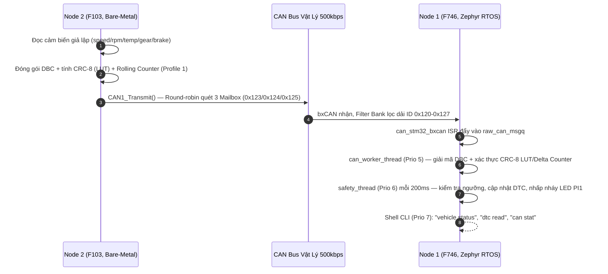
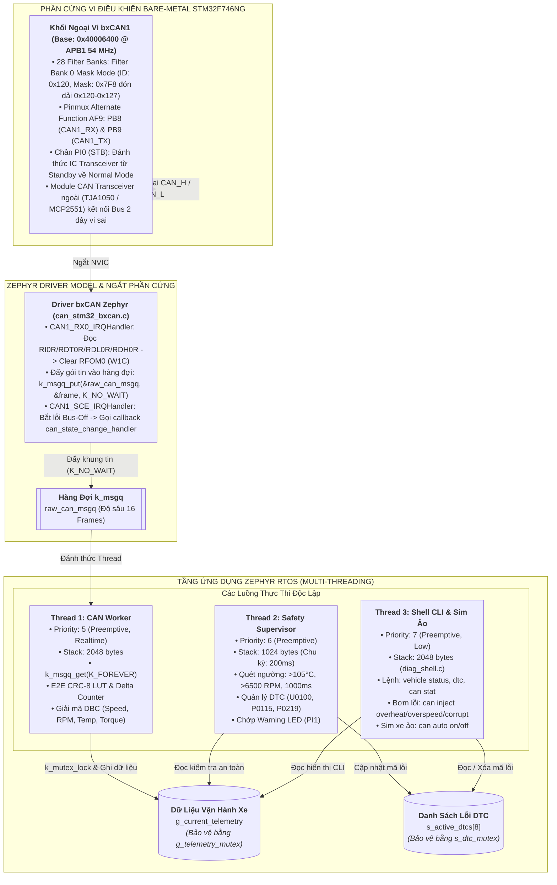
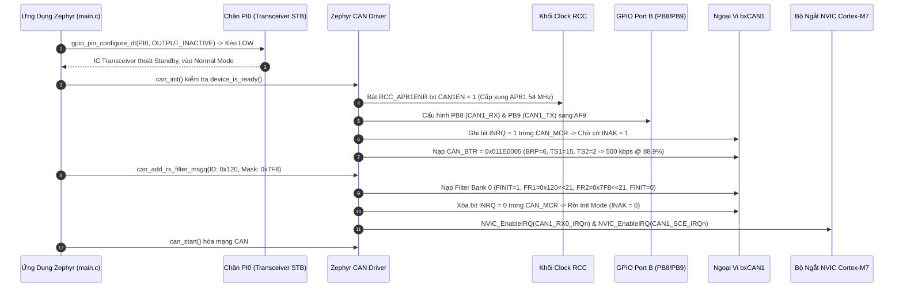
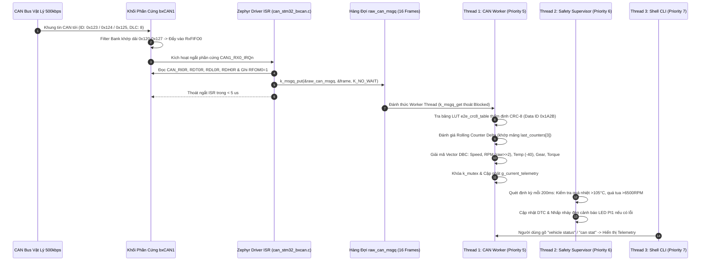
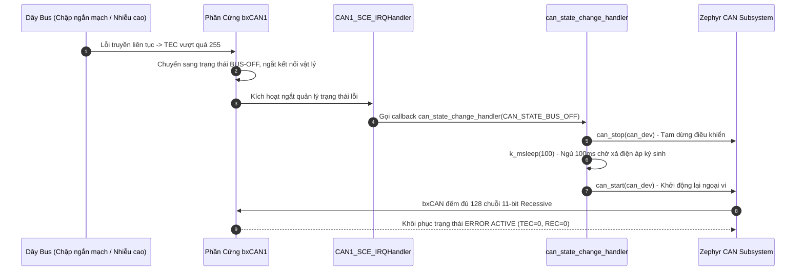

# Tài Liệu Học Lại Dự Án 1: Automotive CAN Telematics Gateway (Hệ 2 Node)

*(Học ý tưởng thiết kế, luồng hoạt động 2 vi điều khiển giao tiếp qua CAN Bus, và cách vận hành từng khối phần cứng — dùng lại được cho phỏng vấn nhưng mục tiêu chính là hiểu hệ thống.)*

> **Hệ Thống:** Automotive CAN Telematics Gateway & Diagnostic Node — **gồm 2 board giao tiếp với nhau qua CAN Bus vật lý**  
> **Node 1 — Gateway/Cụm đồng hồ:** STM32F746NG (ARM Cortex-M7 @ 216 MHz), chạy **Zephyr RTOS**, nhận & giải mã dữ liệu  
> **Node 2 — ECU mô phỏng động cơ:** STM32F103C8T6 "Blue Pill" (ARM Cortex-M3 @ 72 MHz), **100% Bare-Metal**, phát dữ liệu  
> **Chuẩn Công Nghiệp Ô Tô:** CAN 2.0B (ISO 11898-1), AUTOSAR E2E Profile 1 (CRC-8 SAE J1850), Vector DBC Engine, Zephyr Shell CLI  
> **Tài liệu nền tảng tham chiếu (trên máy cá nhân):** [`day00_baremetal_foundations.md`](file:///d:/Project/STM32F7/docs/day00_baremetal_foundations.md), STM32F746 Reference Manual (RM0385 Chương 30: bxCAN), STM32F103 Reference Manual (RM0008 Chương 24: bxCAN).

---

## 🧭 Ý TƯỞNG & THIẾT KẾ HỆ THỐNG (ĐỌC TRƯỚC — "TẠI SAO" TRƯỚC KHI HỌC "LÀM THẾ NÀO")

### Bài toán gốc
Mô phỏng lại đúng cách một mạng CAN Bus ô tô thật gồm **nhiều ECU độc lập** trao đổi dữ liệu — nhưng trong phòng thí nghiệm chỉ có 2 board rời, không có xe thật. Cần: (1) một node đóng vai "động cơ / hộp số / khung gầm" liên tục phát dữ liệu cảm biến, (2) một node đóng vai "cụm đồng hồ / gateway" nhận, giải mã, kiểm tra an toàn dữ liệu và hiển thị — đúng vai trò một ECU cổng (Gateway ECU) thật làm trong xe.

### Chuỗi quyết định thiết kế

1. **Tách thành 2 vi điều khiển vật lý riêng biệt thay vì mô phỏng 1 board (loopback).**  
   Nếu chỉ dùng 1 board tự gửi tự nhận (loopback nội bộ), sẽ không kiểm chứng được tầng vật lý thật (Transceiver, trở đầu cuối, dây vi sai CAN_H/CAN_L, nhiễu bus). Dùng 2 chip khác dòng (F746 và F103) buộc phải giải quyết đúng bài toán thực tế: 2 node có xung nhịp khác nhau, tốc độ bus khác nhau về mặt cấu hình thanh ghi, nhưng phải **thống nhất cùng một baudrate 500kbps ở mức tín hiệu vật lý** để nói chuyện được với nhau.

2. **Node 2 (F103) cố tình làm Bare-Metal thay vì cũng dùng Zephyr.**  
   Vì đây là "ECU vệ tinh" đơn giản — chỉ lặp một việc: đóng gói tín hiệu DBC, tính CRC, gửi CAN theo chu kỳ — không cần một RTOS đầy đủ. Chọn bare-metal cho node này vừa nhẹ (không tốn không gian trình bày RTOS phức tạp cho vai trò phụ), vừa là dịp thực hành viết driver bxCAN ở mức thanh ghi (đối lập có chủ đích với Node 1 dùng framework cao cấp) — một cách để hiểu cả hai đầu của phổ trừu tượng hoá: "chạm tay vào thanh ghi" và "dùng API RTOS".

3. **Node 1 (F746) chọn Zephyr RTOS thay vì bare-metal.**  
   Vai trò Gateway phức tạp hơn nhiều: vừa nhận CAN, vừa giải mã DBC/E2E, vừa theo dõi an toàn (DTC), vừa chạy CLI chẩn đoán — nhiều việc chạy song song với các chu kỳ khác nhau. Một RTOS với các luồng (thread) độc lập, hàng đợi (`k_msgq`) và Shell console dựng sẵn giúp tách rõ từng trách nhiệm mà không phải tự viết state machine đa nhiệm bằng tay như ở bare-metal.

4. **Không tin dữ liệu CAN theo mặc định — phải qua 2 lớp xác thực (AUTOSAR E2E).**  
   Trên xe thật, một bản tin CAN có thể bị nhiễu điện từ, đứt gói, hoặc một ECU lỗi phát sai dữ liệu — hậu quả có thể ảnh hưởng an toàn (VD: hiển thị sai tốc độ). Vì vậy trước khi tin một khung dữ liệu, hệ thống bắt buộc: **(a)** kiểm tra CRC-8 để phát hiện bit lỗi do nhiễu, **(b)** kiểm tra Rolling Counter (bộ đếm vòng) để phát hiện gói bị mất/lặp/replay. Đây chính là ý tưởng lõi của chuẩn AUTOSAR E2E Profile 1 dùng thật trong ngành ô tô.

5. **Dùng bộ lọc phần cứng (Filter Bank) thay vì lọc bằng phần mềm sau khi nhận.**  
   CPU không nên bị đánh thức bởi những bản tin không liên quan. bxCAN có sẵn các bộ lọc phần cứng — cấu hình 1 lần để chỉ những khung trong dải ID hợp lệ (`0x120 - 0x127`) mới được đẩy vào hàng đợi `k_msgq`, mọi khung khác bị phần cứng tự loại ngay tại FIFO, CPU không tốn một chu kỳ nào để nhìn thấy chúng.

6. **Tách luồng nhận (CAN Worker) và luồng giám sát an toàn (Safety Supervisor) thành 2 thread riêng, ưu tiên khác nhau.**  
   Việc "nhận và giải mã gói tin" cần phản ứng nhanh mỗi khi có dữ liệu tới (ưu tiên cao hơn: Priority 5). Việc "quét định kỳ xem có lỗi/mất kết nối không và nhấp nháy đèn cảnh báo" chỉ cần chạy đều đặn mỗi 200ms, không cấp bách bằng — cho chạy ở ưu tiên thấp hơn (Priority 6) để không tranh CPU với luồng nhận dữ liệu.

7. **Có sẵn bộ mô phỏng "xe ảo" ngay trong Node 1, độc lập với Node 2.**  
   Không phải lúc nào cũng có đủ 2 board để test. Node 1 tự mang theo `sim_thread` (chạy phần mềm, không qua CAN vật lý — gọi thẳng `can_gateway_send_frame`) tự phát dữ liệu giả lập tốc độ/RPM biến thiên, cộng thêm lệnh CLI `can inject overheat/overspeed/corrupt` để **chủ động bơm lỗi** kiểm tra xem lớp an toàn (DTC) có bắt đúng không — một dạng self-test không cần phần cứng thật.

### Tóm tắt luồng dữ liệu (từ ý tưởng ở trên)



*(Song song đó, `sim_thread` bên trong Node 1 có thể tự phát khung giả lập qua `can_gateway_send_frame()` mà không cần Node 2 thật — dùng để test độc lập, xem ý tưởng 7.)*

---

## 🆕 CẬP NHẬT SO VỚI PHIÊN BẢN SOURCE TRƯỚC — NÂNG CẤP TỪ 1 BẢN TIN LÊN HỆ THỐNG 3 BẢN TIN

Kiến trúc hệ thống đã được nâng cấp toàn diện từ 1 bản tin đơn lẻ lên **mạng CAN 3 bản tin chuyên biệt** theo đúng phân hệ vật lý của xe hơi thương mại (Powertrain / Transmission / Chassis):

| Hạng mục | Bản 1 Bản Tin Cũ | Bản 3 Bản Tin Mới (Source Chuẩn) |
| :--- | :--- | :--- |
| **Số loại bản tin CAN** | 1 bản tin duy nhất `0x123` (tốc độ, RPM, nhiệt độ) | **3 bản tin riêng biệt**: `CAN_ID_ENGINE=0x123` (tốc độ/RPM/nhiệt độ nước), `CAN_ID_TRANSMISSION=0x124` (tay số, mô-men xoắn), `CAN_ID_CHASSIS=0x125` (áp lực phanh) |
| **Bộ lọc phần cứng (Node 1)** | `id=0x123, mask=0x7FF` (khớp chính xác 1 ID) | `id=0x120, mask=0x7F8` — lọc theo **dải 8 ID** `0x120-0x127`, đủ rộng để lọt qua cả 3 bản tin `0x123/0x124/0x125` cùng lúc chỉ bằng 1 bộ lọc duy nhất |
| **Hàm giải mã (Node 1)** | `dbc_decode_vehicle_frame()` — chỉ hiểu 1 định dạng | `dbc_decode_can_frame(can_id, ...)` — `switch(can_id)` giải mã đúng layout theo từng ID; hàm cũ vẫn bọc ngoài gọi hộ để duy trì tính tương thích |
| **Rolling Counter** | 1 biến `last_counter` dùng chung, chỉ kiểm tra "counter tiếp theo có đúng +1 không" | Mảng `last_counters[3]` — mỗi ID có bộ đếm riêng; kiểm tra theo **delta**: `delta==0` → khung trùng lặp (replay), `delta==1` → bình thường, `delta==2` → rớt 1 khung, `delta>2` → rớt nhiều khung |
| **Tính CRC-8** | Vòng lặp bit-by-bit (8 phép dịch bit cho mỗi byte) | **Bảng tra nhanh (Lookup Table 256 phần tử)** `e2e_crc8_table[]` — tra bảng 1 lần thay vì lặp 8 lần/byte, giảm tải CPU vượt trội khi xử lý lưu lượng gấp 3 lần |
| **Thống kê an toàn** | Không có | Struct `VehicleE2EStats_t` mới: tổng số khung nhận, số khung hợp lệ, số lỗi CRC, số khung rớt, và đếm riêng theo từng ID (`id_123_count`, `id_124_count`, `id_125_count`) |
| **Lệnh Shell mới** | `vehicle status`, `dtc read/clear`, `can sim/auto/inject` | Thêm **`can stat`** (xem thống kê 3 bản tin, tỷ lệ tin cậy %) và **`can stat_reset`** |
| **Node 2 — Phát khung tin** | 1 hàm `e2e_encode_vehicle_frame()`, phát 1 frame/chu kỳ 100ms | 3 hàm encode riêng (`e2e_encode_vehicle_frame`, `e2e_encode_transmission_frame`, `e2e_encode_chassis_frame`), mỗi hàm có **bộ Rolling Counter độc lập**; mỗi chu kỳ 100ms phát liên tiếp cả 3 khung |
| **Node 2 — `CAN1_Transmit()`** | Dùng cứng Mailbox 0 (`CAN1_TI0R`), phải đợi khung trước gửi xong mới gửi tiếp | Tự động quét cờ `TME0/TME1/TME2` trong `CAN_TSR` để **chọn 1 trong 3 Mailbox rảnh**, tính địa chỉ thanh ghi theo công thức `base + mb*0x10` — 3 khung được nạp gần như đồng thời mà không bị tắc nghẽn |

### Ý tưởng thiết kế mới bổ sung:

**10. Tách 1 bản tin tổng hợp thành 3 bản tin theo hệ thống con vật lý (Powertrain / Transmission / Chassis).**  
Trên xe thật, động cơ, hộp số, phanh là 3 hệ thống con độc lập, mỗi hệ thống có ECU riêng phát bản tin riêng lên bus chung. Tách như vậy cho phép **mở rộng thêm ECU thứ 3, thứ 4...** sau này mà không phải sửa định dạng bản tin cũ — mỗi ID là một kênh độc lập.

**11. Dùng 1 bộ lọc dải (`0x120-0x127`) thay vì 3 bộ lọc riêng cho 3 ID.**  
bxCAN chỉ có số lượng Filter Bank giới hạn (`CONFIG_CAN_MAX_FILTER=5` trong `prj.conf`). Tận dụng bản chất mask-based: mask `0x7F8` che 8 bit cao, để ngỏ 3 bit thấp tự do khớp bất kỳ giá trị nào từ `0x120` đến `0x127`.

**12. Đổi từ vòng lặp CRC bit-by-bit sang bảng tra (Lookup Table) khi lưu lượng tăng gấp 3.**  
Đổi sang bảng tra sẵn 256 giá trị giúp mỗi byte chỉ tốn 1 lần tra bảng thay vì 8 lần dịch-XOR bit — đánh đổi 256 byte bộ nhớ Flash để tiết kiệm chu kỳ CPU, kinh điển trong nhúng khi cần tối ưu.

**13. Rolling Counter kiểu "delta" thay vì kiểm tra nhị phân "+1 hay sai".**  
Kiểu delta phân biệt rõ ràng: khung bị lặp lại (Replay attack / lỗi truyền lặp) vs rớt 1 khung vs rớt nhiều khung — thông tin chẩn đoán chính xác phục vụ bảo trì qua lệnh `can stat`.

**14. Round-robin qua 3 Mailbox phần cứng để gửi chùm (burst) không nghẽn.**  
Cho phép chọn mailbox rảnh (0, 1, hoặc 2) giúp nạp cả 3 khung gần như cùng lúc vào phần cứng, bxCAN tự sắp xếp thứ tự phát ra bus theo ưu tiên arbitration ID (ID nhỏ hơn thắng) mà phần mềm không cần tự canh trễ.

---

## 🏛️ BẢNG ĐỐI CHIẾU KIẾN TRÚC 2 NODE TRONG DỰ ÁN (STM32F746 vs STM32F103)

Nhằm nắm chắc hệ thống và trả lời phỏng vấn chính xác, bảng dưới đây phân tách rành mạch cấu hình phần cứng và tầng phần mềm giữa 2 Node:

| Đặc Tính Kỹ Thuật | Node 1 — Gateway & Diagnostic Cluster | Node 2 — Engine / Powertrain Simulator ECU |
| :--- | :--- | :--- |
| **Vi Điều Khiển & Lõi** | **STM32F746NG** (ARM Cortex-M7 @ 216 MHz) | **STM32F103C8T6** "Blue Pill" (ARM Cortex-M3 @ 72 MHz) |
| **Tầng Phần Mềm** | **Zephyr RTOS v3.7.0** (Multi-threading, Shell, Devicetree) | **100% Bare-Metal C** (Truy xuất thanh ghi trực tiếp) |
| **Vai Trò & Hướng Dữ Liệu** | **RX Node**: Thu thập, lọc phần cứng, giải mã DBC & E2E, CLI | **TX Node**: Giả lập cảm biến xe, đóng gói DBC, tính E2E CRC-8, phát bus |
| **Xung Nhịp Bus bxCAN** | **APB1 = 54 MHz** (Max bus APB1 trên STM32F7) | **APB1 = 36 MHz** (Max bus APB1 trên STM32F103) |
| **Cấu Hình Bit Timing (500 kbps)** | Khai báo qua Devicetree `app.overlay` (`bitrate = 500000; sample-point = 875;`). Zephyr tự tính $BRP=6$, $TS1=15$, $TS2=2$ ($\text{Sample Point} = 88.89\%$). | Tự tính toán và nạp trực tiếp thanh ghi: `CAN1_BTR = 0x002D0003UL` ($BRP=4$, $TS1=14$, $TS2=3$, $\text{Sample Point} = 83.33\%$). |
| **Chân CAN & Ghép Kênh Pinmux** | **PB8 (RX)** & **PB9 (TX)** ghép kênh Alternate Function **AF9** | **PA11 (CAN_RX)** & **PA12 (CAN_TX)** chế độ Alternate Function mặc định |
| **Điều Khiển Transceiver Standby** | **Chân PI0 (STB)** kéo xuống mức LOW trong `can_gateway_init()` để đánh thức IC Transceiver trước khi kích hoạt CAN. | Chân STB nối Mass cố định (hoặc dùng module Transceiver thường trực). |
| **Cấu Hình Bộ Lọc (Filter Bank)** | 1 Filter Bank Mask Mode nhận dải **`0x120 - 0x127`** (`id=0x120, mask=0x7F8`) qua API `can_add_rx_filter_msgq()`. | Cấu hình thanh ghi `CAN1->FMR`, `FA1R`, `FS1R`, `FR1`, `FR2` nhận Accept-All (`0x000/0x000`) để test. |
| **Bộ Bản Tin CAN Quản Lý** | Nhận & giải mã cả 3 bản tin: `0x123` (Engine), `0x124` (Transmission), `0x125` (Chassis). | Phát tuần tự cả 3 bản tin `0x123`, `0x124`, `0x125` mỗi chu kỳ 100ms. |
| **Giải Mã / Đóng Gói RPM** | Giải mã Intel Little-Endian: `raw = d[3] \| (d[4]<<8)`, `RPM = raw >> 2` (Factor 0.25). | Đóng gói Intel Little-Endian: `raw = RPM << 2`, `d[3] = raw & 0xFF`, `d[4] = raw >> 8`. |
| **Quản Lý TX Mailbox** | Quản lý tự động bởi Zephyr CAN Subsystem qua hàng đợi TX. | Tự động quét 3 cờ `TME0/1/2` trong `CAN_TSR` để nạp vào Mailbox rảnh, hỗ trợ burst 3 khung liên tiếp. |
| **Mô Phỏng & Tự Kiểm Thử** | Luồng `sim_thread` (Priority 7) tự phát bản tin ảo nội bộ và các lệnh Shell `can inject` để test DTC. | Vòng lặp `while(1)` định kỳ 100ms biến thiên thông số giả lập và phát ra bus vật lý. |

---

## MỤC LỤC TỔNG QUAN

- [🧭 Ý tưởng & Thiết kế hệ thống](#-ý-tưởng--thiết-kế-hệ-thống-đọc-trước--tại-sao-trước-khi-học-làm-thế-nào)
- [🆕 Cập nhật so với phiên bản Source trước](#-cập-nhật-so-với-phiên-bản-source-trước--nâng-cấp-từ-1-bản-tin-lên-hệ-thống-3-bản-tin)
- [🏛️ Bảng đối chiếu kiến trúc 2 Node trong dự án](#️-bảng-đối-chiếu-kiến-trúc-2-node-trong-dự-án-stm32f746-vs-stm32f103)
- [0. DANH MỤC TÀI LIỆU GỐC & HƯỚNG DẪN TRA CỨU RM/DATASHEET (LOOKUP GUIDE)](#0-danh-mục-tài-liệu-gốc--hướng-dẫn-tra-cứu-rmdatasheet-lookup-guide)
  - [0.1. Danh Mục Tài Liệu Gốc Trọng Tâm (Official Documents)](#01-danh-mục-tài-liệu-gốc-trọng-tâm-official-documents)
  - [0.2. Hướng Dẫn Từng Bước Tra Cứu Reference Manual (RM0385)](#02-hướng-dẫn-từng-bước-tra-cứu-reference-manual-rm0385)
  - [0.3. Hướng Dẫn Từng Bước Tra Cứu Datasheet (DS10610) & Ghép Kênh Chân AF9](#03-hướng-dẫn-từng-bước-tra-cứu-datasheet-ds10610--ghép-kênh-chân-af9)
  - [0.4. Hướng Dẫn Tra Cứu Tiêu Chuẩn Quốc Tế (ISO 11898 & AUTOSAR E2E)](#04-hướng-dẫn-tra-cứu-tiêu-chuẩn-quốc-tế-iso-11898--autosar-e2e)
- [1. TỔNG QUAN HỆ THỐNG & KIẾN TRÚC PHẦN MỀM](#1-tổng-quan-hệ-thống--kiến-trúc-phần-mềm)
  - [1.1. Mục Tiêu Dự Án & Thông Số Kỹ Thuật Định Lượng](#11-mục-tiêu-dự-án--thông-số-kỹ-thuật-định-lượng)
  - [1.2. Sơ Đồ Khối Kiến Trúc Phân Tầng & Luồng Dữ Liệu Đa Nhiệm (Zephyr Multi-threading)](#12-sơ-đồ-khối-kiến-trúc-phân-tầng--luồng-dữ-liệu-đa-nhiệm-zephyr-multi-threading)
  - [1.3. Cấu Trúc Khung CAN 2.0B & Cấu Hình DeviceTree Chuẩn Ô Tô](#13-cấu-trúc-khung-can-20b--cấu-hình-devicetree-chuẩn-ô-tô)
  - [1.4. Kiến Thức Nền Tảng Zephyr RTOS (Trọng Tâm Cho Vị Trí Fresher)](#14-kiến-thức-nền-tảng-zephyr-rtos-trọng-tâm-cho-vị-trí-fresher)
- [2. LÝ THUYẾT CỐT LÕI & CÔNG THỨC BẮT BUỘC PHẢI NHỚ](#2-lý-thuyết-cốt-lõi--công-thức-bắt-buộc-phải-nhớ)
  - [2.1. Chi Tiết CAN Bit Timing & Bảng Thanh Ghi CAN_BTR (500 kbps @ APB1 54 MHz vs 36 MHz)](#21-chi-tiết-can-bit-timing--bảng-thanh-ghi-can_btr-500-kbps--apb1-54-mhz-vs-36-mhz)
  - [2.2. Cơ Chế Bộ Lọc bxCAN Filter Bank: Bố Cục Bit 32-bit Mask & Quy Trình Nạp RMW](#22-cơ-chế-bộ-lọc-bxcan-filter-bank-bố-cục-bit-32-bit-mask--quy-trình-nạp-rmw)
  - [2.3. AUTOSAR E2E Profile 1: Đa Thức CRC-8 SAE J1850, Alive Counter & Data ID](#23-autosar-e2e-profile-1-đa-thức-crc-8-sae-j1850-alive-counter--data-id)
  - [2.4. Máy Trạng Thái Quản Lý Lỗi CAN (Fault Confinement - ISO 11898-1)](#24-máy-trạng-thái-quản-lý-lỗi-can-fault-confinement---iso-11898-1)
- [3. SƠ ĐỒ TUẦN TỰ HOẠT ĐỘNG (MERMAID SEQUENCE DIAGRAMS)](#3-sơ-đồ-tuần-tự-hoạt-động-mermaid-sequence-diagrams)
  - [3.1. Quy Trình Cấu Hình Khởi Động Phần Cứng (Peripheral Configuration Pipeline)](#31-quy-trình-cấu-hình-khởi-động-phần-cứng-peripheral-configuration-pipeline)
  - [3.2. Quy Trình Vận Hành & Bắt Tay Dữ Liệu Thời Gian Thực (Runtime Dataflow)](#32-quy-trình-vận-hành--bắt-tay-dữ-liệu-thời-gian-thực-runtime-dataflow)
  - [3.3. Quy Trình Xử Lý Sự Cố & Phục Hồi An Toàn (Fault & Recovery Pipeline)](#33-quy-trình-xử-lý-sự-cố--phục-hồi-an-toàn-fault--recovery-pipeline)
- [4. PHÂN LOẠI LỖI THỰC TẾ VÀ ĐẶC THÙ PHẦN CỨNG](#4-phân-loại-lỗi-thực-tế-và-đặc-thù-phần-cứng)
  - [4.1. Nhóm Lỗi Phổ Biến (Common Bugs)](#41-nhóm-lỗi-phổ-biến-common-bugs)
  - [4.2. Nhóm Lỗi Kiến Trúc (Architectural Bugs)](#42-nhóm-lỗi-kiến-trúc-architectural-bugs)
  - [4.3. Nhóm Lỗi Ngoại Lệ và Góc Khuất Phần Cứng (Edge-Case Bugs)](#43-nhóm-lỗi-ngoại-lệ-và-góc-khuất-phần-cứng-edge-case-bugs)
  - [4.4. Nhóm Lỗi Khi Triển Khai Trên Zephyr RTOS và STM32F7](#44-nhóm-lỗi-khi-triển-khai-trên-zephyr-rtos-và-stm32f7)
- [5. BỘ CÂU HỎI PHỎNG VẤN & TRẢ LỜI KỸ THUẬT CHUYÊN SÂU](#5-bộ-câu-hỏi-phỏng-vấn--trả-lời-kỹ-thuật-chuyên-sâu)

---

# 0. DANH MỤC TÀI LIỆU GỐC & HƯỚNG DẪN TRA CỨU RM/DATASHEET (LOOKUP GUIDE)

### 0.1. Danh Mục Tài Liệu Gốc Trọng Tâm (Official Documents)

| Tên Tài Liệu | Mã Hiệu / Phiên Bản | File Trong Thư Mục Dự Án | Nội Dung Tra Cứu Trọng Tâm |
| :--- | :--- | :--- | :--- |
| **STM32F7 Reference Manual** | `RM0385` (DocID027589 Rev 8) | [`RM.pdf`](file:///d:/Project/STM32F7/RM.pdf) | **Chương 30 (bxCAN):** Toàn bộ thanh ghi cấu hình `CAN_MCR`, `CAN_BTR`, `CAN_FMR`, bộ lọc 28 Filter Banks, sơ đồ ngắt NVIC. |
| **STM32F746 Datasheet** | `DS10610` (DocID027590 Rev 7) | [`STM32F745XX.PDF`](file:///d:/Project/STM32F7/STM32F745XX.PDF) | **Table 9 (Alternate functions):** Bản đồ ghép kênh chân PB8/PB9 sang `AF9` (CAN1), giới hạn tần số APB1 tối đa 54 MHz. |
| **STM32F103 Reference Manual** | `RM0008` (DocID13902 Rev 21) | Tài liệu chính thức ST | **Chương 24 (bxCAN):** Thanh ghi bxCAN trên STM32F103 (Base: `0x40006400`, APB1 max 36 MHz, 14 Filter Banks). |
| **Discovery Board User Manual** | `UM1907` (DocID027908 Rev 7) | [`user-manual.pdf`](file:///d:/Project/STM32F7/user-manual.pdf) | **Section 7.4 (Arduino connectors):** Sơ đồ chân cắm mở rộng D0/D1/D14/D15 và đường cấp nguồn 3.3V/5V cho module CAN Transceiver. |
| **Chuẩn Quốc Tế CAN Bus** | `ISO 11898-1:2015` & `ISO 11898-2:2016` | Tài liệu chuẩn ISO / CiA | Định thời Bit Timing, quy tắc phân xử trọng tài Arbitration, trở đầu cuối 120 Ohm, máy trạng thái lỗi Bus-Off. |
| **Chuẩn An Toàn Phần Mềm Ô Tô** | `AUTOSAR Classic Release 4.4` (E2E Protocol) | `AUTOSAR_SWS_E2ELibrary.pdf` | Đặc tả E2E Profile 1, đa thức CRC-8 SAE J1850 đa thức `0x1D`/`0x2F`, cơ chế bảo vệ Alive Counter và Data ID. |

---

### 0.2. Hướng Dẫn Từng Bước Tra Cứu Reference Manual (RM0385)

#### Bước 1: Tra cứu Địa chỉ Cơ sở (Base Address) của ngoại vi bxCAN1
1. Mở file [`RM.pdf`](file:///d:/Project/STM32F7/RM.pdf).
2. Nhấn `Ctrl + F` tìm cụm từ chính xác: **`Memory map and register boundary addresses`** (chuyển tới **Section 2.2.2**).
3. Tìm dòng chứa **`CAN1`**:
   - Bus kết nối: **APB1** (Tần số tối đa `54 MHz`).
   - Dải địa chỉ bộ nhớ: `0x4000 6400 - 0x4000 67FF`.
   - **`CAN1_BASE = 0x40006400`**.

#### Bước 2: Tra cứu Bảng Thanh Ghi bxCAN (Register Map & Offsets)
1. Nhấn `Ctrl + F` tìm cụm từ: **`bxCAN register map`** (chuyển tới **Section 30.9**).
2. Bảng thanh ghi cốt lõi dùng trong dự án:

| Tên Thanh Ghi | Offset | Địa Chỉ Tuyệt Đối (`Base + Offset`) | Quyền Truy Xuất | Giá Trị Reset | Mục Đích Sử Dụng Trong Dự Án |
| :--- | :--- | :--- | :--- | :--- | :--- |
| **`CAN_MCR`** | `0x000` | `0x40006400` | `RW` | `0x00010002` | Điều khiển chế độ Init (`INRQ`), tự động phục hồi (`ABOM`), thoát Sleep. |
| **`CAN_MSR`** | `0x004` | `0x40006404` | `RO` | `0x00000C02` | Polling cờ xác nhận Init Mode (`INAK`), cờ Sleep (`SLAK`). |
| **`CAN_TSR`** | `0x008` | `0x40006408` | `RW` / `W1C` | `0x1C000000` | Kiểm tra Mailbox trống (`TME0/1/2`), cờ truyền thành công (`RQCPx`). |
| **`CAN_RF0R`** | `0x00C` | `0x4000640C` | `RW` / `W1C` | `0x00000000` | Cờ nhận gói FIFO0 (`FMP0`), **ghi bit `RFOM0 = 1` để giải phóng Mailbox**. |
| **`CAN_IER`** | `0x014` | `0x40006414` | `RW` | `0x00000000` | Kích hoạt ngắt nhận FIFO0 (`FMPIE0`), ngắt lỗi trạng thái (`ERRIE`). |
| **`CAN_ESR`** | `0x018` | `0x40006418` | `RO` / `RW` | `0x00000000` | Giám sát trạng thái lỗi (`BOFF`, `EPVF`, `EWGF`), bộ đếm `TEC` và `REC`. |
| **`CAN_BTR`** | `0x01C` | `0x4000641C` | `RW` | `0x01230000` | Cấu hình Bit Timing: `BRP`, `TS1`, `TS2`, `SJW` đạt chuẩn 500 kbps @ 87.5% - 88.9%. |
| **`CAN_TI0R`** | `0x180` | `0x40006580` | `RW` | `0x00000000` | TX Mailbox 0 Identifier register (Standard ID dịch trái 21 bit). |
| **`CAN_TDT0R`**| `0x184` | `0x40006584` | `RW` | `0x00000000` | TX Mailbox 0 Data length code (DLC[3:0]). |
| **`CAN_TDL0R`**| `0x188` | `0x40006588` | `RW` | `0x00000000` | TX Mailbox 0 Data low register (Data Byte 0 đến 3). |
| **`CAN_TDH0R`**| `0x18C` | `0x4000658C` | `RW` | `0x00000000` | TX Mailbox 0 Data high register (Data Byte 4 đến 7). |
| **`CAN_RI0R`** | `0x1B0` | `0x400065B0` | `RO` | `0x00000000` | Đọc Identifier (ID) của bản tin nhận được trong FIFO0. |
| **`CAN_RDT0R`**| `0x1B4` | `0x400065B4` | `RO` | `0x00000000` | Đọc độ dài dữ liệu `DLC[3:0]` của bản tin nhận được. |
| **`CAN_RDL0R`**| `0x1B8` | `0x400065B8` | `RO` | `0x00000000` | Đọc 4 bytes dữ liệu thấp (Data Byte 0 đến Byte 3). |
| **`CAN_RDH0R`**| `0x1BC` | `0x400065BC` | `RO` | `0x00000000` | Đọc 4 bytes dữ liệu cao (Data Byte 4 đến Byte 7). |
| **`CAN_FMR`**  | `0x200` | `0x40006600` | `RW` | `0x2A1C0E01` | Điều khiển bộ lọc: Bật/tắt `FINIT` (Filter Init Mode). |
| **`CAN_FA1R`** | `0x21C` | `0x4000661C` | `RW` | `0x00000000` | Kích hoạt từng bộ lọc (`FACTx = 1`). |
| **`CAN_FS1R`** | `0x20C` | `0x4000660C` | `RW` | `0x00000000` | Cấu hình kích thước bộ lọc (0: Dual 16-bit, 1: Single 32-bit). |
| **`CAN_FM1R`** | `0x204` | `0x40006604` | `RW` | `0x00000000` | Cấu hình chế độ bộ lọc (0: Mask mode, 1: List mode). |
| **`CAN_FFA1R`**| `0x214` | `0x40006614` | `RW` | `0x00000000` | Phân bổ Filter Bank về FIFO0 (0) hoặc FIFO1 (1). |
| **`CAN_F0R1`** | `0x240` | `0x40006640` | `RW` | Không xác định | Nạp ID của Filter Bank 0 (Dịch 21 bit cho Standard ID). |
| **`CAN_F0R2`** | `0x244` | `0x40006644` | `RW` | Không xác định | Nạp Mask của Filter Bank 0 (Dịch 21 bit cho Mask tương ứng). |

---

### 0.3. Hướng Dẫn Từng Bước Tra Cứu Datasheet (DS10610) & Ghép Kênh Chân AF9

#### Tra cứu Pinmux (Ghép kênh chân ngoại vi):
1. Mở file [`STM32F745XX.PDF`](file:///d:/Project/STM32F7/STM32F745XX.PDF).
2. Nhấn `Ctrl + F` tìm cụm từ: **`Table 9. STM32F745xx and STM32F746xx alternate function mapping`**.
3. Kéo xuống cột **`AF9`** (Alternate Function 9: CAN1 / CAN2 / TIM12..14):
   * Dòng chân **`PB8`**: Hiển thị chức năng phụ là **`CAN1_RX`**.
   * Dòng chân **`PB9`**: Hiển thị chức năng phụ là **`CAN1_TX`**.
4. **Kết luận áp dụng:** Trong thanh ghi `GPIOB->AFR[1]` (hoặc DeviceTree pinctrl), chân PB8 và PB9 bắt buộc phải gán mã `AF9` (nhị phân `1001`).

---

### 0.4. Hướng Dẫn Tra Cứu Tiêu Chuẩn Quốc Tế (ISO 11898 & AUTOSAR E2E)

* **Tra cứu ISO 11898-1:2015 (CAN Data Link Layer):**
  - Tra cứu mục **Chapter 10: Fault Confinement**: Nguyên tắc cộng/trừ điểm bộ đếm lỗi TEC và REC (Quy tắc Rule 1 đến Rule 12), điều kiện chuyển sang Bus-Off (`TEC > 255`) và điều kiện khôi phục an toàn (đếm 128 chuỗi 11 bit Recessive liên tiếp).
* **Tra cứu AUTOSAR E2E Library (SWS_E2ELibrary):**
  - Tra cứu mục **Section 7.2: Specification of E2E Profile 1**: Đa thức sinh `CRC-8-SAE-J1850` (0x1D/0x2F), cách bố trí `Alive Counter` (4-bit, modulo 15) và phương thức gộp `Data ID` (16-bit) vào phép tính checksum.

---

# 1. TỔNG QUAN HỆ THỐNG & KIẾN TRÚC PHẦN MỀM

### 1.1. Mục Tiêu Dự Án & Thông Số Kỹ Thuật Định Lượng

Dự án hiện thực một **Trạm Cổng Giao Tiếp (Gateway) và Giám Sát Chẩn Đoán Ô Tô** thu thập dữ liệu từ mạng truyền thông động cơ, hộp số và khung gầm xe hơi (Powertrain, Transmission & Chassis CAN Bus), giải mã dữ liệu theo định dạng Vector DBC, kiểm tra toàn vẹn an toàn chức năng theo chuẩn AUTOSAR E2E Profile 1, và đẩy dữ liệu chẩn đoán ra bảng điều khiển Zephyr Shell CLI.

| Thông Số Kỹ Thuật | Giá Trị Thực Tế Dự Án | Ý Nghĩa Kỹ Thuật / Cơ Sở Thiết Kế |
| :--- | :--- | :--- |
| **Vi điều khiển Gateway** | STM32F746NG (ARM Cortex-M7) | Xung nhịp hệ thống `f_SYSCLK = 216 MHz`, bus ngoại vi `f_APB1 = 54 MHz`. |
| **Vi điều khiển ECU Simulator**| STM32F103C8T6 (ARM Cortex-M3) | Xung nhịp hệ thống `f_SYSCLK = 72 MHz`, bus ngoại vi `f_APB1 = 36 MHz`. |
| **Ngoại vi CAN Gateway** | bxCAN1 (CAN1) | Kết nối chip CAN Transceiver ngoài (TJA1050/MCP2551 qua chân PB8/PB9, STB chân PI0). |
| **Tốc độ truyền (Baudrate)** | `500 kbps` (High-Speed CAN) | Tốc độ tiêu chuẩn của mạng điều khiển động cơ / phanh ô tô (ISO 11898-2). |
| **Điểm lấy mẫu (Sample Point)** | `87.5% - 88.9%` (F746), `83.3%` (F103) | Chuẩn khuyến nghị CiA (CAN in Automation) chống méo xung đường truyền dài. |
| **Tải truyền nhận (Throughput)** | `> 1,000 frames/s` | Đảm bảo tải nặng không làm rớt bản tin, CPU load đo được `< 2%`. |
| **Độ trễ giải mã tín hiệu** | `< 15 us / frame` | Thuật toán DBC tối ưu bằng số nguyên cố định (Fixed-point integer arithmetic) và CRC LUT. |
| **An toàn dữ liệu** | AUTOSAR E2E Profile 1 | CRC-8 SAE J1850 đa thức `0x2F`, Alive Counter 4-bit và Data ID `0x1A2B`. |
| **Khả năng tự phục hồi** | ISO 11898-1 Bus-Off Recovery | Nhận diện trạng thái tê liệt bus và kích hoạt chuỗi phục hồi an toàn trong `< 100 ms`. |

---

### 1.2. Sơ Đồ Khối Kiến Trúc Phân Tầng & Luồng Dữ Liệu Đa Nhiệm (Zephyr Multi-threading)

Trên Node 1 (Gateway STM32F746), hệ thống phân tách thành 3 tầng rõ rệt: Tầng Phần Cứng (Hardware), Tầng Driver Kernel (Zephyr CAN Subsystem & ISR), và Tầng Ứng Dụng Đa Nhiệm (Application Threads). Các luồng giao tiếp với nhau qua hàng đợi thông điệp phi khóa `k_msgq` và biến trạng thái toàn cục bảo vệ bởi `k_mutex`:



---

### 1.3. Cấu Trúc Khung CAN 2.0B & Cấu Hình DeviceTree Chuẩn Ô Tô

Mọi bản tin trao đổi trong dự án đều tuân thủ cấu trúc khung chuẩn **CAN 2.0B Standard Frame** (11-bit ID):

```text
┌──────┬───────────────┬───────┬──────┬─────┬────────┬──────────────┬─────────┬─────────┬──────┬─────────────┐
│ SOF  │ Identifier    │  RTR  │ IDE  │ r0  │  DLC   │ Data Field   │ CRC     │ CRC Del │ ACK  │ EOF (7 bits)│
│1 bit │ 11 bits (Std) │ 1 bit │1 bit │1 bit│ 4 bits │ 8 Bytes      │ 15 bits │ 1 bit   │2 bits│ Recessive   │
└──────┴───────────────┴───────┴──────┴─────┴────────┴──────────────┴─────────┴─────────┴──────┴─────────────┘
  0       ID bản tin      0=Data  0=Std  0     Độ dài   Payload ô tô    Mã băm   1=Recess  Slot   Kết thúc
(Dom)   0x123/124/125     Frame   Frame        (8 bytes)(E2E + Signals) phần cứng          + Del  khung tin
```

#### File cấu hình DeviceTree Overlay (`app.overlay`) trong Zephyr — đúng nguyên văn project:
```dts
/ {
    aliases {
        can-primary = &can1;
        led-warn = &user_led_1;      /* DT macro tự đổi "-" thành "_": DT_ALIAS(led_warn) */
    };

    leds {
        compatible = "gpio-leds";
        user_led_1: led_1 {
            gpios = <&gpioi 1 GPIO_ACTIVE_HIGH>;   /* PI1 — đèn cảnh báo chẩn đoán DTC */
            label = "User Warning LED (PI1)";
        };
    };

    transceiver {
        compatible = "gpio-leds";
        can_stb: stb_pin {
            gpios = <&gpioi 0 GPIO_ACTIVE_HIGH>;   /* PI0 — chân Standby điều khiển IC Transceiver */
            label = "CAN Transceiver Standby Control (PI0)";
        };
    };
};

&can1 {
    pinctrl-0 = <&can1_rx_pb8 &can1_tx_pb9>;
    pinctrl-names = "default";
    status = "okay";
    bitrate = <500000>;
    sample-point = <875>; /* 87.5% theo chuẩn CiA — Zephyr tự suy ra BRP=6, TS1=15, TS2=2 */
    /* loopback; */        /* Bật thuộc tính này khi muốn tự kiểm thử 1 board không cần Transceiver */
};
```

---

# 1.4. KIẾN THỨC NỀN TẢNG ZEPHYR RTOS (TRỌNG TÂM CHO VỊ TRÍ FRESHER)

### 1.4.1. Zephyr là gì & vì sao ngành công nghiệp ô tô dùng nó?

Zephyr là một **RTOS mã nguồn mở, footprint nhỏ**, do Linux Foundation bảo trợ, hỗ trợ đa kiến trúc (ARM Cortex-M, RISC-V, x86...). Khác với kiểu phát triển "viết HAL + FreeRTOS rời rạc" truyền thống, Zephyr đóng gói sẵn 3 trụ cột giúp tách biệt hoàn toàn phần cứng khỏi phần mềm ứng dụng:

| Trụ cột | Vai trò trong hệ thống | File tương ứng trong project |
| :--- | :--- | :--- |
| **Kconfig** | Bật/tắt tính năng phần mềm lúc build (driver nào được biên dịch vào, stack size, log level) | `prj.conf` |
| **Devicetree** | Mô tả **phần cứng vật lý** (chân pinmux nào nối gì, bitrate bao nhiêu) — độc lập với mã C | `app.overlay` |
| **CMake (qua West)** | Định nghĩa file nguồn nào được gom vào ứng dụng để build nhị phân | `CMakeLists.txt` |

### 1.4.2. Driver Model & `device_is_ready()`

Mọi ngoại vi trong Zephyr được trừu tượng hoá thành một `struct device`. Ứng dụng lấy con trỏ thiết bị thông qua các macro sinh tự động từ Devicetree:
```c
static const struct gpio_dt_spec stb_spec = GPIO_DT_SPEC_GET_OR(DT_NODELABEL(can_stb), gpios, {0});
static const struct device *const can_dev = DEVICE_DT_GET(DT_ALIAS(can_primary));

/* 1. Kéo chân STB xuống LOW để đánh thức IC Transceiver trước khi kích hoạt CAN */
if (stb_spec.port != NULL && gpio_is_ready_dt(&stb_spec)) {
    gpio_pin_configure_dt(&stb_spec, GPIO_OUTPUT_INACTIVE); /* LOW = Normal mode */
}

/* 2. Luôn kiểm tra tính sẵn sàng của driver phần cứng trước khi sử dụng */
if (!device_is_ready(can_dev)) {
    LOG_ERR("CAN device not ready!");
    return -ENODEV;
}
```

### 1.4.3. Luồng thực thi tĩnh: `K_THREAD_DEFINE`

Project định nghĩa thread ngay lúc biên dịch (static allocation), tránh cấp phát heap lúc runtime:
```c
K_THREAD_DEFINE(can_worker_tid, 2048,
                can_worker_thread_entry, NULL, NULL, NULL,
                5, 0, 0);  /* Priority 5, Preemptive */

K_THREAD_DEFINE(safety_tid, 1024,
                safety_thread_entry, NULL, NULL, NULL,
                6, 0, 0);  /* Priority 6, Preemptive */
```
* **Quy tắc ưu tiên (Priority):** Số **càng nhỏ thì mức ưu tiên càng cao**. Project dùng: `can_worker` = 5 (nhận và giải mã tức thời), `safety` = 6 (giám sát định kỳ 200ms), `sim/shell` = 7 (giao tiếp người dùng).
* Priority $\ge 0$ là **Preemptive** (cho phép ngắt luồng khác); Priority âm là **Cooperative** (chỉ nhường CPU khi tự nguyện gọi yield/sleep).

### 1.4.4. Đồng bộ hoá giữa các luồng: `k_msgq` và `k_mutex`

* **`k_msgq` (Message Queue):** Hàng đợi có khóa nội tại, cho phép ISR đẩy gói tin vào bằng `k_msgq_put(&raw_can_msgq, &frame, K_NO_WAIT)` và Worker Thread lấy ra bằng `k_msgq_get(&raw_can_msgq, &frame, K_FOREVER)`. Khi rỗng, Worker tự động vào trạng thái **Blocked**, CPU tiêu thụ 0%.
* **`k_mutex` (`K_MUTEX_DEFINE(g_telemetry_mutex)`):** Bảo vệ biến toàn cục `g_current_telemetry` khỏi Data Race giữa Worker Thread (ghi) và Safety/Shell Thread (đọc). Mutex của Zephyr tích hợp cơ chế **Priority Inheritance** (thừa kế ưu tiên), triệt tiêu hoàn toàn hiểm họa **Priority Inversion**.

### 1.4.5. Logging & Shell — Công cụ chẩn đoán có sẵn chuẩn công nghiệp

* **Logging:** `LOG_MODULE_REGISTER(main_app, LOG_LEVEL_INF)` kết hợp `CONFIG_LOG_MODE_DEFERRED=y`. Bản tin log được đưa vào Ring Buffer và chỉ xuất ra UART khi CPU rảnh rỗi, không làm trễ các tác vụ thời gian thực.
* **Shell CLI:** `SHELL_STATIC_SUBCMD_SET_CREATE` tạo giao diện dòng lệnh chẩn đoán trực quan qua UART (các lệnh `vehicle status`, `dtc read`, `can stat`).

---

# 2. LÝ THUYẾT CỐT LÕI & CÔNG THỨC BẮT BUỘC PHẢI NHỚ

### 2.1. Chi Tiết CAN Bit Timing & Bảng Thanh Ghi CAN_BTR (500 kbps @ APB1 54 MHz vs 36 MHz)

Trong giao thức CAN (ISO 11898-1), 1 bit dữ liệu được chia thành 4 phân đoạn định thời (Time Segments):
1. **Sync_Seg (Synchronization Segment):** Luôn cố định bằng **$1\text{ tq}$** (dùng để đồng bộ xung nhịp cạnh rơi).
2. **Prop_Seg (Propagation Segment):** Bù trễ vật lý của cáp vi sai và chip Transceiver.
3. **Phase_Seg1 (Phase Buffer Segment 1):** Bù trễ pha dương.
4. **Phase_Seg2 (Phase Buffer Segment 2):** Bù trễ pha âm. Điểm giao giữa Phase_Seg1 và Phase_Seg2 chính là **Điểm lấy mẫu (Sample Point)**.
* Trong thanh ghi CAN_BTR của ngoại vi bxCAN:

$$\text{TS1} = \text{Prop}_{\text{Seg}} + \text{Phase}_{\text{Seg1}}, \qquad \text{TS2} = \text{Phase}_{\text{Seg2}}$$

$$N_{\text{tq}} = \text{Sync}_{\text{Seg}} + \text{TS1} + \text{TS2} = 1 + \text{TS1} + \text{TS2}$$
$$\text{Sample Point} = \frac{1 + \text{TS1}}{1 + \text{TS1} + \text{TS2}} \times 100$$
$$\text{Baudrate} = \frac{f_{APB1}}{BRP \times (1 + \text{TS1} + \text{TS2})}$$

```text
┌──────────┬───────────────────────────────────────┬─────────────────────────┐
│ Sync_Seg │         Time Segment 1 (TS1)          │  Time Segment 2 (TS2)   │
│   1 tq   │   Prop_Seg + Phase_Seg1 (1..16 tq)    │    Phase_Seg2 (1..8 tq) │
└──────────┴───────────────────────────────────────┴─────────────────────────┘
                                                   ▲
                                              Sample Point
```

#### Bảng thanh ghi định thời CAN_BTR (RM0385 Section 30.9.2 / RM0008 Section 24.9.2):
* **Địa chỉ:** `CAN1_BASE + 0x01C` (`0x4000641C`).
* **Reset Value:** `0x01230000`.
* **Cấu trúc bit:** `BRP[9:0]` tại bit 0..9 (lưu $BRP - 1$); `TS1[3:0]` tại bit 16..19 (lưu $TS1 - 1$); `TS2[2:0]` tại bit 20..22 (lưu $TS2 - 1$); `SJW[1:0]` tại bit 24..25 (lưu $SJW - 1$).

#### So Sánh 2 Bộ Số Định Lượng Của 2 Node Trong Dự Án:

| Thông Số Định Thời | Node 1 (STM32F746 — Zephyr RTOS) | Node 2 (STM32F103 — 100% Bare-Metal) |
| :--- | :--- | :--- |
| **Tần số bus cấp ngoại vi ($f_{APB1}$)** | **$54\text{ MHz}$** | **$36\text{ MHz}$** |
| **Chu kỳ bit ($T_{bit}$ @ 500 kbps)** | $2,000\text{ ns}$ | $2,000\text{ ns}$ |
| **Tổng số Time Quanta ($N$)** | **$18\text{ tq}$** ($1 + 15 + 2$) | **$18\text{ tq}$** ($1 + 14 + 3$) |
| **Độ dài 1 Time Quantum ($t_q$)** | $t_q = \frac{6}{54\text{ MHz}} \approx \mathbf{111.11\text{ ns}}$ | $t_q = \frac{4}{36\text{ MHz}} \approx \mathbf{111.11\text{ ns}}$ |
| **Hệ số chia Prescaler ($BRP$)** | $BRP = \frac{54\text{ MHz}}{500\text{ kbps} \times 18} = \mathbf{6}$ | $BRP = \frac{36\text{ MHz}}{500\text{ kbps} \times 18} = \mathbf{4}$ |
| **Phân bổ phân đoạn ($TS1, TS2$)** | $\text{TS1} = 15\text{ tq}$, $\text{TS2} = 2\text{ tq}$, $\text{SJW} = 1\text{ tq}$ | $\text{TS1} = 14\text{ tq}$, $\text{TS2} = 3\text{ tq}$, $\text{SJW} = 1\text{ tq}$ |
| **Điểm lấy mẫu (Sample Point)** | $\frac{1 + 15}{18} = \frac{16}{18} \approx \mathbf{88.89\%}$ (Sát chuẩn $87.5\%$) | $\frac{1 + 14}{18} = \frac{15}{18} \approx \mathbf{83.33\%}$ |
| **Cách hiện thực trong code** | Zephyr tự tính từ Devicetree `sample-point = <875>; bitrate = <500000>;` | Tự tính toán và ghi trực tiếp vào thanh ghi: `CAN1_BTR = 0x002D0003UL;` |

#### Chi tiết giá trị ghi thanh ghi trên Node 2 (`can_f103.c`):
* $BRP - 1 = 4 - 1 = 3 = \text{0x003}$ (bit 0..9).
* $TS1 - 1 = 14 - 1 = 13 = \text{0xD}$ (bit 16..19).
* $TS2 - 1 = 3 - 1 = 2 = \text{0x2}$ (bit 20..22).
* $SJW - 1 = 1 - 1 = 0 = \text{0x0}$ (bit 24..25).
* Giá trị thanh ghi: $(0 \ll 24) \mid (2 \ll 20) \mid (13 \ll 16) \mid 3 = \mathbf{0x002D0003UL}$.

---

### 2.2. Cơ Chế Bộ Lọc bxCAN Filter Bank: Bố Cục Bit 32-bit Mask & Quy Trình Nạp RMW

Khối phần cứng bxCAN trên STM32 tích hợp 28 Filter Banks (F746) hoặc 14 Filter Banks (F103) dùng để lọc bản tin ngay tại phần cứng, ngăn CPU bị đánh thức vô ích.

#### Cấu hình Node 1 (Zephyr API — `can_gateway.c`):
Bộ lọc phần cứng đón trọn **dải 8 ID** từ `0x120` đến `0x127` (bao gồm `0x123` Engine, `0x124` Transmission, `0x125` Chassis):
```c
/* Standard ID 11-bit: 0x120 = 001 0010 0000b
   Mask 0x7F8:            0x7F8 = 111 1111 1000b
   => 8 bit cao bắt buộc bằng 0x12, 3 bit thấp là "Don't care" (khớp 0x120 - 0x127) */
const struct can_filter rx_filter = {
    .id = 0x120,
    .mask = 0x7F8,
    .flags = 0
};
ret = can_add_rx_filter_msgq(can_dev, &raw_can_msgq, &rx_filter);
```

#### Quy trình nạp 7 bước Clear-then-Set Bare-Metal STM32 (Minh hoạ Node 2 — `can_f103.c`):
Khi thao tác mức thanh ghi trần, bxCAN bắt buộc phải tuân thủ nghiêm ngặt quy trình Clear-then-Set sau:

```c
void CAN1_Filter_Config(uint32_t id, uint32_t mask)
{
    /* Bước 1: Bật FINIT trong CAN_FMR để vào chế độ cấu hình bộ lọc */
    CAN1->FMR |= (1U << 0);

    /* Bước 2: Vô hiệu hóa Filter Bank 0 trước khi nạp (FACT0 = 0) */
    CAN1->FA1R &= ~(1U << 0);

    /* Bước 3: Chọn thang đo Single 32-bit cho Filter 0 (FSC0 = 1) */
    CAN1->FS1R |= (1U << 0);

    /* Bước 4: Chọn chế độ Mặt Nạ - Mask Mode (FBM0 = 0) */
    CAN1->FM1R &= ~(1U << 0);

    /* Bước 5: Phân luồng bản tin hợp lệ về FIFO0 (FFA0 = 0) */
    CAN1->FFA1R &= ~(1U << 0);

    /* Bước 6: Nạp ID và Mask vào 2 thanh ghi FR1 và FR2
       LƯU Ý: Với Standard ID (11-bit), giá trị phải dịch trái 21 bit để căn lề STID[10:0] */
    CAN1->sFilterRegister[0].FR1 = (id << 21);
    CAN1->sFilterRegister[0].FR2 = (mask << 21);

    /* Bước 7: Kích hoạt Filter Bank 0 (FACT0 = 1) và thoát Init Mode (FINIT = 0) */
    CAN1->FA1R |= (1U << 0);
    CAN1->FMR  &= ~(1U << 0);
}
```

---

### 2.3. AUTOSAR E2E Profile 1: Đa Thức CRC-8 SAE J1850, Alive Counter & Data ID

#### Cấu Trúc Khung 8 Bytes Chuẩn Hóa Của 3 Phân Hệ Ô Tô:

* **Bản tin 1: CAN ID `0x123` (Powertrain / Engine):**
  * **Byte 0:** CRC-8 Checksum (SAE J1850 poly `0x2F`, Data ID `0x1A2B`).
  * **Byte 1:** Alive/Rolling Counter 4-bit (`0` đến `15`).
  * **Byte 2:** Tốc độ xe ($0 - 250\text{ km/h}$, độ phân giải 1 km/h / LSB).
  * **Byte 3..4:** Vòng tua máy (Engine RPM) chuẩn **Little-Endian (Intel)** với **Factor = 0.25**:

$$\text{Raw}_{\text{RPM}} = \text{data}[3] \mid (\text{data}[4] \ll 8), \qquad \text{RPM} = \text{Raw}_{\text{RPM}} \gg 2$$

    *Công thức giải mã:* `raw_rpm = (uint16_t)data[3] | ((uint16_t)data[4] << 8);` $\rightarrow$ `rpm = raw_rpm >> 2;`
  * **Byte 5:** Nhiệt độ nước làm mát (**Offset = -40 °C**): $\text{Temp (°C)} = \text{Byte 5} - 40$.
  * **Byte 6..7:** Dành riêng (`0x00`).

* **Bản tin 2: CAN ID `0x124` (Transmission / Hộp số):**
  * **Byte 0:** CRC-8 Checksum (SAE J1850 poly `0x2F`, Data ID `0x1A2B`).
  * **Byte 1:** Alive/Rolling Counter 4-bit (`0` đến `15`, độc lập).
  * **Byte 2:** Tay số hộp số (`gear_pos`: Cấp số 1 đến 5, hiển thị "Số %u" trên Shell).
  * **Byte 3..4:** Mô-men xoắn động cơ (`engine_torque`: Intel Little-Endian, $150 - 290\text{ Nm}$).
  * **Byte 5:** Nhiệt độ dầu hộp số (`oil_temp`: Offset -40 °C, ví dụ 85 °C -> raw = 125).
  * **Byte 6..7:** Dành riêng (`0x00`).

* **Bản tin 3: CAN ID `0x125` (Chassis / Khung gầm):**
  * **Byte 0:** CRC-8 Checksum (SAE J1850 poly `0x2F`, Data ID `0x1A2B`).
  * **Byte 1:** Alive/Rolling Counter 4-bit (`0` đến `15`, độc lập).
  * **Byte 2:** Áp lực đạp phanh (`brake_pct`: $0 - 100\%$, mô phỏng 35% khi xe phanh giảm tốc).
  * **Byte 3..4:** Vận tốc bánh xe (`wheel_speed`: Intel Little-Endian, mô phỏng speed × 10).
  * **Byte 5:** Nhiệt độ má phanh (`pad_temp`: Offset -40 °C, ví dụ 65 °C -> raw = 105).
  * **Byte 6..7:** Dành riêng (`0x00`).

#### Bảng Tra Cứu Nhanh CRC-8 Lookup Table (LUT 256 Giá Trị):
Để xử lý gấp 3 lần lưu lượng mà không tốn chu kỳ CPU, hệ thống thay thế vòng lặp dịch bit bằng bảng tính sẵn `e2e_crc8_table[256]`:
```c
static const uint8_t e2e_crc8_table[256] = {
    0x00, 0x2F, 0x5E, 0x71, 0xBC, 0x93, 0xE2, 0xCD, 0x57, 0x78, 0x09, 0x26, 0xEB, 0xC4, 0xB5, 0x9A,
    0xAE, 0x81, 0xF0, 0xDF, 0x12, 0x3D, 0x4C, 0x63, 0xF9, 0xD6, 0xA7, 0x88, 0x45, 0x6A, 0x1B, 0x34,
    /* ... 256 phần tử tính sẵn theo đa thức 0x2F ... */
};

uint8_t compute_e2e_crc8(const uint8_t *data, uint16_t length, uint16_t data_id)
{
    uint8_t crc = 0xFF; /* Giá trị khởi tạo chuẩn AUTOSAR */

    /* Nạp 16-bit Data ID ẩn vào phép băm (Byte thấp rồi Byte cao) */
    crc = e2e_crc8_table[crc ^ (uint8_t)(data_id & 0xFF)];
    crc = e2e_crc8_table[crc ^ (uint8_t)((data_id >> 8) & 0xFF)];

    /* Tra bảng cho từng byte payload (Byte 1 đến Byte 7) */
    for (uint16_t i = 0; i < length; i++) {
        crc = e2e_crc8_table[crc ^ data[i]];
    }
    return crc ^ 0xFF; /* XOR-out cuối cùng */
}
```

#### Logic Đánh Giá Rolling Counter Delta Phân Loại Lỗi Chi Tiết:
```c
uint8_t delta = (current_counter >= last_counter) ? 
                (current_counter - last_counter) : 
                ((current_counter + 16) - last_counter);

if (delta == 0) {
    /* Khung tin bị trùng lặp (Duplicate / Replay attack) */
    stats.dropped_frames++;
} else if (delta == 1) {
    /* Trình tự hoàn hảo (Normal Sequence) */
    stats.valid_frames++;
} else if (delta == 2) {
    /* Mất chính xác 1 khung tin trên đường truyền */
    stats.dropped_frames += 1;
} else {
    /* Mất nhiều khung tin liên tiếp (Burst Drop) */
    stats.dropped_frames += (delta - 1);
}
```

---

### 2.4. Máy Trạng Thái Quản Lý Lỗi CAN (Fault Confinement - ISO 11898-1)

Theo tiêu chuẩn ISO 11898-1, mỗi bộ điều khiển CAN duy trì 2 bộ đếm lỗi phần cứng: **TEC (Transmit Error Counter)** và **REC (Receive Error Counter)**:

```text
       TEC <= 127 && REC <= 127
     ┌───────────────────────────┐
     │       ERROR ACTIVE        │  Phát Active Error Flag (6 bit Dominant 0)
     └─────────────┬─────────────┘
                   │ TEC > 127 hoặc REC > 127
                   ▼
     ┌───────────────────────────┐
     │       ERROR PASSIVE       │  Phát Passive Error Flag (6 bit Recessive 1)
     └─────────────┬─────────────┘
                   │ TEC > 255
                   ▼
     ┌───────────────────────────┐
     │         BUS-OFF           │  Ngắt kết nối hoàn toàn khỏi Bus vật lý
     └─────────────┬─────────────┘
                   │ Phục hồi an toàn: Đếm 128 chuỗi 11 bit Recessive (1)
                   ▼
     quay lại ERROR ACTIVE (TEC = 0, REC = 0)
```

#### Xử Lý Phục Hồi An Toàn Trong `can_gateway.c`:
Thay vì để phần cứng tự động phục hồi tức thì (`ABOM = 1`) gây vòng lặp ngắt thiêu đốt CPU khi dây bị chập mạch, Gateway quản lý bằng phần mềm:
```c
static void can_state_change_handler(const struct device *dev, enum can_state state,
                                     struct can_bus_err_cnt err_cnt, void *user_data)
{
    if (state == CAN_STATE_BUS_OFF) {
        LOG_ERR("CAN ALARM: Phat hien BUS-OFF! TEC=%d, REC=%d", 
                err_cnt.tx_err_cnt, err_cnt.rx_err_cnt);
        can_stop(can_dev);      /* Tạm dừng ngoại vi ngay lập tức */
        k_msleep(100);          /* Chờ 100ms cho bus ổn định và xả điện tích */
        can_start(can_dev);     /* Khởi động lại bộ điều khiển an toàn */
    }
}
```

---

# 3. SƠ ĐỒ TUẦN TỰ HOẠT ĐỘNG (MERMAID SEQUENCE DIAGRAMS)

### 3.1. Quy Trình Cấu Hình Khởi Động Phần Cứng (Peripheral Configuration Pipeline)



---

### 3.2. Quy Trình Vận Hành & Bắt Tay Dữ Liệu Thời Gian Thực (Runtime Dataflow)



---

### 3.3. Quy Trình Xử Lý Sự Cố & Phục Hồi An Toàn (Fault & Recovery Pipeline)



---

# 4. PHÂN LOẠI LỖI THỰC TẾ VÀ ĐẶC THÙ PHẦN CỨNG

### 4.1. Nhóm Lỗi Phổ Biến (Common Bugs)
* **Bug 1: Thiếu trở đầu cuối 120 Ohm tại hai đầu Bus vật lý:** Dẫn đến sóng phản xạ cao tần gây méo dạng xung và liên tục phát sinh ACK Error. Tổng trở đo được giữa CAN_H và CAN_L khi ngắt nguồn phải đạt xấp xỉ $60\Omega$ (hai trở $120\Omega$ mắc song song).
* **Bug 2: Cấu hình sai Bitmask trong Filter Bank:** Sử dụng mask quá hẹp khiến các bản tin `0x124` và `0x125` bị lọc mất. Khắc phục: Dùng `id = 0x120, mask = 0x7F8` để đón trọn 8 ID từ `0x120` đến `0x127`.
* **Bug 3: Sai cấu hình GPIO Pin Multiplexing (AF9):** Quên cấu hình chức năng Alternate Function AF9 trên chân PB8/PB9 khiến chân bị treo ở chế độ Input Floating hoặc GPIO thường, ngoại vi không nhận được tín hiệu.

### 4.2. Nhóm Lỗi Kiến Trúc (Architectural Bugs)
* **Bug 4: Tràn hàng đợi k_msgq khi gặp Burst Traffic:** Khi 3 bản tin cùng phát dồn dập, nếu thread nhận có ưu tiên thấp hoặc gọi hàm in chậm (`printk`), hàng đợi sẽ đầy và gây mất gói. Khắc phục: Đặt Priority 5 cho `can_worker`, kích thước hàng đợi 16 frames, không dùng lệnh in chậm trong luồng nhận.
* **Bug 5: Sai lệch Endianness (Intel vs Motorola) khi giải mã DBC:** DBC quy định Intel (Little-Endian) nhưng phần mềm decode theo Big-Endian khiến giá trị RPM bị biến dạng hoàn toàn (VD: 3000 RPM thành 24000 RPM). Khắc phục: Dùng chuẩn `data[3] | (data[4] << 8)` rồi mới áp dụng hệ số dịch phải 2 (`>> 2`).
* **Bug 6: Vòng lặp Bus-Off tự sát (Bus-Off Rapid Recovery Loop):** Lạm dụng cờ tự động phục hồi `ABOM = 1` khiến vi điều khiển liên tục thử truyền lại vào đường dây đang bị ngắn mạch, gây bão ngắt và nghẽn 100% CPU. Khắc phục: Tắt `ABOM`, dùng callback `can_state_change_handler` với thời gian trễ phục hồi an toàn $100\text{ ms}$.

### 4.3. Nhóm Lỗi Ngoại Lệ và Góc Khuất Phần Cứng (Edge-Case Bugs)
* **Bug 7: Hiện tượng Babbling Node & Chết Transceiver ở mức Dominant:** Một node bị treo phần mềm giữ chân TX ở mức LOW (Dominant) liên tục làm tê liệt toàn bộ mạng CAN. Khắc phục: Sử dụng IC Transceiver có tính năng phần cứng TXD Dominant Timeout (tự ngắt driver sau khoảng 1 - 2 ms).
* **Bug 8: Lệch pha thạch anh do nhiệt độ cao gây Stuff Error ngẫu nhiên:** Nhiệt độ khoang động cơ làm tần số dao động thạch anh bị trôi, lệch điểm lấy mẫu ra ngoài dung sai cho phép. Khắc phục: Mở rộng Resynchronization Jump Width ($SJW = 1\text{ tq} \rightarrow 2\text{ tq}$) và chọn điểm lấy mẫu tiệm cận mức chuẩn $87.5\%$.

### 4.4. Nhóm Lỗi Khi Triển Khai Trên Zephyr RTOS và STM32F7
* **Bug 9: Thiếu khai báo Pin Control (`pinctrl-0`) trong Devicetree:** Cấu hình thiếu cụm node pinctrl khiến trình biên dịch Devicetree báo lỗi thiếu thuộc tính bắt buộc theo schema YAML. Khắc phục: Khai báo đầy đủ `pinctrl-0 = <&can1_rx_pb8 &can1_tx_pb9>;` và `pinctrl-names = "default";`.
* **Bug 10: Lỗi Linker `undefined reference to 'z_impl_can_recover'`:** Do kiến trúc phần cứng bxCAN trên STM32 không hỗ trợ hàm manual recover cấp thanh ghi. Khắc phục: Sử dụng chuỗi gọi an toàn `can_stop(can_dev)` $\rightarrow$ `k_msleep(100)` $\rightarrow$ `can_start(can_dev)`.
* **Bug 11: Lỗi Acknowledge Error (-EIO) khi kiểm thử độc lập 1 board:** Khi phát CAN mà không có node nhận trên bus để kéo mức Dominant tại ACK Slot, phần cứng sẽ báo lỗi -EIO. Khắc phục: Bật chế độ Loopback nội bộ (`can_set_mode(can_dev, CAN_MODE_LOOPBACK)`) khi kiểm thử đơn lẻ.
* **Bug 12: Báo động giả mất tín hiệu CAN (`DTC_U0100`) lúc khởi động:** Do các thread ứng dụng chạy ngay trước khi bus CAN kịp nhận bản tin đầu tiên. Khắc phục: Thêm khoảng trễ ân hạn (Grace Period) 2 giây trước khi kích hoạt bộ giám sát Timeout.
* **Bug 13: Xung đột độ ưu tiên ngắt NVIC giữa CAN và UART:** Ngắt UART Shell có độ ưu tiên cao hơn làm trễ ngắt CAN RX, dẫn đến tràn phần cứng FIFO0 (Overrun FOVR0). Khắc phục: Cấu hình độ ưu tiên ngắt NVIC của CAN cao hơn hoặc bằng ngắt UART.

---

# 5. BỘ CÂU HỎI PHỎNG VẤN & TRẢ LỜI KỸ THUẬT CHUYÊN SÂU

### Câu 1: "Tại sao trong mạng CAN, ID có giá trị số nhỏ hơn lại có mức độ ưu tiên cao hơn?"
* **Bản chất:** Dựa trên cơ chế phân xử bitwise không phá hủy (CSMA/CR) và đặc tính Wired-AND trên đường truyền vi sai.
* Khi hai node cùng phát bản tin tại cùng một thời điểm:
  - Mức logic 0 tương ứng với trạng thái **Dominant** (điện áp vi sai $V_{diff} \approx 2.0V$).
  - Mức logic 1 tương ứng với trạng thái **Recessive** (điện áp vi sai $V_{diff} \approx 0V$).
  - Mức Dominant luôn đè bẹp mức Recessive trên đường dây. Node nào phát bit 1 (Recessive) nhưng đọc ngược lại thấy đường dây đang ở mức 0 (Dominant) sẽ nhận biết mình đã thua phân xử trọng tài, lập tức rút lui chuyển sang chế độ nhận mà không làm hỏng bit đang truyền của đối phương. Node có ID nhỏ hơn sẽ có bit 0 xuất hiện sớm hơn, do đó luôn thắng quyền ưu tiên phát.

### Câu 2: "Trình bày cách bạn tính toán Bit Timing cho mạng CAN 500 kbps trên STM32F746 và STM32F103?"
* **Nguyên lý tính toán:** $T_{bit} = \frac{1}{\text{Baudrate}} = \frac{1}{500,000} = 2,000\text{ ns}$.
* **Trên Node 1 (STM32F746 — Gateway Zephyr):**
  - Xung nhịp bus ngoại vi $f_{APB1} = 54\text{ MHz}$. Chọn tổng số time quanta $N = 18\text{ tq}$.
  - $BRP = \frac{54\text{ MHz}}{500\text{ kbps} \times 18} = 6 \implies t_q = \frac{6}{54\text{ MHz}} = 111.11\text{ ns}$.
  - Phân bổ: `Sync_Seg = 1 tq`, `TS1 = 15 tq`, `TS2 = 2 tq` (tổng 18 tq).
  - Điểm lấy mẫu: $\text{Sample Point} = \frac{1 + 15}{18} = \frac{16}{18} \approx 88.89\%$ (rất sát chuẩn CiA $87.5\%$). Zephyr tự giải toán phương trình này từ khai báo `sample-point = <875>; bitrate = <500000>;` trong Devicetree.
* **Trên Node 2 (STM32F103 — Bare-Metal ECU Simulator):**
  - Xung nhịp bus ngoại vi $f_{APB1} = 36\text{ MHz}$. Chọn $N = 18\text{ tq}$.
  - $BRP = \frac{36\text{ MHz}}{500\text{ kbps} \times 18} = 4 \implies t_q = \frac{4}{36\text{ MHz}} = 111.11\text{ ns}$.
  - Phân bổ: `Sync_Seg = 1 tq`, `TS1 = 14 tq`, `TS2 = 3 tq` (tổng 18 tq).
  - Điểm lấy mẫu: $\text{Sample Point} = \frac{1 + 14}{18} = \frac{15}{18} \approx 83.33\%$.
  - Nạp trực tiếp vào thanh ghi: `CAN1_BTR = 0x002D0003UL` ($BRP-1=3$, $TS1-1=13$, $TS2-1=2$).

### Câu 3: "Tại sao trong ngắt CAN RX ISR bạn lại dùng `k_msgq_put(..., K_NO_WAIT)` mà không dùng Mutex hay Semaphore?"
* **Bản chất ngữ cảnh ISR:** Ngắt phần cứng chạy trên Interrupt Stack, không có Thread Control Block (TCB) riêng, do đó **tuyệt đối không được phép block hoặc sleep**. Nếu gọi `k_mutex_lock()` trong ISR, hệ thống sẽ lập tức gây Kernel Panic crash hệ thống.
* **Hạn chế của Semaphore:** Semaphore chỉ gửi tín hiệu thông báo (Binary/Counting Flag), không mang theo dữ liệu (Payload). Nếu dùng Semaphore, ISR phải lưu dữ liệu vào một mảng toàn cục trung gian, tiềm ẩn nguy cơ Race Condition và tràn bộ đệm khi có Burst Traffic.
* **Ưu điểm của `k_msgq_put(..., K_NO_WAIT)`:** Sao chép an toàn toàn bộ struct khung CAN (16 bytes) vào Ring Buffer nội tại chỉ trong $< 5\text{ µs}$, tham số `K_NO_WAIT` đảm bảo hàm trả về ngay lập tức nếu hàng đợi đầy mà không bao giờ treo ngắt, giúp ISR kết thúc cực nhanh để nhường CPU cho các tác vụ khác.

### Câu 4: "AUTOSAR E2E Profile 1 bảo vệ hệ thống trước những nguy cơ mất an toàn nào trên ô tô?"
* Bảo vệ trước các lỗi logic mà lớp liên kết dữ liệu phần cứng (CAN Data Link Layer) không thể phát hiện:
  1. **Lặp gói tin (Repetition):** Được phát hiện nhờ bộ đếm vòng Rolling Counter ($\Delta = 0$).
  2. **Mất gói tin (Loss):** Được phát hiện nhờ bước nhảy của Rolling Counter ($\Delta \ge 2$).
  3. **Chèn gói giả mạo (Masquerading):** Được phát hiện nhờ mã định danh bí mật 16-bit Data ID (`0x1A2B`) được nhúng ẩn trong phép tính CRC-8. Nếu kẻ tấn công không biết Data ID, giá trị CRC tính ra sẽ sai hoàn toàn.
  4. **Biến dạng dữ liệu bộ nhớ (Corruption):** Được phát hiện nhờ mã băm CRC-8 SAE J1850 đa thức `0x2F` với khoảng cách Hamming $d \ge 4$.

### Câu 5: "Khi mạng CAN bị lỗi Bus-Off, bạn xử lý thế nào để hệ thống không bị treo?"
* Không bật cờ tự động phục hồi tức thì `ABOM = 1` trong `CAN_MCR` để tránh vi điều khiển rơi vào vòng lặp ngắt thiêu đốt 100% CPU khi dây dẫn bị chập ngắn mạch vật lý.
* Lắng nghe sự kiện qua callback `can_state_change_handler`:
  1. Khi phát hiện `state == CAN_STATE_BUS_OFF`, lập tức gọi `can_stop(can_dev)` để ngắt tầng truyền của ngoại vi.
  2. Gọi `k_msleep(100)` đưa thread vào trạng thái ngủ $100\text{ ms}$ nhằm nhường CPU và cho phép các tụ điện ký sinh trên đường dây xả bớt điện tích.
  3. Gọi `can_start(can_dev)` để tái kích hoạt ngoại vi. Phần cứng bxCAN sẽ tự động đếm đủ 128 chuỗi 11 bit Recessive liên tiếp theo chuẩn ISO 11898-1 trước khi an toàn quay trở lại trạng thái `Error Active`.

### Câu 6: "Trong Zephyr RTOS, bạn quản lý và ánh xạ phần cứng CAN thông qua DeviceTree như thế nào?"
* Tách biệt 100% phần cứng khỏi code logic C qua node `&can1` trong file `app.overlay`.
* Khai báo chính xác cấu hình chân ghép kênh `pinctrl-0 = <&can1_rx_pb8 &can1_tx_pb9>`, tốc độ truyền `bitrate = <500000>` và điểm lấy mẫu mong muốn `sample-point = <875>`.
* Giúp code C hoàn toàn độc lập với phần cứng: Khi chuyển đổi sang một board vi điều khiển khác (ví dụ STM32H7 hay NXP S32K), chỉ cần thay đổi file DeviceTree Overlay mà không cần viết lại một dòng code C logic nào.
* Trình biên dịch Zephyr tự động xác thực các thuộc tính tại thời điểm build (Compile-time Verification) thông qua hệ thống schema YAML chuẩn hóa.

### Câu 7: "Tại sao khi kiểm thử mạng CAN trên một bo mạch đơn lẻ không có xe thật, lệnh gửi can_send() lại bị lỗi Acknowledge Error (-EIO)? Bạn xử lý thế nào?"
* **Nguyên nhân:** Giao thức CAN quy định khi node phát gửi xong khung tin, nó sẽ thả đường dây lên mức Recessive (1) tại vị trí **ACK Slot**. Tất cả các node nhận khác trên bus khi nhận đúng cú pháp CRC bắt buộc phải kéo đường dây xuống mức Dominant (0) để xác nhận. Nếu chỉ có một bo mạch đơn lẻ trên mạng, không có bất kỳ ai kéo mức 0 tại ACK Slot, bộ điều khiển sẽ phát hiện lỗi ACK Error và trả về mã lỗi `-EIO` (I/O Error).
* **Cách xử lý:** 
  1. Trong môi trường test có 2 board: Kết nối Node 2 để Node 2 phát xung ACK.
  2. Trong môi trường test 1 board duy nhất: Kích hoạt chế độ **Loopback Mode** thông qua Devicetree (`loopback;`) hoặc runtime API (`can_set_mode(can_dev, CAN_MODE_LOOPBACK)`). Vi mạch bxCAN sẽ tự bẻ tín hiệu TX nối thẳng vào bộ thu RX nội bộ và tự sinh xung ACK nội bộ.

### Câu 8: "Trình bày cách bạn cấu hình Pin Control (Pinctrl) và xử lý sự cố Bus-Off trong Zephyr RTOS trên vi điều khiển STM32F7?"
* Cấu hình Pinctrl trong `app.overlay` bằng cách chỉ định rõ cụm chân `pinctrl-0 = <&can1_rx_pb8 &can1_tx_pb9>;` và trạng thái `pinctrl-names = "default";`. Bộ tạo mã Devicetree sẽ tự động nạp giá trị mã Alternate Function AF9 vào thanh ghi `GPIOB_AFRH` lúc khởi động kernel.
* Để tránh lỗi Linker `undefined reference to z_impl_can_recover` (do STM32 bxCAN không có thanh ghi hỗ trợ hàm can_recover thủ công), sử dụng cơ chế kiểm tra macro `#if defined(CONFIG_CAN_MANUAL_RECOVERY_MODE)` và chủ động thực hiện chuỗi tuần tự an toàn `can_stop()` $\rightarrow$ `k_msleep(100)` $\rightarrow$ `can_start()`.

### Câu 9: "Zephyr RTOS khác gì so với FreeRTOS?"
* **FreeRTOS:** Là một **Kernel lập lịch nhỏ gọn** (Scheduler, Tasks, Queues, Semaphores). Mọi thành phần phần cứng, driver ngoại vi, bảng pinmux, giao diện UART/CAN phải tự viết bằng tay hoặc phụ thuộc vào thư viện HAL của từng hãng sản xuất chip (ST HAL, NXP SDK).
* **Zephyr RTOS:** Là một **Hệ điều hành nhúng hoàn chỉnh (Full-fledged Embedded OS)** tương tự Linux:
  - Tích hợp sẵn Driver Model thống nhất và phân tầng.
  - Sử dụng **Devicetree** để cấu hình phần cứng độc lập với code ứng dụng.
  - Sử dụng **Kconfig** để tùy biến cấu hình hệ thống linh hoạt lúc biên dịch.
  - Tích hợp sẵn Shell CLI, Deferred Logging, Network Stack, BLE, USB và cơ chế bảo vệ phần cứng MPU Stack Guard.

### Câu 10: "Priority Inversion là gì, và Zephyr giải quyết bài toán này như thế nào?"
* **Định nghĩa:** Là hiện tượng một luồng ưu tiên cao (High Priority) bị chặn gián tiếp bởi một luồng ưu tiên thấp hơn (Low Priority) do tranh chấp tài nguyên chung, trong khi một luồng ưu tiên trung bình (Medium Priority) không dùng tài nguyên lại chiếm quyền CPU.
* **Ví dụ:** Luồng L giữ Mutex. Luồng H cần Mutex nên bị Blocked. Luồng M xuất hiện (không cần Mutex), có độ ưu tiên cao hơn L nên chiếm CPU. Kết quả: Luồng H (cao nhất) phải chờ cả luồng M chạy xong.
* **Cách giải quyết:** Zephyr tích hợp thuật toán **Priority Inheritance** (Thừa kế độ ưu tiên) trong `k_mutex`. Khi luồng H cố gắng lấy Mutex đang bị giữ bởi luồng L, kernel sẽ tạm thời nâng độ ưu tiên của luồng L lên bằng độ ưu tiên của luồng H. Nhờ đó, luồng M không thể chen ngang luồng L. Ngay khi luồng L nhả Mutex, độ ưu tiên của nó quay về mức ban đầu và luồng H lập tức giành lại CPU.

### Câu 11: "Devicetree và Kconfig khác nhau ở điểm nào? Vì sao hệ thống cần cả hai?"
* **Kconfig (`prj.conf`):** Trả lời câu hỏi **"Phần mềm cần biên dịch những tính năng nào?"** (Ví dụ: bật subsystem CAN `CONFIG_CAN=y`, bật Shell `CONFIG_SHELL=y`, đặt kích thước bộ đệm log).
* **Devicetree (`app.overlay`):** Trả lời câu hỏi **"Phần cứng thực tế được đấu nối và bố trí ra sao?"** (Ví dụ: CAN1 nằm ở địa chỉ base nào, chân PB8/PB9 nối vào chức năng gì, tốc độ baudrate vật lý là bao nhiêu).
* **Sự kết hợp:** Tách biệt hoàn toàn "Phần Mềm" khỏi "Phần Cứng". Giúp mã nguồn có tính khả chuyển (Portability) tuyệt đối giữa các nền tảng vi điều khiển khác nhau.

### Câu 12: "`K_THREAD_DEFINE` (cấp phát tĩnh) khác gì `k_thread_create()` (cấp phát động)?"
* **`K_THREAD_DEFINE` (Static):** Cấp phát Thread Control Block (TCB) và mảng bộ nhớ ngăn xếp (Stack) tĩnh ngay trong vùng nhớ BSS/DATA tại thời điểm biên dịch (Compile-time). Luồng tự động được khởi tạo cùng kernel khi hệ điều hành boot. Hoàn toàn miễn nhiễm với lỗi phân mảnh bộ nhớ và đảm bảo tính tất định (Deterministic) trong các hệ thống an toàn ô tô.
* **`k_thread_create()` (Dynamic):** Khởi tạo luồng linh hoạt tại thời điểm runtime, thường cấp phát stack từ bộ nhớ Heap hoặc mảng truyền vào. Tiềm ẩn nguy cơ cạn kiệt RAM hoặc phân mảnh bộ nhớ khi luồng bị tạo và hủy liên tục.

### Câu 13: "Tại sao lệnh `k_msgq_get(..., K_FOREVER)` không làm treo hệ thống hay gây lãng phí chu kỳ CPU?"
* Khi gọi `k_msgq_get(&raw_can_msgq, &frame, K_FOREVER)` mà hàng đợi đang rỗng, kernel Zephyr lập tức chuyển trạng thái của luồng từ **Running** sang **Blocked/Suspended** và loại luồng đó ra khỏi Ready Queue của bộ lập lịch (Scheduler).
* CPU được nhường toàn bộ cho các luồng sẵn sàng khác thực thi (hoặc chuyển vi điều khiển vào chế độ ngủ tiết kiệm điện Idle/Sleep).
* Ngay khi có ngắt ngoại vi ISR đẩy gói tin mới vào hàng đợi bằng `k_msgq_put()`, kernel sẽ lập tức chuyển luồng từ trạng thái **Blocked** sang **Ready** và đánh thức nó dậy thực thi ngay lập tức theo đúng độ ưu tiên.
