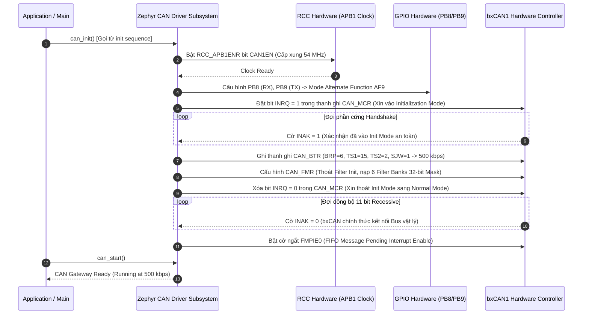
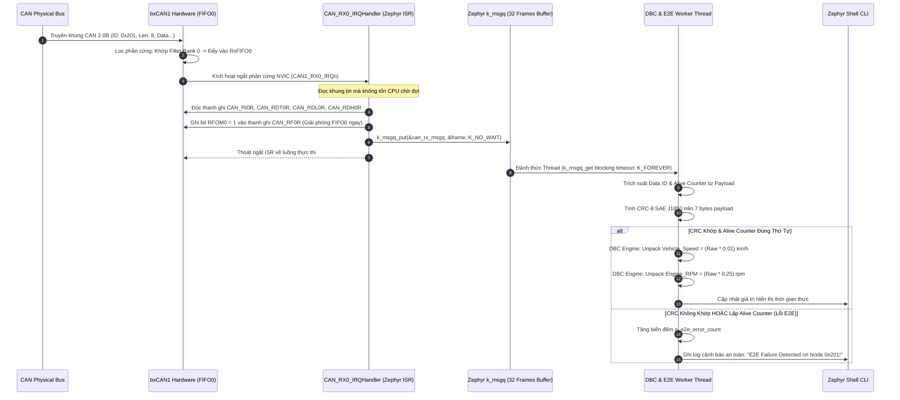
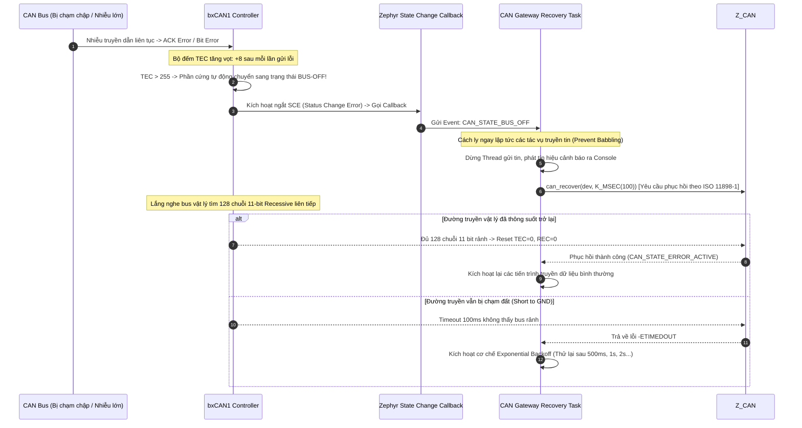

# Cẩm Nang Phỏng Vấn Dự Án 1: Automotive CAN Telematics Gateway

> **Hệ Thống:** Automotive CAN Telematics Gateway & Diagnostic Node  
> **Nền Tảng Phần Cứng:** STM32F746NG (ARM Cortex-M7 @ 216 MHz)  
> **Hệ Điều Hành & Framework:** Zephyr RTOS, Kconfig, DeviceTree, West CLI  
> **Chuẩn Công Nghiệp Ô Tô:** CAN 2.0B (ISO 11898-1), AUTOSAR E2E Profile 1 (CRC-8 SAE J1850), Vector DBC Engine, Zephyr Shell CLI  
> **Tài liệu nền tảng tham chiếu:** [`day00_baremetal_foundations.md`](file:///d:/Project/STM32F7/day00_baremetal_foundations.md), STM32F746 Reference Manual (RM0385 Chapter 30: bxCAN).

---

## MỤC LỤC TỔNG QUAN

- [1. TỔNG QUAN HỆ THỐNG & KIẾN TRÚC PHẦN MỀM](#1-tổng-quan-hệ-thống--kiến-trúc-phần-mềm)
  - [1.1. Mục Tiêu Dự Án & Thông Số Kỹ Thuật Định Lượng](#11-mục-tiêu-dự-án--thông-số-kỹ-thuật-định-lượng)
  - [1.2. Sơ Đồ Khối Kiến Trúc Phân Tầng (Zephyr Architecture)](#12-sơ-đồ-khối-kiến-trúc-phân-tầng-zephyr-architecture)
- [2. LÝ THUYẾT CỐT LÕI & CÔNG THỨC BẮT BUỘC PHẢI NHỚ](#2-lý-thuyết-cốt-lõi--công-thức-bắt-buộc-phải-nhớ)
  - [2.1. Tính Toán CAN Bit Timing (500 kbps @ APB1 54 MHz)](#21-tính-toán-can-bit-timing-500-kbps--apb1-54-mhz)
  - [2.2. Cơ Chế Lọc Phần Cứng bxCAN Filter Bank (32-bit Identifier Mask Mode)](#22-cơ-chế-lọc-phần-cứng-bxcan-filter-bank-32-bit-identifier-mask-mode)
  - [2.3. AUTOSAR E2E Profile 1 & Thuật Toán CRC-8 SAE J1850](#23-autosar-e2e-profile-1--thuật-toán-crc-8-sae-j1850)
  - [2.4. Máy Trạng Thái Quản Lý Lỗi CAN (Fault Confinement - ISO 11898-1)](#24-máy-trạng-thái-quản-lý-lỗi-can-fault-confinement---iso-11898-1)
- [3. SƠ ĐỒ TUẦN TỰ HOẠT ĐỘNG (MERMAID SEQUENCE DIAGRAMS)](#3-sơ-đồ-tuần-tự-hoạt-động-mermaid-sequence-diagrams)
  - [3.1. Quy Trình Cấu Hình Tuần Tự (Peripheral Configuration Pipeline)](#31-quy-trình-cấu-hình-tuần-tự-peripheral-configuration-pipeline)
  - [3.2. Quy Trình Vận Hành & Bắt Tay Dữ Liệu Thời Gian Thực (Runtime Dataflow)](#32-quy-trình-vận-hành--bắt-tay-dữ-liệu-thời-gian-thực-runtime-dataflow)
  - [3.3. Quy Trình Xử Lý Sự Cố & Phục Hồi An Toàn (Fault & Recovery Pipeline)](#33-quy-trình-xử-lý-sự-cố--phục-hồi-an-toàn-fault--recovery-pipeline)
- [4. PHÂN LOẠI BUG THỰC TẾ & BẪY PHẦN CỨNG KINH ĐIỂN](#4-phân-loại-bug-thực-tế--bẫy-phần-cứng-kinh-điển)
  - [4.1. Nhóm Bug Phổ Biến (Common Bugs)](#41-nhóm-bug-phổ-biến-common-bugs)
  - [4.2. Nhóm Bug Phức Tạp (Complex Architectural Bugs)](#42-nhóm-bug-phức-tạp-complex-architectural-bugs)
  - [4.3. Nhóm Bug Hiếm Gặp & Góc Khuất Phần Cứng (Rare / Edge-Case Bugs)](#43-nhóm-bug-hiếm-gặp--góc-khuất-phần-cứng-rare--edge-case-bugs)
- [5. BỘ CÂU HỎI PHỎNG VẤN & KỊCH BẢN TRẢ LỜI MẪU (FRESHER LEVEL)](#5-bộ-câu-hỏi-phỏng-vấn--kịch-bản-trả-lời-mẫu-fresher-level)

---

# 1. TỔNG QUAN HỆ THỐNG & KIẾN TRÚC PHẦN MỀM

### 1.1. Mục Tiêu Dự Án & Thông Số Kỹ Thuật Định Lượng

Dự án hiện thực một **Trạm Cổng Giao Tiếp (Gateway) và Giám Sát Chẩn Đoán Ô Tô** thu thập dữ liệu từ mạng truyền thông động cơ và khung gầm xe hơi (Powertrain & Chassis CAN Bus), giải mã dữ liệu theo định dạng Vector DBC, kiểm tra toàn vẹn an toàn chức năng theo chuẩn AUTOSAR E2E, và đẩy dữ liệu chẩn đoán ra bảng điều khiển Zephyr Shell CLI.

| Thông Số Kỹ Thuật | Giá Trị Thực Tế Dự Án | Ý Nghĩa Kỹ Thuật / Cơ Sở Thiết Kế |
| :--- | :--- | :--- |
| **Vi điều khiển** | STM32F746NG (ARM Cortex-M7) | Xung nhịp hệ thống $f_{SYSCLK} = 216\text{ MHz}$, $f_{APB1} = 54\text{ MHz}$. |
| **Ngoại vi CAN** | bxCAN1 (CAN1) | Kết nối chip CAN Transceiver ngoài (TJA1050/MCP2551 qua chân PB8/PB9). |
| **Tốc độ truyền (Baudrate)** | $500\text{ kbps}$ (High-Speed CAN) | Tốc độ tiêu chuẩn của mạng điều khiển động cơ / phanh ô tô. |
| **Điểm lấy mẫu (Sample Point)** | $87.5\%$ | Chuẩn khuyến nghị CiA (CAN in Automation) chống méo xung đường truyền dài. |
| **Tải truyền nhận (Throughput)** | $> 1,000\text{ frames/s}$ | Đảm bảo tải nặng không làm rớt bản tin, CPU load đo được $< 2\%$. |
| **Độ trễ giải mã tín hiệu** | $< 15\text{ }\mu\text{s / frame}$ | Thuật toán DBC tối ưu bằng số nguyên cố định (Fixed-point integer arithmetic). |
| **An toàn dữ liệu** | AUTOSAR E2E Profile 1 | CRC-8 SAE J1850 đa thức $0\text{x1D}$ kèm bộ đếm Alive Counter 4-bit và Data ID. |
| **Khả năng tự phục hồi** | ISO 11898-1 Bus-Off Recovery | Nhận diện trạng thái tê liệt bus và kích hoạt chuỗi phục hồi an toàn trong $< 100\text{ ms}$. |

---

### 1.2. Sơ Đồ Khối Kiến Trúc Phân Tầng (Zephyr Architecture)

```text
┌──────────────────────────────────────────────────────────────────────────────────┐
│                   ỨNG DỤNG NGƯỜI DÙNG (APPLICATION LAYER)                        │
│  ┌─────────────────────────────────────┐  ┌───────────────────────────────────┐  │
│  │   Zephyr Shell Diagnostic CLI       │  │   DBC Signal Publisher / Telemetry│  │
│  │   (Lệnh: can show, e2e stat, fault) │  │   (Tốc độ xe, Vòng tua máy, Bàn đạp)  │  │
│  └──────────────────▲──────────────────┘  └─────────────────▲─────────────────┘  │
└─────────────────────┼───────────────────────────────────────┼────────────────────┘
                      │                                       │
┌─────────────────────┼───────────────────────────────────────┼────────────────────┐
│                     │  TẦNG XỬ LÝ DỮ LIỆU Ô TÔ (MIDDLEWARE) │                    │
│  ┌──────────────────┴───────────────────────────────────────┴─────────────────┐  │
│  │               Thread 2: DBC Decoding & E2E Validation Engine                │  │
│  │   - E2E Profile 1: Check Data ID + Alive Counter + CRC-8 (SAE J1850)        │  │
│  │   - DBC Signal Extraction: Bitmasking, Intel/Motorola Byte Unpacking       │  │
│  └──────────────────────────────────▲─────────────────────────────────────────┘  │
│                                     │ k_msgq (Capacity: 32 Frames)                │
│  ┌──────────────────────────────────┴─────────────────────────────────────────┐  │
│  │                   Thread 1: CAN RX Dispatcher Task                         │  │
│  │   - Chờ Semaphore/MsgQ từ ISR, đọc frame từ Hardware FIFO0 / FIFO1          │  │
│  │   - Thống kê Error Warning, Error Passive, Bus-Off và kích hoạt phục hồi   │  │
│  └──────────────────────────────────▲─────────────────────────────────────────┘  │
└─────────────────────────────────────┼────────────────────────────────────────────┘
                                      │
┌─────────────────────────────────────┼────────────────────────────────────────────┐
│                    ZEPHYR KERNEL & DEVICE DRIVER MODEL                           │
│  ┌──────────────────────────────────┴─────────────────────────────────────────┐  │
│  │  Zephyr CAN Controller Subsystem (`drivers/can/can_stm32.c`)              │  │
│  │  - DeviceTree Node: `can1: can@40006400 { ... bus-speed = <500000>; }`     │  │
│  │  - Filter Banks: Cấu hình 6 bộ lọc phần cứng phân luồng ID về FIFO0/FIFO1   │  │
│  └──────────────────────────────────▲─────────────────────────────────────────┘  │
└─────────────────────────────────────┼────────────────────────────────────────────┘
                                      │
┌─────────────────────────────────────┼────────────────────────────────────────────┐
│              PHẦN CỨNG VI ĐIỀU KHIỂN & NGOẠI VI BARE-METAL (STM32F746)           │
│  ┌──────────────────────────────────┴─────────────────────────────────────────┐  │
│  │  Khối ngoại vi bxCAN1 (`0x40006400` trên APB1 @ 54 MHz)                   │  │
│  │  - Chân PB8 (CAN1_RX) & PB9 (CAN1_TX) ghép kênh AF9                        │  │
│  │  - CAN Transceiver ngoài (TJA1050 / MCP2551) kết nối Bus CAN vật lý       │  │
│  └────────────────────────────────────────────────────────────────────────────┘  │
└──────────────────────────────────────────────────────────────────────────────────┘
```

---

# 2. LÝ THUYẾT CỐT LÕI & CÔNG THỨC BẮT BUỘC PHẢI NHỚ

### 2.1. Tính Toán CAN Bit Timing (500 kbps @ APB1 54 MHz)

Trong giao thức CAN, 1 bit dữ liệu được chia làm 4 đoạn định thời (Time Segments):
1. **Sync_Seg**: Luôn luôn bằng $1\text{ }t_q$ (dùng để đồng bộ xung nhịp cạnh sườn).
2. **Prop_Seg**: Bù trễ trễ vật lý của đường dây cáp và transceiver.
3. **Phase_Seg1**: Đoạn trễ pha 1 (cho phép kéo dài khi có sai lệch xung nhịp).
4. **Phase_Seg2**: Đoạn trễ pha 2 (cho phép rút ngắn khi có sai lệch xung nhịp).

**Điểm lấy mẫu (Sample Point):** Là thời điểm bộ nhận đọc trạng thái logic của bus:
$$\text{Sample Point (\%)} = \frac{\text{Sync\_Seg} + \text{Prop\_Seg} + \text{Phase\_Seg1}}{\text{Tổng số } t_q \text{ trong 1 bit}} \times 100\%$$

#### Các bước tính toán trên STM32F746:
* **Tần số bus APB1:** $f_{APB1} = 54\text{ MHz}$.
* **Tốc độ mong muốn:** $\text{Baudrate} = 500\text{ kbps} \implies \text{Thời gian 1 bit} = \frac{1}{500,000} = 2\text{ }\mu\text{s} = 2,000\text{ ns}$.
* **Chọn tổng số $t_q$ cho 1 bit:** Chọn $\text{Tổng } t_q = 18\text{ }t_q$.
  * Suy ra chu kỳ 1 $t_q$: $t_q = \frac{2,000\text{ ns}}{18} = 111.11\text{ ns}$.
  * Hệ số chia Prescaler (BRP):
    $$\text{BRP} = \frac{f_{APB1}}{\text{Baudrate} \times \text{Tổng } t_q} = \frac{54,000,000}{500,000 \times 18} = \frac{54,000,000}{9,000,000} = 6$$
* **Phân bổ các đoạn để đạt Sample Point $87.5\%$:**
  * $\text{Sync\_Seg} = 1\text{ }t_q$ (bắt buộc).
  * Mục tiêu lấy mẫu tại $87.5\% \implies \text{Vị trí lấy mẫu} = 18 \times 87.5\% \approx 15.75 \implies \text{chọn } 16\text{ }t_q$.
  * Do đó: $\text{Phase\_Seg2} = 18 - 16 = 2\text{ }t_q$.
  * Phần còn lại: $\text{Prop\_Seg} + \text{Phase\_Seg1} = 15\text{ }t_q$ (trong thanh ghi STM32 gộp chung thành $TS1 = 15$).
  * Điểm lấy mẫu thực tế: $\frac{1 + 15}{18} = \frac{16}{18} = 88.88\%$ (rất sát chuẩn CiA $87.5\%$).
  * Nhảy đồng bộ lại (SJW): $\text{SJW} = 1\text{ }t_q$ đến $2\text{ }t_q$.

---

### 2.2. Cơ Chế Lọc Phần Cứng bxCAN Filter Bank (32-bit Identifier Mask Mode)

Phần cứng bxCAN của STM32F7 hỗ trợ tới 28 Filter Banks (chia sẻ giữa CAN1 và CAN2). Để tối ưu CPU không bị ngắt rác, dự án sử dụng **Chế độ Mặt nạ 32-bit (32-bit Mask Mode)**:
* **Thanh ghi Định danh (ID Register - `FxR1`):** Chứa các bit ID mong muốn nhận.
* **Thanh ghi Mặt nạ (Mask Register - `FxR2`):** Chỉ thị bit nào bắt buộc phải khớp.
  * **Bit Mask = 1:** Phần cứng **bắt buộc so khớp tuyệt đối** bit tương ứng của frame đến với bit trong ID Register. Nếu khác nhau $\to$ Hủy gói tin.
  * **Bit Mask = 0:** Phần cứng **bỏ qua (Don't care)**, bit của frame đến bằng 0 hay 1 đều chấp nhận.

#### Ví dụ bài toán dự án: Nhận dải ID từ `0x200` đến `0x20F` (16 node động cơ):
* Dải nhị phân của ID: `0010 0000 0000` đến `0010 0000 1111`.
* Ta thấy 8 bit cao (`0x20`) cố định, 4 bit thấp biến thiên.
* **Cấu hình:**
  * `ID Register`  $= 0\text{x200}$
  * `Mask Register` $= 0\text{x7F0}$ (111 1111 0000: 7 bit cao bắt buộc khớp, 4 bit thấp bỏ qua).
* Kết quả: Chỉ 1 bộ lọc phần cứng duy nhất xử lý xong toàn bộ 16 node mà không tốn một chu kỳ CPU nào.

---

### 2.3. AUTOSAR E2E Profile 1 & Thuật Toán CRC-8 SAE J1850

Trong tiêu chuẩn an toàn ô tô (ISO 26262), mạng CAN có thể gặp lỗi: mất gói tin (drop), lặp lại gói tin (replay), sai lệch dữ liệu (corruption). **AUTOSAR End-to-End (E2E) Profile 1** bảo vệ gói tin bằng cách chèn thêm 2 trường bảo vệ vào Payload:
1. **Alive Counter (4-bit, 0 đến 15):** Tăng dần theo mỗi chu kỳ truyền. Bên nhận kiểm tra nếu Counter không tăng liên tục $\implies$ Phát hiện mất gói hoặc lặp gói.
2. **Data ID (16-bit duy nhất của bản tin):** Ngăn ngừa việc gửi nhầm bản tin khác ID vào bộ đệm.
3. **CRC-8 Checksum (8-bit):** Đa thức SAE J1850.

$$\text{Đa thức CRC-8 SAE J1850: } P(x) = x^8 + x^4 + x^3 + x^2 + 1 \quad (\text{Mã Hex: } 0\text{x1D})$$

* **Giá trị khởi tạo (Init Seed):** $0\text{xFF}$.
* **XOR đầu ra (XOR Out):** $0\text{xFF}$.
* **Trình tự tính CRC:**
  1. Nạp Byte thấp của Data ID vào tính CRC.
  2. Nạp Byte cao của Data ID vào tính tiếp.
  3. Lần lượt nạp các byte dữ liệu (Payload Byte 1 đến Byte 7).
  4. Byte 0 (hoặc Byte cuối tùy cấu hình) là nơi chứa Checksum để so khớp.

---

### 2.4. Máy Trạng Thái Quản Lý Lỗi CAN (Fault Confinement - ISO 11898-1)

Mỗi node CAN tích hợp 2 bộ đếm lỗi bằng phần cứng: **TEC (Transmit Error Counter)** và **REC (Receive Error Counter)**:

```text
       ┌──────────────────────────────┐
       │   ERROR ACTIVE (Mặc định)    │ ◄── Node hoạt động bình thường,
       │   (TEC < 96 && REC < 96)     │     phát Active Error Flag (6 bit Dominant liên tiếp).
       └──────────────┬───────────────┘
                      │ TEC >= 96 || REC >= 96 (Cảnh báo: Warning Status)
                      │ TEC > 127 || REC > 127
                      ▼
       ┌──────────────────────────────┐
       │        ERROR PASSIVE         │ ◄── Node bị nghi ngờ hỏng,
       │  (128 <= TEC/REC <= 255)     │     chỉ được phát Passive Error Flag (6 bit Recessive),
       └──────────────┬───────────────┘     phải đợi thêm 8 bit Suspend Transmission trước khi gửi.
                      │
                      │ TEC > 255 (Bộ phát làm bẩn bus quá nhiều lần)
                      ▼
       ┌──────────────────────────────┐
       │          BUS-OFF             │ ◄── Node bị cách ly hoàn toàn khỏi mạng!
       │         (TEC > 255)          │     Ngắt mở chân TX, không thể truyền hay nhận.
       └──────────────────────────────┘
```

* **Cơ chế tự phục hồi chuẩn ISO 11898-1:** Node phải giám sát bus vật lý và đợi đủ **128 lần xuất hiện của chuỗi 11 bit Recessive liên tiếp** (tương đương 128 khung rảnh không có xung nhiễu) thì mới được phép reset $TEC = 0, REC = 0$ và quay lại trạng thái `Error Active`.

---

# 3. SƠ ĐỒ TUẦN TỰ HOẠT ĐỘNG (MERMAID SEQUENCE DIAGRAMS)

### 3.1. Quy Trình Cấu Hình Tuần Tự (Peripheral Configuration Pipeline)

Quy trình từ lúc hệ điều hành Zephyr nạp cấu hình DeviceTree đến khi khối phần cứng bxCAN thức dậy sẵn sàng truyền nhận:



---

### 3.2. Quy Trình Vận Hành & Bắt Tay Dữ Liệu Thời Gian Thực (Runtime Dataflow)

Luồng nhận gói tin CAN, trích xuất hàng đợi phi khóa an toàn và thẩm định an toàn chức năng E2E:



---

### 3.3. Quy Trình Xử Lý Sự Cố & Phục Hồi An Toàn (Fault & Recovery Pipeline)



---

# 4. PHÂN LOẠI BUG THỰC TẾ & BẪY PHẦN CỨNG KINH ĐIỂN

### 4.1. Nhóm Bug Phổ Biến (Common Bugs)

#### 🐞 Bug 1: Thiếu trở đầu cuối 120 $\Omega$ tại hai đầu Bus vật lý
* **Triệu chứng:** Khi cắm máy phát CAN vào STM32, chip liên tục báo lỗi **ACK Error** (Acknowledge Error), các cờ lỗi nhảy liên tục và node bị rơi vào trạng thái Bus-Off sau vài mili-giây.
* **Nguyên nhân vật lý:** Chuẩn CAN vật lý (ISO 11898-2) sử dụng đường truyền vi sai (Differential Pair: CAN_H và CAN_L). Hai đầu dây cáp bắt buộc phải có trở đầu cuối $120\text{ }\Omega$ (tổng trở song song toàn mạng là $60\text{ }\Omega$). Nếu không có trở, năng lượng sóng truyền tới cuối dây không bị tiêu hao mà bị dội ngược lại (sóng phản xạ - signal reflection), làm méo dạng xung logic. Đồng thời khi các transistor ngắt, đường truyền không được kéo về mức lặn Recessive ($2.5\text{ V}$) kịp thời.
* **Cách xử lý:** Luôn kiểm tra bằng ôm-kế (multimeter) đo giữa chân CAN_H và CAN_L khi ngắt nguồn: Điện trở đo được phải xấp xỉ $60\text{ }\Omega$. Bật jumper trở $120\text{ }\Omega$ có sẵn trên module transceiver TJA1050.

#### 🐞 Bug 2: Cấu hình nhầm Bitmask trong Filter Bank làm rơi gói tin
* **Triệu chứng:** Máy phát gửi bản tin CAN ID `0x123`, nhưng STM32 hoàn toàn im lặng, ngắt `CAN1_RX0_IRQHandler` không bao giờ nhảy.
* **Nguyên nhân:** Lập trình viên nhầm lẫn giữa **ID Register** và **Mask Register**. Ví dụ: Muốn nhận chính xác ID `0x123`, nhưng lại cấu hình `Mask = 0x000` (nghĩa là chấp nhận mọi ID) hoặc cấu hình `Mask = 0x123` (sai nguyên lý vì Mask phải là các bit 1 ở các vị trí cần so khớp).
* **Cách xử lý chuẩn:**
  * Nếu nhận duy nhất ID `0x123`: Cấu hình `ID = 0x123`, `Mask = 0x7FF` (tất cả 11 bit chuẩn đều phải so khớp chính xác).
  * Trong Zephyr: Sử dụng struct `struct can_filter my_filter = { .id = 0x123, .mask = 0x7FF, .flags = 0 };`.

#### 🐞 Bug 3: Sai cấu hình GPIO Pin Multiplexing (AF9 trên STM32F7)
* **Triệu chứng:** Khởi tạo bxCAN không báo lỗi nhưng không thấy xung điện áp trên chân vi điều khiển.
* **Nguyên nhân:** Trên STM32F746, CAN1 có nhiều chân ánh xạ khác nhau (PA11/PA12, PB8/PB9, PD0/PD1). Nếu dùng chân PB8/PB9 mà quên cấu hình thanh ghi Alternate Function sang `AF9` (hoặc cấu hình thiếu thuộc tính `pull-up` cho chân RX), chân sẽ ở trạng thái Input Floating và tín hiệu RX không đi vào được khối ngoại vi.

---

### 4.2. Nhóm Bug Phức Tạp (Complex Architectural Bugs)

#### 🐞 Bug 4: Tràn hàng đợi k_msgq khi gặp hiện tượng Burst Traffic (1,000 frames/s)
* **Triệu chứng:** Mạng CAN chạy bình thường khi lưu lượng thấp. Khi trên xe có nhiều hộp điều khiển cùng phát dữ liệu đồng thời (Burst Traffic), hệ thống bắt đầu làm rơi rụng bản tin, biến đếm lỗi mất gói tăng vọt.
* **Nguyên nhân:** 
  1. Trong ngắt ISR, việc đẩy dữ liệu vào Queue bắt buộc phải dùng cờ không chờ: `k_msgq_put(&can_rx_msgq, &frame, K_NO_WAIT)`. Nếu Queue bị đầy, `k_msgq_put` trả về lỗi `-ENOMSG` và gói tin mới nhất bị vứt bỏ.
  2. Luồng xử lý (`DBC Worker Thread`) có mức ưu tiên quá thấp hoặc tốn quá nhiều thời gian in chuỗi định dạng qua `printk()` (giao tiếp UART bị nghẽn làm chậm luồng).
* **Giải pháp khắc phục:**
  1. Tăng kích thước bộ đệm `k_msgq` lên 64 hoặc 128 phần tử.
  2. Nâng độ ưu tiên của luồng giải mã (`priority = 2` trong hệ thống Zephyr Cooperative/Preemptive).
  3. Cấm tuyệt đối việc gọi hàm in UART `printk()` trực tiếp trong vòng lặp giải mã dữ liệu; chỉ cập nhật biến trạng thái hoặc gửi qua ring buffer UART DMA.
  4. Tận dụng đồng thời cả 2 bộ đệm phần cứng **FIFO0** và **FIFO1** của bxCAN bằng cách cấu hình bộ lọc phân bổ: Gói tin khẩn cấp ưu tiên cao vào FIFO0, gói telemetry định kỳ vào FIFO1.

#### 🐞 Bug 5: Sai lệch Endianness (Intel vs Motorola) khi giải mã DBC qua Byte Boundary
* **Triệu chứng:** Cùng một tín hiệu điện áp xe hơi (12-bit), khi đọc trên phần mềm PC thì ra `12.5V`, nhưng thuật toán C trên STM32 giải mã ra con số rác khổng lồ hoặc số âm.
* **Nguyên nhân:** Định dạng Vector DBC phân chia tín hiệu thành 2 dạng:
  * **Intel (Little-Endian):** Byte thấp nằm trước, bit có trọng số thấp nhất nằm ở byte đầu.
  * **Motorola (Big-Endian):** Byte cao nằm trước, bit truyền đi vắt ngang qua ranh giới byte (Byte Boundary) theo hướng ngược lại.
  * Nếu dùng phép dịch bit thông thường `(buf[0] | (buf[1] << 8))` cho tín hiệu kiểu Motorola, kết quả sẽ hoàn toàn sai lệch.
* **Giải pháp khắc phục:** Xây dựng hàm trích xuất bit chuyên dụng `can_dbc_unpack_motorola()` sử dụng bảng dịch bit đảo byte hoặc dùng công cụ sinh mã nguồn tự động `cantools` tích hợp vào build system CMake của Zephyr.

#### 🐞 Bug 6: Vòng lặp Bus-Off tự sát (Bus-Off Rapid Recovery Loop)
* **Triệu chứng:** Khi dây CAN vật lý bị chập ngắn mạch xuống đất (Short to GND), MCU nhảy vào ngắt Bus-Off liên tục hàng nghìn lần mỗi giây, vắt kiệt 100% CPU khiến toàn bộ hệ thống bị treo cứng (Watchdog reset).
* **Nguyên nhân:** Phần mềm cấu hình tính năng `ABOM` (Automatic Bus-Off Management) trong thanh ghi `CAN_MCR` bật tự động phục hồi ngay lập tức mà không có thời gian trễ. Khi đường dây vẫn đang bị chập, MCU vừa thức dậy phát thử 1 bit là bị lỗi tiếp và lại rơi vào Bus-Off ngay lập tức.
* **Giải pháp chuẩn Automotive:** Tắt cờ `ABOM = 0` (quản lý phục hồi bằng phần mềm). Khi xảy ra Bus-Off, chuyển sang trạng thái an toàn, khởi động một Timer trễ lũy thừa (Exponential Backoff: Thử lại sau $100\text{ ms} \to 500\text{ ms} \to 1\text{ s} \to 5\text{ s}$). Nếu thử quá 5 lần không thành công, ngắt hẳn bộ phát và báo đèn Check Engine.

---

### 4.3. Nhóm Bug Hiếm Gặp & Góc Khuất Phần Cứng (Rare / Edge-Case Bugs)

#### 🐞 Bug 7: Hiện tượng Babbling Node & Chết Transceiver ở mức Dominant
* **Triệu chứng:** Toàn bộ mạng CAN của ô tô (hàng chục hộp ECU) đột ngột tê liệt hoàn toàn, không một hộp nào truyền nhận được dữ liệu.
* **Nguyên nhân:** Một node trên mạng bị hỏng phần cứng vi điều khiển hoặc lỗi phần mềm rơi vào vòng lặp vô tận giữ chân `CAN_TX = 0` (mức Dominant). Do tính chất của CAN Bus: **Mức Dominant luôn thắng mức Recessive**, nên khi 1 chân bị giữ mức 0, toàn bộ đường truyền vi sai bị kéo lệch điện áp vĩnh viễn, đè bẹp tất cả các node khác trên xe.
* **Giải pháp phần cứng:** Lựa chọn các dòng chip CAN Transceiver đạt chuẩn an toàn chức năng có tích hợp tính năng **TXD Dominant Time-out Protection** (ví dụ: TJA1042 hoặc TJA1050). Nếu chân TXD bị giữ mức Dominant quá thời gian giới hạn $t_{to(dom)} \approx 1\text{ ms}$, phần cứng bên trong Transceiver sẽ tự động ngắt kết nối tầng công suất lái bus, trả lại đường bus tự do cho các node khác.

#### 🐞 Bug 8: Lệch pha thạch anh do nhiệt độ cao gây Stuff Error ngẫu nhiên
* **Triệu chứng:** Hệ thống chạy thử trong phòng lab thì hoàn hảo, nhưng khi đem lắp vào khoang động cơ xe chạy thử ở nhiệt độ cao ($> 85^\circ\text{C}$), thỉnh thoảng xuất hiện lỗi **Stuff Error** làm rớt khung tin.
* **Nguyên nhân:** Bộ dao động nội hoặc thạch anh chất lượng thấp bị trôi tần số khi nhiệt độ thay đổi (Frequency Drift). Chuẩn CAN quy định sai số dao động cho phép tối đa của mạng 500 kbps là $\pm 1.58\%$. Khi nhiệt độ tăng, sai lệch vượt ngưỡng làm thời điểm Sample Point bị trượt dần về cuối bit. Khi xuất hiện chuỗi 5 bit giống nhau liên tiếp, bộ thu không kịp nhận diện bit chèn (Stuff Bit) và báo lỗi Stuff Error.
* **Giải pháp:** Sử dụng thạch anh thạch anh ngoại vi chuẩn ô tô có bù nhiệt độ (Automotive Grade Crystal Oscillator với độ trôi sai số $< 50\text{ ppm}$) và mở rộng cửa sổ đồng bộ lại $\text{SJW} = 2\text{ }t_q$ hoặc $3\text{ }t_q$ trong cấu hình `CAN_BTR`.

---

# 5. BỘ CÂU HỎI PHỎNG VẤN & KỊCH BẢN TRẢ LỜI MẪU (FRESHER LEVEL)

### ❓ Câu 1: "Tại sao trong mạng CAN, ID có giá trị số nhỏ hơn lại có mức độ ưu tiên cao hơn?"
* **🗣️ Kịch bản trả lời mẫu (30 - 45 giây):**
  > *"Dạ, điều này xuất phát từ nguyên lý phân xử trọng tài bằng phần cứng (Arbitration) dựa trên cơ chế 'Wired-AND' của bus CAN.  
  > Trên đường bus vi sai, bit logic 0 là mức Trội (Dominant) và bit logic 1 là mức Lặn (Recessive). Khi hai hay nhiều node cùng phát tín hiệu đồng thời, nếu một node phát bit 1 nhưng phát hiện đường bus bị kéo xuống mức 0 (do node khác đang phát bit 0), node phát bit 1 sẽ lập tức nhận biết mình bị thua trong cuộc phân xử trọng tài và tự động rút lui về chế độ nhận mà không phá hủy khung dữ liệu.  
  > Vì bit 0 là mức Trội, nên bản tin nào có các bit 0 xuất hiện sớm hơn — tức là có giá trị ID nhỏ hơn theo hệ nhị phân — sẽ giành chiến thắng quyền ưu tiên phát trên đường truyền."*

---

### ❓ Câu 2: "Trình bày cách bạn tính toán Bit Timing cho mạng CAN 500 kbps trên STM32F746?"
* **🗣️ Kịch bản trả lời mẫu (35 - 45 giây):**
  > *"Dạ, khối ngoại vi bxCAN1 trên STM32F746 nằm trên bus APB1 với tần số xung nhịp là 54 MHz.  
  > Với tốc độ yêu cầu là 500 kbps, chu kỳ của 1 bit dữ liệu là 2,000 nano-giây. Em chia 1 bit thành tổng cộng 18 đơn vị thời gian time quanta (tq).  
  > Từ đó em tính ra hệ số chia Prescaler BRP bằng 54 MHz chia cho (500 kHz nhân 18), ra kết quả BRP chính xác bằng 6.  
  > Để đáp ứng chuẩn khuyến nghị CiA về vị trí điểm lấy mẫu ở mức xấp xỉ 87.5%, em phân bổ: Đoạn Sync_Seg bằng 1 tq, đoạn TS1 (gộp Prop_Seg và Phase_Seg1) bằng 15 tq, và đoạn TS2 bằng 2 tq. Điểm lấy mẫu thực tế đạt được là 16 chia 18, tương đương 88.8%, đảm bảo hệ thống lấy mẫu ổn định và chống méo xung đường truyền dài."*

---

### ❓ Câu 3: "Tại sao trong ngắt CAN RX ISR bạn lại dùng `k_msgq_put(..., K_NO_WAIT)` mà không dùng Mutex hay Semaphore?"
* **🗣️ Kịch bản trả lời mẫu (30 - 40 giây):**
  > *"Dạ, đây là quy tắc sống còn trong lập trình hệ điều hành thời gian thực: Tuyệt đối không được phép thực hiện hành vi chờ đợi (Block hoặc Sleep) bên trong trình phục vụ ngắt ISR.  
  > Mutex có cơ chế chuyển quyền sở hữu và có thể khiến luồng gọi bị block để chờ nhả khóa, do đó không được phép dùng trong ISR.  
  > Em chọn `k_msgq` với cờ `K_NO_WAIT` vì hàm này hoạt động theo cơ chế phi khóa (Lock-free Ring Buffer), dữ liệu khung CAN 16 bytes được copy trực tiếp vào bộ đệm của kernel chỉ trong vài chục chu kỳ lệnh rồi thoát ngay lập tức, giải phóng CPU quay lại phục vụ các tác vụ khác. Sau đó một Thread nền với mức ưu tiên phù hợp sẽ chờ nhả dữ liệu ra để xử lý các thuật toán giải mã DBC nặng hơn."*

---

### ❓ Câu 4: "AUTOSAR E2E Profile 1 bảo vệ hệ thống trước những nguy cơ mất an toàn nào trên ô tô?"
* **🗣️ Kịch bản trả lời mẫu (30 - 40 giây):**
  > *"Dạ, trong tiêu chuẩn an toàn chức năng ISO 26262, bản thân tầng phần cứng CAN chỉ bảo vệ phát hiện lỗi bit thông thường mà không thể phát hiện lỗi logic hệ thống. AUTOSAR E2E Profile 1 giải quyết 3 bài toán lớn:  
  > Thứ nhất là phát hiện mất gói tin hoặc lặp lại gói tin nhờ vào trường Alive Counter 4-bit tăng liên tục từ 0 đến 15.  
  > Thứ hai là phát hiện gửi nhầm địa chỉ hoặc nạp sai buffer nhờ trường Data ID 16-bit độc nhất được đưa vào thuật toán băm CRC.  
  > Thứ ba là bảo vệ toàn vẹn dữ liệu payload bằng mã kiểm tra CRC-8 SAE J1850 đa thức 0x1D. Nếu có bất kỳ sự cố nào làm dữ liệu bị lệch dù chỉ 1 bit, tầng E2E sẽ loại bỏ gói tin ngay lập tức và đưa hệ thống về trạng thái an toàn Fail-Safe."*

---

### ❓ Câu 5: "Khi mạng CAN bị lỗi Bus-Off, bạn xử lý thế nào để hệ thống không bị treo?"
* **🗣️ Kịch bản trả lời mẫu (35 - 45 giây):**
  > *"Dạ, khi bộ đếm lỗi truyền TEC vượt quá 255, phần cứng bxCAN sẽ ngắt kết nối vật lý và chuyển sang trạng thái Bus-Off.  
  > Em không bật cờ tự động phục hồi tức thì ABOM vì nếu đường dây đang bị chập mass, vi điều khiển sẽ bị ngắt liên tục gây treo hệ thống.  
  > Thay vào đó, em bắt sự kiện Bus-Off thông qua ngắt lỗi SCE của Zephyr. Lúc này, em lập tức đình chỉ các luồng gửi tin để tránh làm nghẽn bus, đồng thời kích hoạt một Timer trễ an toàn lũy thừa (Exponential Backoff).  
  > Khi hết thời gian chờ, em mới gọi hàm phục hồi theo chuẩn ISO 11898-1 để phần cứng đếm đủ 128 chuỗi 11-bit Recessive liên tiếp xác nhận bus đã thực sự sạch nhiễu rồi mới cho phép hệ thống truyền nhận trở lại."*

---

### ❓ Câu 6: "Trong Zephyr RTOS, bạn quản lý và ánh xạ phần cứng CAN thông qua DeviceTree như thế nào?"
* **🗣️ Kịch bản trả lời mẫu (30 - 40 giây):**
  > *"Dạ, Zephyr tách biệt hoàn toàn giữa mã nguồn logic và phần cứng thông qua DeviceTree.  
  > Trong file overlay của board STM32F746, em kích hoạt node `&can1`, chỉ định thuộc tính `status = "okay"`, cấu hình tốc độ `bus-speed = <500000>`, và gán các chân pinctrl tương ứng là PB8 và PB9 ở chế độ AF9.  
  > Trong mã nguồn C, em truy xuất ngoại vi thông qua macro chuẩn của Zephyr: `DEVICE_DT_GET(DT_NODELABEL(can1))`.  
  > Nhờ cơ chế này, nếu sau này dự án chuyển sang chạy trên chip khác như NXP S32K hay TI Sitara, em chỉ cần sửa lại file DeviceTree mà toàn bộ mã nguồn ứng dụng giải mã DBC và E2E giữ nguyên vẹn 100% không phải viết lại."*
