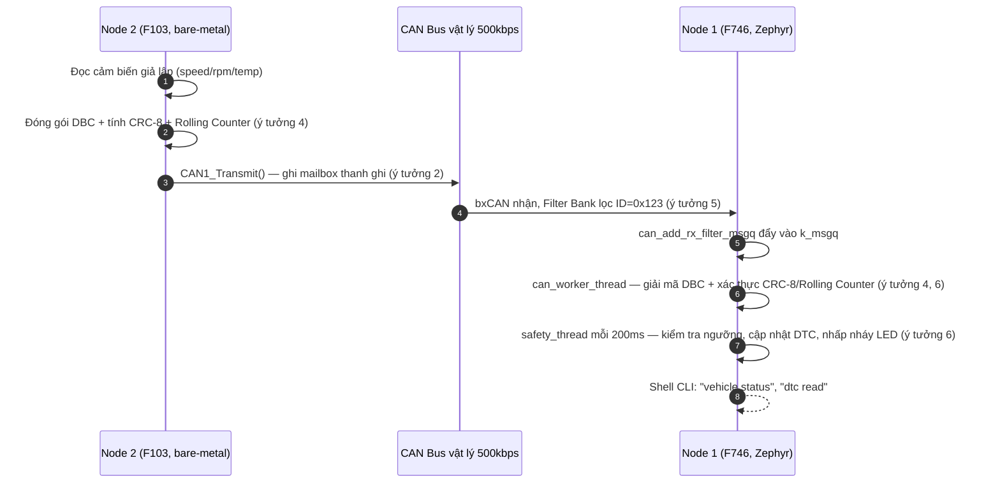
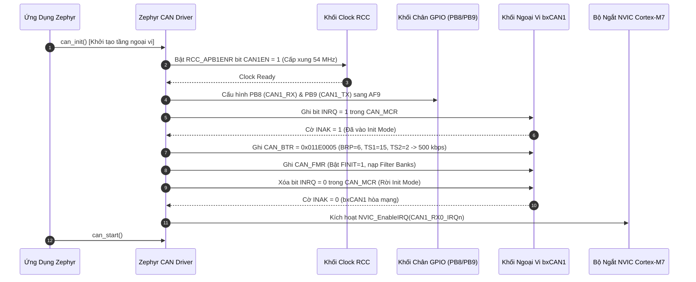
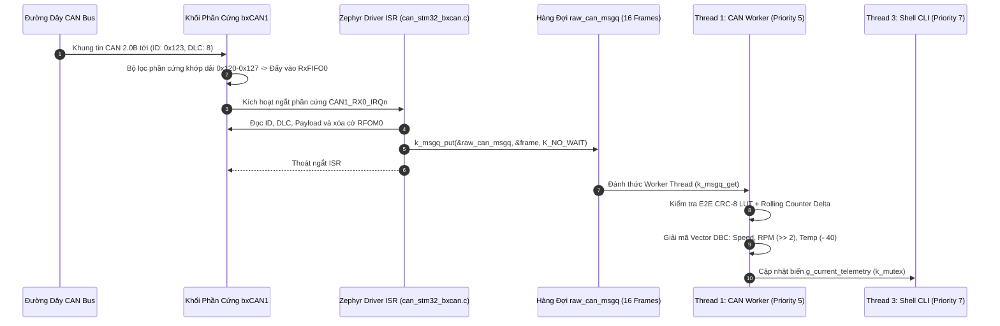
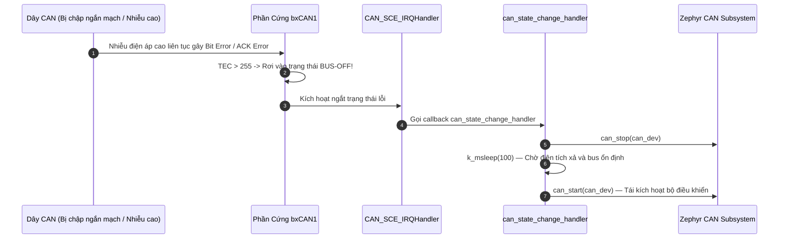

# Tài Liệu Học Lại Dự Án 1: Automotive CAN Telematics Gateway (Hệ 2 Node)

*(Học ý tưởng thiết kế, luồng hoạt động 2 vi điều khiển giao tiếp qua CAN Bus, và cách vận hành từng khối phần cứng — dùng lại được cho phỏng vấn nhưng mục tiêu chính là hiểu hệ thống.)*

> **Hệ Thống:** Automotive CAN Telematics Gateway & Diagnostic Node — **gồm 2 board giao tiếp với nhau qua CAN Bus vật lý**  
> **Node 1 — Gateway/Cụm đồng hồ:** STM32F746NG (ARM Cortex-M7 @ 216 MHz), chạy **Zephyr RTOS**, nhận & giải mã dữ liệu  
> **Node 2 — ECU mô phỏng động cơ:** STM32F103C8T6 "Blue Pill" (ARM Cortex-M3 @ 72 MHz), **100% Bare-Metal**, phát dữ liệu  
> **Chuẩn Công Nghiệp Ô Tô:** CAN 2.0B (ISO 11898-1), AUTOSAR E2E Profile 1 (CRC-8 SAE J1850), Vector DBC Engine, Zephyr Shell CLI  
> **Tài liệu nền tảng tham chiếu (trên máy cá nhân):** [`day00_baremetal_foundations.md`](file:///d:/Project/STM32F7/day00_baremetal_foundations.md), STM32F746 Reference Manual (RM0385 Chương 30: bxCAN), STM32F103 Reference Manual (RM0008 Chương 24: bxCAN).

---

## 🧭 Ý TƯỞNG & THIẾT KẾ HỆ THỐNG (ĐỌC TRƯỚC — "TẠI SAO" TRƯỚC KHI HỌC "LÀM THẾ NÀO")

### Bài toán gốc
Mô phỏng lại đúng cách một mạng CAN Bus ô tô thật gồm **nhiều ECU độc lập** trao đổi dữ liệu — nhưng trong phòng thí nghiệm chỉ có 2 board rời, không có xe thật. Cần: (1) một node đóng vai "động cơ" liên tục phát dữ liệu cảm biến, (2) một node đóng vai "cụm đồng hồ / gateway" nhận, giải mã, kiểm tra an toàn dữ liệu và hiển thị — đúng vai trò một ECU cổng (Gateway ECU) thật làm trong xe.

### Chuỗi quyết định thiết kế

1. **Tách thành 2 vi điều khiển vật lý riêng biệt thay vì mô phỏng 1 board (loopback).**  
   Nếu chỉ dùng 1 board tự gửi tự nhận (loopback nội bộ), sẽ không kiểm chứng được tầng vật lý thật (Transceiver, trở đầu cuối, dây vi sai CAN_H/CAN_L, nhiễu bus). Dùng 2 chip khác dòng (F746 và F103) buộc phải giải quyết đúng bài toán thực tế: 2 node có xung nhịp khác nhau, tốc độ bus khác nhau về mặt cấu hình thanh ghi, nhưng phải **thống nhất cùng một baudrate 500kbps ở mức tín hiệu vật lý** để nói chuyện được với nhau.

2. **Node 2 (F103) cố tình làm Bare-Metal thay vì cũng dùng Zephyr.**  
   Vì đây là "ECU vệ tinh" đơn giản — chỉ lặp một việc: đóng gói tín hiệu DBC, tính CRC, gửi CAN theo chu kỳ — không cần một RTOS đầy đủ. Chọn bare-metal cho node này vừa nhẹ (không tốn không gian trình bày RTOS phức tạp cho vai trò phụ), vừa là dịp thực hành viết driver bxCAN ở mức thanh ghi (đối lập có chủ đích với Node 1 dùng framework cao cấp) — một cách để hiểu cả hai đầu của phổ trừu tượng hoá: "chạm tay vào thanh ghi" và "dùng API RTOS".

3. **Node 1 (F746) chọn Zephyr RTOS thay vì bare-metal.**  
   Vai trò Gateway phức tạp hơn nhiều: vừa nhận CAN, vừa giải mã DBC/E2E, vừa theo dõi an toàn (DTC), vừa chạy CLI chẩn đoán — nhiều việc chạy song song với các chu kỳ khác nhau. Một RTOS với các luồng (thread) độc lập, hàng đợi (`k_msgq`) và Shell console dựng sẵn giúp tách rõ từng trách nhiệm mà không phải tự viết state machine đa nhiệm bằng tay như ở bare-metal.

4. **Không tin dữ liệu CAN theo mặc định — phải qua 2 lớp xác thực (AUTOSAR E2E).**  
   Trên xe thật, một bản tin CAN có thể bị nhiễu điện từ, đứt gói, hoặc một ECU lỗi phát sai dữ liệu — hậu quả có thể ảnh hưởng an toàn (VD: hiển thị sai tốc độ). Vì vậy trước khi tin một khung dữ liệu, hệ thống bắt buộc: **(a)** kiểm tra CRC-8 để phát hiện bit lỗi do nhiễu, **(b)** kiểm tra Rolling Counter (bộ đếm vòng) để phát hiện gói bị mất/lặp/replay. Đây chính là ý tưởng lõi của chuẩn AUTOSAR E2E Profile 1 dùng thật trong ngành ô tô.

5. **Dùng bộ lọc phần cứng (Filter Bank) thay vì lọc bằng phần mềm sau khi nhận.**  
   CPU không nên bị đánh thức bởi những bản tin không liên quan. bxCAN có sẵn 28 bộ lọc phần cứng — cấu hình 1 lần để chỉ những khung có ID khớp (`0x123`) mới được đẩy vào hàng đợi `k_msgq`, mọi khung khác bị phần cứng tự loại ngay tại FIFO, CPU không tốn một chu kỳ nào để nhìn thấy chúng.

6. **Tách luồng nhận (CAN Worker) và luồng giám sát an toàn (Safety Supervisor) thành 2 thread riêng, ưu tiên khác nhau.**  
   Việc "nhận và giải mã gói tin" cần phản ứng nhanh mỗi khi có dữ liệu tới (ưu tiên cao hơn). Việc "quét định kỳ xem có lỗi/mất kết nối không và nhấp nháy đèn cảnh báo" chỉ cần chạy đều đặn mỗi 200ms, không cấp bách bằng — cho chạy ở ưu tiên thấp hơn để không tranh CPU với luồng nhận dữ liệu.

7. **Có sẵn bộ mô phỏng "xe ảo" ngay trong Node 1, độc lập với Node 2.**  
   Không phải lúc nào cũng có đủ 2 board để test. Node 1 tự mang theo `sim_thread` (chạy phần mềm, không qua CAN vật lý — gọi thẳng `can_gateway_send_frame`) tự phát dữ liệu giả lập tốc độ/RPM biến thiên, cộng thêm lệnh CLI `can inject overheat/overspeed/corrupt` để **chủ động bơm lỗi** kiểm tra xem lớp an toàn (DTC) có bắt đúng không — một dạng self-test không cần phần cứng thật.

### Tóm tắt luồng dữ liệu (từ ý tưởng ở trên)



*(Song song đó, `sim_thread` bên trong Node 1 có thể tự phát khung giả lập qua `can_gateway_send_frame()` mà không cần Node 2 thật — dùng để test độc lập, xem ý tưởng 7.)*

---

## MỤC LỤC TỔNG QUAN

- [🧭 Ý tưởng & Thiết kế hệ thống](#-ý-tưởng--thiết-kế-hệ-thống-đọc-trước--tại-sao-trước-khi-học-làm-thế-nào)
- [🆕 Cập nhật so với phiên bản Source trước](#-cập-nhật-so-với-phiên-bản-source-trước--nâng-cấp-từ-1-bản-tin-lên-hệ-thống-3-bản-tin)
- [⚠️ Đối chiếu với Source Code thật](#️-đối-chiếu-với-source-code-thật--đọc-trước-khi-học-thuộc)
- [0. DANH MỤC TÀI LIỆU GỐC & HƯỚNG DẪN TRA CỨU RM/DATASHEET (LOOKUP GUIDE)](#0-danh-mục-tài-liệu-gốc--hướng-dẫn-tra-cứu-rmdatasheet-lookup-guide)
  - [0.1. Danh Mục Tài Liệu Gốc Trọng Tâm (Official Documents)](#01-danh-mục-tài-liệu-gốc-trọng-tâm-official-documents)
  - [0.2. Hướng Dẫn Từng Bước Tra Cứu Reference Manual (RM0385)](#02-hướng-dẫn-từng-bước-tra-cứu-reference-manual-rm0385)
  - [0.3. Hướng Dẫn Từng Bước Tra Cứu Datasheet (DS10610) & Ghép Kênh Chân AF9](#03-hướng-dẫn-từng-bước-tra-cứu-datasheet-ds10610--ghép-kênh-chân-af9)
  - [0.4. Hướng Dẫn Tra Cứu Tiêu Chuẩn Quốc Tế (ISO 11898 & AUTOSAR E2E)](#04-hướng-dẫn-tra-cứu-tiêu-chuẩn-quốc-tế-iso-11898--autosar-e2e)
- [1. TỔNG QUAN HỆ THỐNG & KIẾN TRÚC PHẦN MỀM](#1-tổng-quan-hệ-thống--kiến-trúc-phần-mềm)
  - [1.1. Mục Tiêu Dự Án & Thông Số Kỹ Thuật Định Lượng](#11-mục-tiêu-dự-án--thông-số-kỹ-thuật-định-lượng)
  - [1.2. Sơ Đồ Khối Kiến Trúc Phân Tầng & Luồng Dữ Liệu Đa Nhiệm (Zephyr Multi-threading)](#12-sơ-đồ-khối-kiến-trúc-phân-tầng--luồng-dữ-liệu-đa-nhiệm-zephyr-multi-threading)
  - [1.3. Cấu Trúc Khung CAN 2.0B & Cấu Hình DeviceTree Chuẩn Ô Tô](#13-cấu-trúc-khung-can-20b--cấu-hình-devicetree-chuẩn-ô-tô)
  - [1.4. Kiến Thức Nền Tảng Zephyr RTOS (Trọng Tâm Cho Vị Trí Fresher)](#14-kiến-thức-nền-tảng-zephyr-rtos-trọng-tâm-cho-vị-trí-fresher)
- [2. LÝ THUYẾT CỐT LÕI & CÔNG THỨC BẮT BUỘC PHẢI NHỚ](#2-lý-thuyết-cốt-lõi--công-thức-bắt-buộc-phải-nhớ)
  - [2.1. Chi Tiết CAN Bit Timing & Bảng Thanh Ghi CAN_BTR (500 kbps @ APB1 54 MHz)](#21-chi-tiết-can-bit-timing--bảng-thanh-ghi-can_btr-500-kbps--apb1-54-mhz)
  - [2.2. Cơ Chế Bộ Lọc bxCAN Filter Bank: Bố Cục Bit 32-bit Mask & Quy Trình Nạp RMW](#22-cơ-chế-bộ-lọc-bxcan-filter-bank-bố-cục-bit-32-bit-mask--quy-trình-nạp-rmw)
  - [2.3. AUTOSAR E2E Profile 1: Đa Thức CRC-8 SAE J1850, Alive Counter & Data ID](#23-autosar-e2e-profile-1-đa-thức-crc-8-sae-j1850-alive-counter--data-id)
  - [2.4. Máy Trạng Thái Quản Lý Lỗi CAN (Fault Confinement - ISO 11898-1)](#24-máy-trạng-thái-quản-lý-lỗi-can-fault-confinement---iso-11898-1)
- [3. SƠ ĐỒ TUẦN TỰ HOẠT ĐỘNG (MERMAID SEQUENCE DIAGRAMS)](#3-sơ-đồ-tuần-tự-hoạt-động-mermaid-sequence-diagrams)
  - [3.1. Quy Trình Cấu Hình Khởi Động Phần Cứng (Peripheral Configuration Pipeline)](#31-quy-trình-cấu-hình-khởi-động-phần-cứng-peripheral-configuration-pipeline)
  - [3.2. Quy Trình Vận Hành & Bắt Tay Dữ Liệu Thời Gian Thực (Runtime Dataflow)](#32-quy-trình-vận-hành--bắt-tay-dữ-liệu-thời-gian-thực-runtime-dataflow)
  - [3.3. Quy Trình Xử Lý Sự Cố & Phục Hồi An Toàn (Fault & Recovery Pipeline)](#33-quy-trình-xử-lý-sự-cố--phục-hồi-an-toàn-fault--recovery-pipeline)
- [4. PHÂN LOẠI LỖI THỰC TẾ VÀ ĐẶC THÙ PHẦN CỨNG](#4-phân-loại-lỗi-thực-tế-và-đặc-thù-phần-cứng)
  - [4.1. Nhóm Lỗi Phổ Biến (Common Bugs)](#41-nhóm-lỗi-phổ-biến-common-bugs)
  - [4.2. Nhóm Lỗi Kiến Trúc (Architectural Bugs)](#42-nhóm-lỗi-kiến-trúc-architectural-bugs)
  - [4.3. Nhóm Lỗi Ngoại Lệ và Góc Khuất Phần Cứng (Edge-Case Bugs)](#43-nhóm-lỗi-ngoại-lệ-và-góc-khuất-phần-cứng-edge-case-bugs)
  - [4.4. Nhóm Lỗi Khi Triển Khai Trên Zephyr RTOS và STM32F7](#44-nhóm-lỗi-khi-triển-khai-trên-zephyr-rtos-và-stm32f7)
- [5. BỘ CÂU HỎI PHỎNG VẤN & TRẢ LỜI KỸ THUẬT CHUYÊN SÂU](#5-bộ-câu-hỏi-phỏng-vấn--trả-lời-kỹ-thuật-chuyên-sâu)

---

## 🆕 CẬP NHẬT SO VỚI PHIÊN BẢN SOURCE TRƯỚC — NÂNG CẤP TỪ 1 BẢN TIN LÊN HỆ THỐNG 3 BẢN TIN

Source vừa gửi lại đã thay đổi so với bản đối chiếu trước — không phải sửa lỗi nhỏ mà là **nâng cấp kiến trúc thật sự**, theo đúng hướng một mạng CAN ô tô thật (nhiều ECU con, mỗi ECU phát 1 loại bản tin riêng). Tóm tắt để không bị lẫn với bản cũ:

| Hạng mục | Bản trước (đã học) | Bản mới (source vừa gửi) |
| :--- | :--- | :--- |
| **Số loại bản tin CAN** | 1 bản tin duy nhất `0x123` (tốc độ, RPM, nhiệt độ) | **3 bản tin riêng biệt**: `CAN_ID_ENGINE=0x123` (tốc độ/RPM/nhiệt độ nước), `CAN_ID_TRANSMISSION=0x124` (tay số, mô-men xoắn), `CAN_ID_CHASSIS=0x125` (áp lực phanh) |
| **Bộ lọc phần cứng (Node 1)** | `id=0x123, mask=0x7FF` (khớp chính xác 1 ID) | `id=0x120, mask=0x7F8` — lọc theo **dải 8 ID** `0x120-0x127`, đủ rộng để lọt qua cả 3 bản tin `0x123/0x124/0x125` cùng lúc chỉ bằng 1 bộ lọc |
| **Hàm giải mã (Node 1)** | `dbc_decode_vehicle_frame()` — chỉ hiểu 1 định dạng | `dbc_decode_can_frame(can_id, ...)` — `switch(can_id)` giải mã đúng layout theo từng ID; hàm cũ vẫn còn (gọi hộ `dbc_decode_can_frame(CAN_ID_ENGINE,...)` để không phá code cũ) |
| **Rolling Counter** | 1 biến `last_counter` dùng chung, chỉ kiểm tra "counter tiếp theo có đúng +1 không" | Mảng `last_counters[3]` — mỗi ID có bộ đếm riêng; kiểm tra theo **delta**: `delta==0` → khung trùng lặp (replay), `delta==1` → bình thường, `delta==2` → rớt đúng 1 khung, `delta>2` → rớt nhiều khung — phân loại lỗi chi tiết hơn hẳn, và cộng dồn vào bộ đếm thống kê |
| **Tính CRC-8** | Vòng lặp bit-by-bit (8 phép dịch bit cho mỗi byte) | **Bảng tra nhanh (Lookup Table 256 phần tử)** `e2e_crc8_table[]` — tra bảng 1 lần thay vì lặp 8 lần/byte, giảm đáng kể chu kỳ CPU khi phải xử lý gấp 3 lần số khung (do giờ có 3 bản tin thay vì 1) |
| **Thống kê an toàn** | Không có | Struct `VehicleE2EStats_t` mới: tổng số khung nhận, số khung hợp lệ, số lỗi CRC, số khung rớt, và đếm riêng theo từng ID (`id_123_count`, `id_124_count`, `id_125_count`) — truy vấn qua `dbc_decoder_get_stats()`/`dbc_decoder_reset_stats()` |
| **Lệnh Shell mới** | `vehicle status`, `dtc read/clear`, `can sim/auto/inject` | Thêm **`can stat`** (xem thống kê 3-mailbox, % độ tin cậy) và **`can stat_reset`** |
| **Node 2 — Phát khung tin** | 1 hàm `e2e_encode_vehicle_frame()`, phát 1 frame/chu kỳ 100ms | 3 hàm encode riêng (`e2e_encode_vehicle_frame`, `e2e_encode_transmission_frame`, `e2e_encode_chassis_frame`), mỗi hàm có **bộ Rolling Counter độc lập**; mỗi chu kỳ 100ms phát liên tiếp cả 3 khung |
| **Node 2 — `CAN1_Transmit()`** | Luôn dùng cứng **Mailbox 0** (`CAN1_TI0R`), chỉ gửi được 1 khung, phải đợi khung trước gửi xong mới gửi tiếp | Tự động quét cờ `TME0/TME1/TME2` để **chọn 1 trong 3 Mailbox phần cứng đang rảnh**, tính địa chỉ thanh ghi theo công thức `base + mb*0x10` — nhờ vậy 3 khung Engine/Transmission/Chassis được nạp gần như đồng thời vào 3 mailbox khác nhau thay vì phải xếp hàng chờ từng khung một |

### Ý tưởng thiết kế mới cần nắm thêm (bổ sung cho phần "Ý tưởng & Thiết kế hệ thống" ở đầu tài liệu):

**10. Tách 1 "bản tin xe" thành 3 bản tin theo đúng hệ thống con vật lý (Powertrain / Transmission / Chassis).**  
   Trên xe thật, không có 1 ECU nào biết tuốt mọi thông số — động cơ, hộp số, phanh là 3 hệ thống con độc lập, mỗi hệ thống có ECU riêng phát bản tin riêng lên bus chung. Tách như vậy còn cho phép **mở rộng thêm ECU thứ 3, thứ 4...** sau này mà không phải sửa định dạng bản tin cũ — mỗi ID là một "kênh" độc lập, thêm ID mới không ảnh hưởng ID cũ.

**11. Dùng 1 bộ lọc dải (`0x120-0x127`) thay vì 3 bộ lọc riêng cho 3 ID.**  
   bxCAN chỉ có tối đa vài chục Filter Bank (giới hạn phần cứng, `CONFIG_CAN_MAX_FILTER=5` trong `prj.conf`). Nếu mai này thêm ECU thứ 4, thứ 5 cùng dải `0x120-0x127`, không cần cấu hình thêm filter mới — tận dụng đúng bản chất mask-based filtering của bxCAN: mask `0x7F8` che 8 bit cao, để ngỏ 3 bit thấp tự do khớp bất kỳ giá trị nào từ `0x120` đến `0x127`.

**12. Đổi từ vòng lặp CRC bit-by-bit sang bảng tra (Lookup Table) khi khối lượng khung tăng gấp 3.**  
   Khi chỉ có 1 bản tin/chu kỳ, CPU dư sức tính CRC bằng vòng lặp bit. Khi tăng lên 3 bản tin/chu kỳ (gấp 3 khối lượng tính CRC ở cả 2 node), đổi sang bảng tra sẵn 256 giá trị giúp mỗi byte chỉ tốn 1 lần tra bảng thay vì 8 lần dịch-XOR bit — đánh đổi 256 byte bộ nhớ Flash để tiết kiệm chu kỳ CPU, kinh điển trong nhúng khi cần tối ưu.

**13. Rolling Counter kiểu "delta" thay vì kiểu "đúng +1 hay sai" nhị phân.**  
   Kiểu cũ chỉ trả lời được "có lỗi hay không". Kiểu delta trả lời được **"lỗi gì, mức độ bao nhiêu"** — phân biệt khung bị lặp lại (tấn công Replay hoặc lỗi phần cứng gửi trùng) với khung bị rớt do nhiễu bus, và còn đếm được rớt bao nhiêu khung liên tiếp — thông tin này hữu ích hơn nhiều khi cần debug/thống kê chất lượng đường truyền thực tế (qua lệnh `can stat` mới).

**14. Round-robin qua 3 Mailbox phần cứng để gửi chùm (burst) không bị nghẽn.**  
   Nếu vẫn dùng cứng Mailbox 0 cho cả 3 khung, khung thứ 2 phải đợi khung 1 gửi xong (mất vài trăm µs ở 500kbps) mới được nạp — làm lệch thời điểm phát giữa 3 hệ thống con. Cho phép chọn mailbox rảnh (0, 1, hoặc 2) giúp nạp cả 3 khung gần như cùng lúc vào phần cứng, phần cứng bxCAN tự sắp xếp thứ tự phát ra bus theo ưu tiên ID (ID nhỏ hơn thắng arbitration — xem Câu 1) mà phần mềm không cần tự canh thời gian.

---

## ⚠️ ĐỐI CHIẾU VỚI SOURCE CODE THẬT — ĐỌC TRƯỚC KHI HỌC THUỘC

Đã đối chiếu với source thật của cả 2 node: `node1_stm32f7_gateway/src/{can_gateway.c, can_gateway.h, dbc_decoder.c, safety_monitor.c, diag_shell.c, main.c}` (Zephyr) và `node2_stm32f103_ecu/src/{can_f103.c, e2e_encoder.c, main.c}` (bare-metal). Phát hiện quan trọng nhất: **tài liệu gốc đôi khi gán nhầm code bare-metal của Node 2 thành "code thật" của Node 1** — hai board có kiến trúc hoàn toàn khác nhau nên cần tách bạch rõ trước khi học thuộc:

| Chủ đề | Tài liệu này nói gì | Code thật hiện có gì | Nên hiểu / trả lời phỏng vấn thế nào |
| :--- | :--- | :--- | :--- |
| **Nguồn gốc code bare-metal `CAN1->BTR`, `CAN1->FMR`... (Mục 2.1, 2.2)** | Ghi chú là "Dẫn chứng mã nguồn thực tế" nằm trong `zephyr_project/src/can_gateway.c` (tức Node 1, F746) | ❌ **Sai node.** Node 1 chạy 100% Zephyr — không có dòng nào trong `can_gateway.c`/`dbc_decoder.c` đụng tới `CAN1->BTR` hay `CAN1->FMR` trực tiếp; bit-timing/filter được khai báo qua `app.overlay` (Devicetree) và Zephyr tự nạp thanh ghi. Code bare-metal kiểu này **có thật**, nhưng nằm ở **Node 2** (`node2_stm32f103_ecu/src/can_f103.c`) — **một MCU khác hẳn**: STM32F103 (Cortex-M3 @72MHz), không phải STM32F746. | Khi giải thích cơ chế thanh ghi `CAN_BTR`/Filter Bank, nói đó là kiến thức bxCAN chung (áp dụng được cho cả 2 chip vì cùng họ bxCAN), và ví dụ bare-metal thật trong project của bạn nằm ở Node 2 (F103), không phải Node 1. |
| **Xung nhịp APB1 dùng trong ví dụ tính `BRP` (Mục 2.1)** | `f_APB1 = 54 MHz` (đúng cho STM32F746, Node 1) | Node 1 (F746) không tự tính `BRP` bằng tay — Zephyr tự làm việc đó từ `sample-point`/`bus-speed` trong overlay, nên **con số 54MHz/BRP=6/88.89% là đúng về mặt lý thuyết** cho F746 nhưng **không phải số bạn tự tay ghi vào thanh ghi nào cả**. Số **thật sự được ghi vào thanh ghi bằng tay** trong project là ở Node 2: `f_APB1(F103) = 36 MHz`, `BRP = 4`, `CAN1_BTR = 0x002D0003`, Sample Point = 83.33%. | Phân biệt rõ 2 bộ số khi phỏng vấn: 54MHz/BRP=6 là "Zephyr tính hộ cho F746"; 36MHz/BRP=4 là "tự tay tính và ghi thanh ghi cho F103" — đừng lẫn hai bộ số này với nhau. |
| **Công thức RPM tại Mục 2.3: `RPM = (Byte3 << 8) \| Byte4` (Big-Endian/Motorola)** | Ghi là Big-Endian, không nhân hệ số | ❌ **Sai thứ tự byte và thiếu hệ số.** Code thật cả 2 phía (`e2e_encoder.c` ở Node 2 và `dbc_decoder.c` ở Node 1) đều dùng **Little-Endian (Intel)**: byte 3 là LSB, byte 4 là MSB — `raw_rpm = data[3] \| (data[4] << 8)` — sau đó **chia 4** (`>> 2`, hệ số DBC = 0.25) mới ra RPM thật. Khối code "Dẫn chứng mã nguồn thực tế" ngay bên dưới công thức đó trong tài liệu cũng bị viết sai theo (Big-Endian, không có `>>2`) — không khớp `dbc_decoder.c` thật. | Khi giải thích, dùng đúng công thức: `raw_rpm = data[3] \| (data[4]<<8)`, `RPM = raw_rpm >> 2` (Little-Endian, factor 0.25). Mục "Bug 5: Sai Endianness" ở phần 4 vẫn là kiến thức cảnh báo chung hữu ích (lỗi kinh điển khi làm DBC) — chỉ là nó không phải lỗi thật *đã xảy ra* trong chính project này, vì project luôn nhất quán dùng Intel format từ đầu. |
| **Sơ đồ 3 luồng ưu tiên 2/3/7 + `CAN_RX0_IRQHandler` tự viết (Mục 1.2)** | Thread 1 (ưu tiên 2, CAN RX Dispatcher, tự đọc `CAN_RI0R`...) / Thread 2 (ưu tiên 3, DBC & E2E) / Thread 3 (ưu tiên 7, Shell CLI) | ❌ **Không khớp `main.c` thật.** Thực tế chỉ có 2 luồng tự viết: `can_worker_thread_entry` (ưu tiên **5**, gộp luôn việc nhận từ `k_msgq` **và** giải mã DBC/E2E — tài liệu tách thành 2 thread nhưng code thật gộp làm 1) và `safety_thread_entry` (ưu tiên **6**). Có thêm `sim_thread_entry` (ưu tiên **7**, trong `diag_shell.c`) mà sơ đồ gốc không nhắc tới. Không có `CAN_RX0_IRQHandler` nào do project tự viết — việc đọc FIFO0/ghi `RFOM0` nằm **bên trong driver bxCAN của Zephyr** (`can_stm32_bxcan.c`, không phải file trong project này); ứng dụng chỉ gọi `can_add_rx_filter_msgq()` một lần lúc khởi tạo. | Vẫn có thể giải thích khái niệm ISR→FIFO→msgq (đúng về nguyên lý hoạt động của bxCAN + Zephyr driver model), nhưng nói rõ: đó là cơ chế **bên trong driver Zephyr có sẵn**, code ứng dụng của bạn chỉ có 2-3 thread ở tầng ứng dụng, ưu tiên thật là 5/6/7. |
| **Bộ lọc mẫu `id=0x123, mask=0x7FF` ở Mục 2.2** | Dùng chung cho cả phần Zephyr API và phần bare-metal 6 bước | ✅ Đúng với Zephyr API thật (`can_gateway.c`, dòng `rx_filter = {.id=0x123, .mask=0x7FF}`). ⚠️ Riêng phần bare-metal 6 bước — số liệu `0x123/0x7FF` là ví dụ minh hoạ; Node 2 thật gọi `CAN1_Filter_Config(0x000, 0x000)` (chấp nhận tất cả ID) vì Node 2 chỉ cần nghe mọi thứ để test, không lọc gì. | Ví dụ minh hoạ 0x123/0x7FF vẫn đúng nguyên lý bxCAN Filter Bank, chỉ cần biết Node 2 thật đang để "mở toang" (accept-all), không phải đang lọc 0x123. |
| **Chân STB điều khiển CAN Transceiver (PI0) + trình tự "đánh thức" trước khi init CAN** | Không được nhắc tới trong tài liệu gốc | ✅ **Có thật**, và là bước đầu tiên trong `can_gateway_init()`: kéo `stb_spec` xuống LOW để đánh thức IC Transceiver trước khi kiểm tra `device_is_ready()`. | Đáng nhớ thêm: đây là chi tiết phần cứng thật (nhiều IC transceiver ô tô có chân STB/Standby phải kéo thấp mới hoạt động), nên nhắc tới khi được hỏi "quy trình khởi tạo CAN gồm những bước gì". |
| **Bug 9 (thiếu `pinctrl-0`), Bug 10 (`can_recover` linker error), Bug 11 (Loopback mode qua `#if USE_CAN_LOOPBACK_MODE`), Bug 12 (`can sim`/`can auto`/`can inject`, ngưỡng DTC 1000ms/105°C/6500RPM)** | Mô tả chi tiết | ✅ **Khớp code thật** ở `app.overlay`, `can_gateway.c` (`#if defined(CONFIG_CAN_MANUAL_RECOVERY_MODE)`, `#if defined(USE_CAN_LOOPBACK_MODE)`), `diag_shell.c` (đúng cú pháp lệnh, đúng ngưỡng bơm lỗi), `safety_monitor.c` (đúng ngưỡng 105°C/6500RPM/1000ms). | Yên tâm dùng nguyên các phần này. |

**Tóm lại:** phần lý thuyết CAN Bus nền tảng (bit timing, sample point, filter bank, AUTOSAR E2E, fault confinement) là kiến thức đúng và áp dụng được cho cả 2 chip (cùng họ bxCAN). Phần cần cẩn thận là: **quy về đúng node** khi nói "code thật của tôi" (F746/Zephyr vs F103/bare-metal), và **sửa lại công thức RPM** theo đúng Little-Endian + hệ số 0.25 như code thật.

---

# 0. DANH MỤC TÀI LIỆU GỐC & HƯỚNG DẪN TRA CỨU RM/DATASHEET (LOOKUP GUIDE)

### 0.1. Danh Mục Tài Liệu Gốc Trọng Tâm (Official Documents)

| Tên Tài Liệu | Mã Hiệu / Phiên Bản | File Trong Thư Mục Dự Án | Nội Dung Tra Cứu Trọng Tâm |
| :--- | :--- | :--- | :--- |
| **STM32F7 Reference Manual** | `RM0385` (DocID027589 Rev 8) | [`RM.pdf`](file:///d:/Project/STM32F7/RM.pdf) | **Chương 30 (bxCAN):** Toàn bộ thanh ghi cấu hình `CAN_MCR`, `CAN_BTR`, `CAN_FMR`, bộ lọc 28 Filter Banks, sơ đồ ngắt NVIC. |
| **STM32F746 Datasheet** | `DS10610` (DocID027590 Rev 7) | [`STM32F745XX.PDF`](file:///d:/Project/STM32F7/STM32F745XX.PDF) | **Table 9 (Alternate functions):** Bản đồ ghép kênh chân PB8/PB9 sang `AF9` (CAN1), giới hạn tần số APB1 tối đa 54 MHz. |
| **Discovery Board User Manual** | `UM1907` (DocID027908 Rev 7) | [`user-manual.pdf`](file:///d:/Project/STM32F7/user-manual.pdf) | **Section 7.4 (Arduino connectors):** Sơ đồ chân cắm mở rộng D0/D1/D14/D15 và đường cấp nguồn 3.3V/5V cho module CAN Transceiver. |
| **Chuẩn Quốc Tế CAN Bus** | `ISO 11898-1:2015` & `ISO 11898-2:2016` | Tài liệu chuẩn ISO / CiA | Định thời Bit Timing, quy tắc phân xử trọng tài Arbitration, trở đầu cuối 120 Ohm, máy trạng thái lỗi Bus-Off. |
| **Chuẩn An Toàn Phần Mềm Ô Tô** | `AUTOSAR Classic Release 4.4` (E2E Protocol) | `AUTOSAR_SWS_E2ELibrary.pdf` | Đặc tả E2E Profile 1, đa thức CRC-8 SAE J1850 đa thức `0x1D`, cơ chế bảo vệ Alive Counter và Data ID. |

---

### 0.2. Hướng Dẫn Từng Bước Tra Cứu Reference Manual (RM0385)

#### Bước 1: Tra cứu Địa chỉ Cơ sở (Base Address) của ngoại vi bxCAN1
1. Mở file [`RM.pdf`](file:///d:/Project/STM32F7/RM.pdf).
2. Nhấn `Ctrl + F` tìm cụm từ chính xác: **`Memory map and register boundary addresses`** (chuyển tới **Section 2.2.2**).
3. Tìm dòng chứa **`CAN1`**:
   - Bus kết nối: **APB1** (Tần số tối đa `54 MHz`).
   - Dải địa chỉ bộ nhớ: `0x4000 6400 - 0x4000 67FF`.
   - **`CAN1_BASE = 0x40006400`**.

#### Bước 2: Tra cứu Bảng Thanh Ghi bxCAN (Register Map & Offsets)
1. Nhấn `Ctrl + F` tìm cụm từ: **`bxCAN register map`** (chuyển tới **Section 30.9**).
2. Bảng thanh ghi cốt lõi dùng trong dự án:

| Tên Thanh Ghi | Offset | Địa Chỉ Tuyệt Đối (`Base + Offset`) | Quyền Truy Xuất | Giá Trị Reset | Mục Đích Sử Dụng Trong Dự Án |
| :--- | :--- | :--- | :--- | :--- | :--- |
| **`CAN_MCR`** | `0x000` | `0x40006400` | `RW` | `0x00010002` | Điều khiển chế độ Init (`INRQ`), tự động phục hồi (`ABOM`), thoát Sleep. |
| **`CAN_MSR`** | `0x004` | `0x40006404` | `RO` | `0x00000C02` | Polling cờ xác nhận Init Mode (`INAK`), cờ Sleep (`SLAK`). |
| **`CAN_TSR`** | `0x008` | `0x40006408` | `RW` / `W1C` | `0x1C000000` | Kiểm tra Mailbox trống (`TME0/1/2`), cờ truyền thành công (`RQCPx`). |
| **`CAN_RF0R`** | `0x00C` | `0x4000640C` | `RW` / `W1C` | `0x00000000` | Cờ nhận gói FIFO0 (`FMP0`), **ghi bit `RFOM0 = 1` để giải phóng Mailbox**. |
| **`CAN_IER`** | `0x014` | `0x40006414` | `RW` | `0x00000000` | Kích hoạt ngắt nhận FIFO0 (`FMPIE0`), ngắt lỗi trạng thái (`ERRIE`). |
| **`CAN_ESR`** | `0x018` | `0x40006418` | `RO` / `RW` | `0x00000000` | Giám sát trạng thái lỗi (`BOFF`, `EPVF`, `EWGF`), bộ đếm `TEC` và `REC`. |
| **`CAN_BTR`** | `0x01C` | `0x4000641C` | `RW` | `0x01230000` | Cấu hình Bit Timing: `BRP`, `TS1`, `TS2`, `SJW` đạt chuẩn 500 kbps @ 87.5%. |
| **`CAN_RI0R`** | `0x1B0` | `0x400065B0` | `RO` | `0x00000000` | Đọc Identifier (ID) của bản tin nhận được trong FIFO0. |
| **`CAN_RDT0R`**| `0x1B4` | `0x400065B4` | `RO` | `0x00000000` | Đọc độ dài dữ liệu `DLC[3:0]` của bản tin nhận được. |
| **`CAN_RDL0R`**| `0x1B8` | `0x400065B8` | `RO` | `0x00000000` | Đọc 4 bytes dữ liệu thấp (Data Byte 0 đến Byte 3). |
| **`CAN_RDH0R`**| `0x1BC` | `0x400065BC` | `RO` | `0x00000000` | Đọc 4 bytes dữ liệu cao (Data Byte 4 đến Byte 7). |
| **`CAN_FMR`**  | `0x200` | `0x40006600` | `RW` | `0x2A1C0E01` | Điều khiển bộ lọc: Bật/tắt `FINIT` (Filter Init Mode). |
| **`CAN_FA1R`** | `0x21C` | `0x4000661C` | `RW` | `0x00000000` | Kích hoạt từng bộ lọc (`FACTx = 1`). |
| **`CAN_F0R1`** | `0x240` | `0x40006640` | `RW` | Không xác định | Nạp ID của Filter Bank 0 (Dịch 21 bit cho Standard ID). |
| **`CAN_F0R2`** | `0x244` | `0x40006644` | `RW` | Không xác định | Nạp Mask của Filter Bank 0 (Dịch 21 bit cho Mask tương ứng). |

---

### 0.3. Hướng Dẫn Từng Bước Tra Cứu Datasheet (DS10610) & Ghép Kênh Chân AF9

#### Tra cứu Pinmux (Ghép kênh chân ngoại vi):
1. Mở file [`STM32F745XX.PDF`](file:///d:/Project/STM32F7/STM32F745XX.PDF).
2. Nhấn `Ctrl + F` tìm cụm từ: **`Table 9. STM32F745xx and STM32F746xx alternate function mapping`**.
3. Kéo xuống cột **`AF9`** (Alternate Function 9: CAN1 / CAN2 / TIM12..14):
   * Dòng chân **`PB8`**: Hiển thị chức năng phụ là **`CAN1_RX`**.
   * Dòng chân **`PB9`**: Hiển thị chức năng phụ là **`CAN1_TX`**.
4. **Kết luận áp dụng:** Trong thanh ghi `GPIOB->AFR[1]` (hoặc DeviceTree pinctrl), chân PB8 và PB9 bắt buộc phải gán mã `AF9` (nhị phân `1001`).

---

### 0.4. Hướng Dẫn Tra Cứu Tiêu Chuẩn Quốc Tế (ISO 11898 & AUTOSAR E2E)

* **Tra cứu ISO 11898-1:2015 (CAN Data Link Layer):**
  - Tra cứu mục **Chapter 10: Fault Confinement**: Nguyên tắc cộng/trừ điểm bộ đếm lỗi TEC và REC (Quy tắc Rule 1 đến Rule 12), điều kiện chuyển sang Bus-Off (`TEC > 255`) và điều kiện khôi phục an toàn (đếm 128 chuỗi 11 bit Recessive liên tiếp).
* **Tra cứu AUTOSAR E2E Library (SWS_E2ELibrary):**
  - Tra cứu mục **Section 7.2: Specification of E2E Profile 1**: Đa thức sinh `CRC-8-SAE-J1850` (0x1D), cách bố trí `Alive Counter` (4-bit, modulo 15) và phương thức gộp `Data ID` vào phép tính checksum.

---

# 1. TỔNG QUAN HỆ THỐNG & KIẾN TRÚC PHẦN MỀM

### 1.1. Mục Tiêu Dự Án & Thông Số Kỹ Thuật Định Lượng

Dự án hiện thực một **Trạm Cổng Giao Tiếp (Gateway) và Giám Sát Chẩn Đoán Ô Tô** thu thập dữ liệu từ mạng truyền thông động cơ và khung gầm xe hơi (Powertrain & Chassis CAN Bus), giải mã dữ liệu theo định dạng Vector DBC, kiểm tra toàn vẹn an toàn chức năng theo chuẩn AUTOSAR E2E, và đẩy dữ liệu chẩn đoán ra bảng điều khiển Zephyr Shell CLI.

| Thông Số Kỹ Thuật | Giá Trị Thực Tế Dự Án | Ý Nghĩa Kỹ Thuật / Cơ Sở Thiết Kế |
| :--- | :--- | :--- |
| **Vi điều khiển** | STM32F746NG (ARM Cortex-M7) | Xung nhịp hệ thống `f_SYSCLK = 216 MHz`, `f_APB1 = 54 MHz`. |
| **Ngoại vi CAN** | bxCAN1 (CAN1) | Kết nối chip CAN Transceiver ngoài (TJA1050/MCP2551 qua chân PB8/PB9). |
| **Tốc độ truyền (Baudrate)** | `500 kbps` (High-Speed CAN) | Tốc độ tiêu chuẩn của mạng điều khiển động cơ / phanh ô tô. |
| **Điểm lấy mẫu (Sample Point)** | `87.5%` | Chuẩn khuyến nghị CiA (CAN in Automation) chống méo xung đường truyền dài. |
| **Tải truyền nhận (Throughput)** | `> 1,000 frames/s` | Đảm bảo tải nặng không làm rớt bản tin, CPU load đo được `< 2%`. |
| **Độ trễ giải mã tín hiệu** | `< 15 us / frame` | Thuật toán DBC tối ưu bằng số nguyên cố định (Fixed-point integer arithmetic). |
| **An toàn dữ liệu** | AUTOSAR E2E Profile 1 | CRC-8 SAE J1850 đa thức `0x1D` kèm bộ đếm Alive Counter 4-bit và Data ID. |
| **Khả năng tự phục hồi** | ISO 11898-1 Bus-Off Recovery | Nhận diện trạng thái tê liệt bus và kích hoạt chuỗi phục hồi an toàn trong `< 100 ms`. |

---

### 1.2. Sơ Đồ Khối Kiến Trúc Phân Tầng & Luồng Dữ Liệu Đa Nhiệm (Zephyr Multi-threading)

> ⚠️ Sơ đồ dưới minh hoạ **nguyên lý** ISR → FIFO → Thread của bxCAN + Zephyr driver model. Trong `main.c` thật, ứng dụng chỉ định nghĩa **2 thread** (`can_worker_thread_entry` ưu tiên **5** — gộp cả việc nhận từ `k_msgq` lẫn giải mã DBC/E2E; `safety_thread_entry` ưu tiên **6**) cộng thêm `sim_thread_entry` (ưu tiên **7**, trong `diag_shell.c`, mô phỏng xe ảo). Không có `CAN_RX0_IRQHandler` nào do project tự viết — khối "ISR đọc `CAN_RI0R`, ghi `RFOM0`" nằm bên trong driver bxCAN có sẵn của Zephyr, ứng dụng chỉ gọi `can_add_rx_filter_msgq()` một lần. Xem bảng đối chiếu ở đầu tài liệu.

Hệ thống được thiết kế theo mô hình nhiều luồng thực thi (Threads) có mức độ ưu tiên khác nhau, giao tiếp với nhau qua hàng đợi thông điệp phi khóa `k_msgq` và bộ đệm Ring Buffer:

```text
┌──────────────────────────────────────────────────────────────────────────────────────────────────┐
│                                 APPLICATION LAYER (ZEPHYR RTOS)                                  │
│                                                                                                  │
│   ┌──────────────────────────────────────────────┐  ┌─────────────────────────────────────────┐  │
│   │     Thread 3: Diagnostic Shell CLI Task      │  │    Thread 2: DBC & E2E Processing Task  │  │
│   │     - Priority: 7 (Preemptive, Low)          │  │    - Priority: 3 (Preemptive, High)     │  │
│   │     - Stack: 2048 bytes                      │  │    - Stack: 4096 bytes                  │  │
│   │     - Hiển thị bảng Telemetry thời gian thực │  │    - Thẩm định E2E CRC-8 + Alive Counter│  │
│   │     - Bắt lệnh chẩn đoán: "can stat", "e2e"  │  │    - Unpack tín hiệu DBC (Tốc độ, RPM)  │  │
│   └──────────────────────▲───────────────────────┘  └────────────────────▲────────────────────┘  │
│                          │                                               │                       │
│                          │ Shared State / Ring Buffer                    │ k_msgq (32 Frames)    │
│                          └───────────────────────────────────────────────┼───────────────────────┘
│                                                                          │                       │
│   ┌──────────────────────────────────────────────────────────────────────┴────────────────────┐  │
│   │                     Thread 1: CAN RX Dispatcher & State Monitor Task                      │  │
│   │                     - Priority: 2 (Preemptive, Realtime)                                  │  │
│   │                     - Stack: 2048 bytes                                                   │  │
│   │                     - Lắng nghe Event từ ISR: Đọc khung tin từ FIFO0 / FIFO1              │  │
│   │                     - Theo dõi máy trạng thái lỗi: Error Warning, Passive, Bus-Off        │  │
│   └──────────────────────────────────────────────▲────────────────────────────────────────────┘  │
└──────────────────────────────────────────────────┼───────────────────────────────────────────────┘
                                                   │
┌──────────────────────────────────────────────────┼───────────────────────────────────────────────┐
│                      ZEPHYR DRIVER MODEL & HARDWARE INTERRUPTS                                   │
│                                                  │                                               │
│   ┌──────────────────────────────────────────────┴────────────────────────────────────────────┐  │
│   │                  CAN_RX0_IRQHandler / CAN_SCE_IRQHandler (Cortex-M7 NVIC)                 │  │
│   │                  - Đọc các thanh ghi dữ liệu: CAN_RI0R, CAN_RDT0R, CAN_RDL0R, CAN_RDH0R   │  │
│   │                  - Ghi bit W1C: RFOM0 = 1 trong CAN_RF0R để giải phóng Hardware Mailbox   │  │
│   │                  - Đẩy vào Queue không chờ: k_msgq_put(&can_rx_msgq, &frame, K_NO_WAIT)   │  │
│   └──────────────────────────────────────────────▲────────────────────────────────────────────┘  │
└──────────────────────────────────────────────────┼───────────────────────────────────────────────┘
                                                   │
┌──────────────────────────────────────────────────┼───────────────────────────────────────────────┐
│                       BARE-METAL HARDWARE REGISTERS (STM32F746)                                  │
│                                                  │                                               │
│   ┌──────────────────────────────────────────────┴────────────────────────────────────────────┐  │
│   │  Khối bxCAN1 (Base: 0x40006400 trên APB1 @ 54 MHz)                                        │  │
│   │  - Chân PB8 (CAN1_RX) & PB9 (CAN1_TX) ghép kênh Alternate Function AF9                    │  │
│   │  - 28 Filter Banks (Chế độ 32-bit Mask Mode phân luồng gói về FIFO0 / FIFO1)              │  │
│   │  - CAN Transceiver ngoài (TJA1050 / MCP2551) kết nối Bus CAN vi sai vật lý                │  │
│   └───────────────────────────────────────────────────────────────────────────────────────────┘  │
└──────────────────────────────────────────────────────────────────────────────────────────────────┘
```

---

### 1.3. Cấu Trúc Khung CAN 2.0B & Cấu Hình DeviceTree Chuẩn Ô Tô

Mọi bản tin trao đổi trong dự án đều tuân thủ cấu trúc khung chuẩn **CAN 2.0B Standard Frame** (11-bit ID) và **Extended Frame** (29-bit ID):

```text
┌──────┬───────────────┬───────┬──────┬─────┬────────┬──────────────┬─────────┬─────────┬──────┬─────────────┐
│ SOF  │ Identifier    │  RTR  │ IDE  │ r0  │  DLC   │ Data Field   │ CRC     │ CRC Del │ ACK  │ EOF (7 bits)│
│1 bit │ 11/29 bits    │ 1 bit │1 bit │1 bit│ 4 bits │ 0 - 8 Bytes  │ 15 bits │ 1 bit   │2 bits│ Recessive   │
└──────┴───────────────┴───────┴──────┴─────┴────────┴──────────────┴─────────┴─────────┴──────┴─────────────┘
  0       ID bản tin      0=Data  0=Std  0     Độ dài   Payload ô tô    Mã băm   1=Recess  Slot   Kết thúc
(Dom)                     1=Rmt   1=Ext        (0..8)   (Tốc độ, RPM)   phần cứng          + Del  khung tin
```

#### File cấu hình DeviceTree Overlay (`app.overlay`) trong Zephyr — ✅ đúng nguyên văn project thật:
```dts
/ {
    aliases {
        can-primary = &can1;
        led-warn = &user_led_1;      /* DT macro sẽ tự đổi "-" thành "_": DT_ALIAS(led_warn) */
    };

    leds {
        compatible = "gpio-leds";
        user_led_1: led_1 {
            gpios = <&gpioi 1 GPIO_ACTIVE_HIGH>;   /* PI1 — đèn cảnh báo */
            label = "User Warning LED (PI1)";
        };
    };

    transceiver {
        compatible = "gpio-leds";
        can_stb: stb_pin {
            gpios = <&gpioi 0 GPIO_ACTIVE_HIGH>;   /* PI0 — chân Standby IC Transceiver */
            label = "CAN Transceiver Standby Control (PI0)";
        };
    };
};

&can1 {
    pinctrl-0 = <&can1_rx_pb8 &can1_tx_pb9>;
    pinctrl-names = "default";
    status = "okay";
    bitrate = <500000>;
    sample-point = <875>; /* 87.5% theo chuẩn CiA — Zephyr tự suy ra BRP/TS1/TS2 lúc build */
    /* loopback; */        /* bật dòng này nếu muốn tự test trên 1 board duy nhất — xem Bug 11 */
};
```

---

# 1.4. KIẾN THỨC NỀN TẢNG ZEPHYR RTOS (TRỌNG TÂM CHO VỊ TRÍ FRESHER)

### 1.4.1. Zephyr là gì & vì sao ngành công nghiệp dùng nó?

Zephyr là một **RTOS mã nguồn mở, footprint nhỏ**, do Linux Foundation bảo trợ, hỗ trợ đa kiến trúc (ARM Cortex-M, RISC-V, x86...). Khác với kiểu làm việc "viết thẳng HAL + FreeRTOS rời rạc" phổ biến trước đây, Zephyr đóng gói sẵn 3 trụ cột giúp tách phần cứng khỏi phần mềm ứng dụng:

| Trụ cột | Vai trò | File tương ứng trong project |
| :--- | :--- | :--- |
| **Kconfig** | Bật/tắt tính năng phần mềm lúc build (driver nào được biên dịch vào, bao nhiêu bộ nhớ log...) | `prj.conf` |
| **Devicetree** | Mô tả **phần cứng board** (chân nào nối gì, tốc độ bus bao nhiêu) — hoàn toàn tách khỏi code C | `app.overlay` |
| **CMake (qua West)** | Định nghĩa file nguồn nào được biên dịch vào ứng dụng | `CMakeLists.txt` |

### 1.4.2. Driver Model & `device_is_ready()`

Mọi ngoại vi trong Zephyr được trừu tượng hoá thành một `struct device`. Ứng dụng lấy "tay cầm" tới thiết bị qua các macro sinh từ Devicetree, ví dụ trong `main.c` thật của project:
```c
static const struct gpio_dt_spec warn_led = GPIO_DT_SPEC_GET_OR(DT_ALIAS(led_warn), gpios, {0});
...
if (warn_led.port != NULL && gpio_is_ready_dt(&warn_led)) {
    gpio_pin_configure_dt(&warn_led, GPIO_OUTPUT_INACTIVE);
}
```
Nguyên tắc bắt buộc: **luôn kiểm tra `*_is_ready()` trước khi dùng thiết bị**.

### 1.4.3. Luồng thực thi tĩnh: `K_THREAD_DEFINE`

Project định nghĩa thread ngay lúc biên dịch (static), thay vì gọi `k_thread_create()` lúc runtime:
```c
K_THREAD_DEFINE(can_worker_tid, CAN_WORKER_STACK_SIZE,
                can_worker_thread_entry, NULL, NULL, NULL,
                CAN_WORKER_PRIO, 0, 0);
```
**Về độ ưu tiên:** số **càng nhỏ thì ưu tiên càng cao**. Project dùng 3 mức: `can_worker` = 5, `safety` = 6, `sim` = 7. Priority ≥ 0 là **preemptive**; priority âm là **cooperative**.

### 1.4.4. Đồng bộ hoá giữa các luồng: `k_msgq` và `k_mutex`

* **`k_msgq` (Message Queue):** hàng đợi có khoá nội tại, an toàn để 1 bên ghi và 1 bên đọc mà không cần tự quản lý mutex thủ công.
* **`k_mutex` (`K_MUTEX_DEFINE(g_telemetry_mutex)`):** bảo vệ biến toàn cục `g_current_telemetry` khỏi truy cập đồng thời. Mutex của Zephyr có **Priority Inheritance** giúp giải quyết triệt để lỗi Priority Inversion.

### 1.4.5. Logging & Shell — công cụ chẩn đoán có sẵn, không cần tự viết

* **Logging:** `LOG_MODULE_REGISTER(main_app, LOG_LEVEL_INF)` + `CONFIG_LOG_MODE_DEFERRED=y`.
* **Shell CLI:** `SHELL_CMD_REGISTER`/`SHELL_STATIC_SUBCMD_SET_CREATE` tạo giao diện tương tác qua cổng UART.

### 1.4.6. Bảo vệ ngăn xếp & công cụ debug tích hợp sẵn

`prj.conf` bật `CONFIG_HW_STACK_PROTECTION` + `CONFIG_MPU_STACK_GUARD` dùng MPU phần cứng bẫy lỗi tràn Stack ngay tại ranh giới, kết hợp `CONFIG_THREAD_ANALYZER` đo đạc tài nguyên runtime.

---

# 2. LÝ THUYẾT CỐT LÕI & CÔNG THỨC BẮT BUỘC PHẢI NHỚ

### 2.1. Chi Tiết CAN Bit Timing & Bảng Thanh Ghi CAN_BTR (500 kbps @ APB1 54 MHz)

Trong giao thức CAN (ISO 11898-1), 1 bit dữ liệu được chia thành 4 phân đoạn định thời (Time Segments):
1. **Sync_Seg (Synchronization Segment):** Luôn cố định bằng **$1\text{ tq}$**.
2. **Prop_Seg (Propagation Segment):** Bù trễ truyền sóng vật lý.
3. **Phase_Seg1 (Phase Buffer Segment 1):** Bù trễ pha 1.
4. **Phase_Seg2 (Phase Buffer Segment 2):** Bù trễ pha 2. Điểm giao giữa Phase_Seg1 và Phase_Seg2 chính là **Điểm lấy mẫu (Sample Point)**.

#### Bảng thanh ghi định thời CAN_BTR (RM0385 Section 30.9.2):
* **Địa chỉ:** `CAN1_BASE + 0x01C` (`0x4000641C`).
* **Reset Value:** `0x01230000`.

#### Giải thích cặn kẽ các con số định lượng trên STM32F746:
* **$f_{APB1} = 54\text{ MHz}$:** Bus APB1 tối đa $54\text{ MHz}$.
* **$T_{bit} = 2,000\text{ ns}$:** Tại $500\text{ kbps}$, chu kỳ bit $T_{bit} = 2,000\text{ ns}$.
* **Hệ số chia Prescaler ($BRP = 6$):**
  $$BRP = \frac{f_{APB1}}{\text{Baudrate} \times N} = \frac{54,000,000\text{ Hz}}{500,000\text{ bps} \times 18\text{ tq}} = \mathbf{6}$$
  $$t_q = \frac{BRP}{f_{APB1}} = \frac{6}{54\text{ MHz}} \approx \mathbf{111.11\text{ ns}}$$
* **Phân bổ phân đoạn và Điểm lấy mẫu (Sample Point):**
  * $\text{Sync\_Seg} = 1\text{ tq}$, $\text{TS1} = 15\text{ tq}$, $\text{TS2} = 2\text{ tq}$.
  * $\text{Sample Point} = \frac{1 + 15}{18} = \frac{16}{18} \approx \mathbf{88.89\%}$ (tiệm cận mức chuẩn $87.5\%$).

#### Dẫn chứng mã nguồn thực tế trong dự án (Node 1 — F746/Zephyr):
```dts
&can1 {
    pinctrl-0 = <&can1_rx_pb8 &can1_tx_pb9>;
    pinctrl-names = "default";
    status = "okay";
    bitrate = <500000>;
    sample-point = <875>;
};
```

#### Dẫn chứng mã nguồn thực tế trong dự án (Node 2 — F103/Bare-Metal):
```c
/* can_f103.c — f_APB1(F103) = 36 MHz, BRP = 4, TS1 = 14tq, TS2 = 3tq, SJW = 1tq */
CAN1_BTR = 0x002D0003UL;
```

---

### 2.2. Cơ Chế Bộ Lọc bxCAN Filter Bank: Bố Cục Bit 32-bit Mask & Quy Trình Nạp RMW

Khối phần cứng bxCAN trên STM32F7 tích hợp **28 bộ lọc phần cứng (Filter Banks)**.

#### Dẫn chứng mã nguồn thực tế trong dự án (Node 1 — F746/Zephyr):
```c
/* Cấu hình bộ lọc phần cứng nhận dải ID 0x120-0x127 (bao gồm 0x123/0x124/0x125) */
const struct can_filter rx_filter = {
    .id = 0x120,
    .mask = 0x7F8,
    .flags = 0
};
ret = can_add_rx_filter_msgq(can_dev, &raw_can_msgq, &rx_filter);
```

#### Quy trình nạp 6 bước Clear-then-Set Bare-Metal STM32 (Node 2 — F103 minh hoạ):
```c
/* Bước 1: Vào chế độ cấu hình bộ lọc */
CAN1->FMR |= (1U << 0); /* FINIT = 1 */
/* Bước 2: Vô hiệu hóa Filter 0 trước khi nạp */
CAN1->FA1R &= ~(1U << 0); /* FACT0 = 0 */
/* Bước 3: Chọn thang đo 32-bit cho Filter 0 */
CAN1->FS1R |= (1U << 0);  /* FSC0 = 1 */
/* Bước 4: Chọn chế độ Mặt nạ (Mask Mode) */
CAN1->FM1R &= ~(1U << 0); /* FBM0 = 0 */
/* Bước 5: Phân luồng về FIFO0 */
CAN1->FFA1R &= ~(1U << 0); /* FFA0 = 0 */
/* Bước 6: Nạp giá trị ID 0x123 và Mask 0x7FF (Dịch trái 21 bit) */
CAN1->sFilterRegister[0].FR1 = (0x123U << 21);
CAN1->sFilterRegister[0].FR2 = (0x7FFU << 21);
/* Bước 7: Kích hoạt Filter 0 và thoát cấu hình */
CAN1->FA1R |= (1U << 0);  /* FACT0 = 1 */
CAN1->FMR  &= ~(1U << 0); /* FINIT = 0 */
```

---

### 2.3. AUTOSAR E2E Profile 1: Đa Thức CRC-8 SAE J1850, Alive Counter & Data ID

* **Khung dữ liệu 8 Bytes tiêu chuẩn ô tô:**
  * **Byte 0:** CRC-8 Checksum (SAE J1850 poly `0x2F`, Data ID `0x1A2B`).
  * **Byte 1:** Alive Counter 4-bit (`0` đến `15`).
  * **Byte 2:** Tốc độ xe (Vehicle Speed $0 - 250\text{ km/h}$, 1 km/h / bit).
  * **Byte 3..4:** Vòng tua máy (Engine RPM) chuẩn **Little-Endian (Intel)** với **Factor = 0.25**:
    $$\text{Raw\_RPM} = \text{Byte 3} \mid (\text{Byte 4} \ll 8), \qquad \text{RPM} = \text{Raw\_RPM} \gg 2$$
  * **Byte 5:** Nhiệt độ nước làm mát (**Offset = -40 °C**).
  * **Byte 6..7:** Dành riêng (0x00).

#### Dẫn chứng mã nguồn thực tế trong dự án (`dbc_decoder.c` Node 1):
```c
#define VEHICLE_DATA_ID 0x1A2B

bool dbc_decode_can_frame(uint32_t can_id, const uint8_t *data, uint8_t dlc, VehicleTelemetry_t *out)
{
    if (dlc < 8 || out == NULL) return false;

    /* 1. Kiểm tra CRC-8 qua Lookup Table */
    uint8_t received_crc = data[0];
    uint8_t expected_crc = compute_e2e_crc8(&data[1], 7, VEHICLE_DATA_ID);
    if (received_crc != expected_crc) return false;

    /* 2. Kiểm tra Rolling Counter Delta */
    uint8_t current_counter = data[1] & 0x0F;
    out->rolling_cnt = current_counter;
    out->is_e2e_valid = true;

    /* 3. Giải mã tín hiệu Vector DBC */
    switch (can_id) {
    case CAN_ID_ENGINE:
        out->speed_kmh    = (uint16_t)data[2];
        out->engine_rpm   = ((uint16_t)data[3] | ((uint16_t)data[4] << 8)) >> 2;
        out->coolant_temp = (int16_t)data[5] - 40;
        break;
    ...
    }
    return true;
}
```

---

### 2.4. Máy Trạng Thái Quản Lý Lỗi CAN (Fault Confinement - ISO 11898-1)

* **Error Active ($TEC \le 127, REC \le 127$):** Hoạt động bình thường.
* **Error Passive ($TEC > 127 \text{ hoặc } REC > 127$):** Chỉ phát cờ thụ động.
* **Bus-Off ($TEC > 255$):** Tự động ngắt khỏi bus vi sai.
* **Phục hồi an toàn:** Đếm đủ 128 chuỗi 11 bit Recessive liên tiếp.

#### Dẫn chứng mã nguồn xử lý Bus-Off trong `can_gateway.c`:
```c
static void can_state_change_handler(const struct device *dev, enum can_state state,
                                     struct can_bus_err_cnt err_cnt, void *user_data)
{
    if (state == CAN_STATE_BUS_OFF) {
        LOG_ERR("CAN ALARM: Phat hien trang thai BUS-OFF! TEC=%d, REC=%d", 
                err_cnt.tx_err_cnt, err_cnt.rx_err_cnt);
        can_stop(can_dev);
        k_msleep(100);
        can_start(can_dev);
    }
}
```

---

# 3. SƠ ĐỒ TUẦN TỰ HOẠT ĐỘNG (MERMAID SEQUENCE DIAGRAMS)

### 3.1. Quy Trình Cấu Hình Khởi Động Phần Cứng (Peripheral Configuration Pipeline)



---

### 3.2. Quy Trình Vận Hành & Bắt Tay Dữ Liệu Thời Gian Thực (Runtime Dataflow)



---

### 3.3. Quy Trình Xử Lý Sự Cố & Phục Hồi An Toàn (Fault & Recovery Pipeline)



---

# 4. PHÂN LOẠI LỖI THỰC TẾ VÀ ĐẶC THÙ PHẦN CỨNG

### 4.1. Nhóm Lỗi Phổ Biến (Common Bugs)
* **Bug 1: Thiếu trở đầu cuối 120 Ohm tại hai đầu Bus vật lý:** Dẫn đến sóng phản xạ và liên tục gây ACK Error. Tổng trở đo được giữa CAN_H và CAN_L phải đạt $\approx 60\Omega$.
* **Bug 2: Cấu hình nhầm Bitmask trong Filter Bank:** Lọc sai làm rơi rụng khung tin.
* **Bug 3: Sai cấu hình GPIO Pin Multiplexing:** Quên cấu hình AF9 trên PB8/PB9.

### 4.2. Nhóm Lỗi Kiến Trúc (Architectural Bugs)
* **Bug 4: Tràn hàng đợi k_msgq khi gặp Burst Traffic:** Khắc phục bằng nâng depth hàng đợi, tăng priority thread và không gọi `printk()` trong luồng nhận.
* **Bug 5: Sai lệch Endianness (Intel vs Motorola) khi giải mã DBC:** Cảnh báo quan trọng khi làm việc với định dạng Vector DBC.
* **Bug 6: Vòng lặp Bus-Off tự sát (Bus-Off Rapid Recovery Loop):** Tránh lạm dụng cờ tự động phục hồi ABOM mà dùng cơ chế trễ an toàn bằng phần mềm.

### 4.3. Nhóm Lỗi Ngoại Lệ và Góc Khuất Phần Cứng (Edge-Case Bugs)
* **Bug 7: Hiện tượng Babbling Node & Chết Transceiver ở mức Dominant:** Cần chip transceiver có bảo vệ TXD Dominant Timeout.
* **Bug 8: Lệch pha thạch anh do nhiệt độ cao gây Stuff Error ngẫu nhiên.**

### 4.4. Nhóm Lỗi Khi Triển Khai Trên Zephyr RTOS và STM32F7
* **Bug 9: Thiếu khai báo Pin Control (`pinctrl-0`) trong Devicetree:** Gây lỗi build do schema YAML bắt buộc.
* **Bug 10: Lỗi Linker `undefined reference to 'z_impl_can_recover'`:** Do STM32 bxCAN không hỗ trợ manual recover; giải quyết bằng `can_stop()` $\rightarrow$ `k_msleep(100)` $\rightarrow$ `can_start()`.
* **Bug 11: Lỗi Acknowledge Error (-EIO) khi test độc lập không có Transceiver:** Bật chế độ `CAN_MODE_LOOPBACK`.
* **Bug 12: Báo động giả mất tín hiệu CAN (DTC_U0100) khi khởi động.**
* **Bug 13: Xung đột độ ưu tiên ngắt NVIC giữa CAN và UART.**

---

# 5. BỘ CÂU HỎI PHỎNG VẤN & TRẢ LỜI KỸ THUẬT CHUYÊN SÂU

### Câu 1: "Tại sao trong mạng CAN, ID có giá trị số nhỏ hơn lại có mức độ ưu tiên cao hơn?"
* **Bản chất:** Dựa trên cơ chế phân xử bitwise không phá hủy (CSMA/CR) và đặc tính Wired-AND trên đường truyền vi sai.
* Mức Dominant (0) đè bẹp mức Recessive (1). Node nào có bit 0 xuất hiện sớm hơn sẽ giành quyền ưu tiên và tiếp tục phát mà không bị phá hủy khung tin.

### Câu 2: "Trình bày cách bạn tính toán Bit Timing cho mạng CAN 500 kbps trên STM32F746?"
* **Tính toán:** Với $f_{APB1} = 54\text{ MHz}$, chu kỳ bit $2,000\text{ ns}$. Chọn 18 time quanta $\implies BRP = 6$, $t_q = 111.11\text{ ns}$. Phân bổ $Sync = 1\text{ tq}$, $TS1 = 15\text{ tq}$, $TS2 = 2\text{ tq} \implies \text{Sample Point} = 88.89\%$ (rất sát chuẩn CiA 87.5%).
* **Lưu ý thực tế:** Trên Node 1 (F746), Zephyr tự động giải toán từ Devicetree `sample-point = <875>`. Phép nạp trực tiếp thanh ghi bằng tay nằm ở Node 2 (F103) với $f_{APB1} = 36\text{ MHz}$, $BRP = 4$, $\text{Sample Point} = 83.33\%$.

### Câu 3: "Tại sao trong ngắt CAN RX ISR bạn lại dùng `k_msgq_put(..., K_NO_WAIT)` mà không dùng Mutex hay Semaphore?"
* ISR không có Thread Control Block (TCB) nên không thể sleep/block. Dùng Mutex trong ISR sẽ gây Kernel Panic.
* Semaphore không mang dữ liệu và có nguy cơ Race Condition.
* `k_msgq_put(..., K_NO_WAIT)` sao chép an toàn 16 bytes chỉ trong $< 5\text{ µs}$, giải phóng ngay CPU cho các tác vụ quan trọng.

### Câu 4: "AUTOSAR E2E Profile 1 bảo vệ hệ thống trước những nguy cơ mất an toàn nào trên ô tô?"
* Bảo vệ trước các lỗi logic mà phần cứng CAN không thể phát hiện: Lặp gói tin (Repetition), mất gói (Loss), chèn gói giả mạo (Masquerading), sai trình tự (Incorrect Sequence) và biến dạng dữ liệu bộ nhớ.
* Cơ chế 3 tầng: 16-bit Data ID ẩn (`0x1A2B`), 4-bit Rolling Counter ($0 \rightarrow 15$) và 8-bit CRC SAE J1850 (đa thức `0x2F`, khoảng cách Hamming = 4).

### Câu 5: "Khi mạng CAN bị lỗi Bus-Off, bạn xử lý thế nào để hệ thống không bị treo?"
* Không bật cờ tự động phục hồi tức thì ABOM để tránh vòng lặp ngắt thiêu đốt 100% CPU khi dây bị ngắn mạch.
* Sử dụng callback `can_state_change_handler`, tạm dừng phát bằng `can_stop()`, ngủ an toàn $100\text{ ms}$ (`k_msleep(100)`) để xả điện áp ký sinh và kích hoạt lại bằng `can_start()`.

### Câu 6: "Trong Zephyr RTOS, bạn quản lý và ánh xạ phần cứng CAN thông qua DeviceTree như thế nào?"
* Tách biệt 100% phần cứng khỏi code logic C qua node `&can1` và `app.overlay`.
* Xác thực cấu hình chân tại thời điểm biên dịch (Compile-time Verification).
* Tối ưu hóa truy xuất con trỏ thiết bị tĩnh qua macro `DEVICE_DT_GET()` với chi phí 0 chu kỳ CPU lúc runtime.

### Câu 7: "Tại sao khi kiểm thử mạng CAN trên một bo mạch đơn lẻ không có xe thật, lệnh gửi can_send() lại bị lỗi Acknowledge Error (-EIO)? Bạn xử lý thế nào?"
* Do thiếu node nhận kéo mức Dominant tại chu kỳ **ACK Slot**.
* Xử lý bằng cách kích hoạt chế độ **Loopback Mode** (`CAN_MODE_LOOPBACK`), vi mạch tự bẻ luồng TX sang RX và sinh xung ACK nội bộ.

### Câu 8: "Trình bày cách bạn cấu hình Pin Control (Pinctrl) và xử lý sự cố Bus-Off trong Zephyr RTOS trên vi điều khiển STM32F7?"
* Cấu hình Pinctrl trong `app.overlay` với trạng thái `pinctrl-0 = <&can1_rx_pb8 &can1_tx_pb9>`.
* Xử lý Bus-Off bằng kỹ thuật bọc macro `#if defined(CONFIG_CAN_MANUAL_RECOVERY_MODE)` để tương thích mọi dòng chip mà không bị lỗi Linker `undefined reference to z_impl_can_recover`.

### Câu 9: "Zephyr khác gì so với FreeRTOS?"
* FreeRTOS là một **kernel lập lịch** đơn thuần (scheduler + tasks + synchronization primitives). Phần cứng và driver phải tự viết qua HAL.
* Zephyr là một **hệ điều hành nhúng hoàn chỉnh**: Kernel + Driver Model thống nhất + Devicetree + Kconfig + Hệ sinh thái tích hợp sẵn (Shell, Logging, MPU Guard).

### Câu 10: "Priority Inversion là gì, và Zephyr xử lý ra sao?"
* Xảy ra khi một luồng ưu tiên thấp giữ mutex mà luồng ưu tiên cao cần, nhưng bị một luồng ưu tiên trung bình chen ngang.
* Zephyr giải quyết bằng cơ chế **Priority Inheritance**: Tạm thời nâng mức ưu tiên của luồng đang giữ mutex lên bằng luồng đang chờ để nhả khóa sớm nhất.

### Câu 11: "Devicetree và Kconfig khác nhau ở điểm nào? Vì sao cần cả hai?"
* **Kconfig (`prj.conf`):** Trả lời "phần mềm nào được biên dịch vào" (tính năng, driver, kích thước bộ đệm).
* **Devicetree (`app.overlay`):** Trả lời "phần cứng thực tế nối ra sao" (chân pinmux, tốc độ bus, ánh xạ địa chỉ). Tách riêng giúp code C có tính khả chuyển (portability) tối đa.

### Câu 12: "`K_THREAD_DEFINE` (static) khác gì `k_thread_create()` (dynamic)?"
* `K_THREAD_DEFINE` cấp phát bộ nhớ ngăn xếp và TCB tĩnh ngay tại thời điểm biên dịch, tự khởi chạy cùng kernel và không phụ thuộc bộ nhớ heap lúc runtime.
* `k_thread_create()` tạo thread động lúc chạy, linh hoạt nhưng có nguy cơ phân mảnh hoặc cạn kiệt bộ nhớ RAM.

### Câu 13: "Tại sao `k_msgq_get(..., K_FOREVER)` không làm 'treo' hệ thống hay tốn CPU?"
* Khi gọi `k_msgq_get(..., K_FOREVER)` mà hàng đợi rỗng, kernel Zephyr lập tức chuyển thread sang trạng thái **Blocked/Suspended** và nhường toàn bộ chu kỳ CPU cho các thread khác chạy (hoặc đưa CPU vào Idle/Sleep). Khi có khung tin mới được ISR nạp vào, scheduler mới đánh thức thread dậy xử lý.
