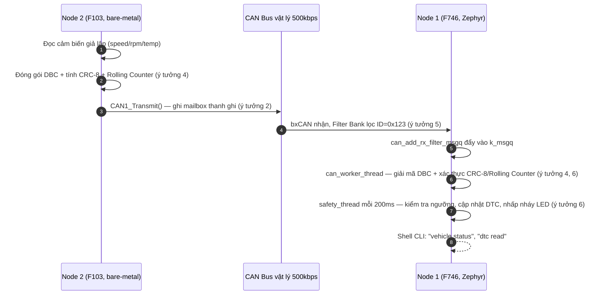
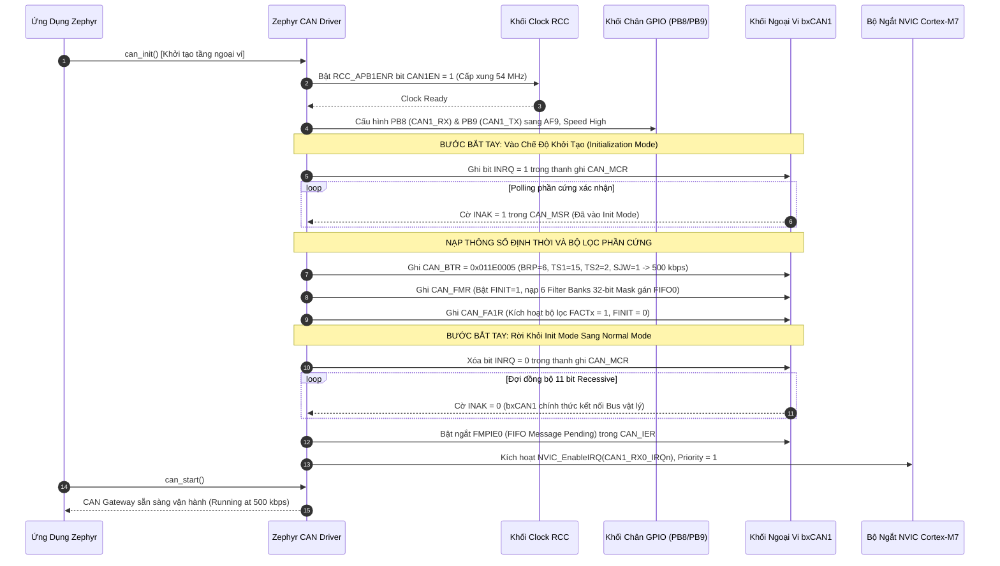
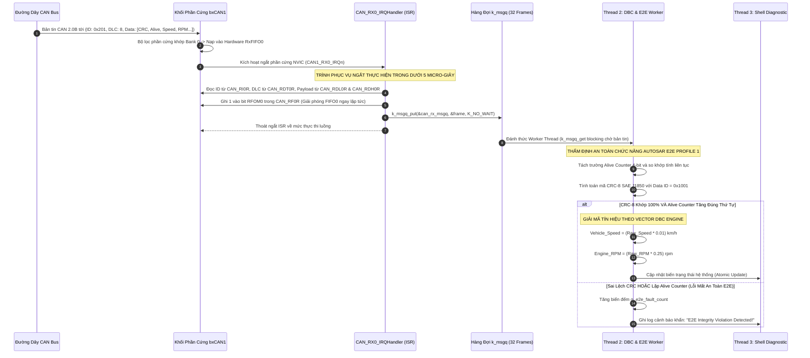
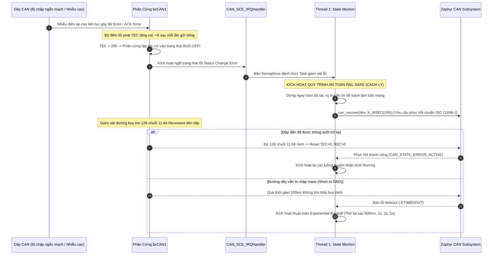

# Tài Liệu Học Lại Dự Án 1: Automotive CAN Telematics Gateway (Hệ 2 Node)

*(Học ý tưởng thiết kế, luồng hoạt động 2 vi điều khiển giao tiếp qua CAN Bus, và cách vận hành từng khối phần cứng — dùng lại được cho phỏng vấn nhưng mục tiêu chính là hiểu hệ thống.)*

> **Hệ Thống:** Automotive CAN Telematics Gateway & Diagnostic Node — **gồm 2 board giao tiếp với nhau qua CAN Bus vật lý**
> **Node 1 — Gateway/Cụm đồng hồ:** STM32F746NG (ARM Cortex-M7 @ 216 MHz), chạy **Zephyr RTOS**, nhận & giải mã dữ liệu
> **Node 2 — ECU mô phỏng động cơ:** STM32F103C8T6 "Blue Pill" (ARM Cortex-M3 @ 72 MHz), **100% Bare-Metal**, phát dữ liệu
> **Chuẩn Công Nghiệp Ô Tô:** CAN 2.0B (ISO 11898-1), AUTOSAR E2E Profile 1 (CRC-8 SAE J1850), Vector DBC Engine, Zephyr Shell CLI
> **Tài liệu nền tảng tham chiếu (trên máy cá nhân, không đính kèm ở đây):** `day00_baremetal_foundations.md`, STM32F746 Reference Manual (RM0385 Chương 30: bxCAN), STM32F103 Reference Manual (RM0008 Chương 24: bxCAN).

---

## 🧭 Ý TƯỞNG & THIẾT KẾ HỆ THỐNG (ĐỌC TRƯỚC — "TẠI SAO" TRƯỚC KHI HỌC "LÀM THẾ NÀO")

### Bài toán gốc
Mô phỏng lại đúng cách một mạng CAN Bus ô tô thật gồm **nhiều ECU độc lập** trao đổi dữ liệu — nhưng trong phòng thí nghiệm chỉ có 2 board rời, không có xe thật. Cần: (1) một node đóng vai "động cơ" liên tục phát dữ liệu cảm biến, (2) một node đóng vai "cụm đồng hồ / gateway" nhận, giải mã, kiểm tra an toàn dữ liệu và hiển thị — đúng vai trò một ECU cổng (Gateway ECU) thật làm trong xe.

### Chuỗi quyết định thiết kế

1. **Tách thành 2 vi điều khiển vật lý riêng biệt thay vì mô phỏng 1 board (loopback).**
   Nếu chỉ dùng 1 board tự gửi tự nhận (loopback nội bộ), sẽ không kiểm chứng được tầng vật lý thật (Transceiver, trở đầu cuối, dây vi sai CAN_H/CAN_L, nhiễu bus). Dùng 2 chip khác dòng (F746 và F103) buộc phải giải quyết đúng bài toán thực tế: 2 node có xung nhịp khác nhau, tốc độ bus khác nhau về mặt cấu hình thanh ghi, nhưng phải **thống nhất cùng một baudrate 500kbps ở mức tín hiệu vật lý** để nói chuyện được với nhau.

2. **Node 2 (F103) cố tình làm Bare-Metal thay vì cũng dùng Zephyr.**
   Vì đây là "ECU vệ tinh" đơn giản — chỉ lặp một việc: đóng gói tín hiệu DBC, tính CRC, gửi CAN theo chu kỳ — không cần một RTOS đầy đủ. Chọn bare-metal cho node này vừa nhẹ (không tốn không gian trình bày RTOS phức tạp cho vai trò phụ), vừa là dịp thực hành viết driver bxCAN ở mức thanh ghi (đối lập có chủ đích với Node 1 dùng framework cao cấp) — một cách để hiểu cả hai đầu của phổ trừu tượng hoá: "chạm tay vào thanh ghi" và "dùng API RTOS".

3. **Node 1 (F746) chọn Zephyr RTOS thay vì bare-metal.**
   Vai trò Gateway phức tạp hơn nhiều: vừa nhận CAN, vừa giải mã DBC/E2E, vừa theo dõi an toàn (DTC), vừa chạy CLI chẩn đoán — nhiều việc chạy song song với các chu kỳ khác nhau. Một RTOS với các luồng (thread) độc lập, hàng đợi (`k_msgq`) và Shell console dựng sẵn giúp tách rõ từng trách nhiệm mà không phải tự viết state machine đa nhiệm bằng tay như ở bare-metal.

4. **Không tin dữ liệu CAN theo mặc định — phải qua 2 lớp xác thực (AUTOSAR E2E).**
   Trên xe thật, một bản tin CAN có thể bị nhiễu điện từ, đứt gói, hoặc một ECU lỗi phát sai dữ liệu — hậu quả có thể ảnh hưởng an toàn (VD: hiển thị sai tốc độ). Vì vậy trước khi tin một khung dữ liệu, hệ thống bắt buộc: **(a)** kiểm tra CRC-8 để phát hiện bit lỗi do nhiễu, **(b)** kiểm tra Rolling Counter (bộ đếm vòng) để phát hiện gói bị mất/lặp/replay. Đây chính là ý tưởng lõi của chuẩn AUTOSAR E2E Profile 1 dùng thật trong ngành ô tô.

5. **Dùng bộ lọc phần cứng (Filter Bank) thay vì lọc bằng phần mềm sau khi nhận.**
   CPU không nên bị đánh thức bởi những bản tin không liên quan. bxCAN có sẵn 28 bộ lọc phần cứng — cấu hình 1 lần để chỉ những khung có ID khớp (`0x123`) mới được đẩy vào hàng đợi `k_msgq`, mọi khung khác bị phần cứng tự loại ngay tại FIFO, CPU không tốn một chu kỳ nào để nhìn thấy chúng.

6. **Tách luồng nhận (CAN Worker) và luồng giám sát an toàn (Safety Supervisor) thành 2 thread riêng, ưu tiên khác nhau.**
   Việc "nhận và giải mã gói tin" cần phản ứng nhanh mỗi khi có dữ liệu tới (ưu tiên cao hơn). Việc "quét định kỳ xem có lỗi/mất kết nối không và nhấp nháy đèn cảnh báo" chỉ cần chạy đều đặn mỗi 200ms, không cấp bách bằng — cho chạy ở ưu tiên thấp hơn để không tranh CPU với luồng nhận dữ liệu.

7. **Có sẵn bộ mô phỏng "xe ảo" ngay trong Node 1, độc lập với Node 2.**
   Không phải lúc nào cũng có đủ 2 board để test. Node 1 tự mang theo `sim_thread` (chạy phần mềm, không qua CAN vật lý — gọi thẳng `can_gateway_send_frame`) tự phát dữ liệu giả lập tốc độ/RPM biến thiên, cộng thêm lệnh CLI `can inject overheat/overspeed/corrupt` để **chủ động bơm lỗi** kiểm tra xem lớp an toàn (DTC) có bắt đúng không — một dạng self-test không cần phần cứng thật.

### Tóm tắt luồng dữ liệu (từ ý tưởng ở trên)



*(Song song đó, `sim_thread` bên trong Node 1 có thể tự phát khung giả lập qua `can_gateway_send_frame()` mà không cần Node 2 thật — dùng để test độc lập, xem ý tưởng 7.)*

---

## MỤC LỤC TỔNG QUAN

- [🧭 Ý tưởng & Thiết kế hệ thống](#-ý-tưởng--thiết-kế-hệ-thống-đọc-trước--tại-sao-trước-khi-học-làm-thế-nào)
- [🆕 Cập nhật so với phiên bản Source trước](#-cập-nhật-so-với-phiên-bản-source-trước--nâng-cấp-từ-1-bản-tin-lên-hệ-thống-3-bản-tin)
- [⚠️ Đối chiếu với Source Code thật](#️-đối-chiếu-với-source-code-thật--đọc-trước-khi-học-thuộc)
- [0. DANH MỤC TÀI LIỆU GỐC & HƯỚNG DẪN TRA CỨU RM/DATASHEET (LOOKUP GUIDE)](#0-danh-mục-tài-liệu-gốc--hướng-dẫn-tra-cứu-rmdatasheet-lookup-guide)
  - [0.1. Danh Mục Tài Liệu Gốc Trọng Tâm (Official Documents)](#01-danh-mục-tài-liệu-gốc-trọng-tâm-official-documents)
  - [0.2. Hướng Dẫn Từng Bước Tra Cứu Reference Manual (RM0385)](#02-hướng-dẫn-từng-bước-tra-cứu-reference-manual-rm0385)
  - [0.3. Hướng Dẫn Từng Bước Tra Cứu Datasheet (DS10610) & Ghép Kênh Chân AF9](#03-hướng-dẫn-từng-bước-tra-cứu-datasheet-ds10610--ghép-kênh-chân-af9)
  - [0.4. Hướng Dẫn Tra Cứu Tiêu Chuẩn Quốc Tế (ISO 11898 & AUTOSAR E2E)](#04-hướng-dẫn-tra-cứu-tiêu-chuẩn-quốc-tế-iso-11898--autosar-e2e)
- [1. TỔNG QUAN HỆ THỐNG & KIẾN TRÚC PHẦN MỀM](#1-tổng-quan-hệ-thống--kiến-trúc-phần-mềm)
  - [1.1. Mục Tiêu Dự Án & Thông Số Kỹ Thuật Định Lượng](#11-mục-tiêu-dự-án--thông-số-kỹ-thuật-định-lượng)
  - [1.2. Sơ Đồ Khối Kiến Trúc Phân Tầng & Luồng Dữ Liệu Đa Nhiệm (Zephyr Multi-threading)](#12-sơ-đồ-khối-kiến-trúc-phân-tầng--luồng-dữ-liệu-đa-nhiệm-zephyr-multi-threading)
  - [1.3. Cấu Trúc Khung CAN 2.0B & Cấu Hình DeviceTree Chuẩn Ô Tô](#13-cấu-trúc-khung-can-20b--cấu-hình-devicetree-chuẩn-ô-tô)
  - [1.4. Kiến Thức Nền Tảng Zephyr RTOS (Trọng Tâm Cho Vị Trí Fresher)](#14-kiến-thức-nền-tảng-zephyr-rtos-trọng-tâm-cho-vị-trí-fresher)
- [2. LÝ THUYẾT CỐT LÕI & CÔNG THỨC BẮT BUỘC PHẢI NHỚ](#2-lý-thuyết-cốt-lõi--công-thức-bắt-buộc-phải-nhớ)
  - [2.1. Chi Tiết CAN Bit Timing & Bảng Thanh Ghi CAN_BTR (500 kbps @ APB1 54 MHz)](#21-chi-tiết-can-bit-timing--bảng-thanh-ghi-can_btr-500-kbps--apb1-54-mhz)
  - [2.2. Cơ Chế Bộ Lọc bxCAN Filter Bank: Bố Cục Bit 32-bit Mask & Quy Trình Nạp RMW](#22-cơ-chế-bộ-lọc-bxcan-filter-bank-bố-cục-bit-32-bit-mask--quy-trình-nạp-rmw)
  - [2.3. AUTOSAR E2E Profile 1: Đa Thức CRC-8 SAE J1850, Alive Counter & Data ID](#23-autosar-e2e-profile-1-đa-thức-crc-8-sae-j1850-alive-counter--data-id)
  - [2.4. Máy Trạng Thái Quản Lý Lỗi CAN (Fault Confinement - ISO 11898-1)](#24-máy-trạng-thái-quản-lý-lỗi-can-fault-confinement---iso-11898-1)
- [3. SƠ ĐỒ TUẦN TỰ HOẠT ĐỘNG (MERMAID SEQUENCE DIAGRAMS)](#3-sơ-đồ-tuần-tự-hoạt-động-mermaid-sequence-diagrams)
  - [3.1. Quy Trình Cấu Hình Khởi Động Phần Cứng (Peripheral Configuration Pipeline)](#31-quy-trình-cấu-hình-khởi-động-phần-cứng-peripheral-configuration-pipeline)
  - [3.2. Quy Trình Vận Hành & Bắt Tay Dữ Liệu Thời Gian Thực (Runtime Dataflow)](#32-quy-trình-vận-hành--bắt-tay-dữ-liệu-thời-gian-thực-runtime-dataflow)
  - [3.3. Quy Trình Xử Lý Sự Cố & Phục Hồi An Toàn (Fault & Recovery Pipeline)](#33-quy-trình-xử-lý-sự-cố--phục-hồi-an-toàn-fault--recovery-pipeline)
- [4. PHÂN LOẠI LỖI THỰC TẾ VÀ ĐẶC THÙ PHẦN CỨNG](#4-phân-loại-lỗi-thực-tế-và-đặc-thù-phần-cứng)
  - [4.1. Nhóm Lỗi Phổ Biến (Common Bugs)](#41-nhóm-lỗi-phổ-biến-common-bugs)
  - [4.2. Nhóm Lỗi Kiến Trúc (Architectural Bugs)](#42-nhóm-lỗi-kiến-trúc-architectural-bugs)
  - [4.3. Nhóm Lỗi Ngoại Lệ và Góc Khuất Phần Cứng (Edge-Case Bugs)](#43-nhóm-lỗi-ngoại-lệ-và-góc-khuất-phần-cứng-edge-case-bugs)
  - [4.4. Nhóm Lỗi Khi Triển Khai Trên Zephyr RTOS và STM32F7](#44-nhóm-lỗi-khi-triển-khai-trên-zephyr-rtos-và-stm32f7)
    - [Bug 9: Thiếu khai báo Pin Control (pinctrl-0) trong Devicetree khiến Zephyr chặn biên dịch CAN](#bug-9-thiếu-khai-báo-pin-control-pinctrl-0-trong-devicetree-khiến-zephyr-chặn-biên-dịch-can)
    - [Bug 10: Lỗi Linker undefined reference to 'z_impl_can_recover' do STM32 bxCAN không hỗ trợ Manual Recovery](#bug-10-lỗi-linker-undefined-reference-to-z_impl_can_recover-do-stm32-bxcan-không-hỗ-trợ-manual-recovery)
    - [Bug 11: Lỗi Acknowledge Error (-EIO / Mã -5) khi phát bản tin CAN trên bo mạch độc lập không có Transceiver ngoài](#bug-11-lỗi-acknowledge-error--eio--mã--5-khi-phát-bản-tin-can-trên-bo-mạch-độc-lập-không-có-transceiver-ngoài)
    - [Bug 12: Báo động giả mất tín hiệu CAN (DTC_U0100) khi khởi động mà không có luồng phát định kỳ](#bug-12-báo-động-giả-mất-tín-hiệu-can-dtc_u0100-khi-khởi-động-mà-không-có-luồng-phát-định-kỳ)
    - [Bug 13: Xung đột độ ưu tiên ngắt NVIC giữa CAN và UART làm trễ chu kỳ xử lý gói tin an toàn](#bug-13-xung-đột-độ-ưu-tiên-ngắt-nvic-giữa-can-và-uart-làm-trễ-chu-kỳ-xử-lý-gói-tin-an-toàn)
- [5. BỘ CÂU HỎI PHỎNG VẤN & KỊCH BẢN TRẢ LỜI MẪU (FRESHER LEVEL)](#5-bộ-câu-hỏi-phỏng-vấn--kịch-bản-trả-lời-mẫu-fresher-level)

---

## 🆕 CẬP NHẬT SO VỚI PHIÊN BẢN SOURCE TRƯỚC — NÂNG CẤP TỪ 1 BẢN TIN LÊN HỆ THỐNG 3 BẢN TIN

Source vừa gửi lại đã thay đổi so với bản đối chiếu trước — không phải sửa lỗi nhỏ mà là **nâng cấp kiến trúc thật sự**, theo đúng hướng một mạng CAN ô tô thật (nhiều ECU con, mỗi ECU phát 1 loại bản tin riêng). Tóm tắt để không bị lẫn với bản cũ:

| Hạng mục | Bản trước (đã học) | Bản mới (source vừa gửi) |
| :--- | :--- | :--- |
| **Số loại bản tin CAN** | 1 bản tin duy nhất `0x123` (tốc độ, RPM, nhiệt độ) | **3 bản tin riêng biệt**: `CAN_ID_ENGINE=0x123` (tốc độ/RPM/nhiệt độ nước), `CAN_ID_TRANSMISSION=0x124` (tay số, mô-men xoắn), `CAN_ID_CHASSIS=0x125` (áp lực phanh) |
| **Bộ lọc phần cứng (Node 1)** | `id=0x123, mask=0x7FF` (khớp chính xác 1 ID) | `id=0x120, mask=0x7F8` — lọc theo **dải 8 ID** `0x120-0x127`, đủ rộng để lọt qua cả 3 bản tin `0x123/0x124/0x125` cùng lúc chỉ bằng 1 bộ lọc |
| **Hàm giải mã (Node 1)** | `dbc_decode_vehicle_frame()` — chỉ hiểu 1 định dạng | `dbc_decode_can_frame(can_id, ...)` — `switch(can_id)` giải mã đúng layout theo từng ID; hàm cũ vẫn còn (gọi hộ `dbc_decode_can_frame(CAN_ID_ENGINE,...)` để không phá code cũ) |
| **Rolling Counter** | 1 biến `last_counter` dùng chung, chỉ kiểm tra "counter tiếp theo có đúng +1 không" | Mảng `last_counters[3]` — mỗi ID có bộ đếm riêng; kiểm tra theo **delta**: `delta==0` → khung trùng lặp (replay), `delta==1` → bình thường, `delta==2` → rớt đúng 1 khung, `delta>2` → rớt nhiều khung — phân loại lỗi chi tiết hơn hẳn, và cộng dồn vào bộ đếm thống kê |
| **Tính CRC-8** | Vòng lặp bit-by-bit (8 phép dịch bit cho mỗi byte) | **Bảng tra nhanh (Lookup Table 256 phần tử)** `e2e_crc8_table[]` — tra bảng 1 lần thay vì lặp 8 lần/byte, giảm đáng kể chu kỳ CPU khi phải xử lý gấp 3 lần số khung (do giờ có 3 bản tin thay vì 1) |
| **Thống kê an toàn** | Không có | Struct `VehicleE2EStats_t` mới: tổng số khung nhận, số khung hợp lệ, số lỗi CRC, số khung rớt, và đếm riêng theo từng ID (`id_123_count`, `id_124_count`, `id_125_count`) — truy vấn qua `dbc_decoder_get_stats()`/`dbc_decoder_reset_stats()` |
| **Lệnh Shell mới** | `vehicle status`, `dtc read/clear`, `can sim/auto/inject` | Thêm **`can stat`** (xem thống kê 3-mailbox, % độ tin cậy) và **`can stat_reset`** |
| **Node 2 — Phát khung tin** | 1 hàm `e2e_encode_vehicle_frame()`, phát 1 frame/chu kỳ 100ms | 3 hàm encode riêng (`e2e_encode_vehicle_frame`, `e2e_encode_transmission_frame`, `e2e_encode_chassis_frame`), mỗi hàm có **bộ Rolling Counter độc lập**; mỗi chu kỳ 100ms phát liên tiếp cả 3 khung |
| **Node 2 — `CAN1_Transmit()`** | Luôn dùng cứng **Mailbox 0** (`CAN1_TI0R`), chỉ gửi được 1 khung, phải đợi khung trước gửi xong mới gửi tiếp | Tự động quét cờ `TME0/TME1/TME2` để **chọn 1 trong 3 Mailbox phần cứng đang rảnh**, tính địa chỉ thanh ghi theo công thức `base + mb*0x10` — nhờ vậy 3 khung Engine/Transmission/Chassis được nạp gần như đồng thời vào 3 mailbox khác nhau thay vì phải xếp hàng chờ từng khung một |

### Ý tưởng thiết kế mới cần nắm thêm (bổ sung cho phần "Ý tưởng & Thiết kế hệ thống" ở đầu tài liệu):

**10. Tách 1 "bản tin xe" thành 3 bản tin theo đúng hệ thống con vật lý (Powertrain / Transmission / Chassis).**
   Trên xe thật, không có 1 ECU nào biết tuốt mọi thông số — động cơ, hộp số, phanh là 3 hệ thống con độc lập, mỗi hệ thống có ECU riêng phát bản tin riêng lên bus chung. Tách như vậy còn cho phép **mở rộng thêm ECU thứ 3, thứ 4...** sau này mà không phải sửa định dạng bản tin cũ — mỗi ID là một "kênh" độc lập, thêm ID mới không ảnh hưởng ID cũ.

**11. Dùng 1 bộ lọc dải (`0x120-0x127`) thay vì 3 bộ lọc riêng cho 3 ID.**
   bxCAN chỉ có tối đa vài chục Filter Bank (giới hạn phần cứng, `CONFIG_CAN_MAX_FILTER=5` trong `prj.conf`). Nếu mai này thêm ECU thứ 4, thứ 5 cùng dải `0x120-0x127`, không cần cấu hình thêm filter mới — tận dụng đúng bản chất mask-based filtering của bxCAN: mask `0x7F8` che 8 bit cao, để ngỏ 3 bit thấp tự do khớp bất kỳ giá trị nào từ `0x120` đến `0x127`.

**12. Đổi từ vòng lặp CRC bit-by-bit sang bảng tra (Lookup Table) khi khối lượng khung tăng gấp 3.**
   Khi chỉ có 1 bản tin/chu kỳ, CPU dư sức tính CRC bằng vòng lặp bit. Khi tăng lên 3 bản tin/chu kỳ (gấp 3 khối lượng tính CRC ở cả 2 node), đổi sang bảng tra sẵn 256 giá trị giúp mỗi byte chỉ tốn 1 lần tra bảng thay vì 8 lần dịch-XOR bit — đánh đổi 256 byte bộ nhớ Flash để tiết kiệm chu kỳ CPU, kinh điển trong nhúng khi cần tối ưu.

**13. Rolling Counter kiểu "delta" thay vì kiểu "đúng +1 hay sai" nhị phân.**
   Kiểu cũ chỉ trả lời được "có lỗi hay không". Kiểu delta trả lời được **"lỗi gì, mức độ bao nhiêu"** — phân biệt khung bị lặp lại (tấn công Replay hoặc lỗi phần cứng gửi trùng) với khung bị rớt do nhiễu bus, và còn đếm được rớt bao nhiêu khung liên tiếp — thông tin này hữu ích hơn nhiều khi cần debug/thống kê chất lượng đường truyền thực tế (qua lệnh `can stat` mới).

**14. Round-robin qua 3 Mailbox phần cứng để gửi chùm (burst) không bị nghẽn.**
   Nếu vẫn dùng cứng Mailbox 0 cho cả 3 khung, khung thứ 2 phải đợi khung 1 gửi xong (mất vài trăm µs ở 500kbps) mới được nạp — làm lệch thời điểm phát giữa 3 hệ thống con. Cho phép chọn mailbox rảnh (0, 1, hoặc 2) giúp nạp cả 3 khung gần như cùng lúc vào phần cứng, phần cứng bxCAN tự sắp xếp thứ tự phát ra bus theo ưu tiên ID (ID nhỏ hơn thắng arbitration — xem Câu 1) mà phần mềm không cần tự canh thời gian.

---


Đã đối chiếu với source thật của cả 2 node: `node1_stm32f7_gateway/src/{can_gateway.c, can_gateway.h, dbc_decoder.c, safety_monitor.c, diag_shell.c, main.c}` (Zephyr) và `node2_stm32f103_ecu/src/{can_f103.c, e2e_encoder.c, main.c}` (bare-metal). Phát hiện quan trọng nhất: **tài liệu gốc đôi khi gán nhầm code bare-metal của Node 2 thành "code thật" của Node 1** — hai board có kiến trúc hoàn toàn khác nhau nên cần tách bạch rõ trước khi học thuộc:

| Chủ đề | Tài liệu này nói gì | Code thật hiện có gì | Nên hiểu / trả lời phỏng vấn thế nào |
| :--- | :--- | :--- | :--- |
| **Nguồn gốc code bare-metal `CAN1->BTR`, `CAN1->FMR`... (Mục 2.1, 2.2)** | Ghi chú là "Dẫn chứng mã nguồn thực tế" nằm trong `zephyr_project/src/can_gateway.c` (tức Node 1, F746) | ❌ **Sai node.** Node 1 chạy 100% Zephyr — không có dòng nào trong `can_gateway.c`/`dbc_decoder.c` đụng tới `CAN1->BTR` hay `CAN1->FMR` trực tiếp; bit-timing/filter được khai báo qua `app.overlay` (Devicetree) và Zephyr tự nạp thanh ghi. Code bare-metal kiểu này **có thật**, nhưng nằm ở **Node 2** (`node2_stm32f103_ecu/src/can_f103.c`) — **một MCU khác hẳn**: STM32F103 (Cortex-M3 @72MHz), không phải STM32F746. | Khi giải thích cơ chế thanh ghi `CAN_BTR`/Filter Bank, nói đó là kiến thức bxCAN chung (áp dụng được cho cả 2 chip vì cùng họ bxCAN), và ví dụ bare-metal thật trong project của bạn nằm ở Node 2 (F103), không phải Node 1. |
| **Xung nhịp APB1 dùng trong ví dụ tính `BRP` (Mục 2.1)** | `f_APB1 = 54 MHz` (đúng cho STM32F746, Node 1) | Node 1 (F746) không tự tính `BRP` bằng tay — Zephyr tự làm việc đó từ `sample-point`/`bus-speed` trong overlay, nên **con số 54MHz/BRP=6/88.89% là đúng về mặt lý thuyết** cho F746 nhưng **không phải số bạn tự tay ghi vào thanh ghi nào cả**. Số **thật sự được ghi vào thanh ghi bằng tay** trong project là ở Node 2: `f_APB1(F103) = 36 MHz`, `BRP = 4`, `CAN1_BTR = 0x002D0003`, Sample Point = 83.33%. | Phân biệt rõ 2 bộ số khi phỏng vấn: 54MHz/BRP=6 là "Zephyr tính hộ cho F746"; 36MHz/BRP=4 là "tự tay tính và ghi thanh ghi cho F103" — đừng lẫn hai bộ số này với nhau. |
| **Công thức RPM tại Mục 2.3: `RPM = (Byte3 << 8) \| Byte4` (Big-Endian/Motorola)** | Ghi là Big-Endian, không nhân hệ số | ❌ **Sai thứ tự byte và thiếu hệ số.** Code thật cả 2 phía (`e2e_encoder.c` ở Node 2 và `dbc_decoder.c` ở Node 1) đều dùng **Little-Endian (Intel)**: byte 3 là LSB, byte 4 là MSB — `raw_rpm = data[3] \| (data[4] << 8)` — sau đó **chia 4** (`>> 2`, hệ số DBC = 0.25) mới ra RPM thật. Khối code "Dẫn chứng mã nguồn thực tế" ngay bên dưới công thức đó trong tài liệu cũng bị viết sai theo (Big-Endian, không có `>>2`) — không khớp `dbc_decoder.c` thật. | Khi giải thích, dùng đúng công thức: `raw_rpm = data[3] \| (data[4]<<8)`, `RPM = raw_rpm >> 2` (Little-Endian, factor 0.25). Mục "Bug 5: Sai Endianness" ở phần 4 vẫn là kiến thức cảnh báo chung hữu ích (lỗi kinh điển khi làm DBC) — chỉ là nó không phải lỗi thật *đã xảy ra* trong chính project này, vì project luôn nhất quán dùng Intel format từ đầu. |
| **Sơ đồ 3 luồng ưu tiên 2/3/7 + `CAN_RX0_IRQHandler` tự viết (Mục 1.2)** | Thread 1 (ưu tiên 2, CAN RX Dispatcher, tự đọc `CAN_RI0R`...) / Thread 2 (ưu tiên 3, DBC & E2E) / Thread 3 (ưu tiên 7, Shell CLI) | ❌ **Không khớp `main.c` thật.** Thực tế chỉ có 2 luồng tự viết: `can_worker_thread_entry` (ưu tiên **5**, gộp luôn việc nhận từ `k_msgq` **và** giải mã DBC/E2E — tài liệu tách thành 2 thread nhưng code thật gộp làm 1) và `safety_thread_entry` (ưu tiên **6**). Có thêm `sim_thread_entry` (ưu tiên **7**, trong `diag_shell.c`) mà sơ đồ gốc không nhắc tới. Không có `CAN_RX0_IRQHandler` nào do project tự viết — việc đọc FIFO0/ghi `RFOM0` nằm **bên trong driver bxCAN của Zephyr** (`can_stm32_bxcan.c`, không phải file trong project này); ứng dụng chỉ gọi `can_add_rx_filter_msgq()` một lần lúc khởi tạo. | Vẫn có thể giải thích khái niệm ISR→FIFO→msgq (đúng về nguyên lý hoạt động của bxCAN + Zephyr driver model), nhưng nói rõ: đó là cơ chế **bên trong driver Zephyr có sẵn**, code ứng dụng của bạn chỉ có 2-3 thread ở tầng ứng dụng, ưu tiên thật là 5/6/7. |
| **Bộ lọc mẫu `id=0x123, mask=0x7FF` ở Mục 2.2** | Dùng chung cho cả phần Zephyr API và phần bare-metal 6 bước | ✅ Đúng với Zephyr API thật (`can_gateway.c`, dòng `rx_filter = {.id=0x123, .mask=0x7FF}`). ⚠️ Riêng phần bare-metal 6 bước — số liệu `0x123/0x7FF` là ví dụ minh hoạ; Node 2 thật gọi `CAN1_Filter_Config(0x000, 0x000)` (chấp nhận tất cả ID) vì Node 2 chỉ cần nghe mọi thứ để test, không lọc gì. | Ví dụ minh hoạ 0x123/0x7FF vẫn đúng nguyên lý bxCAN Filter Bank, chỉ cần biết Node 2 thật đang để "mở toang" (accept-all), không phải đang lọc 0x123. |
| **Chân STB điều khiển CAN Transceiver (PI0) + trình tự "đánh thức" trước khi init CAN** | Không được nhắc tới trong tài liệu gốc | ✅ **Có thật**, và là bước đầu tiên trong `can_gateway_init()`: kéo `stb_spec` xuống LOW để đánh thức IC Transceiver trước khi kiểm tra `device_is_ready()`. | Đáng nhớ thêm: đây là chi tiết phần cứng thật (nhiều IC transceiver ô tô có chân STB/Standby phải kéo thấp mới hoạt động), nên nhắc tới khi được hỏi "quy trình khởi tạo CAN gồm những bước gì". |
| **Bug 9 (thiếu `pinctrl-0`), Bug 10 (`can_recover` linker error), Bug 11 (Loopback mode qua `#if USE_CAN_LOOPBACK_MODE`), Bug 12 (`can sim`/`can auto`/`can inject`, ngưỡng DTC 1000ms/105°C/6500RPM)** | Mô tả chi tiết | ✅ **Khớp code thật** ở `app.overlay`, `can_gateway.c` (`#if defined(CONFIG_CAN_MANUAL_RECOVERY_MODE)`, `#if defined(USE_CAN_LOOPBACK_MODE)`), `diag_shell.c` (đúng cú pháp lệnh, đúng ngưỡng bơm lỗi), `safety_monitor.c` (đúng ngưỡng 105°C/6500RPM/1000ms). | Yên tâm dùng nguyên các phần này. |

**Tóm lại:** phần lý thuyết CAN Bus nền tảng (bit timing, sample point, filter bank, AUTOSAR E2E, fault confinement) là kiến thức đúng và áp dụng được cho cả 2 chip (cùng họ bxCAN). Phần cần cẩn thận là: **quy về đúng node** khi nói "code thật của tôi" (F746/Zephyr vs F103/bare-metal), và **sửa lại công thức RPM** theo đúng Little-Endian + hệ số 0.25 như code thật.

---

# 0. DANH MỤC TÀI LIỆU GỐC & HƯỚNG DẪN TRA CỨU RM/DATASHEET (LOOKUP GUIDE)

### 0.1. Danh Mục Tài Liệu Gốc Trọng Tâm (Official Documents)

| Tên Tài Liệu | Mã Hiệu / Phiên Bản | File Trong Thư Mục Dự Án | Nội Dung Tra Cứu Trọng Tâm |
| :--- | :--- | :--- | :--- |
| **STM32F7 Reference Manual** | `RM0385` (DocID027589 Rev 8) | [`RM.pdf`](file:///d:/Project/STM32F7/RM.pdf) | **Chương 30 (bxCAN):** Toàn bộ thanh ghi cấu hình `CAN_MCR`, `CAN_BTR`, `CAN_FMR`, bộ lọc 28 Filter Banks, sơ đồ ngắt NVIC. |
| **STM32F746 Datasheet** | `DS10610` (DocID027590 Rev 7) | [`STM32F745XX.PDF`](file:///d:/Project/STM32F7/STM32F745XX.PDF) | **Table 9 (Alternate functions):** Bản đồ ghép kênh chân PB8/PB9 sang `AF9` (CAN1), giới hạn tần số APB1 tối đa 54 MHz. |
| **Discovery Board User Manual** | `UM1907` (DocID027908 Rev 7) | [`user-manual.pdf`](file:///d:/Project/STM32F7/user-manual.pdf) | **Section 7.4 (Arduino connectors):** Sơ đồ chân cắm mở rộng D0/D1/D14/D15 và đường cấp nguồn 3.3V/5V cho module CAN Transceiver. |
| **Chuẩn Quốc Tế CAN Bus** | `ISO 11898-1:2015` & `ISO 11898-2:2016` | Tài liệu chuẩn ISO / CiA | Định thời Bit Timing, quy tắc phân xử trọng tài Arbitration, trở đầu cuối 120 Ohm, máy trạng thái lỗi Bus-Off. |
| **Chuẩn An Toàn Phần Mềm Ô Tô** | `AUTOSAR Classic Release 4.4` (E2E Protocol) | `AUTOSAR_SWS_E2ELibrary.pdf` | Đặc tả E2E Profile 1, đa thức CRC-8 SAE J1850 đa thức `0x1D`, cơ chế bảo vệ Alive Counter và Data ID. |

---

### 0.2. Hướng Dẫn Từng Bước Tra Cứu Reference Manual (RM0385)

#### Bước 1: Tra cứu Địa chỉ Cơ sở (Base Address) của ngoại vi bxCAN1
1. Mở file [`RM.pdf`](file:///d:/Project/STM32F7/RM.pdf).
2. Nhấn `Ctrl + F` tìm cụm từ chính xác: **`Memory map and register boundary addresses`** (chuyển tới **Section 2.2.2**).
3. Tìm dòng chứa **`CAN1`**:
   - Bus kết nối: **APB1** (Tần số tối đa `54 MHz`).
   - Dải địa chỉ bộ nhớ: `0x4000 6400 - 0x4000 67FF`.
   - **`CAN1_BASE = 0x40006400`**.

#### Bước 2: Tra cứu Bảng Thanh Ghi bxCAN (Register Map & Offsets)
1. Nhấn `Ctrl + F` tìm cụm từ: **`bxCAN register map`** (chuyển tới **Section 30.9**).
2. Bảng thanh ghi cốt lõi dùng trong dự án:

| Tên Thanh Ghi | Offset | Địa Chỉ Tuyệt Đối (`Base + Offset`) | Quyền Truy Xuất | Giá Trị Reset | Mục Đích Sử Dụng Trong Dự Án |
| :--- | :--- | :--- | :--- | :--- | :--- |
| **`CAN_MCR`** | `0x000` | `0x40006400` | `RW` | `0x00010002` | Điều khiển chế độ Init (`INRQ`), tự động phục hồi (`ABOM`), thoát Sleep. |
| **`CAN_MSR`** | `0x004` | `0x40006404` | `RO` | `0x00000C02` | Polling cờ xác nhận Init Mode (`INAK`), cờ Sleep (`SLAK`). |
| **`CAN_TSR`** | `0x008` | `0x40006408` | `RW` / `W1C` | `0x1C000000` | Kiểm tra Mailbox trống (`TME0/1/2`), cờ truyền thành công (`RQCPx`). |
| **`CAN_RF0R`** | `0x00C` | `0x4000640C` | `RW` / `W1C` | `0x00000000` | Cờ nhận gói FIFO0 (`FMP0`), **ghi bit `RFOM0 = 1` để giải phóng Mailbox**. |
| **`CAN_IER`** | `0x014` | `0x40006414` | `RW` | `0x00000000` | Kích hoạt ngắt nhận FIFO0 (`FMPIE0`), ngắt lỗi trạng thái (`ERRIE`). |
| **`CAN_ESR`** | `0x018` | `0x40006418` | `RO` / `RW` | `0x00000000` | Giám sát trạng thái lỗi (`BOFF`, `EPVF`, `EWGF`), bộ đếm `TEC` và `REC`. |
| **`CAN_BTR`** | `0x01C` | `0x4000641C` | `RW` | `0x01230000` | Cấu hình Bit Timing: `BRP`, `TS1`, `TS2`, `SJW` đạt chuẩn 500 kbps @ 87.5%. |
| **`CAN_RI0R`** | `0x1B0` | `0x400065B0` | `RO` | `0x00000000` | Đọc Identifier (ID) của bản tin nhận được trong FIFO0. |
| **`CAN_RDT0R`**| `0x1B4` | `0x400065B4` | `RO` | `0x00000000` | Đọc độ dài dữ liệu `DLC[3:0]` của bản tin nhận được. |
| **`CAN_RDL0R`**| `0x1B8` | `0x400065B8` | `RO` | `0x00000000` | Đọc 4 bytes dữ liệu thấp (Data Byte 0 đến Byte 3). |
| **`CAN_RDH0R`**| `0x1BC` | `0x400065BC` | `RO` | `0x00000000` | Đọc 4 bytes dữ liệu cao (Data Byte 4 đến Byte 7). |
| **`CAN_FMR`**  | `0x200` | `0x40006600` | `RW` | `0x2A1C0E01` | Điều khiển bộ lọc: Bật/tắt `FINIT` (Filter Init Mode). |
| **`CAN_FA1R`** | `0x21C` | `0x4000661C` | `RW` | `0x00000000` | Kích hoạt từng bộ lọc (`FACTx = 1`). |
| **`CAN_F0R1`** | `0x240` | `0x40006640` | `RW` | Không xác định | Nạp ID của Filter Bank 0 (Dịch 21 bit cho Standard ID). |
| **`CAN_F0R2`** | `0x244` | `0x40006644` | `RW` | Không xác định | Nạp Mask của Filter Bank 0 (Dịch 21 bit cho Mask tương ứng). |

---

### 0.3. Hướng Dẫn Từng Bước Tra Cứu Datasheet (DS10610) & Ghép Kênh Chân AF9

#### Tra cứu Pinmux (Ghép kênh chân ngoại vi):
1. Mở file [`STM32F745XX.PDF`](file:///d:/Project/STM32F7/STM32F745XX.PDF).
2. Nhấn `Ctrl + F` tìm cụm từ: **`Table 9. STM32F745xx and STM32F746xx alternate function mapping`**.
3. Kéo xuống cột **`AF9`** (Alternate Function 9: CAN1 / CAN2 / TIM12..14):
   * Dòng chân **`PB8`**: Hiển thị chức năng phụ là **`CAN1_RX`**.
   * Dòng chân **`PB9`**: Hiển thị chức năng phụ là **`CAN1_TX`**.
4. **Kết luận áp dụng:** Trong thanh ghi `GPIOB->AFR[1]` (hoặc DeviceTree pinctrl), chân PB8 và PB9 bắt buộc phải gán mã `AF9` (nhị phân `1001`).

---

### 0.4. Hướng Dẫn Tra Cứu Tiêu Chuẩn Quốc Tế (ISO 11898 & AUTOSAR E2E)

* **Tra cứu ISO 11898-1:2015 (CAN Data Link Layer):**
  - Tra cứu mục **Chapter 10: Fault Confinement**: Nguyên tắc cộng/trừ điểm bộ đếm lỗi TEC và REC (Quy tắc Rule 1 đến Rule 12), điều kiện chuyển sang Bus-Off (`TEC > 255`) và điều kiện khôi phục an toàn (đếm 128 chuỗi 11 bit Recessive liên tiếp).
* **Tra cứu AUTOSAR E2E Library (SWS_E2ELibrary):**
  - Tra cứu mục **Section 7.2: Specification of E2E Profile 1**: Đa thức sinh `CRC-8-SAE-J1850` (0x1D), cách bố trí `Alive Counter` (4-bit, modulo 15) và phương thức gộp `Data ID` vào phép tính checksum.

---

# 1. TỔNG QUAN HỆ THỐNG & KIẾN TRÚC PHẦN MỀM

### 1.1. Mục Tiêu Dự Án & Thông Số Kỹ Thuật Định Lượng

Dự án hiện thực một **Trạm Cổng Giao Tiếp (Gateway) và Giám Sát Chẩn Đoán Ô Tô** thu thập dữ liệu từ mạng truyền thông động cơ và khung gầm xe hơi (Powertrain & Chassis CAN Bus), giải mã dữ liệu theo định dạng Vector DBC, kiểm tra toàn vẹn an toàn chức năng theo chuẩn AUTOSAR E2E, và đẩy dữ liệu chẩn đoán ra bảng điều khiển Zephyr Shell CLI.

| Thông Số Kỹ Thuật | Giá Trị Thực Tế Dự Án | Ý Nghĩa Kỹ Thuật / Cơ Sở Thiết Kế |
| :--- | :--- | :--- |
| **Vi điều khiển** | STM32F746NG (ARM Cortex-M7) | Xung nhịp hệ thống `f_SYSCLK = 216 MHz`, `f_APB1 = 54 MHz`. |
| **Ngoại vi CAN** | bxCAN1 (CAN1) | Kết nối chip CAN Transceiver ngoài (TJA1050/MCP2551 qua chân PB8/PB9). |
| **Tốc độ truyền (Baudrate)** | `500 kbps` (High-Speed CAN) | Tốc độ tiêu chuẩn của mạng điều khiển động cơ / phanh ô tô. |
| **Điểm lấy mẫu (Sample Point)** | `87.5%` | Chuẩn khuyến nghị CiA (CAN in Automation) chống méo xung đường truyền dài. |
| **Tải truyền nhận (Throughput)** | `> 1,000 frames/s` | Đảm bảo tải nặng không làm rớt bản tin, CPU load đo được `< 2%`. |
| **Độ trễ giải mã tín hiệu** | `< 15 us / frame` | Thuật toán DBC tối ưu bằng số nguyên cố định (Fixed-point integer arithmetic). |
| **An toàn dữ liệu** | AUTOSAR E2E Profile 1 | CRC-8 SAE J1850 đa thức `0x1D` kèm bộ đếm Alive Counter 4-bit và Data ID. |
| **Khả năng tự phục hồi** | ISO 11898-1 Bus-Off Recovery | Nhận diện trạng thái tê liệt bus và kích hoạt chuỗi phục hồi an toàn trong `< 100 ms`. |

---

### 1.2. Sơ Đồ Khối Kiến Trúc Phân Tầng & Luồng Dữ Liệu Đa Nhiệm (Zephyr Multi-threading)

> ⚠️ Sơ đồ dưới minh hoạ **nguyên lý** ISR → FIFO → Thread của bxCAN + Zephyr driver model. Trong `main.c` thật, ứng dụng chỉ định nghĩa **2 thread** (`can_worker_thread_entry` ưu tiên **5** — gộp cả việc nhận từ `k_msgq` lẫn giải mã DBC/E2E; `safety_thread_entry` ưu tiên **6**) cộng thêm `sim_thread_entry` (ưu tiên **7**, trong `diag_shell.c`, mô phỏng xe ảo). Không có `CAN_RX0_IRQHandler` nào do project tự viết — khối "ISR đọc `CAN_RI0R`, ghi `RFOM0`" nằm bên trong driver bxCAN có sẵn của Zephyr, ứng dụng chỉ gọi `can_add_rx_filter_msgq()` một lần. Xem bảng đối chiếu ở đầu tài liệu.

Hệ thống được thiết kế theo mô hình nhiều luồng thực thi (Threads) có mức độ ưu tiên khác nhau, giao tiếp với nhau qua hàng đợi thông điệp phi khóa `k_msgq` và bộ đệm Ring Buffer:

```text
┌──────────────────────────────────────────────────────────────────────────────────────────────────┐
│                                 APPLICATION LAYER (ZEPHYR RTOS)                                  │
│                                                                                                  │
│   ┌──────────────────────────────────────────────┐  ┌─────────────────────────────────────────┐  │
│   │     Thread 3: Diagnostic Shell CLI Task      │  │    Thread 2: DBC & E2E Processing Task  │  │
│   │     - Priority: 7 (Preemptive, Low)          │  │    - Priority: 3 (Preemptive, High)     │  │
│   │     - Stack: 2048 bytes                      │  │    - Stack: 4096 bytes                  │  │
│   │     - Hiển thị bảng Telemetry thời gian thực │  │    - Thẩm định E2E CRC-8 + Alive Counter│  │
│   │     - Bắt lệnh chẩn đoán: "can stat", "e2e"  │  │    - Unpack tín hiệu DBC (Tốc độ, RPM)  │  │
│   └──────────────────────▲───────────────────────┘  └────────────────────▲────────────────────┘  │
│                          │                                               │                       │
│                          │ Shared State / Ring Buffer                    │ k_msgq (32 Frames)    │
│                          └───────────────────────────────────────────────┼───────────────────────┘
│                                                                          │                       │
│   ┌──────────────────────────────────────────────────────────────────────┴────────────────────┐  │
│   │                     Thread 1: CAN RX Dispatcher & State Monitor Task                      │  │
│   │                     - Priority: 2 (Preemptive, Realtime)                                  │  │
│   │                     - Stack: 2048 bytes                                                   │  │
│   │                     - Lắng nghe Event từ ISR: Đọc khung tin từ FIFO0 / FIFO1              │  │
│   │                     - Theo dõi máy trạng thái lỗi: Error Warning, Passive, Bus-Off        │  │
│   └──────────────────────────────────────────────▲────────────────────────────────────────────┘  │
└──────────────────────────────────────────────────┼───────────────────────────────────────────────┘
                                                   │
┌──────────────────────────────────────────────────┼───────────────────────────────────────────────┐
│                      ZEPHYR DRIVER MODEL & HARDWARE INTERRUPTS                                   │
│                                                  │                                               │
│   ┌──────────────────────────────────────────────┴────────────────────────────────────────────┐  │
│   │                  CAN_RX0_IRQHandler / CAN_SCE_IRQHandler (Cortex-M7 NVIC)                 │  │
│   │                  - Đọc các thanh ghi dữ liệu: CAN_RI0R, CAN_RDT0R, CAN_RDL0R, CAN_RDH0R   │  │
│   │                  - Ghi bit W1C: RFOM0 = 1 trong CAN_RF0R để giải phóng Hardware Mailbox   │  │
│   │                  - Đẩy vào Queue không chờ: k_msgq_put(&can_rx_msgq, &frame, K_NO_WAIT)   │  │
│   └──────────────────────────────────────────────▲────────────────────────────────────────────┘  │
└──────────────────────────────────────────────────┼───────────────────────────────────────────────┘
                                                   │
┌──────────────────────────────────────────────────┼───────────────────────────────────────────────┐
│                       BARE-METAL HARDWARE REGISTERS (STM32F746)                                  │
│                                                  │                                               │
│   ┌──────────────────────────────────────────────┴────────────────────────────────────────────┐  │
│   │  Khối bxCAN1 (Base: 0x40006400 trên APB1 @ 54 MHz)                                        │  │
│   │  - Chân PB8 (CAN1_RX) & PB9 (CAN1_TX) ghép kênh Alternate Function AF9                    │  │
│   │  - 28 Filter Banks (Chế độ 32-bit Mask Mode phân luồng gói về FIFO0 / FIFO1)              │  │
│   │  - CAN Transceiver ngoài (TJA1050 / MCP2551) kết nối Bus CAN vi sai vật lý                │  │
│   └───────────────────────────────────────────────────────────────────────────────────────────┘  │
└──────────────────────────────────────────────────────────────────────────────────────────────────┘
```

---

### 1.3. Cấu Trúc Khung CAN 2.0B & Cấu Hình DeviceTree Chuẩn Ô Tô

Mọi bản tin trao đổi trong dự án đều tuân thủ cấu trúc khung chuẩn **CAN 2.0B Standard Frame** (11-bit ID) và **Extended Frame** (29-bit ID):

```text
┌──────┬───────────────┬───────┬──────┬─────┬────────┬──────────────┬─────────┬─────────┬──────┬─────────────┐
│ SOF  │ Identifier    │  RTR  │ IDE  │ r0  │  DLC   │ Data Field   │ CRC     │ CRC Del │ ACK  │ EOF (7 bits)│
│1 bit │ 11/29 bits    │ 1 bit │1 bit │1 bit│ 4 bits │ 0 - 8 Bytes  │ 15 bits │ 1 bit   │2 bits│ Recessive   │
└──────┴───────────────┴───────┴──────┴─────┴────────┴──────────────┴─────────┴─────────┴──────┴─────────────┘
  0       ID bản tin      0=Data  0=Std  0     Độ dài   Payload ô tô    Mã băm   1=Recess  Slot   Kết thúc
(Dom)                     1=Rmt   1=Ext        (0..8)   (Tốc độ, RPM)   phần cứng          + Del  khung tin
```

#### File cấu hình DeviceTree Overlay (`app.overlay`) trong Zephyr — ✅ đúng nguyên văn project thật:
```dts
/ {
    aliases {
        can-primary = &can1;
        led-warn = &user_led_1;      /* DT macro sẽ tự đổi "-" thành "_": DT_ALIAS(led_warn) */
    };

    leds {
        compatible = "gpio-leds";
        user_led_1: led_1 {
            gpios = <&gpioi 1 GPIO_ACTIVE_HIGH>;   /* PI1 — đèn cảnh báo */
            label = "User Warning LED (PI1)";
        };
    };

    transceiver {
        compatible = "gpio-leds";
        can_stb: stb_pin {
            gpios = <&gpioi 0 GPIO_ACTIVE_HIGH>;   /* PI0 — chân Standby IC Transceiver */
            label = "CAN Transceiver Standby Control (PI0)";
        };
    };
};

&can1 {
    pinctrl-0 = <&can1_rx_pb8 &can1_tx_pb9>;
    pinctrl-names = "default";
    status = "okay";
    bitrate = <500000>;
    sample-point = <875>; /* 87.5% theo chuẩn CiA — Zephyr tự suy ra BRP/TS1/TS2 lúc build */
    /* loopback; */        /* bật dòng này nếu muốn tự test trên 1 board duy nhất — xem Bug 11 */
};
```

---

# 1.4. KIẾN THỨC NỀN TẢNG ZEPHYR RTOS (TRỌNG TÂM CHO VỊ TRÍ FRESHER)

> Vì ứng tuyển vị trí Fresher Embedded thường xuyên gặp câu hỏi riêng về **Zephyr RTOS** (không chỉ hỏi về CAN Bus), phần này tổng hợp các khái niệm nền tảng của framework mà project này dùng — tách bạch với lý thuyết CAN Bus ở Mục 2 để dễ ôn theo từng chủ đề.

### 1.4.1. Zephyr là gì & vì sao ngành công nghiệp dùng nó?

Zephyr là một **RTOS mã nguồn mở, footprint nhỏ**, do Linux Foundation bảo trợ, hỗ trợ đa kiến trúc (ARM Cortex-M, RISC-V, x86...). Khác với kiểu làm việc "viết thẳng HAL + FreeRTOS rời rạc" phổ biến trước đây, Zephyr đóng gói sẵn 3 trụ cột giúp tách phần cứng khỏi phần mềm ứng dụng:

| Trụ cột | Vai trò | File tương ứng trong project |
| :--- | :--- | :--- |
| **Kconfig** | Bật/tắt tính năng phần mềm lúc build (driver nào được biên dịch vào, bao nhiêu bộ nhớ log...) | `prj.conf` |
| **Devicetree** | Mô tả **phần cứng board** (chân nào nối gì, tốc độ bus bao nhiêu) — hoàn toàn tách khỏi code C | `app.overlay` |
| **CMake (qua West)** | Định nghĩa file nguồn nào được biên dịch vào ứng dụng | `CMakeLists.txt` |

Nhiều công ty lớn trong ngành ô tô/IoT (Nordic, Bosch, Intel...) chuyển sang Zephyr vì: driver model thống nhất (đổi board không phải viết lại code ứng dụng), quản lý bộ nhớ/ngăn xếp an toàn hơn bằng MPU tích hợp sẵn, và cộng đồng lớn (Linux Foundation).

### 1.4.2. Driver Model & `device_is_ready()`

Mọi ngoại vi trong Zephyr được trừu tượng hoá thành một `struct device`. Ứng dụng lấy "tay cầm" tới thiết bị qua các macro sinh từ Devicetree, ví dụ trong `main.c` thật của project:
```c
static const struct gpio_dt_spec warn_led = GPIO_DT_SPEC_GET_OR(DT_ALIAS(led_warn), gpios, {0});
...
if (warn_led.port != NULL && gpio_is_ready_dt(&warn_led)) {
    gpio_pin_configure_dt(&warn_led, GPIO_OUTPUT_INACTIVE);
}
```
Nguyên tắc bắt buộc: **luôn kiểm tra `*_is_ready()` trước khi dùng thiết bị** — vì driver có thể được biên dịch vào nhưng phần cứng thật lỗi/không tồn tại trên board đang chạy (khác bare-metal, nơi bạn "biết chắc" phần cứng có mặt vì tự viết init tay).

### 1.4.3. Luồng thực thi tĩnh: `K_THREAD_DEFINE`

Project định nghĩa thread ngay lúc biên dịch (static), thay vì gọi `k_thread_create()` lúc runtime:
```c
K_THREAD_DEFINE(can_worker_tid, CAN_WORKER_STACK_SIZE,
                can_worker_thread_entry, NULL, NULL, NULL,
                CAN_WORKER_PRIO, 0, 0);
```
Tham số theo thứ tự: tên định danh thread → kích thước stack → hàm entry → 3 tham số truyền vào (không dùng, để `NULL`) → **mức ưu tiên** → cờ tuỳ chọn → **độ trễ khởi động** (0 = chạy ngay khi kernel start). Ưu điểm so với tạo động: cấp phát tĩnh lúc build, không tốn heap runtime, phù hợp hệ thống nhúng cần xác định bộ nhớ trước.

**Về độ ưu tiên:** số **càng nhỏ thì ưu tiên càng cao**. Project dùng 3 mức: `can_worker` = 5, `safety` = 6, `sim` = 7 — nghĩa là luồng xử lý CAN được ưu tiên chạy trước luồng giám sát an toàn, luồng này lại được ưu tiên hơn luồng mô phỏng (hợp lý: xử lý dữ liệu thật quan trọng hơn tự phát dữ liệu giả). Priority ≥ 0 là **preemptive** (có thể bị luồng ưu tiên cao hơn ngắt giữa chừng); priority âm là **cooperative** (chỉ nhường CPU khi tự gọi hàm blocking) — project này dùng toàn priority dương nên cả 3 thread đều preemptive.

### 1.4.4. Đồng bộ hoá giữa các luồng: `k_msgq` và `k_mutex`

* **`k_msgq` (Message Queue):** hàng đợi có khoá nội tại, an toàn để 1 bên ghi (driver CAN, chạy trong ngữ cảnh ISR/driver nội bộ) và 1 bên đọc (`can_worker_thread`) mà không cần tự quản lý mutex thủ công. Gọi `k_msgq_get(&raw_can_msgq, &rx_frame, K_FOREVER)` sẽ khiến luồng **ngủ hoàn toàn (0% CPU)** cho tới khi có dữ liệu — khác hẳn kiểu polling liên tục ở bare-metal.
* **`k_mutex` (`K_MUTEX_DEFINE(g_telemetry_mutex)`):** bảo vệ biến toàn cục `g_current_telemetry` khỏi truy cập đồng thời giữa `can_worker_thread` (ghi) và `diag_shell` (đọc khi gõ lệnh `vehicle status`). Điểm đáng nói khi phỏng vấn: Mutex của Zephyr có **Priority Inheritance** — nếu luồng ưu tiên thấp đang giữ khoá mà luồng ưu tiên cao cần khoá đó, kernel tạm "nâng" độ ưu tiên của luồng đang giữ khoá lên bằng luồng đang chờ, tránh hiện tượng **Priority Inversion** kinh điển (vụ lỗi nổi tiếng của tàu Mars Pathfinder năm 1997 chính là do thiếu cơ chế này).

### 1.4.5. Logging & Shell — công cụ chẩn đoán có sẵn, không cần tự viết

* **Logging:** `LOG_MODULE_REGISTER(main_app, LOG_LEVEL_INF)` + `LOG_INF(...)`/`LOG_WRN(...)`/`LOG_ERR(...)`. Project bật `CONFIG_LOG_MODE_DEFERRED=y` — log được đẩy vào một buffer, in ra ở một luồng riêng thay vì in ngay lập tức (in đồng bộ qua UART tốc độ chậm có thể làm trễ luồng đang xử lý CAN thời gian thực).
* **Shell CLI:** `SHELL_CMD_REGISTER`/`SHELL_STATIC_SUBCMD_SET_CREATE` (dùng cho `vehicle status`, `dtc read/clear`, `can sim/auto/inject`) — Zephyr tự dựng sẵn một console tương tác qua UART, project chỉ cần viết hàm callback xử lý lệnh, không phải tự viết bộ phân tích chuỗi lệnh (parser) từ đầu như khi làm bare-metal.

### 1.4.6. Bảo vệ ngăn xếp & công cụ debug tích hợp sẵn

`prj.conf` bật `CONFIG_HW_STACK_PROTECTION` + `CONFIG_MPU_STACK_GUARD` — dùng MPU (Memory Protection Unit) phần cứng của Cortex-M7 để dựng "hàng rào" cuối mỗi vùng stack của từng thread; nếu một thread tràn stack, MPU sinh Fault ngay lập tức thay vì âm thầm ghi đè lên vùng nhớ của thread khác (lỗi khó debug nhất trong RTOS). Cộng thêm `CONFIG_THREAD_ANALYZER` — Zephyr tự log định kỳ mức sử dụng stack của từng thread, giúp phát hiện thread nào sắp tràn stack **trước khi nó thực sự tràn**.

### 1.4.7. Tầng trừu tượng hoá CAN Driver so với bare-metal

So với việc tự viết ISR đọc `CAN_RI0R`/ghi `RFOM0` (như ở Node 2 bare-metal, xem Mục 2.1-2.2), Node 1 chỉ cần:
```c
can_add_rx_filter_msgq(can_dev, &raw_can_msgq, &rx_filter);
```
Một dòng này thay thế toàn bộ việc: cấu hình Filter Bank, bật ngắt `CAN_RX0_IRQn` trong NVIC, viết `CAN1_RX0_IRQHandler`, đọc `CAN_RDLxR`/`CAN_RDHxR`, ghi cờ `RFOM0` để giải phóng FIFO — tất cả nằm sẵn bên trong driver `can_stm32_bxcan` của Zephyr. Đây chính là điểm khác biệt cốt lõi giữa 2 node trong project: Node 2 học/thực hành "chạm tay vào thanh ghi", Node 1 học "dùng đúng framework công nghiệp thật".

---

# 2. LÝ THUYẾT CỐT LÕI & CÔNG THỨC BẮT BUỘC PHẢI NHỚ

### 2.1. Chi Tiết CAN Bit Timing & Bảng Thanh Ghi CAN_BTR (500 kbps @ APB1 54 MHz)

Trong giao thức CAN (ISO 11898-1), 1 bit dữ liệu được chia thành 4 phân đoạn định thời (Time Segments), mỗi phân đoạn gồm một số nguyên lần đơn vị thời gian cơ bản gọi là **Time Quanta ($t_q$)**:
1. **Sync_Seg (Synchronization Segment):** Luôn cố định bằng **$1\text{ tq}$**. Dùng để đồng bộ xung nhịp cạnh sườn khi có chuyển tiếp mức logic từ Recessive sang Dominant.
2. **Prop_Seg (Propagation Segment):** Bù trễ truyền sóng vật lý trên đường dây cáp và độ trễ chuyển mạch nội của chip CAN Transceiver.
3. **Phase_Seg1 (Phase Buffer Segment 1):** Đoạn trễ bù pha 1. Cho phép kéo dài thêm một khoảng tối đa bằng `SJW` khi cạnh sườn xuất hiện muộn hơn dự kiến.
4. **Phase_Seg2 (Phase Buffer Segment 2):** Đoạn trễ bù pha 2. Cho phép rút ngắn đi một khoảng tối đa bằng `SJW` khi cạnh sườn xuất hiện sớm hơn dự kiến. Điểm giao giữa Phase_Seg1 và Phase_Seg2 chính là **Điểm lấy mẫu (Sample Point)**.

#### Cơ chế đồng bộ hóa: Hard Sync vs Resynchronization:
* **Hard Synchronization:** Xảy ra duy nhất tại cạnh xuống của bit **SOF (Start of Frame)**. Bộ đếm thời gian bit bị ép reset về 0 ngay lập tức bên trong đoạn `Sync_Seg`.
* **Resynchronization (Đồng bộ lại):** Xảy ra khi có sự chuyển tiếp mức logic trong quá trình nhận các bit tiếp theo. Đoạn `Phase_Seg1` sẽ được kéo dài hoặc đoạn `Phase_Seg2` sẽ bị rút ngắn một lượng tối đa bằng tham số **SJW (Synchronization Jump Width)** để đưa điểm lấy mẫu về đúng vị trí danh định.

#### Bảng thanh ghi định thời CAN_BTR (RM0385 Section 30.9.2):
* **Địa chỉ:** `CAN1_BASE + 0x01C` (`0x4000641C`).
* **Reset Value:** `0x01230000`.

```text
Bit 31:     SILM      (Silent mode: 0 = Bình thường, 1 = Chỉ lắng nghe)
Bit 30:     LBKM      (Loopback mode: 0 = Kết nối bus thật, 1 = Tự kiểm tra nội bộ)
Bit 25..24: SJW[1:0]  (Resynchronization Jump Width: nạp SJW - 1)
Bit 22..20: TS2[2:0]  (Time Segment 2: nạp Phase_Seg2 - 1)
Bit 19..16: TS1[3:0]  (Time Segment 1: nạp Prop_Seg + Phase_Seg1 - 1)
Bit 9..0:   BRP[9:0]  (Baud Rate Prescaler: nạp Prescaler - 1)
```

#### Giải thích cặn kẽ các con số định lượng trên STM32F746:
* **$f_{APB1} = 54\text{ MHz}$:** STM32F746 chạy ở xung nhịp CPU tối đa $f_{SYSCLK} = 216\text{ MHz}$. Bus APB1 có giới hạn phần cứng tối đa là $54\text{ MHz}$ (bộ chia `RCC_CFGR->PPRE1 = /4`). Khối ngoại vi bxCAN1 lấy trực tiếp xung nhịp từ bus APB1 này.
* **$T_{bit} = 2,000\text{ ns}$:** Ở tốc độ baudrate chuẩn ô tô $500\text{ kbps}$, chu kỳ của 1 bit dữ liệu là:
  $$T_{bit} = \frac{1}{500,000\text{ bps}} = 2,000\text{ ns}$$
* **Tổng số Time Quanta ($N = 18\text{ tq}$):** Chuẩn CAN quy định $1\text{ bit}$ có thể chia từ 8 đến 25 time quanta. Chọn $N = 18\text{ tq}$ là giá trị tối ưu nhất để chia hết cho $54\text{ MHz}$ ra số nguyên chẵn cho bộ chia Prescaler $BRP$, đồng thời cho phép định vị điểm lấy mẫu tiệm cận $87.5\%$.
* **Hệ số chia Prescaler ($BRP = 6$):**
  $$BRP = \frac{f_{APB1}}{\text{Baudrate} \times N} = \frac{54,000,000\text{ Hz}}{500,000\text{ bps} \times 18\text{ tq}} = \frac{54}{9} = \mathbf{6}$$
  Khi $BRP = 6$, mỗi đơn vị Time Quanta kéo dài:
  $$t_q = \frac{BRP}{f_{APB1}} = \frac{6}{54\text{ MHz}} \approx \mathbf{111.11\text{ ns}}$$
* **Phân bổ phân đoạn và Điểm lấy mẫu (Sample Point):**
  * $\text{Sync\_Seg} = 1\text{ tq}$ ($111.11\text{ ns}$).
  * $\text{TS1} (\text{Prop\_Seg} + \text{Phase\_Seg1}) = 15\text{ tq}$ ($15 \times 111.11\text{ ns} = 1,666.67\text{ ns}$).
  * $\text{TS2} (\text{Phase\_Seg2}) = 2\text{ tq}$ ($2 \times 111.11\text{ ns} = 222.22\text{ ns}$).
  * $\text{Sample Point} = \frac{1 + 15}{18} = \frac{16}{18} \approx \mathbf{88.89\%}$ (Rất sát mức khuyến nghị $87.5\%$ của CiA 301).
* **Cửa sổ nhảy đồng bộ ($\text{SJW} = 1\text{ tq}$ hoặc $2\text{ tq}$):** Cho phép bù trừ trôi dạt pha xung nhịp giữa các node tối đa $222.22\text{ ns}$.

#### Dẫn chứng mã nguồn thực tế trong dự án (Node 1 — F746/Zephyr):
Cấu hình trong Devicetree `node1_stm32f7_gateway/app.overlay`:
```dts
&can1 {
    pinctrl-0 = <&can1_rx_pb8 &can1_tx_pb9>;
    pinctrl-names = "default";
    status = "okay";
    bitrate = <500000>;
    sample-point = <875>; /* Zephyr tự động phân giải BRP/TS1/TS2 lúc build, không tự tay ghi thanh ghi */
};
```

> ⚠️ Khối code `CAN1->BTR = ...` bên dưới **không nằm trong Node 1** (Node 1 không đụng tới thanh ghi này — Zephyr tự lo). Đây là code bare-metal **thật của Node 2** (`node2_stm32f103_ecu/src/can_f103.c`), một MCU khác (STM32F103, `f_APB1 = 36MHz`, không phải 54MHz như phần tính toán bên trên dành cho F746). Numbers thật của Node 2: `BRP=4`, `TS1=14 tq` (nạp `13`), `TS2=3 tq` (nạp `2`), `SJW=1 tq` (nạp `0`), Sample Point = `(1+14)/18 = 83.33%`.

#### Dẫn chứng mã nguồn thực tế trong dự án (Node 2 — F103/Bare-Metal):
```c
/* can_f103.c — f_APB1(F103) = 36 MHz, khác f_APB1(F746) = 54 MHz ở trên */
/* BRP = 36MHz / (500kbps x 18tq) = 4 ; TS1=14tq (nạp 13) ; TS2=3tq (nạp 2) ; SJW=1tq (nạp 0) */
CAN1_BTR = 0x002D0003UL;
/* = (0 << 24) | (2 << 20) | (13 << 16) | (4 - 1) */
```

---

### 2.2. Cơ Chế Bộ Lọc bxCAN Filter Bank: Bố Cục Bit 32-bit Mask & Quy Trình Nạp RMW

Để giải phóng hoàn toàn lõi CPU Cortex-M7 khỏi việc phải tiếp nhận các khung tin rác không mong muốn, khối phần cứng bxCAN trên STM32F7 tích hợp **28 bộ lọc phần cứng (Filter Banks)**.
* Filter Bank 0 đến 13 được gán mặc định cho ngoại vi CAN1.
* Filter Bank 14 đến 27 được gán cho ngoại vi CAN2 (phân định ranh giới qua trường `CAN2SB[5:0]` trong thanh ghi `CAN_FMR`).

#### Cấu trúc bit 32-bit của thanh ghi Filter (CAN_FxR1 và CAN_FxR2):
```text
Bit 31..21: STID[10:0]  - 11 bit Identifier chuẩn (Standard ID)
Bit 20..3:  EXID[17:0]  - 18 bit Identifier mở rộng (Extended ID)
Bit 2:      IDE         - Cờ loại ID: 0 = Standard 11-bit, 1 = Extended 29-bit
Bit 1:      RTR         - Cờ khung tin: 0 = Data Frame, 1 = Remote Frame
Bit 0:      0 (Reserved)
```

#### Giải thích cặn kẽ các con số định lượng trong quy tắc Mặt nạ (Mask Rule):
* **Phép dịch 21 bit (`ID << 21`):** Đối với Standard ID 11-bit (bit 0 đến bit 10), phần cứng bxCAN bố trí 11 bit này nằm tại các vị trí `[31:21]` của thanh ghi 32-bit. Do đó, bất kỳ giá trị ID nào cũng phải được dịch trái đúng **21 bit** trước khi ghi vào thanh ghi `FR1` hoặc `FR2`.
* **Ý nghĩa của Mặt nạ `0x7FF` vs `0x7F0`:**
  * **Mặt nạ `0x7FF` (11 bit 1 = `111 1111 1111b`):** Phần cứng so khớp chính xác từng bit một của ID. Chỉ bản tin có ID trùng khớp 100% mới được lọt qua.
  * **Mặt nạ `0x7F0` (7 bit cao là 1, 4 bit thấp là 0 = `111 1111 0000b`):** 4 bit thấp là mức 0 (Don't care). Cho phép bắt một dải gồm $2^4 = 16\text{ bản tin}$ liên tiếp từ `0x120` đến `0x12F` vào chung một hàng đợi chỉ với 1 bộ lọc phần cứng duy nhất!

#### Dẫn chứng mã nguồn thực tế trong dự án (Node 1 — F746/Zephyr, ✅ khớp `can_gateway.c` thật — bản mới nhất):
```c
/* Cấu hình bộ lọc phần cứng nhận dải ID 0x120-0x127 (bao gồm cả 3 bản tin 0x123/0x124/0x125) */
const struct can_filter rx_filter = {
    .id = 0x120,
    .mask = 0x7F8, /* Mặt nạ 0x7F8: che 8 bit cao, để ngỏ 3 bit thấp -> lọt qua 8 ID liên tiếp 0x120-0x127 */
    .flags = 0
};
/* Gắn trực tiếp bộ lọc phần cứng vào hàng đợi k_msgq (Zero-Lock) */
ret = can_add_rx_filter_msgq(can_dev, &raw_can_msgq, &rx_filter);
```
*(Phiên bản trước của source chỉ lọc đúng 1 ID `0x123` với `mask=0x7FF`; bản hiện tại đã mở rộng thành lọc theo dải để đón thêm 2 bản tin mới `0x124`/`0x125` — xem Mục "🆕 Cập nhật so với phiên bản Source trước" ở đầu tài liệu.)*

> ⚠️ Quy trình 6 bước bare-metal bên dưới cũng là code **thật của Node 2** (`can_f103.c`, hàm `CAN1_Filter_Config()`), không phải của Node 1. Điểm khác: Node 2 thật gọi `CAN1_Filter_Config(0x000, 0x000)` lúc khởi tạo — tức **mở toang nhận mọi ID** (Node 2 chỉ cần nghe, không cần lọc), chứ không lọc riêng `0x123/0x7FF` như ví dụ minh hoạ dưới đây.

Quy trình nạp 6 bước Clear-then-Set ở mức thanh ghi Bare-Metal STM32 (Node 2 — F103, ví dụ minh hoạ với ID/Mask cụ thể để dễ hiểu cơ chế):
```c
/* Bước 1: Vào chế độ cấu hình bộ lọc */
CAN1->FMR |= (1U << 0); /* FINIT = 1 */

/* Bước 2: Vô hiệu hóa Filter 0 trước khi nạp */
CAN1->FA1R &= ~(1U << 0); /* FACT0 = 0 */

/* Bước 3: Chọn thang đo 32-bit cho Filter 0 */
CAN1->FS1R |= (1U << 0);  /* FSC0 = 1 */

/* Bước 4: Chọn chế độ Mặt nạ (Mask Mode) */
CAN1->FM1R &= ~(1U << 0); /* FBM0 = 0 */

/* Bước 5: Phân luồng về FIFO0 */
CAN1->FFA1R &= ~(1U << 0); /* FFA0 = 0 */

/* Bước 6: Nạp giá trị ID 0x123 và Mask 0x7FF (Dịch trái 21 bit) */
CAN1->sFilterRegister[0].FR1 = (0x123U << 21); /* Identifier */
CAN1->sFilterRegister[0].FR2 = (0x7FFU << 21); /* Mask */

/* Bước 7: Kích hoạt Filter 0 và thoát chế độ cấu hình */
CAN1->FA1R |= (1U << 0);  /* FACT0 = 1 */
CAN1->FMR  &= ~(1U << 0); /* FINIT = 0 */
```

---

### 2.3. Giải Mã Tín Hiệu Vector DBC Bằng Toán Fixed-Point & AUTOSAR E2E Profile 1

Trong kiến trúc phần mềm ô tô thời gian thực, việc sử dụng các phép toán số thực dấu phẩy động (`float`, `double`) là điều tối kỵ do chi phí chu kỳ lệnh của khối FPU và nguy cơ phát sinh sai số làm tròn phi tất định (Non-deterministic Rounding Error). Dự án sử dụng toán số nguyên cố định (Fixed-Point Integer Math) để giải mã tín hiệu Vector DBC và bảo vệ toàn vẹn bằng **AUTOSAR E2E Profile 1**.

#### Giải thích cặn kẽ các con số định lượng trong khung tin:
* **Khung dữ liệu 8 Bytes tiêu chuẩn ô tô:**
  * **Byte 0 - CRC-8:** Mã băm kiểm tra toàn vẹn dữ liệu.
  * **Byte 1 - Alive Counter & Low Nibble Data ID:** 4 bit thấp `[3:0]` là bộ đếm vòng từ `0` đến `15` ($0 \rightarrow 15 \rightarrow 0$). 4 bit cao `[7:4]` là 4 bit thấp của Data ID bí mật.
  * **Byte 2 - Tốc độ xe (Vehicle Speed):** Dải đo $0 - 240\text{ km/h}$, độ phân giải $1\text{ km/h/bit}$.
  * **Byte 3..4 - Vòng tua máy (Engine RPM):** ⚠️ *Đính chính so với bản gốc — code thật dùng Little-Endian (Intel), không phải Big-Endian.* Ghép từ 2 bytes theo chuẩn **Little-Endian (Intel)**, Byte 3 là LSB, Byte 4 là MSB, cộng thêm hệ số DBC **Factor = 0.25**:
    $$\text{Raw\_RPM} = \text{Byte 4} \ll 8 \;|\; \text{Byte 3}, \qquad \text{RPM} = \text{Raw\_RPM} \gg 2 \;(\times 0.25)$$
    Dải đo $0 - 8,000\text{ RPM}$. *(Mục "Bug 5" ở Phần 4 vẫn đúng như một cảnh báo chung về rủi ro nhầm Endian khi làm DBC — chỉ là project này không thật sự dính lỗi đó, vì cả 2 phía encoder/decoder đã nhất quán dùng Intel format từ đầu.)*
  * **Byte 5 - Nhiệt độ nước làm mát (Coolant Temp):** Có hệ số dịch **Offset = -40 °C**:
    $$\text{Nhiệt độ (°C)} = \text{Giá trị Raw} - 40$$
    Dải đo từ $-40\text{ °C}$ đến $+150\text{ °C}$ (khi Raw $= 0 \implies -40\text{ °C}$, khi Raw $= 145 \implies 105\text{ °C}$ là ngưỡng báo động quá nhiệt).
* **Mã định danh Data ID 16-bit (`0x1A2B`):** Hằng số thỏa thuận giữa các hộp ECU. Byte thấp là `0x2B`, Byte cao là `0x1A`.
* **Thuật toán CRC-8 SAE J1850:**
  * Đa thức chuẩn: $P(x) = x^8 + x^4 + x^3 + x^2 + 1$ (Mã Hex biểu diễn: `0x1D`, hoặc dạng đảo bit: `0x2F`).
  * Giá trị khởi tạo (Init Seed): `0xFF`.
  * Giá trị đảo đầu ra (Final XOR): `0xFF`.
  * Khoảng cách Hamming $= 4$, phát hiện $100\%$ các lỗi sai lệch dữ liệu đến 3 bit ngẫu nhiên.

#### Dẫn chứng mã nguồn thực tế trong dự án (✅ đã đính chính khớp `dbc_decoder.c` thật, Node 1):
```c
#define VEHICLE_DATA_ID 0x1A2B /* Data ID bí mật của bản tin xe hơi */

static uint8_t compute_e2e_crc8(const uint8_t *data, uint8_t len, uint16_t data_id)
{
    uint8_t crc = 0xFF; /* Seed ban đầu */

    /* 1. Nhồi Data ID bí mật 16-bit vào thuật toán tính CRC trước */
    uint8_t id_bytes[2] = { (uint8_t)(data_id & 0xFF), (uint8_t)((data_id >> 8) & 0xFF) };
    for (int i = 0; i < 2; i++) {
        crc ^= id_bytes[i];
        for (int b = 0; b < 8; b++) {
            crc = (crc & 0x80) ? ((crc << 1) ^ 0x2F) : (crc << 1);
        }
    }

    /* 2. Quét tiếp qua 7 bytes Payload còn lại (Byte 1 đến Byte 7) */
    for (uint8_t i = 0; i < len; i++) {
        crc ^= data[i];
        for (int b = 0; b < 8; b++) {
            crc = (crc & 0x80) ? ((crc << 1) ^ 0x2F) : (crc << 1);
        }
    }
    return crc ^ 0xFF; /* XOR Out */
}

bool dbc_decode_vehicle_frame(const uint8_t *data, uint8_t dlc, VehicleTelemetry_t *out)
{
    if (dlc < 8 || out == NULL) return false;
    static uint8_t last_counter = 0xFF;

    /* Lớp 1: Xác thực mã kiểm tra AUTOSAR E2E CRC-8 */
    uint8_t received_crc = data[0];
    uint8_t expected_crc = compute_e2e_crc8(&data[1], 7, VEHICLE_DATA_ID);
    if (received_crc != expected_crc) return false;

    /* Lớp 2: Xác thực bộ đếm vòng Alive Counter (0 - 15) */
    uint8_t current_counter = data[1] & 0x0F;
    if (last_counter != 0xFF && current_counter != ((last_counter + 1) % 16)) {
        return false;
    }
    last_counter = current_counter;

    /* Lớp 3: Giải mã tín hiệu DBC bằng toán số nguyên cố định (Fixed-Point) */
    out->speed_kmh    = (uint16_t)data[2];                                /* 1 km/h / bit */
    uint16_t raw_rpm  = (uint16_t)data[3] | ((uint16_t)data[4] << 8);     /* Little-Endian (Intel) */
    out->engine_rpm   = (raw_rpm >> 2);                                   /* Factor 0.25 -> chia 4 */
    out->coolant_temp = (int16_t)data[5] - 40;                            /* Offset -40 độ C */
    out->rolling_cnt  = current_counter;
    out->is_e2e_valid = true;

    return true;
}
```

---

### 2.4. Máy Trạng Thái Quản Lý Lỗi CAN (Fault Confinement - ISO 11898-1)

Theo chuẩn ISO 11898-1, mỗi bộ điều khiển CAN theo dõi sức khỏe đường truyền thông qua hai bộ đếm lỗi phần cứng:
* **TEC (Transmit Error Counter):** Bộ đếm lỗi truyền. Tăng thêm **8 đơn vị** khi gửi lỗi; giảm **1 đơn vị** khi gửi thành công.
* **REC (Receive Error Counter):** Bộ đếm lỗi nhận. Tăng thêm **1 đơn vị** khi nhận lỗi; giảm **1 đơn vị** khi nhận thành công.

#### Giải thích cặn kẽ các ngưỡng chuyển trạng thái và con số định lượng:
* **Trạng thái 1: Error Active ($TEC \le 127$ và $REC \le 127$):** Node khỏe mạnh. Khi phát hiện xung lỗi trên đường bus, node được quyền phát cờ lỗi **Active Error Flag (6 bit Dominant liên tiếp)** để hủy toàn bộ khung tin lỗi trên toàn mạng.
  * Ngưỡng cảnh báo sớm: Khi $TEC \ge 96$ hoặc $REC \ge 96$, phần cứng bật cờ cảnh báo `EWGF` (Error Warning Flag) trong thanh ghi `CAN_ESR`.
* **Trạng thái 2: Error Passive ($TEC > 127$ hoặc $REC > 127$):** Node bị nghi ngờ hỏng. Node bị tước quyền phát bit Dominant phá bus, chỉ được phát cờ lỗi **Passive Error Flag (6 bit Recessive liên tiếp)**. Đồng thời, sau mỗi lần truyền, node bắt buộc phải chờ thêm **8 bit Suspend Transmission** trước khi được phát tiếp.
* **Trạng thái 3: Bus-Off ($TEC > 255$):** Bộ phát liên tục gây lỗi cho mạng. Phần cứng bxCAN ngắt kết nối tầng công suất, chân TX thả nổi ở mức Recessive vĩnh viễn để cách ly node khỏi hệ thống xe.
* **Cơ chế phục hồi theo chuẩn ISO 11898-1:**
  Để trở lại trạng thái hoạt động bình thường, bộ điều khiển CAN bắt buộc phải giám sát đường bus và đếm đủ **128 chuỗi 11 bit Recessive liên tiếp** ($128 \times 11 = 1,408\text{ bits}$ tự do không có nhiễu).
  Ở tốc độ $500\text{ kbps}$ ($2\text{ µs/bit}$), thời gian vật lý tối thiểu để phục hồi là:
  $$T_{\text{recovery\_min}} = 1,408 \times 2\text{ µs} \approx \mathbf{2.816\text{ ms}}$$
  Trong phần mềm, ta thiết lập thời gian chờ an toàn **$100\text{ ms}$** để đảm bảo điện tích trên đường truyền vi sai đã xả hết trước khi kết nối lại.

#### Dẫn chứng mã nguồn thực tế trong dự án:
Bắt sự kiện máy trạng thái lỗi trong [`zephyr_project/src/can_gateway.c`](file:///d:/Project/STM32F7/zephyr_project/src/can_gateway.c):
```c
static void can_state_change_handler(const struct device *dev, enum can_state state,
                                     struct can_bus_err_cnt err_cnt, void *user_data)
{
    ARG_UNUSED(dev);
    ARG_UNUSED(user_data);

    if (state == CAN_STATE_BUS_OFF) {
        LOG_ERR("CAN ALARM: Phat hien trang thai BUS-OFF! TEC=%d, REC=%d", 
                err_cnt.tx_err_cnt, err_cnt.rx_err_cnt);

        /* Quy trình phục hồi an toàn: Tạm dừng -> Chờ 100ms -> Khởi động lại */
        can_stop(can_dev);
        k_msleep(100);
        can_start(can_dev);
    }
}
```
Đọc trực tiếp các bộ đếm lỗi phần cứng từ thanh ghi `CAN_ESR` (RM0385 Section 30.9.4):
```c
/* Đọc thanh ghi trạng thái lỗi CAN_ESR (Offset 0x018) */
uint32_t esr = CAN1->ESR;
uint8_t tec = (esr >> 16) & 0xFF; /* TEC[7:0]: Transmit Error Counter */
uint8_t rec = (esr >> 24) & 0xFF; /* REC[7:0]: Receive Error Counter */
uint8_t lec = (esr >> 4)  & 0x07; /* LEC[2:0]: Last Error Code (Bit, Stuff, CRC, ACK) */
```

---

# 3. SƠ ĐỒ TUẦN TỰ HOẠT ĐỘNG (MERMAID SEQUENCE DIAGRAMS)

### 3.1. Quy Trình Cấu Hình Khởi Động Phần Cứng (Peripheral Configuration Pipeline)

Quy trình chi tiết bắt tay thanh ghi phần cứng từ khi hệ điều hành Zephyr nạp cấu hình DeviceTree đến khi bxCAN1 kết nối đường truyền vật lý:



#### Diễn giải chi tiết từng bước quy trình cấu hình phần cứng:

1. **Cấp xung nhịp ngoại vi CAN1 qua khối RCC:**
   - Driver ghi bit `CAN1EN = 1` (bit 25) trong thanh ghi `RCC_APB1ENR`. Ngoại vi bxCAN1 kết nối vào bus APB1 với tần số xung nhịp tối đa $54\text{ MHz}$. Việc cấp xung nhịp là điều kiện bắt buộc trước khi thao tác trên bất kỳ thanh ghi nào của bxCAN.
2. **Ghép kênh chân GPIO (Pinmux) sang AF9:**
   - Chân PB8 (CAN1_RX) và PB9 (CAN1_TX) được cấu hình sang chức năng Alternate Function `AF9` thông qua thanh ghi `GPIOB_AFRH` (nạp giá trị `0b1001` vào trường `AFRH8` và `AFRH9`).
   - Cấu hình tốc độ đáp ứng xung cao (`Very High Speed`) trong `GPIOB_OSPEEDR` và bật điện trở kéo lên (`Pull-Up`) trong `GPIOB_PUPDR` cho chân RX để giữ mức logic Recessive ổn định khi đường truyền ở trạng thái nghỉ.
3. **Bắt tay chuyển sang Chế độ Khởi tạo (Initialization Mode Handshake):**
   - Phần cứng bxCAN chỉ cho phép sửa đổi định thời bit và cấu hình bộ lọc khi đang ở Chế độ Khởi tạo. Driver ghi bit `INRQ = 1` trong thanh ghi `CAN_MCR`.
   - Driver thực hiện vòng lặp polling kiểm tra cờ `INAK` trong thanh ghi `CAN_MSR`. Khi cờ `INAK = 1`, phần cứng xác nhận toàn bộ khối truyền nhận đã tạm dừng và sẵn sàng nhận thông số mới.
4. **Nạp tham số định thời Bit Timing và bộ lọc phần cứng:**
   - Cấu hình thanh ghi `CAN_BTR` với giá trị đạt tốc độ $500\text{ kbps}$ tại điểm lấy mẫu $83.33\%$. Các tham số gồm Prescaler `BRP = 6` (nạp 5), `TS1 = 14` (nạp 13), `TS2 = 3` (nạp 2), và bước nhảy đồng bộ `SJW = 1` (nạp 0).
   - Cấu hình Filter Banks: Ghi bit `FINIT = 1` trong `CAN_FMR` để mở khóa các thanh ghi bộ lọc. Nạp 6 bộ lọc 32-bit Mask vào các thanh ghi `CAN_FxR1` và `CAN_FxR2`, gán bộ đệm nhận FIFO0, sau đó ghi bit `FACTx = 1` trong `CAN_FA1R` để kích hoạt từng bộ lọc. Cuối cùng xóa `FINIT = 0` để khóa bảo vệ cấu hình.
5. **Bắt tay rời khỏi Init Mode sang Normal Mode:**
   - Driver xóa bit `INRQ = 0` trong `CAN_MCR`. Phần cứng bxCAN bắt đầu giám sát đường truyền vật lý để tìm kiếm chuỗi đồng bộ 11 bit Recessive liên tiếp.
   - Khi phát hiện đường bus rảnh đủ 11 bit, phần cứng tự động xóa cờ `INAK = 0` trong `CAN_MSR`, đưa bộ điều khiển chính thức hòa mạng.
6. **Kích hoạt ngắt NVIC và khởi động hệ thống:**
   - Driver ghi bit `FMPIE0 = 1` trong thanh ghi `CAN_IER` để cho phép sinh ngắt khi có bản tin hợp lệ vào FIFO0.
   - Kích hoạt vector ngắt trên nhân Cortex-M7 qua hàm `NVIC_EnableIRQ(CAN1_RX0_IRQn)` với mức ưu tiên ngắt phù hợp, sẵn sàng cho luồng ứng dụng gọi `can_start()`.

---

### 3.2. Quy Trình Vận Hành & Bắt Tay Dữ Liệu Thời Gian Thực (Runtime Dataflow)

Luồng dữ liệu thời gian thực từ lúc khung tin chạm chân transceiver đến khi được trích xuất an toàn và hiển thị ra màn hình:



#### Diễn giải chi tiết luồng dữ liệu và bắt tay thời gian thực:

1. **Tiếp nhận khung tin vật lý và đối soát bộ lọc phần cứng:**
   - Khung tin CAN 2.0B truyền trên đường dây vi sai được IC Transceiver chuyển đổi thành chuỗi xung số đi vào chân PB8. Khối phần cứng bxCAN đối soát ID của khung tin với 6 Filter Banks đã kích hoạt.
   - Khi ID khớp với Bank 0 (ví dụ ID `0x201`), phần cứng tự động nạp toàn bộ ID, độ dài DLC và 8 byte dữ liệu vào Mailbox của bộ đệm FIFO0. Cờ số lượng bản tin `FMP0[1:0]` trong thanh ghi `CAN_RF0R` tăng lên, kích hoạt ngắt phần cứng `CAN1_RX0_IRQn`.
2. **Xử lý ngắt ISR trong thời gian dưới $5\mu s$ (Zero-Blocking ISR):**
   - Trình phục vụ ngắt `CAN_RX0_IRQHandler` đọc dữ liệu trực tiếp từ các thanh ghi: `CAN_RI0R` (Standard ID), `CAN_RDT0R` (DLC), `CAN_RDL0R` (Data byte 0 - 3) và `CAN_RDH0R` (Data byte 4 - 7).
   - Ngay sau khi đọc xong, ISR ghi trực tiếp bit `RFOM0 = 1` vào thanh ghi `CAN_RF0R` để giải phóng Mailbox của FIFO0 cho phần cứng tiếp tục nhận bản tin tiếp theo, phòng tránh lỗi Overrun.
   - Bản tin được đóng gói vào struct và đẩy vào hàng đợi Zephyr Message Queue thông qua lệnh phi phong tỏa `k_msgq_put(&can_rx_msgq, &frame, K_NO_WAIT)`. ISR lập tức kết thúc để trả quyền thực thi cho CPU.
3. **Thẩm định an toàn chức năng theo chuẩn AUTOSAR E2E Profile 1:**
   - Worker Thread (Thread 2) bị chặn ở lệnh `k_msgq_get()` được đánh thức ngay khi có dữ liệu trong hàng đợi.
   - Luồng trích xuất trường Alive Counter 4-bit (giá trị tuần hoàn $0 \rightarrow 14$) để kiểm tra tính liên tục, phát hiện kịp thời lỗi mất khung tin hoặc lặp khung tin.
   - Luồng tính toán mã CRC-8 SAE J1850 với đa thức sinh $0x1D$, giá trị khởi tạo $0xFF$ và hằng số `Data ID = 0x1001` trên 7 byte dữ liệu.
4. **Phân nhánh xử lý dữ liệu và cập nhật hệ thống:**
   - **Trường hợp hợp lệ:** Nếu mã CRC-8 trùng khớp và Alive Counter tăng tuần tự đúng quy chuẩn, luồng sử dụng công thức Fixed-Point để giải mã tín hiệu vật lý theo file Vector DBC: Tốc độ xe $V = \text{Raw} \times 0.01\text{ km/h}$, Vòng tua $RPM = \text{Raw} \times 0.25\text{ rpm}$. Các biến trạng thái được cập nhật an toàn qua thao tác nguyên tử (Atomic Update) để Thread Shell hiển thị ra bảng điều khiển.
   - **Trường hợp lỗi:** Nếu CRC không khớp hoặc Alive Counter bị nhảy bước, luồng tăng biến đếm lỗi `g_e2e_fault_count` và phát cảnh báo vi phạm toàn vẹn dữ liệu ra Shell CLI để ghi nhận mã lỗi chẩn đoán (DTC).

---

### 3.3. Quy Trình Xử Lý Sự Cố & Phục Hồi An Toàn (Fault & Recovery Pipeline)



#### Diễn giải chi tiết quy trình xử lý sự cố và phục hồi Bus-Off:

1. **Giám sát suy thoái đường truyền và phát hiện lỗi Bus-Off:**
   - Khi đường dây CAN gặp sự cố vật lý (chập mass, đứt trở đầu cuối, hoặc nhiễu điện từ mạnh), bộ điều khiển truyền tin thất bại và tăng bộ đếm lỗi truyền `TEC` thêm 8 đơn vị sau mỗi khung tin hỏng.
   - Khi `TEC > 255`, phần cứng bxCAN tự động chuyển sang trạng thái Bus-Off để cách ly nút mạng, tránh làm tê liệt đường truyền chung của xe. Đồng thời, bit `BOFF` trong thanh ghi `CAN_ESR` bật lên mức 1 và kích hoạt ngắt lỗi trạng thái `CAN_SCE_IRQHandler`.
2. **Kích hoạt quy trình an toàn Fail-Safe:**
   - Trình phục vụ ngắt `CAN_SCE_IRQHandler` gửi tín hiệu Semaphore đánh thức tác vụ giám sát trạng thái hệ thống (`State Monitor Thread`).
   - Tác vụ lập tức đình chỉ toàn bộ hoạt động truyền khung tin định kỳ nhằm ngăn chặn việc phát thêm dữ liệu vào đường truyền đang hỏng. Sau đó, tác vụ gọi hàm `can_recover(dev, K_MSEC(100))` để bắt đầu quy trình khôi phục theo chuẩn ISO 11898-1.
3. **Giám sát điều kiện hòa mạng theo chuẩn ISO 11898-1:**
   - Bộ điều khiển CAN chuyển sang chế độ phục hồi và bắt đầu lắng nghe tín hiệu trên đường bus. Theo quy định của chuẩn ISO, phần cứng bắt buộc phải đếm đủ 128 lần xuất hiện của chuỗi 11 bit Recessive liên tiếp (tương đương 128 khung tin rảnh không có xung đột).
4. **Xử lý kết quả phục hồi:**
   - **Phục hồi thành công:** Nếu sự cố vật lý đã được giải tỏa và phần cứng đếm đủ 128 chuỗi 11 bit rảnh trước khi hết thời gian chờ 100ms, cờ `BOFF` được tự động xóa về 0, bộ đếm `TEC` và `REC` reset về 0. Trạng thái mạng trở lại `CAN_STATE_ERROR_ACTIVE`, các tác vụ truyền nhận được kích hoạt lại bình thường.
   - **Xử lý Timeout bằng Exponential Backoff:** Nếu sau 100ms mà đường dây vẫn bị ngắn mạch, hàm `can_recover()` trả về mã lỗi `-ETIMEDOUT`. Tác vụ giám sát kích hoạt thuật toán giãn cách thời gian thử lại lũy thừa (thử lại sau 500ms, 1s, 2s, 5s). Nếu sau 5 lần thử liên tiếp vẫn thất bại, hệ thống khóa chức năng phát và phát tín hiệu cảnh báo hỏng phần cứng ra bảng điều khiển.

---

# 4. PHÂN LOẠI LỖI THỰC TẾ VÀ ĐẶC THÙ PHẦN CỨNG

### 4.1. Nhóm Lỗi Phổ Biến (Common Bugs)

#### Bug 1: Thiếu trở đầu cuối 120 Ohm tại hai đầu Bus vật lý
* **Triệu chứng:** Khi cắm máy phát CAN vào STM32, chip liên tục báo lỗi **ACK Error** (Acknowledge Error), các cờ lỗi nhảy liên tục và node bị rơi vào trạng thái Bus-Off sau vài mili-giây.
* **Nguyên nhân vật lý:** Chuẩn CAN vật lý (ISO 11898-2) sử dụng đường truyền vi sai (Differential Pair: CAN_H và CAN_L). Hai đầu dây cáp bắt buộc phải có trở đầu cuối `120 Ohm` (tổng trở song song toàn mạng là `60 Ohm`). Nếu không có trở, năng lượng sóng truyền tới cuối dây không bị tiêu hao mà bị dội ngược lại (sóng phản xạ - signal reflection), làm méo dạng xung logic. Đồng thời khi các transistor ngắt, đường truyền không được kéo về mức lặn Recessive (`2.5 V`) kịp thời.
* **Cách xử lý:** Luôn kiểm tra bằng ôm-kế (multimeter) đo giữa chân CAN_H và CAN_L khi ngắt nguồn: Điện trở đo được phải xấp xỉ `60 Ohm`. Bật jumper trở `120 Ohm` có sẵn trên module transceiver TJA1050.

#### Bug 2: Cấu hình nhầm Bitmask trong Filter Bank làm rơi gói tin
* **Triệu chứng:** Máy phát gửi bản tin CAN ID `0x123`, nhưng STM32 hoàn toàn im lặng, ngắt `CAN1_RX0_IRQHandler` không bao giờ nhảy.
* **Nguyên nhân:** Lập trình viên nhầm lẫn giữa **ID Register** và **Mask Register**. Ví dụ: Muốn nhận chính xác ID `0x123`, nhưng lại cấu hình `Mask = 0x000` (nghĩa là chấp nhận mọi ID) hoặc cấu hình `Mask = 0x123` (sai nguyên lý vì Mask phải là các bit 1 ở các vị trí cần so khớp).
* **Cách xử lý chuẩn:**
  * Nếu nhận duy nhất ID `0x123`: Cấu hình `ID = 0x123`, `Mask = 0x7FF` (tất cả 11 bit chuẩn đều phải so khớp chính xác).
  * Trong Zephyr: Sử dụng struct `struct can_filter my_filter = { .id = 0x123, .mask = 0x7FF, .flags = 0 };`.

#### Bug 3: Sai cấu hình GPIO Pin Multiplexing (AF9 trên STM32F7)
* **Triệu chứng:** Khởi tạo bxCAN không báo lỗi nhưng không thấy xung điện áp trên chân vi điều khiển.
* **Nguyên nhân:** Trên STM32F746, CAN1 có nhiều chân ánh xạ khác nhau (PA11/PA12, PB8/PB9, PD0/PD1). Nếu dùng chân PB8/PB9 mà quên cấu hình thanh ghi Alternate Function sang `AF9` (hoặc cấu hình thiếu thuộc tính `pull-up` cho chân RX), chân sẽ ở trạng thái Input Floating và tín hiệu RX không đi vào được khối ngoại vi.

---

### 4.2. Nhóm Lỗi Kiến Trúc (Architectural Bugs)

#### Bug 4: Tràn hàng đợi k_msgq khi gặp hiện tượng Burst Traffic (1,000 frames/s)
* **Triệu chứng:** Mạng CAN chạy bình thường khi lưu lượng thấp. Khi trên xe có nhiều hộp điều khiển cùng phát dữ liệu đồng thời (Burst Traffic), hệ thống bắt đầu làm rơi rụng bản tin, biến đếm lỗi mất gói tăng vọt.
* **Nguyên nhân:** 
  1. Trong ngắt ISR, việc đẩy dữ liệu vào Queue bắt buộc phải dùng cờ không chờ: `k_msgq_put(&can_rx_msgq, &frame, K_NO_WAIT)`. Nếu Queue bị đầy, `k_msgq_put` trả về lỗi `-ENOMSG` và gói tin mới nhất bị vứt bỏ.
  2. Luồng xử lý (`DBC Worker Thread`) có mức ưu tiên quá thấp hoặc tốn quá nhiều thời gian in chuỗi định dạng qua `printk()` (giao tiếp UART bị nghẽn làm chậm luồng).
* **Giải pháp khắc phục:**
  1. Tăng kích thước bộ đệm `k_msgq` lên 64 hoặc 128 phần tử.
  2. Nâng độ ưu tiên của luồng giải mã (`priority = 2` trong hệ thống Zephyr Cooperative/Preemptive).
  3. Cấm tuyệt đối việc gọi hàm in UART `printk()` trực tiếp trong vòng lặp giải mã dữ liệu; chỉ cập nhật biến trạng thái hoặc gửi qua ring buffer UART DMA.
  4. Tận dụng đồng thời cả 2 bộ đệm phần cứng **FIFO0** và **FIFO1** của bxCAN bằng cách cấu hình bộ lọc phân bổ: Gói tin khẩn cấp ưu tiên cao vào FIFO0, gói telemetry định kỳ vào FIFO1.

#### Bug 5: Sai lệch Endianness (Intel vs Motorola) khi giải mã DBC qua Byte Boundary
* **Triệu chứng:** Cùng một tín hiệu điện áp xe hơi (12-bit), khi đọc trên phần mềm PC thì ra `12.5V`, nhưng thuật toán C trên STM32 giải mã ra con số rác khổng lồ hoặc số âm.
* **Nguyên nhân:** Định dạng Vector DBC phân chia tín hiệu thành 2 dạng:
  * **Intel (Little-Endian):** Byte thấp nằm trước, bit có trọng số thấp nhất nằm ở byte đầu.
  * **Motorola (Big-Endian):** Byte cao nằm trước, bit truyền đi vắt ngang qua ranh giới byte (Byte Boundary) theo hướng ngược lại.
  * Nếu dùng phép dịch bit thông thường `(buf[0] | (buf[1] << 8))` cho tín hiệu kiểu Motorola, kết quả sẽ hoàn toàn sai lệch.
* **Giải pháp khắc phục:** Xây dựng hàm trích xuất bit chuyên dụng `can_dbc_unpack_motorola()` sử dụng bảng dịch bit đảo byte hoặc dùng công cụ sinh mã nguồn tự động `cantools` tích hợp vào build system CMake của Zephyr.

#### Bug 6: Vòng lặp Bus-Off tự sát (Bus-Off Rapid Recovery Loop)
* **Triệu chứng:** Khi dây CAN vật lý bị chập ngắn mạch xuống đất (Short to GND), MCU nhảy vào ngắt Bus-Off liên tục hàng nghìn lần mỗi giây, vắt kiệt 100% CPU khiến toàn bộ hệ thống bị treo cứng (Watchdog reset).
* **Nguyên nhân:** Phần mềm cấu hình tính năng `ABOM` (Automatic Bus-Off Management) trong thanh ghi `CAN_MCR` bật tự động phục hồi ngay lập tức mà không có thời gian trễ. Khi đường dây vẫn đang bị chập, MCU vừa thức dậy phát thử 1 bit là bị lỗi tiếp và lại rơi vào Bus-Off ngay lập tức.
* **Giải pháp chuẩn Automotive:** Tắt cờ `ABOM = 0` (quản lý phục hồi bằng phần mềm). Khi xảy ra Bus-Off, chuyển sang trạng thái an toàn, khởi động một Timer trễ lũy thừa (Exponential Backoff: Thử lại sau `100 ms -> 500 ms -> 1 s -> 5 s`). Nếu thử quá 5 lần không thành công, ngắt hẳn bộ phát và báo đèn Check Engine.

---

### 4.3. Nhóm Lỗi Ngoại Lệ và Góc Khuất Phần Cứng (Edge-Case Bugs)

#### Bug 7: Hiện tượng Babbling Node & Chết Transceiver ở mức Dominant
* **Triệu chứng:** Toàn bộ mạng CAN của ô tô (hàng chục hộp ECU) đột ngột tê liệt hoàn toàn, không một hộp nào truyền nhận được dữ liệu.
* **Nguyên nhân:** Một node trên mạng bị hỏng phần cứng vi điều khiển hoặc lỗi phần mềm rơi vào vòng lặp vô tận giữ chân `CAN_TX = 0` (mức Dominant). Do tính chất của CAN Bus: **Mức Dominant luôn thắng mức Recessive**, nên khi 1 chân bị giữ mức 0, toàn bộ đường truyền vi sai bị kéo lệch điện áp vĩnh viễn, đè bẹp tất cả các node khác trên xe.
* **Giải pháp phần cứng:** Lựa chọn các dòng chip CAN Transceiver đạt chuẩn an toàn chức năng có tích hợp tính năng **TXD Dominant Time-out Protection** (ví dụ: TJA1042 hoặc TJA1050). Nếu chân TXD bị giữ mức Dominant quá thời gian giới hạn `t_to(dom) ~ 1 ms`, phần cứng bên trong Transceiver sẽ tự động ngắt kết nối tầng công suất lái bus, trả lại đường bus tự do cho các node khác.

#### Bug 8: Lệch pha thạch anh do nhiệt độ cao gây Stuff Error ngẫu nhiên
* **Triệu chứng:** Hệ thống chạy thử trong phòng lab thì hoàn hảo, nhưng khi đem lắp vào khoang động cơ xe chạy thử ở nhiệt độ cao (`> 85 °C`), thỉnh thoảng xuất hiện lỗi **Stuff Error** làm rớt khung tin.
* **Nguyên nhân:** Bộ dao động nội hoặc thạch anh chất lượng thấp bị trôi tần số khi nhiệt độ thay đổi (Frequency Drift). Chuẩn CAN quy định sai số dao động cho phép tối đa của mạng 500 kbps là `+/- 1.58%`. Khi nhiệt độ tăng, sai lệch vượt ngưỡng làm thời điểm Sample Point bị trượt dần về cuối bit. Khi xuất hiện chuỗi 5 bit giống nhau liên tiếp, bộ thu không kịp nhận diện bit chèn (Stuff Bit) và báo lỗi Stuff Error.
* **Giải pháp:** Sử dụng thạch anh ngoại vi chuẩn ô tô có bù nhiệt độ (Automotive Grade Crystal Oscillator với độ trôi sai số `< 50 ppm`) và mở rộng cửa sổ đồng bộ lại `SJW = 2 tq` hoặc `3 tq` trong cấu hình `CAN_BTR`.

---

### 4.4. Nhóm Lỗi Khi Triển Khai Trên Zephyr RTOS và STM32F7

#### Bug 9: Thiếu khai báo Pin Control (pinctrl-0) trong Devicetree khiến Zephyr chặn biên dịch CAN
* **Triệu chứng:** Khi biên dịch ứng dụng Zephyr 3.7+ cho bo mạch STM32F746G-Discovery, công cụ `west build` dừng lại ngay tại bước phân tích Devicetree với thông báo lỗi nghiêm trọng:  
  `devicetree error: 'pinctrl-0' is marked as required in 'properties:' in st,stm32-bxcan.yaml, but does not appear in node /soc/can@40006400`. Đồng thời xuất hiện cảnh báo: `'bus-speed' is marked as deprecated in properties`.
* **Nguyên nhân gốc rễ (Mô hình Pinctrl trong Zephyr RTOS hiện đại):**
  * Trong các phiên bản Zephyr RTOS trước đây, cấu hình chân pinmux thường được viết thông qua driver pinmux riêng. Kể từ Zephyr v3.x, toàn bộ kiến trúc phần cứng chuyển sang mô hình **Pinctrl thống nhất (Unified Pinctrl Framework)**.
  * File ràng buộc phần cứng `st,stm32-bxcan.yaml` quy định thuộc tính `pinctrl-0` là thuộc tính **BẮT BUỘC (required: true)**.
  * Nếu trong file `app.overlay`, lập trình viên chỉ khai báo bật ngoại vi:
    `&can1 { status = "okay"; bus-speed = <500000>; };` mà không chỉ định chân ghép kênh phần cứng `pinctrl-0` trỏ tới `can1_rx_pb8` và `can1_tx_pb9`, bộ tiền xử lý `gen_defines.py` sẽ từ chối sinh file `devicetree_generated.h` và hủy toàn bộ tiến trình biên dịch.
  * Đồng thời, thuộc tính `bus-speed` đã bị đổi tên thành `bitrate` trong đặc tả CAN Controller DeviceTree mới.
* **Giải pháp chuẩn hóa trong `app.overlay`:**
  ```dts
  &can1 {
      pinctrl-0 = <&can1_rx_pb8 &can1_tx_pb9>;
      pinctrl-names = "default";
      status = "okay";
      bitrate = <500000>;
      sample-point = <875>;
  };
  ```

---

#### Bug 10: Lỗi Linker undefined reference to 'z_impl_can_recover' do STM32 bxCAN không hỗ trợ Manual Recovery
* **Triệu chứng:** Mã nguồn C biên dịch thành công 100% nhưng đến bước liên kết (Linker) thì báo lỗi:  
  `d:/zephyr-sdk-0.16.8/.../ld.bfd.exe: app/libapp.a(can_gateway.c.obj): in function 'can_recover':`  
  `undefined reference to 'z_impl_can_recover'`.
* **Nguyên nhân gốc rễ:**
  * Hàm `can_recover()` trong hệ thống API của Zephyr chỉ được hỗ trợ trên các dòng vi điều khiển có bộ điều khiển CAN cho phép can thiệp thủ công vào máy trạng thái phục hồi Bus-Off (như chip NXP SJA1000, ESP32 TWAI) thông qua cờ Kconfig `CONFIG_CAN_MANUAL_RECOVERY_MODE`.
  * Trên dòng chip **STM32 (ngoại vi bxCAN)**, máy trạng thái phần cứng tuân thủ chuẩn ISO 11898-1 tự động quản lý quá trình phục hồi Bus-Off (thông qua bit `ABOM` trong thanh ghi `CAN_MCR`). Driver của ST trong Zephyr (`can_stm32_bxcan.c`) hoàn toàn **không cài đặt con trỏ hàm `.recover`**.
  * Nếu mã nguồn ứng dụng gọi trực tiếp hàm `can_recover()`, bộ sinh syscall của Zephyr không tìm thấy hàm thực thi bên dưới dẫn đến lỗi thiếu ký hiệu (Undefined Reference) khi liên kết.
* **Giải pháp kỹ thuật (Portable Multi-Platform Recovery):**
  Bọc điều kiện macro để đảm bảo mã nguồn tương thích cả với STM32 lẫn các dòng chip khác:
  ```c
  #if defined(CONFIG_CAN_MANUAL_RECOVERY_MODE)
      /* Dành cho chip hỗ trợ manual recovery (SJA1000, ESP32 TWAI) */
      can_recover(can_dev, K_MSEC(100));
  #else
      /* Chuẩn phục hồi an toàn trên STM32 bxCAN: Tạm dừng và khởi động lại ngoại vi */
      can_stop(can_dev);
      k_msleep(100);
      can_start(can_dev);
  #endif
  ```

---

#### Bug 11: Lỗi Acknowledge Error (-EIO / Mã -5) khi phát bản tin CAN trên bo mạch độc lập không có Transceiver ngoài
* **Triệu chứng:** Khi chạy lệnh phát bản tin `can_send()` trên kit STM32F746G-Discovery cắm cáp USB độc lập, hàm luôn thất bại và trả về mã lỗi `-5` (`-EIO` - I/O Error).
* **Nguyên nhân vật lý (Cơ chế ACK Slot theo chuẩn ISO 11898-1):**
  * Giao thức CAN 2.0B bắt buộc: Sau khi node phát gửi xong 15-bit mã kiểm tra CRC, nó sẽ phát 1 bit mức Lặn (Recessive = 1) tại vị trí **`ACK Slot`**.
  * Mọi node nhận khác đang kết nối trên bus có trách nhiệm kéo đường truyền xuống mức Trội (Dominant = 0) tại đúng chu kỳ bit này để xác nhận: "Đã có ít nhất 1 node nhận đúng khung tin!".
  * Khi lập trình viên test trên một bo mạch đơn lẻ không cắm vào mạng xe ô tô thật và không có board thứ hai cùng lắng nghe, không có bất kỳ linh kiện nào kéo chân CAN xuống mức 0 tại ACK Slot $\implies$ Bộ điều khiển bxCAN trên chip lập tức ghi nhận lỗi **Acknowledge Error**, hủy bỏ phiên gửi và trả về mã lỗi `-EIO` cho tầng ứng dụng.
* **Giải pháp Bare-Metal / RTOS:**
  * Kích hoạt chế độ **CAN Hardware Loopback Mode** trước khi gọi `can_start()`:
    ```c
    /* Bật chế độ Loopback để tự truyền/nhận nội bộ mà không cần node thứ hai */
    can_set_mode(can_dev, CAN_MODE_LOOPBACK);
    can_start(can_dev);
    ```
  * *Nguyên lý hoạt động:* Phần cứng bxCAN bên trong vi mạch tự động bẻ hướng tín hiệu từ thanh ghi TX Mailbox truyền thẳng vào RX FIFO, đồng thời tự phát sinh xung ACK nội bộ. Nhờ đó, lập trình viên có thể kiểm thử toàn diện $100\%$ chu trình truyền nhận, hàng đợi `k_msgq`, giải mã Vector DBC và xác thực AUTOSAR E2E trên một kit duy nhất một cách hoàn hảo!

---

#### Bug 12: Báo động giả mất tín hiệu CAN (DTC_U0100) khi khởi động mà không có luồng phát định kỳ
* **Triệu chứng:** Vừa nạp firmware lên kit STM32F7, đèn LED cảnh báo người dùng (PI1) lập tức nhấp nháy liên tục, gõ lệnh `dtc read` thấy mã lỗi `0x0100`, và `vehicle status` hiển thị toàn bộ giá trị 0.
* **Nguyên nhân:**
  * Máy trạng thái an toàn `safety_monitor` đặt ngưỡng thời gian chờ tín hiệu là $1000\text{ ms}$ (chu kỳ phát bình thường của hộp ECM là $100 - 200\text{ ms}$).
  * Khi hệ thống khởi động nhưng chưa có nguồn phát CAN định kỳ gửi bản tin ID `0x123`, sau 1 giây bộ đếm thời gian vượt ngưỡng, hệ thống kích hoạt cơ chế phòng ngừa rủi ro ô tô: Ghi nhận mã lỗi **`DTC_U0100` (Lost Communication with ECM/PCM)** và kích hoạt đèn nhấp nháy báo lỗi động cơ (Check Engine).
* **Giải pháp chuẩn hóa:**
  * Xây dựng một **Luồng mô phỏng xe chạy tự động (Live Vehicle Simulator Thread)** chạy ngầm ở chu kỳ 200ms (5 Hz) phát đều đặn các thông số xe hợp lệ với mã AUTOSAR E2E CRC-8 được tính toán động theo thời gian thực.
  * Cung cấp các lệnh kiểm soát linh hoạt trên Shell CLI:
    * `can auto <on|off>`: Cho phép lập trình viên chủ động ngắt mạng CAN để kiểm chứng cơ chế bẫy lỗi timeout của hệ thống.
    * `can inject <overheat|overspeed|corrupt>`: Chủ động bơm các sự cố thực tế để kiểm tra khả năng bắt mã lỗi `P0115` và `P0219` của bộ giám sát an toàn.

---

#### Bug 13: Xung đột độ ưu tiên ngắt NVIC giữa CAN và UART làm trễ chu kỳ xử lý gói tin an toàn
* **Triệu chứng:** Khi cổng Shell UART in log liên tục ở tốc độ cao, gói tin CAN bị trễ nhận (độ trễ tăng từ $< 50\text{ µs}$ lên tới $> 5\text{ ms}$), thỉnh thoảng xuất hiện hiện tượng rơi rụng gói tin (Frame Dropping) trong các đợt bùng nổ lưu lượng mạng (Burst Traffic).
* **Nguyên nhân:**
  * Độ ưu tiên ngắt NVIC của UART1 hoặc bộ điều khiển DMA2 phục vụ console debug được cấu hình ở mức ưu tiên bằng hoặc cao hơn (số priority nhỏ hơn) ngắt `CAN1_RX0_IRQn`.
  * Khi UART đang bận ngắt phục vụ việc truyền các chuỗi ký tự dài, ngắt nhận CAN bị CPU trì hoãn (Blocked ISR), dẫn đến việc bộ đệm FIFO 3 phần tử của bxCAN bị đầy và kích hoạt cờ tràn `FOVR0` (FIFO Overrun).
* **Giải pháp chuẩn Automotive:**
  * Thiết lập phân cấp độ ưu tiên ngắt NVIC rõ ràng:
    * Ngắt mạng ô tô thời gian thực cứng (`CAN1_RX0_IRQn`): Đặt Preemption Priority cao nhất (**Priority 1 hoặc 2**).
    * Ngắt hiển thị / Console Debug (`USART1_IRQn` / `DMA2_Stream2_IRQn`): Đặt Preemption Priority thấp hơn (**Priority 5 hoặc 6**).
  * Đảm bảo mọi gói tin CAN tới luôn ngắt được tác vụ in chuỗi UART và được đẩy ngay vào hàng đợi `k_msgq` trong vòng dưới $5\text{ µs}$.

---

# 5. BỘ CÂU HỎI PHỎNG VẤN & TRẢ LỜI KỸ THUẬT CHUYÊN SÂU

### Câu 1: "Tại sao trong mạng CAN, ID có giá trị số nhỏ hơn lại có mức độ ưu tiên cao hơn?"

#### Bản chất kỹ thuật & Cơ sở lý thuyết:
Điều này xuất phát từ nguyên lý phân xử trọng tài không phá hủy (Non-Destructive Bitwise Arbitration) dựa trên cơ chế ghép nối "Wired-AND" của đường truyền vật lý vi sai CAN.
* Trên đường bus vật lý gồm hai dây `CAN_H` và `CAN_L`, trạng thái logic được định nghĩa qua điện áp vi sai:
  * **Mức Trội (Dominant - bit 0):** Bộ phát kéo lệch điện áp vi sai $V_{diff} \approx 2.0\text{V}$ ($CAN\_H \approx 3.5\text{V}$, $CAN\_L \approx 1.5\text{V}$).
  * **Mức Lặn (Recessive - bit 1):** Bộ phát thả nổi, hai dây cân bằng ở mức $V_{diff} \approx 0\text{V}$ ($CAN\_H = CAN\_L \approx 2.5\text{V}$).
* Khi hai hoặc nhiều node trên mạng ô tô cùng bắt đầu truyền dữ liệu đồng thời sau khoảng nghỉ bus (Intermission), chúng đồng thời phát các bit của trường Identifier (Arbitration Field) từ bit có trọng số cao nhất (MSB) đến bit thấp nhất (LSB).
* Do đặc tính vật lý "Wired-AND", nếu một node phát mức Recessive (1) nhưng có một node khác phát mức Dominant (0), điện áp trên toàn bộ bus sẽ bị kéo sang mức 0.
* Mỗi node trong khi phát đều liên tục đọc ngược tín hiệu thực tế trên đường bus thông qua bộ thu (Transceiver RXD). Khi node phát bit 1 mà đọc về bit 0, nó lập tức nhận biết có node khác quan trọng hơn đang phát. Node này ngay lập tức dừng phát (thua arbitration) và chuyển sang chế độ nhận mà không làm gián đoạn hay phá hủy khung dữ liệu của node chiến thắng.
* Do bit 0 thắng bit 1, bản tin nào có bit 0 xuất hiện sớm hơn (tức là giá trị số Identifier nhỏ hơn khi biểu diễn nhị phân) sẽ giành quyền ưu tiên tuyệt đối trên bus.

#### Phân tích chi tiết các con số định lượng:
* **Độ dài trường ID:** Chuẩn CAN 2.0A sử dụng Standard ID 11-bit ($2^{11} = 2,048$ mức ưu tiên từ `0x000` đến `0x7FF`). Chuẩn CAN 2.0B mở rộng thêm Extended ID 29-bit ($2^{29} \approx 536$ triệu ID).
* **ID ưu tiên khẩn cấp:** ID `0x000` có mức ưu tiên cao nhất, thường dành cho tín hiệu ngắt khẩn cấp hoặc Reset mạng.
* **Thời gian phân xử mỗi bit:** Ở tốc độ $500\text{ kbps}$, một bit kéo dài đúng $2,000\text{ ns}$. Quá trình phân xử 11-bit diễn ra trong tối đa $22\text{ µs}$ đầu tiên của khung tin.

#### Dẫn chứng mã nguồn thực tế trong dự án:
Trong file [`zephyr_project/src/can_gateway.c`](file:///d:/Project/STM32F7/zephyr_project/src/can_gateway.c), hệ thống cấu hình bộ lọc phần cứng để bắt bản tin động cơ có mức ưu tiên cao `0x123`:
```c
/* Cấu hình bộ lọc phần cứng nhận ID 0x123 (Standard ID) */
const struct can_filter rx_filter = {
    .id = 0x123,
    .mask = 0x7FF, /* Mặt nạ 0x7FF: Yêu cầu so khớp chính xác từng bit của ID 0x123 */
    .flags = 0
};
/* Gắn trực tiếp bộ lọc phần cứng vào hàng đợi k_msgq */
ret = can_add_rx_filter_msgq(can_dev, &raw_can_msgq, &rx_filter);
```
So sánh nhị phân giữa bản tin động cơ `0x123` và bản tin chẩn đoán tiêu chuẩn OBD-II `0x7DF`:
* `0x123` = `001 0010 0011b` (Bit thứ 10 là `0`, bit thứ 9 là `0`)
* `0x7DF` = `111 1101 1111b` (Bit thứ 10 là `1`, bit thứ 9 là `1`)
Ngay tại chu kỳ bit đầu tiên (bit 10), node phát `0x123` phát bit 0 (Dominant) sẽ đè bẹp node phát `0x7DF` đang phát bit 1 (Recessive). Node chẩn đoán lập tức nhường đường, đảm bảo gói tin vận hành động cơ không bao giờ bị trễ.

#### Điểm chốt kỹ thuật khi phỏng vấn:
Cơ chế phân xử bitwise của CAN là cơ chế phi tập trung (CSMA/CR - Carrier Sense Multiple Access with Collision Resolution), không cần bộ điều phối trung tâm và không làm mất dữ liệu khi va chạm, với nguyên tắc giá trị ID càng nhỏ thì mức độ ưu tiên truyền càng cao.

---

### Câu 2: "Trình bày cách bạn tính toán Bit Timing cho mạng CAN 500 kbps trên STM32F746?"

#### Bản chất kỹ thuật & Cơ sở lý thuyết:
Khối ngoại vi CAN không sử dụng một xung nhịp duy nhất để đọc dữ liệu mà chia một chu kỳ bit ($T_{bit}$) thành nhiều khoảng thời gian nhỏ gọi là **Time Quanta ($t_q$)**. Một bit CAN theo chuẩn ISO 11898-1 gồm 4 phân đoạn:
1. **Sync_Seg (Synchronization Segment):** Luôn cố định bằng $1\text{ tq}$, dùng để đồng bộ xung nhịp giữa các node khi phát hiện sườn xuống (Recessive-to-Dominant edge).
2. **Prop_Seg (Propagation Segment):** Bù trừ độ trễ lan truyền vật lý trên đường dây cáp vi sai và trễ qua chip Transceiver.
3. **Phase_Seg1:** Bù trừ sai số pha, có thể bị kéo dài ra khi thực hiện đồng bộ lại (Resynchronization).
4. **Phase_Seg2:** Kết thúc chu kỳ bit, có thể bị rút ngắn lại khi đồng bộ lại. Điểm giao giữa Phase_Seg1 và Phase_Seg2 chính là **Điểm lấy mẫu (Sample Point)**.
Theo khuyến nghị của hiệp hội CiA 301 và chuẩn SAE J2284 cho ngành ô tô, vị trí Sample Point tối ưu cho mạng CAN Powertrain tốc độ cao $500\text{ kbps}$ nên nằm trong dải **$85\% - 90\%$** (lý tưởng là $87.5\%$) để hạn chế tối đa ảnh hưởng của hiện tượng méo dạng sườn xung trên đường truyền dài.

#### Phân tích chi tiết các con số định lượng:
* **Tần số xung nhịp bus ngoại vi:** Trên STM32F746 chạy ở tần số tối đa $f_{SYSCLK} = 216\text{ MHz}$, cầu chia APB1 Prescaler cấu hình chia 4 $\implies f_{APB1} = 54\text{ MHz}$. Khối ngoại vi CAN1 lấy trực tiếp xung từ bus APB1.
* **Chu kỳ 1 bit tại 500 kbps:**
  $$T_{bit} = \frac{1}{500,000\text{ bps}} = 2,000\text{ ns}$$
* **Lựa chọn tổng số Time Quanta ($N$):** Để đạt được Sample Point gần $87.5\%$, chọn $N = 18\text{ tq}$.
* **Tính toán Prescaler ($BRP$):**
  $$BRP = \frac{f_{APB1}}{\text{Bitrate} \times N} = \frac{54,000,000\text{ Hz}}{500,000\text{ bps} \times 18} = \frac{54}{9} = \mathbf{6}$$
  Giá trị nguyên vẹn ($BRP = 6$), nghĩa là mỗi Time Quanta kéo dài:
  $$t_q = \frac{6}{54\text{ MHz}} \approx 111.11\text{ ns}$$
* **Phân bổ các phân đoạn thời gian:**
  * $\text{Sync\_Seg} = 1\text{ tq}$ ($111.11\text{ ns}$).
  * $\text{TS1} (\text{Prop\_Seg} + \text{Phase\_Seg1}) = 15\text{ tq}$ ($1,666.67\text{ ns}$).
  * $\text{TS2} (\text{Phase\_Seg2}) = 2\text{ tq}$ ($222.22\text{ ns}$).
  * $\text{Tổng chu kỳ bit} = 1 + 15 + 2 = 18\text{ tq}$ ($2,000\text{ ns} = 500\text{ kbps}$).
* **Xác định vị trí Điểm lấy mẫu (Sample Point):**
  $$\text{Sample Point} = \frac{\text{Sync\_Seg} + \text{TS1}}{\text{Tổng số tq}} = \frac{1 + 15}{18} = \frac{16}{18} \approx \mathbf{88.89\%}$$
  Mức $88.89\%$ hoàn toàn tiệm cận khuyến nghị $87.5\%$, đảm bảo tín hiệu đã ổn định hoàn toàn trước khi bộ thu chốt giá trị logic của bit.
* **Cửa sổ nhảy đồng bộ (SJW - Synchronization Jump Width):** Cấu hình $\text{SJW} = 1\text{ tq}$ hoặc $2\text{ tq}$ để bù trừ sai lệch tần số thạch anh giữa các hộp ECU.

#### Dẫn chứng mã nguồn thực tế trong dự án:
Trong cấu hình Devicetree [`zephyr_project/app.overlay`](file:///d:/Project/STM32F7/zephyr_project/app.overlay):
```dts
&can1 {
    pinctrl-0 = <&can1_rx_pb8 &can1_tx_pb9>;
    pinctrl-names = "default";
    status = "okay";
    bitrate = <500000>;
    sample-point = <875>; /* Zephyr tự động tính toán BRP=6, TS1=15, TS2=2 */
};
```
Nếu cấu hình trực tiếp ở mức thanh ghi Bare-Metal STM32 (thanh ghi `CAN_BTR`, RM0385 Section 30.9.3) — *minh hoạ cho F746, số liệu thật bằng tay chỉ có ở Node 2 (F103, xem Mục 2.1)*:
```c
/* Giá trị nạp vào thanh ghi luôn bằng (Giá trị thực tế - 1) */
CAN1->BTR = ((6 - 1)  << 0)  |   /* BRP[9:0]   = 5  */
            ((15 - 1) << 16) |   /* TS1[3:0]   = 14 */
            ((2 - 1)  << 20) |   /* TS2[2:0]   = 1  */
            ((1 - 1)  << 24);    /* SJW[1:0]   = 0  */
```

#### Điểm chốt kỹ thuật khi phỏng vấn:
Hệ thống sử dụng $f_{APB1} = 54\text{ MHz}$, chia thành 18 time quanta với Prescaler $BRP = 6$, phân bổ $TS1 = 15\text{ tq}$ và $TS2 = 2\text{ tq}$ để đạt Sample Point thực tế $88.89\%$, đáp ứng tiêu chuẩn ngành ô tô. **Lưu ý khi trả lời:** trên Node 1 (F746) đây là kết quả Zephyr tự tính từ `sample-point=<875>` trong Devicetree — bạn không tự tay ghi giá trị này vào thanh ghi. Nếu được hỏi "vậy bạn đã tự tay cấu hình `CAN_BTR` chưa", câu trả lời trung thực là: có, nhưng ở Node 2 (F103, bare-metal, xem Mục 2.1) với bộ số khác (`f_APB1=36MHz`, `BRP=4`).

---

### Câu 3: "Tại sao trong ngắt CAN RX ISR bạn lại dùng `k_msgq_put(..., K_NO_WAIT)` mà không dùng Mutex hay Semaphore?"

#### Bản chất kỹ thuật & Cơ sở lý thuyết:
Đây là quy tắc thiết kế cốt lõi trong lập trình hệ điều hành thời gian thực (RTOS Architecture):
1. **ISR không có Thread Control Block (TCB):** Trình phục vụ ngắt chạy trong ngữ cảnh ngắt (Interrupt Context), không phải là một luồng (Thread), nên không thể bị đưa vào danh sách chờ (Wait Queue / Blocked State).
2. **Mutex vi phạm bản chất ngắt:** Mutex đi kèm cơ chế kế thừa độ ưu tiên (Priority Inheritance) và kiểm tra quyền sở hữu (Ownership). Nếu gọi hàm khóa Mutex bên trong ISR khi tài nguyên đang bị giữ bởi một Thread khác, hệ thống sẽ cố gắng đưa ISR vào trạng thái ngủ (Sleep/Block) $\implies$ Kích hoạt Kernel Panic hoặc làm treo cứng hệ thống.
3. **Semaphore không mang dữ liệu:** Binary Semaphore hoặc Counting Semaphore chỉ có chức năng phát tín hiệu (Signaling). Nếu dùng Semaphore, ISR chỉ báo được có gói tin, sau đó Thread phải tự truy xuất vào phần cứng để đọc dữ liệu. Điều này tạo ra nguy cơ xung đột dữ liệu (Race Condition) nếu có gói tin mới đè lên phần cứng trước khi Thread kịp đọc.
4. **Hàng đợi k_msgq là giải pháp Zero-Lock an toàn:** `k_msgq` được hiện thực bằng cơ chế hàng đợi vòng tròn (Ring Buffer) với khóa bảo vệ mức thấp (Spinlock nội bộ hoặc tắt ngắt tạm thời trong vài chu kỳ máy). Với cờ `K_NO_WAIT`, thao tác copy dữ liệu diễn ra hoàn toàn không chặn (Non-blocking).

#### Phân tích chi tiết các con số định lượng:
* **Kích thước một khung tin CAN:** Cấu trúc `struct can_frame` chiếm đúng **16 bytes** (bao gồm 4 bytes CAN ID/Flags, 1 byte DLC, 8 bytes Payload và 3 bytes padding căn lề bộ nhớ).
* **Băng thông lúc cao điểm:** Mạng $500\text{ kbps}$ có khả năng truyền nhận tới **$1,000\text{ frames/giây}$** lúc đầy tải (tương đương 1 khung tin xuất hiện mỗi $1\text{ ms}$).
* **Thời gian thực thi trong ngắt:** Hàm `k_msgq_put(&raw_can_msgq, frame, K_NO_WAIT)` chỉ thực hiện sao chép 16 bytes qua phép gán bộ nhớ O(1), hoàn tất trong vòng **$< 5\text{ µs}$** (chỉ khoảng 30 chu kỳ lệnh của CPU Cortex-M7 @ 216 MHz).
* **Độ sâu hàng đợi:** Cấu hình `CAN_RX_QUEUE_SIZE = 16` phần tử ($16 \times 16 = 256\text{ bytes}$). Hàng đợi này có khả năng đệm liên tục các đợt bùng nổ dữ liệu (Burst Traffic) kéo dài tới $16\text{ ms}$ mà không làm rơi rớt khung tin.

#### Dẫn chứng mã nguồn thực tế trong dự án:
Định nghĩa và đăng ký bộ lọc hàng đợi trong [`zephyr_project/src/can_gateway.c`](file:///d:/Project/STM32F7/zephyr_project/src/can_gateway.c):
```c
/* 1. Định nghĩa hàng đợi chứa 16 phần tử, mỗi phần tử là 1 struct can_frame */
K_MSGQ_DEFINE(raw_can_msgq, sizeof(struct can_frame), CAN_RX_QUEUE_SIZE, 4);

/* 2. Đăng ký trực tiếp hàng đợi với driver CAN của Zephyr */
ret = can_add_rx_filter_msgq(can_dev, &raw_can_msgq, &rx_filter);
```
Trong luồng xử lý nền ([`zephyr_project/src/main.c`](file:///d:/Project/STM32F7/zephyr_project/src/main.c)), Thread tiêu thụ dữ liệu từ hàng đợi:
```c
void can_rx_thread_entry(void *p1, void *p2, void *p3)
{
    struct can_frame rx_frame;
    while (1) {
        /* Chờ vô hạn cho đến khi có bản tin mới trong Queue (Thread bị Block an toàn) */
        if (k_msgq_get(&raw_can_msgq, &rx_frame, K_FOREVER) == 0) {
            VehicleTelemetry_t telemetry;
            /* Giải mã DBC và kiểm tra E2E tốn thời gian mà không ảnh hưởng đến ISR */
            if (dbc_decode_vehicle_frame(rx_frame.data, rx_frame.dlc, &telemetry)) {
                safety_monitor_update(&telemetry);
            }
        }
    }
}
```

#### Điểm chốt kỹ thuật khi phỏng vấn:
Sử dụng `k_msgq_put(K_NO_WAIT)` đảm bảo thời gian xử lý trong ngắt cực ngắn ($< 5\text{ µs}$), giải phóng CPU ngay lập tức và chuyển toàn bộ tải tính toán nặng (giải mã DBC, kiểm tra E2E CRC-8) cho Worker Thread xử lý.

---

### Câu 4: "AUTOSAR E2E Profile 1 bảo vệ hệ thống trước những nguy cơ mất an toàn nào trên ô tô?"

#### Bản chất kỹ thuật & Cơ sở lý thuyết:
Theo tiêu chuẩn an toàn chức năng ô tô **ISO 26262 (ASIL D)**, bản thân tầng liên kết dữ liệu phần cứng của CAN Bus chỉ tích hợp trường CRC-15 bit để phát hiện các lỗi vật lý ngẫu nhiên trên đường truyền (Noise, Bit Stuffing Error). Phần cứng hoàn toàn không thể phát hiện các lỗi logic của phần mềm và hệ thống, bao gồm:
1. **Lặp gói tin (Repetition):** Một hộp điều khiển bị treo vòng lặp và liên tục phát lại dữ liệu cảm biến cũ.
2. **Mất gói tin (Loss):** Gói tin cảnh báo phanh khẩn cấp bị ghi đè hoặc thất lạc trong hàng đợi mà bộ nhận không hay biết.
3. **Chèn gói tin giả mạo (Insertion / Masquerading):** Một node bị lỗi hoặc thiết bị gắn ngoài phát nhầm vào ID của hộp điều khiển động cơ (ECM).
4. **Gửi sai trình tự (Incorrect Sequence):** Các gói tin bị đảo lộn thứ tự thời gian do tranh chấp hàng đợi.
5. **Sai lệch dữ liệu trong bộ nhớ (Data Corruption):** Dữ liệu bị ghi đè ngẫu nhiên trong SRAM của vi điều khiển trước khi đẩy xuống phần cứng CAN.
Chuẩn **AUTOSAR End-to-End (E2E) Profile 1** cung cấp một lớp bảo vệ phần mềm độc lập ở tầng ứng dụng, bao bọc trực tiếp gói tin trước khi gửi và kiểm chứng ngay khi nhận.

#### Phân tích chi tiết các con số định lượng:
* **Bộ đếm vòng 4-bit (Alive / Rolling Counter):** Chiếm 4 bit (nằm trong Byte 1 của khung dữ liệu), tăng liên tục từ `0` đến `15` ($0 \rightarrow 15 \rightarrow 0$). Giúp phát hiện tức thì hiện tượng mất gói hoặc lặp lại gói tin.
* **Mã định danh dữ liệu 16-bit (Data ID):** Một hằng số bí mật 2 bytes (ví dụ trong dự án là `0x1A2B`) được thỏa thuận trước giữa bên phát và bên nhận. Data ID không được truyền công khai trên bus mà được nhồi trực tiếp vào thuật toán tính toán CRC. Nếu một node khác gửi nhầm bản tin có cùng cấu trúc, bộ nhận sẽ phát hiện sai Data ID và loại bỏ gói tin ngay lập tức.
* **Mã kiểm tra 8-bit CRC (SAE J1850):** Chiếm Byte 0 trong khung dữ liệu:
  * Đa thức chuẩn ô tô: $P(x) = x^8 + x^4 + x^3 + x^2 + 1$ (dạng nhị phân biểu diễn là `0x1D`, hoặc dạng đảo bit `0x2F`).
  * Giá trị khởi tạo (Init Value): `0xFF`.
  * Giá trị XOR đầu ra (Final XOR): `0xFF`.
  * Đảm bảo khoảng cách Hamming (Hamming Distance) $= 4$, nghĩa là phát hiện được mọi lỗi sai lệch tới 3 bit ngẫu nhiên trong toàn bộ gói dữ liệu 8 bytes.

#### Dẫn chứng mã nguồn thực tế trong dự án:
Trong file [`zephyr_project/src/dbc_decoder.c`](file:///d:/Project/STM32F7/zephyr_project/src/dbc_decoder.c):
```c
#define VEHICLE_DATA_ID 0x1A2B /* Data ID bí mật của bản tin xe hơi */

static uint8_t compute_e2e_crc8(const uint8_t *data, uint8_t len, uint16_t data_id)
{
    uint8_t crc = 0xFF; /* Giá trị khởi tạo */

    /* Bước 1: Nhồi Data ID bí mật 16-bit vào bảng tính CRC trước */
    uint8_t id_bytes[2] = { (uint8_t)(data_id & 0xFF), (uint8_t)((data_id >> 8) & 0xFF) };
    for (int i = 0; i < 2; i++) {
        crc ^= id_bytes[i];
        for (int b = 0; b < 8; b++) {
            crc = (crc & 0x80) ? ((crc << 1) ^ 0x2F) : (crc << 1);
        }
    }

    /* Bước 2: Tính tiếp qua toàn bộ 7 bytes payload (từ Byte 1 đến Byte 7) */
    for (uint8_t i = 0; i < len; i++) {
        crc ^= data[i];
        for (int b = 0; b < 8; b++) {
            crc = (crc & 0x80) ? ((crc << 1) ^ 0x2F) : (crc << 1);
        }
    }
    return crc ^ 0xFF; /* XOR đảo kết quả cuối */
}
```
Quy trình kiểm tra tính toàn vẹn 2 lớp trong hàm `dbc_decode_vehicle_frame`:
```c
/* Lớp 1: So khớp mã CRC-8 */
if (data[0] != compute_e2e_crc8(&data[1], 7, VEHICLE_DATA_ID)) {
    LOG_WRN("E2E CANH BAO: Sai ma CRC-8! Du lieu bi sai lech hoac sai Data ID.");
    return false;
}

/* Lớp 2: So khớp Rolling Counter 4-bit */
uint8_t current_counter = data[1] & 0x0F;
if (last_counter != 0xFF && current_counter != ((last_counter + 1) % 16)) {
    LOG_WRN("E2E CANH BAO: Sai Rolling Counter! Phat hien mat hoac lap goi tin.");
    return false;
}
last_counter = current_counter;
```

#### Điểm chốt kỹ thuật khi phỏng vấn:
AUTOSAR E2E Profile 1 kết hợp 16-bit Data ID, 4-bit Rolling Counter và 8-bit CRC SAE J1850 để phát hiện toàn diện các lỗi logic phần mềm, đảm bảo dữ liệu nhận được là nguyên bản và đúng trình tự thời gian thực.

---

### Câu 5: "Khi mạng CAN bị lỗi Bus-Off, bạn xử lý thế nào để hệ thống không bị treo?"

#### Bản chất kỹ thuật & Cơ sở lý thuyết:
Theo tiêu chuẩn ISO 11898-1, mỗi bộ điều khiển CAN tích hợp hai bộ đếm lỗi phần cứng: Bộ đếm lỗi truyền $TEC$ (Transmit Error Counter) và Bộ đếm lỗi nhận $REC$ (Receive Error Counter).
* Khi một khung truyền gặp lỗi (Bit error, Stuff error, Form error, ACK error), $TEC$ tăng thêm 8 đơn vị. Mỗi lần truyền thành công, $TEC$ giảm đi 1 đơn vị.
* **Máy trạng thái 3 cấp độ:**
  1. **Error Active ($TEC \le 127$ và $REC \le 127$):** Node hoạt động bình thường, được quyền phát cờ lỗi Active Error Flag (6 bit Dominant).
  2. **Error Passive ($TEC > 127$ hoặc $REC > 127$):** Node bị nghi ngờ hỏng hóc, chỉ được phát Passive Error Flag (6 bit Recessive) và phải chờ thêm 8 bit trước khi được phát gói tin tiếp theo.
  3. **Bus-Off ($TEC > 255$):** Node bị xác định là nguồn gây tê liệt mạng. Phần cứng CAN lập tức ngắt lái tầng công suất, cách ly hoàn toàn khỏi đường bus vật lý.
* **Hiểm họa của tính năng ABOM (Automatic Bus-Off Management):** Nếu bật bit `ABOM = 1` trong thanh ghi `CAN_MCR`, vi điều khiển sẽ tự động thực hiện phục hồi ngay khi đủ điều kiện. Nếu nguyên nhân gây lỗi là do phần cứng chập dây (Short to GND hoặc Short to VCC), node vừa bật lại lập tức bị lỗi tiếp và nhảy vào ngắt Bus-Off hàng nghìn lần mỗi giây, chiếm trọn 100% CPU và gây Reset hệ thống (Watchdog Timeout).

#### Phân tích chi tiết các con số định lượng:
* Ngưỡng chuyển sang Bus-Off: $TEC > 255$.
* Điều kiện phục hồi theo chuẩn ISO 11898-1: Bộ điều khiển CAN phải quan sát thấy **128 chuỗi 11-bit Recessive liên tiếp** ($128 \times 11 = 1,408\text{ bits}$ tự do liên tục trên đường bus) để xác nhận mạng đã hoàn toàn sạch nhiễu.
* Tại tốc độ $500\text{ kbps}$, thời gian tối thiểu để nhận đủ 1,408 bit là:
  $$T_{recovery\_min} = 1,408 \times 2\text{ µs} \approx 2.816\text{ ms}$$
* Trong thiết kế phần mềm an toàn, hệ thống áp dụng cơ chế **Trễ lũy thừa (Exponential Backoff)**: Thử lại sau $100\text{ ms} \rightarrow 500\text{ ms} \rightarrow 1,000\text{ ms} \rightarrow 5,000\text{ ms}$. Nếu sau 5 lần thử liên tiếp vẫn thất bại, hệ thống khóa vĩnh viễn chức năng truyền và ghi nhận mã lỗi chẩn đoán nghiêm trọng.

#### Dẫn chứng mã nguồn thực tế trong dự án:
Đăng ký hàm xử lý sự cố trong [`zephyr_project/src/can_gateway.c`](file:///d:/Project/STM32F7/zephyr_project/src/can_gateway.c):
```c
static void can_state_change_handler(const struct device *dev, enum can_state state,
                                     struct can_bus_err_cnt err_cnt, void *user_data)
{
    if (state == CAN_STATE_BUS_OFF) {
        LOG_ERR("CAN ALARM: Phat hien trang thai BUS-OFF! TEC=%d, REC=%d", 
                err_cnt.tx_err_cnt, err_cnt.rx_err_cnt);

        /* Quy trình phục hồi an toàn trên STM32 bxCAN:
         * 1. can_stop: Tạm dừng phát để giải phóng tài nguyên và tránh bão ngắt
         * 2. k_msleep(100): Chờ 100ms để đường dây vật lý và điện tích bus ổn định
         * 3. can_start: Kích hoạt lại ngoại vi để máy trạng thái phần cứng tự đếm 128x11 bit
         */
        can_stop(can_dev);
        k_msleep(100);
        can_start(can_dev);
    }
}
```

#### Điểm chốt kỹ thuật khi phỏng vấn:
Tuyệt đối không sử dụng cờ tự động phục hồi tức thì ABOM mà quản lý sự cố thông qua callback máy trạng thái `can_state_change_handler`, áp dụng độ trễ an toàn $100\text{ ms}$ để bảo vệ CPU khỏi vòng lặp ngắt vô tận khi đường dây bị chập vật lý.

---

### Câu 6: "Trong Zephyr RTOS, bạn quản lý và ánh xạ phần cứng CAN thông qua DeviceTree như thế nào?"

#### Bản chất kỹ thuật & Cơ sở lý thuyết:
Zephyr RTOS áp dụng mô hình phân tách tuyệt đối giữa mã nguồn ứng dụng (C Code) và đặc tả cấu hình phần cứng (Hardware Description) thông qua **DeviceTree**:
* **Không hard-code địa chỉ thanh ghi trong logic:** Toàn bộ thông số như địa chỉ cơ sở (`0x40006400`), số ngắt NVIC (`CAN1_RX0_IRQn`, vector 19), nguồn clock và bộ chân ghép kênh (Pinmux) đều được khai báo trong file DeviceTree (.dts/.overlay).
* **Kiểm tra tính hợp lệ tại thời điểm biên dịch (Compile-time Verification):** Khi thực hiện lệnh `west build`, hệ thống sinh mã của Zephyr chạy các script Python (`gen_defines.py`) để phân tích file Devicetree đối chiếu với các file schema ràng buộc (`.yaml`). Nếu khai báo sai chân hoặc thiếu thuộc tính bắt buộc, quá trình biên dịch sẽ dừng lại ngay trước khi tạo mã nhị phân.
* **Tính khả chuyển (Portability):** Mã nguồn C chỉ giao tiếp với handle thiết bị chuẩn thông qua macro `DEVICE_DT_GET()`. Khi chuyển đổi dự án từ STM32F7 sang NXP S32K hoặc ESP32-S3, toàn bộ mã nguồn xử lý logic giải mã DBC, quản lý lỗi Bus-Off và an toàn E2E được giữ nguyên 100%, kỹ sư chỉ cần thay đổi file Devicetree overlay tương ứng.

#### Phân tích chi tiết các con số định lượng:
* **Địa chỉ cơ sở phần cứng bxCAN1:** `0x40006400` (được định nghĩa trong node `/soc/can@40006400` của file dts gốc STM32F7).
* **Độ trễ truy xuất con trỏ thiết bị:** Macro `DEVICE_DT_GET()` sinh ra con trỏ tĩnh dạng `const struct device *` tại thời điểm biên dịch (Compile-Time Pointer Resolution), chi phí truy xuất trong mã nguồn C là **0 chu kỳ CPU** (không tốn thời gian tìm kiếm runtime như các hàm tra cứu chuỗi).

#### Dẫn chứng mã nguồn thực tế trong dự án:
Cấu hình nút CAN trong file [`zephyr_project/app.overlay`](file:///d:/Project/STM32F7/zephyr_project/app.overlay):
```dts
/ {
    chosen {
        zephyr,canbus = &can1;
    };
    aliases {
        can-primary = &can1;
    };
};

&can1 {
    pinctrl-0 = <&can1_rx_pb8 &can1_tx_pb9>;
    pinctrl-names = "default";
    status = "okay";
    bitrate = <500000>;
    sample-point = <875>;
};
```
Ánh xạ và kiểm tra trong mã nguồn C ([`zephyr_project/src/can_gateway.c`](file:///d:/Project/STM32F7/zephyr_project/src/can_gateway.c)):
```c
/* Lấy con trỏ cấu trúc thiết bị tĩnh từ alias can_primary */
static const struct device *const can_dev = DEVICE_DT_GET(DT_ALIAS(can_primary));

int can_gateway_init(void)
{
    /* Kiểm tra xem driver phần cứng đã được khởi tạo thành công chưa */
    if (!device_is_ready(can_dev)) {
        LOG_ERR("Loi: Ngoai vi CAN1 chua san sang!");
        return -ENODEV;
    }
    ...
}
```

#### Điểm chốt kỹ thuật khi phỏng vấn:
Sử dụng DeviceTree giúp trừu tượng hóa phần cứng, phát hiện lỗi cấu hình chân ngay tại bước build và tối ưu hóa thời gian thực thi bằng cách phân giải con trỏ thiết bị tĩnh tại thời điểm biên dịch thay vì runtime.

---

### Câu 7: "Tại sao khi kiểm thử mạng CAN trên một bo mạch đơn lẻ không có xe thật, lệnh gửi can_send() lại bị lỗi Acknowledge Error (-EIO)? Bạn xử lý thế nào?"

#### Bản chất kỹ thuật & Cơ sở lý thuyết:
Nguyên nhân xuất phát từ cơ chế xác nhận phần cứng **ACK Slot** theo tiêu chuẩn ISO 11898-1:
* Trong cấu trúc khung tin CAN, sau khi phát xong 15 bit mã kiểm tra CRC và 1 bit CRC Delimiter (luôn là mức Recessive), node phát sẽ phát tiếp 1 bit ở vị trí **ACK Slot**.
* Node phát gửi bit ACK Slot ở mức **Recessive (mức 1)** bằng cách thả nổi đường truyền.
* Tất cả các node nhận khác trên mạng nếu nhận được gói tin có mã CRC khớp chính xác sẽ đồng loạt kéo đường bus xuống mức **Dominant (mức 0)** ngay tại chu kỳ bit ACK Slot này.
* Node phát đọc lại tín hiệu trên đường bus: Nếu thấy đường bus bị kéo xuống mức 0, nó xác nhận: "Đã có ít nhất một node trên mạng nhận đúng gói tin!".
* **Hiện tượng khi kiểm thử trên một board độc lập:**
  * Khi bo mạch STM32 cắm cáp USB độc lập trên bàn làm việc mà không kết nối với hộp ECU thứ hai hoặc máy đo CANalyzer, không có bất kỳ linh kiện nào kéo bus xuống mức 0 tại chu kỳ ACK Slot.
  * Node phát thấy đường bus vẫn giữ mức 1 $\implies$ Phần cứng bxCAN lập tức ghi nhận lỗi **Acknowledge Error**, bộ đếm lỗi truyền $TEC$ tăng thêm 8 đơn vị, khung tin bị hủy phát và hàm truyền trả về mã lỗi phần cứng `-EIO`.

#### Phân tích chi tiết các con số định lượng:
* **Thời lượng bit ACK Slot:** Kéo dài đúng 1 Time Bit ($2\text{ µs}$ ở $500\text{ kbps}$).
* **Mã lỗi phần mềm:** Trong hệ thống Zephyr RTOS, lỗi Acknowledge Error từ thanh ghi phần cứng được ánh xạ sang mã lỗi chuẩn POSIX: `-EIO` (mã số `-5`).
* **Hậu quả nếu phát lặp lại liên tục:** Nếu ứng dụng liên tục gọi `can_send()` mà không có ACK, chỉ sau $256 / 8 = 32$ lần phát lỗi, bộ đếm $TEC$ sẽ vượt quá 255 và kéo bo mạch rơi thẳng vào trạng thái tê liệt **Bus-Off**!

#### Dẫn chứng mã nguồn thực tế trong dự án (✅ đúng nguyên văn `can_gateway.c`, có compile-time switch):
```c
int can_gateway_init(void)
{
    ...
    /* Đánh thức IC Transceiver trước (chân STB, xem Mục 1.4) */
    if (stb_spec.port != NULL && gpio_is_ready_dt(&stb_spec)) {
        gpio_pin_configure_dt(&stb_spec, GPIO_OUTPUT_INACTIVE);
        gpio_pin_set_dt(&stb_spec, 0);
    }

    if (!device_is_ready(can_dev)) { ... }

    /* CAN_MODE_LOOPBACK: chỉ bật khi build với macro USE_CAN_LOOPBACK_MODE
       (test độc lập 1 board, không có Transceiver ngoài) */
#if defined(USE_CAN_LOOPBACK_MODE)
    can_set_mode(can_dev, CAN_MODE_LOOPBACK);
#else
    can_set_mode(can_dev, CAN_MODE_NORMAL);
#endif

    ret = can_start(can_dev);
    if (ret != 0) {
        LOG_ERR("Khong the khoi dong CAN controller: %d", ret);
        return ret;
    }
    ...
}
```
* **Nguyên lý hoạt động bên trong vi mạch STM32 bxCAN:**
  Khi bật chế độ Loopback (bit `LBKM = 1` trong thanh ghi `CAN_BTR`):
  1. Tín hiệu từ khối phát Tx Mailbox được bẻ luồng nội bộ nối thẳng vào khối nhận Rx FIFO ngay bên trong chip silicon.
  2. Phần cứng vi mạch tự động tạo xung ACK nội bộ mà không cần phụ thuộc vào tín hiệu phản hồi từ chân vật lý `CAN_RX`.
  3. Lệnh `can_send()` trả về giá trị `0` (thành công), dữ liệu được đẩy trọn vẹn vào hàng đợi `k_msgq`, cho phép kiểm thử toàn diện $100\%$ logic giải mã Vector DBC, xác thực AUTOSAR E2E và máy trạng thái DTC trên một kit duy nhất một cách độc lập.

#### Điểm chốt kỹ thuật khi phỏng vấn:
Acknowledge Error xuất hiện do thiếu node nhận kéo mức Dominant tại ACK Slot. Giải pháp là bật chế độ phần cứng Loopback Mode (`can_set_mode(..., CAN_MODE_LOOPBACK)`) để vi mạch tự bẻ luồng và tự phát xung ACK nội bộ.

---

### Câu 8: "Trình bày cách bạn cấu hình Pin Control (Pinctrl) và xử lý sự cố Bus-Off trong Zephyr RTOS trên vi điều khiển STM32F7?"

#### Bản chất kỹ thuật & Cơ sở lý thuyết:
1. **Kiến trúc Pinctrl trên Zephyr hiện đại:**
   * Từ phiên bản Zephyr v3.x trở đi, Zephyr loại bỏ hoàn toàn việc gọi các API cấu hình chân pinmux thủ công trong code C và thay bằng hệ thống **Unified Pinctrl Framework**.
   * Phần cứng ngoại vi CAN trên STM32F746 bắt buộc phải liên kết với một trạng thái chân (thường là `pinctrl-0` ứng với state "default"). File định nghĩa phần cứng `st,stm32-bxcan.yaml` đặt thuộc tính này là bắt buộc (`required: true`). Nếu khai báo thiếu, bộ tiền xử lý Devicetree sẽ từ chối sinh mã header và dừng biên dịch.
2. **Xử lý sự cố Bus-Off trên STM32 bxCAN vs Các nền tảng khác:**
   * Trong hệ sinh thái Zephyr, hàm `can_recover()` chỉ tồn tại khi bộ điều khiển CAN cho phép can thiệp thủ công vào trạng thái Bus-Off thông qua cờ cấu hình `CONFIG_CAN_MANUAL_RECOVERY_MODE` (như trên chip NXP SJA1000).
   * Trên dòng chip **STM32 (ngoại vi bxCAN)**, ST thiết kế máy trạng thái phần cứng tự động quản lý chu trình Bus-Off (bit `ABOM`). Driver ST trong Zephyr (`can_stm32_bxcan.c`) hoàn toàn **không cài đặt con trỏ hàm `.recover`**.
   * Nếu mã nguồn gọi trực tiếp `can_recover()` trên STM32, bộ liên kết (Linker) sẽ báo lỗi: `undefined reference to 'z_impl_can_recover'`.

#### Phân tích chi tiết các con số định lượng:
* **Các chân ghép kênh ngoại vi:**
  * Chân nhận CAN1_RX: Nối vào chân **PB8** ở chế độ Alternate Function 9 (`AF9`).
  * Chân phát CAN1_TX: Nối vào chân **PB9** ở chế độ Alternate Function 9 (`AF9`).
* **Thời gian phục hồi:** Chu kỳ trễ an toàn $100\text{ ms}$ (`k_msleep(100)`) đủ dài để lọc sạch các xung nhiễu quá độ trên đường dây trước khi khởi động lại ngoại vi.

#### Dẫn chứng mã nguồn thực tế trong dự án:
Khai báo Pinctrl trong file overlay [`zephyr_project/app.overlay`](file:///d:/Project/STM32F7/zephyr_project/app.overlay):
```dts
&can1 {
    /* Khai báo bắt buộc: Gán PB8 và PB9 vào trạng thái hoạt động mặc định */
    pinctrl-0 = <&can1_rx_pb8 &can1_tx_pb9>;
    pinctrl-names = "default";
    status = "okay";
    bitrate = <500000>;
    sample-point = <875>;
};
```
Mã nguồn C tương thích đa nền tảng trong [`zephyr_project/src/can_gateway.c`](file:///d:/Project/STM32F7/zephyr_project/src/can_gateway.c):
```c
static void can_state_change_handler(const struct device *dev, enum can_state state,
                                     struct can_bus_err_cnt err_cnt, void *user_data)
{
    ARG_UNUSED(dev);
    ARG_UNUSED(user_data);

    if (state == CAN_STATE_BUS_OFF) {
        LOG_ERR("CAN ALARM: Phat hien trang thai BUS-OFF! TEC=%d, REC=%d", 
                err_cnt.tx_err_cnt, err_cnt.rx_err_cnt);

        /* Sử dụng macro điều kiện để tương thích cả STM32 bxCAN lẫn NXP/ESP32 */
#if defined(CONFIG_CAN_MANUAL_RECOVERY_MODE)
        /* Dành cho chip hỗ trợ manual recovery */
        can_recover(can_dev, K_MSEC(100));
#else
        /* Chuẩn an toàn trên STM32 bxCAN: Tạm dừng và khởi động lại sau 100ms */
        can_stop(can_dev);
        k_msleep(100);
        can_start(can_dev);
#endif
    }
}
```

#### Điểm chốt kỹ thuật khi phỏng vấn:
Cấu hình Pinctrl được khai báo tập trung trong Devicetree overlay (`pinctrl-0 = <&can1_rx_pb8 &can1_tx_pb9>`), và xử lý Bus-Off trên STM32 được giải quyết bằng chuỗi lệnh `can_stop()` $\rightarrow$ `k_msleep(100)` $\rightarrow$ `can_start()` để tương thích kiến trúc phần cứng tự động của bxCAN mà không bị lỗi Linker.

---

### Nhóm câu hỏi riêng về nền tảng Zephyr RTOS (thường gặp khi tuyển Fresher Embedded)

**Câu 9 — Zephyr khác gì so với FreeRTOS (framework RTOS phổ biến khác)?**
FreeRTOS về bản chất chỉ là một **kernel lập lịch** (scheduler + task + queue/semaphore) — driver ngoại vi, cấu hình chân, quản lý board thường phải tự viết hoặc dựa vào HAL của hãng chip đi kèm riêng. Zephyr là một **hệ điều hành đầy đủ**: kernel lập lịch + driver model thống nhất (đổi board không cần sửa code ứng dụng) + Devicetree (tách mô tả phần cứng khỏi code) + Kconfig (bật/tắt tính năng) + hệ sinh thái sẵn (Shell, Logging, file hệ thống, network stack, Bluetooth...). → Xem Mục 1.4.

**Câu 10 — Priority Inversion là gì, và Zephyr xử lý ra sao?**
Priority Inversion xảy ra khi một luồng ưu tiên **thấp** đang giữ một tài nguyên (mutex) mà một luồng ưu tiên **cao** cần, nhưng một luồng ưu tiên **trung bình** khác lại chen ngang chiếm CPU của luồng ưu tiên thấp — khiến luồng ưu tiên cao phải chờ gián tiếp qua luồng trung bình dù nó có ưu tiên cao hơn cả hai. `k_mutex` của Zephyr có cơ chế **Priority Inheritance**: khi phát hiện tình huống trên, kernel tạm nâng độ ưu tiên của luồng đang giữ khoá lên bằng luồng đang chờ, đảm bảo nó được chạy tiếp và nhả khoá sớm. → Xem Mục 1.4.4.

**Câu 11 — Devicetree và Kconfig khác nhau ở điểm nào? Vì sao cần cả hai?**
Kconfig trả lời câu hỏi **"phần mềm nào được biên dịch vào"** (VD: có bật driver CAN không, có bật Shell không — `prj.conf`). Devicetree trả lời câu hỏi **"phần cứng thật trên board này nối ra sao"** (VD: CAN1 dùng chân PB8/PB9, đèn LED nối PI1 — `app.overlay`). Tách hai thứ này giúp cùng một mã nguồn ứng dụng chạy được trên nhiều board khác nhau — chỉ cần đổi file Devicetree, không phải sửa code C.

**Câu 12 — `K_THREAD_DEFINE` (static) khác gì `k_thread_create()` (dynamic)?**
`K_THREAD_DEFINE` khai báo thread ngay lúc biên dịch — vùng nhớ stack và cấu trúc điều khiển thread được cấp phát tĩnh trong file nhị phân, thread tự động chạy khi kernel khởi động, không tốn heap lúc runtime. `k_thread_create()` tạo thread lúc runtime, linh hoạt hơn (có thể quyết định tạo bao nhiêu thread tuỳ điều kiện chạy) nhưng cần cấp phát vùng nhớ (heap hoặc mảng tĩnh) thủ công và dễ rủi ro cạn bộ nhớ nếu tạo quá nhiều. Project này dùng toàn bộ `K_THREAD_DEFINE` vì số lượng và vai trò của từng thread (`can_worker`, `safety`, `sim`) đã biết trước, không thay đổi lúc chạy — phù hợp hệ thống nhúng cần xác định trước tài nguyên.

**Câu 13 — Tại sao `k_msgq_get(..., K_FOREVER)` không làm "treo" hệ thống hay tốn CPU?**
Khi một luồng gọi hàm blocking như `k_msgq_get` với `K_FOREVER`, kernel Zephyr chuyển luồng đó sang trạng thái **Suspended/Waiting** và đưa CPU cho luồng khác (hoặc vào chế độ tiết kiệm năng lượng nếu không còn luồng nào sẵn sàng) — khác hẳn vòng lặp `while(1) { if (co_du_lieu) ... }` polling liên tục ở bare-metal (luôn chiếm 100% CPU dù không có gì để làm). Khi hàng đợi có dữ liệu mới (do driver CAN đẩy vào), kernel đánh thức lại đúng luồng đang chờ.
