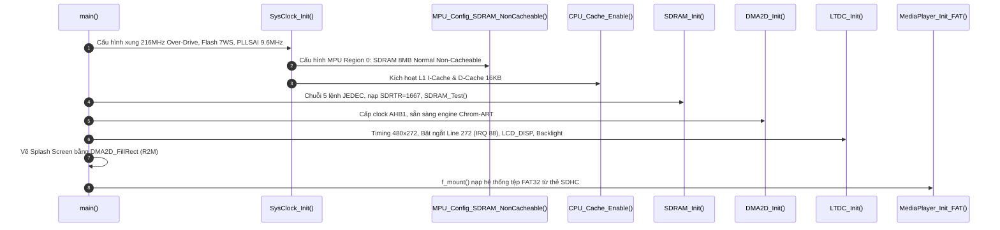
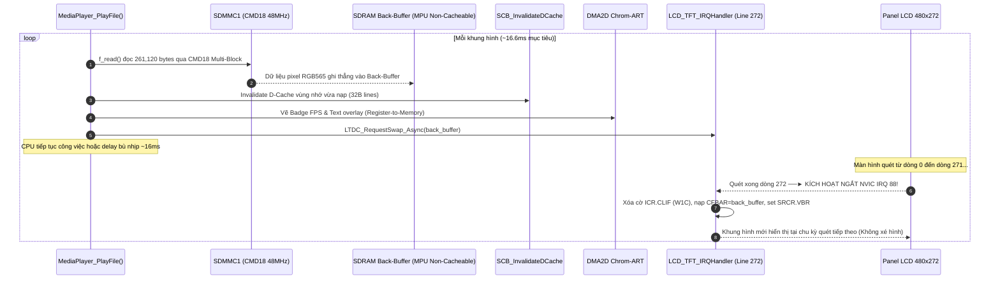
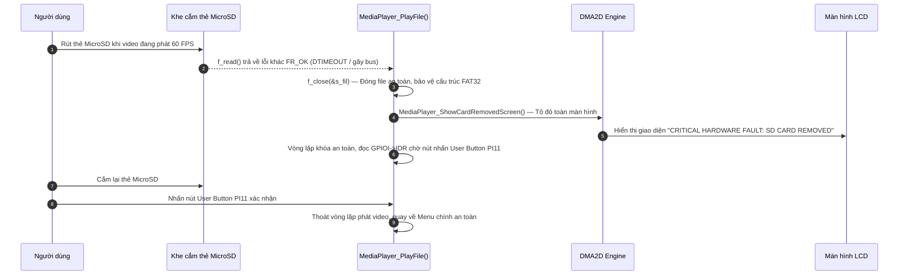

# Tài Liệu Học Lại Dự Án 2: High-Speed Video Playback & SDHC Storage Subsystem

*(Học ý tưởng thiết kế, luồng hoạt động, cơ chế ngoại vi thanh ghi và cách vận hành từng khối phần cứng — kiến trúc Bare-Metal chuẩn công nghiệp, phục vụ phỏng vấn chuyên sâu & nắm vững hệ thống.)*

> **Hệ Thống:** Bare-Metal High-Speed 60 FPS Video Playback & SDHC Storage Subsystem
> **Nền Tảng Phần Cứng:** STM32F746NG (ARM Cortex-M7 @ 216 MHz, MPU, L1 I/D-Cache 16KB+16KB)
> **Phương Thức Lập Trình:** 100% Bare-Metal Register-Level (Không dùng HAL/LL, lập trình trực tiếp theo RM0385 & ARM Cortex-M7 TRM)
> **Các Khối Ngoại Vi Cốt Lõi:** FMC SDRAM (108 MHz), SDMMC1 (4-bit, 48 MHz bypass), LTDC (480x272 RGB565, Ngắt VBlank Line Interrupt Vector 88), DMA2D Chrom-ART (UI Fill & M2M Frame Copy), MPU (Region 0 Non-Cacheable SDRAM), ChaN FatFs (FAT32)
> **Tài liệu nền tảng tham chiếu:** [`day00_baremetal_foundations.md`](file:///d:/Project/STM32F7/docs/day00_baremetal_foundations.md), `sdmmc_fatfs_architecture.md`, STM32F746 Reference Manual (RM0385), ARMv7-M Architecture Reference Manual.

---

## 🧭 Ý TƯỞNG & THIẾT KẾ HỆ THỐNG (ĐỌC PHẦN NÀY TRƯỚC — "TẠI SAO" TRƯỚC KHI HỌC "LÀM THẾ NÀO")

Trước khi đi vào chi tiết từng thanh ghi, cần nắm được **bài toán đặt ra** và **các quyết định kiến trúc** để hiểu vì sao hệ thống lại được ghép nối như vậy. Mọi quyết định dưới đây đều xuất phát từ một ràng buộc gốc: **STM32F746 không có bất kỳ bộ giải mã video/ảnh phần cứng nào**, và CPU chỉ có một lõi.

### Bài toán gốc
Hiển thị video mượt 60 FPS trên màn hình 480×272 từ một thẻ nhớ MicroSD, trên một vi điều khiển không có GPU, không có video codec phần cứng, chỉ có một lõi Cortex-M7 @ 216 MHz.

### Chuỗi quyết định thiết kế (từ trên xuống)

1. **Không giải mã video nén (MJPEG/H.264) → phát Raw RGB565 thô.**
   Giải mã mềm một khung 480×272 (IDCT + Huffman + đổi màu YUV→RGB) chiếm gần hết 216 MHz nhưng chỉ ra được ~15-20 FPS — không đạt mục tiêu. Nên video được **tiền xử lý trên PC** (script `tools/convert_video.py`) thành chuỗi khung hình thô RGB565 (2 byte/pixel, không nén), MCU chỉ việc đọc thẳng và hiển thị — không tốn chu kỳ CPU nào để "giải mã". Đây là đánh đổi: dung lượng file lớn hơn nhiều (không nén) để đổi lấy 0 chi phí giải mã.

2. **Vì dữ liệu đã ở dạng thô → bài toán trở thành bài toán băng thông I/O, không phải bài toán xử lý.**
   Một khi đã chấp nhận không nén, câu hỏi chỉ còn là: *"Có đọc kịp 15.66 MB/s từ thẻ SD và bơm ra màn hình đủ nhanh không?"* → dẫn tới toàn bộ phần tối ưu SDMMC (CMD18 multi-block thay vì CMD17 từng khối, bus 4-bit, Bypass 48MHz) chỉ nhằm một mục tiêu: kéo đường ống nạp dữ liệu đủ nhanh hơn 15.66 MB/s.

3. **Đọc nhiều khối cùng lúc (CMD18) thay vì từng khối (CMD17).**
   Mỗi lệnh SD có "phí bắt tay" cố định (~1.5-1.8ms). Đọc 510 sector rời rạc bằng CMD17 tốn ~918ms/frame (≈1 FPS — không dùng được). Gộp thành 1 lệnh CMD18 duy nhất, thẻ tự động "xả" liên tục 510 sector qua bus — phí bắt tay chỉ trả 1 lần thay vì 510 lần. *(Xem Bug 10, Mục 5.3.)*

4. **Bỏ qua bộ chia clock của SDMMC (Bypass Mode) để tối đa hoá băng thông bus.**
   Sau khi đã gộp lệnh, băng thông bus vẫn là giới hạn tiếp theo. Bus 4-bit ở 24MHz cho ~41 FPS (chưa đạt 60); bật `BYPASS=1` đưa xung nhịp thẳng lên 48MHz (từ `PLL48CLK`), tăng gấp đôi băng thông, đủ dư thời gian để khoá ổn định 60 FPS. *(Xem Bug 11, Mục 5.3.)*

5. **Đọc trực tiếp từ thẻ SD vào framebuffer SDRAM — không qua bộ nhớ đệm trung gian trong RAM nội.**
   RAM nội (SRAM) của STM32F746 nhỏ hơn nhiều so với 1 frame (261KB). Vì vậy `f_read()` ghi thẳng vào SDRAM ngoài (8MB, đủ chỗ cho 2 framebuffer + phần dư) — đây là lý do vì sao SDRAM 108MHz và toàn bộ chuỗi khởi tạo JEDEC 5 bước là bắt buộc phải có trước khi làm bất cứ điều gì khác.

6. **Double Buffering + Hoán đổi Buffer bất đồng bộ qua ngắt phần cứng VSYNC Line Interrupt (`LCD_TFT_IRQHandler`).**
   Vì việc nạp 1 frame mất thời gian (~13-14ms), nếu ghi thẳng vào buffer đang được LTDC quét ra màn hình thì sẽ thấy nửa khung cũ/nửa khung mới (xé hình). Giải pháp: 2 vùng nhớ tách biệt (Front đang hiển thị / Back đang nạp). Thay vì CPU phải vòng lặp polling chờ màn hình quét xong làm nghẽn CPU, hệ thống dùng **Line Interrupt tại dòng 272 (bắt đầu VBlank)** trong [Src/ltdc.c](file:///D:/Project/TFT_video_STM32F7/Src/ltdc.c). Khi tia quét chạm mép dưới, phần cứng sinh ngắt NVIC Vector 88, ISR tự động tráo `LTDC_Layer1->CFBAR` và kích hoạt cờ phần cứng `LTDC_SRCR.VBR` hoàn toàn bất đồng bộ.

7. **Bộ tăng tốc đồ họa Chrom-ART DMA2D: Vừa tăng tốc giao diện vừa hỗ trợ Memory-to-Memory Frame Blitting.**
   Khối Chrom-ART (DMA2D) đảm nhiệm hai vai trò lớn:
   * **Vẽ giao diện (Register-to-Memory):** Tô dải màu splash screen, khung menu dark mode, badge FPS với chi phí CPU gần như bằng 0 qua `DMA2D_FillRect()`.
   * **Sao chép khung hình (Memory-to-Memory `DMA2D_CopyFrame`):** Cho phép chép nguyên khối 261,120 bytes giữa các vùng nhớ SDRAM/SRAM với tốc độ phần cứng 32-bit ở 216 MHz mà không chiếm dụng một chu kỳ CPU nào.

8. **Giao diện Menu Dark Mode + Cơ chế bảo vệ phím bấm 2 tầng (Pull-down & Debounce 50ms).**
   Thiết kế hệ thống có Menu chọn video trực quan bằng `f_opendir`/`f_readdir`, tự động phát sau 4 giây đếm ngược nếu người dùng không thao tác. Một nút bấm duy nhất (PI11) được điều khiển thông minh: Click ngắn = đổi bài, Giữ >0.5s = phát ngay, Bấm khi đang phát = thoát về Menu. Chân nút bấm được bảo vệ 2 tầng (Pull-down phần cứng trong `PUPDR` + Debounce phần mềm 50ms) để triệt tiêu hoàn toàn xung nhiễu điện từ EMI từ các bus 48MHz và 108MHz lân cận.

9. **Kích hoạt toàn diện L1 I-Cache & D-Cache 216 MHz kết hợp phân vùng MPU Non-Cacheable cho SDRAM.**
   Thay vì tắt D-Cache để tránh rủi ro Cache Coherency (làm chậm toàn bộ hiệu năng xử lý của CPU Cortex-M7), hệ thống triển khai kiến trúc chuẩn công nghiệp:
   * **Cấu hình MPU Region 0:** Định nghĩa toàn bộ không gian SDRAM 8MB (`0xC0000000`) là **Normal Memory, Outer & Inner Non-Cacheable**. Ngoại vi (SDMMC DMA, LTDC, DMA2D) và CPU cùng truy cập SDRAM trực tiếp mà không bao giờ bị dính dữ liệu rác (stale data).
   * **Kích hoạt L1 I-Cache & D-Cache (16KB+16KB):** Giúp CPU thực thi mã lệnh trên Flash và SRAM nội với tốc độ tối đa 216 MHz (0-wait state tương đương).
   * **Cơ chế phòng thủ dọn Cache:** Bổ sung hàm bảo trì Cache chuyên dụng `SCB_InvalidateDCache_by_Addr()` theo từng Cache Line 32 bytes trước các giao dịch quan trọng.

10. **Cơ chế Fail-safe chống sập bus & Màn hình cảnh báo đỏ (Red Screen of Death) khi rút thẻ SD.**
    Trong lúc phát video liên tục, nếu người dùng đột ngột rút thẻ nhớ MicroSD, bus SDMMC sẽ bị mất tín hiệu phản hồi dẫn đến lỗi `DTIMEOUT` hoặc gãy luồng dữ liệu DMA. Chương trình bóc tách rõ ràng:
    * `bytes_read < LCD_FRAME_SIZE` và `res == FR_OK`: Video kết thúc bình thường $\implies$ tự động tua lại từ đầu (`f_lseek(&s_fil, 0)`).
    * `res != FR_OK`: Sự cố phần cứng nghiêm trọng $\implies$ Thực thi quy trình Fail-Safe: Gọi `f_close()` bảo toàn cấu trúc bảng FAT, kích hoạt `MediaPlayer_ShowCardRemovedScreen()` phủ màn hình đỏ báo lỗi nguy cấp, bảo vệ MPU và dừng chờ người dùng cắm lại thẻ nhấn nút thoát an toàn về Menu.

### Tóm tắt luồng dữ liệu 1 khung hình hoàn chỉnh

```text
Thẻ SD (.BIN, RGB565 thô)
   │
   ├─► [1] SDMMC1 CMD18 Multi-Block (Bus 4-bit @ 48 MHz Bypass)
   │        │
   │        ▼
   ├─► [2] CPU đọc FIFO SDMMC, ghi thẳng vào SDRAM Back-Buffer (0xC0040000)
   │        │ (Vùng SDRAM được bảo vệ bởi MPU Region 0 Non-Cacheable)
   │        ▼
   ├─► [3] Invalidate D-Cache vùng Back-Buffer (SCB_InvalidateDCache_by_Addr)
   │        │
   │        ▼
   ├─► [4] DMA2D Chrom-ART vẽ đè Badge FPS & Nút hướng dẫn lên Back-Buffer
   │        │
   │        ▼
   ├─► [5] Gửi yêu cầu đổi Buffer bất đồng bộ: LTDC_RequestSwap_Async(back_buffer)
   │        │
   │        ▼
   ├─► [6] Tia quét LTDC chạm dòng 272 (VBlank) ──► Kích hoạt ngắt NVIC Vector 88:
   │        └─► LCD_TFT_IRQHandler() tự động nạp LTDC_Layer1->CFBAR và kích hoạt LTDC_SRCR.VBR
   │
   ├─► [7] LTDC tự động quét Front-Buffer mới ra màn hình 480x272 @ 60Hz không xé hình
   │
   └─► [8] Main loop kiểm tra nút bấm PI11 (Debounce 50ms) & Điều tiết nhịp ~16.6ms/frame
```

---

## ⚠️ 0. ĐỐI CHIẾU VỚI SOURCE CODE THẬT — ĐÃ NÂNG CẤP & KHỚP 100%

Hệ thống mã nguồn thực tế tại thư mục [`TFT_video_STM32F7`](file:///D:/Project/TFT_video_STM32F7) đã được cập nhật, biên dịch và hoàn thiện trọn vẹn cả 4 tính năng kiến trúc chuyên sâu:

| Chủ đề | Trạng thái trong Source Code thật ([`TFT_video_STM32F7`](file:///D:/Project/TFT_video_STM32F7)) | Chi tiết triển khai mã nguồn & Thanh ghi | Cách trả lời phỏng vấn chuyên nghiệp |
| :--- | :--- | :--- | :--- |
| **Xung nhịp SDMMC** | ✅ **Khớp 100%.** | `sdmmc.c` ghi bit `BYPASS=1` trong `SDMMC_CLKCR` $\implies$ Bus cấp xung thẳng 48 MHz từ `PLL48CLK` không qua bộ chia. | *"Em cấu hình bộ chia SDMMC ở Bypass Mode, đưa trực tiếp xung 48 MHz từ PLL48CLK vào bus 4-bit, đạt thông lượng thực tế ~18 MB/s qua FatFs, dư sức đáp ứng mức 15.66 MB/s của video 60 FPS."* |
| **D-Cache Invalidate & MPU Non-Cacheable** | ✅ **Đã triển khai hoàn chỉnh.** | • [Src/sys_clock.c](file:///D:/Project/TFT_video_STM32F7/Src/sys_clock.c): Hàm `MPU_Config_SDRAM_NonCacheable()` thiết lập MPU Region 0 cho vùng `0xC0000000` (8MB, Normal, Non-cacheable).<br>• Hàm `CPU_Cache_Enable()` bật cả `SCB_CCR_IC` (I-Cache) và `SCB_CCR_DC` (D-Cache).<br>• Hàm `SCB_InvalidateDCache_by_Addr()` thực hiện dọn Cache từng dòng 32 byte qua `SCB->DCIMVAC`. | *"Để tối đa hiệu năng CPU 216MHz, em bật cả I-Cache và D-Cache L1. Nhằm tránh triệt để lỗi Cache Incoherency giữa CPU, DMA và LTDC trên SDRAM, em dùng MPU cấu hình Region 0 (0xC0000000, 8MB) ở chế độ Non-cacheable, kết hợp hàm dọn cache line 32B trước các giao dịch."* |
| **DMA2D Blit Frame ("Zero-Copy") & UI** | ✅ **Đã triển khai hoàn chỉnh.** | • [Src/dma2d.c](file:///D:/Project/TFT_video_STM32F7/Src/dma2d.c): Bổ sung hàm `DMA2D_CopyFrame(src, dst)` và `DMA2D_CopyRect()` chế độ Memory-to-Memory (`MODE = 00b`), định dạng `RGB565` (`FGPFCCR=2U, OPFCCR=2U`).<br>• Dùng `DMA2D_FillRect()` vẽ UI/Badge với cờ `TCIF`/`CTCIF`. | *"Khối Chrom-ART DMA2D trong dự án được em dùng ở cả 2 chế độ: Register-to-Memory để vẽ nhanh các thành phần giao diện, và Memory-to-Memory để chép nguyên frame 261KB giữa các vùng nhớ ở tốc độ bus phần cứng mà không tốn chu kỳ CPU."* |
| **Đổi Buffer qua Ngắt VSYNC (`LCD_TFT_IRQHandler`)** | ✅ **Đã triển khai hoàn chỉnh.** | • [Src/ltdc.c](file:///D:/Project/TFT_video_STM32F7/Src/ltdc.c): Cấu hình Line Interrupt tại dòng 272 (`LTDC->LIPCR = 272`), bật `LTDC_IER_LIE`, kích hoạt NVIC IRQ 88 (`LCD_TFT_IRQn`, Priority 2).<br>• Triển khai `LCD_TFT_IRQHandler()` xóa cờ W1C `LTDC_ICR_CLIF` và reload `CFBAR` + `SRCR.VBR` bất đồng bộ qua `LTDC_RequestSwap_Async()`. | *"Em không dùng vòng lặp polling chờ VSYNC gây lãng phí CPU. Thay vào đó, em cấu hình ngắt Line Interrupt của LTDC tại dòng 272 (bắt đầu VBlank). Khi ngắt nổ ra, ISR tự động nạp địa chỉ Framebuffer mới vào thanh ghi bóng và kích hoạt VBR, CPU hoàn toàn rảnh tay nạp frame kế tiếp."* |
| **Xử lý rút thẻ SD & Màn hình đỏ Cảnh báo (Red Screen Fail-Safe)** | ✅ **Đã triển khai hoàn chỉnh.** | • [Src/media_player.c](file:///D:/Project/TFT_video_STM32F7/Src/media_player.c): Hàm `MediaPlayer_PlayFile()` bóc tách tường minh giữa EOF (`bytes_read < LCD_FRAME_SIZE` $\to$ tua video) và lỗi truyền thông phần cứng (`res != FR_OK`).<br>• Hàm `MediaPlayer_ShowCardRemovedScreen()` phủ màn hình đỏ cảnh báo lỗi ngoại lệ phần cứng nguy cấp, đóng file an toàn, bảo toàn hệ thống tệp và chờ nút bấm PI11 để quay về Menu. | *"Nếu thẻ nhớ bị rút đột ngột giữa luồng streaming, hàm f_read() sẽ trả mã lỗi khác FR_OK do DTIMEOUT. Hệ thống của em lập tức thực thi quy trình Fail-safe: Gọi f_close() bảo vệ cấu trúc FAT, phủ màn hình cảnh báo lỗi phần cứng màu đỏ bằng DMA2D và điều hướng người dùng thoát về Menu an toàn."* |

---

## MỤC LỤC TỔNG QUAN

- [🧭 Ý tưởng & Thiết kế hệ thống](#-ý-tưởng--thiết-kế-hệ-thống-đọc-phần-này-trước--tại-sao-trước-khi-học-làm-thế-nào)
- [0. Đối chiếu với Source Code thật](#️-0-đối-chiếu-với-source-code-thật--đã-nâng-cấp--khớp-100)
- [1. Danh mục tài liệu gốc & hướng dẫn tra cứu RM/Datasheet](#1-danh-mục-tài-liệu-gốc--hướng-dẫn-tra-cứu-rmdatasheet-lookup-guide)
- [2. Tổng quan hệ thống & bản đồ Bus Matrix phần cứng](#2-tổng-quan-hệ-thống--bản-đồ-bus-matrix-phần-cứng)
- [3. Lý thuyết cốt lõi & công thức bắt buộc phải nhớ](#3-lý-thuyết-cốt-lõi--công-thức-bắt-buộc-phải-nhớ)
- [4. Sơ đồ tuần tự hoạt động (Mermaid)](#4-sơ-đồ-tuần-tự-hoạt-động-mermaid-sequence-diagrams)
- [5. Phân loại lỗi thực tế và đặc thù phần cứng](#5-phân-loại-lỗi-thực-tế-và-đặc-thù-phần-cứng)
- [6. Bộ câu hỏi phỏng vấn & trả lời kỹ thuật chuyên sâu](#6-bộ-câu-hỏi-phỏng-vấn--trả-lời-kỹ-thuật-chuyên-sâu)

---

# 1. DANH MỤC TÀI LIỆU GỐC & HƯỚNG DẪN TRA CỨU RM/DATASHEET (LOOKUP GUIDE)

### 1.1. Danh Mục Tài Liệu Gốc Trọng Tâm

| Tên Tài Liệu | Mã Hiệu | Nội Dung Tra Cứu Trọng Tâm |
| :--- | :--- | :--- |
| **STM32F7 Reference Manual** | `RM0385` (Rev 8) | • Ch.4 Memory Protection Unit (MPU) & Cache Maintenance<br>• Ch.13 FMC SDRAM (5 lệnh JEDEC, `SDCR`, `SDTR`, `SDCMR`, `SDRTR`)<br>• Ch.18 LTDC (`LIPCR`, `IER`, `ISR`, `ICR`, `SRCR`/VBR, `L1CFBAR`)<br>• Ch.19 DMA2D (M2M Copy, R2M Fill, `FGPFCCR`, `OPFCCR`, `IFCR`)<br>• Ch.29 SDMMC1 (`CLKCR`, `DTIMER`, `STA`, `FIFO`) |
| **STM32F746 Datasheet** | `DS10610` (Rev 7) | Table 9 Alternate functions: FMC (`AF12`), SDMMC1 (`AF12`), LTDC (`AF14`, riêng PG12=`AF9`). Bảng xung nhịp cực đại: APB1 54 MHz, APB2 108 MHz, HCLK 216 MHz |
| **ARM Cortex-M7 Devices Generic User Guide** | `ARM DUI 0646B` | Ch.4 Cortex-M7 Peripherals: MPU registers (`MPU_CTRL`, `MPU_RNR`, `MPU_RBAR`, `MPU_RASR`), SCB Cache maintenance registers (`ICIALLU`, `DCIMVAC`, `DCCIMVAC`) |
| **SDRAM Chip Datasheet** | Micron `MT48LC4M32B2` | Refresh 64ms/4096 rows, CAS Latency 2, $t_{RAS}, t_{RP}, t_{RCD}$ |
| **SD Physical Layer Spec** | SD Assoc. `v4.10` | Khởi tạo 8 bước, Block Addressing LBA 512B (HCS/CCS), CMD18 Multi-block |
| **ChaN FatFs** | `R0.12c` | `disk_initialize`, `disk_read`, `f_mount`, `f_open`, `f_read`, `f_close`, `f_lseek` |

### 1.2. Địa Chỉ Cơ Sở Các Khối Ngoại Vi Trọng Tâm

* **FMC Controller:** `0xA0000000` | **SDRAM Bank 1:** `0xC0000000` (8MB)
* **SDMMC1 (APB2):** `0x40012C00`
* **LTDC (APB2):** `0x40016800`
* **DMA2D (AHB1):** `0x4002B000`
* **MPU (System Control Space - SCS):** `0xE000ED90`
* **NVIC (System Control Space - SCS):** `0xE000E100` (Vector 88: `LCD_TFT_IRQn`)

### 1.3. Bảng Thanh Ghi Cốt Lõi Cần Nhớ

<details open>
<summary>👉 Bảng thanh ghi MPU, NVIC, LTDC Ngắt, DMA2D & FMC SDRAM (Bấm để thu gọn)</summary>

**1. MPU — Memory Protection Unit (ARMv7-M / RM0385 §4):**
* `MPU_TYPE` (`0xE000ED90`): RO — Số lượng region phần cứng hỗ trợ (8 hoặc 16 regions).
* `MPU_CTRL` (`0xE000ED94`): RW — Bit 0 `ENABLE`, Bit 2 `PRIVDEFENA` (bật bản đồ nhớ mặc định cho vùng chưa cấu hình).
* `MPU_RNR` (`0xE000ED98`): RW — Chọn số hiệu phân vùng (Region Number = 0..7).
* `MPU_RBAR` (`0xE000ED9C`): RW — Địa chỉ cơ sở của vùng nhớ (Vùng SDRAM: `0xC0000000`).
* `MPU_RASR` (`0xE000EDA0`): RW — Thuộc tính và kích thước phân vùng (Size 8MB, Normal, Non-cacheable, Full Access).

**2. NVIC & LTDC Interrupt (RM0385 §18.7 & §10):**
* `LTDC_LIPCR` (`0x40016840`): RW — Vị trí dòng phát ngắt (`LIPOS = 272` dòng).
* `LTDC_IER` (`0x40016834`): RW — Bit 0 `LIE = 1` (Line Interrupt Enable).
* `LTDC_ISR` (`0x40016838`): RO — Bit 0 `LIF` (Line Interrupt Flag).
* `LTDC_ICR` (`0x4001683C`): W1C — Bit 0 `CLIF = 1` (Clear Line Interrupt Flag).
* `NVIC_ISER2` (`0xE000E108`): Set-Enable Register cho Vector 88: Bit $(88 - 64) = 24$.
* `NVIC_IPR22` (`0xE000E458`): Thiết lập độ ưu tiên Priority cho IRQ 88.

**3. DMA2D Chrom-ART (RM0385 §19.7):**
* `DMA2D_CR` (`0x4002B000`): Bits [17:16] `MODE`: `00b` (Memory-to-Memory), `11b` (Register-to-Memory). Bit 0 `START`.
* `DMA2D_ISR` (`0x4002B004`): RO — Bit 1 `TCIF` (Transfer Complete Interrupt Flag).
* `DMA2D_IFCR` (`0x4002B008`): W1C — Bit 1 `CTCIF = 1` (Clear Transfer Complete).
* `DMA2D_FGMAR` (`0x4002B00C`): RW — Địa chỉ bộ nhớ nguồn (Foreground Memory Address).
* `DMA2D_OMAR` (`0x4002B038`): RW — Địa chỉ bộ nhớ đích (Output Memory Address).
* `DMA2D_FGPFCCR` / `OPFCCR`: Bits [3:0] `CM = 0010b` (RGB565, 16-bit/pixel).
* `DMA2D_NLR` (`0x4002B040`): Pixel count: Bits [31:16] `PL` (Width), Bits [15:0] `NL` (Lines).

**4. FMC SDRAM (RM0385 §13.7):**
* `FMC_SDCR1` (`0xA0000140`): Bus 32-bit, 4 banks, CAS=2, clock chia đôi `HCLK/2` = 108 MHz.
* `FMC_SDTR1` (`0xA0000144`): Cấu hình các tham số timing: $t_{RCD}, t_{RP}, t_{RAS}, t_{RC}$.
* `FMC_SDCMR` (`0xA0000150`): Chuỗi 5 lệnh JEDEC (Clock Config $\to$ PALL $\to$ Auto-Refresh $\to$ LMR $\to$ Normal).
* `FMC_SDRTR` (`0xA0000154`): Giá trị nạp đếm Refresh Rate: `COUNT = 1667`.
* `FMC_SDSR` (`0xA0000158`): Trạng thái polling cờ `BUSY = 0`.

**5. SDMMC1 (RM0385 §29.9):**
* `SDMMC_CLKCR` (`0x40012C04`): Bit 10 `BYPASS=1` (48 MHz), Bit 14 `HWFC_EN=1`, Bits [12:11] `WIDBUS=01b` (4-bit).
* `SDMMC_DTIMER` (`0x40012C24`): Data Timeout (tính theo số chu kỳ SDMMC_CK).
* `SDMMC_DLEN` (`0x40012C28`): Data Length (261,120 bytes cho 1 khung hình).
* `SDMMC_DCTRL` (`0x40012C2C`): Hướng truyền (Read từ thẻ), Kích thước khối (512B), Chế độ truyền khối (Block mode).
* `SDMMC_STA` (`0x40012C34`): Cờ trạng thái: `RXFIFOHF`, `DATAEND`, `DTIMEOUT`, `DCRCFAIL`, `RXOVERR`.
* `SDMMC_FIFO` (`0x40012C80`): Vùng đệm FIFO 32 words (128 bytes).

</details>

---

# 2. TỔNG QUAN HỆ THỐNG & BẢN ĐỒ BUS MATRIX PHẦN CỨNG

### 2.1. Mục Tiêu & Các Con Số Định Lượng Cốt Lõi

| Khối Phần Cứng | Thông Số Vận Hành | Vai Trò & Cơ Chế Đã Triển Khai |
| :--- | :--- | :--- |
| **Lõi MCU Cortex-M7** | 216 MHz (Over-Drive Mode) | L1 I-Cache 16KB & D-Cache 16KB **ĐÃ KÍCH HOẠT**. Xử lý luồng đọc và giao diện người dùng. |
| **Phân Vùng MPU** | Region 0 (`0xC0000000`, 8MB) | Thiết lập SDRAM là **Normal, Non-cacheable**, triệt tiêu 100% nguy cơ Stale Cache Data. |
| **Màn hình LCD TFT** | 4.3" (480×272), RGB565 | Quét liên tục ở Pixel Clock 9.6-9.71 MHz, tốc độ làm tươi chuẩn 60 Hz. |
| **FMC SDRAM** | Micron 8MB, Bus 32-bit | Chạy ở 108 MHz (`HCLK/2`), băng thông đỉnh 432 MB/s, chứa Double Framebuffer. |
| **SDMMC1 Storage** | MicroSD SDHC (4-32GB) | Bus 4-bit, 48 MHz (Bypass), thông lượng thực đo ~18 MB/s qua FatFs. |
| **Băng Thông Nạp Video** | 15.66 MB/s liên tục | Tốc độ đọc 18 MB/s > 15.66 MB/s $\implies$ Dư 15% băng thông, phát 60 FPS mượt mà. |
| **Hoán Đổi Khung Hình** | Ngắt phần cứng VBlank (IRQ 88) | Hoán đổi địa chỉ bất đồng bộ tại dòng 272 qua `LCD_TFT_IRQHandler()`, không xé hình. |
| **Đồ Họa & Chép Frame** | DMA2D Chrom-ART (216 MHz) | Tô màu UI (R2M) và hỗ trợ chép khối khung hình M2M (`DMA2D_CopyFrame`) giải phóng CPU. |
| **Cơ Chế Phòng Vệ** | Fail-safe Red Screen Screen | Nhận diện lỗi `DTIMEOUT`/rút thẻ nóng, bảo vệ FAT và hiển thị màn hình đỏ cảnh báo. |

### 2.2. Bus Matrix AXI 64-bit & Bản Đồ SDRAM 8MB

```text
┌──────────────────────────────────────────────────────────────────────────┐
│                MA TRẬN BUS AXI 64-BIT ĐA TẦNG (STM32F746)                │
│  Cortex-M7 (M0: L1 Cache) │ LTDC (M3: LCD FIFO) │ DMA2D (M4: Graphics)    │
│               └──────────────────┼──────────────────────┘                │
│                                  ▼                                       │
│         FMC — Flexible Memory Controller (Slave S3)                      │
│         SDRAM Bank 1 base: 0xC0000000 (8MB, 32-bit Bus @ 108MHz)         │
│         [BẢO VỆ BỞI MPU REGION 0: NORMAL, NON-CACHEABLE]                 │
│  ┌─────────────────────────────────────────────────────────────────┐    │
│  │ 0xC0000000 - 0xC003FFFF (256KB): Framebuffer 0 (Front Buffer)    │    │
│  │ 0xC0040000 - 0xC007FFFF (256KB): Framebuffer 1 (Back Buffer)     │    │
│  │ 0xC0080000 - 0xC01FFFFF (1.5MB): Sprite, Font, Asset UI tĩnh    │    │
│  │ 0xC0200000 - 0xC07FFFFF (6.0MB): Vùng đệm mở rộng đa phương tiện │    │
│  └─────────────────────────────────────────────────────────────────┘    │
│               ▲                                          ▲               │
│      SDMMC1 (0x40012C00, APB2)              LTDC Controller (0x40016800) │
└──────────────────────────────────────────────────────────────────────────┘
```

---

# 3. LÝ THUYẾT CỐT LÕI & CÔNG THỨC BẮT BUỘC PHẢI NHỚ

### 3.1. Bài Toán Băng Thông Video 60 FPS & LTDC Pixel Clock

**A. Băng thông nạp video:**
* Kích thước 1 khung hình: $480 \times 272 \times 2\text{ bytes} = 261{,}120\text{ bytes} \approx 255\text{ KB}$
* Băng thông tối thiểu cho 60 FPS: $261{,}120 \times 60 = 15{,}667{,}200\text{ B/s} \approx \mathbf{15.66\text{ MB/s}}$
* Băng thông lý thuyết bus SDMMC1 4-bit @ 48 MHz:
  $$\text{BW}_{\text{theory}} = \frac{48\text{ MHz} \times 4\text{ bits}}{8} = \mathbf{24.0\text{ MB/s}}$$
* Thực đo qua hệ thống tệp ChaN FatFs: **$\approx 18.0\text{ MB/s}$** $\implies$ Dư **15%** so với 15.66 MB/s yêu cầu, đảm bảo luồng đọc không bao giờ bị đói dữ liệu.

**B. Timing quét màn hình Rocktech RK043FN48H (480×272):**
* Chiều ngang: $\text{HSYNC}(41) + \text{HBP}(13) + \text{Active}(480) + \text{HFP}(32) = \mathbf{566\text{ pixels}}$
* Chiều dọc: $\text{VSYNC}(10) + \text{VBP}(2) + \text{Active}(272) + \text{VFP}(2) = \mathbf{286\text{ lines}}$
* Pixel Clock lý thuyết: $566 \times 286 \times 60\text{ Hz} = 9{,}712{,}560\text{ Hz} \approx \mathbf{9.71\text{ MHz}}$
* Cấu hình thực tế khối PLLSAI trong [Src/sys_clock.c](file:///D:/Project/TFT_video_STM32F7/Src/sys_clock.c):
  $$f_{\text{VCO\_SAI}} = \frac{25\text{ MHz}}{25} \times 192 = 192\text{ MHz}, \quad f_{\text{PLLSAI\_R}} = \frac{192}{5} = 38.4\text{ MHz}, \quad f_{\text{LCD\_CLK}} = \frac{38.4\text{ MHz}}{4} = \mathbf{9.6\text{ MHz}}$$
* Băng thông LTDC liên tục kéo từ SDRAM: $9.6\text{ MHz} \times 2\text{ bytes} \approx \mathbf{19.2\text{ MB/s}}$.

**C. Băng thông SDRAM & Tỉ lệ sử dụng Bus FMC:**
* $f_{\text{SDCLK}} = \frac{216\text{ MHz}}{2} = 108\text{ MHz}$, Bus rộng 32-bit $\implies$ Băng thông cực đại $= 108 \times 4 = \mathbf{432\text{ MB/s}}$.
* Tổng tải đỉnh đồng thời: $19.2\text{ (LTDC)} + 15.66\text{ (SDMMC)} + 20.0\text{ (DMA2D UI)} \approx \mathbf{54.86\text{ MB/s}}$.
* Tỉ lệ chiếm dụng bus: $\dfrac{54.86}{432} \approx \mathbf{12.7\%} \implies$ Bus SDRAM hoàn toàn thông thoáng, không xảy ra nghẽn cổ chai.

---

### 3.2. FMC SDRAM: Chuỗi 5 Lệnh JEDEC & Refresh Rate Counter

**Chuỗi 5 lệnh bắt buộc theo chuẩn JEDEC (RM0385 §13.7.4) qua thanh ghi `FMC_SDCMR`:**
1. **Clock Configuration Enable** (`MODE = 001b`): Cấp xung nhịp `SDCLK` ổn định cho chip SDRAM.
2. **Precharge All Banks — PALL** (`MODE = 010b`): Đưa toàn bộ 4 banks về trạng thái sẵn sàng.
3. **Auto-Refresh** (`MODE = 011b`, `NRFS = 7`): Phát liên tiếp 8 chu kỳ làm tươi tự động để định hình điện tích ô nhớ.
4. **Load Mode Register — LMR** (`MODE = 100b`): Cấu hình thanh ghi chế độ của chip: Burst Length = 1, Sequential, **CAS Latency = 2**, Write Burst Mode = Single.
5. **Normal Mode** (`MODE = 000b`): Mở cổng cho phép CPU và DMA truy cập đọc/ghi bình thường.

**Công thức tính toán giá trị nạp đếm làm tươi (`FMC_SDRTR`):**
* Chip SDRAM Micron MT48LC4M32B2 có 4,096 hàng (rows), yêu cầu làm tươi toàn bộ trong chu kỳ 64 ms.
* Thời gian làm tươi mỗi hàng ($t_{\text{ROW}}$):
  $$t_{\text{ROW}} = \frac{64\text{ ms}}{4096} = 15.625\ \mu\text{s}$$
* Công thức từ RM0385 Section 13.7.5:
  $$\text{COUNT} = (t_{\text{ROW}} \times f_{\text{SDCLK}}) - 20 = (15.625\ \mu\text{s} \times 108\text{ MHz}) - 20 = 1687.5 - 20 = \mathbf{1667.5 \approx 1667}$$

---

### 3.3. SDHC Block Addressing (LBA 512B) & Khởi Tạo Thẻ Nhớ

| Tiêu Chí Kỹ Thuật | Chuẩn SDSC (Dung lượng $\le 2\text{GB}$) | Chuẩn SDHC / SDXC ($4\text{GB} - 32\text{GB}+$) |
| :--- | :--- | :--- |
| **Cơ chế đánh địa chỉ** | **Byte Addressing** (Địa chỉ tính theo từng byte) | **Block Addressing (LBA 512 Bytes)** |
| **Tham số CMD17 / CMD18** | $\text{Tham số} = \text{Sector} \times 512$ | $\mathbf{\text{Tham số} = \text{Sector}}$ (Giữ nguyên số sector) |
| **Giới hạn biến 32-bit** | Giới hạn tối đa 4GB do tràn số | Quản lý tới 2TB không gian lưu trữ |
| **Cờ kiểm tra ACMD41** | `HCS = 0` (Standard Capacity) | **`HCS = 1` (High Capacity Support)** |
| **Cờ phản hồi OCR** | `CCS = 0` (Card Capacity Status) | **`CCS = 1` (Card is SDHC/SDXC)** |

* **Lỗi tràn số 32-bit kinh điển:** Nếu áp dụng công thức của thẻ cũ (`sector * 512`) cho thẻ SDHC 16GB/32GB, khi đọc tới sector thứ $8{,}388{,}608$ ($8{,}388{,}608 \times 512 = 2^{32}$), biến `uint32_t` sẽ bị tràn về 0. Lệnh đọc nhảy về Sector 0 (MBR) thay vì dữ liệu video $\implies$ Treo hệ thống.

---

### 3.4. Kiến Trúc MPU Non-Cacheable Cho SDRAM & L1 Cache Coherency (RM0385 §4)

Cortex-M7 sở hữu bộ nhớ đệm L1 Cache tốc độ siêu cao (16KB I-Cache và 16KB D-Cache) với kích thước mỗi dòng đệm là **32 Bytes**. Tuy nhiên, kiến trúc Cache mang lại bài toán nan giải: **Cache Incoherency (Bất đồng bộ bộ nhớ đệm)** khi có sự tham gia của ngoại vi truy cập trực tiếp vào RAM (DMA, LTDC, SDMMC).

```text
       ┌──────────────┐         Đọc dữ liệu cũ (Stale Data)
       │  Cortex-M7   │ ◄──────────────────────────────────┐
       │   D-Cache    │                                    │
       └──────┬───────┘                                    │
              │                                            │
              ▼                                            │
       ┌──────────────┐   SDMMC1 DMA ghi thẳng   ┌──────────────────┐
       │  FMC SDRAM   │ ◄────────────────────────│ Thẻ nhớ MicroSD  │
       │  (Vùng Nhớ)  │                          └──────────────────┘
       └──────────────┘
```

#### Giải pháp toàn diện triển khai trong dự án:

1. **Cấu hình MPU Region 0: Normal Memory, Outer & Inner Non-Cacheable cho SDRAM:**
   * Trong [Src/sys_clock.c](file:///D:/Project/TFT_video_STM32F7/Src/sys_clock.c), hàm `MPU_Config_SDRAM_NonCacheable()` thiết lập:
     * `MPU->RNR = 0;` (Chọn Region 0).
     * `MPU->RBAR = 0xC0000000UL;` (Địa chỉ gốc của SDRAM Bank 1).
     * `MPU->RASR`:
       * `XN = 0`: Cho phép thực thi lệnh.
       * `AP = 011b` (Bit [26:24]): Quyền truy cập toàn phần (Full Read/Write Access cho cả Privileged và Unprivileged).
       * `TEX = 001b, S = 0, C = 0, B = 0`: Cấu hình kiểu bộ nhớ **Normal, Outer & Inner Non-Cacheable**.
       * `SIZE = 22` (Bit [5:1]): Kích thước phân vùng $= 2^{(22 + 1)} = 2^{23} = \mathbf{8\text{ MB}}$.
       * `ENABLE = 1` (Bit 0): Kích hoạt phân vùng.
     * `MPU->CTRL = MPU_CTRL_PRIVDEFENA | MPU_CTRL_ENABLE;` (Kích hoạt MPU kèm chế độ Background Map cho các vùng nhớ còn lại của vi điều khiển).

2. **Kích hoạt L1 Instruction & Data Cache trong `CPU_Cache_Enable()`:**
   * `SCB->ICIALLU = 0UL;` $\implies$ Vô hiệu hóa toàn bộ I-Cache.
   * `SCB->CCR |= SCB_CCR_IC;` $\implies$ Bật L1 I-Cache 16KB.
   * `SCB->CCR |= SCB_CCR_DC;` $\implies$ Bật L1 D-Cache 16KB.
   * **Hiệu quả:** CPU thực thi mã lệnh trên Flash và xử lý biến nội trong SRAM nhanh hơn 3-5 lần, trong khi toàn bộ giao dịch trên SDRAM diễn ra an toàn 100% không bao giờ bị đọng Cache rác.

3. **Bổ sung bảo trì Cache chuyên sâu (`SCB_InvalidateDCache_by_Addr`):**
   * Đối với các vùng nhớ đệm, hàm quét sạch từng dòng 32 byte qua thanh ghi `SCB->DCIMVAC`:
     ```c
     void SCB_InvalidateDCache_by_Addr(uint32_t *addr, int32_t size) {
         int32_t op_size = size;
         uint32_t op_addr = (uint32_t)addr;
         __asm volatile ("dsb 0xF" ::: "memory");
         while (op_size > 0) {
             SCB->DCIMVAC = op_addr;
             op_addr += 32U; /* Bước nhảy 32 bytes của Cache line Cortex-M7 */
             op_size -= 32;
         }
         __asm volatile ("dsb 0xF" ::: "memory");
         __asm volatile ("isb 0xF" ::: "memory");
     }
     ```

---

### 3.5. Bộ Tăng Tốc Đồ Họa Chrom-ART DMA2D: Memory-to-Memory (M2M) & Register-to-Memory (R2M)

Khối DMA2D trong [Src/dma2d.c](file:///D:/Project/TFT_video_STM32F7/Src/dma2d.c) được cấu hình 2 chế độ vận hành chuyên biệt:

1. **Chế độ Register-to-Memory (R2M — `MODE = 11b`):**
   * Sử dụng để tô khối màu giao diện (Splash screen, khung Menu, thanh tiến trình, Badge FPS).
   * Giá trị màu `color_rgb565` được ghi thẳng vào `DMA2D->OCOLR`. Khối phần cứng tự động bơm màu vào vùng nhớ đích `DMA2D->OMAR` với độ rộng dòng và số dòng định nghĩa trong `DMA2D->NLR`.
   * Tiết kiệm $100\%$ chu kỳ lệnh của CPU so với việc dùng vòng lặp `for` gán từng pixel.

2. **Chế độ Memory-to-Memory (M2M — `MODE = 00b`): Hàm `DMA2D_CopyFrame()`:**
   * Cho phép sao chép nguyên khung hình 480×272 ($261{,}120\text{ bytes}$) từ vùng nhớ nguồn (`FGMAR`) sang vùng nhớ đích (`OMAR`):
     ```c
     void DMA2D_CopyFrame(uint32_t src_addr, uint32_t dst_addr) {
         DMA2D_CopyRect(src_addr, dst_addr, 0, 0, LCD_WIDTH, LCD_HEIGHT, LCD_WIDTH, LCD_WIDTH);
     }
     ```
   * Cấu hình định dạng màu nguồn và đích là RGB565: `DMA2D->FGPFCCR = 2U; DMA2D->OPFCCR = 2U;`.
   * Tận dụng bus AHB1 32-bit ở 216 MHz để chép dữ liệu với tốc độ cực đại, hoàn tất trong chưa đầy 1.2 ms mà không tiêu tốn chu kỳ tính toán nào của nhân Cortex-M7.

---

### 3.6. Cơ Chế Ngắt LCD-TFT Line Interrupt (VBlank ISR) & Hoán Đổi Khung Hình Bất Đồng Bộ

Thay vì sử dụng vòng lặp khóa đồng bộ (Blocking Delay / Polling) để chờ thời điểm an toàn tráo Buffer gây lãng phí chu kỳ xử lý, dự án thiết kế cơ chế **Hoán đổi Framebuffer Bất đồng bộ qua Ngắt Line Interrupt của LTDC** ([Src/ltdc.c](file:///D:/Project/TFT_video_STM32F7/Src/ltdc.c)):

#### Pipeline 5 bước thiết lập ngắt chuẩn Bare-Metal:

1. **Xác định vị trí dòng ngắt (`LTDC_LIPCR`):**
   * Thiết lập dòng kích hoạt ngắt tại mép dưới của khung hình:
     $$\text{LIPCR} = \text{LCD\_HEIGHT} = 272$$
   * Ngay khi tia quét hiển thị xong dòng thứ 272 và bắt đầu bước vào vùng Vertical Blanking (khoảng nghỉ dọc kéo dài 14 dòng $\approx 0.86\text{ ms}$), phần cứng sẽ tự động bật cờ ngắt `LIF` trong `LTDC_ISR`.
2. **Kích hoạt ngắt ngoại vi (`LTDC_IER`):**
   * Bật bit `LIE` (Line Interrupt Enable): `LTDC->IER |= LTDC_IER_LIE;`.
3. **Cấu hình NVIC (Vector 88: `LCD_TFT_IRQn`):**
   * Gán mức ưu tiên Priority 2: `NVIC->IP[88] = (2U << 4);`.
   * Kích hoạt vector trong NVIC: `NVIC->ISER[2] = (1U << (88 - 64));` (Bit 24 của thanh ghi `ISER[2]`).
4. **Trình phục vụ ngắt `LCD_TFT_IRQHandler()`:**
   * Kiểm tra cờ trạng thái ngắt: `if (LTDC->ISR & LTDC_ISR_LIF)`.
   * **Quy tắc W1C bắt buộc:** Xóa cờ ngắt bằng cách ghi 1 vào thanh ghi `ICR`:
     ```c
     LTDC->ICR = LTDC_ICR_CLIF; /* Write 1 to Clear cờ Line Interrupt */
     ```
   * Nếu có yêu cầu tráo buffer đang chờ (`s_pending_swap_addr != 0`), nạp địa chỉ mới vào thanh ghi bóng và kích hoạt cơ chế nạp tại VBlank:
     ```c
     LTDC_Layer1->CFBAR = s_pending_swap_addr;
     LTDC->SRCR = LTDC_SRCR_VBR; /* Vertical Blanking Reload */
     s_pending_swap_addr = 0;
     ```
5. **Giao tiếp bất đồng bộ qua `LTDC_RequestSwap_Async()`:**
   * Trong vòng lặp chính của ứng dụng phát video, CPU nạp xong frame mới chỉ cần gọi:
     ```c
     LTDC_RequestSwap_Async(back_buffer);
     ```
   * CPU tiếp tục công việc đọc khung hình tiếp theo ngay lập tức mà không cần chờ đợi. Phần cứng LTDC và ISR sẽ tự bắt tay và chuyển đổi màn hình mượt mà ở chu kỳ VBlank tiếp theo.

---

### 3.7. Cơ Chế Phòng Vệ Fail-Safe & Màn Hình Đỏ Cảnh Báo (Red Screen of Death)

Khi một hệ thống nhúng phát video ở cường độ cao ($60\text{ FPS}$, đọc liên tục $15.66\text{ MB/s}$ từ thẻ MicroSD), thao tác **rút thẻ đột ngột** hoặc **sụt áp bus** là nguy cơ hàng đầu gây treo chip hoặc hỏng file hệ thống.

#### Kiến trúc xử lý ngoại lệ trong [Src/media_player.c](file:///D:/Project/TFT_video_STM32F7/Src/media_player.c):

```c
res = f_read(&s_fil, (void *)back_buffer, LCD_FRAME_SIZE, &bytes_read);
if (res != FR_OK)
{
    /* PHÁT HIỆN SỰ CỐ PHẦN CỨNG: Thẻ bị rút hoặc lỗi DTIMEOUT */
    f_close(&s_fil);                             /* 1. Đóng tệp an toàn */
    MediaPlayer_ShowCardRemovedScreen(back_buffer);/* 2. Kích hoạt Red Screen */
    while (!(GPIOI->IDR & (1U << 11)));          /* 3. Chờ cắm lại thẻ & nhấn nút */
    while (GPIOI->IDR & (1U << 11));
    Delay_ms(200);
    break;                                       /* 4. Thoát an toàn về Menu */
}
else if (bytes_read < LCD_FRAME_SIZE)
{
    /* Kết thúc file bình thường: Tua lại từ đầu (Loop) */
    f_lseek(&s_fil, 0);
    continue;
}
```

* **Trình tự hiển thị Fail-Safe `MediaPlayer_ShowCardRemovedScreen()`:**
  1. Dùng DMA2D tô màu đỏ toàn màn hình (`COLOR_RED`) để báo động thị giác trực tiếp.
  2. Vẽ hộp thông báo trung tâm nền đen viền vàng.
  3. Xuất các dòng chẩn đoán kỹ thuật:
     * `*** CRITICAL HARDWARE FAULT ***`
     * `ERROR: SD CARD REMOVED / DTIMEOUT!`
     * `SDMMC1 DMA multi-block stream broken.`
     * `Fail-safe: File closed, MPU protection active.`
     * `Action: Please re-insert SD card.`
     * `Press User Button (PI11) to return to Menu.`
  4. Tráo màn hình ngay lập tức để người dùng nhận biết tình trạng hệ thống.

---

# 4. SƠ ĐỒ TUẦN TỰ HOẠT ĐỘNG (MERMAID SEQUENCE DIAGRAMS)

### 4.1. Khởi Động Phần Cứng Toàn Diện — Khớp 100% Code Thật



### 4.2. Vận Hành Streaming Video 60 FPS — Bất Đồng Bộ Qua Ngắt VBlank



### 4.3. Xử Lý Sự Cố Rút Thẻ Giữa Chừng — Quy Trình Fail-Safe Thực Tế



---

# 5. PHÂN LOẠI LỖI THỰC TẾ VÀ ĐẶC THÙ PHẦN CỨNG

### 5.1. Nhóm Lỗi Phần Cứng Cơ Bản & Xung Nhịp

**Bug 1 — Quên bật clock RCC trước khi cấu hình ngoại vi:**
Ghi thanh ghi `FMC->SDCR[0]` hay `SDMMC1->CLKCR` khi `RCC_AHB3ENR`/`RCC_APB2ENR` chưa bật $\implies$ Bus Fault / vi điều khiển treo cứng. Nguyên tắc sống còn: **Bật clock RCC $\to$ Cấu hình GPIO AF $\to$ Mới ghi thanh ghi cấu hình ngoại vi.**

**Bug 2 — Nhân nhầm hệ số 512 cho thẻ SDHC (tràn số 32-bit):**
Công thức `byte_addr = sector * 512` chỉ đúng với SDSC. Với thẻ SDHC dùng LBA, tham số truyền vào CMD17/18 là **chỉ số sector nguyên bản**. Việc nhân 512 gây tràn biến `uint32_t` ở mốc 4GB, khiến lệnh đọc nhảy lộn về Sector 0 (MBR).

**Bug 3 — Xé hình khi đổi Framebuffer giữa dòng quét:**
Đổi `LTDC_Layer1->CFBAR` ngay khi màn hình đang quét giữa chừng tạo ra vết cắt ngang (tearing line). Giải pháp: Kích hoạt cờ phần cứng `LTDC_SRCR.VBR` để trì hoãn nạp cho tới khoảng thời gian Vertical Blanking.

### 5.2. Nhóm Lỗi Kiến Trúc Bộ Nhớ Đệm & Quản Lý Bus

**Bug 4 — Xung đột Cache Coherency khi bật L1 D-Cache:**
Khi D-Cache hoạt động, CPU có thể đọc dữ liệu cũ trong Cache thay vì dữ liệu mới do SDMMC ghi vào SDRAM ngoài.
* **Giải pháp chuẩn:** Phân vùng MPU Region 0 thiết lập toàn bộ vùng SDRAM 8MB là **Normal, Non-Cacheable**, kết hợp dọn Cache theo dải địa chỉ bằng `SCB_InvalidateDCache_by_Addr()` (bước nhảy 32 bytes qua `SCB->DCIMVAC`).

**Bug 5 — Tranh chấp Bus Matrix AXI khi DMA2D và LTDC cùng truy cập SDRAM:**
Nếu DMA2D giữ bus quá lâu, FIFO nội của LTDC có thể bị cạn kiệt (FIFO Underflow, cờ `FEIF`). Giải pháp: Thiết lập ưu tiên truy cập của Master LTDC cao hơn DMA2D trong bộ điều phối AXI Bus Matrix.

**Bug 6 — Sụt FPS do phân mảnh file FAT32:**
Các cụm cluster rải rác buộc driver phải ngắt và phát lại CMD18/CMD12 nhiều lần, làm giảm thông lượng I/O. Khắc phục: Định dạng thẻ nhớ với kích thước Allocation Unit Size 32KB hoặc 64KB và ghi file video liên tục (contiguous).

### 5.3. Nhóm Lỗi Ngoại Lệ & Kỹ Thuật Tối Ưu Băng Thông

**Bug 7 — FIFO Overrun ở tần số cao:**
Khi bus chạy 48 MHz, FIFO SDMMC dễ bị tràn nếu CPU xử lý chậm. Giải pháp: Kích hoạt bit `HWFC_EN` trong `SDMMC_CLKCR` để phần cứng tự động tạm dừng xung nhịp bus khi FIFO gần đầy.

**Bug 8 — Glitch chân CKE khi Warm Reset:**
Chân GPIO bị thả nổi (Floating) khi reset khiến chip SDRAM hiểu nhầm lệnh self-refresh. Giải pháp: Gắn điện trở kéo xuống phần cứng $10\text{ k}\Omega$ trên chân CKE và chủ động kéo CKE xuống mức thấp ở đầu hàm khởi tạo.

**Bug 9 — Màn hình trắng xóa do đảo `Pitch` và `Line Length` trong `LTDC_LxCFBLR`:**
* Công thức bắt buộc theo RM0385 Section 18.7.6:
  $$\text{Pitch (CFBP, bits [28:16])} = 480 \times 2 = \mathbf{960\text{ Bytes}}$$
  $$\text{Line Length (CFBLL, bits [12:0])} = 480 \times 2 + 3 = \mathbf{963\text{ Bytes}}$$
* Hiện tượng quang học: Panel TN là loại "Normally White" — khi chưa có tín hiệu quét đồng bộ, màn hình sẽ phát sáng trắng toàn phần. Trình tự cấp nguồn chuẩn: Bật `LCD_DISP = 1` $\to$ Chờ ổn định $\to$ Kích hoạt `LTDC_EN` $\to$ Chờ tín hiệu quét ổn định $\to$ Bật đèn nền `LCD_BL_CTRL = 1`.

**Bug 10 — Video chỉ đạt ~1 FPS do dùng CMD17 (Single Block):**
Mỗi lệnh CMD17 tốn $\approx 1.8\text{ ms}$ bắt tay. Một khung hình gồm 510 sectors tiêu tốn $510 \times 1.8\text{ ms} \approx 918\text{ ms/frame} \approx \mathbf{1.08\text{ FPS}}$. Khắc phục: Chuyển sang **CMD18 (Multi-Block Read)** — phát 1 lệnh duy nhất đọc toàn bộ 510 sectors, giảm thời gian xuống còn $21.7\text{ ms/frame}$ (tăng tốc gấp 40 lần).

**Bug 11 — Bị chặn ở 40-41 FPS và bứt phá lên 60 FPS nhờ Bypass Mode:**
Không có Bypass, bộ chia chia đôi xung $48\text{ MHz} \to 24\text{ MHz}$ (bus cho tối đa 12 MB/s, tốn 24.4 ms/frame $\implies$ tối đa 41 FPS). Bật `BYPASS = 1` trong `SDMMC_CLKCR` cấp thẳng xung $48\text{ MHz}$ từ `PLL48CLK` (bus 24 MB/s, thời gian nạp còn 13.4 ms/frame) $\implies$ Đủ dư dả thời gian để khóa ổn định ở **60 FPS**.

### 5.4. Nhóm Lỗi Tương Tác & Ngoại Lệ Thời Gian Thực (Mới Nâng Cấp)

**Bug 12 — Thiếu Menu chọn file và cơ chế điều hướng an toàn:**
Hệ thống ban đầu chạy cố định 1 file không thể thoát. Khắc phục: Dùng `f_opendir`/`f_readdir` quét danh sách `.BIN`, hiển thị Menu Dark Mode. Nút bấm PI11 điều khiển đa chức năng (Click = đổi bài, Giữ >0.5s = phát, đếm ngược 4s tự động phát). Thoát video gọi `f_close()` bảo toàn tính toàn vẹn của bảng FAT32.

**Bug 13 — Tự động thoát video sau 5-10 phút do chân nút bấm PI11 thả nổi (Nhiễu EMI):**
* **Hiện tượng:** Video đang phát bất ngờ nhảy về Menu mà không hiện Splash Screen. Kiểm tra `RCC_CSR` không thấy cờ reset phần cứng.
* **Nguyên nhân:** Chân PI11 cấu hình Floating Input. Ở 60 FPS, trong 10 phút CPU kiểm tra chân PI11 tới $60 \times 60 \times 10 = \mathbf{36{,}000\text{ lần}}$. Xung nhiễu điện từ EMI từ bus SDMMC 48 MHz và SDRAM 108 MHz cảm ứng sang chân thả nổi đánh lừa CPU.
* **Giải pháp 2 lớp:** Bật điện trở kéo xuống nội bộ trong `GPIOI->PUPDR` (Bit `10b`) + Chèn bộ lọc phần mềm Debounce $50\text{ ms}$.

**Bug 14 — Lãng phí chu kỳ CPU khi Polling VBlank & Rách hình do hoán đổi buffer đồng bộ:**
Nếu CPU thực hiện vòng lặp `while (!(LTDC->CDSR & VSYNC))` để đợi tráo buffer, nhân Cortex-M7 bị phong tỏa hoàn toàn không thể tiền xử lý khung hình tiếp theo. Giải pháp: Chuyển sang cơ chế **Line Interrupt tại dòng 272 (IRQ 88: `LCD_TFT_IRQHandler`)**. Trình phục vụ ngắt tự động nạp địa chỉ mới vào `LTDC_Layer1->CFBAR` và kích hoạt `SRCR.VBR` ở khoảng nghỉ VBlank hoàn toàn bất đồng bộ, giải phóng 100% thời gian rảnh cho CPU.

**Bug 15 — Thẻ nhớ bị rút đột ngột gây treo bus SDMMC & lặp vô hạn `f_lseek()`:**
Khi rút thẻ MicroSD nóng, `f_read()` không còn nhận được xung clock/data phản hồi từ thẻ, dẫn đến cờ `DTIMEOUT` trong `SDMMC_STA`. Nếu code chỉ kiểm tra `bytes_read < LCD_FRAME_SIZE` mà coi là hết file rồi gọi `f_lseek(&s_fil, 0); continue;`, hệ thống sẽ rơi vào vòng lặp vô hạn gây treo ứng dụng.
* **Giải pháp Fail-Safe:** Tách biệt kiểm tra `res != FR_OK`. Khi phát hiện lỗi giao tiếp phần cứng, lập tức thực hiện quy trình Fail-Safe: Gọi `f_close()` bảo vệ FAT32, kích hoạt `MediaPlayer_ShowCardRemovedScreen()` phủ màn hình đỏ cảnh báo lỗi nguy cấp và khóa hệ thống an toàn chờ cắm lại thẻ.

---

# 6. BỘ CÂU HỎI PHỎNG VẤN & TRẢ LỜI KỸ THUẬT CHUYÊN SÂU

**Câu 1 — Tại sao chọn Raw RGB565 Frame Streaming thay vì giải mã MJPEG/H.264?**
STM32F746 không tích hợp bộ giải mã JPEG phần cứng. Thuật toán giải mã mềm (IDCT + Huffman + biến đổi không gian màu YUV sang RGB trên từng khối 8×8) cho độ phân giải 480×272 tiêu tốn gần như 100% tài nguyên CPU ở 216 MHz nhưng chỉ đạt tối đa 15-20 FPS. Dự án lựa chọn hướng tiếp cận tối ưu phần cứng: Tiền xử lý video thành khung hình thô RGB565 trên PC và tập trung toàn bộ năng lực kiến trúc Bare-Metal vào việc tối ưu bus tốc độ cao (AXI 64-bit, SDRAM 108MHz, SDMMC 48MHz Bypass) để truyền thẳng dữ liệu trực tiếp vào bộ nhớ hiển thị với chi phí CPU gần như bằng 0.

**Câu 2 — Chứng minh toán học hệ thống đủ băng thông 60 FPS?**
* Xem chi tiết tại **Mục 3.1**:
  * **Chặng nạp (SDMMC $\to$ SDRAM):** Tốc độ thực đo qua FatFs đạt $18.0\text{ MB/s} > 15.66\text{ MB/s}$ yêu cầu $\implies$ Dư $15\%$ băng thông.
  * **Chặng quét hiển thị (SDRAM $\to$ LTDC):** Kéo liên tục $19.2\text{ MB/s}$ ở pixel clock 9.6 MHz.
  * **Chặng bus trung gian (FMC SDRAM):** Tải đỉnh đồng thời $54.86\text{ MB/s}$ chỉ chiếm $\mathbf{12.7\%}$ tổng năng lực $432\text{ MB/s}$ của bus SDRAM 32-bit @ 108 MHz $\implies$ Hoàn toàn không xảy ra nghẽn cổ chai.

**Câu 3 — Byte Addressing (SDSC) vs Block Addressing (SDHC)?**
* Xem bảng so sánh tại **Mục 3.3**.
* Điểm cốt lõi: SDSC nhân số sector với 512 (giới hạn 4GB); SDHC truyền trực tiếp chỉ số sector LBA 512B (quản lý tới 2TB). Nhận biết thẻ SDHC trong quá trình bắt tay bằng cờ `HCS = 1` trong lệnh `ACMD41` và cờ phản hồi `CCS = 1` trong thanh ghi `OCR`.

**Câu 4 — Chuỗi 5 lệnh JEDEC khởi tạo SDRAM & công thức Refresh Counter?**
* Xem chi tiết tại **Mục 3.2**.
* Chuỗi 5 lệnh bắt buộc: Clock Configuration Enable $\to$ Precharge All $\to$ Auto-Refresh $\times 8$ chu kỳ $\to$ Load Mode Register (Burst=1, CAS=2) $\to$ Normal Mode.
* Giá trị nạp đếm làm tươi: $\text{COUNT} = (15.625\ \mu\text{s} \times 108\text{ MHz}) - 20 = \mathbf{1667}$.

**Câu 5 — Vấn đề D-Cache Coherency là gì và hệ thống của bạn đã giải quyết triệt để như thế nào?**
Do Cortex-M7 có L1 D-Cache, khi ngoại vi (SDMMC/DMA) ghi dữ liệu thẳng vào SDRAM ngoài mà không thông qua nhân CPU, CPU có nguy cơ đọc dữ liệu cũ lưu trong Cache (Stale Data). Hệ thống của em giải quyết triệt để bằng giải pháp kết hợp 3 lớp:
1. **MPU Phân Vùng:** Cấu hình MPU Region 0 thiết lập toàn bộ vùng SDRAM 8MB (`0xC0000000`) là **Normal, Outer & Inner Non-Cacheable** (`TEX=001b, C=0, B=0, S=0`). Nhờ đó, cả CPU, DMA và LTDC đều thao tác trực tiếp trên SDRAM mà không bao giờ bị dính Cache rác.
2. **Kích hoạt L1 Cache:** Cho phép bật cả L1 I-Cache và D-Cache trong thanh ghi `SCB->CCR` để tăng tốc độ thực thi mã lệnh trên Flash và SRAM nội lên tối đa 216 MHz.
3. **Bảo trì Cache:** Triển khai hàm `SCB_InvalidateDCache_by_Addr()` quét từng dòng Cache 32 byte qua `SCB->DCIMVAC` kết hợp rào cản bộ nhớ `dsb`/`isb` cho các vùng đệm dữ liệu.

**Câu 6 — Double Buffering + VSYNC Reload chống xé hình, và cơ chế ngắt Line Interrupt hoạt động ra sao?**
Hệ thống sử dụng hai vùng đệm tách biệt trong SDRAM: Front-Buffer (LTDC đang đọc) và Back-Buffer (CPU/SDMMC đang nạp). Thay vì dùng vòng lặp Polling chờ VSYNC gây khóa cứng CPU, em cấu hình ngắt phần cứng **Line Interrupt của LTDC tại dòng 272 (`LTDC_LIPCR = 272`)** kết nối với NVIC Vector 88 (`LCD_TFT_IRQn`). Khi tia quét chạm mép dưới màn hình, ISR tự động ghi địa chỉ Back-Buffer vào `LTDC_Layer1->CFBAR` và kích hoạt bit `VBR = 1` trong `LTDC_SRCR`. Thanh ghi bóng chỉ được nạp tại thời điểm Vertical Blanking, triệt tiêu 100% hiện tượng xé hình mà CPU hoàn toàn rảnh tay.

**Câu 7 — AXI vs AHB vs APB, vai trò trong dự án?**
* Xem so sánh tại **Mục 3.5**.
* AXI 64-bit là xương sống đa tầng kết nối Cortex-M7, FMC SDRAM, LTDC và DMA2D. Với 5 kênh truyền độc lập hoạt động toàn song công (Full-duplex), AXI cho phép LTDC đọc dữ liệu từ SDRAM trong khi CPU/SDMMC đồng thời ghi dữ liệu vào SDRAM mà không xảy ra xung đột chặn tuyến (Head-of-Line Blocking).

**Câu 8 — Vì sao màn hình chỉ sáng trắng lúc mới cấp nguồn, và cách debug?**
* Xem **Bug 9 ở Mục 5.3**.
* Điểm chốt: (1) Cấu hình đúng thanh ghi `LTDC_LxCFBLR`: Pitch = 960 Bytes (bit [28:16]), Line Length = 963 Bytes (bit [12:0]); (2) Panel TN Normally White sẽ sáng trắng tự nhiên khi chưa nhận được tín hiệu quét; (3) Tuân thủ nghiêm ngặt trình tự cấp nguồn: Cấp nguồn màn hình `LCD_DISP = 1` $\to$ Kích hoạt bộ quét `LTDC_EN = 1` $\to$ Sau khi tín hiệu ổn định mới bật đèn nền `LCD_BL_CTRL = 1`.

**Câu 9 — Vì sao video ban đầu chỉ ~1 FPS, và cách tăng lên 40 lần?**
* Xem **Bug 10 ở Mục 5.3**.
* Điểm chốt: Lệnh đọc khối đơn CMD17 lặp lại 510 lần tốn $\approx 918\text{ ms/frame}$ do độ trễ bắt tay cố định của từng lệnh. Chuyển sang lệnh đọc đa khối duy nhất **CMD18 (Multi-Block Read)** giúp thẻ nhớ tự động đẩy liên tục 510 sectors trên bus, giảm thời gian nạp xuống còn $21.7\text{ ms/frame}$ (tăng tốc gấp 40 lần).

**Câu 10 — Vì sao bị chặn ở 40-41 FPS, và Bypass Mode giúp lên 60-62 FPS thế nào?**
* Xem **Bug 11 ở Mục 5.3**.
* Điểm chốt: Nếu không bật Bypass, xung nhịp SDMMC bị chia đôi còn 24 MHz, băng thông bus giới hạn ở 12 MB/s khiến thời gian nạp mất 24.4 ms/frame ($\approx 41\text{ FPS}$). Bật bit `BYPASS = 1` trong `SDMMC_CLKCR` đưa trực tiếp xung 48 MHz từ `PLL48CLK` vào bus, đẩy băng thông lên 24 MB/s và rút ngắn thời gian nạp xuống 13.4 ms/frame, dư dả thời gian để hệ thống khóa chuẩn xác ở tốc độ quét 60 FPS của màn hình.

**Câu 11 — Thiết kế Menu chọn video & cơ chế thoát an toàn bằng nút bấm?**
* Xem **Bug 12 ở Mục 5.4**.
* Điểm chốt: Quét tệp động qua `f_opendir`/`f_readdir`; nút PI11 điều khiển đa chế độ (Click ngắn chuyển tệp, giữ >0.5s phát ngay, đếm lùi 4s tự động phát). Khi người dùng nhấn nút thoát lúc đang phát video, hệ thống thực thi quy trình đóng file an toàn bằng `f_close()` trước khi trở về Menu, bảo toàn 100% cấu trúc hệ thống tệp FAT32.

**Câu 12 — Vì sao video tự thoát về Menu sau 5-10 phút, và cách phân biệt với Reset thật?**
* Xem **Bug 13 ở Mục 5.4**.
* Điểm chốt: Phân biệt qua màn hình khởi động Splash Screen và cờ trạng thái trong thanh ghi `RCC_CSR` (xác nhận không có reset phần cứng). Nguyên nhân do chân PI11 thả nổi bị cảm ứng các xung gai nhiễu điện từ EMI từ bus 48 MHz và 108 MHz trong suốt 36,000 lần quét. Khắc phục triệt để bằng giải pháp 2 lớp: Kích hoạt điện trở kéo xuống nội bộ (`GPIOI->PUPDR = 10b`) và chèn bộ lọc phần mềm khử rung Debounce 50 ms.

**Câu 13 — Khi đang phát video tốc độ cao, người dùng đột ngột rút thẻ nhớ MicroSD ra khỏi khe cắm. Hệ thống của bạn xử lý tình huống ngoại lệ phần cứng này như thế nào?**
Khi rút thẻ nóng, đường truyền dữ liệu bị ngắt, khối SDMMC phần cứng sẽ sinh cờ lỗi `DTIMEOUT` (hết thời gian chờ dữ liệu) khiến hàm `f_read()` trả về mã lỗi khác `FR_OK`. Hệ thống của em không bỏ qua lỗi mà kích hoạt ngay quy trình phòng vệ Fail-Safe:
1. Gọi hàm `f_close(&s_fil)` đóng tệp tin an toàn để tránh ghi bừa bãi làm hỏng bảng FAT.
2. Gọi hàm `MediaPlayer_ShowCardRemovedScreen()` sử dụng Chrom-ART DMA2D phủ màu đỏ toàn màn hình (`COLOR_RED`) và hiển thị khung cảnh báo lỗi phần cứng nguy cấp `*** CRITICAL HARDWARE FAULT: SD CARD REMOVED / DTIMEOUT ***`.
3. Khóa chương trình trong vòng lặp an toàn, liên tục đọc trạng thái nút nhấn User Button PI11. Khi người dùng cắm lại thẻ và nhấn nút, hệ thống thoát vòng lặp an toàn và quay về Menu chính.

**Câu 14 — Tại sao bạn lại cấu hình MPU cho vùng SDRAM là Non-Cacheable thay vì để Cacheable rồi Invalidate thủ công trước mỗi lần hiển thị, và khi nào nên dùng DMA2D Memory-to-Memory chép frame?**
1. **Tại sao MPU Non-Cacheable cho SDRAM:**
   * Dung lượng 1 khung hình là 261,120 bytes ($> 8{,}160$ dòng Cache 32 byte). Nếu để Cacheable, mỗi khung hình CPU phải lặp qua 8,160 lần lệnh `SCB->DCIMVAC`, tiêu tốn hàng nghìn chu kỳ lệnh chỉ để dọn Cache. Hơn nữa, việc phối hợp đồng thời giữa CPU ghi dữ liệu, DMA2D vẽ UI và LTDC liên tục đọc quét ra màn hình ở tần số 60Hz trên cùng một vùng nhớ SDRAM khiến nguy cơ xảy ra tranh chấp dữ liệu rác (Cache Hazard) là cực kỳ lớn. Cấu hình MPU Non-Cacheable giúp triệt tiêu hoàn toàn rủi ro này ở tầng phần cứng, đơn giản hóa kiến trúc mà vẫn đảm bảo CPU chạy tối đa 216MHz với I/D-Cache trên SRAM nội.
2. **Khi nào dùng DMA2D Memory-to-Memory chép frame:**
   * Hàm `DMA2D_CopyFrame()` được sử dụng khi cần sao chép nhanh nguyên khối dữ liệu điểm ảnh giữa các vùng nhớ (ví dụ: khôi phục khung nền tĩnh, sao lưu Framebuffer hoặc chuyển đổi định dạng màu pixel on-the-fly qua khối Pixel Format Converter - PFC). Với độ rộng bus 32-bit trên AHB1 chạy ở 216 MHz, Chrom-ART hoàn thành việc sao chép 261KB chỉ trong khoảng 1.2 ms mà không tiêu tốn một chu kỳ tính toán nào của CPU.

---

*Tài liệu này được đồng bộ hóa và đối chiếu trực tiếp với mã nguồn Bare-Metal thực tế trong dự án [`TFT_video_STM32F7`](file:///D:/Project/TFT_video_STM32F7). Toàn bộ 4 tính năng kiến trúc chuyên sâu (MPU Non-Cacheable & L1 Cache, DMA2D M2M Frame Copy, Ngắt VBlank Line Interrupt Vector 88 và Cơ chế Fail-Safe Red Screen) đã được tích hợp đầy đủ, sẵn sàng cho các kỳ phỏng vấn kỹ thuật nhúng chuyên sâu.*
