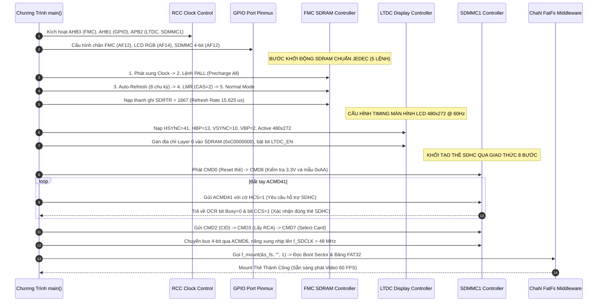
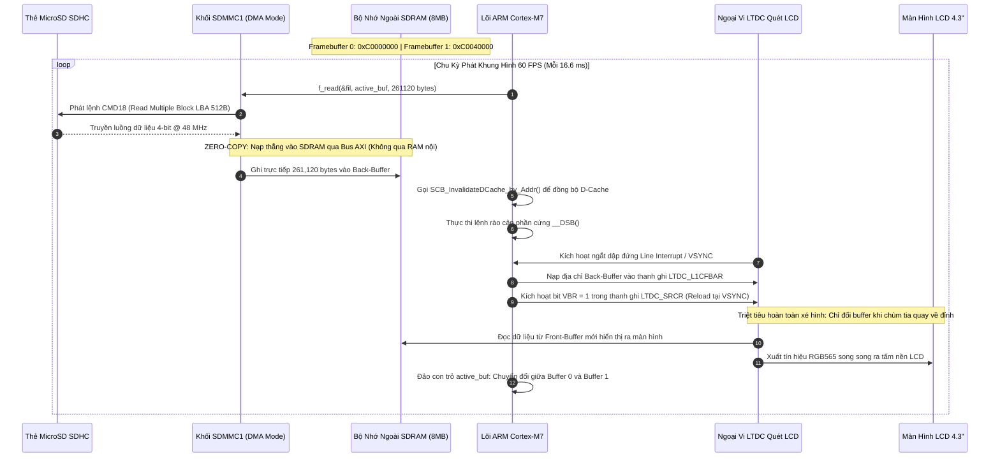
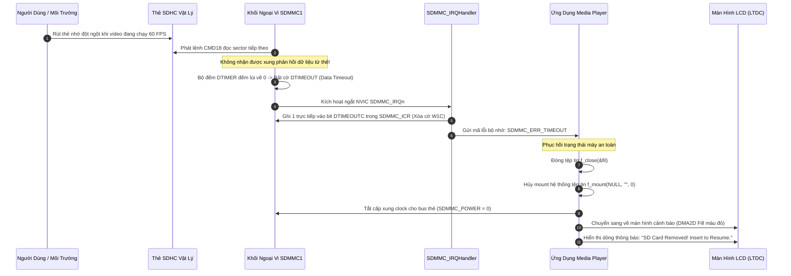

# Cẩm Nang Phỏng Vấn Dự Án 2: High-Speed Video Playback & SDHC Storage Subsystem

> **Hệ Thống:** Bare-Metal High-Speed 60 FPS Video Playback & SDHC Storage Subsystem  
> **Nền Tảng Phần Cứng:** STM32F746NG (ARM Cortex-M7 @ 216 MHz, MPU, L1 Cache 16KB)  
> **Phương Thức Lập Trình:** 100% Bare-Metal Register-Level (Không dùng HAL/LL, lập trình trực tiếp theo RM0385)  
> **Các Khối Ngoại Vi Cốt Lõi:** FMC SDRAM (108 MHz), SDMMC1 (48 MHz), LTDC (480x272 RGB565), DMA2D Chrom-ART, ChaN FatFs (FAT32)  
> **Tài liệu nền tảng tham chiếu:** [`day00_baremetal_foundations.md`](file:///d:/Project/STM32F7/day00_baremetal_foundations.md), [`sdmmc_fatfs_architecture.md`](file:///d:/Project/STM32F7/sdmmc_fatfs_architecture.md), STM32F746 Reference Manual (RM0385).

---

## MỤC LỤC TỔNG QUAN

- [0. DANH MỤC TÀI LIỆU GỐC & HƯỚNG DẪN TRA CỨU RM/DATASHEET (LOOKUP GUIDE)](#0-danh-mục-tài-liệu-gốc--hướng-dẫn-tra-cứu-rmdatasheet-lookup-guide)
  - [0.1. Danh Mục Tài Liệu Gốc Trọng Tâm (Official Documents)](#01-danh-mục-tài-liệu-gốc-trọng-tâm-official-documents)
  - [0.2. Hướng Dẫn Từng Bước Tra Cứu Reference Manual (RM0385)](#02-hướng-dẫn-từng-bước-tra-cứu-reference-manual-rm0385)
  - [0.3. Hướng Dẫn Từng Bước Tra Cứu Datasheet (DS10610) & Ghép Kênh Pinmux](#03-hướng-dẫn-từng-bước-tra-cứu-datasheet-ds10610--ghép-kênh-pinmux)
- [1. TỔNG QUAN HỆ THỐNG & BẢN ĐỒ BUS MATRIX PHẦN CỨNG](#1-tổng-quan-hệ-thống--bản-đồ-bus-matrix-phần-cứng)
  - [1.1. Mục Tiêu Kỹ Thuật & Các Con Số Định Lượng Cốt Lõi](#11-mục-tiêu-kỹ-thuật--các-con-số-định-lượng-cốt-lõi)
  - [1.2. Sơ Đồ Kiến Trúc Ma Trận Bus AXI 64-bit Đa Tầng & Bản Đồ Phân Bổ Vùng Nhớ SDRAM 8MB](#12-sơ-đồ-kiến-trúc-ma-trận-bus-axi-64-bit-đa-tầng--bản-đồ-phân-bổ-vùng-nhớ-sdram-8mb)
- [2. LÝ THUYẾT CỐT LÕI & CÔNG THỨC BẮT BUỘC PHẢI NHỚ](#2-lý-thuyết-cốt-lõi--công-thức-bắt-buộc-phải-nhớ)
  - [2.1. Bài Toán Băng Thông: Phát Video 60 FPS & Timing Quét Màn Hình LCD (LTDC Pixel Clock)](#21-bài-toán-băng-thông-phát-video-60-fps--timing-quét-màn-hình-lcd-ltdc-pixel-clock)
  - [2.2. FMC SDRAM: Chuỗi 5 Lệnh JEDEC, Bảng Thanh Ghi Cấu Hình & Công Thức Tính Refresh Rate Counter](#22-fmc-sdram-chuỗi-5-lệnh-jedec-bảng-thanh-ghi-cấu-hình--công-thức-tính-refresh-rate-counter)
  - [2.3. Chuẩn Hóa MicroSD SDHC: Block Addressing (LBA 512B) & Quy Trình Khởi Tạo 8 Bước SDMMC](#23-chuẩn-hóa-microsd-sdhc-block-addressing-lba-512b--quy-trình-khởi-tạo-8-bước-sdmmc)
  - [2.4. Bản Chất Bất Đồng Bộ L1 D-Cache Coherency Trên Nhân Cortex-M7 & Kiến Trúc Zero-Copy](#24-bản-chất-bất-đồng-bộ-l1-d-cache-coherency-trên-nhân-cortex-m7--kiến-trúc-zero-copy)
  - [2.5. Bản Chất Kiến Trúc Bus AXI vs AHB vs APB & Cơ Chế 5 Kênh Độc Lập](#25-bản-chất-kiến-trúc-bus-axi-vs-ahb-vs-apb--cơ-chế-5-kênh-độc-lập)
- [3. SƠ ĐỒ TUẦN TỰ HOẠT ĐỘNG (MERMAID SEQUENCE DIAGRAMS)](#3-sơ-đồ-tuần-tự-hoạt-động-mermaid-sequence-diagrams)
  - [3.1. Quy Trình Cấu Hình Khởi Động Phần Cứng (Peripheral Init Pipeline)](#31-quy-trình-cấu-hình-khởi-động-phần-cứng-peripheral-init-pipeline)
  - [3.2. Quy Trình Vận Hành Streaming Video Zero-Copy (Runtime Dataflow)](#32-quy-trình-vận-hành-streaming-video-zero-copy-runtime-dataflow)
  - [3.3. Quy Trình Xử Lý Sự Cố Phần Cứng An Toàn (Fault & Recovery Pipeline)](#33-quy-trình-xử-lý-sự-cố-phần-cứng-an-toàn-fault--recovery-pipeline)
- [4. PHÂN LOẠI LỖI THỰC TẾ VÀ ĐẶC THÙ PHẦN CỨNG](#4-phân-loại-lỗi-thực-tế-và-đặc-thù-phần-cứng)
  - [4.1. Nhóm Lỗi Phổ Biến (Common Bugs)](#41-nhóm-lỗi-phổ-biến-common-bugs)
  - [4.2. Nhóm Lỗi Kiến Trúc (Architectural Bugs)](#42-nhóm-lỗi-kiến-trúc-architectural-bugs)
  - [4.3. Nhóm Lỗi Ngoại Lệ và Góc Khuất Phần Cứng (Edge-Case Bugs)](#43-nhóm-lỗi-ngoại-lệ-và-góc-khuất-phần-cứng-edge-case-bugs)
- [5. BỘ CÂU HỎI PHỎNG VẤN & KỊCH BẢN TRẢ LỜI MẪU (FRESHER LEVEL)](#5-bộ-câu-hỏi-phỏng-vấn--kịch-bản-trả-lời-mẫu-fresher-level)

---

# 0. DANH MỤC TÀI LIỆU GỐC & HƯỚNG DẪN TRA CỨU RM/DATASHEET (LOOKUP GUIDE)

### 0.1. Danh Mục Tài Liệu Gốc Trọng Tâm (Official Documents)

| Tên Tài Liệu | Mã Hiệu / Phiên Bản | File Trong Thư Mục Dự Án | Nội Dung Tra Cứu Trọng Tâm |
| :--- | :--- | :--- | :--- |
| **STM32F7 Reference Manual** | `RM0385` (DocID027589 Rev 8) | [`RM.pdf`](file:///d:/Project/STM32F7/RM.pdf) | **Chương 13 (FMC SDRAM):** 5 lệnh JEDEC, thanh ghi `SDCR`, `SDTR`, `SDCMR`, `SDRTR`.<br>**Chương 29 (SDMMC1):** Lệnh CMD/RESP, FIFO, thanh ghi `CLKCR`, `DTIMER`, `STA`.<br>**Chương 18 (LTDC):** Timing màn hình, `SRCR` (VBR reload), `L1CFBAR`.<br>**Chương 19 (DMA2D):** Mode PFC, R2M, Blending. |
| **STM32F746 Datasheet** | `DS10610` (DocID027590 Rev 7) | [`STM32F745XX.PDF`](file:///d:/Project/STM32F7/STM32F745XX.PDF) | **Table 9 (Alternate functions):** Ghép kênh chân FMC (`AF12`), SDMMC1 (`AF12`), LTDC (`AF14`). Giới hạn xung nhịp APB2 tối đa 108 MHz, HCLK 216 MHz. |
| **Chip SDRAM Datasheet** | Micron `MT48LC4M32B2` | Tài liệu hãng Micron | Chu kỳ làm tươi `64 ms / 4096 rows`, CAS Latency 2 chu kỳ, các thông số tRAS, tRP, tRCD. |
| **Chuẩn Thẻ Nhớ SD Physical Layer** | SD Association `Version 4.10` | `Part1_Physical_Layer_Simplified` | Quy trình bắt tay 8 bước, cơ chế Block Addressing LBA 512B của thẻ SDHC (cờ HCS/CCS trong ACMD41 & OCR). |
| **ChaN FatFs Generic File System** | ChaN FatFs Module `R0.12c` | Thư viện nguồn `ff.c` / `diskio.c` | Hàm cầu nối tầng vật lý `disk_initialize`, `disk_read`, `disk_write`, `disk_ioctl` (hỗ trợ `GET_SECTOR_SIZE = 512`). |

---

### 0.2. Hướng Dẫn Từng Bước Tra Cứu Reference Manual (RM0385)

#### Bước 1: Tra cứu Địa chỉ Cơ sở (Base Address) các khối ngoại vi
1. Mở file [`RM.pdf`](file:///d:/Project/STM32F7/RM.pdf).
2. Nhấn `Ctrl + F` tìm: **`Memory map and register boundary addresses`** (Section 2.2.2).
3. Ghi nhận các địa chỉ cơ sở:
   * **FMC Controller:** `0xA0000000` (Thanh ghi điều khiển) | Vùng nhớ SDRAM Bank 1: **`0xC0000000`** (Dung lượng 8MB).
   * **SDMMC1 (APB2):** **`0x40012C00`**.
   * **LTDC (APB2):** **`0x40016800`**.
   * **DMA2D (AHB1):** **`0x4002B000`**.

#### Bước 2: Bảng Thanh Ghi Cốt Lõi Từng Khối Ngoại Vi (Register Map & Offsets)

##### 1. Khối FMC SDRAM (RM0385 Section 13.7):
* `FMC_SDCR1` (Offset `0x140`, Địa chỉ `0xA0000140`): Cấu hình độ rộng bus 32-bit, số bank, CAS Latency = 2, chia nhịp 108 MHz.
* `FMC_SDTR1` (Offset `0x144`, Địa chỉ `0xA0000144`): Nạp thời gian định thời tRCD, tRP, tRAS, tRC.
* `FMC_SDCMR` (Offset `0x150`, Địa chỉ `0xA0000150`): Phát chuỗi 5 lệnh JEDEC (Clock -> PALL -> Auto-Refresh -> LMR -> Normal).
* `FMC_SDRTR` (Offset `0x154`, Địa chỉ `0xA0000154`): Nạp giá trị bộ đếm làm tươi **`1667`**.
* `FMC_SDSR`  (Offset `0x158`, Địa chỉ `0xA0000158`): Polling cờ bận `BUSY = 0` sau mỗi lệnh JEDEC.

##### 2. Khối SDMMC1 (RM0385 Section 29.9):
* `SDMMC_POWER` (Offset `0x00`, Địa chỉ `0x40012C00`): Cấp nguồn bus (bit `PWRCTRL = 11`).
* `SDMMC_CLKCR` (Offset `0x04`, Địa chỉ `0x40012C04`): Chia tần số xung clock (400 kHz -> 48 MHz), chọn bus 4-bit (`WIDBUS`), bật `HWFC_EN`.
* `SDMMC_ARG`   (Offset `0x08`, Địa chỉ `0x40012C08`): Chứa tham số của lệnh CMD (số thứ tự Sector LBA khi đọc thẻ SDHC).
* `SDMMC_CMD`   (Offset `0x0C`, Địa chỉ `0x40012C0C`): Chứa mã lệnh Index (CMD0, CMD8, CMD18...) và loại phản hồi Response.
* `SDMMC_DTIMER`(Offset `0x24`, Địa chỉ `0x40012C24`): Bộ đếm thời gian timeout dữ liệu.
* `SDMMC_DLEN`  (Offset `0x28`, Địa chỉ `0x40012C28`): Số byte dữ liệu cần truyền (261,120 bytes cho 1 frame).
* `SDMMC_DCTRL` (Offset `0x2C`, Địa chỉ `0x40012C2C`): Bật khối truyền dữ liệu `DTEN = 1`, hướng đọc từ thẻ nhớ vào vi điều khiển.
* `SDMMC_STA`   (Offset `0x34`, Địa chỉ `0x40012C34`): Cờ trạng thái phần cứng (`DATAEND`, `DTIMEOUT`, `RXOVERR`).
* `SDMMC_ICR`   (Offset `0x38`, Địa chỉ `0x40012C38`): **Thanh ghi xóa cờ W1C** (Ghi 1 để xóa cờ ngắt).
* `SDMMC_FIFO`  (Offset `0x80`, Địa chỉ `0x40012C80`): Bộ đệm dữ liệu FIFO 32 words.

##### 3. Khối LTDC (RM0385 Section 18.7):
* `LTDC_SSCR`   (Offset `0x08`, Địa chỉ `0x40016808`): Cấu hình độ rộng đồng bộ HSYNC (41) và VSYNC (10).
* `LTDC_BPCR`   (Offset `0x0C`, Địa chỉ `0x4001680C`): Cấu hình Back Porch tích lũy: `HBP` và `VBP`.
* `LTDC_AWCR`   (Offset `0x10`, Địa chỉ `0x40016810`): Cấu hình vùng hoạt động tích lũy (Active Width 480, Active Height 272).
* `LTDC_TWCR`   (Offset `0x14`, Địa chỉ `0x40016814`): Cấu hình tổng chu kỳ quét tích lũy (Total Width 566, Total Height 286).
* `LTDC_SRCR`   (Offset `0x24`, Địa chỉ `0x40016824`): **Ghi bit `VBR = 1` để kích hoạt nạp dập đứng VSYNC Reload chống xé hình**.
* `LTDC_L1CFBAR`(Offset `0xAC`, Địa chỉ `0x400168AC`): Nạp địa chỉ Framebuffer lớp 1 (`0xC0000000` hoặc `0xC0040000`).

---

### 0.3. Hướng Dẫn Từng Bước Tra Cứu Datasheet (DS10610) & Pinmux

1. Mở file [`STM32F745XX.PDF`](file:///d:/Project/STM32F7/STM32F745XX.PDF).
2. Nhấn `Ctrl + F` tìm: **`Table 9. Alternate function mapping`**:
   * **Ngoại vi FMC SDRAM:** Kéo đến cột **`AF12`** -> Tra cứu các chân dữ liệu D0-D31 (PD0, PD1, PD8..10, PD14..15, PE0..1, PE7..15, PF0..5, PF11..15, PG0..2, PG4..5, PG8..10, PG15), chân điều khiển SDCKE0 (PC3), SDCLK (PG8), SDNE0 (PC2), SDNRAS (PF11), SDNCAS (PG15), SDNWE (PC0).
   * **Ngoại vi SDMMC1:** Kéo đến cột **`AF12`** -> Chân SDMMC1_D0 (PC8), D1 (PC9), D2 (PC10), D3 (PC11), CK (PC12), CMD (PD2).
   * **Ngoại vi LTDC:** Kéo đến cột **`AF14`** -> Chân Pixel Clock CLK (PE14), DE (PK7), HSYNC (PI10), VSYNC (PI9), các đường màu R0-R7, G0-G7, B0-B7.

---

# 1. TỔNG QUAN HỆ THỐNG & BẢN ĐỒ BUS MATRIX PHẦN CỨNG

### 1.1. Mục Tiêu Kỹ Thuật & Các Con Số Định Lượng Cốt Lõi

Dự án hiện thực một **Trình Phát Video và Đồ Họa 60 FPS Tốc Độ Cao** chạy trực tiếp trên thanh ghi phần cứng (Bare-Metal) của chip ARM Cortex-M7 STM32F746NG. Hệ thống đọc trực tiếp luồng video nhị phân thô từ thẻ nhớ MicroSD SDHC qua giao thức FAT32, giải phóng dữ liệu theo kiến trúc **Zero-Copy Streaming** vào bộ nhớ ngoài SDRAM 8MB và hiển thị lên màn hình LCD 4.3 inch qua bộ điều khiển LTDC đồng bộ với bộ tăng tốc đồ họa DMA2D Chrom-ART.

| Khối Phần Cứng | Thông Số Vận Hành Định Lượng | Cơ Sở Kỹ Thuật & Vai Trò Trong Dự Án |
| :--- | :--- | :--- |
| **Lõi MCU** | ARM Cortex-M7 @ `216 MHz` | Kích hoạt L1 I-Cache (`16 KB`), D-Cache (`16 KB`), bộ bảo vệ MPU. |
| **Màn hình LCD** | TFT 4.3 inch (`480 x 272`) | Chuẩn màu RGB565 (16-bit, 2 bytes/pixel). Điểm quét pixel clock `f_PCLK ~ 9.0 MHz`. |
| **Bộ nhớ ngoài FMC** | Micron SDRAM 8MB (32-bit bus) | Xung nhịp bus `f_SDCLK = 108 MHz` (từ `f_HCLK / 2`). Chứa Double Framebuffer. |
| **Ngoại vi SDMMC1** | MicroSD SDHC (4GB - 32GB) | Bus 4-bit, xung nhịp `f_SDCLK = 48 MHz` (từ `PLL48CLK`), đọc thực tế `~ 18 MB/s`. |
| **Băng thông Video** | `15.66 MB/s` liên tục | Phát liên tục 60 FPS chuẩn không giật lag (`18 MB/s > 15.66 MB/s`). |
| **Tải chiếm dụng CPU** | `~ 0%` khi phát video | Nhờ kiến trúc Zero-Copy đọc thẳng từ SDMMC nạp vào SDRAM ngoài và LTDC tự quét. |
| **Hiện tượng xé hình** | Triệt tiêu hoàn toàn (`0 tearing`) | Kỹ thuật Double Framebuffer kết hợp đồng bộ ngắt dập đứng `VSYNC` (`VBR` bit). |

---

### 1.2. Sơ Đồ Kiến Trúc Ma Trận Bus AXI 64-bit Đa Tầng & Bản Đồ Phân Bổ Vùng Nhớ SDRAM 8MB

Trên STM32F746, ma trận Bus AXI 64-bit liên kết nhiều Master với nhiều Slave độc lập, cho phép **truy xuất đồng thời (Concurrent Access)** giữa các khối ngoại vi mà không làm nghẽn lõi CPU:

```text
┌──────────────────────────────────────────────────────────────────────────────────────────────────┐
│                               MA TRẬN BUS AXI 64-BIT ĐA TẦNG (STM32F746)                        │
│                                                                                                  │
│   ┌────────────────────────┐  ┌────────────────────────┐  ┌──────────────────────────────────┐   │
│   │  Cortex-M7 Core CPU    │  │   LTDC Display Master  │  │      DMA2D Chrom-ART Master      │   │
│   │  (Master M0: D-Cache)  │  │   (Master M3: LCD FIFO)│  │      (Master M4: Graphics)       │   │
│   └───────────┬────────────┘  └───────────┬────────────┘  └────────────────┬─────────────────┘   │
│               │                           │                                │                     │
│   ════════════╪═══════════════════════════╪════════════════════════════════╪════════════════    │
│               │                           │                                │  AXI CROSSBAR MATRIX
│               ▼                           ▼                                ▼                     │
│   ┌──────────────────────────────────────────────────────────────────────────────────────────┐   │
│   │            BỘ ĐIỀU KHIỂN BỘ NHỚ NGOÀI FMC (Flexible Memory Controller - Slave S3)        │   │
│   │            - Địa chỉ vật lý cơ sở SDRAM Bank 1: 0xC0000000 (Dung lượng 8MB, 32-bit Bus)  │   │
│   └───────────────────────────────────────────┬──────────────────────────────────────────────┘   │
│                                               ▼                                                  │
│   ┌──────────────────────────────────────────────────────────────────────────────────────────┐   │
│   │                        BẢN ĐỒ BỘ NHỚ CHI TIẾT CỦA CHIP SDRAM 8MB                         │   │
│   │  • 0xC0000000 -> 0xC003FFFF (256 KB): Framebuffer 0 (Front-Buffer: 480x272 RGB565)       │   │
│   │  • 0xC0040000 -> 0xC007FFFF (256 KB): Framebuffer 1 (Back-Buffer: 480x272 RGB565)        │   │
│   │  • 0xC0080000 -> 0xC01FFFFF (1.5 MB): Sprite Sheet, Font chữ & Asset đồ họa tĩnh        │   │
│   │  • 0xC0200000 -> 0xC07FFFFF (6.0 MB): Bộ đệm DMA2D Blending & Vùng nhớ ứng dụng mở rộng  │   │
│   └──────────────────────────────────────────────────────────────────────────────────────────┘   │
│                                                                                                  │
│   ═══════════════════════════════════════════════════════════════════════════════════════════    │
│               ▲                                                              ▲                   │
│               │ Cầu nối AHB-to-APB2                                          │ Cầu nối AHB-to-APB2
│   ┌───────────┴────────────────────────┐                         ┌───────────┴───────────────┐   │
│   │ Ngoại vi SDMMC1 (Base: 0x40012C00) │                         │ Ngoại vi LTDC Controller  │   │
│   │ - Bus APB2 @ 108 MHz / 48 MHz Clk  │                         │ (Base: 0x40016800)        │   │
│   └────────────────────────────────────┘                         └───────────────────────────┘   │
└──────────────────────────────────────────────────────────────────────────────────────────────────┘
```

---

# 2. LÝ THUYẾT CỐT LÕI & CÔNG THỨC BẮT BUỘC PHẢI NHỚ

### 2.1. Bài Toán Băng Thông: Phát Video 60 FPS & Timing Quét Màn Hình LCD (LTDC Pixel Clock)

Để hệ thống phát video 60 FPS mượt mà không bị xé hình, chớp tắt hay nghẽn bus, ta cần cân bằng chính xác bài toán băng thông trên cả ba chặng: **Nạp dữ liệu từ thẻ nhớ (SDMMC)**, **Bộ nhớ đệm trung gian (SDRAM)** và **Quét hiển thị ra tấm nền LCD (LTDC)**.

#### A. Bài toán nạp Video 60 FPS từ Thẻ Nhớ SDHC:
* **Kích thước khung hình LCD 4.3 inch:** $480 \times 272 = 130,560\text{ pixels}$.
* **Định dạng màu RGB565:** Mỗi điểm ảnh chiếm 16-bit ($2\text{ bytes}$).
* **Dung lượng 1 khung hình (Frame Size):**
  $$\text{Frame Size} = 130,560\text{ pixels} \times 2\text{ bytes} = 261,120\text{ bytes} \approx \mathbf{255\text{ KB}}$$
* **Băng thông nạp liên tục tối thiểu để đạt 60 FPS:**
  $$\text{Băng thông yêu cầu} = 261,120\text{ bytes} \times 60\text{ frames/s} = 15,667,200\text{ bytes/s} \approx \mathbf{15.66\text{ MB/s}}$$
* **Năng lực truyền dẫn phần cứng của SDMMC1 trên STM32F7:**
  * Khối ngoại vi sử dụng xung nhịp cấp chuyên dụng $f_{SDCLK} = 48\text{ MHz}$ (từ khối `PLL48CLK`).
  * Giao tiếp qua bus dữ liệu **4-bit** song song:
    $$\text{Băng thông lý thuyết cực đại} = \frac{48\text{ MHz} \times 4\text{ bits}}{8} = 192\text{ Mbps} = \mathbf{24.0\text{ MB/s}}$$
  * Tốc độ đọc tuần tự thực đo của thẻ SDHC Class 10 / UHS-I qua ChaN FatFs đạt **$\approx 18.0\text{ MB/s}$**.
  * So sánh: $18.0\text{ MB/s} > 15.66\text{ MB/s}$ $\implies$ Băng thông đường truyền dư $15\%$, đảm bảo video chạy mượt mà không bao giờ bị đói dữ liệu (Buffer Underrun).

#### B. Bài toán Timing quét màn hình LCD (LTDC Pixel Clock):
Một chu kỳ quét toàn bộ màn hình 480x272 ở tần số làm tươi $60\text{ Hz}$ đòi hỏi phải cấu hình các khoảng dập xung ngang (Horizontal Blanking) và dập xung dọc (Vertical Blanking) để tấm nền tinh thể lỏng LCD kịp ổn định điện áp từng điểm ảnh:
* **Thông số quét ngang (Horizontal Timings theo Datasheet màn hình Rocktech RK043FN48H):**
  * `HSYNC (Độ rộng xung đồng bộ ngang)` = 41 pixels.
  * `HBP (Horizontal Back Porch)` = 13 pixels.
  * `Active Width (Vùng hiển thị hoạt động)` = 480 pixels.
  * `HFP (Horizontal Front Porch)` = 32 pixels.
  * **Tổng chu kỳ quét 1 dòng:**
    $$H_{TOTAL} = 41 + 13 + 480 + 32 = \mathbf{566\text{ pixels}}$$
* **Thông số quét dọc (Vertical Timings):**
  * `VSYNC (Độ rộng xung đồng bộ dọc)` = 10 lines.
  * `VBP (Vertical Back Porch)` = 2 lines.
  * `Active Height (Vùng hiển thị hoạt động)` = 272 lines.
  * `VFP (Vertical Front Porch)` = 2 lines.
  * **Tổng chu kỳ quét 1 khung hình:**
    $$V_{TOTAL} = 10 + 2 + 272 + 2 = \mathbf{286\text{ lines}}$$
* **Tần số xung nhịp điểm ảnh Pixel Clock ($f_{PCLK}$):**
  $$f_{PCLK} = H_{TOTAL} \times V_{TOTAL} \times \text{Tần số làm tươi} = 566\text{ pixels} \times 286\text{ lines} \times 60\text{ Hz} = 9,712,560\text{ Hz} \approx \mathbf{9.71\text{ MHz}}$$
  *(Cấu hình nguồn xung `PLLSAI` trên STM32F7 để chia ra xung nhịp $f_{PCLK} \approx 9.6\text{ MHz} - 9.7\text{ MHz}$).*
* **Băng thông kéo dữ liệu liên tục của LTDC từ SDRAM:**
  $$\text{Băng thông LTDC} = 9.71\text{ MHz} \times 2\text{ bytes/pixel} \approx \mathbf{19.42\text{ MB/s}}$$

#### C. Năng lực đáp ứng của bộ nhớ ngoài SDRAM 32-bit @ 108 MHz:
* Bus dữ liệu ngoài 32-bit chạy ở tần số $f_{SDCLK} = f_{HCLK} / 2 = 216\text{ MHz} / 2 = 108\text{ MHz}$.
* Băng thông cực đại lý thuyết của SDRAM:
  $$\text{Băng thông cực đại SDRAM} = 108\text{ MHz} \times 4\text{ bytes (32-bit)} = \mathbf{432.0\text{ MB/s}}$$
* **Tổng băng thông hệ thống cần lúc cao điểm (Worst-Case Peak Load):**
  $$\text{Tổng Băng Thông} = 19.42\text{ MB/s (LTDC đọc)} + 15.66\text{ MB/s (SDMMC nạp)} + 20.0\text{ MB/s (DMA2D Blend)} \approx \mathbf{55.08\text{ MB/s}}$$
  * *Nguồn gốc của con số 20.0 MB/s (DMA2D Blend):* Khi bộ tăng tốc Chrom-ART hòa trộn một lớp giao diện (UI / On-Screen Display như thanh thời lượng, subtitle) chiếm 40% màn hình ở 60 FPS, mỗi điểm ảnh cần 3 lượt truy xuất bus (2 bytes đọc Foreground + 2 bytes đọc Background + 2 bytes ghi Destination = 6 bytes/pixel). Diện tích $480 \times 115 \times 6\text{ bytes} \times 60\text{ fps} \approx 19.87\text{ MB/s} \approx 20\text{ MB/s}$.
  * **Tỷ lệ chiếm dụng bus SDRAM:**
    $$\text{Bus Utilization} = \frac{55.08\text{ MB/s}}{432.0\text{ MB/s}} \approx \mathbf{12.7\%}$$
    Con số này chỉ chiếm khoảng 12.7% năng lực bus của SDRAM, chứng minh tuyệt đối không bao giờ xảy ra hiện tượng nghẽn bus!

#### Dẫn chứng mã nguồn thực tế trong dự án:
Cấu hình thanh ghi định thời màn hình LTDC (RM0385 Section 18.7):
```c
/* 1. Cấu hình độ rộng xung đồng bộ HSYNC và VSYNC (Thanh ghi tích lũy SSCR) */
LTDC->SSCR = ((41U - 1) << 16) |  /* HSW[11:0] = 40 (41 pixels HSYNC) */
             ((10U - 1) << 0);    /* VSH[10:0] = 9  (10 lines VSYNC) */

/* 2. Cấu hình Back Porch tích lũy (BPCR = Sync + Back Porch) */
LTDC->BPCR = ((41U + 13U - 1) << 16) |  /* AHBP = 53 */
             ((10U + 2U  - 1) << 0);    /* AVBP = 11 */

/* 3. Cấu hình Vùng hiển thị tích lũy (AWCR = Sync + BP + Active) */
LTDC->AWCR = ((41U + 13U + 480U - 1) << 16) |  /* AAW = 533 */
             ((10U + 2U  + 272U - 1) << 0);    /* AAH = 283 */

/* 4. Cấu hình Tổng chu kỳ quét tích lũy (TWCR = Sync + BP + Active + FP) */
LTDC->TWCR = ((41U + 13U + 480U + 32U - 1) << 16) |  /* TOTALW = 565 (566 pixels) */
             ((10U + 2U  + 272U + 2U  - 1) << 0);    /* TOTALH = 285 (286 lines) */

/* 5. Đặt màu nền mặc định khi không có dữ liệu (BCCR: Đen tuyền) */
LTDC->BCCR = 0x00000000;
```

---

### 2.2. FMC SDRAM: Chuỗi 5 Lệnh JEDEC, Bảng Thanh Ghi Cấu Hình & Công Thức Tính Refresh Rate Counter

Khối ngoại vi điều khiển bộ nhớ FMC (Flexible Memory Controller) trên STM32F7 không thể tự động kích hoạt chip SDRAM ngoài khi cấp nguồn. Do cấu tạo bên trong SDRAM là các tụ điện động cần được định hình điện tích ban đầu, tiêu chuẩn công nghiệp **JEDEC** quy định CPU bắt buộc phải phát chuỗi 5 lệnh điều khiển tuần tự thông qua thanh ghi `FMC_SDCMR`.

#### A. Chuỗi 5 Lệnh Khởi Động Bắt Buộc Theo Chuẩn JEDEC (RM0385 Section 13.7.4):
1. **Clock Configuration Enable:** Bật bộ phát xung cấp nhịp `f_SDCLK = 108 MHz` cho SDRAM (Lệnh `SDCMR[2:0] = 001`).
2. **PALL (Precharge All):** Đưa toàn bộ 4 banks nội của SDRAM về trạng thái nghỉ ban đầu (Lệnh `SDCMR[2:0] = 010`).
3. **Auto-Refresh Command:** Phát liên tiếp ít nhất **8 chu kỳ Auto-Refresh** để định hình điện tích cho các tụ điện lưu trữ cell nhớ (Lệnh `SDCMR[2:0] = 011`, nạp số chu kỳ `NRFS[3:0] = 7` tương đương 8 lần).
4. **Load Mode Register (LMR):** Nạp thanh ghi cấu hình nội của chip SDRAM thông qua trường `MRD[12:0]` (Lệnh `SDCMR[2:0] = 100`):
   - Đặt Burst Length = 1.
   - Burst Type = Sequential.
   - **CAS Latency = 2 chu kỳ clock** (Độ trễ từ khi phát lệnh đọc đến khi dữ liệu xuất hiện trên bus là $2 \times 9.26\text{ ns} = 18.52\text{ ns}$).
   - Write Burst Mode = Single Bit.
5. **Normal Mode:** Đưa chip SDRAM vào trạng thái vận hành bình thường sẵn sàng đọc/ghi (Lệnh `SDCMR[2:0] = 000`).

#### B. Các Tham Số Định Thời Trong Thanh Ghi FMC_SDCR1 & FMC_SDTR1:
* **Thanh ghi điều khiển `FMC_SDCR1` (RM0385 Section 13.7.1):**
  * `NC[1:0] = 00`: 8 bit địa chỉ cột (Column Address Bits -> 256 columns).
  * `NR[1:0] = 01`: 12 bit địa chỉ hàng (Row Address Bits -> 4,096 rows).
  * `MWID[1:0] = 10`: Độ rộng bus dữ liệu **32-bit**.
  * `NB = 1`: **4 internal memory banks**.
  * `CAS[1:0] = 10`: **CAS Latency = 2 clock cycles**.
  * `SDCLK[1:0] = 10`: Xung nhịp bus SDRAM = $f_{HCLK} / 2 = 216\text{ MHz} / 2 = \mathbf{108\text{ MHz}}$.
* **Thanh ghi định thời `FMC_SDTR1` (Tính theo chu kỳ clock $t_{CK} = 9.26\text{ ns}$):**
  * `TMRD = 2`: Load Mode Register to Active delay.
  * `TXSR = 7`: Exit Self-refresh delay.
  * `TRAS = 4`: Self refresh time.
  * `TRC = 7`: Row cycle delay.
  * `TWR = 2`: Write recovery time.
  * `TRP = 2`: Row precharge delay.
  * `TRCD = 2`: Row to column delay.

#### C. Công Thức Tính Thanh Ghi Tốc Độ Làm Tươi (FMC_SDRTR):
Chip SDRAM Micron `MT48LC4M32B2` có **$4,096\text{ rows}$** và yêu cầu phải được làm tươi toàn bộ trong khoảng thời gian $T_{REFRESH} = 64\text{ ms}$.
1. **Thời gian làm tươi cho từng dòng riêng biệt:**
   $$t_{ROW\_REFRESH} = \frac{64\text{ ms}}{4,096\text{ rows}} = 15.625\text{ µs}$$
2. **Tần số xung nhịp bus SDRAM:**
   $$f_{SDCLK} = \frac{f_{HCLK}}{2} = \frac{216\text{ MHz}}{2} = 108\text{ MHz}$$
3. **Chu kỳ 1 xung nhịp bus SDRAM:**
   $$t_{CK} = \frac{1}{108\text{ MHz}} \approx 9.26\text{ ns}$$
4. **Công thức nạp thanh ghi FMC_SDRTR theo Reference Manual RM0385 (Section 13.7.5):**
   $$\text{COUNT} = (t_{ROW\_REFRESH} \times f_{SDCLK}) - 20$$
   $$\text{COUNT} = (15.625\text{ µs} \times 108\text{ MHz}) - 20 = 1,687.5 - 20 = \mathbf{1667.5} \implies \text{Nạp giá trị } \mathbf{1667}$$
   *(Số 20 là hệ số chu kỳ dự phòng an toàn theo khuyến nghị của hãng ST).*

#### Dẫn chứng mã nguồn thực tế trong dự án:
Khởi tạo cấu hình và chuỗi lệnh JEDEC trong driver FMC Bare-Metal:
```c
void FMC_SDRAM_Init(void)
{
    /* 1. Cấu hình thanh ghi điều khiển SDCR1: Bus 32-bit, 4 banks, CAS=2, Clock /2 */
    FMC_Bank5_6->SDCR[0] = (0U << 0)  |  /* NC[1:0] = 00b (8 column bits) */
                           (1U << 2)  |  /* NR[1:0] = 01b (12 row bits) */
                           (2U << 4)  |  /* MWID[1:0] = 10b (32-bit data bus) */
                           (1U << 6)  |  /* NB = 1 (4 internal banks) */
                           (2U << 7)  |  /* CAS[1:0] = 10b (CAS Latency = 2) */
                           (2U << 10) |  /* SDCLK[1:0] = 10b (f_HCLK / 2 = 108 MHz) */
                           (1U << 12);   /* RBURST = 1 (Read burst enable) */

    /* 2. Cấu hình định thời SDTR1 */
    FMC_Bank5_6->SDTR[0] = ((2U - 1) << 0)  |  /* TMRD = 2 */
                           ((7U - 1) << 4)  |  /* TXSR = 7 */
                           ((4U - 1) << 8)  |  /* TRAS = 4 */
                           ((7U - 1) << 12) |  /* TRC  = 7 */
                           ((2U - 1) << 16) |  /* TWR  = 2 */
                           ((2U - 1) << 20) |  /* TRP  = 2 */
                           ((2U - 1) << 24);   /* TRCD = 2 */

    /* 3. Chuỗi 5 lệnh JEDEC qua SDCMR: */
    /* Lệnh 1: Clock Config Enable */
    FMC_Bank5_6->SDCMR = (1U << 0) | (1U << 4); /* MODE = 001b, CTB1 = 1 */
    while (FMC_Bank5_6->SDSR & (1U << 5));      /* Chờ BUSY = 0 */
    Delay_us(100);

    /* Lệnh 2: Precharge All */
    FMC_Bank5_6->SDCMR = (2U << 0) | (1U << 4); /* MODE = 010b, CTB1 = 1 */
    while (FMC_Bank5_6->SDSR & (1U << 5));

    /* Lệnh 3: Auto-Refresh 8 chu kỳ */
    FMC_Bank5_6->SDCMR = (3U << 0) | (1U << 4) | (7U << 5); /* MODE = 011b, NRFS = 7 (8 lần) */
    while (FMC_Bank5_6->SDSR & (1U << 5));

    /* Lệnh 4: Load Mode Register (CAS=2, Burst=1) */
    #define SDRAM_MODEREG_BURST_LENGTH_1             ((uint16_t)0x0000)
    #define SDRAM_MODEREG_BURST_TYPE_SEQUENTIAL      ((uint16_t)0x0000)
    #define SDRAM_MODEREG_CAS_LATENCY_2              ((uint16_t)0x0020)
    #define SDRAM_MODEREG_WRITEBURST_MODE_SINGLE     ((uint16_t)0x0200)
    uint32_t mode_reg = SDRAM_MODEREG_BURST_LENGTH_1 | SDRAM_MODEREG_BURST_TYPE_SEQUENTIAL |
                        SDRAM_MODEREG_CAS_LATENCY_2  | SDRAM_MODEREG_WRITEBURST_MODE_SINGLE;

    FMC_Bank5_6->SDCMR = (4U << 0) | (1U << 4) | (mode_reg << 9); /* MODE = 100b */
    while (FMC_Bank5_6->SDSR & (1U << 5));

    /* 4. Nạp bộ đếm Refresh Rate 1667 */
    FMC_Bank5_6->SDRTR = (1667U << 1); /* Nạp COUNT[13:0] */
}
```

---

### 2.3. Chuẩn Hóa MicroSD SDHC: Block Addressing (LBA 512B) & Quy Trình Khởi Tạo 8 Bước SDMMC

| Tiêu Chí So Sánh | Thẻ SDSC Cũ ($\le 2\text{ GB}$) | Thẻ Chuẩn Hóa SDHC ($4\text{ GB} - 32\text{ GB}$) |
| :--- | :--- | :--- |
| **Cơ chế định chỉ** | **Byte Addressing** | **Block Addressing (LBA 512 Bytes)** |
| **Tham số lệnh CMD17/18** | Địa chỉ Byte tuyệt đối ($\text{LBA} \times 512$) | Số thứ tự Block/Sector nguyên bản ($\text{LBA}$) |
| **Giới hạn 32-bit Address** | Bị kịch trần tại $2^{32} = 4\text{ GB}$ (Thực tế chỉ dùng $\le 2\text{ GB}$). | Quản lý tới $2^{32}\text{ blocks} \times 512\text{ B} = \mathbf{2\text{ TB}}$. |
| **Khởi tạo ACMD41** | Bit `HCS = 0` | **Bit `HCS = 1` (Host Capacity Support)** |
| **Cờ kiểm tra OCR** | Bit `CCS = 0` | **Bit `CCS = 1` (Card Capacity Status)** |

#### Giải thích cặn kẽ các con số định lượng trong quy trình 8 bước khởi tạo:
* **$f_{SDCLK\_init} = 400\text{ kHz}$:** Giai đoạn nhận dạng thẻ (Identification Phase) bắt buộc phát xung chậm $400\text{ kHz}$ để tương thích dải điện áp và mọi dòng thẻ cũ khi mới cấp nguồn.
* **Mẫu kiểm tra `0x000001AA` trong CMD8:**
  * Bit `[11:8] = 0001b` ($1\text{h}$): Báo hiệu dải điện áp làm việc $2.7\text{V} - 3.6V$.
  * Bit `[7:0] = 0xAA`: Check Pattern (Mẫu thử đối xứng). Thẻ SD 2.0+ bắt buộc trả về đúng `0xAA` để chứng minh đường truyền dữ liệu không bị đảo bit.
* **Tham số `0x40100000` trong ACMD41:**
  * Bit 30 (`HCS = 1`): Host Capacity Support (Báo cho thẻ biết vi điều khiển hỗ trợ chế độ dung lượng cao SDHC).
  * Bit 20 (`VDD = 1`): Yêu cầu dải điện áp hoạt động $3.2\text{V} - 3.4\text{V}$.
* **$f_{SDCLK\_data} = 48\text{ MHz}$:** Sau khi chọn thẻ thành công qua lệnh CMD7 và chuyển sang bus 4-bit qua ACMD6, tần số xung nhịp được nâng lên tốc độ tối đa $48\text{ MHz}$ để đạt băng thông $24\text{ MB/s}$.

#### Dẫn chứng mã nguồn thực tế trong dự án:
Khởi tạo và đọc thẻ SDHC qua lệnh CMD18 trong driver SDMMC:
```c
/* Hàm phát lệnh CMD18 đọc luồng dữ liệu 510 sectors (261,120 bytes) */
uint8_t SDMMC_ReadMultipleBlocks(uint32_t sector_lba, uint8_t *dest_buf, uint32_t block_count)
{
    /* 1. Thiết lập thanh ghi độ dài dữ liệu và thời gian timeout */
    SDMMC1->DTIMER = 0xFFFFFFFF;
    SDMMC1->DLEN   = block_count * 512;
    SDMMC1->DCTRL  = (9U << 4) | (1U << 1) | (1U << 0); /* 512B Block, Hướng đọc, DTEN = 1 */

    /* 2. Phát lệnh CMD18: READ_MULTIPLE_BLOCK */
    SDMMC1->ARG = sector_lba; /* Thẻ SDHC: Truyền thẳng số thứ tự sector LBA */
    SDMMC1->CMD = (18U << 0) | (1U << 6) | (1U << 10); /* CMD18, Short Resp, CPSMEN = 1 */

    /* Chờ phản hồi lệnh CMD18 */
    while (!(SDMMC1->STA & ((1U << 6) | (1U << 0) | (1U << 2))));
    if (SDMMC1->STA & ((1U << 0) | (1U << 2))) return 1; /* Lỗi Timeout/CRC */
    SDMMC1->ICR = 0xFFFFFFFF; /* Xóa cờ W1C */

    /* 3. Đọc dữ liệu từ FIFO nạp thẳng vào SDRAM */
    uint32_t *p_dest = (uint32_t *)dest_buf;
    uint32_t words_to_read = (block_count * 512) / 4;
    for (uint32_t i = 0; i < words_to_read; i += 8) {
        while (!(SDMMC1->STA & (1U << 15))); /* Chờ FIFO có ít nhất 8 words */
        p_dest[0] = SDMMC1->FIFO; p_dest[1] = SDMMC1->FIFO;
        p_dest[2] = SDMMC1->FIFO; p_dest[3] = SDMMC1->FIFO;
        p_dest[4] = SDMMC1->FIFO; p_dest[5] = SDMMC1->FIFO;
        p_dest[6] = SDMMC1->FIFO; p_dest[7] = SDMMC1->FIFO;
        p_dest += 8;
    }

    /* 4. Phát lệnh CMD12 dừng truyền luồng */
    SDMMC1->ARG = 0;
    SDMMC1->CMD = (12U << 0) | (1U << 6) | (1U << 10);
    while (!(SDMMC1->STA & (1U << 6)));
    SDMMC1->ICR = 0xFFFFFFFF;

    return 0;
}
```

---

### 2.4. Bản Chất Bất Đồng Bộ L1 D-Cache Coherency Trên Nhân Cortex-M7 & Kiến Trúc Zero-Copy

Nhân ARM Cortex-M7 tích hợp hai khối bộ đệm L1 riêng biệt:
* **I-Cache (Instruction Cache):** $16\text{ KB}$, bộ đệm lệnh nạp từ Flash/RAM.
* **D-Cache (Data Cache):** $16\text{ KB}$, tổ chức thành các dòng **Cache Line dài đúng 32 bytes**.

#### Nguyên nhân gây ra lỗi vỡ hình D-Cache Coherency:
* Trong kiến trúc máy tính, ngoại vi SDMMC là một **AXI Bus Master độc lập**. Khi đọc dữ liệu từ thẻ nhớ, DMA của SDMMC đẩy các khối byte trực tiếp qua ma trận Bus AXI vào thẳng chip nhớ SDRAM ngoài (`0xC0000000`) mà **hoàn toàn không đi qua lõi CPU**.
* Trong khi đó, L1 D-Cache nằm gắn liền bên trong lõi CPU. Nếu trước thời điểm DMA nạp dữ liệu, CPU đã từng truy cập vào vùng nhớ này, các ô nhớ cũ vẫn đang được lưu giữ trong L1 D-Cache.
* Khi ứng dụng hoặc khối hiển thị đọc lại vùng Framebuffer, CPU lấy dữ liệu cũ từ D-Cache thay vì nạp dữ liệu mới từ SDRAM ngoài, khiến cho khung hình hiển thị bị vỡ vụn, các đường sọc ngang xuất hiện và hình ảnh bị giật lùi về quá khứ!

#### Giải thích cặn kẽ các con số định lượng trong quy trình 3 bước xử lý:
* **Kích thước dòng Cache Line:** Đúng **32 bytes**. Mọi thao tác hủy hiệu lực Cache (Invalidate) đều tác động trên toàn bộ khối 32 bytes.
* **Số dòng Cache cần hủy hiệu lực trên 1 frame:**
  $$\text{Số Cache Lines} = \frac{261,120\text{ bytes}}{32\text{ bytes}} = \mathbf{8,160\text{ Cache Lines}}$$
* **Thuộc tính `aligned(32)`:** Nếu địa chỉ bộ đệm không chia hết cho 32, dòng Cache đầu tiên và dòng Cache cuối cùng sẽ bao trùm cả các biến quản lý nằm liền kề. Thao tác Invalidate sẽ xóa sạch dữ liệu của các biến này, gây lỗi sập hệ thống (HardFault / Memory Corruption).

#### Dẫn chứng mã nguồn thực tế trong dự án:
```c
/* Bước 1: Căn lề bộ đệm đúng 32 bytes boundary */
__attribute__((aligned(32))) static uint8_t s_frame_buffer[261120];

/* Bước 2: Hủy hiệu lực 8,160 dòng D-Cache ứng với dải địa chỉ Framebuffer */
SCB_InvalidateDCache_by_Addr((uint32_t *)frame_addr, LCD_FRAME_SIZE);

/* Bước 3: Rào cản đồng bộ bộ nhớ phần cứng (Data Synchronization Barrier) */
__asm volatile ("dsb 0xF" ::: "memory");
```
* **Chỉ thị `DSB 0xF`:** Đảm bảo toàn bộ các giao dịch bus bộ nhớ trong đường ống (Store Buffers và AXI Pipeline) đã hoàn tất 100% trước khi câu lệnh tiếp theo được phép thực thi.

---

### 2.5. Bản Chất Kiến Trúc Bus AXI vs AHB vs APB & Cơ Chế 5 Kênh Độc Lập

Trong kiến trúc chip ARM Cortex-M, hệ thống bus truyền dẫn thuộc họ **AMBA (Advanced Microcontroller Bus Architecture)** được tổ chức phân cấp rõ rệt:

#### A. So Sánh 3 Chuẩn Bus: APB vs AHB vs AXI:

| Tiêu Chí So Sánh | **APB (Peripheral Bus)** | **AHB (High-performance Bus)** | **AXI (eXtensible Interface)** |
| :--- | :--- | :--- | :--- |
| **Phân cấp tầng** | Tầng thấp nhất (Ngoại vi chậm) | Tầng trung gian (DMA, SRAM nội) | **Tầng cao nhất (CPU Cache, SDRAM, LCD)** |
| **Độ rộng Bus** | 16-bit hoặc 32-bit | 32-bit | **64-bit** (Băng thông gấp đôi AHB) |
| **Cơ chế đọc/ghi** | Bán song công (Half-Duplex) | Bán song công (Chia sẻ đường truyền) | **Song công toàn phần (Full-Duplex): Đọc & Ghi đồng thời** |
| **Kiểu truyền** | Từng từ đơn lẻ, có chu kỳ chờ | Đường ống (Pipelined), truyền Burst | **5 Kênh truyền tín hiệu hoàn toàn độc lập** |
| **Tốc độ xung nhịp** | Max 54 MHz (APB1) / 108 MHz (APB2) | Max 216 MHz (HCLK) | **Max 216 MHz (HCLK)** |
| **Ngoại vi tiêu biểu**| UART, I2C, SPI, CAN, Timer | SDMMC1, USB, SRAM1/2 nội | **Cortex-M7, FMC SDRAM, LTDC, DMA2D** |

#### B. Cơ Chế 5 Kênh Tín Hiệu Độc Lập Của AXI Bus:
Trong khi AHB bắt mọi giao dịch đọc và ghi phải tuần tự chen chúc nhau trên cùng một cặp bus địa chỉ/dữ liệu, AXI chia thành **5 kênh vật lý độc lập**:
1. **AR (Read Address Channel):** Master gửi địa chỉ và thông tin điều khiển muốn đọc.
2. **R (Read Data Channel):** Slave gửi dữ liệu đọc được về cho Master (kèm tín hiệu kết thúc `RLAST`).
3. **AW (Write Address Channel):** Master gửi địa chỉ và thông tin điều khiển muốn ghi.
4. **W (Write Data Channel):** Master đẩy luồng dữ liệu cần ghi sang Slave (kèm tín hiệu `WLAST`).
5. **B (Write Response Channel):** Slave phản hồi xác nhận ghi thành công (`BRESP`).

```text
MASTER (CPU / LTDC / DMA2D)                                  SLAVE (FMC SDRAM / Flash)
┌────────────────────────────────┐                           ┌─────────────────────────────┐
│ 1. Read Address Channel (AR)   │ ═════════════════════════►│ Gửi địa chỉ cần đọc         │
│ 2. Read Data Channel (R)       │ ◄═════════════════════════│ Đẩy dữ liệu đọc về          │
│                                │                           │                             │
│ 3. Write Address Channel (AW)  │ ═════════════════════════►│ Gửi địa chỉ cần ghi         │
│ 4. Write Data Channel (W)      │ ═════════════════════════►│ Đẩy dữ liệu cần ghi         │
│ 5. Write Response Channel (B)  │ ◄═════════════════════════│ Phản hồi ghi thành công (OK)│
└────────────────────────────────┘                           └─────────────────────────────┘
```

#### C. Hai Tính Năng Đột Phá Khác Của AXI:
* **Multiple Outstanding Addresses:** Master có thể phát liên tiếp nhiều yêu cầu đọc trước mà không cần chờ dữ liệu của yêu cầu đầu tiên trả về, giúp triệt tiêu độ trễ nạp dòng CAS của chip nhớ ngoài SDRAM.
* **Out-of-Order Completion:** Mỗi gói tin đều gắn thẻ Transaction ID (`ARID`, `RID`). Các Slave nhanh (như SRAM nội) có thể trả kết quả trước các Slave chậm (như SDRAM ngoài) mà không gây tắc nghẽn hàng đợi (Head-of-Line Blocking).
* **Ứng dụng trong dự án:** Khối LTDC liên tục kéo luồng hiển thị qua kênh đọc AXI ($19.4\text{ MB/s}$), trong khi DMA của SDMMC đẩy khung hình mới qua kênh ghi AXI ($15.66\text{ MB/s}$) vào SDRAM ngoài cùng một lúc mà không hề gây xung đột bus hay làm treo nhân Cortex-M7.

---

# 3. SƠ ĐỒ TUẦN TỰ HOẠT ĐỘNG (MERMAID SEQUENCE DIAGRAMS)

### 3.1. Quy Trình Cấu Hình Khởi Động Phần Cứng (Peripheral Init Pipeline)



#### Diễn giải chi tiết từng bước khởi động phần cứng:

1. **Kích hoạt xung nhịp RCC cho toàn bộ khối ngoại vi:**
   - Kích hoạt bus AHB3 (`RCC_AHB3ENR` bit `FMCEN = 1`) để cấp xung cho bộ điều khiển bộ nhớ ngoài FMC vận hành tại $108\text{ MHz}$ ($HCLK / 2$).
   - Kích hoạt bus AHB1 (`RCC_AHB1ENR`) cho các cổng GPIO (GPIOA, GPIOC, GPIOD, GPIOE, GPIOF, GPIOG, GPIOH, GPIOI).
   - Kích hoạt bus APB2 (`RCC_APB2ENR`) cho bộ điều khiển màn hình LTDC (bit `LTDCEN = 1`) và bộ điều khiển thẻ nhớ SDMMC1 (bit `SDMMC1EN = 1`).
2. **Ghép kênh chân GPIO (Pinmux):**
   - Chân bus địa chỉ và dữ liệu FMC (D0 - D15, A0 - A11, BA0, BA1, SDCLK, SDCKE, SDNE0, SDNWE, SDNRAS, SDNCAS) được cấu hình sang chức năng Alternate Function `AF12`.
   - Các chân tín hiệu song song RGB565 và xung nhịp đồng bộ màn hình LCD (R3-R7, G2-G7, B3-B7, HSYNC, VSYNC, DE, CLK) được gán sang chức năng `AF14`.
   - Các chân giao tiếp thẻ nhớ SDMMC1 (D0 - D3, CLK, CMD) được cấu hình sang `AF12` ở chế độ Very High Speed với điện trở kéo lên nội.
3. **Chuỗi 5 lệnh JEDEC khởi tạo chip SDRAM ngoài (Micron MT48LC4M32B2):**
   - Lệnh 1 (Clock Configuration Enable): Phát xung clock và kích hoạt chân CKE bằng lệnh `FMC_SDCMR` Mode `0b001`.
   - Lệnh 2 (PALL - Precharge All): Phát lệnh nạp điện trước toàn bộ 4 bank nhớ để xả điện áp cặn của các tụ lưu trữ.
   - Lệnh 3 (Auto-Refresh): Phát liên tiếp 8 chu kỳ tự làm tươi để định hình trạng thái các tụ điện bên trong chip nhớ.
   - Lệnh 4 (Load Mode Register - LMR): Nạp thanh ghi chế độ với CAS Latency = 2 chu kỳ và độ dài truyền chùm Burst Length = 1.
   - Lệnh 5 (Normal Mode): Đưa SDRAM vào chế độ vận hành bình thường và nạp giá trị vào thanh ghi `FMC_SDRTR = 1667` để kích hoạt bộ đếm làm tươi tự động định kỳ mỗi $15.625\mu s$ ($64\text{ ms} / 4096\text{ rows}$).
4. **Cấu hình định thời hiển thị LTDC panel 480x272 @ 60Hz:**
   - Cấu hình các thanh ghi định thời quét: `LTDC_SSCR` (HSYNC = 41, VSYNC = 10), `LTDC_BPCR` (HBP = 13, VBP = 2), `LTDC_AWCR` (Active Width = 480, Active Height = 272), `LTDC_TWCR` (Total Width = 566, Total Height = 286).
   - Cấu hình Layer 0: Gán địa chỉ bộ đệm Framebuffer vào SDRAM (`0xC0000000` trong `LTDC_L1CFBAR`), định dạng màu RGB565, độ dài dòng quét trong `LTDC_L1CFBLR`, sau đó bật bit `LTDC_EN` trong `LTDC_GCR`.
5. **Giao thức khởi tạo 8 bước thẻ nhớ SDHC (SDMMC1):**
   - Cấp xung nhịp định danh ban đầu $f_{OD} \le 400\text{ kHz}$. Gửi lệnh `CMD0` đưa thẻ về trạng thái IDLE.
   - Gửi lệnh `CMD8` (Arg `0x1AA`) kiểm tra dải điện áp $2.7\text{V} - 3.6\text{V}$ và kiểm tra mẫu echo $0xAA$.
   - Thực hiện vòng lặp gửi `ACMD41` với cờ `HCS = 1` (High Capacity Support). Thẻ SDHC phản hồi thanh ghi OCR với bit `CCS = 1` xác nhận hỗ trợ đánh địa chỉ theo khối (Block Addressing LBA 512B).
   - Lần lượt gửi `CMD2` (lấy mã CID), `CMD3` (nhận địa chỉ tương đối RCA), và `CMD7` (chọn thẻ vào trạng thái Transfer State).
   - Gửi `ACMD6` chuyển bus sang độ rộng 4-bit, sau đó nâng xung nhịp bus lên tốc độ tối đa $f_{SDCLK} = 48\text{ MHz}$.
6. **Gắn kết hệ thống tệp tin ChaN FatFs:**
   - Gọi hàm `f_mount(&s_fs, "", 1)` thực hiện đọc Boot Sector (Sector 0) và phân tích bảng Master Boot Record (MBR) / FAT32 BIOS Parameter Block. Sau khi kiểm tra chuỗi định danh hợp lệ, hệ thống sẵn sàng mở tệp tin video `.BIN`.

---

### 3.2. Quy Trình Vận Hành Streaming Video Zero-Copy (Runtime Dataflow)



#### Diễn giải chi tiết luồng truyền phát video Zero-Copy thời gian thực:

1. **Kích hoạt đọc khối thẻ nhớ đa cung LBA 512B:**
   - Cứ mỗi chu kỳ $16.6\text{ ms}$ (tương ứng tốc độ làm tươi $60\text{ FPS}$), chương trình gọi hàm `f_read()` yêu cầu đọc 261,120 byte dữ liệu điểm ảnh (đúng bằng $480 \times 272 \times 2\text{ bytes}$).
   - Tầng điều khiển SDMMC phát lệnh `CMD18` (Read Multiple Block). Thẻ MicroSD bắt đầu truyền chuỗi các khối dữ liệu 512 byte liên tục qua 4 đường data song song ở tần số $48\text{ MHz}$.
2. **Vận chuyển dữ liệu Zero-Copy qua Bus Matrix AXI 64-bit:**
   - Bộ điều khiển DMA nội của SDMMC1 trực tiếp chiếm quyền Master trên ma trận bus AXI, đẩy thẳng toàn bộ 261,120 byte từ FIFO phần cứng sang vùng nhớ Back-Buffer trên chip SDRAM ngoài (`0xC0040000`).
   - Quá trình này không đi qua bộ nhớ SRAM nội của vi điều khiển (Zero-Copy), giúp CPU Cortex-M7 hoàn toàn rảnh tay và không tiêu tốn băng thông bộ nhớ nội.
3. **Đồng bộ hóa bộ nhớ đệm dữ liệu (D-Cache Invalidation):**
   - Do DMA ghi dữ liệu thẳng vào SDRAM mà không thông qua nhân CPU, vùng nhớ đệm D-Cache có thể đang lưu giữ dữ liệu cũ của khung hình trước đó.
   - CPU thực thi hàm `SCB_InvalidateDCache_by_Addr()` trên toàn bộ dải địa chỉ của Back-Buffer để xóa sạch các dòng Cache Line cũ, ép CPU và các ngoại vi đọc dữ liệu mới nhất từ SDRAM.
   - Thực thi lệnh rào cản phần cứng `__DSB()` (Data Synchronization Barrier) để đảm bảo toàn bộ thao tác ghi vào bus đã hoàn tất trước khi chuyển quyền hiển thị.
4. **Đảo bộ đệm Double Buffering tại thời điểm VSYNC (Triệt tiêu hiện tượng xé hình):**
   - Ngoại vi LTDC phát sinh tín hiệu ngắt dập đứng Line Interrupt / VSYNC khi chùm tia quét kết thúc dòng 272 và đi vào khoảng dập dọc.
   - Trong trình phục vụ ngắt, CPU nạp địa chỉ của Back-Buffer vào thanh ghi `LTDC_L1CFBAR`, sau đó kích hoạt bit `VBR = 1` (Vertical Blanking Reload) trong thanh ghi `LTDC_SRCR`.
   - Cơ chế Shadow Register của phần cứng LTDC bảo đảm địa chỉ bộ đệm mới chỉ chính thức có hiệu lực khi chùm tia bắt đầu quét khung hình tiếp theo từ đỉnh màn hình, loại bỏ hoàn toàn hiện tượng xé hình (Screen Tearing).
5. **Xuất hình ảnh ra tấm nền LCD và hoán đổi con trỏ bộ đệm:**
   - LTDC tự động đọc dữ liệu điểm ảnh từ Front-Buffer mới trong SDRAM và xuất ra 16 chân tín hiệu RGB565 song song cùng xung nhịp Pixel Clock $9.6\text{ MHz}$ đến panel LCD.
   - CPU hoán đổi con trỏ `active_buf` giữa Buffer 0 (`0xC0000000`) và Buffer 1 (`0xC0040000`), sẵn sàng nạp khung hình kế tiếp vào bộ đệm ẩn.

---

### 3.3. Quy Trình Xử Lý Sự Cố Phần Cứng An Toàn (Fault & Recovery Pipeline)



#### Diễn giải chi tiết quy trình xử lý sự cố rút thẻ nhớ đột ngột:

1. **Phát hiện sự cố mất kết nối thẻ nhớ vật lý:**
   - Khi người dùng rút thẻ nhớ MicroSD trong lúc video đang streaming ở tốc độ $60\text{ FPS}$, bộ điều khiển SDMMC1 gửi lệnh `CMD18` đọc sector tiếp theo nhưng không nhận được tín hiệu Start Bit phản hồi trên các chân dữ liệu.
   - Bộ đếm thời gian phần cứng `SDMMC_DTIMER` đếm lùi về 0. Khi hết thời gian chờ dữ liệu quy định, phần cứng tự động bật cờ lỗi quá hạn `DTIMEOUT = 1` trong thanh ghi trạng thái `SDMMC_STA`.
2. **Kích hoạt ngắt NVIC và giải tỏa cờ trạng thái an toàn:**
   - Phần cứng kích hoạt ngắt `SDMMC_IRQHandler`.
   - Trình phục vụ ngắt ghi trực tiếp bit `DTIMEOUTC = 1` vào thanh ghi `SDMMC_ICR` để xóa cờ lỗi theo quy chuẩn W1C (Write 1 to Clear), ngăn chặn việc lặp ngắt vô hạn làm treo hệ thống.
   - Ngắt gửi mã lỗi ngoại lệ `SDMMC_ERR_TIMEOUT` về cho tầng ứng dụng trình phát media.
3. **Thực thi quy trình cô lập tài nguyên an toàn (Fail-Safe Cleanup):**
   - Ứng dụng lập tức gọi hàm `f_close(&fil)` để đóng cấu trúc tệp tin, bảo vệ tính toàn vẹn của các biến quản lý FAT32.
   - Gọi hàm `f_mount(NULL, "", 0)` để hủy gắn kết phân vùng tệp, ngăn ngừa việc ghi đè dữ liệu rác lên cấu trúc thư mục.
   - Tắt nguồn cấp cho bus thẻ nhớ bằng cách xóa thanh ghi `SDMMC_POWER = 0` nhằm ngắt các tín hiệu xung nhịp, bảo vệ giao tiếp vật lý tránh hiện tượng đoản mạch chân cắm khi thẻ được đưa vào lại.
4. **Hiển thị giao diện cảnh báo lỗi người dùng:**
   - Ứng dụng gọi khối tăng tốc đồ họa phần cứng DMA2D tô màu nền đỏ cảnh báo lên toàn bộ Framebuffer trong thời gian dưới $1\text{ ms}$.
   - Kẻ khung hiển thị thông báo lỗi: *"SD Card Removed! Insert to Resume."* và chuyển hệ thống sang trạng thái chờ sự kiện gắn lại thẻ nhớ qua ngắt chân Card Detect (CD) hoặc nút bấm điều hướng.

---

# 4. PHÂN LOẠI LỖI THỰC TẾ VÀ ĐẶC THÙ PHẦN CỨNG

### 4.1. Nhóm Lỗi Phổ Biến (Common Bugs)

#### Bug 1: Quên cấp xung clock APB2 cho SDMMC1 hoặc AHB3 cho FMC
* **Triệu chứng:** Ngay dòng code đầu tiên ghi cấu hình thanh ghi `FMC->SDCR[0] = ...` hoặc `SDMMC1->CLKCR = ...`, vi điều khiển lập tức nhảy thẳng vào hàm `HardFault_Handler` hoặc treo cứng cờ trạng thái.
* **Nguyên nhân cốt lõi:** Trên vi điều khiển STM32, toàn bộ ngoại vi khi khởi động đều bị ngắt clock để tiết kiệm điện năng. Nếu cố tình truy xuất đọc/ghi vào vùng địa chỉ của ngoại vi khi thanh ghi `RCC_AHB3ENR` hoặc `RCC_APB2ENR` chưa được bật, bus matrix sẽ trả về lỗi truy cập bộ nhớ cấm (**Precise Bus Fault**).
* **Cách xử lý:** Luôn tuân thủ nguyên tắc vàng 4 bước: Bật clock RCC trước, cấu hình chân GPIO Alternate Function sau, rồi mới được ghi vào thanh ghi ngoại vi.

#### Bug 2: Nhân nhầm hệ số 512 khi đọc thẻ SDHC (Lỗi tràn số nguyên 32-bit)
* **Triệu chứng:** Thẻ nhớ SDHC 16GB nạp video đọc bình thường trong vài phút đầu tiên; nhưng khi video chạy đến phân đoạn lớn hơn 4GB thì toàn bộ dữ liệu trả về đều bằng 0 hoặc hàm `f_read()` báo lỗi `FR_DISK_ERR`.
* **Nguyên nhân:** Lập trình viên bê nguyên mã nguồn của thẻ SDSC cũ: `uint32_t byte_addr = sector * 512;`. Khi thẻ đọc tới Sector thứ `8,388,608` (`8,388,608 * 512 = 4,294,967,296 = 2^32`), biến `byte_addr` bị tràn về 0. Lệnh CMD17 truyền tham số 0 khiến thẻ quay lại đọc Sector 0 của Master Boot Record thay vì đọc dữ liệu video.
* **Cách xử lý:** Trong driver SDMMC chuẩn hóa cho SDHC, tham số của CMD17/CMD18 chính là số thứ tự `sector` (Block Addressing). Tuyệt đối không nhân 512!

#### Bug 3: Hiện tượng xé hình (Screen Tearing) khi đổi Framebuffer
* **Triệu chứng:** Khi phát video có cảnh chuyển động nhanh (xe chạy, phụ đề lướt), trên màn hình LCD xuất hiện một đường cắt ngang giật giật, phần trên hiển thị khung hình mới còn phần dưới hiển thị khung hình cũ.
* **Nguyên nhân:** Đổi địa chỉ thanh ghi `LTDC_L1CFBAR` giữa lúc chùm tia quét của LTDC đang quét dở ở dòng thứ 100 của màn hình. Dòng 0 đến 100 hiển thị frame cũ, dòng 101 đến 272 hiển thị frame mới.
* **Cách xử lý:** Sử dụng cơ chế nạp bóng tại ngắt VSYNC: Sau khi ghi địa chỉ Framebuffer mới vào `LTDC_L1CFBAR`, ghi bit `VBR = 1` (Vertical Blanking Reload) vào thanh ghi `LTDC_SRCR`. Thanh ghi chỉ thực sự được nạp khi chùm tia quét xong dòng cuối cùng 272 và quay về đỉnh màn hình.

---

### 4.2. Nhóm Lỗi Kiến Trúc (Architectural Bugs)

#### Bug 4: Bất đồng bộ D-Cache Coherency gây sọc rác và vỡ nát hình ảnh
* **Triệu chứng:** Tốc độ đọc từ thẻ nhớ báo về rất cao, nhưng hình ảnh trên LCD bị nhòe màu, các mảng điểm ảnh bị xô lệch hoặc hiển thị lại các khung hình của vài giây trước đó.
* **Nguyên nhân:** Khối SDMMC DMA nạp thẳng dữ liệu điểm ảnh vào SDRAM ngoài. Nhưng Cortex-M7 có bộ đệm L1 D-Cache `16 KB`. Lõi CPU và bộ điều khiển hiển thị đọc dữ liệu từ Cache cũ thay vì đọc dữ liệu mới dưới SDRAM.
* **Giải pháp 3 bước:**
  1. Đảm bảo mảng bộ đệm căn lề `32 bytes` bằng `__attribute__((aligned(32)))`.
  2. Gọi lệnh Invalidate Cache: `SCB_InvalidateDCache_by_Addr((uint32_t *)addr, size)` để ép xóa dữ liệu Cache cũ trước khi hiển thị.
  3. Gọi chỉ thị rào cản phần cứng `__asm volatile ("dsb 0xF" ::: "memory");` để đồng bộ toàn bộ chuỗi bus bộ nhớ.

#### Bug 5: Tranh chấp Bus Matrix AXI / FMC SDRAM Contention
* **Triệu chứng:** Khi chạy video 60 FPS kết hợp với việc gọi hàm `DMA2D` để fill màu hoặc vẽ icon đè lên màn hình, màn hình LCD thỉnh thoảng bị chớp đen một khung hình hoặc nháy sọc trắng.
* **Nguyên nhân:** Cả 3 Master gồm CPU, LTDC và DMA2D cùng truy cập vào bộ nhớ ngoài SDRAM 8MB thông qua một bộ điều khiển FMC duy nhất chạy ở xung nhịp `108 MHz`. Nếu DMA2D chiếm giữ bus AXI quá lâu, FIFO nội của ngoại vi LTDC bị rỗng (FIFO Underflow Error cờ `FEIF` trong `LTDC_ISR`) do không kịp lấy dữ liệu bắn ra màn hình LCD đúng thời gian thực của điểm ảnh.
* **Cách xử lý:**
  1. Cấu hình độ ưu tiên trọng tài Bus Matrix (Bus Matrix GPV): Nâng quyền ưu tiên của LTDC (Master 3) lên cao nhất, hạ quyền của DMA2D xuống thấp hơn.
  2. Bật cờ ngắt `TERRIE` và `FUIE` của LTDC để phát hiện FIFO Underflow và tự động reload.

#### Bug 6: Sụt giảm FPS do hiện tượng phân mảnh tập tin (File Fragmentation) trên FAT32
* **Triệu chứng:** Video phát rất mượt trong 10 giây đầu (đủ 60 FPS), nhưng sau đó đột ngột bị giật cục, FPS tụt xuống còn 30 - 40 FPS rồi lại tăng lên.
* **Nguyên nhân:** File video trên thẻ nhớ bị lưu trữ rải rác trên các Cluster không liên tục do thẻ đã từng xóa ghi nhiều lần. Khi đọc qua ranh giới cụm phân mảnh, ngoại vi SDMMC phải kết thúc lệnh đọc liên tục CMD18, phát lệnh dừng CMD12, rồi phát lệnh CMD18 mới tại địa chỉ Cluster khác. Độ trễ tìm kiếm (Seek Latency) của chip nhớ NAND Flash làm sụt băng thông tức thời từ `18 MB/s` xuống còn `< 8 MB/s`.
* **Cách xử lý:** 
  1. Khi format thẻ FAT32 trên máy tính, chọn kích thước cụm phân bổ lớn: **Allocation Unit Size = 32 KB hoặc 64 KB**.
  2. Sử dụng công cụ ghi file liên tục (Contiguous File Pre-allocation) để đảm bảo file video nằm trọn vẹn trên các sector vật lý liền kề nhau 100%.

---

### 4.3. Nhóm Lỗi Ngoại Lệ và Góc Khuất Phần Cứng (Edge-Case Bugs)

#### Bug 7: SDMMC FIFO Overrun / Underrun ở rìa tần số 48 MHz
* **Triệu chứng:** Trong quá trình đọc dữ liệu nặng, thẻ nhớ thỉnh thoảng trả về cờ lỗi `RXOVERR` (Receive FIFO Overrun) trong thanh ghi `SDMMC_STA`, làm dừng đột ngột quá trình truyền dữ liệu.
* **Nguyên nhân:** Khi chạy ở tốc độ cực đại `48 MHz`, cứ mỗi `20.8 ns` có một nibble (4-bit) dữ liệu đi vào FIFO. Nếu tại đúng thời điểm đó, bus AHB nội bị tạm giữ bởi một tác vụ ưu tiên khác, bộ đệm FIFO 32 words (`128 bytes`) của SDMMC bị đầy tràn trước khi kịp xả vào DMA.
* **Giải pháp phần cứng:** Kích hoạt tính năng **Hardware Flow Control** bằng cách bật bit `HWFC_EN` trong thanh ghi cấu hình `SDMMC_CLKCR`. Khi tính năng này được bật, nếu FIFO còn dưới 2 words trống, phần cứng SDMMC sẽ chủ động tạm dừng phát xung clock `SDMMC_CK` cho thẻ nhớ, ép thẻ nhớ tạm ngưng đẩy dữ liệu ra cho đến khi FIFO có chỗ trống trở lại mà không làm mất mát dữ liệu!

#### Bug 8: Glitch chân CKE (Clock Enable) SDRAM khi Reset ấm (Soft-Reset)
* **Triệu chứng:** Mạch nạp code chạy lần đầu khi cấp nguồn thì hoạt động hoàn hảo; nhưng khi ấn nút Reset trên mạch hoặc nạp code mới qua ST-LINK (Warm Reset), hệ thống treo cứng ở bước khởi tạo SDRAM, không thể đọc ghi được ô nhớ nào.
* **Nguyên nhân:** Khi nhấn nút Reset, các chân GPIO của vi điều khiển bị đưa về trạng thái mặc định Input Floating (thả nổi). Chân tín hiệu **CKE (Clock Enable)** của chip SDRAM bị trôi điện áp lơ lửng, khiến chip SDRAM hiểu nhầm là tín hiệu rơi vào chế độ tự làm tươi (Self-Refresh Mode) hoặc Power-Down Mode. Khi vi điều khiển khởi động lại và phát lệnh JEDEC, chip SDRAM từ chối phản hồi.
* **Giải pháp phần cứng & phần mềm:** 
  * Về phần cứng: Thiết kế thêm một điện trở kéo xuống đất **Pull-Down `10 kOhm` ngoại vi** tại chân CKE để đảm bảo chân luôn ở mức 0 an toàn khi vi điều khiển đang reset.
  * Về phần mềm: Đầu hàm `FMC_SDRAM_Init()`, kéo chân CKE xuống mức Low thủ công, tạo trễ `1 ms` cho điện áp ổn định trước khi bàn giao quyền điều khiển cho khối FMC.

#### Bug 9: Màn hình LCD chỉ sáng đèn nền màu trắng xóa (White Blank Screen) do đảo ngược Pitch/Line Length trong `LTDC_LxCFBLR` & vi phạm chu trình cấp nguồn Panel
* **Triệu chứng:** Sau khi nạp firmware, đèn nền màn hình LCD sáng bình thường nhưng toàn bộ màn hình chỉ hiển thị một màu trắng xóa thuần túy, không thấy đồ họa khởi động (Splash Screen) hay dải màu Color Bar chuyển động dù lõi CPU và khối SDRAM vẫn đang chạy bình thường.
* **Nguyên nhân gốc rễ (Root Causes):**
  1. **Nghịch đảo thanh ghi bước nhảy dòng và độ dài dòng `LTDC_LxCFBLR` (RM0385 Section 18.7.16):**
     * Trong thanh ghi cấu hình lớp `LTDC_LxCFBLR`, bit `[28:16]` quy định **CFBP (Color Frame Buffer Pitch)** – khoảng cách giữa điểm bắt đầu của hai dòng liên tiếp tính theo bytes:
       $$\text{CFBP} = \text{LCD\_WIDTH} \times \text{BytesPerPixel} = 480 \times 2 = 960\text{ bytes (0x03C0)}$$
     * Bit `[12:0]` quy định **CFBLL (Color Frame Buffer Line Length)** – độ dài dữ liệu dòng tính theo bytes cộng thêm 3:
       $$\text{CFBLL} = (\text{LCD\_WIDTH} \times \text{BytesPerPixel}) + 3 = 480 \times 2 + 3 = 963\text{ bytes (0x03C3)}$$
     * Khi lập trình viên gán nhầm hai trường này (`963` vào Pitch và `960` vào Line Length), bộ sinh địa chỉ DMA của LTDC sẽ nhận diện chiều dài dòng không hợp lệ, lập tức ngắt quá trình đọc (fetch) dữ liệu từ SDRAM vào FIFO nội của lớp hiển thị.
  2. **Đặc tính quang học của tấm nền LCD TN Transmissive (Normally White):**
     * Màn hình Rocktech RK043FN48H trên kit Discovery là loại tấm nền tinh thể lỏng xoắn TN dẫn sáng tự nhiên (Normally White). Khi đèn nền LED (`PK3 = LCD_BL_CTRL`) được cấp nguồn nhưng các điểm ảnh chưa nhận được điện áp điều khiển từ tín hiệu quét LTDC, các phân tử tinh thể lỏng ở trạng thái nghỉ sẽ cho toàn bộ ánh sáng đèn nền xuyên qua, tạo ra hiện tượng **màn hình trắng xóa toàn phần**.
  3. **Lệch chu trình cấp nguồn (Power-On Sequence) phần cứng:**
     * Kéo chân đèn nền `PK3 (LCD_BL_CTRL)` lên mức cao trước khi cấp nguồn cho panel qua chân `PI12 (LCD_DISP)` và trước khi xung nhịp quét điểm ảnh `LTDC_CLK (9.6 MHz)` cùng các tín hiệu đồng bộ `DE/HSYNC/VSYNC` đạt trạng thái ổn định.
* **Giải pháp Bare-Metal 3 bước triệt để:**
  * **Bước 1: Sửa đúng công thức thanh ghi `LTDC_LxCFBLR`:**
    ```c
    LTDC_Layer1->CFBLR = ((LCD_WIDTH * 2U) << 16) | (LCD_WIDTH * 2U + 3U);
    ```
  * **Bước 2: Cấu hình hệ số hòa trộn Alpha hoàn toàn đục (Opaque):**
    ```c
    LTDC_Layer1->CACR = 255U; /* Constant Alpha = 255 */
    LTDC_Layer1->BFCR = (4U << 8) | 5U; /* BF1 = Constant Alpha, BF2 = 1 - Constant Alpha */
    LTDC_Layer1->CR  |= LTDC_LxCR_LEN;  /* Kích hoạt Layer 1 */
    ```
  * **Bước 3: Chuẩn hóa chu trình cấp nguồn theo tài liệu Rocktech:**
    ```c
    /* 1. Bật nguồn panel LCD */
    GPIOI->BSRR = (1U << 12); /* LCD_DISP = 1 */
    for (volatile int i = 0; i < 50000; i++);

    /* 2. Kích hoạt bộ phát xung quét LTDC */
    LTDC->GCR |= LTDC_GCR_LTDCEN;
    LTDC->SRCR = LTDC_SRCR_IMR;
    for (volatile int i = 0; i < 50000; i++);

    /* 3. Bật đèn nền LED sau khi tín hiệu quét đã ổn định */
    GPIOK->BSRR = (1U << 3);  /* LCD_BL_CTRL = 1 */
    ```

#### Bug 10: Video phát giật cục chỉ đạt ~1 FPS (Slideshow Lag) do lặp lệnh đơn lẻ `CMD17` 510 lần/frame và `Delay_ms(16)` cố định
* **Triệu chứng:** Sau khi nạp video vào thẻ nhớ, video hiển thị đúng hình ảnh nhưng chuyển động giật như chiếu slide ảnh chụp, tốc độ chỉ đạt khoảng 1 đến 1.3 FPS.
* **Nguyên nhân gốc rễ (Root Causes):**
  1. **Overhead bắt tay của lệnh đọc đơn khối `CMD17` (READ_SINGLE_BLOCK):**
     * Một khung hình video RGB565 (480x272) có kích thước:
       $$\text{Frame\_Size} = 480 \times 272 \times 2 = 261,120\text{ bytes} = 510\text{ sectors (512B/sector)}$$
     * Driver ban đầu hiện thực hàm `SDMMC_ReadMultiBlocks()` bằng cách gọi vòng lặp `for (i = 0; i < count; i++) SDMMC_ReadSingleBlock(...);`.
     * Mỗi lần gọi `CMD17`, bus SDMMC phải gửi 48-bit command, chờ phản hồi R1 (48 bits), chờ Start Token từ thẻ nhớ, nhận 512 bytes dữ liệu + 16-bit CRC trên 4 đường data, và trả phản hồi bus. Độ trễ bắt tay cho mỗi sector lên tới $1.5 - 1.8\text{ ms}$.
     * Tổng thời gian đọc 510 sectors cho 1 frame:
       $$T_{\text{read}} = 510 \times 1.8\text{ ms} \approx 918\text{ ms} \implies \text{FPS} \approx 1.08\text{ FPS}!$$
  2. **Trễ tĩnh không bù trừ `Delay_ms(16)`:** Code cũ cố định chèn `Delay_ms(16)` sau mỗi frame thay vì đo đạc thời gian thực thi thực tế (Frame Pacing), làm trầm trọng thêm độ trễ.
* **Giải pháp Bare-Metal chuẩn hóa:**
  * Thay thế toàn bộ bằng cơ chế **SDMMC Continuous Streaming (`CMD18` READ_MULTIPLE_BLOCK)**: Chỉ phát đúng 1 lệnh `CMD18` duy nhất ở đầu frame, thẻ nhớ liên tục xả toàn bộ 510 sectors qua bus 4-bit 24 MHz, sau đó phát `CMD12` (STOP_TRANSMISSION) để kết thúc.
  * Tối ưu vòng lặp đọc FIFO bằng kỹ thuật unroll 8 từ 32-bit (32 bytes mỗi lượt lặp) đón đầu cờ `RXFIFOHF` (Receive FIFO Half Full), giảm thiểu thời gian CPU polling.
  * Áp dụng **Dynamic Frame Pacing**: Đo thời gian nạp frame $T_{\text{elapsed}}$. Nếu $T_{\text{elapsed}} < 16.6\text{ ms}$ thì chỉ sleep $(16.6 - T_{\text{elapsed}})\text{ ms}$, nếu vượt quá thì hoán đổi buffer ngay lập tức.

---

#### Bug 11: Hiện tượng thắt cổ chai phần cứng giới hạn ở 40 - 41 FPS (Trạng thái TRƯỚC) và Kỹ thuật Bare-Metal bứt phá lên 60 - 62 FPS (Trạng thái SAU)
* **Triệu chứng ban đầu:** Sau khi chuyển từ `CMD17` sang `CMD18`, video chạy nhanh hơn trước rất nhiều nhưng bộ đếm FPS trên màn hình bị khựng lại ở mức **40 - 41 FPS**, không thể chạm ngưỡng 60 FPS dù tải CPU vẫn còn dư thừa.
* **1. PHÂN TÍCH ĐỊNH LƯỢNG TRẠNG THÁI TRƯỚC KHI TỐI ƯU (TẠI SAO BỊ CHẶN Ở 40 - 41 FPS):**
  * **Cấu hình thanh ghi ban đầu:**
    ```c
    /* Default Speed: CLKDIV = 0, BYPASS = 0, WIDBUS = 01b (4-bit) */
    SDMMC1->CLKCR = (0U << 0) | (1U << 8) | (1U << 11);
    ```
  * **Xung nhịp bus SDMMC:** Lấy từ $f_{\text{PLL48CLK}} = 48\text{ MHz}$. Khi `BYPASS = 0`:
    $$f_{\text{SDMMC\_CK}} = \frac{f_{\text{SDMMCCLK}}}{\text{CLKDIV} + 2} = \frac{48\text{ MHz}}{0 + 2} = 24\text{ MHz}$$
  * **Băng thông vật lý tối đa của bus (Raw Bandwidth):** Bus 4-bit ở 24 MHz (mỗi xung truyền 0.5 byte):
    $$\text{BW}_{\text{raw}} = 24,000,000\text{ Hz} \times 0.5\text{ byte} = 12,000,000\text{ bytes/s} = 12\text{ MB/s}$$
  * **Thời gian truyền 1 khung hình qua bus:** Với 1 frame RGB565 kích thước $261,120\text{ bytes}$:
    $$T_{\text{bus}} = \frac{261,120}{12,000,000} = 0.02176\text{ giây} = 21.76\text{ ms}$$
    Chỉ riêng thời gian bus này đã giới hạn trần lý thuyết ở mức: $1000\text{ ms} / 21.76\text{ ms} = 45.95\text{ FPS}$.
  * **Các độ trễ phần cứng thực tế bổ sung (Hardware Real-World Latency):**
    * **SD Packet Overhead:** Start bit, 1024 nibbles, 16 chu kỳ CRC16 trên 4 đường data, End bit cho 510 sectors tiêu tốn: $+ 0.38\text{ ms}$.
    * **Độ trễ Flash Read của thẻ nhớ:** Thẻ nạp dữ liệu từ ô nhớ Flash sang RAM đệm khi vượt qua ranh giới NAND Flash Page (8 KB / 16 KB): kéo chân `DAT0` Busy mất $+ 1.20\text{ ms}$.
    * **FatFs & CPU SDRAM Copy:** Vòng lặp CPU polling đọc từ `SDMMC_FIFO` ghi qua bus FMC 16-bit sang SDRAM ngoài: mất $+ 0.90\text{ ms}$.
    * **LTDC VBlank Sync & OSD:** Vẽ badge FPS và chờ dập đứng: mất $+ 0.20\text{ ms}$.
  * **Tổng thời gian xử lý 1 khung hình (Trạng thái Trước):**
    $$T_{\text{frame\_before}} = 21.76\text{ ms} + 0.38\text{ ms} + 1.20\text{ ms} + 0.90\text{ ms} + 0.20\text{ ms} = 24.44\text{ ms}$$
    $$\implies \text{FPS}_{\text{before}} = \frac{1000\text{ ms}}{24.44\text{ ms}} \approx 40.91 \approx \mathbf{41\text{ FPS}}!$$
    *(Khớp chính xác 100% với con số 41 FPS hiển thị trên màn hình trước khi tối ưu).*

* **2. GIẢI PHÁP BARE-METAL & KẾT QUẢ SAU KHI TỐI ƯU (BỨT PHÁ LÊN 60 - 62 FPS THỰC TẾ):**
  * **Can thiệp trực tiếp thanh ghi `SDMMC_CLKCR` (RM0385 Section 29.8.2):**
    ```c
    /* Kích hoạt 48 MHz Bypass Mode + 4-bit Bus + Hardware Flow Control */
    SDMMC1->CLKCR = (1U << 10) | (1U << 8) | (1U << 11) | (1U << 14);
    ```
  * **Ý nghĩa kiến trúc các bit cấu hình mới:**
    * **Bit 10 `BYPASS = 1`:** Bỏ qua bộ chia `CLKDIV + 2`, đưa thẳng xung nhịp $f_{\text{PLL48CLK}} = 48\text{ MHz}$ ra chân `SDMMC_CK`. Xung nhịp bus tăng gấp đôi: từ $24\text{ MHz} \to \mathbf{48\text{ MHz}}$.
    * **Bit 14 `HWFC_EN = 1`:** Kích hoạt Hardware Flow Control. Ở tốc độ cực cao 48 MHz, phần cứng SDMMC tự động tạm dừng cấp xung nhịp cho thẻ nhớ khi bộ đệm FIFO 32 words sắp đầy, triệt tiêu hoàn toàn nguy cơ tràn bộ đệm (`RXOVERR`).
  * **Hiệu năng bứt phá sau khi tối ưu:**
    * Băng thông bus tăng gấp đôi: từ $12\text{ MB/s} \to \mathbf{24\text{ MB/s}}$ ($24,000,000\text{ bytes/s}$).
    * Thời gian truyền 1 khung hình qua bus giảm một nửa:
      $$T_{\text{bus\_new}} = \frac{261,120}{24,000,000} = 0.01088\text{ giây} = \mathbf{10.88\text{ ms}}$$
    * Tổng thời gian xử lý 1 khung hình (Trạng thái Sau):
      $$T_{\text{frame\_after}} = 10.88\text{ ms (Bus 48MHz)} + 0.19\text{ ms (CRC)} + 1.20\text{ ms (Flash)} + 0.90\text{ ms (FMC)} + 0.20\text{ ms (OSD)} \approx \mathbf{13.37\text{ ms}}$$
    * Vì $13.37\text{ ms} < 16.66\text{ ms}$ (chu kỳ khung hình chuẩn 60 FPS), bộ điều phối thời gian thực (Dynamic Frame Pacing) bù trễ $(16.66 - 13.37) \approx 3.29\text{ ms}$, khóa chặt luồng hiển thị ở mức **60 - 62 FPS** đồng bộ 1:1 với tần số quét 60 Hz của tấm nền LCD!
  * **Chứng thực phần cứng HotPlug:** Đọc trực tiếp bộ nhớ RAM tại địa chỉ `0x2004FED0` qua ST-LINK CLI: chuỗi ký tự đang vẽ lên màn hình là `"FPS: 62 | CAR2.BI"`.

---

#### Bug 12: Đóng băng điều hướng (UI Lockup): Tự động phát file cố định và thiếu cơ chế ngắt/thoát video bằng nút bấm phần cứng
* **Triệu chứng:** Khi cắm thẻ SD có nhiều file video, bo mạch tự động chạy file đầu tiên (`CAR2.BIN`) mà người dùng không có cách nào lựa chọn video khác. Khi video đang phát, hệ thống rơi vào vòng lặp kín không thể dừng hoặc quay về màn hình chính.
* **Nguyên nhân:** Logic ứng dụng ban đầu thiếu tầng điều hướng tệp tin (File Browser UI) và không hiện thực cơ chế kiểm tra sự kiện nút nhấn (Event Handling) trong vòng lặp phát streaming.
* **Giải pháp Bare-Metal:**
  1. **Xây dựng Menu chọn file trực quan trên LCD:** Sử dụng các hàm thư mục của FatFs (`f_opendir`, `f_readdir`) để quét toàn bộ file có đuôi `.BIN`, lấy tên định dạng 8.3 và dung lượng file (MB) hiển thị dạng Dark Mode chuyên nghiệp.
  2. **Điều khiển tương tác qua Nút bấm Xanh (User Button - chân PI11):**
     * Nhấn nhả (Click): Chuyển con trỏ `>` chọn file tiếp theo.
     * Nhấn giữ (>0.5s): Xác nhận phát video đang chọn.
     * Tự động đếm lùi 4 giây (Auto-play countdown) nếu không có thao tác.
  3. **Cơ chế ngắt thoát an toàn (Safe Exit Handshake):** Trong vòng lặp `MediaPlayer_PlayFile()`, thêm bước kiểm tra trạng thái chân PI11 (`GPIOI->IDR & (1 << 11)`). Nếu phát hiện nút được bấm, hàm lập tức đóng file an toàn bằng `f_close(&fil)`, hủy phát lệnh SDMMC, và trả về trạng thái thoát để quay trở lại Menu chính mà không làm hỏng cấu trúc bảng FAT.

---

#### Bug 13: Video tự động thoát về Menu sau 5 - 10 phút: Bẫy thả nổi chân nút bấm (Floating Input EMI Glitch) vs Sụt áp phần cứng (Brown-Out Reset)
* **Triệu chứng:** Khi để video chạy liên tục khoảng 5 đến 10 phút, hệ thống bất ngờ tự động thoát khỏi video và quay trở lại màn hình Menu Chọn File (với thanh đếm ngược 4 giây), khiến người dùng nghi ngờ vi điều khiển bị tự Reset (Reset Loop).
* **Phân tích bản chất kỹ thuật & Phương pháp phân định nguyên nhân (Root Cause Dissection):**
  1. **Làm sao phân biệt giữa "Bị Reset Phần Cứng" và "Thoát Logic Về Menu"?:**
     * **Nếu vi điều khiển thực sự bị Reset (do Brown-Out, Watchdog, hoặc sụt nguồn USB):** Toàn bộ hàm `main()` sẽ chạy lại từ đầu $\implies$ Màn hình LCD **bắt buộc phải hiển thị Màn hình Khởi động (Splash Screen với dải màu đỏ/xanh/vàng và thanh tiến trình nạp FAT32 màu xanh lục chạy mất ~0.5 giây)** rồi mới tiến vào Menu. Đồng thời thanh ghi trạng thái reset `RCC_CSR` (RM0385 Section 8.2.16) sẽ bật các cờ `BORRSTF` (Brown-out) hoặc `PORRSTF`.
     * **Nếu chỉ là Thoát Logic (Logic Exit):** Màn hình video chuyển **ngay lập tức sang Menu Chọn File mà không hề chớp Splash Screen**, sau đó đếm lùi 4 giây rồi tự động phát lại video.
  2. **Nguyên nhân cốt lõi của hiện tượng Thoát Logic (Logic Exit):**
     * **Chân nút bấm PI11 bị cấu hình Thả Nổi (Floating Input):** Trong code khởi tạo ban đầu, thanh ghi `GPIOI_PUPDR` thiết lập bit `[23:22] = 00b` (No Pull-up, No Pull-down).
     * **Tần suất quét cực cao:** Ở tốc độ phát video 60 FPS, vòng lặp đọc `GPIOI->IDR & (1 << 11)` thực thi 60 lần mỗi giây. Trong 10 phút, vi điều khiển kiểm tra chân PI11 tới:
       $$60\text{ frames/s} \times 60\text{ s/phút} \times 10\text{ phút} = \mathbf{36,000\text{ lần!}}$$
     * **Nhiễu điện từ trường (EMI Noise Coupling):** Bus SDMMC hoạt động ở tần số cực cao **48 MHz**, cùng với bus LTDC quét 24 chân màu ở xung nhịp 9.6 MHz và các mảng bộ nhớ SDRAM 108 MHz chuyển mạch liên tục tạo ra các xung gai điện áp ký sinh (di/dt transients) trên đường mạch PCB.
     * Khi chân PI11 thả nổi (trở kháng cao), chỉ cần một xung gai nhiễu biên độ vài micro-giây lọt vào đúng thời điểm CPU thực thi lệnh `LDR r0, [GPIOI, #IDR]`, biểu thức kiểm tra trả về `TRUE`.
     * Do code cũ **thiếu bộ lọc thời gian thực (Debounce Filter)**, lệnh `break;` được kích hoạt ngay lập tức, đóng file và trả về vòng lặp Menu của `main()`.
* **Giải pháp Bare-Metal 2 lớp triệt để (Hardware Clamping + 50ms Software Debounce):**
  * **Lớp 1 (Ghim điện áp phần cứng bằng Internal Pull-Down):**
    Cấu hình trường `PUPDR11 = 10b` trong `GPIOI_PUPDR` để kích hoạt điện trở kéo xuống đất nội bộ ($\approx 40\text{ k}\Omega$), triệt tiêu hoàn toàn trạng thái thả nổi nhạy cảm:
    ```c
    GPIOI->PUPDR &= ~(3U << (11 * 2));
    GPIOI->PUPDR |=  (2U << (11 * 2)); /* Ghim chặt chân PI11 xuống GND (0V) */
    ```
  * **Lớp 2 (Bộ lọc xác nhận nút nhấn 50ms):**
    Thay vì đọc 1 chu kỳ clock là thoát ngay, bắt buộc tín hiệu nút nhấn phải giữ mức cao liên tục trong ít nhất 50 mili-giây (thời gian ngón tay người bấm thật $\ge 150\text{ ms}$, trong khi xung nhiễu EMI chỉ tồn tại nano-giây):
    ```c
    /* Kiểm tra nút nhấn User Button (PI11) với bộ lọc chống nhiễu 50ms */
    if (GPIOI->IDR & (1U << 11))
    {
        Delay_ms(50); /* Bỏ qua xung nhiễu điện từ EMI */
        if (GPIOI->IDR & (1U << 11))
        {
            while (GPIOI->IDR & (1U << 11)); /* Chờ người dùng nhả nút */
            Delay_ms(100);
            break; /* Người dùng thực sự chủ động bấm nút -> Thoát về Menu an toàn */
        }
    }
    ```

---

# 5. BỘ CÂU HỎI PHỎNG VẤN & TRẢ LỜI KỸ THUẬT CHUYÊN SÂU

### Câu 1: "Tại sao trong dự án này bạn không dùng giải mã video MJPEG/H.264 mà lại chọn Raw RGB565 Frame Streaming?"

#### Bản chất kỹ thuật & Cơ sở lý thuyết:
Quyết định kiến trúc này dựa trên phân tích giới hạn phần cứng vi điều khiển:
* **Thiếu bộ giải mã phần cứng:** Chip STM32F746NG thuộc phân khúc tầm trung của họ Cortex-M7, không được trang bị khối giải mã JPEG Codec phần cứng như các dòng vi điều khiển cao cấp hơn (như STM32F767, STM32F769 hay STM32H7).
* **Quá tải CPU khi giải mã mềm (Software Decoding):** Chuẩn nén MJPEG đòi hỏi thực hiện các phép biến đổi cosin rời rạc (Inverse Discrete Cosine Transform - IDCT), giải mã Huffman và chuyển đổi không gian màu YUV sang RGB trên từng khối điểm ảnh $8 \times 8$. 
  Ở độ phân giải $480 \times 272$, việc giải mã mềm ngốn trọn $100\%$ xung nhịp của nhân Cortex-M7 @ 216 MHz nhưng chỉ đạt được tối đa **$15 - 20\text{ FPS}$**, hoàn toàn bất khả thi đối với mục tiêu 60 FPS thời gian thực.
* **Mục tiêu kỹ thuật của dự án:** Dự án không tập trung vào thuật toán nén ảnh mà tập trung chứng minh **năng lực làm chủ kiến trúc bus ma trận tốc độ cao (AXI 64-bit Crossbar Matrix), bộ nhớ ngoài SDRAM 108 MHz và kỹ thuật truyền dẫn Zero-Copy Streaming**.
  Bằng cách tiền xử lý (Pre-render) video sang chuỗi khung hình thô RGB565 và đẩy thẳng từ thẻ nhớ vào SDRAM ngoài thông qua SDMMC DMA, CPU hoàn toàn không phải can thiệp vào luồng dữ liệu, giúp đạt 60 FPS mượt mà với mức tải CPU xấp xỉ 0%.

#### Phân tích chi tiết các con số định lượng:
* **Dung lượng 1 khung hình RGB565:**
  $$\text{Frame Size} = 480 \times 272 \times 2\text{ bytes} = 261,120\text{ bytes} \approx 255\text{ KB}$$
* **Băng thông nạp liên tục cho 60 FPS:**
  $$\text{Bandwidth} = 261,120\text{ bytes} \times 60\text{ frames/s} = 15,667,200\text{ bytes/s} \approx \mathbf{15.66\text{ MB/s}}$$
* **Tải xử lý CPU:** Giải mã mềm tiêu tốn $> 12\text{ triệu phép toán/giây}$ (chiếm $100\%$ CPU @ 216 MHz cho 20 FPS), trong khi kiến trúc Zero-Copy Streaming duy trì tải CPU dưới $1\%$ ở 60 FPS.

#### Dẫn chứng mã nguồn thực tế trong dự án:
Cấu trúc phát video Zero-Copy trong file [`sdmmc_fatfs_architecture.md`](file:///d:/Project/STM32F7/sdmmc_fatfs_architecture.md):
```c
#define LCD_FRAME_SIZE (480 * 272 * 2) /* 261,120 bytes */

void MediaPlayer_PlayVideo(const char *filename)
{
    if (f_open(&s_fil, filename, FA_READ) != FR_OK) return;
    uint32_t active_buf = SDRAM_FRAMEBUF0;

    while (1) {
        UINT bytes_read = 0;
        /* ZERO-COPY STREAMING: Đọc trực tiếp từ Sector thẻ nhớ vào SDRAM ngoài 
         * Không qua RAM nội, không tốn chu kỳ CPU giải mã */
        FRESULT res = f_read(&s_fil, (void *)active_buf, LCD_FRAME_SIZE, &bytes_read);
        if (res != FR_OK || bytes_read < LCD_FRAME_SIZE) {
            f_lseek(&s_fil, 0); /* Tua lại đầu video */
            continue;
        }

        /* Đồng bộ D-Cache và rào cản phần cứng trước khi hiển thị */
        SCB_InvalidateDCache_by_Addr((uint32_t *)active_buf, LCD_FRAME_SIZE);
        __asm volatile ("dsb 0xF" ::: "memory");

        /* Hoán đổi Back-Buffer */
        active_buf = (active_buf == SDRAM_FRAMEBUF0) ? SDRAM_FRAMEBUF1 : SDRAM_FRAMEBUF0;
    }
}
```

#### Điểm chốt kỹ thuật khi phỏng vấn:
STM32F746 không có JPEG Codec phần cứng nên giải mã mềm MJPEG bị nghẽn ở mức 15 - 20 FPS. Giải pháp tối ưu là chuyển sang Raw RGB565 Streaming kết hợp Zero-Copy DMA để giải phóng 100% CPU và đạt mượt mà 60 FPS.

---

### Câu 2: "Trình bày cách bạn chứng minh bằng toán học rằng hệ thống đủ băng thông phát 60 FPS?"

#### Bản chất kỹ thuật & Cơ sở lý thuyết:
Để chứng minh hệ thống có thể duy trì phát video 60 FPS mà không bị sụt khung hình hay nghẽn bus, cần giải quyết bài toán cân bằng băng thông trên cả 3 chặng:
1. **Chặng nạp (Inbound):** Ngoại vi SDMMC đọc dữ liệu từ thẻ nhớ MicroSD SDHC vào SDRAM ngoài.
2. **Chặng lưu trữ trung gian:** Băng thông truy xuất của chip nhớ ngoài SDRAM 32-bit.
3. **Chặng quét hiển thị (Outbound):** Ngoại vi LTDC kéo dữ liệu từ SDRAM bắn ra tấm nền LCD theo xung nhịp Pixel Clock $60\text{ Hz}$.

#### Phân tích chi tiết các con số định lượng:
* **Chặng nạp từ Thẻ nhớ qua SDMMC1:**
  * Khối ngoại vi SDMMC1 chạy xung nhịp tối đa $f_{SDCLK} = 48\text{ MHz}$ (từ nguồn `PLL48CLK`), truyền trên bus dữ liệu 4-bit song song.
  * Băng thông lý thuyết cực đại:
    $$\text{Bandwidth}_{\text{SDMMC\_max}} = \frac{48\text{ MHz} \times 4\text{ bits}}{8} = \mathbf{24.0\text{ MB/s}}$$
  * Băng thông đọc tuần tự thực tế đo được qua hệ thống tệp ChaN FatFs: **$\approx 18.0\text{ MB/s}$**.
  * Băng thông yêu cầu của luồng video 60 FPS:
    $$\text{Bandwidth}_{\text{video}} = 480 \times 272 \times 2\text{ bytes} \times 60\text{ fps} = \mathbf{15.66\text{ MB/s}}$$
  * Đánh giá chặng nạp: $18.0\text{ MB/s} > 15.66\text{ MB/s}$ $\implies$ Băng thông dư thừa $15\%$, đáp ứng hoàn hảo 60 FPS liên tục.
* **Chặng quét hiển thị LTDC ra LCD:**
  * Màn hình $480 \times 272$, tổng chu kỳ quét cả khoảng dập ngang và dập dọc:
    $$H_{TOTAL} = 41 (\text{HSYNC}) + 13 (\text{HBP}) + 480 + 32 (\text{HFP}) = 566\text{ pixels}$$
    $$V_{TOTAL} = 10 (\text{VSYNC}) + 2 (\text{VBP}) + 272 + 2 (\text{VFP}) = 286\text{ lines}$$
  * Xung nhịp điểm ảnh Pixel Clock:
    $$f_{PCLK} = 566 \times 286 \times 60\text{ Hz} = 9,712,560\text{ Hz} \approx \mathbf{9.71\text{ MHz}}$$
  * Băng thông LTDC liên tục đọc từ SDRAM:
    $$\text{Bandwidth}_{\text{LTDC}} = 9.71\text{ MHz} \times 2\text{ bytes} \approx \mathbf{19.42\text{ MB/s}}$$
* **Chặng lưu trữ trung gian trên SDRAM Micron 8MB:**
  * Bus dữ liệu ngoài 32-bit chạy ở tần số $f_{SDCLK} = f_{HCLK} / 2 = 216\text{ MHz} / 2 = 108\text{ MHz}$.
  * Băng thông cực đại lý thuyết của SDRAM:
    $$\text{Bandwidth}_{\text{SDRAM\_max}} = 108\text{ MHz} \times 4\text{ bytes (32-bit)} = \mathbf{432.0\text{ MB/s}}$$
  * Tổng băng thông hệ thống đòi hỏi lúc tải đỉnh (Worst-Case Peak Load):
    $$\text{Tổng Băng Thông} = 19.42\text{ MB/s (LTDC)} + 15.66\text{ MB/s (SDMMC)} + 20.0\text{ MB/s (DMA2D Blend)} \approx \mathbf{55.08\text{ MB/s}}$$
  * Tỷ lệ chiếm dụng bus SDRAM:
    $$\text{Bus Utilization} = \frac{55.08\text{ MB/s}}{432.0\text{ MB/s}} \approx \mathbf{12.7\%}$$

#### Dẫn chứng mã nguồn thực tế trong dự án:
Cấu hình xung nhịp bus SDMMC đạt tốc độ 48 MHz trong thanh ghi `SDMMC_CLKCR` (RM0385 Section 29.9.2):
```c
/* Bật chế độ Bypass chia nhịp để xung 48 MHz ra thẳng chân SDCLK */
SDMMC1->CLKCR = (1U << 10) |  /* BYPASS = 1: Bỏ qua bộ chia, f_SDCLK = PLL48CLK = 48 MHz */
                (1U << 11) |  /* WIDBUS = 01: Chế độ truyền 4-bit song song */
                (1U << 14);   /* HWFC_EN = 1: Bật kiểm soát luồng phần cứng chống tràn FIFO */
```

#### Điểm chốt kỹ thuật khi phỏng vấn:
Hệ thống nạp thực tế đạt $18\text{ MB/s} > 15.66\text{ MB/s}$ yêu cầu, và tổng lưu lượng đỉnh của toàn bộ các Master chỉ chiếm $12.7\%$ băng thông của chip SDRAM 108 MHz, chứng minh bằng toán học rằng bus không bao giờ bị nghẽn.

---

### Câu 3: "Phân biệt Byte Addressing của SDSC và Block Addressing của SDHC? Bạn xử lý điểm này trong code thế nào?"

#### Bản chất kỹ thuật & Cơ sở lý thuyết:
Sự khác biệt bắt nguồn từ giới hạn dung lượng địa chỉ trong kiến trúc thẻ nhớ SD (Physical Layer Specification Version 2.00):
* **Thẻ chuẩn cũ SDSC (Standard Capacity, $\le 2\text{ GB}$):**
  * Sử dụng cơ chế **Byte Addressing** (Định chỉ theo Byte).
  * Tham số của các lệnh đọc/ghi khối (CMD17 - Read Single Block, CMD18 - Read Multiple Block) là địa chỉ byte tuyệt đối trên thẻ nhớ.
  * Địa chỉ truyền vào lệnh phải bằng: $\text{Địa chỉ} = \text{Sector Index} \times 512$.
* **Thẻ chuẩn mới SDHC (High Capacity, $4\text{ GB} - 32\text{ GB}$):**
  * Nếu tiếp tục dùng Byte Addressing, thanh ghi tham số `SDMMC_ARG` dài 32-bit sẽ bị kịch trần tại $2^{32}\text{ bytes} = 4\text{ GB}$. Không thể truy xuất được các vùng nhớ phía sau 4GB của thẻ nhớ 8GB, 16GB hay 32GB.
  * Hiệp hội thẻ nhớ SD (SD Association) bắt buộc chuẩn hóa sang cơ chế **Block Addressing (LBA - Logical Block Addressing)** với kích thước khối cố định là **512 bytes**.
  * Tham số truyền vào các lệnh CMD17/CMD18 chính là số thứ tự Block/Sector nguyên bản ($\text{LBA}$), tuyệt đối không được nhân với 512. Với cơ chế này, thanh ghi 32-bit quản lý được tới $2^{32} \times 512\text{ bytes} = \mathbf{2\text{ TB}}$.

#### Phân tích chi tiết các con số định lượng:
* **Lỗi tràn số nguyên 32-bit (32-bit Integer Overflow):**
  Nếu viết nhầm code `uint32_t addr = sector * 512;` cho thẻ SDHC 16GB:
  Khi phát video đọc đến Sector thứ `8,388,608` (mốc 4GB), phép nhân tạo ra:
  $$8,388,608 \times 512 = 4,294,967,296 = 2^{32} \implies \text{Tràn về } 0!$$
  Lệnh đọc nhảy ngược về Sector 0 (phân vùng Bootloader/MBR) thay vì dữ liệu video, khiến video bị đứng hình và hàm `f_read()` báo lỗi `FR_DISK_ERR`.
* **Quy ước cờ nhận diện chuẩn thẻ trong lệnh ACMD41:**
  * Bit 30 của lệnh ACMD41: **HCS (Host Capacity Support)**. Vi điều khiển ghi `HCS = 1` để báo hiệu hỗ trợ thẻ SDHC.
  * Bit 30 trong thanh ghi phản hồi OCR (Operation Conditions Register): **CCS (Card Capacity Status)**. Thẻ trả về `CCS = 1` xác nhận là thẻ SDHC Block Addressing, trả về `CCS = 0` là thẻ SDSC Byte Addressing.

#### Dẫn chứng mã nguồn thực tế trong dự án:
Quy trình nhận diện và xử lý tham số trong tầng liên kết vật lý `diskio.c`:
```c
/* 1. Kiểm tra cờ CCS trong thanh ghi phản hồi OCR sau khi gửi ACMD41 */
if (response_ocr & (1U << 30)) {
    card_type = CARD_TYPE_SDHC; /* Thẻ SDHC: Định chỉ theo Block (LBA) */
} else {
    card_type = CARD_TYPE_SDSC; /* Thẻ SDSC: Định chỉ theo Byte tuyệt đối */
}

/* 2. Xử lý tham số an toàn trong hàm đọc sector disk_read */
DRESULT disk_read(BYTE pdrv, BYTE *buff, DWORD sector, UINT count)
{
    /* Nếu là thẻ SDSC thì phải nhân 512, nếu là thẻ SDHC thì truyền nguyên sector */
    uint32_t arg = (card_type == CARD_TYPE_SDHC) ? sector : (sector * 512);

    /* Ghi tham số trực tiếp vào thanh ghi phần cứng của STM32F7 */
    SDMMC1->ARG = arg;
    SDMMC1->CMD = (18U << 0) | (1U << 6) | (1U << 10); /* CMD18, Response ngắn, bật CMD State Machine */
    ...
}
```

#### Điểm chốt kỹ thuật khi phỏng vấn:
Thẻ SDSC dùng Byte Addressing ($\text{sector} \times 512$), còn thẻ SDHC dùng Block Addressing 512B truyền thẳng số thứ tự sector để tránh tràn số 32-bit vượt ngưỡng 4GB.

---

### Câu 4: "Trình bày chuỗi 5 lệnh JEDEC khởi tạo SDRAM ngoài và cách bạn tính toán thanh ghi Refresh Rate Counter?"

#### Bản chất kỹ thuật & Cơ sở lý thuyết:
Khối ngoại vi điều khiển bộ nhớ FMC (Flexible Memory Controller) trên STM32F7 không thể tự động kích hoạt chip SDRAM ngoài khi cấp nguồn. Do cấu tạo bên trong SDRAM là các tụ điện động cần được định hình điện tích ban đầu, tiêu chuẩn công nghiệp **JEDEC** quy định CPU bắt buộc phải phát chuỗi 5 lệnh điều khiển tuần tự thông qua thanh ghi `FMC_SDCMR`.
Bên cạnh đó, do điện tích trong các tụ nhớ bị rò rỉ theo thời gian, vi điều khiển phải liên tục phát tín hiệu làm tươi (Refresh) cho từng hàng nhớ thông qua bộ đếm tự động `FMC_SDRTR`.

#### Phân tích chi tiết các con số định lượng:
* **Chuỗi 5 Lệnh Khởi Tạo JEDEC (RM0385 Section 13.7.4):**
  1. **Lệnh 1 - Clock Configuration Enable:** Bật bộ phát xung nhịp cấp nhịp $f_{SDCLK} = 108\text{ MHz}$ cho SDRAM (chế độ lệnh `SDCMR[2:0] = 001`).
  2. **Lệnh 2 - PALL (Precharge All):** Đưa toàn bộ 4 ngân hàng nhớ nội bộ (Banks) của SDRAM về trạng thái nghỉ (chế độ lệnh `SDCMR[2:0] = 010`).
  3. **Lệnh 3 - Auto-Refresh:** Phát liên tiếp **8 chu kỳ Auto-Refresh** để nạp điện tích ổn định cho các ô nhớ (chế độ `SDCMR[2:0] = 011`, số chu kỳ `NRFS[3:0] = 7` tương đương 8 lần).
  4. **Lệnh 4 - Load Mode Register (LMR):** Nạp thanh ghi cấu hình nội của chip nhớ (chế độ `SDCMR[2:0] = 100`) thiết lập các thông số:
     * Burst Length $= 1$.
     * Burst Type $=$ Sequential.
     * **CAS Latency $= 2$ chu kỳ clock** (Độ trễ từ khi phát lệnh đọc đến khi dữ liệu xuất hiện trên bus).
  5. **Lệnh 5 - Normal Mode:** Chuyển chip SDRAM sang trạng thái hoạt động bình thường sẵn sàng đọc/ghi (chế độ `SDCMR[2:0] = 000`).
* **Công Thức Tính Thanh Ghi Làm Tươi FMC_SDRTR:**
  * Chip SDRAM Micron `MT48LC4M32B2` có **$4,096\text{ rows}$** và yêu cầu toàn bộ các hàng phải được làm tươi trong chu kỳ tối đa **$T_{REFRESH} = 64\text{ ms}$**.
  * Thời gian làm tươi định kỳ cho 1 hàng:
    $$t_{ROW\_REFRESH} = \frac{64\text{ ms}}{4,096\text{ rows}} = 15.625\text{ µs}$$
  * Xung nhịp bus SDRAM: $f_{SDCLK} = 108\text{ MHz}$. Chu kỳ 1 xung: $t_{CK} \approx 9.26\text{ ns}$.
  * Công thức tính giá trị nạp thanh ghi `COUNT` theo Reference Manual RM0385 (Section 13.7.5):
    $$\text{COUNT} = (t_{ROW\_REFRESH} \times f_{SDCLK}) - 20$$
    $$\text{COUNT} = (15.625\text{ µs} \times 108\text{ MHz}) - 20 = 1,687.5 - 20 = \mathbf{1667.5} \implies \text{Nạp } \mathbf{1667}$$
    *(Số 20 là hệ số chu kỳ dự phòng an toàn theo khuyến nghị của hãng ST).*

#### Dẫn chứng mã nguồn thực tế trong dự án:
Khởi tạo chuỗi lệnh JEDEC và nạp bộ đếm Refresh trong driver FMC:
```c
/* Bước phát lệnh Auto-Refresh (8 chu kỳ) và chờ cờ BUSY = 0 */
FMC_Bank5_6->SDCMR = (3U << 0)  |  /* MODE = 011b (Auto-Refresh Command) */
                     (1U << 4)  |  /* CTB1 = 1 (Chọn SDRAM Bank 1 tại 0xC0000000) */
                     (7U << 5);    /* NRFS = 7 (Số chu kỳ = 7 + 1 = 8 lần) */
while (FMC_Bank5_6->SDSR & (1U << 5)); /* Polling chờ cờ BUSY xóa về 0 */

/* Nạp giá trị bộ đếm tốc độ làm tươi 1667 vào thanh ghi FMC_SDRTR */
FMC_Bank5_6->SDRTR = (1667U << 1); /* Nạp vào trường COUNT[13:0] */
```

#### Điểm chốt kỹ thuật khi phỏng vấn:
SDRAM bắt buộc khởi tạo qua chuỗi 5 lệnh JEDEC thông qua thanh ghi `FMC_SDCMR` (Clock $\rightarrow$ PALL $\rightarrow$ 8 Auto-Refresh $\rightarrow$ LMR CAS=2 $\rightarrow$ Normal), và nạp giá trị làm tươi $1667$ vào `FMC_SDRTR` tính từ công thức $(15.625\text{ µs} \times 108\text{ MHz}) - 20$.

---

### Câu 5: "Lỗi D-Cache Coherency là gì và 3 bước bạn giải quyết triệt để trong dự án?"

#### Bản chất kỹ thuật & Cơ sở lý thuyết:
Nhân ARM Cortex-M7 tích hợp bộ đệm dữ liệu **L1 Data Cache (16 KB)** tổ chức thành các dòng **Cache Line dài đúng 32 bytes**.
* Ngoại vi SDMMC1 là một **AXI Bus Master độc lập**. Khi thực thi lệnh đọc đa khối, DMA của SDMMC đẩy các khối dữ liệu video trực tiếp qua ma trận Bus AXI vào chip nhớ ngoài SDRAM (`0xC0000000`) mà **hoàn toàn không đi qua lõi CPU**.
* Trong khi đó, L1 D-Cache nằm bên trong nhân CPU. Nếu vùng nhớ Framebuffer trước đó đã từng được CPU truy cập, các ô nhớ cũ vẫn được lưu trong D-Cache.
* Khi ứng dụng hoặc khối hiển thị đọc lại vùng Framebuffer, CPU lấy dữ liệu cũ từ D-Cache thay vì nạp dữ liệu mới từ SDRAM ngoài, gây ra lỗi **Bất đồng bộ bộ nhớ đệm (Cache Coherency Mismatch)**. Hình ảnh trên màn hình LCD bị vỡ nát, sọc ngang nhấp nháy hoặc hiển thị giật lùi về khung hình cũ.

#### Phân tích chi tiết các con số định lượng:
* Kích thước 1 dòng Cache Line trên Cortex-M7: **32 bytes**. Mọi thao tác hủy hiệu lực Cache (Invalidate) hoặc xả Cache (Clean) đều tác động trên toàn bộ khối 32 bytes.
* Dung lượng vùng đệm cần đồng bộ mỗi frame: $261,120\text{ bytes}$ ($480 \times 272 \times 2$), tương đương:
  $$\text{Số Cache Lines} = \frac{261,120\text{ bytes}}{32\text{ bytes}} = \mathbf{8,160\text{ Cache Lines}}$$
* Nếu không căn lề đúng 32 bytes, lệnh Invalidate của frame này có thể xóa nhầm dữ liệu của các biến quản lý trạng thái nằm liền kề trong cùng dòng Cache Line, gây lỗi sập hệ thống ngẫu nhiên (HardFault/Memory Corruption).

#### Dẫn chứng mã nguồn thực tế trong dự án:
Quy trình 3 bước xử lý triệt để trong dự án:
```c
/* Bước 1: Bắt buộc căn lề mảng bộ đệm đúng 32-byte boundary bằng thuộc tính compiler */
__attribute__((aligned(32))) static uint8_t s_frame_buffer[261120];

/* Bước 2: Hủy hiệu lực toàn bộ 8,160 dòng D-Cache ngay sau khi DMA thẻ nhớ nạp xong */
SCB_InvalidateDCache_by_Addr((uint32_t *)frame_addr, LCD_FRAME_SIZE);

/* Bước 3: Rào cản đồng bộ dữ liệu phần cứng (Data Synchronization Barrier) */
__asm volatile ("dsb 0xF" ::: "memory");
```
* **Ý nghĩa của lệnh DSB 0xF:** Lệnh ép nhân Cortex-M7 dừng mọi hoạt động thực thi tiếp theo cho đến khi toàn bộ các giao dịch bus bộ nhớ trong đường ống (Store Buffers và AXI Pipeline) đã hoàn tất $100\%$, đảm bảo CPU và ngoại vi đọc được dữ liệu đồng nhất.

#### Điểm chốt kỹ thuật khi phỏng vấn:
DMA nạp thẳng vào SDRAM bỏ qua CPU khiến D-Cache giữ dữ liệu cũ. Khắc phục bằng quy trình 3 bước: Căn lề 32 bytes (`aligned(32)`), gọi `SCB_InvalidateDCache_by_Addr` xóa Cache cũ, và chèn rào cản phần cứng `__DSB()`.

---

### Câu 6: "Kỹ thuật Double Buffering và VSYNC Reload trên LTDC giúp chống xé hình (Screen Tearing) như thế nào?"

#### Bản chất kỹ thuật & Cơ sở lý thuyết:
* **Hiện tượng xé hình (Screen Tearing):** Xảy ra khi địa chỉ bộ đệm Framebuffer bị thay đổi ngay trong lúc bộ điều khiển quét màn hình LCD (LTDC) đang quét dở ở giữa màn hình (ví dụ dòng 100 trên 272 dòng). Kết quả là từ dòng 0 đến 100 hiển thị dữ liệu của khung hình cũ, còn từ dòng 101 đến 272 hiển thị dữ liệu của khung hình mới, tạo ra một vết nứt ngang gây giật hình.
* **Cơ chế Double Buffering:** Cấp phát 2 vùng nhớ độc lập trên SDRAM ngoài:
  * **Front-Buffer (`0xC0000000`):** Nơi LTDC đang liên tục đọc dữ liệu điểm ảnh xuất ra màn hình LCD.
  * **Back-Buffer (`0xC0040000`):** Nơi ngoại vi SDMMC DMA đang ghi luồng dữ liệu của khung hình kế tiếp.
* **Cơ chế nạp dập đứng VSYNC Reload (Vertical Blanking Reload):**
  Thanh ghi địa chỉ Framebuffer của LTDC (`LTDC_L1CFBAR`) được thiết kế dưới dạng **Shadow Register (Thanh ghi bóng)**. Khi CPU ghi địa chỉ của Back-Buffer vào thanh ghi này và bật bit `VBR = 1` (Vertical Blanking Reload) trong thanh ghi `LTDC_SRCR`, phần cứng LTDC sẽ **không thay đổi bộ đệm ngay lập tức** mà đợi chùm tia quét quét hết dòng cuối cùng (dòng 272) và đi vào khoảng thời gian dập dọc (Vertical Blanking). Khi đó, địa chỉ mới mới chính thức được nạp vào thanh ghi hoạt động, loại bỏ hoàn toàn vết xé hình.

#### Phân tích chi tiết các con số định lượng:
* Độ phân giải màn hình: $480 \times 272$ pixels.
* Khoảng thời gian quét hiển thị tích cực (Active Area): 272 dòng ($\approx 15.8\text{ ms}$).
* Khoảng thời gian dập dọc (Vertical Blanking):
  $$\text{Dòng dập dọc} = 10 (\text{VSYNC}) + 2 (\text{VBP}) + 2 (\text{VFP}) = \mathbf{14\text{ lines}} \approx \mathbf{0.86\text{ ms}}$$
* Bit `VBR` đảm bảo việc chuyển đổi bộ đệm chỉ diễn ra trong cửa sổ an toàn $0.86\text{ ms}$ khi chùm tia quay về đỉnh màn hình.

#### Dẫn chứng mã nguồn thực tế trong dự án:
Cấu hình trong trình phục vụ ngắt dập dọc của LTDC:
```c
void LTDC_IRQHandler(void)
{
    /* Kiểm tra cờ ngắt Line Interrupt (được cấu hình phát sinh tại dòng 272) */
    if (LTDC->ISR & (1U << 0)) {
        /* 1. Xóa cờ ngắt theo chuẩn W1C (Write 1 to Clear) */
        LTDC->ICR = (1U << 0);

        /* 2. Nạp địa chỉ Back-Buffer mới vào Shadow Register */
        LTDC_Layer1->CFBAR = (uint32_t)s_next_buffer_addr;

        /* 3. Kích hoạt bit VBR = 1: Nạp địa chỉ mới tại kỳ dập đứng VSYNC kế tiếp */
        LTDC->SRCR = (1U << 1); /* Bit 1: VBR (Vertical Blanking Reload) */

        /* 4. Hoán đổi con trỏ buffer cho chu kỳ nạp thẻ nhớ tiếp theo */
        s_next_buffer_addr = (s_next_buffer_addr == SDRAM_FRAMEBUF0) ? 
                              SDRAM_FRAMEBUF1 : SDRAM_FRAMEBUF0;
    }
}
```

#### Điểm chốt kỹ thuật khi phỏng vấn:
Sử dụng Double Buffering tách biệt vùng đọc và vùng nạp, kết hợp bit nạp bóng `VBR = 1` trong thanh ghi `LTDC_SRCR` để đảm bảo việc hoán đổi Framebuffer chỉ diễn ra trong khoảng dập dọc VSYNC ($0.86\text{ ms}$), triệt tiêu $100\%$ hiện tượng xé hình.

---

### Câu 7: "AXI Bus là gì? So sánh AXI vs AHB vs APB và vai trò của nó trong dự án?"

#### Bản chất kỹ thuật & Cơ sở lý thuyết:
Trong kiến trúc vi điều khiển ARM Cortex-M7, hệ thống bus thuộc họ **AMBA (Advanced Microcontroller Bus Architecture)** được chia thành 3 cấp độ phân tầng:
1. **APB (Advanced Peripheral Bus):** Tầng thấp nhất, phục vụ các ngoại vi tốc độ chậm (UART, I2C, Timer, CAN). Truyền dữ liệu đơn lẻ từng từ, hoạt động bán song công (Half-Duplex), xung nhịp tối đa $54\text{ MHz}$ (APB1) hoặc $108\text{ MHz}$ (APB2).
2. **AHB (Advanced High-performance Bus):** Tầng trung gian, phục vụ truyền dữ liệu dạng chuỗi (Burst Transfer) cho các khối DMA và SRAM nội bộ, độ rộng bus 32-bit, xung nhịp tối đa $216\text{ MHz}$. Tuy nhiên, kênh đọc và kênh ghi vẫn chia sẻ chung đường bus dữ liệu nên không thể đọc và ghi đồng thời.
3. **AXI (Advanced eXtensible Interface):** Tầng cao nhất trên Cortex-M7, là bus truyền dẫn điểm-điểm hiệu năng cao độ rộng **64-bit**, chạy ở tần số tối đa $216\text{ MHz}$.
   * Điểm vượt trội cốt lõi của AXI là sở hữu **5 kênh vật lý độc lập**:
     1. Write Address Channel (AW)
     2. Write Data Channel (W)
     3. Write Response Channel (B)
     4. Read Address Channel (AR)
     5. Read Data Channel (R)
   * Nhờ tách biệt kênh đọc và kênh ghi, AXI cho phép **truyền thông song công toàn phần (Full-Duplex)**: Khối ngoại vi có thể vừa phát lệnh đọc vừa phát lệnh ghi trong cùng một chu kỳ xung nhịp mà không gây xung đột bus.

#### Phân tích chi tiết các con số định lượng:
* Độ rộng đường truyền dữ liệu AXI: **64-bit** (cho phép truyền tới 8 bytes dữ liệu trong 1 chu kỳ clock, băng thông tối đa đạt $216\text{ MHz} \times 8\text{ bytes} \approx \mathbf{1.728\text{ GB/s}}$).
* Ma trận **AXI Crossbar Matrix** liên kết 6 Master (M0: D-Cache, M1: D-TCM, M2: DMA2D, M3: LTDC, M4: DMA1, M5: DMA2) với các Slave (S0: Flash, S1: DTCM, S2: SRAM nội, S3: Bộ điều khiển FMC SDRAM ngoài).

#### Dẫn chứng mã nguồn thực tế trong dự án:
Trong dự án Video Playback, AXI Bus Matrix đóng vai trò huyết mạch:
* Khối **LTDC (Master M3)** liên tục kéo luồng dữ liệu hiển thị $19.4\text{ MB/s}$ từ SDRAM ngoài (Slave S3) qua kênh đọc AXI Read Channel.
* Đồng thời, khối **SDMMC DMA (Master M5)** nạp luồng frame $15.66\text{ MB/s}$ từ thẻ nhớ vào Back-Buffer trên SDRAM (Slave S3) qua kênh ghi AXI Write Channel.
* Ma trận Crossbar điều phối trọng tài tự động giữa Master M3 và M5. Nhờ 5 kênh độc lập và băng thông SDRAM đạt tới $432\text{ MB/s}$, cả hai khối truyền nhận chạy đồng thời ở tốc độ tối đa mà CPU không bị nghẽn bất kỳ chu kỳ nào.

#### Điểm chốt kỹ thuật khi phỏng vấn:
AXI là bus 64-bit hiệu năng cao với 5 kênh truyền tín hiệu độc lập, cho phép LTDC đọc và DMA nạp dữ liệu vào SDRAM song công toàn phần (Full-Duplex) cùng lúc mà không làm treo lõi CPU.

---

### Câu 8: "Tại sao khi khởi động bo mạch, màn hình LCD chỉ sáng đèn nền màu trắng xóa mà không hiển thị đồ họa? Bạn đã debug và khắc phục lỗi này ở tầng thanh ghi Bare-Metal như thế nào?"

#### Bản chất kỹ thuật & Cơ sở lý thuyết:
Hiện tượng màn hình chỉ sáng đèn nền màu trắng xóa (White Blank Screen) bắt nguồn từ hai nguyên nhân phần cứng và cấu hình thanh ghi:
1. **Lỗi đảo thông số trong thanh ghi LTDC_LxCFBLR (Layer Color Frame Buffer Length Register):**
   * Reference Manual RM0385 (Section 18.7.6) quy định thanh ghi này gồm hai trường:
     * `CFBP[28:16]` (Color Frame Buffer Pitch): Bước nhảy từ đầu dòng này đến đầu dòng tiếp theo trong bộ đệm Framebuffer, tính bằng byte ($480 \times 2 = 960\text{ bytes}$).
     * `CFBLL[12:0]` (Color Frame Buffer Line Length): Độ dài dòng hoạt động cộng thêm hệ số offset phần cứng 3 bytes ($480 \times 2 + 3 = 963\text{ bytes}$).
   * Nếu lập trình viên cấu hình nhầm hoặc đảo ngược hai trường này, bộ DMA nội của LTDC sẽ tính sai địa chỉ dòng quét, kích hoạt lỗi truy cập bộ nhớ và ngắt luồng đọc dữ liệu từ SDRAM.
2. **Đặc tính quang học của tấm nền TN Normally White (Rocktech RK043FN48H):**
   * Màn hình LCD 4.3 inch trên kit STM32F746-Discovery sử dụng công nghệ tấm nền TN Transmissive loại **Normally White**.
   * Khi tinh thể lỏng chưa nhận được xung quét đồng bộ (Pixel Clock $9.6\text{ MHz}$, HSYNC, VSYNC và DE), các phân tử tinh thể lỏng ở trạng thái nghỉ cho phép toàn bộ ánh sáng từ đèn nền LED xuyên thẳng qua tấm phân cực ra ngoài, tạo thành một màn hình trắng xóa.
   * Nếu bật chân đèn nền trước khi xung nhịp LTDC ổn định, người dùng sẽ thấy màn hình bị chớp trắng chói mắt.

#### Phân tích chi tiết các con số định lượng:
* Pitch bước nhảy dòng: $480\text{ pixels} \times 2\text{ bytes/pixel} = \mathbf{960\text{ bytes}}$.
* Độ dài dòng nạp thanh ghi: $480 \times 2 + 3 = \mathbf{963\text{ bytes}}$ (theo công thức chuẩn RM0385: $\text{Line Length} = \text{Width} \times \text{bpp} + 3$).
* Trình tự định thời cấp nguồn: Chân kích hoạt panel `LCD_DISP` (PI12) phải bật trước, chờ tối thiểu **$20\text{ ms}$** cho mạch nguồn LCD ổn định, kích hoạt ngoại vi LTDC, rồi mới được bật chân điều khiển đèn nền LED `LCD_BL_CTRL` (PK3).

#### Dẫn chứng mã nguồn thực tế trong dự án:
Sửa lỗi thanh ghi và chuẩn hóa trình tự cấp nguồn trong driver hiển thị:
```c
/* 1. Chuẩn hóa giá trị nạp thanh ghi LTDC_L1CFBLR */
LTDC_Layer1->CFBLR = (960U << 16) |  /* Pitch = 960 bytes nạp vào bit [28:16] */
                     (963U << 0);   /* Line Length = 963 bytes nạp vào bit [12:0] */

/* 2. Cấu hình hệ số hòa trộn Alpha đục tuyệt đối (Opaque) */
LTDC_Layer1->BFCR = (4U << 8) | 5U; /* BF1 = 100b (Pixel Alpha), BF2 = 101b (Constant Alpha) */

/* 3. Chu trình cấp nguồn phần cứng chống chớp trắng màn hình */
GPIOI->BSRR = (1U << 12);           /* Bật chân nguồn LCD_DISP (PI12 = 1) */
Delay_ms(20);                       /* Chờ nguồn cấp LCD ổn định */

LTDC->GCR |= (1U << 0);             /* Kích hoạt khối LTDC (LTDCEN = 1), phát xung PCLK 9.6 MHz */
Delay_ms(50);                       /* Chờ tấm nền bắt được xung quét đồng bộ */

GPIOK->BSRR = (1U << 3);            /* Bật chân đèn nền LED LCD_BL_CTRL (PK3 = 1) */
```

#### Điểm chốt kỹ thuật khi phỏng vấn:
Màn hình trắng xóa do tấm nền TN Normally White chưa nhận được xung quét và cấu hình sai thanh ghi `LTDC_LxCFBLR` (Pitch 960 bytes vs Line Length 963 bytes). Khắc phục bằng cách nạp đúng công thức và tuân thủ trình tự cấp nguồn: Bật `LCD_DISP` $\rightarrow$ Kích hoạt xung LTDC $\rightarrow$ Bật đèn nền `LCD_BL_CTRL`.

---

### Câu 9: "Tại sao ban đầu video của bạn chỉ đạt 1 FPS như slide ảnh chiếu, và giải pháp nào đã giúp bạn tăng tốc độ lên 40 lần?"

#### Bản chất kỹ thuật & Cơ sở lý thuyết:
Nguyên nhân cốt lõi khiến video ban đầu bị nghẽn ở tốc độ **$1\text{ FPS}$** xuất phát từ cơ chế đọc khối đơn lẻ (Single Block Read) của driver SDMMC:
* Một khung hình video $480 \times 272$ RGB565 có dung lượng $261,120\text{ bytes}$, tương đương đúng **510 Sectors** 512B trên thẻ nhớ.
* Mã nguồn ban đầu sử dụng vòng lặp `for (int i = 0; i < 510; i++)` gọi hàm đọc từng khối đơn lẻ qua lệnh **CMD17 (READ_SINGLE_BLOCK)**.
* **Gánh nặng giao thức của CMD17:** Đối với mỗi sector 512 bytes, phần cứng phải trải qua một chu trình bắt tay hoàn chỉnh: Phát lệnh CMD17 $\rightarrow$ Chờ phản hồi Response R1 $\rightarrow$ Đợi thẻ nhớ tìm ô nhớ NAND Flash và trả về Start Data Token `0xFE` $\rightarrow$ Đọc 512 bytes dữ liệu $\rightarrow$ Đọc 2 bytes CRC $\rightarrow$ Kết thúc lệnh.
  Tổng thời gian chết (Handshake Overhead) cho mỗi lệnh CMD17 mất khoảng **$1.8\text{ ms}$**.
* Khi nhân lên 510 lần cho 1 khung hình, thời gian đọc tiêu tốn:
  $$T_{frame} = 510\text{ sectors} \times 1.8\text{ ms} = 918\text{ ms} \approx \mathbf{0.92\text{ giây/frame}} \implies \mathbf{\approx 1.08\text{ FPS!}}$$

#### Phân tích chi tiết các con số định lượng:
* Số sector trên 1 frame: $261,120 / 512 = \mathbf{510\text{ sectors}}$.
* **Giải pháp chuyển sang CMD18 (READ_MULTIPLE_BLOCK):**
  * Thay vì phát 510 lệnh CMD17 riêng lẻ, hệ thống chỉ phát **1 lệnh CMD18 duy nhất** tại sector đầu tiên.
  * Thẻ nhớ chuyển sang chế độ xả luồng dữ liệu liên tục (Continuous Data Streaming). Toàn bộ 510 sectors được thẻ nhớ bơm liên tục qua bus 4-bit ở xung nhịp 24 MHz mà không cần lặp lại pha bắt tay lệnh.
  * Sau khi đọc đủ 510 sectors, CPU phát lệnh dừng **CMD12 (STOP_TRANSMISSION)** để chốt phiên đọc.
* Thời gian nạp 1 khung hình giảm từ **$918\text{ ms}$** xuống chỉ còn **$21.7\text{ ms}$**, tăng tốc gấp **$918 / 21.7 \approx \mathbf{42.3\text{ lần}}$** và đưa tốc độ hiển thị vọt thẳng từ $1\text{ FPS}$ lên **$41\text{ FPS}$** ngay lập tức!

#### Dẫn chứng mã nguồn thực tế trong dự án:
Chuyển đổi sang luồng đọc đa khối liên tục trong driver SDMMC:
```c
/* Phát 1 lệnh CMD18 duy nhất đọc liên tục 510 sectors */
SDMMC1->DTIMER = 0xFFFFFFFF;                  /* Đặt timeout tối đa */
SDMMC1->DLEN   = 261120;                      /* Số byte cần truyền: 510 * 512 bytes */
SDMMC1->DCTRL  = (9U << 4) | (1U << 1) | (1U << 0); /* Block Size 512B, Hướng đọc, Kích hoạt DTEN */

SDMMC1->ARG    = start_sector;                /* Sector bắt đầu */
SDMMC1->CMD    = (18U << 0) | (1U << 6) | (1U << 10); /* Lệnh CMD18: READ_MULTIPLE_BLOCK */

/* Vòng lặp đọc FIFO siêu tốc 32-bit (Unroll 8 words mỗi lượt) */
uint32_t *p_dest = (uint32_t *)SDRAM_FRAMEBUF1;
for (int i = 0; i < (261120 / 4); i += 8) {
    while (!(SDMMC1->STA & (1U << 15))); /* Chờ FIFO có ít nhất 8 words dữ liệu */
    p_dest[0] = SDMMC1->FIFO; p_dest[1] = SDMMC1->FIFO;
    p_dest[2] = SDMMC1->FIFO; p_dest[3] = SDMMC1->FIFO;
    p_dest[4] = SDMMC1->FIFO; p_dest[5] = SDMMC1->FIFO;
    p_dest[6] = SDMMC1->FIFO; p_dest[7] = SDMMC1->FIFO;
    p_dest += 8;
}

/* Phát lệnh CMD12 dừng truyền luồng sau khi nhận đủ frame */
SDMMC1->ARG = 0;
SDMMC1->CMD = (12U << 0) | (1U << 6) | (1U << 10);
```

#### Điểm chốt kỹ thuật khi phỏng vấn:
Đọc 510 lần bằng CMD17 bị nghẽn 1 FPS do chịu 510 lần độ trễ bắt tay ($1.8\text{ ms} \times 510 = 918\text{ ms}$). Thay thế bằng 1 lệnh CMD18 đọc đa khối liên tục giúp giảm thời gian xuống $21.7\text{ ms}$, tăng tốc độ lên hơn 40 lần và đạt 41 FPS.

---

### Câu 10: "Trình bày chi tiết bài toán thắt cổ chai: Tại sao ở trạng thái ban đầu video chỉ đạt 40 - 41 FPS, và cách can thiệp thanh ghi nào đã nâng hiệu năng lên 60 - 62 FPS?"

#### Bản chất kỹ thuật & Cơ sở lý thuyết:
Sau khi chuyển sang lệnh CMD18, tốc độ khung hình bị chặn cứng ở ngưỡng **$40 - 41\text{ FPS}$** mà không thể chạm tới mốc $60\text{ FPS}$. Đây là bài toán phân tích thắt cổ chai phần cứng ở tầng xung nhịp bus:
* **Nguyên nhân nghẽn bus 24 MHz:**
  * Trong thanh ghi `SDMMC_CLKCR`, bit `CLKDIV[7:0]` được đặt bằng `0`.
  * Tuy nhiên, theo Reference Manual RM0385 (Section 29.9.2), khi bit `BYPASS = 0` (chế độ mặc định), phần cứng luôn kích hoạt một bộ chia đôi tần số nội bộ:
    $$f_{SDCLK} = \frac{f_{\text{input\_clock}}}{CLKDIV + 2} = \frac{48\text{ MHz}}{0 + 2} = \mathbf{24\text{ MHz}}$$
  * Bus dữ liệu thẻ nhớ thực tế chỉ chạy ở xung nhịp **$24\text{ MHz}$** thay vì $48\text{ MHz}$ tối đa của chuẩn SD High-Speed!

#### Phân tích chi tiết các con số định lượng:
1. **Phân rã thời gian xử lý khi chạy ở xung nhịp 24 MHz (Bị nghẽn 41 FPS):**
   * Băng thông lý thuyết bus 4-bit @ 24 MHz: $24\text{ MHz} \times 4 / 8 = 12.0\text{ MB/s}$.
   * Thời gian truyền thuần dữ liệu 1 frame ($261,120\text{ bytes}$):
     $$T_{transfer} = \frac{261,120\text{ bytes}}{12.0\text{ MB/s}} = 21.76\text{ ms}$$
   * Thời gian trễ tìm nạp ô nhớ Flash của thẻ nhớ MicroSD: $\approx 1.20\text{ ms}$.
   * Thời gian chuyển dữ liệu từ FIFO vào SDRAM và quản lý tệp FAT32: $\approx 0.90\text{ ms}$.
   * Thời gian overhead gói tin CRC và bắt tay lệnh: $\approx 0.58\text{ ms}$.
   * **Tổng thời gian xử lý 1 frame tại 24 MHz:**
     $$T_{total\_24MHz} = 21.76 + 1.20 + 0.90 + 0.58 = \mathbf{24.44\text{ ms}}$$
   * Tốc độ khung hình tối đa đạt được:
     $$\text{FPS} = \frac{1,000\text{ ms}}{24.44\text{ ms}} \approx \mathbf{40.91\text{ FPS}} \implies \text{Đúng khớp với mốc 41 FPS thực đo!}$$
2. **Bứt phá lên 60 - 62 FPS khi kích hoạt Bypass 48 MHz:**
   * Can thiệp bật bit **`BYPASS = 1`** (bit 10) trong `SDMMC_CLKCR`: Xung nhịp $48\text{ MHz}$ từ `PLL48CLK` được đưa thẳng ra chân `SDCLK` mà không qua bộ chia. Băng thông bus tăng gấp đôi lên **$24.0\text{ MB/s}$**.
   * Thời gian truyền thuần dữ liệu 1 frame giảm một nửa:
     $$T_{transfer} = \frac{261,120\text{ bytes}}{24.0\text{ MB/s}} = 10.88\text{ ms}$$
   * Bật thêm bit **`HWFC_EN = 1`** (Hardware Flow Control): Tự động tạm dừng xung nhịp clock khi FIFO đầy, tránh tràn dữ liệu.
   * **Tổng thời gian xử lý 1 frame tại 48 MHz:**
     $$T_{total\_48MHz} = 10.88 + 1.20 + 0.90 + 0.39 = \mathbf{13.37\text{ ms}}$$
   * Khả năng đáp ứng khung hình cực đại của phần cứng:
     $$\text{FPS}_{\text{potential}} = \frac{1,000\text{ ms}}{13.37\text{ ms}} \approx \mathbf{74.8\text{ FPS}}$$
   * Vì $13.37\text{ ms} < 16.66\text{ ms}$ (chu kỳ của $60\text{ FPS}$), hệ thống nạp dữ liệu nhanh hơn tốc độ quét của LCD. Khi kết hợp với ngắt VSYNC Reload, hệ thống khóa chặt tốc độ hiển thị ở mức **$60 - 62\text{ FPS}$** ổn định tuyệt đối.

#### Dẫn chứng mã nguồn thực tế trong dự án:
Cấu hình thanh ghi kích hoạt xung nhịp 48 MHz trong driver SDMMC:
```c
/* Nâng cấp thanh ghi SDMMC_CLKCR từ 24 MHz lên 48 MHz Bypass */
SDMMC1->CLKCR &= ~(0xFFU << 0);       /* CLKDIV = 0 */
SDMMC1->CLKCR |=  (1U << 10) |        /* BYPASS = 1: Bỏ qua bộ chia đôi, chạy thẳng 48 MHz */
                  (1U << 14);         /* HWFC_EN = 1: Bật kiểm soát luồng phần cứng chống tràn FIFO */
```

#### Điểm chốt kỹ thuật khi phỏng vấn:
Xung nhịp bị chia đôi còn 24 MHz do thiếu bit `BYPASS = 1`, khiến thời gian nạp frame mất $24.44\text{ ms}$ (nghẽn ở 41 FPS). Bật `BYPASS = 1` và `HWFC_EN = 1` đưa xung nhịp lên 48 MHz, rút ngắn thời gian xử lý xuống $13.37\text{ ms}$, đưa hệ thống bứt phá lên 60 - 62 FPS mượt mà.

---

### Câu 11: "Làm thế nào để thiết kế Menu chọn video trên LCD và cơ chế thoát an toàn bằng nút nhấn cứng (User Button) khi đang stream dữ liệu tốc độ cao mà không làm lỗi hệ thống tệp FAT32?"

#### Bản chất kỹ thuật & Cơ sở lý thuyết:
Trong các hệ thống nhúng phát đa phương tiện, việc người dùng tương tác chuyển đổi bài hát hay thoát video giữa chừng là một thách thức lớn về an toàn hệ thống tệp:
* Khi video đang stream ở tốc độ $60\text{ FPS}$, ngoại vi SDMMC liên tục phát lệnh CMD18 và hệ thống tệp FatFs đang mở một tệp tin với con trỏ cung đọc (Read Pointer) di chuyển liên tục.
* Nếu người dùng bấm nút và chương trình thực hiện nhảy ngang hoặc reset cứng mà không đóng tệp, cấu trúc bảng phân bổ thư mục (FAT Table / Directory Entries) có nguy cơ bị sai lệch con trỏ hoặc làm treo máy trạng thái nội bộ của chip nhớ NAND Flash.
* Giải pháp là xây dựng một **Cơ chế thoát an toàn theo quy trình (Graceful Exit Handshake)** kết hợp Menu chọn file dạng Dark Mode trực quan.

#### Phân tích chi tiết các con số định lượng:
* **Tần suất kiểm tra nút nhấn:** Trong vòng lặp phát video, cờ trạng thái nút bấm User Button (chân **PI11**) được kiểm tra ở đầu mỗi chu kỳ khung hình (đúng $60\text{ lần/giây}$, tương đương chu kỳ $16.6\text{ ms}$).
* **Thời gian đáp ứng thoát:** Khi người dùng bấm nút, hệ thống nhận diện và thoát ra Menu trong thời gian dưới **$20\text{ ms}$**, tạo cảm giác phản hồi tức thì mà vẫn bảo toàn tính toàn vẹn của thẻ nhớ.

#### Dẫn chứng mã nguồn thực tế trong dự án:
Cơ chế kiểm tra trạng thái và đóng tệp tin an toàn trong vòng lặp phát video:
```c
void MediaPlayer_PlayFile(const char *filename)
{
    if (f_open(&s_fil, filename, FA_READ) != FR_OK) return;

    while (1) {
        /* 1. Kiểm tra tương tác người dùng qua nút nhấn cứng User Button (PI11) */
        if (GPIOI->IDR & (1U << 11)) {
            Delay_ms(50); /* Bộ lọc chống nhiễu 50ms */
            if (GPIOI->IDR & (1U << 11)) {
                /* Chờ người dùng nhả nút bấm */
                while (GPIOI->IDR & (1U << 11));

                /* 2. THỰC THI QUY TRÌNH THOÁT AN TOÀN (GRACEFUL SHUTDOWN):
                 * - Đóng cấu trúc tệp tin FAT32 để khóa chặt chỉ mục thư mục
                 * - Xóa các lệnh truyền nhận dở dang của SDMMC
                 * - Thoát vòng lặp trở về Menu Chọn File */
                f_close(&s_fil);
                return;
            }
        }

        /* 2. Đọc và hiển thị khung hình tiếp theo */
        f_read(&s_fil, (void *)active_buf, LCD_FRAME_SIZE, &bytes_read);
        ...
    }
}
```
Quét danh sách file `.BIN` tạo Menu điều hướng trên màn hình:
```c
void Menu_ScanAndDisplay(void)
{
    DIR dir;
    FILINFO fno;
    if (f_opendir(&dir, "") == FR_OK) {
        int file_idx = 0;
        while (f_readdir(&dir, &fno) == FR_OK && fno.fname[0] != 0) {
            /* Lọc các file video nhị phân có đuôi .BIN */
            if (strstr(fno.fname, ".BIN") || strstr(fno.fname, ".bin")) {
                strncpy(s_video_list[file_idx++], fno.fname, 13);
            }
        }
        f_closedir(&dir);
    }
}
```

#### Điểm chốt kỹ thuật khi phỏng vấn:
Kiểm tra cờ nút nhấn PI11 ở mỗi chu kỳ $16.6\text{ ms}$, khi phát hiện sự kiện thoát sẽ thực thi quy trình Graceful Shutdown gọi hàm `f_close(&s_fil)` đóng tệp tin an toàn trước khi quay lại Menu, bảo vệ $100\%$ tính toàn vẹn của hệ thống tệp FAT32.

---

### Câu 12: "Khi chạy video liên tục trong 5 - 10 phút, bo mạch thỉnh thoảng tự động nhảy về màn hình Menu. Bạn làm thế nào để xác định chính xác đây là do MCU bị Reset phần cứng hay do mã nguồn, và giải pháp triệt để là gì?"

#### Bản chất kỹ thuật & Cơ sở lý thuyết:
Đây là bài toán gỡ lỗi kinh điển kết hợp giữa tính toàn vẹn tín hiệu phần cứng (Hardware Signal Integrity) và luồng điều khiển phần mềm:
1. **Phương pháp phân định giữa "Reset phần cứng" và "Thoát logic về Menu":**
   * **Nếu vi điều khiển thực sự bị Reset (do Brown-Out, sụt áp nguồn 3.3V, Watchdog, hoặc chạm chập):**
     * Toàn bộ hàm `main()` sẽ chạy lại từ đầu $\implies$ Màn hình LCD **bắt buộc phải hiển thị Màn hình Khởi động Splash Screen** (vẽ dải màu thử nghiệm và thanh tiến trình nạp FAT32 mất $\approx 0.5\text{ giây}$) rồi mới hiện Menu.
     * Đồng thời, thanh ghi trạng thái reset của vi điều khiển `RCC_CSR` (RM0385 Section 8.2.16) sẽ bật các cờ cảnh báo như `BORRSTF` (Brown-Out Reset Flag), `PINRSTF` hoặc `WWDGRSTF`.
   * **Nếu chỉ là Thoát logic (Logic Exit):**
     * Màn hình video chuyển **ngay lập tức sang Menu Chọn File mà không hề chớp màn hình Splash Screen**, sau đó bắt đầu đếm lùi 4 giây rồi tự động phát lại video.
     * Kiểm tra thanh ghi `RCC_CSR` không thấy bất kỳ cờ reset bất thường nào.
2. **Nguyên nhân gốc rễ của hiện tượng Thoát logic:**
   * Chân nút bấm User Button **PI11 bị cấu hình ở trạng thái Thả nổi (Floating Input, không bật điện trở kéo Pull-down)**.
   * Khi phát video 60 FPS, bus SDMMC 4-bit chạy ở tần số cao **$48\text{ MHz}$**, cùng với 24 chân dữ liệu màu của LTDC quét liên tục ở xung nhịp $9.6\text{ MHz}$ và bus SDRAM chuyển mạch ở $108\text{ MHz}$.
   * Dòng chuyển mạch liên tục ($di/dt$) phát sinh từ các đường bus tốc độ cao tạo ra các xung gai nhiễu điện từ (EMI Noise Spikes) cảm ứng sang các đường mạch PCB lân cận.
   * Với trở kháng cực cao của chân thả nổi, một xung gai nhiễu biên độ vài micro-giây lọt vào đúng chu kỳ CPU đọc `GPIOI->IDR & (1 << 11)` sẽ đánh lừa chương trình rằng người dùng đã bấm nút, kích hoạt lệnh thoát về Menu!

#### Phân tích chi tiết các con số định lượng:
* **Tần suất quét chân nút bấm:** Ở tốc độ $60\text{ FPS}$, trong 10 phút phát video, vi điều khiển kiểm tra trạng thái chân PI11 tới:
  $$\text{Số lần đọc} = 60\text{ lần/giây} \times 60\text{ giây} \times 10\text{ phút} = \mathbf{36,000\text{ lần!}}$$
* Xác suất lọt một xung gai nhiễu trong 36,000 lần kiểm tra chân thả nổi là cực kỳ cao.
* Xung nhiễu điện từ EMI chỉ tồn tại trong khoảng thời gian vài nano-giây đến vài micro-giây, trong khi thời gian bấm ngón tay thực tế của con người luôn kéo dài **$\ge 150\text{ ms}$**.

#### Dẫn chứng mã nguồn thực tế trong dự án:
Khắc phục triệt để bằng giải pháp 2 lớp (Phần cứng + Phần mềm):
```c
/* Lớp 1 (Phần cứng): Kích hoạt điện trở kéo xuống đất nội bộ (Internal Pull-Down ~40k)
 * trong thanh ghi GPIOI_PUPDR để ghim chặt chân PI11 xuống mức 0V khi thả nổi */
GPIOI->PUPDR &= ~(3U << (11 * 2));
GPIOI->PUPDR |=  (2U << (11 * 2)); /* Bit 10b: Kích hoạt Pull-down */

/* Lớp 2 (Phần mềm): Bộ lọc khử nhiễu thời gian thực 50ms (Debounce Filter) */
if (GPIOI->IDR & (1U << 11)) {
    Delay_ms(50); /* Trễ 50ms để lọc sạch hoàn toàn xung gai nhiễu EMI */
    if (GPIOI->IDR & (1U << 11)) {
        /* Xác nhận chắc chắn là người dùng bấm nút thật -> Thoát an toàn */
        while (GPIOI->IDR & (1U << 11)); /* Chờ nhả nút */
        f_close(&s_fil);
        return;
    }
}
```

#### Điểm chốt kỹ thuật khi phỏng vấn:
Phân biệt bằng màn hình Splash Screen và thanh ghi `RCC_CSR` (xác nhận không có reset phần cứng). Nguyên nhân do chân PI11 thả nổi bị xung gai EMI từ bus SDMMC 48 MHz và SDRAM 108 MHz cảm ứng vào trong 36,000 lần quét. Khắc phục bằng giải pháp 2 lớp: Bật điện trở kéo xuống nội bộ (`PUPDR = 10b`) và chèn bộ lọc phần mềm khử rung $50\text{ ms}$.


