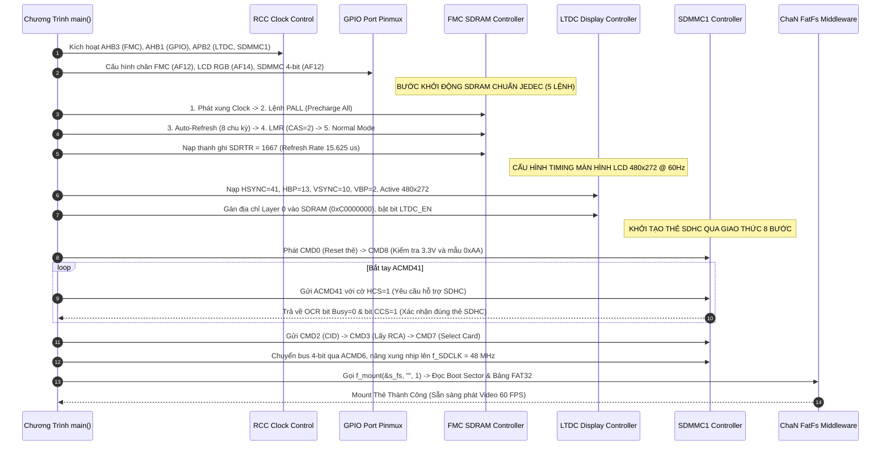
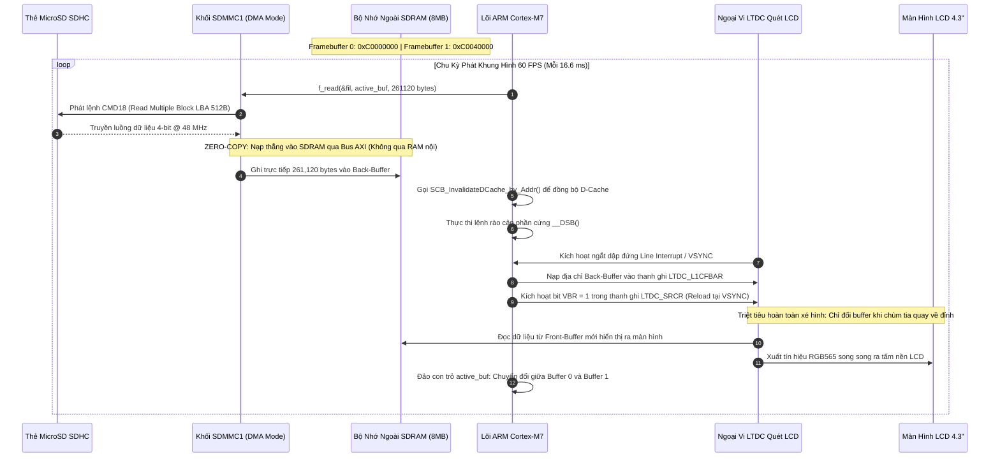
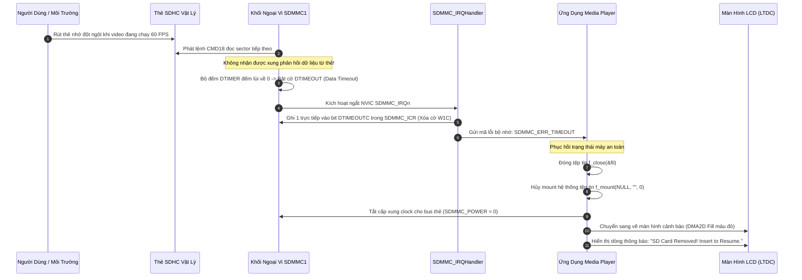

# Cẩm Nang Phỏng Vấn Dự Án 2: High-Speed Video Playback & SDHC Storage Subsystem

> **Hệ Thống:** Bare-Metal High-Speed 60 FPS Video Playback & SDHC Storage Subsystem  
> **Nền Tảng Phần Cứng:** STM32F746NG (ARM Cortex-M7 @ 216 MHz, MPU, L1 Cache 16KB)  
> **Phương Thức Lập Trình:** 100% Bare-Metal Register-Level (Không dùng HAL/LL, lập trình trực tiếp theo RM0385)  
> **Các Khối Ngoại Vi Cốt Lõi:** FMC SDRAM (108 MHz), SDMMC1 (48 MHz), LTDC (480x272 RGB565), DMA2D Chrom-ART, ChaN FatFs (FAT32)  
> **Tài liệu nền tảng tham chiếu:** [`day00_baremetal_foundations.md`](file:///d:/Project/STM32F7/day00_baremetal_foundations.md), [`sdmmc_fatfs_architecture.md`](file:///d:/Project/STM32F7/sdmmc_fatfs_architecture.md), STM32F746 Reference Manual (RM0385).

---

## MỤC LỤC TỔNG QUAN

- [1. TỔNG QUAN HỆ THỐNG & BẢN ĐỒ BUS MATRIX PHẦN CỨNG](#1-tổng-quan-hệ-thống--bản-đồ-bus-matrix-phần-cứng)
  - [1.1. Mục Tiêu Kỹ Thuật & Các Con Số Định Lượng Cốt Lõi](#11-mục-tiêu-kỹ-thuật--các-con-số-định-lượng-cốt-lõi)
  - [1.2. Sơ Đồ Kiến Trúc Ma Trận Bus AXI 64-bit Đa Tầng & Bản Đồ Phân Bổ Vùng Nhớ SDRAM 8MB](#12-sơ-đồ-kiến-trúc-ma-trận-bus-axi-64-bit-đa-tầng--bản-đồ-phân-bổ-vùng-nhớ-sdram-8mb)
- [2. LÝ THUYẾT CỐT LÕI & CÔNG THỨC BẮT BUỘC PHẢI NHỚ](#2-lý-thuyết-cốt-lõi--công-thức-bắt-buộc-phải-nhớ)
  - [2.1. Bài Toán Băng Thông: Phát Video 60 FPS & Timing Quét Màn Hình LCD (LTDC Pixel Clock)](#21-bài-toán-băng-thông-phát-video-60-fps--timing-quét-màn-hình-lcd-ltdc-pixel-clock)
  - [2.2. FMC SDRAM: Chuỗi 5 Lệnh JEDEC, Bảng Thanh Ghi Cấu Hình & Công Thức Tính Refresh Rate Counter](#22-fmc-sdram-chuỗi-5-lệnh-jedec-bảng-thanh-ghi-cấu-hình--công-thức-tính-refresh-rate-counter)
  - [2.3. Chuẩn Hóa MicroSD SDHC: Block Addressing (LBA 512B) & Quy Trình Khởi Tạo 8 Bước SDMMC](#23-chuẩn-hóa-microsd-sdhc-block-addressing-lba-512b--quy-trình-khởi-tạo-8-bước-sdmmc)
  - [2.4. Bản Chất Bất Đồng Bộ L1 D-Cache Coherency Trên Nhân Cortex-M7 & Kiến Trúc Zero-Copy](#24-bản-chất-bất-đồng-bộ-l1-d-cache-coherency-trên-nhân-cortex-m7--kiến-trúc-zero-copy)
- [3. SƠ ĐỒ TUẦN TỰ HOẠT ĐỘNG (MERMAID SEQUENCE DIAGRAMS)](#3-sơ-đồ-tuần-tự-hoạt-động-mermaid-sequence-diagrams)
  - [3.1. Quy Trình Cấu Hình Khởi Động Phần Cứng (Peripheral Init Pipeline)](#31-quy-trình-cấu-hình-khởi-động-phần-cứng-peripheral-init-pipeline)
  - [3.2. Quy Trình Vận Hành Streaming Video Zero-Copy (Runtime Dataflow)](#32-quy-trình-vận-hành-streaming-video-zero-copy-runtime-dataflow)
  - [3.3. Quy Trình Xử Lý Sự Cố Phần Cứng An Toàn (Fault & Recovery Pipeline)](#33-quy-trình-xử-lý-sự-cố-phần-cứng-an-toàn-fault--recovery-pipeline)
- [4. PHÂN LOẠI BUG THỰC TẾ & BẪY PHẦN CỨNG KINH ĐIỂN](#4-phân-loại-bug-thực-tế--bẫy-phần-cứng-kinh-điển)
  - [4.1. Nhóm Bug Phổ Biến (Common Bugs)](#41-nhóm-bug-phổ-biến-common-bugs)
  - [4.2. Nhóm Bug Phức Tạp (Complex Architectural Bugs)](#42-nhóm-bug-phức-tạp-complex-architectural-bugs)
  - [4.3. Nhóm Bug Hiếm Gặp & Góc Khuất Phần Cứng (Rare / Edge-Case Bugs)](#43-nhóm-bug-hiếm-gặp--góc-khuất-phần-cứng-rare--edge-case-bugs)
- [5. BỘ CÂU HỎI PHỎNG VẤN & KỊCH BẢN TRẢ LỜI MẪU (FRESHER LEVEL)](#5-bộ-câu-hỏi-phỏng-vấn--kịch-bản-trả-lời-mẫu-fresher-level)

---

# 1. TỔNG QUAN HỆ THỐNG & BẢN ĐỒ BUS MATRIX PHẦN CỨNG

### 1.1. Mục Tiêu Kỹ Thuật & Các Con Số Định Lượng Cốt Lõi

Dự án hiện thực một **Trình Phát Video và Đồ Họa 60 FPS Tốc Độ Cao** chạy trực tiếp trên thanh ghi phần cứng (Bare-Metal) của chip ARM Cortex-M7 STM32F746NG. Hệ thống đọc trực tiếp luồng video nhị phân thô từ thẻ nhớ MicroSD SDHC qua giao thức FAT32, giải phóng dữ liệu theo kiến trúc **Zero-Copy Streaming** vào bộ nhớ ngoài SDRAM 8MB và hiển thị lên màn hình LCD 4.3 inch qua bộ điều khiển LTDC đồng bộ với bộ tăng tốc đồ họa DMA2D Chrom-ART.

| Khối Phần Cứng | Thông Số Vận Hành Định Lượng | Cơ Sở Kỹ Thuật & Vai Trò Trong Dự Án |
| :--- | :--- | :--- |
| **Lõi MCU** | ARM Cortex-M7 @ `216 MHz` | Kích hoạt L1 I-Cache (`16 KB`), D-Cache (`16 KB`), bộ bảo vệ MPU. |
| **Màn hình LCD** | TFT 4.3 inch (`480 x 272`) | Chuẩn màu RGB565 (16-bit, 2 bytes/pixel). Điểm quét pixel clock `f_PCLK ~ 9.0 MHz`. |
| **Bộ nhớ ngoài FMC** | Micron SDRAM 8MB (32-bit bus) | Xung nhịp bus `f_SDCLK = 108 MHz` (từ `f_HCLK / 2`). Chứa Double Framebuffer. |
| **Ngoại vi SDMMC1** | MicroSD SDHC (4GB - 32GB) | Bus 4-bit, xung nhịp `f_SDCLK = 48 MHz` (từ `PLL48CLK`), đọc thực tế `~ 18 MB/s`. |
| **Băng thông Video** | `15.66 MB/s` liên tục | Phát liên tục 60 FPS chuẩn không giật lag (`18 MB/s > 15.66 MB/s`). |
| **Tải chiếm dụng CPU** | `~ 0%` khi phát video | Nhờ kiến trúc Zero-Copy đọc thẳng từ SDMMC nạp vào SDRAM ngoài và LTDC tự quét. |
| **Hiện tượng xé hình** | Triệt tiêu hoàn toàn (`0 tearing`) | Kỹ thuật Double Framebuffer kết hợp đồng bộ ngắt dập đứng `VSYNC` (`VBR` bit). |

---

### 1.2. Sơ Đồ Kiến Trúc Ma Trận Bus AXI 64-bit Đa Tầng & Bản Đồ Phân Bổ Vùng Nhớ SDRAM 8MB

Trên STM32F746, ma trận Bus AXI 64-bit liên kết nhiều Master với nhiều Slave độc lập, cho phép **truy xuất đồng thời (Concurrent Access)** giữa các khối ngoại vi mà không làm nghẽn lõi CPU:

```text
┌──────────────────────────────────────────────────────────────────────────────────────────────────┐
│                               MA TRẬN BUS AXI 64-BIT ĐA TẦNG (STM32F746)                        │
│                                                                                                  │
│   ┌────────────────────────┐  ┌────────────────────────┐  ┌──────────────────────────────────┐   │
│   │  Cortex-M7 Core CPU    │  │   LTDC Display Master  │  │      DMA2D Chrom-ART Master      │   │
│   │  (Master M0: D-Cache)  │  │   (Master M3: LCD FIFO)│  │      (Master M4: Graphics)       │   │
│   └───────────┬────────────┘  └───────────┬────────────┘  └────────────────┬─────────────────┘   │
│               │                           │                                │                     │
│   ════════════╪═══════════════════════════╪════════════════════════════════╪════════════════    │
│               │                           │                                │  AXI CROSSBAR MATRIX
│               ▼                           ▼                                ▼                     │
│   ┌──────────────────────────────────────────────────────────────────────────────────────────┐   │
│   │            BỘ ĐIỀU KHIỂN BỘ NHỚ NGOÀI FMC (Flexible Memory Controller - Slave S3)        │   │
│   │            - Địa chỉ vật lý cơ sở SDRAM Bank 1: 0xC0000000 (Dung lượng 8MB, 32-bit Bus)  │   │
│   └───────────────────────────────────────────┬──────────────────────────────────────────────┘   │
│                                               ▼                                                  │
│   ┌──────────────────────────────────────────────────────────────────────────────────────────┐   │
│   │                        BẢN ĐỒ BỘ NHỚ CHI TIẾT CỦA CHIP SDRAM 8MB                         │   │
│   │  • 0xC0000000 -> 0xC003FFFF (256 KB): Framebuffer 0 (Front-Buffer: 480x272 RGB565)       │   │
│   │  • 0xC0040000 -> 0xC007FFFF (256 KB): Framebuffer 1 (Back-Buffer: 480x272 RGB565)        │   │
│   │  • 0xC0080000 -> 0xC01FFFFF (1.5 MB): Sprite Sheet, Font chữ & Asset đồ họa tĩnh        │   │
│   │  • 0xC0200000 -> 0xC07FFFFF (6.0 MB): Bộ đệm DMA2D Blending & Vùng nhớ ứng dụng mở rộng  │   │
│   └──────────────────────────────────────────────────────────────────────────────────────────┘   │
│                                                                                                  │
│   ═══════════════════════════════════════════════════════════════════════════════════════════    │
│               ▲                                                              ▲                   │
│               │ Cầu nối AHB-to-APB2                                          │ Cầu nối AHB-to-APB2
│   ┌───────────┴────────────────────────┐                         ┌───────────┴───────────────┐   │
│   │ Ngoại vi SDMMC1 (Base: 0x40012C00) │                         │ Ngoại vi LTDC Controller  │   │
│   │ - Bus APB2 @ 108 MHz / 48 MHz Clk  │                         │ (Base: 0x40016800)        │   │
│   └────────────────────────────────────┘                         └───────────────────────────┘   │
└──────────────────────────────────────────────────────────────────────────────────────────────────┘
```

---

# 2. LÝ THUYẾT CỐT LÕI & CÔNG THỨC BẮT BUỘC PHẢI NHỚ

### 2.1. Bài Toán Băng Thông: Phát Video 60 FPS & Timing Quét Màn Hình LCD (LTDC Pixel Clock)

Để hệ thống phát video 60 FPS mượt mà không bị xé hình hay chớp tắt, ta cần giải bài toán tính toán băng thông trên hai mặt trận: **Băng thông nạp từ thẻ nhớ** và **Băng thông quét màn hình LCD**:

#### A. Bài toán nạp Video 60 FPS từ Thẻ Nhớ SDHC:
* **Kích thước khung hình LCD 4.3 inch:** `480 x 272 = 130,560 pixels`.
* **Định dạng màu RGB565:** Mỗi điểm ảnh chiếm 16-bit (`2 bytes`).
  ```text
  Dung lượng 1 khung hình (Frame Size) = 130,560 * 2 = 261,120 bytes (~ 255 KB)
  ```
* **Băng thông yêu cầu liên tục để phát đủ 60 FPS:**
  ```text
  Băng thông cần = 261,120 bytes * 60 frames/s = 15,667,200 bytes/s (~ 15.66 MB/s)
  ```
* **Năng lực truyền dẫn phần cứng của SDMMC1 trên STM32F7:**
  * Khối ngoại vi sử dụng xung nhịp cấp chuyên dụng `f_SDCLK = 48 MHz` (từ khối `PLL48CLK`).
  * Giao tiếp qua bus dữ liệu **4-bit** song song:
    ```text
    Băng thông tối đa lý thuyết = 48 MHz * 4 bits = 192 Mbps = 24.0 MB/s
    ```
  * Tốc độ đọc tuần tự thực đo của thẻ SDHC Class 10 / UHS-I qua FatFs đạt **`~ 18.0 MB/s`**.
  * Kết luận: `18.0 MB/s > 15.66 MB/s` -> Đáp ứng hoàn hảo 60 FPS!

#### B. Bài toán Timing quét màn hình LCD (LTDC Pixel Clock):
Một chu kỳ quét toàn bộ màn hình 480x272 ở tần số làm tươi `60 Hz` đòi hỏi phải cấu hình các khoảng dập xung ngang (Horizontal Blanking) và dập xung dọc (Vertical Blanking) để tấm nền LCD kịp ổn định điện áp điểm ảnh:
* **Thông số quét ngang (Horizontal Timings):**
  * `HSYNC (Độ rộng xung đồng bộ ngang)` = 41 pixels.
  * `HBP (Horizontal Back Porch)` = 13 pixels.
  * `Active Width (Vùng hiển thị hoạt động)` = 480 pixels.
  * `HFP (Horizontal Front Porch)` = 32 pixels.
  * `Tổng chu kỳ ngang: H_TOTAL = 41 + 13 + 480 + 32 = 566 pixels`.
* **Thông số quét dọc (Vertical Timings):**
  * `VSYNC (Độ rộng xung đồng bộ dọc)` = 10 lines.
  * `VBP (Vertical Back Porch)` = 2 lines.
  * `Active Height (Vùng hiển thị hoạt động)` = 272 lines.
  * `VFP (Vertical Front Porch)` = 2 lines.
  * `Tổng chu kỳ dọc: V_TOTAL = 10 + 2 + 272 + 2 = 286 lines`.
* **Tần số xung nhịp điểm ảnh Pixel Clock (f_PCLK):**
  ```text
  f_PCLK = H_TOTAL * V_TOTAL * Tần số làm tươi
         = 566 pixels * 286 lines * 60 Hz
         = 9,712,560 Hz ~ 9.7 MHz
  ```
  *(Cấu hình nguồn xung `PLLSAI` trên STM32F7 để chia ra xung nhịp `f_PCLK ~ 9.5 MHz - 9.7 MHz`).*
* **Băng thông kéo dữ liệu liên tục của LTDC từ SDRAM:**
  ```text
  Băng thông kéo LTDC = 9.7 MHz * 2 bytes/pixel = 19.4 MB/s
  ```
* **Năng lực đáp ứng của bộ nhớ ngoài SDRAM 32-bit @ 108 MHz:**
  ```text
  Băng thông cực đại của SDRAM = 108 MHz * 4 bytes (32-bit) = 432.0 MB/s
  ```
  Tổng băng thông hệ thống cần lúc cao điểm: `19.4 MB/s (LTDC đọc) + 15.66 MB/s (SDMMC nạp vào) + 20 MB/s (DMA2D blend) = ~ 55 MB/s`. Con số này chỉ chiếm khoảng **12.7% băng thông của SDRAM**, hoàn toàn không xảy ra hiện tượng nghẽn bus!

---

### 2.2. FMC SDRAM: Chuỗi 5 Lệnh JEDEC, Bảng Thanh Ghi Cấu Hình & Công Thức Tính Refresh Rate Counter

#### A. Chuỗi 5 Lệnh Khởi Động Bắt Buộc Theo Chuẩn JEDEC (RM0385 Section 13.7.4):
Khối ngoại vi FMC không tự động kích hoạt SDRAM khi bật nguồn mà bắt buộc CPU phải phát tuần tự chuỗi 5 lệnh điều khiển thông qua thanh ghi `FMC_SDCMR`:
1. **Clock Configuration Enable:** Bật bộ phát xung cấp nhịp `f_SDCLK` cho SDRAM (Lệnh `SDCMR[2:0] = 001`).
2. **PALL (Precharge All):** Đưa toàn bộ 4 banks nội của SDRAM về trạng thái nghỉ ban đầu (Lệnh `SDCMR[2:0] = 010`).
3. **Auto-Refresh Command:** Phát liên tiếp ít nhất **8 chu kỳ Auto-Refresh** để định hình điện tích cho các tụ điện lưu trữ cell nhớ (Lệnh `SDCMR[2:0] = 011`, nạp số chu kỳ `NRFS[3:0] = 7` tương đương 8 lần).
4. **Load Mode Register (LMR):** Nạp thanh ghi cấu hình nội của chip SDRAM thông qua trường `MRD[12:0]` (Lệnh `SDCMR[2:0] = 100`):
   - Đặt Burst Length = 1.
   - Burst Type = Sequential.
   - **CAS Latency = 2 chu kỳ clock** (Độ trễ từ khi phát lệnh đọc đến khi dữ liệu xuất hiện trên bus).
   - Write Burst Mode = Single Bit.
5. **Normal Mode:** Đưa chip SDRAM vào trạng thái vận hành bình thường sẵn sàng đọc ghi (Lệnh `SDCMR[2:0] = 000`).

#### B. Các Tham Số Định Thời Trong Thanh Ghi FMC_SDCR1 & FMC_SDTR1:
* **Thanh ghi điều khiển `FMC_SDCR1`:**
  * `NC[1:0] = 00`: 8 bit địa chỉ cột (Column Address Bits).
  * `NR[1:0] = 01`: 12 bit địa chỉ hàng (Row Address Bits -> 4,096 rows).
  * `MWID[1:0] = 10`: Độ rộng bus dữ liệu 32-bit.
  * `NB = 1`: 4 internal memory banks.
  * `CAS[1:0] = 10`: CAS Latency = 2 clock cycles.
  * `SDCLK[1:0] = 10`: Xung nhịp bus SDRAM = `f_HCLK / 2 = 216 MHz / 2 = 108 MHz`.
* **Thanh ghi định thời `FMC_SDTR1` (Tính theo chu kỳ clock 9.26 ns):**
  * `TMRD = 2`: Load Mode Register to Active delay.
  * `TXSR = 7`: Exit Self-refresh delay.
  * `TRAS = 4`: Self refresh time.
  * `TRC = 7`: Row cycle delay.
  * `TWR = 2`: Write recovery time.
  * `TRP = 2`: Row precharge delay.
  * `TRCD = 2`: Row to column delay.

#### C. Công Thức Tính Thanh Ghi Tốc Độ Làm Tươi (FMC_SDRTR):
Chip SDRAM MT48LC4M32B2 có `4,096 rows` và yêu cầu phải được làm tươi toàn bộ trong khoảng thời gian `T_REFRESH = 64 ms`.
```text
1. Thời gian làm tươi cho từng dòng riêng biệt:
   t_ROW_REFRESH = 64 ms / 4,096 rows = 15.625 us

2. Tần số xung nhịp bus SDRAM:
   f_SDCLK = f_HCLK / 2 = 216 MHz / 2 = 108 MHz

3. Chu kỳ 1 xung nhịp bus SDRAM:
   t_CK = 1 / 108 MHz ~ 9.26 ns

4. Công thức nạp thanh ghi FMC_SDRTR theo Reference Manual RM0385:
   COUNT = (t_ROW_REFRESH * f_SDCLK) - 20
         = (15.625 us * 108 MHz) - 20
         = 1,687.5 - 20
         = 1667.5 -> Nạp giá trị 1667

5. Lệnh ghi vào thanh ghi:
   FMC_Bank5_6->SDRTR |= (1667 << 1); /* Nạp vào trường COUNT[13:0] */
```

---

### 2.3. Chuẩn Hóa MicroSD SDHC: Block Addressing (LBA 512B) & Quy Trình Khởi Tạo 8 Bước SDMMC

| Tiêu Chí So Sánh | Thẻ SDSC Cũ (`<= 2 GB`) | Thẻ Chuẩn Hóa SDHC (`4 GB - 32 GB`) |
| :--- | :--- | :--- |
| **Cơ chế định chỉ** | **Byte Addressing** | **Block Addressing (LBA 512 Bytes)** |
| **Tham số lệnh CMD17/18** | Địa chỉ Byte tuyệt đối (`LBA * 512`) | Số thứ tự Block/Sector nguyên bản (`LBA`) |
| **Giới hạn 32-bit Address** | Bị kịch trần tại `2^32 = 4 GB` (Thực tế chỉ dùng `<= 2 GB`). | Quản lý tới `2^32 blocks * 512 B = 2 TB`. |
| **Khởi tạo ACMD41** | Bit HCS = 0 | **Bit HCS = 1 (Host Capacity Support)** |
| **Cờ kiểm tra OCR** | Bit CCS = 0 | **Bit CCS = 1 (Card Capacity Status)** |

#### Quy Trình Handshake 8 Bước Khởi Tạo Thẻ SDHC Chuẩn Công Nghiệp:
1. **Cấp xung khởi tạo chậm (Identification Phase):** Đặt xung `f_SDCLK = 400 kHz` trong `SDMMC_CLKCR` để tương thích với mọi loại thẻ nhớ khi mới cấp nguồn.
2. **CMD0 (GO_IDLE_STATE, Arg: `0x00000000`):** Đưa thẻ về trạng thái Idle, reset toàn bộ logic nội bộ của thẻ.
3. **CMD8 (SEND_IF_COND, Arg: `0x000001AA`):** Kiểm tra dải điện áp làm việc (2.7V - 3.6V) và kiểm tra mẫu thử Check Pattern `0xAA`. Nếu thẻ trả về đúng `0x000001AA` -> Xác nhận thẻ tuân thủ chuẩn SD Version 2.0 trở lên.
4. **Vòng lặp CMD55 + ACMD41 (SD_SEND_OP_COND, Arg: `0x40100000`):**
   - Bit 30 (`HCS = 1`): Báo cho thẻ biết Vi điều khiển hỗ trợ chế độ dung lượng cao SDHC.
   - Thẻ thực hiện quá trình khởi tạo điện áp nội bộ. Ta polling đọc thanh ghi OCR cho đến khi bit 31 (`Busy = 0`) báo hiệu hoàn tất.
   - Kiểm tra bit 30 của OCR (`CCS - Card Capacity Status`): Nếu `CCS = 1` -> **Xác nhận 100% là thẻ SDHC Block Addressing**!
5. **CMD2 (ALL_SEND_CID):** Yêu cầu thẻ gửi toàn bộ chuỗi 128-bit thông tin nhận dạng (Card Identification Data: Mã nhà sản xuất, Serial number).
6. **CMD3 (SET_RELATIVE_ADDR):** Yêu cầu thẻ tự phát sinh địa chỉ tương đối **RCA (Relative Card Address)** 16-bit dùng cho việc chọn thẻ sau này.
7. **CMD7 (SELECT_CARD, Arg: `RCA << 16`):** Chọn thẻ có địa chỉ RCA tương ứng, chuyển thẻ từ trạng thái Standby sang **Transfer State**.
8. **Chuyển Bus 4-bit & Tăng Tốc Độ Cực Đại:**
   - Phát chuỗi `CMD55` + `ACMD6` với tham số `0x02` để chuyển bus dữ liệu từ 1-bit sang **4-bit song song**.
   - Ghi thanh ghi `SDMMC_CLKCR` nâng tần số phát xung lên tốc độ tối đa **`f_SDCLK = 48 MHz`**.

---

### 2.4. Bản Chất Bất Đồng Bộ L1 D-Cache Coherency Trên Nhân Cortex-M7 & Kiến Trúc Zero-Copy

Nhân Cortex-M7 là nhân vi xử lý có hiệu năng cực cao nhờ tích hợp hai khối bộ đệm L1 riêng biệt:
* **I-Cache (Instruction Cache):** `16 KB`, bộ đệm lệnh nạp từ Flash/RAM.
* **D-Cache (Data Cache):** `16 KB`, tổ chức thành các dòng **Cache Line dài đúng 32 bytes**.

#### Nguyên nhân gây ra lỗi vỡ hình D-Cache Coherency:
* Trong kiến trúc máy tính, ngoại vi SDMMC là một **AXI Bus Master độc lập**. Khi đọc dữ liệu từ thẻ nhớ, DMA của SDMMC đẩy các khối byte trực tiếp qua ma trận Bus AXI vào thẳng chip nhớ SDRAM ngoài (`0xC0000000`) mà **hoàn toàn không đi qua lõi CPU**.
* Trong khi đó, L1 D-Cache nằm gắn liền bên trong lõi CPU. Nếu trước thời điểm DMA nạp dữ liệu, CPU đã từng truy cập vào vùng nhớ này, các ô nhớ cũ vẫn đang được lưu giữ trong L1 D-Cache.
* Khi ứng dụng hoặc khối hiển thị đọc lại vùng Framebuffer, CPU lấy dữ liệu cũ từ D-Cache thay vì nạp dữ liệu mới từ SDRAM ngoài, khiến cho khung hình hiển thị bị vỡ vụn, các đường sọc ngang xuất hiện và hình ảnh bị giật lùi về quá khứ!

#### Quy Trình 3 Bước Xử Lý Triệt Để Bằng Phần Cứng:
1. **Căn lề bộ đệm đúng 32 bytes (Cache Line Boundary):**
   ```c
   /* Bắt buộc căn lề 32 bytes để không làm ảnh hưởng các biến nằm liền kề */
   __attribute__((aligned(32))) static uint8_t s_frame_buffer[261120];
   ```
2. **Hủy hiệu lực bộ đệm Cache (Cache Invalidation):**
   ```c
   /* Xóa hiệu lực Cache Line ứng với dải địa chỉ Framebuffer */
   SCB_InvalidateDCache_by_Addr((uint32_t *)frame_addr, LCD_FRAME_SIZE);
   ```
   Lệnh này ép nhân Cortex-M7 đánh dấu toàn bộ các dòng Cache chứa dải địa chỉ này là "Dirty/Invalid", bắt buộc lần đọc tiếp theo CPU phải kéo dữ liệu mới nhất từ SDRAM ngoài.
3. **Chèn rào cản đồng bộ bộ nhớ phần cứng (Data Synchronization Barrier):**
   ```c
   __asm volatile ("dsb 0xF" ::: "memory");
   ```
   Chỉ thị `DSB` đảm bảo toàn bộ các giao dịch bus bộ nhớ trong đường ống (Store Buffers & AXI Pipeline) đã hoàn tất 100% trước khi câu lệnh tiếp theo được phép thực thi.

---

# 3. SƠ ĐỒ TUẦN TỰ HOẠT ĐỘNG (MERMAID SEQUENCE DIAGRAMS)

### 3.1. Quy Trình Cấu Hình Khởi Động Phần Cứng (Peripheral Init Pipeline)



---

### 3.2. Quy Trình Vận Hành Streaming Video Zero-Copy (Runtime Dataflow)



---

### 3.3. Quy Trình Xử Lý Sự Cố Phần Cứng An Toàn (Fault & Recovery Pipeline)



---

# 4. PHÂN LOẠI BUG THỰC TẾ & BẪY PHẦN CỨNG KINH ĐIỂN

### 4.1. Nhóm Bug Phổ Biến (Common Bugs)

#### 🐞 Bug 1: Quên cấp xung clock APB2 cho SDMMC1 hoặc AHB3 cho FMC
* **Triệu chứng:** Ngay dòng code đầu tiên ghi cấu hình thanh ghi `FMC->SDCR[0] = ...` hoặc `SDMMC1->CLKCR = ...`, vi điều khiển lập tức nhảy thẳng vào hàm `HardFault_Handler` hoặc treo cứng cờ trạng thái.
* **Nguyên nhân cốt lõi:** Trên vi điều khiển STM32, toàn bộ ngoại vi khi khởi động đều bị ngắt clock để tiết kiệm điện năng. Nếu cố tình truy xuất đọc/ghi vào vùng địa chỉ của ngoại vi khi thanh ghi `RCC_AHB3ENR` hoặc `RCC_APB2ENR` chưa được bật, bus matrix sẽ trả về lỗi truy cập bộ nhớ cấm (**Precise Bus Fault**).
* **Cách xử lý:** Luôn tuân thủ nguyên tắc vàng 4 bước: Bật clock RCC trước, cấu hình chân GPIO Alternate Function sau, rồi mới được ghi vào thanh ghi ngoại vi.

#### 🐞 Bug 2: Nhân nhầm hệ số 512 khi đọc thẻ SDHC (Lỗi tràn số nguyên 32-bit)
* **Triệu chứng:** Thẻ nhớ SDHC 16GB nạp video đọc bình thường trong vài phút đầu tiên; nhưng khi video chạy đến phân đoạn lớn hơn 4GB thì toàn bộ dữ liệu trả về đều bằng 0 hoặc hàm `f_read()` báo lỗi `FR_DISK_ERR`.
* **Nguyên nhân:** Lập trình viên bê nguyên mã nguồn của thẻ SDSC cũ: `uint32_t byte_addr = sector * 512;`. Khi thẻ đọc tới Sector thứ `8,388,608` (`8,388,608 * 512 = 4,294,967,296 = 2^32`), biến `byte_addr` bị tràn về 0. Lệnh CMD17 truyền tham số 0 khiến thẻ quay lại đọc Sector 0 của Master Boot Record thay vì đọc dữ liệu video.
* **Cách xử lý:** Trong driver SDMMC chuẩn hóa cho SDHC, tham số của CMD17/CMD18 chính là số thứ tự `sector` (Block Addressing). Tuyệt đối không nhân 512!

#### 🐞 Bug 3: Hiện tượng xé hình (Screen Tearing) khi đổi Framebuffer
* **Triệu chứng:** Khi phát video có cảnh chuyển động nhanh (xe chạy, phụ đề lướt), trên màn hình LCD xuất hiện một đường cắt ngang giật giật, phần trên hiển thị khung hình mới còn phần dưới hiển thị khung hình cũ.
* **Nguyên nhân:** Đổi địa chỉ thanh ghi `LTDC_L1CFBAR` giữa lúc chùm tia quét của LTDC đang quét dở ở dòng thứ 100 của màn hình. Dòng 0 đến 100 hiển thị frame cũ, dòng 101 đến 272 hiển thị frame mới.
* **Cách xử lý:** Sử dụng cơ chế nạp bóng tại ngắt VSYNC: Sau khi ghi địa chỉ Framebuffer mới vào `LTDC_L1CFBAR`, ghi bit `VBR = 1` (Vertical Blanking Reload) vào thanh ghi `LTDC_SRCR`. Thanh ghi chỉ thực sự được nạp khi chùm tia quét xong dòng cuối cùng 272 và quay về đỉnh màn hình.

---

### 4.2. Nhóm Bug Phức Tạp (Complex Architectural Bugs)

#### 🐞 Bug 4: Bất đồng bộ D-Cache Coherency gây sọc rác và vỡ nát hình ảnh
* **Triệu chứng:** Tốc độ đọc từ thẻ nhớ báo về rất cao, nhưng hình ảnh trên LCD bị nhòe màu, các mảng điểm ảnh bị xô lệch hoặc hiển thị lại các khung hình của vài giây trước đó.
* **Nguyên nhân:** Khối SDMMC DMA nạp thẳng dữ liệu điểm ảnh vào SDRAM ngoài. Nhưng Cortex-M7 có bộ đệm L1 D-Cache `16 KB`. Lõi CPU và bộ điều khiển hiển thị đọc dữ liệu từ Cache cũ thay vì đọc dữ liệu mới dưới SDRAM.
* **Giải pháp 3 bước:**
  1. Đảm bảo mảng bộ đệm căn lề `32 bytes` bằng `__attribute__((aligned(32)))`.
  2. Gọi lệnh Invalidate Cache: `SCB_InvalidateDCache_by_Addr((uint32_t *)addr, size)` để ép xóa dữ liệu Cache cũ trước khi hiển thị.
  3. Gọi chỉ thị rào cản phần cứng `__asm volatile ("dsb 0xF" ::: "memory");` để đồng bộ toàn bộ chuỗi bus bộ nhớ.

#### 🐞 Bug 5: Tranh chấp Bus Matrix AXI / FMC SDRAM Contention
* **Triệu chứng:** Khi chạy video 60 FPS kết hợp với việc gọi hàm `DMA2D` để fill màu hoặc vẽ icon đè lên màn hình, màn hình LCD thỉnh thoảng bị chớp đen một khung hình hoặc nháy sọc trắng.
* **Nguyên nhân:** Cả 3 Master gồm CPU, LTDC và DMA2D cùng truy cập vào bộ nhớ ngoài SDRAM 8MB thông qua một bộ điều khiển FMC duy nhất chạy ở xung nhịp `108 MHz`. Nếu DMA2D chiếm giữ bus AXI quá lâu, FIFO nội của ngoại vi LTDC bị rỗng (FIFO Underflow Error cờ `FEIF` trong `LTDC_ISR`) do không kịp lấy dữ liệu bắn ra màn hình LCD đúng thời gian thực của điểm ảnh.
* **Cách xử lý:**
  1. Cấu hình độ ưu tiên trọng tài Bus Matrix (Bus Matrix GPV): Nâng quyền ưu tiên của LTDC (Master 3) lên cao nhất, hạ quyền của DMA2D xuống thấp hơn.
  2. Bật cờ ngắt `TERRIE` và `FUIE` của LTDC để phát hiện FIFO Underflow và tự động reload.

#### 🐞 Bug 6: Sụt giảm FPS do hiện tượng phân mảnh tập tin (File Fragmentation) trên FAT32
* **Triệu chứng:** Video phát rất mượt trong 10 giây đầu (đủ 60 FPS), nhưng sau đó đột ngột bị giật cục, FPS tụt xuống còn 30 - 40 FPS rồi lại tăng lên.
* **Nguyên nhân:** File video trên thẻ nhớ bị lưu trữ rải rác trên các Cluster không liên tục do thẻ đã từng xóa ghi nhiều lần. Khi đọc qua ranh giới cụm phân mảnh, ngoại vi SDMMC phải kết thúc lệnh đọc liên tục CMD18, phát lệnh dừng CMD12, rồi phát lệnh CMD18 mới tại địa chỉ Cluster khác. Độ trễ tìm kiếm (Seek Latency) của chip nhớ NAND Flash làm sụt băng thông tức thời từ `18 MB/s` xuống còn `< 8 MB/s`.
* **Cách xử lý:** 
  1. Khi format thẻ FAT32 trên máy tính, chọn kích thước cụm phân bổ lớn: **Allocation Unit Size = 32 KB hoặc 64 KB**.
  2. Sử dụng công cụ ghi file liên tục (Contiguous File Pre-allocation) để đảm bảo file video nằm trọn vẹn trên các sector vật lý liền kề nhau 100%.

---

### 4.3. Nhóm Bug Hiếm Gặp & Góc Khuất Phần Cứng (Rare / Edge-Case Bugs)

#### 🐞 Bug 7: SDMMC FIFO Overrun / Underrun ở rìa tần số 48 MHz
* **Triệu chứng:** Trong quá trình đọc dữ liệu nặng, thẻ nhớ thỉnh thoảng trả về cờ lỗi `RXOVERR` (Receive FIFO Overrun) trong thanh ghi `SDMMC_STA`, làm dừng đột ngột quá trình truyền dữ liệu.
* **Nguyên nhân:** Khi chạy ở tốc độ cực đại `48 MHz`, cứ mỗi `20.8 ns` có một nibble (4-bit) dữ liệu đi vào FIFO. Nếu tại đúng thời điểm đó, bus AHB nội bị tạm giữ bởi một tác vụ ưu tiên khác, bộ đệm FIFO 32 words (`128 bytes`) của SDMMC bị đầy tràn trước khi kịp xả vào DMA.
* **Giải pháp phần cứng:** Kích hoạt tính năng **Hardware Flow Control** bằng cách bật bit `HWFC_EN` trong thanh ghi cấu hình `SDMMC_CLKCR`. Khi tính năng này được bật, nếu FIFO còn dưới 2 words trống, phần cứng SDMMC sẽ chủ động tạm dừng phát xung clock `SDMMC_CK` cho thẻ nhớ, ép thẻ nhớ tạm ngưng đẩy dữ liệu ra cho đến khi FIFO có chỗ trống trở lại mà không làm mất mát dữ liệu!

#### 🐞 Bug 8: Glitch chân CKE (Clock Enable) SDRAM khi Reset ấm (Soft-Reset)
* **Triệu chứng:** Mạch nạp code chạy lần đầu khi cấp nguồn thì hoạt động hoàn hảo; nhưng khi ấn nút Reset trên mạch hoặc nạp code mới qua ST-LINK (Warm Reset), hệ thống treo cứng ở bước khởi tạo SDRAM, không thể đọc ghi được ô nhớ nào.
* **Nguyên nhân:** Khi nhấn nút Reset, các chân GPIO của vi điều khiển bị đưa về trạng thái mặc định Input Floating (thả nổi). Chân tín hiệu **CKE (Clock Enable)** của chip SDRAM bị trôi điện áp lơ lửng, khiến chip SDRAM hiểu nhầm là tín hiệu rơi vào chế độ tự làm tươi (Self-Refresh Mode) hoặc Power-Down Mode. Khi vi điều khiển khởi động lại và phát lệnh JEDEC, chip SDRAM từ chối phản hồi.
* **Giải pháp phần cứng & phần mềm:** 
  * Về phần cứng: Thiết kế thêm một điện trở kéo xuống đất **Pull-Down `10 kOhm` ngoại vi** tại chân CKE để đảm bảo chân luôn ở mức 0 an toàn khi vi điều khiển đang reset.
  * Về phần mềm: Đầu hàm `FMC_SDRAM_Init()`, kéo chân CKE xuống mức Low thủ công, tạo trễ `1 ms` cho điện áp ổn định trước khi bàn giao quyền điều khiển cho khối FMC.

---

# 5. BỘ CÂU HỎI PHỎNG VẤN & KỊCH BẢN TRẢ LỜI MẪU (FRESHER LEVEL)

### ❓ Câu 1: "Tại sao trong dự án này bạn không dùng giải mã video MJPEG/H.264 mà lại chọn Raw RGB565 Frame Streaming?"
* **🗣️ Kịch bản trả lời mẫu (35 - 45 giây):**
  > *"Dạ, lý do cốt lõi xuất phát từ sự thấu hiểu sâu sắc về giới hạn phần cứng của chip STM32F746:  
  > Chip STM32F746 không có bộ giải mã phần cứng JPEG Codec như các dòng chip đàn anh F767 hay F769. Nếu sử dụng CPU Cortex-M7 để giải mã mềm MJPEG ở độ phân giải 480x272 thì CPU sẽ bị chiếm dụng 100% tài nguyên và tốc độ khung hình chỉ lết được khoảng 15 đến 20 FPS, không bao giờ đạt được mục tiêu 60 FPS mượt mà.  
  > Mục tiêu cốt lõi của dự án em là **chứng minh năng lực làm chủ kiến trúc bus dữ liệu và bộ nhớ tốc độ cao**:  
  > Em chuyển đổi video thành chuỗi frame RGB565 thô và xây dựng kiến trúc **Zero-Copy Streaming** đọc trực tiếp từ thẻ SDHC qua bus SDMMC 48 MHz nạp thẳng vào SDRAM 108 MHz với tốc độ thực tế 18 MB/s. Nhờ đó, em đạt được 60 FPS mượt mà tuyệt đối mà tải CPU gần như bằng 0."*

---

### ❓ Câu 2: "Trình bày cách bạn chứng minh bằng toán học rằng hệ thống đủ băng thông phát 60 FPS?"
* **🗣️ Kịch bản trả lời mẫu (35 - 45 giây):**
  > *"Dạ, em thực hiện bài toán tính toán băng thông vật lý như sau:  
  > Màn hình của em có độ phân giải 480 nhân 272, tức là 130,560 điểm ảnh. Định dạng màu RGB565 chiếm 2 bytes trên một pixel, suy ra một khung hình chiếm chính xác 261,120 bytes, tức khoảng 255 KB.  
  > Để phát 60 khung hình trong 1 giây, băng thông đường truyền liên tục bắt buộc phải đạt là 261,120 nhân với 60, xấp xỉ 15.66 MB/s.  
  > Trong khi đó, khối ngoại vi SDMMC1 của STM32F7 chạy bus 4-bit tại xung nhịp 48 MHz từ khối PLL48CLK, cho băng thông tối đa trên lý thuyết là 24 MB/s. Tốc độ đọc tuần tự thực đo của em qua hệ thống tệp FAT32 đạt xấp xỉ 18 MB/s.  
  > Vì 18 MB/s lớn hơn 15.66 MB/s nên phần cứng hoàn toàn đáp ứng đủ và phát mượt mà 60 FPS không hề bị trễ hay rớt khung hình."*

---

### ❓ Câu 3: "Phân biệt Byte Addressing của SDSC và Block Addressing của SDHC? Bạn xử lý điểm này trong code thế nào?"
* **🗣️ Kịch bản trả lời mẫu (35 - 45 giây):**
  > *"Dạ, thẻ SDSC cũ từ 2GB trở xuống sử dụng cơ chế Byte Addressing, nghĩa là tham số truyền vào các lệnh đọc ghi CMD17 hay CMD18 là địa chỉ byte tuyệt đối, bằng số thứ tự Sector nhân với 512. Nhưng với thẻ SDHC dung lượng từ 4GB đến 32GB, không gian địa chỉ vượt quá giới hạn 4GB của con số 32-bit, nếu nhân 512 sẽ làm tràn biến số nguyên uint32_t ngay lập tức.  
  > Vì vậy chuẩn SDHC bắt buộc chuyển sang cơ chế Block Addressing LBA: Tham số truyền vào lệnh CMD17/18 chính là số thứ tự Block 512 bytes nguyên bản mà không nhân 512.  
  > Trong mã nguồn driver của em: Lúc khởi tạo em gửi lệnh ACMD41 bật cờ HCS bằng 1, sau đó kiểm tra cờ CCS trong thanh ghi OCR trả về để nhận diện đúng thẻ SDHC. Khi đã xác nhận thẻ SDHC, toàn bộ hàm đọc ghi khối của em truyền thẳng biến sector vào thanh ghi tham số SDMMC_ARG."*

---

### ❓ Câu 4: "Trình bày chuỗi 5 lệnh JEDEC khởi tạo SDRAM ngoài và cách bạn tính toán thanh ghi Refresh Rate Counter?"
* **🗣️ Kịch bản trả lời mẫu (40 - 50 giây):**
  > *"Dạ, theo tiêu chuẩn JEDEC, chip SDRAM ngoài bắt buộc phải trải qua chuỗi 5 lệnh thông qua thanh ghi FMC_SDCMR: Bật xung cấp nhịp Clock -> Phát lệnh Precharge All đưa các bank về trạng thái nghỉ -> Phát ít nhất 8 chu kỳ Auto-Refresh liên tiếp -> Nạp thanh ghi Mode Register cấu hình CAS Latency bằng 2 -> Đưa SDRAM vào Normal Mode.  
  > Về thanh ghi tốc độ làm tươi FMC_SDRTR: Chip SDRAM Micron MT48LC4M32B2 có 4,096 dòng và yêu cầu làm tươi trong 64 mili-giây, nghĩa là cứ 15.625 micro-giây phải làm tươi một dòng.  
  > Bus SDRAM của em chạy ở tần số 108 MHz từ xung HCLK 216 MHz chia đôi.  
  > Lấy 15.625 micro-giây nhân với 108 MHz rồi trừ đi 20 chu kỳ dự phòng an toàn theo đúng công thức của Reference Manual RM0385, em tính ra con số chính xác nạp vào thanh ghi là 1667."*

---

### ❓ Câu 5: "Lỗi D-Cache Coherency là gì và 3 bước bạn giải quyết triệt để trong dự án?"
* **🗣️ Kịch bản trả lời mẫu (35 - 45 giây):**
  > *"Dạ, Cortex-M7 có bộ đệm L1 Data Cache 16KB. Khi ngoại vi SDMMC dùng DMA nạp luồng frame từ thẻ nhớ vào thẳng SDRAM ngoài, dữ liệu mới đã nằm dưới RAM nhưng không đi qua CPU. Lúc này CPU vẫn giữ dữ liệu cũ trong D-Cache, dẫn đến việc đọc dữ liệu cũ đẩy ra màn hình làm hiển thị bị vỡ hình, nhòe màu và xuất hiện sọc rác.  
  > Em giải quyết triệt để vấn đề này bằng quy trình 3 bước:  
  > Bước 1: Căn lề mảng bộ đệm đúng 32 bytes bằng thuộc tính aligned(32) để khớp chính xác với kích thước một dòng Cache Line.  
  > Bước 2: Ngay trước khi xuất khung hình, em gọi hàm SCB_InvalidateDCache_by_Addr để hủy hiệu lực dòng Cache cũ, ép CPU phải nạp dữ liệu mới trực tiếp từ SDRAM.  
  > Bước 3: Em chèn lệnh rào cản phần cứng DSB (Data Synchronization Barrier) để đảm bảo toàn bộ đường ống truy xuất bộ nhớ hoàn tất trước khi chuyển đổi khung hình."*

---

### ❓ Câu 6: "Kỹ thuật Double Buffering và VSYNC Reload trên LTDC giúp chống xé hình (Screen Tearing) như thế nào?"
* **🗣️ Kịch bản trả lời mẫu (35 - 45 giây):**
  > *"Dạ, xé hình xảy ra khi ta thay đổi dữ liệu khung hình ngay giữa lúc chùm tia quét của bộ điều khiển LTDC đang quét dở trên màn hình.  
  > Em giải quyết bằng cách cấp phát 2 bộ đệm Framebuffer 0 và Framebuffer 1 trên SDRAM ngoài:  
  > Trong khi LTDC đang quét hiển thị từ Framebuffer 0 ra màn hình LCD, khối SDMMC sẽ nạp dữ liệu khung hình mới vào Framebuffer 1.  
  > Khi nạp xong, em ghi địa chỉ Framebuffer 1 vào thanh ghi cấu hình lớp LTDC_L1CFBAR và kích hoạt bit nạp dập đứng VBR trong thanh ghi LTDC_SRCR.  
  > Nhờ bit VBR, phần cứng LTDC sẽ không đổi bộ đệm ngay lập tức mà đợi quét hết dòng 272 cuối cùng; chỉ khi chùm tia quay về đỉnh màn hình trong khoảng thời gian Vertical Blanking thì địa chỉ mới mới có hiệu lực. Nhờ đó khung hình chuyển đổi mượt mà tuyệt đối không có vết xé."*
