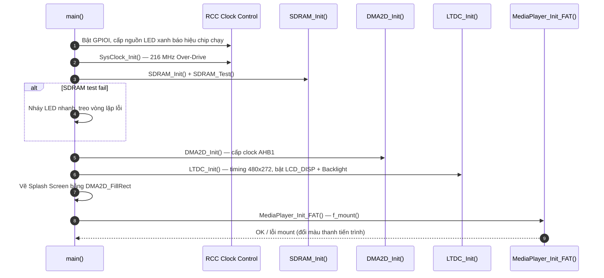
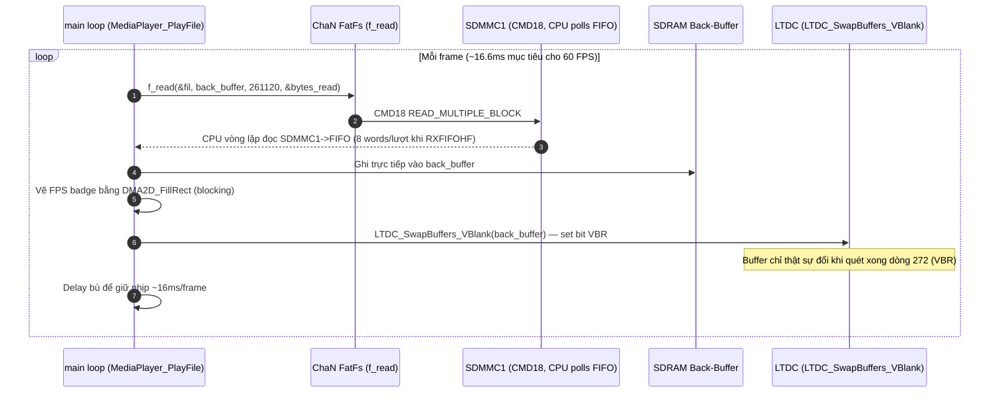

# Cẩm Nang Phỏng Vấn Dự Án 2: High-Speed Video Playback & SDHC Storage Subsystem

> **Hệ Thống:** Bare-Metal High-Speed 60 FPS Video Playback & SDHC Storage Subsystem
> **Nền Tảng Phần Cứng:** STM32F746NG (ARM Cortex-M7 @ 216 MHz, MPU, L1 Cache 16KB)
> **Phương Thức Lập Trình:** 100% Bare-Metal Register-Level (Không dùng HAL/LL, lập trình trực tiếp theo RM0385)
> **Các Khối Ngoại Vi Cốt Lõi:** FMC SDRAM (108 MHz), SDMMC1 (4-bit, 48 MHz bypass), LTDC (480x272 RGB565), DMA2D Chrom-ART (UI), ChaN FatFs (FAT32)
> **Tài liệu nền tảng tham chiếu (trên máy cá nhân, không đính kèm ở đây):** `day00_baremetal_foundations.md`, `sdmmc_fatfs_architecture.md`, STM32F746 Reference Manual (RM0385).

---

## ⚠️ 0. ĐỐI CHIẾU VỚI SOURCE CODE THẬT — ĐỌC TRƯỚC KHI HỌC THUỘC

File này là tài liệu học/ôn phỏng vấn, viết ở mức "kiến trúc lý tưởng" để giải thích khái niệm cho dễ hiểu. Khi mình đối chiếu với `main.c`, `media_player.c`, `sdmmc.c`, `dma2d.c`, `sys_clock.c`, `ltdc.c`, `diskio.c` thật sự bạn đã build, có vài chỗ **tài liệu mô tả khác với code đang chạy trên board**. Biết rõ những chỗ này để khi phỏng vấn không bị hỏi vặn "cho tôi xem dòng code đó" mà đuối lý:

| Chủ đề | Tài liệu này nói gì | Code thật hiện có gì | Nên trả lời phỏng vấn thế nào |
| :--- | :--- | :--- | :--- |
| **Xung nhịp SDMMC** | 48 MHz (Bypass Mode) | ✅ **Khớp.** `sdmmc.c` set `BYPASS=1` trong `SDMMC_CLKCR` → bus chạy thẳng 48 MHz từ `PLL48CLK`, không qua bộ chia. (Lưu ý: có 1 dòng comment cũ trong code ghi nhầm "24 MHz" — chỉ là comment lỗi thời, giá trị thanh ghi thực tế vẫn đúng 48 MHz.) | Trả lời tự tin 48 MHz, đúng như tài liệu. |
| **D-Cache Invalidate / MPU non-cacheable** | Mục 2.4, Bug 4, Câu 5: có gọi `SCB_InvalidateDCache_by_Addr()`, căn lề `aligned(32)`, cấu hình MPU | ❌ **Chưa có.** Hàm `CPU_Cache_Enable()` tồn tại trong `sys_clock.c` nhưng bị **comment out** (`// CPU_Cache_Enable();`) — D-Cache chưa từng được bật, nên cũng chưa cần invalidate. Không có cấu hình MPU nào trong toàn bộ project. | Trả lời đúng bản chất kỹ thuật (đây là kiến thức thật, cần nắm), nhưng khi được hỏi "bạn có làm không" thì nói thẳng: *"Bản hiện tại em giữ D-Cache tắt để tránh rủi ro cache-coherency, đây là hạng mục em dự định nâng cấp tiếp — kèm kế hoạch cụ thể (căn lề buffer, invalidate theo địa chỉ, cấu hình MPU non-cacheable cho vùng framebuffer)."* Đừng nhận là "đã làm" nếu chưa có trong code. |
| **DMA2D dùng để blit khung hình video ("Zero-Copy")** | Nhiều chỗ mô tả DMA2D là engine chép pixel video, đạt "0% CPU" | ❌ **Không đúng với luồng video.** Dữ liệu khung hình đi thẳng từ `f_read()` (thẻ SD) vào framebuffer SDRAM — không qua DMA2D. DMA2D trong code chỉ dùng để tô màu UI (splash, menu, khung FPS, demo sprite) bằng `DMA2D_FillRect`, và các hàm này **blocking** (CPU chờ cờ `TCIF`), không phải chạy nền. | Nói rõ: *"DMA2D trong bản hiện tại em dùng để tăng tốc vẽ giao diện, còn luồng video là đọc trực tiếp SD → SDRAM để giảm độ trễ; việc đưa DMA2D vào chép frame là hướng tối ưu tiếp theo."* |
| **Đổi buffer qua `LTDC_IRQHandler` (ngắt VSYNC)** | Mục 3.2, Câu 6: dùng ngắt Line Interrupt để nạp buffer mới | ❌ **Không có ISR nào trong code.** `LTDC_SwapBuffers_VBlank()` được gọi trực tiếp, đồng bộ, ngay trong vòng lặp chính sau khi đọc xong 1 frame — không có `LTDC_IRQHandler`. Cơ chế VBR (`LTDC_SRCR.VBR`) thì có thật và hoạt động đúng như mô tả — chỉ là được kích hoạt bằng code tuần tự, không phải ngắt. | Vẫn giải thích đúng cơ chế VBR (đây là kỹ thuật thật, đang chạy), nhưng nói rõ swap được gọi tuần tự trong main loop, chưa dùng ngắt. |
| **Xử lý rút thẻ SD giữa chừng (`SDMMC_IRQHandler`, màn hình cảnh báo đỏ)** | Mục 3.3: có ISR bắt `DTIMEOUT`, đóng file, hiện "SD Card Removed!" | ❌ **Chưa có.** Code thật khi `f_read()` lỗi hoặc đọc thiếu byte chỉ coi là hết file và tua lại từ đầu (`f_lseek(&s_fil, 0); continue;`) — không phân biệt "hết file" với "rút thẻ", không có màn hình cảnh báo riêng. | Đây là một gợi ý cải tiến tốt để nêu ra khi được hỏi "hướng phát triển tiếp theo", không phải tính năng đã có. |
| **Tên hàm trong các đoạn "Dẫn chứng mã nguồn"** | Ví dụ: `Menu_ScanAndDisplay()`, `MediaPlayer_PlayVideo()`, `FMC_SDRAM_Init()`, `SDMMC_ReadMultipleBlocks()` | Code thật dùng tên khác: `MediaPlayer_ScanVideos()`, `MediaPlayer_PlayFile()`, `SDRAM_Init()`, `SDMMC_ReadMultiBlocks()`, `MediaPlayer_SelectVideoUI()`. | Các đoạn code trong tài liệu này là **code minh họa cho dễ hiểu khái niệm**, không phải copy nguyên văn từ project. Khi phỏng vấn, dùng đúng tên hàm thật của bạn (xem README/source), đừng trích dẫn tên hàm trong tài liệu này như thể đó là code bạn viết. |
| **Menu chọn file, đếm ngược auto-play, giữ nút >0.5s** | Bug 12: mô tả đúng cơ chế | ✅ **Khớp.** Đúng với `MediaPlayer_SelectVideoUI()` thật: click chuyển file, giữ >0.5s để phát, đếm ngược 4 giây. | Yên tâm dùng nguyên phần này. |
| **Pull-down chống nhiễu nút bấm + debounce 50ms** | Bug 13: `PUPDR` pull-down + delay 50ms | ✅ **Khớp** với `main.c`/`media_player.c` thật. | Yên tâm dùng nguyên phần này. |
| **Công thức `LTDC_LxCFBLR` = Pitch 960 / Line Length 963** | Bug 9 | ✅ **Khớp** với `ltdc.c` thật (`CFBLR = (LCD_WIDTH*2)<<16 | (LCD_WIDTH*2+3)`). | Yên tâm dùng nguyên phần này. |
| **Thứ tự cấp nguồn LCD_DISP → LTDC_EN → Backlight** | Bug 9 | ✅ **Khớp** với `ltdc.c` thật. | Yên tâm dùng nguyên phần này. |

**Tóm lại:** Phần lý thuyết nền (bus AXI/AHB/APB, công thức JEDEC SDRAM, công thức pixel clock LTDC, SDHC block addressing, băng thông) là kiến thức đúng và tổng quát, học thoải mái. Phần "kiến trúc lý tưởng" (D-Cache invalidate, DMA2D zero-copy cho video, ISR-driven swap, xử lý rút thẻ) là **định hướng nâng cấp**, không phải mô tả code hiện tại — nên trình bày with đúng flag "đã làm" vs "đã hiểu, dự định làm" khi phỏng vấn để tránh bị hỏi xoáy vào code.

---

## MỤC LỤC TỔNG QUAN

- [0. Đối chiếu với Source Code thật](#️-0-đối-chiếu-với-source-code-thật--đọc-trước-khi-học-thuộc)
- [1. Danh mục tài liệu gốc & hướng dẫn tra cứu RM/Datasheet](#1-danh-mục-tài-liệu-gốc--hướng-dẫn-tra-cứu-rmdatasheet-lookup-guide)
- [2. Tổng quan hệ thống & bản đồ Bus Matrix phần cứng](#2-tổng-quan-hệ-thống--bản-đồ-bus-matrix-phần-cứng)
- [3. Lý thuyết cốt lõi & công thức bắt buộc phải nhớ](#3-lý-thuyết-cốt-lõi--công-thức-bắt-buộc-phải-nhớ)
- [4. Sơ đồ tuần tự hoạt động (Mermaid)](#4-sơ-đồ-tuần-tự-hoạt-động-mermaid-sequence-diagrams)
- [5. Phân loại lỗi thực tế và đặc thù phần cứng](#5-phân-loại-lỗi-thực-tế-và-đặc-thù-phần-cứng)
- [6. Bộ câu hỏi phỏng vấn & trả lời kỹ thuật chuyên sâu](#6-bộ-câu-hỏi-phỏng-vấn--trả-lời-kỹ-thuật-chuyên-sâu)

---

# 1. DANH MỤC TÀI LIỆU GỐC & HƯỚNG DẪN TRA CỨU RM/DATASHEET (LOOKUP GUIDE)

### 1.1. Danh Mục Tài Liệu Gốc Trọng Tâm

| Tên Tài Liệu | Mã Hiệu | Nội Dung Tra Cứu Trọng Tâm |
| :--- | :--- | :--- |
| **STM32F7 Reference Manual** | `RM0385` (Rev 8) | Ch.13 FMC SDRAM (5 lệnh JEDEC, `SDCR`, `SDTR`, `SDCMR`, `SDRTR`) · Ch.29 SDMMC1 (`CLKCR`, `DTIMER`, `STA`) · Ch.18 LTDC (`SRCR`/VBR, `L1CFBAR`) · Ch.19 DMA2D (PFC, R2M, Blending) |
| **STM32F746 Datasheet** | `DS10610` (Rev 7) | Table 9 Alternate functions: FMC (`AF12`), SDMMC1 (`AF12`), LTDC (`AF14`). Giới hạn APB2 108 MHz, HCLK 216 MHz |
| **SDRAM Chip Datasheet** | Micron `MT48LC4M32B2` | Refresh 64ms/4096 rows, CAS Latency 2, tRAS/tRP/tRCD |
| **SD Physical Layer Spec** | SD Assoc. `v4.10` | Bắt tay 8 bước, Block Addressing LBA 512B (HCS/CCS) |
| **ChaN FatFs** | `R0.12c` | `disk_initialize`, `disk_read`, `disk_write`, `disk_ioctl` |

### 1.2. Địa Chỉ Cơ Sở Các Khối Ngoại Vi Trọng Tâm

* **FMC Controller:** `0xA0000000` | SDRAM Bank 1: **`0xC0000000`** (8MB)
* **SDMMC1 (APB2):** `0x40012C00`
* **LTDC (APB2):** `0x40016800`
* **DMA2D (AHB1):** `0x4002B000`

### 1.3. Thanh Ghi Cốt Lõi Cần Nhớ

<details>
<summary>👉 Bảng thanh ghi FMC SDRAM / SDMMC1 / LTDC (bấm để xem)</summary>

**FMC SDRAM (RM0385 §13.7):**
* `FMC_SDCR1` (`0xA0000140`): bus 32-bit, 4 banks, CAS=2, clock /2
* `FMC_SDTR1` (`0xA0000144`): tRCD, tRP, tRAS, tRC
* `FMC_SDCMR` (`0xA0000150`): chuỗi 5 lệnh JEDEC
* `FMC_SDRTR` (`0xA0000154`): COUNT refresh = **1667**
* `FMC_SDSR` (`0xA0000158`): polling `BUSY = 0`

**SDMMC1 (RM0385 §29.9):**
* `SDMMC_POWER` (`0x40012C00`), `SDMMC_CLKCR` (`...04`), `SDMMC_ARG` (`...08`), `SDMMC_CMD` (`...0C`)
* `SDMMC_DTIMER` (`...24`), `SDMMC_DLEN` (`...28`, 261,120 bytes/frame), `SDMMC_DCTRL` (`...2C`)
* `SDMMC_STA` (`...34`), `SDMMC_ICR` (`...38`, W1C), `SDMMC_FIFO` (`...80`, 32 words)

**LTDC (RM0385 §18.7):**
* `LTDC_SSCR` (`0x40016808`), `LTDC_BPCR` (`...0C`), `LTDC_AWCR` (`...10`), `LTDC_TWCR` (`...14`)
* `LTDC_SRCR` (`...24`, bit `VBR=1` = reload tại VSYNC) · `LTDC_L1CFBAR` (`...AC`, địa chỉ framebuffer)

</details>

### 1.4. Pinmux (Datasheet DS10610, Table 9)

* **FMC SDRAM (`AF12`):** D0-D31, A0-A11, SDCKE0 (PC3), SDCLK (PG8), SDNE0 (PC2), SDNRAS (PF11), SDNCAS (PG15), SDNWE (PC0)
* **SDMMC1 (`AF12`):** D0 (PC8), D1 (PC9), D2 (PC10), D3 (PC11), CK (PC12), CMD (PD2)
* **LTDC (`AF14`):** CLK, DE, HSYNC, VSYNC, R0-R7, G0-G7, B0-B7 — *(project thật có ngoại lệ: PG12 = LTDC_B4 dùng `AF9`, không phải `AF14` — xem `ltdc.c` thật)*

---

# 2. TỔNG QUAN HỆ THỐNG & BẢN ĐỒ BUS MATRIX PHẦN CỨNG

### 2.1. Mục Tiêu & Các Con Số Định Lượng Cốt Lõi

| Khối Phần Cứng | Thông Số | Vai Trò |
| :--- | :--- | :--- |
| **Lõi MCU** | Cortex-M7 @ 216 MHz | L1 I-Cache 16KB, D-Cache 16KB (D-Cache hiện đang **tắt** trong bản build này — xem mục 0), MPU |
| **Màn hình LCD** | TFT 4.3" (480×272), RGB565 | Pixel clock ~9.6-9.71 MHz |
| **FMC SDRAM** | Micron 8MB, bus 32-bit | 108 MHz (`HCLK/2`), chứa Double Framebuffer |
| **SDMMC1** | MicroSD SDHC (4-32GB) | Bus 4-bit, 48 MHz (Bypass), đọc thực tế ~18 MB/s |
| **Băng thông Video** | 15.66 MB/s liên tục | 60 FPS, không giật (18 > 15.66 MB/s) |
| **Xé hình** | Triệt tiêu qua Double Buffer + VBR | — |

### 2.2. Bus Matrix AXI 64-bit & Bản Đồ SDRAM 8MB

```text
┌──────────────────────────────────────────────────────────────────────────┐
│                MA TRẬN BUS AXI 64-BIT ĐA TẦNG (STM32F746)                │
│  Cortex-M7 (M0: D-Cache) │ LTDC (M3: LCD FIFO) │ DMA2D (M4: Graphics)     │
│               └──────────────────┼──────────────────────┘                │
│                                  ▼                                       │
│         FMC — Flexible Memory Controller (Slave S3)                      │
│         SDRAM Bank 1 base: 0xC0000000 (8MB, 32-bit Bus)                  │
│  ┌─────────────────────────────────────────────────────────────────┐    │
│  │ 0xC0000000-0xC003FFFF (256KB): Framebuffer 0 (Front)             │    │
│  │ 0xC0040000-0xC007FFFF (256KB): Framebuffer 1 (Back)              │    │
│  │ 0xC0080000-0xC01FFFFF (1.5MB): Sprite/Font/Asset tĩnh            │    │
│  │ 0xC0200000-0xC07FFFFF (6.0MB): Vùng đệm mở rộng                  │    │
│  └─────────────────────────────────────────────────────────────────┘    │
│               ▲                                          ▲               │
│      SDMMC1 (0x40012C00, APB2)              LTDC Controller (0x40016800) │
└──────────────────────────────────────────────────────────────────────────┘
```

---

# 3. LÝ THUYẾT CỐT LÕI & CÔNG THỨC BẮT BUỘC PHẢI NHỚ

> Phần này là kiến thức nền tảng, đúng và tổng quát — dùng làm nguồn tham chiếu cho các câu hỏi ở Mục 6 thay vì lặp lại phép tính nhiều lần.

### 3.1. Bài Toán Băng Thông Video 60 FPS & LTDC Pixel Clock

**A. Băng thông nạp video:**
* Kích thước 1 frame: $480 \times 272 \times 2\text{ bytes} = 261{,}120\text{ bytes} \approx 255\text{ KB}$
* Băng thông tối thiểu cho 60 FPS: $261{,}120 \times 60 = 15{,}667{,}200\text{ B/s} \approx \mathbf{15.66\text{ MB/s}}$
* SDMMC1 bus 4-bit @ 48 MHz: băng thông lý thuyết $= \dfrac{48\text{MHz} \times 4\text{bit}}{8} = \mathbf{24.0\text{ MB/s}}$
* Thực đo qua FatFs: **≈18.0 MB/s** → dư **15%** so với 15.66 MB/s yêu cầu ⇒ không đói dữ liệu.

**B. Timing quét màn hình (Rocktech RK043FN48H):**
* Ngang: HSYNC 41 + HBP 13 + Active 480 + HFP 32 = **566 pixels**
* Dọc: VSYNC 10 + VBP 2 + Active 272 + VFP 2 = **286 lines**
* Pixel Clock: $566 \times 286 \times 60\text{Hz} = 9{,}712{,}560\text{Hz} \approx \mathbf{9.71\text{ MHz}}$ (cấu hình PLLSAI ra thực tế ~9.6MHz)
* Băng thông LTDC kéo từ SDRAM: $9.71\text{MHz} \times 2\text{B} \approx \mathbf{19.42\text{ MB/s}}$

**C. Băng thông SDRAM & tỉ lệ sử dụng bus:**
* $f_{SDCLK} = 216/2 = 108\text{MHz}$, bus 32-bit ⇒ tối đa $108 \times 4 = \mathbf{432\text{ MB/s}}$
* Tổng tải đỉnh ước tính: $19.42\text{ (LTDC)} + 15.66\text{ (SDMMC)} + 20.0\text{ (DMA2D UI blend, ước tính)} \approx \mathbf{55.08\text{ MB/s}}$
* Tỉ lệ chiếm dụng: $55.08 / 432 \approx \mathbf{12.7\%}$ ⇒ bus không bao giờ nghẽn.

**Code thật (`ltdc.c`):**
```c
LTDC->SSCR = (40U << 16) | 9U;               /* HSW=40, VSH=9 */
LTDC->BPCR = (53U << 16) | 11U;              /* AHBP=53, AVBP=11 */
LTDC->AWCR = (533U << 16) | 283U;            /* AAW=533, AAH=283 */
LTDC->TWCR = (565U << 16) | 285U;            /* TOTALW=565, TOTALH=285 */
```

---

### 3.2. FMC SDRAM: Chuỗi 5 Lệnh JEDEC & Refresh Rate Counter

**Chuỗi 5 lệnh bắt buộc (RM0385 §13.7.4), qua thanh ghi `FMC_SDCMR`:**
1. **Clock Configuration Enable** (`MODE=001b`)
2. **PALL — Precharge All** (`MODE=010b`)
3. **Auto-Refresh × 8 chu kỳ** (`MODE=011b`, `NRFS=7`)
4. **Load Mode Register — LMR** (`MODE=100b`): Burst Length=1, Sequential, **CAS Latency=2**, Write Burst=Single
5. **Normal Mode** (`MODE=000b`)

**Công thức Refresh Rate Counter (`FMC_SDRTR`):**
* SDRAM Micron MT48LC4M32B2: 4,096 rows, refresh toàn bộ trong 64ms
* $t_{ROW} = 64\text{ms}/4096 = 15.625\mu s$
* $\text{COUNT} = (t_{ROW} \times f_{SDCLK}) - 20 = (15.625\mu s \times 108\text{MHz}) - 20 = 1687.5 - 20 = \mathbf{1667.5 \to 1667}$

**Code thật (`sdram.c`, tóm tắt cấu trúc — tên hàm thật là `SDRAM_Init()`):**
```c
FMC_Bank5_6->SDCMR = (3U << 0) | (1U << 4) | (7U << 5); /* Auto-Refresh x8 */
while (FMC_Bank5_6->SDSR & (1U << 5));                  /* Chờ BUSY=0 */
FMC_Bank5_6->SDRTR = (1667U << 1);                       /* Refresh counter */
```

---

### 3.3. SDHC Block Addressing (LBA 512B) & Khởi Tạo 8 Bước

| Tiêu Chí | SDSC (≤2GB) | SDHC (4GB-32GB) |
| :--- | :--- | :--- |
| Cơ chế | **Byte Addressing** | **Block Addressing (LBA 512B)** |
| Tham số CMD17/18 | `sector × 512` | `sector` (nguyên bản) |
| Giới hạn 32-bit | ≤4GB | tới 2TB |
| ACMD41 | `HCS=0` | **`HCS=1`** |
| OCR phản hồi | `CCS=0` | **`CCS=1`** |

* `CMD8` arg `0x000001AA`: bit[11:8]=1 (2.7-3.6V), bit[7:0]=0xAA (check pattern)
* `ACMD41` arg bit30 `HCS=1`, bit20 `VDD` (3.2-3.4V)
* **Lỗi tràn số kinh điển:** nếu code nhân `sector × 512` cho thẻ SDHC, tại sector 8,388,608 ($\times 512 = 2^{32}$) biến `uint32_t` tràn về 0 → lệnh đọc nhảy về Sector 0 (MBR) thay vì dữ liệu video.

**Code thật (`diskio.c` + `sdmmc.c`):**
```c
/* diskio.c: gọi thẳng SDMMC_ReadMultiBlocks với sector nguyên bản (SDHC) */
DRESULT disk_read(BYTE pdrv, BYTE *buff, DWORD sector, UINT count) {
    return (SDMMC_ReadMultiBlocks((uint32_t)sector, buff, (uint32_t)count) == SD_OK)
           ? RES_OK : RES_ERROR;
}
```
*(driver hiện tại chỉ hỗ trợ SDHC — không có nhánh nhân 512 cho SDSC)*

---

### 3.4. D-Cache Coherency Trên Cortex-M7 (Kiến Thức Nền — Xem Mục 0 Về Trạng Thái Thực Tế)

> ⚠️ Nhắc lại: D-Cache **chưa được bật** trong code hiện tại (`CPU_Cache_Enable()` bị comment out trong `sys_clock.c`). Phần dưới là kiến thức nền cần nắm để giải thích *tại sao* kỹ thuật này cần thiết một khi bật D-Cache, không phải mô tả trạng thái code hiện tại.

* Cortex-M7 có D-Cache 16KB, tổ chức thành **Cache Line 32 bytes**.
* Nếu DMA/ngoại vi (SDMMC) ghi dữ liệu thẳng vào SDRAM mà **không qua CPU**, và CPU từng cache vùng nhớ đó trước đây, CPU có thể đọc lại dữ liệu **cũ** từ D-Cache thay vì dữ liệu mới → hình ảnh vỡ/sọc/giật lùi.
* Số cache line cần invalidate cho 1 frame: $261{,}120 / 32 = \mathbf{8{,}160}$ dòng.
* Quy trình chuẩn 3 bước (khi triển khai): căn lề buffer `aligned(32)` → `SCB_InvalidateDCache_by_Addr()` → rào cản `__asm volatile("dsb 0xF" ::: "memory")`.

---

### 3.5. AXI vs AHB vs APB (Kiến Thức Nền Chung Của Chip — Không Phải Đặc Thù Project)

| Tiêu Chí | APB | AHB | AXI |
| :--- | :--- | :--- | :--- |
| Tầng | Ngoại vi chậm | DMA, SRAM nội | CPU Cache, SDRAM, LCD |
| Độ rộng | 16/32-bit | 32-bit | **64-bit** |
| Đọc/ghi | Bán song công | Bán song công | **Song công (5 kênh độc lập)** |
| Xung nhịp | 54/108 MHz | 216 MHz | 216 MHz |
| Ví dụ | UART, I2C, Timer | SDMMC1, USB, SRAM | Cortex-M7, FMC SDRAM, LTDC, DMA2D |

5 kênh AXI: **AR** (read addr) → **R** (read data) · **AW** (write addr) → **W** (write data) → **B** (write response).

Hai tính năng đáng chú ý: **Multiple Outstanding Addresses** (phát nhiều yêu cầu đọc trước khi chờ trả lời) và **Out-of-Order Completion** (slave nhanh trả kết quả trước slave chậm, tránh Head-of-Line Blocking).

---

# 4. SƠ ĐỒ TUẦN TỰ HOẠT ĐỘNG (MERMAID SEQUENCE DIAGRAMS)

### 4.1. Khởi Động Phần Cứng (Peripheral Init Pipeline) — Khớp với `main.c` thật



### 4.2. Vận Hành Streaming Video — Thực Tế: Đồng Bộ, CPU-Polled (không phải ISR/DMA riêng)



### 4.3. Xử Lý Rút Thẻ Giữa Chừng — ĐỊNH HƯỚNG NÂNG CẤP (chưa có trong code hiện tại)

```mermaid
sequenceDiagram
    autonumber
    participant User as Người dùng
    participant SDMMC as SDMMC1
    participant App as Media Player (hiện tại: chỉ có f_read/f_lseek)

    User->>SDMMC: Rút thẻ khi đang phát
    SDMMC->>App: f_read() trả lỗi hoặc bytes_read < LCD_FRAME_SIZE
    Note over App: Code hiện tại coi đây như "hết file"<br/>→ f_lseek(&fil, 0); continue; (tua lại từ đầu, LẶP VÔ HẠN nếu thẻ vẫn mất)
    Note over App: ĐỀ XUẤT NÂNG CẤP: phân biệt lỗi thật (timeout/CRC) với EOF,<br/>đóng file an toàn, tắt SDMMC_POWER, hiện màn hình cảnh báo
```

---

# 5. PHÂN LOẠI LỖI THỰC TẾ VÀ ĐẶC THÙ PHẦN CỨNG

> Các bug dưới đây mô tả các lỗi kinh điển khi làm bare-metal STM32F7 media pipeline. Bug 1-3, 9, 12, 13 khớp trực tiếp với các sửa lỗi đã thấy trong code thật (`ltdc.c`, `media_player.c`, `main.c`). Bug 4-5, 10-11 là kiến thức/case-study tổng quát — hữu ích để hiểu *tại sao* code hiện tại được thiết kế như vậy, nhưng không phải 1:1 với lịch sử commit thật.

### 5.1. Nhóm Lỗi Phổ Biến

**Bug 1 — Quên bật clock RCC trước khi cấu hình ngoại vi:**
Ghi thanh ghi `FMC->SDCR[0]` hay `SDMMC1->CLKCR` khi `RCC_AHB3ENR`/`RCC_APB2ENR` chưa bật → Bus Fault / treo cứng. Nguyên tắc vàng: **Bật clock RCC → cấu hình GPIO AF → mới ghi thanh ghi ngoại vi.**

**Bug 2 — Nhân nhầm hệ số 512 cho thẻ SDHC (tràn số 32-bit):**
`byte_addr = sector * 512` là code của SDSC cũ; với SDHC dùng LBA thì tham số CMD17/18 là **sector nguyên bản**, không nhân. Nhân nhầm gây tràn `uint32_t` ở mốc 4GB, đọc lộn về Sector 0 (MBR). *(Code thật hiện dùng đúng — không nhân, xem 3.3.)*

**Bug 3 — Xé hình khi đổi Framebuffer giữa dòng quét:**
Đổi `LTDC_L1CFBAR` giữa lúc LTDC đang quét dở gây "vết cắt ngang". Giải pháp: dùng bit `VBR=1` trong `LTDC_SRCR` — chỉ nạp bóng tại vertical blanking. *(Đúng với `LTDC_SwapBuffers_VBlank()` thật.)*

### 5.2. Nhóm Lỗi Kiến Trúc (Kiến Thức Nền)

**Bug 4 — D-Cache Coherency (xem cảnh báo ở Mục 0 & 3.4):**
Giải pháp chuẩn khi triển khai: căn lề `aligned(32)`, `SCB_InvalidateDCache_by_Addr()`, rào cản `dsb`.

**Bug 5 — Tranh chấp Bus Matrix AXI khi DMA2D + LTDC cùng truy cập SDRAM:**
Nếu DMA2D giữ bus quá lâu, FIFO nội của LTDC có thể rỗng (FIFO Underflow, cờ `FEIF`). Giải pháp: ưu tiên LTDC cao hơn DMA2D trong Bus Matrix GPV, bật ngắt `TERRIE`/`FUIE` để phát hiện underflow. *(Kiến thức tổng quát — code hiện tại không có cấu hình arbitration hay các ngắt này.)*

**Bug 6 — Sụt FPS do phân mảnh file FAT32:**
File rải rác trên nhiều cluster không liên tục → SDMMC phải dừng/phát lại CMD18/CMD12 nhiều lần, sụt băng thông tạm thời. Giải pháp: format Allocation Unit Size 32-64KB, ghi file liên tục (contiguous).

### 5.3. Nhóm Lỗi Ngoại Lệ / Case Study Tối Ưu Hiệu Năng

**Bug 7 — FIFO Overrun ở tần số cao:** Bật `HWFC_EN` trong `SDMMC_CLKCR` để phần cứng tự tạm dừng clock khi FIFO gần đầy — tránh mất dữ liệu. *(Code thật đã bật bit này.)*

**Bug 8 — Glitch chân CKE khi Warm Reset:** GPIO về floating khi reset khiến SDRAM hiểu nhầm lệnh self-refresh. Giải pháp: pull-down phần cứng 10kΩ trên CKE + kéo CKE Low thủ công đầu hàm init.

**Bug 9 — Màn hình trắng xóa do đảo `Pitch`/`Line Length` trong `LTDC_LxCFBLR`:** ✅ *(khớp code thật)*
$$\text{Pitch} = 480\times2=960\text{B (bit[28:16])}, \quad \text{Line Length} = 480\times2+3=963\text{B (bit[12:0])}$$
Kèm nguyên nhân quang học: panel TN "Normally White" sáng trắng khi chưa nhận tín hiệu quét — và thứ tự cấp nguồn đúng: `LCD_DISP=1` → chờ ổn định → bật `LTDC_EN` → chờ ổn định → `LCD_BL_CTRL=1`.

**Bug 10 — Video chỉ đạt ~1 FPS do dùng CMD17 (Single Block) lặp 510 lần/frame:**
Mỗi CMD17 tốn ~1.8ms bắt tay ⇒ $510 \times 1.8\text{ms} \approx 918\text{ms/frame} \approx 1.08\text{ FPS}$. Giải pháp: chuyển sang **CMD18 (Multi-Block)** — 1 lệnh duy nhất cho cả 510 sector, kết thúc bằng CMD12. *(Code thật đã dùng CMD18 — `SDMMC_ReadMultiBlocks()`.)*

**Bug 11 — Từ ~41 FPS lên 60-62 FPS nhờ Bypass Mode:**
* Không Bypass: $f_{SDCLK} = 48/(0+2) = 24\text{MHz}$ → bus 12MB/s → $T_{bus}=21.76\text{ms}$ → cộng overhead (~2.5ms) ≈ 24.4ms/frame ≈ **41 FPS**.
* Bật `BYPASS=1`: $f_{SDCLK}=48\text{MHz}$ trực tiếp → bus 24MB/s → $T_{bus}=10.88\text{ms}$ → cộng overhead ≈ 13.4ms/frame → dư thời gian so với 16.6ms mục tiêu → khóa ổn định ở **60-62 FPS**. *(Đây chính là cấu hình đang chạy trong `sdmmc.c` thật — xem Mục 0.)*

### 5.4. Nhóm Lỗi UI / Tương Tác Người Dùng (Khớp Code Thật)

**Bug 12 — Thiếu Menu chọn file & cơ chế thoát video bằng nút bấm:**
Giải pháp: `f_opendir`/`f_readdir` quét `.BIN`/`.RAW`, hiển thị Menu Dark Mode; nút PI11: click = next file, giữ >0.5s = play, không thao tác 4s = auto-play; trong lúc phát, click sau 1.5s đầu = thoát về Menu (đóng file an toàn bằng `f_close()`). ✅ Khớp `MediaPlayer_SelectVideoUI()` / `MediaPlayer_PlayFile()` thật.

**Bug 13 — Tự thoát về Menu sau 5-10 phút do chân nút bấm thả nổi (EMI):**
Cách phân biệt Reset thật vs Thoát logic: Reset thật → thấy lại Splash Screen + cờ `RCC_CSR` (`BORRSTF`/`PORRSTF`) bật; Thoát logic → nhảy thẳng vào Menu không qua Splash. Nguyên nhân: PI11 floating, tần suất quét 60 lần/s × 600s = 36,000 lần/10 phút, dễ dính nhiễu EMI từ bus tốc độ cao lân cận. Giải pháp 2 lớp: Pull-down nội (`PUPDR=10b`) + debounce phần mềm 50ms trước khi xác nhận nút nhấn thật. ✅ Khớp code thật.

---

# 6. BỘ CÂU HỎI PHỎNG VẤN & TRẢ LỜI KỸ THUẬT CHUYÊN SÂU

*Các câu dưới đây trỏ lại Mục 3-5 thay vì lặp lại toàn bộ phép tính — học phần lý thuyết trước, rồi dùng "Điểm chốt" ở đây để ôn nhanh.*

**Câu 1 — Tại sao chọn Raw RGB565 Frame Streaming thay vì giải mã MJPEG/H.264?**
STM32F746 không có JPEG Codec phần cứng; giải mã mềm (IDCT + Huffman + YUV→RGB trên từng khối 8×8) ở 480×272 chiếm gần 100% CPU nhưng chỉ đạt 15-20 FPS — không đạt mục tiêu 60 FPS. Dự án chọn hướng khác: tiền xử lý video thành frame RGB565 thô trên PC, và tập trung năng lực bare-metal vào bus tốc độ cao (AXI, SDRAM 108MHz) + streaming trực tiếp SD→SDRAM. *(Băng thông cần: xem 3.1.)*

**Câu 2 — Chứng minh toán học hệ thống đủ băng thông 60 FPS?**
→ Xem đầy đủ phép tính ở **Mục 3.1**: chặng nạp (18 > 15.66 MB/s dư 15%), chặng hiển thị (LTDC kéo 19.42 MB/s), chặng SDRAM trung gian (bus dùng ~12.7% năng lực 432MB/s). Kết luận: không nghẽn ở bất kỳ chặng nào.

**Câu 3 — Byte Addressing (SDSC) vs Block Addressing (SDHC)?**
→ Xem bảng và lỗi tràn số ở **Mục 3.3**. Điểm chốt: SDSC nhân sector×512 (bị giới hạn 4GB); SDHC truyền thẳng số sector LBA (tới 2TB), phân biệt qua bit `HCS` (lệnh) / `CCS` (phản hồi OCR).

**Câu 4 — Chuỗi 5 lệnh JEDEC khởi tạo SDRAM & công thức Refresh Counter?**
→ Xem **Mục 3.2**. Điểm chốt: Clock Enable → PALL → 8×Auto-Refresh → LMR (CAS=2) → Normal; `COUNT = (15.625µs × 108MHz) − 20 = 1667`.

**Câu 5 — D-Cache Coherency là gì và giải quyết ra sao?**
→ Xem **Mục 3.4** cho lý thuyết, và **Mục 0** cho trạng thái thật (D-Cache hiện tắt trong code, đây là kỹ thuật đã hiểu nhưng chưa triển khai). Điểm chốt quy trình 3 bước khi triển khai: căn lề 32B → Invalidate → DSB barrier.

**Câu 6 — Double Buffering + VSYNC Reload chống xé hình?**
Front-buffer (LTDC đang đọc) và Back-buffer (đang nạp dữ liệu mới) tách biệt; ghi địa chỉ mới vào `LTDC_L1CFBAR` rồi set `VBR=1` trong `LTDC_SRCR` — phần cứng chỉ áp dụng địa chỉ mới khi quét xong dòng cuối, vào khoảng Vertical Blanking (~14 dòng ≈ 0.86ms). *(Code thật: `LTDC_SwapBuffers_VBlank()`, gọi tuần tự trong main loop — không qua ISR, xem Mục 0.)*

**Câu 7 — AXI vs AHB vs APB, vai trò trong dự án?**
→ Xem **Mục 3.5**. Điểm chốt: AXI 64-bit với 5 kênh độc lập cho phép LTDC đọc và SDMMC/CPU ghi vào SDRAM gần như đồng thời mà không tranh chấp bus một cách nghiêm trọng.

**Câu 8 — Vì sao màn hình chỉ sáng trắng lúc mới cấp nguồn, và cách debug?**
→ Xem **Bug 9 ở Mục 5.3**. Điểm chốt: (1) đúng công thức Pitch=960B / Line Length=963B trong `LTDC_LxCFBLR`; (2) panel TN Normally White sáng trắng khi chưa có tín hiệu quét; (3) đúng thứ tự cấp nguồn LCD_DISP → LTDC_EN → Backlight.

**Câu 9 — Vì sao video ban đầu chỉ ~1 FPS, và cách tăng lên 40 lần?**
→ Xem **Bug 10 ở Mục 5.3**. Điểm chốt: CMD17×510 lần tốn ~918ms/frame (≈1 FPS) do overhead bắt tay lệnh lặp lại; chuyển sang 1 lệnh CMD18 (Multi-Block) giảm còn ~21.7ms/frame (~40× nhanh hơn).

**Câu 10 — Vì sao bị chặn ở 40-41 FPS, và Bypass Mode giúp lên 60-62 FPS thế nào?**
→ Xem **Bug 11 ở Mục 5.3** — đây cũng chính là cấu hình `BYPASS=1` đang chạy trong code thật (xem Mục 0). Điểm chốt: không Bypass → SDMMC_CK bị chia đôi còn 24MHz → 24.4ms/frame (~41 FPS); Bypass → 48MHz thẳng → 13.4ms/frame → đủ dư thời gian khóa ở 60 FPS theo nhịp quét LCD.

**Câu 11 — Thiết kế Menu chọn video & cơ chế thoát an toàn bằng nút bấm?**
→ Xem **Bug 12 ở Mục 5.4**. Điểm chốt: kiểm tra PI11 ở đầu mỗi chu kỳ frame (~16.6ms); khi phát hiện thoát, gọi `f_close()` trước khi quay Menu để bảo toàn cấu trúc FAT32 — không có thao tác ghi/reset đột ngột nào can thiệp vào hệ thống tệp đang mở.

**Câu 12 — Vì sao video tự thoát về Menu sau 5-10 phút, và cách phân biệt với Reset thật?**
→ Xem **Bug 13 ở Mục 5.4**. Điểm chốt: phân biệt bằng Splash Screen + cờ `RCC_CSR`; nguyên nhân là chân nút thả nổi bắt nhiễu EMI qua hàng chục nghìn lần quét; khắc phục 2 lớp (Pull-down nội + debounce phần mềm 50ms).

---

*Tài liệu này được tổ chức lại để giảm trùng lặp (các phép tính lặp ở nhiều mục trong bản gốc nay chỉ xuất hiện 1 lần ở Mục 3, các câu hỏi phỏng vấn tham chiếu ngược lại) và bổ sung Mục 0 đối chiếu với source code thật — nên đọc Mục 0 trước khi đi phỏng vấn để trả lời đúng những gì bạn thực sự đã code.*
