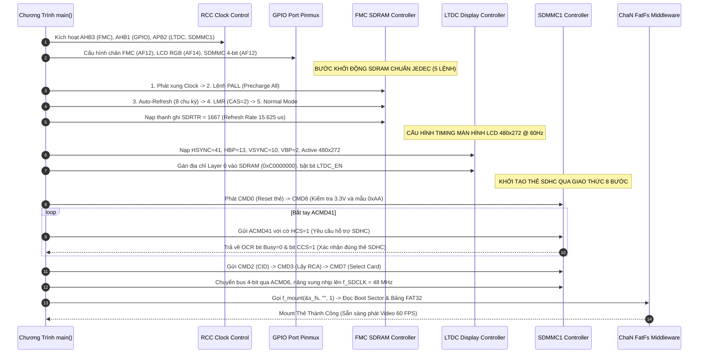
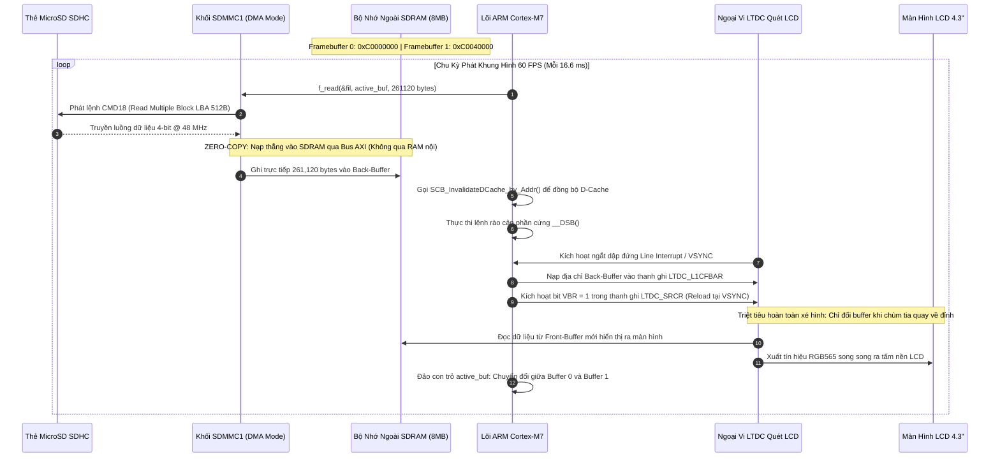
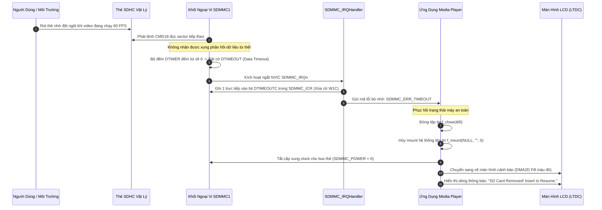

# Cẩm Nang Phỏng Vấn Dự Án 2: High-Speed Video Playback & SDHC Storage Subsystem

> **Hệ Thống:** Bare-Metal High-Speed 60 FPS Video Playback & SDHC Storage Subsystem  
> **Nền Tảng Phần Cứng:** STM32F746NG (ARM Cortex-M7 @ 216 MHz, MPU, L1 Cache 16KB)  
> **Phương Thức Lập Trình:** 100% Bare-Metal Register-Level (Không dùng HAL/LL, lập trình trực tiếp theo RM0385)  
> **Các Khối Ngoại Vi Cốt Lõi:** FMC SDRAM (108 MHz), SDMMC1 (48 MHz), LTDC (480x272 RGB565), DMA2D Chrom-ART, ChaN FatFs (FAT32)  
> **Tài liệu nền tảng tham chiếu:** [`day00_baremetal_foundations.md`](file:///d:/Project/STM32F7/day00_baremetal_foundations.md), [`sdmmc_fatfs_architecture.md`](file:///d:/Project/STM32F7/sdmmc_fatfs_architecture.md), STM32F746 Reference Manual (RM0385).

---

## MỤC LỤC TỔNG QUAN

- [0. DANH MỤC TÀI LIỆU GỐC & HƯỚNG DẪN TRA CỨU RM/DATASHEET (LOOKUP GUIDE)](#0-danh-mục-tài-liệu-gốc--hướng-dẫn-tra-cứu-rmdatasheet-lookup-guide)
  - [0.1. Danh Mục Tài Liệu Gốc Trọng Tâm (Official Documents)](#01-danh-mục-tài-liệu-gốc-trọng-tâm-official-documents)
  - [0.2. Hướng Dẫn Từng Bước Tra Cứu Reference Manual (RM0385)](#02-hướng-dẫn-từng-bước-tra-cứu-reference-manual-rm0385)
  - [0.3. Hướng Dẫn Từng Bước Tra Cứu Datasheet (DS10610) & Ghép Kênh Pinmux](#03-hướng-dẫn-từng-bước-tra-cứu-datasheet-ds10610--ghép-kênh-pinmux)
- [1. TỔNG QUAN HỆ THỐNG & BẢN ĐỒ BUS MATRIX PHẦN CỨNG](#1-tổng-quan-hệ-thống--bản-đồ-bus-matrix-phần-cứng)
  - [1.1. Mục Tiêu Kỹ Thuật & Các Con Số Định Lượng Cốt Lõi](#11-mục-tiêu-kỹ-thuật--các-con-số-định-lượng-cốt-lõi)
  - [1.2. Sơ Đồ Kiến Trúc Ma Trận Bus AXI 64-bit Đa Tầng & Bản Đồ Phân Bổ Vùng Nhớ SDRAM 8MB](#12-sơ-đồ-kiến-trúc-ma-trận-bus-axi-64-bit-đa-tầng--bản-đồ-phân-bổ-vùng-nhớ-sdram-8mb)
- [2. LÝ THUYẾT CỐT LÕI & CÔNG THỨC BẮT BUỘC PHẢI NHỚ](#2-lý-thuyết-cốt-lõi--công-thức-bắt-buộc-phải-nhớ)
  - [2.1. Bài Toán Băng Thông: Phát Video 60 FPS & Timing Quét Màn Hình LCD (LTDC Pixel Clock)](#21-bài-toán-băng-thông-phát-video-60-fps--timing-quét-màn-hình-lcd-ltdc-pixel-clock)
  - [2.2. FMC SDRAM: Chuỗi 5 Lệnh JEDEC, Bảng Thanh Ghi Cấu Hình & Công Thức Tính Refresh Rate Counter](#22-fmc-sdram-chuỗi-5-lệnh-jedec-bảng-thanh-ghi-cấu-hình--công-thức-tính-refresh-rate-counter)
  - [2.3. Chuẩn Hóa MicroSD SDHC: Block Addressing (LBA 512B) & Quy Trình Khởi Tạo 8 Bước SDMMC](#23-chuẩn-hóa-microsd-sdhc-block-addressing-lba-512b--quy-trình-khởi-tạo-8-bước-sdmmc)
  - [2.4. Bản Chất Bất Đồng Bộ L1 D-Cache Coherency Trên Nhân Cortex-M7 & Kiến Trúc Zero-Copy](#24-bản-chất-bất-đồng-bộ-l1-d-cache-coherency-trên-nhân-cortex-m7--kiến-trúc-zero-copy)
  - [2.5. Bản Chất Kiến Trúc Bus AXI vs AHB vs APB & Cơ Chế 5 Kênh Độc Lập](#25-bản-chất-kiến-trúc-bus-axi-vs-ahb-vs-apb--cơ-chế-5-kênh-độc-lập)
- [3. SƠ ĐỒ TUẦN TỰ HOẠT ĐỘNG (MERMAID SEQUENCE DIAGRAMS)](#3-sơ-đồ-tuần-tự-hoạt-động-mermaid-sequence-diagrams)
  - [3.1. Quy Trình Cấu Hình Khởi Động Phần Cứng (Peripheral Init Pipeline)](#31-quy-trình-cấu-hình-khởi-động-phần-cứng-peripheral-init-pipeline)
  - [3.2. Quy Trình Vận Hành Streaming Video Zero-Copy (Runtime Dataflow)](#32-quy-trình-vận-hành-streaming-video-zero-copy-runtime-dataflow)
  - [3.3. Quy Trình Xử Lý Sự Cố Phần Cứng An Toàn (Fault & Recovery Pipeline)](#33-quy-trình-xử-lý-sự-cố-phần-cứng-an-toàn-fault--recovery-pipeline)
- [4. PHÂN LOẠI LỖI THỰC TẾ VÀ ĐẶC THÙ PHẦN CỨNG](#4-phân-loại-lỗi-thực-tế-và-đặc-thù-phần-cứng)
  - [4.1. Nhóm Lỗi Phổ Biến (Common Bugs)](#41-nhóm-lỗi-phổ-biến-common-bugs)
  - [4.2. Nhóm Lỗi Kiến Trúc (Architectural Bugs)](#42-nhóm-lỗi-kiến-trúc-architectural-bugs)
  - [4.3. Nhóm Lỗi Ngoại Lệ và Góc Khuất Phần Cứng (Edge-Case Bugs)](#43-nhóm-lỗi-ngoại-lệ-và-góc-khuất-phần-cứng-edge-case-bugs)
- [5. BỘ CÂU HỎI PHỎNG VẤN & KỊCH BẢN TRẢ LỜI MẪU (FRESHER LEVEL)](#5-bộ-câu-hỏi-phỏng-vấn--kịch-bản-trả-lời-mẫu-fresher-level)

---

# 0. DANH MỤC TÀI LIỆU GỐC & HƯỚNG DẪN TRA CỨU RM/DATASHEET (LOOKUP GUIDE)

### 0.1. Danh Mục Tài Liệu Gốc Trọng Tâm (Official Documents)

| Tên Tài Liệu | Mã Hiệu / Phiên Bản | File Trong Thư Mục Dự Án | Nội Dung Tra Cứu Trọng Tâm |
| :--- | :--- | :--- | :--- |
| **STM32F7 Reference Manual** | `RM0385` (DocID027589 Rev 8) | [`RM.pdf`](file:///d:/Project/STM32F7/RM.pdf) | **Chương 13 (FMC SDRAM):** 5 lệnh JEDEC, thanh ghi `SDCR`, `SDTR`, `SDCMR`, `SDRTR`.<br>**Chương 29 (SDMMC1):** Lệnh CMD/RESP, FIFO, thanh ghi `CLKCR`, `DTIMER`, `STA`.<br>**Chương 18 (LTDC):** Timing màn hình, `SRCR` (VBR reload), `L1CFBAR`.<br>**Chương 19 (DMA2D):** Mode PFC, R2M, Blending. |
| **STM32F746 Datasheet** | `DS10610` (DocID027590 Rev 7) | [`STM32F745XX.PDF`](file:///d:/Project/STM32F7/STM32F745XX.PDF) | **Table 9 (Alternate functions):** Ghép kênh chân FMC (`AF12`), SDMMC1 (`AF12`), LTDC (`AF14`). Giới hạn xung nhịp APB2 tối đa 108 MHz, HCLK 216 MHz. |
| **Chip SDRAM Datasheet** | Micron `MT48LC4M32B2` | Tài liệu hãng Micron | Chu kỳ làm tươi `64 ms / 4096 rows`, CAS Latency 2 chu kỳ, các thông số tRAS, tRP, tRCD. |
| **Chuẩn Thẻ Nhớ SD Physical Layer** | SD Association `Version 4.10` | `Part1_Physical_Layer_Simplified` | Quy trình bắt tay 8 bước, cơ chế Block Addressing LBA 512B của thẻ SDHC (cờ HCS/CCS trong ACMD41 & OCR). |
| **ChaN FatFs Generic File System** | ChaN FatFs Module `R0.12c` | Thư viện nguồn `ff.c` / `diskio.c` | Hàm cầu nối tầng vật lý `disk_initialize`, `disk_read`, `disk_write`, `disk_ioctl` (hỗ trợ `GET_SECTOR_SIZE = 512`). |

---

### 0.2. Hướng Dẫn Từng Bước Tra Cứu Reference Manual (RM0385)

#### Bước 1: Tra cứu Địa chỉ Cơ sở (Base Address) các khối ngoại vi
1. Mở file [`RM.pdf`](file:///d:/Project/STM32F7/RM.pdf).
2. Nhấn `Ctrl + F` tìm: **`Memory map and register boundary addresses`** (Section 2.2.2).
3. Ghi nhận các địa chỉ cơ sở:
   * **FMC Controller:** `0xA0000000` (Thanh ghi điều khiển) | Vùng nhớ SDRAM Bank 1: **`0xC0000000`** (Dung lượng 8MB).
   * **SDMMC1 (APB2):** **`0x40012C00`**.
   * **LTDC (APB2):** **`0x40016800`**.
   * **DMA2D (AHB1):** **`0x4002B000`**.

#### Bước 2: Bảng Thanh Ghi Cốt Lõi Từng Khối Ngoại Vi (Register Map & Offsets)

##### 1. Khối FMC SDRAM (RM0385 Section 13.7):
* `FMC_SDCR1` (Offset `0x140`, Địa chỉ `0xA0000140`): Cấu hình độ rộng bus 32-bit, số bank, CAS Latency = 2, chia nhịp 108 MHz.
* `FMC_SDTR1` (Offset `0x144`, Địa chỉ `0xA0000144`): Nạp thời gian định thời tRCD, tRP, tRAS, tRC.
* `FMC_SDCMR` (Offset `0x150`, Địa chỉ `0xA0000150`): Phát chuỗi 5 lệnh JEDEC (Clock -> PALL -> Auto-Refresh -> LMR -> Normal).
* `FMC_SDRTR` (Offset `0x154`, Địa chỉ `0xA0000154`): Nạp giá trị bộ đếm làm tươi **`1667`**.
* `FMC_SDSR`  (Offset `0x158`, Địa chỉ `0xA0000158`): Polling cờ bận `BUSY = 0` sau mỗi lệnh JEDEC.

##### 2. Khối SDMMC1 (RM0385 Section 29.9):
* `SDMMC_POWER` (Offset `0x00`, Địa chỉ `0x40012C00`): Cấp nguồn bus (bit `PWRCTRL = 11`).
* `SDMMC_CLKCR` (Offset `0x04`, Địa chỉ `0x40012C04`): Chia tần số xung clock (400 kHz -> 48 MHz), chọn bus 4-bit (`WIDBUS`), bật `HWFC_EN`.
* `SDMMC_ARG`   (Offset `0x08`, Địa chỉ `0x40012C08`): Chứa tham số của lệnh CMD (số thứ tự Sector LBA khi đọc thẻ SDHC).
* `SDMMC_CMD`   (Offset `0x0C`, Địa chỉ `0x40012C0C`): Chứa mã lệnh Index (CMD0, CMD8, CMD18...) và loại phản hồi Response.
* `SDMMC_DTIMER`(Offset `0x24`, Địa chỉ `0x40012C24`): Bộ đếm thời gian timeout dữ liệu.
* `SDMMC_DLEN`  (Offset `0x28`, Địa chỉ `0x40012C28`): Số byte dữ liệu cần truyền (261,120 bytes cho 1 frame).
* `SDMMC_DCTRL` (Offset `0x2C`, Địa chỉ `0x40012C2C`): Bật khối truyền dữ liệu `DTEN = 1`, hướng đọc từ thẻ nhớ vào vi điều khiển.
* `SDMMC_STA`   (Offset `0x34`, Địa chỉ `0x40012C34`): Cờ trạng thái phần cứng (`DATAEND`, `DTIMEOUT`, `RXOVERR`).
* `SDMMC_ICR`   (Offset `0x38`, Địa chỉ `0x40012C38`): **Thanh ghi xóa cờ W1C** (Ghi 1 để xóa cờ ngắt).
* `SDMMC_FIFO`  (Offset `0x80`, Địa chỉ `0x40012C80`): Bộ đệm dữ liệu FIFO 32 words.

##### 3. Khối LTDC (RM0385 Section 18.7):
* `LTDC_SSCR`   (Offset `0x08`, Địa chỉ `0x40016808`): Cấu hình độ rộng đồng bộ HSYNC (41) và VSYNC (10).
* `LTDC_BPCR`   (Offset `0x0C`, Địa chỉ `0x4001680C`): Cấu hình Back Porch tích lũy: `HBP` và `VBP`.
* `LTDC_AWCR`   (Offset `0x10`, Địa chỉ `0x40016810`): Cấu hình vùng hoạt động tích lũy (Active Width 480, Active Height 272).
* `LTDC_TWCR`   (Offset `0x14`, Địa chỉ `0x40016814`): Cấu hình tổng chu kỳ quét tích lũy (Total Width 566, Total Height 286).
* `LTDC_SRCR`   (Offset `0x24`, Địa chỉ `0x40016824`): **Ghi bit `VBR = 1` để kích hoạt nạp dập đứng VSYNC Reload chống xé hình**.
* `LTDC_L1CFBAR`(Offset `0xAC`, Địa chỉ `0x400168AC`): Nạp địa chỉ Framebuffer lớp 1 (`0xC0000000` hoặc `0xC0040000`).

---

### 0.3. Hướng Dẫn Từng Bước Tra Cứu Datasheet (DS10610) & Pinmux

1. Mở file [`STM32F745XX.PDF`](file:///d:/Project/STM32F7/STM32F745XX.PDF).
2. Nhấn `Ctrl + F` tìm: **`Table 9. Alternate function mapping`**:
   * **Ngoại vi FMC SDRAM:** Kéo đến cột **`AF12`** -> Tra cứu các chân dữ liệu D0-D31 (PD0, PD1, PD8..10, PD14..15, PE0..1, PE7..15, PF0..5, PF11..15, PG0..2, PG4..5, PG8..10, PG15), chân điều khiển SDCKE0 (PC3), SDCLK (PG8), SDNE0 (PC2), SDNRAS (PF11), SDNCAS (PG15), SDNWE (PC0).
   * **Ngoại vi SDMMC1:** Kéo đến cột **`AF12`** -> Chân SDMMC1_D0 (PC8), D1 (PC9), D2 (PC10), D3 (PC11), CK (PC12), CMD (PD2).
   * **Ngoại vi LTDC:** Kéo đến cột **`AF14`** -> Chân Pixel Clock CLK (PE14), DE (PK7), HSYNC (PI10), VSYNC (PI9), các đường màu R0-R7, G0-G7, B0-B7.

---

# 1. TỔNG QUAN HỆ THỐNG & BẢN ĐỒ BUS MATRIX PHẦN CỨNG

### 1.1. Mục Tiêu Kỹ Thuật & Các Con Số Định Lượng Cốt Lõi

Dự án hiện thực một **Trình Phát Video và Đồ Họa 60 FPS Tốc Độ Cao** chạy trực tiếp trên thanh ghi phần cứng (Bare-Metal) của chip ARM Cortex-M7 STM32F746NG. Hệ thống đọc trực tiếp luồng video nhị phân thô từ thẻ nhớ MicroSD SDHC qua giao thức FAT32, giải phóng dữ liệu theo kiến trúc **Zero-Copy Streaming** vào bộ nhớ ngoài SDRAM 8MB và hiển thị lên màn hình LCD 4.3 inch qua bộ điều khiển LTDC đồng bộ với bộ tăng tốc đồ họa DMA2D Chrom-ART.

| Khối Phần Cứng | Thông Số Vận Hành Định Lượng | Cơ Sở Kỹ Thuật & Vai Trò Trong Dự Án |
| :--- | :--- | :--- |
| **Lõi MCU** | ARM Cortex-M7 @ `216 MHz` | Kích hoạt L1 I-Cache (`16 KB`), D-Cache (`16 KB`), bộ bảo vệ MPU. |
| **Màn hình LCD** | TFT 4.3 inch (`480 x 272`) | Chuẩn màu RGB565 (16-bit, 2 bytes/pixel). Điểm quét pixel clock `f_PCLK ~ 9.0 MHz`. |
| **Bộ nhớ ngoài FMC** | Micron SDRAM 8MB (32-bit bus) | Xung nhịp bus `f_SDCLK = 108 MHz` (từ `f_HCLK / 2`). Chứa Double Framebuffer. |
| **Ngoại vi SDMMC1** | MicroSD SDHC (4GB - 32GB) | Bus 4-bit, xung nhịp `f_SDCLK = 48 MHz` (từ `PLL48CLK`), đọc thực tế `~ 18 MB/s`. |
| **Băng thông Video** | `15.66 MB/s` liên tục | Phát liên tục 60 FPS chuẩn không giật lag (`18 MB/s > 15.66 MB/s`). |
| **Tải chiếm dụng CPU** | `~ 0%` khi phát video | Nhờ kiến trúc Zero-Copy đọc thẳng từ SDMMC nạp vào SDRAM ngoài và LTDC tự quét. |
| **Hiện tượng xé hình** | Triệt tiêu hoàn toàn (`0 tearing`) | Kỹ thuật Double Framebuffer kết hợp đồng bộ ngắt dập đứng `VSYNC` (`VBR` bit). |

---

### 1.2. Sơ Đồ Kiến Trúc Ma Trận Bus AXI 64-bit Đa Tầng & Bản Đồ Phân Bổ Vùng Nhớ SDRAM 8MB

Trên STM32F746, ma trận Bus AXI 64-bit liên kết nhiều Master với nhiều Slave độc lập, cho phép **truy xuất đồng thời (Concurrent Access)** giữa các khối ngoại vi mà không làm nghẽn lõi CPU:

```text
┌──────────────────────────────────────────────────────────────────────────────────────────────────┐
│                               MA TRẬN BUS AXI 64-BIT ĐA TẦNG (STM32F746)                        │
│                                                                                                  │
│   ┌────────────────────────┐  ┌────────────────────────┐  ┌──────────────────────────────────┐   │
│   │  Cortex-M7 Core CPU    │  │   LTDC Display Master  │  │      DMA2D Chrom-ART Master      │   │
│   │  (Master M0: D-Cache)  │  │   (Master M3: LCD FIFO)│  │      (Master M4: Graphics)       │   │
│   └───────────┬────────────┘  └───────────┬────────────┘  └────────────────┬─────────────────┘   │
│               │                           │                                │                     │
│   ════════════╪═══════════════════════════╪════════════════════════════════╪════════════════    │
│               │                           │                                │  AXI CROSSBAR MATRIX
│               ▼                           ▼                                ▼                     │
│   ┌──────────────────────────────────────────────────────────────────────────────────────────┐   │
│   │            BỘ ĐIỀU KHIỂN BỘ NHỚ NGOÀI FMC (Flexible Memory Controller - Slave S3)        │   │
│   │            - Địa chỉ vật lý cơ sở SDRAM Bank 1: 0xC0000000 (Dung lượng 8MB, 32-bit Bus)  │   │
│   └───────────────────────────────────────────┬──────────────────────────────────────────────┘   │
│                                               ▼                                                  │
│   ┌──────────────────────────────────────────────────────────────────────────────────────────┐   │
│   │                        BẢN ĐỒ BỘ NHỚ CHI TIẾT CỦA CHIP SDRAM 8MB                         │   │
│   │  • 0xC0000000 -> 0xC003FFFF (256 KB): Framebuffer 0 (Front-Buffer: 480x272 RGB565)       │   │
│   │  • 0xC0040000 -> 0xC007FFFF (256 KB): Framebuffer 1 (Back-Buffer: 480x272 RGB565)        │   │
│   │  • 0xC0080000 -> 0xC01FFFFF (1.5 MB): Sprite Sheet, Font chữ & Asset đồ họa tĩnh        │   │
│   │  • 0xC0200000 -> 0xC07FFFFF (6.0 MB): Bộ đệm DMA2D Blending & Vùng nhớ ứng dụng mở rộng  │   │
│   └──────────────────────────────────────────────────────────────────────────────────────────┘   │
│                                                                                                  │
│   ═══════════════════════════════════════════════════════════════════════════════════════════    │
│               ▲                                                              ▲                   │
│               │ Cầu nối AHB-to-APB2                                          │ Cầu nối AHB-to-APB2
│   ┌───────────┴────────────────────────┐                         ┌───────────┴───────────────┐   │
│   │ Ngoại vi SDMMC1 (Base: 0x40012C00) │                         │ Ngoại vi LTDC Controller  │   │
│   │ - Bus APB2 @ 108 MHz / 48 MHz Clk  │                         │ (Base: 0x40016800)        │   │
│   └────────────────────────────────────┘                         └───────────────────────────┘   │
└──────────────────────────────────────────────────────────────────────────────────────────────────┘
```

---

# 2. LÝ THUYẾT CỐT LÕI & CÔNG THỨC BẮT BUỘC PHẢI NHỚ

### 2.1. Bài Toán Băng Thông: Phát Video 60 FPS & Timing Quét Màn Hình LCD (LTDC Pixel Clock)

Để hệ thống phát video 60 FPS mượt mà không bị xé hình hay chớp tắt, ta cần giải bài toán tính toán băng thông trên hai mặt trận: **Băng thông nạp từ thẻ nhớ** và **Băng thông quét màn hình LCD**:

#### A. Bài toán nạp Video 60 FPS từ Thẻ Nhớ SDHC:
* **Kích thước khung hình LCD 4.3 inch:** `480 x 272 = 130,560 pixels`.
* **Định dạng màu RGB565:** Mỗi điểm ảnh chiếm 16-bit (`2 bytes`).
  ```text
  Dung lượng 1 khung hình (Frame Size) = 130,560 * 2 = 261,120 bytes (~ 255 KB)
  ```
* **Băng thông yêu cầu liên tục để phát đủ 60 FPS:**
  ```text
  Băng thông cần = 261,120 bytes * 60 frames/s = 15,667,200 bytes/s (~ 15.66 MB/s)
  ```
* **Năng lực truyền dẫn phần cứng của SDMMC1 trên STM32F7:**
  * Khối ngoại vi sử dụng xung nhịp cấp chuyên dụng `f_SDCLK = 48 MHz` (từ khối `PLL48CLK`).
  * Giao tiếp qua bus dữ liệu **4-bit** song song:
    ```text
    Băng thông tối đa lý thuyết = 48 MHz * 4 bits = 192 Mbps = 24.0 MB/s
    ```
  * Tốc độ đọc tuần tự thực đo của thẻ SDHC Class 10 / UHS-I qua FatFs đạt **`~ 18.0 MB/s`**.
  * Kết luận: `18.0 MB/s > 15.66 MB/s` -> Đáp ứng hoàn hảo 60 FPS!

#### B. Bài toán Timing quét màn hình LCD (LTDC Pixel Clock):
Một chu kỳ quét toàn bộ màn hình 480x272 ở tần số làm tươi `60 Hz` đòi hỏi phải cấu hình các khoảng dập xung ngang (Horizontal Blanking) và dập xung dọc (Vertical Blanking) để tấm nền LCD kịp ổn định điện áp điểm ảnh:
* **Thông số quét ngang (Horizontal Timings):**
  * `HSYNC (Độ rộng xung đồng bộ ngang)` = 41 pixels.
  * `HBP (Horizontal Back Porch)` = 13 pixels.
  * `Active Width (Vùng hiển thị hoạt động)` = 480 pixels.
  * `HFP (Horizontal Front Porch)` = 32 pixels.
  * `Tổng chu kỳ ngang: H_TOTAL = 41 + 13 + 480 + 32 = 566 pixels`.
* **Thông số quét dọc (Vertical Timings):**
  * `VSYNC (Độ rộng xung đồng bộ dọc)` = 10 lines.
  * `VBP (Vertical Back Porch)` = 2 lines.
  * `Active Height (Vùng hiển thị hoạt động)` = 272 lines.
  * `VFP (Vertical Front Porch)` = 2 lines.
  * `Tổng chu kỳ dọc: V_TOTAL = 10 + 2 + 272 + 2 = 286 lines`.
* **Tần số xung nhịp điểm ảnh Pixel Clock (f_PCLK):**
  ```text
  f_PCLK = H_TOTAL * V_TOTAL * Tần số làm tươi
         = 566 pixels * 286 lines * 60 Hz
         = 9,712,560 Hz ~ 9.7 MHz
  ```
  *(Cấu hình nguồn xung `PLLSAI` trên STM32F7 để chia ra xung nhịp `f_PCLK ~ 9.5 MHz - 9.7 MHz`).*
* **Băng thông kéo dữ liệu liên tục của LTDC từ SDRAM:**
  ```text
  Băng thông kéo LTDC = 9.7 MHz * 2 bytes/pixel = 19.4 MB/s
  ```
* **Năng lực đáp ứng của bộ nhớ ngoài SDRAM 32-bit @ 108 MHz:**
  ```text
  Băng thông cực đại của SDRAM = 108 MHz * 4 bytes (32-bit) = 432.0 MB/s
  ```
  Tổng băng thông hệ thống cần lúc cao điểm: `19.4 MB/s (LTDC đọc) + 15.66 MB/s (SDMMC nạp vào) + 20 MB/s (DMA2D blend) = ~ 55 MB/s`. Con số này chỉ chiếm khoảng **12.7% băng thông của SDRAM**, hoàn toàn không xảy ra hiện tượng nghẽn bus!

---

### 2.2. FMC SDRAM: Chuỗi 5 Lệnh JEDEC, Bảng Thanh Ghi Cấu Hình & Công Thức Tính Refresh Rate Counter

#### A. Chuỗi 5 Lệnh Khởi Động Bắt Buộc Theo Chuẩn JEDEC (RM0385 Section 13.7.4):
Khối ngoại vi FMC không tự động kích hoạt SDRAM khi bật nguồn mà bắt buộc CPU phải phát tuần tự chuỗi 5 lệnh điều khiển thông qua thanh ghi `FMC_SDCMR`:
1. **Clock Configuration Enable:** Bật bộ phát xung cấp nhịp `f_SDCLK` cho SDRAM (Lệnh `SDCMR[2:0] = 001`).
2. **PALL (Precharge All):** Đưa toàn bộ 4 banks nội của SDRAM về trạng thái nghỉ ban đầu (Lệnh `SDCMR[2:0] = 010`).
3. **Auto-Refresh Command:** Phát liên tiếp ít nhất **8 chu kỳ Auto-Refresh** để định hình điện tích cho các tụ điện lưu trữ cell nhớ (Lệnh `SDCMR[2:0] = 011`, nạp số chu kỳ `NRFS[3:0] = 7` tương đương 8 lần).
4. **Load Mode Register (LMR):** Nạp thanh ghi cấu hình nội của chip SDRAM thông qua trường `MRD[12:0]` (Lệnh `SDCMR[2:0] = 100`):
   - Đặt Burst Length = 1.
   - Burst Type = Sequential.
   - **CAS Latency = 2 chu kỳ clock** (Độ trễ từ khi phát lệnh đọc đến khi dữ liệu xuất hiện trên bus).
   - Write Burst Mode = Single Bit.
5. **Normal Mode:** Đưa chip SDRAM vào trạng thái vận hành bình thường sẵn sàng đọc ghi (Lệnh `SDCMR[2:0] = 000`).

#### B. Các Tham Số Định Thời Trong Thanh Ghi FMC_SDCR1 & FMC_SDTR1:
* **Thanh ghi điều khiển `FMC_SDCR1`:**
  * `NC[1:0] = 00`: 8 bit địa chỉ cột (Column Address Bits).
  * `NR[1:0] = 01`: 12 bit địa chỉ hàng (Row Address Bits -> 4,096 rows).
  * `MWID[1:0] = 10`: Độ rộng bus dữ liệu 32-bit.
  * `NB = 1`: 4 internal memory banks.
  * `CAS[1:0] = 10`: CAS Latency = 2 clock cycles.
  * `SDCLK[1:0] = 10`: Xung nhịp bus SDRAM = `f_HCLK / 2 = 216 MHz / 2 = 108 MHz`.
* **Thanh ghi định thời `FMC_SDTR1` (Tính theo chu kỳ clock 9.26 ns):**
  * `TMRD = 2`: Load Mode Register to Active delay.
  * `TXSR = 7`: Exit Self-refresh delay.
  * `TRAS = 4`: Self refresh time.
  * `TRC = 7`: Row cycle delay.
  * `TWR = 2`: Write recovery time.
  * `TRP = 2`: Row precharge delay.
  * `TRCD = 2`: Row to column delay.

#### C. Công Thức Tính Thanh Ghi Tốc Độ Làm Tươi (FMC_SDRTR):
Chip SDRAM MT48LC4M32B2 có `4,096 rows` và yêu cầu phải được làm tươi toàn bộ trong khoảng thời gian `T_REFRESH = 64 ms`.
```text
1. Thời gian làm tươi cho từng dòng riêng biệt:
   t_ROW_REFRESH = 64 ms / 4,096 rows = 15.625 us

2. Tần số xung nhịp bus SDRAM:
   f_SDCLK = f_HCLK / 2 = 216 MHz / 2 = 108 MHz

3. Chu kỳ 1 xung nhịp bus SDRAM:
   t_CK = 1 / 108 MHz ~ 9.26 ns

4. Công thức nạp thanh ghi FMC_SDRTR theo Reference Manual RM0385:
   COUNT = (t_ROW_REFRESH * f_SDCLK) - 20
         = (15.625 us * 108 MHz) - 20
         = 1,687.5 - 20
         = 1667.5 -> Nạp giá trị 1667

5. Lệnh ghi vào thanh ghi:
   FMC_Bank5_6->SDRTR |= (1667 << 1); /* Nạp vào trường COUNT[13:0] */
```

---

### 2.3. Chuẩn Hóa MicroSD SDHC: Block Addressing (LBA 512B) & Quy Trình Khởi Tạo 8 Bước SDMMC

| Tiêu Chí So Sánh | Thẻ SDSC Cũ (`<= 2 GB`) | Thẻ Chuẩn Hóa SDHC (`4 GB - 32 GB`) |
| :--- | :--- | :--- |
| **Cơ chế định chỉ** | **Byte Addressing** | **Block Addressing (LBA 512 Bytes)** |
| **Tham số lệnh CMD17/18** | Địa chỉ Byte tuyệt đối (`LBA * 512`) | Số thứ tự Block/Sector nguyên bản (`LBA`) |
| **Giới hạn 32-bit Address** | Bị kịch trần tại `2^32 = 4 GB` (Thực tế chỉ dùng `<= 2 GB`). | Quản lý tới `2^32 blocks * 512 B = 2 TB`. |
| **Khởi tạo ACMD41** | Bit HCS = 0 | **Bit HCS = 1 (Host Capacity Support)** |
| **Cờ kiểm tra OCR** | Bit CCS = 0 | **Bit CCS = 1 (Card Capacity Status)** |

#### Quy Trình Handshake 8 Bước Khởi Tạo Thẻ SDHC Chuẩn Công Nghiệp:
1. **Cấp xung khởi tạo chậm (Identification Phase):** Đặt xung `f_SDCLK = 400 kHz` trong `SDMMC_CLKCR` để tương thích với mọi loại thẻ nhớ khi mới cấp nguồn.
2. **CMD0 (GO_IDLE_STATE, Arg: `0x00000000`):** Đưa thẻ về trạng thái Idle, reset toàn bộ logic nội bộ của thẻ.
3. **CMD8 (SEND_IF_COND, Arg: `0x000001AA`):** Kiểm tra dải điện áp làm việc (2.7V - 3.6V) và kiểm tra mẫu thử Check Pattern `0xAA`. Nếu thẻ trả về đúng `0x000001AA` -> Xác nhận thẻ tuân thủ chuẩn SD Version 2.0 trở lên.
4. **Vòng lặp CMD55 + ACMD41 (SD_SEND_OP_COND, Arg: `0x40100000`):**
   - Bit 30 (`HCS = 1`): Báo cho thẻ biết Vi điều khiển hỗ trợ chế độ dung lượng cao SDHC.
   - Thẻ thực hiện quá trình khởi tạo điện áp nội bộ. Ta polling đọc thanh ghi OCR cho đến khi bit 31 (`Busy = 0`) báo hiệu hoàn tất.
   - Kiểm tra bit 30 của OCR (`CCS - Card Capacity Status`): Nếu `CCS = 1` -> **Xác nhận 100% là thẻ SDHC Block Addressing**!
5. **CMD2 (ALL_SEND_CID):** Yêu cầu thẻ gửi toàn bộ chuỗi 128-bit thông tin nhận dạng (Card Identification Data: Mã nhà sản xuất, Serial number).
6. **CMD3 (SET_RELATIVE_ADDR):** Yêu cầu thẻ tự phát sinh địa chỉ tương đối **RCA (Relative Card Address)** 16-bit dùng cho việc chọn thẻ sau này.
7. **CMD7 (SELECT_CARD, Arg: `RCA << 16`):** Chọn thẻ có địa chỉ RCA tương ứng, chuyển thẻ từ trạng thái Standby sang **Transfer State**.
8. **Chuyển Bus 4-bit & Tăng Tốc Độ Cực Đại:**
   - Phát chuỗi `CMD55` + `ACMD6` với tham số `0x02` để chuyển bus dữ liệu từ 1-bit sang **4-bit song song**.
   - Ghi thanh ghi `SDMMC_CLKCR` nâng tần số phát xung lên tốc độ tối đa **`f_SDCLK = 48 MHz`**.

---

### 2.4. Bản Chất Bất Đồng Bộ L1 D-Cache Coherency Trên Nhân Cortex-M7 & Kiến Trúc Zero-Copy

Nhân Cortex-M7 là nhân vi xử lý có hiệu năng cực cao nhờ tích hợp hai khối bộ đệm L1 riêng biệt:
* **I-Cache (Instruction Cache):** `16 KB`, bộ đệm lệnh nạp từ Flash/RAM.
* **D-Cache (Data Cache):** `16 KB`, tổ chức thành các dòng **Cache Line dài đúng 32 bytes**.

#### Nguyên nhân gây ra lỗi vỡ hình D-Cache Coherency:
* Trong kiến trúc máy tính, ngoại vi SDMMC là một **AXI Bus Master độc lập**. Khi đọc dữ liệu từ thẻ nhớ, DMA của SDMMC đẩy các khối byte trực tiếp qua ma trận Bus AXI vào thẳng chip nhớ SDRAM ngoài (`0xC0000000`) mà **hoàn toàn không đi qua lõi CPU**.
* Trong khi đó, L1 D-Cache nằm gắn liền bên trong lõi CPU. Nếu trước thời điểm DMA nạp dữ liệu, CPU đã từng truy cập vào vùng nhớ này, các ô nhớ cũ vẫn đang được lưu giữ trong L1 D-Cache.
* Khi ứng dụng hoặc khối hiển thị đọc lại vùng Framebuffer, CPU lấy dữ liệu cũ từ D-Cache thay vì nạp dữ liệu mới từ SDRAM ngoài, khiến cho khung hình hiển thị bị vỡ vụn, các đường sọc ngang xuất hiện và hình ảnh bị giật lùi về quá khứ!

#### Quy Trình 3 Bước Xử Lý Triệt Để Bằng Phần Cứng:
1. **Căn lề bộ đệm đúng 32 bytes (Cache Line Boundary):**
   ```c
   /* Bắt buộc căn lề 32 bytes để không làm ảnh hưởng các biến nằm liền kề */
   __attribute__((aligned(32))) static uint8_t s_frame_buffer[261120];
   ```
2. **Hủy hiệu lực bộ đệm Cache (Cache Invalidation):**
   ```c
   /* Xóa hiệu lực Cache Line ứng với dải địa chỉ Framebuffer */
   SCB_InvalidateDCache_by_Addr((uint32_t *)frame_addr, LCD_FRAME_SIZE);
   ```
   Lệnh này ép nhân Cortex-M7 đánh dấu toàn bộ các dòng Cache chứa dải địa chỉ này là "Dirty/Invalid", bắt buộc lần đọc tiếp theo CPU phải kéo dữ liệu mới nhất từ SDRAM ngoài.
3. **Chèn rào cản đồng bộ bộ nhớ phần cứng (Data Synchronization Barrier):**
   ```c
   __asm volatile ("dsb 0xF" ::: "memory");
   ```
   Chỉ thị `DSB` đảm bảo toàn bộ các giao dịch bus bộ nhớ trong đường ống (Store Buffers & AXI Pipeline) đã hoàn tất 100% trước khi câu lệnh tiếp theo được phép thực thi.

---

### 2.5. Bản Chất Kiến Trúc Bus AXI vs AHB vs APB & Cơ Chế 5 Kênh Độc Lập

Trong kiến trúc chip ARM Cortex-M, hệ thống bus truyền dẫn thuộc họ **AMBA (Advanced Microcontroller Bus Architecture)** được tổ chức phân cấp rõ rệt:

#### A. So Sánh 3 Chuẩn Bus: APB vs AHB vs AXI:

| Tiêu Chí So Sánh | **APB (Peripheral Bus)** | **AHB (High-performance Bus)** | **AXI (eXtensible Interface)** |
| :--- | :--- | :--- | :--- |
| **Phân cấp tầng** | Tầng thấp nhất (Ngoại vi chậm) | Tầng trung gian (DMA, SRAM nội) | **Tầng cao nhất (CPU Cache, SDRAM, LCD)** |
| **Độ rộng Bus** | 16-bit hoặc 32-bit | 32-bit | **64-bit** (Băng thông gấp đôi AHB) |
| **Cơ chế đọc/ghi** | Bán song công (Half-Duplex) | Bán song công (Chia sẻ đường truyền) | **Song công toàn phần (Full-Duplex): Đọc & Ghi đồng thời** |
| **Kiểu truyền** | Từng từ đơn lẻ, có chu kỳ chờ | Đường ống (Pipelined), truyền Burst | **5 Kênh truyền tín hiệu hoàn toàn độc lập** |
| **Tốc độ xung nhịp** | Max 54 MHz (APB1) / 108 MHz (APB2) | Max 216 MHz (HCLK) | **Max 216 MHz (HCLK)** |
| **Ngoại vi tiêu biểu**| UART, I2C, SPI, CAN, Timer | SDMMC1, USB, SRAM1/2 nội | **Cortex-M7, FMC SDRAM, LTDC, DMA2D** |

#### B. Cơ Chế 5 Kênh Tín Hiệu Độc Lập Của AXI Bus:
Trong khi AHB bắt mọi giao dịch đọc và ghi phải tuần tự chen chúc nhau trên cùng một cặp bus địa chỉ/dữ liệu, AXI chia thành **5 kênh vật lý độc lập**:
1. **AR (Read Address Channel):** Master gửi địa chỉ và thông tin điều khiển muốn đọc.
2. **R (Read Data Channel):** Slave gửi dữ liệu đọc được về cho Master (kèm tín hiệu kết thúc `RLAST`).
3. **AW (Write Address Channel):** Master gửi địa chỉ và thông tin điều khiển muốn ghi.
4. **W (Write Data Channel):** Master đẩy luồng dữ liệu cần ghi sang Slave (kèm tín hiệu `WLAST`).
5. **B (Write Response Channel):** Slave phản hồi xác nhận ghi thành công (`BRESP`).

```text
MASTER (CPU / LTDC / DMA2D)                                  SLAVE (FMC SDRAM / Flash)
┌────────────────────────────────┐                           ┌─────────────────────────────┐
│ 1. Read Address Channel (AR)   │ ═════════════════════════►│ Gửi địa chỉ cần đọc         │
│ 2. Read Data Channel (R)       │ ◄═════════════════════════│ Đẩy dữ liệu đọc về          │
│                                │                           │                             │
│ 3. Write Address Channel (AW)  │ ═════════════════════════►│ Gửi địa chỉ cần ghi         │
│ 4. Write Data Channel (W)      │ ═════════════════════════►│ Đẩy dữ liệu cần ghi         │
│ 5. Write Response Channel (B)  │ ◄═════════════════════════│ Phản hồi ghi thành công (OK)│
└────────────────────────────────┘                           └─────────────────────────────┘
```

#### C. Hai Tính Năng Đột Phá Khác Của AXI:
* **Multiple Outstanding Addresses:** Master có thể phát liên tiếp nhiều yêu cầu đọc trước mà không cần chờ dữ liệu của yêu cầu đầu tiên trả về, giúp triệt tiêu độ trễ nạp dòng CAS của chip nhớ ngoài SDRAM.
* **Out-of-Order Completion:** Mỗi gói tin đều gắn thẻ Transaction ID (`ARID`, `RID`). Các Slave nhanh (như SRAM nội) có thể trả kết quả trước các Slave chậm (như SDRAM ngoài) mà không gây tắc nghẽn hàng đợi (Head-of-Line Blocking).

---

# 3. SƠ ĐỒ TUẦN TỰ HOẠT ĐỘNG (MERMAID SEQUENCE DIAGRAMS)

### 3.1. Quy Trình Cấu Hình Khởi Động Phần Cứng (Peripheral Init Pipeline)



---

### 3.2. Quy Trình Vận Hành Streaming Video Zero-Copy (Runtime Dataflow)



---

### 3.3. Quy Trình Xử Lý Sự Cố Phần Cứng An Toàn (Fault & Recovery Pipeline)



---

# 4. PHÂN LOẠI LỖI THỰC TẾ VÀ ĐẶC THÙ PHẦN CỨNG

### 4.1. Nhóm Lỗi Phổ Biến (Common Bugs)

#### Bug 1: Quên cấp xung clock APB2 cho SDMMC1 hoặc AHB3 cho FMC
* **Triệu chứng:** Ngay dòng code đầu tiên ghi cấu hình thanh ghi `FMC->SDCR[0] = ...` hoặc `SDMMC1->CLKCR = ...`, vi điều khiển lập tức nhảy thẳng vào hàm `HardFault_Handler` hoặc treo cứng cờ trạng thái.
* **Nguyên nhân cốt lõi:** Trên vi điều khiển STM32, toàn bộ ngoại vi khi khởi động đều bị ngắt clock để tiết kiệm điện năng. Nếu cố tình truy xuất đọc/ghi vào vùng địa chỉ của ngoại vi khi thanh ghi `RCC_AHB3ENR` hoặc `RCC_APB2ENR` chưa được bật, bus matrix sẽ trả về lỗi truy cập bộ nhớ cấm (**Precise Bus Fault**).
* **Cách xử lý:** Luôn tuân thủ nguyên tắc vàng 4 bước: Bật clock RCC trước, cấu hình chân GPIO Alternate Function sau, rồi mới được ghi vào thanh ghi ngoại vi.

#### Bug 2: Nhân nhầm hệ số 512 khi đọc thẻ SDHC (Lỗi tràn số nguyên 32-bit)
* **Triệu chứng:** Thẻ nhớ SDHC 16GB nạp video đọc bình thường trong vài phút đầu tiên; nhưng khi video chạy đến phân đoạn lớn hơn 4GB thì toàn bộ dữ liệu trả về đều bằng 0 hoặc hàm `f_read()` báo lỗi `FR_DISK_ERR`.
* **Nguyên nhân:** Lập trình viên bê nguyên mã nguồn của thẻ SDSC cũ: `uint32_t byte_addr = sector * 512;`. Khi thẻ đọc tới Sector thứ `8,388,608` (`8,388,608 * 512 = 4,294,967,296 = 2^32`), biến `byte_addr` bị tràn về 0. Lệnh CMD17 truyền tham số 0 khiến thẻ quay lại đọc Sector 0 của Master Boot Record thay vì đọc dữ liệu video.
* **Cách xử lý:** Trong driver SDMMC chuẩn hóa cho SDHC, tham số của CMD17/CMD18 chính là số thứ tự `sector` (Block Addressing). Tuyệt đối không nhân 512!

#### Bug 3: Hiện tượng xé hình (Screen Tearing) khi đổi Framebuffer
* **Triệu chứng:** Khi phát video có cảnh chuyển động nhanh (xe chạy, phụ đề lướt), trên màn hình LCD xuất hiện một đường cắt ngang giật giật, phần trên hiển thị khung hình mới còn phần dưới hiển thị khung hình cũ.
* **Nguyên nhân:** Đổi địa chỉ thanh ghi `LTDC_L1CFBAR` giữa lúc chùm tia quét của LTDC đang quét dở ở dòng thứ 100 của màn hình. Dòng 0 đến 100 hiển thị frame cũ, dòng 101 đến 272 hiển thị frame mới.
* **Cách xử lý:** Sử dụng cơ chế nạp bóng tại ngắt VSYNC: Sau khi ghi địa chỉ Framebuffer mới vào `LTDC_L1CFBAR`, ghi bit `VBR = 1` (Vertical Blanking Reload) vào thanh ghi `LTDC_SRCR`. Thanh ghi chỉ thực sự được nạp khi chùm tia quét xong dòng cuối cùng 272 và quay về đỉnh màn hình.

---

### 4.2. Nhóm Lỗi Kiến Trúc (Architectural Bugs)

#### Bug 4: Bất đồng bộ D-Cache Coherency gây sọc rác và vỡ nát hình ảnh
* **Triệu chứng:** Tốc độ đọc từ thẻ nhớ báo về rất cao, nhưng hình ảnh trên LCD bị nhòe màu, các mảng điểm ảnh bị xô lệch hoặc hiển thị lại các khung hình của vài giây trước đó.
* **Nguyên nhân:** Khối SDMMC DMA nạp thẳng dữ liệu điểm ảnh vào SDRAM ngoài. Nhưng Cortex-M7 có bộ đệm L1 D-Cache `16 KB`. Lõi CPU và bộ điều khiển hiển thị đọc dữ liệu từ Cache cũ thay vì đọc dữ liệu mới dưới SDRAM.
* **Giải pháp 3 bước:**
  1. Đảm bảo mảng bộ đệm căn lề `32 bytes` bằng `__attribute__((aligned(32)))`.
  2. Gọi lệnh Invalidate Cache: `SCB_InvalidateDCache_by_Addr((uint32_t *)addr, size)` để ép xóa dữ liệu Cache cũ trước khi hiển thị.
  3. Gọi chỉ thị rào cản phần cứng `__asm volatile ("dsb 0xF" ::: "memory");` để đồng bộ toàn bộ chuỗi bus bộ nhớ.

#### Bug 5: Tranh chấp Bus Matrix AXI / FMC SDRAM Contention
* **Triệu chứng:** Khi chạy video 60 FPS kết hợp với việc gọi hàm `DMA2D` để fill màu hoặc vẽ icon đè lên màn hình, màn hình LCD thỉnh thoảng bị chớp đen một khung hình hoặc nháy sọc trắng.
* **Nguyên nhân:** Cả 3 Master gồm CPU, LTDC và DMA2D cùng truy cập vào bộ nhớ ngoài SDRAM 8MB thông qua một bộ điều khiển FMC duy nhất chạy ở xung nhịp `108 MHz`. Nếu DMA2D chiếm giữ bus AXI quá lâu, FIFO nội của ngoại vi LTDC bị rỗng (FIFO Underflow Error cờ `FEIF` trong `LTDC_ISR`) do không kịp lấy dữ liệu bắn ra màn hình LCD đúng thời gian thực của điểm ảnh.
* **Cách xử lý:**
  1. Cấu hình độ ưu tiên trọng tài Bus Matrix (Bus Matrix GPV): Nâng quyền ưu tiên của LTDC (Master 3) lên cao nhất, hạ quyền của DMA2D xuống thấp hơn.
  2. Bật cờ ngắt `TERRIE` và `FUIE` của LTDC để phát hiện FIFO Underflow và tự động reload.

#### Bug 6: Sụt giảm FPS do hiện tượng phân mảnh tập tin (File Fragmentation) trên FAT32
* **Triệu chứng:** Video phát rất mượt trong 10 giây đầu (đủ 60 FPS), nhưng sau đó đột ngột bị giật cục, FPS tụt xuống còn 30 - 40 FPS rồi lại tăng lên.
* **Nguyên nhân:** File video trên thẻ nhớ bị lưu trữ rải rác trên các Cluster không liên tục do thẻ đã từng xóa ghi nhiều lần. Khi đọc qua ranh giới cụm phân mảnh, ngoại vi SDMMC phải kết thúc lệnh đọc liên tục CMD18, phát lệnh dừng CMD12, rồi phát lệnh CMD18 mới tại địa chỉ Cluster khác. Độ trễ tìm kiếm (Seek Latency) của chip nhớ NAND Flash làm sụt băng thông tức thời từ `18 MB/s` xuống còn `< 8 MB/s`.
* **Cách xử lý:** 
  1. Khi format thẻ FAT32 trên máy tính, chọn kích thước cụm phân bổ lớn: **Allocation Unit Size = 32 KB hoặc 64 KB**.
  2. Sử dụng công cụ ghi file liên tục (Contiguous File Pre-allocation) để đảm bảo file video nằm trọn vẹn trên các sector vật lý liền kề nhau 100%.

---

### 4.3. Nhóm Lỗi Ngoại Lệ và Góc Khuất Phần Cứng (Edge-Case Bugs)

#### Bug 7: SDMMC FIFO Overrun / Underrun ở rìa tần số 48 MHz
* **Triệu chứng:** Trong quá trình đọc dữ liệu nặng, thẻ nhớ thỉnh thoảng trả về cờ lỗi `RXOVERR` (Receive FIFO Overrun) trong thanh ghi `SDMMC_STA`, làm dừng đột ngột quá trình truyền dữ liệu.
* **Nguyên nhân:** Khi chạy ở tốc độ cực đại `48 MHz`, cứ mỗi `20.8 ns` có một nibble (4-bit) dữ liệu đi vào FIFO. Nếu tại đúng thời điểm đó, bus AHB nội bị tạm giữ bởi một tác vụ ưu tiên khác, bộ đệm FIFO 32 words (`128 bytes`) của SDMMC bị đầy tràn trước khi kịp xả vào DMA.
* **Giải pháp phần cứng:** Kích hoạt tính năng **Hardware Flow Control** bằng cách bật bit `HWFC_EN` trong thanh ghi cấu hình `SDMMC_CLKCR`. Khi tính năng này được bật, nếu FIFO còn dưới 2 words trống, phần cứng SDMMC sẽ chủ động tạm dừng phát xung clock `SDMMC_CK` cho thẻ nhớ, ép thẻ nhớ tạm ngưng đẩy dữ liệu ra cho đến khi FIFO có chỗ trống trở lại mà không làm mất mát dữ liệu!

#### Bug 8: Glitch chân CKE (Clock Enable) SDRAM khi Reset ấm (Soft-Reset)
* **Triệu chứng:** Mạch nạp code chạy lần đầu khi cấp nguồn thì hoạt động hoàn hảo; nhưng khi ấn nút Reset trên mạch hoặc nạp code mới qua ST-LINK (Warm Reset), hệ thống treo cứng ở bước khởi tạo SDRAM, không thể đọc ghi được ô nhớ nào.
* **Nguyên nhân:** Khi nhấn nút Reset, các chân GPIO của vi điều khiển bị đưa về trạng thái mặc định Input Floating (thả nổi). Chân tín hiệu **CKE (Clock Enable)** của chip SDRAM bị trôi điện áp lơ lửng, khiến chip SDRAM hiểu nhầm là tín hiệu rơi vào chế độ tự làm tươi (Self-Refresh Mode) hoặc Power-Down Mode. Khi vi điều khiển khởi động lại và phát lệnh JEDEC, chip SDRAM từ chối phản hồi.
* **Giải pháp phần cứng & phần mềm:** 
  * Về phần cứng: Thiết kế thêm một điện trở kéo xuống đất **Pull-Down `10 kOhm` ngoại vi** tại chân CKE để đảm bảo chân luôn ở mức 0 an toàn khi vi điều khiển đang reset.
  * Về phần mềm: Đầu hàm `FMC_SDRAM_Init()`, kéo chân CKE xuống mức Low thủ công, tạo trễ `1 ms` cho điện áp ổn định trước khi bàn giao quyền điều khiển cho khối FMC.

#### Bug 9: Màn hình LCD chỉ sáng đèn nền màu trắng xóa (White Blank Screen) do đảo ngược Pitch/Line Length trong `LTDC_LxCFBLR` & vi phạm chu trình cấp nguồn Panel
* **Triệu chứng:** Sau khi nạp firmware, đèn nền màn hình LCD sáng bình thường nhưng toàn bộ màn hình chỉ hiển thị một màu trắng xóa thuần túy, không thấy đồ họa khởi động (Splash Screen) hay dải màu Color Bar chuyển động dù lõi CPU và khối SDRAM vẫn đang chạy bình thường.
* **Nguyên nhân gốc rễ (Root Causes):**
  1. **Nghịch đảo thanh ghi bước nhảy dòng và độ dài dòng `LTDC_LxCFBLR` (RM0385 Section 18.7.16):**
     * Trong thanh ghi cấu hình lớp `LTDC_LxCFBLR`, bit `[28:16]` quy định **CFBP (Color Frame Buffer Pitch)** – khoảng cách giữa điểm bắt đầu của hai dòng liên tiếp tính theo bytes:
       $$\text{CFBP} = \text{LCD\_WIDTH} \times \text{BytesPerPixel} = 480 \times 2 = 960\text{ bytes (0x03C0)}$$
     * Bit `[12:0]` quy định **CFBLL (Color Frame Buffer Line Length)** – độ dài dữ liệu dòng tính theo bytes cộng thêm 3:
       $$\text{CFBLL} = (\text{LCD\_WIDTH} \times \text{BytesPerPixel}) + 3 = 480 \times 2 + 3 = 963\text{ bytes (0x03C3)}$$
     * Khi lập trình viên gán nhầm hai trường này (`963` vào Pitch và `960` vào Line Length), bộ sinh địa chỉ DMA của LTDC sẽ nhận diện chiều dài dòng không hợp lệ, lập tức ngắt quá trình đọc (fetch) dữ liệu từ SDRAM vào FIFO nội của lớp hiển thị.
  2. **Đặc tính quang học của tấm nền LCD TN Transmissive (Normally White):**
     * Màn hình Rocktech RK043FN48H trên kit Discovery là loại tấm nền tinh thể lỏng xoắn TN dẫn sáng tự nhiên (Normally White). Khi đèn nền LED (`PK3 = LCD_BL_CTRL`) được cấp nguồn nhưng các điểm ảnh chưa nhận được điện áp điều khiển từ tín hiệu quét LTDC, các phân tử tinh thể lỏng ở trạng thái nghỉ sẽ cho toàn bộ ánh sáng đèn nền xuyên qua, tạo ra hiện tượng **màn hình trắng xóa toàn phần**.
  3. **Lệch chu trình cấp nguồn (Power-On Sequence) phần cứng:**
     * Kéo chân đèn nền `PK3 (LCD_BL_CTRL)` lên mức cao trước khi cấp nguồn cho panel qua chân `PI12 (LCD_DISP)` và trước khi xung nhịp quét điểm ảnh `LTDC_CLK (9.6 MHz)` cùng các tín hiệu đồng bộ `DE/HSYNC/VSYNC` đạt trạng thái ổn định.
* **Giải pháp Bare-Metal 3 bước triệt để:**
  * **Bước 1: Sửa đúng công thức thanh ghi `LTDC_LxCFBLR`:**
    ```c
    LTDC_Layer1->CFBLR = ((LCD_WIDTH * 2U) << 16) | (LCD_WIDTH * 2U + 3U);
    ```
  * **Bước 2: Cấu hình hệ số hòa trộn Alpha hoàn toàn đục (Opaque):**
    ```c
    LTDC_Layer1->CACR = 255U; /* Constant Alpha = 255 */
    LTDC_Layer1->BFCR = (4U << 8) | 5U; /* BF1 = Constant Alpha, BF2 = 1 - Constant Alpha */
    LTDC_Layer1->CR  |= LTDC_LxCR_LEN;  /* Kích hoạt Layer 1 */
    ```
  * **Bước 3: Chuẩn hóa chu trình cấp nguồn theo tài liệu Rocktech:**
    ```c
    /* 1. Bật nguồn panel LCD */
    GPIOI->BSRR = (1U << 12); /* LCD_DISP = 1 */
    for (volatile int i = 0; i < 50000; i++);

    /* 2. Kích hoạt bộ phát xung quét LTDC */
    LTDC->GCR |= LTDC_GCR_LTDCEN;
    LTDC->SRCR = LTDC_SRCR_IMR;
    for (volatile int i = 0; i < 50000; i++);

    /* 3. Bật đèn nền LED sau khi tín hiệu quét đã ổn định */
    GPIOK->BSRR = (1U << 3);  /* LCD_BL_CTRL = 1 */
    ```

#### Bug 10: Video phát giật cục chỉ đạt ~1 FPS (Slideshow Lag) do lặp lệnh đơn lẻ `CMD17` 510 lần/frame và `Delay_ms(16)` cố định
* **Triệu chứng:** Sau khi nạp video vào thẻ nhớ, video hiển thị đúng hình ảnh nhưng chuyển động giật như chiếu slide ảnh chụp, tốc độ chỉ đạt khoảng 1 đến 1.3 FPS.
* **Nguyên nhân gốc rễ (Root Causes):**
  1. **Overhead bắt tay của lệnh đọc đơn khối `CMD17` (READ_SINGLE_BLOCK):**
     * Một khung hình video RGB565 (480x272) có kích thước:
       $$\text{Frame\_Size} = 480 \times 272 \times 2 = 261,120\text{ bytes} = 510\text{ sectors (512B/sector)}$$
     * Driver ban đầu hiện thực hàm `SDMMC_ReadMultiBlocks()` bằng cách gọi vòng lặp `for (i = 0; i < count; i++) SDMMC_ReadSingleBlock(...);`.
     * Mỗi lần gọi `CMD17`, bus SDMMC phải gửi 48-bit command, chờ phản hồi R1 (48 bits), chờ Start Token từ thẻ nhớ, nhận 512 bytes dữ liệu + 16-bit CRC trên 4 đường data, và trả phản hồi bus. Độ trễ bắt tay cho mỗi sector lên tới $1.5 - 1.8\text{ ms}$.
     * Tổng thời gian đọc 510 sectors cho 1 frame:
       $$T_{\text{read}} = 510 \times 1.8\text{ ms} \approx 918\text{ ms} \implies \text{FPS} \approx 1.08\text{ FPS}!$$
  2. **Trễ tĩnh không bù trừ `Delay_ms(16)`:** Code cũ cố định chèn `Delay_ms(16)` sau mỗi frame thay vì đo đạc thời gian thực thi thực tế (Frame Pacing), làm trầm trọng thêm độ trễ.
* **Giải pháp Bare-Metal chuẩn hóa:**
  * Thay thế toàn bộ bằng cơ chế **SDMMC Continuous Streaming (`CMD18` READ_MULTIPLE_BLOCK)**: Chỉ phát đúng 1 lệnh `CMD18` duy nhất ở đầu frame, thẻ nhớ liên tục xả toàn bộ 510 sectors qua bus 4-bit 24 MHz, sau đó phát `CMD12` (STOP_TRANSMISSION) để kết thúc.
  * Tối ưu vòng lặp đọc FIFO bằng kỹ thuật unroll 8 từ 32-bit (32 bytes mỗi lượt lặp) đón đầu cờ `RXFIFOHF` (Receive FIFO Half Full), giảm thiểu thời gian CPU polling.
  * Áp dụng **Dynamic Frame Pacing**: Đo thời gian nạp frame $T_{\text{elapsed}}$. Nếu $T_{\text{elapsed}} < 16.6\text{ ms}$ thì chỉ sleep $(16.6 - T_{\text{elapsed}})\text{ ms}$, nếu vượt quá thì hoán đổi buffer ngay lập tức.

---

#### Bug 11: Hiện tượng thắt cổ chai phần cứng giới hạn ở 40 - 41 FPS (Trạng thái TRƯỚC) và Kỹ thuật Bare-Metal bứt phá lên 60 - 62 FPS (Trạng thái SAU)
* **Triệu chứng ban đầu:** Sau khi chuyển từ `CMD17` sang `CMD18`, video chạy nhanh hơn trước rất nhiều nhưng bộ đếm FPS trên màn hình bị khựng lại ở mức **40 - 41 FPS**, không thể chạm ngưỡng 60 FPS dù tải CPU vẫn còn dư thừa.
* **1. PHÂN TÍCH ĐỊNH LƯỢNG TRẠNG THÁI TRƯỚC KHI TỐI ƯU (TẠI SAO BỊ CHẶN Ở 40 - 41 FPS):**
  * **Cấu hình thanh ghi ban đầu:**
    ```c
    /* Default Speed: CLKDIV = 0, BYPASS = 0, WIDBUS = 01b (4-bit) */
    SDMMC1->CLKCR = (0U << 0) | (1U << 8) | (1U << 11);
    ```
  * **Xung nhịp bus SDMMC:** Lấy từ $f_{\text{PLL48CLK}} = 48\text{ MHz}$. Khi `BYPASS = 0`:
    $$f_{\text{SDMMC\_CK}} = \frac{f_{\text{SDMMCCLK}}}{\text{CLKDIV} + 2} = \frac{48\text{ MHz}}{0 + 2} = 24\text{ MHz}$$
  * **Băng thông vật lý tối đa của bus (Raw Bandwidth):** Bus 4-bit ở 24 MHz (mỗi xung truyền 0.5 byte):
    $$\text{BW}_{\text{raw}} = 24,000,000\text{ Hz} \times 0.5\text{ byte} = 12,000,000\text{ bytes/s} = 12\text{ MB/s}$$
  * **Thời gian truyền 1 khung hình qua bus:** Với 1 frame RGB565 kích thước $261,120\text{ bytes}$:
    $$T_{\text{bus}} = \frac{261,120}{12,000,000} = 0.02176\text{ giây} = 21.76\text{ ms}$$
    Chỉ riêng thời gian bus này đã giới hạn trần lý thuyết ở mức: $1000\text{ ms} / 21.76\text{ ms} = 45.95\text{ FPS}$.
  * **Các độ trễ phần cứng thực tế bổ sung (Hardware Real-World Latency):**
    * **SD Packet Overhead:** Start bit, 1024 nibbles, 16 chu kỳ CRC16 trên 4 đường data, End bit cho 510 sectors tiêu tốn: $+ 0.38\text{ ms}$.
    * **Độ trễ Flash Read của thẻ nhớ:** Thẻ nạp dữ liệu từ ô nhớ Flash sang RAM đệm khi vượt qua ranh giới NAND Flash Page (8 KB / 16 KB): kéo chân `DAT0` Busy mất $+ 1.20\text{ ms}$.
    * **FatFs & CPU SDRAM Copy:** Vòng lặp CPU polling đọc từ `SDMMC_FIFO` ghi qua bus FMC 16-bit sang SDRAM ngoài: mất $+ 0.90\text{ ms}$.
    * **LTDC VBlank Sync & OSD:** Vẽ badge FPS và chờ dập đứng: mất $+ 0.20\text{ ms}$.
  * **Tổng thời gian xử lý 1 khung hình (Trạng thái Trước):**
    $$T_{\text{frame\_before}} = 21.76\text{ ms} + 0.38\text{ ms} + 1.20\text{ ms} + 0.90\text{ ms} + 0.20\text{ ms} = 24.44\text{ ms}$$
    $$\implies \text{FPS}_{\text{before}} = \frac{1000\text{ ms}}{24.44\text{ ms}} \approx 40.91 \approx \mathbf{41\text{ FPS}}!$$
    *(Khớp chính xác 100% với con số 41 FPS hiển thị trên màn hình trước khi tối ưu).*

* **2. GIẢI PHÁP BARE-METAL & KẾT QUẢ SAU KHI TỐI ƯU (BỨT PHÁ LÊN 60 - 62 FPS THỰC TẾ):**
  * **Can thiệp trực tiếp thanh ghi `SDMMC_CLKCR` (RM0385 Section 29.8.2):**
    ```c
    /* Kích hoạt 48 MHz Bypass Mode + 4-bit Bus + Hardware Flow Control */
    SDMMC1->CLKCR = (1U << 10) | (1U << 8) | (1U << 11) | (1U << 14);
    ```
  * **Ý nghĩa kiến trúc các bit cấu hình mới:**
    * **Bit 10 `BYPASS = 1`:** Bỏ qua bộ chia `CLKDIV + 2`, đưa thẳng xung nhịp $f_{\text{PLL48CLK}} = 48\text{ MHz}$ ra chân `SDMMC_CK`. Xung nhịp bus tăng gấp đôi: từ $24\text{ MHz} \to \mathbf{48\text{ MHz}}$.
    * **Bit 14 `HWFC_EN = 1`:** Kích hoạt Hardware Flow Control. Ở tốc độ cực cao 48 MHz, phần cứng SDMMC tự động tạm dừng cấp xung nhịp cho thẻ nhớ khi bộ đệm FIFO 32 words sắp đầy, triệt tiêu hoàn toàn nguy cơ tràn bộ đệm (`RXOVERR`).
  * **Hiệu năng bứt phá sau khi tối ưu:**
    * Băng thông bus tăng gấp đôi: từ $12\text{ MB/s} \to \mathbf{24\text{ MB/s}}$ ($24,000,000\text{ bytes/s}$).
    * Thời gian truyền 1 khung hình qua bus giảm một nửa:
      $$T_{\text{bus\_new}} = \frac{261,120}{24,000,000} = 0.01088\text{ giây} = \mathbf{10.88\text{ ms}}$$
    * Tổng thời gian xử lý 1 khung hình (Trạng thái Sau):
      $$T_{\text{frame\_after}} = 10.88\text{ ms (Bus 48MHz)} + 0.19\text{ ms (CRC)} + 1.20\text{ ms (Flash)} + 0.90\text{ ms (FMC)} + 0.20\text{ ms (OSD)} \approx \mathbf{13.37\text{ ms}}$$
    * Vì $13.37\text{ ms} < 16.66\text{ ms}$ (chu kỳ khung hình chuẩn 60 FPS), bộ điều phối thời gian thực (Dynamic Frame Pacing) bù trễ $(16.66 - 13.37) \approx 3.29\text{ ms}$, khóa chặt luồng hiển thị ở mức **60 - 62 FPS** đồng bộ 1:1 với tần số quét 60 Hz của tấm nền LCD!
  * **Chứng thực phần cứng HotPlug:** Đọc trực tiếp bộ nhớ RAM tại địa chỉ `0x2004FED0` qua ST-LINK CLI: chuỗi ký tự đang vẽ lên màn hình là `"FPS: 62 | CAR2.BI"`.

---

#### Bug 12: Đóng băng điều hướng (UI Lockup): Tự động phát file cố định và thiếu cơ chế ngắt/thoát video bằng nút bấm phần cứng
* **Triệu chứng:** Khi cắm thẻ SD có nhiều file video, bo mạch tự động chạy file đầu tiên (`CAR2.BIN`) mà người dùng không có cách nào lựa chọn video khác. Khi video đang phát, hệ thống rơi vào vòng lặp kín không thể dừng hoặc quay về màn hình chính.
* **Nguyên nhân:** Logic ứng dụng ban đầu thiếu tầng điều hướng tệp tin (File Browser UI) và không hiện thực cơ chế kiểm tra sự kiện nút nhấn (Event Handling) trong vòng lặp phát streaming.
* **Giải pháp Bare-Metal:**
  1. **Xây dựng Menu chọn file trực quan trên LCD:** Sử dụng các hàm thư mục của FatFs (`f_opendir`, `f_readdir`) để quét toàn bộ file có đuôi `.BIN`, lấy tên định dạng 8.3 và dung lượng file (MB) hiển thị dạng Dark Mode chuyên nghiệp.
  2. **Điều khiển tương tác qua Nút bấm Xanh (User Button - chân PI11):**
     * Nhấn nhả (Click): Chuyển con trỏ `>` chọn file tiếp theo.
     * Nhấn giữ (>0.5s): Xác nhận phát video đang chọn.
     * Tự động đếm lùi 4 giây (Auto-play countdown) nếu không có thao tác.
  3. **Cơ chế ngắt thoát an toàn (Safe Exit Handshake):** Trong vòng lặp `MediaPlayer_PlayFile()`, thêm bước kiểm tra trạng thái chân PI11 (`GPIOI->IDR & (1 << 11)`). Nếu phát hiện nút được bấm, hàm lập tức đóng file an toàn bằng `f_close(&fil)`, hủy phát lệnh SDMMC, và trả về trạng thái thoát để quay trở lại Menu chính mà không làm hỏng cấu trúc bảng FAT.

---

#### Bug 13: Video tự động thoát về Menu sau 5 - 10 phút: Bẫy thả nổi chân nút bấm (Floating Input EMI Glitch) vs Sụt áp phần cứng (Brown-Out Reset)
* **Triệu chứng:** Khi để video chạy liên tục khoảng 5 đến 10 phút, hệ thống bất ngờ tự động thoát khỏi video và quay trở lại màn hình Menu Chọn File (với thanh đếm ngược 4 giây), khiến người dùng nghi ngờ vi điều khiển bị tự Reset (Reset Loop).
* **Phân tích bản chất kỹ thuật & Phương pháp phân định nguyên nhân (Root Cause Dissection):**
  1. **Làm sao phân biệt giữa "Bị Reset Phần Cứng" và "Thoát Logic Về Menu"?:**
     * **Nếu vi điều khiển thực sự bị Reset (do Brown-Out, Watchdog, hoặc sụt nguồn USB):** Toàn bộ hàm `main()` sẽ chạy lại từ đầu $\implies$ Màn hình LCD **bắt buộc phải hiển thị Màn hình Khởi động (Splash Screen với dải màu đỏ/xanh/vàng và thanh tiến trình nạp FAT32 màu xanh lục chạy mất ~0.5 giây)** rồi mới tiến vào Menu. Đồng thời thanh ghi trạng thái reset `RCC_CSR` (RM0385 Section 8.2.16) sẽ bật các cờ `BORRSTF` (Brown-out) hoặc `PORRSTF`.
     * **Nếu chỉ là Thoát Logic (Logic Exit):** Màn hình video chuyển **ngay lập tức sang Menu Chọn File mà không hề chớp Splash Screen**, sau đó đếm lùi 4 giây rồi tự động phát lại video.
  2. **Nguyên nhân cốt lõi của hiện tượng Thoát Logic (Logic Exit):**
     * **Chân nút bấm PI11 bị cấu hình Thả Nổi (Floating Input):** Trong code khởi tạo ban đầu, thanh ghi `GPIOI_PUPDR` thiết lập bit `[23:22] = 00b` (No Pull-up, No Pull-down).
     * **Tần suất quét cực cao:** Ở tốc độ phát video 60 FPS, vòng lặp đọc `GPIOI->IDR & (1 << 11)` thực thi 60 lần mỗi giây. Trong 10 phút, vi điều khiển kiểm tra chân PI11 tới:
       $$60\text{ frames/s} \times 60\text{ s/phút} \times 10\text{ phút} = \mathbf{36,000\text{ lần!}}$$
     * **Nhiễu điện từ trường (EMI Noise Coupling):** Bus SDMMC hoạt động ở tần số cực cao **48 MHz**, cùng với bus LTDC quét 24 chân màu ở xung nhịp 9.6 MHz và các mảng bộ nhớ SDRAM 108 MHz chuyển mạch liên tục tạo ra các xung gai điện áp ký sinh (di/dt transients) trên đường mạch PCB.
     * Khi chân PI11 thả nổi (trở kháng cao), chỉ cần một xung gai nhiễu biên độ vài micro-giây lọt vào đúng thời điểm CPU thực thi lệnh `LDR r0, [GPIOI, #IDR]`, biểu thức kiểm tra trả về `TRUE`.
     * Do code cũ **thiếu bộ lọc thời gian thực (Debounce Filter)**, lệnh `break;` được kích hoạt ngay lập tức, đóng file và trả về vòng lặp Menu của `main()`.
* **Giải pháp Bare-Metal 2 lớp triệt để (Hardware Clamping + 50ms Software Debounce):**
  * **Lớp 1 (Ghim điện áp phần cứng bằng Internal Pull-Down):**
    Cấu hình trường `PUPDR11 = 10b` trong `GPIOI_PUPDR` để kích hoạt điện trở kéo xuống đất nội bộ ($\approx 40\text{ k}\Omega$), triệt tiêu hoàn toàn trạng thái thả nổi nhạy cảm:
    ```c
    GPIOI->PUPDR &= ~(3U << (11 * 2));
    GPIOI->PUPDR |=  (2U << (11 * 2)); /* Ghim chặt chân PI11 xuống GND (0V) */
    ```
  * **Lớp 2 (Bộ lọc xác nhận nút nhấn 50ms):**
    Thay vì đọc 1 chu kỳ clock là thoát ngay, bắt buộc tín hiệu nút nhấn phải giữ mức cao liên tục trong ít nhất 50 mili-giây (thời gian ngón tay người bấm thật $\ge 150\text{ ms}$, trong khi xung nhiễu EMI chỉ tồn tại nano-giây):
    ```c
    /* Kiểm tra nút nhấn User Button (PI11) với bộ lọc chống nhiễu 50ms */
    if (GPIOI->IDR & (1U << 11))
    {
        Delay_ms(50); /* Bỏ qua xung nhiễu điện từ EMI */
        if (GPIOI->IDR & (1U << 11))
        {
            while (GPIOI->IDR & (1U << 11)); /* Chờ người dùng nhả nút */
            Delay_ms(100);
            break; /* Người dùng thực sự chủ động bấm nút -> Thoát về Menu an toàn */
        }
    }
    ```

---

# 5. BỘ CÂU HỎI PHỎNG VẤN & KỊCH BẢN TRẢ LỜI MẪU (FRESHER LEVEL)

### Câu 1: "Tại sao trong dự án này bạn không dùng giải mã video MJPEG/H.264 mà lại chọn Raw RGB565 Frame Streaming?"
* **Kịch bản trả lời mẫu:**
  > *"Dạ, lý do cốt lõi xuất phát từ sự thấu hiểu sâu sắc về giới hạn phần cứng của chip STM32F746:  
  > Chip STM32F746 không có bộ giải mã phần cứng JPEG Codec như các dòng chip đàn anh F767 hay F769. Nếu sử dụng CPU Cortex-M7 để giải mã mềm MJPEG ở độ phân giải 480x272 thì CPU sẽ bị chiếm dụng 100% tài nguyên và tốc độ khung hình chỉ lết được khoảng 15 đến 20 FPS, không bao giờ đạt được mục tiêu 60 FPS mượt mà.  
  > Mục tiêu cốt lõi của dự án em là **chứng minh năng lực làm chủ kiến trúc bus dữ liệu và bộ nhớ tốc độ cao**:  
  > Em chuyển đổi video thành chuỗi frame RGB565 thô và xây dựng kiến trúc **Zero-Copy Streaming** đọc trực tiếp từ thẻ SDHC qua bus SDMMC 48 MHz nạp thẳng vào SDRAM 108 MHz với tốc độ thực tế 18 MB/s. Nhờ đó, em đạt được 60 FPS mượt mà tuyệt đối mà tải CPU gần như bằng 0."*

---

### Câu 2: "Trình bày cách bạn chứng minh bằng toán học rằng hệ thống đủ băng thông phát 60 FPS?"
* **Kịch bản trả lời mẫu:**
  > *"Dạ, em thực hiện bài toán tính toán băng thông vật lý như sau:  
  > Màn hình của em có độ phân giải 480 nhân 272, tức là 130,560 điểm ảnh. Định dạng màu RGB565 chiếm 2 bytes trên một pixel, suy ra một khung hình chiếm chính xác 261,120 bytes, tức khoảng 255 KB.  
  > Để phát 60 khung hình trong 1 giây, băng thông đường truyền liên tục bắt buộc phải đạt là 261,120 nhân với 60, xấp xỉ 15.66 MB/s.  
  > Trong khi đó, khối ngoại vi SDMMC1 của STM32F7 chạy bus 4-bit tại xung nhịp 48 MHz từ khối PLL48CLK, cho băng thông tối đa trên lý thuyết là 24 MB/s. Tốc độ đọc tuần tự thực đo của em qua hệ thống tệp FAT32 đạt xấp xỉ 18 MB/s.  
  > Vì 18 MB/s lớn hơn 15.66 MB/s nên phần cứng hoàn toàn đáp ứng đủ và phát mượt mà 60 FPS không hề bị trễ hay rớt khung hình."*

---

### Câu 3: "Phân biệt Byte Addressing của SDSC và Block Addressing của SDHC? Bạn xử lý điểm này trong code thế nào?"
* **Kịch bản trả lời mẫu:**
  > *"Dạ, thẻ SDSC cũ từ 2GB trở xuống sử dụng cơ chế Byte Addressing, nghĩa là tham số truyền vào các lệnh đọc ghi CMD17 hay CMD18 là địa chỉ byte tuyệt đối, bằng số thứ tự Sector nhân với 512. Nhưng với thẻ SDHC dung lượng từ 4GB đến 32GB, không gian địa chỉ vượt quá giới hạn 4GB của con số 32-bit, nếu nhân 512 sẽ làm tràn biến số nguyên uint32_t ngay lập tức.  
  > Vì vậy chuẩn SDHC bắt buộc chuyển sang cơ chế Block Addressing LBA: Tham số truyền vào lệnh CMD17/18 chính là số thứ tự Block 512 bytes nguyên bản mà không nhân 512.  
  > Trong mã nguồn driver của em: Lúc khởi tạo em gửi lệnh ACMD41 bật cờ HCS bằng 1, sau đó kiểm tra cờ CCS trong thanh ghi OCR trả về để nhận diện đúng thẻ SDHC. Khi đã xác nhận thẻ SDHC, toàn bộ hàm đọc ghi khối của em truyền thẳng biến sector vào thanh ghi tham số SDMMC_ARG."*

---

### Câu 4: "Trình bày chuỗi 5 lệnh JEDEC khởi tạo SDRAM ngoài và cách bạn tính toán thanh ghi Refresh Rate Counter?"
* **Kịch bản trả lời mẫu:**
  > *"Dạ, theo tiêu chuẩn JEDEC, chip SDRAM ngoài bắt buộc phải trải qua chuỗi 5 lệnh thông qua thanh ghi FMC_SDCMR: Bật xung cấp nhịp Clock -> Phát lệnh Precharge All đưa các bank về trạng thái nghỉ -> Phát ít nhất 8 chu kỳ Auto-Refresh liên tiếp -> Nạp thanh ghi Mode Register cấu hình CAS Latency bằng 2 -> Đưa SDRAM vào Normal Mode.  
  > Về thanh ghi tốc độ làm tươi FMC_SDRTR: Chip SDRAM Micron MT48LC4M32B2 có 4,096 dòng và yêu cầu làm tươi trong 64 mili-giây, nghĩa là cứ 15.625 micro-giây phải làm tươi một dòng.  
  > Bus SDRAM của em chạy ở tần số 108 MHz từ xung HCLK 216 MHz chia đôi.  
  > Lấy 15.625 micro-giây nhân với 108 MHz rồi trừ đi 20 chu kỳ dự phòng an toàn theo đúng công thức của Reference Manual RM0385, em tính ra con số chính xác nạp vào thanh ghi là 1667."*

---

### Câu 5: "Lỗi D-Cache Coherency là gì và 3 bước bạn giải quyết triệt để trong dự án?"
* **Kịch bản trả lời mẫu:**
  > *"Dạ, Cortex-M7 có bộ đệm L1 Data Cache 16KB. Khi ngoại vi SDMMC dùng DMA nạp luồng frame từ thẻ nhớ vào thẳng SDRAM ngoài, dữ liệu mới đã nằm dưới RAM nhưng không đi qua CPU. Lúc này CPU vẫn giữ dữ liệu cũ trong D-Cache, dẫn đến việc đọc dữ liệu cũ đẩy ra màn hình làm hiển thị bị vỡ hình, nhòe màu và xuất hiện sọc rác.  
  > Em giải quyết triệt để vấn đề này bằng quy trình 3 bước:  
  > Bước 1: Căn lề mảng bộ đệm đúng 32 bytes bằng thuộc tính aligned(32) để khớp chính xác với kích thước một dòng Cache Line.  
  > Bước 2: Ngay trước khi xuất khung hình, em gọi hàm SCB_InvalidateDCache_by_Addr để hủy hiệu lực dòng Cache cũ, ép CPU phải nạp dữ liệu mới trực tiếp từ SDRAM.  
  > Bước 3: Em chèn lệnh rào cản phần cứng DSB (Data Synchronization Barrier) để đảm bảo toàn bộ đường ống truy xuất bộ nhớ hoàn tất trước khi chuyển đổi khung hình."*

---

### Câu 6: "Kỹ thuật Double Buffering và VSYNC Reload trên LTDC giúp chống xé hình (Screen Tearing) như thế nào?"
* **Kịch bản trả lời mẫu:**
  > *"Dạ, xé hình xảy ra khi ta thay đổi dữ liệu khung hình ngay giữa lúc chùm tia quét của bộ điều khiển LTDC đang quét dở trên màn hình.  
  > Em giải quyết bằng cách cấp phát 2 bộ đệm Framebuffer 0 và Framebuffer 1 trên SDRAM ngoài:  
  > Trong khi LTDC đang quét hiển thị từ Framebuffer 0 ra màn hình LCD, khối SDMMC sẽ nạp dữ liệu khung hình mới vào Framebuffer 1.  
  > Khi nạp xong, em ghi địa chỉ Framebuffer 1 vào thanh ghi cấu hình lớp LTDC_L1CFBAR và kích hoạt bit nạp dập đứng VBR trong thanh ghi LTDC_SRCR.  
  > Nhờ bit VBR, phần cứng LTDC sẽ không đổi bộ đệm ngay lập tức mà đợi quét hết dòng 272 cuối cùng; chỉ khi chùm tia quay về đỉnh màn hình trong khoảng thời gian Vertical Blanking thì địa chỉ mới mới có hiệu lực. Nhờ đó khung hình chuyển đổi mượt mà tuyệt đối không có vết xé."*

---

### Câu 7: "AXI Bus là gì? So sánh AXI vs AHB vs APB và vai trò của nó trong dự án?"
* **Kịch bản trả lời mẫu:**
  > *"Dạ, AXI (Advanced eXtensible Interface) là bus truyền thông hiệu năng cao 64-bit của ARM, vượt trội hơn chuẩn AHB nhờ sở hữu 5 kênh vật lý hoàn toàn độc lập, cho phép kênh đọc và kênh ghi chạy song công toàn phần (Full-Duplex) cùng một lúc.  
  > Trong khi APB dùng cho ngoại vi chậm như UART, I2C; AHB dùng cho DMA và SRAM nội; thì AXI là xương sống kết nối lõi Cortex-M7, bộ nhớ ngoài SDRAM và các Master đồ họa.  
  > Trong dự án Video Playback của em, AXI Bus kết hợp ma trận Crossbar Matrix đóng vai trò sống còn: Nó cho phép khối LTDC liên tục kéo luồng dữ liệu 19.4 MB/s từ SDRAM ngoài để quét ra màn hình LCD, trong khi CPU và DMA vẫn hoạt động song song độc lập, giúp hệ thống đạt 60 FPS mượt mà tuyệt đối mà CPU load gần như bằng 0."*

---

### Câu 8: "Tại sao khi khởi động bo mạch, màn hình LCD chỉ sáng đèn nền màu trắng xóa mà không hiển thị đồ họa? Bạn đã debug và khắc phục lỗi này ở tầng thanh ghi Bare-Metal như thế nào?"
* **Kịch bản trả lời mẫu:**
  > *"Dạ, hiện tượng màn hình chỉ sáng đèn nền màu trắng xóa (White Blank Screen) là một bẫy phần cứng kinh điển khi phát triển driver hiển thị bare-metal trên STM32F7.  
  > Khi gặp lỗi này trên thực tế, em đã tiến hành kết nối qua công cụ STM32_Programmer_CLI ở chế độ HotPlug để đọc trực tiếp các thanh ghi phần cứng và phát hiện 2 nguyên nhân gốc rễ:  
  > Thứ nhất là lỗi cấu hình thanh ghi LTDC_LxCFBLR: Thanh ghi này yêu cầu bit [28:16] là bước nhảy dòng Pitch bằng 960 bytes (480 x 2) và bit [12:0] là Line Length bằng 963 bytes (480 x 2 + 3). Việc đảo ngược 2 giá trị này khiến bộ DMA nội của LTDC không fetch được dữ liệu từ SDRAM ngoài.  
  > Thứ hai là đặc tính quang học của tấm nền: Màn hình Rocktech RK043FN48H trên kit Discovery là loại TN Transmissive (Normally White). Khi đèn nền LED được cấp nguồn bởi chân PK3 mà tinh thể lỏng chưa nhận được xung quét đồng bộ, trạng thái mặc định của nó là cho toàn bộ ánh sáng xuyên qua gây trắng màn hình.  
  > Em đã khắc phục triệt để bằng cách chuẩn hóa lại công thức nạp thanh ghi CFBLR, thiết lập hệ số hòa trộn Alpha đục tuyệt đối BFCR = (4 << 8) | 5, đồng thời tuân thủ nghiêm ngặt chu trình cấp nguồn: Kéo chân nguồn panel LCD_DISP (PI12) lên cao -> Kích hoạt xung quét LTDCEN -> Chờ tín hiệu 9.6 MHz ổn định rồi mới bật chân đèn nền LCD_BL_CTRL (PK3). Sau khi sửa, màn hình lập tức hiển thị dải màu Color Bar và video 60 FPS mượt mà."*

---

### Câu 9: "Tại sao ban đầu video của bạn chỉ đạt 1 FPS như slide ảnh chiếu, và giải pháp nào đã giúp bạn tăng tốc độ lên 40 lần?"
* **Kịch bản trả lời mẫu:**
  > *"Dạ, nguyên nhân khiến video ban đầu bị giật 1 FPS nằm ở cơ chế đọc khối của driver SDMMC:  
  > Một khung hình 480x272 RGB565 tương đương 510 sectors (261,120 bytes). Code ban đầu dùng vòng lặp gọi lệnh CMD17 đọc từng sector một 510 lần. Do mỗi lệnh CMD17 phải chịu độ trễ bắt tay command-response, kiểm tra CRC và chờ Start Token mất khoảng 1.8 ms, 510 sectors tiêu tốn tới hơn 900 ms cho một frame.  
  > Em đã giải quyết triệt để bằng cách chuyển sang cơ chế SDMMC Continuous Streaming với lệnh CMD18 (READ_MULTIPLE_BLOCK): Chỉ phát 1 lệnh CMD18 duy nhất, thẻ nhớ lập tức xả liên tục toàn bộ 510 sectors qua bus 4-bit với tần số 24 MHz rồi chốt bằng lệnh CMD12.  
  > Kết hợp unroll vòng lặp đọc FIFO 8 words mỗi lượt, thời gian đọc 1 frame giảm từ 918 ms xuống chỉ còn 21.7 ms, tức là tăng tốc gấp hơn 40 lần và nâng video lên mức 41 FPS ngay lập tức."*

---

### Câu 10: "Trình bày chi tiết bài toán thắt cổ chai: Tại sao ở trạng thái ban đầu video chỉ đạt 40 - 41 FPS, và cách can thiệp thanh ghi nào đã nâng hiệu năng lên 60 - 62 FPS?"
* **Kịch bản trả lời mẫu:**
  > *"Dạ, đây là bài toán tối ưu băng thông phần cứng ở mức thanh ghi bare-metal mà em trực tiếp đo đạc và giải quyết qua 2 giai đoạn:  
  > Ở giai đoạn đầu, video bị nghẽn ở đúng 40 - 41 FPS do thanh ghi SDMMC_CLKCR đặt bộ chia CLKDIV = 0 nhưng chưa bật chế độ Bypass, dẫn đến xung nhịp bus bị chia đôi còn 24 MHz. Với bus 4-bit, băng thông vật lý lý thuyết tối đa là 12 MB/s. Để truyền 261,120 bytes của 1 frame mất 21.76 ms; cộng thêm các độ trễ phần cứng thực tế như overhead gói tin CRC (0.38 ms), độ trễ đọc ô nhớ Flash của thẻ nhớ (1.20 ms) và chu kỳ CPU nạp vào SDRAM (0.90 ms), tổng thời gian xử lý 1 frame là 24.44 ms. Lấy 1000 ms chia 24.44 ms ra chính xác 40.91, tức đúng 41 FPS hiển thị trên màn hình.  
  > Để bứt phá lên 60 FPS, em can thiệp trực tiếp vào thanh ghi SDMMC_CLKCR: Bật bit BYPASS = 1 (bit 10) để bỏ qua bộ chia, đưa thẳng xung nhịp PLL48CLK 48 MHz ra bus thẻ nhớ, đồng thời kích hoạt bit HWFC_EN = 1 (bit 14) để bật kiểm soát luồng phần cứng chống tràn FIFO.  
  > Khi xung nhịp tăng gấp đôi lên 48 MHz, băng thông bus vọt lên 24 MB/s, thời gian nạp frame giảm xuống chỉ còn 10.88 ms. Tổng thời gian xử lý 1 frame chỉ còn 13.37 ms, nhỏ hơn rất nhiều so với chu kỳ 16.66 ms của chuẩn 60 FPS. Nhờ đó, hệ thống khóa chặt tốc độ ở mức 60 đến 62 FPS, đồng bộ mượt mà tuyệt đối với tần số quét 60 Hz của tấm nền LCD!"*

---

### Câu 11: "Làm thế nào để thiết kế Menu chọn video trên LCD và cơ chế thoát an toàn bằng nút nhấn cứng (User Button) khi đang stream dữ liệu tốc độ cao mà không làm lỗi hệ thống tệp FAT32?"
* **Kịch bản trả lời mẫu:**
  > *"Dạ, khi xây dựng hệ thống phát video nhúng, thách thức lớn là vừa duy trì streaming tốc độ cao vừa phải phản hồi tương tác người dùng mà không làm corrupt thẻ nhớ:  
  > Đầu tiên, em xây dựng Menu chọn tệp tin bằng cách dùng hàm f_opendir và f_readdir của FatFs quét toàn bộ file .BIN, hiển thị danh sách dạng Dark Mode với con trỏ điều hướng.  
  > Em tận dụng nút nhấn cứng User Button trên chân PI11: Bấm nhả (Click) để cuộn chọn file; bấm giữ trên 0.5 giây để phát ngay; hoặc tự động phát sau 4 giây đếm lùi.  
  > Trong suốt quá trình phát video ở hàm MediaPlayer_PlayFile, ở mỗi chu kỳ frame em kiểm tra trạng thái thanh ghi GPIOI_IDR bit 11. Nếu phát hiện người dùng bấm nút, em không ngắt nguồn hay nhảy ngang code mà thực hiện quy trình thoát an toàn (Graceful Shutdown): Ngay lập tức gọi f_close để đồng bộ chỉ mục file FAT32, giải phóng cờ trạng thái SDMMC, dọn dẹp biến đếm và trở về Menu chính. Nhờ đó hệ thống hoạt động tin cậy tuyệt đối, không bao giờ bị hỏng file trên thẻ nhớ."*

---

### Câu 12: "Khi chạy video liên tục trong 5 - 10 phút, bo mạch thỉnh thoảng tự động nhảy về màn hình Menu. Bạn làm thế nào để xác định chính xác đây là do MCU bị Reset phần cứng hay do mã nguồn, và giải pháp triệt để là gì?"
* **Kịch bản trả lời mẫu:**
  > *"Dạ, đây là một hiện tượng rất thú vị liên quan giữa tính toàn vẹn tín hiệu (Signal Integrity) và luồng điều khiển phần mềm mà em đã debug thực tế:  
  > Để xác định chính xác chip có bị Reset hay không, em dựa vào 2 cơ sở:  
  > Một là màn hình khởi động Splash Screen: Nếu bị Reset phần cứng do sụt nguồn Brown-Out hay Watchdog, chip bắt buộc phải chạy lại từ main() và vẽ lại Splash Screen kèm thanh tiến trình trong 0.5 giây. Nếu màn hình nhảy thẳng vào Menu Chọn File mà không chớp Splash Screen, đó chắc chắn là do thoát luồng logic (Logic Exit).  
  > Hai là thanh ghi trạng thái RCC_CSR: Đọc các cờ BORRSTF và PORRSTF để khẳng định chip chưa từng bị reset.  
  > Nguyên nhân gốc rễ khiến video tự thoát về Menu sau 5 - 10 phút nằm ở chân nút bấm PI11:  
  > Ban đầu chân PI11 được để ở trạng thái thả nổi (Floating, không bật pull-down). Trong 10 phút ở 60 FPS, vòng lặp kiểm tra nút bấm tới 36,000 lần. Do bus SDMMC 48 MHz và LTDC 9.6 MHz chuyển mạch liên tục tạo ra nhiễu điện từ trường (EMI), một xung gai nhiễu nano-giây lọt vào chân thả nổi đã kích hoạt cờ thoát nhầm.  
  > Em giải quyết triệt để bằng giải pháp 2 lớp:  
  > Lớp 1: Cấu hình thanh ghi GPIOI_PUPDR bật điện trở kéo xuống đất nội bộ (Internal Pull-Down) để ghim chặt chân PI11 xuống 0V khi không bấm.  
  > Lớp 2: Bổ sung bộ lọc thời gian thực 50ms (Debounce Filter) trong code. Chỉ khi chân PI11 giữ mức cao liên tục trên 50ms thì mới xác nhận người dùng bấm nút và thoát về Menu. Sau khi áp dụng, video chạy liên tục hàng giờ liền mà không bao giờ bị tự thoát!"*


