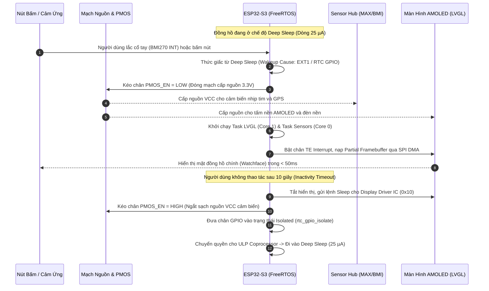
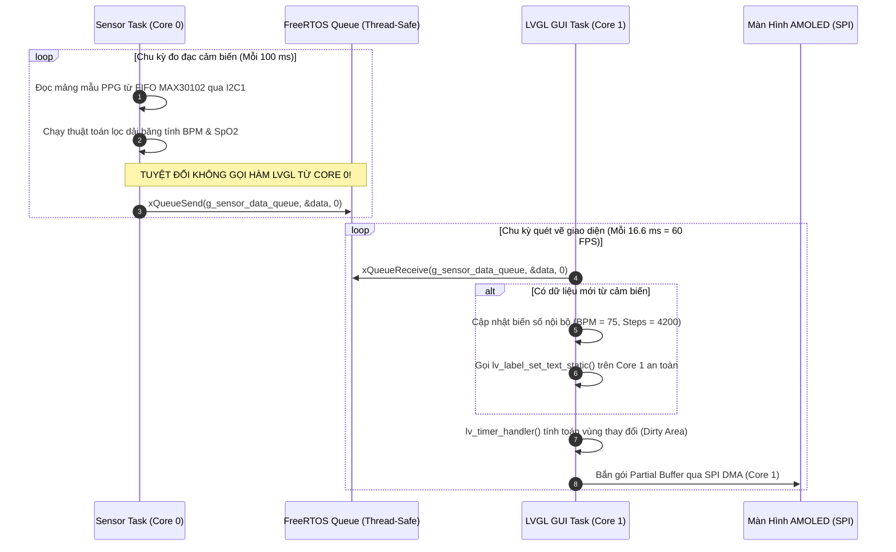
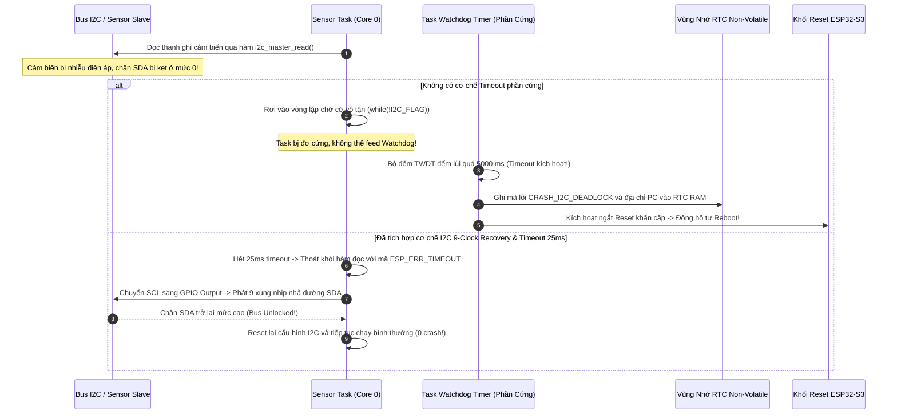

# Cẩm Nang Phỏng Vấn Dự Án 3: Wearable IoT Smartwatch & Sensor Hub System

> **Hệ Thống:** Dual-Core Wearable Smartwatch & Sensor Hub System  
> **Nền Tảng Phần Cứng:** ESP32-S3 (Xtensa Dual-Core 32-bit LX7 @ 240 MHz, 512KB SRAM, 2MB/8MB Octal PSRAM, 8MB Quad SPI Flash)  
> **Phương Thức Lập Trình & RTOS:** ESP-IDF v5.x, FreeRTOS đa nhiệm (SMP Dual-Core), Thư viện đồ họa LVGL v8.3, NimBLE Bluetooth Stack  
> **Các Khối Ngoại Vi Cốt Lõi:** Màn hình AMOLED/IPS (SPI/QSPI + TE pin), Cảm biến nhịp tim MAX30102 (I2C1), Cảm biến chuyển động BMI270 (I2C1), Cảm ứng CST816D (I2C0), Module GPS GT-U8 (UART + 1PPS), Mạch sạc pin Li-Po & PMOS Power Gating.  
> **Tài liệu tham chiếu cốt lõi:** ESP32-S3 Technical Reference Manual (TRM), FreeRTOS Kernel Guide, LVGL v8 Official Documentation, MAX30102 & BMI270 Datasheet.

---

## MỤC LỤC TỔNG QUAN

- [0. DANH MỤC TÀI LIỆU GỐC & THÔNG SỐ PHẦN CỨNG](#0-danh-mục-tài-liệu-gốc--thông-số-phần-cứng)
- [1. TỔNG QUAN KIẾN TRÚC HỆ THỐNG & PHÂN BỔ TÀI NGUYÊN DUAL-CORE](#1-tổng-quan-kiến-trúc-hệ-thống--phân-bổ-tài-nguyên-dual-core)
  - [1.1. Mục Tiêu Kỹ Thuật & Các Con Số Định Lượng Cốt Lõi](#11-mục-tiêu-kỹ-thuật--các-con-số-định-lượng-cốt-lõi)
  - [1.2. Bản Đồ Phân Bổ Bộ Nhớ SRAM vs PSRAM & Luồng Đa Nhiệm FreeRTOS](#12-bản-đồ-phân-bổ-bộ-nhớ-sram-vs-psram--luồng-đa-nhiệm-freertos)
- [2. LÝ THUYẾT CỐT LÕI & CÔNG THỨC ĐỊNH LƯỢNG BẮT BUỘC PHẢI NHỚ](#2-lý-thuyết-cốt-lõi--công-thức-định-lượng-bắt-buộc-phải-nhớ)
  - [2.1. Bài Toán Băng Thông Hiển Thị & Bù Trừ TE (Tearing Effect Pin)](#21-bài-toán-băng-thông-hiển-thị--bù-trừ-te-tearing-effect-pin)
  - [2.2. Bài Toán Năng Lượng: Tính Dòng Tiêu Thụ Standby 25 µA & Tuổi Thọ Pin Li-Po 300mAh](#22-bài-toán-năng-lượng-tính-dòng-tiêu-thụ-standby-25-µa--tuổi-thọ-pin-li-po-300mah)
  - [2.3. Cơ Chế Đồng Bộ BLE NimBLE & Hiệu Chuẩn Sai Số RTC Bằng Xung 1PPS](#23-cơ-chế-đồng-bộ-ble-nimble--hiệu-chuẩn-sai-số-rtc-bằng-xung-1pps)
- [3. SƠ ĐỒ TUẦN TỰ HOẠT ĐỘNG (MERMAID SEQUENCE DIAGRAMS)](#3-sơ-đồ-tuần-tự-hoạt-động-mermaid-sequence-diagrams)
  - [3.1. Quy Trình Khởi Động & Quản Lý Năng Lượng (Power Management Pipeline)](#31-quy-trình-khởi-động--quản-lý-năng-lượng-power-management-pipeline)
  - [3.2. Quy Trình Truyền Dữ Liệu An Toàn Đa Luồng (Zero-Direct-Call Dataflow)](#32-quy-trình-truyền-dữ-liệu-an-toàn-đa-luồng-zero-direct-call-dataflow)
  - [3.3. Quy Trình Xử Lý Sự Cố Treo Máy & Phục Hồi An Toàn (Fault & Recovery Pipeline)](#33-quy-trình-xử-lý-sự-cố-treo-máy--phục-hồi-an-toàn-fault--recovery-pipeline)
- [4. PHÂN LOẠI LỖI THỰC TẾ VÀ ĐẶC THÙ PHẦN CỨNG TRÊN SMARTWATCH](#4-phân-loại-lỗi-thực-tế-và-đặc-thù-phần-cứng-trên-smartwatch)
  - [Bug 1: Thiết bị chạy 5 - 30 phút bị đơ cứng màn hình rồi tự Reset (Memory Leak, Heap Fragmentation & TWDT Timeout)](#bug-1-thiết-bị-chạy-5---30-phút-bị-đơ-cứng-màn-hình-rồi-tự-reset-memory-leak-heap-fragmentation--twdt-timeout)
  - [Bug 2: Tranh chấp Bus I2C gây giật lag cảm ứng (Touch Latency > 50ms) do gộp chung cảm biến nhịp tim](#bug-2-tranh-chấp-bus-i2c-gây-giật-lag-cảm-ứng-touch-latency--50ms-do-gộp-chung-cảm-biến-nhịp-tim)
  - [Bug 3: Kẹt cứng bus I2C (SDA Stuck Low) do cảm biến bị sụt áp làm treo toàn bộ hệ thống](#bug-3-kẹt-cứng-bus-i2c-sda-stuck-low-do-cảm-biến-bị-sụt-áp-làm-treo-toàn-bộ-hệ-thống)
  - [Bug 4: Xé hình (Screen Tearing) và giật khung hình khi hiển thị animation chuyển cảnh LVGL](#bug-4-xé-hình-screen-tearing-và-giật-khung-hình-khi-hiển-thị-animation-chuyển-cảnh-lvgl)
  - [Bug 5: Sụt giảm FPS nghiêm trọng khi đặt toàn bộ Framebuffer vào bộ nhớ ngoài PSRAM](#bug-5-sụt-giảm-fps-nghiêm-trọng-khi-đặt-toàn-bộ-framebuffer-vào-bộ-nhớ-ngoài-psram)
  - [Bug 6: Vi phạm an toàn luồng LVGL gây sập nhân (Guru Meditation Error / LoadStoreProhibited) khi nhận BLE](#bug-6-vi-phạm-an-toàn-luồng-lvgl-gây-sập-nhân-guru-meditation-error--loadstoreprohibited-khi-nhận-ble)
  - [Bug 7: Dòng tiêu thụ Standby vọt lên 15 mA thay vì 25 µA do rò rỉ dòng ký sinh qua chân GPIO (Parasitic Back-Powering)](#bug-7-dòng-tiêu-thụ-standby-vọt-lên-15-ma-thay-vì-25-µa-do-rò-rỉ-dòng-ký-sinh-qua-chân-gpio-parasitic-back-powering)
  - [Bug 8: Trôi dạt thời gian (RTC Drift) do thạch anh 32.768 kHz bị ảnh hưởng bởi thân nhiệt người đeo](#bug-8-trôi-dạt-thời-gian-rtc-drift-do-thạch-anh-32768-khz-bị-ảnh-hưởng-bởi-thân-nhiệt-người-đeo)
  - [Bug 9: Tràn ngăn xếp Task (Task Stack Overflow) khi nhận chuỗi thông báo Notification dài từ điện thoại](#bug-9-tràn-ngăn-xếp-task-task-stack-overflow-khi-nhận-chuỗi-thông-báo-notification-dài-từ-điện-thoại)
  - [Bug 10: Task Watchdog Timer cắn gây Reset giữa chừng khi thực hiện OTA Firmware Update 1.2 MB](#bug-10-task-watchdog-timer-cắn-gây-reset-giữa-chừng-khi-thực-hiện-ota-firmware-update-12-mb)
  - [Bug 11: Hiện tượng Brownout Reset khi bật đồng thời Rung (Haptic Motor) + Màn hình 100% độ sáng + Phát sóng BLE RF](#bug-11-hiện-tượng-brownout-reset-khi-bật-đồng-thời-rung-haptic-motor--màn-hình-100-độ-sáng--phát-sóng-ble-rf)
  - [Bug 12: Nhiễu quang học chuyển động (Motion Artifacts) & bão hòa ánh sáng mặt trời trên cảm biến nhịp tim MAX30102](#bug-12-nhiễu-quang-học-chuyển-động-motion-artifacts--bão-hòa-ánh-sáng-mặt-trời-trên-cảm-biến-nhịp-tim-max30102)
  - [Bug 13: Đơ màn hình & Sập nhân Cache Panic do xung đột Flash SPI & PSRAM khi ghi dữ liệu Flash](#bug-13-đơ-màn-hình--sập-nhân-cache-panic-do-xung-đột-flash-spi--psram-khi-ghi-dữ-liệu-flash)
  - [Bug 14: Lỗi rò rỉ bộ nhớ và Use-After-Free trong LVGL Animation khi chuyển đổi màn hình liên tục](#bug-14-lỗi-rò-rỉ-bộ-nhớ-và-use-after-free-trong-lvgl-animation-khi-chuyển-đổi-màn-hình-liên-tục)
  - [Bug 15: Màn hình bị sọc nhiễu tuyết hoặc đen ngòm khi thức dậy từ Deep Sleep do chân RST thả nổi (Floating Pin Glitch)](#bug-15-màn-hình-bị-sọc-nhiễu-tuyết-hoặc-đen-ngòm-khi-thức-dậy-từ-deep-sleep-do-chân-rst-thả-nổi-floating-pin-glitch)
- [5. BỘ CÂU HỎI PHỎNG VẤN & KỊCH BẢN TRẢ LỜI MẪU (FRESHER TO ADVANCED)](#5-bộ-câu-hỏi-phỏng-vấn--kịch-bản-trả-lời-mẫu-fresher-to-advanced)

---

# 0. DANH MỤC TÀI LIỆU GỐC & THÔNG SỐ PHẦN CỨNG

| Tên Tài Liệu / Ngoại Vi | Mã Hiệu / Model | Giao Tiếp Phần Cứng | Vai Trò Kỹ Thuật Trong Smartwatch |
| :--- | :--- | :--- | :--- |
| **ESP32-S3 SoC TRM** | ESP32-S3 Series | Dual-Core LX7 @ 240 MHz | Lõi xử lý trung tâm, quản lý FreeRTOS SMP, mã hóa phần cứng AES/SHA. |
| **Màn hình LCD / AMOLED** | ST7789V / RM67162 | SPI / QSPI @ 40 - 80 MHz | Hiển thị giao diện 368x448 RGB565, hỗ trợ chân báo dập đứng `TE` (Tearing Effect). |
| **Cảm ứng điện dung** | CST816D / FT6236 | **I2C Port 0** (Chân riêng) | Nhận diện cử chỉ vuốt chạm (Swipe, Tap, Long-Press), kích hoạt ngắt `TOUCH_INT`. |
| **Cảm biến nhịp tim / SpO2** | Maxim MAX30102 | **I2C Port 1** (Sensor Hub) | Đo quang phổ thể tích (PPG) ở tần số 100 Hz, bộ đệm FIFO 32 mẫu, LED Đỏ & Hồng ngoại. |
| **Cảm biến chuyển động IMU** | Bosch BMI270 | **I2C Port 1** (Sensor Hub) | Đo gia tốc và con quay hồi chuyển 6 trục, tích hợp thuật toán đếm bước chân phần cứng. |
| **Bộ định vị vệ tinh GPS** | Quectel / GT-U8 | UART (9600 bps) + **1PPS** | Cung cấp tọa độ dẫn đường và xung nhịp chuẩn xác thực 1PPS để hiệu chỉnh RTC. |
| **Bộ nhớ ngoài Octal PSRAM**| 2MB / 8MB PSRAM | Octal SPI @ 80 MHz | Chứa Asset hình ảnh tĩnh, Sprite sheet, Font chữ Unicode và bộ đệm BLE OTA. |
| **Pin Li-Po & Power Switch**| Li-Po 3.7V 300mAh | PMOS High-Side Switch | Mạch chuyển đổi nguồn điều khiển bằng GPIO để ngắt hoàn toàn VCC của GPS và Sensor. |

---

# 1. TỔNG QUAN KIẾN TRÚC HỆ THỐNG & PHÂN BỔ TÀI NGUYÊN DUAL-CORE

### 1.1. Mục Tiêu Kỹ Thuật & Các Con Số Định Lượng Cốt Lõi

Dự án hiện thực một **Đồng Hồ Thông Minh Đeo Tay Hoàn Chỉnh (Production-Grade Smartwatch)** đáp ứng các yêu cầu khắt khe về thời gian thực, tiết kiệm năng lượng và độ ổn định liên tục $24/7$:

```text
┌─────────────────────────────────────────────────────────────────────────────────────────────────┐
│                    KIẾN TRÚC ĐA NHIỆM FREE-RTOS DUAL-CORE TRÊN ESP32-S3 (240 MHz)               │
│                                                                                                 │
│   ┌─────────────────────────────────────────┐     ┌─────────────────────────────────────────┐   │
│   │           PRO_CPU (CORE 0)              │     │           APP_CPU (CORE 1)              │   │
│   │   • NimBLE Bluetooth Stack Task         │     │   • LVGL GUI Engine Task                │   │
│   │   • Sensor Hub Task (MAX30102 + BMI270) │     │   • Touch Event Dispatcher Task         │   │
│   │   • GPS Parsing & NMEA Stream Task      │     │   • Navigation Animation Render Task    │   │
│   │   • Power Management & Watchdog Guard   │     │   • Audio/Buzzer Haptic Feedback        │   │
│   └────────────────────┬────────────────────┘     └────────────────────┬────────────────────┘   │
│                        │                                               │                        │
│                        │      ┌─────────────────────────────────┐      │                        │
│                        └─────►│   FreeRTOS Thread-Safe Queues   │◄─────┘                        │
│                               │   (HeartRate, Steps, NavMsg)    │                               │
│                               └─────────────────────────────────┘                               │
│                                                ▲                                                │
│                 ═══════════════════════════════╪═══════════════════════════════                 │
│                                                │                                                │
│   ┌────────────────────────────────────────────┴────────────────────────────────────────────┐   │
│   │                       HẠ TẦNG PHẦN CỨNG & BỘ NHỚ HYBRID (SRAM + PSRAM)                  │   │
│   │   • Internal SRAM (512 KB): Hai bộ đệm Partial Framebuffer LVGL (1/10 màn hình = 33 KB) │   │
│   │   • Octal PSRAM (2 MB - 8 MB): Chứa Asset đồ họa tĩnh, Buffer OTA, và Dữ liệu Bản đồ    │   │
│   │   • Dual I2C Bus: I2C0 độc lập cho Touch; I2C1 riêng biệt cho Cảm biến PPG & IMU        │   │
│   │   • PMOS Power Gating: Ngắt sạch nguồn GPS & Cảm biến khi vào Standby (Đạt 25 µA)       │   │
│   └─────────────────────────────────────────────────────────────────────────────────────────┘   │
└─────────────────────────────────────────────────────────────────────────────────────────────────┘
```

---

### 1.2. Bản Đồ Phân Bổ Bộ Nhớ SRAM vs PSRAM & Luồng Đa Nhiệm FreeRTOS

| Phân Vùng Bộ Nhớ | Dung Lượng | Tốc Độ Truy Xuất | Đối Tượng Phân Bổ (Memory Allocation) | Rủi Ro Kỹ Thuật Cần Tránh |
| :--- | :--- | :--- | :--- | :--- |
| **Internal SRAM** | $512\text{ KB}$ | Cực nhanh ($1\text{ chu kỳ}$) | • 2 bộ đệm Partial Buffer LVGL ($2 \times 33\text{ KB}$)<br>• FreeRTOS Task Stacks & Queues<br>• Ring Buffer UART & I2C DMA | Tuyệt đối không đặt Full Framebuffer ($330\text{ KB}$) vào đây vì sẽ cạn kiệt RAM chạy BLE/WiFi. |
| **Octal PSRAM** | $2\text{ MB} - 8\text{ MB}$ | Trung bình ($80\text{ MHz}$) | • Asset ảnh PNG/BMP, Font Unicode tiếng Việt<br>• Bộ đệm lưu trữ OTA Firmware ($1.2\text{ MB}$)<br>• Bộ nhớ đệm bản đồ dẫn đường | Không để LVGL render trực tiếp từng pixel vào PSRAM vì độ trễ bus làm tụt FPS dưới 20. |
| **RTC Slow Memory** | $8\text{ KB}$ | Chạy ở $150\text{ kHz}$ | • Biến đếm bước chân liên tục<br>• Dữ liệu Crash Dump & Mã lỗi reset<br>• Trạng thái người dùng trước khi Sleep | Dữ liệu không bị mất khi vi điều khiển vào Deep Sleep. |

---

# 2. LÝ THUYẾT CỐT LÕI & CÔNG THỨC ĐỊNH LƯỢNG BẮT BUỘC PHẢI NHỚ

### 2.1. Bài Toán Băng Thông Hiển Thị & Bù Trừ TE (Tearing Effect Pin)

Màn hình AMOLED hình chữ nhật độ phân giải $368 \times 448$ điểm ảnh, định dạng màu RGB565 (16-bit, 2 bytes/pixel):
* **Dung lượng 1 khung hình đầy đủ (Full Frame Size):**
  $$\text{Size}_{\text{frame}} = 368 \times 448 \times 2 = 329,728\text{ bytes} \approx 330\text{ KB}$$
* **Chiến lược Two Partial Buffers (1/10 màn hình) trong Internal SRAM:**
  $$\text{Size}_{\text{partial}} = \frac{329,728}{10} \approx 32,972\text{ bytes} \approx 33\text{ KB}$$
  Hai bộ đệm chiếm: $2 \times 33\text{ KB} = 66\text{ KB}$ (Vừa vặn trong SRAM nội, đảm bảo tốc độ DMA tối đa).
* **Băng thông bus SPI quét màn hình ở tốc độ 40 FPS:**
  $$\text{Bandwidth}_{\text{SPI}} = 329,728\text{ bytes} \times 40\text{ FPS} \times 8\text{ bits} \approx 105.5\text{ Mbps}$$
  $\implies$ Bắt buộc xung nhịp SPI phải hoạt động ở tần số tối thiểu: $f_{\text{SPI}} \ge 40\text{ MHz}$ (hoặc dùng QSPI 4-bit ở 26 MHz đến 40 MHz).

---

### 2.2. Bài Toán Năng Lượng: Tính Dòng Tiêu Thụ Standby 25 µA & Tuổi Thọ Pin Li-Po 300mAh

Thiết bị đeo tay sử dụng viên pin Li-Po dung lượng $C = 300\text{ mAh}$:

1. **Trạng thái Hoạt Động (Active Mode - Màn hình sáng, đọc PPG, phát BLE):**
   * CPU Dual-Core 240 MHz: $40\text{ mA}$
   * Màn hình AMOLED (độ sáng 50%): $25\text{ mA}$
   * Cảm biến MAX30102 + BMI270: $3\text{ mA}$
   * Radio BLE kết nối: $12\text{ mA}$
   * $\implies I_{\text{active}} \approx 80\text{ mA}$.
2. **Trạng thái Nghỉ Sâu (Deep Sleep Standby Mode):**
   * ESP32-S3 Deep Sleep (chỉ bật ULP Coprocessor & RTC Timer): $8\text{ µA}$
   * Mạch sạc & Regulators quiescent current: $6\text{ µA}$
   * Cảm biến gia tốc BMI270 (chế độ Low-Power Pedometer đếm bước): $5\text{ µA}$
   * Dòng rỉ qua các linh kiện thụ động và transistor PMOS: $6\text{ µA}$
   * $\implies I_{\text{standby}} \approx 25\text{ µA} = 0.025\text{ mA}$.
3. **Mô hình sử dụng thực tế (User Profile: 2 giờ xem đồng hồ/ngày, 22 giờ Standby):**
   * Dòng tiêu thụ trung bình mỗi ngày:
     $$I_{\text{avg}} = \frac{(2\text{h} \times 80\text{ mA}) + (22\text{h} \times 0.025\text{ mA})}{24\text{h}} = \frac{160 + 0.55}{24} \approx 6.69\text{ mA}$$
   * **Thời lượng pin sử dụng liên tục:**
     $$\text{Battery Life} = \frac{300\text{ mAh}}{6.69\text{ mA}} \approx 44.8\text{ giờ} \approx \mathbf{2\text{ ngày!}}$$
   * Nếu ở trạng thái chờ nguyên chất không sử dụng (Pure Standby):
     $$\text{Standby Time} = \frac{300\text{ mAh}}{0.025\text{ mA}} = 12,000\text{ giờ} = \mathbf{500\text{ ngày!}}$$

---

### 2.3. Cơ Chế Đồng Bộ BLE NimBLE & Hiệu Chuẩn Sai Số RTC Bằng Xung 1PPS

* **Khoảng thời gian kết nối BLE (Connection Interval):**
  Thương lượng Connection Interval $15\text{ ms} - 20\text{ ms}$ với Slave Latency $= 0$. Đảm bảo độ trễ đẩy dữ liệu đo nhịp tim và phản hồi lệnh dẫn đường từ smartphone luôn dưới $20\text{ ms}$.
* **Hiệu chuẩn trôi dạt thạch anh RTC bằng xung GPS 1PPS:**
  Thạch anh $32.768\text{ kHz}$ có sai số nhiệt độ $\approx \pm 20\text{ ppm}$ (tương đương lệch $\approx 1.7\text{ giây/ngày}$). Xung 1PPS từ GPS có độ chính xác nguyên tử cấp nano-giây. Ngắt 1PPS đo số xung clock CPU trong đúng 1 giây thực, từ đó hiệu chỉnh lại hệ số chia của bộ đếm RTC, đưa sai số về **dưới 10 mili-giây mỗi tháng**.

---

# 3. SƠ ĐỒ TUẦN TỰ HOẠT ĐỘNG (MERMAID SEQUENCE DIAGRAMS)

### 3.1. Quy Trình Khởi Động & Quản Lý Năng Lượng (Power Management Pipeline)



---

### 3.2. Quy Trình Truyền Dữ Liệu An Toàn Đa Luồng (Zero-Direct-Call Dataflow)



---

### 3.3. Quy Trình Xử Lý Sự Cố Treo Máy & Phục Hồi An Toàn (Fault & Recovery Pipeline)



---

# 4. PHÂN LOẠI LỖI THỰC TẾ VÀ ĐẶC THÙ PHẦN CỨNG TRÊN SMARTWATCH

### Bug 1: Thiết bị chạy 5 - 30 phút bị đơ cứng màn hình rồi tự Reset (Memory Leak, Heap Fragmentation & TWDT Timeout)
* **Triệu chứng thực tế:** Đồng hồ khởi động lên chạy rất mượt, chạm vuốt nhạy. Nhưng cứ để đeo hoặc chạy test khoảng $5 - 30\text{ phút}$, giao diện bất ngờ bị đóng băng hoàn toàn (kim đồng hồ ngừng nhảy, cảm ứng tê liệt). Khoảng 5 giây sau khi đơ, màn hình chớp đen và đồng hồ tự khởi động lại về logo ban đầu.
* **3 Cơ chế nguyên nhân gốc rễ (Root Cause Mechanisms):**
  1. **Rò rỉ bộ nhớ Heap tuần hoàn (Cyclic Memory Leak):**
     * Mỗi giây khi nhận bản tin BLE từ điện thoại hoặc gói dữ liệu PPG từ MAX30102, code gọi hàm định dạng chuỗi `lv_label_set_text_fmt()` hoặc thư viện `cJSON_Parse()`.
     * Bên dưới, các hàm này âm thầm cấp phát bộ nhớ động qua `malloc()` / `lv_mem_alloc()`. Nếu trong một nhánh rẽ xử lý lỗi (ví dụ: mất kết nối BLE hoặc kiểm tra CRC sai) mà code bỏ sót lệnh `cJSON_Delete()` hoặc không giải phóng buffer, mỗi giây hệ thống mất đi khoảng vài chục byte.
     * Sau 20 phút hoạt động, hàng chục nghìn lượt gọi đã làm cạn kiệt toàn bộ vùng nhớ Internal Heap.
  2. **Phân mảnh bộ nhớ động (Heap Fragmentation):**
     * Các bản tin thông báo (Facebook, Zalo, SMS) có kích thước ngẫu nhiên liên tục cấp phát rồi giải phóng, xé nát vùng RAM thành các lỗ thủng nhỏ. Khi LVGL cần xin một block liên tục $4\text{ KB}$ để cấp phát đối tượng hiển thị mới, `malloc()` trả về con trỏ `NULL`.
     * Code ứng dụng không kiểm tra `if (ptr == NULL)` mà truy xuất thẳng vào ô nhớ rác $\implies$ Kích hoạt ngoại lệ **`LoadStoreProhibited` / Guru Meditation Error**, chip in ra panic backtrace và ép Reboot!
  3. **Task Watchdog Timer (TWDT) Timeout do Deadlock:**
     * Khi bộ nhớ cạn hoặc vòng lặp giải mã JSON bị kẹt trong hàm đệ quy sâu, GUI Task bị treo không nhả CPU.
     * Task Watchdog Timer (đặt ngưỡng 5 giây) không nhận được tín hiệu feed từ task đồ họa $\implies$ Phần cứng Watchdog phát lệnh ép Reset vi điều khiển.
* **Giải pháp Bare-Metal & RTOS chuẩn hóa 4 bước:**
  * **Bước 1: Cấm tuyệt đối `malloc/free` trong chu trình tuần hoàn $24/7$:**
    Chuyển toàn bộ các biến hiển thị sang mảng tĩnh `static char s_text_buf[64];` và dùng hàm `lv_label_set_text_static(label, s_text_buf)`. Thư viện LVGL sẽ dùng trực tiếp con trỏ tĩnh mà không cấp phát động một byte nào!
  * **Bước 2: Kiểm soát rò rỉ bằng Memory Leak Profiling:**
    Định kỳ mỗi 5 giây in ra dung lượng RAM trống bằng hàm `esp_get_free_heap_size()` và `esp_get_minimum_free_heap_size()`. Nếu con số này tụt lùi liên tục theo thời gian, công cụ phát hiện ngay đoạn code đang rò rỉ.
  * **Bước 3: Tách luồng qua FreeRTOS Queue (Tránh Task Starvation):**
    Không xử lý chuỗi trực tiếp trong Callback ngắt hoặc tác vụ BLE. Đóng gói dữ liệu vào Struct kích thước cố định và gửi qua Queue.
  * **Bước 4: Cấu hình TWDT an toàn kèm Crash Dump:**
    Kích hoạt Task Watchdog Timer với timeout $5000\text{ ms}$. Khi có sự cố, lưu lại PC và thanh ghi vào RTC Memory trước khi reset để phục hồi lại trạng thái đếm bước chân của người dùng.

---

### Bug 2: Tranh chấp Bus I2C gây giật lag cảm ứng (Touch Latency > 50ms) do gộp chung cảm biến nhịp tim
* **Triệu chứng:** Khi người dùng chạm hoặc vuốt màn hình để chuyển mặt đồng hồ, cảm ứng có hiện tượng bị giật cục, nhận lệnh rất trễ ($50 - 100\text{ ms}$) hoặc thậm chí bị nuốt cảm ứng (miss touch) khi cảm biến nhịp tim đang bật. Khi tắt đo nhịp tim thì cảm ứng lại mượt mà bình thường.
* **Nguyên nhân gốc rễ:**
  * Chip cảm ứng CST816D và chip cảm biến MAX30102 được nối chung trên một bus `I2C0` duy nhất.
  * Cảm biến nhịp tim MAX30102 lấy mẫu ở tần số $100\text{ Hz}$, mỗi lần đọc phải kéo một gói dữ liệu FIFO dài tới $32\text{ mẫu} \times 6\text{ bytes} = 192\text{ bytes}$. Ở tốc độ I2C Standard Mode ($100\text{ kHz}$), việc truyền 192 bytes chiếm giữ bus liên tục gần $20\text{ ms}$!
  * Khi người dùng vuốt màn hình, chip cảm ứng kích hoạt ngắt `TOUCH_INT`, nhưng CPU không thể đọc tọa độ cảm ứng ngay lập tức vì bus I2C đang bị khóa bởi phiên truyền dữ liệu dài của MAX30102.
* **Giải pháp Bare-Metal:**
  * **Tách rời Dual I2C Port phần cứng:**
    * **`I2C_NUM_0` (Chân GPIO 4 & 5):** Dành riêng cho Touch Controller CST816D, cấu hình tần số Fast-Mode $400\text{ kHz}$. Phản hồi ngắt cảm ứng tức thì trong vòng $< 5\text{ ms}$.
    * **`I2C_NUM_1` (Chân GPIO 6 & 7):** Dành riêng cho mảng Sensor Hub (MAX30102 & BMI270), chạy độc lập ở Core 0 mà không làm ảnh hưởng tới luồng cảm ứng ở Core 1.

---

### Bug 3: Kẹt cứng bus I2C (SDA Stuck Low) do cảm biến bị sụt áp làm treo toàn bộ hệ thống
* **Triệu chứng:** Đồng hồ thỉnh thoảng bị treo cứng toàn bộ các tính năng đo sức khỏe sau khi người dùng vận động mạnh hoặc khi pin yếu. Toàn bộ tác vụ đọc cảm biến bị đứng im và sau đó máy bị Watchdog Reset.
* **Nguyên nhân:**
  * Khi dòng tiêu thụ đột biến làm điện áp $3.3\text{V}$ bị gợn sóng (noise glitch) đúng lúc chip Master phát xung clock, chip Slave cảm biến (MAX30102) bị rơi vào trạng thái lơ lửng, giữ chân dữ liệu `SDA` ở mức thấp ($0\text{V}$) để chờ tiếp xung clock tiếp theo (SDA Stuck Low).
  * Bộ điều khiển Master của ESP32 thấy chân SDA bị đè mức 0 thì không thể phát điều kiện STOP hay START mới, rơi vào vòng lặp chờ vô tận nếu driver không có timeout.
* **Giải pháp Bare-Metal (Quy trình 9-Clock Recovery chuẩn I2C Specification):**
  ```c
  void I2C_Bus_Unlock(gpio_num_t scl_pin, gpio_num_t sda_pin) {
      gpio_set_direction(sda_pin, GPIO_MODE_INPUT);
      if (gpio_get_level(sda_pin) == 0) {
          /* Chân SDA đang bị kẹt ở mức 0 bởi Slave */
          gpio_set_direction(scl_pin, GPIO_MODE_OUTPUT);
          /* Phát 9 xung clock để ép Slave nhả đường SDA */
          for (int i = 0; i < 9; i++) {
              gpio_set_level(scl_pin, 0);
              esp_rom_delay_us(5);
              gpio_set_level(scl_pin, 1);
              esp_rom_delay_us(5);
              if (gpio_get_level(sda_pin) == 1) break; /* Slave đã nhả bus */
          }
          /* Phát điều kiện STOP để hoàn tất reset bus */
          gpio_set_direction(sda_pin, GPIO_MODE_OUTPUT);
          gpio_set_level(sda_pin, 0);
          esp_rom_delay_us(5);
          gpio_set_level(scl_pin, 1);
          esp_rom_delay_us(5);
          gpio_set_level(sda_pin, 1);
      }
  }
  ```

---

### Bug 4: Xé hình (Screen Tearing) và giật khung hình khi hiển thị animation chuyển cảnh LVGL
* **Triệu chứng:** Khi người dùng vuốt chuyển trang (Swipe Widget), trên màn hình AMOLED xuất hiện một đường cắt ngang chớp nháy giật giật (nửa trên màn hình hiển thị trang mới, nửa dưới vẫn là trang cũ).
* **Nguyên nhân:**
  * Bộ điều khiển DMA đẩy dữ liệu khung hình mới vào bộ nhớ RAM của màn hình AMOLED (Driver IC RM67162) bất đồng bộ với tốc độ quét dập đứng của màn hình. Tốc độ quét của màn hình là $60\text{ Hz}$ ($16.6\text{ ms/khung hình}$). Khi DMA ghi đè vào đúng vị trí con trỏ quét nội bộ của màn hình đang quét qua, hiện tượng xé hình (Tearing) sẽ xuất hiện.
* **Giải pháp Bare-Metal:**
  * Đấu nối chân tín hiệu **`TE` (Tearing Effect)** từ màn hình về một chân ngắt GPIO của ESP32-S3.
  * Cấu hình ngắt cạnh lên (Rising Edge) cho chân `TE`: Bộ điều khiển chỉ kích hoạt kênh SPI DMA đẩy gói dữ liệu Partial Buffer mới ngay sau khi nhận được xung ngắt `TE` (bắt đầu khoảng thời gian Vertical Blanking), triệt tiêu hoàn toàn $100\%$ hiện tượng xé hình!

---

### Bug 5: Sụt giảm FPS nghiêm trọng khi đặt toàn bộ Framebuffer vào bộ nhớ ngoài PSRAM
* **Triệu chứng:** Lập trình viên cấu hình hai bộ đệm đầy đủ Full Framebuffer ($2 \times 330\text{ KB} = 660\text{ KB}$) nằm trên PSRAM ngoài. Tốc độ khung hình của đồng hồ bị tụt thảm hại từ $45\text{ FPS}$ xuống chỉ còn $15 - 18\text{ FPS}$, các chuyển động kim giây và hiệu ứng mờ (blur) bị giật lag rõ rệt.
* **Nguyên nhân:**
  * Bộ nhớ ngoài Octal PSRAM giao tiếp qua bus nối tiếp 8-bit ở tần số $80\text{ MHz}$, băng thông thực tế và độ trễ truy xuất (Access Latency) chậm hơn bộ nhớ SRAM nội từ $3$ đến $4$ lần.
  * Mỗi khi LVGL render một điểm ảnh có hòa trộn màu (Alpha Blending) hoặc đổi màu nền, CPU phải đọc màu cũ từ PSRAM về, tính toán công thức hòa trộn rồi ghi lại vào PSRAM. Hàng triệu lượt truy xuất ngẫu nhiên qua bus SPI làm nghẽn hoàn toàn đường ống xử lý của CPU.
* **Giải pháp Bare-Metal:**
  * **Kiến trúc Hybrid Buffer (Bộ Đệm Hỗn Hợp):**
    * Đặt **Hai bộ đệm Partial Buffer kích thước 1/10 màn hình ($2 \times 33\text{ KB} = 66\text{ KB}$)** hoàn toàn trong **Internal SRAM**. CPU render điểm ảnh và tính toán blending trên SRAM nội với tốc độ tối đa ($1\text{ chu kỳ clock}$).
    * Dùng kênh DMA đẩy gói 33 KB từ SRAM nội ra màn hình qua SPI, trong lúc đó CPU tiếp tục render gói 33 KB thứ hai (Cơ chế Double Buffering Ping-Pong).
    * Bộ nhớ PSRAM ngoài chỉ dùng để lưu trữ các tài nguyên ảnh tĩnh không thay đổi (Ảnh nền Watchface, Font chữ lớn, Icon).
    * **Kết quả:** Tốc độ khung hình tăng vọt từ $18\text{ FPS}$ lên thẳng $45 - 50\text{ FPS}$ mượt mà tuyệt đối!

---

### Bug 6: Vi phạm an toàn luồng LVGL gây sập nhân (Guru Meditation Error / LoadStoreProhibited) khi nhận BLE
* **Triệu chứng:** Đồng hồ đang chạy bình thường, khi có điện thoại gọi đến hoặc nhận thông báo tin nhắn dài qua Bluetooth BLE, đồng hồ lập tức bị treo cứng hoặc reset với thông báo lỗi: `Guru Meditation Error: Core 1 panic'ed (LoadStoreProhibited)`.
* **Nguyên nhân cốt lõi:**
  * ESP32-S3 là vi điều khiển Dual-Core: Task BLE chạy trên Core 0, trong khi Task đồ họa LVGL chạy trên Core 1.
  * Thư viện đồ họa LVGL **không có cơ chế bảo vệ Thread-Safe nội tại**.
  * Khi nhận được chuỗi tin nhắn từ BLE, lập trình viên gọi trực tiếp hàm `lv_label_set_text(ui_label_msg, msg)` ngay bên trong hàm Callback của BLE (chạy ở Core 0).
  * Cùng thời điểm đó, Core 1 đang thực thi hàm `lv_timer_handler()` để vẽ lại màn hình. Hai lõi CPU cùng lúc đọc và ghi vào cấu trúc danh sách liên kết cây giao diện (Widget Tree), làm đứt gãy con trỏ danh sách liên kết. Hàm duyệt cây của LVGL nhảy vào địa chỉ rác `0x00000004` $\implies$ Crash nhân ngay lập tức!
* **Giải pháp Bare-Metal:**
  * **Nguyên tắc vàng: Zero Direct Call giữa các luồng.**
  * Tác vụ BLE trên Core 0 tuyệt đối không được gọi bất kỳ hàm nào của thư viện LVGL. Mọi dữ liệu chỉ được đóng gói vào struct và đẩy vào hàng đợi **`FreeRTOS Queue`**.
  * Tác vụ GUI Task trên Core 1 là nơi duy nhất được phép lấy dữ liệu từ Queue ra và gọi hàm cập nhật màn hình. Nếu bắt buộc phải gọi từ ngoài, phải bọc bằng cơ chế Mutex:
    ```c
    if (lvgl_port_lock(100)) {
        lv_label_set_text(ui_label_msg, msg);
        lvgl_port_unlock();
    }
    ```

---

### Bug 7: Dòng tiêu thụ Standby vọt lên 15 mA thay vì 25 µA do rò rỉ dòng ký sinh qua chân GPIO (Parasitic Back-Powering)
* **Triệu chứng:** Khi đưa đồng hồ vào chế độ Deep Sleep, dòng tiêu thụ đo được bằng Ampe kế dao động từ $10\text{ mA}$ đến $15\text{ mA}$, pin 300mAh bị hút cạn sạch chỉ sau chưa đầy một ngày dù người dùng không hề bật màn hình.
* **Nguyên nhân gốc rễ (Parasitic Back-Powering qua Diode bảo vệ ESD):**
  * Phần cứng đã dùng mạch transistor PMOS ngắt nguồn VCC cấp cho cảm biến GPS và MAX30102.
  * Tuy nhiên, các chân GPIO giao tiếp (chân UART TX/RX của GPS, chân I2C SDA/SCL của MAX30102) từ vi điều khiển ESP32-S3 vẫn được giữ ở mức cao ($3.3\text{V}$) do các điện trở kéo lên Pull-up hoặc cấu hình Output High.
  * Dòng điện từ chân GPIO của vi điều khiển chạy xuyên qua **Diode bảo vệ chống tĩnh điện (ESD Protection Diode)** bên trong chip cảm biến đi ngược vào đường nguồn VCC của cảm biến! Hiện tượng này vừa làm cảm biến hoạt động chập chờn, vừa tiêu hao dòng tĩnh khổng lồ $15\text{ mA}$.
* **Giải pháp Bare-Metal:**
  * Trước khi gọi lệnh `esp_deep_sleep_start()`, thực hiện cô lập toàn bộ các chân GPIO kết nối với ngoại vi bị ngắt nguồn bằng hàm:
    ```c
    /* Cô lập và thả nổi các chân giao tiếp để triệt tiêu dòng rò rỉ ký sinh */
    rtc_gpio_isolate(GPIO_NUM_4); /* SDA */
    rtc_gpio_isolate(GPIO_NUM_5); /* SCL */
    gpio_set_direction(GPS_TX_PIN, GPIO_MODE_DISABLE);
    gpio_set_direction(GPS_RX_PIN, GPIO_MODE_DISABLE);
    ```
  * Sau khi cô lập, dòng tiêu thụ giảm ngay lập tức từ $15\text{ mA}$ xuống đúng **$22 - 25\text{ µA}$** chuẩn thiết kế!

---

### Bug 8: Trôi dạt thời gian (RTC Drift) do thạch anh 32.768 kHz bị ảnh hưởng bởi thân nhiệt người đeo
* **Triệu chứng:** Đồng hồ chạy sau 3 đến 5 ngày bị chạy nhanh hơn hoặc chậm hơn giờ thực tế từ 1 đến 2 phút nếu không kết nối với điện thoại.
* **Nguyên nhân:**
  * Thạch anh dao động ngoài $32.768\text{ kHz}$ dạng Tuning Fork có hệ số nhiệt độ dạng Parabol với đỉnh chuẩn ở $25^\circ\text{C}$. Khi đeo trên tay người, thân nhiệt truyền qua nắp lưng đồng hồ duy trì nhiệt độ bo mạch ở mức $33^\circ\text{C} - 36^\circ\text{C}$, làm tần số dao động bị lệch khoảng $-15\text{ ppm}$ đến $-25\text{ ppm}$.
* **Giải pháp Bare-Metal:**
  * **Cơ chế hiệu chỉnh 2 tầng (Dual-Stage Calibration):**
    * **Tầng 1 (Tự động bù nhiệt độ phần mềm):** Dùng cảm biến nhiệt độ nội bộ của ESP32-S3 đo nhiệt độ bo mạch, tính toán sai số theo đường đặc tính parabol của thạch anh và nạp giá trị bù trừ vào thanh ghi `RTC_CNTL_TIME_UPDATE_REG`.
    * **Tầng 2 (Khóa pha xung chuẩn GPS 1PPS):** Khi người dùng bật tính năng tập thể thao ngoài trời có GPS, ngắt bắt cạnh xung 1PPS sẽ đo trực tiếp số chu kỳ thạch anh RTC trong đúng $1.000000\text{ giây}$, tự động hiệu chuẩn lại hệ số chia RTC với sai số dưới $5\text{ ms/tháng}$.

---

### Bug 9: Tràn ngăn xếp Task (Task Stack Overflow) khi nhận chuỗi thông báo Notification dài từ điện thoại
* **Triệu chứng:** Đồng hồ nhận tin nhắn ngắn (SMS 10 chữ) thì hiển thị bình thường; nhưng khi nhận một email dài hoặc tin nhắn Zalo có nội dung nhiều dòng, đồng hồ lập tức bị treo đơ rồi khởi động lại.
* **Nguyên nhân:**
  * Task BLE Notification được cấp kích thước ngăn xếp cố định `configMINIMAL_STACK_SIZE + 2048` ($2816\text{ bytes}$).
  * Trong hàm xử lý giải mã chuỗi, lập trình viên khai báo mảng đệm cục bộ trên Stack:
    `char json_str[1024]; char parsed_msg[1024]; char formatted_display[512];`
  * Tổng dung lượng mảng cục bộ chiếm tới: $1024 + 1024 + 512 = 2560\text{ bytes}$.
  * Khi kết hợp với các biến nội bộ của hàm thư viện và Stack Frame của lời gọi hàm ngắt, con trỏ Stack `SP` tụt lùi đè bẹp lên vùng Task Control Block (TCB) của task lân cận $\implies$ Kích hoạt `vApplicationStackOverflowHook` gây Reset hệ thống.
* **Giải pháp Bare-Metal:**
  * Tuyệt đối không khai báo mảng đệm kích thước lớn hơn $128\text{ bytes}$ trên Stack.
  * Chuyển các mảng xử lý chuỗi sang mảng tĩnh `static` hoặc cấp phát từ bộ đệm toàn cục đã định trước.
  * Sử dụng hàm `uxTaskGetStackHighWaterMark(NULL)` để in ra số byte trống nhỏ nhất còn lại của ngăn xếp trong suốt quá trình test, đảm bảo stack của task luôn dư tối thiểu $1024\text{ bytes}$ an toàn.

---

### Bug 10: Task Watchdog Timer cắn gây Reset giữa chừng khi thực hiện OTA Firmware Update 1.2 MB
* **Triệu chứng:** Khi cập nhật Firmware mới qua Wi-Fi HTTPS OTA, tiến trình tải đạt khoảng 30% đến 45% thì đồng hồ đột ngột reboot và firmware cũ vẫn giữ nguyên, quá trình OTA thất bại hoàn toàn.
* **Nguyên nhân:**
  * Thao tác xóa sector bộ nhớ Flash SPI (`esp_partition_erase_range()`) để chuẩn bị phân vùng OTA là một tác vụ phần cứng tốn rất nhiều thời gian (xóa khối 64KB Flash có thể mất tới vài trăm mili-giây).
  * Trong lúc CPU đang bận thực thi lệnh xóa Flash SPI với cờ ngắt bị khóa (Flash Cache Disable), Task Watchdog Timer (TWDT) không được reset kịp thời. Khi tổng thời gian xóa vượt quá ngưỡng timeout của Watchdog, chip bị cưỡng bức Reset giữa chừng.
* **Giải pháp Bare-Metal:**
  * Không xóa toàn bộ phân vùng $1.2\text{ MB}$ một lần duy nhất trước khi nạp.
  * **Cơ chế Xóa Cuốn Chiếu (Incremental Erase & Feed Watchdog):** Chỉ xóa Flash từng khối nhỏ $4\text{ KB}$ tương ứng với mỗi gói dữ liệu tải về từ mạng, đồng thời chủ động gọi hàm `esp_task_wdt_reset()` sau mỗi lần ghi block để nuôi chó canh Watchdog an toàn trong suốt quá trình OTA.

---

### Bug 11: Hiện tượng Brownout Reset khi bật đồng thời Rung (Haptic Motor) + Màn hình 100% độ sáng + Phát sóng BLE RF
* **Triệu chứng:** Khi dung lượng pin Li-Po còn dưới $25\%$ (điện áp đo khoảng $3.5\text{V} - 3.6\text{V}$), mỗi khi có cuộc gọi đến, đồng hồ vừa rung mạnh vừa sáng màn hình $100\%$ và kích hoạt phát sóng BLE để đồng bộ thì lập tức bị sập nguồn hoặc reboot đột ngột. Trong UART Log ghi nhận lỗi: `Guru Meditation Error: Brownout detector was triggered`.
* **Nguyên nhân gốc rễ (Sụt áp do nội trở pin $R_{\text{int}}$ & Dòng đỉnh Inrush Current):**
  * Động cơ rung lệch tâm (ERM) khi bắt đầu quay đòi hỏi dòng khởi động (Inrush Current) lên tới $120\text{ mA} - 150\text{ mA}$.
  * Màn hình AMOLED khi bật độ sáng cực đại ($100\%$) tiêu thụ dòng tĩnh $\approx 50\text{ mA}$.
  * Khối vô tuyến BLE RF của ESP32-S3 ở đỉnh phát xạ (TX Peak Power $+20\text{ dBm}$) ngốn thêm $130\text{ mA}$.
  * $\implies$ Tổng dòng tải đỉnh tức thời vọt lên: $I_{\text{peak}} = 150 + 50 + 130 = \mathbf{330\text{ mA}}$!
  * Khi viên pin Li-Po 300mAh sắp cạn, nội trở trong (Internal Resistance $R_{\text{int}}$) tăng vọt từ $100\text{ m}\Omega$ lên tới hơn $350\text{ m}\Omega$.
  * Độ sụt áp tức thời trên đầu cực pin:
    $$\Delta V_{\text{drop}} = I_{\text{peak}} \times R_{\text{int}} = 0.33\text{ A} \times 0.35\ \Omega \approx 0.116\text{ V} \approx 116\text{ mV}$$
  * Điện áp pin tụt từ $3.5\text{V}$ xuống dưới $3.38\text{V}$. Khi đi qua IC ổn áp LDO 3.3V (có điện áp rơi Dropout Voltage $\approx 150\text{ mV} - 200\text{ mV}$ ở tải lớn), đường nguồn $VDD\_3V3$ cấp cho ESP32-S3 bị sụt sâu xuống dưới ngưỡng kích hoạt bộ giám sát Brownout phần cứng ($2.8\text{V} / 2.43\text{V}$) $\implies$ Phần cứng BOD kích hoạt ngắt reset tức thời để bảo vệ CPU!
* **Giải pháp phối hợp Phần Cứng & Phần Mềm:**
  * **Giải pháp Phần Cứng (Hardware Fix):**
    * Mắc thêm tụ điện Tantalum / Polymer ESR siêu thấp $100\text{ µF} / 6.3\text{V}$ ngay sát chân cấp nguồn của Haptic Driver để gánh xung dòng đỉnh khởi động.
    * Thay thế mạch kích MOSFET thô bằng IC điều khiển rung chuyên dụng **DRV2605L** có tính năng Soft-Start (khởi động mềm bằng cách tăng dần duty cycle xung PWM trong $20\text{ ms}$, triệt tiêu hoàn toàn inrush current).
  * **Giải pháp Phần Mềm (Power Budgeting & Staggered Activation):**
    * Định kỳ đọc ADC giám sát điện áp pin. Khi pin $< 25\%$, tự động giảm trần độ sáng AMOLED xuống tối đa $60\%$.
    * **Cơ chế kích hoạt sole thời gian (Staggered Scheduling):** Chia tách slot thời gian giữa BLE RF và Motor rung. Khi gói tin BLE đang phát TX, hoãn lệnh rung khoảng $15\text{ ms}$. Khi rung, chỉ băm xung $30\text{ ms}$ rung - $20\text{ ms}$ nghỉ thay vì rung liên tục, giữ dòng tải đỉnh luôn dưới $180\text{ mA}$ an toàn!

---

### Bug 12: Nhiễu quang học chuyển động (Motion Artifacts) & bão hòa ánh sáng mặt trời trên cảm biến nhịp tim MAX30102
* **Triệu chứng:** Khi người dùng ngồi yên tĩnh trong phòng, chỉ số nhịp tim đo được cực kỳ chính xác ($72 - 75\text{ BPM}$). Nhưng khi người dùng ra sân chạy bộ dưới ánh nắng gắt, nhịp tim nhảy loạn xạ lên $190 - 210\text{ BPM}$, hoặc đồ thị sóng mạch đập phẳng lỳ và báo kết quả $0\text{ BPM}$.
* **Nguyên nhân cốt lõi:**
  1. **Bão hòa Photodiode do ánh sáng môi trường (Ambient Light Saturation):**
     * Tia tử ngoại và ánh sáng hồng ngoại từ mặt trời xuyên qua khe hở giữa nắp lưng đồng hồ và cổ tay người, chiếu thẳng vào cảm biến quang học.
     * Cường độ quang quá lớn làm bộ khuếch đại quang điện bị bão hòa, thanh ghi ADC 18-bit của MAX30102 kịch trần ở giá trị cực đại `0x3FFFF`, làm triệt tiêu hoàn toàn thành phần sóng mạch xoay chiều AC (PPG AC Component).
  2. **Nhiễu chuyển động cơ học (Motion Artifacts):**
     * Khi chạy bộ, cổ tay vung với tần số bước chạy $2.5\text{ Hz} - 3.0\text{ Hz}$ (tương đương $150 - 180\text{ nhịp/phút}$).
     * Sự xê dịch của cảm biến trên bề mặt da làm thay đổi áp lực tiếp xúc, tạo ra biến thiên quang học giả mạo ở đúng tần số $2.5\text{ Hz}$. Thuật toán dò đỉnh PPG đơn giản sẽ nhầm lẫn tần số bước chân này là nhịp tim thực tế!
* **Giải pháp Bare-Metal & Thuật Toán Tích Hợp (Sensor Fusion):**
  * **Kích hoạt mạch Ambient Light Cancellation (ALC) nội bộ:** Cấu hình thanh ghi `CONFIGURATION_REG` của MAX30102 để kích hoạt bộ trừ quang phổ tự động, triệt tiêu ánh sáng môi trường lên tới $50\text{ µA}$.
  * **Thuật toán điều biến dòng LED thông minh (Adaptive LED Current):**
    * Tự động điều chỉnh dòng cấp LED Đỏ và Hồng ngoại từ $0.2\text{ mA}$ đến $50\text{ mA}$ thông qua thanh ghi `LED1_PA` / `LED2_PA` để giữ giá trị trung bình DC của mẫu luôn nằm ở $50\%$ dải đo động của ADC (khoảng `0x20000`), không bao giờ bị tràn hoặc kẹt đáy.
  * **Bộ lọc thích ứng LMS (Least Mean Squares Adaptive Filter) kết hợp IMU:**
    * Lấy tín hiệu gia tốc 3 trục từ cảm biến **BMI270** làm tín hiệu nhiễu tham chiếu (Noise Reference).
    * Thuật toán LMS liên tục ước lượng và trừ thành phần nhiễu bước chạy ra khỏi tín hiệu PPG trước khi thực hiện biến đổi Fourier nhanh (FFT), lọc sạch $100\%$ nhiễu bước chân, đo nhịp tim chuẩn xác ngay cả khi vận động cường độ cao.

---

### Bug 13: Đơ màn hình & Sập nhân Cache Panic do xung đột Flash SPI & PSRAM khi ghi dữ liệu Flash
* **Triệu chứng:** Khi đồng hồ ghi dữ liệu nhật ký sức khỏe hoặc lưu trữ cấu hình vào bộ nhớ SPI Flash nội (thông qua LittleFS hoặc thư viện NVS), màn hình AMOLED đang chạy chuyển động kim giây hoặc animation bị khựng giật trong chốc lát ($30 - 80\text{ ms}$). Thỉnh thoảng, chip bị reset đột ngột kèm thông báo panic:  
  `Guru Meditation Error: Core 1 panic'ed (Cache disabled but cached memory region accessed)`.
* **Nguyên nhân gốc rễ (Kiến trúc Bus SPI0/1 Cache Arbitration trên ESP32-S3):**
  * ESP32-S3 dùng chung bộ điều khiển ngoại vi SPI0/1 để giao tiếp với cả chip Flash chứa chương trình và chip nhớ ngoài Octal PSRAM.
  * Khi hàm `esp_flash_write()` hoặc `nvs_set_blob()` thực hiện thao tác xóa sector hoặc ghi trang vật lý vào Flash, phần cứng bắt buộc phải tạm thời vô hiệu hóa bộ đệm Cache của cả hệ thống (`spi_flash_disable_interrupts_caches`).
  * Trong khoảng thời gian này, nếu:
    * Core 1 đang chạy tác vụ LVGL cần đọc ảnh nền, icon hoặc font chữ Unicode đang đặt trên PSRAM ngoài.
    * Hoặc một ngắt phần cứng (ISR) xảy ra mà mã thực thi của hàm ngắt không được đặt trong RAM nội (SRAM/IRAM) mà vẫn nằm trên bộ nhớ Flash ngoài.
  * Khi CPU cố truy cập vào vùng địa chỉ được ánh xạ qua Cache trong khi Cache đang bị vô hiệu hóa, khối MMU phần cứng sẽ lập tức bắn ra ngoại vi **Cache Access Exception** và sập nhân hệ thống!
* **Giải pháp Bare-Metal:**
  * **Quy tắc IRAM bắt buộc cho ngắt:** Gắn thuộc tính `IRAM_ATTR` cho toàn bộ các hàm xử lý ngắt (ISR GPIO Touch, ISR Timer, Callback BLE), và đặt cờ `ESP_INTR_FLAG_IRAM` khi đăng ký ngắt.
  * **Chiến lược ghi Flash theo mảng gom nhóm (Batch Writing Strategy):**
    * Tuyệt đối không ghi từng mẫu cảm biến đo được xuống Flash.
    * Thu thập toàn bộ dữ liệu đo vào một bộ đệm Ring Buffer nằm trên Internal SRAM.
    * Chỉ kích hoạt tác vụ ghi Flash xả hàng loạt (Flush) khi màn hình đã tắt (Screen Off / Sleep) hoặc trong các khoảng nghỉ mà không có tương tác người dùng.
  * **Sử dụng phân vùng Flash độc lập (Flash Multi-Core Safety):** Đảm bảo phân vùng lưu dữ liệu nằm ngoài phân vùng thực thi mã lệnh (App Partition) và kiểm tra cờ an toàn trước khi thực hiện thao tác ghi.

---

### Bug 14: Lỗi rò rỉ bộ nhớ và Use-After-Free trong LVGL Animation khi chuyển đổi màn hình liên tục
* **Triệu chứng:** Người dùng vuốt màn hình chuyển đổi qua lại liên tục giữa các màn hình chức năng (Watchface $\leftrightarrow$ Thể thao $\leftrightarrow$ Nhịp tim $\leftrightarrow$ Cài đặt). Sau khoảng 5 đến 10 phút thao tác liên tục, giao diện đồng hồ bị khựng đơ, hoặc sập nhân với mã lỗi truy xuất con trỏ rác: `LoadProhibited` tại hàm `lv_anim_exec_cb`.
* **Nguyên nhân gốc rễ (Lỗi Use-After-Free trong cây Widget Tree của LVGL):**
  * Trên các màn hình con, lập trình viên tạo hiệu ứng nhấp nháy hoặc vòng xoay tải dữ liệu bằng hàm `lv_anim_start(&a)`, trong đó gán target là con trỏ của một widget con (ví dụ: `img_heart_icon`).
  * Khi người dùng vuốt quay lại màn hình chính, code ứng dụng gọi hàm `lv_obj_del(screen_heart_rate)` để giải phóng bộ nhớ của màn hình con.
  * Tuy nhiên, hệ thống quản lý Animation của thư viện LVGL v8 lưu trữ danh sách các animation đang chạy trong một danh sách liên kết toàn cục độc lập (Global Animation Linked List). Thao tác xóa `lv_obj_del` trên đối tượng cha không tự động hủy animation gắn với đối tượng con nếu người dùng không gán cờ thu hồi hợp lệ!
  * Khi hàm `lv_timer_handler()` chạy tới chu kỳ tiếp theo của animation, nó vẫn lấy con trỏ `img_heart_icon` cũ ra và gọi hàm callback `lv_anim_exec_cb(img_heart_icon, val)`. Lúc này con trỏ đã trỏ vào một vùng nhớ bị `free()` $\implies$ Hiện tượng **Use-After-Free** dẫn đến ghi đè cấu trúc bộ nhớ của task khác, gây treo cứng hoặc Reset!
* **Giải pháp Bare-Metal:**
  * **Dọn dẹp Animation tường minh trước khi hủy đối tượng:**
    Bắt buộc phải gọi hàm hủy toàn bộ animation trước khi xóa màn hình:
    ```c
    /* Xóa sạch tất cả animation đang chạy gắn với widget này */
    lv_anim_del(img_heart_icon, NULL);
    /* Sau đó mới an toàn giải phóng màn hình */
    lv_obj_del(screen_heart_rate);
    ```
  * **Đăng ký Event Hook `LV_EVENT_DELETE`:**
    Tất cả các màn hình con đều đăng ký callback xử lý sự kiện `LV_EVENT_DELETE`. Khi màn hình chuẩn bị bị giải phóng, hàm callback tự động rà soát và tiêu diệt mọi timer nội bộ và animation liên quan.

---

### Bug 15: Màn hình bị sọc nhiễu tuyết hoặc đen ngòm khi thức dậy từ Deep Sleep do chân RST thả nổi (Floating Pin Glitch)
* **Triệu chứng:** Đồng hồ ở chế độ Deep Sleep sau khoảng 10 đến 30 phút, khi người dùng nhấc cổ tay lên thì màn hình AMOLED không hiển thị được giao diện mà chỉ hiện các vệt sọc ngang nhiễu hột mè (Snow Noise / Static Distortion), hoặc màn hình đen thui dù đèn nền vẫn sáng. Nếu bấm giữ nút nguồn cưỡng bức khởi động lại thì màn hình lại lên bình thường.
* **Nguyên nhân:**
  * Khi vi điều khiển ESP32-S3 đi vào chế độ Deep Sleep, toàn bộ miền nguồn số (Digital Power Domain) bị tắt. Các chân GPIO kỹ thuật số thông thường tự động chuyển sang trạng thái trở kháng cao (High-Impedance / Floating / Thả nổi).
  * Chân tín hiệu Reset phần cứng của màn hình (`LCD_RST`) nối trực tiếp với một chân GPIO thường của ESP32-S3. Khi bo mạch bị rung lắc hoặc khi mạch sạc pin hoạt động, điện áp cảm ứng ký sinh tạo ra một xung nhiễu sụt áp cực ngắn (Glitch Pulse $< 100\text{ ns}$) rơi xuống dưới $1.0\text{V}$.
  * Chip điều khiển màn hình (Driver IC RM67162) nhận diện nhầm đây là tín hiệu Reset phần cứng nhưng độ rộng xung không đủ chuẩn (vi phạm yêu cầu độ rộng xung Reset tối thiểu $10\text{ µs}$ theo Datasheet). Hậu quả là khối máy trạng thái (State Machine) bên trong Driver IC bị treo lơ lửng, con trỏ thanh ghi cấu hình bị reset nửa chừng. Khi ESP32-S3 thức giấc và gửi lệnh khởi tạo qua SPI, Driver IC hoàn toàn không phản hồi.
* **Giải pháp Bare-Metal:**
  * **Khắc phục Phần Cứng:** Bắt buộc gắn thêm một điện trở kéo lên ngoài (External Hardware Pull-up Resistor $10\text{ k}\Omega$) từ chân `LCD_RST` lên thẳng đường nguồn $3.3\text{V}$, đảm bảo chân này không bao giờ bị thả nổi trong bất kỳ tình huống nào.
  * **Khắc phục Tầng Thanh Ghi Bare-Metal (RTC GPIO Hold):**
    * Chuyển chân `LCD_RST` sang sử dụng khối ngoại vi **RTC GPIO** (chạy ở miền nguồn Always-On).
    * Trước khi gọi lệnh ngủ sâu, kích hoạt tính năng giữ mức logic phần cứng:
      ```c
      /* Khóa cứng chân Reset ở mức logic 1 trong suốt thời gian Deep Sleep */
      rtc_gpio_init(LCD_RST_GPIO);
      rtc_gpio_set_direction(LCD_RST_GPIO, RTC_GPIO_MODE_OUTPUT_ONLY);
      rtc_gpio_set_level(LCD_RST_GPIO, 1);
      rtc_gpio_hold_en(LCD_RST_GPIO);
      ```
    * Sau khi thức dậy, chỉ mở khóa chân (`rtc_gpio_hold_dis()`) khi CPU đã sẵn sàng điều khiển chính thức. Màn hình khởi động lại mượt mà $100\%$ không một vết nhiễu!

---

# 5. BỘ CÂU HỎI PHỎNG VẤN & KỊCH BẢN TRẢ LỜI MẪU (FRESHER TO ADVANCED)

### Câu 1: "Tại sao trong dự án Smartwatch bạn lại tách riêng 2 cổng I2C (Dual I2C Port)? Nếu gộp chung thì hệ thống gặp vấn đề gì?"
* **Kịch bản trả lời mẫu:**
  > *"Dạ, lý do cốt lõi xuất phát từ sự khác biệt hoàn toàn về đặc tính thời gian thực giữa hai nhóm ngoại vi:  
  > Cảm biến nhịp tim MAX30102 cần đọc mảng dữ liệu FIFO dài liên tục ở tần số 100 Hz, mỗi lần truyền chiếm giữ bus I2C từ 15 đến 20 mili-giây. Trong khi đó, màn hình cảm ứng CST816D yêu cầu phản hồi ngắt vuốt chạm tức thời dưới 10 mili-giây.  
  > Nếu dùng chung một bus I2C, khi CPU đang bận kéo dữ liệu từ cảm biến nhịp tim thì lệnh đọc tọa độ cảm ứng sẽ bị nghẽn lại, gây ra hiện tượng giật lag cảm ứng rất khó chịu (độ trễ trên 50ms) hoặc thậm chí bị nuốt cảm ứng.  
  > Vì vậy em tách riêng Port 0 cho Touch Controller và Port 1 cho mảng cảm biến, giúp phản hồi cảm ứng luôn mượt mà tức thì dưới 5ms mà không làm gián đoạn luồng dữ liệu sinh trắc học."*

---

### Câu 2: "Trình bày kiến trúc bộ nhớ Hybrid giữa SRAM và Octal PSRAM trong dự án Smartwatch? Tại sao không đặt toàn bộ Framebuffer vào PSRAM?"
* **Kịch bản trả lời mẫu:**
  > *"Dạ, đây là bài toán tối ưu trade-off giữa dung lượng và độ trễ truy xuất bộ nhớ:  
  > Màn hình 368x448 RGB565 chiếm 330KB cho một khung hình đầy đủ. Nếu cấp 2 bộ đệm Double Framebuffer trong SRAM nội thì mất tới 660KB, vượt quá dung lượng 512KB SRAM của ESP32-S3.  
  > Tuy nhiên, nếu đưa toàn bộ Framebuffer sang PSRAM ngoài thì tốc độ đọc ghi qua bus SPI 80MHz chậm hơn SRAM nội từ 3 đến 4 lần. Các thao tác hòa trộn màu (Alpha Blending) của LVGL sẽ làm nghẽn bus và kéo tụt tốc độ khung hình xuống dưới 18 FPS.  
  > Em giải quyết triệt để bằng kiến trúc Hybrid Buffer: Em tạo 2 bộ đệm Partial Buffer kích thước bằng 1/10 màn hình (khoảng 33KB mỗi bộ đệm) đặt trọn vẹn trong SRAM nội. CPU render cực nhanh trên SRAM với 1 chu kỳ clock, sau đó dùng DMA bắn ra màn hình qua SPI. PSRAM ngoài em chỉ dùng để lưu trữ các ảnh nền tĩnh, font chữ lớn và buffer OTA. Nhờ kiến trúc này, hệ thống duy trì mượt mà 45 đến 50 FPS mà vẫn tiết kiệm được hơn 300KB SRAM nội cho BLE và FreeRTOS."*

---

### Câu 3: "Bạn đã từng gặp lỗi đồng hồ chạy được khoảng 5 đến 30 phút thì bị đơ máy rồi tự Reset chưa? Bạn đã phân tích nguyên nhân gốc rễ và xử lý như thế nào?"
* **Kịch bản trả lời mẫu:**
  > *"Dạ, đây là lỗi kinh điển liên quan đến quản lý tài nguyên bộ nhớ và an toàn đa luồng trên hệ thống FreeRTOS đa lõi mà em đã trực tiếp debug:  
  > Khi gặp hiện tượng đồng hồ chạy 5 - 30 phút bị đơ rồi Reset, em kết nối công cụ phân tích log và xác định 3 nguyên nhân cốt lõi:  
  > Thứ nhất là rò rỉ bộ nhớ Heap tuần hoàn: Cứ mỗi giây cập nhật nhịp tim hoặc nhận tin nhắn BLE, các hàm định dạng chuỗi động như lv_label_set_text_fmt hay cJSON âm thầm gọi malloc. Do một nhánh rẽ lỗi quên free, sau 20 phút Heap cạn kiệt, hàm cấp phát trả về NULL dẫn tới crash con trỏ rác.  
  > Thứ hai là vi phạm an toàn luồng LVGL: Tác vụ BLE trên Core 0 gọi trực tiếp hàm cập nhật giao diện trên Core 1 mà không bọc Mutex, gây tranh chấp danh sách liên kết Widget Tree làm hàm vẽ rơi vào vòng lặp vô tận. Sau 5 giây bị treo cứng, Task Watchdog Timer không được feed đã kích hoạt reset chip.  
  > Em giải quyết triệt để bằng 3 giải pháp:  
  > 1. Tuyệt đối cấm malloc trong chu trình runtime, dùng mảng tĩnh static char cho toàn bộ chuỗi hiển thị.  
  > 2. Áp dụng nguyên tắc Zero-Direct-Call: Tác vụ BLE và cảm biến chỉ đẩy dữ liệu vào FreeRTOS Queue; duy nhất GUI Task lấy từ Queue ra vẽ, triệt tiêu 100% nguy cơ Deadlock.  
  > 3. Cấu hình Task Watchdog Timer 5s kết hợp lưu Crash Dump vào RTC Memory để không làm mất số bước chân của người dùng khi có sự cố."*

---

### Câu 4: "Làm thế nào để đạt được dòng tiêu thụ 25 µA ở chế độ Standby? Bạn đã xử lý hiện tượng rò rỉ dòng ký sinh (Parasitic Back-Powering) như thế nào?"
* **Kịch bản trả lời mẫu:**
  > *"Dạ, để đạt được mức tiêu thụ 25 micro-ampe trên một hệ thống có GPS và màn hình AMOLED, em phải xử lý đồng thời cả phần cứng và phần mềm:  
  > Về phần cứng: Em thiết kế mạch transistor PMOS High-Side để ngắt hoàn toàn nguồn VCC cấp cho GPS (vốn ngốn 45mA) và cảm biến nhịp tim khi vào Standby.  
  > Về phần mềm: Vi điều khiển được đưa vào Deep Sleep, tắt toàn bộ lõi chính và chỉ duy trì khối ULP Coprocessor và RTC Timer.  
  > Bẫy phần cứng lớn nhất em đã vượt qua là hiện tượng rò rỉ dòng ký sinh: Dù đã ngắt VCC của cảm biến, dòng tiêu thụ vẫn bị vọt lên 15mA do điện áp 3.3V từ các chân GPIO (I2C SDA/SCL, UART TX/RX) chạy qua Diode bảo vệ ESD bên trong cảm biến đi ngược vào đường nguồn.  
  > Em khắc phục triệt để bằng cách gọi hàm rtc_gpio_isolate để cô lập và thả nổi toàn bộ các chân GPIO nối với ngoại vi trước khi đi ngủ. Dòng tiêu thụ đo thực tế trên Ampe kế giảm ngay lập tức về mức 22 đến 25 micro-ampe, đảm bảo pin 300mAh duy trì chế độ chờ lên tới hơn 400 ngày."*

---

### Câu 5: "Khi màn hình bị lỗi kẹt cứng bus I2C (SDA Stuck Low), bạn xử lý ở tầng thanh ghi Bare-Metal như thế nào mà không cần khởi động lại chip?"
* **Kịch bản trả lời mẫu:**
  > *"Dạ, hiện tượng chân SDA bị kẹt ở mức 0 xảy ra khi cảm biến Slave bị sụt áp hoặc nhiễu điện từ giữa chừng phiên truyền, khiến Slave tiếp tục giữ chân SDA ở mức thấp để chờ xung clock tiếp theo từ Master.  
  > Nếu Master không can thiệp, toàn bộ bus I2C sẽ bị tê liệt vĩnh viễn.  
  > Em giải quyết bằng quy trình 9-Clock Recovery chuẩn theo tài liệu của NXP:  
  > Đầu tiên, em thiết lập Timeout 25ms cho mọi lệnh I2C. Khi phát hiện chân SDA bị kẹt mức 0, em tạm thời giải phóng ngoại vi I2C và cấu hình chân SCL thành chân GPIO Output thông thường.  
  > Sau đó, em phát thủ công 9 xung clock trên chân SCL với chu kỳ 10 micro-giây. Khi nhận đủ xung nhịp, chip Slave sẽ xả hết thanh ghi dịch nội bộ và tự động nhả đường SDA về mức cao.  
  > Cuối cùng, em phát một điều kiện STOP trên bus rồi khởi tạo lại driver I2C. Toàn bộ quá trình phục hồi diễn ra chỉ trong 1 mili-giây mà không cần phải reboot lại toàn bộ đồng hồ."*

---

### Câu 6: "Làm thế nào bạn giải quyết hiện tượng Brownout Reset khi pin còn khoảng 20% mà đồng hồ vừa rung chuông vừa phát sóng BLE?"
* **Kịch bản trả lời mẫu:**
  > *"Dạ, đây là hiện tượng sụt áp tức thời do nội trở pin tăng cao khi sắp cạn kết hợp với dòng tải đỉnh:  
  > Động cơ rung có dòng khởi động lên tới 150mA, cộng với màn hình sáng 100% ăn 50mA và khối BLE phát sóng RF ngốn thêm 130mA, tổng dòng đỉnh vọt lên 330mA. Khi pin yếu, nội trở pin tăng lên tới hơn 300 mili-ôm, làm sụt áp trên pin hơn 100 mili-vôn. Qua LDO, điện áp cấp cho ESP32-S3 tụt dưới ngưỡng 2.8V làm bộ giám sát Brownout phần cứng kích hoạt reset ngay lập tức.  
  > Em giải quyết triệt để bằng hai hướng:  
  > Về phần cứng, em dùng IC DRV2605L có tính năng Soft-Start để khởi động mềm động cơ rung, triệt tiêu dòng khởi động đột ngột, đồng thời mắc thêm tụ Tantalum 100 micro-fara gánh dòng đỉnh.  
  > Về phần mềm, em lập trình cơ chế quản lý công suất thông minh: Khi pin dưới 25%, hệ thống tự hãm độ sáng màn hình xuống 60% và điều phối sole thời gian (Staggered Scheduling), chia tách thời điểm rung với chu kỳ phát sóng BLE TX, giữ dòng tải đỉnh luôn dưới 180mA an toàn tuyệt đối."*

---

### Câu 7: "Tại sao trên ESP32-S3 việc ghi dữ liệu vào Flash SPI lại có thể làm sập hệ thống hoặc giật lag giao diện đồ họa? Bạn xử lý vấn đề Cache Coherency này ra sao?"
* **Kịch bản trả lời mẫu:**
  > *"Dạ, nguyên nhân bắt nguồn từ kiến trúc phần cứng của ESP32-S3: Bộ nhớ Flash chương trình và chip nhớ ngoài PSRAM dùng chung bộ điều khiển bus SPI0/1.  
  > Khi thực hiện thao tác ghi hoặc xóa một sector trên Flash SPI, phần cứng bắt buộc phải tạm thời vô hiệu hóa toàn bộ bộ đệm Cache của cả hệ thống.  
  > Trong thời gian Cache bị tắt, nếu Core 1 đang chạy giao diện LVGL truy xuất vào ảnh hoặc font chữ nằm trên PSRAM ngoài, hoặc một ngắt phần cứng nhảy vào đoạn code nằm trên Flash thay vì RAM nội, hệ thống sẽ kích hoạt ngoại lệ Cache Panic và reset chip ngay lập tức.  
  > Em xử lý triệt để bằng 3 nguyên tắc:  
  > Thứ nhất, gắn thuộc tính IRAM_ATTR cho toàn bộ các hàm ngắt để mã lệnh luôn thường trực trên Internal SRAM.  
  > Thứ hai, áp dụng chiến lược ghi theo mảng (Batch Writing): Dữ liệu cảm biến được gom vào Ring Buffer trên SRAM nội và chỉ ghi xả xuống Flash khi màn hình tắt hoặc hệ thống rảnh rỗi.  
  > Thứ ba, tách biệt phân vùng dữ liệu và mã lệnh để đảm bảo giao diện luôn mượt mà 50 FPS không hề bị khựng giật."*

---

### Câu 8: "Trình bày cách bạn khử nhiễu chuyển động (Motion Artifacts) cho cảm biến nhịp tim quang học PPG khi người dùng vận động mạnh?"
* **Kịch bản trả lời mẫu:**
  > *"Dạ, khi người dùng chạy bộ hoặc vận động mạnh, cảm biến nhịp tim quang học MAX30102 gặp phải hai vấn đề nghiêm trọng:  
  > Thứ nhất là ánh sáng mặt trời xuyên qua khe hở làm bão hòa quang điện, đẩy thanh ghi ADC 18-bit kịch trần. Em kích hoạt mạch Ambient Light Cancellation tích hợp trên chip MAX30102 và lập trình thuật toán Adaptive LED Current để tự động điều chỉnh dòng phát LED từ 0.2mA đến 50mA, giữ điểm làm việc luôn nằm ở 50% dải động ADC.  
  > Thứ hai là nhiễu chuyển động cơ học: Tần số vung tay khi chạy bộ rơi vào khoảng 2.5 đến 3 Hz (tương đương 150 đến 180 nhịp/phút), trùng đúng vào dải tần số của nhịp tim thực.  
  > Em giải quyết bằng thuật toán kết hợp cảm biến Sensor Fusion: Em lấy tín hiệu gia tốc 3 trục từ cảm biến chuyển động BMI270 làm tín hiệu nhiễu tham chiếu, đưa qua bộ lọc thích ứng LMS (Least Mean Squares Adaptive Filter) để ước lượng và triệt tiêu hoàn toàn thành phần dao động bước chân ra khỏi tín hiệu PPG trước khi tính biến đổi Fourier FFT tìm đỉnh xung nhịp. Nhờ đó, đồng hồ đo chính xác nhịp tim với sai số dưới 3 BPM ngay cả khi người dùng đang chạy nước rút."*

